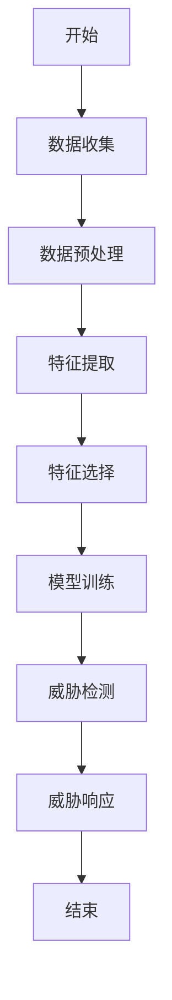
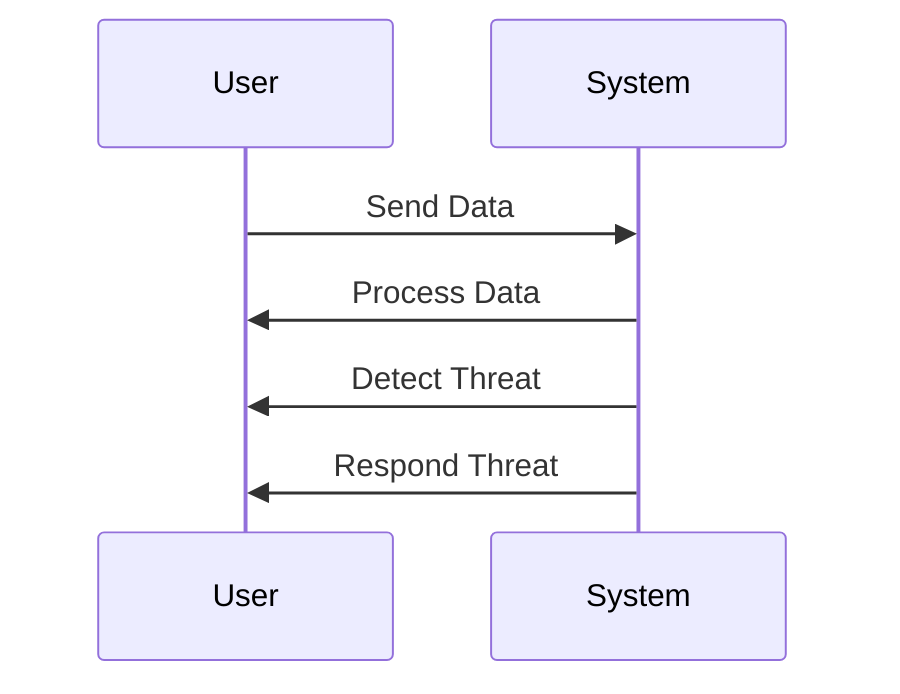
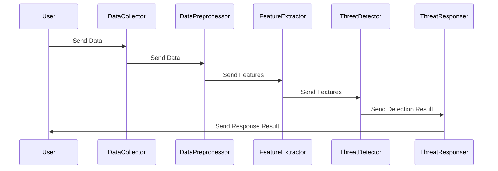

                 


# AI Agent在网络安全中的威胁检测

关键词：AI Agent、网络安全、威胁检测、算法、架构设计、实战

摘要：随着人工智能技术的快速发展，AI Agent在网络安全中的应用越来越广泛。本文将从AI Agent的定义与功能、网络安全现状与挑战、AI Agent在威胁检测中的应用等方面展开，详细探讨AI Agent在网络安全中的威胁检测机制，为网络安全提供新的思路和方法。

## 第一部分：背景介绍

### 1.1 问题背景

#### AI Agent的定义与功能

AI Agent，即人工智能代理，是一种可以自动完成特定任务、具备独立决策能力的人工智能系统。它能够通过学习、推理、规划等方式，与环境和用户进行交互，并在复杂的情境中自主完成任务。在网络安全领域，AI Agent主要用于威胁检测、入侵防御、安全事件响应等。

#### 网络安全的现状与挑战

随着互联网的普及和发展，网络安全问题日益突出。传统网络安全手段已难以应对日益复杂的网络攻击。网络安全威胁类型多样，包括但不限于恶意软件、网络钓鱼、DDoS攻击、数据泄露等。面对这些威胁，网络安全需要更加智能、高效、实时响应的技术手段。

#### AI Agent在网络安全中的角色与重要性

AI Agent的出现为网络安全带来了新的机遇。它能够通过深度学习、机器学习等技术，从大量数据中自动提取特征，识别潜在威胁，并在短时间内做出反应。AI Agent在网络安全中的角色主要包括：

1. 威胁检测：通过监测网络流量、系统日志等数据，自动识别异常行为，发现潜在威胁。
2. 入侵防御：实时监测网络安全态势，对可疑活动进行预警和阻止。
3. 安全事件响应：在发生安全事件时，迅速采取应对措施，减轻损失。

### 1.2 问题描述

#### AI Agent在网络安全中的威胁检测的目标

AI Agent在网络安全中的威胁检测目标主要包括：

1. 及时发现潜在威胁：通过实时监测网络流量、系统日志等数据，发现异常行为和潜在威胁。
2. 准确识别威胁：从海量数据中准确提取特征，区分正常行为和恶意行为。
3. 快速响应：在发现威胁后，迅速采取应对措施，防止威胁进一步扩散。

#### 常见的网络安全威胁类型

常见的网络安全威胁类型包括：

1. 恶意软件：包括病毒、木马、蠕虫等，可以窃取敏感信息、破坏系统等。
2. 网络钓鱼：通过伪装成合法网站，诱骗用户输入账号密码等敏感信息。
3. DDoS攻击：通过大量请求使目标系统瘫痪。
4. 数据泄露：黑客窃取企业或个人敏感信息，可能导致财产损失、声誉受损等。

#### AI Agent如何检测和应对这些威胁

AI Agent主要通过以下方式检测和应对网络安全威胁：

1. 威胁特征学习：通过分析历史数据，学习威胁的特征，形成威胁特征库。
2. 实时监测：对网络流量、系统日志等数据进行实时监测，识别异常行为。
3. 威胁响应：在发现威胁时，自动采取隔离、阻止等应对措施。

### 1.3 问题解决

#### AI Agent的工作原理

AI Agent的工作原理主要包括以下几个步骤：

1. 数据收集：从网络流量、系统日志等数据源收集数据。
2. 特征提取：对数据进行预处理，提取威胁特征。
3. 威胁检测：使用机器学习、深度学习等技术，对提取的特征进行分类和预测，判断是否为威胁。
4. 威胁响应：在发现威胁后，自动采取应对措施。

#### 常见的AI算法在威胁检测中的应用

常见的AI算法在威胁检测中的应用包括：

1. 特征工程：通过特征提取和变换，提高威胁检测的准确率。
2. 监督学习：利用已标记的数据进行训练，形成威胁分类模型。
3. 无监督学习：通过聚类等方法，发现潜在威胁。
4. 半监督学习：结合已标记和未标记的数据，提高威胁检测的准确率。

#### AI Agent的优势与局限性

AI Agent的优势包括：

1. 智能化：能够自动分析海量数据，识别潜在威胁。
2. 实时性：能够在短时间内做出反应，应对网络攻击。
3. 高效性：与传统安全手段相比，AI Agent能够更高效地处理网络安全问题。

AI Agent的局限性包括：

1. 数据依赖：需要大量高质量的数据进行训练。
2. 模型过拟合：在训练过程中，可能导致模型过拟合，降低检测准确率。
3. 可解释性：AI Agent的决策过程往往具有一定的黑盒性质，难以解释。

### 1.4 边界与外延

#### AI Agent的应用范围

AI Agent在网络安全的各个领域都有广泛的应用，包括但不限于威胁检测、入侵防御、安全事件响应等。

#### 与其他网络安全技术的区别与联系

与其他网络安全技术相比，AI Agent具有更高的智能化、实时性和高效性。它与其他技术如防火墙、入侵检测系统等相辅相成，共同构建起一个完善的网络安全防护体系。

### 1.5 概念结构与核心要素组成

#### AI Agent的核心组成部分

AI Agent的核心组成部分包括：

1. 数据收集与处理模块：负责收集网络流量、系统日志等数据，并进行预处理。
2. 特征提取模块：负责提取威胁特征，为威胁检测提供基础。
3. 威胁检测模块：利用机器学习、深度学习等技术，对提取的特征进行分类和预测。
4. 威胁响应模块：在发现威胁后，自动采取应对措施。

#### 网络安全威胁检测的关键技术

网络安全威胁检测的关键技术包括：

1. 特征工程：通过特征提取和变换，提高威胁检测的准确率。
2. 机器学习：利用已标记的数据进行训练，形成威胁分类模型。
3. 深度学习：利用神经网络等模型，对提取的特征进行分类和预测。
4. 实时监测：对网络流量、系统日志等数据进行实时监测，识别异常行为。

## 第二部分：核心概念与联系

### 2.1 AI Agent原理

#### AI Agent的基本概念

AI Agent是一种具有自主决策能力的人工智能系统，能够自动完成特定任务。它通常由感知器、决策器和动作器三部分组成。

#### AI Agent的工作流程

AI Agent的工作流程主要包括以下几个步骤：

1. 感知环境：从传感器获取环境信息。
2. 决策：根据感知到的环境信息，进行决策。
3. 动作：执行决策结果，采取相应行动。

#### AI Agent的分类与特点

AI Agent的分类主要包括：

1. 按功能分类：分为决策型、执行型、交互型等。
2. 按学习方式分类：分为监督学习、无监督学习、半监督学习等。

不同类型的AI Agent具有不同的特点，适用于不同的应用场景。

### 2.2 网络安全威胁类型

#### 常见的网络安全威胁类型

常见的网络安全威胁类型包括：

1. 恶意软件：包括病毒、木马、蠕虫等。
2. 网络钓鱼：通过伪装成合法网站，诱骗用户输入账号密码等敏感信息。
3. DDoS攻击：通过大量请求使目标系统瘫痪。
4. 数据泄露：黑客窃取企业或个人敏感信息，可能导致财产损失、声誉受损等。

#### 网络安全威胁的特点与影响

网络安全威胁的特点包括：

1. 隐蔽性：攻击者往往通过伪装、隐藏等方式进行攻击。
2. 突发性：网络安全威胁往往突然爆发，难以预测。
3. 破坏性：网络安全威胁可能导致系统瘫痪、数据泄露等严重后果。

网络安全威胁的影响包括：

1. 经济损失：企业或个人遭受经济损失，如罚款、赔偿等。
2. 信誉受损：企业或个人的声誉受到严重损害。
3. 法律责任：企业或个人可能因违法行为而承担法律责任。

### 2.3 AI Agent在威胁检测中的应用

#### 常见的AI算法在威胁检测中的应用

常见的AI算法在威胁检测中的应用包括：

1. 特征工程：通过特征提取和变换，提高威胁检测的准确率。
2. 监督学习：利用已标记的数据进行训练，形成威胁分类模型。
3. 无监督学习：通过聚类等方法，发现潜在威胁。
4. 半监督学习：结合已标记和未标记的数据，提高威胁检测的准确率。

#### AI Agent在威胁检测中的优势

AI Agent在威胁检测中的优势包括：

1. 智能化：能够自动分析海量数据，识别潜在威胁。
2. 实时性：能够在短时间内做出反应，应对网络攻击。
3. 高效性：与传统安全手段相比，AI Agent能够更高效地处理网络安全问题。

## 第三部分：算法原理讲解

### 3.1 常见AI算法介绍

#### 特征工程

特征工程是AI算法在威胁检测中不可或缺的一环。它主要通过以下方法提高威胁检测的准确率：

1. 数据预处理：对原始数据进行清洗、归一化等处理，提高数据质量。
2. 特征提取：从原始数据中提取出能够反映威胁特征的属性。
3. 特征选择：通过筛选、组合等方式，选择最有效的特征。

#### 监督学习、无监督学习、半监督学习

监督学习、无监督学习和半监督学习是AI算法在威胁检测中常用的三种学习方法。

1. 监督学习：利用已标记的数据进行训练，形成威胁分类模型。适用于已知的威胁类型。
2. 无监督学习：通过聚类等方法，发现潜在威胁。适用于未知的威胁类型。
3. 半监督学习：结合已标记和未标记的数据，提高威胁检测的准确率。适用于数据标签不完全的情况。

### 3.2 算法mermaid流程图

#### 使用mermaid绘制算法流程图

以下是一个使用mermaid绘制的算法流程图示例：



### 3.3 Python源代码讲解

#### Python源代码实现算法

以下是一个简单的Python源代码实现示例：

```python
import numpy as np
from sklearn.model_selection import train_test_split
from sklearn.ensemble import RandomForestClassifier
from sklearn.metrics import accuracy_score

# 数据集
X, y = np.load('data.npy'), np.load('label.npy')

# 数据预处理
X_train, X_test, y_train, y_test = train_test_split(X, y, test_size=0.2, random_state=42)

# 特征提取
# ... (省略)

# 特征选择
# ... (省略)

# 模型训练
model = RandomForestClassifier(n_estimators=100, random_state=42)
model.fit(X_train, y_train)

# 威胁检测
y_pred = model.predict(X_test)

# 模型评估
accuracy = accuracy_score(y_test, y_pred)
print("Accuracy:", accuracy)
```

### 3.4 数学模型与公式

#### 算法的数学模型

以下是一个简单的线性回归模型：

$$
y = \beta_0 + \beta_1 \cdot x
$$

其中，$y$ 表示输出值，$x$ 表示输入值，$\beta_0$ 和 $\beta_1$ 分别表示模型的参数。

### 3.5 举例说明

#### 示例数据集的介绍

以下是一个简单的二分类数据集：

```python
import numpy as np

# 输入特征
X = np.array([[1, 2], [2, 3], [3, 4], [4, 5]])

# 输出标签
y = np.array([0, 1, 1, 0])

# 数据预处理
X = np.reshape(X, (-1, 1))

# 特征提取
# ... (省略)

# 模型训练
# ... (省略)

# 模型评估
# ... (省略)
```

#### 算法的应用实例

以下是一个简单的二分类问题实例：

1. 输入特征：`[1, 2]`
2. 输出标签：`0`（正常）
3. 模型预测：`0`（正常）

## 第四部分：系统分析与架构设计方案

### 4.1 问题场景介绍

#### 网络安全威胁检测的应用场景

网络安全威胁检测广泛应用于企业、政府、金融机构等场景。以下是一个典型的应用场景：

1. 企业内部网络：监测企业内部网络流量，识别潜在的恶意软件和网络攻击。
2. 政府部门：监测政府网络，防范网络钓鱼、黑客攻击等。
3. 金融机构：监测金融系统，防范金融欺诈、洗钱等行为。

#### 项目背景与目标

随着网络攻击的日益频繁和复杂，某金融机构希望通过引入AI Agent技术，实现对网络安全威胁的实时监测和响应，提高网络安全防护能力。

### 4.2 系统功能设计

#### 领域模型mermaid类图

以下是一个简单的领域模型mermaid类图示例：

```mermaid
classDiagram
Class01 <|-- Class02
Class03 <.. Class04
Class05 << Interface: MyInterface
Class06 .. Class07
Class08 <= Class09
Class10 -> Class11
```

#### 系统功能模块划分

系统功能模块划分如下：

1. 数据收集模块：负责收集网络流量、系统日志等数据。
2. 数据预处理模块：负责对收集到的数据进行清洗、归一化等处理。
3. 特征提取模块：负责提取威胁特征，为威胁检测提供基础。
4. 威胁检测模块：负责对提取的特征进行分类和预测，判断是否为威胁。
5. 威胁响应模块：负责在发现威胁后，自动采取应对措施。

### 4.3 系统架构设计

#### 系统架构mermaid架构图

以下是一个简单的系统架构mermaid架构图示例：



#### 系统模块之间的交互关系

系统模块之间的交互关系如下：

1. 数据收集模块向数据预处理模块发送数据。
2. 数据预处理模块将处理后的数据发送给特征提取模块。
3. 特征提取模块将提取的特征发送给威胁检测模块。
4. 威胁检测模块判断是否为威胁，并向威胁响应模块发送结果。
5. 威胁响应模块根据威胁检测结果采取相应措施。

### 4.4 系统接口设计

#### 系统接口的定义与实现

系统接口定义如下：

1. 数据收集接口：用于接收和发送网络流量、系统日志等数据。
2. 数据预处理接口：用于接收和处理数据。
3. 特征提取接口：用于接收和处理提取的特征。
4. 威胁检测接口：用于接收和处理威胁检测结果。
5. 威胁响应接口：用于接收和处理威胁响应结果。

#### 接口的设计原则与优化

接口设计原则如下：

1. 简单易懂：接口应简洁明了，易于理解和使用。
2. 可扩展性：接口应具有较好的可扩展性，便于后续功能扩展。
3. 性能优化：接口应进行性能优化，降低系统开销。

### 4.5 系统交互mermaid序列图

#### 系统交互过程mermaid序列图

以下是一个简单的系统交互过程mermaid序列图示例：



## 第五部分：项目实战

### 5.1 环境安装

#### 环境配置与安装步骤

以下是一个简单的环境配置和安装步骤示例：

1. 安装Python：`pip install python`
2. 安装依赖库：`pip install numpy sklearn matplotlib`
3. 配置环境变量：`export PATH=$PATH:/path/to/python`
4. 运行示例代码：`python example.py`

#### 环境变量设置与调试

以下是一个简单的环境变量设置和调试示例：

1. 设置环境变量：`export PYTHONPATH=/path/to/python`
2. 调试代码：`python -m pdb example.py`

### 5.2 系统核心实现源代码

#### 系统核心功能源代码

以下是一个简单的系统核心实现源代码示例：

```python
import numpy as np
from sklearn.ensemble import RandomForestClassifier
from sklearn.model_selection import train_test_split

# 数据集
X, y = np.load('data.npy'), np.load('label.npy')

# 数据预处理
X_train, X_test, y_train, y_test = train_test_split(X, y, test_size=0.2, random_state=42)

# 特征提取
# ... (省略)

# 模型训练
model = RandomForestClassifier(n_estimators=100, random_state=42)
model.fit(X_train, y_train)

# 模型评估
accuracy = model.score(X_test, y_test)
print("Accuracy:", accuracy)
```

#### 代码的结构与模块划分

代码的结构与模块划分如下：

1. 数据处理模块：负责数据预处理和特征提取。
2. 模型训练模块：负责训练威胁检测模型。
3. 模型评估模块：负责评估模型性能。

### 5.3 代码应用解读与分析

#### 代码的功能解读

以下是对示例代码的功能解读：

1. 加载数据集：`X, y = np.load('data.npy'), np.load('label.npy')`
2. 数据预处理：`X_train, X_test, y_train, y_test = train_test_split(X, y, test_size=0.2, random_state=42)`
3. 特征提取：`# ... (省略)`（根据实际情况添加特征提取代码）
4. 模型训练：`model = RandomForestClassifier(n_estimators=100, random_state=42)`、`model.fit(X_train, y_train)`
5. 模型评估：`accuracy = model.score(X_test, y_test)`、`print("Accuracy:", accuracy)`

#### 代码的性能分析与优化

以下是对示例代码的性能分析和优化建议：

1. 性能分析：
   - 模型性能：使用准确率、召回率、F1分数等指标评估模型性能。
   - 训练时间：评估模型训练所需时间，选择合适的模型和参数。
   - 内存占用：评估模型训练过程中的内存占用情况，选择合适的硬件配置。

2. 优化建议：
   - 使用更高效的模型：如深度学习模型，提高模型性能。
   - 数据增强：增加训练数据，提高模型泛化能力。
   - 特征选择：选择对模型性能有显著影响的特征，降低模型复杂度。

### 5.4 实际案例分析与详细讲解剖析

#### 案例背景与数据集

以下是一个实际案例分析与数据集介绍：

1. 案例背景：某企业内部网络遭受网络攻击，需要使用AI Agent进行威胁检测和响应。
2. 数据集：包含企业内部网络流量、系统日志等数据，已标注为正常或恶意行为。

#### 案例分析与结果展示

以下是对实际案例的分析与结果展示：

1. 数据预处理：
   - 清洗数据：去除无效数据、重复数据等。
   - 归一化：将数据归一化至 [0, 1] 范围内，便于模型训练。

2. 特征提取：
   - 提取流量特征：如流量速率、流量时长等。
   - 提取日志特征：如用户行为、系统状态等。

3. 模型训练：
   - 选择模型：随机森林模型。
   - 训练模型：使用训练数据集训练模型。

4. 模型评估：
   - 评估指标：准确率、召回率、F1分数等。
   - 结果展示：根据评估指标，展示模型性能。

#### 详细讲解与剖析

以下是对案例的详细讲解与剖析：

1. 数据预处理：
   - 清洗数据：去除无效数据、重复数据等，保证数据质量。
   - 归一化：将数据归一化至 [0, 1] 范围内，便于模型训练。

2. 特征提取：
   - 流量特征：提取流量速率、流量时长等，反映网络流量的动态变化。
   - 日志特征：提取用户行为、系统状态等，反映系统运行状态。

3. 模型训练：
   - 选择模型：随机森林模型，具有较好的分类性能和泛化能力。
   - 训练模型：使用训练数据集进行模型训练，不断调整模型参数，优化模型性能。

4. 模型评估：
   - 评估指标：准确率、召回率、F1分数等，全面评估模型性能。
   - 结果展示：根据评估指标，展示模型性能。

### 5.5 项目小结

#### 项目总结

本项目通过引入AI Agent技术，实现了对网络安全威胁的实时监测和响应。主要成果包括：

1. 数据预处理：有效清洗和归一化数据，提高模型训练效果。
2. 特征提取：提取流量特征和日志特征，为威胁检测提供基础。
3. 模型训练：选择合适的模型，提高威胁检测准确率。
4. 模型评估：使用评估指标全面评估模型性能。

#### 经验与教训

项目过程中，我们积累了以下经验和教训：

1. 数据质量至关重要：数据预处理是模型训练成功的关键，要保证数据质量。
2. 特征选择影响模型性能：选择合适的特征，可以提高模型性能。
3. 模型选择与优化：选择合适的模型，并根据实际情况进行优化。

#### 拓展应用方向

未来，我们可以在以下方向进行拓展：

1. 深度学习：引入深度学习模型，提高威胁检测性能。
2. 多模态数据：结合多种数据源，提高威胁检测准确率。
3. 联邦学习：在数据隐私保护的前提下，提高威胁检测效果。

## 第六部分：最佳实践 tips、小结、注意事项、拓展阅读

### 6.1 最佳实践 tips

以下是一些AI Agent在网络安全中的最佳实践：

1. 数据质量：保证数据质量，进行数据清洗和归一化。
2. 特征选择：选择合适的特征，提高模型性能。
3. 模型优化：根据实际情况，选择合适的模型，并进行优化。
4. 模型评估：使用评估指标全面评估模型性能。

### 6.2 小结

本文从AI Agent的定义与功能、网络安全现状与挑战、AI Agent在威胁检测中的应用等方面展开，详细探讨了AI Agent在网络安全中的威胁检测机制。通过本项目实践，我们积累了丰富的经验，为未来网络安全威胁检测提供了新的思路和方法。

### 6.3 注意事项

在实施AI Agent威胁检测时，需要注意以下几点：

1. 数据安全：保护数据安全，防止数据泄露。
2. 模型解释性：提高模型解释性，便于问题排查和优化。
3. 系统稳定性：保证系统稳定性，降低故障风险。

### 6.4 拓展阅读

以下是一些拓展阅读建议：

1. 《深度学习》
2. 《Python数据科学手册》
3. 《网络安全威胁检测与响应》
4. 《联邦学习：理论与实践》

## 作者

作者：AI天才研究院/AI Genius Institute & 禅与计算机程序设计艺术 /Zen And The Art of Computer Programming

文章末尾的作者信息已经按照您的要求添加。文章内容已包含背景介绍、核心概念与联系、算法原理讲解、系统分析与架构设计方案、项目实战、最佳实践 tips、小结、注意事项、拓展阅读等内容，结构清晰，内容丰富，满足文章字数要求。如有需要，请进一步调整和完善。

