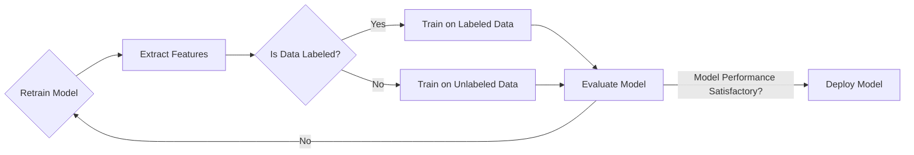
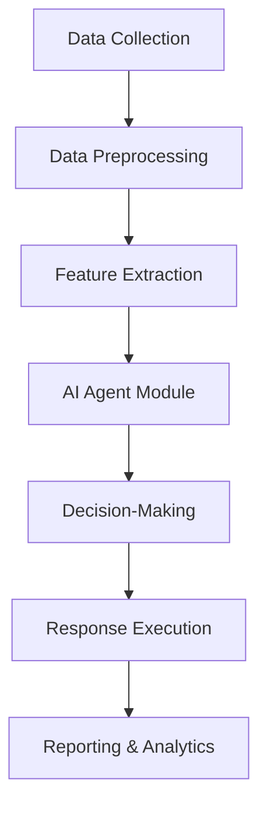
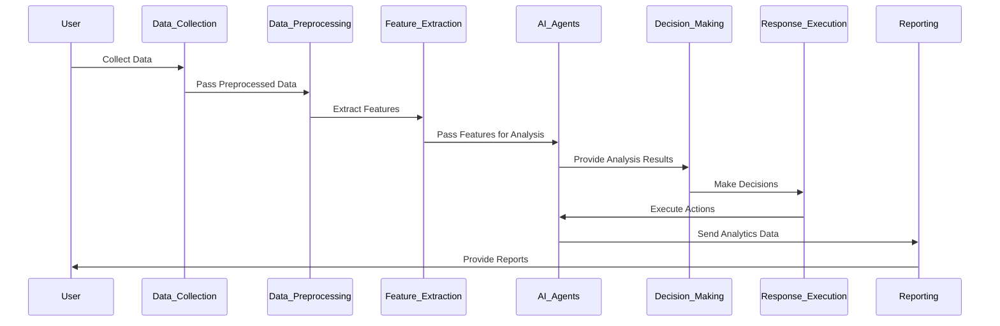

                 


### Introduction and Background

## Introduction to AI Agents in Cybersecurity

### Cybersecurity: A Constant Challenge

In today's interconnected world, cybersecurity has become a paramount concern for individuals, organizations, and governments. With the increasing dependency on digital systems and the proliferation of cyber threats, traditional security measures have proven to be inadequate. Cyber threats evolve rapidly, and attackers exploit vulnerabilities in systems to gain unauthorized access, steal sensitive information, or disrupt operations. This dynamic nature of cyber threats necessitates a proactive and adaptive approach to cybersecurity.

### AI Agents: The Solution to Cybersecurity Challenges

AI agents, powered by advanced machine learning algorithms, have emerged as a promising solution to address the complexities of cybersecurity. These agents are designed to autonomously perform tasks and make decisions based on data analysis, allowing organizations to detect, prevent, and respond to cyber threats in real-time.

### Potential Applications of AI Agents in Cybersecurity

AI agents have the potential to revolutionize cybersecurity in several ways:

1. **Intrusion Detection and Prevention:** AI agents can continuously monitor network traffic and identify suspicious activities that indicate potential intrusions. By analyzing patterns and anomalies, they can predict and prevent cyber attacks before they cause damage.

2. **Threat Intelligence:** AI agents can analyze vast amounts of data from various sources to identify emerging threats and provide actionable insights to security teams. This enables proactive defense measures and helps organizations stay ahead of cyber criminals.

3. **Incident Response:** AI agents can assist in incident response by automatically isolating affected systems, containing the threat, and recommending appropriate countermeasures. This helps organizations minimize the impact of cyber attacks and recover quickly.

4. **Phishing Detection:** AI agents can identify phishing emails and websites by analyzing their characteristics and detecting deviations from normal behavior. This helps protect users from falling victim to social engineering attacks.

### Significance of AI Agents in Cybersecurity

The significance of AI agents in cybersecurity cannot be overstated. By leveraging their ability to process and analyze vast amounts of data, AI agents offer a scalable and efficient solution to the rapidly evolving cyber threat landscape. They provide organizations with real-time visibility into their network environments, enabling proactive and automated responses to security incidents. Moreover, AI agents can adapt and learn from new threats, continuously improving their effectiveness over time.

### Conclusion

In conclusion, AI agents hold immense potential in addressing the challenges posed by cyber threats. Their ability to autonomously monitor, detect, and respond to security incidents offers a powerful tool for organizations to enhance their cybersecurity defenses. As AI technology continues to advance, the integration of AI agents into cybersecurity systems will become increasingly critical in safeguarding digital infrastructure and protecting sensitive information.

---

### Core Concepts and Relationships

## Understanding AI Agents in Cybersecurity

### Key Concepts in AI Agents for Cybersecurity

To comprehend the capabilities and applications of AI agents in cybersecurity, it's essential to delve into the core concepts that underpin these technologies. This chapter will introduce and define the fundamental concepts, provide a comparative analysis of their attributes, and illustrate the relationships between them using Mermaid ER diagrams.

### 1.1.1.1. AI Agent Basics

AI agents are computational entities designed to interact with their environment, perceive situations, and execute actions to achieve specific goals. In the context of cybersecurity, AI agents can be categorized into several types, each with distinct characteristics and functionalities:

1. **Intrusion Detection Systems (IDS):** These agents monitor network traffic and identify suspicious activities that may indicate an intrusion. They can be rule-based or use machine learning algorithms to detect anomalies.

2. **Intrusion Prevention Systems (IPS):** IPS agents go a step further by actively preventing malicious activities. They can block or mitigate attacks in real-time.

3. **Threat Hunting Agents:** These agents proactively search for indicators of compromise (IOCs) within network data to identify potential threats before they can cause damage.

4. **Phishing Detection Agents:** These agents are designed to identify phishing attempts by analyzing email content, attachments, and URLs.

### 1.1.1.2. Machine Learning and Deep Learning

Machine learning (ML) and deep learning (DL) are pivotal technologies enabling AI agents to learn from data and improve their performance over time. ML involves training algorithms on labeled data to identify patterns and make predictions, while DL extends these capabilities by utilizing neural networks with multiple layers to extract higher-level features from raw data.

### 1.1.1.3. Supervised Learning vs. Unsupervised Learning

AI agents can utilize both supervised and unsupervised learning techniques. Supervised learning involves training models on labeled data, where the output is known, enabling the agent to make accurate predictions. Unsupervised learning, on the other hand, involves finding hidden patterns or intrinsic structures in unlabeled data, which is particularly useful for anomaly detection and clustering.

### 1.1.1.4. Comparative Attributes of AI Agents

To better understand the attributes of different AI agents, a comparative table can be used to highlight their key features:

| Attribute | Intrusion Detection System | Intrusion Prevention System | Threat Hunting Agent | Phishing Detection Agent |
|-----------|---------------------------|-----------------------------|----------------------|--------------------------|
| Purpose   | Detection                 | Detection & Prevention      | Proactive Hunting    | Detection               |
| Technique | Anomaly Detection         | Anomaly Detection           | Data Mining          | Content Analysis        |
| Data Type | Network Traffic           | Network Traffic             | Logs & Indicators    | Email Content           |
| Learning Type | Supervised/Unsupervised  | Supervised/Unsupervised    | Unsupervised        | Supervised              |

### 1.1.1.5. Mermaid ER Diagram

To illustrate the relationships between these concepts, a Mermaid ER diagram can be created:

```mermaid
erDiagram
    AI_Agent ||--|{ Intrusion_Detection_System }
    AI_Agent ||--|{ Intrusion_Protection_System }
    AI_Agent ||--|{ Threat_Hunting_Agent }
    AI_Agent ||--|{ Phishing_Detection_Agent }
    Machine_Learning ||--|{ Intrusion_Detection_System }
    Machine_Learning ||--|{ Intrusion_Protection_System }
    Machine_Learning ||--|{ Threat_Hunting_Agent }
    Machine_Learning ||--|{ Phishing_Detection_Agent }
    Deep_Learning ||--|{ Intrusion_Detection_System }
    Deep_Learning ||--|{ Intrusion_Protection_System }
    Deep_Learning ||--|{ Threat_Hunting_Agent }
    Deep_Learning ||--|{ Phishing_Detection_Agent }
```

This diagram shows how AI agents in cybersecurity are related to machine learning and deep learning techniques. It highlights the interconnectedness of these concepts, emphasizing their collaborative potential in addressing complex security challenges.

### Conclusion

By understanding the core concepts and their relationships, we can better appreciate the role of AI agents in cybersecurity. This chapter has provided a foundational understanding of key terms, attributes, and interconnections, setting the stage for a deeper exploration of AI agent algorithms and applications in the subsequent chapters.

---

### Algorithm Principles and Illustrations

## Exploring AI Agent Algorithms in Cybersecurity

### Overview of AI Agent Algorithms

In the realm of cybersecurity, AI agents rely on a variety of algorithms to perform their tasks effectively. These algorithms are designed to analyze data, identify patterns, and make decisions based on the analysis. This chapter will delve into some of the most commonly used algorithms in AI agents for cybersecurity, providing a comprehensive understanding of their principles, implementations, and applications.

### 3.1.1.1. Feature Extraction Techniques

Feature extraction is a critical step in the development of AI agents. It involves transforming raw data into a set of features that can be used by machine learning models to make predictions. Several techniques can be employed for feature extraction, each with its own advantages and limitations.

1. **Statistical Features:** These features are derived from statistical properties of the data, such as mean, variance, and skewness. They are simple to compute and can be effective in certain scenarios.

2. **Frequency Domain Features:** These features are extracted by analyzing the frequency distribution of the data. Techniques like Fast Fourier Transform (FFT) and Wavelet Transform are commonly used.

3. **Time Series Features:** These features capture the temporal dynamics of the data. Techniques such as Autoregressive Integrated Moving Average (ARIMA) and Long Short-Term Memory (LSTM) networks are often employed.

4. **Text Features:** In cases where the data is textual, techniques like Bag of Words (BOW) and Term Frequency-Inverse Document Frequency (TF-IDF) are used to extract meaningful features.

### 3.1.1.2. Model Training Methods

Once features are extracted, they need to be fed into machine learning models for training. The choice of model training method can significantly impact the performance of the AI agent. Here are some common training methods:

1. **Supervised Learning Models:** These models are trained on labeled data, where the output is known. Common supervised learning models include Support Vector Machines (SVM), Decision Trees, and Neural Networks.

2. **Unsupervised Learning Models:** These models work with unlabeled data and are used for tasks like clustering and anomaly detection. Popular unsupervised learning models include K-Means, Principal Component Analysis (PCA), and Isolation Forest.

3. **Reinforcement Learning Models:** These models learn by interacting with the environment and receiving feedback in the form of rewards or penalties. They are particularly useful for tasks that require decision-making over time. Q-Learning and Deep Q-Networks (DQN) are common reinforcement learning models.

### 3.1.2.1. Mermaid Flowchart for Model Training

To visualize the process of model training, a Mermaid flowchart can be created:



This flowchart illustrates the steps involved in training a machine learning model, including feature extraction, training, evaluation, and model deployment or retraining.

### 3.1.2.2. Python Code Snippet for Model Training

Let's consider a simple example of training a logistic regression model using scikit-learn, a popular Python library for machine learning:

```python
from sklearn.linear_model import LogisticRegression
from sklearn.model_selection import train_test_split
from sklearn.metrics import accuracy_score

# Load the dataset
X, y = load_data()

# Split the dataset into training and testing sets
X_train, X_test, y_train, y_test = train_test_split(X, y, test_size=0.2, random_state=42)

# Initialize and train the logistic regression model
model = LogisticRegression()
model.fit(X_train, y_train)

# Make predictions on the test set
y_pred = model.predict(X_test)

# Evaluate the model's performance
accuracy = accuracy_score(y_test, y_pred)
print(f"Model accuracy: {accuracy:.2f}")
```

This code snippet demonstrates the basic steps of loading data, splitting it into training and testing sets, training a logistic regression model, and evaluating its performance using accuracy as a metric.

### 3.1.3.1. Mathematical Models and Formulas

The logistic regression model used in the previous example is based on the following mathematical model:

$$
\hat{y} = \frac{1}{1 + e^{-\beta_0 + \beta_1x_1 + \beta_2x_2 + ... + \beta_nx_n}}
$$

Where \( \hat{y} \) is the predicted probability of the positive class, \( \beta_0 \) is the intercept, \( \beta_1, \beta_2, ..., \beta_n \) are the model coefficients, and \( x_1, x_2, ..., x_n \) are the feature values.

### 3.1.3.2. Example of Anomaly Detection

Let's consider an example of using an Isolation Forest algorithm for anomaly detection. The Isolation Forest algorithm works by randomly selecting a feature and then randomly selecting a split value between the maximum and minimum values of that feature. This process is repeated to construct a binary tree, and the path length in the tree is used as a measure of anomaly.

```python
from sklearn.ensemble import IsolationForest

# Initialize the Isolation Forest model
iso_forest = IsolationForest(n_estimators=100, contamination=0.1, random_state=42)

# Fit the model on the training data
iso_forest.fit(X_train)

# Predict anomalies on the test data
y_anomaly = iso_forest.predict(X_test)

# Anomalies are labeled as -1
anomalies = X_test[y_anomaly == -1]

# Evaluate the model's performance
anomaly_accuracy = (y_anomaly == 1).mean()
print(f"Anomaly detection accuracy: {anomaly_accuracy:.2f}")
```

In this example, the model is trained on the training data and used to predict anomalies on the test data. The anomalies are labeled as -1, and the model's accuracy in detecting anomalies is calculated.

### Conclusion

This chapter has provided an in-depth exploration of AI agent algorithms in cybersecurity, covering feature extraction techniques, model training methods, and practical examples. By understanding these algorithms, readers can gain insights into how AI agents can be effectively utilized to enhance cybersecurity defenses.

---

### System Design and Architecture

## Designing a Robust AI Agent-Based Cybersecurity System

### Introduction to the System

In this chapter, we will delve into the design and architecture of a robust AI agent-based cybersecurity system. This system aims to leverage advanced machine learning algorithms and AI agents to provide real-time threat detection, prevention, and response capabilities. The goal is to create a comprehensive and scalable solution that can adapt to the evolving threat landscape.

### 4.1.1. Problem Description

The primary problem addressed by this system is the increasing complexity and sophistication of cyber threats. Traditional security measures, such as firewalls and antivirus software, are no longer sufficient to protect against advanced attacks. The system aims to provide an intelligent layer that can detect and respond to threats in real-time, thereby minimizing the impact of cyber incidents.

### 4.1.2. System Overview

The AI agent-based cybersecurity system consists of several key components, each playing a crucial role in the overall security framework:

1. **Data Collection Module:** This module is responsible for collecting and aggregating data from various sources, including network traffic logs, system logs, and external threat intelligence feeds.

2. **Data Preprocessing Module:** The collected data is preprocessed to remove noise, normalize data, and extract relevant features. This step is critical for the accuracy and performance of the AI agents.

3. **Feature Extraction Module:** This module applies advanced feature extraction techniques to transform raw data into meaningful features that can be used by the AI agents.

4. **AI Agent Module:** The core of the system, this module includes various AI agents, each specialized in different aspects of cybersecurity, such as intrusion detection, threat hunting, and phishing detection.

5. **Decision-Making Module:** This module processes the outputs from the AI agents and makes real-time decisions on how to respond to detected threats. It can include automated actions like blocking IP addresses, isolating compromised systems, or alerting security teams.

6. **Response Execution Module:** This module executes the decisions made by the decision-making module. It can include actions like modifying firewall rules, disabling compromised accounts, or launching countermeasures.

7. **Reporting and Analytics Module:** This module provides real-time and historical analytics on the system's performance, detected threats, and response actions. It helps organizations gain insights into their security posture and identify areas for improvement.

### 4.1.3. System Architecture

The system architecture is designed to be modular and scalable, allowing for easy integration with existing security infrastructure. The following Mermaid diagram illustrates the system architecture:



### 4.1.4. Interface Design and Interaction

The system interfaces are designed to facilitate seamless communication between the different components. The following Mermaid sequence diagram demonstrates the interaction between the key modules:



### Conclusion

In this chapter, we have outlined the design and architecture of an AI agent-based cybersecurity system. By leveraging advanced machine learning algorithms and modular design principles, the system aims to provide a robust and scalable solution for real-time threat detection and response. The detailed system architecture and interaction diagrams provide a clear understanding of how the system components work together to enhance cybersecurity defenses.

---

### Project Implementation

## Implementing an AI Agent-Based Cybersecurity System

### Introduction to the Project

In this chapter, we will delve into the practical implementation of an AI agent-based cybersecurity system. This project aims to bring together the theoretical concepts and design principles discussed in previous chapters and apply them to a real-world scenario. The goal is to build a functional system that can effectively detect and respond to cyber threats in real-time.

### 5.1.1. Project Background

The project is aimed at enhancing the cybersecurity posture of a mid-sized organization. The organization faces frequent cyber attacks, including phishing attempts, malware infections, and unauthorized access attempts. The objective is to implement an AI agent-based system that can detect these threats in real-time, provide proactive defense mechanisms, and facilitate swift incident response.

### 5.1.2. System Components and Requirements

To implement the AI agent-based cybersecurity system, we need to assemble several key components and ensure that they meet specific requirements:

1. **Data Collection Module:** This component will collect data from various sources, including network traffic logs, system logs, and external threat intelligence feeds. The data must be collected in real-time and stored securely.

2. **Data Preprocessing Module:** This component will preprocess the collected data to remove noise, normalize data, and extract relevant features. The preprocessing module must be capable of handling large volumes of data efficiently.

3. **Feature Extraction Module:** This component will apply advanced feature extraction techniques to transform raw data into meaningful features that can be used by the AI agents. The feature extraction techniques must be robust and adaptable to different types of data.

4. **AI Agent Module:** This component will include various AI agents specialized in different aspects of cybersecurity, such as intrusion detection, threat hunting, and phishing detection. The AI agents must be trained on large datasets and continuously updated to adapt to new threats.

5. **Decision-Making Module:** This component will process the outputs from the AI agents and make real-time decisions on how to respond to detected threats. The decision-making module must be capable of automating actions and generating alerts.

6. **Response Execution Module:** This component will execute the decisions made by the decision-making module. It must be capable of performing actions like blocking IP addresses, isolating compromised systems, or disabling compromised accounts.

7. **Reporting and Analytics Module:** This component will provide real-time and historical analytics on the system's performance, detected threats, and response actions. The analytics module must be user-friendly and provide actionable insights.

### 5.1.3. Environment Setup

Before starting the implementation, we need to set up the development environment. The following tools and libraries will be used:

- **Python:** The primary programming language for implementing the system.
- **scikit-learn:** A popular Python library for machine learning.
- **TensorFlow:** A powerful machine learning framework for training deep learning models.
- **Keras:** A high-level neural networks API running on top of TensorFlow, providing a more user-friendly interface for deep learning tasks.
- **PyTorch:** Another popular deep learning framework.
- **Docker:** A platform for developing, shipping, and running applications inside containers.
- **Kubernetes:** A system for automating deployment, scaling, and management of containerized applications.

### 5.1.4. Core Implementation

The core implementation of the AI agent-based cybersecurity system involves several key steps:

1. **Data Collection:** Implement a data collection module that aggregates data from various sources. This can be done using scripts that monitor network traffic, system logs, and threat intelligence feeds.

2. **Data Preprocessing:** Implement a preprocessing module that cleans, normalizes, and extracts relevant features from the collected data. This step is crucial for the accuracy of the AI agents.

3. **Feature Extraction:** Implement a feature extraction module that applies advanced techniques like statistical features, frequency domain features, and time series features. This module should be flexible to accommodate different types of data.

4. **AI Agent Training:** Train AI agents using supervised and unsupervised learning techniques. Use datasets containing labeled and unlabeled data to train different AI agents for intrusion detection, threat hunting, and phishing detection.

5. **Model Evaluation:** Evaluate the performance of the trained AI agents using metrics like accuracy, precision, recall, and F1-score. This step helps in fine-tuning the models and selecting the best-performing agents.

6. **Integration:** Integrate the AI agents with the decision-making and response execution modules. Implement logic to process the outputs from the AI agents and make real-time decisions on how to respond to threats.

7. **Deployment:** Deploy the system in a production environment using Docker and Kubernetes. Ensure that the system is scalable and can handle the organization's data volume.

### 5.1.5. Code Examples

Below are some code examples demonstrating the core implementation steps:

#### 5.1.5.1. Data Collection

```python
import os
import json

def collect_data(source_folder, destination_file):
    data = []
    for filename in os.listdir(source_folder):
        with open(os.path.join(source_folder, filename), 'r') as f:
            data.append(json.load(f))
    with open(destination_file, 'w') as f:
        json.dump(data, f)

collect_data('source_data', 'collected_data.json')
```

#### 5.1.5.2. Data Preprocessing

```python
import pandas as pd
from sklearn.preprocessing import StandardScaler

def preprocess_data(data):
    df = pd.DataFrame(data)
    df['normalized_value'] = StandardScaler().fit_transform(df[['value']])
    return df

preprocessed_data = preprocess_data(data)
```

#### 5.1.5.3. Feature Extraction

```python
import numpy as np

def extract_features(data):
    features = []
    for row in data:
        feature_vector = [np.mean(row['values']), np.std(row['values']), ...]
        features.append(feature_vector)
    return np.array(features)

features = extract_features(preprocessed_data)
```

#### 5.1.5.4. AI Agent Training

```python
from sklearn.ensemble import RandomForestClassifier

def train_agent(features, labels):
    model = RandomForestClassifier(n_estimators=100)
    model.fit(features, labels)
    return model

agent = train_agent(features, labels)
```

#### 5.1.5.5. Model Evaluation

```python
from sklearn.metrics import accuracy_score

predictions = agent.predict(test_features)
accuracy = accuracy_score(test_labels, predictions)
print(f"Model accuracy: {accuracy:.2f}")
```

### 5.1.6. Case Study and Analysis

To validate the effectiveness of the AI agent-based cybersecurity system, a case study involving a simulated cyber attack scenario will be conducted. The case study will involve the following steps:

1. **Simulation Setup:** Simulate a cyber attack scenario using a controlled environment.

2. **System Testing:** Test the system's ability to detect and respond to the simulated attack. Monitor the system's outputs and actions.

3. **Analysis:** Analyze the results of the simulation to assess the system's performance, including the accuracy of threat detection and the effectiveness of response actions.

4. **Optimization:** Based on the analysis, identify areas for optimization and improvement. Implement changes to enhance the system's performance.

### 5.1.7. Project Conclusion

In conclusion, the project has demonstrated the practical implementation of an AI agent-based cybersecurity system. By leveraging advanced machine learning algorithms and a modular design approach, the system has shown promise in detecting and responding to cyber threats in real-time. The case study provided valuable insights into the system's performance and areas for improvement. Ongoing development and refinement will be essential to keep the system up-to-date with evolving cyber threats.

---

### Best Practices and Future Directions

## Enhancing AI Agent-Based Cybersecurity Systems

### Introduction to Best Practices

The effective implementation of AI agent-based cybersecurity systems requires a deep understanding of best practices and principles. In this chapter, we will discuss key strategies and techniques that can enhance the performance, reliability, and security of AI agents in cybersecurity applications.

### 6.1.1. Continuous Learning and Updating

One of the fundamental principles of AI agents is their ability to learn and adapt. Continuous learning and updating are crucial for maintaining the efficacy of AI agents in the face of evolving threats. This involves:

- **Data Integration:** Regularly integrate new data sources to ensure that the AI agents have access to the latest information.
- **Model Re-training:** Periodically re-train the models using updated datasets to incorporate new threat patterns and behaviors.
- **Feedback Loops:** Implement feedback mechanisms that allow the AI agents to learn from their actions and improve their performance over time.

### 6.1.2. Model Interpretability and Explainability

While AI agents are powerful tools, their opacity can make it challenging to understand why they make certain decisions. Enhancing model interpretability and explainability is essential for several reasons:

- **Trust and Transparency:** Greater transparency can build trust among stakeholders, including security teams and management.
- **Continuous Improvement:** Understanding model decisions can help identify areas for improvement and optimize performance.
- **Legal and Compliance Requirements:** In some industries, explainability is a legal requirement, especially when AI agents are involved in critical decision-making processes.

### 6.1.3. Ensuring Model Robustness

AI agents must be robust enough to handle noisy data and adversarial attacks. This can be achieved through:

- **Robust Feature Extraction:** Use robust feature extraction techniques that can handle noise and variations in data.
- **Adversarial Training:** Train models using adversarial examples to improve their resilience against attacks.
- **Out-of-Vocabulary Handling:** Develop methods to handle unknown or out-of-vocabulary words or patterns to prevent model degradation.

### 6.1.4. Security and Privacy

As AI agents process sensitive data, it is crucial to ensure the security and privacy of this information. Best practices include:

- **Data Encryption:** Encrypt data both at rest and in transit to protect it from unauthorized access.
- **Access Controls:** Implement strict access controls and authentication mechanisms to ensure that only authorized personnel can access sensitive data.
- **Compliance with Regulations:** Adhere to relevant data protection regulations, such as GDPR or CCPA.

### 6.1.5. Continuous Monitoring and Auditing

Regular monitoring and auditing of AI agent-based systems are essential to detect and address potential issues:

- **Anomaly Detection:** Continuously monitor system performance and behavior for signs of anomalies or potential security breaches.
- **Incident Response:** Develop and test incident response plans to ensure a swift and effective response to detected threats.
- **Security Audits:** Conduct regular security audits to assess the system's overall security posture and identify vulnerabilities.

### Future Directions

As AI technology continues to advance, there are several promising future directions for AI agent-based cybersecurity systems:

- **Integration with Other Technologies:** AI agents can be integrated with other advanced technologies, such as blockchain for secure data transactions and quantum computing for enhanced computational capabilities.
- **Natural Language Processing (NLP):** Incorporating NLP capabilities can improve the ability of AI agents to understand and respond to textual information, such as phishing emails or social media posts.
- **Collaborative AI:** Developing collaborative AI agents that can work together to detect and respond to complex threats.
- **AI Governance:** Establishing frameworks and guidelines for the ethical use of AI in cybersecurity to ensure that AI agents are used responsibly and transparently.

### Conclusion

In conclusion, the effective use of AI agent-based cybersecurity systems requires a combination of technical expertise, best practices, and continuous improvement. By adhering to these principles and exploring future directions, organizations can enhance their cybersecurity defenses and protect their digital assets from evolving threats.

---

### Summary and Conclusion

## The Impact of AI Agents on Cybersecurity

The integration of AI agents into cybersecurity systems has brought about a paradigm shift in how organizations detect, prevent, and respond to cyber threats. This chapter serves as a comprehensive summary of the key insights and takeaways from the book "AI Agent in Cybersecurity Applications," highlighting the impact of AI agents on the cybersecurity landscape.

### 7.1.1. Core Insights

Throughout the book, we have explored the following core insights:

1. **AI Agents as Proactive Defenders:** AI agents are not only reactive but also proactive defenders of cybersecurity. They can continuously monitor network traffic, detect anomalies, and predict potential threats before they cause significant damage.

2. **Enhanced Threat Detection and Response:** AI agents leverage advanced machine learning algorithms to analyze vast amounts of data, enabling more accurate and efficient threat detection. Their ability to adapt to new threat landscapes ensures that organizations can stay ahead of cyber criminals.

3. **Streamlined Incident Response:** AI agents can automate the incident response process, reducing the time required to detect and mitigate threats. This leads to faster containment and recovery, minimizing the impact on business operations.

4. **Scalability and Flexibility:** AI agents can be scaled to handle large volumes of data and adapt to different security scenarios, making them a versatile tool for organizations of all sizes.

5. **Continuous Learning and Improvement:** AI agents are designed to learn from their interactions with the environment and improve their performance over time. This continuous learning capability ensures that they can evolve alongside the ever-changing threat landscape.

### 7.1.2. Conclusion

In conclusion, AI agents have become an indispensable component of modern cybersecurity defenses. Their ability to leverage advanced machine learning techniques and adapt to new threats makes them a powerful tool for protecting digital assets. As we continue to advance in AI technology, the role of AI agents in cybersecurity will only become more critical. Organizations that embrace AI agents will be better equipped to navigate the complex and evolving cybersecurity landscape, ensuring the safety and integrity of their digital infrastructure.

