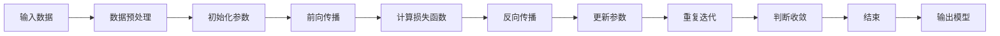
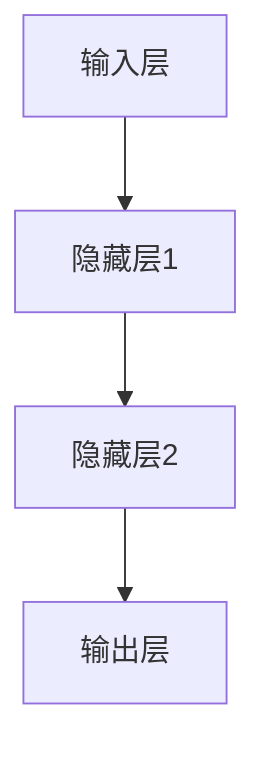
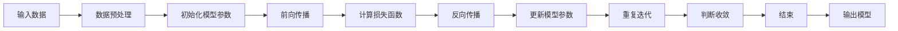
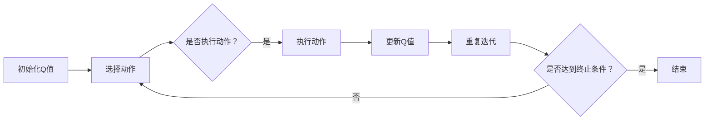
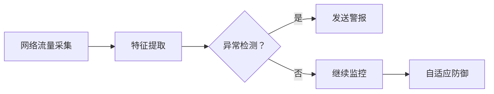
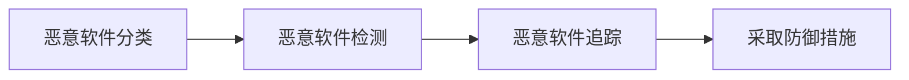
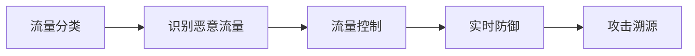

                 

# AI Agent在网络安全防御中的应用

> 关键词：AI Agent、网络安全、入侵检测、恶意软件分析、DDoS攻击防御

> 摘要：本文将深入探讨人工智能代理（AI Agent）在网络安全防御中的应用。通过分析AI Agent的基本概念、技术原理以及实现方法，本文将阐述如何在网络安全防御中利用AI技术增强防御能力，应对日益复杂的网络威胁。文章将分为四个部分，分别介绍AI Agent的背景、技术原理、应用场景以及最佳实践。

### 综述

#### 背景介绍与概念解析

在当今数字化时代，网络安全问题日益突出。传统的网络安全防御手段已经无法应对日益复杂和多样化的网络攻击。随着人工智能技术的发展，人工智能代理（AI Agent）逐渐成为网络安全防御的重要工具。AI Agent是一种能够自主决策和执行任务的智能体，具有学习、适应和优化的能力。本文将围绕AI Agent在网络安全防御中的应用进行深入探讨。

#### AI Agent的核心概念与原理

AI Agent是指能够自主执行任务、具有学习能力和适应能力的智能体。AI Agent可以分为多种类型，如基于规则的方法、基于决策树的方法、基于深度学习的方法等。本文将介绍AI Agent的基本概念、技术原理以及其在网络安全防御中的作用。

#### AI Agent技术原理讲解

AI Agent的技术原理主要包括机器学习、深度学习和强化学习。这些算法为AI Agent提供了自主学习和决策的能力。本文将详细讲解这些算法的基本原理，并通过代码示例进行说明。

#### AI Agent在网络安全防御中的应用

AI Agent在网络安全防御中具有广泛的应用场景，如入侵检测、恶意软件分析和DDoS攻击防御等。本文将分别介绍这些应用场景中的具体实现方法和实际案例。

#### 最佳实践与总结

最后，本文将总结AI Agent在网络安全防御中的最佳实践，并展望未来发展趋势。通过本文的讨论，读者可以更好地理解AI Agent在网络安全防御中的应用价值，并学会如何利用AI技术提升网络安全防御能力。

### 第一部分：背景介绍与概念解析

#### 第1章：问题背景与AI Agent概述

##### 1.1 问题背景：网络安全防御面临的挑战

随着互联网的快速发展，网络攻击手段也日益复杂和多样化。传统的网络安全防御手段已经无法满足当前的安全需求。以下是一些网络安全防御面临的主要挑战：

1. **高级持续性威胁（APT）**：APT攻击通常由有组织的黑客团队发起，具有长期性和隐蔽性。他们能够长期潜伏在网络中，窃取敏感数据或执行恶意操作。
2. **零日漏洞攻击**：零日漏洞攻击是指攻击者利用尚未被发现或公开的漏洞发起攻击。由于传统防御手段依赖于已知的漏洞信息，因此难以防范此类攻击。
3. **勒索软件攻击**：勒索软件通过加密受害者的数据，然后要求支付赎金才能解密。这种攻击手段对个人和企业都造成了巨大的经济损失。
4. **DDoS攻击**：分布式拒绝服务攻击（DDoS）通过大量无效请求使目标服务器过载，导致正常用户无法访问。这种攻击手段常用于网络敲诈或恶意竞争。

##### 1.2 AI Agent的定义与分类

AI Agent是指能够自主执行任务、具有学习能力和适应能力的智能体。根据不同的分类标准，AI Agent可以分为多种类型：

1. **基于规则的AI Agent**：这类Agent通过预定义的规则进行决策和行动。它们适用于处理确定性问题和已知模式的问题。
2. **基于决策树的AI Agent**：这类Agent使用决策树来模拟人类的决策过程。它们能够处理复杂的问题，并从历史数据中学习优化决策。
3. **基于深度学习的AI Agent**：这类Agent使用深度神经网络来模拟人类的思维过程。它们具有强大的学习和泛化能力，适用于处理大规模、高维度的问题。
4. **基于强化学习的AI Agent**：这类Agent通过与环境交互，学习最优策略。它们适用于动态环境，能够自主调整行动策略。

##### 1.3 AI Agent在网络安全防御中的作用

AI Agent在网络安全防御中具有多种作用，如下所示：

1. **入侵检测与防御**：AI Agent可以通过分析网络流量、系统日志等数据，识别潜在的入侵行为，并及时采取防御措施。
2. **恶意软件分析与防御**：AI Agent可以通过对恶意软件的特征和行为进行分析，识别并阻止恶意软件的传播和执行。
3. **DDoS攻击防御**：AI Agent可以通过实时监控网络流量，识别并过滤异常流量，防止DDoS攻击对目标服务器造成过载。
4. **异常行为检测与响应**：AI Agent可以通过学习正常行为模式，识别异常行为，并及时采取相应的响应措施。

##### 1.4 本章小结

本章介绍了网络安全防御面临的挑战以及AI Agent的基本概念和分类。通过了解AI Agent的定义和作用，读者可以更好地理解AI Agent在网络安全防御中的应用前景。

### 第二部分：AI Agent的核心概念与原理

#### 第2章：AI Agent的基本概念

##### 2.1 AI Agent的定义

AI Agent是指一种具有自主决策能力、能够与环境进行交互并执行任务的智能体。它可以是一个虚拟的实体，如机器人或软件代理，也可以是一个物理实体，如无人机或自动驾驶汽车。AI Agent的关键特征包括：

1. **自主性**：AI Agent能够根据预定的目标和环境信息，自主做出决策和执行任务。
2. **适应性**：AI Agent能够从环境中学习，并根据经验调整其行为。
3. **交互性**：AI Agent能够与环境进行交互，获取环境信息，并反馈执行结果。
4. **目标导向性**：AI Agent具有明确的目标，并致力于实现这些目标。

##### 2.2 AI Agent的技术原理

AI Agent的技术原理主要依赖于机器学习、深度学习和强化学习等人工智能算法。以下是对这些算法的简要介绍：

1. **机器学习**：机器学习是指通过数据驱动的方法，让计算机从数据中学习规律和模式，并利用这些规律进行预测和决策。机器学习可以分为监督学习、无监督学习和半监督学习等不同类型。
2. **深度学习**：深度学习是机器学习的一个子领域，它通过模拟人脑的神经网络结构，学习数据的层次化表示。深度学习在图像识别、语音识别和自然语言处理等领域取得了显著的成果。
3. **强化学习**：强化学习是一种通过试错和反馈机制，让智能体在动态环境中学习最优策略的方法。强化学习在自动驾驶、游戏AI和机器人控制等领域具有广泛的应用。

##### 2.3 AI Agent的属性特征对比表格

以下是一个AI Agent属性特征对比表格，展示了不同类型的AI Agent在自主性、适应性、交互性和目标导向性等方面的差异：

| AI Agent类型 | 自主性 | 适应性 | 交互性 | 目标导向性 |
| :----: | :----: | :----: | :----: | :----: |
| 基于规则的AI Agent | 高 | 低 | 低 | 中 |
| 基于决策树的AI Agent | 中 | 中 | 中 | 中 |
| 基于深度学习的AI Agent | 高 | 高 | 高 | 高 |
| 基于强化学习的AI Agent | 中 | 高 | 高 | 高 |

##### 2.4 AI Agent的ER实体关系图

以下是一个AI Agent的ER实体关系图，展示了AI Agent、环境、目标和学习过程之间的关系：

```mermaid
erDiagram
AI_Agent ||--o{ Environment : 监控并交互 }
AI_Agent ||--o{ Goal : 指导行为 }
AI_Agent ||--o{ Learning_Process : 学习与优化 }
```

##### 2.5 本章小结

本章介绍了AI Agent的基本概念、技术原理以及属性特征对比。通过本章的学习，读者可以更好地理解AI Agent的工作原理和其在网络安全防御中的应用潜力。

### 第三部分：AI Agent技术原理讲解

#### 第3章：机器学习基础

##### 3.1 机器学习概述

机器学习是人工智能的核心技术之一，它使计算机系统能够从数据中学习，并利用学习到的知识进行预测和决策。机器学习的基本概念包括：

1. **训练数据**：训练数据是指用于训练机器学习模型的输入数据。这些数据通常包含特征和标签，特征表示数据的属性，标签表示数据的分类或预测结果。
2. **模型**：模型是指用于描述数据规律和模式的数学模型。常见的模型包括线性模型、决策树、神经网络等。
3. **损失函数**：损失函数是用于评估模型预测结果与真实标签之间的差异的函数。常见的损失函数包括均方误差、交叉熵等。
4. **优化算法**：优化算法是用于调整模型参数，使模型预测结果更接近真实标签的算法。常见的优化算法包括梯度下降、随机梯度下降等。

##### 3.2 数据预处理

数据预处理是机器学习过程中至关重要的一步，它包括以下任务：

1. **数据清洗**：数据清洗是指去除数据中的错误、缺失和重复值。常见的清洗方法包括删除、填充和插补等。
2. **特征工程**：特征工程是指从原始数据中提取有用的特征，并构造新的特征。常见的特征工程方法包括特征选择、特征转换和特征组合等。
3. **归一化**：归一化是指将不同特征的数据进行统一处理，使它们的值落在同一范围内。常见的归一化方法包括最小-最大缩放、标准缩放等。

##### 3.3 常见机器学习算法

机器学习算法可以分为监督学习、无监督学习和半监督学习等类型。以下介绍一些常见的机器学习算法：

1. **线性回归**：线性回归是一种用于预测连续值的线性模型。它的目标是最小化预测值与真实值之间的差异。线性回归的数学模型可以表示为：
   $$
   y = \beta_0 + \beta_1x_1 + \beta_2x_2 + \ldots + \beta_nx_n
   $$
   其中，$y$是预测值，$x_1, x_2, \ldots, x_n$是特征值，$\beta_0, \beta_1, \ldots, \beta_n$是模型参数。

2. **逻辑回归**：逻辑回归是一种用于预测概率的二分类模型。它的目标是最小化预测概率与真实标签之间的差异。逻辑回归的数学模型可以表示为：
   $$
   \hat{y} = \frac{1}{1 + e^{-(\beta_0 + \beta_1x_1 + \beta_2x_2 + \ldots + \beta_nx_n)}}
   $$
   其中，$\hat{y}$是预测概率，$y$是真实标签，$x_1, x_2, \ldots, x_n$是特征值，$\beta_0, \beta_1, \ldots, \beta_n$是模型参数。

3. **支持向量机（SVM）**：支持向量机是一种用于分类的线性模型。它的目标是在特征空间中找到一个最佳的超平面，使分类边界最大化。支持向量机的数学模型可以表示为：
   $$
   w \cdot x + b = 0
   $$
   其中，$w$是权重向量，$x$是特征向量，$b$是偏置项。

4. **决策树**：决策树是一种基于树结构的分类模型。它的目标是通过递归划分特征空间，构建一个分类树。决策树的数学模型可以表示为：
   $$
   \text{如果 } x_{i_1} > v_{i_1} \text{，则选择 } T_{i_1} \\
   \text{如果 } x_{i_1} \leq v_{i_1} \text{，则选择 } T_{i_1}
   $$
   其中，$x_{i_1}$是特征值，$v_{i_1}$是阈值，$T_{i_1}$是子树。

##### 3.4 算法mermaid流程图展示

以下是一个线性回归算法的mermaid流程图：



##### 3.5 本章小结

本章介绍了机器学习的基本概念、数据预处理方法以及常见机器学习算法。通过本章的学习，读者可以了解机器学习的基本原理和应用方法，为后续章节的学习打下基础。

### 第四部分：AI Agent技术原理讲解

#### 第4章：深度学习在AI Agent中的应用

##### 4.1 深度学习概述

深度学习是机器学习的一个子领域，它通过构建多层神经网络，对数据进行层次化的特征学习和抽象。深度学习在图像识别、语音识别、自然语言处理等领域取得了显著的成果。以下是对深度学习的简要介绍：

1. **神经网络**：神经网络是一种由大量神经元组成的计算模型，通过模拟人脑的结构和功能，对数据进行处理和预测。神经网络可以分为多层，每层神经元都通过权重和偏置与下一层神经元相连。
2. **反向传播算法**：反向传播算法是一种用于训练神经网络的优化算法。它通过计算输出层与实际标签之间的误差，将误差反向传播到输入层，并更新网络中的权重和偏置，以最小化误差。
3. **激活函数**：激活函数是神经网络中用于引入非线性特性的函数。常见的激活函数包括ReLU（Rectified Linear Unit）、Sigmoid和Tanh等。
4. **损失函数**：损失函数是用于评估神经网络预测结果与实际标签之间差异的函数。常见的损失函数包括均方误差（MSE）、交叉熵（CE）等。

##### 4.2 神经网络结构

神经网络可以分为输入层、隐藏层和输出层。以下是一个简单的神经网络结构：



在神经网络中，每个层由多个神经元组成。神经元通过权重和偏置与下一层神经元相连，并采用激活函数引入非线性特性。神经元的输出通过加权求和和激活函数处理后，作为下一层的输入。

##### 4.3 深度学习算法mermaid流程图

以下是一个深度学习算法的mermaid流程图：



##### 4.4 Python代码示例与详细讲解

以下是一个简单的深度学习Python代码示例，使用TensorFlow框架实现：

```python
import tensorflow as tf

# 创建模型
model = tf.keras.Sequential([
    tf.keras.layers.Dense(64, activation='relu', input_shape=(784,)),
    tf.keras.layers.Dense(64, activation='relu'),
    tf.keras.layers.Dense(10, activation='softmax')
])

# 编写训练代码
model.compile(optimizer='adam',
              loss='categorical_crossentropy',
              metrics=['accuracy'])

# 加载训练数据
(x_train, y_train), (x_test, y_test) = tf.keras.datasets.mnist.load_data()

# 预处理数据
x_train = x_train / 255.0
x_test = x_test / 255.0

# 转换标签为one-hot编码
y_train = tf.keras.utils.to_categorical(y_train, 10)
y_test = tf.keras.utils.to_categorical(y_test, 10)

# 训练模型
model.fit(x_train, y_train, epochs=10, batch_size=32, validation_split=0.2)
```

在这个示例中，我们创建了一个包含两个隐藏层的简单神经网络，使用ReLU激活函数。我们使用MNIST手写数字数据集进行训练，并使用交叉熵损失函数和Adam优化器。预处理数据包括归一化和one-hot编码。训练过程中，我们设置了10个epochs，每个batch包含32个样本。

##### 4.5 本章小结

本章介绍了深度学习的基本概念、神经网络结构以及一个简单的深度学习Python代码示例。通过本章的学习，读者可以了解深度学习在AI Agent中的应用方法和实现过程。

### 第五部分：强化学习与AI Agent

#### 第5章：强化学习与AI Agent

##### 5.1 强化学习概述

强化学习（Reinforcement Learning，RL）是一种通过试错和反馈机制，让智能体在动态环境中学习最优策略的方法。强化学习的核心思想是通过奖励信号引导智能体采取正确的行为，从而在长期的交互过程中实现目标。强化学习的基本概念包括：

1. **智能体（Agent）**：智能体是指执行特定任务并从环境中获取反馈的实体。在强化学习中，智能体通常是一个软件程序或机器人。
2. **环境（Environment）**：环境是指智能体执行任务所处的动态情境。环境可以是一个物理环境，如机器人控制的场景，也可以是一个虚拟环境，如游戏模拟器。
3. **状态（State）**：状态是指智能体在某一时刻所处的环境特征集合。状态是强化学习中的核心概念，用于描述智能体的当前情境。
4. **动作（Action）**：动作是指智能体在某一状态下可以执行的行为。动作的选择会影响智能体在环境中的状态转移。
5. **奖励（Reward）**：奖励是环境对智能体动作的反馈信号。奖励可以是正奖励，表示智能体采取了正确的行为；也可以是负奖励，表示智能体采取了错误的行为。
6. **策略（Policy）**：策略是智能体在某一状态下选择动作的规则。策略通常是一个函数，用于将状态映射到动作。

##### 5.2 Q-learning算法

Q-learning是一种经典的强化学习算法，它通过迭代更新Q值函数来学习最优策略。Q值函数表示智能体在某一状态下执行某一动作的长期回报。Q-learning算法的基本步骤如下：

1. **初始化Q值函数**：初始化Q值函数为0或较小的随机值。
2. **选择动作**：根据当前状态和Q值函数，选择一个动作。
3. **执行动作**：在环境中执行所选动作，并观察状态转移和奖励。
4. **更新Q值**：根据当前状态、执行动作和观察到的奖励，更新Q值函数。更新公式为：
   $$
   Q(s, a) \leftarrow Q(s, a) + \alpha [r + \gamma \max_{a'} Q(s', a') - Q(s, a)]
   $$
   其中，$s$表示当前状态，$a$表示执行的动作，$r$表示观察到的奖励，$\gamma$表示折扣因子，$\alpha$表示学习率，$s'$表示状态转移后的状态，$a'$表示下一个动作。
5. **重复步骤2-4**：重复执行步骤2-4，直到达到指定的时间步或收敛条件。

##### 5.3 算法mermaid流程图与Python代码示例

以下是一个Q-learning算法的mermaid流程图：



以下是一个使用Python实现Q-learning算法的示例：

```python
import numpy as np
import random

# 初始化Q值函数
n_actions = 3
n_states = 4
Q = np.zeros([n_states, n_actions])
learning_rate = 0.1
discount_factor = 0.9

# Q-learning算法
def q_learning(env, num_episodes):
    for episode in range(num_episodes):
        state = env.reset()
        done = False

        while not done:
            action = np.argmax(Q[state])
            next_state, reward, done = env.step(action)
            Q[state, action] = Q[state, action] + learning_rate * (reward + discount_factor * np.max(Q[next_state]) - Q[state, action])
            state = next_state

    return Q

# 创建环境
env = Environment()

# 运行Q-learning算法
Q = q_learning(env, 1000)

# 测试Q-learning算法
state = env.reset()
done = False

while not done:
    action = np.argmax(Q[state])
    next_state, reward, done = env.step(action)
    print(f"状态：{state}，动作：{action}，奖励：{reward}，下一个状态：{next_state}")
    state = next_state
```

在这个示例中，我们创建了一个简单的环境，并使用Q-learning算法学习最优策略。在训练过程中，我们设置了学习率和折扣因子，并迭代更新Q值函数。在测试阶段，我们使用学习到的策略进行动作选择，并输出每一步的状态、动作和奖励。

##### 5.4 强化学习在AI Agent中的应用

强化学习在AI Agent中的应用非常广泛，以下是一些典型的应用场景：

1. **自动驾驶**：自动驾驶系统需要根据周围环境的信息，做出实时的驾驶决策。强化学习可以用于学习最优的驾驶策略，从而提高自动驾驶系统的安全性和稳定性。
2. **机器人控制**：机器人需要在复杂的动态环境中执行各种任务。强化学习可以帮助机器人学习最优的控制策略，提高其自主决策能力。
3. **游戏AI**：游戏AI需要根据游戏状态做出实时决策，以实现游戏目标。强化学习可以用于学习最优的游戏策略，提高游戏AI的表现。
4. **资源调度**：在云计算和大数据环境中，强化学习可以用于优化资源调度策略，提高资源利用率和服务质量。

##### 5.5 本章小结

本章介绍了强化学习的基本概念、Q-learning算法以及其在AI Agent中的应用。通过本章的学习，读者可以了解强化学习在AI Agent中的应用方法和实现过程，为后续章节的学习打下基础。

### 第六部分：AI Agent在网络安全防御中的应用

#### 第6章：入侵检测与防御

##### 6.1 入侵检测系统概述

入侵检测系统（Intrusion Detection System，IDS）是一种用于监控网络流量和系统活动，检测和防范入侵行为的网络安全技术。IDS可以按照检测方法分为基于特征的方法和基于行为的方法。

1. **基于特征的方法**：基于特征的方法是指通过预定义的入侵特征模式来检测入侵行为。这种方法需要大量的入侵样本进行训练，以建立入侵特征库。当网络流量或系统活动与入侵特征库中的特征匹配时，IDS会发出警报。

2. **基于行为的方法**：基于行为的方法是指通过监控网络流量和系统活动的行为模式，检测异常行为。这种方法不依赖于预定义的入侵特征，而是通过学习正常行为模式，识别出异常行为。当检测到异常行为时，IDS会发出警报。

##### 6.2 AI Agent在入侵检测中的应用

AI Agent在入侵检测中的应用主要体现在以下几个方面：

1. **特征提取**：AI Agent可以通过机器学习和深度学习算法，从网络流量和系统日志中提取有效的特征。这些特征可以用于训练入侵检测模型，提高检测的准确性和效率。

2. **异常检测**：AI Agent可以通过学习正常行为模式，识别出异常行为。当检测到异常行为时，AI Agent可以及时发出警报，并采取相应的防御措施。

3. **自适应防御**：AI Agent可以根据检测到的入侵行为，自动调整防御策略。例如，当检测到DDoS攻击时，AI Agent可以自动调整网络流量过滤策略，以防止攻击对目标系统造成影响。

##### 6.3 入侵检测mermaid流程图

以下是一个入侵检测的mermaid流程图：



##### 6.4 Python代码实现与案例剖析

以下是一个简单的入侵检测Python代码示例，使用Scikit-learn库实现基于特征的方法：

```python
from sklearn.ensemble import IsolationForest
from sklearn.model_selection import train_test_split
from sklearn.metrics import classification_report
import pandas as pd

# 加载入侵数据集
data = pd.read_csv('intrusion_data.csv')

# 分割特征和标签
X = data.drop('label', axis=1)
y = data['label']

# 划分训练集和测试集
X_train, X_test, y_train, y_test = train_test_split(X, y, test_size=0.2, random_state=42)

# 使用IsolationForest算法进行入侵检测
clf = IsolationForest(n_estimators=100, contamination='auto', behaviour='new')
clf.fit(X_train)

# 预测测试集
y_pred = clf.predict(X_test)

# 输出分类报告
print(classification_report(y_test, y_pred))
```

在这个示例中，我们使用IsolationForest算法进行入侵检测。IsolationForest算法是一种基于特征的方法，它通过随机森林模型检测异常值。在训练阶段，我们使用训练集对算法进行训练。在预测阶段，我们使用测试集进行预测，并输出分类报告。

##### 6.5 本章小结

本章介绍了入侵检测系统的基本概念、AI Agent在入侵检测中的应用以及一个简单的入侵检测Python代码示例。通过本章的学习，读者可以了解入侵检测的基本原理和应用方法，为后续章节的学习打下基础。

### 第七部分：AI Agent在网络安全防御中的应用

#### 第7章：恶意软件分析与防御

##### 7.1 恶意软件概述

恶意软件（Malware）是指专门设计用来破坏、窃取或篡改计算机系统数据的一类软件。恶意软件的种类繁多，包括病毒、木马、勒索软件、广告软件等。恶意软件的常见攻击手段如下：

1. **病毒**：病毒是一种能够自我复制并感染其他程序或文件的恶意软件。病毒可以通过电子邮件附件、下载的文件等途径传播，并可能导致系统崩溃、文件损坏等。
2. **木马**：木马是一种隐藏在合法程序中的恶意软件，它可以在用户不知情的情况下窃取用户信息或控制用户计算机。木马通常通过社交工程、恶意网站等途径传播。
3. **勒索软件**：勒索软件通过加密用户文件，然后要求用户支付赎金才能解密。勒索软件通常通过电子邮件、下载的文件等途径传播，对用户造成严重的经济损失。
4. **广告软件**：广告软件是一种在用户计算机上自动显示广告或修改浏览器设置的恶意软件。广告软件通常通过免费软件捆绑安装，影响用户的使用体验。

##### 7.2 AI Agent在恶意软件分析中的应用

AI Agent在恶意软件分析中的应用主要体现在以下几个方面：

1. **恶意软件分类**：AI Agent可以通过学习已知的恶意软件特征，对未知恶意软件进行分类。通过分类，可以快速识别恶意软件的类型和威胁程度。
2. **恶意软件检测**：AI Agent可以通过检测恶意软件的行为特征，识别并阻止恶意软件的传播和执行。行为特征包括恶意软件的运行过程、文件操作、网络通信等。
3. **恶意软件追踪**：AI Agent可以通过追踪恶意软件的传播途径，定位恶意软件的来源和传播渠道，以便采取相应的防御措施。

##### 7.3 恶意软件分析mermaid流程图

以下是一个恶意软件分析的mermaid流程图：



##### 7.4 Python代码实现与案例分析

以下是一个简单的恶意软件分析Python代码示例，使用基于行为的检测方法：

```python
import pandas as pd
from sklearn.ensemble import IsolationForest

# 加载恶意软件行为数据集
data = pd.read_csv('malware_behaviors.csv')

# 分割特征和标签
X = data.drop('label', axis=1)
y = data['label']

# 划分训练集和测试集
X_train, X_test, y_train, y_test = train_test_split(X, y, test_size=0.2, random_state=42)

# 使用IsolationForest算法进行恶意软件检测
clf = IsolationForest(n_estimators=100, contamination='auto', behaviour='new')
clf.fit(X_train)

# 预测测试集
y_pred = clf.predict(X_test)

# 输出分类报告
print(classification_report(y_test, y_pred))
```

在这个示例中，我们使用IsolationForest算法对恶意软件行为进行检测。IsolationForest算法通过检测异常行为来识别恶意软件。在训练阶段，我们使用训练集对算法进行训练。在预测阶段，我们使用测试集进行预测，并输出分类报告。

##### 7.5 本章小结

本章介绍了恶意软件的基本概念、AI Agent在恶意软件分析中的应用以及一个简单的恶意软件分析Python代码示例。通过本章的学习，读者可以了解恶意软件分析的基本原理和应用方法，为后续章节的学习打下基础。

### 第八部分：DDoS攻击防御

#### 第8章：DDoS攻击防御

##### 8.1 DDoS攻击概述

分布式拒绝服务攻击（DDoS，Distributed Denial of Service）是一种通过大量无效请求使目标服务器过载，导致正常用户无法访问的攻击手段。DDoS攻击的常见类型包括：

1. **TCP SYN Flood**：TCP SYN Flood攻击通过发送大量的TCP SYN请求，占用目标服务器的资源，导致其无法响应正常的请求。
2. **UDP Flood**：UDP Flood攻击通过发送大量的UDP数据包，占用目标服务器的网络带宽，导致其无法正常工作。
3. **HTTP Flood**：HTTP Flood攻击通过发送大量的HTTP请求，占用目标服务器的处理能力，导致其无法响应正常的请求。
4. **CC攻击**：CC攻击（Web应用层攻击）通过模拟正常用户的操作，占用目标服务器的Web应用层资源，导致其无法正常工作。

##### 8.2 AI Agent在DDoS攻击防御中的应用

AI Agent在DDoS攻击防御中的应用主要体现在以下几个方面：

1. **流量分类**：AI Agent可以通过对网络流量进行分类，识别出正常流量和恶意流量。通过对恶意流量的特征和行为进行分析，AI Agent可以识别出潜在的DDoS攻击。
2. **流量控制**：AI Agent可以根据识别出的恶意流量，采取相应的流量控制措施，如限制流量速率、过滤恶意请求等，以减轻DDoS攻击对目标服务器的影响。
3. **实时防御**：AI Agent可以通过实时监控网络流量，快速识别并响应DDoS攻击。在攻击发生时，AI Agent可以自动调整防御策略，以最大程度地保护目标服务器。
4. **攻击溯源**：AI Agent可以通过分析攻击流量，追踪攻击者的来源和攻击路径，以便采取进一步的防御措施。

##### 8.3 DDoS攻击防御mermaid流程图

以下是一个DDoS攻击防御的mermaid流程图：



##### 8.4 Python代码实现与案例讲解

以下是一个简单的DDoS攻击防御Python代码示例，使用基于流量的检测方法：

```python
import pandas as pd
from sklearn.ensemble import IsolationForest

# 加载网络流量数据集
data = pd.read_csv('network_traffic.csv')

# 分割特征和标签
X = data.drop('label', axis=1)
y = data['label']

# 划分训练集和测试集
X_train, X_test, y_train, y_test = train_test_split(X, y, test_size=0.2, random_state=42)

# 使用IsolationForest算法进行流量检测
clf = IsolationForest(n_estimators=100, contamination='auto', behaviour='new')
clf.fit(X_train)

# 预测测试集
y_pred = clf.predict(X_test)

# 输出分类报告
print(classification_report(y_test, y_pred))
```

在这个示例中，我们使用IsolationForest算法对网络流量进行检测。IsolationForest算法通过检测异常流量来识别DDoS攻击。在训练阶段，我们使用训练集对算法进行训练。在预测阶段，我们使用测试集进行预测，并输出分类报告。

##### 8.5 本章小结

本章介绍了DDoS攻击的基本概念、AI Agent在DDoS攻击防御中的应用以及一个简单的DDoS攻击防御Python代码示例。通过本章的学习，读者可以了解DDoS攻击防御的基本原理和应用方法，为后续章节的学习打下基础。

### 第九部分：最佳实践与总结

#### 第9章：AI Agent在网络安全防御中的最佳实践

##### 9.1 实践一：基于AI的异常流量检测

在网络安全防御中，异常流量检测是一项至关重要的任务。通过AI技术，可以实现对网络流量的实时监控和分析，从而识别潜在的威胁。最佳实践包括以下几个方面：

1. **数据收集与预处理**：收集网络流量数据，并进行预处理，如去除噪声、缺失值填充和特征提取等。
2. **模型选择与训练**：选择合适的机器学习模型，如聚类算法、异常检测算法等，进行模型训练。
3. **实时监控与警报**：将训练好的模型部署到生产环境中，实时监控网络流量，并设置阈值，当检测到异常流量时，及时发出警报。
4. **分析与响应**：对异常流量进行进一步分析，确定其是否为恶意流量，并根据情况采取相应的防御措施。

##### 9.2 实践二：自动化恶意软件防御

自动化恶意软件防御是利用AI技术对恶意软件进行快速识别和响应。最佳实践包括以下几个方面：

1. **特征库构建**：构建包含已知恶意软件特征的数据库，用于训练和更新恶意软件识别模型。
2. **行为分析**：对恶意软件的行为进行实时监控和分析，识别其异常行为特征。
3. **自动化响应**：当检测到恶意软件时，自动触发防御措施，如隔离感染主机、清除恶意代码等。
4. **持续更新**：定期更新恶意软件特征库和防御策略，以应对不断演变的恶意软件威胁。

##### 9.3 实践三：DDoS攻击实时防御

DDoS攻击的实时防御是保护网络安全的关键环节。最佳实践包括以下几个方面：

1. **流量监测**：实时监控网络流量，识别潜在的DDoS攻击流量。
2. **流量分类**：对网络流量进行分类，区分正常流量和攻击流量。
3. **流量过滤**：对攻击流量进行过滤和限制，减轻攻击对目标服务器的影响。
4. **策略调整**：根据攻击情况和防御效果，动态调整防御策略，以提高防御能力。

##### 9.4 注意事项与挑战

在实施AI Agent在网络安全防御中的最佳实践时，需要注意以下几点：

1. **数据隐私与安全**：确保在数据收集、存储和使用过程中，遵守相关法律法规，保护用户隐私。
2. **模型解释性**：提高AI模型的解释性，以便于理解和追踪模型的决策过程。
3. **实时性能**：确保AI Agent的实时性能，以满足网络安全防御的快速响应需求。
4. **持续更新**：定期更新AI模型和防御策略，以应对新的威胁和攻击手段。

##### 9.5 本章小结

本章总结了AI Agent在网络安全防御中的最佳实践，包括异常流量检测、恶意软件防御和DDoS攻击实时防御。通过这些最佳实践，可以显著提高网络安全防御能力，应对日益复杂的网络威胁。

### 第十部分：总结与展望

#### 第10章：总结与展望

##### 10.1 AI Agent在网络安全防御中的价值

AI Agent在网络安全防御中具有重要的价值。通过引入AI技术，可以显著提高网络安全防御的智能化、自动化和适应性。以下是对AI Agent在网络安全防御中价值的具体分析：

1. **实时监测与响应**：AI Agent可以实时监控网络流量、系统活动和用户行为，快速识别潜在威胁，并采取相应的防御措施。
2. **自适应防御策略**：AI Agent可以根据攻击类型、攻击频率和攻击规模等因素，自适应调整防御策略，提高防御效果。
3. **异常行为检测**：AI Agent可以基于学习到的正常行为模式，识别出异常行为，从而发现潜在的攻击行为。
4. **恶意软件防御**：AI Agent可以通过学习恶意软件的特征和行为，快速识别并阻止恶意软件的传播和执行。
5. **高效资源利用**：AI Agent可以优化资源分配和任务调度，提高网络安全防御系统的运行效率。

##### 10.2 未来发展趋势

未来，AI Agent在网络安全防御领域将继续发展，以下是一些可能的发展趋势：

1. **深度学习与强化学习**：深度学习和强化学习等技术将继续在AI Agent中发挥作用，提高其智能水平和防御效果。
2. **联邦学习**：联邦学习技术可以使AI Agent在保护用户隐私的同时，实现跨设备的协同学习和防御。
3. **可解释AI**：可解释AI技术将有助于提高AI模型的透明度和可信度，便于用户理解和监督。
4. **云原生AI**：随着云计算技术的发展，AI Agent将在云端实现更高效、可扩展的部署和管理。
5. **多方协作**：AI Agent将与其他安全设备、系统和组织实现多方协作，形成更强大的安全防御体系。

##### 10.3 拓展阅读与深入研究

为了更深入地了解AI Agent在网络安全防御中的应用，读者可以参考以下拓展阅读资源：

1. **论文**：《AI in Cybersecurity: A Review》和《Deep Learning for Cybersecurity: A Survey》等论文。
2. **书籍**：《AI for Cybersecurity》和《Reinforcement Learning for Cybersecurity》等书籍。
3. **开源项目**：如Google的Cyber Threat Intelligence Platform和OpenAI的Gym环境等。
4. **在线课程**：如Coursera上的《Machine Learning for Data Science》和《Reinforcement Learning》等课程。

##### 10.4 本章小结

本章总结了AI Agent在网络安全防御中的价值、未来发展趋势以及拓展阅读资源。通过本章的讨论，读者可以更好地了解AI Agent在网络安全防御中的应用前景，并为未来的研究和实践提供参考。

### 附录：工具与资源列表

#### 附录1：常用AI工具与框架

1. **TensorFlow**：Google开发的开源机器学习框架，支持深度学习和强化学习等算法。
2. **PyTorch**：Facebook开发的开源机器学习框架，支持深度学习和强化学习等算法。
3. **Scikit-learn**：Python机器学习库，提供多种机器学习算法的实现。
4. **Keras**：用于快速构建和训练深度学习模型的Python库。
5. **OpenAI Gym**：用于机器学习和强化学习研究的虚拟环境。

#### 附录2：网络安全资源与文献

1. **OWASP**：开放网络应用安全项目，提供网络安全资源和最佳实践。
2. **NIST**：美国国家标准与技术研究院，发布网络安全标准和指南。
3. **CVE**：公共漏洞和暴露列表，提供安全漏洞和威胁信息。
4. **SANS**：国际信息安全研究组织，提供网络安全培训和认证。
5. **Black Hat**：全球知名的安全会议，分享网络安全最新研究成果。

#### 附录3：编程语言与库资源

1. **Python**：Python是一种广泛应用于AI和网络安全领域的编程语言。
2. **Java**：Java是一种强大的编程语言，广泛应用于企业级网络安全应用。
3. **C++**：C++是一种高效的编程语言，常用于高性能网络安全应用开发。
4. **Go**：Go是一种适用于云计算和网络编程的编程语言。
5. **Rust**：Rust是一种系统级编程语言，注重安全性和性能。

