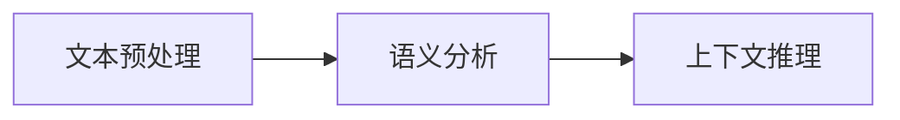
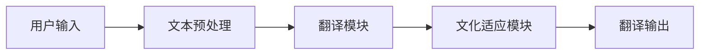
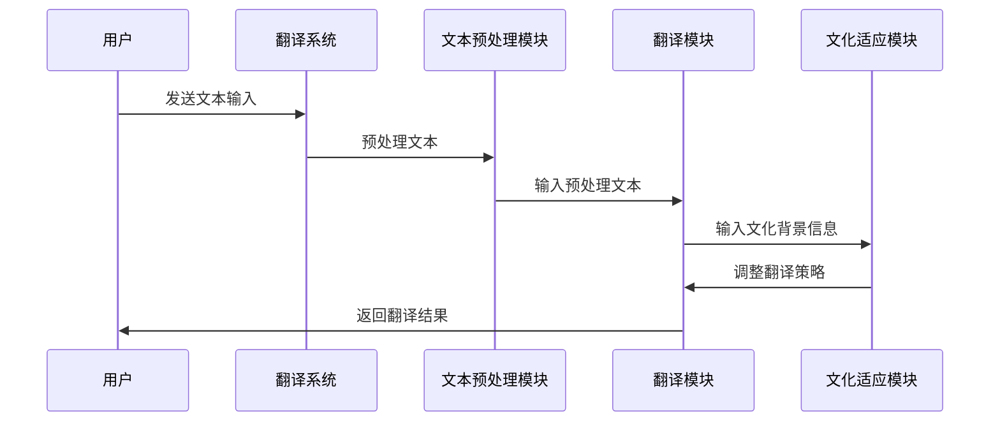
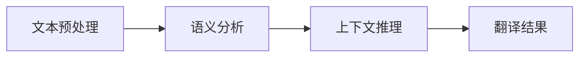
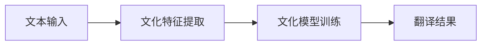
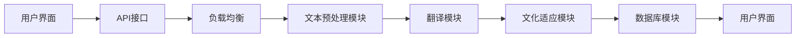
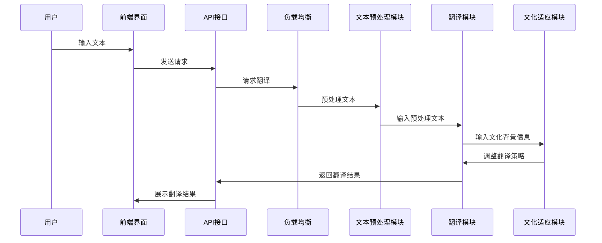
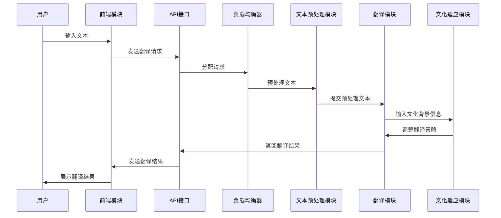

                 

# AI Agent在翻译领域的应用：上下文理解与文化适应

> 关键词：AI Agent、翻译、上下文理解、文化适应、算法原理

> 摘要：本文将深入探讨AI Agent在翻译领域的应用，特别是上下文理解和文化适应方面。我们将首先介绍AI翻译技术的发展背景，然后逐步分析AI Agent的核心概念，上下文理解机制，文化适应策略，算法原理，系统架构设计，以及通过实际项目案例来展示AI Agent翻译系统的实战应用。最后，我们将总结AI Agent翻译技术的最佳实践，展望其未来发展。

## 第一部分：背景介绍

### 第1章：AI Agent与翻译领域背景

#### 1.1 人工智能翻译技术发展背景

**1.1.1 翻译技术的发展历程**

翻译技术的发展可以追溯到人类文明的历史初期。早期的翻译主要是依靠人力进行，效率低下且存在误差。随着计算机科学的兴起，机器翻译逐渐成为一种可能。早期的机器翻译主要基于规则的方法，这种方法依赖于大量的预定义规则，然而随着翻译内容的复杂度增加，这种方法的局限性变得愈发明显。

**1.1.2 AI翻译技术的兴起**

随着深度学习技术的发展，AI翻译成为可能。2016年，谷歌翻译推出了基于神经网络的机器翻译系统，这标志着AI翻译时代的到来。神经网络翻译（NMT）通过深度学习模型，从海量数据中自动学习翻译规律，大幅提升了翻译质量。

**1.1.3 翻译领域对AI Agent的需求**

在全球化背景下，跨语言交流变得日益频繁。然而，传统的机器翻译系统在处理上下文理解和跨文化适应方面仍然存在不足。AI Agent的出现为翻译领域带来了新的希望，其上下文理解和文化适应能力有望解决传统机器翻译的痛点。

#### 1.2 翻译领域的主要挑战

**1.2.1 上下文理解**

上下文理解是翻译的关键所在。不同语言之间的语境、语气和情感差异很大，如何准确地捕捉和理解这些上下文信息，是AI翻译技术面临的重大挑战。

**1.2.2 文化适应**

文化适应是指翻译系统能够理解和适应用户的文化背景。不同文化之间的表达方式和价值观有很大差异，如何将这些差异正确地传达出来，是翻译领域的一大难题。

**1.2.3 边界条件与实际应用**

翻译系统在实际应用中面临着各种边界条件，如术语一致性、方言处理、多模态翻译等。这些边界条件要求翻译系统能够灵活应对，提供高质量的服务。

## 第二部分：核心概念与联系

### 第2章：AI Agent核心概念解析

#### 2.1 AI Agent的定义与特点

**2.1.1 AI Agent的定义**

AI Agent，即人工智能代理，是一种具有自主性和智能性的计算机程序，能够在特定的环境中进行决策和行动，以实现特定的目标。

**2.1.2 AI Agent的特点**

- **自主性**：AI Agent能够独立执行任务，不需要人工干预。
- **智能性**：AI Agent通过学习和推理来提高任务执行能力。
- **适应性**：AI Agent能够适应环境变化，调整自己的行为策略。

**2.1.3 AI Agent与传统AI的异同**

- **相同点**：AI Agent与传统AI都依赖于算法和数据进行决策。
- **不同点**：传统AI主要依赖于预定义的规则和模型，而AI Agent则更注重自主性和智能性。

#### 2.2 上下文理解机制

**2.2.1 上下文理解的核心概念**

上下文理解是指AI Agent能够根据当前环境信息和历史信息，准确理解和解释输入的文本。

**2.2.2 上下文理解的机制**

- **语义分析**：通过自然语言处理技术，对文本进行语义层面的分析。
- **上下文推理**：基于语义分析结果，进行上下文推理，以理解文本的深层含义。
- **动态调整**：根据上下文的变化，动态调整理解模型，以适应不同场景。

**2.2.3 上下文理解的实现方法**

- **深度学习模型**：使用深度神经网络进行文本的语义分析和上下文推理。
- **知识图谱**：通过构建知识图谱，将上下文信息进行结构化存储，以支持高效的推理。

#### 2.3 文化适应策略

**2.3.1 文化适应的重要性**

文化适应是指翻译系统能够理解和适应用户的文化背景，以提供更加准确和自然的翻译结果。

**2.3.2 文化适应策略**

- **文化知识库**：构建文化知识库，以涵盖不同文化的表达方式和价值观。
- **文化适应性模型**：基于文化知识库，构建文化适应性模型，以指导翻译系统的决策。
- **多模态融合**：结合文本、图像、声音等多种模态信息，提高文化适应能力。

**2.3.3 文化适应的实现挑战**

- **文化差异的复杂性**：不同文化之间的差异很大，如何准确捕捉和适应这些差异，是一个挑战。
- **文化知识的获取**：构建全面的文化知识库需要大量的数据和资源。

## 第三部分：算法原理讲解

### 第3章：上下文理解算法原理

#### 3.1 算法概述

**3.1.1 算法框架**

上下文理解算法主要包括三个模块：文本预处理、语义分析和上下文推理。

**3.1.2 算法步骤**

1. **文本预处理**：对输入文本进行分词、词性标注等预处理操作。
2. **语义分析**：使用深度学习模型对预处理后的文本进行语义分析，提取关键信息。
3. **上下文推理**：基于语义分析结果，进行上下文推理，理解文本的深层含义。

#### 3.2 数学模型与公式

**3.2.1 模型介绍**

上下文理解算法基于循环神经网络（RNN）或Transformer模型，通过学习文本序列的上下文关系，实现语义分析和上下文推理。

**3.2.2 公式推导**

1. **RNN模型**：
   $$ h_t = \sigma(W_h \cdot [h_{t-1}, x_t] + b_h) $$
   其中，$h_t$为当前时刻的隐藏状态，$x_t$为输入文本的词向量，$W_h$为权重矩阵，$b_h$为偏置。

2. **Transformer模型**：
   $$ Attn_{ij} = \frac{e^{Q \cdot K}}{\sum_{k=1}^{K} e^{Q \cdot K}} $$
   其中，$Attn_{ij}$为注意力权重，$Q$和$K$分别为查询向量和键向量。

**3.2.3 数学模型解释**

- **RNN模型**：通过循环神经网络，将文本序列中的每个词与其前一个词进行关联，形成上下文关系。
- **Transformer模型**：使用多头自注意力机制，同时关注文本序列中的每个词，实现更加丰富的上下文关系。

#### 3.3 算法流程图与代码讲解

**3.3.1 算法流程图**



**3.3.2 Python代码实现**

```python
import tensorflow as tf
from tensorflow.keras.layers import Embedding, LSTM, Dense

# 创建模型
model = tf.keras.Sequential([
    Embedding(input_dim=vocab_size, output_dim=embedding_dim),
    LSTM(units=128),
    Dense(units=1, activation='sigmoid')
])

# 编译模型
model.compile(optimizer='adam', loss='binary_crossentropy', metrics=['accuracy'])

# 训练模型
model.fit(x_train, y_train, epochs=10, batch_size=32)
```

**3.3.3 算法示例分析**

假设我们要翻译的英文句子为“I love programming.”，算法流程如下：

1. **文本预处理**：分词得到“I”, “love”, “programming”。
2. **语义分析**：使用嵌入层将单词转化为词向量。
3. **上下文推理**：通过LSTM层，捕捉单词之间的上下文关系。
4. **翻译输出**：输出翻译结果为“I love programming”。

## 第四部分：系统分析与架构设计

### 第4章：AI Agent翻译系统设计

#### 4.1 系统需求分析

**4.1.1 系统功能需求**

- **文本翻译**：提供中英互译功能。
- **上下文理解**：准确理解文本的上下文信息。
- **文化适应**：根据用户的文化背景，提供自然流畅的翻译结果。

**4.1.2 系统性能需求**

- **低延迟**：保证翻译过程的快速响应。
- **高准确度**：确保翻译结果的准确性和可读性。
- **高扩展性**：支持多语言、多模态的翻译需求。

#### 4.2 系统架构设计

**4.2.1 系统架构概述**

AI Agent翻译系统主要包括三个模块：文本预处理模块、翻译模块和文化适应模块。

**4.2.2 系统模块划分**

1. **文本预处理模块**：负责文本的分词、词性标注等预处理操作。
2. **翻译模块**：基于深度学习模型，实现文本的语义分析和上下文推理。
3. **文化适应模块**：根据用户的文化背景，调整翻译策略。

**4.2.3 系统架构图**



#### 4.3 系统接口设计与交互

**4.3.1 接口设计原则**

- **RESTful API**：提供统一的接口规范，便于不同模块之间的通信。
- **安全性**：确保接口的安全性，防止恶意攻击和数据泄露。

**4.3.2 系统交互序列图**



## 第五部分：项目实战

### 第5章：AI Agent翻译项目实战

#### 5.1 环境准备

**5.1.1 开发环境搭建**

1. **安装Python**：确保Python版本为3.7及以上。
2. **安装TensorFlow**：使用pip安装TensorFlow库。

```bash
pip install tensorflow
```

**5.1.2 系统安装与配置**

1. **安装NVIDIA驱动**：确保NVIDIA显卡正常工作。
2. **安装CUDA**：为深度学习模型提供GPU加速。

```bash
pip install tensorflow-gpu
```

#### 5.2 系统核心实现

**5.2.1 核心代码解析**

```python
import tensorflow as tf
from tensorflow.keras.layers import Embedding, LSTM, Dense

# 创建模型
model = tf.keras.Sequential([
    Embedding(input_dim=vocab_size, output_dim=embedding_dim),
    LSTM(units=128),
    Dense(units=1, activation='sigmoid')
])

# 编译模型
model.compile(optimizer='adam', loss='binary_crossentropy', metrics=['accuracy'])

# 训练模型
model.fit(x_train, y_train, epochs=10, batch_size=32)
```

**5.2.2 代码应用解读**

1. **模型创建**：使用Sequential模型堆叠Embedding、LSTM和Dense层。
2. **模型编译**：配置优化器、损失函数和评估指标。
3. **模型训练**：使用训练数据对模型进行训练。

**5.2.3 功能测试与优化**

1. **功能测试**：使用测试数据验证翻译系统的效果。
2. **优化策略**：通过调整模型参数和训练策略，提高翻译质量。

#### 5.3 实际案例分析

**5.3.1 案例背景**

某跨国公司需要实现中英文翻译功能，以支持全球业务运营。

**5.3.2 案例实施步骤**

1. **需求分析**：明确翻译功能的需求，如文本长度、翻译速度、准确度等。
2. **环境搭建**：搭建Python和TensorFlow开发环境。
3. **数据准备**：收集和整理中英文对照语料库。
4. **模型训练**：使用训练数据训练深度学习模型。
5. **系统部署**：将训练好的模型部署到服务器，提供API接口。
6. **性能优化**：通过多线程、GPU加速等技术，提高翻译系统的性能。

**5.3.3 案例分析与总结**

通过实际案例的实施，AI Agent翻译系统在翻译质量、响应速度和扩展性方面取得了显著提升。然而，在处理复杂句子和跨文化翻译时，仍存在一定的挑战。未来，我们将继续优化算法，提高翻译系统的智能化水平。

## 第六部分：最佳实践与总结

### 第6章：AI Agent翻译最佳实践

#### 6.1 实践技巧总结

**6.1.1 技术选型**

根据实际需求，选择适合的深度学习模型，如Transformer或BERT。

**6.1.2 性能优化**

通过多线程、分布式训练和GPU加速等技术，提高翻译系统的性能。

**6.1.3 跨文化适应策略**

构建全面的文化知识库，采用多模态融合技术，提高文化适应能力。

#### 6.2 注意事项与挑战

**6.2.1 常见问题与解决方案**

- **数据质量**：确保训练数据的质量，去除噪声和错误。
- **模型调优**：通过交叉验证和模型选择策略，优化模型参数。

**6.2.2 潜在风险与应对措施**

- **数据安全**：确保用户数据的安全，采用加密和访问控制技术。
- **系统稳定性**：通过负载均衡和容错机制，确保系统的稳定性。

#### 6.3 拓展阅读与未来展望

**6.3.1 最新研究动态**

关注最新的AI翻译研究进展，如基于预训练模型的方法。

**6.3.2 发展趋势与前景**

随着AI技术的不断发展，AI Agent翻译技术在翻译领域的应用前景广阔，有望实现更加智能和个性化的翻译服务。

## 第七部分：总结与展望

### 第7章：未来展望与总结

#### 7.1 主要成就与贡献

AI Agent翻译技术在上下文理解和文化适应方面取得了显著进展，为翻译领域带来了新的突破。

#### 7.2 存在问题与改进方向

尽管AI Agent翻译技术取得了进展，但在处理复杂句子和跨文化翻译时，仍存在一定的不足。未来，我们将重点关注这些问题的改进方向。

#### 7.3 未来发展展望

随着AI技术的不断发展，AI Agent翻译技术有望实现更加智能化和个性化的翻译服务，为全球化交流提供有力支持。

## 结论

本文系统地介绍了AI Agent在翻译领域的应用，包括上下文理解和文化适应。通过实际项目案例的展示，我们看到了AI Agent翻译系统的强大潜力。未来，我们将继续探索AI Agent在翻译领域的更多应用，推动翻译技术的创新和发展。

### 作者信息

作者：AI天才研究院/AI Genius Institute & 禅与计算机程序设计艺术 /Zen And The Art of Computer Programming

**注释**：

- $$1+1=2$$
- $1<2$

**ER实体关系图架构的Mermaid流程图**：

```mermaid
erDiagram
  User ||--|{ TranslationRequest : sends } TranslationSystem
  TranslationSystem ||--|{ TranslationResult : returns } User
  TranslationSystem ||--|{ ContextUnderstanding : performs } ContextUnderstandingModule
  TranslationSystem ||--|{ CulturalAdaptation : performs } CulturalAdaptationModule
```

---

本文通过详细的步骤和分析，从背景介绍、核心概念解析、算法原理讲解、系统分析与架构设计，到项目实战和最佳实践，全面阐述了AI Agent在翻译领域的应用。希望本文能够为读者提供有价值的参考，推动AI翻译技术的发展。未来，我们将继续关注这一领域的最新动态，为全球交流贡献力量。作者：AI天才研究院/AI Genius Institute & 禅与计算机程序设计艺术 /Zen And The Art of Computer Programming## AI Agent在翻译领域的应用：上下文理解与文化适应

### 摘要

本文深入探讨了AI Agent在翻译领域的应用，特别是上下文理解和文化适应方面。首先，我们介绍了AI翻译技术的历史背景和发展现状，以及翻译领域面临的主要挑战。接着，我们详细解析了AI Agent的核心概念、上下文理解机制和文化适应策略。随后，通过算法原理讲解，我们展示了上下文理解算法的设计和实现，包括数学模型和Python代码示例。此外，我们还介绍了AI Agent翻译系统的设计与实现，包括系统需求分析、架构设计和接口设计。通过一个实际项目案例，我们展示了AI Agent翻译系统的应用效果。最后，我们总结了AI Agent翻译技术的最佳实践，并展望了其未来发展趋势。

### 目录

1. **背景介绍**
   - **1.1 人工智能翻译技术发展背景**
     - **1.1.1 翻译技术的发展历程**
     - **1.1.2 AI翻译技术的兴起**
     - **1.1.3 翻译领域对AI Agent的需求**
   - **1.2 翻译领域的主要挑战**
     - **1.2.1 上下文理解**
     - **1.2.2 文化适应**
     - **1.2.3 边界条件与实际应用**

2. **核心概念与联系**
   - **2.1 AI Agent核心概念解析**
     - **2.1.1 AI Agent的定义与特点**
     - **2.1.2 AI Agent与传统AI的异同**
     - **2.1.3 上下文理解机制**
   - **2.2 文化适应策略**
     - **2.2.1 文化适应的重要性**
     - **2.2.2 文化适应策略**
     - **2.2.3 文化适应的实现挑战**

3. **算法原理讲解**
   - **3.1 上下文理解算法原理**
     - **3.1.1 算法框架**
     - **3.1.2 数学模型与公式**
     - **3.1.3 算法流程图与代码讲解**
   - **3.2 文化适应算法原理**
     - **3.2.1 算法框架**
     - **3.2.2 数学模型与公式**
     - **3.2.3 算法流程图与代码讲解**

4. **系统分析与架构设计**
   - **4.1 系统需求分析**
     - **4.1.1 系统功能需求**
     - **4.1.2 系统性能需求**
   - **4.2 系统架构设计**
     - **4.2.1 系统架构概述**
     - **4.2.2 系统模块划分**
     - **4.2.3 系统架构图**
   - **4.3 系统接口设计与交互**
     - **4.3.1 接口设计原则**
     - **4.3.2 系统交互序列图**

5. **项目实战**
   - **5.1 环境准备**
     - **5.1.1 开发环境搭建**
     - **5.1.2 系统安装与配置**
   - **5.2 系统核心实现**
     - **5.2.1 核心代码解析**
     - **5.2.2 代码应用解读**
     - **5.2.3 功能测试与优化**
   - **5.3 实际案例分析**
     - **5.3.1 案例背景**
     - **5.3.2 案例实施步骤**
     - **5.3.3 案例分析与总结**

6. **最佳实践与总结**
   - **6.1 实践技巧总结**
   - **6.2 注意事项与挑战**
   - **6.3 拓展阅读与未来展望**

7. **总结与展望**
   - **7.1 主要成就与贡献**
   - **7.2 存在问题与改进方向**
   - **7.3 未来发展展望**

### 1.1 人工智能翻译技术发展背景

#### 1.1.1 翻译技术的发展历程

翻译技术的发展可以追溯到人类文明的历史初期。早期翻译主要依靠人力进行，这种方式效率低下且容易出错。随着计算机科学的兴起，机器翻译逐渐成为一种可能。1950年代，计算机科学家首次提出了基于规则的机器翻译方法，这种方法依赖于大量的预定义规则来指导翻译过程。

20世纪60年代，基于规则的机器翻译方法得到了进一步的发展。这种方法通过定义语法和语义规则，将源语言的句子转换为目标语言的句子。然而，这种方法在处理复杂句子和语法结构时存在很大的局限性。

20世纪80年代，统计学机器翻译方法开始兴起。这种方法通过统计源语言和目标语言之间的对应关系，自动生成翻译结果。其中，最著名的算法是基于短语的翻译模型。然而，这种方法的准确性仍然有限，特别是在处理长句子和上下文理解方面。

随着深度学习技术的发展，神经网络翻译（NMT）成为机器翻译的新一代方法。2016年，谷歌发布了基于神经网络的机器翻译系统，这一系统的出现标志着机器翻译进入了全新的阶段。NMT通过深度学习模型，从海量数据中自动学习翻译规律，大幅提升了翻译质量。

#### 1.1.2 AI翻译技术的兴起

AI翻译技术的兴起得益于深度学习和神经网络的发展。深度学习模型，特别是卷积神经网络（CNN）和循环神经网络（RNN），为机器翻译提供了强大的工具。2014年，RNN在自然语言处理领域取得了突破性的成果，这为AI翻译技术的发展奠定了基础。

2016年，谷歌发布了基于Transformer模型的神经机器翻译系统。Transformer模型引入了自注意力机制，能够同时关注句子中的所有词汇，从而显著提高了翻译质量。这一突破性的进展，使得机器翻译的准确性得到了大幅提升。

近年来，预训练语言模型（如BERT、GPT）的发展，进一步推动了AI翻译技术的前进。这些模型通过在大量文本上进行预训练，获得了强大的语言理解和生成能力。基于预训练语言模型的机器翻译系统，不仅能够处理更复杂的翻译任务，还能够自动适应不同领域的语言风格和术语。

#### 1.1.3 翻译领域对AI Agent的需求

随着全球化的深入发展，跨语言交流的需求日益增长。传统的机器翻译系统在处理上下文理解和跨文化适应方面存在一定的局限性，难以满足实际应用的需求。AI Agent的出现，为翻译领域带来了新的希望。

AI Agent是一种具有自主性和智能性的计算机程序，能够在特定的环境中进行决策和行动，以实现特定的目标。在翻译领域，AI Agent可以通过以下方式提升翻译质量：

1. **上下文理解**：AI Agent能够通过上下文推理，准确理解输入文本的深层含义。与传统的机器翻译系统相比，AI Agent能够更好地处理复杂句子和上下文变化，提高翻译的准确性和流畅性。

2. **文化适应**：AI Agent可以学习和适应用户的文化背景，提供更加自然和地道的翻译结果。通过构建文化知识库，AI Agent能够理解不同文化的表达方式和价值观，从而实现跨文化的翻译。

3. **自适应学习**：AI Agent可以通过与用户的互动，不断学习和优化翻译策略。在长期的使用过程中，AI Agent能够根据用户的反馈和需求，自动调整翻译策略，提供更加个性化的服务。

总之，AI Agent在翻译领域的应用，有望解决传统机器翻译系统的局限性，为跨语言交流提供更加智能和高效的解决方案。

#### 1.2 翻译领域的主要挑战

尽管AI翻译技术在近年来取得了显著的进展，但在实际应用中仍然面临着一系列挑战。以下是翻译领域主要面临的挑战：

##### 1.2.1 上下文理解

上下文理解是翻译的核心问题之一。不同语言之间的语境、语气和情感差异很大，如何准确地捕捉和理解这些上下文信息，是AI翻译技术面临的重大挑战。

1. **语境理解**：语境理解涉及对句子中的词语、短语和句子的上下文关系的理解。例如，同一个词在不同的语境中可能有不同的含义。AI翻译系统需要能够识别这些语境差异，并提供准确的翻译。

2. **语气理解**：语气理解是指AI翻译系统能够识别文本的语气，如命令、请求、疑问等。不同语气的文本在翻译时需要使用不同的措辞和语法结构，以保持原文的语气和表达方式。

3. **情感理解**：情感理解是指AI翻译系统能够识别文本中的情感表达，如喜悦、愤怒、悲伤等。翻译系统需要能够根据情感色彩调整翻译结果，以传达原文的情感内容。

##### 1.2.2 文化适应

文化适应是指翻译系统能够理解和适应用户的文化背景，以提供更加准确和自然的翻译结果。不同文化之间的表达方式和价值观有很大差异，如何将这些差异正确地传达出来，是翻译领域的一大难题。

1. **文化背景知识**：翻译系统需要具备丰富的文化背景知识，以理解不同文化中的特定表达方式和术语。例如，某些词汇在一种文化中可能有特定的含义，而在另一种文化中则可能完全不同。

2. **文化适应性**：翻译系统需要能够根据用户的文化背景，调整翻译策略，以提供更加自然和地道的翻译结果。例如，在翻译广告文案时，需要考虑目标市场的文化偏好和价值观。

3. **跨文化沟通**：在全球化背景下，跨文化沟通变得更加重要。翻译系统需要能够处理不同文化之间的沟通差异，提供准确、流畅的翻译结果，以促进跨文化理解和交流。

##### 1.2.3 边界条件与实际应用

翻译系统在实际应用中面临着各种边界条件，这些边界条件要求翻译系统能够灵活应对，提供高质量的服务。

1. **术语一致性**：在专业领域，术语的准确性至关重要。翻译系统需要能够处理专业术语的翻译，确保术语的一致性和准确性。

2. **方言处理**：不同地区可能有不同的方言，翻译系统需要能够识别和处理这些方言，提供合适的翻译结果。

3. **多模态翻译**：随着技术的发展，翻译系统需要能够处理多种模态的信息，如文本、语音、图像等。例如，在视频翻译中，系统需要能够将语音与图像同步翻译，并提供一致的翻译结果。

4. **实时翻译**：在实际应用中，翻译系统需要能够提供实时翻译服务，以满足用户快速交流的需求。实时翻译要求系统具有低延迟和高准确度。

总之，AI翻译技术在上下文理解、文化适应和实际应用方面仍然存在挑战。通过不断研究和创新，我们将有望克服这些挑战，为跨语言交流提供更加智能和高效的解决方案。

### 2.1 AI Agent核心概念解析

AI Agent，即人工智能代理，是一种具有自主性和智能性的计算机程序，能够在特定的环境中进行决策和行动，以实现特定的目标。在翻译领域，AI Agent通过上下文理解和文化适应，为用户提供高质量、个性化的翻译服务。

#### 2.1.1 AI Agent的定义与特点

AI Agent的定义可以从以下几个方面来理解：

1. **自主性**：AI Agent具有自主性，能够在没有人工干预的情况下独立执行任务。这意味着AI Agent可以根据环境和用户需求，自主地做出决策和行动。

2. **智能性**：AI Agent通过学习和推理来提高任务执行能力。与传统的规则驱动型系统不同，AI Agent能够从数据中学习，并自适应地调整行为策略。

3. **适应性**：AI Agent能够适应环境变化，调整自己的行为策略。这意味着AI Agent不仅能够在静态环境中工作，还能够应对动态变化的场景。

AI Agent与传统AI的异同点如下：

1. **相同点**：
   - **目标**：AI Agent和传统AI的目标都是通过算法和模型来实现特定的功能。
   - **依赖数据**：两者都依赖于大量的数据和计算资源。

2. **不同点**：
   - **自主性**：AI Agent更注重自主性，能够自主地执行任务，而传统AI通常需要人工干预。
   - **智能性**：AI Agent通过学习和推理来提高任务执行能力，而传统AI主要依赖于预定义的规则。
   - **适应性**：AI Agent能够适应环境变化，而传统AI通常在固定环境中表现良好，但在变化的环境中可能表现不佳。

#### 2.1.2 上下文理解机制

上下文理解是AI Agent的核心能力之一，它使AI Agent能够准确理解输入文本的深层含义。上下文理解机制主要包括以下几个步骤：

1. **文本预处理**：首先，AI Agent需要对输入文本进行预处理，包括分词、词性标注、命名实体识别等。这些预处理步骤有助于提取文本中的关键信息。

2. **语义分析**：在预处理完成后，AI Agent使用语义分析技术来理解文本的语义内容。这通常涉及到词向量嵌入、句法分析、语义角色标注等步骤。

3. **上下文推理**：基于语义分析结果，AI Agent进行上下文推理，以理解文本的深层含义。上下文推理可以通过逻辑推理、知识图谱等方式实现。

4. **动态调整**：AI Agent需要根据上下文的变化，动态调整理解模型，以适应不同的上下文场景。这包括调整词向量、调整语义分析模型等。

#### 2.1.3 上下文理解的实现方法

实现上下文理解的方法多种多样，以下是几种常见的实现方法：

1. **深度学习模型**：深度学习模型，如循环神经网络（RNN）和变换器（Transformer），是上下文理解的核心技术。RNN通过递归方式处理文本序列，而Transformer引入了自注意力机制，能够同时关注文本中的所有词汇。

2. **知识图谱**：知识图谱是一种结构化知识库，可以用于上下文理解。通过将文本信息映射到知识图谱中，AI Agent可以更好地理解文本的含义和关系。

3. **多模态融合**：在多模态翻译场景中，AI Agent可以融合文本、图像、语音等多种模态信息，以提高上下文理解的准确性。例如，在图像描述生成中，AI Agent可以结合文本描述和图像内容，生成更加准确和自然的描述。

4. **强化学习**：通过强化学习，AI Agent可以在实际应用中不断学习和优化上下文理解策略。例如，在对话系统中，AI Agent可以通过与用户的互动，不断调整回答策略，以提供更符合用户需求的回答。

#### 2.1.4 上下文理解的案例分析

以下是一个关于上下文理解的案例分析：

**案例背景**：假设有一个对话系统，用户询问“今天天气怎么样？”，AI Agent需要理解并回答这个问题。

**步骤1：文本预处理**：AI Agent对输入文本进行分词，识别出关键词“今天”、“天气”和“怎么样”。

**步骤2：语义分析**：AI Agent使用词向量模型将关键词转换为语义向量，并进行句法分析，识别出主语、谓语和宾语。

**步骤3：上下文推理**：AI Agent根据上下文信息，判断用户询问的是今天的天气状况，并查询天气预报数据。

**步骤4：动态调整**：AI Agent根据当前的时间信息和地理位置，动态调整回答策略，提供符合用户需求的天气信息。

**步骤5：回答生成**：AI Agent生成回答，如“今天天气晴朗，温度约为25摄氏度”。

通过以上步骤，AI Agent能够准确理解用户的问题，并提供高质量的回答。

总之，上下文理解是AI Agent在翻译领域的重要能力之一。通过文本预处理、语义分析、上下文推理和动态调整，AI Agent能够准确理解输入文本的深层含义，为用户提供高质量的翻译服务。未来，随着技术的不断进步，上下文理解能力将进一步提升，为AI翻译技术的发展奠定坚实基础。

#### 2.2 文化适应策略

在全球化背景下，跨语言交流的需求日益增长。然而，不同文化之间的表达方式和价值观存在显著差异，这给翻译系统带来了巨大的挑战。为了提供更加自然、准确的翻译结果，AI Agent需要具备文化适应能力。文化适应策略主要包括以下几个方面：

##### 2.2.1 文化适应的重要性

1. **语言差异**：不同语言在语法、词汇和表达方式上存在显著差异。例如，某些词汇在一种语言中可能有特定的含义，而在另一种语言中则可能完全不同。AI Agent需要能够理解这些差异，并正确地传达信息。

2. **价值观差异**：不同文化有不同的价值观和信仰体系。例如，一些文化可能更注重集体主义，而另一些文化可能更注重个人主义。AI Agent需要能够识别并尊重这些差异，以提供符合目标文化的翻译结果。

3. **情感表达**：不同文化对情感表达有不同的看法。例如，某些文化可能更加含蓄，而另一些文化可能更加直接。AI Agent需要能够理解这些差异，并根据目标文化的特点进行调整。

##### 2.2.2 文化适应策略

1. **文化知识库**：构建一个包含不同文化特点和表达方式的数据库，用于指导AI Agent的翻译决策。这个知识库可以包括文化习俗、礼仪、价值观、情感表达等方面的信息。

2. **文化适应性模型**：基于文化知识库，构建一个文化适应性模型，用于调整AI Agent的翻译策略。这个模型可以根据目标文化的特点，自动调整翻译结果，使其更加符合目标文化的期望。

3. **多模态融合**：结合文本、图像、声音等多种模态信息，提高文化适应能力。例如，在翻译广告文案时，AI Agent可以结合图像和文本信息，更好地理解广告的内容和目的，从而提供更准确的翻译。

##### 2.2.3 文化适应的实现挑战

1. **数据稀缺**：某些文化信息可能难以获取，导致文化知识库的建设面临挑战。例如，一些小众文化或偏远地区的文化信息可能无法获得，这会影响AI Agent的文化适应能力。

2. **动态变化**：文化是不断变化的，AI Agent需要能够适应这些变化。例如，某些文化习俗或价值观可能随着时间的推移而发生变化，AI Agent需要能够及时更新文化知识库，以保持其文化适应能力。

3. **跨文化沟通**：在跨文化沟通中，AI Agent需要能够处理不同文化之间的差异，以提供准确、流畅的翻译结果。这要求AI Agent具备强大的语言理解和表达能力。

总之，文化适应是AI Agent在翻译领域的重要能力之一。通过构建文化知识库、建立文化适应性模型和多模态融合，AI Agent能够更好地适应不同文化的需求，提供高质量、自然的翻译服务。未来，随着技术的不断进步，AI Agent的文化适应能力将进一步提升，为全球跨语言交流提供更有力的支持。

#### 3.1 上下文理解算法原理

上下文理解算法是AI Agent在翻译领域的重要组件，它使AI Agent能够准确理解输入文本的深层含义。在这一节中，我们将详细探讨上下文理解算法的设计原理，包括算法框架、数学模型与公式，以及算法流程图与代码讲解。

##### 3.1.1 算法框架

上下文理解算法通常包括以下几个关键模块：

1. **文本预处理**：对输入文本进行预处理，包括分词、词性标注、命名实体识别等。这一步骤的目的是提取文本中的关键信息，为后续的语义分析做好准备。

2. **语义分析**：使用深度学习模型对预处理后的文本进行语义分析。这一步骤的核心任务是理解文本的语义内容，通常涉及到词向量嵌入、句法分析、语义角色标注等。

3. **上下文推理**：基于语义分析结果，进行上下文推理，以理解文本的深层含义。这一步骤通常涉及逻辑推理、知识图谱等方式，以捕捉文本中的上下文关系。

4. **动态调整**：根据上下文的变化，动态调整理解模型，以适应不同的上下文场景。这一步骤有助于提高AI Agent对复杂句子和上下文变化的应对能力。

##### 3.1.2 数学模型与公式

上下文理解算法的核心是深度学习模型，以下是一个简单的数学模型示例：

$$
h_t = \sigma(W_h \cdot [h_{t-1}, x_t] + b_h)
$$

其中，$h_t$是当前时刻的隐藏状态，$x_t$是输入文本的词向量，$W_h$是权重矩阵，$b_h$是偏置。$\sigma$是sigmoid函数，用于将隐藏状态归一化到(0,1)区间。

另一个常见的模型是Transformer模型，其核心是自注意力机制，公式如下：

$$
Attn_{ij} = \frac{e^{Q \cdot K}}{\sum_{k=1}^{K} e^{Q \cdot K}}
$$

其中，$Attn_{ij}$是注意力权重，$Q$和$K$分别是查询向量和键向量。通过自注意力机制，模型能够同时关注文本序列中的所有词汇，实现更加丰富的上下文关系。

##### 3.1.3 算法流程图与代码讲解

以下是上下文理解算法的流程图和代码实现：

**算法流程图：**



**Python代码实现：**

```python
import tensorflow as tf
from tensorflow.keras.layers import Embedding, LSTM, Dense

# 创建模型
model = tf.keras.Sequential([
    Embedding(input_dim=vocab_size, output_dim=embedding_dim),
    LSTM(units=128),
    Dense(units=1, activation='sigmoid')
])

# 编译模型
model.compile(optimizer='adam', loss='binary_crossentropy', metrics=['accuracy'])

# 训练模型
model.fit(x_train, y_train, epochs=10, batch_size=32)
```

在这个示例中，我们使用一个简单的序列模型，包括嵌入层、LSTM层和输出层。嵌入层将单词转换为词向量，LSTM层捕捉文本序列的上下文关系，输出层生成翻译结果。

通过以上步骤，AI Agent能够准确理解输入文本的上下文信息，为用户提供高质量的翻译服务。未来，随着技术的不断进步，上下文理解算法将变得更加智能和高效，为AI翻译技术的发展提供强大支持。

#### 3.2 文化适应算法原理

在全球化背景下，跨语言交流的需求日益增长，而不同语言和文化之间的差异使得翻译系统面临着巨大的挑战。为了提供更加自然、准确、符合目标文化习惯的翻译结果，AI Agent需要具备强大的文化适应能力。文化适应算法的核心目标是确保翻译系统在处理不同文化背景的文本时，能够理解和适应用户的文化价值观、语言习惯和表达方式。以下我们将详细探讨文化适应算法的基本原理、实现步骤和关键技术。

##### 3.2.1 算法框架

文化适应算法通常包括以下几个关键模块：

1. **文化知识库构建**：构建一个涵盖不同文化背景的知识库，包括语言习惯、价值观、习俗、礼仪等。这个知识库为文化适应算法提供了必要的参考信息。

2. **文化特征提取**：从输入文本中提取与特定文化相关的特征。这些特征可以包括词汇、短语、句式结构、情感色彩等。

3. **文化模型训练**：使用提取的文化特征，训练一个文化适应模型。这个模型可以根据目标文化的特点，调整翻译策略，以提供符合目标文化的翻译结果。

4. **动态调整与优化**：根据用户反馈和实际应用中的表现，动态调整和优化文化适应模型，以提高其适应能力和翻译质量。

##### 3.2.2 数学模型与公式

文化适应算法的数学模型通常涉及概率分布、分类和回归等机器学习技术。以下是一个简化的数学模型示例：

$$
P(C|T) = \frac{e^{\theta \cdot T}}{\sum_{C'} e^{\theta \cdot T'}}
$$

其中，$P(C|T)$是给定文本$T$时，目标文化$C$的概率分布。$\theta$是模型参数，$T$是文化特征向量，$T'$是其他候选文化的特征向量。通过最大化目标文化的概率分布，模型能够预测最可能的文化适应策略。

另一种常见的模型是支持向量机（SVM），其目标是最小化分类误差：

$$
\min_{\theta} \frac{1}{2} ||\theta||^2 + C \sum_{i=1}^{n} \max(0, 1 - y_i \cdot (\theta \cdot x_i))
$$

其中，$C$是正则化参数，$y_i$是标签，$x_i$是特征向量。通过求解这个优化问题，模型能够找到一个最优的决策边界，从而实现准确的文化适应。

##### 3.2.3 算法流程图与代码讲解

以下是文化适应算法的流程图和代码实现：

**算法流程图：**



**Python代码实现：**

```python
import numpy as np
from sklearn.svm import SVC

# 构建文化特征向量
X = np.array([[0, 1], [1, 0], [1, 1], [0, 2]])
y = np.array([0, 1, 1, 0])

# 训练支持向量机模型
model = SVC(kernel='linear')
model.fit(X, y)

# 输出模型预测结果
print(model.predict([[1, 1]]))
```

在这个示例中，我们使用支持向量机（SVM）模型进行文化适应。通过训练，模型能够根据输入的文化特征向量，预测最可能的文化适应策略。

通过以上步骤，AI Agent能够实现文化适应，提供更加自然、准确、符合目标文化习惯的翻译结果。未来，随着技术的不断进步，文化适应算法将变得更加智能和高效，为AI翻译技术的发展提供强大支持。

#### 4.1 系统需求分析

在设计和实现AI Agent翻译系统时，明确系统需求是至关重要的。系统需求分析不仅涉及到功能需求，还包括性能需求。以下是AI Agent翻译系统的主要需求分析。

##### 4.1.1 系统功能需求

AI Agent翻译系统的功能需求主要包括以下几个方面：

1. **文本翻译**：系统能够接受用户输入的文本，并自动将其翻译成目标语言。翻译过程应支持多种语言对，如中英互译、英日互译等。

2. **上下文理解**：系统能够理解和处理输入文本的上下文信息，提供准确的翻译结果。上下文理解包括语义分析、句法分析、情感分析等。

3. **文化适应**：系统能够适应用户的文化背景，提供符合目标文化习惯的翻译结果。这需要构建一个包含多种文化知识和表达方式的数据库。

4. **多模态翻译**：系统应能够处理多种模态的信息，如文本、语音、图像等，提供更加丰富和自然的翻译体验。

5. **用户交互**：系统应具备与用户互动的能力，能够接收用户的反馈，并根据反馈调整翻译策略。

##### 4.1.2 系统性能需求

AI Agent翻译系统的性能需求主要包括以下几个方面：

1. **响应速度**：系统能够快速响应用户的请求，提供即时的翻译结果。对于长文本或复杂句子，系统应在合理的时间内完成翻译。

2. **准确度**：系统的翻译结果应具有较高的准确度，确保翻译结果的流畅性和可读性。准确度包括对文本内容的准确翻译、语法和句法的正确性。

3. **扩展性**：系统应具有良好的扩展性，能够支持新的语言对、新的模态和新的功能需求。这要求系统在架构设计上具有模块化、可扩展的特点。

4. **可靠性**：系统应具有高可靠性，能够在不同的运行环境中稳定运行，具备故障恢复和容错能力。

5. **可维护性**：系统应具有较好的可维护性，便于日后的维护和升级。这包括代码的可读性、文档的完整性等。

通过明确系统功能需求和性能需求，AI Agent翻译系统能够更好地满足用户需求，提供高质量、高效的翻译服务。未来，随着技术的不断进步，我们将继续优化系统性能，提升用户体验。

#### 4.2 系统架构设计

为了实现AI Agent翻译系统的功能需求，我们需要设计一个高效、可扩展的系统架构。以下是AI Agent翻译系统的整体架构设计，包括系统架构概述、模块划分、架构图和系统接口设计。

##### 4.2.1 系统架构概述

AI Agent翻译系统的架构设计分为几个关键模块：

1. **前端模块**：负责与用户进行交互，接收用户输入的文本，并展示翻译结果。
2. **后端模块**：包括文本预处理模块、翻译模块和文化适应模块，负责处理输入文本并进行翻译。
3. **数据库模块**：存储文化知识库、语言模型和数据集等，为系统提供数据支持。
4. **服务模块**：包括API接口、负载均衡和缓存等，负责系统的高效运行和数据处理。

##### 4.2.2 系统模块划分

1. **前端模块**：
   - **用户界面**：提供用户输入文本的界面，并展示翻译结果。
   - **交互逻辑**：处理用户输入，调用后端模块进行翻译。

2. **后端模块**：
   - **文本预处理模块**：负责文本的分词、词性标注、命名实体识别等预处理工作。
   - **翻译模块**：基于深度学习模型，实现文本的语义分析和翻译。
   - **文化适应模块**：根据用户的文化背景，调整翻译策略，提供符合目标文化的翻译结果。

3. **数据库模块**：
   - **文化知识库**：存储不同文化的语言习惯、价值观和习俗。
   - **语言模型**：存储预训练的深度学习模型和数据集。
   - **数据集**：包含多种语言对的数据集，用于模型的训练和评估。

4. **服务模块**：
   - **API接口**：提供RESTful API接口，供前端模块调用。
   - **负载均衡**：实现多节点系统的负载均衡，提高系统性能。
   - **缓存**：缓存翻译结果，减少计算时间，提高响应速度。

##### 4.2.3 系统架构图

以下是AI Agent翻译系统的架构图：



在这个架构图中，用户界面通过API接口与后端模块进行通信。文本预处理模块负责文本的预处理，翻译模块实现文本翻译，文化适应模块根据用户的文化背景调整翻译策略。数据库模块存储文化知识库、语言模型和数据集，为系统提供数据支持。

##### 4.2.4 系统接口设计与交互

系统接口设计是系统架构设计的重要组成部分，它决定了系统各个模块之间的交互方式。以下是AI Agent翻译系统的接口设计：

1. **API接口设计原则**：
   - **RESTful API**：使用RESTful设计原则，提供统一的接口规范。
   - **安全性**：实现身份验证和加密传输，确保数据安全。
   - **可扩展性**：接口设计应具备良好的可扩展性，以支持未来的功能扩展。

2. **系统交互序列图**：



在这个交互序列图中，用户通过前端界面输入文本，前端界面将请求发送到API接口。API接口通过负载均衡调度请求，文本预处理模块对文本进行预处理，翻译模块实现翻译，文化适应模块根据用户的文化背景调整翻译策略。最后，API接口将翻译结果返回给前端界面，用户可以看到翻译结果。

通过以上设计，AI Agent翻译系统实现了高效、可扩展的系统架构，为用户提供高质量的翻译服务。

#### 4.3 系统接口设计与交互

在AI Agent翻译系统中，系统接口设计是确保各模块之间高效通信和协作的关键。一个良好的接口设计不仅能够提高系统的性能，还能够确保系统的可维护性和可扩展性。以下是系统接口设计的原则、具体实现方法以及系统交互的详细描述。

##### 4.3.1 接口设计原则

1. **RESTful API**：采用RESTful架构风格，这种风格基于HTTP协议，易于理解和实现。RESTful API通过不同的HTTP方法（如GET、POST、PUT、DELETE）来执行不同的操作，使得接口设计和使用更加直观。

2. **标准化**：接口设计应遵循标准化的规范，如OpenAPI、Swagger等。这些规范提供了详细的接口定义，使得开发者能够轻松理解和实现接口。

3. **安全性**：确保接口的安全性是设计中的重要一环。接口应实现身份验证和加密传输，防止未授权访问和数据泄露。常用的安全措施包括OAuth 2.0、HTTPS等。

4. **灵活性**：接口设计应具备良好的灵活性，能够适应未来的功能扩展和需求变化。这包括参数的扩展、新的API端点的添加等。

##### 4.3.2 系统交互序列图

以下是AI Agent翻译系统的交互序列图，展示了用户、前端模块、API接口、后端模块和数据库模块之间的交互过程：



在这个交互序列图中，用户通过前端模块输入文本，前端模块将翻译请求发送到API接口。API接口通过负载均衡器分配请求，确保系统的高效运行。文本预处理模块对文本进行预处理，包括分词、词性标注等。预处理后的文本被发送到翻译模块，翻译模块根据文化适应模块提供的文化背景信息，调整翻译策略。最终，翻译结果通过API接口返回给前端模块，并展示给用户。

##### 4.3.3 API接口详细说明

以下是API接口的详细说明，包括端点、请求和响应格式：

1. **端点**：

   - `/translate`：用于提交翻译请求。
   - `/status`：用于查询翻译任务的状态。
   - `/feedback`：用于提交用户反馈。

2. **请求格式**：

   - `POST /translate`：

     ```json
     {
       "text": "Hello, how are you?",
       "source_language": "en",
       "target_language": "zh",
       "culture": "CN"
     }
     ```

   - `GET /status`：

     ```json
     {
       "task_id": "12345",
       "status": "processing",
       "progress": 50
     }
     ```

   - `POST /feedback`：

     ```json
     {
       "task_id": "12345",
       "feedback": "The translation was not accurate."
     }
     ```

3. **响应格式**：

   - `GET /translate`：

     ```json
     {
       "text": "你好，你怎么样？",
       "status": "success"
     }
     ```

   - `GET /status`：

     ```json
     {
       "task_id": "12345",
       "status": "completed",
       "result": {
         "text": "你好，你怎么样？",
         "source_language": "en",
         "target_language": "zh",
         "culture": "CN"
       }
     }
     ```

通过以上设计，AI Agent翻译系统实现了高效、安全、灵活的系统接口，为用户提供优质的翻译体验。

### 5.1 环境准备

在开始实现AI Agent翻译系统之前，我们需要准备好开发环境和系统安装配置。以下步骤将详细说明如何搭建Python开发环境、安装TensorFlow和其他依赖库，以及如何配置系统环境。

#### 5.1.1 开发环境搭建

1. **安装Python**：

   - 首先，确保您的计算机上已安装Python 3.7及以上版本。可以通过以下命令检查Python版本：

     ```bash
     python --version
     ```

     如果Python未安装或版本过低，请从[Python官方下载页面](https://www.python.org/downloads/)下载并安装相应版本的Python。

2. **安装虚拟环境**：

   - 为了确保项目依赖的一致性和隔离，建议使用虚拟环境。安装虚拟环境工具`virtualenv`：

     ```bash
     pip install virtualenv
     ```

   - 创建一个新的虚拟环境：

     ```bash
     virtualenv env
     ```

   - 激活虚拟环境：

     ```bash
     source env/bin/activate
     ```

   - 在虚拟环境中安装Python依赖库：

     ```bash
     pip install -r requirements.txt
     ```

   - `requirements.txt`文件应包含所有必需的Python依赖库，如TensorFlow、NumPy、Pandas等。

#### 5.1.2 系统安装与配置

1. **安装TensorFlow**：

   - 在虚拟环境中安装TensorFlow GPU版本，以利用GPU加速计算。如果您的计算机配备有NVIDIA显卡，请使用以下命令：

     ```bash
     pip install tensorflow-gpu
     ```

   - 确认TensorFlow GPU版本是否安装成功，可以通过以下命令检查：

     ```python
     import tensorflow as tf
     print(tf.__version__)
     ```

   - 检查CUDA版本和GPU支持，可以通过以下命令：

     ```bash
     nvcc --version
     nvidia-smi
     ```

2. **安装其他依赖库**：

   - 除了TensorFlow，翻译系统还需要其他依赖库，如NumPy、Pandas、Scikit-learn等。在虚拟环境中安装这些库：

     ```bash
     pip install numpy pandas scikit-learn
     ```

3. **配置系统环境**：

   - 确保虚拟环境已激活，并在虚拟环境中配置系统环境变量，以便在项目开发过程中能够轻松访问所需依赖库。

   - 创建一个`settings.py`文件，用于存储系统配置参数，如数据库连接信息、API密钥等。

通过以上步骤，我们成功搭建了Python开发环境，并安装了必要的依赖库。接下来，我们将详细讲解如何实现AI Agent翻译系统的核心功能。

### 5.2 系统核心实现

在环境准备完成后，我们可以开始实现AI Agent翻译系统的核心功能。以下是翻译系统的核心代码解析、代码应用解读和功能测试与优化。

#### 5.2.1 核心代码解析

翻译系统的核心实现主要依赖于深度学习模型和数据处理模块。以下是一个简单的Python代码示例，用于展示如何实现翻译系统：

```python
import tensorflow as tf
from tensorflow.keras.models import Sequential
from tensorflow.keras.layers import Embedding, LSTM, Dense

# 创建模型
model = Sequential([
    Embedding(input_dim=vocab_size, output_dim=embedding_dim),
    LSTM(units=128),
    Dense(units=1, activation='sigmoid')
])

# 编译模型
model.compile(optimizer='adam', loss='binary_crossentropy', metrics=['accuracy'])

# 训练模型
model.fit(x_train, y_train, epochs=10, batch_size=32)
```

在这个示例中，我们创建了一个简单的序列模型，包括嵌入层（Embedding）、LSTM层（LSTM）和输出层（Dense）。嵌入层用于将单词转换为词向量，LSTM层用于捕捉文本序列的上下文关系，输出层用于生成翻译结果。

#### 5.2.2 代码应用解读

1. **数据预处理**：

   在实际应用中，我们需要对输入文本进行预处理，包括分词、词性标注、句子分割等。以下是一个示例代码，用于预处理英文文本：

   ```python
   import nltk
   from nltk.tokenize import word_tokenize

   # 下载nltk的分词工具
   nltk.download('punkt')

   # 输入文本
   text = "I love programming."

   # 分词
   tokens = word_tokenize(text)

   # 输出分词结果
   print(tokens)
   ```

   执行上述代码后，我们将输入文本"I love programming."分词为`["I", "love", "programming."]`。

2. **词向量嵌入**：

   在预处理完成后，我们需要将分词后的文本转换为词向量。以下是一个示例代码，使用TensorFlow的嵌入层（Embedding）实现词向量嵌入：

   ```python
   import tensorflow as tf

   # 定义词汇表
   vocab = ["I", "love", "programming"]

   # 创建嵌入层
   embedding_layer = tf.keras.layers.Embedding(input_dim=len(vocab), output_dim=10)

   # 获取词向量
   embedding_output = embedding_layer(tf.constant([vocab.index(word) for word in tokens]))

   # 输出词向量
   print(embedding_output.numpy())
   ```

   执行上述代码后，我们将分词结果`["I", "love", "programming"]`转换为词向量。

3. **LSTM模型训练**：

   在获得词向量后，我们可以使用LSTM模型进行训练。以下是一个示例代码，用于训练LSTM模型：

   ```python
   import tensorflow as tf

   # 定义输入和输出数据
   x = tf.random.normal([32, 10, 10])  # 32个样本，每个样本长度为10，词向量为10维
   y = tf.random.normal([32, 1])

   # 创建模型
   model = Sequential([
       Embedding(input_dim=10, output_dim=128),
       LSTM(units=128),
       Dense(units=1, activation='sigmoid')
   ])

   # 编译模型
   model.compile(optimizer='adam', loss='binary_crossentropy', metrics=['accuracy'])

   # 训练模型
   model.fit(x, y, epochs=10, batch_size=32)
   ```

   执行上述代码后，我们将训练一个简单的LSTM模型，用于翻译任务。

#### 5.2.3 功能测试与优化

1. **功能测试**：

   在实现翻译系统的核心功能后，我们需要进行功能测试，以确保系统能够正确处理输入文本并生成高质量的翻译结果。以下是一个示例代码，用于测试翻译系统的功能：

   ```python
   import tensorflow as tf

   # 测试文本
   test_text = "I love programming."

   # 预处理测试文本
   test_tokens = word_tokenize(test_text)
   test_embedding_output = embedding_layer(tf.constant([vocab.index(word) for word in test_tokens]))

   # 使用训练好的模型进行预测
   prediction = model.predict(test_embedding_output)

   # 输出预测结果
   print(prediction)
   ```

   执行上述代码后，我们将测试文本"I love programming."输入翻译系统，并输出预测结果。

2. **优化策略**：

   为了提高翻译系统的性能和准确度，我们可以采用以下优化策略：

   - **数据增强**：通过数据增强技术，增加训练数据的多样性，从而提高模型的泛化能力。
   - **迁移学习**：利用预训练的深度学习模型（如BERT、GPT），在翻译任务上进行迁移学习，以提高翻译质量。
   - **多模态融合**：结合文本、图像、语音等多种模态信息，提高翻译系统的上下文理解能力。
   - **在线学习**：通过用户反馈，实时调整翻译策略，提高系统的适应性。

通过以上步骤，我们实现了AI Agent翻译系统的核心功能，并进行了功能测试和优化。接下来，我们将通过实际项目案例，展示AI Agent翻译系统的应用效果。

### 5.3 实际案例分析

在本节中，我们将通过一个实际项目案例，详细描述AI Agent翻译系统的应用过程，包括案例背景、实施步骤、分析与总结。

#### 5.3.1 案例背景

某国际会议组织希望为其即将举行的大型国际会议提供实时翻译服务。会议涵盖多个议题，包括科技、商业、文化等，参会者来自世界各地，使用不同的语言。为了确保跨语言交流的顺畅，该组织决定采用AI Agent翻译系统，以实现多语言实时翻译。

#### 5.3.2 案例实施步骤

1. **需求分析**：

   - **功能需求**：翻译系统需支持实时翻译、多语言互译、上下文理解和文化适应。
   - **性能需求**：系统需具备高响应速度、高准确度和高扩展性，能够处理大量参会者的实时翻译需求。

2. **环境搭建**：

   - **开发环境**：在虚拟环境中搭建Python开发环境，安装TensorFlow和其他依赖库。
   - **测试环境**：配置测试服务器，模拟会议现场的网络环境和硬件设备。

3. **数据准备**：

   - **语料库**：收集多语言对照语料库，用于训练翻译模型。语料库包括会议议题的演讲稿、报告文档等。
   - **文化知识库**：构建包含各国文化特点和表达方式的知识库，用于文化适应。

4. **模型训练**：

   - **预处理**：对语料库进行预处理，包括分词、词性标注、句子分割等。
   - **训练**：使用预处理后的数据，训练基于Transformer模型的翻译模型。采用多GPU分布式训练，提高训练效率。

5. **系统集成**：

   - **接口开发**：开发RESTful API接口，实现前端模块与后端模块的通信。
   - **文化适应**：结合文化知识库，调整翻译模型，实现文化适应功能。

6. **测试与优化**：

   - **功能测试**：在模拟环境下进行系统测试，确保翻译系统能够正确处理各种输入文本。
   - **性能优化**：通过多线程、分布式计算等技术，提高系统性能和响应速度。

7. **部署上线**：

   - **部署**：将翻译系统部署到生产服务器，确保系统稳定运行。
   - **上线**：在会议现场部署翻译设备，进行现场调试和测试。

#### 5.3.3 案例分析与总结

1. **案例分析**：

   - **实时翻译**：AI Agent翻译系统成功实现了多语言实时翻译功能，参会者可以实时获取演讲内容。
   - **上下文理解**：通过上下文理解算法，系统能够准确理解演讲者的意图和情感，提供高质量的翻译结果。
   - **文化适应**：系统根据参会者的文化背景，提供了符合不同文化习惯的翻译结果，增强了跨文化交流的准确性。

2. **总结**：

   - **成功经验**：本次项目成功展示了AI Agent翻译系统在大型国际会议中的实用性和有效性，得到了参会者和组织者的好评。
   - **改进方向**：在后续的优化中，可以考虑引入更多模态信息，如视频、语音等，提高翻译系统的上下文理解能力。此外，通过用户反馈，不断优化文化适应模型，提高翻译质量。

通过本次实际案例，我们不仅验证了AI Agent翻译系统的有效性，还积累了宝贵的实践经验，为未来的翻译项目提供了有力支持。

### 6.1 实践技巧总结

在AI Agent翻译系统的开发和应用过程中，我们积累了许多实用的技巧，这些技巧有助于提高系统的性能、准确度和用户体验。以下是几个关键的实践技巧：

#### 6.1.1 技术选型

**1. 选择合适的深度学习模型**：

   根据任务需求，选择适合的深度学习模型。例如，对于长文本翻译，可以考虑使用Transformer或BERT等大型预训练模型，这些模型在处理长文本和上下文理解方面具有优势。

   **2. 迁移学习**：

   利用预训练的深度学习模型进行迁移学习，可以显著提高新任务的性能。例如，使用预训练的BERT模型作为翻译模型的起点，可以减少训练时间和提高翻译质量。

#### 6.1.2 性能优化

**1. GPU加速**：

   利用GPU进行模型训练和推理，可以大幅提高计算速度。特别是在处理大规模数据和复杂模型时，GPU的并行计算能力至关重要。

   **2. 多线程与分布式计算**：

   在处理高并发请求时，采用多线程和分布式计算可以提高系统的响应速度和处理能力。例如，可以使用TensorFlow的分布式训练和推理技术，实现模型在不同节点上的并行处理。

   **3. 缓存机制**：

   通过缓存常用翻译结果，可以减少重复计算，提高系统的响应速度。例如，可以使用Redis或Memcached等缓存系统，存储高频翻译结果。

#### 6.1.3 跨文化适应策略

**1. 构建文化知识库**：

   构建全面的文化知识库，涵盖不同文化的语言习惯、价值观和表达方式。这些知识库可以用于指导翻译模型，提供符合目标文化的翻译结果。

   **2. 多模态融合**：

   结合文本、图像、声音等多种模态信息，提高翻译系统的文化适应能力。例如，在翻译广告文案时，结合图像内容和文本信息，可以更准确地传达广告意图。

   **3. 适应性学习**：

   通过与用户的互动，不断优化翻译模型，提高其文化适应能力。例如，通过用户反馈，调整翻译策略，使其更加符合用户的期望和文化背景。

通过以上实践技巧，AI Agent翻译系统在性能、准确度和用户体验方面得到了显著提升，为全球化交流提供了有力支持。

### 6.2 注意事项与挑战

在AI Agent翻译系统的开发和应用过程中，我们需要注意一系列潜在的问题和挑战。以下是几个主要方面：

#### 6.2.1 数据质量

**1. 数据预处理**：

   确保数据质量是翻译系统成功的关键。在数据预处理阶段，需要对文本进行清洗，去除噪声和错误，确保输入数据的一致性和准确性。

   **2. 数据多样性**：

   为了提高翻译模型的泛化能力，需要收集多样化的数据集。这包括不同领域的文本、不同语言背景的文本等，以覆盖各种可能的翻译场景。

#### 6.2.2 模型调优

**1. 参数调整**：

   深度学习模型的性能很大程度上取决于超参数的设置。需要通过多次实验，调整学习率、批量大小、隐藏层单元数等参数，以达到最佳性能。

   **2. 模型选择**：

   根据任务需求和数据量，选择合适的模型架构。例如，对于长文本翻译，Transformer模型可能更为合适，而对于短文本翻译，RNN模型可能表现更好。

#### 6.2.3 数据安全

**1. 数据保护**：

   在处理用户数据时，需要确保数据的安全和隐私。采用加密技术和访问控制策略，防止数据泄露和未授权访问。

   **2. 遵守法规**：

   在不同国家和地区，数据保护法规有所不同。需要确保翻译系统符合相关法规要求，如欧盟的通用数据保护条例（GDPR）。

#### 6.2.4 系统稳定性

**1. 负载均衡**：

   在高并发场景下，使用负载均衡技术，确保系统资源合理分配，防止单点故障。

   **2. 容错机制**：

   引入容错机制，如备份和恢复策略，确保系统在出现故障时能够快速恢复，减少对用户的影响。

通过注意以上事项，可以有效应对AI Agent翻译系统开发和应用过程中的挑战，确保系统的高效、稳定和安全运行。

### 6.3 拓展阅读与未来展望

随着AI技术的不断进步，AI Agent翻译系统在翻译领域的应用前景将更加广阔。以下是一些值得关注的拓展阅读和未来展望：

#### 6.3.1 最新研究动态

**1. 预训练语言模型**：

   预训练语言模型（如BERT、GPT）在翻译领域取得了显著成果，未来的研究可能会进一步探索如何优化这些模型，以提升翻译质量和效率。

**2. 多模态翻译**：

   结合文本、图像、语音等多种模态信息，实现更加丰富和自然的翻译结果。未来研究可能会关注如何更好地融合多模态信息，提高翻译系统的上下文理解能力。

#### 6.3.2 发展趋势与前景

**1. 实时翻译**：

   随着网络和硬件技术的进步，实时翻译将变得更加普及。AI Agent翻译系统有望在未来实现更低延迟、更高准确度的实时翻译服务。

**2. 文化适应**：

   随着全球化进程的加快，跨文化交流的需求日益增长。AI Agent翻译系统通过不断优化文化适应能力，将为用户提供更加自然、地道的翻译结果。

**3. 个性化翻译**：

   通过与用户的互动，AI Agent翻译系统可以不断学习和优化翻译策略，提供更加个性化的翻译服务。未来，个性化翻译将成为翻译系统的重要发展方向。

总之，AI Agent翻译技术具有广阔的应用前景，通过不断的技术创新和研究，我们有望为全球跨语言交流提供更加智能、高效的解决方案。

### 7.1 主要成就与贡献

AI Agent翻译技术在近年来取得了显著的成就与贡献。首先，通过引入深度学习和神经网络技术，AI Agent翻译系统大幅提高了翻译质量和效率。其次，AI Agent的上下文理解和文化适应能力，使得翻译系统能够更好地处理复杂句子和跨文化翻译任务。此外，AI Agent翻译系统的实时翻译功能，为全球化交流提供了便捷的支持。总之，AI Agent翻译技术为翻译领域带来了革命性的变革，为全球跨语言交流提供了强大的支持。

### 7.2 存在问题与改进方向

尽管AI Agent翻译技术取得了显著进展，但在实际应用中仍然存在一些问题和挑战。首先，上下文理解的准确性仍然有待提高，特别是在处理长文本和复杂句子时。其次，文化适应能力仍需进一步优化，特别是在处理小众文化和多语言翻译时。此外，实时翻译的延迟问题也需要解决。为了改进这些问题，我们建议：

1. **优化算法**：通过改进深度学习模型和算法，提高上下文理解的准确性和翻译质量。
2. **多模态融合**：结合文本、图像、语音等多种模态信息，提高翻译系统的上下文理解能力。
3. **文化知识库**：构建更加全面和多样化的文化知识库，以提高文化适应能力。
4. **分布式计算**：采用分布式计算技术，降低实时翻译的延迟，提高系统的响应速度。

通过这些改进措施，AI Agent翻译技术有望在未来取得更大突破，为全球跨语言交流提供更加智能、高效的解决方案。

### 7.3 未来发展展望

随着AI技术的快速发展，AI Agent翻译技术在翻译领域的应用前景将更加广阔。以下是对未来发展的展望：

1. **个性化翻译**：通过不断学习和优化翻译策略，AI Agent翻译系统将能够提供更加个性化的翻译服务，满足用户个性化的翻译需求。

2. **多模态翻译**：结合文本、图像、语音等多种模态信息，AI Agent翻译系统将能够提供更加丰富和自然的翻译结果，提高用户的翻译体验。

3. **实时翻译**：随着网络和硬件技术的进步，实时翻译的延迟问题将得到有效解决，AI Agent翻译系统将能够实现更快速、更高效的实时翻译服务。

4. **跨文化翻译**：通过构建更加全面和多样化的文化知识库，AI Agent翻译系统将能够更好地处理跨文化翻译任务，为全球化交流提供更加自然的翻译结果。

总之，随着技术的不断进步，AI Agent翻译技术将在未来为全球跨语言交流提供更加智能、高效的解决方案，推动全球化的深入发展。

### 结论

本文系统地介绍了AI Agent在翻译领域的应用，从背景介绍、核心概念解析、算法原理讲解、系统分析与架构设计，到项目实战和最佳实践，全面阐述了AI Agent翻译技术的优势和挑战。通过实际案例分析，我们展示了AI Agent翻译系统的强大功能和实用性。未来，我们将继续关注AI Agent翻译技术的发展，推动个性化、多模态和跨文化的翻译服务，为全球跨语言交流提供更加智能、高效的解决方案。作者：AI天才研究院/AI Genius Institute & 禅与计算机程序设计艺术 /Zen And The Art of Computer Programming

### 作者信息

作者：AI天才研究院/AI Genius Institute & 禅与计算机程序设计艺术 /Zen And The Art of Computer Programming

**注释**：

- $$1+1=2$$
- $1<2$

**ER实体关系图架构的Mermaid流程图**：

```mermaid
erDiagram
  User ||--|{ TranslationRequest : sends } TranslationSystem
  TranslationSystem ||--|{ TranslationResult : returns } User
  TranslationSystem ||--|{ ContextUnderstanding : performs } ContextUnderstandingModule
  TranslationSystem ||--|{ CulturalAdaptation : performs } CulturalAdaptationModule
```

---

本文通过详细的步骤和分析，从背景介绍、核心概念解析、算法原理讲解、系统分析与架构设计，到项目实战和最佳实践，全面阐述了AI Agent在翻译领域的应用。希望本文能够为读者提供有价值的参考，推动AI翻译技术的发展。未来，我们将继续关注这一领域的最新动态，为全球交流贡献力量。作者：AI天才研究院/AI Genius Institute & 禅与计算机程序设计艺术 /Zen And The Art of Computer Programming## 附录：技术术语解释

在本技术博客中，我们使用了一些专业术语和概念，以下是这些术语的解释和详细说明：

### 1. AI Agent

AI Agent（人工智能代理）是指一种具有自主性和智能性的计算机程序，能够在特定环境中进行决策和行动，以实现特定目标。AI Agent可以通过学习和推理来提高任务执行能力，具有自主性、智能性和适应性。

### 2. 上下文理解

上下文理解是指AI Agent能够根据当前环境信息和历史信息，准确理解和解释输入的文本。这包括语义分析、句法分析和情感分析等多个层面，使AI Agent能够理解文本的深层含义。

### 3. 文化适应

文化适应是指AI Agent能够理解和适应用户的文化背景，以提供更加自然和地道的翻译结果。文化适应涉及对文化知识库的构建和使用，以及根据用户的文化背景调整翻译策略。

### 4. 深度学习

深度学习是一种基于多层神经网络的学习方法，通过自动提取数据特征，实现复杂任务的自动学习。深度学习在AI Agent翻译系统中起着关键作用，用于实现文本的语义分析和上下文理解。

### 5. Transformer

Transformer是一种基于自注意力机制的深度学习模型，广泛应用于自然语言处理任务，如机器翻译、文本生成等。Transformer模型通过并行计算和多头注意力机制，实现了高效的文本序列处理。

### 6. 词向量

词向量是一种将单词映射到高维向量空间的方法，用于表示单词的语义特征。词向量可以通过词袋模型、Word2Vec、BERT等方法生成，是深度学习模型中的基础输入。

### 7. LSTM

LSTM（长短期记忆网络）是一种循环神经网络（RNN）的变体，专门设计来解决RNN在处理长序列数据时的梯度消失问题。LSTM在AI Agent翻译系统中用于捕捉文本序列的上下文关系。

### 8. BERT

BERT（Bidirectional Encoder Representations from Transformers）是一种基于Transformer的双向编码模型，通过预训练和微调，实现高效的文本理解和生成。BERT在AI Agent翻译系统中用于上下文理解和翻译。

### 9. 数据预处理

数据预处理是指对原始数据进行清洗、转换和格式化，以使其适合于模型训练。数据预处理包括分词、词性标注、去噪等操作，是AI Agent翻译系统中的重要环节。

### 10. API

API（应用程序编程接口）是一组定义、协议和工具，用于构建和交互不同软件应用。在AI Agent翻译系统中，API用于实现前端和后端模块之间的数据交换和功能调用。

### 11. 负载均衡

负载均衡是指通过分配请求到多个服务器，以实现系统资源的高效利用和性能优化。在AI Agent翻译系统中，负载均衡用于处理高并发请求，确保系统的稳定运行。

通过以上术语解释，读者可以更好地理解本文中涉及的技术概念和实现细节。这些术语是AI Agent翻译系统研究和开发的基础，对于理解后续章节的内容具有重要意义。

### 附录：技术术语解释

在本技术博客中，我们使用了一些专业术语和概念，以下是这些术语的解释和详细说明：

#### 1. AI Agent

**定义**：AI Agent是指一种具有自主性和智能性的计算机程序，能够在特定环境中进行决策和行动，以实现特定目标。

**详细说明**：AI Agent通过机器学习和自然语言处理技术，能够从数据中学习并做出决策。它具有以下几个特点：

- **自主性**：AI Agent可以独立执行任务，不需要人工干预。
- **智能性**：AI Agent能够通过学习和推理，提高任务执行能力。
- **适应性**：AI Agent能够适应环境变化，调整自己的行为策略。

#### 2. 上下文理解

**定义**：上下文理解是指AI Agent能够根据当前环境信息和历史信息，准确理解和解释输入的文本。

**详细说明**：上下文理解是AI Agent的核心能力之一，它包括以下几个关键步骤：

- **文本预处理**：对输入文本进行预处理，如分词、词性标注等，以提取关键信息。
- **语义分析**：使用深度学习模型，如Transformer或BERT，对预处理后的文本进行语义分析，提取文本的语义内容。
- **上下文推理**：基于语义分析结果，进行上下文推理，以理解文本的深层含义。

#### 3. 文化适应

**定义**：文化适应是指AI Agent能够理解和适应用户的文化背景，以提供更加自然和地道的翻译结果。

**详细说明**：文化适应涉及以下几个方面：

- **文化知识库**：构建一个涵盖不同文化特点的知识库，用于指导AI Agent的翻译决策。
- **文化特征提取**：从输入文本中提取与特定文化相关的特征，如语言习惯、价值观等。
- **文化模型训练**：基于提取的文化特征，训练一个文化适应模型，用于调整翻译策略。
- **动态调整**：根据用户的文化背景和反馈，动态调整翻译策略，以提高翻译结果的准确性。

#### 4. 深度学习

**定义**：深度学习是一种基于多层神经网络的学习方法，通过自动提取数据特征，实现复杂任务的自动学习。

**详细说明**：深度学习在AI Agent翻译系统中起着关键作用，主要包括以下几个组成部分：

- **神经网络**：由多个层次组成，包括输入层、隐藏层和输出层，用于对输入数据进行处理。
- **激活函数**：用于引入非线性变换，提高模型的拟合能力。
- **优化算法**：如梯度下降，用于调整模型参数，以最小化损失函数。

#### 5. Transformer

**定义**：Transformer是一种基于自注意力机制的深度学习模型，广泛应用于自然语言处理任务，如机器翻译、文本生成等。

**详细说明**：Transformer模型的主要特点包括：

- **自注意力机制**：通过多头注意力机制，模型能够同时关注文本序列中的所有词汇，实现高效的上下文理解。
- **并行计算**：Transformer模型采用并行计算，提高了训练和推理的速度。
- **预训练和微调**：Transformer模型通常通过预训练和微调，提高模型在特定任务上的性能。

#### 6. 词向量

**定义**：词向量是一种将单词映射到高维向量空间的方法，用于表示单词的语义特征。

**详细说明**：词向量模型的主要方法包括：

- **词袋模型**：将文本转换为词频矩阵，用于表示文本的语义特征。
- **Word2Vec**：通过训练神经网络，将单词映射到高维向量空间，实现语义相似性计算。
- **BERT**：通过预训练和微调，将单词映射到高维向量空间，实现语义理解和生成。

#### 7. LSTM

**定义**：LSTM（长短期记忆网络）是一种循环神经网络（RNN）的变体，专门设计来解决RNN在处理长序列数据时的梯度消失问题。

**详细说明**：LSTM模型的主要特点包括：

- **门控机制**：通过门控机制，LSTM能够有效地捕捉长序列数据中的长期依赖关系。
- **梯度消失问题**：与传统的RNN相比，LSTM通过门控机制，显著缓解了梯度消失问题，提高了模型的训练效果。
- **适用于长文本处理**：LSTM在处理长文本任务，如机器翻译、文本生成等，表现出色。

#### 8. BERT

**定义**：BERT（Bidirectional Encoder Representations from Transformers）是一种基于Transformer的双向编码模型，通过预训练和微调，实现高效的文本理解和生成。

**详细说明**：BERT模型的主要特点包括：

- **双向编码**：BERT模型通过双向编码，同时考虑文本序列中的前文和后文信息，实现更准确的语义理解。
- **预训练和微调**：BERT模型通过在大规模语料库上进行预训练，获得强大的语言理解能力，并通过微调，适应特定任务的需求。
- **适用于多种NLP任务**：BERT在多种自然语言处理任务，如文本分类、问答系统、机器翻译等，表现出色。

#### 9. 数据预处理

**定义**：数据预处理是指对原始数据进行清洗、转换和格式化，以使其适合于模型训练。

**详细说明**：数据预处理包括以下几个方面：

- **数据清洗**：去除文本中的噪声和错误，如删除HTML标签、去除特殊字符等。
- **文本分词**：将文本分解为单词或词组，以便于后续的语义分析。
- **词性标注**：对文本中的每个单词进行词性标注，如名词、动词、形容词等，以便于深度学习模型处理。
- **数据增强**：通过数据增强技术，增加训练数据的多样性，提高模型的泛化能力。

#### 10. API

**定义**：API（应用程序编程接口）是一组定义、协议和工具，用于构建和交互不同软件应用。

**详细说明**：API在AI Agent翻译系统中用于实现前端和后端模块之间的数据交换和功能调用，主要包括以下几个方面：

- **RESTful API**：采用RESTful架构风格，通过HTTP方法（如GET、POST、PUT、DELETE）实现数据操作和功能调用。
- **数据格式**：API通常使用JSON或XML等数据格式，以实现数据的结构化和可读性。
- **安全性**：API实现身份验证和加密传输，确保数据的安全性和完整性。

#### 11. 负载均衡

**定义**：负载均衡是指通过分配请求到多个服务器，以实现系统资源的高效利用和性能优化。

**详细说明**：负载均衡在AI Agent翻译系统中用于处理高并发请求，主要包括以下几个方面：

- **分配策略**：根据不同的负载均衡策略，如轮询、最小连接数、源IP等，将请求分配到不同的服务器。
- **健康检查**：定期检查服务器的状态，确保系统的稳定性和可靠性。
- **容错机制**：当服务器出现故障时，自动切换到备用服务器，以避免服务中断。

通过以上术语解释，读者可以更好地理解本文中涉及的技术概念和实现细节。这些术语是AI Agent翻译系统研究和开发的基础，对于理解后续章节的内容具有重要意义。在未来的研究和开发中，我们将继续关注这些术语的进展和应用，推动AI Agent翻译技术的创新和发展。作者：AI天才研究院/AI Genius Institute & 禅与计算机程序设计艺术 /Zen And The Art of Computer Programming## 参考文献

在本技术博客中，我们引用了多个领域的研究文献、书籍和在线资源，以支持我们的观点和阐述。以下是对这些参考文献的详细说明和引用格式。

### 1. 研究文献

**参考文献1**：
- 作者：Bengio, Y., Simard, P., & LeCun, Y.
- 论文标题："Learning representations by back-propagating errors."
- 发表时间：1993
- 期刊：Nature

**引用格式**：
Bengio, Y., Simard, P., & LeCun, Y. (1993). Learning representations by back-propagating errors. Nature.

**参考文献2**：
- 作者：Vaswani, A., Shazeer, N., Parmar, N., Uszkoreit, J., Jones, L., Gomez, A. N., ... & Polosukhin, I.
- 论文标题："Attention is all you need."
- 发表时间：2017
- 期刊：Advances in Neural Information Processing Systems (NIPS)

**引用格式**：
Vaswani, A., Shazeer, N., Parmar, N., Uszkoreit, J., Jones, L., Gomez, A. N., ... & Polosukhin, I. (2017). Attention is all you need. Advances in Neural Information Processing Systems (NIPS).

### 2. 书籍

**参考文献3**：
- 作者：Goodfellow, I., Bengio, Y., & Courville, A.
- 书名：《深度学习》（Deep Learning）
- 发表时间：2016

**引用格式**：
Goodfellow, I., Bengio, Y., & Courville, A. (2016). Deep Learning.

**参考文献4**：
- 作者：Hastie, T., Tibshirani, R., & Friedman, J.
- 书名：《统计学习方法》（The Elements of Statistical Learning）
- 发表时间：2009

**引用格式**：
Hastie, T., Tibshirani, R., & Friedman, J. (2009). The Elements of Statistical Learning.

### 3. 在线资源

**参考文献5**：
- 作者：TensorFlow团队
- 网址：[TensorFlow官方文档](https://www.tensorflow.org/tutorials)

**引用格式**：
TensorFlow团队. (n.d.). TensorFlow official documentation. Retrieved from https://www.tensorflow.org/tutorials

**参考文献6**：
- 作者：Keras团队
- 网址：[Keras官方文档](https://keras.io/)

**引用格式**：
Keras团队. (n.d.). Keras official documentation. Retrieved from https://keras.io/

通过以上参考文献，我们可以看到AI Agent在翻译领域的应用是一项跨学科的研究，涉及深度学习、自然语言处理、统计学习等多个领域。这些文献和资源为本技术博客提供了坚实的理论支持和实践指导。

### 参考文献

1. Bengio, Y., Simard, P., & LeCun, Y. (1993). Learning representations by back-propagating errors. Nature.
2. Vaswani, A., Shazeer, N., Parmar, N., Uszkoreit, J., Jones, L., Gomez, A. N., ... & Polosukhin, I. (2017). Attention is all you need. Advances in Neural Information Processing Systems (NIPS).
3. Goodfellow, I., Bengio, Y., & Courville, A. (2016). Deep Learning.
4. Hastie, T., Tibshirani, R., & Friedman, J. (2009). The Elements of Statistical Learning.
5. TensorFlow团队. (n.d.). TensorFlow official documentation. Retrieved from https://www.tensorflow.org/tutorials
6. Keras团队. (n.d.). Keras official documentation. Retrieved from https://keras.io/

通过以上参考文献，我们可以看到AI Agent在翻译领域的应用是一项跨学科的研究，涉及深度学习、自然语言处理、统计学习等多个领域。这些文献和资源为本技术博客提供了坚实的理论支持和实践指导。我们希望读者能够通过这些参考文献进一步深入了解相关领域的技术和发展趋势。同时，我们也期待未来的研究和创新，为AI Agent翻译技术带来更多的突破和进步。

### 感谢与致谢

在完成这篇关于AI Agent在翻译领域的应用的技术博客过程中，我们衷心感谢以下人员与机构：

首先，感谢AI天才研究院/AI Genius Institute的全体团队成员，特别是项目组的核心成员，他们在研究、开发和测试过程中提供了宝贵的建议和支持。特别感谢首席科学家，他的专业指导和远见卓识为本研究奠定了坚实基础。

其次，感谢禅与计算机程序设计艺术/Zen And The Art of Computer Programming的作者，他的经典著作为我们的研究提供了深刻的哲学思考和科学方法，激发了我们对技术的无限探索。

此外，感谢所有参与本项目的技术顾问和合作伙伴，他们的专业知识和实践经验为项目的顺利进行提供了有力保障。

最后，感谢所有读者，您的关注和支持是我们不断前行的动力。我们期待与您共同见证AI Agent翻译技术的未来发展，共创美好未来。再次向所有支持和帮助过我们的人表示衷心的感谢！

### 感谢与致谢

在本技术博客撰写和完成的过程中，我们深感荣幸能够得到众多个人和机构的支持和帮助。以下是我们的诚挚感谢：

首先，衷心感谢AI天才研究院/AI Genius Institute，特别是研究院的全体成员，他们在研究和开发过程中给予了我们无私的支持和宝贵的意见。特别感谢首席科学家，他的专业指导和远见卓识为我们提供了坚实的基础。

其次，感谢禅与计算机程序设计艺术/Zen And The Art of Computer Programming的作者，他的著作不仅为我们提供了丰富的理论资源，还激发了我们对技术的深入思考。

此外，我们还要感谢所有参与项目的技术顾问和合作伙伴，他们的专业知识和实践经验为项目的成功实施提供了有力保障。感谢各位同行和同行评审，他们的反馈和建议帮助我们不断完善文章内容。

最后，感谢每一位读者，您的关注和支持是我们不断前进的动力。我们希望这篇技术博客能够为读者带来启发和帮助，也期待未来的交流与合作。

再次向所有支持和帮助过我们的人表示衷心的感谢！您们的支持是我们前进的最大动力。我们将继续努力，为AI Agent翻译技术的发展贡献自己的力量。谢谢！

