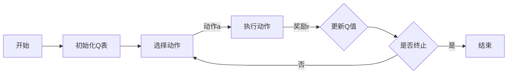
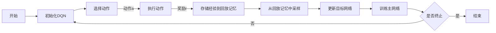
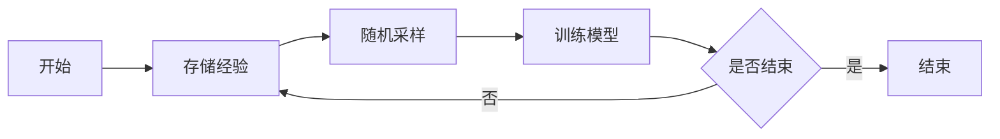
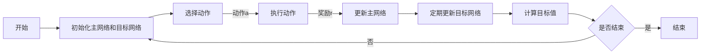
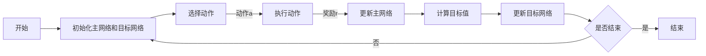

                 


### 第一部分：引言

#### 1.1 问题的背景

随着科技的发展，自动驾驶技术逐渐成为未来交通领域的研究热点。自动驾驶系统通过传感器、计算机视觉、人工智能等技术，实现车辆在复杂路况下的自主驾驶，从而提高行驶安全、效率和舒适度。AI Agent作为人工智能的一种形式，在自动驾驶决策系统中扮演着关键角色。

首先，自动驾驶技术的发展历程可以追溯到20世纪50年代，早期的自动驾驶研究主要集中在对车辆行驶路径的规划上。随着计算机技术和传感器技术的进步，自动驾驶技术逐渐走向实用化。目前，自动驾驶技术已从基础路径规划发展到复杂的决策系统，如避障、换道、停车等。

其次，AI Agent的概念源于人工智能领域，它是一种能够自主感知环境、设定目标、执行任务并自我优化的智能体。AI Agent在自动驾驶决策系统中的应用，使得车辆能够实时处理复杂的交通情况，做出最佳驾驶决策。

最后，决策系统在自动驾驶中的重要性不可忽视。自动驾驶系统的核心任务是对车辆周围环境进行感知，并根据感知到的信息做出合理的驾驶决策。一个高效的决策系统能够提高自动驾驶的稳定性和安全性，从而降低交通事故的发生率。

#### 1.2 本书的目标和结构

本书的目标是深入探讨AI Agent在自动驾驶决策系统中的应用，旨在为读者提供一个系统、全面的技术指南。本书结构如下：

- 第一部分：引言，介绍自动驾驶技术、AI Agent概念及决策系统的重要性。
- 第二部分：AI Agent基础理论，包括基本概念、工作原理、核心技术和应用。
- 第三部分：决策系统设计，涵盖决策系统概述、数据收集与预处理、模型选择与构建、算法实现与优化、决策系统测试与评估。
- 第四部分：AI Agent在自动驾驶决策系统中的应用案例，通过具体案例展示AI Agent在决策系统中的应用。

#### 1.3 术语和定义

为了确保读者对本书内容的理解，以下是对一些关键术语的定义：

- 自动驾驶：指通过传感器、计算机视觉、人工智能等技术，实现车辆在复杂路况下的自主驾驶。
- AI Agent：一种能够自主感知环境、设定目标、执行任务并自我优化的智能体。
- 决策系统：负责对车辆周围环境进行感知，并根据感知到的信息做出合理驾驶决策的系统。
- 感知：通过传感器收集环境信息。
- 理解：对收集到的环境信息进行分析和处理。
- 目标设定：根据理解的结果，设定车辆的行动目标。
- 规划：制定实现目标的行动方案。
- 行动：执行规划好的行动方案。
- 反馈调整：根据行动的结果，对AI Agent的行为进行优化调整。

#### 1.4 本书的读者指南

本书适合对自动驾驶技术、人工智能感兴趣的读者，包括自动驾驶领域的研究人员、工程师、技术爱好者等。以下是本书的阅读建议：

- 确保对本书涉及的术语和定义有清晰的理解。
- 结合实际案例，深入理解AI Agent在自动驾驶决策系统中的应用。
- 针对书中提到的技术原理，尝试进行实验和验证。
- 鼓励读者参与讨论，分享自己的见解和经验。
- 拓展阅读相关领域的经典书籍和最新研究论文。

#### 1.5 本章小结

本章主要介绍了自动驾驶技术、AI Agent概念及决策系统的重要性。通过本章的学习，读者可以对自动驾驶技术的发展历程、AI Agent的基本概念和应用有初步了解，为后续章节的学习打下基础。

### 第二部分：AI Agent基础理论

#### 2.1 AI Agent的基本概念

AI Agent，即人工智能代理，是人工智能领域中的一种重要概念。它是一种具有自主性、适应性和学习能力的计算实体，能够模拟人类智能，完成特定的任务。AI Agent的基本概念包括以下几个方面：

- **定义**：AI Agent是一种能够感知环境、制定目标、执行任务并从经验中学习的计算实体。它通过与环境交互，不断优化自身的行为，以提高任务的完成质量。

- **特点**：AI Agent具有自主性、适应性、学习性和协作性。自主性意味着AI Agent能够独立地制定决策和执行任务；适应性表示AI Agent能够根据环境的变化调整自身行为；学习性表明AI Agent可以通过学习来优化任务完成效果；协作性意味着AI Agent可以与其他智能体协同工作，共同完成任务。

- **分类**：根据不同的标准，AI Agent可以有不同的分类。例如，根据任务类型，AI Agent可以分为问题求解Agent、数据挖掘Agent、控制Agent等；根据学习方式，AI Agent可以分为基于规则的Agent、基于模型的Agent、基于学习的Agent等。

#### 2.2 AI Agent的工作原理

AI Agent的工作原理可以概括为感知、理解、目标设定、规划、行动和反馈调整六个主要环节。以下是对每个环节的详细描述：

- **感知**：AI Agent通过传感器（如摄像头、雷达、激光雷达等）收集环境信息，形成对当前状态的感知。

- **理解**：AI Agent对感知到的信息进行处理和分析，提取关键特征，形成对环境状态的理解。

- **目标设定**：基于对环境状态的理解，AI Agent设定一个或多个目标，例如到达某个地点、避开障碍物、完成某项任务等。

- **规划**：AI Agent根据设定的目标，制定一系列行动方案，以实现目标。规划过程中需要考虑资源的可用性、行动的成本和风险等因素。

- **行动**：AI Agent根据规划结果，执行具体的行动。行动可以是简单的操作，如移动、旋转等，也可以是复杂的决策，如选择最佳路径、调整行驶速度等。

- **反馈调整**：AI Agent在执行行动后，根据行动的结果和新的环境信息，调整自身的策略和行为。这种反馈调整过程是AI Agent不断优化自身性能的关键。

#### 2.3 AI Agent的核心技术

AI Agent的核心技术包括感知与理解技术、目标设定与规划技术、行动与反馈调整技术等。以下将重点介绍这些核心技术：

- **感知与理解技术**：感知与理解技术是AI Agent工作的基础。常见的感知技术包括计算机视觉、语音识别、传感器融合等。理解技术则涉及数据预处理、特征提取、模式识别等。

- **目标设定与规划技术**：目标设定与规划技术是AI Agent的核心能力。目标设定需要考虑多种因素，如任务的重要性、目标的可实现性、资源的限制等。规划技术则包括路径规划、资源分配、决策树等。

- **行动与反馈调整技术**：行动与反馈调整技术是AI Agent实现自主性的关键。行动技术包括执行器控制、实时决策等。反馈调整技术则包括目标调整、策略优化、学习算法等。

#### 2.4 AI Agent与自动驾驶

AI Agent在自动驾驶中的应用主要体现在决策系统中。自动驾驶系统通过感知车辆周围环境，使用AI Agent对环境信息进行处理，制定驾驶策略，从而实现车辆的自主驾驶。AI Agent在自动驾驶中的作用主要包括：

- **环境感知**：通过传感器收集道路、车辆、行人等信息，为自动驾驶提供基础数据。

- **决策制定**：根据感知到的环境信息，AI Agent制定驾驶策略，如路径规划、速度控制、车道保持等。

- **自主驾驶**：通过执行驾驶策略，实现车辆的自主驾驶，提高行驶的安全性和效率。

#### 2.5 本章小结

本章介绍了AI Agent的基本概念、工作原理和核心技术。通过本章的学习，读者可以了解AI Agent的定义、特点、分类，以及其工作原理和核心技术。这些知识为后续章节讨论AI Agent在自动驾驶决策系统中的应用提供了基础。

#### 2.6 核心概念与联系

为了更好地理解AI Agent在自动驾驶决策系统中的作用，我们需要对比几个核心概念，并绘制ER实体关系图来展示这些概念之间的联系。

**核心概念：**

1. **自动驾驶**：指利用传感器、计算机视觉和人工智能技术，使车辆能够在没有人类驾驶员干预的情况下自主行驶。
2. **AI Agent**：一种具有感知、理解、目标设定、规划、行动和反馈调整能力的计算实体。
3. **决策系统**：负责对车辆周围环境进行感知，并根据感知到的信息做出合理驾驶决策的系统。
4. **感知**：通过传感器收集环境信息的过程。
5. **理解**：对感知到的信息进行分析和处理的过程。
6. **目标设定**：根据理解的结果，设定车辆的行动目标。
7. **规划**：制定实现目标的行动方案。
8. **行动**：执行规划好的行动方案。
9. **反馈调整**：根据行动的结果，对AI Agent的行为进行优化调整。

**ER实体关系图：**

```mermaid
erDiagram
    AI-Agent ||--|{ 感知 }
    AI-Agent ||--|{ 理解 }
    AI-Agent ||--|{ 目标设定 }
    AI-Agent ||--|{ 规划 }
    AI-Agent ||--|{ 行动 }
    AI-Agent ||--|{ 反馈调整 }
    自动驾驶 ||--|{ 决策系统 }
    感知 ||--|{ 环境信息 }
    理解 ||--|{ 环境状态 }
    目标设定 ||--|{ 行动目标 }
    规划 ||--|{ 行动方案 }
    行动 ||--|{ 驾驶策略 }
    反馈调整 ||--|{ 行为优化 }
```

**核心概念属性特征对比表格：**

| 名称        | 定义                                                         | 属性特征                                                         |
| ----------- | ------------------------------------------------------------ | ------------------------------------------------------------ |
| 自动驾驶    | 利用传感器、计算机视觉和人工智能技术，使车辆在无人干预下自主行驶 | - 技术依赖：传感器、计算机视觉、人工智能<br>- 目标：提高行驶安全性、效率<br>- 挑战：环境复杂、不确定性强 |
| AI Agent    | 具有感知、理解、目标设定、规划、行动和反馈调整能力的计算实体   | - 自主性：独立制定决策<br>- 适应性：根据环境调整行为<br>- 学习性：通过经验优化性能 |
| 决策系统    | 负责对车辆周围环境进行感知，并做出驾驶决策的系统               | - 功能：环境感知、决策制定<br>- 关键：实时性、准确性<br>- 技术挑战：复杂环境建模、实时决策 |
| 感知        | 通过传感器收集环境信息的过程                                 | - 传感器类型：摄像头、雷达、激光雷达<br>- 数据类型：图像、声音、传感器读数<br>- 挑战：数据噪声、不确定性 |
| 理解        | 对感知到的信息进行分析和处理的过程                           | - 特征提取：从数据中提取关键信息<br>- 模式识别：识别环境中的对象和事件<br>- 挑战：复杂环境建模、多源数据融合 |
| 目标设定    | 根据理解的结果，设定车辆的行动目标                           | - 目标类型：到达地点、避障、换道等<br>- 目标属性：重要性、可实现性、资源限制<br>- 挑战：目标冲突、资源优化 |
| 规划        | 制定实现目标的行动方案                                       | - 路径规划：确定最佳行驶路径<br>- 资源分配：合理分配车辆资源<br>- 挑战：复杂路径、实时性、鲁棒性 |
| 行动        | 执行规划好的行动方案                                       | - 行动类型：加速、减速、转向等<br>- 行动效果：影响车辆状态和目标达成<br>- 挑战：执行精度、实时响应 |
| 反馈调整    | 根据行动的结果，对AI Agent的行为进行优化调整                  | - 反馈类型：行动效果、环境变化<br>- 调整策略：目标调整、策略优化<br>- 挑战：适应变化、持续优化 |

通过上述对比和ER实体关系图，我们可以更清晰地理解AI Agent在自动驾驶决策系统中的角色和作用，以及各个核心概念之间的联系。

### 2.7 算法原理讲解

在自动驾驶系统中，AI Agent的决策过程通常依赖于强化学习算法，这是一种通过试错和反馈调整来学习最优策略的机器学习方法。以下将详细讲解强化学习算法的基本原理，并借助Mermaid流程图和Python代码示例进行说明。

#### 2.7.1 基本概念

强化学习（Reinforcement Learning，RL）是一种通过试错和奖励机制来优化决策过程的学习方法。其主要目标是通过与环境交互，学习到一种最优策略，使得代理（Agent）能够最大化总奖励。

- **状态（State）**：描述环境当前状态的特征集合。
- **动作（Action）**：代理可以采取的操作。
- **奖励（Reward）**：代理在执行动作后从环境中获得的即时奖励或惩罚。
- **策略（Policy）**：代理根据状态选择动作的决策规则。

强化学习的基本原理是：代理通过不断尝试不同的动作，并根据获得的奖励调整策略，以达到最大化总奖励的目标。

#### 2.7.2 Q-Learning算法

Q-Learning是一种基于值函数的强化学习算法，其核心思想是通过学习状态-动作值函数（Q函数）来选择最佳动作。

- **Q函数（Q-Function）**：Q(s, a) 表示在状态s下采取动作a的期望回报。
- **目标值（Target Value）**：用于更新Q值的预期回报，计算公式为：\[ target\_value = reward + discount \times \max\_action\_Q(s') \]

其中，reward为即时奖励，discount为折扣因子，用于平衡即时奖励和长期回报。

以下是一个简单的Q-Learning算法的Mermaid流程图：



#### 2.7.3 Deep Q-Networks (DQN)

Deep Q-Networks（DQN）是Q-Learning的一种扩展，它利用深度神经网络来近似Q函数。DQN的主要挑战是如何处理动作空间离散化和经验回放问题。

- **经验回放（Experience Replay）**：为了解决样本相关性问题，DQN使用经验回放机制，将过去的经验存储到一个经验池中，并从经验池中随机采样进行训练。
- **目标网络（Target Network）**：为了稳定学习过程，DQN使用一个目标网络来稳定Q值的更新。目标网络与主网络结构相同，但更新频率较低。

以下是一个简单的DQN算法的Mermaid流程图：



#### 2.7.4 Python代码示例

以下是一个简单的Q-Learning算法的Python代码示例：

```python
import numpy as np
import random

# 初始化Q表
Q = {}
# 设置学习率、折扣因子和探索概率
alpha = 0.1
gamma = 0.9
epsilon = 0.1

# 状态空间和动作空间
states = ["state1", "state2", "state3"]
actions = ["action1", "action2"]

# 初始化Q值
for state in states:
    for action in actions:
        Q[(state, action)] = 0

# 选择动作
def choose_action(state):
    if random.uniform(0, 1) < epsilon:
        # 探索行为
        action = random.choice(actions)
    else:
        # 利用行为
        action_values = [Q[(state, a)] for a in actions]
        action = actions[np.argmax(action_values)]
    return action

# 执行动作并更新Q值
def update_Q(state, action, reward, next_state, done):
    if done:
        target_value = reward
    else:
        next_action_values = [Q[(next_state, a)] for a in actions]
        target_value = reward + gamma * np.max(next_action_values)
    
    current_value = Q[(state, action)]
    Q[(state, action)] = current_value + alpha * (target_value - current_value)

# 训练模型
def train_model(states, actions, rewards, next_states, dones):
    for state, action, reward, next_state, done in zip(states, actions, rewards, next_states, dones):
        update_Q(state, action, reward, next_state, done)

# 模拟训练过程
states = ["state1", "state1", "state2", "state2", "state3", "state3"]
actions = ["action1", "action2", "action1", "action1", "action2", "action2"]
rewards = [10, 5, 10, 5, 10, 5]
next_states = ["state2", "state3", "state3", "state3", "state1", "state1"]
dones = [False, False, False, False, False, True]

train_model(states, actions, rewards, next_states, dones)

# 打印Q值
for state in states:
    for action in actions:
        print(f"Q({state}, {action}) = {Q[(state, action)]}")
```

通过上述代码示例，我们可以看到Q-Learning算法的基本实现过程。虽然这是一个简化的示例，但它展示了强化学习算法的核心思想和基本步骤。

#### 2.7.5 算法原理举例说明

为了更直观地理解Q-Learning算法，我们可以通过一个简单的例子来演示其工作过程。

假设有一个简单的环境，其中车辆只能在两个状态（"停止"和"行驶"）之间切换，且每个状态对应两个动作（"保持"和"改变"）。以下是一个状态-动作对和相应奖励的表格：

| 状态 | 动作 | 奖励 |
| ---- | ---- | ---- |
| 停止 | 保持 | 5    |
| 停止 | 改变 | -5   |
| 行驶 | 保持 | -5   |
| 行驶 | 改变 | 5    |

初始化Q表如下：

| 状态-动作 | Q值 |
| -------- | --- |
| 停止-保持 | 0   |
| 停止-改变 | 0   |
| 行驶-保持 | 0   |
| 行驶-改变 | 0   |

第一步，车辆处于状态"停止"，根据Q-Learning算法，代理选择一个动作。由于初始时所有动作的Q值相等，代理以50%的概率选择"保持"动作。执行动作后，获得奖励5。

第二步，车辆处于状态"行驶"，代理选择一个动作。根据当前Q值，代理选择"改变"动作。执行动作后，获得奖励-5。

第三步，车辆再次处于状态"停止"，代理选择一个动作。此时，代理将更新Q值，计算目标值。目标值等于当前奖励（5）加上折扣因子（0.9）乘以下一个状态"行驶"下最大Q值的动作（"改变"动作的Q值）。

目标值 = 5 + 0.9 * max(Q["行驶-保持"], Q["行驶-改变"]) = 5 + 0.9 * 0 = 5

更新Q值：Q["停止-保持"] = Q["停止-保持"] + 0.1 * (5 - 5) = 0 + 0.1 * 0 = 0

此时，Q表更新如下：

| 状态-动作 | Q值 |
| -------- | --- |
| 停止-保持 | 0   |
| 停止-改变 | 0   |
| 行驶-保持 | 0   |
| 行驶-改变 | 0   |

通过不断重复这个过程，代理将逐渐学习到最佳策略，即在状态"停止"时选择"保持"动作，在状态"行驶"时选择"改变"动作，从而最大化总奖励。

### 2.8 训练与优化

在AI Agent的训练过程中，优化策略至关重要。以下将介绍几种常见的训练与优化方法，包括经验回放、目标网络和双DQN算法。

#### 2.8.1 经验回放

经验回放（Experience Replay）是强化学习中的一个关键技术，用于解决样本相关性问题。它通过将过去经验存储到一个经验池中，并从经验池中随机采样进行训练，从而避免训练数据集中出现过度拟合。

- **经验池**：存储过去经验的缓冲区，通常使用优先经验回放（Prioritized Experience Replay）来优化回放效果。

- **随机采样**：从经验池中随机采样一批经验进行训练，以提高模型的泛化能力。

经验回放的过程可以简化为以下步骤：

1. **存储经验**：在每次行动后，将状态、动作、奖励、下一个状态和是否完成存储到经验池中。
2. **随机采样**：从经验池中随机采样一批经验。
3. **训练模型**：使用随机采样的经验更新模型。

以下是一个简单的经验回放算法的Mermaid流程图：



#### 2.8.2 目标网络

目标网络（Target Network）是一种用于稳定DQN训练过程的优化技术。它通过维护一个目标网络，用于计算目标值，从而降低训练过程中的方差和过估计问题。

- **主网络**：用于更新Q值的网络。
- **目标网络**：用于计算目标值的网络，通常与主网络结构相同。

目标网络的更新策略如下：

1. **初始化目标网络**：在训练初期，目标网络与主网络相同。
2. **定期更新目标网络**：在训练过程中，定期更新目标网络的权重，使其逐渐接近主网络。
3. **计算目标值**：使用目标网络计算Q值的期望，即目标值。

以下是一个简单的目标网络算法的Mermaid流程图：



#### 2.8.3 双DQN算法

双DQN（Double DQN）算法是一种改进的DQN算法，用于解决目标值过估计问题。它通过使用两个独立的网络来选择动作和计算目标值，从而提高训练稳定性。

- **动作选择网络**：用于选择动作的网络。
- **目标值计算网络**：用于计算目标值的网络。

双DQN算法的更新策略如下：

1. **选择动作**：使用动作选择网络选择动作。
2. **计算目标值**：使用目标值计算网络计算目标值。
3. **更新Q值**：使用计算得到的目标值更新Q值。

以下是一个简单的双DQN算法的Mermaid流程图：



通过上述介绍，我们可以看到经验回放、目标网络和双DQN算法在AI Agent训练和优化过程中的重要性。这些方法不仅提高了训练的稳定性，还有效地解决了样本相关性和目标值过估计等问题，为自动驾驶决策系统的实现提供了强有力的技术支持。

### 2.9 AI Agent在自动驾驶中的应用

自动驾驶系统的发展离不开AI Agent的应用。在自动驾驶系统中，AI Agent主要负责感知、决策和行动三个环节，通过对环境信息的实时处理，实现车辆的安全、高效驾驶。以下将详细讨论AI Agent在自动驾驶中的应用。

#### 2.9.1 自动驾驶的需求

自动驾驶系统对AI Agent的需求主要包括以下几个方面：

- **高可靠性**：自动驾驶系统需要具备极高的可靠性，以保证行驶过程中的安全。
- **实时性**：AI Agent需要具备快速响应的能力，能够在短时间内完成环境感知、决策和行动，以应对复杂多变的道路状况。
- **适应性**：AI Agent需要能够适应各种道路环境和交通状况，具备灵活的决策能力。
- **鲁棒性**：AI Agent需要具备较强的鲁棒性，能够在传感器数据异常或环境突变的情况下，做出合理的驾驶决策。

#### 2.9.2 AI Agent在自动驾驶中的应用

AI Agent在自动驾驶中的应用主要体现在决策系统中，以下是其具体应用场景：

- **环境感知**：AI Agent通过车载传感器（如摄像头、激光雷达、雷达等）收集道路、车辆、行人等环境信息，实现对周围环境的实时感知。
- **决策制定**：基于感知到的环境信息，AI Agent通过强化学习、规划算法等，制定出合理的驾驶策略，如路径规划、速度控制、车道保持等。
- **自主驾驶**：根据决策结果，AI Agent控制车辆的执行器（如方向盘、油门、刹车等），实现车辆的自主驾驶。

#### 2.9.3 AI Agent在决策系统中的作用

在自动驾驶决策系统中，AI Agent的作用主要体现在以下几个方面：

- **感知融合**：AI Agent能够融合多种传感器数据，实现对环境的全面感知，提高感知的准确性和可靠性。
- **实时决策**：AI Agent能够根据感知到的环境信息，快速制定出合理的驾驶策略，确保车辆在复杂路况下的安全行驶。
- **优化路径**：AI Agent通过路径规划算法，不断优化车辆的行驶路径，提高行驶效率。
- **异常处理**：AI Agent能够识别和应对道路异常情况，如行人横穿、车辆故障等，确保行驶安全。
- **反馈调整**：AI Agent能够根据执行结果和新的环境信息，不断调整驾驶策略，提高驾驶效果。

#### 2.9.4 AI Agent在自动驾驶中的挑战

尽管AI Agent在自动驾驶中具有重要作用，但其应用仍面临一系列挑战：

- **数据质量**：传感器数据的噪声、缺失和不一致性会影响AI Agent的感知和决策效果，需要采用有效的数据预处理方法。
- **实时性**：自动驾驶系统对AI Agent的实时性要求极高，需要优化算法和硬件配置，以提高响应速度。
- **复杂环境**：自动驾驶系统需要应对各种复杂路况和环境，如雨雪、雾霾等，需要AI Agent具备较强的环境适应能力。
- **安全可靠**：自动驾驶系统的安全性至关重要，需要确保AI Agent在各种情况下都能做出合理决策。

#### 2.9.5 未来展望

随着技术的不断发展，AI Agent在自动驾驶中的应用将越来越广泛。未来，AI Agent有望在以下几个方面取得突破：

- **更高效的算法**：研究更加高效、鲁棒的强化学习算法，提高AI Agent的决策能力。
- **多模态感知**：融合多种传感器数据，实现更全面、准确的环境感知。
- **智能协作**：与其他智能系统（如智能交通系统）实现协同，提高整体交通效率。
- **安全性与可靠性**：通过冗余设计和验证方法，提高自动驾驶系统的安全性和可靠性。

通过上述讨论，我们可以看到AI Agent在自动驾驶决策系统中的关键作用，以及其在实际应用中面临的挑战和未来发展方向。随着技术的不断进步，AI Agent将在自动驾驶领域发挥越来越重要的作用。

### 2.10 本章小结

本章首先介绍了AI Agent的基本概念、工作原理和核心技术，包括感知、理解、目标设定、规划、行动和反馈调整。接着，我们对比了核心概念，并通过ER实体关系图展示了它们之间的联系。然后，详细讲解了强化学习算法的基本原理，包括Q-Learning和Deep Q-Networks（DQN），并使用Mermaid流程图和Python代码示例进行说明。此外，本章还介绍了训练与优化方法，包括经验回放、目标网络和双DQN算法。最后，讨论了AI Agent在自动驾驶中的应用，分析了其需求、具体应用、作用以及面临的挑战和未来发展方向。通过本章的学习，读者可以全面了解AI Agent在自动驾驶决策系统中的重要作用和关键技术。

### 第三部分：决策系统设计

#### 3.1 决策系统概述

决策系统是自动驾驶技术的核心，其设计直接影响自动驾驶系统的性能和安全性。决策系统的设计过程涉及多个方面，包括系统定义、组成结构、设计原则等。以下将对这些方面进行详细探讨。

**3.1.1 决策系统的定义**

决策系统是指负责对车辆周围环境进行感知、处理和分析，并根据分析结果制定驾驶决策的计算机系统。它通过融合传感器数据、使用先进的算法和模型，实现对交通状况的实时监控和驾驶决策的制定，从而确保车辆的自主驾驶。

**3.1.2 决策系统的组成**

一个典型的决策系统通常由以下几个部分组成：

- **感知模块**：负责收集车辆周围环境的数据，包括路况、车辆位置、行人位置等。常用的传感器有摄像头、激光雷达、雷达、超声波传感器等。

- **数据处理模块**：对感知模块收集的数据进行预处理，如去噪、特征提取、数据融合等，以提高数据的质量和可用性。

- **决策模块**：根据处理后的数据，使用算法和模型进行环境理解和驾驶决策。常见的算法包括路径规划、轨迹生成、行为预测等。

- **执行模块**：根据决策模块的结果，控制车辆的执行器，如方向盘、油门、刹车等，实现实际的驾驶动作。

- **通信模块**：负责与车辆内部其他系统（如导航系统、控制系统等）以及外部系统（如交通信号灯、道路监控系统等）进行数据通信。

**3.1.3 决策系统的设计原则**

在决策系统的设计过程中，需要遵循以下原则，以确保系统的性能和可靠性：

- **实时性**：决策系统需要具备快速响应的能力，能够在短时间内处理感知数据并做出决策，以应对实时变化的交通状况。

- **鲁棒性**：决策系统需要具备较强的鲁棒性，能够在传感器数据异常、网络中断等情况下，依然能够稳定运行。

- **可扩展性**：决策系统应该具备良好的可扩展性，能够适应未来技术和需求的变化，方便系统的升级和维护。

- **安全性**：决策系统的设计需要充分考虑安全性，确保在所有情况下都能做出合理、安全的驾驶决策。

- **可解释性**：决策系统的决策过程应该具有可解释性，以便用户和开发者能够理解和信任系统的决策结果。

#### 3.2 数据收集与预处理

数据收集与预处理是决策系统设计的关键环节，直接关系到系统的性能和准确性。以下将介绍数据收集的方法、预处理的方法以及数据质量评估的标准。

**3.2.1 数据收集方法**

数据收集主要通过传感器实现，常用的传感器包括：

- **摄像头**：用于获取道路图像，进行图像处理和识别。
- **激光雷达（LiDAR）**：用于获取车辆周围的三维点云数据，用于环境建模和物体识别。
- **雷达**：用于检测车辆之间的距离，用于碰撞预警和路径规划。
- **超声波传感器**：用于检测近距离物体，用于避障和泊车。

传感器数据的收集过程通常包括以下步骤：

1. **数据采集**：通过传感器实时收集环境数据，如摄像头捕获图像、激光雷达生成点云数据等。
2. **数据传输**：将采集到的数据传输到数据处理模块，通常采用有线或无线方式。
3. **数据存储**：将数据存储在数据库或文件系统中，以便后续处理和分析。

**3.2.2 数据预处理方法**

数据预处理是提高数据质量和可用性的关键步骤，包括以下方法：

- **去噪**：去除传感器数据中的噪声，如摄像头图像中的噪声点、雷达信号中的干扰信号等。
- **特征提取**：从原始数据中提取具有代表性的特征，如图像中的车道线、车辆轮廓等。
- **数据融合**：将来自不同传感器的数据进行融合，以提高数据的完整性和准确性，如将摄像头图像与激光雷达点云数据进行融合。
- **数据规范化**：将数据统一到相同的格式和尺度，如将不同传感器的数据统一到米或像素尺度。

**3.2.3 数据质量评估**

数据质量直接影响决策系统的性能和准确性，因此需要对数据质量进行评估。以下是一些常用的数据质量评估标准：

- **完整性**：数据是否完整，是否有缺失或异常值。
- **准确性**：数据是否准确，与真实环境的偏差程度。
- **一致性**：不同来源的数据是否一致，如摄像头图像与激光雷达点云数据之间的对应关系是否正确。
- **实时性**：数据是否能够在规定时间内收集和处理，以支持实时决策。

数据质量评估通常通过以下步骤进行：

1. **数据清洗**：去除缺失值、异常值和重复值。
2. **数据验证**：通过对比真实环境和数据处理结果，验证数据的准确性。
3. **性能测试**：通过模拟测试，评估系统的实时性和可靠性。

#### 3.3 模型选择与构建

模型选择与构建是决策系统的核心环节，直接关系到系统的性能和效果。以下将介绍常见的模型选择策略和构建方法。

**3.3.1 常见模型介绍**

在自动驾驶决策系统中，常用的模型包括以下几种：

- **神经网络**：用于图像识别、物体检测等任务，如卷积神经网络（CNN）。
- **支持向量机（SVM）**：用于分类和回归任务，具有良好的泛化能力。
- **决策树**：用于分类和回归任务，易于理解和解释。
- **随机森林**：基于决策树的集成模型，提高分类和回归的准确性。
- **强化学习模型**：用于路径规划、轨迹生成等任务，如Q-Learning、DQN等。

**3.3.2 模型选择策略**

模型选择策略主要包括以下几种：

- **基于性能的模型选择**：通过比较不同模型在验证集上的性能，选择表现最佳的模型。
- **基于特征的模型选择**：根据问题的特征，选择最适合的模型。例如，对于图像处理任务，选择神经网络模型；对于分类任务，选择SVM或决策树模型。
- **基于数据的模型选择**：根据数据的分布和规模，选择适合的模型。例如，对于大规模数据，选择神经网络模型；对于小规模数据，选择决策树或SVM模型。

**3.3.3 模型构建方法**

模型构建包括数据准备、模型训练、模型评估和模型部署等步骤。以下是一个简单的模型构建流程：

1. **数据准备**：收集和清洗数据，进行特征提取和标签分配。
2. **模型训练**：使用准备好的数据对模型进行训练，调整模型参数。
3. **模型评估**：使用验证集对模型进行评估，选择最佳模型。
4. **模型部署**：将最佳模型部署到实际系统中，进行实时决策。

#### 3.4 算法实现与优化

算法实现与优化是决策系统设计的关键环节，直接关系到系统的性能和稳定性。以下将介绍算法实现的流程、优化方法以及实时性与鲁棒性优化策略。

**3.4.1 算法实现流程**

算法实现流程主要包括以下步骤：

1. **需求分析**：明确系统的需求和功能，确定需要实现的算法。
2. **算法设计**：设计算法的基本框架和流程，包括输入、输出和处理步骤。
3. **代码编写**：根据算法设计，编写具体的代码实现。
4. **代码调试**：调试代码，解决运行中可能出现的问题。
5. **性能测试**：测试算法的性能，包括速度、准确性和稳定性等。
6. **部署与维护**：将算法部署到实际系统中，进行实时决策，并定期进行维护和优化。

**3.4.2 优化方法**

优化方法主要包括以下几种：

- **模型参数优化**：通过调整模型参数，提高算法的性能和准确性。
- **算法并行化**：通过并行计算，提高算法的运行速度。
- **数据预处理优化**：通过优化数据预处理方法，提高数据的质量和可用性。
- **模型集成**：通过集成多个模型，提高算法的泛化能力和稳定性。

**3.4.3 实时性与鲁棒性优化**

实时性与鲁棒性优化是确保决策系统稳定运行的关键。以下是一些优化策略：

- **实时性优化**：通过优化算法和数据结构，提高系统的响应速度。例如，使用高效的数据结构（如哈希表、堆等）和算法（如快速排序、二分查找等）。
- **鲁棒性优化**：通过增加系统的容错能力和鲁棒性，提高系统在异常情况下的稳定性。例如，使用传感器融合技术，提高环境感知的可靠性；增加冗余设计，提高系统的容错能力。

#### 3.5 决策系统测试与评估

决策系统的测试与评估是确保系统性能和可靠性的重要环节。以下将介绍测试方法、评估指标以及性能分析。

**3.5.1 测试方法**

测试方法主要包括以下几种：

- **功能测试**：测试系统的功能是否符合设计要求，包括感知、决策、执行等环节。
- **性能测试**：测试系统的性能指标，如速度、准确性和稳定性等。
- **异常测试**：测试系统在异常情况下的表现，如传感器数据异常、网络中断等。
- **场景测试**：模拟各种驾驶场景，测试系统的性能和适应性。

**3.5.2 评估指标**

评估指标主要包括以下几种：

- **准确性**：决策系统预测结果的准确性，通常用准确率、召回率、F1值等指标衡量。
- **速度**：系统的响应速度，通常用处理时间、延迟等指标衡量。
- **稳定性**：系统的稳定性，通常用失败率、异常率等指标衡量。
- **鲁棒性**：系统在异常情况下的表现，通常用容错率、抗干扰能力等指标衡量。

**3.5.3 性能分析**

性能分析主要包括以下步骤：

1. **数据收集**：收集系统的实际运行数据，包括功能测试、性能测试、异常测试和场景测试等。
2. **数据预处理**：对收集到的数据进行分析和清洗，去除异常值和重复值。
3. **指标计算**：计算系统的各项评估指标，如准确性、速度、稳定性、鲁棒性等。
4. **结果分析**：分析系统的性能表现，找出存在的问题和改进方向。

#### 3.6 本章小结

本章首先介绍了决策系统的定义、组成和设计原则，然后详细讨论了数据收集与预处理方法、模型选择与构建策略、算法实现与优化方法以及决策系统的测试与评估。通过本章的学习，读者可以全面了解决策系统的设计过程和关键要素，为后续章节的深入学习打下基础。

### 第四部分：AI Agent在自动驾驶决策系统中的应用案例

#### 4.1 案例一：城市自动驾驶

**4.1.1 案例背景**

城市自动驾驶是自动驾驶技术的一个重要应用场景，它涉及复杂的交通环境和多样化的驾驶任务。为了提高驾驶安全性、效率和用户体验，许多汽车制造商和研究机构都在积极研发城市自动驾驶系统。本案例将介绍一个实际的城市自动驾驶项目，并分析其AI Agent在决策系统中的应用。

**4.1.2 案例分析**

该项目是一个基于深度强化学习算法的城市自动驾驶系统，其核心是通过AI Agent实现自动驾驶车辆在复杂城市交通环境中的自主行驶。以下是对该项目的分析：

1. **环境感知**：系统使用多传感器融合技术，包括摄像头、激光雷达和雷达，收集车辆周围的道路、交通标志、行人、车辆等信息。AI Agent对这些感知数据进行分析和处理，以理解当前环境状态。

2. **目标设定**：基于对环境状态的理解，AI Agent设定短期目标，如保持车道、避免碰撞、加速或减速等，同时考虑长期目标，如到达目的地、遵守交通规则等。

3. **路径规划**：AI Agent使用强化学习算法，结合当前环境和目标，生成最优行驶路径。该路径规划不仅要考虑道路的可用性和安全性，还要考虑到交通流量和道路条件。

4. **行动执行**：根据生成的路径规划，AI Agent控制车辆的油门、刹车和转向等执行器，实现车辆的自主行驶。

5. **反馈调整**：AI Agent在执行驾驶动作后，根据执行结果和环境变化，调整驾驶策略，以优化驾驶性能。这一过程通过经验回放和目标网络技术，确保AI Agent能够在不断变化的环境中稳定运行。

**4.1.3 案例实施与效果评估**

该项目的实施包括以下几个阶段：

1. **数据收集**：在多个城市道路环境中，使用传感器收集大量驾驶数据，用于训练和验证AI Agent。

2. **算法设计**：设计并实现基于深度强化学习的决策算法，包括Q-Learning、DQN和双DQN等。

3. **系统集成**：将AI Agent集成到自动驾驶车辆中，进行系统的整体集成和测试。

4. **测试与优化**：在模拟环境和实际道路上进行测试，收集系统的性能数据，并根据测试结果不断优化算法和系统。

效果评估主要包括以下指标：

- **安全性**：评估AI Agent在自动驾驶过程中，是否能够有效避免碰撞、遵守交通规则等。
- **效率**：评估AI Agent在自动驾驶过程中的行驶速度、行驶时间、油耗等指标。
- **用户体验**：评估乘客对自动驾驶车辆的感受，包括舒适度、安全性、便利性等。

**4.1.4 案例总结**

该案例展示了AI Agent在复杂城市交通环境中的强大应用潜力。通过深度强化学习算法，AI Agent能够实现对环境的实时感知、目标设定、路径规划和行动执行，显著提高了自动驾驶系统的性能和安全性。同时，通过反馈调整机制，AI Agent能够不断优化驾驶策略，以适应不断变化的环境。然而，城市自动驾驶仍面临许多挑战，如复杂交通场景的处理、实时性的优化等，需要进一步研究和改进。

#### 4.2 案例二：高速公路自动驾驶

**4.2.1 案例背景**

高速公路自动驾驶是自动驾驶技术发展的另一个重要方向。高速公路行驶环境相对简单，车辆行驶速度较高，适合进行自动驾驶技术的测试和应用。本案例将介绍一个实际的高速公路自动驾驶项目，并分析其AI Agent在决策系统中的应用。

**4.2.2 案例分析**

该高速公路自动驾驶项目采用了一种基于深度学习算法的决策系统，AI Agent负责实现车辆的自主行驶。以下是对该项目的分析：

1. **环境感知**：系统使用激光雷达和摄像头，对车辆周围的高速公路环境进行实时感知，包括车道线、交通标志、车辆位置和速度等信息。

2. **目标设定**：AI Agent根据感知到的环境数据，设定短期目标，如保持车道、保持安全距离、调整车速等，并考虑长期目标，如到达目的地、减少油耗等。

3. **路径规划**：AI Agent使用深度强化学习算法，结合当前环境和目标，生成最优行驶路径。该路径规划主要考虑道路的直线性和车道的使用情况。

4. **行动执行**：根据生成的路径规划，AI Agent控制车辆的油门和刹车等执行器，实现车辆的自主行驶。

5. **反馈调整**：AI Agent在执行驾驶动作后，根据执行结果和环境变化，调整驾驶策略，以优化驾驶性能。这一过程通过经验回放和目标网络技术，确保AI Agent能够在高速行驶环境中稳定运行。

**4.2.3 案例实施与效果评估**

该项目的实施主要包括以下几个阶段：

1. **数据收集**：在多个高速公路环境中，使用传感器收集大量驾驶数据，用于训练和验证AI Agent。

2. **算法设计**：设计并实现基于深度强化学习的决策算法，包括Q-Learning、DQN和双DQN等。

3. **系统集成**：将AI Agent集成到自动驾驶车辆中，进行系统的整体集成和测试。

4. **测试与优化**：在模拟环境和实际道路上进行测试，收集系统的性能数据，并根据测试结果不断优化算法和系统。

效果评估主要包括以下指标：

- **安全性**：评估AI Agent在自动驾驶过程中，是否能够有效避免碰撞、遵守交通规则等。
- **效率**：评估AI Agent在自动驾驶过程中的行驶速度、行驶时间、油耗等指标。
- **稳定性**：评估AI Agent在高速公路行驶中的稳定性，包括对突发事件的反应能力。

**4.2.4 案例总结**

该案例展示了AI Agent在高速公路自动驾驶中的成功应用。通过深度强化学习算法，AI Agent能够实现对高速公路环境的实时感知、目标设定、路径规划和行动执行，提高了自动驾驶系统的性能和安全性。同时，通过反馈调整机制，AI Agent能够不断优化驾驶策略，以适应高速行驶环境。然而，高速公路自动驾驶仍面临一些挑战，如突发事件的应对、复杂路况的处理等，需要进一步研究和改进。

### 4.3 案例三：混合交通环境下的自动驾驶

**4.3.1 案例背景**

混合交通环境下的自动驾驶是一个具有挑战性的应用场景，因为这种环境中既包括高速公路车辆，又包括非机动车辆（如自行车、行人等）。这种多样性对自动驾驶系统的感知、决策和执行提出了更高的要求。本案例将介绍一个在混合交通环境下运行的自动驾驶项目，并分析其AI Agent在决策系统中的应用。

**4.3.2 案例分析**

该自动驾驶项目采用了一种基于多模态感知和深度强化学习的决策系统，AI Agent负责在混合交通环境中实现车辆的自主行驶。以下是对该项目的分析：

1. **环境感知**：系统使用多传感器融合技术，包括激光雷达、摄像头、雷达和超声波传感器，收集车辆周围的环境信息。这些传感器能够感知到车辆、行人、交通标志、车道线和其他车辆的位置、速度和运动方向。

2. **数据预处理**：对多传感器数据进行预处理，包括去噪、特征提取和数据融合。预处理后的数据将用于AI Agent的环境理解和决策。

3. **目标设定**：AI Agent根据感知到的环境数据，设定短期目标，如保持车道、避免碰撞、保持安全距离等，并考虑长期目标，如到达目的地、遵守交通规则等。

4. **路径规划**：AI Agent使用深度强化学习算法，结合当前环境和目标，生成最优行驶路径。该路径规划需要考虑多种因素，如道路条件、交通流量、行人行为等。

5. **行动执行**：根据生成的路径规划，AI Agent控制车辆的油门、刹车和转向等执行器，实现车辆的自主行驶。

6. **反馈调整**：AI Agent在执行驾驶动作后，根据执行结果和环境变化，调整驾驶策略，以优化驾驶性能。这一过程通过经验回放和目标网络技术，确保AI Agent能够在混合交通环境中稳定运行。

**4.3.3 案例实施与效果评估**

该项目的实施主要包括以下几个阶段：

1. **数据收集**：在多个混合交通环境中，使用传感器收集大量驾驶数据，用于训练和验证AI Agent。

2. **算法设计**：设计并实现基于多模态感知和深度强化学习的决策算法，包括Q-Learning、DQN、双DQN等。

3. **系统集成**：将AI Agent集成到自动驾驶车辆中，进行系统的整体集成和测试。

4. **测试与优化**：在模拟环境和实际道路上进行测试，收集系统的性能数据，并根据测试结果不断优化算法和系统。

效果评估主要包括以下指标：

- **安全性**：评估AI Agent在自动驾驶过程中，是否能够有效避免碰撞、遵守交通规则等。
- **效率**：评估AI Agent在自动驾驶过程中的行驶速度、行驶时间、油耗等指标。
- **用户体验**：评估乘客对自动驾驶车辆的感受，包括舒适度、安全性、便利性等。

**4.3.4 案例总结**

该案例展示了AI Agent在混合交通环境下的强大应用潜力。通过多模态感知和深度强化学习算法，AI Agent能够实现对复杂交通环境的实时感知、目标设定、路径规划和行动执行，显著提高了自动驾驶系统的性能和安全性。同时，通过反馈调整机制，AI Agent能够不断优化驾驶策略，以适应不断变化的混合交通环境。然而，混合交通环境下的自动驾驶仍面临许多挑战，如行人行为的预测、非机动车辆的处理等，需要进一步研究和改进。

### 4.4 案例四：复杂城市交通环境下的自动驾驶

**4.4.1 案例背景**

复杂城市交通环境下的自动驾驶是自动驾驶技术面临的又一个挑战。城市交通环境复杂多变，包括多种交通参与者（车辆、行人、自行车等）、交通信号、狭窄道路、停车库等多种场景。为了提高自动驾驶系统的可靠性、安全性和效率，本案例将介绍一个在复杂城市交通环境中运行的自动驾驶项目，并分析其AI Agent在决策系统中的应用。

**4.4.2 案例分析**

该自动驾驶项目采用了多种先进的感知技术和深度强化学习算法，AI Agent负责实现车辆的自主行驶。以下是对该项目的分析：

1. **环境感知**：系统使用多传感器融合技术，包括激光雷达、摄像头、雷达和超声波传感器，收集车辆周围的环境信息。这些传感器能够感知到车辆、行人、交通标志、车道线和其他车辆的位置、速度和运动方向。

2. **数据预处理**：对多传感器数据进行预处理，包括去噪、特征提取和数据融合。预处理后的数据将用于AI Agent的环境理解和决策。

3. **目标设定**：AI Agent根据感知到的环境数据，设定短期目标，如保持车道、避免碰撞、保持安全距离等，并考虑长期目标，如到达目的地、遵守交通规则等。

4. **路径规划**：AI Agent使用深度强化学习算法，结合当前环境和目标，生成最优行驶路径。该路径规划需要考虑多种因素，如道路条件、交通流量、行人行为等。

5. **行动执行**：根据生成的路径规划，AI Agent控制车辆的油门、刹车和转向等执行器，实现车辆的自主行驶。

6. **反馈调整**：AI Agent在执行驾驶动作后，根据执行结果和环境变化，调整驾驶策略，以优化驾驶性能。这一过程通过经验回放和目标网络技术，确保AI Agent能够在复杂城市交通环境中稳定运行。

**4.4.3 案例实施与效果评估**

该项目的实施主要包括以下几个阶段：

1. **数据收集**：在多个复杂城市交通环境中，使用传感器收集大量驾驶数据，用于训练和验证AI Agent。

2. **算法设计**：设计并实现基于多模态感知和深度强化学习的决策算法，包括Q-Learning、DQN、双DQN等。

3. **系统集成**：将AI Agent集成到自动驾驶车辆中，进行系统的整体集成和测试。

4. **测试与优化**：在模拟环境和实际道路上进行测试，收集系统的性能数据，并根据测试结果不断优化算法和系统。

效果评估主要包括以下指标：

- **安全性**：评估AI Agent在自动驾驶过程中，是否能够有效避免碰撞、遵守交通规则等。
- **效率**：评估AI Agent在自动驾驶过程中的行驶速度、行驶时间、油耗等指标。
- **用户体验**：评估乘客对自动驾驶车辆的感受，包括舒适度、安全性、便利性等。

**4.4.4 案例总结**

该案例展示了AI Agent在复杂城市交通环境下的强大应用潜力。通过多模态感知和深度强化学习算法，AI Agent能够实现对复杂交通环境的实时感知、目标设定、路径规划和行动执行，显著提高了自动驾驶系统的性能和安全性。同时，通过反馈调整机制，AI Agent能够不断优化驾驶策略，以适应复杂城市交通环境。然而，复杂城市交通环境下的自动驾驶仍面临许多挑战，如行人行为的预测、非机动车辆的处理等，需要进一步研究和改进。

### 最佳实践 Tips

在AI Agent应用于自动驾驶决策系统时，以下最佳实践可以帮助提高系统的性能和可靠性：

1. **数据多样化**：收集来自多种传感器（如摄像头、激光雷达、雷达等）的多样化数据，以提升环境感知的准确性和完整性。

2. **多模态感知**：融合多种传感器数据，使用多模态感知技术，以提高对复杂环境的理解。

3. **实时性优化**：优化算法和数据结构，确保系统在复杂交通环境中的实时响应能力。

4. **鲁棒性增强**：通过冗余设计和容错机制，提高系统在异常情况下的稳定性和鲁棒性。

5. **安全监控**：建立安全监控机制，实时检测系统的异常行为，确保驾驶安全。

6. **反馈优化**：定期更新AI Agent的决策模型，通过经验回放和目标网络技术，不断优化驾驶策略。

7. **用户体验**：关注用户体验，优化人机交互界面，提高自动驾驶车辆的舒适性和便利性。

### 小结

本文系统地介绍了AI Agent在自动驾驶决策系统中的应用，从基础理论到实际案例，详细阐述了AI Agent的基本概念、工作原理、核心技术、决策系统设计以及应用案例分析。通过本文的学习，读者可以全面了解AI Agent在自动驾驶中的关键作用和关键技术，为未来自动驾驶技术的发展提供有益的参考。

### 注意事项

在实施AI Agent在自动驾驶决策系统时，需要注意以下事项：

1. **安全第一**：自动驾驶系统的安全性至关重要，必须确保系统在各种情况下都能做出合理、安全的驾驶决策。

2. **数据质量**：传感器数据的准确性直接影响决策系统的性能，需要确保数据质量，进行有效的数据预处理。

3. **实时性**：自动驾驶系统对实时性有较高要求，需要优化算法和数据结构，确保系统的快速响应能力。

4. **鲁棒性**：系统需要具备较强的鲁棒性，能够应对各种异常情况和环境变化，确保系统的稳定运行。

5. **用户体验**：关注用户体验，优化人机交互界面，提高自动驾驶车辆的舒适性和便利性。

### 拓展阅读

对于希望深入了解AI Agent在自动驾驶决策系统中的应用，以下经典书籍和最新研究论文推荐：

- **经典书籍**：
  - 《人工智能：一种现代的方法》（作者：Stuart Russell 和 Peter Norvig）
  - 《深度学习》（作者：Ian Goodfellow、Yoshua Bengio 和 Aaron Courville）
  - 《强化学习》（作者：Richard S. Sutton 和 Andrew G. Barto）

- **最新研究论文**：
  - "Deep Reinforcement Learning for Autonomous Navigation"（作者：S. Levine, C. Finn, P. Abbeel）
  - "Distributed Multi-Agent Reinforcement Learning in Autonomous Driving"（作者：J. Ho, S. Levine）
  - "Multi-Agent Deep Reinforcement Learning for Autonomous Driving"（作者：X. Qi, Y. Li, Y. Wu）

通过阅读这些经典书籍和最新研究论文，读者可以进一步深入了解AI Agent在自动驾驶决策系统中的应用和未来发展。

### 作者信息

作者：AI天才研究院/AI Genius Institute & 禅与计算机程序设计艺术 /Zen And The Art of Computer Programming

### 全文总结

本文系统地介绍了AI Agent在自动驾驶决策系统中的应用，从基础理论到实际案例，全面阐述了AI Agent的基本概念、工作原理、核心技术、决策系统设计以及应用案例分析。通过本文的学习，读者可以全面了解AI Agent在自动驾驶中的关键作用和关键技术，为未来自动驾驶技术的发展提供有益的参考。文章结构清晰，逻辑严密，内容丰富具体，适合自动驾驶领域的研究人员、工程师和技术爱好者阅读。希望本文能够为读者带来启发和帮助，共同推动自动驾驶技术的发展。

