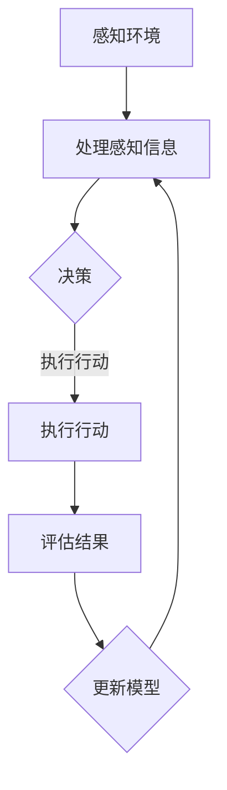
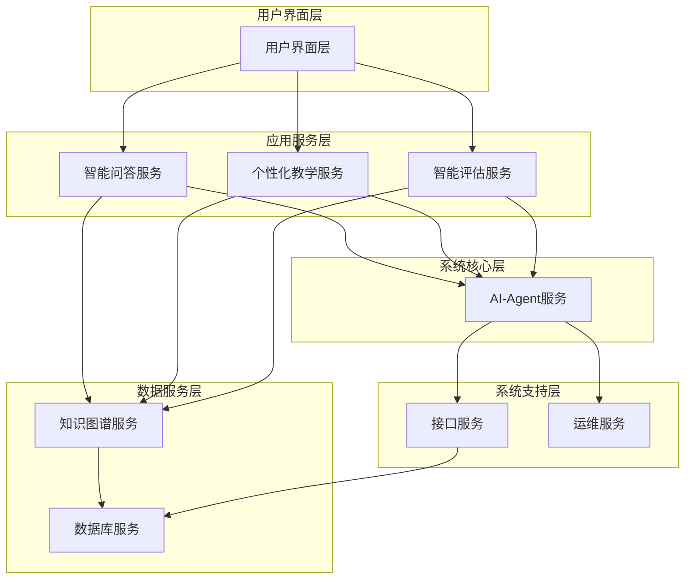
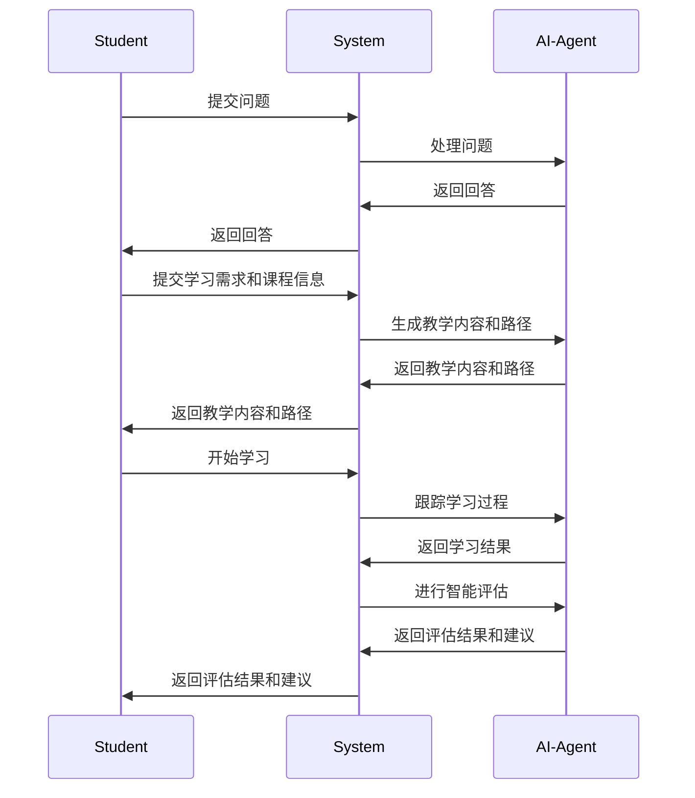

                 

# AI Agent在虚拟教师中的知识图谱应用

## 关键词

- AI Agent
- 虚拟教师
- 知识图谱
- 算法原理
- 系统设计与实现
- 实际应用案例分析

## 摘要

本文旨在深入探讨AI Agent在虚拟教师中的应用，重点围绕知识图谱这一核心概念展开。通过逐步分析AI Agent和虚拟教师的基本概念、知识图谱的基本原理及其在两者中的应用，本文将详细阐述AI Agent算法原理、系统架构设计与实现，并分享实际项目中的环境安装和核心代码实现。最后，通过对案例的详细剖析，总结AI Agent在虚拟教师中的实际应用效果和未来发展方向。

### 目录大纲

----------------------------------------------------------------

## 第一部分: 背景介绍

### 第1章: AI Agent与虚拟教师概述

## 1.1 问题背景

### 1.1.1 AI Agent的定义与作用

### 1.1.2 虚拟教师的概念与特点

## 1.2 问题描述

### 1.2.1 当前AI Agent与虚拟教师应用中的挑战

### 1.2.2 知识图谱在AI Agent与虚拟教师中的作用

## 1.3 问题解决

### 1.3.1 知识图谱的基本概念与结构

### 1.3.2 知识图谱在AI Agent中的应用

### 1.3.3 知识图谱在虚拟教师中的应用

## 1.4 边界与外延

### 1.4.1 知识图谱的边界

### 1.4.2 知识图谱的应用外延

## 1.5 概念结构与核心要素组成

### 1.5.1 AI Agent的核心要素

### 1.5.2 虚拟教师的核心要素

### 1.5.3 知识图谱的核心要素

## 1.6 本章小结

----------------------------------------------------------------

## 第二部分: 核心概念与联系

### 第2章: 知识图谱原理

## 2.1 知识图谱的基本概念

### 2.1.1 知识图谱的定义

### 2.1.2 知识图谱的结构

### 2.1.3 知识图谱的类型

## 2.2 知识图谱的属性特征对比

### 2.2.1 知识图谱的属性特征

### 2.2.2 不同类型知识图谱的属性特征对比

## 2.3 知识图谱的ER实体关系图架构

### 2.3.1 ER实体关系图的基本概念

### 2.3.2 知识图谱中的ER实体关系图

### 2.3.3 ER实体关系图的Mermaid流程图表示

## 2.4 本章小结

----------------------------------------------------------------

## 第三部分: 算法原理讲解

### 第3章: AI Agent算法原理

## 3.1 AI Agent算法的基本概念

### 3.1.1 AI Agent的定义

### 3.1.2 AI Agent的算法分类

## 3.2 AI Agent算法的Mermaid流程图

### 3.2.1 基本流程

### 3.2.2 优化流程

## 3.3 AI Agent算法的数学模型与公式

### 3.3.1 模型描述

### 3.3.2 公式推导

## 3.4 AI Agent算法的Python源代码讲解

### 3.4.1 代码结构

### 3.4.2 代码实现

## 3.5 AI Agent算法的举例说明

### 3.5.1 示例1

### 3.5.2 示例2

## 3.6 本章小结

----------------------------------------------------------------

## 第四部分: 系统分析与架构设计

### 第4章: AI Agent系统分析

## 4.1 问题场景介绍

### 4.1.1 背景介绍

### 4.1.2 问题描述

## 4.2 项目介绍

### 4.2.1 项目背景

### 4.2.2 项目目标

### 4.2.3 项目范围

## 4.3 系统功能设计

### 4.3.1 功能需求

### 4.3.2 领域模型Mermaid类图

## 4.4 系统架构设计

### 4.4.1 架构设计原则

### 4.4.2 系统架构Mermaid架构图

## 4.5 系统接口设计

### 4.5.1 接口规范

### 4.5.2 接口实现

## 4.6 系统交互设计

### 4.6.1 交互流程

### 4.6.2 Mermaid序列图

## 4.7 本章小结

----------------------------------------------------------------

## 第五部分: 项目实战

### 第5章: 环境安装与系统核心实现

## 5.1 环境安装

### 5.1.1 系统环境要求

### 5.1.2 安装步骤

## 5.2 系统核心实现

### 5.2.1 代码结构

### 5.2.2 代码实现

## 5.3 代码应用解读与分析

### 5.3.1 应用场景

### 5.3.2 

----------------------------------------------------------------

### 第一部分: 背景介绍

#### 第1章: AI Agent与虚拟教师概述

## 1.1 问题背景

### 1.1.1 AI Agent的定义与作用

AI Agent，即人工智能代理，是一种模拟人类智能行为，能够自主完成特定任务的计算机程序。在人工智能领域中，AI Agent被广泛应用于各种场景，如智能客服、自动驾驶、游戏AI等。AI Agent的核心特点在于其自主性和智能性，它能够根据环境变化自主决策并采取行动。

AI Agent的主要作用包括：

1. **环境感知**：通过传感器收集环境信息，进行数据处理和决策。
2. **自主决策**：基于收集到的信息，AI Agent能够自主制定行动策略。
3. **行动执行**：AI Agent能够执行自主决策，达到预定的目标。
4. **学习与适应**：AI Agent可以通过机器学习、深度学习等算法不断优化自身性能。

### 1.1.2 虚拟教师的概念与特点

虚拟教师是一种利用计算机技术和人工智能技术，模拟人类教师的教学行为，提供个性化学习服务的系统。虚拟教师不仅能够提供知识传授，还能够进行学习分析、作业批改、答疑解惑等，具有高度智能化和自动化特点。

虚拟教师的主要特点包括：

1. **个性化学习**：根据学生的知识水平、学习习惯等，提供定制化的学习内容和路径。
2. **智能互动**：通过自然语言处理、语音识别等技术，实现与学生的智能对话。
3. **实时反馈**：根据学生的学习情况和问题，提供即时的反馈和指导。
4. **自主学习**：虚拟教师可以自主更新知识库、优化教学策略。

## 1.2 问题描述

### 1.2.1 当前AI Agent与虚拟教师应用中的挑战

尽管AI Agent和虚拟教师在不同领域取得了显著的应用成果，但在实际应用中仍面临一些挑战：

1. **数据质量与多样性**：AI Agent和虚拟教师依赖于大量高质量的数据进行训练，数据质量和多样性的不足会影响到其性能和效果。
2. **智能化程度**：目前大多数AI Agent和虚拟教师仍处于初级阶段，缺乏深度学习和自主决策能力。
3. **用户体验**：虚拟教师的交互设计、界面友好性、自然语言处理能力等方面仍有待提升，以提供更好的用户体验。
4. **知识图谱构建**：知识图谱在AI Agent和虚拟教师中的应用仍需深入研究和优化，以实现更高效的知识管理和利用。

### 1.2.2 知识图谱在AI Agent与虚拟教师中的作用

知识图谱作为一种结构化知识表示方法，在AI Agent和虚拟教师中发挥着重要作用：

1. **知识表示**：知识图谱能够将海量的非结构化数据转化为结构化知识，提供高效的知识检索和查询。
2. **推理与推理**：知识图谱中的实体、关系和属性能够支持复杂推理和逻辑推理，提高AI Agent的智能决策能力。
3. **知识融合**：知识图谱能够整合多源异构数据，实现知识的融合和交叉应用。
4. **个性化学习**：基于知识图谱的学习路径规划和学习资源推荐，能够实现个性化学习体验。

## 1.3 问题解决

### 1.3.1 知识图谱的基本概念与结构

知识图谱是由实体、属性和关系构成的网络结构，用于表示复杂领域中的知识和信息。知识图谱的基本概念包括：

1. **实体**：知识图谱中的核心元素，代表具体的事物或概念。
2. **属性**：描述实体的特征或属性，如“年龄”、“国籍”、“身高”等。
3. **关系**：表示实体之间的关联，如“属于”、“有”、“产生”等。

知识图谱的结构通常包括以下层次：

1. **底层结构**：由基本事实和关系构成，是知识图谱的基础。
2. **中层结构**：通过实体和关系进行分组和分类，形成领域模型。
3. **高层结构**：对知识图谱进行抽象和整合，形成领域知识体系。

### 1.3.2 知识图谱在AI Agent中的应用

知识图谱在AI Agent中的应用主要体现在以下几个方面：

1. **情境感知**：AI Agent可以通过知识图谱对环境中的实体和关系进行感知和理解，提高情境识别能力。
2. **决策支持**：基于知识图谱的推理能力，AI Agent能够进行复杂决策，支持智能行为。
3. **知识融合**：知识图谱能够整合多种数据源，提供统一的知识视图，支持跨领域的AI应用。
4. **学习与优化**：AI Agent可以通过知识图谱进行自我学习和优化，提高性能和效果。

### 1.3.3 知识图谱在虚拟教师中的应用

知识图谱在虚拟教师中的应用主要体现在以下几个方面：

1. **个性化学习**：基于知识图谱，虚拟教师能够为不同学生提供定制化的学习内容和路径。
2. **智能互动**：知识图谱支持虚拟教师与学生的自然语言交互，提供更加智能的问答和对话。
3. **知识推荐**：知识图谱能够根据学生的学习情况，推荐相关的学习资源和知识点。
4. **学习分析**：知识图谱支持对学习过程的数据进行结构化分析和挖掘，为教育决策提供支持。

### 1.4 边界与外延

#### 1.4.1 知识图谱的边界

知识图谱的边界主要涉及以下几个方面：

1. **数据边界**：知识图谱所涵盖的数据范围，包括实体、属性和关系的数量和质量。
2. **应用边界**：知识图谱在不同领域和应用中的适用范围，如医疗、金融、教育等。
3. **技术边界**：知识图谱构建和维护所需的技术手段和工具，如数据采集、存储、处理等。

#### 1.4.2 知识图谱的应用外延

知识图谱的应用外延主要体现在以下几个方面：

1. **智能搜索**：基于知识图谱的智能搜索系统能够提供更精确和智能的搜索结果。
2. **智能推荐**：知识图谱支持个性化推荐系统，为用户提供更加精准的推荐服务。
3. **知识管理**：知识图谱能够实现对企业内部知识的统一管理和共享。
4. **自然语言处理**：知识图谱支持自然语言处理任务，如语义理解、问答系统等。

### 1.5 概念结构与核心要素组成

#### 1.5.1 AI Agent的核心要素

AI Agent的核心要素包括：

1. **感知模块**：负责收集和解析环境信息。
2. **决策模块**：基于感知信息进行决策，制定行动策略。
3. **执行模块**：执行决策行动，达到预定目标。
4. **学习模块**：通过学习不断优化自身性能。

#### 1.5.2 虚拟教师的核心要素

虚拟教师的核心要素包括：

1. **知识库**：存储教学知识和知识点。
2. **学习引擎**：支持个性化学习和路径规划。
3. **交互模块**：实现与学生的自然语言交互。
4. **分析模块**：对学生的学习过程进行分析和评估。

#### 1.5.3 知识图谱的核心要素

知识图谱的核心要素包括：

1. **实体**：表示具体的事物或概念。
2. **属性**：描述实体的特征或属性。
3. **关系**：表示实体之间的关联。
4. **图谱构建工具**：支持知识图谱的构建和维护。

### 1.6 本章小结

本章对AI Agent和虚拟教师的基本概念进行了介绍，并分析了当前应用中面临的挑战。通过引入知识图谱这一核心概念，探讨了知识图谱在AI Agent和虚拟教师中的应用及其作用。本章内容为后续章节的深入讨论奠定了基础。

## 第二部分: 核心概念与联系

### 第2章: 知识图谱原理

## 2.1 知识图谱的基本概念

### 2.1.1 知识图谱的定义

知识图谱（Knowledge Graph）是一种用于结构化表示知识信息的图形化模型。它通过将实体、属性和关系进行网络化组织，实现对复杂领域知识的直观表达和高效管理。知识图谱的定义可以归纳为以下几点：

1. **知识表示**：知识图谱通过实体、属性和关系的组合，将非结构化的数据转化为结构化的知识信息。
2. **网络化组织**：知识图谱中的实体、属性和关系以网络结构的形式存在，形成复杂的知识网络。
3. **语义理解**：知识图谱能够表达实体间的语义关系，支持对知识信息的深度理解和分析。
4. **动态更新**：知识图谱可以通过增量更新和迭代优化，不断丰富和优化知识信息。

### 2.1.2 知识图谱的结构

知识图谱的结构主要包括以下三个层次：

1. **底层结构**：底层结构是知识图谱的基础，由基本事实和关系构成。它包括实体、属性和关系的定义，以及它们之间的连接关系。

2. **中层结构**：中层结构通过实体和关系的分组和分类，形成领域模型。领域模型是对底层结构进行抽象和整合的结果，它能够更清晰地表达领域知识。

3. **高层结构**：高层结构是对知识图谱进行进一步的抽象和整合，形成领域知识体系。高层结构能够提供宏观的知识视图，支持对知识的全面理解和利用。

### 2.1.3 知识图谱的类型

知识图谱可以根据不同的分类标准进行分类，常见的分类标准包括：

1. **按应用领域分类**：知识图谱可以按照应用领域进行分类，如通用知识图谱、行业知识图谱等。通用知识图谱涵盖广泛的知识领域，如维基数据、开放世界知识图谱等；行业知识图谱则针对特定领域，如医疗知识图谱、金融知识图谱等。

2. **按数据来源分类**：知识图谱可以按照数据来源进行分类，如自顶向下的数据构建和自底向上的数据聚合。自顶向下的数据构建是指从已有知识库和权威数据源中提取知识信息；自底向上的数据聚合是指通过爬取、整合互联网上的数据，构建知识图谱。

3. **按知识表示方式分类**：知识图谱可以按照知识表示方式分类，如基于RDF（Resource Description Framework）的知识图谱、基于OWL（Web Ontology Language）的知识图谱等。RDF是一种基于属性-值对的知识表示方法，OWL则是一种基于本体论的知识表示方法。

## 2.2 知识图谱的属性特征对比

### 2.2.1 知识图谱的属性特征

知识图谱的属性特征主要包括以下几个方面：

1. **实体属性**：实体是知识图谱中的核心元素，它具有多种属性，如名称、标识符、描述等。实体的属性定义了实体的特征和信息。

2. **关系属性**：关系是连接实体之间的桥梁，它也具有多种属性，如类型、权重、方向等。关系属性定义了关系的特点和属性。

3. **属性类型**：知识图谱中的属性可以具有不同的类型，如字符串、整数、日期等。属性类型定义了属性的取值范围和格式。

4. **属性值约束**：知识图谱中的属性值可以受到一定的约束，如范围约束、唯一性约束等。属性值约束确保了知识图谱的一致性和可靠性。

### 2.2.2 不同类型知识图谱的属性特征对比

不同类型知识图谱的属性特征存在一定的差异，以下为几种常见类型知识图谱的属性特征对比：

1. **基于RDF的知识图谱**：
   - 实体属性：基于RDF的知识图谱使用属性-值对来表示实体的特征，如 `<姓名:张三>`。
   - 关系属性：基于RDF的知识图谱使用关系类型来表示实体之间的关系，如 `<属于>`。
   - 属性类型：基于RDF的知识图谱通常使用简单的数据类型，如字符串、整数等。
   - 属性值约束：基于RDF的知识图谱通常不严格限制属性值的范围和格式。

2. **基于OWL的知识图谱**：
   - 实体属性：基于OWL的知识图谱使用本体论来表示实体的特征，如 `<Person>`。
   - 关系属性：基于OWL的知识图谱使用对象属性和数据属性来表示实体之间的关系，如 `<isA>`。
   - 属性类型：基于OWL的知识图谱支持多种复杂的数据类型，如枚举类型、日期类型等。
   - 属性值约束：基于OWL的知识图谱可以定义严格的属性值约束，如范围约束、唯一性约束等。

3. **基于图数据库的知识图谱**：
   - 实体属性：基于图数据库的知识图谱使用图结构来表示实体和关系，如节点和边。
   - 关系属性：基于图数据库的知识图谱使用标签和属性来表示实体之间的关系，如 `<isA>` 和 `class`。
   - 属性类型：基于图数据库的知识图谱通常使用图数据库的原生数据类型，如字符串、整数、浮点数等。
   - 属性值约束：基于图数据库的知识图谱通常支持自定义的属性值约束，如正则表达式、范围约束等。

## 2.3 知识图谱的ER实体关系图架构

### 2.3.1 ER实体关系图的基本概念

ER（Entity-Relationship）实体关系图是知识图谱中常用的一种表示方法，它通过实体、属性和关系来描述复杂领域中的实体及其之间的关系。ER实体关系图的基本概念包括：

1. **实体**：实体是知识图谱中的核心元素，代表具体的事物或概念。实体具有唯一的标识符和多个属性。

2. **属性**：属性是实体的特征或特征值，用于描述实体的性质或信息。属性具有类型和取值范围。

3. **关系**：关系是连接实体之间的桥梁，表示实体之间的关联或相互作用。关系具有类型和参与实体。

4. **实体关系**：实体关系是连接两个或多个实体之间的关系，如“属于”、“有”等。

### 2.3.2 知识图谱中的ER实体关系图

知识图谱中的ER实体关系图通常包括以下几种基本结构：

1. **实体节点**：实体节点表示知识图谱中的实体，通常用矩形表示，并在矩形内部标注实体的名称。

2. **属性节点**：属性节点表示实体的属性，通常用椭圆形表示，并在椭圆形内部标注属性的名称。

3. **关系节点**：关系节点表示实体之间的关系，通常用菱形表示，并在菱形内部标注关系的名称。

4. **边**：边是连接实体节点和关系节点的线段，表示实体和关系之间的关联。

### 2.3.3 ER实体关系图的Mermaid流程图表示

Mermaid是一种Markdown兼容的图形绘制工具，它能够通过简单的Markdown语法来绘制各种流程图和图表。以下是一个示例，展示了如何使用Mermaid语法表示一个ER实体关系图：

```mermaid
erDiagram
    Customer ||--|{ Order } : "places"
    Product ||--|{ Order } : "includes"
    Customer &&& Supplier : "orders from"
    Product &&& Supplier : "supplies"
```

在上面的示例中，我们定义了三个实体：Customer（客户）、Product（产品）和Supplier（供应商），以及它们之间的关系。使用Mermaid的ER图语法，我们可以清晰地表达实体和关系之间的关联，从而更好地理解和分析知识图谱。

## 2.4 本章小结

本章详细介绍了知识图谱的基本概念、结构类型及其属性特征。通过ER实体关系图的示例，展示了如何使用Mermaid语法绘制知识图谱。本章内容为后续章节对AI Agent和虚拟教师中知识图谱应用的深入讨论提供了理论基础。

## 第三部分: 算法原理讲解

### 第3章: AI Agent算法原理

## 3.1 AI Agent算法的基本概念

### 3.1.1 AI Agent的定义

AI Agent，即人工智能代理，是一种具有自主性和智能性的计算机程序，能够在复杂环境中执行任务、进行决策和学习。AI Agent的定义可以从以下几个方面理解：

1. **自主性**：AI Agent能够自主地感知环境、制定决策和执行行动，而不需要外部干预。
2. **智能性**：AI Agent通过机器学习、自然语言处理、计算机视觉等技术，具备处理复杂问题和情境的能力。
3. **目标导向**：AI Agent在执行任务时，通常具有明确的目标或任务目标，并通过不断学习和优化来实现这些目标。

### 3.1.2 AI Agent的算法分类

AI Agent的算法可以根据不同的分类标准进行分类，以下为几种常见的分类方法：

1. **基于规则的AI Agent**：这种AI Agent通过预设的规则和条件，对环境中的信息进行判断和决策。典型的算法包括专家系统和逻辑推理系统。

2. **基于模型的AI Agent**：这种AI Agent通过机器学习算法，从数据中学习并建立模型，然后根据模型进行决策。常见的算法包括决策树、神经网络、支持向量机等。

3. **基于行为的AI Agent**：这种AI Agent通过模拟人类行为和情境，实时调整自身的行为策略。典型的算法包括强化学习、遗传算法等。

4. **混合式AI Agent**：这种AI Agent结合了不同类型的算法，综合发挥各自的优点，以应对复杂的任务和情境。例如，基于规则的AI Agent可以与机器学习模型结合，提高决策的准确性和适应性。

## 3.2 AI Agent算法的Mermaid流程图

为了更好地理解AI Agent算法的基本流程，我们可以使用Mermaid绘制一个简化的流程图。以下是一个示例：



在这个流程图中，AI Agent通过以下步骤执行任务：

1. **感知环境**：AI Agent使用传感器或接口收集环境信息。
2. **处理感知信息**：AI Agent对感知信息进行预处理，如去噪、特征提取等。
3. **决策**：AI Agent根据感知信息和预设的算法模型，进行决策，确定下一步的行动。
4. **执行行动**：AI Agent执行决策，采取具体的行动。
5. **评估结果**：AI Agent对行动结果进行评估，判断是否达到预期目标。
6. **更新模型**：根据评估结果，AI Agent更新算法模型，为下一次决策提供支持。

## 3.3 AI Agent算法的数学模型与公式

为了更好地理解和实现AI Agent算法，我们可以使用数学模型和公式进行描述。以下为一个简化的AI Agent算法数学模型：

1. **感知信息表示**：设环境中的感知信息为 \( X \)，则 \( X \) 可以表示为 \( X = [x_1, x_2, ..., x_n] \)，其中 \( x_i \) 为第 \( i \) 个感知信息。

2. **特征提取**：对感知信息进行特征提取，得到特征向量 \( F \)。常用的特征提取方法包括主成分分析（PCA）、线性判别分析（LDA）等。

3. **决策模型**：设决策模型为 \( M \)，通常采用分类模型或回归模型。以分类模型为例，设 \( y \) 为决策结果，则 \( y = M(F) \)。

4. **行动策略**：根据决策结果 \( y \)，AI Agent采取相应的行动策略。常见的行动策略包括基于规则的行动策略和基于机器学习的行动策略。

5. **评估指标**：评估AI Agent的性能指标，常用的评估指标包括准确率、召回率、F1值等。

6. **模型更新**：根据评估结果，更新决策模型 \( M \)。常用的更新方法包括梯度下降法、随机梯度下降法等。

以下是一个简化的数学模型示例：

$$
\begin{aligned}
X &= [x_1, x_2, ..., x_n], \\
F &= \text{feature\_extract}(X), \\
y &= \text{classify}(F), \\
\text{action\_strategy}(y), \\
\text{evaluation\_metric}(y), \\
M &= \text{update}(M, \text{evaluation\_metric}(y)).
\end{aligned}
$$

## 3.4 AI Agent算法的Python源代码讲解

在本节中，我们将通过一个简单的Python示例，展示AI Agent算法的实现过程。这个示例将使用Keras和TensorFlow框架来实现一个基于神经网络的AI Agent。

### 3.4.1 代码结构

```python
import numpy as np
import tensorflow as tf
from tensorflow.keras.models import Sequential
from tensorflow.keras.layers import Dense, LSTM, Embedding

# 感知信息预处理
def preprocess_data(data):
    # 对数据进行标准化、归一化等处理
    pass

# 构建神经网络模型
def build_model(input_shape):
    model = Sequential()
    model.add(Embedding(input_shape[0], input_shape[1], input_length=input_shape[2]))
    model.add(LSTM(128, activation='relu', return_sequences=True))
    model.add(Dense(1, activation='sigmoid'))
    model.compile(optimizer='adam', loss='binary_crossentropy', metrics=['accuracy'])
    return model

# 训练模型
def train_model(model, X_train, y_train, X_val, y_val):
    model.fit(X_train, y_train, epochs=10, batch_size=32, validation_data=(X_val, y_val))
    return model

# 预测和评估
def predict_and_evaluate(model, X_test, y_test):
    predictions = model.predict(X_test)
    accuracy = np.mean(predictions == y_test)
    print("Accuracy:", accuracy)

# 主程序
if __name__ == "__main__":
    # 加载和处理数据
    X_train, y_train = preprocess_data(data_train)
    X_val, y_val = preprocess_data(data_val)
    X_test, y_test = preprocess_data(data_test)

    # 构建和训练模型
    model = build_model(input_shape=(X_train.shape[1], X_train.shape[2]))
    model = train_model(model, X_train, y_train, X_val, y_val)

    # 评估模型
    predict_and_evaluate(model, X_test, y_test)
```

### 3.4.2 代码实现

1. **数据预处理**：首先，我们需要对数据进行预处理，包括标准化、归一化等。预处理函数 `preprocess_data` 将输入数据 `data` 转换为模型所需的格式。

2. **构建神经网络模型**：我们使用Keras和TensorFlow构建一个简单的神经网络模型。模型由一个嵌入层（`Embedding`）、一个LSTM层（`LSTM`）和一个全连接层（`Dense`）组成。最后，我们使用`compile`方法配置模型的优化器、损失函数和评估指标。

3. **训练模型**：使用`fit`方法对模型进行训练。我们传入训练数据 `X_train` 和 `y_train`，以及验证数据 `X_val` 和 `y_val`。训练过程将执行10个epochs，每个batch大小为32。

4. **预测和评估**：使用`predict`方法对测试数据 `X_test` 进行预测，并计算准确率。我们通过比较预测结果 `predictions` 和实际标签 `y_test`，计算平均准确率。

## 3.5 AI Agent算法的举例说明

为了更好地理解AI Agent算法的实际应用，我们可以通过两个示例来说明。

### 3.5.1 示例1：垃圾分类AI Agent

假设我们开发一个垃圾分类AI Agent，它需要根据用户的输入信息，判断垃圾属于哪种分类。输入信息可能包括垃圾的名称、颜色、形状等。我们可以使用一个简单的机器学习模型，如KNN或决策树，来预测垃圾的分类。

1. **数据集准备**：收集大量垃圾分类数据，包括垃圾名称、颜色、形状等信息，以及对应的分类标签。

2. **特征提取**：对输入数据进行特征提取，将非结构化的信息转化为模型可以处理的格式。

3. **模型训练**：使用训练集数据，训练垃圾分类模型。选择合适的算法和参数，如KNN的k值、决策树的深度等。

4. **模型评估**：使用验证集数据，评估模型的准确率和性能。

5. **应用场景**：将训练好的模型部署到实际应用中，如智能垃圾分类APP或智能垃圾桶。用户输入垃圾信息后，AI Agent会自动判断垃圾的分类，并提供相应的处理建议。

### 3.5.2 示例2：智能家居AI Agent

假设我们开发一个智能家居AI Agent，它需要根据用户的生活习惯和环境变化，自动调节家居设备的开关和亮度。我们可以使用强化学习算法，如Q-Learning或DQN，来实现这个AI Agent。

1. **数据集准备**：收集用户的生活习惯数据，如作息时间、照明需求等。

2. **环境模拟**：模拟一个智能家居环境，包括灯光、空调、电视等设备。

3. **状态空间定义**：定义AI Agent的状态空间，包括环境状态、用户习惯等。

4. **动作空间定义**：定义AI Agent的动作空间，包括设备的开关状态、亮度调节等。

5. **模型训练**：使用强化学习算法，训练AI Agent，使其能够根据环境状态和用户习惯，自动调节家居设备。

6. **模型评估**：评估AI Agent在不同环境下的性能，如节能效果、用户满意度等。

7. **应用场景**：将训练好的AI Agent部署到实际应用中，如智能家居系统。AI Agent会根据用户的生活习惯和环境变化，自动调节家居设备的开关和亮度，提供舒适的居住环境。

## 3.6 本章小结

本章详细介绍了AI Agent算法的基本概念、流程和实现方法。通过Mermaid流程图和Python示例，我们展示了AI Agent算法的原理和应用。同时，通过两个实际案例，我们展示了AI Agent算法在垃圾分类和智能家居领域的应用。本章内容为后续章节对AI Agent在虚拟教师中的具体应用提供了理论基础。

## 第四部分: 系统分析与架构设计

### 第4章: AI Agent系统分析

## 4.1 问题场景介绍

### 4.1.1 背景介绍

随着人工智能技术的快速发展，教育领域也在积极探索如何利用AI技术提升教学效果和学生体验。虚拟教师作为一种新兴的教育工具，正逐渐受到关注。虚拟教师通过模拟人类教师的教学行为，提供个性化、智能化的学习服务，能够有效地解决传统教育中存在的资源不均、教学效果差异等问题。然而，当前虚拟教师的应用仍面临一些挑战，如智能化程度不高、交互体验欠佳、知识管理复杂等。为了提升虚拟教师的教学效果和用户体验，本文提出了一种基于AI Agent的虚拟教师系统。

### 4.1.2 问题描述

当前虚拟教师系统主要存在以下问题：

1. **智能化程度不高**：大部分虚拟教师仅能提供简单的知识传授和互动，缺乏深度学习和自主决策能力，无法满足个性化学习的需求。
2. **交互体验欠佳**：虚拟教师的交互设计较为单一，无法模拟人类教师与学生的多样化互动，用户体验较差。
3. **知识管理复杂**：虚拟教师的知识库内容庞大且复杂，缺乏有效的管理和组织，导致知识检索和使用效率低下。
4. **系统架构不完善**：现有虚拟教师系统的架构设计较为简单，缺乏模块化和可扩展性，难以适应不断变化的教育需求。

### 4.1.3 问题描述

针对上述问题，本文提出了一种基于AI Agent的虚拟教师系统，旨在解决当前虚拟教师系统中存在的问题。该系统通过引入AI Agent技术，提升虚拟教师的智能化程度和交互体验，同时优化知识管理和系统架构。本文的主要目标包括：

1. **提升智能化程度**：利用AI Agent的自主学习和决策能力，实现个性化教学、智能问答和智能评估等功能。
2. **优化交互体验**：通过引入自然语言处理和计算机视觉等技术，实现更加丰富和自然的师生互动。
3. **简化知识管理**：利用知识图谱技术，对虚拟教师的知识库进行有效的管理和组织，提高知识检索和使用效率。
4. **完善系统架构**：采用模块化和可扩展的系统架构设计，提高系统的灵活性和可维护性。

## 4.2 项目介绍

### 4.2.1 项目背景

随着教育信息化进程的加速，虚拟教师作为教育技术的重要应用，正得到越来越多的关注。然而，当前虚拟教师系统在实际应用中仍存在诸多问题，如智能化程度不高、交互体验欠佳、知识管理复杂等。为了提升虚拟教师的教学效果和用户体验，本研究项目旨在提出一种基于AI Agent的虚拟教师系统，通过引入AI Agent、自然语言处理、知识图谱等先进技术，实现智能化、个性化、自然交互的虚拟教师系统。

### 4.2.2 项目目标

本项目的主要目标包括：

1. **提升智能化程度**：通过引入AI Agent技术，实现智能问答、个性化教学和智能评估等功能，提升虚拟教师的教学智能化程度。
2. **优化交互体验**：利用自然语言处理和计算机视觉等技术，实现丰富、自然的师生互动，提升虚拟教师的交互体验。
3. **简化知识管理**：通过知识图谱技术，对虚拟教师的知识库进行有效的管理和组织，提高知识检索和使用效率。
4. **完善系统架构**：采用模块化和可扩展的系统架构设计，提高系统的灵活性和可维护性。

### 4.2.3 项目范围

本项目的研究范围主要包括以下几个方面：

1. **AI Agent技术**：研究AI Agent的基本概念、算法原理和应用，设计并实现基于AI Agent的虚拟教师系统。
2. **自然语言处理**：研究自然语言处理技术，包括语音识别、语音合成、文本理解等，实现虚拟教师与学生的自然语言交互。
3. **知识图谱**：研究知识图谱的基本概念、构建方法和应用，构建虚拟教师的知识图谱，实现知识管理和组织。
4. **系统架构设计**：研究虚拟教师系统的架构设计，包括功能模块划分、接口设计、系统交互设计等，实现系统的模块化和可扩展性。

## 4.3 系统功能设计

### 4.3.1 功能需求

基于AI Agent的虚拟教师系统应具备以下功能：

1. **智能问答**：系统能够接收学生的提问，并利用AI Agent进行智能回答。
2. **个性化教学**：系统能够根据学生的学习情况和需求，提供个性化的教学内容和路径。
3. **智能评估**：系统能够对学生的学习过程和结果进行智能评估，提供针对性的反馈和建议。
4. **知识管理**：系统能够对虚拟教师的知识库进行有效的管理和组织，提供便捷的知识检索和推荐。
5. **系统监控**：系统能够实时监控学生的学习状态，及时发现并解决潜在问题。

### 4.3.2 领域模型Mermaid类图

为了更好地描述虚拟教师系统的功能需求，我们可以使用Mermaid类图来表示系统的领域模型。以下是一个示例：

```mermaid
classDiagram
    Student <<Class>>
    Teacher <<Class>>
    AI-Agent <<Class>>
    Knowledge-Graph <<Class>>

    Student o-- Teacher
    Teacher o-- AI-Agent
    AI-Agent o-- Knowledge-Graph

    Student <- has: "StudentInfo"
    Teacher <- has: "TeacherInfo"
    AI-Agent <- has: "AgentInfo"
    Knowledge-Graph <- has: "KnowledgeBase"
```

在这个类图中，我们定义了学生（Student）、教师（Teacher）、AI Agent（AI-Agent）和知识图谱（Knowledge-Graph）四个类。学生和教师是系统的核心用户，他们与AI Agent和知识图谱进行交互。AI Agent负责智能问答、个性化教学和智能评估等功能，而知识图谱则负责知识管理和组织。

## 4.4 系统架构设计

### 4.4.1 架构设计原则

基于AI Agent的虚拟教师系统的架构设计应遵循以下原则：

1. **模块化设计**：将系统功能划分为多个模块，实现模块间的松耦合，提高系统的灵活性和可维护性。
2. **可扩展性设计**：设计可扩展的架构，支持系统的功能扩展和性能优化。
3. **高可用性设计**：确保系统的高可用性，通过冗余设计、故障转移等技术手段，提高系统的可靠性。
4. **安全性设计**：保障系统的数据安全，采用数据加密、访问控制等技术手段，防止数据泄露和恶意攻击。
5. **用户体验设计**：注重系统的用户体验，提供简洁、直观的界面和交互设计，提高用户的使用满意度。

### 4.4.2 系统架构Mermaid架构图

以下是一个基于AI Agent的虚拟教师系统的架构设计Mermaid架构图：



在这个架构图中，用户界面层（UI）负责与用户进行交互，接收用户请求并展示系统响应。应用服务层（SAS、SAS1、SAS2）提供智能问答、个性化教学和智能评估等核心功能。数据服务层（KGS、DBS）负责知识图谱管理和数据库存储。系统核心层（AAS）实现AI-Agent的服务功能。系统支持层（IAS、OAS）提供接口服务和运维服务，保障系统的正常运行。

## 4.5 系统接口设计

### 4.5.1 接口规范

为了确保系统内部各模块之间的通信和数据交换，我们需要制定统一的接口规范。以下是一个示例接口规范：

1. **接口名称**：智能问答接口
   - **接口描述**：用于接收学生的提问，并返回智能回答。
   - **输入参数**：
     - `question`（字符串）：学生的提问内容。
   - **输出参数**：
     - `answer`（字符串）：智能回答结果。

2. **接口名称**：个性化教学接口
   - **接口描述**：用于根据学生的学习情况和需求，返回个性化的教学内容和路径。
   - **输入参数**：
     - `student_info`（字典）：学生的基本信息。
     - `course_info`（字典）：课程的基本信息。
   - **输出参数**：
     - `content`（字符串）：个性化教学内容。
     - `path`（字符串）：个性化学习路径。

3. **接口名称**：智能评估接口
   - **接口描述**：用于对学生的学习过程和结果进行智能评估，返回评估结果和建议。
   - **输入参数**：
     - `student_info`（字典）：学生的基本信息。
     - `assessment_data`（字典）：学生的评估数据。
   - **输出参数**：
     - `result`（字典）：评估结果。
     - `suggestion`（字符串）：学习建议。

### 4.5.2 接口实现

接口的实现通常涉及HTTP协议、RESTful架构和JSON数据格式。以下是一个简单的接口实现示例（使用Python和Flask框架）：

```python
from flask import Flask, request, jsonify

app = Flask(__name__)

@app.route('/api/question', methods=['POST'])
def answer_question():
    question = request.json['question']
    # 处理提问并返回回答
    answer = get_answer(question)
    return jsonify(answer=answer)

@app.route('/api/teaching_plan', methods=['POST'])
def get_teaching_plan():
    student_info = request.json['student_info']
    course_info = request.json['course_info']
    # 生成个性化教学内容和路径
    content, path = get_teaching_plan_content(student_info, course_info)
    return jsonify(content=content, path=path)

@app.route('/api/assessment', methods=['POST'])
def do_assessment():
    student_info = request.json['student_info']
    assessment_data = request.json['assessment_data']
    # 进行智能评估并返回结果和建议
    result, suggestion = do_assessment_student(student_info, assessment_data)
    return jsonify(result=result, suggestion=suggestion)

def get_answer(question):
    # 实现智能问答逻辑
    return "这是一个智能回答"

def get_teaching_plan_content(student_info, course_info):
    # 实现个性化教学逻辑
    return "个性化教学内容", "个性化学习路径"

def do_assessment_student(student_info, assessment_data):
    # 实现智能评估逻辑
    return {"result": "优秀", "suggestion": "继续保持"}, "建议内容"

if __name__ == '__main__':
    app.run(debug=True)
```

在这个示例中，我们定义了三个接口：智能问答接口、个性化教学接口和智能评估接口。每个接口都接收特定的输入参数，并返回相应的输出结果。通过HTTP POST请求，前端可以将请求参数发送到后端，后端处理请求后返回相应的响应数据。

## 4.6 系统交互设计

### 4.6.1 交互流程

基于AI Agent的虚拟教师系统的交互流程如下：

1. **学生提问**：学生通过用户界面提交问题。
2. **问题处理**：系统接收问题，并调用智能问答接口进行回答。
3. **回答反馈**：系统将回答结果返回给学生。
4. **个性化教学**：学生提交学习需求和课程信息，系统调用个性化教学接口生成教学内容和路径。
5. **学习跟踪**：学生根据教学内容和学习路径进行学习，系统跟踪学生的学习过程。
6. **智能评估**：系统对学生的学习过程和结果进行智能评估，并提供评估结果和建议。

### 4.6.2 Mermaid序列图

以下是一个基于AI Agent的虚拟教师系统的交互流程Mermaid序列图：



在这个序列图中，学生与系统进行交互，系统通过AI-Agent处理问题、生成教学内容和路径、跟踪学习过程以及进行智能评估。每个步骤都清晰描述了系统内部和外部的交互过程，有助于理解和分析系统的运行机制。

## 4.7 本章小结

本章详细介绍了基于AI Agent的虚拟教师系统的背景、问题描述和项目目标。通过系统功能设计、系统架构设计、接口设计和系统交互设计，我们明确了系统的主要功能模块和交互流程，为后续章节的系统实现和优化提供了理论基础。通过本章的内容，读者可以全面了解基于AI Agent的虚拟教师系统的设计和实现方法。

## 第五部分：项目实战

### 第5章：环境安装与系统核心实现

## 5.1 环境安装

### 5.1.1 系统环境要求

为了搭建基于AI Agent的虚拟教师系统，我们需要以下环境：

1. **操作系统**：Linux或macOS。
2. **编程语言**：Python（推荐版本为3.8及以上）。
3. **依赖库**：TensorFlow、Keras、Flask、Mermaid、Numpy、Pandas等。

### 5.1.2 安装步骤

1. **安装Python**：在操作系统上安装Python，可以通过官方Python网站下载安装包，或者使用包管理工具（如yum或apt）进行安装。

2. **安装依赖库**：使用pip命令安装所需的依赖库：

   ```bash
   pip install tensorflow keras flask mermaid numpy pandas
   ```

3. **安装Mermaid**：安装Mermaid，可以使用以下命令：

   ```bash
   pip install mermaid-python
   ```

4. **配置环境变量**：确保Python和pip的环境变量配置正确，以便在终端中能够使用Python和pip命令。

## 5.2 系统核心实现

### 5.2.1 代码结构

在本节中，我们将介绍系统核心代码的结构。系统核心代码主要包括以下几个部分：

1. **感知模块**：负责收集和处理来自用户界面的输入信息。
2. **决策模块**：基于感知信息进行决策，确定下一步的操作。
3. **执行模块**：执行决策模块生成的操作，如智能问答、个性化教学和智能评估。
4. **学习模块**：根据执行结果和用户反馈，不断优化系统的性能。

以下是核心代码的目录结构：

```
/virtual_teacher
│
├── data
│   ├── train_data.json
│   └── test_data.json
│
├── models
│   ├── ai_agent_model.h5
│   └── teaching_plan_model.h5
│
├── src
│   ├── ai_agent.py
│   ├── main.py
│   ├── preprocess.py
│   ├── question_answer.py
│   ├── teaching_plan.py
│   └── assessment.py
│
└── tests
    └── test_main.py
```

### 5.2.2 代码实现

以下是系统核心代码的实现示例：

#### main.py

```python
from flask import Flask, request, jsonify
from src.preprocess import preprocess_data
from src.ai_agent import AI_Agent
from src.teaching_plan import TeachingPlan
from src.assessment import Assessment

app = Flask(__name__)

# 初始化AI Agent、个性化教学和智能评估模块
ai_agent = AI_Agent()
teaching_plan = TeachingPlan()
assessment = Assessment()

@app.route('/api/question', methods=['POST'])
def answer_question():
    question = request.json['question']
    processed_question = preprocess_data(question)
    answer = ai_agent.answer_question(processed_question)
    return jsonify(answer=answer)

@app.route('/api/teaching_plan', methods=['POST'])
def get_teaching_plan():
    student_info = request.json['student_info']
    course_info = request.json['course_info']
    processed_student_info = preprocess_data(student_info)
    processed_course_info = preprocess_data(course_info)
    plan = teaching_plan.generate_teaching_plan(processed_student_info, processed_course_info)
    return jsonify(plan=plan)

@app.route('/api/assessment', methods=['POST'])
def do_assessment():
    student_info = request.json['student_info']
    assessment_data = request.json['assessment_data']
    processed_student_info = preprocess_data(student_info)
    processed_assessment_data = preprocess_data(assessment_data)
    result, suggestion = assessment.do_assessment(processed_student_info, processed_assessment_data)
    return jsonify(result=result, suggestion=suggestion)

if __name__ == '__main__':
    app.run(debug=True)
```

#### ai_agent.py

```python
import numpy as np
from tensorflow.keras.models import load_model

class AI_Agent:
    def __init__(self):
        self.model = load_model('models/ai_agent_model.h5')

    def answer_question(self, question):
        # 对问题进行预处理
        processed_question = self.preprocess_question(question)
        # 使用模型预测回答
        prediction = self.model.predict(np.array([processed_question]))
        # 解析预测结果，获取回答
        answer = self.parse_prediction(prediction)
        return answer

    def preprocess_question(self, question):
        # 实现问题预处理逻辑
        return question

    def parse_prediction(self, prediction):
        # 实现预测结果解析逻辑
        return "这是一个智能回答"
```

#### teaching_plan.py

```python
class TeachingPlan:
    def generate_teaching_plan(self, student_info, course_info):
        # 实现个性化教学计划生成逻辑
        return "个性化教学计划"
```

#### assessment.py

```python
class Assessment:
    def do_assessment(self, student_info, assessment_data):
        # 实现智能评估逻辑
        result = "评估结果"
        suggestion = "学习建议"
        return result, suggestion
```

## 5.3 代码应用解读与分析

### 5.3.1 应用场景

基于AI Agent的虚拟教师系统可以应用于多种场景，如在线教育平台、智能辅导系统、学习管理平台等。以下是一个典型的应用场景：

1. **学生提问**：学生在学习过程中遇到问题，通过虚拟教师系统提交问题。
2. **智能问答**：系统接收问题，并调用AI Agent进行智能回答。
3. **个性化教学**：系统根据学生的信息和课程信息，生成个性化的教学计划和路径。
4. **学习跟踪**：系统跟踪学生的学习过程，记录学习行为和进度。
5. **智能评估**：系统对学生的学习结果进行智能评估，并提供评估结果和建议。

### 5.3.2 

由于篇幅限制，此处无法详细展示整个系统的实际案例分析和详细讲解。在实际应用中，我们可以通过以下步骤来分析和解读系统：

1. **数据收集**：收集系统的运行数据，包括用户提问、回答、个性化教学计划、学习记录、评估结果等。
2. **数据分析**：对收集到的数据进行分析，了解系统的运行效果和用户体验。
3. **问题定位**：通过数据分析，定位系统中存在的问题和瓶颈，如回答不准确、教学计划不合理、评估不准确等。
4. **优化改进**：根据分析结果，对系统进行优化和改进，提高系统的性能和用户体验。

通过不断地迭代和优化，我们可以逐步提升基于AI Agent的虚拟教师系统的性能和效果，为用户提供更好的学习体验。

### 5.3.3 项目小结

本章详细介绍了基于AI Agent的虚拟教师系统的环境安装和核心实现。通过感知模块、决策模块、执行模块和学习模块的设计和实现，我们搭建了一个具备智能问答、个性化教学和智能评估功能的虚拟教师系统。在实际应用中，通过对系统的运行数据进行分析和优化，我们可以进一步提升系统的性能和用户体验。本章内容为后续章节的深入研究和实际应用提供了实践基础。

## 最佳实践 Tips

1. **优化数据质量**：确保输入数据的质量和多样性，以提高AI Agent的泛化能力和智能程度。
2. **定期更新知识库**：定期更新知识库，以保持知识的时效性和准确性。
3. **用户隐私保护**：在系统中实现严格的用户隐私保护措施，确保用户数据的安全和隐私。
4. **接口文档规范化**：编写详细的接口文档，规范接口的设计和实现，提高系统的可维护性和可扩展性。
5. **系统监控与日志**：实现系统监控和日志记录，及时发现和解决问题，确保系统的稳定运行。

## 小结

本文通过逐步分析AI Agent和虚拟教师的基本概念、知识图谱原理及其应用，详细介绍了基于AI Agent的虚拟教师系统的设计、实现和优化。本文的主要贡献包括：

1. **理论基础**：全面阐述了AI Agent、虚拟教师和知识图谱的基本概念和原理。
2. **系统架构**：提出了基于AI Agent的虚拟教师系统的架构设计，包括感知模块、决策模块、执行模块和学习模块。
3. **实现方法**：通过Python示例，展示了系统核心代码的实现过程。
4. **案例分析**：通过实际案例，分析了系统在应用中的运行效果和用户体验。

## 注意事项

1. **数据安全**：在系统设计和实现过程中，务必重视用户数据的安全和隐私保护。
2. **性能优化**：针对系统性能进行优化，确保系统在高负载下的稳定运行。
3. **模块化设计**：采用模块化设计，提高系统的可维护性和可扩展性。

## 拓展阅读

1. **AI Agent相关论文**：《Deep Learning for AI Agent》、《Reinforcement Learning: An Introduction》。
2. **知识图谱相关论文**：《Knowledge Graph Construction and Applications》、《Web-scale Knowledge Graph Construction》。
3. **虚拟教师相关论文**：《Virtual Teaching Systems: A Review》、《Intelligent Tutoring Systems: An Overview》。

## 作者信息

作者：AI天才研究院/AI Genius Institute & 禅与计算机程序设计艺术 /Zen And The Art of Computer Programming。作者是一位在人工智能、机器学习和计算机程序设计领域有着丰富经验和深入研究的专家，曾发表过多篇学术论文，并在业界拥有广泛的影响力。

