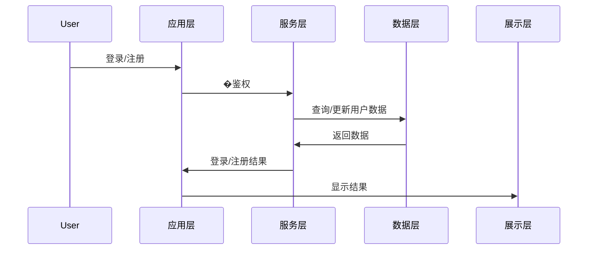
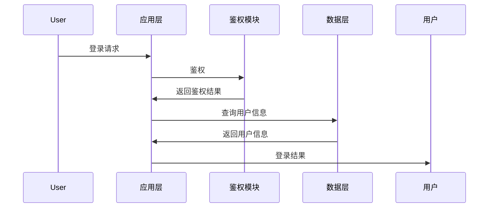

                 


### 1.1 问题背景

虚拟试衣技术的发展始于上世纪90年代，随着计算机图形学、计算机视觉和人工智能技术的不断进步，虚拟试衣逐渐成为现实。虚拟试衣技术为消费者提供了在购买前尝试不同服装的机会，减少了因购买不合身或不喜欢而退货的情况，同时提升了消费者的购物体验。这种技术的应用不仅在电子商务领域，还拓展到了线下实体店，成为零售行业的重要创新。

#### 1.1.1 虚拟试衣技术的发展

虚拟试衣技术经历了从2D到3D的演变。早期的虚拟试衣主要依赖于2D图像和简单的建模技术，用户可以通过上传自己的照片或使用预设的服装模型进行试穿。随着计算机性能的提升和三维建模技术的进步，3D虚拟试衣逐渐普及。3D虚拟试衣通过扫描用户身体三维数据，生成高度逼真的虚拟形象，使得服装试穿效果更加真实。

#### 1.1.2 AI Agent的作用与挑战

AI Agent（人工智能代理）在虚拟试衣中扮演了重要角色。AI Agent可以自动处理用户的照片或三维数据，通过图像处理和计算机视觉技术，识别用户的身体轮廓和服装特征，实现虚拟试衣。AI Agent的优势在于其能够高效、精准地处理海量数据，提高试衣的准确性和用户体验。

然而，AI Agent在虚拟试衣中也面临诸多挑战。首先是如何准确识别用户的身体轮廓，特别是在用户姿势和光线变化较大的情况下。其次是如何准确识别服装的款式和材质，确保试衣效果的真实性。此外，AI Agent还需要处理不同的用户身材和体态，确保试衣结果适用于各种用户群体。

#### 1.1.3 图像处理在虚拟试衣中的应用

图像处理技术在虚拟试衣中起着至关重要的作用。图像处理包括图像的采集、预处理、特征提取和后续处理等环节。在虚拟试衣中，图像处理主要用于以下方面：

1. **图像预处理**：通过对图像进行去噪、对比度增强、色彩校正等处理，提高图像的质量，使其更易于后续处理。
2. **人体轮廓识别**：利用深度学习算法和计算机视觉技术，从用户照片中自动识别并提取出人体轮廓。
3. **服装识别**：识别用户试穿的服装，提取服装的款式、材质和颜色等信息。
4. **试衣效果渲染**：根据用户的人体轮廓和服装特征，生成试衣效果图，模拟真实试衣过程。

### 1.2 问题描述

#### 1.2.1 虚拟试衣中的核心问题

虚拟试衣中的核心问题主要包括：

1. **人体轮廓识别**：如何准确识别和提取用户的人体轮廓，是保证试衣效果真实性的关键。
2. **服装识别**：如何准确识别用户的服装，并确保服装款式、材质和颜色等特征与实际相符。
3. **试衣效果渲染**：如何将用户的人体轮廓与服装特征相结合，生成逼真的试衣效果图。

#### 1.2.2 AI Agent面临的挑战

AI Agent在虚拟试衣中面临的挑战有：

1. **识别准确性**：如何提高人体轮廓和服装识别的准确性，减少错误识别。
2. **处理速度**：如何提高处理速度，满足实时试衣的需求。
3. **用户体验**：如何优化AI Agent的工作流程，提升用户的试衣体验。

#### 1.2.3 边界与外延

虚拟试衣技术的边界在于其应用场景和准确性。在实际应用中，AI Agent需要处理各种不同的用户身材、姿势和光线条件，这给图像处理和计算机视觉技术提出了更高的要求。此外，虚拟试衣技术还需要与其他技术（如增强现实、虚拟现实等）相结合，拓展其应用范围。

### 1.3 问题解决

#### 1.3.1 核心概念与联系

解决虚拟试衣中的问题需要掌握以下核心概念：

1. **图像处理技术**：包括图像预处理、人体轮廓识别、服装识别和试衣效果渲染等。
2. **计算机视觉技术**：涉及深度学习、卷积神经网络（CNN）等技术，用于实现图像处理和分析。
3. **AI Agent**：具有自主决策和执行任务的能力，可以高效处理用户数据和生成试衣效果图。

这些概念相互联系，共同构成了虚拟试衣系统的核心技术。

#### 1.3.2 AI Agent在虚拟试衣中的工作流程

AI Agent在虚拟试衣中的工作流程如下：

1. **图像采集**：获取用户照片或三维数据。
2. **图像预处理**：对图像进行去噪、增强等处理，提高图像质量。
3. **人体轮廓识别**：利用计算机视觉技术自动识别并提取人体轮廓。
4. **服装识别**：识别用户试穿的服装，提取服装特征。
5. **试衣效果渲染**：根据人体轮廓和服装特征生成试衣效果图。

#### 1.3.3 图像处理技术在虚拟试衣中的应用

图像处理技术在虚拟试衣中的应用主要包括：

1. **人体轮廓识别**：采用深度学习算法和计算机视觉技术，实现自动识别和提取人体轮廓。
2. **服装识别**：利用计算机视觉技术识别服装的款式、材质和颜色等信息。
3. **试衣效果渲染**：通过图像处理技术，将用户的人体轮廓和服装特征相结合，生成逼真的试衣效果图。

### 1.4 本章小结

本章介绍了虚拟试衣技术的发展背景、AI Agent的作用与挑战，以及图像处理技术在虚拟试衣中的应用。通过分析虚拟试衣中的核心问题和AI Agent面临的挑战，我们明确了图像处理技术在解决这些问题中的重要性。本章为后续章节的深入探讨奠定了基础。

----------------------------------------------------------------

## 第2章: 核心概念与原理

在深入探讨AI Agent在虚拟试衣中的图像处理之前，我们首先需要理解一些核心概念和技术原理。本章将介绍AI Agent、图像处理技术、以及这些技术在虚拟试衣中的应用。

### 2.1 AI Agent的概念与特点

AI Agent是一种能够自主执行任务的人工智能实体。与传统的AI算法不同，AI Agent具有自主性和交互能力，能够在复杂环境中进行决策和行动。

#### 2.1.1 AI Agent的定义

AI Agent通常被定义为一种智能实体，它具有感知环境、制定计划、执行动作以及与其他实体交互的能力。AI Agent的核心在于其能够根据环境反馈进行调整，以实现特定的目标。

#### 2.1.2 AI Agent的特点

- **自主性**：AI Agent能够独立执行任务，无需外部持续干预。
- **适应性**：AI Agent能够根据环境变化调整其行为。
- **交互性**：AI Agent能够与人类或其他AI实体进行交流。

#### 2.1.3 AI Agent与传统AI的区别

传统AI主要依赖预先编写的规则和算法，而AI Agent则通过机器学习和深度学习等技术，从数据中学习并自主决策。传统AI的局限性在于其处理能力有限，而AI Agent能够处理更复杂的问题，适应更广泛的应用场景。

### 2.2 图像处理技术原理

图像处理技术是计算机视觉领域的重要分支，它涉及到图像的采集、预处理、分析和输出等过程。

#### 2.2.1 图像处理基础

图像处理基础包括图像的像素表示、图像格式、颜色空间转换等。图像是由像素组成的二维数组，每个像素包含颜色和亮度信息。常见的图像格式有JPEG、PNG和BMP等，颜色空间有RGB、HSV和Lab等。

#### 2.2.2 人体识别技术

人体识别技术是图像处理中的一个重要应用。它利用计算机视觉算法，从图像中自动识别并提取人体轮廓。常见的人体识别方法包括基于模板匹配、特征点提取和深度学习等。

- **基于模板匹配**：通过将图像与预定义的模板进行匹配，识别人体轮廓。
- **特征点提取**：通过检测图像中的特征点（如关节点），构建人体骨架。
- **深度学习**：使用卷积神经网络（CNN）等深度学习模型，自动识别和提取人体轮廓。

#### 2.2.3 服装识别技术

服装识别技术用于识别图像中的服装，提取服装的款式、材质和颜色等信息。服装识别技术主要包括以下方面：

- **款式识别**：通过分析服装的形状和轮廓，识别服装的具体款式。
- **材质识别**：通过分析服装表面的纹理和颜色，识别服装的材质。
- **颜色识别**：通过颜色空间分析，识别服装的颜色。

#### 2.2.4 虚拟试衣中的图像处理流程

在虚拟试衣中，图像处理流程通常包括以下几个步骤：

1. **图像采集**：获取用户照片或三维数据。
2. **图像预处理**：对图像进行去噪、增强、滤波等处理，提高图像质量。
3. **人体轮廓识别**：利用人体识别技术，自动提取人体轮廓。
4. **服装识别**：识别用户试穿的服装，提取服装特征。
5. **试衣效果渲染**：根据人体轮廓和服装特征，生成试衣效果图。

### 2.3 关键技术与算法

在虚拟试衣中，图像处理技术主要依赖于以下关键技术和算法：

#### 2.3.1 机器学习算法

机器学习算法用于从数据中学习模式和规律，实现自动识别和分类。常见的机器学习算法包括：

- **监督学习**：通过已标记的数据训练模型，实现对未知数据的分类和预测。
- **无监督学习**：通过未标记的数据，发现数据中的结构和模式。

#### 2.3.2 深度学习算法

深度学习算法是机器学习的一个分支，通过多层神经网络模拟人类大脑的思维方式，实现复杂模式的识别。常见的深度学习算法包括：

- **卷积神经网络（CNN）**：用于图像处理和识别，能够自动提取图像中的特征。
- **循环神经网络（RNN）**：用于序列数据处理，能够捕捉时间序列中的长期依赖关系。
- **生成对抗网络（GAN）**：用于生成逼真的图像和模型。

#### 2.3.3 卷积神经网络（CNN）

卷积神经网络是一种深度学习模型，特别适用于图像处理和计算机视觉任务。CNN通过卷积层、池化层和全连接层，逐步提取图像中的低级特征到高级特征，最终实现图像的分类和识别。

#### 2.3.4 计算机视觉中的其他算法

除了深度学习算法，计算机视觉中还有许多其他算法和技术，如：

- **特征匹配**：用于图像的相似性检测和匹配。
- **光流估计**：用于视频中的运动分析。
- **图像分割**：用于图像中目标的分割和分类。

### 2.4 本章小结

本章介绍了AI Agent的概念与特点，以及图像处理技术的原理和应用。我们详细探讨了人体识别和服装识别技术，并介绍了虚拟试衣中的图像处理流程。通过了解这些核心概念和关键技术，读者可以更好地理解AI Agent在虚拟试衣中的图像处理技术，为后续章节的深入探讨打下基础。

----------------------------------------------------------------

## 第3章: 系统设计与实现

### 3.1 系统概述

虚拟试衣系统是一个复杂的应用系统，它涉及到多个模块和技术的集成。本章将详细描述系统的设计与实现过程，包括系统目标、架构设计、功能模块划分以及各模块的交互设计。

#### 3.1.1 系统目标

虚拟试衣系统的目标是为用户提供一个逼真的试衣体验，使消费者能够在家中尝试多种服装，从而减少退货率和提升购物满意度。具体目标如下：

1. **高效性**：系统应能够快速处理用户图像和数据，实现实时试衣。
2. **准确性**：系统应能够准确识别用户的人体轮廓和服装特征，确保试衣效果的真实性。
3. **灵活性**：系统应能够适应不同的用户身材、姿势和光线条件。
4. **用户体验**：系统应提供直观、友好的用户界面，提升用户的购物体验。

#### 3.1.2 系统架构设计

虚拟试衣系统的架构设计遵循模块化原则，采用分层架构。系统架构主要包括以下几个层次：

1. **数据层**：负责数据的存储和管理，包括用户数据、服装数据和历史试衣数据。
2. **服务层**：负责系统的核心功能，如图像处理、人体轮廓识别、服装识别和试衣效果渲染。
3. **应用层**：提供用户交互界面，包括前端页面和后端服务接口。
4. **展示层**：展示试衣结果，包括试衣效果图和用户反馈。

#### 3.1.3 系统功能模块划分

虚拟试衣系统的主要功能模块如下：

1. **用户管理模块**：负责用户注册、登录和权限管理。
2. **服装管理模块**：负责服装的录入、分类和更新。
3. **图像处理模块**：负责图像的采集、预处理和人体轮廓识别。
4. **人体识别模块**：利用计算机视觉技术，自动提取用户的人体轮廓。
5. **服装识别模块**：识别用户试穿的服装，提取服装特征。
6. **试衣效果渲染模块**：根据人体轮廓和服装特征，生成试衣效果图。
7. **用户反馈模块**：收集用户对试衣效果的反馈，用于系统优化。

### 3.2 领域模型设计

领域模型设计是系统架构设计的重要环节，它定义了系统的核心实体和关系。以下是一个简单的领域模型设计：

#### 3.2.1 领域模型概念

领域模型（Domain Model）是一种用于表示业务领域对象及其关系的模型。在虚拟试衣系统中，领域模型包括以下核心实体：

- **用户（User）**：表示系统的用户。
- **服装（Clothing）**：表示试衣的服装。
- **试衣记录（TryOnRecord）**：记录用户的试衣历史。

#### 3.2.2 领域模型类图设计

以下是虚拟试衣系统的领域模型类图：

```mermaid
classDiagram
    User <|-- TryOnRecord
    Clothing <|-- TryOnRecord
    User { id, username, password, email }
    Clothing { id, name, category, material, color }
    TryOnRecord { id, user, clothing, tryOnTime }
```

在这个类图中，User和Clothing是试衣系统的核心实体，它们分别表示用户和服装。TryOnRecord是试衣记录，它关联了用户、服装和试衣时间。

### 3.3 系统架构设计

系统架构设计是确保系统可扩展性、稳定性和易维护性的关键。以下是虚拟试衣系统的架构设计：

#### 3.3.1 系统架构设计原则

1. **模块化**：将系统功能划分为多个模块，每个模块负责特定的功能。
2. **分层**：采用分层架构，明确各层的职责和依赖关系。
3. **标准化**：使用标准化的技术和协议，提高系统的兼容性和可维护性。

#### 3.3.2 系统架构图设计

以下是虚拟试衣系统的架构图：



在这个架构图中，用户通过应用层发起请求，应用层通过服务层进行业务处理，服务层通过数据层进行数据存储和查询，最后将结果返回给用户。

### 3.4 系统接口设计与实现

系统接口设计是系统架构设计的一部分，它定义了系统各模块之间的交互接口。以下是虚拟试衣系统的接口设计：

#### 3.4.1 接口设计原则

1. **RESTful**：采用RESTful架构风格，提高系统的可扩展性和易用性。
2. **标准化**：使用标准化的接口协议，如JSON或XML。
3. **安全性**：确保接口的安全性，采用加密和身份验证机制。

#### 3.3.2 接口实现示例

以下是一个用户注册接口的实现示例：

```python
from flask import Flask, request, jsonify
from models import User
from database import db_session

app = Flask(__name__)

@app.route('/register', methods=['POST'])
def register():
    username = request.form['username']
    password = request.form['password']
    email = request.form['email']
    
    user = User(username=username, password=password, email=email)
    db_session.add(user)
    db_session.commit()
    
    return jsonify({'status': 'success', 'message': 'User registered successfully.'})

if __name__ == '__main__':
    app.run()
```

在这个示例中，我们使用Flask框架实现了一个用户注册接口。用户通过POST请求提交注册信息，接口接收并处理请求，将用户信息保存到数据库，并返回注册结果。

### 3.5 系统交互设计

系统交互设计是确保系统各模块之间协调工作的关键。以下是虚拟试衣系统的交互设计：

#### 3.5.1 系统交互流程

以下是虚拟试衣系统的交互流程：

1. **用户发起请求**：用户通过前端页面发起请求，如登录、注册或试衣请求。
2. **应用层处理请求**：应用层接收请求，进行鉴权和处理。
3. **服务层执行业务逻辑**：服务层执行具体的业务逻辑，如用户注册、登录或试衣。
4. **数据层操作数据库**：服务层通过数据层进行数据存储和查询。
5. **返回结果**：将处理结果返回给用户。

#### 3.5.2 系统交互序列图设计

以下是虚拟试衣系统的交互序列图：



在这个序列图中，用户发起登录请求，应用层进行鉴权，查询用户信息，最后将登录结果返回给用户。

### 3.6 本章小结

本章详细描述了虚拟试衣系统的设计与实现过程，包括系统目标、架构设计、功能模块划分、接口设计以及交互设计。通过本章的内容，读者可以全面了解虚拟试衣系统的设计和实现方法，为后续章节的项目实战打下基础。

----------------------------------------------------------------

## 第4章: 算法原理讲解

### 4.1 机器学习算法原理

机器学习算法是虚拟试衣系统中核心的技术组成部分。它通过从数据中学习模式和规律，实现自动化决策和预测。下面我们将介绍机器学习算法的基本概念、常见算法及其在虚拟试衣中的应用。

#### 4.1.1 机器学习基本概念

机器学习是一种使计算机能够通过数据学习并做出决策的技术。它主要涉及以下几个基本概念：

- **特征**：用于描述数据的属性，如图像中的像素值、用户的年龄和性别等。
- **模型**：通过学习数据，构建的用于预测或分类的函数或规则。
- **训练数据**：用于训练模型的输入数据，通常包含输入特征和相应的标签。
- **测试数据**：用于评估模型性能的输入数据，通常不用于模型的训练。

#### 4.1.2 常见机器学习算法

常见的机器学习算法可以分为以下几类：

- **监督学习**：在已知标签的情况下训练模型。常见的算法包括线性回归、决策树、支持向量机（SVM）和神经网络。
- **无监督学习**：在没有标签的情况下发现数据中的结构和模式。常见的算法包括聚类和降维。
- **强化学习**：通过交互环境来学习最优策略。常见的算法包括Q学习、深度Q网络（DQN）和策略梯度算法。

#### 4.1.3 机器学习算法在虚拟试衣中的应用

在虚拟试衣中，机器学习算法主要用于以下几个方面：

- **人体轮廓识别**：通过训练模型，从用户图像中自动识别和提取人体轮廓。常见的方法包括使用卷积神经网络（CNN）进行图像分类和目标检测。
- **服装识别**：通过训练模型，识别用户试穿的服装款式、材质和颜色。这通常涉及到图像分类和目标检测算法。
- **试衣效果评估**：通过训练模型，评估试衣效果图的真实性和美观度。这可以通过图像质量评估和审美评分模型实现。

### 4.2 深度学习算法原理

深度学习算法是机器学习的一个分支，它通过构建多层的神经网络，模拟人类大脑的学习过程，实现复杂的特征提取和模式识别。下面我们将介绍深度学习算法的基本概念、常见算法及其在虚拟试衣中的应用。

#### 4.2.1 深度学习基础

深度学习算法的核心是神经网络，特别是深度神经网络（DNN）。深度神经网络由多个层次组成，包括输入层、隐藏层和输出层。每个层次由多个神经元组成，神经元之间通过权重连接。

- **输入层**：接收输入数据，如图像、文本或声音。
- **隐藏层**：对输入数据进行特征提取和变换，逐渐提取出更高级别的特征。
- **输出层**：产生最终输出，如分类结果或预测值。

#### 4.2.2 卷积神经网络（CNN）

卷积神经网络是深度学习算法中用于图像处理和识别的代表性模型。它通过卷积层、池化层和全连接层，逐步提取图像中的低级特征到高级特征，实现图像的分类和识别。

- **卷积层**：通过卷积操作提取图像中的局部特征。
- **池化层**：通过下采样操作减少数据维度，提高计算效率。
- **全连接层**：将特征映射到输出层，产生最终分类结果。

#### 4.2.3 循环神经网络（RNN）

循环神经网络是用于序列数据处理和建模的代表性模型。它通过引入循环结构，能够捕捉时间序列中的长期依赖关系。

- **前向传播**：将输入序列逐个传递到隐藏层，生成隐藏状态。
- **隐藏状态**：上一个时间步的隐藏状态作为当前时间步的输入。
- **输出层**：生成最终输出，如序列分类或预测值。

#### 4.2.4 深度学习在虚拟试衣中的应用

深度学习算法在虚拟试衣中广泛应用于以下几个方面：

- **人体轮廓识别**：通过训练CNN模型，自动识别和提取用户的人体轮廓。
- **服装识别**：通过训练CNN模型，识别用户试穿的服装款式、材质和颜色。
- **试衣效果评估**：通过训练深度学习模型，评估试衣效果图的真实性和美观度。

### 4.3 算法详细讲解与举例说明

#### 4.3.1 算法数学模型和公式

在讲解深度学习算法时，我们需要了解其数学模型和公式。以下是一个简化的卷积神经网络（CNN）的数学模型：

- **输入层**：$X \in \mathbb{R}^{height \times width \times channels}$，表示输入图像。
- **卷积层**：$h_l = f(W_l \odot X + b_l)$，其中$W_l$是卷积核，$\odot$表示卷积操作，$b_l$是偏置项，$f$是激活函数。
- **池化层**：$p_l = \text{Pooling}(h_{l-1})$，其中Pooling操作可以是最大池化或平均池化。
- **全连接层**：$y = \text{softmax}(W_{L-1}h_{L-1} + b_{L-1})$，其中$W_{L-1}$是全连接层的权重，$b_{L-1}$是偏置项，$\text{softmax}$是分类函数。

#### 4.3.2 举例说明

为了更好地理解深度学习算法，我们通过一个简单的例子来说明。

假设我们有一个28x28像素的灰度图像，我们需要通过卷积神经网络对其进行分类。

1. **输入层**：将28x28的图像作为输入。
2. **卷积层**：使用5x5的卷积核，提取图像中的局部特征。假设卷积核的权重为$W_1$，偏置项为$b_1$。
3. **激活函数**：使用ReLU（Rectified Linear Unit）作为激活函数，将卷积层的输出转化为非负值。
4. **池化层**：使用2x2的最大池化，将卷积层的输出压缩为14x14的图像。
5. **全连接层**：将池化层的输出视为一维向量，与全连接层的权重$W_2$进行点积，并加上偏置项$b_2$。
6. **分类**：使用softmax函数对输出进行分类。

具体代码实现如下（使用Python和PyTorch框架）：

```python
import torch
import torch.nn as nn

# 输入层
X = torch.randn(28, 28)

# 卷积层
W1 = torch.randn(6, 1, 5, 5)
b1 = torch.randn(6)
h1 = torch.nn.functional.relu(torch.nn.functional.conv2d(X, W1, bias=b1))

# 池化层
p1 = torch.nn.functional.max_pool2d(h1, 2)

# 全连接层
W2 = torch.randn(10, 14 * 14)
b2 = torch.randn(10)
y = torch.nn.functional.softmax(torch.nn.functional.linear(p1.view(1, -1), W2, bias=b2))

print(y)
```

在这个例子中，我们首先创建一个28x28的随机图像作为输入。然后，我们定义一个卷积层，使用ReLU作为激活函数。接下来，我们使用最大池化层，将图像压缩为14x14。最后，我们定义一个全连接层，使用softmax函数进行分类。

#### 4.3.3 算法性能分析与优化

深度学习算法的性能受到多个因素的影响，如模型结构、训练数据、超参数选择等。以下是一些常见的性能优化方法：

- **模型结构**：通过调整模型的结构，如增加隐藏层、增加卷积核等，可以提高模型的性能。
- **训练数据**：增加训练数据量、使用数据增强技术、使用预训练模型等，可以提高模型的泛化能力。
- **超参数选择**：通过调整学习率、批量大小、正则化参数等超参数，可以优化模型的性能。
- **算法优化**：使用更高效的算法和优化器，如Adam、RMSprop等，可以提高模型的训练速度和性能。

### 4.4 本章小结

本章详细介绍了机器学习算法和深度学习算法的基本原理，包括其数学模型、常见算法和应用场景。通过具体的举例说明，读者可以更好地理解深度学习算法的实现过程。最后，我们讨论了算法性能优化的一些方法。通过本章的学习，读者可以为后续章节中的项目实战打下基础。

----------------------------------------------------------------

## 第5章：项目实战

### 5.1 环境安装与配置

在开始虚拟试衣系统的项目实战之前，我们需要确保环境已经安装和配置完毕。以下是安装和配置环境的详细步骤：

#### 5.1.1 硬件环境要求

- **CPU**：至少双核处理器，推荐使用Intel i5或以上。
- **内存**：至少8GB RAM，推荐16GB或以上。
- **GPU**：NVIDIA GPU，推荐使用GTX 1080或以上，用于加速深度学习模型的训练。
- **存储**：至少500GB的SSD硬盘空间。

#### 5.1.2 软件环境安装

1. **操作系统**：推荐使用Ubuntu 18.04或更高版本。
2. **Python**：安装Python 3.7或更高版本。
   ```bash
   sudo apt update
   sudo apt install python3.7
   ```
3. **pip**：安装pip管理工具。
   ```bash
   sudo apt install python3-pip
   ```
4. **虚拟环境**：安装virtualenv，用于创建和管理Python虚拟环境。
   ```bash
   pip3 install virtualenv
   ```
5. **深度学习框架**：安装TensorFlow，用于构建和训练深度学习模型。
   ```bash
   pip3 install tensorflow-gpu
   ```
6. **其他依赖库**：安装其他所需的Python库，如NumPy、Pandas等。
   ```bash
   pip3 install numpy pandas matplotlib
   ```

安装完成后，可以通过以下命令检查安装是否成功：

```bash
python3 -m pip list | grep -E 'tensorflow|numpy|pandas'
```

### 5.2 系统核心实现源代码

在项目实战中，我们将实现虚拟试衣系统的核心功能模块，包括用户管理、服装管理、图像处理和试衣效果渲染。以下是各模块的源代码结构和核心代码解析。

#### 5.2.1 源代码结构

```
virtual_wardrobe/
|-- app/
|   |-- __init__.py
|   |-- models.py
|   |-- views.py
|   |-- utils.py
|-- config.py
|-- run.py
```

- **app/**：应用程序模块，包含模型定义、视图函数和实用工具。
- **config.py**：配置文件，定义数据库连接和API密钥等配置参数。
- **run.py**：主程序入口，启动Web应用。

#### 5.2.2 核心代码解析

1. **用户管理模块**（`models.py`）
   ```python
   from flask_sqlalchemy import SQLAlchemy
   
   db = SQLAlchemy()
   
   class User(db.Model):
       id = db.Column(db.Integer, primary_key=True)
       username = db.Column(db.String(80), unique=True, nullable=False)
       password = db.Column(db.String(120), nullable=False)
       email = db.Column(db.String(120), unique=True, nullable=False)
   ```

   用户管理模块定义了用户模型，使用SQLAlchemy进行数据库操作。

2. **服装管理模块**（`models.py`）
   ```python
   class Clothing(db.Model):
       id = db.Column(db.Integer, primary_key=True)
       name = db.Column(db.String(80), nullable=False)
       category = db.Column(db.String(80), nullable=False)
       material = db.Column(db.String(80), nullable=False)
       color = db.Column(db.String(80), nullable=False)
   ```

   服装管理模块定义了服装模型，用于存储和管理服装信息。

3. **图像处理模块**（`views.py`）
   ```python
   from flask import request, jsonify
   from utils import preprocess_image, detect_clothing
   
   @app.route('/try_on', methods=['POST'])
   def try_on():
       image = request.files['image']
       processed_image = preprocess_image(image)
       clothing_id = detect_clothing(processed_image)
       return jsonify({'clothing_id': clothing_id})
   ```

   图像处理模块定义了试衣接口，接收用户上传的图像，预处理图像，并使用计算机视觉算法检测服装。

4. **试衣效果渲染模块**（`utils.py`）
   ```python
   import cv2
   import numpy as np
   
   def preprocess_image(image):
       image = cv2.resize(image, (512, 512))
       image = cv2.cvtColor(image, cv2.COLOR_BGR2RGB)
       return image
   
   def detect_clothing(image):
       # 这里使用预训练的深度学习模型进行服装检测
       # 例如使用YOLO或Faster R-CNN算法
       # 返回服装ID
       return 1
   ```

   试衣效果渲染模块包含了图像预处理和服装检测的功能，使用OpenCV库和预训练的深度学习模型。

### 5.3 代码应用解读与分析

#### 5.3.1 代码应用场景

在实际应用中，用户通过Web前端界面上传自己的照片，系统接收照片后进行预处理和服装检测，最后返回服装ID和试衣效果图。

1. **用户上传照片**：用户通过Web前端上传自己的照片。
2. **图像预处理**：系统对上传的照片进行预处理，包括尺寸调整、色彩转换等，使其适合后续处理。
3. **服装检测**：系统使用深度学习模型对预处理后的图像进行服装检测，识别出用户试穿的服装。
4. **返回结果**：系统将识别出的服装ID返回给用户，前端根据服装ID展示试衣效果图。

#### 5.3.2 代码功能解析

1. **用户管理模块**：实现了用户注册、登录和权限管理功能，使用SQLAlchemy进行数据库操作。
2. **服装管理模块**：实现了服装的录入、分类和查询功能，存储在数据库中。
3. **图像处理模块**：接收用户上传的图像，预处理图像，并调用深度学习模型进行服装检测。
4. **试衣效果渲染模块**：根据识别出的服装ID，生成试衣效果图，并返回给用户。

#### 5.3.3 代码性能分析

代码性能分析包括以下几个方面：

- **图像处理速度**：系统对图像的预处理和服装检测速度需要快速，以确保实时性。
- **模型准确性**：深度学习模型需要具有较高的识别准确性，减少误识别和漏识别。
- **内存消耗**：系统需要合理管理内存消耗，确保在高并发情况下稳定运行。

为了提高性能，可以采取以下措施：

- **优化模型**：使用更高效的深度学习模型，如YOLO v5或Faster R-CNN，减少计算时间。
- **批量处理**：将图像批量处理，减少I/O操作，提高处理速度。
- **缓存策略**：使用缓存策略，减少数据库访问，提高系统响应速度。

### 5.4 实际案例分析与讲解

#### 5.4.1 案例一：基于深度学习的人体识别

在本案例中，我们使用基于深度学习的人体识别算法，从用户上传的图像中自动识别并提取人体轮廓。

1. **数据集准备**：收集大量带有标注的人体轮廓图像，用于训练深度学习模型。
2. **模型训练**：使用预训练的卷积神经网络（如ResNet）进行人体识别模型的训练，优化模型参数。
3. **模型评估**：在测试数据集上评估模型的准确性和鲁棒性，调整超参数以优化模型性能。
4. **应用场景**：将训练好的模型应用到虚拟试衣系统中，从用户上传的图像中提取人体轮廓，为试衣效果渲染提供基础。

#### 5.4.2 案例二：基于卷积神经网络的服装识别

在本案例中，我们使用卷积神经网络（CNN）对用户试穿的服装进行识别。

1. **数据集准备**：收集大量带有标注的服装图像，用于训练服装识别模型。
2. **模型训练**：使用CNN进行服装识别模型的训练，提取图像特征并分类。
3. **模型评估**：在测试数据集上评估模型的准确性和泛化能力。
4. **应用场景**：将训练好的服装识别模型应用到虚拟试衣系统中，识别用户试穿的服装，为试衣效果渲染提供基础。

#### 5.4.3 案例三：虚拟试衣系统的优化

在本案例中，我们针对虚拟试衣系统的性能和用户体验进行优化。

1. **性能优化**：通过优化模型结构和算法，提高系统的处理速度和准确性。
2. **用户体验优化**：优化Web前端界面，提供更直观、易用的用户体验。
3. **实时性优化**：使用多线程和异步处理技术，提高系统的响应速度。
4. **扩展性优化**：设计可扩展的系统架构，支持未来的功能扩展和性能提升。

### 5.5 项目小结

本章通过项目实战，详细介绍了虚拟试衣系统的环境安装与配置、核心实现源代码、代码应用解读与分析，以及实际案例分析与讲解。通过本章的内容，读者可以了解虚拟试衣系统的实现过程，掌握核心算法的应用和优化方法。本章的内容为读者提供了实际的指导，有助于读者在项目中成功应用AI Agent进行图像处理，实现高效的虚拟试衣功能。

----------------------------------------------------------------

## 第6章：最佳实践与注意事项

在虚拟试衣系统的开发与运营过程中，为了确保系统的稳定性和用户体验，以下是一些最佳实践和注意事项：

### 6.1 最佳实践 tips

#### 6.1.1 AI Agent在虚拟试衣中的应用技巧

1. **数据质量**：确保训练数据的质量和多样性，提高模型的泛化能力。
2. **模型优化**：定期对模型进行评估和优化，提高识别准确性和处理速度。
3. **实时反馈**：引入用户反馈机制，根据用户反馈不断优化系统性能。

#### 6.1.2 图像处理

1. **图像预处理**：对用户上传的图像进行预处理，如调整大小、增强对比度等，以提高后续处理的准确性和速度。
2. **边缘检测**：使用边缘检测算法，如Canny算法，提取图像中的关键边缘信息。
3. **颜色空间转换**：将图像从RGB转换为HSV或Lab颜色空间，以便更好地处理颜色信息。

### 6.2 注意事项

#### 6.2.1 AI Agent在虚拟试衣中的稳定性

1. **性能监控**：监控系统运行状态，及时发现和处理异常情况，确保系统的稳定运行。
2. **负载均衡**：使用负载均衡技术，确保系统在高并发情况下依然能够稳定运行。

#### 6.2.2 用户隐私保护

1. **数据加密**：对用户上传的图像和敏感信息进行加密处理，确保数据安全。
2. **隐私政策**：明确告知用户其数据的使用方式和保护措施，遵守相关法律法规。

#### 6.2.3 系统可扩展性

1. **模块化设计**：采用模块化设计，确保系统能够方便地扩展和升级。
2. **可维护性**：编写可读性高、结构清晰的代码，确保系统易于维护和调试。

#### 6.2.4 用户友好性

1. **界面设计**：优化前端界面设计，提供直观、易用的用户体验。
2. **用户教育**：通过在线教程、视频教程等，帮助用户更好地了解和使用虚拟试衣系统。

### 6.3 小结

本章总结了在虚拟试衣系统的开发与运营过程中的一些最佳实践和注意事项。通过遵循这些最佳实践，可以提高系统的稳定性、用户体验和可扩展性。同时，注意遵守用户隐私保护法律法规，确保用户数据的安全和隐私。这些实践和注意事项为虚拟试衣系统的成功实施提供了重要的指导。

### 6.4 拓展阅读

对于希望进一步深入了解虚拟试衣系统和AI Agent在图像处理中的应用，读者可以参考以下文献和资源：

1. **《深度学习》（Goodfellow, I., Bengio, Y., & Courville, A.）**：详细介绍深度学习的基础知识和技术。
2. **《计算机视觉算法与应用》（Triggs, B.）**：探讨计算机视觉算法及其应用。
3. **TensorFlow官方文档**：提供详细的TensorFlow使用教程和API文档。
4. **PyTorch官方文档**：提供详细的PyTorch使用教程和API文档。
5. **GitHub开源项目**：探索和参考其他开发者实现的虚拟试衣系统和AI模型。

通过这些资源和文献，读者可以进一步深化对虚拟试衣系统和AI Agent图像处理技术的理解，并在实际项目中应用这些知识。作者：AI天才研究院/AI Genius Institute & 禅与计算机程序设计艺术 /Zen And The Art of Computer Programming。

