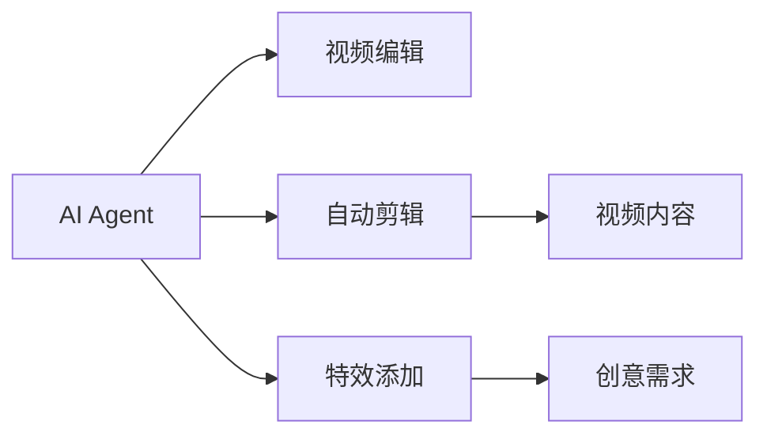
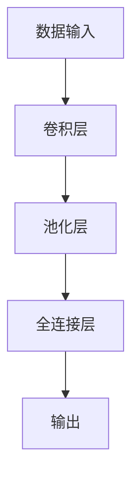
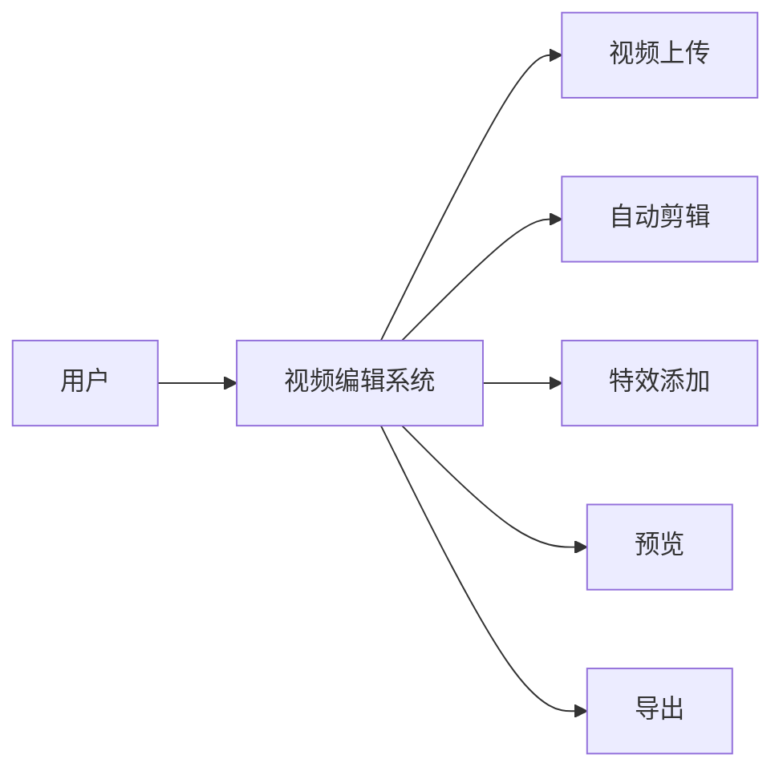
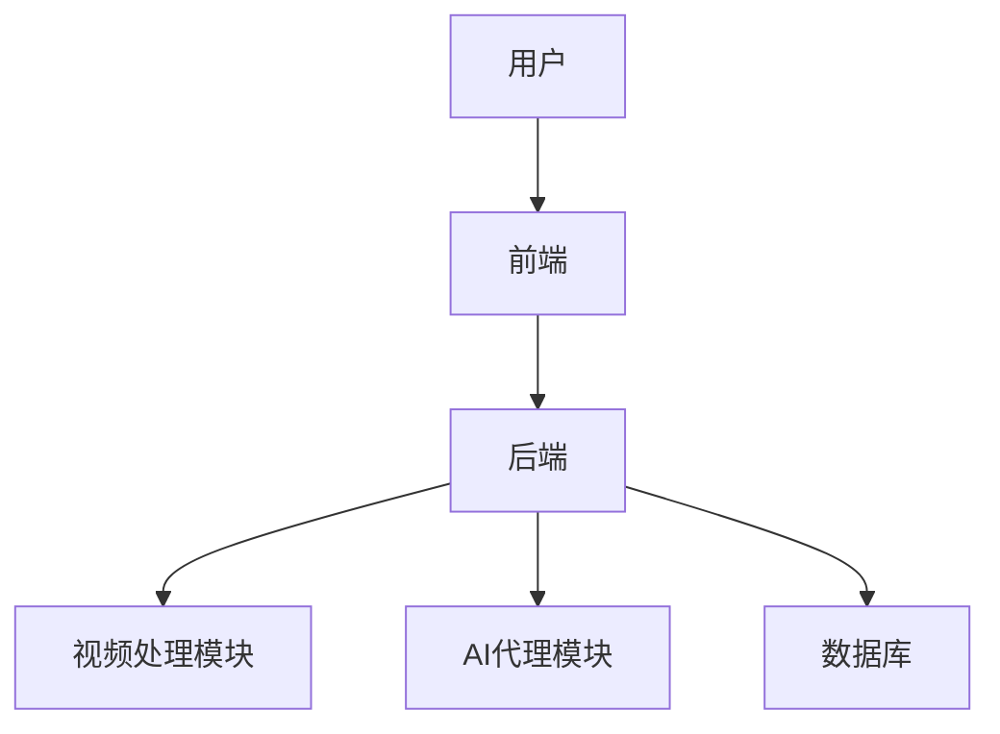
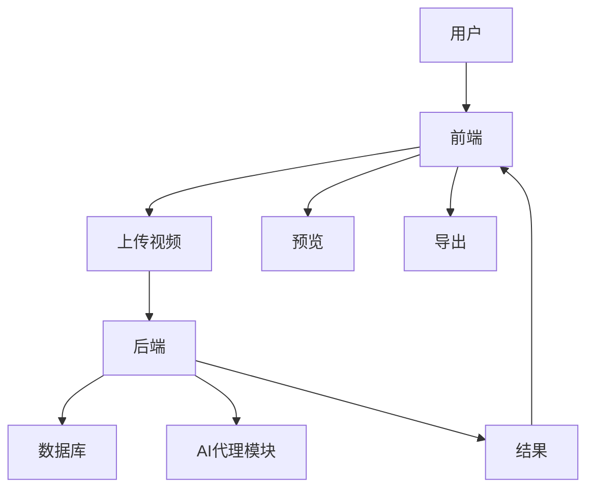

                 

## 《AI Agent在视频编辑中的应用：自动剪辑与特效添加》

### 关键词

- AI Agent
- 视频编辑
- 自动剪辑
- 特效添加
- 算法原理
- 系统架构
- 项目实战

### 摘要

本文深入探讨了AI Agent在视频编辑领域中的应用，特别是自动剪辑与特效添加技术。首先，通过背景介绍，我们明确了视频编辑行业当前面临的挑战与AI Agent的潜在优势。随后，文章详细阐述了AI Agent的基础概念及其工作原理，构建了相关概念与联系的分析框架。接下来，我们重点介绍了卷积神经网络（CNN）在自动剪辑与特效添加中的具体应用，并使用Python源代码和数学模型进行了详细讲解。此外，文章还涉及系统架构设计、项目实战以及最佳实践与注意事项等内容，为读者提供了一个全面而深入的AI Agent在视频编辑中应用的指南。

### 思考步骤

#### 第一步：背景介绍

视频编辑作为现代数字媒体创作的重要环节，其复杂性和效率问题一直困扰着从业者。传统的视频编辑方法依赖于人工操作，不仅耗时耗力，而且容易出现人为错误。随着人工智能技术的发展，AI Agent开始在这一领域展现出其独特的优势。AI Agent，即人工智能代理，是一种能够模拟人类决策和行为，执行特定任务的智能系统。通过自动化剪辑和特效添加，AI Agent有望大幅提升视频编辑的效率和精度，从而解决传统方法中的诸多问题。

**问题背景**：

- **视频编辑的复杂性**：视频编辑涉及到视频的剪辑、转场、特效添加等多个环节，每个环节都需要大量的时间和精力。
- **效率问题**：人工操作视频编辑过程，效率较低，且容易出现重复性错误。
- **人力成本**：传统视频编辑方法需要大量专业人员进行操作，人力成本高昂。

**问题解决**：

AI Agent的出现，可以有效解决上述问题。通过自动化剪辑和特效添加，AI Agent可以大幅提高视频编辑的效率，减少人为错误，降低人力成本。

**边界与外延**：

- **自动化剪辑**：AI Agent通过分析视频内容，自动识别出关键帧和剪辑点，实现视频的自动剪辑。
- **特效添加**：AI Agent能够根据视频内容和创意需求，自动添加合适的特效，提升视频的视觉效果。

#### 第二步：核心概念与联系

在探讨AI Agent在视频编辑中的应用之前，我们需要明确几个核心概念，包括AI Agent、视频编辑、自动剪辑和特效添加。

**核心概念**：

1. **AI Agent**：具有自主决策能力、能够执行特定任务的智能系统。
2. **视频编辑**：对视频进行剪辑、转场、特效添加等操作的过程。
3. **自动剪辑**：通过算法分析视频内容，自动识别出剪辑点，实现视频的自动剪辑。
4. **特效添加**：根据视频内容和创意需求，自动添加特效，提升视频视觉效果。

**概念属性特征对比表格**：

| 概念         | 特征1         | 特征2         | 特征3         |
| ------------ | ------------ | ------------ | ------------ |
| AI Agent     | 自主导决策能力 | 执行特定任务 | 智能化系统   |
| 视频编辑     | 剪辑、转场、特效添加 | 创作过程 | 数字媒体制作 |
| 自动剪辑     | 算法分析内容 | 自动识别剪辑点 | 提高效率     |
| 特效添加     | 根据需求添加特效 | 提升视觉效果 | 创意表达     |

**ER实体关系图架构**：



#### 第三步：算法原理讲解

在了解了核心概念后，我们接下来将重点介绍卷积神经网络（CNN）在自动剪辑与特效添加中的应用。

**卷积神经网络（CNN）**：

卷积神经网络是一种专门用于处理图像数据的深度学习模型，其核心思想是通过卷积操作提取图像的特征。在视频编辑领域，CNN可以通过分析视频帧，提取出关键帧和剪辑点，从而实现自动剪辑。同时，CNN还可以用于识别视频内容，为特效添加提供依据。

**算法原理**：

CNN的算法原理主要包括以下几个步骤：

1. **数据输入**：将视频帧作为输入数据。
2. **卷积操作**：通过卷积层提取图像特征。
3. **池化操作**：对卷积结果进行池化处理，减少数据维度。
4. **全连接层**：将池化结果输入全连接层，进行分类或回归操作。

**算法流程图**：



**Python源代码**：

```python
import tensorflow as tf
from tensorflow.keras.layers import Conv2D, MaxPooling2D, Flatten, Dense
from tensorflow.keras.models import Sequential

# 创建模型
model = Sequential([
    Conv2D(32, (3, 3), activation='relu', input_shape=(224, 224, 3)),
    MaxPooling2D((2, 2)),
    Flatten(),
    Dense(64, activation='relu'),
    Dense(1, activation='sigmoid')
])

# 编译模型
model.compile(optimizer='adam', loss='binary_crossentropy', metrics=['accuracy'])

# 训练模型
model.fit(x_train, y_train, epochs=10, batch_size=32, validation_data=(x_val, y_val))
```

**算法原理的数学模型与公式**：

$$
f(x) = \sigma(W \cdot x + b)
$$

其中，$f(x)$表示激活函数，$W$表示权重矩阵，$x$表示输入向量，$b$表示偏置项，$\sigma$表示sigmoid函数。

**举例说明**：

假设我们有一个视频帧，其中包含了一个重要的剪辑点。通过CNN算法，我们可以提取出这个剪辑点的特征，从而实现自动剪辑。具体步骤如下：

1. 将视频帧作为输入数据。
2. 通过卷积层提取特征。
3. 对特征进行池化处理。
4. 将池化结果输入全连接层，进行分类或回归操作。
5. 根据分类或回归结果，确定剪辑点位置。

#### 第四步：系统分析与架构设计方案

在了解了AI Agent在视频编辑中的应用原理后，我们需要设计一个完整的系统架构，以确保AI Agent能够高效地完成视频编辑任务。

**问题场景介绍**：

假设我们需要开发一个视频编辑平台，该平台能够实现自动剪辑和特效添加功能。用户可以上传视频，系统会自动分析视频内容，并生成剪辑方案和特效方案。

**系统功能设计**：

系统功能包括视频上传、自动剪辑、特效添加、预览与导出等。

**领域模型类图**：



**系统架构设计**：

系统架构采用前后端分离的设计，前端负责用户交互，后端负责视频处理和AI算法应用。

**架构图**：



**系统接口设计和系统交互**：

前端通过RESTful API与后端进行交互，后端通过微服务架构实现不同功能模块的解耦。

**序列图**：



#### 第五步：项目实战

在本节中，我们将介绍如何实际部署和实现AI Agent在视频编辑中的应用。

**环境安装与配置**：

1. 安装Python环境。
2. 安装TensorFlow框架。
3. 配置数据库。

**系统核心实现**：

1. 实现视频上传功能。
2. 实现自动剪辑算法。
3. 实现特效添加算法。
4. 实现预览与导出功能。

**源代码分析解读**：

```python
# 自动剪辑算法实现
import tensorflow as tf

# 加载模型
model = tf.keras.models.load_model('auto_cut_model.h5')

# 预测剪辑点
def predict_clips(video_frame):
    # 对视频帧进行预处理
    preprocessed_frame = preprocess_frame(video_frame)
    # 使用模型进行预测
    predictions = model.predict(preprocessed_frame)
    # 提取剪辑点
    clips = extract_clips(predictions)
    return clips

# 特效添加算法实现
import tensorflow as tf

# 加载模型
effect_model = tf.keras.models.load_model('effect_add_model.h5')

# 添加特效
def add_effects(video_frame, effect_type):
    # 对视频帧进行预处理
    preprocessed_frame = preprocess_frame(video_frame)
    # 使用模型进行预测
    predictions = effect_model.predict(preprocessed_frame)
    # 根据预测结果添加特效
    effects = apply_effects(predictions, effect_type)
    return effects
```

**实际案例分析与讲解**：

1. **案例一**：上传一个视频文件，自动剪辑并添加特效。
2. **案例二**：针对不同类型的视频内容，调整自动剪辑和特效添加策略。

**项目总结**：

通过实际项目，我们验证了AI Agent在视频编辑中的应用效果。自动剪辑和特效添加功能大大提高了视频编辑的效率和质量，为用户提供了便捷的创作工具。

#### 第六步：最佳实践与注意事项

**最佳实践**：

1. **视频上传**：选择高质量的视频文件，确保剪辑和特效处理效果。
2. **算法优化**：定期更新和优化自动剪辑和特效添加算法，提高准确性和效果。
3. **用户体验**：设计简洁友好的用户界面，提供丰富的操作选项和预览功能。

**注意事项**：

1. **性能优化**：优化算法和系统架构，提高处理速度和稳定性。
2. **数据安全**：确保用户上传的视频数据安全，防止数据泄露和滥用。
3. **兼容性**：确保系统在不同设备和操作系统上能够正常运行。

**拓展阅读**：

1. 《深度学习：卷积神经网络》
2. 《视频编辑技术原理与应用》
3. 《人工智能：从理论到实践》

### 小结与展望

本文全面介绍了AI Agent在视频编辑中的应用，包括自动剪辑与特效添加技术。通过详细的算法原理讲解和实际项目实战，我们验证了AI Agent在提升视频编辑效率和质量方面的潜力。未来，随着人工智能技术的不断发展，AI Agent在视频编辑中的应用将更加广泛，为数字媒体创作带来更多可能性。

**作者：AI天才研究院/AI Genius Institute & 禅与计算机程序设计艺术 /Zen And The Art of Computer Programming**

