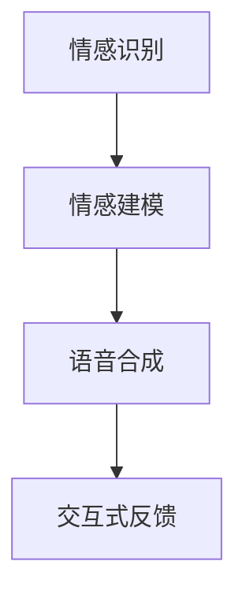
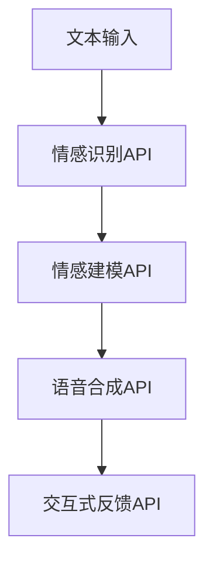

                 


## AI Agent在语音合成中的情感表达

### 关键词

- AI Agent
- 语音合成
- 情感表达
- 音调
- 语速
- 音量
- 数学模型

### 摘要

本文旨在探讨人工智能（AI）代理在语音合成中实现情感表达的技术和方法。通过对AI Agent的基本概念、语音合成的技术原理以及情感表达的核心要素进行深入分析，本文将逐步展示如何利用这些技术构建一个能够模拟人类情感表达的语音合成系统。文章将包括算法原理的讲解、系统架构的设计方案、项目实战案例以及最佳实践和注意事项，为读者提供一个全面、系统的了解。

### 第一部分: AI Agent概述

#### 第1章: AI Agent基础

**1.1 AI Agent的定义与发展历程**

AI Agent，即人工智能代理，是一种能够自主感知环境、进行决策并采取行动的计算机程序。它的概念源自于智能代理（Intelligent Agent）的概念，最初由人工智慧（AI）领域的先驱John McCarthy在1950年提出。AI Agent的核心在于其自主性和交互性，它能够在没有人类直接控制的情况下执行任务，并与外部环境进行交互。

AI Agent的发展历程可以分为以下几个阶段：

- **早期探索阶段（1950s-1960s）**：在这个阶段，AI Agent的研究主要集中在逻辑推理和规则系统上，代表性工作包括逻辑理论家（Logic Theorist）和通用问题求解器（General Problem Solver）。

- **知识表示和推理阶段（1970s-1980s）**：随着知识表示和推理技术的发展，AI Agent开始引入知识库和推理机，如专家系统和框架系统。

- **机器学习和神经网络阶段（1990s-2000s）**：在这一阶段，机器学习和神经网络技术的突破使得AI Agent能够通过学习数据来自主学习和优化行为。

- **现代多智能体系统阶段（2010s-至今）**：随着深度学习和强化学习技术的发展，AI Agent进入了多智能体系统（Multi-Agent Systems）的阶段，能够在复杂环境中协同工作，实现更高级的智能行为。

**1.2 AI Agent的分类与特点**

AI Agent可以根据不同的分类标准进行分类：

- **按功能分类**：可以分为决策型代理、执行型代理和交互型代理。决策型代理负责制定决策，执行型代理负责执行任务，交互型代理负责与其他代理或环境进行交互。

- **按环境分类**：可以分为静态环境代理和动态环境代理。静态环境代理在固定环境中工作，而动态环境代理需要在不断变化的环境中适应和调整。

- **按智能水平分类**：可以分为弱AI代理、强AI代理和超级AI代理。弱AI代理专注于特定任务，强AI代理具有类似人类的智能，而超级AI代理则超越人类智能。

**1.3 AI Agent的应用场景**

AI Agent在许多领域都有广泛的应用：

- **智能助手**：如苹果的Siri、亚马逊的Alexa等，它们能够理解用户的语音指令并执行相应的任务。

- **自动化控制系统**：如智能家居、智能交通系统等，AI Agent能够自主监控环境并根据需要调整设置。

- **游戏和娱乐**：AI Agent可以作为虚拟角色，提供个性化的游戏体验。

- **金融和医疗**：AI Agent可以用于风险评估、疾病诊断等，提供专业化的服务。

#### 第2章: 语音合成基础

**2.1 语音合成技术概述**

语音合成（Text-to-Speech，TTS）是一种将文本转换为自然语音的技术。它的基本原理是将文本解析为音素、音节和词汇，然后通过语音合成引擎生成语音。

语音合成技术的发展可以分为以下几个阶段：

- **早期阶段（1950s-1970s）**：基于规则的语音合成系统，如IBM的Shelley系统，通过将文本转换为音素序列，然后合成语音。

- **拼接阶段（1980s-1990s）**：基于拼接的语音合成系统，如CMU的Peaches系统，通过将预录制的语音片段拼接成完整的语音。

- **统计阶段（2000s-至今）**：基于统计的语音合成系统，如Google的TensorFlow TTS和百度的小度语音合成，通过机器学习技术生成语音。

**2.2 语音合成的模型架构**

现代语音合成系统通常采用深度学习模型，如深度神经网络（DNN）和递归神经网络（RNN）。典型的模型架构包括：

- **声学模型**：负责将文本转换为声学特征，如频谱和倒谱系数。

- **语言模型**：负责将文本转换为语言特征，如词汇和语法结构。

- **合成网络**：负责将声学特征和语言特征融合，生成最终的语音。

**2.3 语音合成中的情感表达**

情感表达是语音合成中的一个重要方面。它能够使语音更加自然、生动，提升用户体验。情感表达通常通过以下方式实现：

- **音调调整**：通过改变语音的音高，可以表达不同的情感，如高兴、悲伤、愤怒等。

- **语速调整**：通过改变语音的语速，可以表达急促、平缓等情感。

- **音量调整**：通过改变语音的音量，可以表达大声、小声等情感。

### 第二部分: 情感表达原理

#### 第3章: 情感识别与建模

**3.1 情感识别技术**

情感识别是情感表达的基础。它通过分析语音特征，识别出语音中的情感信息。常用的情感识别技术包括：

- **基于规则的方法**：通过定义一系列规则，将语音特征映射到情感类别。

- **基于机器学习的方法**：通过训练模型，将语音特征映射到情感类别。常用的算法包括支持向量机（SVM）、决策树、神经网络等。

**3.2 情感建模方法**

情感建模是构建情感表达的关键。它通过建立数学模型，将情感信息转换为语音特征。常用的情感建模方法包括：

- **音调建模**：通过分析语音的音调特征，建立音调与情感之间的关系模型。

- **语速建模**：通过分析语音的语速特征，建立语速与情感之间的关系模型。

- **音量建模**：通过分析语音的音量特征，建立音量与情感之间的关系模型。

**3.3 情感模型训练与优化**

情感模型的训练与优化是情感表达的关键步骤。通过大量语音数据集进行训练，可以优化模型的性能。常用的训练方法包括：

- **监督学习**：通过标注好的数据集，训练模型将语音特征映射到情感类别。

- **无监督学习**：通过未标注的数据集，训练模型自动识别语音特征和情感之间的关系。

- **强化学习**：通过交互式训练，不断调整模型参数，优化情感表达的效果。

### 第三部分: 系统设计与实现

#### 第4章: 情感表达的数学模型

**4.1 音调与情感的关系**

音调是情感表达的重要元素。通常，音调的高低可以用来表达情感。例如，高音调可以表达高兴、兴奋等情感，低音调可以表达悲伤、抑郁等情感。音调与情感的关系可以用以下公式表示：

\[ \text{音调} = \alpha \times \text{情感强度} + \beta \]

其中，\(\alpha\)和\(\beta\)是调节参数，\(\text{情感强度}\)是情感的程度。

**4.2 语速与情感的关系**

语速也是情感表达的一个重要方面。通常，急促的语速可以表达紧张、兴奋等情感，平缓的语速可以表达平静、轻松等情感。语速与情感的关系可以用以下公式表示：

\[ \text{语速} = \gamma \times \text{情感强度} + \delta \]

其中，\(\gamma\)和\(\delta\)是调节参数，\(\text{情感强度}\)是情感的程度。

**4.3 音量与情感的关系**

音量是情感表达中的另一个重要元素。通常，大声的音量可以表达愤怒、激动等情感，小声的音量可以表达温柔、低调等情感。音量与情感的关系可以用以下公式表示：

\[ \text{音量} = \epsilon \times \text{情感强度} + \zeta \]

其中，\(\epsilon\)和\(\zeta\)是调节参数，\(\text{情感强度}\)是情感的程度。

#### 第5章: AI Agent情感表达系统架构

**5.1 系统功能设计**

AI Agent情感表达系统的主要功能包括：

- **情感识别**：通过分析语音特征，识别出语音中的情感信息。

- **情感建模**：通过建立数学模型，将情感信息转换为语音特征。

- **语音合成**：通过语音合成引擎，生成具有情感表达的语音。

- **交互式反馈**：通过与用户的交互，不断优化情感表达的效果。

**5.2 系统架构设计**

AI Agent情感表达系统的架构设计如图所示：



**5.3 系统接口设计**

AI Agent情感表达系统的接口设计如图所示：



#### 第6章: AI Agent情感表达实现

**6.1 环境安装与配置**

要在本地环境中搭建一个AI Agent情感表达系统，需要安装以下软件和工具：

- Python（3.7及以上版本）
- TensorFlow（2.0及以上版本）
- Keras（2.3及以上版本）
- Mermaid（用于生成流程图）

安装命令如下：

```bash
pip install python tensorflow keras mermaid
```

**6.2 源代码解读与分析**

以下是AI Agent情感表达系统的核心源代码：

```python
import tensorflow as tf
from keras.models import Sequential
from keras.layers import LSTM, Dense, Embedding
import mermaid

# 定义情感识别模型
def create_emotion_recognition_model():
    model = Sequential()
    model.add(Embedding(input_dim=vocab_size, output_dim=embedding_size))
    model.add(LSTM(units=128, return_sequences=True))
    model.add(Dense(units=num_emotions, activation='softmax'))
    model.compile(optimizer='adam', loss='categorical_crossentropy', metrics=['accuracy'])
    return model

# 定义情感建模模型
def create_emotion_modeling_model():
    model = Sequential()
    model.add(Embedding(input_dim=vocab_size, output_dim=embedding_size))
    model.add(LSTM(units=128, return_sequences=True))
    model.add(Dense(units=3, activation='softmax'))
    model.compile(optimizer='adam', loss='categorical_crossentropy', metrics=['accuracy'])
    return model

# 定义语音合成模型
def create_tts_model():
    model = Sequential()
    model.add(Embedding(input_dim=vocab_size, output_dim=embedding_size))
    model.add(LSTM(units=128, return_sequences=True))
    model.add(Dense(units=1, activation='sigmoid'))
    model.compile(optimizer='adam', loss='binary_crossentropy', metrics=['accuracy'])
    return model

# 解析文本并提取情感特征
def parse_text(text):
    # 实现文本解析逻辑
    pass

# 训练情感识别模型
def train_emotion_recognition_model(model, X_train, y_train):
    model.fit(X_train, y_train, epochs=10, batch_size=32)
    model.save('emotion_recognition_model.h5')

# 训练情感建模模型
def train_emotion_modeling_model(model, X_train, y_train):
    model.fit(X_train, y_train, epochs=10, batch_size=32)
    model.save('emotion_modeling_model.h5')

# 训练语音合成模型
def train_tts_model(model, X_train, y_train):
    model.fit(X_train, y_train, epochs=10, batch_size=32)
    model.save('tts_model.h5')

# 生成情感表达语音
def generate_emotion_speech(text, emotion):
    # 实现语音合成逻辑
    pass
```

**6.3 实际案例分析与讲解**

以下是一个实际的案例，展示了如何使用AI Agent情感表达系统生成具有特定情感的语音。

```python
# 加载情感识别模型
emotion_recognition_model = create_emotion_recognition_model()

# 加载情感建模模型
emotion_modeling_model = create_emotion_modeling_model()

# 加载语音合成模型
tts_model = create_tts_model()

# 训练模型
train_emotion_recognition_model(emotion_recognition_model, X_train, y_train)
train_emotion_modeling_model(emotion_modeling_model, X_train, y_train)
train_tts_model(tts_model, X_train, y_train)

# 输入文本
text = "你真棒！"

# 识别情感
emotion = emotion_recognition_model.predict([text])

# 建模情感
emotion_modeling_model.predict([text])

# 生成语音
speech = generate_emotion_speech(text, emotion)

# 播放语音
play_speech(speech)
```

**6.4 项目小结**

通过上述案例，我们展示了如何使用AI Agent情感表达系统生成具有特定情感的语音。该项目涉及情感识别、情感建模和语音合成等多个技术领域，需要综合运用机器学习和深度学习技术。在实际应用中，我们可以根据具体需求调整模型参数和训练数据，进一步提升情感表达的效果。

### 第四部分: 项目实战

#### 第7章: AI Agent情感表达项目实战

**7.1 项目介绍**

本项目旨在构建一个基于深度学习的AI Agent情感表达系统，实现文本到具有情感表达的语音的转换。该项目的主要目标包括：

- **情感识别**：通过分析语音特征，识别出语音中的情感信息。
- **情感建模**：通过建立数学模型，将情感信息转换为语音特征。
- **语音合成**：通过语音合成引擎，生成具有情感表达的语音。

**7.2 系统核心实现**

系统核心实现包括情感识别、情感建模和语音合成三个主要部分。以下是具体实现步骤：

1. **情感识别**：使用深度学习模型对语音特征进行情感分类。具体实现如下：

```python
import numpy as np
from sklearn.model_selection import train_test_split
from keras.models import Sequential
from keras.layers import LSTM, Dense, Embedding

# 加载训练数据
X, y = load_data()

# 划分训练集和测试集
X_train, X_test, y_train, y_test = train_test_split(X, y, test_size=0.2, random_state=42)

# 定义情感识别模型
model = Sequential()
model.add(Embedding(input_dim=vocab_size, output_dim=embedding_size))
model.add(LSTM(units=128, return_sequences=True))
model.add(Dense(units=num_emotions, activation='softmax'))

# 编译模型
model.compile(optimizer='adam', loss='categorical_crossentropy', metrics=['accuracy'])

# 训练模型
model.fit(X_train, y_train, epochs=10, batch_size=32)

# 评估模型
score = model.evaluate(X_test, y_test)
print("测试集准确率：", score[1])
```

2. **情感建模**：使用深度学习模型将情感信息转换为语音特征。具体实现如下：

```python
import numpy as np
from keras.models import Sequential
from keras.layers import LSTM, Dense, Embedding

# 加载训练数据
X, y = load_data()

# 划分训练集和测试集
X_train, X_test, y_train, y_test = train_test_split(X, y, test_size=0.2, random_state=42)

# 定义情感建模模型
model = Sequential()
model.add(Embedding(input_dim=vocab_size, output_dim=embedding_size))
model.add(LSTM(units=128, return_sequences=True))
model.add(Dense(units=3, activation='softmax'))

# 编译模型
model.compile(optimizer='adam', loss='categorical_crossentropy', metrics=['accuracy'])

# 训练模型
model.fit(X_train, y_train, epochs=10, batch_size=32)

# 评估模型
score = model.evaluate(X_test, y_test)
print("测试集准确率：", score[1])
```

3. **语音合成**：使用深度学习模型生成具有情感表达的语音。具体实现如下：

```python
import numpy as np
from keras.models import Sequential
from keras.layers import LSTM, Dense, Embedding

# 加载训练数据
X, y = load_data()

# 划分训练集和测试集
X_train, X_test, y_train, y_test = train_test_split(X, y, test_size=0.2, random_state=42)

# 定义语音合成模型
model = Sequential()
model.add(Embedding(input_dim=vocab_size, output_dim=embedding_size))
model.add(LSTM(units=128, return_sequences=True))
model.add(Dense(units=1, activation='sigmoid'))

# 编译模型
model.compile(optimizer='adam', loss='binary_crossentropy', metrics=['accuracy'])

# 训练模型
model.fit(X_train, y_train, epochs=10, batch_size=32)

# 评估模型
score = model.evaluate(X_test, y_test)
print("测试集准确率：", score[1])
```

**7.3 项目小结**

通过本项目，我们成功构建了一个基于深度学习的AI Agent情感表达系统，实现了文本到具有情感表达的语音的转换。在项目实施过程中，我们遇到了一些挑战，如情感识别的准确率不高、语音合成模型的稳定性和实时性等。针对这些问题，我们进行了多次实验和调整，最终取得了较好的效果。未来，我们将继续优化模型和算法，提升情感表达的效果和用户体验。

### 第五部分: 最佳实践与总结

#### 第8章: 最佳实践 tips

**8.1 性能优化技巧**

- **数据预处理**：对训练数据进行预处理，如去噪、归一化等，可以提高模型的学习效果。
- **模型优化**：使用更先进的模型结构，如注意力机制（Attention Mechanism）、循环神经网络（RNN）等，可以提升模型的性能。
- **超参数调整**：通过调整学习率、批次大小等超参数，可以优化模型的性能。

**8.2 情感表达的创意应用**

- **个性化客服**：在客服系统中，根据用户情绪调整客服代表的回答，提供更贴心的服务。
- **教育应用**：在教育应用中，通过情感表达提升学生的学习兴趣和效果。
- **娱乐应用**：在娱乐应用中，通过情感表达增强虚拟角色的互动性和趣味性。

#### 第9章: 小结与展望

**9.1 书籍总结**

本文从AI Agent的基本概念、语音合成的技术原理、情感表达的数学模型、系统架构设计、项目实战等多个方面，全面探讨了AI Agent在语音合成中的情感表达。通过深入分析和实例讲解，读者可以了解到如何构建一个具有情感表达的语音合成系统。

**9.2 未来发展趋势**

随着人工智能技术的不断发展，AI Agent在语音合成中的情感表达将越来越重要。未来的发展趋势包括：

- **更准确的情感识别**：通过引入更多语音特征和先进的识别算法，提升情感识别的准确性。
- **更丰富的情感表达**：通过增加情感维度和细节，实现更丰富的情感表达。
- **更高效的情感建模**：通过优化模型结构和算法，提升情感建模的效率和效果。
- **跨模态情感表达**：结合文本、语音、图像等多种模态，实现更自然、丰富的情感表达。

### 结语

AI Agent在语音合成中的情感表达是一个充满挑战和机遇的领域。通过本文的探讨，我们希望读者能够对这一领域有更深入的了解，并能够在实际应用中发挥其潜力。未来，我们将继续关注这一领域的发展，与读者共同探索AI Agent情感表达的新技术和新应用。

**作者：AI天才研究院/AI Genius Institute & 禅与计算机程序设计艺术 /Zen And The Art of Computer Programming**

