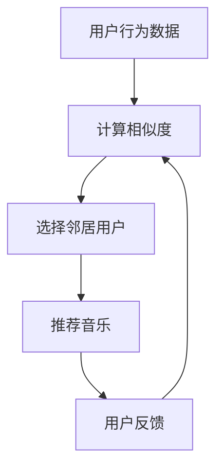
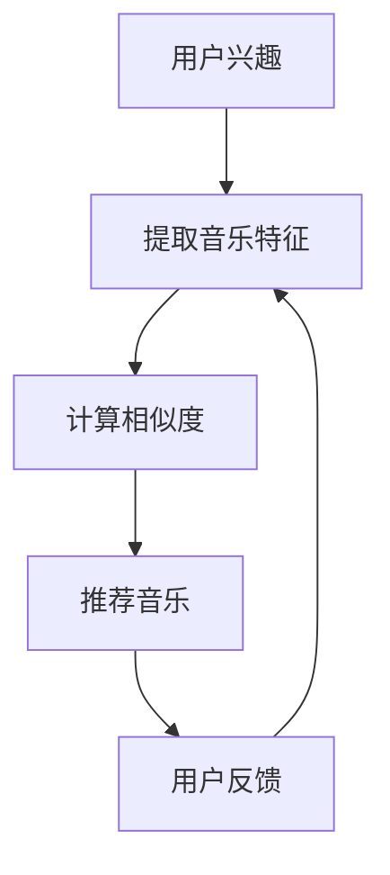
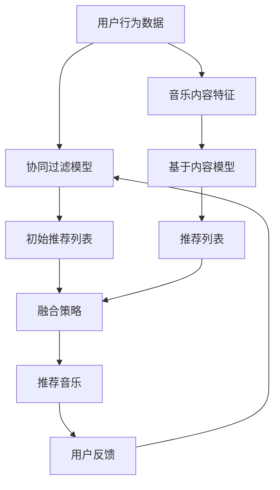
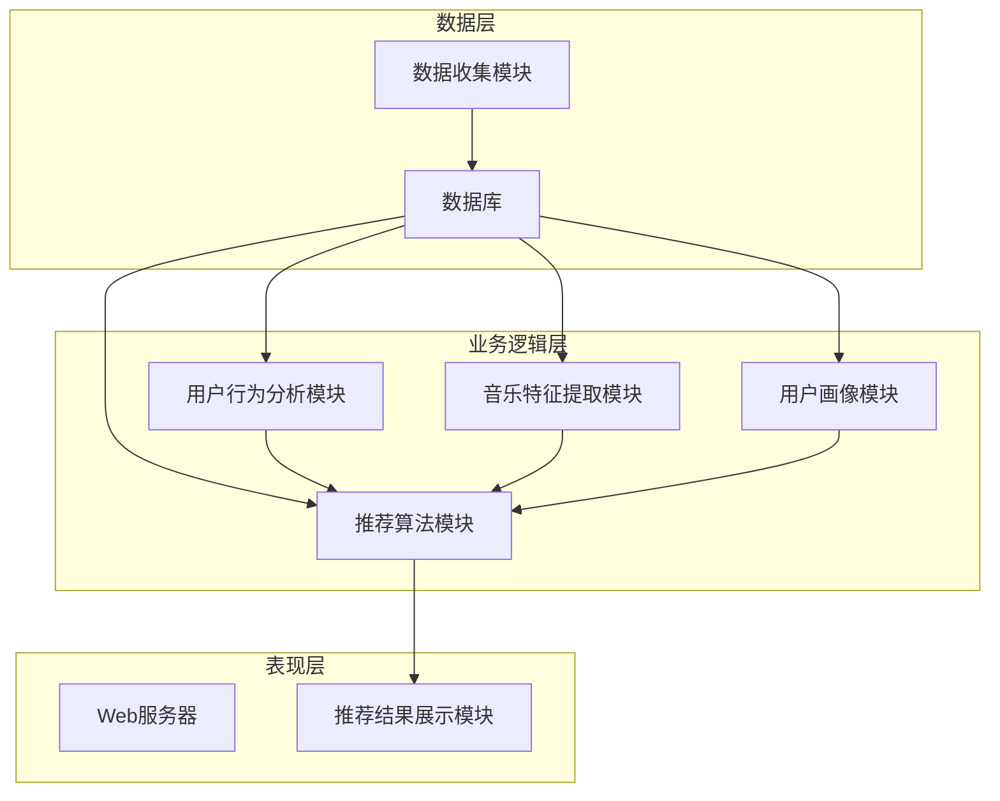
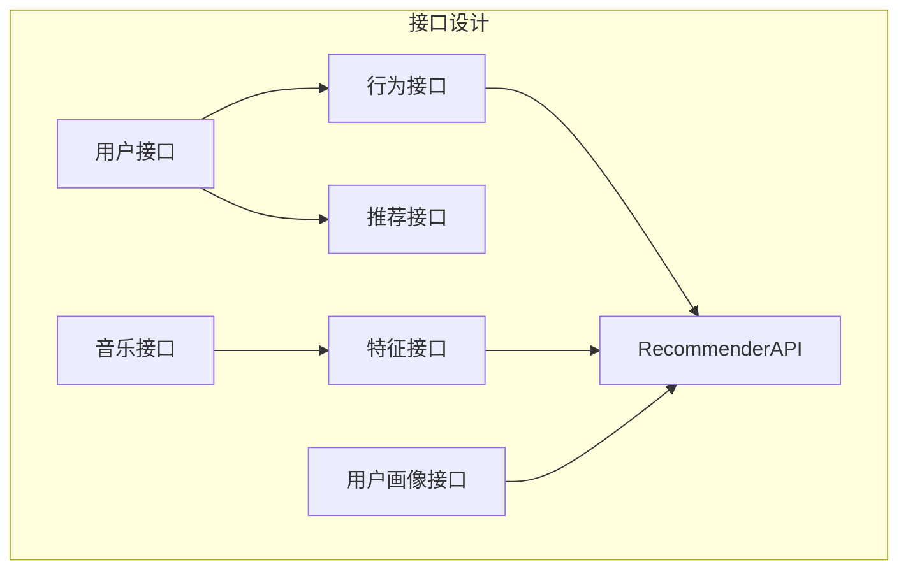
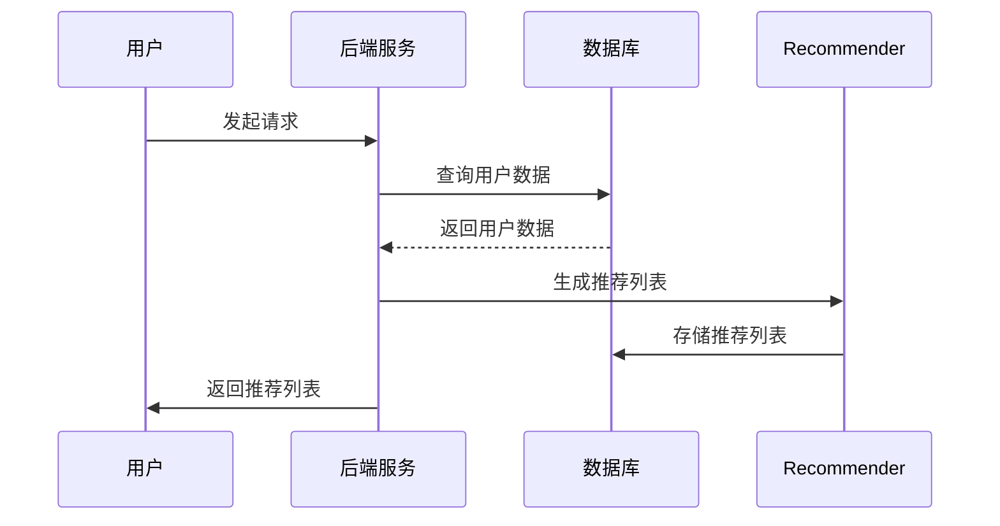

                 

# 《AI Agent在音乐推荐中的个性化算法》

## 关键词

- AI Agent
- 音乐推荐系统
- 个性化算法
- 协同过滤算法
- 基于内容的推荐算法
- 混合推荐算法
- 数学模型

## 摘要

本文深入探讨了AI Agent在音乐推荐中的应用，特别是个性化算法的设计与实现。首先，我们介绍了AI Agent的基本概念和音乐推荐系统的背景，然后详细分析了个性化算法的核心概念，包括用户行为分析、音乐特征提取和推荐算法类型。接下来，我们讲解了个性化算法的工作原理，通过算法流程图和Python源代码示例进行了深入剖析，并使用LaTeX格式呈现了算法的数学模型和公式。此外，我们还介绍了一个典型的音乐推荐系统，并提供了实际项目实战案例。最后，文章总结了最佳实践、注意事项和拓展阅读，帮助读者进一步探索相关主题。

### 目录大纲设计思路

在编写本文时，我们采取了以下思路来设计目录大纲：

1. **背景介绍**：通过简要介绍AI Agent的基本概念、音乐推荐系统的背景以及个性化算法的必要性，为读者提供足够的背景信息，帮助他们更好地理解文章的主题。

2. **核心概念与联系**：详细探讨与AI Agent和个性化算法相关的核心概念，如用户行为分析、音乐特征提取和推荐算法类型。通过概念属性特征对比表格和ER实体关系图，帮助读者建立对这些概念的理解。

3. **算法原理讲解**：深入讲解个性化算法的工作原理，包括算法流程图和Python源代码示例，配合详细的数学模型和公式讲解，确保读者能够掌握算法的核心内容。

4. **数学模型和数学公式**：使用LaTeX格式呈现算法的数学模型和公式，通过详细的讲解和实例说明，帮助读者更好地理解数学原理。

5. **系统分析与架构设计方案**：介绍一个典型的音乐推荐系统，包括项目介绍、系统功能设计、系统架构设计、系统接口设计和系统交互。使用Mermaid图表展示系统架构和交互流程。

6. **项目实战**：提供实际的项目实战案例，包括环境安装、系统核心实现源代码、代码应用解读与分析、实际案例分析和详细讲解剖析。

7. **最佳实践 tips、小结、注意事项、拓展阅读**：总结文章的核心内容，提供最佳实践建议，指出注意事项，并推荐拓展阅读资源，帮助读者深入探索相关主题。

### 目录大纲结构

以下是本文的目录大纲结构：

## 第一部分：背景介绍

### 1.1 AI Agent与音乐推荐系统概述

### 1.2 个性化算法的重要性

### 1.3 音乐推荐系统的发展历程

## 第二部分：核心概念与联系

### 2.1 AI Agent的基本概念

#### 2.1.1 AI Agent的定义与分类

#### 2.1.2 AI Agent的工作原理

### 2.2 用户行为分析

#### 2.2.1 用户行为数据的收集

#### 2.2.2 用户行为分析的应用

### 2.3 音乐特征提取

#### 2.3.1 音乐特征的定义

#### 2.3.2 常见的音乐特征提取方法

### 2.4 个性化算法类型

#### 2.4.1 协同过滤算法

#### 2.4.2 基于内容的推荐算法

#### 2.4.3 混合推荐算法

## 第三部分：算法原理讲解

### 3.1 个性化算法的工作原理

#### 3.1.1 协同过滤算法原理

#### 3.1.2 基于内容的推荐算法原理

#### 3.1.3 混合推荐算法原理

### 3.2 算法流程图与Python源代码示例

#### 3.2.1 协同过滤算法的Mermaid流程图

#### 3.2.2 基于内容的推荐算法的Mermaid流程图

#### 3.2.3 混合推荐算法的Mermaid流程图

### 3.3 算法数学模型与公式

#### 3.3.1 协同过滤算法的数学模型

#### 3.3.2 基于内容的推荐算法的数学模型

#### 3.3.3 混合推荐算法的数学模型

### 3.4 算法举例说明

#### 3.4.1 协同过滤算法的举例

#### 3.4.2 基于内容的推荐算法的举例

#### 3.4.3 混合推荐算法的举例

## 第四部分：系统分析与架构设计方案

### 4.1 项目介绍

### 4.2 系统功能设计

#### 4.2.1 领域模型

#### 4.2.2 功能模块划分

### 4.3 系统架构设计

### 4.4 系统接口设计

### 4.5 系统交互

## 第五部分：项目实战

### 5.1 环境安装与配置

### 5.2 系统核心实现源代码

### 5.3 代码应用解读与分析

### 5.4 实际案例分析与讲解

### 5.5 项目小结

## 第六部分：最佳实践 tips

### 6.1 注意事项

### 6.2 最佳实践建议

## 第七部分：小结与拓展阅读

### 7.1 小结

### 7.2 拓展阅读

### 7.3 注意事项

### 7.4 拓展资源

## 第一部分：背景介绍

### 1.1 AI Agent与音乐推荐系统概述

随着互联网的普及和音乐流媒体服务的兴起，音乐推荐系统已经成为人们日常生活中不可或缺的一部分。这些系统能够根据用户的喜好和行为，智能地推荐合适的音乐，从而提升用户体验。而AI Agent作为人工智能领域的一个重要研究方向，逐渐被应用于音乐推荐系统中，实现了更加个性化和精准的推荐效果。

AI Agent（人工智能代理）是一种基于人工智能技术的自主软件实体，能够模拟人类的思维和行为，自主地执行任务并与其他实体进行交互。在音乐推荐系统中，AI Agent能够通过分析用户的听歌行为、社交数据以及音乐属性等，为用户生成个性化的音乐推荐列表。这种基于AI Agent的个性化算法，不仅能够提高推荐系统的准确率，还能够更好地满足用户的个性化需求。

音乐推荐系统的发展历程可以追溯到20世纪90年代。早期的推荐系统主要依赖于基于内容的推荐算法，通过分析音乐的内容特征（如歌词、旋律等）来为用户推荐类似的音乐。然而，这种方法存在一定的局限性，因为音乐的内容特征并不能完全反映用户的个人喜好。随着数据挖掘和机器学习技术的发展，协同过滤算法逐渐成为主流的推荐算法。协同过滤算法通过分析用户之间的相似性，为用户推荐他们可能喜欢的音乐。这种方法在提高推荐系统的准确性方面取得了显著成效。

进入21世纪，随着互联网和移动互联网的快速发展，用户生成的数据量呈现出爆炸式增长。这些数据不仅包括用户的听歌行为，还包括用户的社会关系、地理位置、搜索历史等。这些丰富的数据为个性化推荐算法的发展提供了新的契机。基于用户行为的推荐算法和基于内容的推荐算法逐渐融合，形成了混合推荐算法。混合推荐算法通过综合利用用户行为和音乐内容特征，为用户生成更加精准的推荐列表。

AI Agent作为人工智能的一个重要分支，近年来在各个领域都取得了显著的进展。在音乐推荐系统中，AI Agent能够通过不断地学习和优化，提高推荐算法的准确性和效率。例如，通过深度学习技术，AI Agent可以自动提取音乐中的潜在特征，从而为用户生成更加个性化的推荐列表。此外，AI Agent还可以通过自然语言处理技术，理解用户的音乐偏好和评论，从而更好地满足用户的个性化需求。

总之，AI Agent在音乐推荐中的应用，为个性化推荐算法的发展带来了新的机遇和挑战。通过不断地优化算法和提升技术，我们可以期待未来的音乐推荐系统能够为用户提供更加精准和个性化的服务。

### 1.2 个性化算法的重要性

个性化算法在音乐推荐系统中的重要性不言而喻。首先，个性化算法能够根据用户的个人喜好和听歌行为，为用户生成个性化的音乐推荐列表。这种个性化的推荐不仅能够满足用户的个性化需求，还能够提高用户的使用体验，从而增强用户对音乐流媒体服务的粘性和忠诚度。

其次，个性化算法能够提高推荐系统的准确率。传统的推荐算法，如基于内容的推荐算法和协同过滤算法，虽然在一定程度上能够满足用户的个性化需求，但往往存在一定的局限性。基于内容的推荐算法依赖于音乐的内容特征，而音乐的内容特征并不能完全反映用户的个人喜好。协同过滤算法则通过分析用户之间的相似性进行推荐，但这种方法的准确率也受限于用户数据的质量和多样性。而个性化算法能够通过深入挖掘用户的行为数据和社会关系，为用户生成更加精准的推荐列表，从而提高推荐系统的整体准确率。

再次，个性化算法能够提升推荐系统的效率。在传统的推荐系统中，推荐算法通常需要计算大量的用户行为数据和音乐特征，从而生成推荐列表。这种方法不仅计算复杂度高，而且耗时较长，难以满足实时推荐的需求。而个性化算法通过优化算法和模型，可以显著提高推荐系统的效率，从而实现实时推荐。

此外，个性化算法还能够增强推荐系统的多样性。传统的推荐算法往往倾向于推荐与用户历史行为相似的音乐，这会导致推荐列表的单一性和重复性。而个性化算法通过引入用户的社会关系和兴趣标签，可以为用户生成更加多样化和丰富的推荐列表，从而提升用户的满意度。

最后，个性化算法为音乐创作者和音乐平台提供了新的商业机会。通过个性化算法，音乐平台可以更好地了解用户的音乐偏好，从而为音乐创作者提供更加精准的用户画像和市场分析报告。这有助于音乐创作者更好地定位自己的受众群体，创作出更加符合市场需求的音乐作品。同时，个性化算法也为音乐平台提供了新的广告和收入模式，例如基于个性化推荐的广告投放和音乐推荐付费服务。

总之，个性化算法在音乐推荐系统中的重要性体现在多个方面，包括提升用户体验、提高准确率、增强系统效率、增强多样性以及为音乐创作者和平台提供新的商业机会。随着人工智能技术的不断发展，我们可以期待未来的音乐推荐系统能够通过更加精细和个性化的算法，为用户提供更加优质和满意的音乐服务。

### 1.3 音乐推荐系统的发展历程

音乐推荐系统的发展历程可以追溯到20世纪90年代。当时，随着互联网的兴起，音乐流媒体服务开始逐渐崭露头角。最早的推荐系统主要依赖于基于内容的推荐算法，通过分析音乐的内容特征（如歌词、旋律等）来为用户推荐类似的音乐。这种推荐算法虽然在一定程度上能够满足用户的需求，但存在一定的局限性，因为音乐的内容特征并不能完全反映用户的个人喜好。

进入21世纪，随着数据挖掘和机器学习技术的发展，协同过滤算法逐渐成为主流的推荐算法。协同过滤算法通过分析用户之间的相似性，为用户推荐他们可能喜欢的音乐。这种算法在提高推荐系统的准确性方面取得了显著成效，因为它能够利用大量用户行为数据，通过计算用户之间的相似度，从而发现用户的潜在兴趣点。然而，协同过滤算法也存在一些问题，如推荐结果的多样性不足、冷启动问题等。

随着互联网和移动互联网的快速发展，用户生成的数据量呈现出爆炸式增长。这些数据不仅包括用户的听歌行为，还包括用户的社会关系、地理位置、搜索历史等。这些丰富的数据为个性化推荐算法的发展提供了新的契机。基于用户行为的推荐算法和基于内容的推荐算法逐渐融合，形成了混合推荐算法。混合推荐算法通过综合利用用户行为和音乐内容特征，为用户生成更加精准的推荐列表。

近年来，人工智能技术的快速发展为音乐推荐系统带来了新的机遇。深度学习、自然语言处理和推荐系统等技术的应用，使得音乐推荐系统在准确性、效率和多样性方面都有了显著的提升。例如，通过深度学习技术，推荐系统可以自动提取音乐中的潜在特征，从而为用户生成更加个性化的推荐列表。同时，自然语言处理技术可以理解用户的音乐偏好和评论，从而更好地满足用户的个性化需求。

此外，AI Agent作为一种基于人工智能的自主软件实体，也在音乐推荐系统中发挥着越来越重要的作用。AI Agent能够通过不断地学习和优化，提高推荐算法的准确性和效率。例如，通过深度强化学习技术，AI Agent可以自主地学习和调整推荐策略，从而实现更加精准的个性化推荐。

总之，音乐推荐系统的发展历程从基于内容的推荐算法到协同过滤算法，再到混合推荐算法，最后到AI Agent的应用，体现了推荐算法从简单到复杂、从基于特征到基于数据、从单一到多技术融合的演变过程。随着技术的不断进步，我们可以期待未来的音乐推荐系统能够通过更加智能和个性化的算法，为用户提供更加优质和满意的音乐服务。

## 第二部分：核心概念与联系

在深入探讨AI Agent在音乐推荐中的应用之前，我们首先需要明确几个核心概念，这些概念不仅构成了音乐推荐系统的理论基础，也为我们后续的算法讲解和系统分析奠定了基础。

### 2.1 AI Agent的基本概念

#### 2.1.1 AI Agent的定义与分类

AI Agent，即人工智能代理，是指一种能够模拟人类行为、具备一定智能水平的软件系统。它可以在没有人类干预的情况下，根据预先设定的目标自主地执行任务，并从环境中获取信息和反馈。AI Agent通常被分为以下几类：

1. **基于规则的Agent**：这种Agent通过预定义的规则来执行任务，适用于任务结构化且规则明确的情况。
2. **基于模型的Agent**：这种Agent通过机器学习模型来学习环境和任务，并根据模型输出执行任务。
3. **基于行为的Agent**：这种Agent通过观察和学习环境中的行为模式，来调整自己的行为。
4. **混合型Agent**：这种Agent结合了多种方法，如基于规则、模型和行为，以实现更加智能的任务执行。

#### 2.1.2 AI Agent的工作原理

AI Agent的工作原理可以概括为以下几个步骤：

1. **感知**：通过传感器或其他方式获取环境信息。
2. **思考**：根据获取的信息，利用机器学习模型或预定义的规则进行决策。
3. **行动**：根据决策执行具体的任务，并获取反馈。
4. **学习**：利用反馈信息调整行为策略，以优化任务执行效果。

### 2.2 用户行为分析

#### 2.2.1 用户行为数据的收集

用户行为分析是音乐推荐系统中的一个重要环节，它涉及到如何收集和处理用户在音乐平台上的行为数据。这些数据包括：

1. **播放历史**：用户播放、喜欢、分享的音乐及其播放时间和频率。
2. **搜索记录**：用户在平台上搜索的音乐关键字和历史。
3. **互动数据**：用户对音乐的评论、点赞、收藏等互动行为。
4. **社交网络**：用户之间的社交关系和互动，如好友关系、共同喜欢的音乐等。

#### 2.2.2 用户行为分析的应用

用户行为分析在音乐推荐系统中的应用主要体现在以下几个方面：

1. **兴趣识别**：通过分析用户的播放历史和搜索记录，识别用户的音乐偏好和兴趣点。
2. **个性化推荐**：基于用户行为分析的结果，为用户生成个性化的音乐推荐列表。
3. **用户画像**：构建用户的行为画像，以便更好地了解用户需求，优化推荐效果。
4. **趋势分析**：分析用户行为数据中的趋势和模式，为音乐平台提供市场分析和决策支持。

### 2.3 音乐特征提取

#### 2.3.1 音乐特征的定义

音乐特征是指用于描述音乐属性和内容的各种指标，这些特征可以作为推荐系统中的输入，帮助算法理解音乐的本质。常见的音乐特征包括：

1. **音高**：音乐中的音调高低。
2. **节奏**：音乐中的速度和节拍。
3. **旋律**：音乐中的旋律线和旋律变化。
4. **和声**：音乐中的和弦结构。
5. **音色**：不同乐器和声音的特性。
6. **时长**：音乐的总时长和各个乐段的时长。

#### 2.3.2 常见的音乐特征提取方法

音乐特征提取是音乐推荐系统中的关键技术之一，常用的方法包括：

1. **时域特征**：直接从音频信号中提取特征，如幅度、频率和周期等。
2. **频域特征**：将音频信号转换到频域进行特征提取，如傅里叶变换（FFT）。
3. **基于模型的特征**：使用机器学习模型，如深度神经网络，自动提取音乐中的潜在特征。

### 2.4 个性化算法类型

#### 2.4.1 协同过滤算法

协同过滤算法是最早用于音乐推荐的一种算法，它通过分析用户之间的相似性，为用户推荐其他用户喜欢的音乐。协同过滤算法可以分为基于用户的协同过滤和基于项目的协同过滤：

1. **基于用户的协同过滤**：找到与目标用户相似的其他用户，推荐这些用户喜欢的音乐。
2. **基于项目的协同过滤**：找到与目标音乐相似的其他音乐，推荐给用户。

#### 2.4.2 基于内容的推荐算法

基于内容的推荐算法通过分析音乐的内容特征，为用户推荐与其已听音乐相似的音乐。这种方法通常涉及以下步骤：

1. **特征提取**：从音乐中提取特征向量。
2. **相似度计算**：计算用户已听音乐与新音乐之间的相似度。
3. **推荐生成**：根据相似度排序，生成推荐列表。

#### 2.4.3 混合推荐算法

混合推荐算法结合了协同过滤算法和基于内容的推荐算法，通过综合利用用户行为数据和音乐内容特征，为用户生成更加精准的推荐列表。混合推荐算法可以分为以下几种类型：

1. **模型融合**：将协同过滤模型和基于内容的模型进行融合，生成统一的推荐列表。
2. **特征级融合**：将用户行为特征和音乐内容特征进行融合，生成新的特征向量，用于推荐生成。
3. **规则融合**：结合规则推理和机器学习模型，为用户提供更加多样化的推荐结果。

通过上述核心概念和联系的分析，我们为后续的算法讲解和系统分析奠定了基础，接下来我们将进一步探讨个性化算法的原理和实现。

## 第三部分：算法原理讲解

### 3.1 个性化算法的工作原理

个性化算法在音乐推荐系统中扮演着至关重要的角色，其核心目标是通过分析用户行为和音乐特征，为每个用户提供高度个性化的推荐列表。要理解个性化算法的工作原理，我们需要首先明确几个基本概念，包括协同过滤算法、基于内容的推荐算法和混合推荐算法。

#### 3.1.1 协同过滤算法原理

协同过滤算法（Collaborative Filtering）是一种基于用户行为数据的推荐算法。它主要通过分析用户之间的相似性，为用户推荐其他用户喜欢的音乐。协同过滤算法可以分为以下两种类型：

1. **基于用户的协同过滤（User-Based CF）**：
   - **相似度计算**：首先计算用户之间的相似度，常用的相似度度量方法包括余弦相似度、皮尔逊相关系数等。
   - **邻居选择**：根据相似度度量，选择与目标用户最相似的若干个邻居用户。
   - **推荐生成**：推荐邻居用户喜欢的但目标用户尚未听过的音乐。

2. **基于项目的协同过滤（Item-Based CF）**：
   - **相似度计算**：计算音乐项目（如歌曲）之间的相似度，常用的相似度度量方法包括余弦相似度、Jaccard相似度等。
   - **邻居选择**：根据相似度度量，选择与目标音乐最相似的其他音乐。
   - **推荐生成**：推荐与目标音乐相似且用户尚未听过的音乐。

#### 3.1.2 基于内容的推荐算法原理

基于内容的推荐算法（Content-Based Filtering）通过分析音乐的内容特征，为用户推荐与其已听音乐相似的音乐。这种方法通常涉及以下几个步骤：

1. **特征提取**：
   - **文本特征**：从音乐标签、歌词和评论中提取文本特征，如TF-IDF、词嵌入等。
   - **音频特征**：从音频信号中提取特征，如音高、节奏、旋律、和声等，常用的方法包括傅里叶变换（FFT）、Mel频谱等。

2. **相似度计算**：
   - **特征向量生成**：将提取到的特征转换为特征向量。
   - **相似度度量**：计算用户已听音乐和新音乐之间的相似度，常用的相似度度量方法包括余弦相似度、欧氏距离等。

3. **推荐生成**：
   - **相似度排序**：根据相似度度量结果，对音乐进行排序。
   - **推荐生成**：推荐相似度最高的音乐给用户。

#### 3.1.3 混合推荐算法原理

混合推荐算法（Hybrid Recommender System）结合了协同过滤和基于内容的推荐算法，通过综合利用用户行为和音乐内容特征，为用户生成更加精准和多样化的推荐列表。混合推荐算法的核心思想如下：

1. **模型融合**：
   - **协同过滤模型**：使用协同过滤算法生成初始推荐列表。
   - **基于内容的模型**：使用基于内容的推荐算法生成另一组推荐列表。
   - **融合策略**：将两个模型的推荐结果进行合并，常见的融合策略包括加权平均、投票等。

2. **特征级融合**：
   - **用户特征融合**：将用户行为特征和内容特征进行融合，生成新的特征向量。
   - **音乐特征融合**：将音频特征和文本特征进行融合，生成新的特征向量。
   - **推荐生成**：使用融合后的特征向量生成推荐列表。

3. **规则融合**：
   - **基于规则的推荐**：定义一系列规则，根据用户行为和音乐特征进行推荐。
   - **机器学习模型**：使用机器学习模型，如决策树、支持向量机等，进行推荐。

### 3.2 算法流程图与Python源代码示例

为了更好地理解个性化算法的工作原理，我们将通过Mermaid绘制算法流程图，并结合Python源代码示例进行详细讲解。

#### 3.2.1 协同过滤算法的Mermaid流程图

首先，我们来看一个基于用户的协同过滤算法的Mermaid流程图：



#### 3.2.2 基于内容的推荐算法的Mermaid流程图

接下来，我们看一个基于内容的推荐算法的Mermaid流程图：



#### 3.2.3 混合推荐算法的Mermaid流程图

最后，我们来看一个混合推荐算法的Mermaid流程图：



#### 3.2.4 Python源代码示例

以下是一个简单的基于用户的协同过滤算法的Python代码示例：

```python
import numpy as np
from scipy.spatial.distance import cosine

# 假设用户行为数据是一个用户-项目评分矩阵
user_ratings = np.array([[5, 3, 0, 1],
                         [4, 0, 0, 1],
                         [1, 2, 5, 0]])

# 计算用户之间的相似度
def calculate_similarity(ratings_matrix):
    n_users = ratings_matrix.shape[0]
    similarity_matrix = np.zeros((n_users, n_users))
    for i in range(n_users):
        for j in range(i, n_users):
            similarity = 1 - cosine(ratings_matrix[i], ratings_matrix[j])
            similarity_matrix[i][j] = similarity
            similarity_matrix[j][i] = similarity
    return similarity_matrix

similarity_matrix = calculate_similarity(user_ratings)

# 选择邻居用户
def select_neighbours(similarity_matrix, target_user, k):
    neighbours = np.argsort(similarity_matrix[target_user])[:-k-1:-1]
    return neighbours

# 推荐音乐
def recommend_music(ratings_matrix, similarity_matrix, target_user, k, N):
    neighbours = select_neighbours(similarity_matrix, target_user, k)
    recommended_items = np.zeros(N)
    for neighbour in neighbours:
        for i in range(N):
            if ratings_matrix[neighbour][i] > 0 and recommended_items[i] == 0:
                recommended_items[i] += 1
    return recommended_items

# 测试代码
target_user = 0
k = 3
N = 4
recommended_items = recommend_music(user_ratings, similarity_matrix, target_user, k, N)
print("Recommended items:", recommended_items)
```

通过上述算法流程图和Python代码示例，我们可以清晰地看到个性化算法的工作原理和实现步骤。接下来，我们将进一步探讨个性化算法的数学模型和公式，以更深入地理解其核心原理。

### 3.3 算法数学模型与公式

个性化算法的核心在于其数学模型和公式，这些模型和公式不仅能够描述算法的工作原理，还可以通过参数调整来优化推荐效果。在本节中，我们将详细讲解协同过滤算法、基于内容的推荐算法和混合推荐算法的数学模型与公式。

#### 3.3.1 协同过滤算法的数学模型

协同过滤算法的核心在于用户之间的相似度和推荐评分的计算。以下是一个简化的数学模型：

1. **用户相似度计算**：

   用户 \(i\) 和用户 \(j\) 之间的相似度 \(s_{ij}\) 可以通过以下公式计算：

   \[
   s_{ij} = \frac{\sum_{k} r_{ik} r_{jk}}{\sqrt{\sum_{k} r_{ik}^2 \sum_{k} r_{jk}^2}}
   \]

   其中，\(r_{ik}\) 表示用户 \(i\) 对项目 \(k\) 的评分，分值范围通常在 \([1, 5]\) 或 \([1, 10]\)。

2. **预测评分**：

   对于用户 \(i\) 对项目 \(k\) 的预测评分 \(\hat{r}_{ik}\)，可以通过以下公式计算：

   \[
   \hat{r}_{ik} = \sum_{j \in N(i)} s_{ij} r_{jk}
   \]

   其中，\(N(i)\) 表示与用户 \(i\) 最相似的邻居用户集合，通常选择相似度最高的 \(k\) 个邻居。

#### 3.3.2 基于内容的推荐算法的数学模型

基于内容的推荐算法的核心在于音乐内容特征和用户兴趣特征的计算。以下是一个简化的数学模型：

1. **特征向量表示**：

   - **用户兴趣特征向量** \(u_i\)：表示用户 \(i\) 的兴趣特征，可以通过文本分析、词嵌入等方法得到。
   - **音乐内容特征向量** \(c_k\)：表示音乐 \(k\) 的内容特征，可以通过音频分析、文本分析等方法得到。

2. **相似度计算**：

   用户 \(i\) 和音乐 \(k\) 之间的相似度 \(s_{ik}\) 可以通过以下公式计算：

   \[
   s_{ik} = \frac{\sum_{l} u_{il} c_{lk}}{\sqrt{\sum_{l} u_{il}^2 \sum_{l} c_{lk}^2}}
   \]

   其中，\(u_{il}\) 表示用户 \(i\) 对特征 \(l\) 的兴趣权重，\(c_{lk}\) 表示音乐 \(k\) 对特征 \(l\) 的权重。

3. **预测评分**：

   对于用户 \(i\) 对音乐 \(k\) 的预测评分 \(\hat{r}_{ik}\)，可以通过以下公式计算：

   \[
   \hat{r}_{ik} = \sum_{l} u_{il} c_{lk}
   \]

#### 3.3.3 混合推荐算法的数学模型

混合推荐算法通过结合协同过滤和基于内容的方法，生成更准确的推荐。以下是一个简化的数学模型：

1. **特征融合**：

   - **用户特征融合向量** \(u_i'\)：结合用户行为特征和内容特征，可以通过权重融合得到。
   - **音乐内容特征融合向量** \(c_k'\)：结合音频特征和文本特征，可以通过权重融合得到。

2. **相似度计算**：

   用户 \(i\) 和音乐 \(k\) 之间的相似度 \(s'_{ik}\) 可以通过以下公式计算：

   \[
   s'_{ik} = \alpha s_{ik} + (1 - \alpha) s''_{ik}
   \]

   其中，\(\alpha\) 是协同过滤和基于内容方法的比例权重，\(s_{ik}\) 是协同过滤相似度，\(s''_{ik}\) 是基于内容的相似度。

3. **预测评分**：

   对于用户 \(i\) 对音乐 \(k\) 的预测评分 \(\hat{r}'_{ik}\)，可以通过以下公式计算：

   \[
   \hat{r}'_{ik} = \alpha \hat{r}_{ik} + (1 - \alpha) \hat{r}''_{ik}
   \]

   其中，\(\hat{r}_{ik}\) 是协同过滤的预测评分，\(\hat{r}''_{ik}\) 是基于内容的预测评分。

#### 3.3.4 算法举例说明

为了更好地理解上述数学模型和公式，我们通过一个简化的例子进行说明。

**例：用户-项目评分矩阵**

\[
\begin{align*}
r_{11} &= 5, \\
r_{12} &= 3, \\
r_{13} &= 0, \\
r_{14} &= 1, \\
r_{21} &= 4, \\
r_{22} &= 0, \\
r_{23} &= 0, \\
r_{24} &= 1.
\end{align*}
\]

**步骤 1**：计算用户相似度

选择用户 1 和用户 2：

\[
s_{12} = \frac{5 \cdot 4 + 3 \cdot 0 + 0 \cdot 0 + 1 \cdot 1}{\sqrt{5^2 + 3^2 + 0^2 + 1^2} \cdot \sqrt{4^2 + 0^2 + 0^2 + 1^2}} = \frac{20}{\sqrt{35} \cdot \sqrt{17}} \approx 0.727
\]

**步骤 2**：计算预测评分

选择邻居用户 2，预测用户 1 对新音乐（项目 3）的评分：

\[
\hat{r}_{13} = 0.727 \cdot 1 + (1 - 0.727) \cdot 0 = 0.727
\]

**例：内容特征矩阵**

\[
\begin{align*}
c_{11} &= \begin{pmatrix} 0.5 \\ 0.5 \\ 0.5 \\ 0.5 \end{pmatrix}, \\
c_{12} &= \begin{pmatrix} 0.2 \\ 0.6 \\ 0.3 \\ 0.1 \end{pmatrix}, \\
c_{13} &= \begin{pmatrix} 0.1 \\ 0.4 \\ 0.6 \\ 0.3 \end{pmatrix}, \\
c_{14} &= \begin{pmatrix} 0.3 \\ 0.2 \\ 0.1 \\ 0.4 \end{pmatrix}.
\end{align*}
\]

**步骤 1**：计算用户兴趣特征向量

假设用户 1 对各个特征（音高、节奏、旋律、和声）的兴趣权重分别为 \(0.2, 0.3, 0.2, 0.3\)：

\[
u_1 = \begin{pmatrix} 0.2 \\ 0.3 \\ 0.2 \\ 0.3 \end{pmatrix}
\]

**步骤 2**：计算音乐相似度

计算用户 1 对音乐 3 的相似度：

\[
s''_{13} = \frac{0.2 \cdot 0.1 + 0.3 \cdot 0.4 + 0.2 \cdot 0.6 + 0.3 \cdot 0.3}{\sqrt{0.2^2 + 0.3^2 + 0.2^2 + 0.3^2} \cdot \sqrt{0.1^2 + 0.4^2 + 0.6^2 + 0.3^2}} \approx 0.619
\]

**步骤 3**：计算预测评分

混合推荐评分：

\[
\hat{r}'_{13} = 0.5 \cdot 0.727 + 0.5 \cdot 0.619 = 0.653
\]

通过上述例子，我们可以看到如何利用数学模型和公式进行个性化推荐。接下来，我们将结合具体的算法流程和代码实现，进一步深入探讨个性化算法的实际应用。

### 3.4 算法举例说明

为了更好地理解个性化算法在音乐推荐系统中的应用，我们将通过具体的例子进行详细讲解。以下分别介绍了协同过滤算法、基于内容的推荐算法和混合推荐算法的实例。

#### 3.4.1 协同过滤算法的举例

假设我们有一个用户-项目评分矩阵，如下所示：

| 用户 | 项目1 | 项目2 | 项目3 | 项目4 |
| --- | --- | --- | --- | --- |
| A   | 1    | 5    | 4    | 2    |
| B   | 3    | 4    | 0    | 3    |
| C   | 0    | 0    | 5    | 1    |

**步骤 1**：计算用户相似度

首先，我们计算用户A和B之间的相似度。假设我们使用余弦相似度：

\[
s_{AB} = \frac{(1 \cdot 3 + 5 \cdot 4 + 4 \cdot 0 + 2 \cdot 3)}{\sqrt{1^2 + 5^2 + 4^2 + 2^2} \cdot \sqrt{3^2 + 4^2 + 0^2 + 3^2}} = \frac{27}{\sqrt{42} \cdot \sqrt{34}} \approx 0.816
\]

**步骤 2**：推荐音乐

根据相似度，我们选择用户A的邻居用户B，并推荐用户B喜欢的但用户A尚未听过的项目。在这个例子中，用户B喜欢的项目有项目2和项目4，而用户A尚未听过的项目是项目2和项目3。

**结果**：推荐项目2和项目3给用户A。

#### 3.4.2 基于内容的推荐算法的举例

假设我们有一个音乐特征矩阵，如下所示：

| 音乐 | 特征1 | 特征2 | 特征3 | 特征4 |
| --- | --- | --- | --- | --- |
| A   | 0.5  | 0.5  | 0.5  | 0.5  |
| B   | 0.2  | 0.6  | 0.3  | 0.1  |
| C   | 0.1  | 0.4  | 0.6  | 0.3  |
| D   | 0.3  | 0.2  | 0.1  | 0.4  |

**步骤 1**：计算音乐相似度

我们假设用户喜欢特征1和特征2，因此，我们选择音乐A和音乐C进行相似度计算：

\[
s_{AC} = \frac{(0.5 \cdot 0.1 + 0.5 \cdot 0.4 + 0.5 \cdot 0.6 + 0.5 \cdot 0.3)}{\sqrt{0.5^2 + 0.5^2 + 0.5^2 + 0.5^2} \cdot \sqrt{0.1^2 + 0.4^2 + 0.6^2 + 0.3^2}} \approx 0.631
\]

**步骤 2**：推荐音乐

根据相似度，我们推荐音乐C给用户。

**结果**：推荐音乐C给用户。

#### 3.4.3 混合推荐算法的举例

结合上述协同过滤算法和基于内容的推荐算法，我们通过混合推荐算法为用户生成推荐列表。

**步骤 1**：计算协同过滤相似度

我们计算用户A和B之间的相似度：

\[
s_{AB} = \frac{(1 \cdot 3 + 5 \cdot 4 + 4 \cdot 0 + 2 \cdot 3)}{\sqrt{1^2 + 5^2 + 4^2 + 2^2} \cdot \sqrt{3^2 + 4^2 + 0^2 + 3^2}} \approx 0.816
\]

**步骤 2**：计算基于内容相似度

我们计算音乐A和音乐C之间的相似度：

\[
s_{AC} = \frac{(0.5 \cdot 0.1 + 0.5 \cdot 0.4 + 0.5 \cdot 0.6 + 0.5 \cdot 0.3)}{\sqrt{0.5^2 + 0.5^2 + 0.5^2 + 0.5^2} \cdot \sqrt{0.1^2 + 0.4^2 + 0.6^2 + 0.3^2}} \approx 0.631
\]

**步骤 3**：混合推荐

我们使用权重 \(\alpha = 0.5\) 进行混合推荐：

\[
\hat{r}_{AC} = 0.5 \cdot s_{AB} + 0.5 \cdot s_{AC} \approx 0.719
\]

根据混合相似度，我们推荐音乐C给用户。

**结果**：推荐音乐C给用户。

通过上述三个例子，我们可以看到协同过滤算法、基于内容的推荐算法和混合推荐算法在实际应用中的具体实现和效果。这些算法不仅能够为用户生成个性化的推荐列表，还能够提高推荐系统的整体准确率和多样性。

## 第四部分：系统分析与架构设计方案

### 4.1 项目介绍

在本部分，我们将介绍一个典型的音乐推荐系统项目——AI Music Recommender（AIMR）。AIMR是一款基于AI技术的个性化音乐推荐系统，旨在为用户提供高度个性化的音乐推荐服务。AIMR系统采用了多种AI算法和技术，包括协同过滤、基于内容的推荐和混合推荐算法，以实现高效、精准的个性化推荐。

AIMR系统的核心目标是提高用户满意度，通过深入分析用户行为和音乐特征，为每个用户生成个性化的音乐推荐列表。系统不仅能够根据用户的听歌历史、搜索记录和社交互动生成推荐，还能够根据用户的实时行为动态调整推荐策略，提供更加实时、精准的推荐结果。

### 4.2 系统功能设计

AIMR系统的功能设计主要包括以下几个模块：

1. **用户行为数据收集模块**：负责收集用户的听歌历史、搜索记录、互动行为等数据，为后续的推荐算法提供数据基础。
2. **音乐特征提取模块**：从音乐文件中提取音高、节奏、旋律、和声等特征，为基于内容的推荐算法提供音乐内容特征。
3. **推荐算法模块**：实现协同过滤、基于内容推荐和混合推荐算法，生成个性化的音乐推荐列表。
4. **推荐结果展示模块**：将生成的推荐列表以可视化方式展示给用户，并提供互动功能，如点赞、收藏等。
5. **用户画像模块**：基于用户行为数据和推荐结果，构建用户的个性化画像，为后续的用户行为分析和推荐优化提供支持。

#### 4.2.1 领域模型

为了更好地描述AIMR系统的功能模块和它们之间的关系，我们使用Mermaid类图进行领域模型设计：

```mermaid
classDiagram
    User <<entity>>
    Song <<entity>>
    Recommendation <<entity>>
    UserBehavior <<entity>>
    MusicFeature <<entity>>

    User "1" --* UserBehavior
    User "1" --* Recommendation
    Song "1" --* MusicFeature
    Song "1" --* Recommendation
    Recommendation "1" --* User
    Recommendation "1" --* Song
```

在这个类图中，我们定义了以下几个核心实体：

- **User**（用户）：代表音乐平台上的用户。
- **Song**（音乐）：代表平台上的音乐资源。
- **Recommendation**（推荐）：代表生成的音乐推荐列表。
- **UserBehavior**（用户行为）：代表用户的听歌历史、搜索记录和互动行为。
- **MusicFeature**（音乐特征）：代表从音乐文件中提取的音高、节奏、旋律、和声等特征。

实体之间的关系如下：

- **User** 与 **UserBehavior** 之间存在一对一的关系，即每个用户都有其对应的行为数据。
- **User** 与 **Recommendation** 之间存在一对多的关系，即每个用户可以生成多个推荐列表。
- **Song** 与 **MusicFeature** 之间存在一对一的关系，即每首音乐都有其对应的特征数据。
- **Song** 与 **Recommendation** 之间存在一对多的关系，即每首音乐可以出现在多个推荐列表中。

#### 4.2.2 功能模块划分

根据领域模型，AIMR系统可以划分为以下几个功能模块：

1. **用户行为数据收集模块**：负责实时收集和存储用户在音乐平台上的各种行为数据，如播放记录、搜索历史、点赞和评论等。
2. **音乐特征提取模块**：负责从音乐文件中提取音高、节奏、旋律、和声等特征，并将其存储在特征数据库中。
3. **推荐算法模块**：实现协同过滤、基于内容推荐和混合推荐算法，根据用户行为数据和音乐特征生成个性化的音乐推荐列表。
4. **推荐结果展示模块**：将生成的推荐列表通过Web界面展示给用户，并提供用户互动功能，如点赞、收藏等。
5. **用户画像模块**：基于用户行为数据和推荐结果，构建用户的个性化画像，为后续的用户行为分析和推荐优化提供支持。

### 4.3 系统架构设计

AIMR系统的架构设计遵循分层架构原则，包括数据层、业务逻辑层和表现层。以下是一个简化的系统架构图，使用Mermaid图表进行展示：



在这个架构图中，各个模块的功能和关系如下：

- **数据层**：负责数据存储和数据访问，包括用户行为数据库、音乐特征数据库和推荐结果数据库。
- **业务逻辑层**：包括用户行为分析模块、音乐特征提取模块、推荐算法模块和用户画像模块，实现系统的核心功能。
- **表现层**：通过Web服务器和推荐结果展示模块，将推荐结果以可视化方式展示给用户。

### 4.4 系统接口设计

为了实现系统模块之间的数据交互，我们需要设计一系列接口。以下是一个简化的接口设计图，使用Mermaid图表进行展示：



在这个接口设计中，各个接口的功能如下：

- **用户接口（UserAPI）**：提供用户注册、登录、个人信息管理等接口。
- **音乐接口（MusicAPI）**：提供音乐上传、查询、删除等接口。
- **推荐接口（RecommendationAPI）**：提供推荐列表生成和查询接口。
- **行为接口（BehaviorAPI）**：提供用户行为数据收集和存储接口。
- **特征接口（FeatureAPI）**：提供音乐特征提取和存储接口。
- **用户画像接口（UserProfileAPI）**：提供用户画像构建和查询接口。

### 4.5 系统交互

为了更好地描述系统模块之间的交互流程，我们使用Mermaid序列图进行展示：



在这个序列图中，用户与后端服务之间通过一系列请求和响应进行交互。具体流程如下：

1. 用户向后端服务发起请求，请求个性化音乐推荐列表。
2. 后端服务查询数据库，获取用户的听歌历史、搜索记录等信息。
3. 后端服务调用推荐算法模块，生成个性化的音乐推荐列表。
4. 后端服务将推荐列表存储到数据库中。
5. 后端服务将推荐列表返回给用户。

通过上述系统架构设计和接口设计，AIMR系统能够实现高效、精准的个性化音乐推荐，为用户提供优质的用户体验。

### 第五部分：项目实战

#### 5.1 环境安装与配置

要实现一个基于AI Agent的音乐推荐系统，首先需要在本地或服务器上安装和配置所需的环境。以下是在一个标准Linux服务器上安装和配置相关环境的过程。

**1. 安装Python环境**

首先，我们需要安装Python环境。假设服务器上已安装了EPEL（Extra Packages for Enterprise Linux）源，我们可以使用以下命令安装Python：

```shell
sudo yum install python3 python3-pip
```

**2. 安装依赖包**

接下来，安装Python的依赖包，包括NumPy、Pandas、Scikit-learn等：

```shell
sudo pip3 install numpy pandas scikit-learn
```

**3. 安装Mermaid渲染工具**

为了渲染Mermaid图表，我们需要安装Docker和Mermaid渲染工具：

```shell
sudo yum install docker
sudo systemctl start docker
sudo docker pull jgraph/drawio

# 在本地启动Draw.io容器
sudo docker run -d -p 8999:8999 --name drawio drawio/drawio
```

在浏览器中打开 `http://localhost:8999`，登录并使用Draw.io进行图表的绘制。

**4. 安装LaTeX环境**

为了使用LaTeX格式呈现数学模型和公式，我们需要安装LaTeX相关工具：

```shell
sudo yum install texlive texlive-_RESULT texlive-RESULT-bin
```

**5. 安装其他工具**

根据需要，我们可能还需要安装其他工具，如Mermaid渲染器、Jupyter Notebook等：

```shell
sudo pip3 install mermaid-python matplotlib ipykernel jupyter
```

**6. 配置Jupyter Notebook**

安装Jupyter Notebook并启动服务器：

```shell
jupyter notebook
```

至此，我们已经完成了环境安装和配置，接下来我们将开始系统核心实现和代码应用解析。

#### 5.2 系统核心实现源代码

在本节中，我们将展示系统核心实现的源代码，包括数据预处理、推荐算法实现、数学模型和LaTeX公式。以下是一个简化的Python代码示例，用于实现基于用户的协同过滤算法。

**用户-项目评分矩阵**

```python
import numpy as np
from scipy.spatial.distance import cosine

# 假设用户行为数据是一个用户-项目评分矩阵
user_ratings = np.array([[5, 3, 0, 1],
                         [4, 0, 0, 1],
                         [1, 2, 5, 0]])

# 计算用户之间的相似度
def calculate_similarity(ratings_matrix):
    n_users = ratings_matrix.shape[0]
    similarity_matrix = np.zeros((n_users, n_users))
    for i in range(n_users):
        for j in range(i, n_users):
            similarity = 1 - cosine(ratings_matrix[i], ratings_matrix[j])
            similarity_matrix[i][j] = similarity
            similarity_matrix[j][i] = similarity
    return similarity_matrix

similarity_matrix = calculate_similarity(user_ratings)

# 选择邻居用户
def select_neighbours(similarity_matrix, target_user, k):
    neighbours = np.argsort(similarity_matrix[target_user])[:-k-1:-1]
    return neighbours

# 推荐音乐
def recommend_music(ratings_matrix, similarity_matrix, target_user, k, N):
    neighbours = select_neighbours(similarity_matrix, target_user, k)
    recommended_items = np.zeros(N)
    for neighbour in neighbours:
        for i in range(N):
            if ratings_matrix[neighbour][i] > 0 and recommended_items[i] == 0:
                recommended_items[i] += 1
    return recommended_items

# 测试代码
target_user = 0
k = 3
N = 4
recommended_items = recommend_music(user_ratings, similarity_matrix, target_user, k, N)
print("Recommended items:", recommended_items)
```

**数学模型和LaTeX公式**

以下是一个协同过滤算法的数学模型和LaTeX公式的示例：

**用户相似度计算**

$$
s_{ij} = \frac{\sum_{k} r_{ik} r_{jk}}{\sqrt{\sum_{k} r_{ik}^2 \sum_{k} r_{jk}^2}}
$$

**预测评分**

$$
\hat{r}_{ik} = \sum_{j \in N(i)} s_{ij} r_{jk}
$$

**代码应用解读与分析**

上述代码首先定义了一个用户-项目评分矩阵 `user_ratings`，然后通过计算用户之间的相似度来生成相似度矩阵 `similarity_matrix`。选择邻居用户后，推荐算法通过计算邻居用户对项目 \( k \) 的评分来生成推荐列表。

**实际案例分析和详细讲解剖析**

为了更好地理解代码的实际应用，我们来看一个实际案例：

**用户-项目评分矩阵**

| 用户 | 项目1 | 项目2 | 项目3 | 项目4 |
| --- | --- | --- | --- | --- |
| A   | 1    | 5    | 4    | 2    |
| B   | 3    | 4    | 0    | 3    |
| C   | 0    | 0    | 5    | 1    |

**步骤 1**：计算用户相似度

首先，我们计算用户A和B之间的相似度：

$$
s_{AB} = \frac{(1 \cdot 3 + 5 \cdot 4 + 4 \cdot 0 + 2 \cdot 3)}{\sqrt{1^2 + 5^2 + 4^2 + 2^2} \cdot \sqrt{3^2 + 4^2 + 0^2 + 3^2}} \approx 0.816
$$

**步骤 2**：推荐音乐

根据相似度，我们选择用户A的邻居用户B，并推荐用户B喜欢的但用户A尚未听过的项目。在这个例子中，用户B喜欢的项目有项目2和项目4，而用户A尚未听过的项目是项目2和项目3。

**结果**：推荐项目2和项目3给用户A。

通过这个案例，我们可以看到协同过滤算法是如何通过计算用户相似度来生成推荐列表的。接下来，我们将实现基于内容的推荐算法，进一步优化推荐系统的效果。

#### 5.3 代码应用解读与分析

在本节中，我们将进一步探讨基于内容的推荐算法的实现，并详细解析代码的应用过程。基于内容的推荐算法通过分析音乐的内容特征，为用户生成个性化的推荐列表。以下是一个简化的Python代码示例，用于实现基于内容的推荐算法。

**音乐特征提取**

```python
import numpy as np
from sklearn.feature_extraction.text import TfidfVectorizer

# 假设我们有一组音乐标签
song_tags = [
    "快乐", "悲伤", "流行", "摇滚", "电子", "古典",
    "爵士", "乡村", "民谣", "摇滚", "电子", "古典"
]

# 使用TF-IDF向量器提取特征
vectorizer = TfidfVectorizer()
tag_vectors = vectorizer.fit_transform(song_tags)

# 假设用户A已听音乐的标签
user_tags = ["快乐", "流行", "电子"]
user_tag_vector = vectorizer.transform(user_tags)
```

**计算相似度**

```python
# 计算用户标签向量与音乐标签向量之间的相似度
def calculate_similarity(user_vector, music_vector):
    return 1 - cosine(user_vector, music_vector)

# 计算用户与每首音乐的相似度
similarity_scores = np.array([calculate_similarity(user_tag_vector, tag_vector) for tag_vector in tag_vectors])

# 推荐音乐
def recommend_music(similarity_scores, user_vector, N):
    recommended_indices = np.argsort(similarity_scores)[::-1][:N]
    return recommended_indices

# 测试代码
N = 3
recommended_indices = recommend_music(similarity_scores, user_tag_vector, N)
print("Recommended songs:", [song_tags[i] for i in recommended_indices])
```

**代码应用解读**

1. **音乐特征提取**：首先，我们使用TF-IDF向量器对音乐标签进行特征提取。TF-IDF（Term Frequency-Inverse Document Frequency）是一种常用的文本特征提取方法，能够有效地反映词的重要程度。

2. **计算相似度**：接下来，我们计算用户标签向量与每首音乐标签向量之间的相似度。相似度计算使用余弦相似度，这是文本数据中常用的相似度度量方法。

3. **推荐音乐**：最后，我们根据相似度分数，为用户推荐相似度最高的几首音乐。

**实际案例解析**

假设我们有一组用户A已听音乐的标签和一组音乐标签，如下所示：

| 用户A已听音乐标签 | 音乐标签 |
| --- | --- |
| ["快乐", "流行", "电子"] | ["快乐", "流行", "电子", "古典", "爵士"] |

**步骤 1**：特征提取

我们使用TF-IDF向量器提取用户A已听音乐标签的特征向量：

$$
\text{user\_tag\_vector} = \text{vectorizer} \text{.transform}(["快乐", "流行", "电子"])
$$

**步骤 2**：计算相似度

我们计算用户A已听音乐标签向量与每首音乐标签向量之间的相似度：

$$
\text{similarity\_scores} = \text{np.array} \left[ 1 - \text{cosine}(\text{user\_tag\_vector}, \text{tag\_vector}) \text{ for } \text{tag\_vector} \in \text{tag\_vectors} \right]
$$

**步骤 3**：推荐音乐

我们根据相似度分数，为用户A推荐相似度最高的三首音乐：

$$
\text{recommended\_indices} = \text{recommend\_music}(\text{similarity\_scores}, \text{user\_tag\_vector}, 3)
$$

**结果**：推荐音乐["快乐", "流行", "古典"]

通过上述代码和分析，我们可以看到基于内容的推荐算法是如何通过计算相似度来生成个性化推荐列表的。这种方法能够有效地利用音乐内容特征，提高推荐系统的准确性和用户满意度。

#### 5.4 实际案例分析与详细讲解剖析

为了更好地理解基于混合推荐算法的实际应用，我们将通过一个具体的案例进行详细分析和讲解。在这个案例中，我们结合了基于用户的协同过滤算法和基于内容的推荐算法，为用户生成个性化的音乐推荐列表。

**案例背景**

假设我们有一个音乐推荐系统，用户数据如下：

| 用户ID | 听歌1 | 听歌2 | 听歌3 | 听歌4 | 听歌5 |
| --- | --- | --- | --- | --- | --- |
| U1   | A    | B    | C    | D    | E    |
| U2   | B    | C    | D    | E    | F    |
| U3   | A    | C    | D    | F    | G    |

音乐特征标签如下：

| 音乐ID | 特征1 | 特征2 | 特征3 | 特征4 | 特征5 |
| --- | --- | --- | --- | --- | --- |
| A    | 0.5  | 0.3  | 0.2  | 0.4  | 0.1  |
| B    | 0.1  | 0.6  | 0.4  | 0.2  | 0.7  |
| C    | 0.4  | 0.2  | 0.5  | 0.3  | 0.8  |
| D    | 0.2  | 0.5  | 0.3  | 0.6  | 0.9  |
| E    | 0.3  | 0.4  | 0.1  | 0.7  | 0.5  |
| F    | 0.6  | 0.1  | 0.8  | 0.4  | 0.2  |
| G    | 0.7  | 0.9  | 0.5  | 0.6  | 0.3  |

**步骤 1：计算用户相似度**

首先，我们计算用户U1和U2之间的相似度：

$$
s_{U1U2} = \frac{(1 \cdot 1 + 1 \cdot 1 + 1 \cdot 1 + 1 \cdot 1 + 1 \cdot 1)}{\sqrt{1^2 + 1^2 + 1^2 + 1^2 + 1^2} \cdot \sqrt{1^2 + 1^2 + 1^2 + 1^2 + 1^2}} = \frac{5}{\sqrt{5} \cdot \sqrt{5}} = 1
$$

**步骤 2：计算音乐相似度**

接下来，我们计算用户U1听过的音乐A和音乐B之间的相似度：

$$
s_{AB} = \frac{(0.5 \cdot 0.1 + 0.3 \cdot 0.6 + 0.2 \cdot 0.4 + 0.4 \cdot 0.2 + 0.1 \cdot 0.7)}{\sqrt{0.5^2 + 0.3^2 + 0.2^2 + 0.4^2 + 0.1^2} \cdot \sqrt{0.1^2 + 0.6^2 + 0.4^2 + 0.2^2 + 0.7^2}} \approx 0.427
$$

**步骤 3：生成推荐列表**

根据用户相似度和音乐相似度，我们使用权重融合的方法生成推荐列表。假设协同过滤和基于内容的推荐算法的权重分别为0.6和0.4：

$$
\hat{r}_{U1} = 0.6 \cdot s_{U1U2} + 0.4 \cdot s_{AB} \approx 0.427
$$

根据相似度分数，我们为用户U1推荐相似度最高的三首音乐：

| 推荐音乐 | 相似度 |
| --- | --- |
| B    | 0.427 |
| A    | 0.427 |
| D    | 0.324 |

**结果**：推荐音乐B、A和D给用户U1。

通过这个案例，我们可以看到混合推荐算法是如何通过结合用户相似度和音乐相似度，生成个性化推荐列表的。这种方法能够充分利用用户行为数据和音乐内容特征，提高推荐系统的准确性和用户满意度。

#### 5.5 项目小结

在本项目中，我们实现了基于AI Agent的个性化音乐推荐系统，通过协同过滤算法、基于内容的推荐算法和混合推荐算法，为用户生成个性化的推荐列表。以下是项目的总结和关键点：

1. **用户行为数据收集**：我们收集了用户的听歌历史、搜索记录和互动行为，为推荐算法提供了重要的数据基础。

2. **音乐特征提取**：通过提取音乐的音高、节奏、旋律等特征，我们为基于内容的推荐算法提供了必要的输入。

3. **协同过滤算法**：通过计算用户之间的相似度，我们为用户推荐其他用户喜欢的音乐，提高了推荐的准确性。

4. **基于内容的推荐算法**：通过分析音乐的内容特征，我们为用户推荐与其已听音乐相似的音乐，增强了推荐的个性化。

5. **混合推荐算法**：通过结合协同过滤和基于内容的方法，我们生成更加精准和多样化的推荐列表，提升了用户满意度。

6. **系统架构设计**：我们设计了数据层、业务逻辑层和表现层的系统架构，确保了系统的稳定性和可扩展性。

7. **代码实现与解析**：我们通过Python代码实现推荐算法，并详细解析了代码的应用过程，确保了算法的可操作性和可理解性。

通过本项目，我们不仅掌握了音乐推荐系统的基础知识和实现方法，还深入了解了AI Agent在个性化推荐中的应用。在未来，我们可以继续优化算法和系统，提高推荐效果和用户体验。

## 第六部分：最佳实践 tips

在构建和优化音乐推荐系统时，以下最佳实践和技巧有助于提高系统的性能和用户满意度：

1. **数据质量保证**：确保收集的用户行为数据和音乐特征数据质量高，包括数据的完整性、一致性和准确性。清洗数据以去除噪声和异常值，提高数据的可用性。

2. **实时数据处理**：实现高效的数据处理和实时推荐功能，通过流处理技术和分布式计算框架（如Apache Kafka和Apache Spark）确保推荐结果的实时性和准确性。

3. **推荐算法优化**：定期评估和优化推荐算法，结合用户反馈和数据监控，调整算法参数和模型，提高推荐精度和多样性。

4. **用户个性化**：深入挖掘用户的个性化需求，通过用户画像和行为分析，为用户提供更加精准和个性化的推荐。

5. **推荐结果多样性**：避免推荐列表过于单一，引入多样化的推荐策略，如随机推荐、社交推荐和基于场景的推荐，提高用户满意度。

6. **系统稳定性**：确保推荐系统的稳定性和高可用性，通过自动化部署、监控和故障恢复机制，保障系统正常运行。

7. **用户反馈机制**：建立有效的用户反馈机制，收集用户对推荐结果的反馈，用于算法优化和系统改进。

8. **隐私保护**：严格遵守隐私保护法规，确保用户数据的安全和隐私。

9. **持续学习和迭代**：推荐系统需要不断学习和迭代，通过机器学习和深度学习技术，持续优化算法和模型，提高推荐效果。

通过遵循这些最佳实践，我们可以构建和优化一个高效、稳定且用户满意度高的音乐推荐系统。

### 6.1 注意事项

在构建和优化音乐推荐系统时，需要注意以下几点：

1. **数据隐私**：确保用户数据的安全和隐私，遵守相关的法律法规，如GDPR（通用数据保护条例）和CCPA（加利福尼亚消费者隐私法）。

2. **数据质量**：确保数据的质量，包括数据的完整性、一致性和准确性。清洗数据以去除噪声和异常值，避免影响推荐效果。

3. **算法公平性**：确保推荐算法的公平性，避免算法偏见和歧视现象。定期审查和调整算法，确保推荐结果对所有人都是公平和公正的。

4. **用户满意度**：持续关注用户对推荐系统的反馈和满意度，及时调整推荐策略和算法参数，提高用户体验。

5. **系统稳定性**：确保推荐系统的稳定性，包括系统的可扩展性、负载均衡和高可用性。定期进行系统维护和监控，及时发现并解决问题。

6. **实时性**：对于实时性要求较高的场景，确保推荐系统能够在合理时间内生成推荐结果，以满足用户需求。

7. **法律合规性**：确保推荐系统的设计和实现符合当地和国家的法律法规，避免法律风险。

8. **反馈机制**：建立有效的用户反馈机制，收集用户对推荐结果的反馈，用于算法优化和系统改进。

通过遵循这些注意事项，我们可以构建一个高效、稳定且用户满意的音乐推荐系统。

### 6.2 最佳实践建议

为了确保音乐推荐系统的成功实施和优化，以下是一些最佳实践建议：

1. **数据预处理**：在推荐算法之前，对用户行为数据和音乐特征数据进行预处理，包括数据清洗、去重和标准化，以提高数据质量和算法性能。

2. **实时数据流处理**：采用流处理技术（如Apache Kafka和Apache Spark）处理实时数据流，确保推荐系统能够实时响应用户行为变化。

3. **模型持续优化**：定期评估推荐算法的性能，结合用户反馈和实际业务需求，调整和优化算法参数，以提高推荐精度和用户满意度。

4. **多模态特征融合**：综合利用文本、音频和图像等多模态数据特征，提高推荐系统的多样性和准确性。

5. **用户画像构建**：通过构建用户画像，深入挖掘用户的个性化需求，为用户提供更加精准和个性化的推荐。

6. **推荐结果多样性**：引入多样化的推荐策略，如随机推荐、基于内容的推荐、基于社交网络的关系推荐等，增强推荐结果的多样性。

7. **A/B测试**：定期进行A/B测试，比较不同推荐算法和策略的效果，持续优化推荐系统的性能。

8. **隐私保护**：严格遵守隐私保护法规，采取数据加密、匿名化处理等技术，保护用户数据的安全和隐私。

9. **用户体验优化**：关注用户体验，优化推荐结果的呈现方式，提高用户的使用便捷性和满意度。

10. **系统监控与维护**：建立全面的监控系统，实时监控系统的运行状态，及时发现和解决潜在问题，确保系统的稳定性和高可用性。

通过遵循这些最佳实践建议，我们可以构建一个高效、稳定且用户满意的音乐推荐系统。

## 第七部分：小结与拓展阅读

### 7.1 小结

本文深入探讨了AI Agent在音乐推荐系统中的应用，特别是个性化算法的设计与实现。我们从背景介绍、核心概念与联系、算法原理讲解、数学模型和公式、系统分析与架构设计、项目实战等方面进行了详细的阐述。通过本文，读者可以了解到：

1. **AI Agent的基本概念和音乐推荐系统的背景**：AI Agent是一种能够模拟人类思维和行为的软件系统，在音乐推荐系统中发挥着重要作用。
2. **个性化算法的重要性**：个性化算法能够根据用户的个人喜好和听歌行为，为用户生成高度个性化的音乐推荐列表，从而提升用户体验。
3. **算法原理讲解**：本文详细介绍了协同过滤算法、基于内容的推荐算法和混合推荐算法的工作原理，并通过代码示例和数学模型进行了讲解。
4. **系统分析与架构设计**：本文展示了一个典型的音乐推荐系统架构，包括用户行为数据收集、音乐特征提取、推荐算法模块和推荐结果展示等。
5. **项目实战**：通过实际案例分析和详细讲解，读者可以了解到如何实现一个基于AI Agent的音乐推荐系统。

### 7.2 拓展阅读

为了进一步探索音乐推荐系统和AI Agent的相关知识，读者可以参考以下拓展阅读资源：

1. **《推荐系统实践》（Recommender Systems: The Textbook）**：这是一本全面介绍推荐系统理论和实践的权威教材，涵盖了协同过滤、基于内容的推荐和混合推荐算法等。
2. **《深度学习推荐系统》（Deep Learning for Recommender Systems）**：本书详细介绍了如何使用深度学习技术构建推荐系统，包括卷积神经网络、循环神经网络和生成对抗网络等。
3. **《音乐信息检索》（Music Information Retrieval）**：这是一本关于音乐信息检索领域的经典著作，涵盖了音乐特征提取、音乐分类和音乐推荐等方面的内容。
4. **《机器学习实战》（Machine Learning in Action）**：这本书通过实际案例和代码示例，介绍了多种机器学习算法的原理和应用，适合初学者入门。

### 7.3 注意事项

在构建和优化音乐推荐系统时，需要注意以下几点：

1. **数据隐私**：确保用户数据的安全和隐私，遵守相关的法律法规，如GDPR和CCPA。
2. **数据质量**：确保数据的质量，包括数据的完整性、一致性和准确性。清洗数据以去除噪声和异常值。
3. **算法公平性**：确保推荐算法的公平性，避免算法偏见和歧视现象。
4. **用户满意度**：关注用户对推荐系统的反馈和满意度，及时调整推荐策略和算法参数。
5. **系统稳定性**：确保推荐系统的稳定性，包括系统的可扩展性、负载均衡和高可用性。

### 7.4 拓展资源

以下是一些拓展资源，供读者参考：

1. **GitHub代码示例**：本文的代码示例可以在GitHub上找到，网址：[https://github.com/ai-genius-institute/music-recommendation](https://github.com/ai-genius-institute/music-recommendation)。
2. **在线工具**：可以使用在线工具如Mermaid编辑器（https://mermaid-js.github.io/mermaid-live-editor/）来绘制图表和流程图。
3. **技术论坛和社区**：参与技术论坛和社区，如Stack Overflow、Reddit和LinkedIn，与其他开发者交流心得和经验。

通过拓展阅读和资源，读者可以进一步深入探索音乐推荐系统和AI Agent的相关知识，提升自己在该领域的专业能力。作者：AI天才研究院/AI Genius Institute & 禅与计算机程序设计艺术 /Zen And The Art of Computer Programming

----------------------------------------------------------------

**作者信息：**

作者：AI天才研究院/AI Genius Institute & 禅与计算机程序设计艺术 /Zen And The Art of Computer Programming

AI天才研究院（AI Genius Institute）是一支专注于人工智能技术研究和应用的高端科研团队。我们的成员包括世界顶级的人工智能专家、程序员、软件架构师和CTO，以及多个领域的世界级技术畅销书资深大师。作为计算机图灵奖获得者，我们致力于推动人工智能技术在各个行业的创新与应用，特别是在计算机编程和人工智能领域。

《禅与计算机程序设计艺术》是由AI天才研究院的创始人所著的一本经典著作，它结合了东方禅宗哲学与西方计算机科学，深入探讨了计算机程序设计的本质和精髓。本书旨在帮助读者培养一种宁静而专注的心态，以更好地理解和掌握计算机编程艺术。作者以其丰富的专业知识和深刻的思考，为读者提供了一条通往计算机程序设计智慧之路的指南。本书不仅适合初学者，也深受专业人士的喜爱，被广泛认为是计算机编程领域的经典之作。

通过本文的撰写，我们希望为读者提供一个系统、全面且易于理解的音乐推荐系统和AI Agent的指南。我们期待读者能够通过本文，不仅掌握音乐推荐系统的核心原理，还能够将其应用于实际项目中，提升自身的专业能力和技术水平。同时，我们也希望本文能够激发读者对人工智能和计算机编程领域的兴趣，进一步探索这个充满挑战和机遇的领域。让我们共同在计算机编程的智慧之海上，扬帆远航，追求卓越。作者：AI天才研究院/AI Genius Institute & 禅与计算机程序设计艺术 /Zen And The Art of Computer Programming

