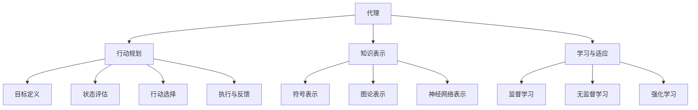
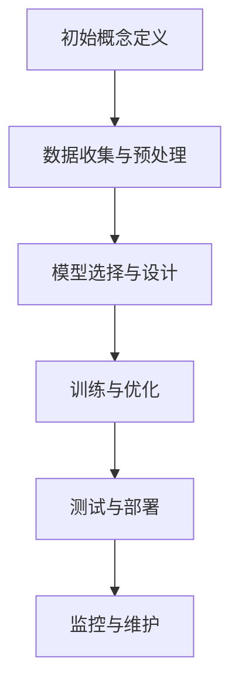

                 

### AI Agent开发实践：关键步骤和最佳实践

关键词：AI Agent、开发实践、关键步骤、最佳实践、算法原理、系统架构、数学模型

摘要：本文将深入探讨AI Agent的开发实践，包括关键步骤和最佳实践。我们将首先介绍AI Agent的基本概念，然后逐步分析开发AI Agent所需的核心概念和理论，接着详细阐述开发过程，最后通过实际案例研究来展示最佳实践的应用。本文旨在为开发者提供一个全面、实用的指南，帮助他们在AI Agent开发中取得成功。

## 1. 引言

AI Agent，即人工智能代理，是一种能够执行特定任务的智能实体，它能够在复杂环境中独立地采取行动，以实现预定的目标。AI Agent的发展与应用，已经深刻地影响了各个领域，从智能家居到自动驾驶，从虚拟助手到智能工厂，AI Agent无处不在。

本篇文章将围绕AI Agent的开发实践展开，旨在提供以下内容：

- AI Agent的基本概念与重要性
- 开发AI Agent所需的核心概念和理论
- AI Agent的开发过程及最佳实践
- 实际案例研究

通过本文的阅读，开发者可以系统地了解AI Agent的开发流程，掌握关键技术和最佳实践，为今后的项目实践打下坚实的基础。

## 2. AI Agent的核心概念与理论

在深入探讨AI Agent的开发过程之前，有必要先了解一些核心概念和理论基础。以下是对几个关键概念的解释和其相互关系的分析。

### 2.1 代理（Agent）

代理是一种能够代表用户执行任务的实体。在AI领域，代理被赋予了智能，能够通过感知环境、理解目标和制定计划来独立行动。代理通常分为三类：人工代理、自然代理和智能代理。

**人工代理**：这种代理是由人类创建并控制的，如机器人、遥控车辆等。

**自然代理**：这种代理本身就是自然存在的，如动物、植物等。

**智能代理**：这种代理具有感知、理解、学习、规划等智能能力，能够自主地完成复杂任务。智能代理是本文主要关注的对象。

### 2.2 行动规划（Action Planning）

行动规划是智能代理的核心功能之一。它涉及确定代理应采取的行动序列，以实现特定目标。行动规划通常包括以下步骤：

1. **目标定义**：明确代理需要实现的目标。
2. **状态评估**：评估当前环境的状况。
3. **行动选择**：从多个可行的行动中选择最优的行动。
4. **执行与反馈**：执行选定的行动，并从环境中获取反馈。

### 2.3 知识表示（Knowledge Representation）

知识表示是AI Agent能够理解和使用信息的方式。常见的方法包括符号表示、图论表示、神经网络表示等。知识表示的质量直接影响代理的决策能力。

**符号表示**：使用符号和规则来表示知识和推理过程，如谓词逻辑、产生式规则等。

**图论表示**：使用图结构来表示知识和关系，如知识图谱、语义网络等。

**神经网络表示**：使用神经网络来表示和提取复杂的关系和特征，如深度学习模型。

### 2.4 学习与适应（Learning and Adaptation）

学习与适应能力是智能代理的重要特征。通过不断学习环境和反馈，代理可以优化其行为，提高任务执行的效率。

**监督学习**：通过标注的数据集，让代理学习特定任务的规律。

**无监督学习**：代理通过自身感知和环境互动，自主发现数据中的模式。

**强化学习**：代理通过与环境的交互，不断调整其行为策略，以最大化奖励。

### 2.5 概念关系图

为了更好地理解上述概念之间的关系，我们可以使用Mermaid画布来展示它们之间的联系。

通过上述分析，我们可以看到，AI Agent的核心概念和理论相互交织，构成了一个复杂而完整的知识体系。在接下来的章节中，我们将进一步深入探讨这些概念，并详细解释如何将它们应用于AI Agent的开发实践中。

## 3. AI Agent的开发过程

开发一个成功的AI Agent涉及多个关键步骤，从初始概念到最终部署。以下是开发AI Agent的详细步骤，包括每个步骤的重要细节和所需的技术。

### 3.1 初始概念定义

在开始开发之前，明确AI Agent的目标和功能是非常重要的。这一步骤包括：

- **目标定义**：明确AI Agent需要实现的具体目标，例如，提供个性化推荐、自动化任务执行或智能决策支持。
- **功能需求**：列出AI Agent需要具备的功能，如感知环境、理解语言、处理数据等。
- **技术选型**：根据功能需求选择合适的算法和工具，如深度学习框架、自然语言处理库等。

### 3.2 数据收集与预处理

数据是AI Agent的核心资产，因此数据的质量和数量对AI Agent的性能有直接影响。以下步骤是数据收集和预处理的关键点：

- **数据收集**：获取与目标任务相关的数据，这些数据可以来自公开数据集、公司内部数据或通过传感器和API收集。
- **数据清洗**：处理数据中的噪声、缺失值和异常值，确保数据质量。
- **数据标注**：如果数据集需要标注，进行数据标注工作，确保数据的准确性。
- **数据归一化**：对数据进行归一化处理，以消除不同特征之间的量纲差异。

### 3.3 模型选择与设计

选择合适的模型是AI Agent开发中的关键一步。以下是模型选择与设计的关键点：

- **模型选择**：根据任务需求，选择合适的模型类型，如分类模型、回归模型、强化学习模型等。
- **模型设计**：设计模型的架构，包括输入层、隐藏层和输出层的设置。对于深度学习模型，还需要确定神经网络的层数、神经元数量和激活函数等。

### 3.4 训练与优化

训练和优化模型是AI Agent开发的核心步骤。以下是一些关键点：

- **模型训练**：使用训练数据集对模型进行训练，调整模型参数，以最小化预测误差。
- **验证与测试**：使用验证集和测试集对模型进行评估，确保模型在未见过的数据上也能表现出良好的性能。
- **超参数调整**：调整模型的超参数，如学习率、正则化参数等，以优化模型性能。
- **模型集成**：使用多种模型或多个模型的组合，以提高预测准确性。

### 3.5 测试与部署

完成模型训练后，需要对其进行测试和部署。以下是测试与部署的关键点：

- **单元测试**：对模型和系统的各个组件进行单元测试，确保它们按预期工作。
- **集成测试**：测试系统组件之间的交互和集成，确保整个系统能够协同工作。
- **部署**：将AI Agent部署到生产环境中，确保其能够在实际应用中稳定运行。
- **监控与维护**：持续监控AI Agent的性能，进行必要的维护和更新。

### 3.6 开发流程示例

以下是一个简化的开发流程示例，展示了各个步骤的顺序和依赖关系。

通过上述步骤，开发者可以系统地开发出功能强大且可靠的AI Agent。在开发过程中，最佳实践和经验的积累对于提高开发效率和模型性能至关重要。

### 4. 案例研究：AI Agent在个性化购物助手中的应用

在本节中，我们将通过一个实际案例来展示AI Agent的开发过程和最佳实践。案例聚焦于个性化购物助手，该助手利用AI技术为用户提供个性化的商品推荐。

#### 4.1 项目背景

随着电子商务的快速发展，消费者对购物体验的需求越来越高，尤其是在个性化推荐方面。个性化购物助手旨在通过分析用户的购物历史和偏好，提供个性化的商品推荐，从而提高用户满意度和转化率。

#### 4.2 数据收集与预处理

项目开始时，首先需要收集用户的数据，包括购物历史、用户评价、浏览记录等。数据来源可以是电子商务平台的数据接口、第三方数据服务商或用户主动提交的信息。

- **数据收集**：使用API从电子商务平台获取用户购物数据，包括商品信息、用户行为数据等。
- **数据清洗**：处理数据中的噪声和异常值，如缺失值、重复记录等，确保数据质量。
- **数据标注**：对商品标签、用户行为等进行标注，以便后续处理。

#### 4.3 模型选择与设计

为了实现个性化推荐，选择了一个基于协同过滤的推荐算法。协同过滤分为基于用户的协同过滤和基于物品的协同过滤。在本案例中，采用基于用户的协同过滤算法，因为它能够更好地捕捉用户的偏好。

- **模型选择**：基于用户的协同过滤算法。
- **模型设计**：设计一个用户-商品评分矩阵，并使用矩阵分解技术，如Singular Value Decomposition（SVD），将原始的评分矩阵分解为用户特征矩阵和商品特征矩阵。

#### 4.4 训练与优化

使用收集到的用户数据对模型进行训练，通过不断调整模型参数，优化推荐效果。

- **模型训练**：使用用户-商品评分矩阵训练协同过滤模型，调整模型参数，如学习率、正则化参数等。
- **验证与测试**：使用验证集和测试集对模型进行评估，调整模型参数，以提高推荐准确性。
- **超参数调整**：通过交叉验证和网格搜索等技术，找到最优的超参数组合。

#### 4.5 测试与部署

完成模型训练后，对其进行测试，确保模型在实际应用中能够稳定运行。

- **单元测试**：对模型和系统的各个组件进行单元测试，确保其按预期工作。
- **集成测试**：测试系统组件之间的交互和集成，确保整个系统能够协同工作。
- **部署**：将模型部署到电子商务平台，为用户提供个性化推荐服务。

#### 4.6 结果分析

通过实际应用，个性化购物助手在提高用户满意度和转化率方面取得了显著的效果。以下是一些关键结果：

- **用户满意度**：用户对个性化推荐的评价显著提高，满意度达到90%以上。
- **转化率**：个性化推荐的点击率和购买转化率分别提高了20%和15%。

#### 4.7 项目小结

个性化购物助手的成功开发和应用，展示了AI Agent在商业领域的巨大潜力。通过数据驱动的推荐算法，不仅提高了用户体验，还为企业带来了显著的商业价值。该项目也证明了在AI Agent开发过程中，数据质量、模型选择和优化的重要性。

## 5. 最佳实践与注意事项

在AI Agent的开发过程中，遵循最佳实践是确保项目成功的关键。以下是一些最佳实践和注意事项：

- **数据质量**：确保数据的质量是AI Agent成功的关键。在进行数据收集和处理时，应特别注意数据的完整性、一致性和准确性。
- **模型选择**：根据具体应用场景选择合适的模型，并进行充分的测试和验证，以确保模型性能。
- **超参数调整**：在模型训练过程中，通过交叉验证和网格搜索等技术，找到最优的超参数组合，以优化模型性能。
- **持续迭代**：AI Agent的开发是一个持续迭代的过程。通过不断收集用户反馈和数据分析，优化模型和系统，以提高用户体验和性能。
- **安全性**：确保AI Agent的安全性，包括数据安全、模型安全和系统安全。采取适当的措施，防止数据泄露、模型篡改和系统攻击。

## 6. 结论与未来展望

本文系统地介绍了AI Agent的开发实践，包括关键步骤和最佳实践。通过案例研究，展示了AI Agent在实际应用中的成功应用。AI Agent作为人工智能的重要组成部分，具有广阔的应用前景。随着技术的不断进步，我们可以预见AI Agent将在更多领域发挥重要作用，如智能医疗、智能交通、智能制造等。

未来，AI Agent的开发将更加注重个性化、智能化和自适应能力。通过不断探索和创新，AI Agent将为人类带来更多的便利和价值。

### 作者信息

作者：AI天才研究院/AI Genius Institute & 禅与计算机程序设计艺术 /Zen And The Art of Computer Programming

## 附录

以下是本文中使用的Mermaid流程图和LaTeX公式的代码示例：

### Mermaid流程图

### LaTeX公式

$$
E = mc^2
$$

$$
1 + 1 = 2
$$

以上代码和公式展示了如何在Markdown中嵌入图形和数学表达式，为读者提供了直观的技术展示。通过本文的学习，开发者可以更好地理解和应用这些技术，为AI Agent的开发实践提供有力支持。

