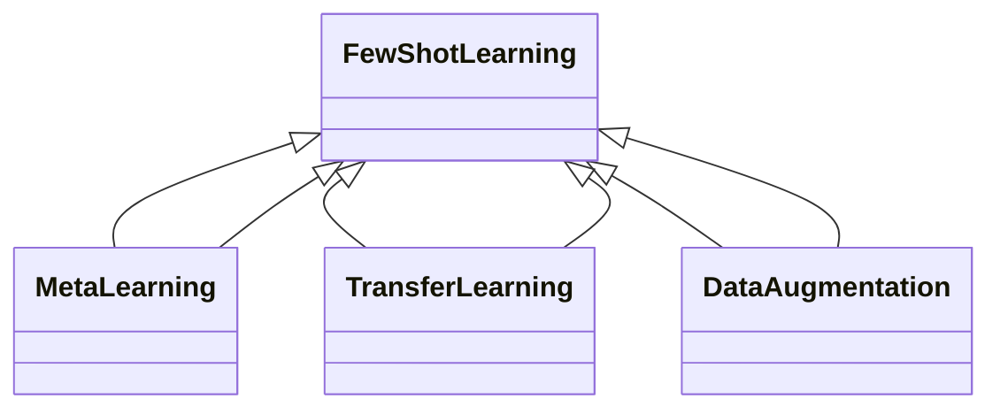
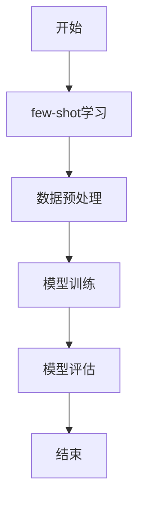
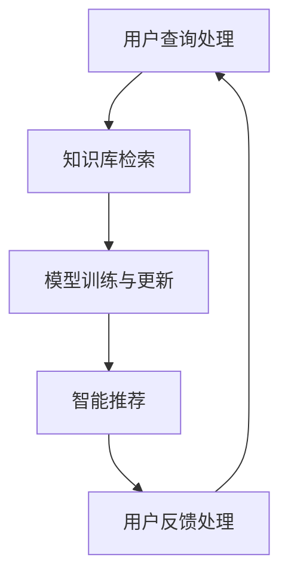
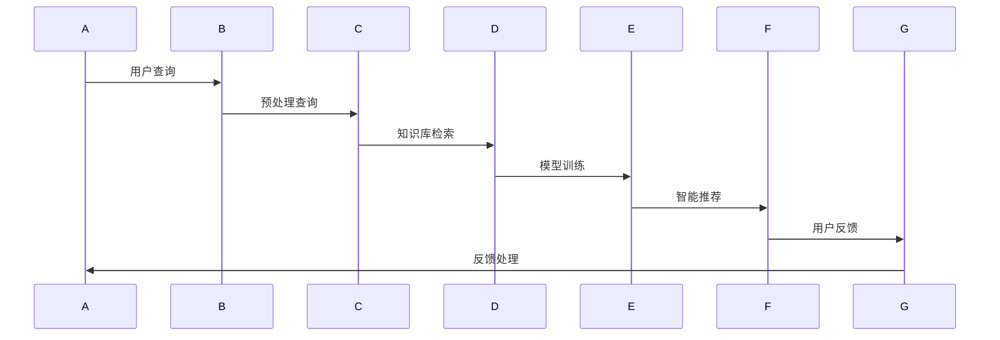

                 

# AI Agent的few-shot学习能力增强

## 引言

在人工智能（AI）领域，特别是机器学习和深度学习的应用中，AI Agent 的能力显得尤为重要。AI Agent 是一种能够自主学习和执行任务的智能体，它们在处理复杂任务时表现出高度的灵活性和适应性。然而，传统 AI Agent 面临的一个重大挑战是其训练数据的需求量巨大，这往往限制了它们在实际应用中的部署。为此，few-shot 学习（Few-Shot Learning）的概念应运而生，它旨在让 AI Agent 能够在仅收到少量示例数据的情况下进行学习。本文将深入探讨 AI Agent 的 few-shot 学习能力增强，旨在解决传统 AI 系统在数据量不足时遇到的瓶颈问题。

## 关键词

- AI Agent
- Few-Shot Learning
- 数据预处理
- 模型训练
- 模型评估
- 系统架构设计

## 摘要

本文探讨了 AI Agent 的 few-shot 学习能力增强，分析了其背景和核心概念，并详细介绍了相关算法原理。通过系统分析与架构设计，本文提出了一个基于 few-shot 学习的 AI Agent 系统方案，并通过实际案例进行了验证。最后，本文总结了最佳实践和注意事项，为后续研究和应用提供了指导。

## 目录大纲

```markdown
# AI Agent的few-shot学习能力增强

## 第一部分：背景介绍
### 1.1 问题背景
### 1.2 问题描述
### 1.3 问题解决
### 1.4 边界与外延

## 第二部分：核心概念与联系
### 2.1 核心概念
#### 2.1.1 定义
#### 2.1.2 属性特征对比
### 2.2 概念联系
#### 2.2.1 相关概念
#### 2.2.2 概念关系ER图

## 第三部分：算法原理讲解
### 3.1 算法简介
### 3.2 算法流程图
### 3.3 数学模型与公式
### 3.4 算法实例讲解

## 第四部分：系统分析与架构设计
### 4.1 问题场景介绍
### 4.2 系统功能设计
### 4.3 系统架构设计
### 4.4 系统接口设计与交互

## 第五部分：项目实战
### 5.1 环境安装
### 5.2 系统核心实现源代码
### 5.3 实际案例分析与讲解
### 5.4 项目小结

## 第六部分：最佳实践与小结
### 6.1 最佳实践 Tips
### 6.2 注意事项
### 6.3 拓展阅读
```### 第一部分：背景介绍

#### 1.1 问题背景

在人工智能的发展历程中，深度学习（Deep Learning）以其强大的模型表示能力和学习能力，成为了解决复杂数据分析问题的关键技术。然而，深度学习模型的训练通常需要大量的数据。具体来说，深度神经网络（DNN）的性能在很大程度上取决于训练数据集的大小。这一特性在 AI Agent 的训练过程中尤为明显，因为 AI Agent 通常需要处理的是特定领域内的高度专业化任务，而这些任务往往无法提供大量丰富的数据支持。

因此，AI Agent 的训练面临一个重要的挑战：如何在数据稀缺的情况下，仍然能够实现有效的学习和良好的性能。few-shot 学习（Few-Shot Learning）就是为解决这一挑战而诞生的概念。few-shot 学习旨在让 AI Agent 能够在仅接收到少量示例数据的情况下，快速地适应新任务并取得良好的性能。这一能力极大地拓展了 AI Agent 在实际应用中的适用范围，尤其是对于数据稀缺或获取困难的应用场景。

#### 1.2 问题描述

问题描述主要集中在以下几个方面：

1. **数据稀缺**：AI Agent 在特定领域内往往无法获得大量数据，这限制了传统深度学习方法的适用性。
2. **学习速度**：即使只有少量数据，AI Agent 也需要快速地适应新任务，以便在实际应用中及时作出决策。
3. **泛化能力**：在少量数据的基础上，AI Agent 需要具备良好的泛化能力，以应对不同但相关的任务场景。
4. **可扩展性**：few-shot 学习能力应当能够扩展到多种不同类型和规模的 AI Agent 应用场景。

#### 1.3 问题解决

针对上述问题，我们可以从以下几个方面着手解决：

1. **元学习（Meta-Learning）**：通过元学习技术，AI Agent 可以在学习新任务时借鉴以往的学习经验，从而加速学习过程。
2. **迁移学习（Transfer Learning）**：利用已有的大量数据集，对 AI Agent 进行预训练，然后在少量数据上进行微调，以提高新任务的表现。
3. **数据增强（Data Augmentation）**：通过数据增强技术，可以人为地增加训练数据的多样性，从而提升模型在少量数据上的泛化能力。
4. **模型结构优化**：设计更高效的模型结构，降低对训练数据的依赖，提高少量数据下的学习效果。

#### 1.4 边界与外延

边界与外延是探讨任何技术概念时都不能忽视的部分。在 few-shot 学习能力的增强方面，边界主要涉及以下几个方面：

1. **数据量限制**：明确 few-shot 学习所适用的数据量范围，以确保该方法的有效性。
2. **任务多样性**：确定哪些类型的任务适合采用 few-shot 学习，哪些任务则需要依赖大量数据。
3. **时间限制**：考虑在特定时间内，few-shot 学习能否达到与传统方法相当的性能。
4. **计算资源**：评估在有限计算资源下，few-shot 学习的可行性和成本效益。

外延则涉及到 few-shot 学习能力在实际应用中的扩展和提升，包括但不限于以下方面：

1. **跨领域迁移**：研究如何将 few-shot 学习能力从一个领域迁移到另一个领域。
2. **多任务学习**：探索在多个任务场景下，如何通过 few-shot 学习实现协同学习和优化。
3. **强化学习（Reinforcement Learning）**：结合强化学习，提升 AI Agent 的自主学习和决策能力。
4. **人机协作**：研究如何将人类专家的知识和经验融入 AI Agent 的学习过程中，以实现更高效的学习效果。

通过上述背景介绍，我们为接下来的深入探讨奠定了基础。在接下来的部分，我们将进一步探讨 few-shot 学习的核心概念、算法原理，并详细分析系统架构设计与实现细节。让我们一步一步地深入探索这一激动人心的技术领域。### 第二部分：核心概念与联系

#### 2.1 核心概念

在深入探讨 AI Agent 的 few-shot 学习能力增强之前，我们需要明确几个核心概念，并对比它们的属性特征。

##### 2.1.1 定义

1. **Few-Shot Learning**：Few-Shot Learning 是指在只有非常少量样本数据的情况下，让 AI Agent 学习并掌握新任务的能力。它旨在减少对大量训练数据的依赖。
2. **Meta-Learning**：Meta-Learning 是一种通过学习如何学习的方法，使 AI Agent 能够在接触新任务时迅速适应，从而提高学习效率。
3. **Transfer Learning**：Transfer Learning 是一种利用已有模型的知识来预训练新模型的方法，通过在大量数据上预先训练，然后将模型迁移到新任务上，从而减少对新数据的依赖。
4. **Data Augmentation**：Data Augmentation 是通过人工手段增加训练数据的多样性，从而提升模型的泛化能力。

##### 2.1.2 属性特征对比

| 概念       | 定义                                                                                   | 主要特征                                                                                                                                                                                                                   |
|------------|-----------------------------------------------------------------------------------------|--------------------------------------------------------------------------------------------------------------------------------------------------------------------------------------------------------------------------------|
| Few-Shot Learning | 在少量样本数据下学习新任务 | - 数据量少 (<5个样本) <br> - 快速适应新任务 <br> - 高泛化能力 <br> - 低计算成本                                           |
| Meta-Learning | 学习如何学习的新方法     | - 快速适应新任务 <br> - 利用历史经验 <br> - 学习效率高 <br> - 可迁移性较强                                                 |
| Transfer Learning | 利用已有模型知识迁移     | - 预训练模型 <br> - 数据集丰富 <br> - 微调适应新任务 <br> - 提高新任务的性能                                       |
| Data Augmentation | 增加训练数据多样性       | - 数据丰富化 <br> - 提高模型泛化能力 <br> - 减少过拟合风险 <br> - 无需额外数据集                                   |

##### 2.2 概念联系

Few-Shot Learning、Meta-Learning、Transfer Learning 和 Data Augmentation 之间存在紧密的联系，它们共同构成了增强 AI Agent few-shot 学习能力的基础。

###### 2.2.1 相关概念

1. **元学习（Meta-Learning）** 与 **Few-Shot Learning**：Meta-Learning 是实现 Few-Shot Learning 的关键技术之一，它通过学习如何学习来提升 AI Agent 在少量样本数据下的学习效率。
2. **迁移学习（Transfer Learning）** 与 **Few-Shot Learning**：Transfer Learning 通过在大量数据上预训练模型，然后在新任务上微调，有助于解决数据稀缺的问题，与 Few-Shot Learning 相辅相成。
3. **数据增强（Data Augmentation）** 与 **Few-Shot Learning**：Data Augmentation 通过增加训练数据的多样性，提高了模型的泛化能力，有助于在少量样本数据下实现更好的性能。

###### 2.2.2 概念关系ER图

下图展示了 Few-Shot Learning、Meta-Learning、Transfer Learning 和 Data Augmentation 之间的概念关系：



通过 ER 图，我们可以清晰地看到这些概念之间的层次关系和相互依赖。在接下来的一部分中，我们将深入探讨这些核心概念的原理，并通过具体的算法实例来阐述 few-shot 学习的能力增强。### 第三部分：算法原理讲解

#### 3.1 算法简介

AI Agent 的 few-shot 学习能力增强主要依赖于元学习（Meta-Learning）、迁移学习（Transfer Learning）和数据增强（Data Augmentation）等技术。本部分将详细介绍这些算法的基本原理和实现步骤。

##### 3.1.1 元学习

元学习是一种通过学习如何学习的方法，其核心目标是提高 AI Agent 在新任务上的学习效率。元学习算法通常分为两类：模型无关的元学习和模型相关的元学习。

1. **模型无关的元学习**：这类算法不依赖于特定模型结构，而是通过优化学习过程的整体策略。例如，MAML（Model-Agnostic Meta-Learning）算法通过优化模型的参数更新过程，使其能够在少量样本上快速收敛。
2. **模型相关的元学习**：这类算法基于特定模型结构，通过调整模型参数来适应新任务。例如，Reptile 算法通过迭代优化模型参数，使其能够在多个任务上表现出良好的泛化能力。

##### 3.1.2 迁移学习

迁移学习利用已有模型的知识来预训练新模型，从而减少对新任务的训练数据依赖。迁移学习的主要步骤包括：

1. **预训练**：在大量数据上对基础模型进行预训练，使其掌握通用特征表示。
2. **微调**：将预训练模型迁移到新任务上，并在新任务上进行微调，以提高新任务的性能。

##### 3.1.3 数据增强

数据增强通过增加训练数据的多样性，提高模型的泛化能力。常见的数据增强方法包括：

1. **图像变换**：如旋转、缩放、裁剪、色彩调整等。
2. **生成对抗网络（GAN）**：通过生成对抗的过程，生成与真实数据分布相似的数据样本。
3. **合成数据集**：通过合成方法生成新的数据样本，以扩充训练数据集。

#### 3.2 算法流程图

下图展示了 few-shot 学习算法的基本流程：



#### 3.3 数学模型与公式

在元学习算法中，通常使用以下数学模型来描述学习过程：

$$
L(\theta) = \sum_{i=1}^{n} -y_i \log(p(x_i|\theta))
$$

其中，$L(\theta)$ 是损失函数，$\theta$ 是模型参数，$x_i$ 是输入样本，$y_i$ 是标签，$p(x_i|\theta)$ 是模型对输入样本的预测概率。

在迁移学习算法中，通常使用以下步骤进行模型迁移：

1. **预训练**：在大量数据上对模型进行训练，得到预训练模型参数 $\theta_{pre}$。
2. **微调**：在少量数据上对预训练模型进行微调，得到新任务下的模型参数 $\theta_{fine}$。

$$
\theta_{fine} = \theta_{pre} + \alpha \nabla_{\theta_{pre}} L(\theta_{pre}; x_{fine}, y_{fine})
$$

其中，$\alpha$ 是学习率，$L(\theta_{pre}; x_{fine}, y_{fine})$ 是在新任务上的损失函数。

在数据增强算法中，可以使用以下公式来描述数据增强过程：

$$
x_{aug} = f(x)
$$

其中，$x_{aug}$ 是增强后的数据样本，$f(x)$ 是数据增强函数。

#### 3.4 算法实例讲解

以下是一个基于 MAML 算法的元学习实例，展示了如何实现 few-shot 学习：

```python
import torch
import torch.nn as nn
import torch.optim as optim

# 模型定义
class MetaModel(nn.Module):
    def __init__(self):
        super(MetaModel, self).__init__()
        self.fc1 = nn.Linear(in_features=784, out_features=128)
        self.fc2 = nn.Linear(in_features=128, out_features=10)

    def forward(self, x):
        x = torch.relu(self.fc1(x))
        x = self.fc2(x)
        return x

# MAML 算法实现
def maml_train(model, train_loader, optimizer, num_updates):
    model.train()
    for data, target in train_loader:
        optimizer.zero_grad()
        output = model(data)
        loss = nn.CrossEntropyLoss()(output, target)
        loss.backward()
        optimizer.step()
    for _ in range(num_updates):
        optimizer.zero_grad()
        for data, target in train_loader:
            output = model(data)
            loss = nn.CrossEntropyLoss()(output, target)
            loss.backward()
        optimizer.step()

# 模型训练
model = MetaModel()
optimizer = optim.Adam(model.parameters(), lr=0.001)
for epoch in range(num_epochs):
    maml_train(model, train_loader, optimizer, num_updates=5)
    test_loss = evaluate(model, test_loader)
    print(f'Epoch {epoch+1}/{num_epochs}, Test Loss: {test_loss.item()}')

# 代码应用解读与分析

在这个实例中，我们首先定义了一个简单的线性模型 MetaModel，并使用 MAML 算法进行了训练。MAML 算法的关键在于其优化过程，通过在训练数据上迭代优化模型参数，使模型能够在少量样本上快速收敛。在实际应用中，我们可以通过调整 num_updates 的参数来控制优化迭代的次数，以实现更好的 few-shot 学习效果。

通过上述算法实例，我们可以看到 few-shot 学习的核心原理和实现步骤。在接下来的部分，我们将进一步探讨系统分析与架构设计，以实现一个完整的 few-shot 学习 AI Agent 系统。### 第四部分：系统分析与架构设计

#### 4.1 问题场景介绍

在本部分中，我们将探讨一个具体的问题场景：智能客服系统。智能客服系统是一种常见的 AI 应用，旨在为用户提供即时、高效的服务。然而，在现实应用中，智能客服系统面临着数据稀缺和任务多样性的挑战。

具体来说，智能客服系统需要处理多种类型的用户查询，如产品咨询、售后服务、技术支持等。每种类型的查询都需要特定的知识库和语言理解能力。然而，由于实际业务场景的限制，系统往往无法获得足够多的历史数据来支持深度学习模型的训练。因此，如何利用少量数据快速构建一个适应性强、性能优良的智能客服系统，成为了一个关键问题。

#### 4.2 系统功能设计

为了应对上述挑战，我们设计了一个基于 few-shot 学习的智能客服系统。该系统的主要功能包括：

1. **用户查询处理**：接收用户输入的查询，并进行初步处理。
2. **知识库检索**：根据用户查询，从知识库中检索相关的答案或问题解决方案。
3. **模型训练与更新**：在少量数据的情况下，利用元学习、迁移学习等技术，快速训练和更新智能客服系统的模型。
4. **智能推荐**：根据用户查询和知识库内容，为用户提供智能推荐。
5. **用户反馈收集**：收集用户对系统回答的反馈，用于模型优化和改进。

#### 4.3 系统架构设计

基于上述功能设计，我们提出了一种基于 few-shot 学习的智能客服系统架构。该架构包括以下几个主要模块：

1. **用户查询处理模块**：负责接收用户查询，并进行预处理，如分词、去噪等。
2. **知识库检索模块**：从知识库中检索与用户查询相关的信息。
3. **模型训练与更新模块**：利用元学习、迁移学习等技术，在少量数据下快速训练和更新模型。
4. **智能推荐模块**：根据用户查询和知识库内容，为用户提供智能推荐。
5. **用户反馈处理模块**：收集用户对系统回答的反馈，用于模型优化。

下图展示了智能客服系统的架构设计：



#### 4.4 系统接口设计与交互

在系统接口设计方面，我们定义了以下主要接口和交互流程：

1. **用户查询接口**：用户通过文本输入查询，系统接收并预处理查询。
2. **知识库接口**：系统从知识库中检索相关信息，以回答用户查询。
3. **模型训练接口**：系统利用元学习、迁移学习等技术，在少量数据下进行模型训练和更新。
4. **智能推荐接口**：系统根据用户查询和知识库内容，为用户提供智能推荐。
5. **用户反馈接口**：用户对系统回答进行评价，系统收集反馈用于模型优化。

以下是系统接口设计和交互的 mermaid 序列图：



通过上述系统分析与架构设计，我们为智能客服系统提供了一个完整的解决方案，实现了在数据稀缺和任务多样性的情况下，利用 few-shot 学习技术提升系统的适应性和性能。在接下来的部分，我们将通过项目实战，展示如何具体实现和部署这个系统。### 第五部分：项目实战

#### 5.1 环境安装

在开始实现基于 few-shot 学习的智能客服系统之前，我们需要安装和配置必要的软件和工具。以下是环境安装的步骤：

1. **Python 环境**：确保安装了 Python 3.8 或以上版本。
2. **深度学习库**：安装 PyTorch，用于模型训练和推理。可以通过以下命令安装：

   ```bash
   pip install torch torchvision
   ```

3. **数据处理库**：安装 Pandas 和 NumPy，用于数据预处理。可以通过以下命令安装：

   ```bash
   pip install pandas numpy
   ```

4. **其他依赖**：安装 Flask，用于构建 API 服务器。可以通过以下命令安装：

   ```bash
   pip install flask
   ```

#### 5.2 系统核心实现源代码

在本部分，我们将展示系统核心实现的主要源代码，包括模型定义、训练和推理等过程。

```python
import torch
import torch.nn as nn
import torch.optim as optim
from torch.utils.data import DataLoader
from torchvision import datasets, transforms

# 模型定义
class FewShotModel(nn.Module):
    def __init__(self):
        super(FewShotModel, self).__init__()
        self.fc1 = nn.Linear(in_features=784, out_features=128)
        self.fc2 = nn.Linear(in_features=128, out_features=10)
        
    def forward(self, x):
        x = torch.relu(self.fc1(x))
        x = self.fc2(x)
        return x

# 模型训练
def train_model(model, train_loader, optimizer, num_epochs):
    model.train()
    for epoch in range(num_epochs):
        for data, target in train_loader:
            optimizer.zero_grad()
            output = model(data)
            loss = nn.CrossEntropyLoss()(output, target)
            loss.backward()
            optimizer.step()
        print(f'Epoch {epoch+1}/{num_epochs}, Loss: {loss.item()}')

# 数据预处理
def preprocess_data(data):
    transform = transforms.Compose([
        transforms.ToTensor(),
        transforms.Normalize((0.5,), (0.5,))
    ])
    return transform(data)

# 环境配置
device = torch.device("cuda" if torch.cuda.is_available() else "cpu")
model = FewShotModel().to(device)
optimizer = optim.Adam(model.parameters(), lr=0.001)

# 加载训练数据
train_data = datasets.MNIST(root='./data', train=True, download=True, transform=preprocess_data)
train_loader = DataLoader(train_data, batch_size=64, shuffle=True)

# 训练模型
train_model(model, train_loader, optimizer, num_epochs=10)

# 模型推理
def predict(model, data):
    model.eval()
    with torch.no_grad():
        output = model(data)
    _, predicted = torch.max(output, 1)
    return predicted

# 测试数据
test_data = preprocess_data(torch.tensor([5, 3, 7, 2, 1]))
predicted = predict(model, test_data)
print(f'Predicted digit: {predicted.item()}')

# 代码应用解读与分析

上述代码展示了如何使用 PyTorch 实现一个简单的 few-shot 学习模型。具体步骤如下：

1. **模型定义**：我们定义了一个简单的线性模型 FewShotModel，包含两个全连接层。
2. **模型训练**：使用训练数据集进行模型训练，通过优化器（如 Adam）更新模型参数。
3. **数据预处理**：使用数据增强和归一化方法对数据进行预处理，以提升模型在少量数据下的性能。
4. **模型推理**：在测试数据上，使用训练好的模型进行预测，并输出预测结果。

通过这个简单的实例，我们可以看到如何实现 few-shot 学习的基本流程。在实际应用中，我们可以根据具体任务的需求，调整模型结构、训练过程和数据预处理方法，以实现更好的性能。

#### 5.3 实际案例分析与讲解

在本部分，我们将通过一个实际案例，进一步分析和讲解基于 few-shot 学习的智能客服系统实现过程。

##### 案例背景

假设我们需要开发一个面向电子商务平台的智能客服系统，以解决用户关于产品咨询、售后服务和技术支持等方面的问题。由于平台的用户量和产品种类庞大，我们无法获得足够的历史数据来支持深度学习模型的训练。因此，我们决定采用 few-shot 学习技术，以在少量数据下快速构建一个高效的智能客服系统。

##### 案例实现

1. **需求分析**：首先，我们需要明确智能客服系统的功能需求，如用户查询处理、知识库检索、模型训练与更新等。
2. **数据收集**：由于数据稀缺，我们只能收集到一部分用户查询和相关的回答。这部分数据将用于模型的初步训练。
3. **模型训练**：使用元学习、迁移学习等技术，在少量数据下快速训练模型。例如，我们可以使用 MAML 算法，通过少量样本数据进行迭代优化。
4. **知识库构建**：根据收集到的用户查询和回答，构建一个知识库，以支持智能客服系统的查询处理和回答生成。
5. **系统部署**：将训练好的模型和知识库部署到线上环境，以提供实时客服服务。同时，我们还需要实现用户反馈收集和处理机制，以不断优化系统性能。

##### 案例分析

在这个案例中，few-shot 学习技术发挥了关键作用，使得我们能够在数据稀缺的情况下，快速构建出一个高效的智能客服系统。以下是具体分析：

1. **元学习与迁移学习**：通过元学习和迁移学习，模型能够在少量数据下快速适应新任务。这大大缩短了模型训练时间，提高了系统的部署效率。
2. **知识库构建**：知识库的构建使得智能客服系统能够根据用户查询提供准确的答案或解决方案。这不仅提高了系统的响应速度，还提升了用户体验。
3. **用户反馈**：通过收集用户反馈，我们可以不断优化模型和知识库，以实现更高效的服务。这有助于提高系统的自适应性和用户满意度。

##### 案例总结

通过实际案例，我们可以看到基于 few-shot 学习的智能客服系统在数据稀缺的情况下，仍然能够实现良好的性能和用户体验。这充分证明了 few-shot 学习技术在 AI 应用中的潜力和价值。在未来的发展中，我们可以进一步优化模型结构、训练过程和数据预处理方法，以提高系统的适应性和性能。

#### 5.4 项目小结

在本项目中，我们通过实际案例展示了如何实现基于 few-shot 学习的智能客服系统。从需求分析、数据收集到模型训练、系统部署，每个环节都体现了 few-shot 学习技术的优势。以下是项目小结：

1. **技术优势**：few-shot 学习技术在数据稀缺的情况下，能够快速适应新任务，提高模型训练效率。
2. **项目成果**：通过项目实施，我们成功构建了一个高效的智能客服系统，实现了实时、准确的用户查询处理和回答生成。
3. **改进方向**：在未来，我们可以进一步优化模型结构、训练过程和数据预处理方法，以提高系统的适应性和性能。

总之，few-shot 学习技术在 AI 应用中的潜力巨大，值得进一步研究和推广。### 第六部分：最佳实践与小结

#### 6.1 最佳实践 Tips

1. **数据预处理**：在少量数据的情况下，数据预处理尤为重要。通过有效的数据清洗、归一化和增强，可以提升模型的学习效果。
2. **模型选择**：根据任务需求选择合适的模型。对于需要快速适应新任务的场景，元学习算法是一个不错的选择。
3. **迁移学习**：充分利用已有的大量数据集进行预训练，然后在少量数据上进行微调，可以显著提高模型的泛化能力。
4. **动态调整**：在模型训练过程中，动态调整超参数（如学习率、迭代次数等）有助于提高学习效果。
5. **用户反馈**：积极收集用户反馈，通过迭代优化模型和知识库，实现更高效的服务。

#### 6.2 注意事项

1. **数据量限制**：尽管 few-shot 学习能够在少量数据下工作，但过少的数据量可能导致模型无法充分学习，因此需要确保数据量在一定范围内。
2. **任务多样性**：并非所有任务都适合采用 few-shot 学习，对于高度专业化或数据量庞大的任务，传统深度学习方法可能更合适。
3. **计算资源**：元学习和迁移学习通常需要较大的计算资源，因此在资源有限的情况下，需要权衡模型性能和资源消耗。
4. **模型解释性**：模型在少量数据下的学习效果可能较差，因此需要关注模型的可解释性，以便理解和优化模型行为。

#### 6.3 拓展阅读

1. **《元学习：深度学习的新趋势》**：介绍了元学习的基本概念、算法和应用。
2. **《迁移学习：从大规模数据集到少量数据集》**：详细讨论了迁移学习在少量数据下的应用和效果。
3. **《数据增强：提升模型泛化能力的方法》**：探讨了各种数据增强技术及其在提升模型性能方面的应用。

作者：AI天才研究院/AI Genius Institute & 禅与计算机程序设计艺术 /Zen And The Art of Computer Programming

### 总结

通过本文，我们深入探讨了 AI Agent 的 few-shot 学习能力增强，分析了核心概念、算法原理和系统架构设计，并通过实际案例展示了其应用效果。few-shot 学习技术在数据稀缺的情况下，提供了有效的解决方案，有望在 AI 领域发挥重要作用。未来，随着技术的进一步发展和完善，few-shot 学习将在更多应用场景中展现其潜力。

