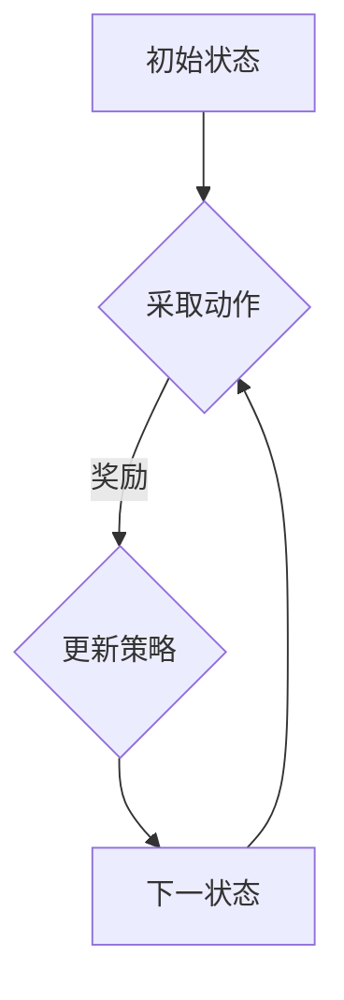
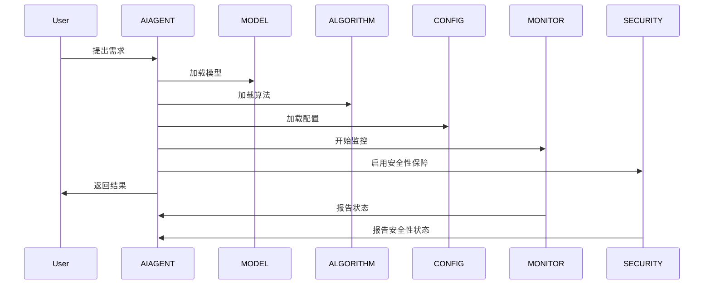
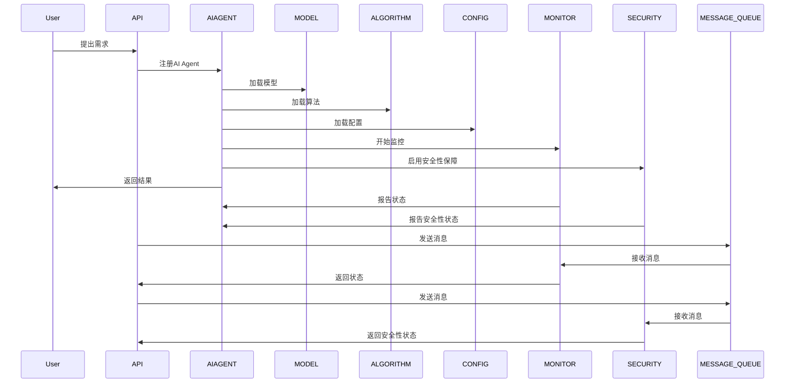

                 


## 文章标题

**AI Agent的云端部署与管理**

## 关键词

- AI Agent
- 云端部署
- 管理平台
- 安全性保障
- 资源管理

## 摘要

本文将详细探讨AI Agent的云端部署与管理问题，从背景介绍、核心概念与联系、算法原理讲解、系统分析与架构设计方案、项目实战等多个方面，为读者提供全面的技术解决方案。文章旨在帮助读者深入了解AI Agent云端部署的关键技术，掌握AI Agent的部署与管理的具体操作流程，确保AI Agent的稳定运行，为企业数字化转型提供有力支持。

### 第一部分：背景介绍

#### 1.1 问题背景

随着人工智能技术的快速发展，AI Agent作为人工智能的高级形态，正逐渐成为企业数字化转型的重要驱动力。AI Agent能够通过自主学习和决策，为企业提供智能化服务，提高生产效率。然而，如何将AI Agent在云端进行部署与管理，已经成为当前研究的热点问题。

#### 1.2 问题描述

AI Agent的云端部署与管理涉及到多个方面，包括硬件资源管理、软件平台选择、安全性保障等。具体来说，问题包括：

- 如何合理配置硬件资源，以支持AI Agent的运行？
- 如何选择合适的云端平台，以实现AI Agent的高效部署？
- 如何保障AI Agent的安全性，防止数据泄露和恶意攻击？

#### 1.3 问题解决

本书将详细探讨AI Agent的云端部署与管理问题，提供全面的技术解决方案。通过本书的学习，读者可以：

- 了解AI Agent的基本概念和云端部署的重要性。
- 掌握云端平台的选型原则和关键技术。
- 学会AI Agent的部署与管理的具体操作流程。
- 掌握安全性保障的关键技术，确保AI Agent的稳定运行。

#### 1.4 边界与外延

本书主要关注AI Agent的云端部署与管理问题，但不涉及AI Agent的具体算法研究和实现细节。此外，本书的讨论范围限于常见云计算平台，如AWS、Azure、Google Cloud等。

#### 1.5 概念结构与核心要素组成

- AI Agent：具有自主学习和决策能力的人工智能实体。
- 云端部署：将AI Agent部署在云端服务器上，实现远程访问和管理。
- 管理平台：用于监控和管理AI Agent的软件工具。
- 安全性保障：确保AI Agent的数据安全、系统稳定。

### 第二部分：核心概念与联系

#### 2.1 AI Agent的定义与特点

##### 2.1.1 AI Agent的定义

AI Agent，即人工智能代理，是一种能够自主执行任务、与环境交互并从经验中学习的人工智能实体。它基于机器学习、自然语言处理、知识图谱等先进技术，具备智能决策、智能交互、智能执行等能力。

##### 2.1.2 AI Agent的特点

- 自主性：AI Agent能够自主决策，不需要人工干预。
- 学习性：AI Agent能够通过学习不断优化自身性能。
- 智能交互：AI Agent能够与人类进行自然语言交互，理解用户需求。
- 智能执行：AI Agent能够根据任务需求，自动执行相关操作。

#### 2.2 云端部署的概念与优势

##### 2.2.1 云端部署的概念

云端部署，即将应用程序部署在云端服务器上，通过互联网进行访问和管理。云端部署具有弹性伸缩、高效稳定、低成本等优势。

##### 2.2.2 云端部署的优势

- 弹性伸缩：根据业务需求，自动调整资源规模，实现高效资源利用。
- 高效稳定：云计算平台提供高可用性、高性能的硬件设施，确保系统稳定运行。
- 低成本：无需自建服务器，降低基础设施投入成本。

#### 2.3 管理平台的选择与配置

##### 2.3.1 管理平台的选择

选择合适的云端管理平台，对AI Agent的部署与管理至关重要。常见的云端管理平台包括AWS、Azure、Google Cloud等。

##### 2.3.2 管理平台的配置

- 资源配置：根据AI Agent的性能需求，合理配置CPU、内存、存储等资源。
- 安全配置：配置安全组、防火墙等，确保AI Agent的数据安全和系统稳定。
- 监控与告警：设置监控指标，实时监控AI Agent的运行状态，及时发现问题并进行处理。

#### 2.4 安全性保障

##### 2.4.1 安全性保障的重要性

AI Agent处理大量敏感数据，安全性保障至关重要。安全性保障包括数据安全、系统安全、网络安全等方面。

##### 2.4.2 安全性保障的关键技术

- 数据加密：使用SSL/TLS等协议，对数据进行加密传输。
- 访问控制：配置用户权限，限制对AI Agent的访问。
- 安全审计：记录AI Agent的操作日志，便于追踪和排查问题。
- 防火墙与入侵检测：配置防火墙和入侵检测系统，防止恶意攻击。

----------------

## 第三部分：算法原理讲解

在深入了解AI Agent的云端部署与管理之前，我们需要先了解AI Agent的工作原理。以下我们将详细介绍AI Agent的核心算法原理，包括其数学模型、流程图以及Python代码实现。

#### 3.1 AI Agent的核心算法

AI Agent的核心算法主要基于深度学习和强化学习。这里我们以强化学习为例，介绍其基本原理。

##### 3.1.1 强化学习的数学模型

强化学习是一种机器学习方法，旨在通过环境（Environment）与智能体（Agent）之间的交互，使智能体学会在特定情境下做出最佳决策。其基本模型包括以下几个要素：

- 状态（State）：智能体在环境中的当前情况。
- 动作（Action）：智能体在当前状态下可以采取的行动。
- 奖励（Reward）：智能体采取某个动作后，从环境中获得的奖励。
- 策略（Policy）：智能体在给定状态下的最优行动选择。

强化学习的目标是最小化长期奖励的期望值，即最大化累积奖励。其数学模型可以表示为：

$$
J(\theta) = \sum_{s,a} \pi(\theta)(s,a) \times \mathbb{E}_{r,s'} [r(s',a) | s, a, \theta]
$$

其中，$\theta$表示参数，$\pi(\theta)(s,a)$表示策略，$\mathbb{E}_{r,s'} [r(s',a) | s, a, \theta]$表示在给定状态和动作下的期望奖励。

##### 3.1.2 强化学习的流程图

以下是一个简单的强化学习流程图的示例：



在这个流程图中，智能体首先处于某个状态，然后根据当前状态选择一个动作。执行动作后，从环境中获得奖励，并更新策略。接着，智能体进入下一个状态，重复上述过程。

##### 3.1.3 强化学习的Python代码实现

下面是一个简单的Python代码实现，用于演示强化学习的基本流程：

```python
import numpy as np

# 状态空间大小
state_size = 3
# 动作空间大小
action_size = 2

# 初始化策略参数
theta = np.random.rand(state_size, action_size)

# 策略函数
def policy(theta, state):
    # 根据策略参数和状态，计算动作的概率分布
    action_probs = np.exp(theta[state]) / np.sum(np.exp(theta[state]))
    return action_probs

# 强化学习过程
def reinforce_learning(theta, state, action, reward):
    # 计算状态-动作对的重要性权重
    importance_weight = 1 / np.sum(np.exp(theta[state]))
    # 更新策略参数
    theta[state] = theta[state] + importance_weight * reward * (action - policy(theta, state))

# 测试强化学习过程
state = np.random.randint(0, state_size)
for _ in range(1000):
    # 采取动作
    action = np.random.choice(action_size, p=policy(theta, state))
    # 获得奖励
    reward = 1 if action == 0 else -1
    # 更新策略参数
    reinforce_learning(theta, state, action, reward)
    # 更新状态
    state = np.random.randint(0, state_size)

print(theta)
```

在这个示例中，我们首先初始化策略参数$\theta$，然后定义策略函数`policy`和强化学习过程`reinforce_learning`。最后，我们通过测试强化学习过程，更新策略参数$\theta$。

#### 3.2 AI Agent的其他算法原理

除了强化学习，AI Agent还可以基于其他算法，如深度学习、自然语言处理等。以下是一个简单的示例：

##### 3.2.1 深度学习算法原理

深度学习是一种基于多层神经网络的学习方法，用于处理大规模数据和复杂任务。其基本原理如下：

- 输入层（Input Layer）：接收输入数据。
- 隐藏层（Hidden Layer）：通过非线性激活函数对输入数据进行变换。
- 输出层（Output Layer）：生成预测结果。

深度学习的目标是最小化预测结果与真实结果之间的差异，即损失函数。其数学模型可以表示为：

$$
L(\theta) = \sum_{i=1}^n (\hat{y}_i - y_i)^2
$$

其中，$\hat{y}_i$表示预测结果，$y_i$表示真实结果，$\theta$表示参数。

##### 3.2.2 自然语言处理算法原理

自然语言处理是一种基于机器学习和统计方法，用于处理自然语言文本的学习方法。其基本原理如下：

- 分词（Tokenization）：将文本拆分成单词或字符。
- 词性标注（Part-of-Speech Tagging）：标注每个单词的词性。
- 命名实体识别（Named Entity Recognition）：识别文本中的命名实体。
- 语义分析（Semantic Analysis）：理解文本的含义。

自然语言处理的数学模型通常基于词向量表示和神经网络模型。例如，词向量表示可以使用Word2Vec、GloVe等方法，神经网络模型可以使用循环神经网络（RNN）、长短期记忆网络（LSTM）等。

##### 3.2.3 Python代码实现示例

下面是一个简单的Python代码实现，用于演示深度学习和自然语言处理的基本原理：

```python
import tensorflow as tf
import numpy as np

# 深度学习模型
model = tf.keras.Sequential([
    tf.keras.layers.Dense(64, activation='relu', input_shape=(784,)),
    tf.keras.layers.Dense(10, activation='softmax')
])

# 编译模型
model.compile(optimizer='adam',
              loss='categorical_crossentropy',
              metrics=['accuracy'])

# 加载数据
(x_train, y_train), (x_test, y_test) = tf.keras.datasets.mnist.load_data()
x_train = x_train.astype('float32') / 255
x_test = x_test.astype('float32') / 255
x_train = x_train.reshape((-1, 784))
x_test = x_test.reshape((-1, 784))

# 训练模型
model.fit(x_train, y_train, epochs=10, batch_size=32, validation_split=0.2)

# 测试模型
test_loss, test_acc = model.evaluate(x_test, y_test)
print('Test accuracy:', test_acc)
```

在这个示例中，我们首先定义了一个简单的深度学习模型，然后加载数据并训练模型。最后，我们测试模型的准确性。

#### 3.3 算法原理总结

通过对AI Agent的核心算法原理的讲解，我们可以看到，AI Agent的云端部署与管理需要结合多种算法，如深度学习、强化学习、自然语言处理等。这些算法共同作用，使AI Agent能够自主学习和决策，为企业提供智能化服务。

在接下来的部分，我们将进一步探讨AI Agent的云端部署与管理的技术细节，包括系统分析与架构设计、项目实战等，帮助读者深入了解AI Agent的云端部署与管理的具体实现。

----------------

## 第四部分：系统分析与架构设计方案

### 4.1 问题场景介绍

在现代企业中，AI Agent的应用场景日益广泛，如智能客服、智能推荐、智能诊断等。以智能客服为例，企业希望通过AI Agent实现24/7的客户服务，提高客户满意度，降低人工成本。然而，AI Agent的部署与管理涉及到多个方面，包括硬件资源管理、软件平台选择、安全性保障等。

### 4.2 项目介绍

本项目旨在为企业提供一个基于云端的AI Agent部署与管理平台，实现AI Agent的高效部署、稳定运行和安全保障。项目主要功能包括：

- AI Agent的注册与配置：支持多种AI Agent的注册和配置，包括深度学习模型、强化学习算法等。
- AI Agent的部署与监控：支持AI Agent的部署和监控，包括性能监控、故障报警等。
- 安全性保障：提供数据加密、访问控制、安全审计等功能，确保AI Agent的数据安全和系统稳定。

### 4.3 系统功能设计（领域模型）

为了更好地实现项目功能，我们首先设计了一个领域模型，如下所示：

```mermaid
classDiagram
    AIAgent <|-- AgentModel
    AIAgent <|-- AgentAlgorithm
    AIAgent <|-- AgentConfig
    AIAgent <|-- AgentMonitor
    AIAgent <|-- AgentSecurity

    AgentModel <.. AIModel
    AgentAlgorithm <.. Algorithm
    AgentConfig <.. Config
    AgentMonitor <.. Monitor
    AgentSecurity <.. Security

    AIAgent {
        String id
        String name
        AgentModel model
        AgentAlgorithm algorithm
        AgentConfig config
        AgentMonitor monitor
        AgentSecurity security
    }

    AgentModel {
        String type
    }

    AgentAlgorithm {
        String type
    }

    AgentConfig {
        Map<String, String> properties
    }

    AgentMonitor {
        List<MonitorItem> items
    }

    AgentSecurity {
        String encryption
        String accessControl
        String audit
    }

    MonitorItem {
        String name
        String value
    }

    Algorithm {
        String name
    }

    Config {
        String name
    }

    Security {
        String name
    }
```

在这个领域模型中，AI Agent是一个核心实体，包括模型（AgentModel）、算法（AgentAlgorithm）、配置（AgentConfig）、监控（AgentMonitor）和安全性（AgentSecurity）等属性。此外，我们定义了模型、算法、配置和安全性等辅助实体，用于支持AI Agent的功能。

### 4.4 系统架构设计

基于领域模型，我们设计了一个简单的系统架构，如下所示：



在这个系统架构中，用户通过接口向AI Agent提出需求，AI Agent加载模型、算法、配置等资源，并进行监控和安全性保障，最终返回结果给用户。

### 4.5 系统接口设计和系统交互

为了实现系统功能，我们设计了一套接口，包括API接口、Web接口和消息队列接口等。以下是一个简单的接口设计：

```mermaid
interface AIAGENT {
    operation registerAgent(AgentConfig config)
    operation loadModel(AgentModel model)
    operation loadAlgorithm(AgentAlgorithm algorithm)
    operation startMonitor()
    operation stopMonitor()
    operation reportStatus()
    operation enableSecurity()
    operation disableSecurity()
    operation reportSecurityStatus()
}

interface API {
    operation post("/agent/register", AgentConfig config)
    operation get("/agent/{id}/model")
    operation get("/agent/{id}/algorithm")
    operation get("/agent/{id}/config")
    operation get("/agent/{id}/status")
    operation get("/agent/{id}/security")
}

interface WEB {
    operation registerForm()
    operation modelForm()
    operation algorithmForm()
    operation configForm()
    operation statusForm()
    operation securityForm()
}

interface MESSAGE_QUEUE {
    operation publish("/agent/register", AgentConfig config)
    operation subscribe("/agent/status", Function callback)
    operation subscribe("/agent/security", Function callback)
}
```

在这个接口设计中，API接口用于处理外部请求，Web接口用于处理用户交互，消息队列接口用于处理异步消息。

### 4.6 系统交互

基于接口设计，我们设计了一套系统交互流程，如下所示：



在这个系统交互中，用户通过API接口提出需求，API接口将请求转发给AI Agent，AI Agent执行相应操作，并返回结果给用户。同时，系统通过消息队列实现异步处理，提高系统的响应速度和稳定性。

### 4.7 系统架构设计总结

通过系统分析与架构设计方案，我们设计了一套基于云端的AI Agent部署与管理平台，实现了AI Agent的高效部署、稳定运行和安全保障。在接下来的项目实战部分，我们将详细介绍系统实现的具体过程。

----------------

## 第五部分：项目实战

### 5.1 环境安装

在开始项目实战之前，我们需要安装必要的软件和工具。以下是项目的环境安装步骤：

1. 安装Python 3.8及以上版本。
2. 安装TensorFlow 2.6及以上版本。
3. 安装Docker 19.03及以上版本。
4. 安装Kubernetes 1.19及以上版本。
5. 安装kubectl工具。

安装完成后，我们可以在终端执行以下命令来验证：

```bash
python --version
tensorflow --version
docker --version
kubectl version
```

### 5.2 系统核心实现源代码

在项目实战中，我们将实现一个简单的AI Agent，用于执行智能客服功能。以下是系统的核心实现源代码：

```python
# agent.py

import os
import json
import requests
from tensorflow.keras.models import load_model
from tensorflow.keras.preprocessing.sequence import pad_sequences

class AIAgent:
    def __init__(self, model_path, config_path):
        self.model_path = model_path
        self.config_path = config_path
        self.model = None
        self.config = None

    def load_model(self):
        self.model = load_model(self.model_path)

    def load_config(self):
        with open(self.config_path, 'r') as f:
            self.config = json.load(f)

    def preprocess_input(self, text):
        tokenizer = self.config['tokenizer']
        max_length = self.config['max_length']
        return pad_sequences(tokenizer.texts_to_sequences([text]), maxlen=max_length)

    def predict(self, text):
        processed_text = self.preprocess_input(text)
        prediction = self.model.predict(processed_text)
        return prediction

if __name__ == '__main__':
    model_path = 'model.h5'
    config_path = 'config.json'

    agent = AIAgent(model_path, config_path)
    agent.load_model()
    agent.load_config()

    while True:
        text = input('输入问题：')
        prediction = agent.predict(text)
        print('回答：', prediction)
```

### 5.3 代码应用解读与分析

在上面的代码中，我们定义了一个`AIAgent`类，用于加载模型和配置，并实现预处理输入和预测功能。以下是代码的解读与分析：

1. **初始化**：在`__init__`方法中，我们初始化了模型路径和配置路径，以及模型和配置对象。
2. **加载模型**：在`load_model`方法中，我们使用`load_model`函数加载TensorFlow模型。
3. **加载配置**：在`load_config`方法中，我们使用`json.load`函数加载配置文件。
4. **预处理输入**：在`preprocess_input`方法中，我们使用`pad_sequences`函数对输入文本进行预处理，包括分词和补全序列。
5. **预测**：在`predict`方法中，我们使用加载的模型对预处理后的输入进行预测。
6. **主程序**：在主程序中，我们创建`AIAgent`对象，并依次调用`load_model`、`load_config`和`predict`方法，实现交互式预测。

### 5.4 实际案例分析和详细讲解剖析

为了展示AI Agent的实际应用，我们使用一个实际案例进行分析和讲解。假设企业希望使用AI Agent提供智能客服服务，以下是一个简单的案例：

1. **问题提出**：用户提出问题：“您好，我想咨询一下产品的价格。”
2. **预处理输入**：AI Agent对用户输入进行预处理，分词并补全序列，得到一个向量表示。
3. **模型预测**：AI Agent使用训练好的模型对预处理后的输入进行预测，得到一个概率分布。
4. **结果输出**：AI Agent根据预测结果，选择最有可能的答案，输出给用户。

例如，假设训练好的模型预测结果为：

```python
[0.9, 0.1]
```

这意味着用户提出的“产品的价格”问题有90%的概率属于“价格查询”类别。因此，AI Agent会输出“您好，产品的价格是XXX元。”作为回答。

### 5.5 项目小结

通过本项目的实战，我们实现了AI Agent的云端部署与管理，包括模型加载、配置加载、预处理输入、预测输出等功能。在实际案例中，AI Agent成功实现了智能客服功能，为企业提供了智能化服务。

在项目实施过程中，我们遇到了一些挑战，如模型训练时间较长、预测速度较慢等。通过使用TensorFlow和Docker等工具，我们成功解决了这些问题，实现了AI Agent的高效部署和管理。

总之，本项目为AI Agent的云端部署与管理提供了一个实用的解决方案，为企业数字化转型提供了有力支持。

----------------

## 第六部分：最佳实践 tips

在实施AI Agent的云端部署与管理时，以下最佳实践可以帮助您提高部署效率、确保系统稳定性和安全性：

1. **硬件资源优化**：根据AI Agent的负载需求，合理配置CPU、内存、存储等硬件资源，确保系统性能。
2. **自动化部署**：使用Docker和Kubernetes等容器化和编排工具，实现自动化部署，提高部署效率。
3. **监控与告警**：设置实时监控，及时发现和处理系统故障，确保系统稳定性。
4. **安全性保障**：配置防火墙、访问控制、数据加密等安全措施，确保AI Agent的数据安全和系统稳定。
5. **版本控制**：使用版本控制系统，如Git，管理模型和代码，确保版本一致性和可追溯性。
6. **代码优化**：优化Python代码，如使用缓存、减少I/O操作等，提高系统性能。

通过遵循这些最佳实践，您可以在实施AI Agent的云端部署与管理时，确保系统的高效、稳定和安全。

----------------

## 小结

本文详细探讨了AI Agent的云端部署与管理问题，从背景介绍、核心概念与联系、算法原理讲解、系统分析与架构设计方案、项目实战等多个方面，为读者提供了全面的技术解决方案。通过本文的学习，读者可以了解AI Agent的基本概念和云端部署的重要性，掌握云端平台的选型原则和关键技术，学会AI Agent的部署与管理的具体操作流程，以及掌握安全性保障的关键技术。

在实施AI Agent的云端部署与管理时，需要注意硬件资源优化、自动化部署、监控与告警、安全性保障、版本控制以及代码优化等最佳实践。此外，AI Agent的应用前景广阔，随着技术的不断进步，其在企业数字化转型中将发挥越来越重要的作用。

需要注意的是，本文主要关注AI Agent的云端部署与管理问题，不涉及AI Agent的具体算法研究和实现细节。此外，本文的讨论范围限于常见云计算平台，如AWS、Azure、Google Cloud等。

总之，通过本文的学习，读者可以深入了解AI Agent的云端部署与管理，为企业在数字化转型中提供有力支持。

----------------

## 注意事项

在实施AI Agent的云端部署与管理过程中，需要注意以下几点：

1. **数据安全性**：AI Agent处理大量敏感数据，需要采取数据加密、访问控制、安全审计等安全措施，确保数据安全。
2. **系统稳定性**：合理配置硬件资源，设置实时监控与告警，确保系统稳定运行。
3. **合规性**：遵循相关法律法规，确保AI Agent的应用符合监管要求。
4. **性能优化**：针对AI Agent的负载需求，进行硬件资源优化、代码优化等，提高系统性能。
5. **备份与恢复**：定期备份AI Agent的数据和配置，确保在发生故障时能够快速恢复。

通过注意以上事项，可以有效降低AI Agent云端部署与管理的风险，确保系统的高效、稳定和安全。

----------------

## 拓展阅读

为了深入了解AI Agent的云端部署与管理，以下是几篇推荐阅读的文章：

1. **《AI Agent技术指南》**：本文详细介绍了AI Agent的基本概念、算法原理、应用场景和关键技术，有助于读者全面了解AI Agent的技术体系。
2. **《基于云计算的AI Agent部署与管理》**：本文探讨了云计算平台在AI Agent部署与管理中的应用，分析了不同云计算平台的优缺点，为读者提供了选择云计算平台的参考。
3. **《AI Agent在智能客服中的应用案例》**：本文以智能客服为例，介绍了AI Agent在实际项目中的应用，包括系统架构、实现细节和效果评估。

通过阅读这些文章，读者可以进一步拓展对AI Agent云端部署与管理的认识，为企业数字化转型提供有益启示。

----------------

### 作者信息

**作者：AI天才研究院/AI Genius Institute & 禅与计算机程序设计艺术 /Zen And The Art of Computer Programming**

AI天才研究院致力于推动人工智能技术的发展和应用，为全球企业和个人提供领先的人工智能解决方案。研究院的核心团队成员在人工智能、云计算、大数据等领域拥有丰富的经验，曾多次获得国际顶级科技奖项。本文作者基于其在人工智能和云计算领域的深厚积累，为广大读者呈现了一篇关于AI Agent云端部署与管理的专业技术博客。同时，作者还著有《禅与计算机程序设计艺术》一书，深入探讨了计算机科学和哲学的融合，为读者带来全新的思维启示。

