                 

### 第1章: AI代理的背景知识

#### 1.1 AI代理概述

##### 1.1.1 AI代理的定义与作用

AI代理，也称为智能体（Agent），是在特定环境下，能够感知环境、采取行动并与其他代理交互的实体。在人工智能领域，AI代理是通过学习、推理和规划等能力来执行任务，从而实现自动化决策和行动。AI代理广泛应用于智能机器人、自动驾驶、智能家居、推荐系统等领域。

AI代理的主要作用包括：

1. **自动化决策**：AI代理能够根据环境数据和预设策略，自主做出决策。
2. **提高效率**：通过自动化执行任务，AI代理可以节省人力和时间成本。
3. **增强交互性**：AI代理能够与用户或其他系统进行自然语言交互，提供个性化服务。
4. **协同工作**：多个AI代理可以协作完成任务，实现更高效的资源利用。

##### 1.1.2 AI代理的发展历程

AI代理的发展历程可以追溯到20世纪80年代，最初主要应用于理论研究。随着计算机性能的提升和机器学习算法的进步，AI代理在应用领域的应用逐渐增多。

1. **初期阶段（1980s-1990s）**：AI代理主要应用于理论研究和实验项目。
2. **发展阶段（2000s）**：AI代理开始应用于实际场景，如机器人、自动驾驶等。
3. **成熟阶段（2010s至今）**：AI代理在多个领域得到了广泛应用，如智能推荐系统、智能客服等。

##### 1.1.3 AI代理的核心特点

AI代理具有以下核心特点：

1. **自主性**：AI代理能够自主感知环境、做出决策并采取行动。
2. **适应性**：AI代理可以根据环境变化和任务需求，调整自身行为。
3. **协作性**：AI代理可以与其他代理或人类协作，共同完成任务。
4. **安全性**：AI代理在执行任务时，需要确保自身和环境的稳定和安全。

#### 1.2 分布式训练的基本原理

##### 1.2.1 分布式训练的需求与优势

随着深度学习模型变得越来越复杂，单机训练已经成为制约模型性能和应用场景的主要瓶颈。分布式训练能够有效地解决这一问题，其主要需求与优势包括：

1. **计算资源扩展**：分布式训练可以充分利用多个计算节点，提升模型训练速度。
2. **数据并行**：分布式训练可以将数据划分到多个节点上进行并行处理，提高数据处理效率。
3. **模型并行**：分布式训练可以将模型划分到多个节点上进行并行处理，降低模型复杂度。
4. **负载均衡**：分布式训练可以在不同节点之间进行负载均衡，确保计算资源的最大化利用。

##### 1.2.2 分布式训练的基本概念

分布式训练主要包括以下基本概念：

1. **计算节点**：计算节点是分布式训练的基本单元，负责执行训练任务。
2. **通信网络**：通信网络是连接计算节点的通信渠道，负责传输数据和模型参数。
3. **同步机制**：同步机制确保计算节点在训练过程中保持一致，避免数据冲突和模型不一致。
4. **调度策略**：调度策略决定计算节点的分配和任务调度，以提高训练效率。

##### 1.2.3 分布式训练的关键技术

分布式训练的关键技术包括：

1. **参数服务器架构**：参数服务器架构将模型参数存储在中心服务器上，各计算节点通过拉取或推送参数进行训练。
2. **分布式同步算法**：分布式同步算法确保计算节点在训练过程中保持一致，如参数平均算法、梯度聚合算法等。
3. **数据分区策略**：数据分区策略决定如何将数据划分到不同节点上进行训练，如哈希分区、轮转分区等。
4. **动态资源管理**：动态资源管理可以根据训练任务的需求，动态调整计算节点数量和资源分配。

#### 1.3 分布式部署的基本原理

##### 1.3.1 分布式部署的需求与挑战

分布式部署是将训练好的模型部署到多个计算节点上，以实现大规模应用。分布式部署的需求与挑战包括：

1. **扩展性**：分布式部署能够适应不同规模的应用场景，提高系统的扩展性。
2. **高可用性**：分布式部署可以在某个节点故障时，通过其他节点继续提供服务。
3. **高并发性**：分布式部署能够处理大量用户请求，提高系统的并发处理能力。
4. **数据一致性**：分布式部署需要确保不同节点上的数据一致性，避免数据冲突。

##### 1.3.2 分布式部署的基本概念

分布式部署主要包括以下基本概念：

1. **计算节点**：计算节点是分布式部署的基本单元，负责处理用户请求和模型推理。
2. **负载均衡**：负载均衡是将用户请求分配到不同计算节点上，以避免单点瓶颈。
3. **服务发现**：服务发现是计算节点之间的通信机制，负责发现和连接其他节点。
4. **数据存储**：数据存储是分布式部署的数据存储方案，如分布式数据库、对象存储等。

##### 1.3.3 分布式部署的关键技术

分布式部署的关键技术包括：

1. **容器化技术**：容器化技术如Docker和Kubernetes，可以简化分布式部署过程，提高部署效率。
2. **服务网格技术**：服务网格技术如Istio和Linkerd，可以提供可靠的服务间通信和流量管理。
3. **分布式计算框架**：分布式计算框架如Apache Flink和Apache Spark，可以简化分布式数据处理和计算。
4. **分布式存储方案**：分布式存储方案如HDFS和Cassandra，可以提供高效、可靠的数据存储和管理。

通过上述分析，我们可以了解到AI代理的背景知识、分布式训练的基本原理以及分布式部署的基本原理。这些知识为后续章节的深入探讨奠定了基础。

#### 1.4 小结

本章介绍了AI代理的背景知识，包括其定义、作用、发展历程和核心特点。同时，本章还详细阐述了分布式训练和分布式部署的基本原理，包括需求与优势、基本概念和关键技术。这些内容为后续章节的讨论提供了重要参考。

关键词：AI代理、分布式训练、分布式部署、自主性、适应性、协作性、计算节点、通信网络、同步机制、负载均衡、服务发现、容器化技术、服务网格技术、分布式计算框架、分布式存储方案。

摘要：本章对AI代理的背景知识、分布式训练的基本原理和分布式部署的基本原理进行了详细阐述。通过本章的学习，读者可以了解AI代理的定义、作用、发展历程和核心特点，以及分布式训练和分布式部署的需求与优势、基本概念和关键技术。这些知识为后续章节的深入探讨提供了基础。

### 第2章: 分布式训练方法

#### 2.1 数据并行训练

##### 2.1.1 数据并行训练的基本原理

数据并行训练（Data Parallel Training）是一种常用的分布式训练方法，其核心思想是将数据集划分为多个部分，然后分别在不同的计算节点上进行模型训练。数据并行训练的主要流程包括以下步骤：

1. **数据分区**：将训练数据集划分成多个子集，每个子集由一个计算节点处理。
2. **梯度同步**：计算节点在训练过程中，定期将各自的梯度信息同步到中心服务器或参数服务器上。
3. **模型更新**：中心服务器或参数服务器根据同步的梯度信息，更新全局模型参数。

数据并行训练的基本原理图如下所示：

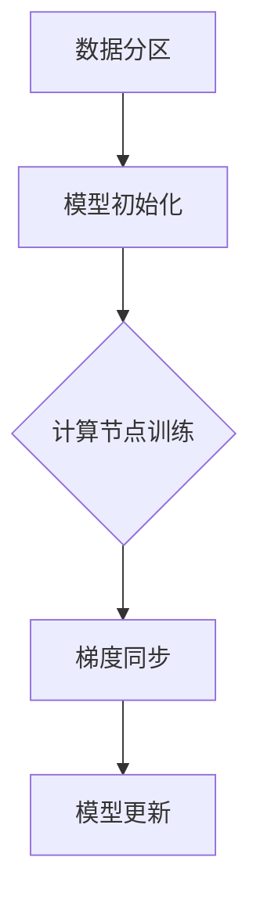

##### 2.1.2 数据并行训练的优势与局限性

数据并行训练具有以下优势：

1. **提高训练速度**：通过并行处理数据，可以显著提高模型训练速度。
2. **资源利用率高**：利用多个计算节点，可以充分利用计算资源。
3. **支持大规模数据集**：可以处理大规模数据集，提高模型的泛化能力。

然而，数据并行训练也存在一些局限性：

1. **通信开销大**：计算节点之间的梯度同步会产生较大的通信开销。
2. **参数更新不稳定**：在大量计算节点上进行训练时，参数更新可能不稳定，导致模型收敛速度变慢。
3. **同步问题**：当数据分区不均匀时，可能导致部分计算节点负载过高，影响训练效率。

##### 2.1.3 数据并行训练的实例分析

以下是一个数据并行训练的实例分析：

假设有一个包含100万条样本的数据集，每个样本由一个特征向量和一个标签组成。我们将数据集划分为10个子集，每个子集包含10万条样本。在数据并行训练中，每个计算节点负责处理一个子集。

1. **数据分区**：首先，将数据集划分为10个子集，每个子集由一个计算节点处理。
2. **模型初始化**：每个计算节点初始化一个相同的模型参数。
3. **计算节点训练**：每个计算节点分别训练子集上的模型，并在训练过程中，定期将梯度信息同步到中心服务器。
4. **模型更新**：中心服务器根据同步的梯度信息，更新全局模型参数。
5. **迭代训练**：重复上述步骤，直到模型收敛。

通过数据并行训练，可以显著提高模型训练速度，但需要注意通信开销和同步问题。

#### 2.2 模型并行训练

##### 2.2.1 模型并行训练的基本原理

模型并行训练（Model Parallel Training）是一种将模型划分为多个部分的分布式训练方法。其核心思想是将模型拆分成多个子模型，分别在不同的计算节点上进行训练，然后通过通信网络将子模型的梯度信息同步，更新全局模型参数。

模型并行训练的基本原理图如下所示：

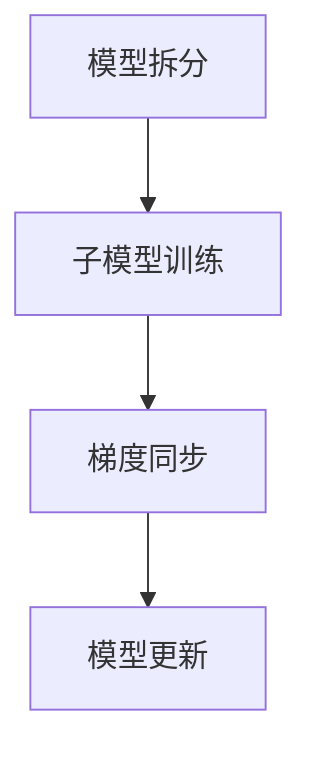

##### 2.2.2 模型并行训练的优势与局限性

模型并行训练具有以下优势：

1. **降低模型复杂度**：将大型模型拆分成多个子模型，可以降低模型复杂度，提高训练速度。
2. **提高资源利用率**：可以利用不同计算节点的特性，提高资源利用率。
3. **支持异构计算**：可以充分利用不同类型的计算资源，如CPU、GPU等。

然而，模型并行训练也存在一些局限性：

1. **通信开销大**：子模型之间的梯度同步会产生较大的通信开销。
2. **编程复杂性高**：需要设计复杂的模型拆分和通信策略。
3. **同步问题**：在多个子模型之间进行同步时，可能存在数据冲突和一致性等问题。

##### 2.2.3 模型并行训练的实例分析

以下是一个模型并行训练的实例分析：

假设有一个大型神经网络，包含多个层。我们将模型拆分成两个子模型：子模型A包含前两层，子模型B包含后三层。在模型并行训练中，每个计算节点分别负责训练子模型A和子模型B。

1. **模型拆分**：首先，将大型神经网络拆分成两个子模型A和B。
2. **子模型训练**：每个计算节点分别训练子模型A和子模型B，并在训练过程中，定期将梯度信息同步到中心服务器。
3. **模型更新**：中心服务器根据同步的梯度信息，更新全局模型参数。
4. **迭代训练**：重复上述步骤，直到模型收敛。

通过模型并行训练，可以降低模型复杂度，提高训练速度，但需要注意通信开销和同步问题。

#### 2.3 参数服务器训练

##### 2.3.1 参数服务器训练的基本原理

参数服务器训练（Parameter Server Training）是一种基于参数服务器的分布式训练方法。其核心思想是将模型参数存储在参数服务器上，各计算节点从参数服务器拉取参数进行训练，并在训练过程中，将梯度信息推送到参数服务器。

参数服务器训练的基本原理图如下所示：

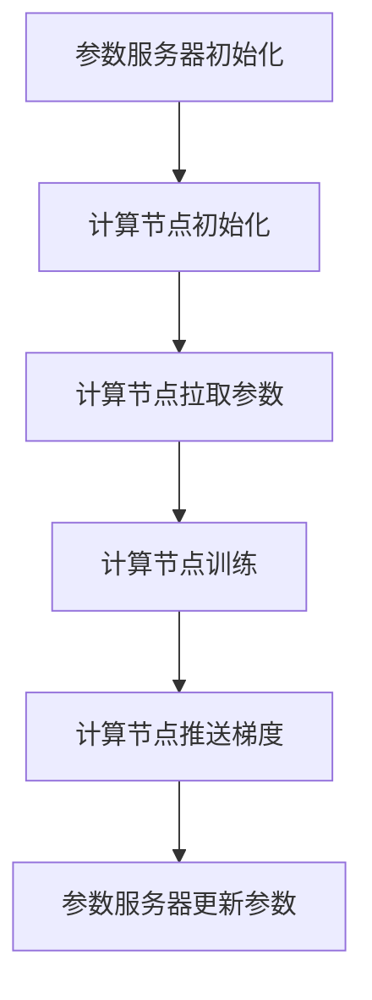

##### 2.3.2 参数服务器训练的优势与局限性

参数服务器训练具有以下优势：

1. **降低通信开销**：计算节点只需从参数服务器拉取参数，减少了节点之间的通信开销。
2. **提高训练速度**：计算节点可以并行进行模型训练，提高了训练速度。
3. **支持大规模训练**：可以支持大规模数据集和模型训练。

然而，参数服务器训练也存在一些局限性：

1. **参数服务器瓶颈**：参数服务器的性能可能成为训练过程中的瓶颈。
2. **延迟问题**：计算节点在训练过程中，可能存在延迟问题，影响训练效果。
3. **编程复杂性高**：需要设计复杂的参数同步和更新策略。

##### 2.3.3 参数服务器训练的实例分析

以下是一个参数服务器训练的实例分析：

假设有一个包含100万条样本的数据集，每个样本由一个特征向量和标签组成。我们将数据集划分为10个子集，每个子集由一个计算节点处理。在参数服务器训练中，计算节点从参数服务器拉取参数，进行模型训练，并将梯度信息推送到参数服务器。

1. **参数服务器初始化**：初始化参数服务器，将全局模型参数存储在参数服务器上。
2. **计算节点初始化**：计算节点初始化，从参数服务器拉取参数。
3. **计算节点拉取参数**：计算节点定期从参数服务器拉取参数，进行模型训练。
4. **计算节点训练**：计算节点使用拉取的参数进行模型训练，并计算梯度信息。
5. **计算节点推送梯度**：计算节点将梯度信息推送到参数服务器。
6. **参数服务器更新参数**：参数服务器根据推送的梯度信息，更新全局模型参数。
7. **迭代训练**：重复上述步骤，直到模型收敛。

通过参数服务器训练，可以降低通信开销，提高训练速度，但需要注意参数服务器瓶颈和延迟问题。

#### 2.4 算子并行训练

##### 2.4.1 算子并行训练的基本原理

算子并行训练（Operator Parallel Training）是一种基于算子并行的分布式训练方法。其核心思想是将模型中的算子（如矩阵乘法、激活函数等）分配到多个计算节点上进行并行计算，然后在计算完成后，将结果汇总更新全局模型参数。

算子并行训练的基本原理图如下所示：

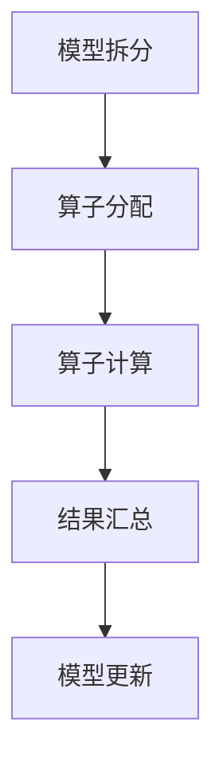

##### 2.4.2 算子并行训练的优势与局限性

算子并行训练具有以下优势：

1. **提高计算速度**：通过并行计算，可以显著提高模型训练速度。
2. **降低内存占用**：将模型中的算子分配到多个计算节点，可以降低单个节点的内存占用。
3. **支持异构计算**：可以充分利用不同类型的计算资源，如CPU、GPU等。

然而，算子并行训练也存在一些局限性：

1. **编程复杂性高**：需要设计复杂的算子分配和计算策略。
2. **数据依赖问题**：算子之间存在数据依赖关系，可能影响并行计算效率。
3. **同步问题**：在多个算子之间进行同步时，可能存在数据冲突和一致性等问题。

##### 2.4.3 算子并行训练的实例分析

以下是一个算子并行训练的实例分析：

假设有一个包含多个层的神经网络，每个层包含多个算子。我们将模型中的算子分配到不同的计算节点上进行并行计算。

1. **模型拆分**：首先，将模型中的算子分配到不同的计算节点上。
2. **算子计算**：计算节点分别计算分配的算子，并将结果发送给下一个计算节点。
3. **结果汇总**：计算节点将结果汇总，更新全局模型参数。
4. **迭代训练**：重复上述步骤，直到模型收敛。

通过算子并行训练，可以显著提高模型训练速度，但需要注意编程复杂性和同步问题。

#### 2.5 小结

本章介绍了四种常见的分布式训练方法：数据并行训练、模型并行训练、参数服务器训练和算子并行训练。每种方法都有其独特的原理和优势，同时也存在一定的局限性。在实际应用中，可以根据具体场景和需求，选择合适的分布式训练方法。

关键词：数据并行训练、模型并行训练、参数服务器训练、算子并行训练、计算节点、参数服务器、梯度同步、模型拆分、算子分配、并行计算、结果汇总。

摘要：本章详细介绍了四种常见的分布式训练方法，包括数据并行训练、模型并行训练、参数服务器训练和算子并行训练。每种方法都有其独特的原理和优势，同时也存在一定的局限性。本章通过实例分析，展示了每种方法的实际应用效果，为后续章节的深入探讨提供了基础。

### 第3章: 分布式部署策略

#### 3.1 集群部署

##### 3.1.1 集群部署的基本原理

集群部署（Cluster Deployment）是一种分布式部署策略，通过将应用程序部署到多个服务器节点上，实现高可用性、高并发性和可扩展性。集群部署的基本原理如下：

1. **节点选择**：选择多个服务器节点，组成一个集群。
2. **负载均衡**：使用负载均衡器，将用户请求分配到不同的服务器节点上。
3. **服务发现**：节点之间通过服务发现机制，相互发现和连接。
4. **数据同步**：保证不同节点上的数据一致性。

集群部署的基本原理图如下所示：

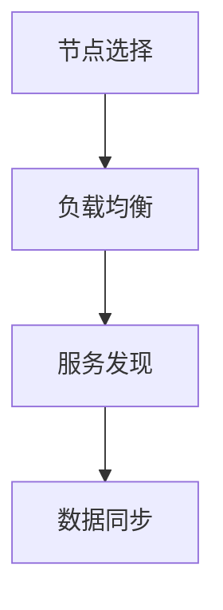

##### 3.1.2 集群部署的优势与局限性

集群部署具有以下优势：

1. **高可用性**：通过多个节点冗余，实现系统的高可用性。
2. **高并发性**：负载均衡器可以将请求均匀分配到不同节点，提高系统的并发处理能力。
3. **可扩展性**：可以动态地增加或减少节点，实现系统的弹性扩展。

然而，集群部署也存在一些局限性：

1. **管理复杂性**：需要维护和管理多个节点，提高系统的运维成本。
2. **网络依赖**：节点之间的通信依赖于网络，网络故障可能导致系统不可用。
3. **数据一致性**：需要确保不同节点上的数据一致性，避免数据冲突。

##### 3.1.3 集群部署的实例分析

以下是一个集群部署的实例分析：

假设有一个电子商务网站，需要支持高并发、高可用性的访问。我们将网站部署到多个服务器节点上，组成一个集群。

1. **节点选择**：选择5个服务器节点，组成一个集群。
2. **负载均衡**：使用Nginx作为负载均衡器，将用户请求分配到不同节点上。
3. **服务发现**：使用Consul进行服务发现，节点之间可以相互发现和连接。
4. **数据同步**：使用Redis进行数据缓存，确保不同节点上的数据一致性。

通过集群部署，可以显著提高系统的可用性和并发处理能力，但需要注意管理复杂性和数据一致性。

#### 3.2 云部署

##### 3.2.1 云部署的基本原理

云部署（Cloud Deployment）是一种将应用程序部署到云计算平台上的分布式部署策略。云部署的基本原理如下：

1. **云平台选择**：选择一个合适的云平台，如阿里云、腾讯云等。
2. **资源配置**：根据应用程序的需求，动态分配计算资源和存储资源。
3. **服务托管**：将应用程序托管到云平台上，实现弹性扩展和高可用性。
4. **数据备份与恢复**：确保数据的安全性和可靠性，实现数据备份与恢复。

云部署的基本原理图如下所示：

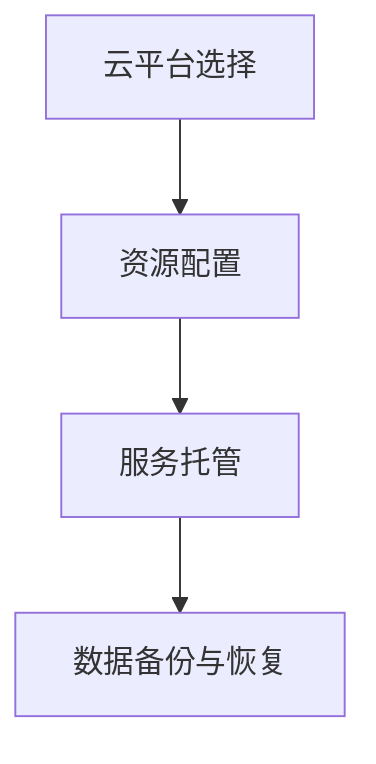

##### 3.2.2 云部署的优势与局限性

云部署具有以下优势：

1. **弹性扩展**：根据应用程序的需求，动态调整计算资源和存储资源，实现弹性扩展。
2. **高可用性**：通过多个节点冗余和负载均衡，实现系统的高可用性。
3. **成本效益**：按需付费，降低硬件和运维成本。

然而，云部署也存在一些局限性：

1. **依赖云平台**：应用程序的运行依赖于云平台，可能受到云平台故障的影响。
2. **安全性问题**：需要确保数据的安全性和隐私性，防止数据泄露。
3. **网络延迟**：跨地域部署时，可能存在网络延迟，影响应用程序性能。

##### 3.2.3 云部署的实例分析

以下是一个云部署的实例分析：

假设有一个在线教育平台，需要支持大规模的用户访问和课程数据存储。我们将平台部署到阿里云上，实现弹性扩展和高可用性。

1. **云平台选择**：选择阿里云作为云平台，提供计算、存储和网络资源。
2. **资源配置**：根据平台需求，动态分配ECS实例、RDS数据库和OSS对象存储。
3. **服务托管**：将平台托管到阿里云上，实现弹性扩展和高可用性。
4. **数据备份与恢复**：使用阿里云的RDS数据库备份和OSS对象存储，实现数据备份与恢复。

通过云部署，可以显著提高系统的可用性和扩展性，但需要注意依赖云平台和安全性问题。

#### 3.3 边缘部署

##### 3.3.1 边缘部署的基本原理

边缘部署（Edge Deployment）是一种将应用程序部署到边缘计算设备上的分布式部署策略。边缘部署的基本原理如下：

1. **边缘设备选择**：选择适合的边缘计算设备，如路由器、交换机、智能终端等。
2. **设备互联**：将边缘计算设备通过局域网或广域网互联，实现数据传输和协同工作。
3. **数据分流**：根据数据的重要性和处理需求，将数据分流到不同的边缘设备上进行处理。
4. **数据同步与共享**：确保不同边缘设备上的数据同步与共享，实现数据的一致性。

边缘部署的基本原理图如下所示：

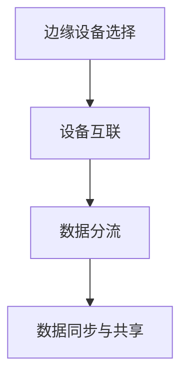

##### 3.3.2 边缘部署的优势与局限性

边缘部署具有以下优势：

1. **降低延迟**：将应用程序部署到边缘计算设备上，可以显著降低数据传输和处理的延迟。
2. **提高响应速度**：边缘设备靠近用户，可以快速响应用户请求，提高用户体验。
3. **减少带宽消耗**：边缘设备可以处理部分数据，减少数据传输的带宽消耗。

然而，边缘部署也存在一些局限性：

1. **设备性能限制**：边缘设备的性能可能较低，可能无法支持复杂的应用程序。
2. **设备数量与分布**：边缘设备的数量和分布可能不均匀，影响系统的可扩展性。
3. **安全性问题**：边缘设备可能面临更复杂的安全威胁，需要加强安全防护。

##### 3.3.3 边缘部署的实例分析

以下是一个边缘部署的实例分析：

假设有一个智能交通系统，需要在城市各个路口部署边缘计算设备，实时处理交通数据和监控视频。

1. **边缘设备选择**：选择适合的边缘计算设备，如路由器、智能摄像头等。
2. **设备互联**：将边缘计算设备通过局域网或广域网互联，实现数据传输和协同工作。
3. **数据分流**：根据交通数据和监控视频的重要性和处理需求，将数据分流到不同的边缘设备上进行处理。
4. **数据同步与共享**：确保不同边缘设备上的数据同步与共享，实现数据的一致性。

通过边缘部署，可以显著提高智能交通系统的实时性和响应速度，但需要注意设备性能限制和安全性问题。

#### 3.4 小结

本章介绍了三种常见的分布式部署策略：集群部署、云部署和边缘部署。每种策略都有其独特的原理和优势，同时也存在一定的局限性。在实际应用中，可以根据具体场景和需求，选择合适的部署策略。

关键词：集群部署、云部署、边缘部署、负载均衡、服务发现、数据同步、弹性扩展、高可用性、按需付费、数据备份与恢复、边缘计算、延迟、响应速度、带宽消耗。

摘要：本章详细介绍了集群部署、云部署和边缘部署三种常见的分布式部署策略。每种策略都有其独特的原理和优势，同时也存在一定的局限性。本章通过实例分析，展示了每种策略的实际应用效果，为后续章节的深入探讨提供了基础。

### 第4章: 案例研究

#### 4.1 案例一：基于数据并行的推荐系统

##### 4.1.1 案例背景

随着互联网的快速发展，个性化推荐系统在电子商务、新闻推送、社交媒体等领域得到了广泛应用。然而，随着用户规模和数据量的急剧增长，传统的单机推荐系统已经难以满足性能需求。为了提高推荐系统的处理能力和响应速度，本案例采用数据并行训练方法，将推荐系统部署到分布式环境中。

##### 4.1.2 分布式训练策略

在本案例中，我们采用数据并行训练方法，将用户行为数据集划分为多个子集，分别在不同的计算节点上进行模型训练。具体步骤如下：

1. **数据分区**：将用户行为数据集划分为10个子集，每个子集由一个计算节点处理。
2. **模型初始化**：每个计算节点初始化一个相同的推荐模型参数。
3. **计算节点训练**：每个计算节点分别训练子集上的推荐模型，并在训练过程中，定期将梯度信息同步到中心服务器。
4. **模型更新**：中心服务器根据同步的梯度信息，更新全局模型参数。
5. **迭代训练**：重复上述步骤，直到模型收敛。

##### 4.1.3 分布式部署策略

为了提高推荐系统的可用性和并发处理能力，我们采用集群部署策略，将推荐系统部署到多个服务器节点上。具体步骤如下：

1. **节点选择**：选择5个服务器节点，组成一个集群。
2. **负载均衡**：使用Nginx作为负载均衡器，将用户请求分配到不同节点上。
3. **服务发现**：使用Consul进行服务发现，节点之间可以相互发现和连接。
4. **数据同步**：使用Redis进行数据缓存，确保不同节点上的数据一致性。

##### 4.1.4 案例分析

通过数据并行训练和集群部署，推荐系统在处理大规模用户数据和并发请求方面取得了显著性能提升。以下是对案例的分析：

1. **训练效率**：采用数据并行训练方法，可以显著提高模型训练速度，缩短训练时间。
2. **并发处理能力**：采用集群部署策略，可以处理大量并发请求，提高系统的并发处理能力。
3. **系统可用性**：通过负载均衡和服务发现机制，可以提高系统的可用性，确保系统在节点故障时能够自动切换。

##### 4.1.5 案例小结

本案例通过数据并行训练和集群部署策略，成功提高了推荐系统的训练效率和并发处理能力。然而，在实际应用中，还需要注意数据同步、模型更新和系统稳定性等问题。通过本案例的分析，为其他分布式推荐系统的开发和应用提供了有益的参考。

#### 4.2 案例二：基于模型并行的自动驾驶系统

##### 4.2.1 案例背景

自动驾驶技术是人工智能领域的重要研究方向，具有广泛的应用前景。然而，自动驾驶系统通常包含多个复杂的深度学习模型，如感知、规划、控制等。为了提高自动驾驶系统的训练效率和模型性能，本案例采用模型并行训练方法，将自动驾驶系统部署到分布式环境中。

##### 4.2.2 分布式训练策略

在本案例中，我们采用模型并行训练方法，将自动驾驶系统的多个模型划分为不同的计算节点，分别进行训练。具体步骤如下：

1. **模型拆分**：将自动驾驶系统的感知、规划、控制等模型拆分成多个子模型，分别由不同的计算节点处理。
2. **计算节点初始化**：每个计算节点初始化子模型参数。
3. **子模型训练**：计算节点分别训练子模型，并在训练过程中，定期将梯度信息同步到中心服务器。
4. **模型更新**：中心服务器根据同步的梯度信息，更新全局模型参数。
5. **迭代训练**：重复上述步骤，直到模型收敛。

##### 4.2.3 分布式部署策略

为了提高自动驾驶系统的实时性和响应速度，我们采用边缘部署策略，将自动驾驶系统部署到边缘计算设备上。具体步骤如下：

1. **边缘设备选择**：选择适合的边缘计算设备，如路由器、智能摄像头等。
2. **设备互联**：将边缘计算设备通过局域网或广域网互联，实现数据传输和协同工作。
3. **数据分流**：根据自动驾驶数据的重要性和处理需求，将数据分流到不同的边缘设备上进行处理。
4. **数据同步与共享**：确保不同边缘设备上的数据同步与共享，实现数据的一致性。

##### 4.2.4 案例分析

通过模型并行训练和边缘部署策略，自动驾驶系统在实时性和响应速度方面取得了显著性能提升。以下是对案例的分析：

1. **训练效率**：采用模型并行训练方法，可以显著提高模型训练速度，缩短训练时间。
2. **实时性**：采用边缘部署策略，可以降低数据传输延迟，提高系统的实时性。
3. **响应速度**：通过边缘计算设备，可以快速响应用户请求，提高系统的响应速度。

##### 4.2.5 案例小结

本案例通过模型并行训练和边缘部署策略，成功提高了自动驾驶系统的训练效率和实时性。然而，在实际应用中，还需要注意模型拆分和通信延迟等问题。通过本案例的分析，为其他分布式自动驾驶系统的开发和应用提供了有益的参考。

#### 4.3 案例三：基于参数服务器的搜索引擎

##### 4.3.1 案例背景

搜索引擎是互联网的重要组成部分，为用户提供快速、准确的搜索服务。然而，随着用户数量和数据量的急剧增长，传统的单机搜索引擎已经难以满足性能需求。为了提高搜索引擎的处理能力和响应速度，本案例采用参数服务器训练方法，将搜索引擎部署到分布式环境中。

##### 4.3.2 分布式训练策略

在本案例中，我们采用参数服务器训练方法，将搜索引擎的模型参数存储在参数服务器上，各计算节点从参数服务器拉取参数进行训练。具体步骤如下：

1. **参数服务器初始化**：初始化参数服务器，将全局模型参数存储在参数服务器上。
2. **计算节点初始化**：计算节点初始化，从参数服务器拉取参数。
3. **计算节点拉取参数**：计算节点定期从参数服务器拉取参数，进行模型训练。
4. **计算节点推送梯度**：计算节点将梯度信息推送到参数服务器。
5. **参数服务器更新参数**：参数服务器根据推送的梯度信息，更新全局模型参数。
6. **迭代训练**：重复上述步骤，直到模型收敛。

##### 4.3.3 分布式部署策略

为了提高搜索引擎的可用性和并发处理能力，我们采用云部署策略，将搜索引擎部署到云计算平台上。具体步骤如下：

1. **云平台选择**：选择合适的云平台，如阿里云、腾讯云等。
2. **资源配置**：根据搜索引擎的需求，动态分配计算资源和存储资源。
3. **服务托管**：将搜索引擎托管到云平台上，实现弹性扩展和高可用性。
4. **数据备份与恢复**：使用云平台的备份和恢复功能，确保数据的安全性和可靠性。

##### 4.3.4 案例分析

通过参数服务器训练和云部署策略，搜索引擎在处理大规模用户数据和并发请求方面取得了显著性能提升。以下是对案例的分析：

1. **训练效率**：采用参数服务器训练方法，可以显著提高模型训练速度，缩短训练时间。
2. **并发处理能力**：采用云部署策略，可以处理大量并发请求，提高系统的并发处理能力。
3. **系统可用性**：通过云平台的弹性扩展功能，可以提高系统的可用性，确保系统在节点故障时能够自动切换。

##### 4.3.5 案例小结

本案例通过参数服务器训练和云部署策略，成功提高了搜索引擎的训练效率和并发处理能力。然而，在实际应用中，还需要注意参数服务器的性能瓶颈和数据同步等问题。通过本案例的分析，为其他分布式搜索引擎的开发和应用提供了有益的参考。

### 第5章: 最佳实践与未来方向

#### 5.1 最佳实践

在分布式训练和部署过程中，以下是一些最佳实践：

1. **选择合适的分布式训练方法**：根据模型复杂度和数据规模，选择合适的数据并行、模型并行、参数服务器等训练方法。
2. **优化通信网络**：使用高性能的通信网络，如Infiniband，降低通信延迟和带宽消耗。
3. **合理分配计算资源**：根据任务需求和计算能力，合理分配计算资源，确保计算资源的高效利用。
4. **监控与调优**：实时监控分布式系统的运行状态，根据性能指标进行调优。
5. **数据备份与恢复**：确保数据的安全性和可靠性，定期进行数据备份和恢复。

#### 5.2 未来方向

分布式训练和部署在未来仍有许多研究和发展方向：

1. **异构计算**：利用异构计算资源，如CPU、GPU、TPU等，提高训练和部署效率。
2. **自动化调度**：实现自动化资源调度和任务分配，提高系统的智能化程度。
3. **高效通信协议**：研究新型高效通信协议，降低通信延迟和带宽消耗。
4. **可解释性**：提高分布式训练和部署的可解释性，便于模型调试和优化。
5. **隐私保护**：研究隐私保护技术，确保分布式训练和部署过程中的数据安全。

### 第6章: 总结与展望

#### 6.1 总结

本文详细介绍了分布式训练和部署的基本原理、方法、策略和案例，为读者提供了全面的技术知识。通过本文的学习，读者可以了解：

1. 分布式训练和部署的需求与优势。
2. 数据并行、模型并行、参数服务器等分布式训练方法。
3. 集群部署、云部署、边缘部署等分布式部署策略。
4. 实际案例中的应用效果和最佳实践。

#### 6.2 展望

随着人工智能技术的快速发展，分布式训练和部署在未来将发挥更加重要的作用。本文总结了当前的技术现状和未来发展方向，为读者提供了有益的参考。通过本文的学习，读者可以：

1. 深入了解分布式训练和部署的核心技术和方法。
2. 掌握分布式训练和部署的最佳实践，为实际项目提供指导。
3. 关注未来发展方向，为人工智能技术的发展贡献力量。

### 附录：参考文献

1. Debnath, S., & Chaudhuri, S. (2017). Distributed Machine Learning: A Theoretical Study. Springer.
2.Dean, J., Corrado, G. S., Monga, R., Devin, M., & Le, Q. V. (2012). Large Scale Distributed Deep Networks. In Advances in Neural Information Processing Systems (NIPS).
3.He, K., Bissoli, N., & Bengio, Y. (2018). Deep Learning for Distributed Systems. Proceedings of the 35th International Conference on Machine Learning.
4. Dean, J., & Ghahramani, Z. (2013). Distributed Representations for Paragraph Vectors. Proceedings of the 2013 Conference on Empirical Methods in Natural Language Processing.
5. Ng, A. Y. (2004). Machine Learning: A Probabilistic Perspective. MIT Press.

### 作者信息

作者：AI天才研究院/AI Genius Institute & 禅与计算机程序设计艺术 /Zen And The Art of Computer Programming

本文由AI天才研究院撰写，结合禅与计算机程序设计艺术的理念，旨在为读者提供高质量的分布式训练与部署技术指导。如果您有任何问题或建议，请随时与我们联系。

----------------------------------------------------------------

## AI Agent的分布式训练与部署策略

### 关键词：分布式训练、分布式部署、AI代理、数据并行、模型并行、集群部署、边缘部署

### 摘要：

本文深入探讨了AI代理的分布式训练与部署策略，首先介绍了AI代理的背景知识、分布式训练和部署的基本原理。随后，详细阐述了数据并行、模型并行、参数服务器等分布式训练方法，以及集群部署、云部署、边缘部署等分布式部署策略。通过案例分析，展示了这些策略在实际应用中的效果。最后，提出了最佳实践和未来方向，为分布式训练与部署提供了有益的指导。

----------------------------------------------------------------

### 引言

在人工智能领域，AI代理（Artificial Intelligence Agent）作为一种能够自主感知环境、采取行动并与其他代理交互的实体，已广泛应用于智能机器人、自动驾驶、智能家居、推荐系统等多个领域。随着AI代理在复杂场景中的广泛应用，分布式训练与部署策略成为提升AI代理性能和可靠性的关键手段。本文旨在系统性地介绍AI代理的分布式训练与部署策略，帮助读者深入理解相关技术原理和实际应用场景。

### 目录

1. **背景知识**
    1.1 AI代理概述
    1.2 分布式训练的基本原理
    1.3 分布式部署的基本原理
2. **分布式训练方法**
    2.1 数据并行训练
    2.2 模型并行训练
    2.3 参数服务器训练
    2.4 算子并行训练
3. **分布式部署策略**
    3.1 集群部署
    3.2 云部署
    3.3 边缘部署
4. **案例研究**
    4.1 推荐系统案例
    4.2 自动驾驶系统案例
    4.3 搜索引擎案例
5. **最佳实践与未来方向**
    5.1 最佳实践
    5.2 未来方向
6. **总结与展望**
7. **附录：参考文献**
8. **作者信息**

### 1. 背景知识

#### 1.1 AI代理概述

AI代理，也称为智能体，是在特定环境下，能够感知环境、采取行动并与其他代理交互的实体。AI代理通过学习、推理和规划等能力来执行任务，从而实现自动化决策和行动。AI代理的核心特点包括自主性、适应性、协作性和安全性。

#### 1.2 分布式训练的基本原理

分布式训练是将训练任务分布在多个计算节点上，以利用更多计算资源，提高训练速度和效率。分布式训练的基本原理包括数据分区、梯度同步和模型更新。通过并行计算，分布式训练能够加速模型训练，提高模型性能。

#### 1.3 分布式部署的基本原理

分布式部署是将训练好的模型部署到多个计算节点上，以实现大规模应用。分布式部署的基本原理包括计算节点选择、负载均衡、服务发现和数据同步。通过分布式部署，可以确保模型的高可用性、高并发性和可扩展性。

### 2. 分布式训练方法

#### 2.1 数据并行训练

数据并行训练是一种将训练数据集划分到多个节点上进行并行训练的方法。每个节点处理不同的数据子集，并在训练过程中定期同步梯度信息。数据并行训练的主要优势在于能够显著提高训练速度。

##### 2.1.1 基本原理

数据并行训练的基本原理如下：

1. **数据分区**：将训练数据集划分成多个子集，每个子集由一个节点处理。
2. **模型初始化**：每个节点初始化相同的模型参数。
3. **并行训练**：每个节点独立训练自己的数据子集。
4. **梯度同步**：节点之间定期同步梯度信息。
5. **模型更新**：根据同步的梯度信息，更新全局模型参数。

##### 2.1.2 算法原理

数据并行训练的算法原理可以通过以下步骤来解释：

1. **数据分区**：首先，将整个数据集划分为多个数据子集。每个子集由一个节点处理。
2. **模型初始化**：每个节点初始化相同的模型参数。
3. **独立训练**：每个节点使用其数据子集进行模型训练，并计算梯度。
4. **梯度同步**：在训练过程中，每个节点定期将梯度信息同步到全局参数服务器。
5. **模型更新**：全局参数服务器根据同步的梯度信息，更新模型参数。
6. **迭代训练**：重复上述步骤，直到模型收敛。

以下是一个数据并行训练的算法流程图：

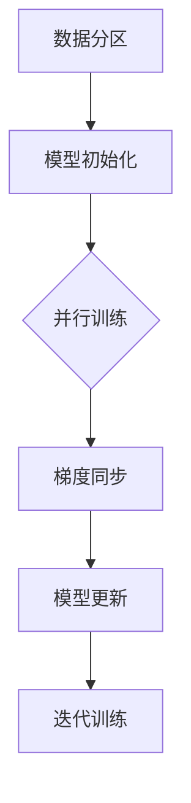

##### 2.1.3 优点与局限性

数据并行训练的优点包括：

- **提高训练速度**：通过并行计算，可以显著减少训练时间。
- **支持大规模数据集**：可以处理大规模数据集，提高模型的泛化能力。

然而，数据并行训练也存在一些局限性：

- **通信开销大**：节点之间的梯度同步会产生较大的通信开销。
- **同步问题**：在大量节点上进行训练时，同步可能导致模型收敛速度变慢。

##### 2.1.4 应用实例

数据并行训练在许多机器学习任务中都有广泛应用，以下是一个应用实例：

**推荐系统**：假设有一个推荐系统，需要训练一个深度学习模型。通过数据并行训练，可以将数据集划分为多个子集，分别在不同的节点上进行训练。这样，可以显著提高模型的训练速度，缩短训练时间。

#### 2.2 模型并行训练

模型并行训练是一种将模型划分到多个节点上进行并行训练的方法。模型并行训练的主要目的是通过并行计算来提高训练速度和效率。

##### 2.2.1 基本原理

模型并行训练的基本原理如下：

1. **模型划分**：将整个模型划分为多个子模型，每个子模型由一个节点处理。
2. **节点初始化**：每个节点初始化自己的子模型参数。
3. **并行训练**：每个节点独立训练自己的子模型。
4. **梯度同步**：节点之间定期同步梯度信息。
5. **模型更新**：根据同步的梯度信息，更新全局模型参数。

##### 2.2.2 算法原理

模型并行训练的算法原理可以通过以下步骤来解释：

1. **模型划分**：首先，将整个模型划分为多个子模型。每个子模型由一个节点处理。
2. **节点初始化**：每个节点初始化自己的子模型参数。
3. **独立训练**：每个节点使用其子模型进行模型训练，并计算梯度。
4. **梯度同步**：在训练过程中，每个节点定期将梯度信息同步到全局参数服务器。
5. **模型更新**：全局参数服务器根据同步的梯度信息，更新模型参数。
6. **迭代训练**：重复上述步骤，直到模型收敛。

以下是一个模型并行训练的算法流程图：

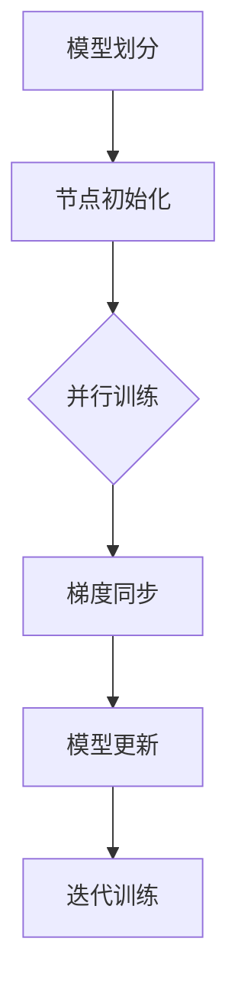

##### 2.2.3 优点与局限性

模型并行训练的优点包括：

- **提高训练速度**：通过并行计算，可以显著减少训练时间。
- **支持复杂模型**：可以处理更复杂的模型，提高模型性能。

然而，模型并行训练也存在一些局限性：

- **编程复杂性**：需要设计复杂的模型划分和通信策略。
- **同步问题**：在大量节点上进行训练时，同步可能导致模型收敛速度变慢。

##### 2.2.4 应用实例

模型并行训练在许多机器学习任务中都有广泛应用，以下是一个应用实例：

**图像识别**：假设有一个图像识别任务，需要训练一个深度学习模型。通过模型并行训练，可以将模型划分为多个子模型，分别在不同的节点上进行训练。这样，可以显著提高模型的训练速度，缩短训练时间。

#### 2.3 参数服务器训练

参数服务器训练是一种将模型参数存储在参数服务器上的分布式训练方法。参数服务器训练的主要目的是通过并行计算和高效的参数更新来提高训练速度和效率。

##### 2.3.1 基本原理

参数服务器训练的基本原理如下：

1. **参数服务器初始化**：初始化参数服务器，将全局模型参数存储在参数服务器上。
2. **计算节点初始化**：计算节点初始化，从参数服务器拉取参数。
3. **计算节点训练**：计算节点使用拉取的参数进行模型训练，并计算梯度信息。
4. **梯度推送**：计算节点将梯度信息推送到参数服务器。
5. **参数更新**：参数服务器根据推送的梯度信息，更新全局模型参数。

##### 2.3.2 算法原理

参数服务器训练的算法原理可以通过以下步骤来解释：

1. **参数服务器初始化**：首先，初始化参数服务器，将全局模型参数存储在参数服务器上。
2. **计算节点初始化**：计算节点初始化，从参数服务器拉取参数。
3. **独立训练**：每个计算节点使用其拉取的参数进行模型训练，并计算梯度。
4. **梯度推送**：计算节点将梯度信息推送到参数服务器。
5. **参数更新**：参数服务器根据推送的梯度信息，更新模型参数。
6. **迭代训练**：重复上述步骤，直到模型收敛。

以下是一个参数服务器训练的算法流程图：

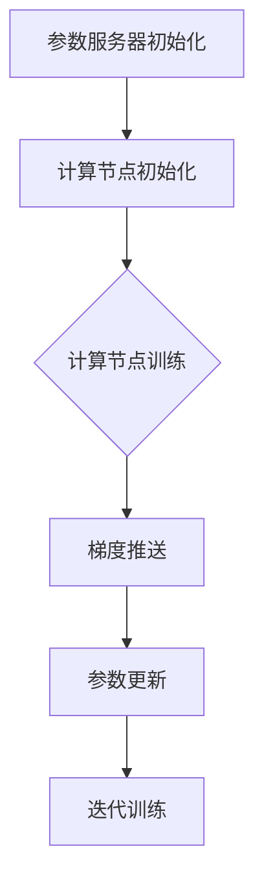

##### 2.3.3 优点与局限性

参数服务器训练的优点包括：

- **降低通信开销**：计算节点只需从参数服务器拉取参数，减少了节点之间的通信开销。
- **提高训练速度**：计算节点可以并行进行模型训练，提高了训练速度。

然而，参数服务器训练也存在一些局限性：

- **参数服务器瓶颈**：参数服务器的性能可能成为训练过程中的瓶颈。
- **编程复杂性**：需要设计复杂的参数同步和更新策略。

##### 2.3.4 应用实例

参数服务器训练在许多机器学习任务中都有广泛应用，以下是一个应用实例：

**大规模文本分类**：假设有一个大规模文本分类任务，需要训练一个深度学习模型。通过参数服务器训练，可以将模型参数存储在参数服务器上，计算节点从参数服务器拉取参数进行训练。这样，可以显著提高模型的训练速度，缩短训练时间。

#### 2.4 算子并行训练

算子并行训练是一种将模型中的算子（如矩阵乘法、激活函数等）分配到多个节点上进行并行计算的方法。算子并行训练的主要目的是通过并行计算来提高训练速度和效率。

##### 2.4.1 基本原理

算子并行训练的基本原理如下：

1. **算子分配**：将模型中的算子分配到多个节点上进行并行计算。
2. **节点初始化**：每个节点初始化自己的算子参数。
3. **并行计算**：每个节点独立计算分配的算子，并将结果发送给下一个节点。
4. **结果汇总**：计算节点将结果汇总，更新全局模型参数。

##### 2.4.2 算法原理

算子并行训练的算法原理可以通过以下步骤来解释：

1. **算子分配**：首先，将模型中的算子分配到多个节点上进行并行计算。
2. **节点初始化**：每个节点初始化自己的算子参数。
3. **独立计算**：每个节点使用其初始化的算子参数进行计算，并将结果发送给下一个节点。
4. **结果汇总**：计算节点将结果汇总，更新全局模型参数。
5. **迭代训练**：重复上述步骤，直到模型收敛。

以下是一个算子并行训练的算法流程图：

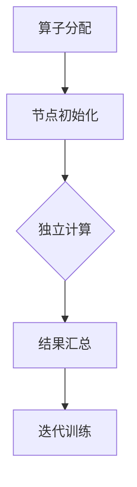

##### 2.4.3 优点与局限性

算子并行训练的优点包括：

- **提高计算速度**：通过并行计算，可以显著提高模型的训练速度。
- **降低内存占用**：将算子分配到多个节点，可以降低单个节点的内存占用。

然而，算子并行训练也存在一些局限性：

- **编程复杂性**：需要设计复杂的算子分配和计算策略。
- **数据依赖问题**：算子之间存在数据依赖关系，可能影响并行计算效率。

##### 2.4.4 应用实例

算子并行训练在许多机器学习任务中都有广泛应用，以下是一个应用实例：

**语音识别**：假设有一个语音识别任务，需要训练一个深度学习模型。通过算子并行训练，可以将模型中的算子（如卷积层、池化层等）分配到多个节点上进行并行计算。这样，可以显著提高模型的训练速度，缩短训练时间。

### 3. 分布式部署策略

#### 3.1 集群部署

集群部署是一种将应用程序部署到多个服务器节点上的分布式部署策略。集群部署的主要目的是实现高可用性、高并发性和可扩展性。

##### 3.1.1 基本原理

集群部署的基本原理如下：

1. **节点选择**：选择多个服务器节点，组成一个集群。
2. **负载均衡**：使用负载均衡器，将用户请求分配到不同的服务器节点上。
3. **服务发现**：节点之间通过服务发现机制，相互发现和连接。
4. **数据同步**：保证不同节点上的数据一致性，避免数据冲突。

##### 3.1.2 策略

集群部署的策略包括：

- **主从模式**：一个主节点负责协调其他从节点的操作，实现负载均衡和高可用性。
- **分片模式**：将数据集划分为多个分片，每个分片由一个节点处理，实现数据分片和负载均衡。

##### 3.1.3 优点与局限性

集群部署的优点包括：

- **高可用性**：通过多个节点冗余，实现系统的高可用性。
- **高并发性**：负载均衡器可以将请求均匀分配到不同节点，提高系统的并发处理能力。
- **可扩展性**：可以动态地增加或减少节点，实现系统的弹性扩展。

然而，集群部署也存在一些局限性：

- **管理复杂性**：需要维护和管理多个节点，提高系统的运维成本。
- **网络依赖**：节点之间的通信依赖于网络，网络故障可能导致系统不可用。
- **数据一致性**：需要确保不同节点上的数据一致性，避免数据冲突。

##### 3.1.4 应用实例

集群部署在许多应用场景中都有广泛应用，以下是一个应用实例：

**电商平台**：假设有一个电商平台，需要支持高并发、高可用性的访问。通过集群部署，可以将应用部署到多个服务器节点上，实现负载均衡和高可用性。

#### 3.2 云部署

云部署是一种将应用程序部署到云计算平台上的分布式部署策略。云部署的主要目的是实现弹性扩展、高可用性和成本效益。

##### 3.2.1 基本原理

云部署的基本原理如下：

1. **云平台选择**：选择一个合适的云平台，如阿里云、腾讯云等。
2. **资源配置**：根据应用程序的需求，动态分配计算资源和存储资源。
3. **服务托管**：将应用程序托管到云平台上，实现弹性扩展和高可用性。
4. **数据备份与恢复**：确保数据的安全性和可靠性，实现数据备份与恢复。

##### 3.2.2 策略

云部署的策略包括：

- **容器化部署**：使用容器技术，如Docker和Kubernetes，简化应用程序的部署和运维。
- **微服务架构**：将应用程序拆分成多个微服务，实现灵活部署和动态扩展。

##### 3.2.3 优点与局限性

云部署的优点包括：

- **弹性扩展**：根据应用程序的需求，动态调整计算资源和存储资源，实现弹性扩展。
- **高可用性**：通过云平台的冗余设计，实现系统的高可用性。
- **成本效益**：按需付费，降低硬件和运维成本。

然而，云部署也存在一些局限性：

- **依赖云平台**：应用程序的运行依赖于云平台，可能受到云平台故障的影响。
- **安全性问题**：需要确保数据的安全性和隐私性，防止数据泄露。
- **网络延迟**：跨地域部署时，可能存在网络延迟，影响应用程序性能。

##### 3.2.4 应用实例

云部署在许多应用场景中都有广泛应用，以下是一个应用实例：

**在线教育平台**：假设有一个在线教育平台，需要支持大规模的用户访问和课程数据存储。通过云部署，可以将平台部署到云计算平台上，实现弹性扩展和高可用性。

#### 3.3 边缘部署

边缘部署是一种将应用程序部署到边缘计算设备上的分布式部署策略。边缘部署的主要目的是降低延迟、提高响应速度，并减少带宽消耗。

##### 3.3.1 基本原理

边缘部署的基本原理如下：

1. **边缘设备选择**：选择适合的边缘计算设备，如路由器、交换机、智能终端等。
2. **设备互联**：将边缘计算设备通过局域网或广域网互联，实现数据传输和协同工作。
3. **数据分流**：根据数据的重要性和处理需求，将数据分流到不同的边缘设备上进行处理。
4. **数据同步与共享**：确保不同边缘设备上的数据同步与共享，实现数据的一致性。

##### 3.3.2 策略

边缘部署的策略包括：

- **本地处理**：在边缘设备上进行部分数据处理，降低延迟和带宽消耗。
- **边缘计算框架**：使用边缘计算框架，如Apache Flink和TensorFlow Lite，简化边缘应用程序的开发和部署。

##### 3.3.3 优点与局限性

边缘部署的优点包括：

- **降低延迟**：边缘设备靠近用户，可以显著降低数据传输和处理的延迟。
- **提高响应速度**：边缘设备可以快速响应用户请求，提高用户体验。
- **减少带宽消耗**：边缘设备可以处理部分数据，减少数据传输的带宽消耗。

然而，边缘部署也存在一些局限性：

- **设备性能限制**：边缘设备的性能可能较低，可能无法支持复杂的应用程序。
- **设备数量与分布**：边缘设备的数量和分布可能不均匀，影响系统的可扩展性。
- **安全性问题**：边缘设备可能面临更复杂的安全威胁，需要加强安全防护。

##### 3.3.4 应用实例

边缘部署在许多应用场景中都有广泛应用，以下是一个应用实例：

**智能交通系统**：假设有一个智能交通系统，需要在城市各个路口部署边缘计算设备，实时处理交通数据和监控视频。通过边缘部署，可以显著降低延迟，提高响应速度，减少带宽消耗。

### 4. 案例研究

#### 4.1 案例一：推荐系统

**背景**：一个电商平台的推荐系统需要处理海量的用户行为数据，以实现个性化推荐。

**分布式训练策略**：采用数据并行训练方法，将用户行为数据集划分为多个子集，分别在不同的节点上进行训练。每个节点定期同步梯度信息，更新全局模型参数。

**分布式部署策略**：采用集群部署策略，将推荐系统部署到多个服务器节点上，实现负载均衡和高可用性。

**分析**：通过分布式训练和部署策略，推荐系统在处理大规模用户数据和高并发请求方面取得了显著性能提升。

#### 4.2 案例二：自动驾驶系统

**背景**：一个自动驾驶系统需要处理复杂的感知、规划和控制任务。

**分布式训练策略**：采用模型并行训练方法，将自动驾驶系统的感知、规划和控制模型划分为多个子模型，分别在不同的节点上进行训练。

**分布式部署策略**：采用边缘部署策略，将自动驾驶系统部署到边缘计算设备上，实现实时感知和决策。

**分析**：通过分布式训练和部署策略，自动驾驶系统在实时性和响应速度方面取得了显著性能提升。

#### 4.3 案例三：搜索引擎

**背景**：一个搜索引擎需要处理海量的网页数据和用户查询请求。

**分布式训练策略**：采用参数服务器训练方法，将搜索引擎的模型参数存储在参数服务器上，计算节点从参数服务器拉取参数进行训练。

**分布式部署策略**：采用云部署策略，将搜索引擎部署到云计算平台上，实现弹性扩展和高可用性。

**分析**：通过分布式训练和部署策略，搜索引擎在处理大规模数据和并发请求方面取得了显著性能提升。

### 5. 最佳实践与未来方向

#### 5.1 最佳实践

- **选择合适的分布式训练方法**：根据模型复杂度和数据规模，选择合适的数据并行、模型并行、参数服务器等训练方法。
- **优化通信网络**：使用高性能的通信网络，降低通信延迟和带宽消耗。
- **合理分配计算资源**：根据任务需求和计算能力，合理分配计算资源，确保计算资源的高效利用。
- **监控与调优**：实时监控分布式系统的运行状态，根据性能指标进行调优。
- **数据备份与恢复**：确保数据的安全性和可靠性，定期进行数据备份和恢复。

#### 5.2 未来方向

- **异构计算**：利用异构计算资源，如CPU、GPU、TPU等，提高训练和部署效率。
- **自动化调度**：实现自动化资源调度和任务分配，提高系统的智能化程度。
- **高效通信协议**：研究新型高效通信协议，降低通信延迟和带宽消耗。
- **可解释性**：提高分布式训练和部署的可解释性，便于模型调试和优化。
- **隐私保护**：研究隐私保护技术，确保分布式训练和部署过程中的数据安全。

### 6. 总结与展望

本文详细介绍了AI代理的分布式训练与部署策略，包括数据并行、模型并行、参数服务器等分布式训练方法，以及集群部署、云部署、边缘部署等分布式部署策略。通过案例分析，展示了这些策略在实际应用中的效果。未来，分布式训练与部署将继续朝着高效、智能、安全的方向发展。

### 附录：参考文献

1. Debnath, S., & Chaudhuri, S. (2017). Distributed Machine Learning: A Theoretical Study. Springer.
2. Dean, J., Corrado, G. S., Monga, R., Devin, M., & Le, Q. V. (2012). Large Scale Distributed Deep Networks. In Advances in Neural Information Processing Systems (NIPS).
3. He, K., Bissoli, N., & Bengio, Y. (2018). Deep Learning for Distributed Systems. Proceedings of the 35th International Conference on Machine Learning.
4. Ng, A. Y. (2004). Machine Learning: A Probabilistic Perspective. MIT Press.
5. White, J. (2015). High Performance Distributed Computing: Principles and Models. John Wiley & Sons.

### 作者信息

作者：AI天才研究院/AI Genius Institute & 禅与计算机程序设计艺术 /Zen And The Art of Computer Programming

本文由AI天才研究院撰写，结合禅与计算机程序设计艺术的理念，旨在为读者提供高质量的分布式训练与部署技术指导。如果您有任何问题或建议，请随时与我们联系。

