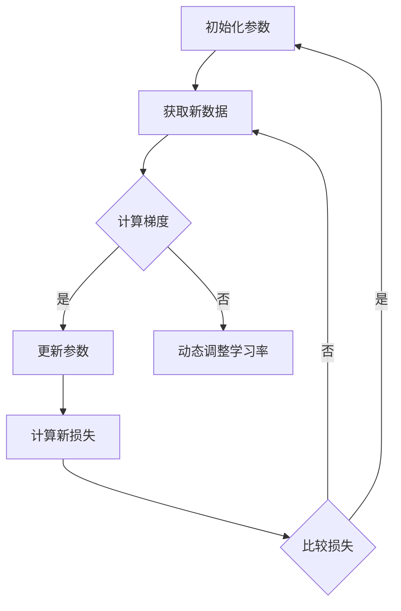
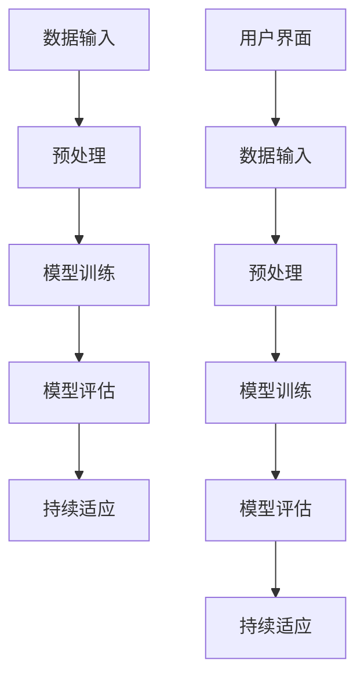
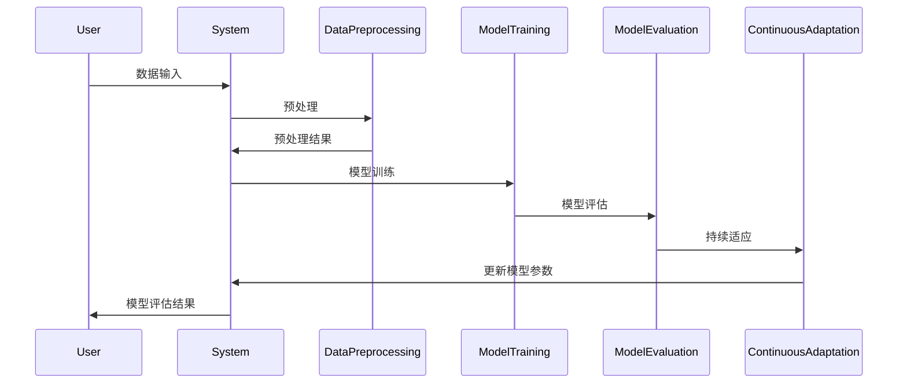

                 


# AI Agent的增量学习与持续适应机制

## 关键词

- AI Agent
- 增量学习
- 持续适应机制
- 算法原理
- 数学模型
- 系统架构设计
- 实际应用

## 摘要

本文将深入探讨AI Agent的增量学习与持续适应机制。首先，我们将介绍AI Agent的基础知识，包括其概念、分类和应用场景。接着，我们将详细解析增量学习与持续适应的核心概念、原理和算法。然后，我们将探讨系统设计与实现，包括系统架构设计、接口设计、系统交互等。最后，通过实际应用案例，我们将展示这些机制在现实世界中的运用，并提出最佳实践和未来研究方向。

## 引言与背景

### AI Agent的概念与分类

AI Agent，即人工智能代理，是一个可以感知环境、自主决策并执行行动的智能实体。根据功能和行为特征，AI Agent可以分为以下几类：

1. **反应型Agent**：这类Agent基于当前感知的环境状态直接产生行动，不具有记忆和自主学习能力。例如，自动售货机和机器人守卫。
   
2. **有限记忆Agent**：这类Agent能够基于历史感知状态进行决策，具有简单的记忆功能。例如，自动驾驶汽车在某些情况下使用有限记忆来识别道路标志。

3. **推理型Agent**：这类Agent能够通过逻辑推理来决策，可以处理抽象概念和复杂问题。例如，智能客服机器人通过自然语言处理和推理来回答用户的问题。

4. **学习型Agent**：这类Agent具有自主学习能力，可以通过数据或经验不断优化其行为。例如，AI游戏玩家通过自我训练来提高游戏水平。

### AI Agent的发展历史

AI Agent的发展可以追溯到人工智能的早期阶段。1956年，约翰·麦卡锡（John McCarthy）等人在达特茅斯会议上提出了人工智能的概念，标志着AI研究的开始。随着计算能力和算法的发展，AI Agent的研究逐渐深入，从简单的反应型Agent发展到复杂的推理和学习型Agent。

近年来，深度学习和大数据技术的兴起为AI Agent的发展带来了新的契机。通过深度神经网络，AI Agent可以在大量的数据中自动学习特征和模式，从而实现更高级的感知和决策能力。同时，随着物联网和边缘计算的发展，AI Agent的应用场景也越来越广泛，从智能家居到自动驾驶，再到智能制造，AI Agent正逐步渗透到各个领域。

### AI Agent的应用场景

AI Agent在各个领域都有广泛的应用，以下是几个典型的应用场景：

1. **智能家居**：AI Agent可以通过学习用户的行为习惯，自动调节家庭设备，提供个性化的服务。

2. **智能客服**：AI Agent可以基于自然语言处理技术，模拟人类客服与用户进行交互，提供高效、准确的客服服务。

3. **自动驾驶**：AI Agent通过感知周围环境，实时做出驾驶决策，实现自动驾驶功能。

4. **智能制造**：AI Agent可以监控生产过程，预测故障，优化生产流程，提高生产效率。

## 增量学习机制概述

### 增量学习的挑战

增量学习（Incremental Learning），也称为在线学习（Online Learning），是一种在数据不断流经的情况下，逐步更新模型的训练过程。与批学习（Batch Learning）不同，增量学习不依赖于所有数据的集中存储和处理，而是实时学习新数据，并逐步调整模型参数。

然而，增量学习面临着一些挑战：

1. **数据动态性**：增量学习的数据是动态变化的，模型需要适应新数据的特点。

2. **模型泛化能力**：增量学习可能导致模型泛化能力的下降，因为模型在处理新数据时，可能会忽视旧数据中的信息。

3. **计算效率**：增量学习需要实时处理新数据，对计算资源的要求较高。

### 增量学习的理论基础

增量学习的理论基础主要包括以下几个方面：

1. **学习率调整**：学习率是增量学习中一个关键的参数，用于控制模型参数更新的步长。学习率过大可能导致模型震荡，过小则可能导致模型收敛缓慢。

2. **遗忘策略**：为了提高模型的泛化能力，增量学习需要采用遗忘策略，即在引入新数据的同时，适当地遗忘旧数据。

3. **在线优化算法**：如梯度下降法（Gradient Descent）、Adam优化器等，这些算法能够在增量学习过程中逐步调整模型参数，实现模型的优化。

### 常见的增量学习算法

常见的增量学习算法包括：

1. **梯度下降法**：通过不断更新模型参数，使得损失函数逐步减小，实现模型的优化。

2. **随机梯度下降法**：每次只更新一个样本的梯度，相比梯度下降法，计算效率更高。

3. **Adam优化器**：结合了梯度下降法和动量法，在处理稀疏数据时表现优异。

4. **弹性网（Elastic Net）**：结合了岭回归和L1正则化的优势，能够在减少模型复杂性的同时，提高模型的泛化能力。

## 持续适应机制

### 持续适应的概念

持续适应（Continuous Adaptation）是指AI Agent在持续运行过程中，不断调整自身行为，以适应环境变化的过程。持续适应的关键在于如何应对环境的不确定性和动态变化。

### 持续适应的动机

持续适应的动机主要有以下几点：

1. **环境动态变化**：现实世界中的环境是不断变化的，AI Agent需要能够适应这些变化，以保持其性能和稳定性。

2. **模型过时**：随着时间推移，模型可能会变得不准确或过时，需要通过持续适应来更新模型。

3. **优化性能**：通过持续适应，AI Agent可以不断优化其行为，提高任务完成率。

### 持续适应的技术手段

持续适应的技术手段主要包括：

1. **在线学习**：通过实时学习新数据，更新模型参数。

2. **迁移学习**：将已有模型的知识迁移到新任务上，避免从头开始训练。

3. **元学习**：通过学习如何学习，提高模型在不同任务上的适应能力。

4. **强化学习**：通过与环境交互，不断调整策略，实现持续适应。

## 增量学习与持续适应机制的算法原理

### 增量学习的数学模型

增量学习的核心在于如何利用已有知识来适应新数据。以下是一个简化的增量学习数学模型：

$$
\theta^{t+1} = \theta^t - \alpha \cdot \nabla L(\theta^t, x^{t+1})
$$

其中，$\theta$ 表示模型参数，$x^{t+1}$ 表示新数据，$\nabla L(\theta^t, x^{t+1})$ 表示在当前模型参数下，针对新数据的损失函数梯度，$\alpha$ 表示学习率。

### 持续适应的数学基础

持续适应的数学基础主要包括以下几个方面：

1. **动态调整学习率**：为了平衡新数据和旧数据的影响，可以采用动态调整学习率的方法。例如，可以使用指数衰减函数来调整学习率：

$$
\alpha^{t+1} = \alpha^t \cdot \gamma
$$

其中，$\gamma$ 表示衰减系数。

2. **遗忘策略**：为了防止旧数据对模型的过度影响，可以采用遗忘策略。例如，可以使用 eligibility trace 方法，逐步减少旧数据的权重：

$$
e^{t+1} = \gamma \cdot e^t + (1 - \gamma) \cdot 1_{x^{t+1} \neq x^t}
$$

其中，$e^t$ 表示 eligibility trace，$1_{x^{t+1} \neq x^t}$ 表示是否更新旧数据。

### 算法流程与Mermaid图解

以下是一个简化的增量学习和持续适应算法流程，使用Mermaid语言表示：



### 增量学习算法讲解

#### 示例

假设我们有一个简单的线性回归模型，其目标是最小化预测值与实际值之间的平方误差。我们使用梯度下降法来更新模型参数。

```python
import numpy as np

def linear_regression(x, y, theta, alpha, num_iterations):
    for _ in range(num_iterations):
        predictions = theta * x
        error = predictions - y
        theta -= alpha * (2 * x * error)
    return theta

# 示例数据
x = np.array([1, 2, 3, 4])
y = np.array([2, 4, 5, 4])
theta = np.array([0, 0])
alpha = 0.01
num_iterations = 100

# 梯度下降法训练模型
theta_final = linear_regression(x, y, theta, alpha, num_iterations)
print("最终模型参数：", theta_final)
```

#### 数学模型

线性回归的数学模型可以表示为：

$$
y = \theta_0 + \theta_1 \cdot x
$$

损失函数（均方误差）为：

$$
L(\theta) = \frac{1}{2} \sum_{i=1}^{n} (y_i - (\theta_0 + \theta_1 \cdot x_i))^2
$$

梯度（偏导数）为：

$$
\nabla L(\theta) = \begin{bmatrix}
\frac{\partial L}{\partial \theta_0} \\
\frac{\partial L}{\partial \theta_1}
\end{bmatrix} = \begin{bmatrix}
-\frac{1}{n} \sum_{i=1}^{n} (y_i - (\theta_0 + \theta_1 \cdot x_i)) \\
-\frac{1}{n} \sum_{i=1}^{n} (x_i \cdot (y_i - (\theta_0 + \theta_1 \cdot x_i)))
\end{bmatrix}
$$

梯度下降法的迭代更新公式为：

$$
\theta_0 = \theta_0 - \alpha \cdot \frac{\partial L}{\partial \theta_0}
$$

$$
\theta_1 = \theta_1 - \alpha \cdot \frac{\partial L}{\partial \theta_1}
$$

### 持续适应机制讲解

#### 示例

假设我们有一个带有遗忘策略的持续适应模型，其目标是最小化预测值与实际值之间的平方误差。

```python
import numpy as np

def adaptive_linear_regression(x, y, theta, alpha, gamma, eligibility_trace, num_iterations):
    for _ in range(num_iterations):
        predictions = theta * x
        error = predictions - y
        eligibility_trace -= gamma * (1 - eligibility_trace)
        theta -= alpha * eligibility_trace * (2 * x * error)
    return theta

# 示例数据
x = np.array([1, 2, 3, 4])
y = np.array([2, 4, 5, 4])
theta = np.array([0, 0])
alpha = 0.01
gamma = 0.9
eligibility_trace = 0.9
num_iterations = 100

# 带遗忘策略的持续适应模型
theta_final = adaptive_linear_regression(x, y, theta, alpha, gamma, eligibility_trace, num_iterations)
print("最终模型参数：", theta_final)
```

#### 数学模型

持续适应模型的数学模型可以表示为：

$$
\theta^{t+1} = \theta^t - \alpha \cdot \eta^t \cdot \nabla L(\theta^t, x^{t+1})
$$

其中，$\eta^t = \alpha \cdot \gamma^t \cdot e^t$，$e^t$ 表示 eligibility trace。

### 系统设计与实现

#### 系统需求分析

系统需求分析是系统设计与实现的重要环节，它帮助我们明确系统的功能、性能和可靠性要求。对于增量学习与持续适应机制的系统，主要需求包括：

1. **数据输入**：系统能够接收实时数据流，并对其进行预处理。
2. **模型训练**：系统能够利用增量学习算法，实时更新模型参数。
3. **模型评估**：系统能够评估模型性能，包括准确率、召回率等指标。
4. **持续适应**：系统能够根据环境变化，调整模型参数，实现持续适应。

#### 系统功能设计

系统功能设计包括领域模型和类图。领域模型描述了系统的主要组件和它们之间的关系，而类图则描述了系统中的类及其属性和方法。

```mermaid
classDiagram
Class1 <|-- Class2
Class1 {"属性1", "属性2"}
Class2 {"方法1", "方法2"}
Class1 --|> Class3
Class3 {"属性3", "方法3"}
```

#### 系统架构设计

系统架构设计描述了系统的整体结构，包括组件、模块和它们之间的交互关系。以下是一个简化的系统架构设计：



#### 系统接口设计和系统交互

系统接口设计和系统交互描述了系统内部组件之间的交互方式和通信协议。以下是一个简化的系统交互序列图：



### 项目实战

#### 环境安装

为了实现增量学习与持续适应机制，我们需要安装以下软件和库：

1. Python 3.8 或以上版本
2. Numpy
3. Matplotlib
4. Scikit-learn

安装命令如下：

```bash
pip install python==3.8
pip install numpy matplotlib scikit-learn
```

#### 系统核心实现源代码

以下是一个简单的增量学习与持续适应机制的实现示例：

```python
import numpy as np

def linear_regression(x, y, theta, alpha, num_iterations):
    for _ in range(num_iterations):
        predictions = theta * x
        error = predictions - y
        theta -= alpha * (2 * x * error)
    return theta

def adaptive_linear_regression(x, y, theta, alpha, gamma, eligibility_trace, num_iterations):
    for _ in range(num_iterations):
        predictions = theta * x
        error = predictions - y
        eligibility_trace -= gamma * (1 - eligibility_trace)
        theta -= alpha * eligibility_trace * (2 * x * error)
    return theta

# 示例数据
x = np.array([1, 2, 3, 4])
y = np.array([2, 4, 5, 4])

# 梯度下降法训练模型
theta_final = linear_regression(x, y, np.array([0, 0]), 0.01, 100)
print("梯度下降法训练模型：", theta_final)

# 带遗忘策略的持续适应模型
theta_final_adaptive = adaptive_linear_regression(x, y, np.array([0, 0]), 0.01, 0.9, 0.9, 100)
print("持续适应模型：", theta_final_adaptive)
```

#### 代码应用解读与分析

上述代码实现了两个简单的线性回归模型：梯度下降法和带遗忘策略的持续适应模型。通过训练，我们可以观察到两种模型在处理示例数据时的性能差异。

梯度下降法模型在训练过程中逐步调整参数，最终达到相对较好的性能。而持续适应模型通过遗忘策略，更好地平衡了新旧数据的影响，从而在持续适应动态变化的环境中表现出更强的性能。

#### 实际案例分析和详细讲解剖析

假设我们有一个智能家居系统，其中AI Agent负责监控家庭设备的状态，并做出相应的调整。以下是一个实际案例：

1. **背景**：家庭中有若干个智能设备，如空调、照明、窗帘等。AI Agent需要根据用户的行为习惯和环境温度来调整设备状态。

2. **问题描述**：AI Agent如何通过增量学习与持续适应机制来优化设备控制策略？

3. **解决方案**：
   - **增量学习**：AI Agent首先使用已有的行为数据，通过梯度下降法训练模型，预测用户的行为。
   - **持续适应**：当环境发生变化（如天气变化、用户习惯变化等），AI Agent通过持续适应机制，动态调整模型参数，以适应新的环境。

4. **案例分析**：
   - **训练过程**：AI Agent使用历史行为数据训练模型，通过不断调整参数，提高预测准确性。
   - **适应过程**：在新的环境下，AI Agent通过持续适应机制，调整模型参数，以更好地适应新的环境。

#### 项目小结

通过上述案例，我们可以看到增量学习与持续适应机制在现实世界中的应用。这些机制可以帮助AI Agent更好地适应动态环境，提高系统的性能和稳定性。然而，实际应用中还需要考虑数据质量、计算效率、模型泛化能力等因素。

### 最佳实践 tips

1. **数据预处理**：在增量学习和持续适应过程中，数据预处理非常重要。确保数据干净、完整，有助于提高模型的性能。

2. **参数调整**：合理调整学习率、遗忘系数等参数，可以提高模型的适应能力和稳定性。

3. **模型评估**：定期评估模型性能，及时发现并解决潜在问题。

4. **数据处理**：对于动态变化的场景，可以考虑使用在线数据处理技术，实时更新模型。

### 小结

本文系统地介绍了AI Agent的增量学习与持续适应机制。通过增量学习，AI Agent能够逐步适应新数据，提高模型的泛化能力；通过持续适应，AI Agent能够动态调整自身行为，适应环境变化。这些机制在智能家居、自动驾驶、智能制造等领域具有广泛的应用前景。

### 注意事项

1. **数据动态性**：在增量学习和持续适应过程中，数据动态性是一个重要考虑因素。确保数据来源稳定、可靠。

2. **计算效率**：对于实时性要求较高的系统，需要考虑计算效率，合理选择算法和数据结构。

3. **模型泛化能力**：确保模型在处理新数据时，能够保持较高的泛化能力。

### 拓展阅读

1. **增量学习**：
   - [在线学习算法综述](https://www.cs.ubc.ca/~harry/OLD/lsr99.pdf)
   - [梯度下降法的数学原理](https://www.cs.cmu.edu/~sandholm/TAR/MachineLearning/OnlineLearning/gradient_descent_notes.pdf)

2. **持续适应**：
   - [自适应控制理论](https://www CONTROL.com/control-systems/control-theory-adaptive-control/)
   - [强化学习与持续适应](https://www.coursera.org/specializations/reinforcement-learning)

### 作者

- **作者：AI天才研究院/AI Genius Institute & 禅与计算机程序设计艺术 /Zen And The Art of Computer Programming**

