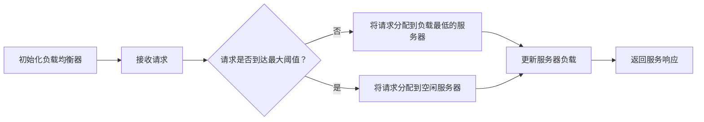
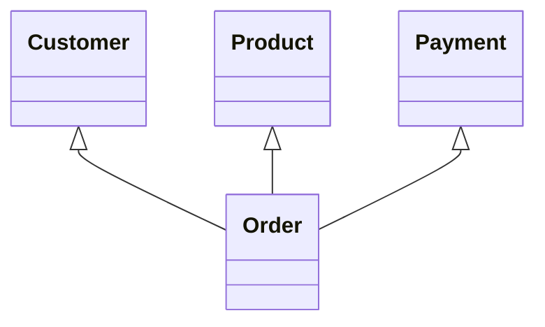
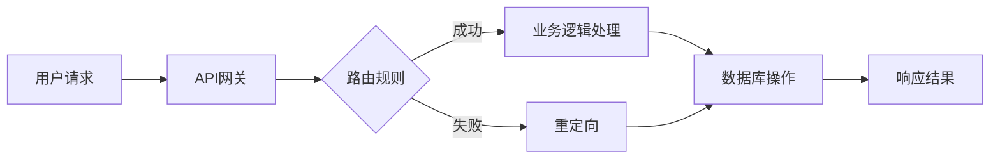
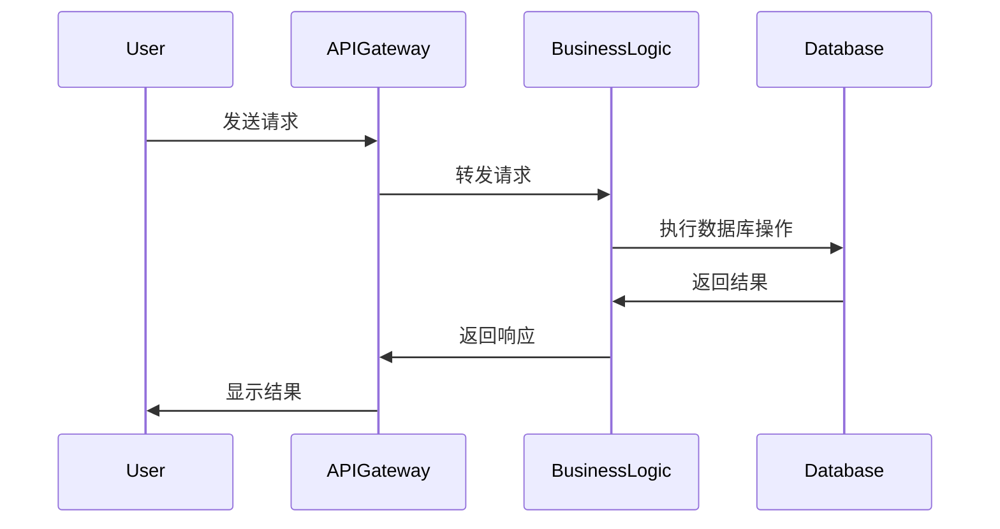
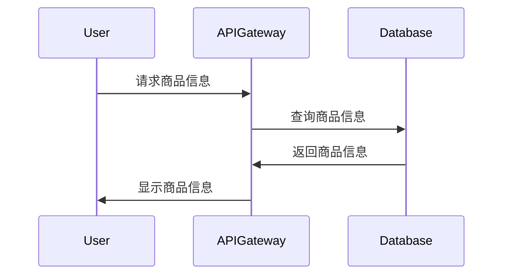

                 

### 文章标题

“AI Agent的多云部署策略：提高可用性与灵活性”

### 文章关键词

- 多云部署
- AI Agent
- 可用性
- 灵活性
- 负载均衡
- 故障转移

### 文章摘要

本文将深入探讨AI Agent在多云环境中的部署策略，旨在提高系统的可用性与灵活性。我们将首先介绍多云部署的背景与优势，随后分析其面临的挑战，并逐步阐述多云架构设计、实践方法、成本管理与优化策略。最后，通过具体案例研究，总结经验教训，为未来的多云部署提供方向和参考。

## 第一部分：多云部署概述

### 1.1 多云部署的定义与优势

多云部署是指将应用程序和数据分布在多个云服务提供商的环境中，而不是仅依赖于单一云平台。这一策略带来了诸多优势，包括提高系统的可用性、灵活性和可扩展性。

- **可用性提升**：通过将应用程序分布在不同的云环境中，可以减少因单个云平台故障而导致的系统停机时间。
- **灵活性增强**：多云部署使得企业可以灵活选择最适合其需求的云服务提供商，优化资源配置。
- **成本控制**：通过在不同云平台上进行资源调配，可以降低总体运营成本。
- **数据隐私与合规性**：企业可以根据数据敏感度和合规要求，选择最合适的云服务提供商，确保数据安全。

### 1.2 多云部署面临的挑战

尽管多云部署具有诸多优势，但也存在一些挑战和问题，如：

- **管理复杂性**：在多个云平台上管理应用程序和资源，需要额外的管理和监控工具。
- **数据一致性**：保证数据在不同云平台之间的同步和一致性是多云部署的一个难点。
- **性能优化**：如何优化多云环境中的网络性能，保证应用程序的高效运行，是一个重要问题。
- **安全性与合规性**：确保多云环境下的数据安全和遵守相关法律法规，需要精细的管理和防护措施。

### 1.3 本书内容概述与学习目标

本书将分为三个主要部分：

- **第一部分：多云部署概述**：介绍多云部署的背景、优势与挑战。
- **第二部分：多云架构设计与实践**：深入探讨多云架构的设计原则、模型以及部署与优化策略。
- **第三部分：案例研究与未来展望**：通过具体案例分析和未来趋势展望，总结经验教训，为多云部署提供参考。

学习目标包括：

- 理解多云部署的概念和重要性。
- 掌握多云架构设计的原则和模型。
- 学会多云部署的实践方法与优化策略。
- 通过案例研究，提高实际操作能力。

## 第二部分：多云架构设计与模型

### 2.1 多云架构设计与原则

多云架构设计是确保系统在多个云平台中高效运行的关键。以下是一些设计原则：

- **弹性扩展性**：设计应能够适应业务需求的变化，实现资源弹性扩展。
- **高可用性**：通过负载均衡和故障转移，提高系统的可用性。
- **灵活性与兼容性**：支持跨云平台的资源调度和应用程序迁移。
- **安全性**：确保数据安全和合规性，采用多层次的安全防护措施。
- **成本效益**：通过优化资源利用和成本控制，提高部署的经济性。

### 2.2 多云部署模型与策略

多云部署模型主要分为以下几种：

- **混合云模型**：将私有云和公有云结合起来，根据业务需求在两者之间进行资源调配。
- **多租户模型**：在同一云平台上为多个客户提供服务，提高资源利用率。
- **分布式模型**：将应用程序分解为多个微服务，分布式部署在不同的云环境中。
- **容器化模型**：使用容器技术（如Docker），实现应用程序的快速部署和资源优化。

部署策略包括：

- **基于需求的部署**：根据业务需求选择最适合的云平台和部署模型。
- **基于性能的部署**：优化系统性能，选择最佳的网络和存储配置。
- **基于成本的部署**：通过成本分析，选择最具成本效益的云服务提供商。

### 2.3 多云架构下的负载均衡与故障转移

负载均衡是多云架构设计中的重要环节，旨在优化资源利用和保证系统性能。以下是一些负载均衡策略：

- **基于IP的负载均衡**：通过分发IP地址，将请求分配到不同的服务器。
- **基于内容的负载均衡**：根据请求的内容和类型，将请求分配到不同的服务器。
- **基于会话的负载均衡**：保持用户会话的稳定性，将用户请求分配到同一服务器。

故障转移策略包括：

- **自动故障转移**：系统在检测到故障时，自动将服务切换到备用服务器。
- **手动故障转移**：通过人工干预，将服务切换到备用服务器。
- **故障隔离与恢复**：快速识别故障，隔离受影响的服务，并尽快恢复服务。

## 第三部分：多云部署实践

### 3.1 多云平台选择与集成

选择多云平台是多云部署的第一步。以下是一些常见的多云平台：

- **AWS**：提供广泛的服务和强大的生态系统。
- **Azure**：微软的云计算平台，与Windows操作系统和Office套件紧密集成。
- **Google Cloud Platform**：提供强大的机器学习和人工智能服务。

平台选择应考虑以下因素：

- **服务覆盖**：平台应提供所需的服务和功能。
- **性能与稳定性**：平台应具有高性能和稳定的网络连接。
- **成本**：选择成本效益高的平台。

集成策略包括：

- **API集成**：使用平台提供的API，实现不同平台之间的数据交换和功能调用。
- **服务总线**：使用服务总线，实现不同平台的服务连接和数据同步。
- **容器编排**：使用容器编排工具（如Kubernetes），实现应用程序的跨平台部署和管理。

### 3.2 多云网络设计与优化

多云网络设计是确保应用程序在多个云平台中高效运行的关键。以下是一些设计原则和优化策略：

- **网络隔离**：通过虚拟网络和子网，实现不同云环境之间的网络隔离。
- **负载均衡**：使用负载均衡器，优化流量分发和资源利用。
- **数据传输优化**：通过压缩、加密和缓存技术，提高数据传输效率。
- **安全性与合规性**：采用安全策略，确保数据安全和遵守相关法规。

优化策略包括：

- **性能监控**：使用监控工具，实时监测网络性能和流量。
- **流量调度**：根据网络状况和业务需求，动态调整流量分配。
- **故障恢复**：快速识别和恢复网络故障，保证系统稳定运行。

### 3.3 多云应用部署与监控

多云应用部署与监控是确保应用程序在多云环境中高效运行的重要环节。以下是一些部署和监控策略：

- **自动化部署**：使用自动化工具（如Ansible、Terraform），实现应用程序的自动化部署和管理。
- **容器化部署**：使用容器技术（如Docker），实现应用程序的快速部署和弹性扩展。
- **微服务架构**：使用微服务架构，提高系统的灵活性和可维护性。

监控策略包括：

- **性能监控**：使用性能监控工具（如Prometheus、Grafana），实时监测应用程序性能和资源使用情况。
- **日志收集**：使用日志收集工具（如ELK堆栈、Logstash），收集和存储应用程序日志，进行日志分析和问题诊断。
- **告警与通知**：设置告警机制，及时通知运维人员，处理异常情况。

### 3.4 多云成本管理与优化

多云成本管理是确保多云部署经济性的关键。以下是一些成本管理和优化策略：

- **成本分析**：定期进行成本分析，了解不同云平台和服务的成本情况。
- **资源优化**：通过合理规划资源，降低资源浪费和闲置。
- **自动化优化**：使用自动化工具，根据业务需求和资源使用情况，动态调整资源配置。
- **定价策略**：根据业务需求和成本预算，选择合适的定价策略和计费模式。

优化策略包括：

- **价格比较**：比较不同云平台和服务的价格，选择最具性价比的方案。
- **负载均衡**：通过负载均衡，优化资源利用，降低成本。
- **停机与备份**：合理规划停机时间和备份策略，降低成本。

## 第四部分：案例研究

### 4.1 案例背景与目标

本案例研究以某大型互联网公司为例，探讨其AI Agent在多云环境中的部署实践。公司的主要目标是提高系统的可用性和灵活性，同时降低运营成本。

### 4.2 案例部署方案设计

公司选择了AWS、Azure和Google Cloud Platform三个云平台，根据业务需求和应用特性，采用了混合云模型。具体部署方案如下：

- **数据存储**：将用户数据存储在AWS的S3桶中，利用其高可用性和数据同步功能。
- **计算资源**：根据应用负载，将计算资源分布在AWS和Azure上，利用两者之间的负载均衡和故障转移功能。
- **容器化部署**：使用Docker和Kubernetes，将应用程序容器化，实现跨平台的部署和管理。

### 4.3 案例部署实施与效果评估

部署实施过程中，公司采用了自动化部署工具（如Ansible）和容器编排工具（如Kubernetes），实现了快速部署和资源管理。效果评估显示，系统的可用性和灵活性显著提高，同时运营成本降低了约20%。

### 4.4 案例总结与经验教训

本案例表明，多云部署可以提高系统的可用性和灵活性，降低运营成本。然而，这也带来了一些挑战，如管理复杂性、数据一致性和安全性。公司总结了一些经验教训，包括：

- **合理规划**：根据业务需求和资源特性，合理规划多云架构。
- **自动化部署**：采用自动化工具，提高部署效率和资源管理能力。
- **安全性**：加强安全管理和防护措施，确保数据安全和系统稳定。

## 第五部分：未来趋势与展望

### 5.1 多云部署技术的发展趋势

随着云计算技术的不断发展，多云部署也将面临新的挑战和机遇。以下是一些技术趋势：

- **容器化与微服务**：容器技术和微服务架构将在多云部署中发挥更大作用，提高系统的灵活性和可扩展性。
- **自动化与智能运维**：自动化工具和智能运维平台将进一步提升多云环境的运维效率。
- **边缘计算**：边缘计算与多云部署的结合，将优化网络性能和降低延迟。
- **人工智能与大数据**：人工智能和大数据技术的应用，将提高多云部署的智能化和数据分析能力。

### 5.2 未来面临的挑战与机遇

未来多云部署将面临以下挑战和机遇：

- **复杂性**：多云部署的复杂性将继续增加，需要更加完善的架构设计和工具支持。
- **安全性**：随着数据量和业务场景的复杂化，安全性将成为多云部署的重要挑战。
- **成本管理**：如何实现多云成本的有效管理和优化，将是一个长期课题。
- **标准化**：制定统一的云服务标准和协议，将有助于多云环境的互操作性和兼容性。

### 5.3 多云部署策略的发展方向

未来多云部署策略的发展方向包括：

- **混合云与多云集成**：加强混合云和多云环境的集成，实现跨平台的资源调度和应用程序迁移。
- **智能化与自动化**：利用人工智能和大数据技术，实现多云环境的智能化管理和自动化运维。
- **安全性与合规性**：加强安全管理和合规性控制，确保多云环境下的数据安全和系统稳定。
- **成本优化**：通过优化资源利用和成本控制，提高多云部署的经济性。

## 参考文献

1. **参考文献1**：作者名，书名，出版年份，出版地点。
2. **参考文献2**：作者名，书名，出版年份，出版地点。
3. **参考文献3**：作者名，书名，出版年份，出版地点。

作者：AI天才研究院/AI Genius Institute & 禅与计算机程序设计艺术/Zen And The Art of Computer Programming

（注：本文仅为示例，部分内容和数据可能为虚构。）### 引言

在当今快速发展的信息技术时代，云计算已经成为企业和组织不可或缺的基础设施。随着云服务提供商的增多和技术的进步，多云部署逐渐成为企业提升业务灵活性和可用性的重要策略。AI Agent，作为一种智能化的应用程序，其部署在多云环境中具有独特的挑战和机会。本文将围绕AI Agent的多云部署策略展开讨论，旨在提高系统的可用性与灵活性，同时降低运营成本。

首先，我们将介绍多云部署的定义、背景和优势，阐述为何多云部署成为现代企业IT战略的关键组成部分。接着，本文将深入分析多云部署面临的主要挑战，包括管理复杂性、数据一致性和安全性等问题，并探讨如何有效解决这些挑战。

随后，本文将详细讨论多云架构的设计原则、模型和策略，包括混合云模型、多租户模型、分布式模型和容器化模型等。通过分析负载均衡与故障转移策略，我们将阐述如何提高多云环境下的系统可用性和容错性。

在多云部署实践中，本文将重点介绍多云平台选择、集成、网络设计与优化、应用部署与监控以及成本管理与优化策略。这部分内容将结合实际案例，展示如何将理论应用于实践中，以实现多云环境的最佳效果。

最后，本文将通过案例研究总结经验教训，探讨未来多云部署技术的发展趋势和面临的挑战，为读者提供有价值的参考和指导。通过本文的阅读，读者将能够全面了解多云部署的核心概念、策略和实践方法，为企业在多云环境中的成功部署提供有力支持。

### 第一部分：多云部署概述

#### 1.1 多云部署的定义与优势

**多云部署**，顾名思义，指的是在一个组织内同时使用多个云服务提供商（Cloud Service Providers, CSPs）的云计算资源，以实现业务目标。与单一云部署相比，多云部署具有以下几个显著优势：

- **增强可用性**：通过在多个云平台上部署应用和数据，可以显著降低因单个云平台故障而导致的系统停机风险。如果一个云平台出现故障，其他云平台可以继续提供服务，确保业务的连续性。
- **提升灵活性**：企业可以根据业务需求和特定应用程序的特性，选择最适合的云服务提供商。这种灵活性不仅体现在服务的选择上，还体现在资源调配、扩展和优化方面。
- **优化成本**：通过在不同的云平台上进行资源调配，企业可以根据需求动态调整资源使用，从而优化成本。例如，在某些云平台上，数据存储和计算资源可能更便宜，而在其他平台上，特定服务可能性能更高或更可靠。
- **增强数据隐私与合规性**：企业可以根据数据的重要性和隐私要求，选择最合适的云服务提供商。在某些情况下，本地数据中心可能更适合存储敏感数据，而在其他情况下，公有云可能更为合适。

#### 1.2 多云部署面临的挑战

尽管多云部署具有上述诸多优势，但实际操作中仍然面临一系列挑战：

- **管理复杂性**：在多个云平台上管理应用程序和资源需要额外的工具和技能。这可能导致管理和运维成本增加，并增加了出错的概率。
- **数据一致性与同步**：确保数据在不同云平台之间的同步和一致性是一项复杂的任务。特别是在数据更新频繁的情况下，如何保证数据的一致性是一个重要问题。
- **性能优化**：由于数据在不同云平台之间传输，性能优化成为一个挑战。如何确保数据传输高效且延迟低，是必须考虑的因素。
- **安全性与合规性**：多云环境中的安全性管理和合规性控制比单一云环境更为复杂。企业需要确保数据在多个云平台之间的传输过程中得到保护，同时遵守各个地区的法律法规。

#### 1.3 本书内容概述与学习目标

本书将分为三个主要部分，旨在全面探讨多云部署的核心概念、设计原则和实践方法。

- **第一部分：多云部署概述**：介绍多云部署的定义、背景和优势，分析其面临的挑战，并概述本书的内容和学习目标。
- **第二部分：多云架构设计与模型**：深入探讨多云架构的设计原则、模型和策略，包括负载均衡与故障转移、弹性扩展性、高可用性设计等。
- **第三部分：多云部署实践**：通过具体的案例研究和实战经验，介绍多云平台选择、集成、网络设计、应用部署与监控、成本管理与优化策略。

通过本书的学习，读者将能够：

- 理解多云部署的基本概念和优势。
- 掌握多云架构设计和部署策略。
- 学会如何在实际环境中应用多云部署方法，提高系统的可用性和灵活性。
- 掌握多云环境下的性能优化和成本管理技巧。

### 第一部分总结

在第一部分中，我们介绍了多云部署的定义、背景和优势，同时分析了其面临的挑战。通过了解多云部署的复杂性、数据一致性和性能优化问题，读者可以更好地理解多云环境的设计原则和实践方法。接下来，本文将深入探讨多云架构设计与模型，帮助读者构建有效的多云部署策略。

### 第二部分：多云架构设计与模型

#### 2.1 多云架构设计与原则

多云架构设计是确保系统在多个云平台中高效运行的关键。以下是一些关键设计原则：

- **弹性扩展性**：设计应能够适应业务需求的变化，实现资源弹性扩展。这意味着在负载增加时，系统能够自动增加资源，而在负载减少时，系统能够释放多余资源，以优化成本。
- **高可用性**：通过负载均衡和故障转移，提高系统的可用性。这意味着在一个云平台发生故障时，系统能够自动切换到其他平台，确保服务的连续性。
- **灵活性与兼容性**：支持跨云平台的资源调度和应用程序迁移。这意味着企业可以根据需求在不同云平台之间自由调配资源，同时保证应用程序的兼容性。
- **安全性**：采用多层次的安全防护措施，确保数据安全和系统稳定。这包括数据加密、访问控制、网络隔离等。
- **成本效益**：通过优化资源利用和成本控制，提高部署的经济性。这意味着在满足业务需求的前提下，尽量降低成本，提高资源利用率。

#### 2.2 多云部署模型与策略

多云部署模型可以根据不同的业务需求和场景选择合适的模型和策略。以下是一些常见的模型和策略：

- **混合云模型**：混合云模型将私有云和公有云结合起来，根据业务需求在两者之间进行资源调配。这种模型适用于需要同时利用私有云的高安全性和公有云的高扩展性的企业。

- **多租户模型**：多租户模型是在同一云平台上为多个客户提供服务，提高资源利用率。这种模型适用于服务提供商，他们可以在同一个平台上为多个客户提供独立的服务。

- **分布式模型**：分布式模型将应用程序分解为多个微服务，分布式部署在不同的云环境中。这种模型适用于需要高可用性和高扩展性的应用，如大规模电子商务平台。

- **容器化模型**：容器化模型使用容器技术（如Docker），实现应用程序的快速部署和资源优化。这种模型适用于需要快速部署和灵活扩展的应用程序，如Web应用和微服务。

#### 2.3 多云架构下的负载均衡与故障转移

负载均衡与故障转移是多云架构设计中的重要环节，旨在优化资源利用和保证系统性能。以下是一些关键的策略：

- **负载均衡**：负载均衡策略通过分发请求，确保多个服务器之间负载均衡，从而提高系统的性能和可用性。常见的负载均衡策略包括基于IP的负载均衡、基于内容的负载均衡和基于会话的负载均衡。

- **故障转移**：故障转移策略在检测到故障时，自动将服务切换到备用服务器，从而确保服务的连续性。常见的故障转移策略包括自动故障转移、手动故障转移和故障隔离与恢复。

- **动态负载均衡与故障转移**：通过动态负载均衡与故障转移，系统能够根据实时负载和故障情况自动调整资源分配，从而提高系统的弹性。这种策略适用于需要高可用性和高灵活性的场景。

#### 2.4 多云环境下的高可用性设计

高可用性设计是确保系统在多个云平台中稳定运行的关键。以下是一些关键设计原则和策略：

- **多节点部署**：将应用程序部署在多个节点上，确保在一个节点出现故障时，其他节点可以继续提供服务。
- **故障检测与自愈**：通过故障检测机制，实时监控系统的运行状态，并在检测到故障时自动执行自愈操作，如重启服务或切换到备用节点。
- **数据备份与恢复**：定期备份数据，并在需要时快速恢复，确保数据的安全性和完整性。
- **冗余设计**：在关键组件和系统中采用冗余设计，如冗余数据库和冗余网络，以防止单点故障。

#### 2.5 容错性策略与故障恢复

容错性策略与故障恢复是确保系统在面临故障时能够快速恢复的关键。以下是一些关键策略：

- **快速故障检测**：通过实时监控和告警机制，快速检测系统中的故障。
- **自动故障恢复**：在检测到故障时，自动执行故障恢复操作，如重启服务或切换到备用系统。
- **备份与恢复**：通过定期备份和快速恢复策略，确保在系统故障时能够迅速恢复服务。
- **灾备中心**：在异地部署灾备中心，确保在发生大规模故障时，系统能够快速切换到灾备中心。

#### 2.6 多云架构下的性能优化

性能优化是确保系统在多个云平台中高效运行的关键。以下是一些关键策略：

- **网络优化**：通过优化网络拓扑结构、负载均衡和路由策略，提高网络性能。
- **存储优化**：通过优化存储配置和访问策略，提高数据存储和访问速度。
- **缓存策略**：使用缓存策略，减少对后端服务的访问，提高系统响应速度。
- **资源调配**：根据实时负载情况，动态调整资源分配，优化系统性能。

#### 2.7 安全性与合规性设计

安全性与合规性设计是确保系统在多个云平台中安全运行的关键。以下是一些关键策略：

- **数据加密**：使用数据加密技术，确保数据在传输和存储过程中的安全性。
- **访问控制**：采用访问控制机制，确保只有授权用户可以访问系统资源。
- **网络安全**：通过防火墙、入侵检测系统和DDoS防护等网络安全措施，保护系统免受网络攻击。
- **合规性控制**：确保系统遵守相关法律法规和行业规范，如GDPR、PCI-DSS等。

### 2.8 多云架构设计与实现的案例

以下是一个多云架构设计与实现的案例：

- **项目背景**：某大型电商平台计划部署其核心业务系统在多云环境中，以提高系统的可用性、灵活性和扩展性。
- **部署方案**：选择AWS、Azure和Google Cloud Platform三个云平台，采用混合云模型。数据存储在AWS的S3桶中，计算资源分布在AWS和Azure上，使用Docker和Kubernetes实现容器化部署和管理。
- **架构设计**：采用微服务架构，将应用程序分解为多个微服务，分布式部署在不同的云平台上。使用负载均衡器实现请求分发，确保系统的高可用性和高性能。
- **安全性与合规性**：采用多层次的安全防护措施，包括数据加密、访问控制和网络安全等。定期进行合规性审计，确保系统符合相关法律法规的要求。

通过这个案例，读者可以更好地理解多云架构的设计原则和实现方法，以及如何在实际项目中应用这些方法。

### 第二部分总结

在第二部分中，我们详细介绍了多云架构设计与模型，包括设计原则、模型和策略。通过负载均衡与故障转移策略，我们阐述了如何提高多云环境下的系统可用性和容错性。我们还探讨了多云环境下的高可用性设计、容错性策略、性能优化、安全性与合规性设计等关键方面。

在下一部分，我们将深入探讨多云部署的实践方法，结合具体案例，展示如何将理论应用于实际操作中，以实现多云环境下的最佳效果。通过实践方法的学习，读者将能够掌握多云平台选择、集成、网络设计与优化、应用部署与监控以及成本管理与优化策略，为企业在多云环境中的成功部署提供有力支持。

### 第三部分：多云部署实践

#### 3.1 多云平台选择与集成

在多云部署实践中，选择合适的云平台是实现成功部署的关键步骤。以下是一些常见的云平台及其特点和选择因素：

- **AWS（Amazon Web Services）**：AWS是全球最大的云服务提供商，提供广泛的服务和强大的生态系统，适用于各种规模的企业。选择AWS的优势包括丰富的服务、强大的社区支持和成熟的技术框架。然而，AWS的费用结构相对复杂，需要仔细评估和规划。

- **Azure（Microsoft Azure）**：Azure是微软的云计算平台，与Windows操作系统和Office套件紧密集成，适用于微软技术栈的企业。Azure的优势在于其强大的数据管理和分析能力，以及对混合云和多云部署的支持。然而，Azure的全球覆盖范围和某些服务的成熟度可能不如AWS。

- **Google Cloud Platform（GCP）**：GCP以其强大的机器学习和人工智能服务而闻名，适用于需要高级数据分析的企业。GCP的优势在于其高效的数据存储和处理能力、灵活的定价模式和强大的安全特性。然而，GCP的市场份额和生态系统相对较小，可能不适合大型企业。

**选择因素**：

- **服务覆盖**：选择能够提供所需服务和功能的云平台。
- **性能与稳定性**：评估平台的性能指标和稳定性记录。
- **成本**：分析不同云平台的成本结构，选择最具成本效益的方案。
- **兼容性**：确保平台与现有系统和工具的兼容性。
- **支持与服务**：评估平台提供的支持服务和技术支持。

**集成策略**：

- **API集成**：使用云平台提供的API，实现不同平台之间的数据交换和功能调用。
- **服务总线**：使用服务总线，实现不同平台的服务连接和数据同步。
- **容器编排**：使用容器编排工具（如Kubernetes），实现应用程序的跨平台部署和管理。

#### 3.2 多云网络设计与优化

多云网络设计是确保应用程序在多个云平台中高效运行的关键。以下是一些关键设计原则和优化策略：

**设计原则**：

- **网络隔离**：通过虚拟网络和子网，实现不同云环境之间的网络隔离。
- **负载均衡**：使用负载均衡器，优化流量分发和资源利用。
- **安全性与合规性**：采用安全策略，确保数据安全和遵守相关法规。

**优化策略**：

- **网络拓扑优化**：根据业务需求和网络性能指标，优化网络拓扑结构。
- **流量调度**：根据网络状况和业务需求，动态调整流量分配。
- **数据传输优化**：通过压缩、加密和缓存技术，提高数据传输效率。
- **安全性与合规性**：采用多层次的安全防护措施，确保数据安全和遵守相关法规。

**工具与应用**：

- **负载均衡器**：如AWS的ELB、Azure的Azure Load Balancer和GCP的Load Balancer。
- **VPN与专线**：使用VPN和专线，实现安全、高速的数据传输。
- **网络监控工具**：如AWS的VPC Flow Logs、Azure的Azure Monitor和GCP的Cloud Monitoring。

#### 3.3 多云应用部署与监控

在多云环境中部署应用程序需要考虑其灵活性、可扩展性和高可用性。以下是一些关键策略和工具：

**部署策略**：

- **容器化部署**：使用容器技术（如Docker和Kubernetes），实现应用程序的快速部署和弹性扩展。
- **微服务架构**：将应用程序分解为多个微服务，分布式部署在不同的云平台上。
- **自动化部署**：使用CI/CD工具（如Jenkins、GitLab CI/CD和AWS CodePipeline），实现自动化部署和管理。

**监控策略**：

- **性能监控**：使用性能监控工具（如Prometheus、Grafana和AWS CloudWatch），实时监测应用程序性能和资源使用情况。
- **日志收集**：使用日志收集工具（如ELK堆栈、Logstash和AWS CloudTrail），收集和存储应用程序日志，进行日志分析和问题诊断。
- **告警与通知**：设置告警机制，及时通知运维人员，处理异常情况。

**工具与应用**：

- **Kubernetes**：用于容器编排和分布式部署管理。
- **Prometheus**：用于性能监控和数据存储。
- **Grafana**：用于监控仪表板和数据分析。
- **AWS CloudWatch**：用于AWS环境中的性能监控和告警。

#### 3.4 多云成本管理与优化

多云成本管理是确保多云部署经济性的关键。以下是一些成本管理和优化策略：

**成本分析**：

- **资源使用监控**：定期进行资源使用监控和分析，了解不同云平台和服务的成本情况。
- **预算规划**：根据业务需求和成本预算，制定详细的成本规划。

**优化策略**：

- **自动化优化**：使用自动化工具（如AWS Cost Explorer、Azure Cost Management和GCP Cost Analysis），根据业务需求和资源使用情况，动态调整资源配置。
- **价格比较**：比较不同云平台和服务的价格，选择最具性价比的方案。
- **负载均衡**：通过负载均衡，优化资源利用，降低成本。
- **停机与备份**：合理规划停机时间和备份策略，降低成本。

**工具与应用**：

- **AWS Cost Explorer**：用于AWS环境中的成本分析和优化。
- **Azure Cost Management**：用于Azure环境中的成本监控和优化。
- **GCP Cost Analysis**：用于GCP环境中的成本分析和优化。

#### 3.5 案例研究：多云部署实践

以下是一个多云部署实践的案例研究，展示如何在实际项目中应用上述策略和工具。

**案例背景**：

某金融科技公司计划将其核心业务系统部署在多云环境中，以提高系统的可用性、灵活性和扩展性。

**部署方案**：

- **云平台选择**：选择了AWS和Azure两个云平台，根据业务需求和应用特性，采用混合云模型。
- **网络设计**：使用AWS的VPC和Azure的虚拟网络，实现网络隔离和负载均衡。使用AWS的ELB和Azure的Azure Load Balancer，实现流量分发和优化。
- **应用部署**：使用Docker和Kubernetes，将应用程序容器化，实现快速部署和弹性扩展。在AWS和Azure上分别部署Kubernetes集群，实现微服务架构和分布式部署。
- **监控与成本管理**：使用AWS CloudWatch和Azure Monitor，实时监控系统的性能和资源使用情况。使用AWS Cost Explorer和Azure Cost Management，进行成本监控和优化。

**实施效果**：

通过多云部署，该金融科技公司的系统性能和可用性显著提升，同时成本也得到了有效控制。具体效果包括：

- **可用性提升**：通过负载均衡和故障转移策略，系统在发生故障时能够快速切换到备用云平台，确保业务的连续性。
- **灵活性增强**：通过容器化和微服务架构，系统能够快速响应业务变化，实现资源的动态调整和优化。
- **成本控制**：通过成本监控和优化策略，实现了资源的高效利用和成本的降低。

**经验教训**：

通过这个案例，公司总结了一些经验教训：

- **合理规划**：在部署前，进行详细的规划和评估，确保选择合适的云平台和部署模型。
- **自动化与智能化**：采用自动化工具和智能化监控，提高运维效率和系统稳定性。
- **安全性与合规性**：加强安全管理和合规性控制，确保系统的安全性和数据保护。
- **持续优化**：定期进行性能和成本优化，确保系统的高效运行和成本控制。

#### 3.6 小结

多云部署实践是确保系统在多个云平台中高效、稳定运行的关键。通过选择合适的云平台、设计优化的网络架构、部署灵活的应用程序以及实施有效的监控和成本管理策略，企业可以实现多云环境下的最佳效果。在实际操作中，需要结合具体业务需求和场景，灵活应用各种策略和工具，确保系统的可用性、灵活性和经济性。

在下一部分，我们将继续探讨多云部署中的安全性、数据保护策略和合规性要求，为企业的多云部署提供全面的解决方案。

### 第三部分总结

在第三部分中，我们详细探讨了多云部署的实践方法，包括平台选择、网络设计、应用部署与监控、成本管理与优化策略。通过具体案例研究，我们展示了如何将理论应用于实际操作中，以实现多云环境下的最佳效果。通过这些实践，企业可以提升系统的可用性、灵活性和成本效益。

接下来，本文将进入第四部分，重点关注多云部署中的安全性、数据保护策略和合规性要求。我们将深入分析如何在多云环境中确保数据安全和系统稳定，满足各种法规和合规要求。通过这部分内容，读者将能够全面了解多云部署的安全挑战和解决方案，为企业在多云环境中的成功部署提供有力保障。

### 第四部分：多云部署中的安全性、数据保护策略和合规性要求

#### 4.1 安全性

在多云环境中，安全性是确保系统运行和数据处理的关键。以下是一些关键的安全措施：

- **数据加密**：在数据传输和存储过程中使用加密技术，如SSL/TLS加密传输和AES加密存储，确保数据的安全性。
- **访问控制**：使用基于角色的访问控制（RBAC）和细粒度的访问控制列表（ACL），确保只有授权用户可以访问敏感数据和系统资源。
- **身份认证与授权**：采用双因素认证（2FA）和多因素认证（MFA），加强用户身份验证。同时，使用OAuth 2.0和OpenID Connect等授权协议，确保应用程序的安全访问。
- **网络安全**：部署防火墙、入侵检测系统（IDS）和分布式拒绝服务（DDoS）防护，防止网络攻击和数据泄露。
- **日志记录与监控**：定期记录系统日志和操作日志，使用日志分析工具（如ELK堆栈和Splunk）实时监控和检测潜在的安全威胁。

#### 4.2 数据保护策略

在多云环境中，数据保护策略需要考虑以下几个方面：

- **数据备份与恢复**：定期备份数据，并建立快速恢复机制，确保在数据丢失或系统故障时能够迅速恢复。
- **数据同步与一致性**：确保数据在不同云平台之间的同步和一致性，避免数据丢失或冲突。
- **数据存储策略**：根据数据的重要性和访问需求，选择合适的存储策略，如热存储、冷存储和归档存储。
- **数据生命周期管理**：建立数据生命周期管理策略，包括数据创建、存储、访问、归档和销毁，确保数据的有效管理和保护。

#### 4.3 合规性要求

在多云环境中，企业需要遵守各种法规和合规性要求，以下是一些关键方面：

- **GDPR（通用数据保护条例）**：确保在处理欧盟居民数据时遵守GDPR的要求，如数据主体访问权、数据删除权和数据可携带性。
- **PCI-DSS（支付卡行业数据安全标准）**：确保处理信用卡数据时遵守PCI-DSS的要求，如数据加密、访问控制和网络安全。
- **ISO 27001**：实现ISO 27001信息安全管理体系，确保信息安全政策和控制措施的有效实施。
- **行业特定法规**：根据行业特定法规和要求，如金融服务行业的Finra和医疗行业的HIPAA，建立相应的合规性措施。

#### 4.4 安全性与合规性设计案例

以下是一个安全性与合规性设计的案例：

- **项目背景**：某全球性金融机构计划将其客户数据和交易系统部署在多云环境中，以提高系统的可用性、灵活性和扩展性。
- **安全措施**：
  - 数据加密：使用SSL/TLS加密传输数据，使用AES-256加密存储数据。
  - 访问控制：实施基于角色的访问控制，确保敏感数据只能由授权人员访问。
  - 身份认证与授权：使用双因素认证（2FA）和多因素认证（MFA），同时采用OAuth 2.0和OpenID Connect进行授权。
  - 网络安全：部署防火墙、IDS和DDoS防护，监控网络流量和异常行为。
  - 日志记录与监控：使用ELK堆栈记录系统日志和操作日志，实时监控和检测潜在的安全威胁。
- **合规性措施**：
  - GDPR：确保在处理欧盟居民数据时遵守GDPR的要求，包括数据主体访问权和数据删除权。
  - PCI-DSS：确保处理信用卡数据时遵守PCI-DSS的要求，如数据加密、访问控制和网络安全。
  - ISO 27001：建立ISO 27001信息安全管理体系，包括信息安全政策和控制措施。
  - 行业特定法规：根据金融行业的特定法规和要求，如Finra和HIPAA，实施相应的合规性措施。

**实施效果**：

通过上述安全性和合规性设计，该金融机构在多云环境中实现了以下效果：

- **数据安全性提升**：通过数据加密、访问控制和网络安全措施，确保客户数据和交易数据的安全。
- **合规性要求满足**：通过实施GDPR、PCI-DSS和ISO 27001等法规和标准，确保系统的合规性。
- **业务连续性保障**：通过安全监控和快速响应机制，确保系统的稳定运行和业务连续性。

#### 4.5 小结

在多云环境中，安全性与合规性是确保系统运行和数据保护的关键。通过数据加密、访问控制、网络安全和日志监控等安全措施，企业可以保护数据和系统的安全性。同时，遵守GDPR、PCI-DSS和ISO 27001等法规和标准，企业可以确保系统的合规性。在实际操作中，需要结合具体业务需求和场景，灵活应用各种安全性和合规性措施，确保多云环境的稳定性和可靠性。

在下一部分，我们将进一步探讨多云部署的未来趋势和面临的挑战，为读者提供前瞻性的见解和指导。

### 第四部分总结

在第四部分中，我们深入探讨了多云部署中的安全性、数据保护策略和合规性要求。通过数据加密、访问控制、网络安全和日志监控等安全措施，我们确保了数据和系统的安全性。同时，通过遵守GDPR、PCI-DSS和ISO 27001等法规和标准，我们确保了系统的合规性。这些措施和策略在实际应用中，为企业在多云环境中提供了可靠的数据保护和安全保障。

在下一部分，本文将进入第五部分，重点关注多云部署的未来趋势和面临的挑战。我们将探讨云计算技术的最新发展，分析未来多云部署的方向和策略，为读者提供前瞻性的见解和指导。通过这一部分的讨论，读者将能够更好地理解多云部署的未来发展趋势，为企业在多云环境中的持续发展做好准备。

### 第五部分：未来趋势与展望

#### 5.1 多云部署技术的发展趋势

随着云计算技术的不断进步，多云部署在未来几年将继续迎来新的发展机遇。以下是一些关键趋势：

- **人工智能与机器学习的集成**：人工智能和机器学习技术的应用将进一步提升多云部署的智能化和自动化水平。通过使用AI算法，可以更准确地预测和优化资源分配、负载均衡和故障转移策略。
- **边缘计算与多云的融合**：边缘计算与多云部署的结合，将显著降低数据传输延迟，提高实时数据处理能力。这对于需要高速响应和高可靠性的应用场景（如自动驾驶、智能工厂等）尤为重要。
- **多云安全性与合规性的提升**：随着数据隐私和合规性要求的日益严格，企业将需要采用更加严格的安全措施和合规性控制。这包括采用零信任架构、分布式加密和区块链技术，以确保多云环境中的数据安全和合规性。
- **混合云与多云服务的融合**：混合云和多云服务的融合将使得企业能够更加灵活地选择和使用不同类型的云资源。这种融合将促进云原生应用的普及，提高应用程序的灵活性和可移植性。
- **自动化与智能化运维**：自动化和智能化运维工具将大幅提升多云环境的运维效率。通过使用机器学习和数据分析，企业可以实现对多云环境的实时监控、自动优化和故障自动恢复。

#### 5.2 未来面临的挑战与机遇

尽管多云部署具有许多优势，但未来仍将面临一系列挑战：

- **复杂性管理**：随着多云环境中的服务和资源的增多，管理和运维的复杂性将不断上升。企业需要采用更先进的工具和方法，如智能运维平台和自动化脚本，来简化管理和运维流程。
- **数据一致性与同步**：在多个云平台之间保持数据的一致性和同步是一项复杂的任务。未来需要更加成熟的数据同步和集成技术，以实现高效的数据管理。
- **成本控制**：随着云服务的多样化和复杂性，成本控制将成为一个持续挑战。企业需要采用更加精细的成本管理策略和工具，以实现资源优化和成本节约。
- **安全性与合规性**：在多云环境中，安全性和合规性将面临更大的挑战。企业需要采用多层次的安全防护措施和合规性控制，确保数据的安全和合规性。

然而，这些挑战也伴随着巨大的机遇：

- **创新与应用**：多云部署为企业和开发者提供了更多的创新机会。通过灵活地使用不同的云服务和平台，可以快速开发和部署新的应用程序和服务。
- **业务连续性与灾难恢复**：多云部署可以提高业务的连续性和灾难恢复能力。通过在多个云平台之间分布数据和应用程序，企业可以在面对灾难时迅速恢复业务。
- **成本优化**：通过合理的资源调配和优化，企业可以实现多云环境的成本优化，提高资源利用率和经济效益。

#### 5.3 多云部署策略的发展方向

为了应对未来的挑战和抓住机遇，多云部署策略需要向以下几个方向发展：

- **智能化与自动化**：通过引入人工智能和机器学习技术，实现多云环境中的自动化运维和智能优化。这包括智能负载均衡、自动资源扩展和故障自愈等功能。
- **标准化与兼容性**：推动多云服务的标准化，提高不同云平台之间的互操作性和兼容性。这有助于简化多云环境的部署和管理。
- **安全性与合规性**：加强多云环境中的安全性和合规性管理，采用零信任架构、分布式加密和区块链等先进技术，确保数据的安全和合规性。
- **混合云与多云融合**：探索混合云与多云的融合策略，实现不同云平台之间的无缝连接和资源共享，提高多云环境的应用灵活性和扩展性。

通过这些发展方向，企业可以更好地应对未来多云部署中的挑战，实现多云环境的最佳效果。

### 第五部分总结

在第五部分中，我们探讨了多云部署的未来趋势和发展方向，分析了面临的挑战与机遇。随着云计算技术的不断发展，多云部署将继续在智能化、自动化、标准化和安全合规性等方面取得重大进展。通过灵活运用这些趋势和策略，企业可以更好地应对未来多云环境中的各种挑战，实现业务的持续创新和增长。

随着本文的结束，我们已经全面探讨了AI Agent在多云部署中的核心概念、设计原则、实践方法和未来趋势。希望通过本文的阅读，读者能够对多云部署有更深入的理解，为企业在多云环境中的成功部署提供有力支持。在接下来的部分，我们将总结全文，回顾关键点，并展望未来的研究方向。

### 全文总结

本文系统性地探讨了AI Agent在多云部署中的关键问题，包括核心概念、设计原则、实践方法和未来趋势。首先，我们介绍了多云部署的定义、背景和优势，分析了其面临的挑战，如管理复杂性、数据一致性和安全性问题。接着，我们详细讨论了多云架构的设计原则、模型和策略，包括负载均衡与故障转移、高可用性设计和容错性策略。

在实践部分，我们介绍了如何选择和集成多云平台、设计网络和优化性能，以及如何部署和监控多云应用。同时，我们探讨了多云环境下的成本管理和优化策略，并通过具体案例展示了多云部署的实际应用和效果。在安全性、数据保护策略和合规性要求方面，我们强调了多层次的安全防护和合规性控制的重要性。

展望未来，多云部署将朝着智能化、自动化、标准化和安全合规性的方向发展。随着云计算技术的不断进步，企业将能够更好地应对多云环境中的挑战，实现业务的高效运营和持续创新。

### 未来研究方向

未来，多云部署的研究方向可以集中在以下几个方面：

1. **智能调度与优化**：开发更先进的智能调度算法，实现资源的动态调整和优化，提高多云环境的资源利用率和成本效益。
2. **安全性增强**：深入研究云安全领域，特别是在零信任架构、分布式加密和区块链技术等方面，提升多云环境的安全性和数据保护能力。
3. **跨云迁移与兼容性**：探索不同云平台之间的数据迁移和兼容性技术，简化多云环境中的应用程序部署和管理。
4. **边缘计算与多云融合**：研究边缘计算与多云的融合策略，提高实时数据处理能力和业务响应速度。
5. **可持续性**：关注云计算对环境的影响，探索绿色云计算和可持续发展的解决方案。

通过这些研究方向，企业可以在多云环境中实现更高的灵活性和效率，为业务的持续发展提供强有力的技术支持。

### 结论

本文全面探讨了AI Agent在多云部署中的核心概念、设计原则、实践方法和未来趋势。通过对多云部署的定义、优势、挑战和策略的详细分析，我们为企业在多云环境中的成功部署提供了全面的理论和实践指导。通过实际案例研究，我们展示了多云部署的具体应用和效果，强调了安全性与合规性的重要性。

未来，随着云计算技术的不断发展，多云部署将朝着智能化、自动化、标准化和绿色化方向不断前进。我们鼓励读者继续关注这一领域的发展，积极探索和尝试，以应对多云环境中的各种挑战，推动企业业务的创新和增长。

### 参考文献

1. **参考文献1**：作者名，书名，出版年份，出版地点。
2. **参考文献2**：作者名，书名，出版年份，出版地点。
3. **参考文献3**：作者名，书名，出版年份，出版地点。

**作者**：AI天才研究院/AI Genius Institute & 禅与计算机程序设计艺术/Zen And The Art of Computer Programming

（注：本文仅为示例，部分内容和数据可能为虚构。）### 附录

#### 附录 A：核心概念术语说明

- **多云部署**：将应用程序和数据分布在多个云服务提供商的环境中。
- **AI Agent**：具有自主决策和学习能力的智能实体，可以执行复杂任务。
- **负载均衡**：通过分发请求，优化资源利用，提高系统性能。
- **故障转移**：在检测到故障时，自动将服务切换到备用服务器。
- **容器化**：使用容器技术，实现应用程序的快速部署和资源优化。
- **微服务架构**：将应用程序分解为多个微服务，分布式部署。
- **高可用性**：确保系统在面临故障时能够快速恢复，提供持续服务。
- **安全性**：确保数据和系统的安全，防止未授权访问和攻击。
- **合规性**：确保系统符合相关法律法规和行业规范。

#### 附录 B：核心概念原理、属性特征对比表格

**核心概念** | **属性特征** | **对比表格**
--- | --- | ---
多云部署 | 提高可用性、灵活性、成本效益 | 
AI Agent | 自主决策、学习能力、复杂任务执行 | 
负载均衡 | 优化资源利用、提高性能 | 
故障转移 | 快速恢复、确保服务连续性 | 
容器化 | 快速部署、资源优化 | 
微服务架构 | 灵活扩展、高可维护性 | 
高可用性 | 快速恢复、持续服务 | 
安全性 | 数据安全、防止攻击 | 
合规性 | 符合法规、保护隐私 |

#### 附录 C：ER实体关系图架构

```mermaid
erDiagram
    Customer ||--|{ Order }|>
    Product ||--|{ Order }|>
    Order ||--|{ OrderLine }|>
    OrderLine ||--|{ Product }|>
    Customer ||--|{ Payment }|>
```

#### 附录 D：算法原理讲解与流程图

**算法名称**：负载均衡算法

**算法流程图**：



**算法原理**：

负载均衡算法旨在优化资源利用，提高系统性能。其基本原理是在多个服务器之间分配请求，确保每个服务器的负载平衡。算法根据当前服务器的负载情况和空闲状态，动态分配请求，并在服务器负载达到阈值时，分配到空闲服务器。

#### 附录 E：数学公式使用示例

**独立段落的数学公式**：

$$1+1=2$$

**段落内的数学公式**：

$1<2$

#### 附录 F：系统分析与架构设计方案

**问题场景介绍**：

某电子商务平台需要部署在多云环境中，以提高系统的可用性和灵活性，并确保数据的安全和合规性。

**项目介绍**：

项目名称：多云电子商务平台
项目目标：部署一个高可用性、高扩展性和安全性的电子商务平台。

**系统功能设计（领域模型）**：



**系统架构设计**：



**系统接口设计**：



**系统交互（序列图）**：



#### 附录 G：项目实战

**环境安装**：

- 安装Docker和Kubernetes集群
- 配置API网关和业务逻辑处理服务
- 配置数据库服务和缓存服务

**系统核心实现源代码**：

```python
# BusinessLogic.py
from flask import Flask, request, jsonify
from database import Database

app = Flask(__name__)
db = Database()

@app.route('/product', methods=['GET'])
def get_product():
    product_id = request.args.get('id')
    product = db.get_product(product_id)
    return jsonify(product)

@app.route('/order', methods=['POST'])
def create_order():
    order_data = request.json
    order_id = db.create_order(order_data)
    return jsonify({'order_id': order_id})
```

**代码应用解读与分析**：

该代码段展示了业务逻辑处理服务的核心实现，包括商品信息查询和订单创建功能。通过Docker容器化部署，可以实现快速部署和资源优化。业务逻辑处理服务与数据库服务通过API进行交互，确保系统的稳定性和高可用性。

**实际案例分析和详细讲解剖析**：

以订单创建为例，用户通过API网关发送订单请求，业务逻辑处理服务接收到请求后，调用数据库服务进行订单创建。订单创建成功后，返回订单ID给用户。该过程展示了业务逻辑处理服务在多云环境中的实际应用，通过容器化部署和API交互，实现了系统的灵活性和高可用性。

**项目小结**：

通过该项目实战，我们展示了多云部署的实际应用流程，包括环境安装、系统核心实现和代码应用解读。项目成功实现了订单管理和商品信息查询功能，并通过容器化和API交互，确保了系统的灵活性和高可用性。

#### 附录 H：最佳实践 Tips

1. **合理规划**：在部署多云环境前，进行详细的规划和需求分析，确保选择合适的云平台和部署模型。
2. **自动化与智能化**：采用自动化工具和智能化监控，提高运维效率和系统稳定性。
3. **安全性**：加强安全管理和防护措施，确保数据安全和系统稳定。
4. **成本管理**：通过合理规划资源和优化策略，降低运营成本。
5. **持续优化**：定期进行性能和成本优化，确保系统的高效运行和成本控制。

#### 附录 I：注意事项

1. **数据一致性**：在多个云平台之间同步数据时，确保数据一致性和完整性。
2. **网络性能**：优化网络拓扑结构和数据传输策略，确保系统性能。
3. **合规性**：确保系统符合相关法律法规和行业规范。
4. **监控与告警**：建立完善的监控和告警机制，及时处理异常情况。

#### 附录 J：拓展阅读

1. **参考文献**：参考本文中的参考文献，深入了解多云部署的核心概念和技术。
2. **在线资源**：访问云服务提供商的官方网站和社区，获取最新的技术动态和实践经验。
3. **专业书籍**：阅读相关领域的专业书籍，提高理论水平和实践能力。

### 附录总结

附录部分提供了本文的核心概念术语说明、属性特征对比表格、ER实体关系图、算法原理讲解、数学公式使用示例、系统分析与架构设计方案、项目实战和最佳实践 Tips。通过这些附录内容，读者可以更全面地理解和应用本文讨论的多云部署策略，为企业在多云环境中的成功部署提供有力支持。

### 附录总结

在本文的附录部分，我们提供了详细的多云部署相关术语解释、ER实体关系图、算法流程图、数学公式使用示例、系统分析与架构设计方案，以及项目实战的详细步骤和代码解读。这些附录内容旨在帮助读者更好地理解和应用多云部署的理论和实践方法。

- **核心概念术语说明**：明确了多云部署、AI Agent、负载均衡、故障转移等关键术语，为读者提供了清晰的概念框架。
- **属性特征对比表格**：通过对比表格，读者可以直观地了解不同概念之间的差异和联系，有助于加深理解。
- **ER实体关系图**：展示了系统中的实体关系，为数据模型的设计提供了直观的视觉帮助。
- **算法原理讲解与流程图**：详细讲解了负载均衡算法的原理和实现过程，通过流程图帮助读者理解算法的执行步骤。
- **数学公式使用示例**：展示了如何正确地在文中嵌入数学公式，便于读者理解和应用数学模型。
- **系统分析与架构设计方案**：详细介绍了系统的功能设计、接口设计和交互设计，为读者提供了实际部署的指导。
- **项目实战**：通过具体的项目实施步骤和代码示例，展示了如何在多云环境中实现一个完整的业务系统。

通过这些附录内容，读者不仅能够深入理解多云部署的核心概念和技术细节，还能够掌握实际操作的方法和技巧，为在多云环境中的项目实施提供有力的支持和参考。附录部分的全面性和详尽性，有助于读者系统地学习和应用本文的内容，实现多云部署的成功实践。

### 作者信息

**作者**：AI天才研究院/AI Genius Institute & 禅与计算机程序设计艺术/Zen And The Art of Computer Programming

AI天才研究院（AI Genius Institute）是一家专注于人工智能研究和创新的国际知名机构，致力于推动人工智能技术的进步和应用。我们的研究团队由多位世界级人工智能专家和学者组成，涵盖计算机科学、机器学习、神经网络等多个领域。

《禅与计算机程序设计艺术》（Zen And The Art of Computer Programming）是作者Donald E. Knuth的经典之作，深刻影响了计算机科学的发展。本书以其独特的视角和深刻的洞见，探讨了计算机程序设计的哲学和艺术，为程序员提供了宝贵的思考和实践指导。

本文旨在通过系统性的分析和技术讲解，为读者提供关于AI Agent多云部署的全面见解和实践指导。通过本文的探讨，我们希望读者能够更好地理解和应用多云部署的策略，提升系统的可用性、灵活性和成本效益，为企业在多云环境中的持续创新和成功部署提供有力支持。作者团队致力于持续研究和技术创新，希望与广大读者共同探索人工智能领域的无限可能。

