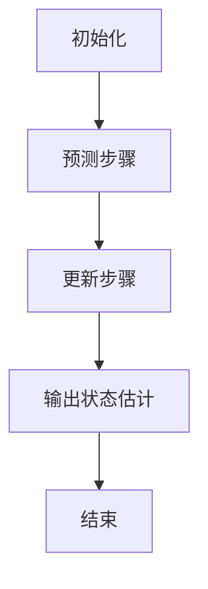

                 

## 引言

多传感器数据融合技术在人工智能（AI）领域中扮演着越来越重要的角色。AI Agent作为人工智能的执行者，其感知能力和决策能力的提升离不开对多源数据的融合处理。在现实生活中，AI Agent常常需要处理来自各种传感器（如摄像头、激光雷达、GPS等）的庞大数据流，如何有效融合这些数据，提高AI Agent的感知精度和决策效率，成为了当前研究的热点。

多传感器数据融合技术，顾名思义，就是将来自多个传感器的数据信息进行综合处理，以获得更准确、更全面的信息。其核心目标是通过优化数据融合算法，提升AI Agent的感知能力，从而在复杂的动态环境中做出更为准确的决策。

本文旨在系统地介绍多传感器数据融合技术在AI Agent中的应用，并深入探讨其设计、实现和优化方法。首先，我们将简要回顾传感器技术的历史发展和现状，接着讨论多传感器数据融合的基本原理，包括数据融合的数学模型和算法。随后，我们将分析数据融合系统架构设计的关键要素，探讨AI Agent如何利用数据融合技术提升其感知和决策能力。在此基础上，通过实际案例分析和最佳实践分享，我们将进一步阐述数据融合技术的应用效果和挑战。

本文的关键词包括：多传感器数据融合、AI Agent、传感器技术、数据融合算法、系统架构设计。通过本文的阅读，读者将能够深入了解多传感器数据融合技术的核心原理和应用方法，为实际项目开发提供有力的理论支持和实践指导。

### 背景介绍

#### 传感器技术概述

传感器技术作为信息获取的重要手段，经历了数十年的快速发展。传感器的基本概念是指能够感知外界环境或内部状态，并将感知信息转换为电信号或其他可处理形式的装置。根据工作原理，传感器可以分为物理传感器、化学传感器、生物传感器和光传感器等不同类型。例如，物理传感器中的压力传感器、温度传感器和湿度传感器，通过感知物理量的变化产生相应的电信号输出；化学传感器则利用化学反应来检测气体、液体或固体的成分变化；生物传感器则借助生物活性物质，如酶、细胞、抗体等，对特定的生物分子进行检测。

传感器技术的发展始于20世纪初期，随着电子技术和微电子技术的进步，传感器的性能得到了显著提升。特别是在微机电系统（MEMS）技术的发展下，传感器的体积不断缩小，成本逐步降低，其应用范围从传统的工业和医疗领域，逐渐扩展到汽车、航空航天、消费电子和智能家居等新兴领域。如今，传感器技术已经成为现代科技不可或缺的一部分，广泛应用于各种智能设备和系统中。

#### 多传感器数据融合的定义

多传感器数据融合是指通过综合来自多个传感器的信息，生成对环境或目标更准确、更全面的感知结果的技术。在多传感器数据融合过程中，不仅需要处理来自不同传感器的数据，还要解决传感器之间的同步、误差补偿、数据一致性和信息冗余等问题。多传感器数据融合的关键目标是通过优化信息融合算法，提升系统整体的感知精度和可靠性。

多传感器数据融合技术的发展可以追溯到20世纪60年代，随着军事和航空领域的需求增长，数据融合技术逐渐得到关注。早期的多传感器数据融合主要集中在雷达、声纳和红外等传感器的信息融合上。随着计算机技术和人工智能的发展，多传感器数据融合技术逐渐应用到更广泛的领域，如自动驾驶、无人机、智能家居和智能交通等。

#### 数据融合的重要性

数据融合技术在现代AI Agent中的作用不可或缺。首先，多传感器数据融合能够提高AI Agent的感知精度。不同传感器具有各自的优势和局限性，单一传感器往往无法提供全面的环境信息。通过多传感器数据融合，AI Agent可以获得更准确、更丰富的感知数据，从而提升其决策能力和响应速度。

其次，数据融合技术有助于解决传感器误差问题。实际应用中，传感器可能会受到环境噪声、测量误差等因素的影响，导致数据不准确。通过多传感器数据融合，可以有效地补偿和纠正这些误差，提高系统的可靠性。

此外，数据融合技术还能够增强AI Agent的鲁棒性。在复杂和动态的环境中，AI Agent需要能够适应各种变化和不确定性。通过多传感器数据融合，可以增强系统对环境变化的感知和适应能力，提高其在不同场景下的稳定性和可靠性。

最后，数据融合技术在提升AI Agent的智能化水平方面也具有重要意义。通过融合多源数据，AI Agent可以更加深入地理解和分析环境信息，从而实现更加智能化的行为和决策。

#### 多传感器数据融合的应用场景

多传感器数据融合技术在实际应用中具有广泛的应用场景，以下列举几个典型的应用领域：

1. **自动驾驶汽车**：自动驾驶汽车需要同时获取来自摄像头、激光雷达、雷达和GPS等多传感器的数据，通过数据融合技术，提高对道路和周围环境的感知能力，从而实现安全、可靠的自动驾驶。

2. **无人机**：无人机在执行任务时，常常需要通过多传感器（如摄像头、激光雷达、GPS等）获取环境信息。数据融合技术能够提升无人机的导航精度和任务执行能力。

3. **智能家居系统**：智能家居系统通过融合各种传感器数据，实现对家庭环境、家庭成员活动的实时监测和管理，提升居住舒适度和安全性。

4. **智能交通系统**：智能交通系统利用多传感器数据融合技术，实时监控道路状况，优化交通信号控制，提高交通流量和管理效率。

5. **机器人**：机器人通过融合多种传感器数据，实现对周围环境的精确感知和智能决策，从而提高机器人的任务执行能力和自主性。

总之，多传感器数据融合技术在现代智能系统中扮演着关键角色，其应用前景十分广阔。通过有效利用多传感器数据融合技术，可以显著提升系统的感知能力和决策水平，为人工智能的发展提供强有力的支持。

### 多传感器数据融合的挑战与机遇

#### 数据融合的挑战

多传感器数据融合技术在实际应用中面临诸多挑战。首先，数据同步问题是一个重要的难题。由于不同传感器的时间基准可能不一致，数据采集和传输过程中存在延迟，导致传感器数据之间存在时间偏差，这给数据融合带来了困难。为了解决这一问题，通常需要采用时间同步技术，如GPS同步、网络时间协议（NTP）等，以确保数据在时间轴上的一致性。

其次，传感器误差问题是另一个挑战。实际中的传感器可能受到测量误差、噪声干扰、环境影响等多种因素的影响，导致数据精度下降。这些误差如果得不到有效补偿，会严重影响数据融合的效果。为了应对这一问题，可以采用误差补偿和滤波算法，如卡尔曼滤波、粒子滤波等，来提高数据的精度和可靠性。

另外，数据融合算法的选择和优化也是一个关键问题。不同的应用场景和数据特性可能需要采用不同的融合算法，如贝叶斯滤波、模糊逻辑、神经网络等。如何选择合适的算法，并在特定场景下进行优化，以提高数据融合的效率和效果，是数据融合技术研究的一个重要方向。

#### 数据融合的机遇

尽管存在诸多挑战，但多传感器数据融合技术同样带来了丰富的机遇。首先，随着传感器技术的不断进步，传感器的种类和数量不断增加，这为数据融合技术提供了更多的数据来源。例如，随着5G和物联网技术的发展，更多类型的传感器将接入网络，为数据融合提供了更丰富的数据资源。

其次，人工智能和机器学习技术的发展为数据融合提供了强大的工具。通过利用深度学习、强化学习等算法，可以更好地处理和融合多源数据，实现更精准的感知和智能决策。例如，深度神经网络可以用于特征提取和分类，从而提高数据融合的效率和准确性。

此外，随着数据融合技术在各个领域的广泛应用，其应用场景也在不断扩展。例如，在自动驾驶领域，通过融合摄像头、激光雷达和GPS等多传感器数据，可以显著提升车辆的感知能力和安全性；在智能交通系统中，通过融合多种传感器数据，可以优化交通管理和信号控制，提高交通效率。

最后，多传感器数据融合技术为企业提供了新的商业模式和创新机会。通过数据融合技术，企业可以更全面地了解客户需求和市场动态，优化产品和服务设计，提升市场竞争力。例如，在零售业中，通过融合消费者的行为数据和商品库存数据，可以实现个性化推荐和精准营销。

总之，尽管多传感器数据融合技术面临诸多挑战，但同时也蕴含着巨大的机遇。通过不断创新和优化，数据融合技术将为人工智能的发展带来新的动力，推动各行各业向智能化、自动化方向迈进。

### 多传感器数据融合的基本概念

#### 数据融合的定义

数据融合是指通过将多个传感器或信息源的数据进行综合处理，以获得更准确、更全面的信息。其核心目标是利用不同传感器的互补优势，克服单一传感器在感知精度和可靠性方面的局限性，从而提升系统整体的感知能力和决策水平。数据融合不仅涉及数据的合并与处理，还包括传感器选择、数据预处理、信息级融合和决策级融合等多个环节。

在多传感器数据融合过程中，数据的完整性、一致性和实时性是关键要求。完整性要求融合后的数据应包含所有重要信息，无遗漏和缺失；一致性要求不同传感器之间的数据在时间、空间和量级上保持一致，以便有效融合；实时性则要求融合系统能够在短时间内处理大量数据，满足实时决策的需求。

#### 数据融合的类型

根据数据融合的处理层次，数据融合可以分为以下三种类型：

1. **信息级融合**：信息级融合是对原始数据进行直接处理，通常应用于高动态和复杂环境下的实时感知。这种融合方式直接将多个传感器的数据合并，通常不需要复杂的预处理步骤，适用于需要快速响应的应用场景。例如，在自动驾驶中，信息级融合可以实时合并摄像头、激光雷达和GPS的数据，用于路径规划和障碍物检测。

2. **特征级融合**：特征级融合是对预处理后的数据进行融合，通常应用于信息冗余较高和传感器性能稳定的场景。特征级融合首先对各个传感器的数据进行特征提取，然后对提取的特征进行综合分析。这种方法可以提高数据的利用率和融合精度，但需要较高的计算资源。例如，在无人机导航中，特征级融合可以综合处理摄像头和激光雷达提取的地标特征，以提高定位精度。

3. **决策级融合**：决策级融合是对不同传感器或信息源的处理结果进行融合，通常应用于需要综合评估和决策的场景。决策级融合通常在信息级和特征级融合的基础上进行，将多个传感器或信息源的处理结果进行综合分析，以生成最终的决策。例如，在智能交通系统中，决策级融合可以综合分析摄像头、雷达和流量监测数据，优化交通信号控制和路径规划。

#### 数据融合的关键技术

数据融合技术涉及多个方面，包括传感器选择、数据预处理、数据融合算法和融合系统架构设计等。

1. **传感器选择**：传感器选择是数据融合的基础，需要根据应用场景和需求选择合适的传感器类型和数量。传感器选择应考虑传感器的精度、可靠性、响应速度、成本等因素。例如，在自动驾驶中，摄像头、激光雷达和GPS是常用的传感器，每种传感器都有其独特的优势和应用场景。

2. **数据预处理**：数据预处理是数据融合的重要环节，包括数据清洗、去噪、时间同步和特征提取等。通过数据预处理，可以消除数据中的异常值和噪声，提高数据的准确性和一致性。例如，在无人机导航中，需要对摄像头和激光雷达的数据进行去噪和校正，以确保融合后的数据质量。

3. **数据融合算法**：数据融合算法是实现多传感器数据融合的核心，包括贝叶斯滤波、卡尔曼滤波、粒子滤波、模糊逻辑和神经网络等。这些算法可以根据不同的应用场景和需求，选择合适的融合策略和方法。例如，贝叶斯滤波适用于概率模型，卡尔曼滤波适用于线性系统，而粒子滤波适用于非线性系统。

4. **融合系统架构设计**：融合系统架构设计是数据融合技术的实现基础，包括硬件架构和软件架构。硬件架构涉及传感器模块、数据采集模块、处理模块和输出模块的设计；软件架构涉及数据融合算法的实现、系统功能模块的划分和系统交互逻辑的设计。合理的系统架构设计可以提高数据融合的效率和可靠性。

总之，多传感器数据融合技术通过综合不同传感器的数据，实现更准确、更全面的感知和决策。理解数据融合的基本概念、类型和关键技术，有助于在实际应用中有效地设计和实现数据融合系统。

### 多传感器数据融合的数学模型

多传感器数据融合的核心在于如何有效地处理和综合多个传感器的信息，以提升系统的整体感知精度和决策能力。在这一过程中，数学模型起到了至关重要的作用。以下是几种常见的数据融合数学模型，包括贝叶斯理论、卡尔曼滤波和粒子滤波，并简要介绍它们的基本原理。

#### 贝叶斯理论

贝叶斯理论是一种基于概率统计的方法，用于在不确定性环境中进行决策。在多传感器数据融合中，贝叶斯理论可以帮助我们通过更新概率分布来融合来自不同传感器的信息。

**基本原理：**
贝叶斯滤波公式为：
\[ P(\theta | X) = \frac{P(X | \theta)P(\theta)}{P(X)} \]
其中，\( P(\theta | X) \) 是后验概率，表示在观测到数据 \( X \) 后对状态 \( \theta \) 的概率估计；\( P(X | \theta) \) 是似然函数，表示在状态 \( \theta \) 下观测到数据 \( X \) 的概率；\( P(\theta) \) 是先验概率，表示在未观测到数据前对状态 \( \theta \) 的概率估计；\( P(X) \) 是证据，表示观测到数据 \( X \) 的总概率。

**适用场景：**
贝叶斯滤波适用于那些可以建模为概率分布的传感器数据和系统状态。例如，在移动机器人定位中，可以使用贝叶斯滤波融合来自摄像头和GPS的数据。

#### 卡尔曼滤波

卡尔曼滤波是一种线性系统的最优估计方法，它利用系统动态模型和观测数据，递归地估计系统状态。卡尔曼滤波适用于线性高斯噪声模型，即系统的状态转移和观测模型都是线性函数，且噪声服从高斯分布。

**基本原理：**
卡尔曼滤波包括预测和更新两个步骤：
1. **预测步骤**：
\[ \hat{x}_{k|k-1} = A \hat{x}_{k-1} + B u_k \]
\[ P_{k|k-1} = A P_{k-1} A^T + Q \]
其中，\( \hat{x}_{k|k-1} \) 是状态预测值；\( P_{k|k-1} \) 是预测误差协方差；\( A \) 是状态转移矩阵；\( B \) 是控制输入矩阵；\( u_k \) 是控制输入；\( Q \) 是过程噪声协方差。
2. **更新步骤**：
\[ K_k = P_{k|k-1} H_k^T (H_k P_{k|k-1} H_k^T + R)^{-1} \]
\[ \hat{x}_{k} = \hat{x}_{k|k-1} + K_k (z_k - H \hat{x}_{k|k-1}) \]
\[ P_{k} = (I - K_k H_k) P_{k|k-1} \]
其中，\( K_k \) 是卡尔曼增益；\( z_k \) 是观测值；\( H \) 是观测矩阵；\( R \) 是观测噪声协方差。

**适用场景：**
卡尔曼滤波广泛应用于机器人导航、姿态估计和信号处理等领域，适用于线性系统中的状态估计问题。

#### 粒子滤波

粒子滤波是一种非参数贝叶斯滤波方法，适用于非线性、非高斯噪声模型。粒子滤波通过随机采样生成一组代表状态概率分布的粒子，并通过重要性权重更新来融合观测数据。

**基本原理：**
1. **初始化**：
   粒子滤波开始时，随机初始化一组粒子，并赋予每个粒子相同的初始权重。
2. **预测步骤**：
   根据系统动态模型，对每个粒子进行状态预测，并计算预测误差。
3. **更新步骤**：
   根据观测数据，计算每个粒子的观测权重，通过重采样过程保持粒子集合的多样性和代表性。

**适用场景：**
粒子滤波适用于那些无法用线性高斯模型描述的复杂系统，如无人机导航、目标跟踪和机器人路径规划等。

#### 模型比较

- **贝叶斯滤波**：适用于概率模型，计算复杂度较低，但在处理非线性问题时有局限性。
- **卡尔曼滤波**：适用于线性高斯噪声模型，计算效率高，但需满足线性假设。
- **粒子滤波**：适用于非线性、非高斯噪声模型，灵活性高，但计算复杂度较高。

在实际应用中，根据具体问题和场景需求选择合适的数学模型，能够有效地提高多传感器数据融合的精度和效率。

### 多传感器数据融合算法

多传感器数据融合算法是数据融合技术的核心，它们通过特定的方法将多个传感器的数据信息进行有效整合，以提升系统的感知能力和决策准确性。以下介绍几种常见的数据融合算法，包括贝叶斯滤波、卡尔曼滤波和粒子滤波，并详细探讨其原理和应用。

#### 贝叶斯滤波

贝叶斯滤波是一种基于概率统计的方法，通过更新概率分布来融合多传感器信息。其基本原理可以概括为预测和更新两个步骤：

1. **预测步骤**：
   预测步骤用于根据系统状态转移模型和先验信息，预测下一时刻的状态。
   \[ \hat{x}_{k|k-1} = f(x_{k-1}, u_k) \]
   其中，\( \hat{x}_{k|k-1} \) 是预测状态，\( f \) 是状态转移函数，\( u_k \) 是控制输入。

2. **更新步骤**：
   更新步骤用于根据观测数据，更新状态概率分布。
   \[ P(x_k | z_k) \propto P(z_k | x_k) P(x_k) \]
   其中，\( P(x_k | z_k) \) 是后验概率，\( P(z_k | x_k) \) 是观测概率，\( P(x_k) \) 是先验概率。

**适用场景**：
贝叶斯滤波适用于不确定性和动态环境，如机器人导航和目标跟踪。其优点是无需假设系统的线性性和高斯性，但计算复杂度较高。

**Python代码示例**：

```python
import numpy as np

def predict(x_prev, u):
    # 状态转移模型
    return f(x_prev, u)

def update(posterior, observation, likelihood, prior):
    # 观测概率和先验概率
    posterior = posterior * likelihood / prior
    return posterior / np.sum(posterior)

# 初始化参数
x_prev = np.array([0, 0])
prior = np.array([1/100, 1/100])
observation = np.array([1, 0])
likelihood = np.array([1/10, 1/10])

# 预测
x_pred = predict(x_prev, u)

# 更新
posterior = update(posterior, observation, likelihood, prior)
```

#### 卡尔曼滤波

卡尔曼滤波是一种线性系统的最优估计方法，适用于线性高斯噪声模型。其核心思想是通过状态预测和观测更新，递归地估计系统状态。

1. **预测步骤**：
   \[ \hat{x}_{k|k-1} = A \hat{x}_{k-1} + B u_k \]
   \[ P_{k|k-1} = A P_{k-1} A^T + Q \]

2. **更新步骤**：
   \[ K_k = P_{k|k-1} H_k^T (H_k P_{k|k-1} H_k^T + R)^{-1} \]
   \[ \hat{x}_{k} = \hat{x}_{k|k-1} + K_k (z_k - H \hat{x}_{k|k-1}) \]
   \[ P_{k} = (I - K_k H_k) P_{k|k-1} \]

**适用场景**：
卡尔曼滤波广泛应用于机器人导航、姿态估计和信号处理等领域，适用于线性系统中的状态估计问题。

**Python代码示例**：

```python
import numpy as np

# 参数初始化
A = np.array([[1, 1], [0, 1]])
B = np.array([[1], [0]])
H = np.array([[1, 0]])
Q = np.array([[1, 0], [0, 1]])
R = np.array([[1, 0], [0, 1]])

# 初始状态
x_0 = np.array([[0], [0]])
P_0 = np.array([[1, 0], [0, 1]])

# 预测
x_pred = A @ x_0 + B @ u
P_pred = A @ P_0 @ A.T + Q

# 更新
K = P_pred @ H.T @ (H @ P_pred @ H.T + R).I
x_update = x_pred + K @ (z - H @ x_pred)
P_update = (I - K @ H) @ P_pred

# 输出
x_k = x_update
P_k = P_update
```

#### 粒子滤波

粒子滤波是一种非参数贝叶斯滤波方法，适用于非线性、非高斯噪声模型。其核心思想是通过重要性权重采样，生成一组代表状态概率分布的粒子。

1. **初始化**：
   初始化一组粒子，并赋予每个粒子相同的初始权重。

2. **预测步骤**：
   根据系统动态模型，对每个粒子进行状态预测，并计算预测误差。

3. **更新步骤**：
   根据观测数据，计算每个粒子的观测权重，并通过重采样过程保持粒子集合的多样性和代表性。

**适用场景**：
粒子滤波适用于复杂系统，如无人机导航、目标跟踪和机器人路径规划。

**Python代码示例**：

```python
import numpy as np

# 初始化参数
num_particles = 100
weights = np.ones(num_particles) / num_particles
mean = np.array([0, 0])

# 预测
predicted_states = predict_states(mean, u)
weights_pred = update_weights(predicted_states, z)

# 重采样
weights_pred = (weights_pred / np.max(weights_pred))
c = np.cumsum(weights_pred)
l = np.random.rand()
index = np.where(c >= l)[0][0]
resampled_particles = resample_particles(particles, index)

# 输出
mean = np.mean(resampled_particles, axis=0)
weights = weights_pred
```

通过这些算法的介绍和示例，可以看出多传感器数据融合算法在提升系统感知能力和决策准确性方面的重要作用。在实际应用中，根据具体问题和场景需求，选择合适的算法并进行优化，能够显著提高系统的性能和可靠性。

### 数据融合算法的性能比较

在多传感器数据融合领域，选择合适的算法对系统的性能和效率至关重要。以下是几种常见的数据融合算法——贝叶斯滤波、卡尔曼滤波和粒子滤波——在性能方面的详细比较。

#### 计算复杂度

**贝叶斯滤波**：贝叶斯滤波的计算复杂度相对较低，适用于传感器数量较少和状态空间较小的场景。在每次迭代中，贝叶斯滤波主要涉及概率分布的乘法和除法操作，因此其计算量较小。然而，当状态空间较大时，计算复杂度会显著增加，导致运算时间过长。

**卡尔曼滤波**：卡尔曼滤波的计算复杂度相对中等，适用于线性高斯噪声模型。卡尔曼滤波的预测和更新步骤涉及到矩阵运算，如矩阵乘法和矩阵求逆。尽管这些运算相对复杂，但由于卡尔曼滤波的线性假设，其计算复杂度相对较低，适用于大多数中等规模的应用场景。

**粒子滤波**：粒子滤波的计算复杂度最高，尤其适用于非线性、非高斯噪声模型。粒子滤波通过大量粒子的随机采样和权重更新来逼近状态概率分布，因此计算量非常大。尽管粒子滤波在处理复杂系统时具有很高的灵活性，但其高计算复杂度可能限制了其在实时应用中的使用。

#### 适应范围

**贝叶斯滤波**：贝叶斯滤波适用于那些可以建模为概率分布的传感器数据和系统状态。它无需线性假设，因此在处理非线性系统时具有较好的适应性。然而，贝叶斯滤波在处理高维状态空间时可能存在计算复杂度问题。

**卡尔曼滤波**：卡尔曼滤波适用于线性高斯噪声模型。由于其线性假设，卡尔曼滤波在处理非线性系统时存在局限性。但在许多实际应用中，如机器人导航和姿态估计，线性模型已经能够提供较好的效果。

**粒子滤波**：粒子滤波适用于非线性、非高斯噪声模型。其非参数特性使其在处理复杂系统时具有很高的灵活性。粒子滤波能够有效地处理高维状态空间和非线性关系，因此在复杂的动态环境中表现出色。

#### 精度和可靠性

**贝叶斯滤波**：贝叶斯滤波具有较高的精度和可靠性，能够处理不确定性环境。其基于概率统计的方法，通过不断更新状态概率分布，可以有效地处理传感器误差和不确定性。然而，贝叶斯滤波在处理高维状态空间时可能存在精度下降的问题。

**卡尔曼滤波**：卡尔曼滤波在处理线性高斯噪声模型时具有很高的精度和可靠性。其递归计算方式使其能够在每次迭代中精确地估计系统状态。然而，卡尔曼滤波在处理非线性系统和非高斯噪声时可能存在局限性。

**粒子滤波**：粒子滤波通过大量的粒子采样和权重更新，能够有效地处理非线性系统和非高斯噪声。其高精度和高可靠性使其在复杂的动态环境中表现出色。然而，粒子滤波的计算复杂度较高，可能影响其实时性。

#### 实际应用

**贝叶斯滤波**：贝叶斯滤波常用于机器人导航、目标跟踪和传感器数据融合等场景。其简单的实现和较高的精度使其成为许多实际应用中的首选方法。

**卡尔曼滤波**：卡尔曼滤波广泛应用于机器人导航、姿态估计和信号处理等领域。其高效的计算和较低的复杂度使其在许多线性系统中成为经典算法。

**粒子滤波**：粒子滤波在无人机导航、目标跟踪和机器人路径规划等复杂动态环境中表现出色。其灵活性和高精度使其在处理复杂系统时具有独特的优势。

综上所述，不同数据融合算法在计算复杂度、适应范围、精度和可靠性方面各有优劣。在实际应用中，应根据具体问题和场景需求，选择合适的算法，并在必要时进行优化和调整，以实现最佳性能。

### 数据融合系统架构设计概述

#### 数据融合系统的基本组成部分

数据融合系统是由多个模块和组件构成的复杂系统，其设计和实现需要综合考虑硬件、软件和数据处理等多个方面。以下是数据融合系统的基本组成部分：

1. **传感器模块**：传感器模块负责收集来自不同类型传感器的数据，如摄像头、激光雷达、GPS、超声波传感器等。每个传感器都有其特定的功能和特性，通过这些传感器可以获取关于环境或目标的多维度信息。

2. **数据采集模块**：数据采集模块主要负责从传感器接收数据，并进行初步处理，如滤波、去噪和同步等。这一模块确保传感器数据在时间轴和空间上的协调一致，为后续的数据处理提供基础。

3. **预处理模块**：预处理模块对采集到的原始数据进行处理，包括数据清洗、数据标准化和特征提取等。预处理模块的目的是提高数据的质量，去除噪声和异常值，提取有用的信息。

4. **融合算法模块**：融合算法模块是实现数据融合的核心部分，包含各种数据融合算法，如贝叶斯滤波、卡尔曼滤波、粒子滤波等。这些算法负责对预处理后的数据进行综合处理，生成对环境或目标的统一感知结果。

5. **决策模块**：决策模块根据融合后的数据生成决策或控制指令。该模块通常包含一个或多个决策模型，如分类器、规划器或控制器，用于对融合数据进行解释和响应。

6. **输出模块**：输出模块将决策模块生成的结果输出到目标设备或系统，如自动驾驶车辆的路径规划、无人机导航或智能交通信号控制等。输出模块确保融合系统的最终输出能够对实际应用场景产生有效的影响。

#### 数据融合系统的工作流程

数据融合系统的工作流程可以分为以下几个主要步骤：

1. **数据采集**：传感器模块通过摄像头、激光雷达、GPS等设备采集环境或目标的数据，并将这些数据传输到数据采集模块。

2. **数据预处理**：数据采集模块对接收到的原始数据进行预处理，包括数据清洗、去噪和同步等操作。预处理模块将确保数据的质量和一致性，为后续的数据融合提供可靠的基础。

3. **数据融合**：预处理后的数据被发送到融合算法模块，不同算法根据具体的任务需求对数据进行综合处理。融合算法模块可以采用贝叶斯滤波、卡尔曼滤波或粒子滤波等方法，生成对环境或目标的统一感知结果。

4. **决策生成**：决策模块根据融合后的数据生成决策或控制指令。决策模块通常包含一个或多个决策模型，如分类器、规划器或控制器，用于对融合数据进行解释和响应。

5. **输出结果**：输出模块将决策模块生成的结果输出到目标设备或系统，如自动驾驶车辆的路径规划、无人机导航或智能交通信号控制等。输出模块确保融合系统的最终输出能够对实际应用场景产生有效的影响。

#### 数据融合系统设计原则

数据融合系统的设计需要遵循以下原则：

1. **模块化设计**：数据融合系统应采用模块化设计，将不同的功能模块独立实现，以便于系统的维护和扩展。模块化设计可以提高系统的灵活性和可复用性。

2. **可扩展性**：系统设计应考虑未来可能的需求变化，确保系统能够轻松扩展新的传感器和算法。这包括传感器接口的标准化、算法库的扩展性和系统架构的可扩展性。

3. **高可靠性**：数据融合系统需要在各种复杂和动态的环境中保持稳定运行，因此系统设计应考虑故障处理、数据冗余和容错机制，确保系统的可靠性。

4. **实时性**：数据融合系统应能够在短时间内处理大量数据，满足实时决策的需求。这需要系统设计充分考虑数据处理速度和算法优化。

5. **可维护性**：系统设计应确保代码的可读性和可维护性，便于后续的维护和升级。良好的文档和代码注释可以提高系统的可维护性。

6. **安全性**：数据融合系统需要处理敏感数据，因此系统设计应考虑数据安全和隐私保护，确保系统的安全性。

通过遵循上述设计原则，可以构建一个高效、可靠和可扩展的数据融合系统，为AI Agent提供强大的感知和决策支持。

### 数据融合系统功能设计

数据融合系统的功能设计是确保系统能够有效整合多源数据、生成准确的环境感知和智能决策的关键步骤。以下从数据采集与预处理、数据融合算法实现和数据输出与反馈三个方面详细阐述数据融合系统的功能设计。

#### 数据采集与预处理

数据采集与预处理是数据融合系统的第一步，也是至关重要的一步。其目的是确保传感器数据在时间轴和空间上的同步一致，并为后续的数据融合算法提供高质量的数据输入。

1. **数据采集**：
   数据采集模块负责从各种传感器（如摄像头、激光雷达、GPS等）收集数据。这些传感器各自具有不同的数据采集速率、精度和分辨率。为了确保数据的同步，数据采集模块需要实现多传感器数据的时间同步。常见的时间同步方法包括GPS同步和网络时间协议（NTP）同步。通过时间同步，可以确保不同传感器的数据在时间轴上对齐，从而为后续的数据融合提供统一的时间基准。

2. **数据预处理**：
   数据预处理模块负责对采集到的原始数据进行处理，以提高数据的质量和一致性。主要任务包括：
   - **数据清洗**：去除数据中的异常值和噪声。异常值可能由传感器故障或外部环境干扰引起，需要通过统计方法或机器学习算法检测和去除。
   - **数据标准化**：将不同传感器和不同时间点的数据统一到相同的尺度，如将所有传感器的数据转换为米或像素为单位。数据标准化有助于后续的算法处理和数据融合。
   - **特征提取**：从原始数据中提取有用的特征信息，如图像中的边缘、角点、颜色直方图等，或从激光雷达数据中提取的地标点、障碍物等。特征提取可以降低数据维度，提高数据融合的效率和准确性。

通过数据采集与预处理，系统可以确保输入到融合算法的数据是高质量的、一致的，从而为后续的数据融合和决策提供坚实的基础。

#### 数据融合算法实现

数据融合算法是实现数据融合核心功能的关键环节，其目的是通过综合不同传感器的信息，生成对环境或目标更准确、更全面的感知结果。

1. **算法选择**：
   根据应用场景和数据特性，选择合适的融合算法。常见的融合算法包括：
   - **贝叶斯滤波**：适用于概率模型，能够通过更新概率分布来融合多传感器信息。
   - **卡尔曼滤波**：适用于线性高斯噪声模型，通过递归地估计系统状态来融合数据。
   - **粒子滤波**：适用于非线性、非高斯噪声模型，通过随机采样和权重更新来逼近状态概率分布。

2. **算法实现**：
   数据融合算法的具体实现包括以下步骤：
   - **状态预测**：根据系统模型预测下一时刻的状态。
   - **观测更新**：根据实际观测数据更新状态估计。
   - **权重计算**：计算每个传感器的数据在融合结果中的权重，通常基于传感器的精度、可靠性和重要性。

3. **算法优化**：
   算法优化是提高数据融合系统性能的重要手段，包括：
   - **算法参数调整**：根据具体应用场景调整算法的参数，如卡尔曼增益、粒子数量等。
   - **算法融合**：结合多种算法的优势，构建混合融合算法，以应对复杂的应用场景。

通过数据融合算法实现，系统可以生成对环境或目标更准确、更全面的感知结果，为智能决策提供可靠的数据支持。

#### 数据输出与反馈

数据输出与反馈是数据融合系统的最终环节，其目的是将融合结果应用到实际系统中，并收集反馈信息以不断优化系统性能。

1. **数据输出**：
   融合后的数据被传输到决策模块，用于生成控制指令或决策结果。例如，在自动驾驶系统中，融合后的环境数据可以用于生成路径规划或障碍物规避指令；在无人机导航中，融合后的数据可以用于目标跟踪或避障。

2. **反馈机制**：
   反馈机制用于收集系统输出的实际效果，并用于优化系统性能。具体方法包括：
   - **闭环控制**：通过实际输出的反馈，调整系统的控制参数或算法参数，以实现更准确的决策和更高效的数据融合。
   - **错误检测与纠正**：通过比较实际输出和预期输出，检测和纠正系统的误差，以提高系统的鲁棒性和准确性。
   - **学习与适应**：利用机器学习算法，从历史数据中学习系统行为模式，并在新的数据输入时进行自适应调整。

通过数据输出与反馈机制，系统可以实现闭环控制和自我优化，不断提高其性能和适应能力。

总之，数据融合系统的功能设计需要综合考虑数据采集与预处理、数据融合算法实现和数据输出与反馈等多个方面，确保系统能够有效整合多源数据，生成准确的环境感知和智能决策结果。通过不断优化和改进，数据融合系统将在各种智能应用中发挥越来越重要的作用。

### 数据融合系统架构设计与实现

#### 数据融合系统硬件设计

数据融合系统的硬件设计是系统高效运行的基础，它涉及传感器选择、数据采集模块和计算平台的配置。以下是数据融合系统硬件设计的具体步骤：

1. **传感器选择**：
   根据应用场景的需求，选择合适的传感器。常见的传感器包括摄像头、激光雷达、GPS、超声波传感器等。每个传感器都有其独特的性能指标，如分辨率、响应速度、精度和功耗等。例如，在自动驾驶系统中，摄像头用于感知道路和交通状况，激光雷达用于测量距离和障碍物检测，GPS用于车辆定位。

2. **数据采集模块**：
   数据采集模块负责将传感器数据传输到中央处理单元。由于传感器数据可能来自不同的来源，数据采集模块需要具备高速数据传输能力和实时处理能力。常见的数据采集模块包括嵌入式计算机、FPGA（现场可编程门阵列）和ADC（模数转换器）等。数据采集模块的主要任务是进行时间同步、去噪和初步的数据预处理。

3. **计算平台**：
   计算平台是数据融合的核心，它负责执行复杂的融合算法和处理大量数据。高性能的CPU、GPU或FPGA可以显著提高数据融合的效率和准确性。例如，在自动驾驶中，计算平台需要处理来自多个传感器的实时数据，并在毫秒级内生成决策结果。因此，计算平台的选择应考虑其处理速度、功耗和扩展性。

#### 数据融合系统软件设计

数据融合系统的软件设计是实现数据融合算法和功能的关键步骤，它涉及算法开发、系统架构设计和接口设计。以下是数据融合系统软件设计的具体步骤：

1. **算法开发**：
   根据应用场景和传感器数据特性，选择并实现合适的数据融合算法。常见的算法包括卡尔曼滤波、粒子滤波、贝叶斯滤波等。算法的实现需要考虑实时性和计算效率，例如，可以通过并行计算和优化算法结构来提高处理速度。

2. **系统架构设计**：
   数据融合系统的架构设计应考虑模块化、可扩展性和高可靠性。常见的架构设计包括分布式架构和集中式架构。分布式架构可以将数据融合任务分配到多个计算节点上，提高系统的并行处理能力；集中式架构则将所有数据处理任务集中在单个计算平台上，简化系统设计和实现。

3. **接口设计**：
   数据融合系统需要与其他系统或设备进行交互，因此接口设计至关重要。接口设计包括传感器接口、数据传输接口和用户接口等。传感器接口负责与各种传感器进行通信，数据传输接口负责高速传输和处理大量数据，用户接口则提供用户操作和监控系统状态的界面。

#### 数据融合系统测试与优化

数据融合系统的测试与优化是确保系统性能和可靠性的重要环节。以下是数据融合系统测试与优化的具体步骤：

1. **功能测试**：
   功能测试旨在验证系统各功能模块的正确性和完整性。包括传感器数据采集测试、数据预处理测试、算法实现测试和输出结果测试等。功能测试可以通过自动化测试工具进行，以确保每个模块都能按照预期工作。

2. **性能测试**：
   性能测试用于评估系统的处理速度、响应时间和资源利用率。通过模拟实际应用场景，测试系统在不同负载下的性能表现，例如，通过模拟大量传感器数据的实时处理，评估系统的处理能力和稳定性。

3. **可靠性测试**：
   可靠性测试旨在评估系统在长期运行中的稳定性和鲁棒性。包括高温、高压、振动等极端环境下的运行测试，以及长时间连续运行的测试。通过这些测试，可以识别和修复系统的潜在问题，确保系统在复杂和动态环境下稳定运行。

4. **优化策略**：
   根据测试结果，对系统进行优化。优化策略包括算法优化、硬件升级、系统架构调整和接口改进等。例如，通过优化算法结构或使用更高效的硬件设备，可以提高系统的处理速度和性能。

通过系统的测试与优化，可以确保数据融合系统在实际应用中的高效、稳定和可靠运行，为AI Agent提供强大的感知和决策支持。

### AI Agent的基本概念与结构

#### AI Agent的定义

AI Agent，即人工智能代理，是一种自主执行任务的实体，能够在动态和不确定的环境中根据感知到的信息进行决策和行动。AI Agent的概念源自人工智能领域，旨在模拟人类智能，使其具备自主性和智能行为。AI Agent通常由感知器、控制器和执行器三个主要部分组成。

1. **感知器**：感知器是AI Agent的感官部分，用于收集外部环境的信息。这些信息可以来自于各种传感器，如摄像头、激光雷达、GPS等。感知器收集到的数据用于生成AI Agent的感知环境。

2. **控制器**：控制器是AI Agent的决策部分，负责分析感知器收集到的数据，并根据预设的规则或学习到的策略生成行动指令。控制器通过融合和处理多源感知数据，为AI Agent提供智能决策支持。

3. **执行器**：执行器是AI Agent的执行部分，负责执行控制器生成的行动指令。执行器可以包括机械臂、电机、舵机等，用于实现AI Agent的实际行为。通过执行器，AI Agent能够对外部环境产生影响和互动。

#### AI Agent的基本结构

AI Agent的基本结构可以分为以下几个关键组件：

1. **感知模块**：感知模块负责从外部环境中收集数据，如视觉、听觉、触觉等信息。不同的AI Agent会根据其应用场景选择不同的感知器。例如，视觉AI Agent可能会使用摄像头作为主要感知器，而语音AI Agent可能会使用麦克风。

2. **数据处理模块**：数据处理模块负责对感知模块收集到的数据进行预处理和特征提取。预处理包括去噪、滤波、同步等操作，特征提取则是从原始数据中提取有用的信息，如图像中的边缘、纹理、声音中的频率等。

3. **决策模块**：决策模块是AI Agent的核心，负责分析处理后的感知数据，并根据预设的规则或学习到的策略生成决策。决策模块通常包含一个或多个决策算法，如逻辑推理、决策树、深度学习等。通过这些算法，AI Agent能够在复杂环境中做出智能决策。

4. **执行模块**：执行模块负责将决策模块生成的行动指令转化为实际操作。执行模块可以包括机械臂、机器人、无人机等，这些设备根据指令执行具体的动作。执行模块的响应速度和执行精度直接影响AI Agent的行为效果。

#### AI Agent的功能与应用场景

AI Agent具有广泛的应用场景，以下列举几个典型应用：

1. **自动驾驶**：自动驾驶车辆中的AI Agent利用多传感器数据，如摄像头、激光雷达和GPS，进行环境感知和路径规划，从而实现自主驾驶。

2. **无人机**：无人机中的AI Agent通过融合摄像头、激光雷达和GPS数据，实现自主飞行、目标跟踪和避障等功能。

3. **机器人**：机器人中的AI Agent可以应用于工业制造、服务、救援等多个领域，通过感知环境和执行任务，提高工作效率和安全性。

4. **智能家居**：智能家居系统中的AI Agent通过融合各种传感器数据，实现对家庭环境的智能监控和自动化管理，提升居住舒适度和安全性。

5. **智能交通**：智能交通系统中的AI Agent通过融合交通监控数据、车辆传感器和路况信息，优化交通信号控制和路径规划，提高交通效率和安全性。

总之，AI Agent作为人工智能领域的重要应用，通过感知、决策和执行，实现自主行为，为各行业提供智能化解决方案。

### 多传感器数据融合在AI Agent中的应用

#### 多传感器数据融合对AI Agent的影响

多传感器数据融合在AI Agent中的作用至关重要，其直接影响AI Agent的感知能力和决策水平。通过融合来自多个传感器的数据，AI Agent能够获得更准确、更全面的环境信息，从而在复杂和动态的环境中做出更为智能和可靠的决策。

1. **提升感知精度**：不同传感器具有不同的感知特性和局限性。例如，摄像头适合捕捉图像信息，但难以感知深度信息；激光雷达可以测量距离和三维信息，但难以识别物体细节。通过数据融合，AI Agent可以综合利用不同传感器的优势，提高感知精度。例如，在自动驾驶中，摄像头可以捕捉道路标志和交通信号，激光雷达可以测量周围障碍物的距离和形状，两者融合后的数据使得AI Agent能够更准确地识别道路和障碍物。

2. **增强环境理解**：AI Agent通过融合多源数据，可以更全面地理解复杂环境。例如，在无人机任务中，融合摄像头、激光雷达和GPS数据，可以实现对目标区域的全方位感知，提高无人机在复杂地形中的导航和任务执行能力。

3. **提高决策可靠性**：多传感器数据融合有助于减少单个传感器带来的误差和不准确性，从而提高决策的可靠性。通过融合不同传感器的数据，AI Agent可以综合分析多种信息，降低误判和漏判的风险。例如，在机器人导航中，融合摄像头和激光雷达数据可以显著提高路径规划的准确性和稳定性。

#### 多传感器数据融合在AI Agent中的应用案例

以下介绍几个典型的多传感器数据融合在AI Agent中的应用案例，分析其具体应用场景、工作原理和效果。

1. **自动驾驶汽车**：
   - **应用场景**：自动驾驶汽车需要在复杂的交通环境中自主行驶，包括识别道路标志、车辆和行人等。
   - **工作原理**：自动驾驶汽车通常融合摄像头、激光雷达、GPS和超声波传感器等多传感器数据。摄像头用于识别道路标志和交通信号，激光雷达用于测量周围障碍物的距离和形状，GPS用于定位和导航，超声波传感器用于检测前方和侧方的障碍物。通过多传感器数据融合，自动驾驶汽车可以更准确地感知周围环境，实现自主驾驶。
   - **效果**：多传感器数据融合显著提高了自动驾驶汽车的感知精度和决策可靠性，使其能够在复杂的交通环境中安全行驶。

2. **无人机**：
   - **应用场景**：无人机在搜索与救援、农业监测、环境监测和安防巡逻等领域具有广泛应用。
   - **工作原理**：无人机通过融合摄像头、激光雷达、GPS和IMU（惯性测量单元）等多传感器数据，实现自主飞行、目标跟踪和地形识别。摄像头用于拍摄图像和视频，激光雷达用于测量地形和障碍物，GPS用于导航，IMU用于姿态感知和飞行控制。多传感器数据融合使得无人机能够在复杂地形中准确导航和执行任务。
   - **效果**：多传感器数据融合提高了无人机的导航精度和任务执行能力，使其在各种应用场景中表现出色。

3. **机器人**：
   - **应用场景**：机器人广泛应用于工业制造、服务、救援和医疗等领域。
   - **工作原理**：机器人通过融合摄像头、激光雷达、超声波传感器和触觉传感器等多传感器数据，实现自主导航、路径规划和环境交互。摄像头用于识别周围环境和障碍物，激光雷达用于测量距离和三维信息，超声波传感器用于检测物体的距离，触觉传感器用于感知接触物体的特性。多传感器数据融合使得机器人能够在复杂环境中自主行动，执行特定任务。
   - **效果**：多传感器数据融合显著提高了机器人的感知精度和任务执行能力，使其在各种应用场景中表现出色。

通过上述案例可以看出，多传感器数据融合在AI Agent中的应用不仅提高了感知精度和决策可靠性，还拓展了AI Agent的应用场景，为各行业提供了智能化解决方案。未来，随着传感器技术的不断进步和算法的优化，多传感器数据融合在AI Agent中的应用将更加广泛和深入。

### 多传感器数据融合与AI Agent的协同优化

#### 多传感器数据融合与AI Agent协同优化目标

多传感器数据融合与AI Agent的协同优化旨在提高系统的整体性能，实现更高效、更准确和更可靠的智能决策。其协同优化目标主要包括以下几个方面：

1. **提高感知精度**：通过融合来自多个传感器的数据，提升AI Agent对环境的感知精度，使其能够更准确地识别和理解周围环境。

2. **增强决策能力**：优化多传感器数据融合算法，提升AI Agent的决策能力，使其在复杂和动态环境中能够做出更明智的决策。

3. **降低计算复杂度**：在保证系统性能的前提下，优化算法和系统架构，降低计算复杂度，提高系统的实时性和响应速度。

4. **提高鲁棒性**：通过多传感器数据融合，降低传感器误差和噪声的影响，提高系统的鲁棒性和稳定性。

5. **降低成本**：在满足性能要求的前提下，优化传感器和计算资源的配置，降低系统的总体成本。

#### 多传感器数据融合与AI Agent协同优化策略

为了实现上述优化目标，需要采用一系列协同优化策略，包括算法优化、硬件选择和系统架构设计等。以下是具体的协同优化策略：

1. **算法优化**：
   - **算法融合**：结合多种数据融合算法的优势，构建混合融合算法。例如，可以将卡尔曼滤波和粒子滤波结合，发挥两者的优点，提高数据融合的效率和准确性。
   - **参数调整**：根据具体应用场景和传感器特性，调整算法参数，如卡尔曼增益、粒子数量等，以实现最优性能。
   - **在线学习**：利用机器学习和深度学习技术，使AI Agent能够在运行过程中不断学习和优化数据融合算法，提高系统的自适应性和鲁棒性。

2. **硬件选择**：
   - **高性能计算平台**：选择具备高计算能力和低功耗的硬件平台，如高性能CPU、GPU或FPGA，以提高数据融合的效率和实时性。
   - **多功能传感器**：选择具备多种感知功能的传感器，以充分利用传感器数据，提高系统的整体感知能力。
   - **低成本传感器**：在满足性能要求的前提下，选择成本较低的传感器，降低系统总体成本。

3. **系统架构设计**：
   - **分布式架构**：采用分布式架构，将数据融合和决策任务分布在多个计算节点上，提高系统的并行处理能力和可扩展性。
   - **模块化设计**：采用模块化设计，将系统功能模块化，便于系统的维护和升级，提高系统的可扩展性和灵活性。
   - **高可靠性设计**：在系统架构中引入冗余设计和容错机制，提高系统的鲁棒性和稳定性。

#### 多传感器数据融合与AI Agent协同优化案例分析

以下通过一个具体案例，展示多传感器数据融合与AI Agent协同优化策略的应用。

**案例：智能交通系统中的多传感器数据融合**

**应用场景**：智能交通系统通过融合摄像头、激光雷达和GPS等多传感器数据，实现对交通状况的实时监控和管理。

**协同优化策略**：

1. **算法优化**：
   - **算法融合**：结合卡尔曼滤波和粒子滤波，构建混合融合算法。卡尔曼滤波用于处理线性高斯噪声模型，粒子滤波用于处理非线性非高斯噪声模型。
   - **参数调整**：根据不同交通状况和传感器特性，动态调整卡尔曼增益和粒子数量，实现最优性能。

2. **硬件选择**：
   - **高性能计算平台**：选择高性能GPU，提高数据融合和处理速度。
   - **多功能传感器**：选择具备图像识别、距离测量和定位功能的传感器，提高系统的感知能力。

3. **系统架构设计**：
   - **分布式架构**：将数据融合和决策任务分布在多个计算节点上，提高系统的并行处理能力。
   - **模块化设计**：将感知模块、数据处理模块和决策模块进行模块化设计，便于系统的维护和升级。

**效果评估**：

- **感知精度提升**：通过多传感器数据融合，智能交通系统能够更准确地识别道路标志、车辆和行人，感知精度显著提高。
- **决策能力增强**：优化后的算法提高了智能交通系统在复杂交通状况下的决策能力，例如，在高峰时段能够更准确地预测交通流量，优化信号灯控制策略。
- **计算复杂度降低**：分布式架构和模块化设计降低了系统的计算复杂度，提高了系统的实时性和响应速度。
- **鲁棒性和稳定性提高**：通过冗余设计和容错机制，智能交通系统的鲁棒性和稳定性显著提高。

综上所述，通过多传感器数据融合与AI Agent的协同优化，可以有效提升智能交通系统的性能，为城市交通管理提供智能化解决方案。

### 实际案例分析

#### 案例一：智能交通系统的多传感器数据融合

**背景**：
智能交通系统（Intelligent Transportation System, ITS）旨在通过信息通信技术和电子技术提高交通管理的效率、安全性和便捷性。在智能交通系统中，多传感器数据融合技术起到了关键作用，通过融合摄像头、激光雷达和GPS等多传感器数据，实现交通流量监测、信号控制和事故预警等功能。

**概述**：
本案例探讨的是一个基于多传感器数据融合的智能交通系统，该系统部署在城市主要交通干道和交叉路口，通过实时监测交通状况，优化交通信号控制和提高交通安全。

**实施过程**：

1. **传感器部署**：
   在城市主要交通干道和交叉路口部署摄像头、激光雷达和GPS传感器。摄像头用于监测车辆和行人的动态信息，激光雷达用于测量车辆之间的距离和速度，GPS用于车辆定位和交通流量分析。

2. **数据采集与预处理**：
   数据采集模块负责从各个传感器收集数据，并进行初步处理，包括去噪、同步和标准化等操作。预处理后的数据被传输到数据融合模块。

3. **数据融合**：
   数据融合模块采用卡尔曼滤波和粒子滤波相结合的混合融合算法，通过融合摄像头、激光雷达和GPS数据，生成对交通状况的全面感知。卡尔曼滤波用于处理线性高斯噪声模型，粒子滤波用于处理非线性非高斯噪声模型。

4. **决策生成**：
   决策模块根据融合后的数据生成交通信号控制和事故预警策略。例如，通过分析交通流量数据，自动调整交通信号灯的时长和相位，优化交通流量。

5. **结果输出与反馈**：
   生成的决策结果通过信号控制器输出到交通信号灯和事故预警系统。系统还通过收集实际效果反馈，对决策算法进行持续优化。

**结果与分析**：

1. **感知精度提升**：
   通过多传感器数据融合，系统能够更准确地识别交通流量、车辆速度和行人行为。例如，摄像头可以识别交通信号灯的状态，激光雷达可以测量车辆之间的距离，GPS可以定位车辆的位置。这些信息的融合显著提高了系统的感知精度。

2. **决策效率提高**：
   数据融合技术使得系统能够更快速地生成决策，优化交通信号控制和事故预警。例如，在高峰时段，系统能够实时监测交通流量变化，快速调整信号灯时长和相位，减少交通拥堵和等待时间。

3. **事故预警准确率提高**：
   通过多传感器数据融合，系统可以提前检测到交通事故的潜在风险。例如，当摄像头检测到前方车辆突然停止或变道时，系统能够通过激光雷达和GPS数据验证车辆的实时位置和速度，及时发出预警，避免交通事故的发生。

4. **系统稳定性增强**：
   通过冗余设计和容错机制，系统在传感器故障或数据异常时能够保持稳定运行。例如，当某个摄像头出现故障时，系统可以通过其他传感器的数据继续进行交通监测。

综上所述，智能交通系统中的多传感器数据融合技术显著提升了系统的感知精度、决策效率和稳定性，为城市交通管理提供了智能化解决方案。

#### 案例二：无人机航拍数据的多传感器融合

**背景**：
无人机航拍技术广泛应用于地图制作、环境监测、搜救任务和灾害评估等领域。无人机航拍数据的多传感器融合能够提升图像质量和任务执行效果，为无人机在复杂环境中的操作提供更强支持。

**概述**：
本案例探讨的是一种基于多传感器融合的无人机航拍系统，通过融合摄像头、激光雷达和GPS等多传感器数据，提高无人机在航拍任务中的精度和稳定性。

**实施过程**：

1. **传感器部署**：
   在无人机上部署摄像头、激光雷达和GPS传感器。摄像头用于拍摄高分辨率图像，激光雷达用于测量地面高度和地形信息，GPS用于实时定位和导航。

2. **数据采集与预处理**：
   数据采集模块从各个传感器收集实时数据，并进行初步处理。预处理包括数据同步、去噪和图像校正等操作，以确保数据在时间和空间上的准确性。

3. **数据融合**：
   数据融合模块采用卡尔曼滤波和粒子滤波相结合的算法，通过融合摄像头、激光雷达和GPS数据，生成对环境的全面感知。卡尔曼滤波用于处理线性高斯噪声模型，粒子滤波用于处理非线性非高斯噪声模型。

4. **图像增强**：
   通过融合后的数据，对图像进行增强处理，提高图像质量和细节表现。例如，利用激光雷达数据对图像进行三维重建，增强地形的立体感。

5. **任务执行**：
   决策模块根据融合后的数据生成航拍任务执行策略，包括飞行路线规划、图像捕捉和地面目标识别等。通过多传感器数据融合，无人机能够在复杂环境中更精准地执行任务。

6. **结果输出与反馈**：
   生成的航拍图像和任务结果通过无线传输发送到地面控制站。系统还通过实时反馈，优化无人机操作和任务执行。

**结果与分析**：

1. **图像质量提升**：
   通过多传感器数据融合，无人机航拍图像的清晰度和细节表现显著提升。融合后的数据用于图像的三维重建和增强，使得航拍图像在复杂地形中具有更高的实用价值。

2. **定位精度提高**：
   多传感器数据融合显著提高了无人机的定位精度和稳定性。通过融合GPS和激光雷达数据，无人机能够在动态环境中保持稳定的飞行轨迹，减少定位误差。

3. **任务执行效率提升**：
   融合后的数据使得无人机在执行复杂任务时具有更高的效率和准确性。例如，在搜救任务中，通过融合后的数据可以更准确地识别被困人员的位置，提高搜救效率。

4. **系统鲁棒性增强**：
   通过冗余设计和容错机制，无人机航拍系统在传感器故障或数据异常时能够保持稳定运行。例如，当摄像头出现故障时，系统可以通过激光雷达数据继续进行航拍任务。

综上所述，无人机航拍数据的多传感器融合技术显著提升了图像质量、定位精度和任务执行效率，为无人机在复杂环境中的航拍任务提供了有力支持。

#### 案例三：智能家居系统的多传感器数据融合

**背景**：
智能家居系统通过集成各种传感器和智能设备，实现家庭环境的自动化管理和智能化控制，提高居住舒适度和安全性。多传感器数据融合技术能够提高智能家居系统的感知精度和响应速度，为用户提供更加个性化的智能服务。

**概述**：
本案例探讨的是一种基于多传感器融合的智能家居系统，通过融合温度传感器、湿度传感器、光照传感器和运动传感器等多传感器数据，实现对家庭环境的智能监控和自动化管理。

**实施过程**：

1. **传感器部署**：
   在家居环境中部署温度传感器、湿度传感器、光照传感器和运动传感器。温度传感器用于监测室内温度，湿度传感器用于监测室内湿度，光照传感器用于监测室内光照强度，运动传感器用于检测家庭成员的活动。

2. **数据采集与预处理**：
   数据采集模块从各个传感器收集实时数据，并进行初步处理，包括去噪、同步和标准化等操作。预处理后的数据被传输到数据融合模块。

3. **数据融合**：
   数据融合模块采用卡尔曼滤波和模糊逻辑相结合的算法，通过融合温度、湿度、光照和运动传感器的数据，生成对家庭环境的全面感知。卡尔曼滤波用于处理线性高斯噪声模型，模糊逻辑用于处理多模态数据。

4. **环境控制**：
   决策模块根据融合后的数据生成家庭环境控制策略，如自动调节室内温度、湿度和光照。例如，当温度传感器检测到室内温度过高时，系统可以自动启动空调进行降温；当湿度传感器检测到室内湿度过大时，系统可以启动除湿机进行除湿。

5. **安全监控**：
   通过运动传感器数据融合，系统可以实时监控家庭成员的活动，并在检测到异常行为时发出警报。例如，当系统检测到长时间没有家庭成员活动时，可以自动发出紧急求助信号。

6. **结果输出与反馈**：
   系统生成的环境控制和安全监控结果通过无线网络传输到用户的智能手机或智能音箱，用户可以通过这些设备实时监控和控制家居环境。系统还通过用户反馈不断优化环境控制策略和安全监控算法。

**结果与分析**：

1. **环境监控精度提升**：
   通过多传感器数据融合，智能家居系统能够更准确地监测和评估家庭环境，实现对室内温度、湿度和光照的精准控制，提高居住舒适度。

2. **响应速度提高**：
   多传感器数据融合技术使得系统能够更快地响应环境变化，例如，当温度传感器检测到室内温度过高时，系统能够在毫秒级内启动空调进行降温，提高环境调节的实时性。

3. **个性化服务实现**：
   通过融合用户行为数据和环境数据，系统可以提供个性化的智能服务。例如，根据用户的睡眠习惯自动调节卧室的温湿度，提高睡眠质量。

4. **安全性增强**：
   通过多传感器数据融合，智能家居系统能够实时监控家庭成员的活动，提高家庭安全。例如，当系统检测到有陌生人在家中时，可以自动发出警报，提醒用户采取安全措施。

综上所述，智能家居系统的多传感器数据融合技术显著提升了系统的感知精度、响应速度和安全性，为用户提供了一个更加舒适、安全和智能化的居住环境。

### 多传感器数据融合技术的最佳实践

#### 数据采集与预处理

1. **传感器选择**：在选择传感器时，应考虑传感器的精度、响应速度、安装位置和成本。例如，在自动驾驶中，摄像头适合用于环境感知，激光雷达适合用于距离测量和障碍物检测。

2. **数据同步**：在多传感器数据采集过程中，实现传感器数据的时间同步至关重要。可以使用GPS同步或网络时间协议（NTP）来确保数据在时间轴上的准确对齐。

3. **数据清洗**：对采集到的原始数据进行清洗，去除异常值和噪声，以提高数据质量。可以使用统计方法或机器学习算法检测和去除异常数据。

4. **特征提取**：从原始数据中提取有用的特征信息，如图像中的边缘、颜色直方图或激光雷达数据中的地标点。特征提取有助于提高数据融合的效率和准确性。

#### 数据融合算法应用

1. **算法选择**：根据具体应用场景和数据特性选择合适的融合算法。例如，在自动驾驶中，卡尔曼滤波适用于线性高斯噪声模型，而粒子滤波适用于非线性非高斯噪声模型。

2. **算法优化**：根据传感器特性和数据特点，调整算法参数，如卡尔曼增益、粒子数量等，以实现最优性能。可以通过在线学习或机器学习技术，使算法自动适应变化。

3. **算法融合**：结合多种算法的优势，构建混合融合算法。例如，将卡尔曼滤波和粒子滤波结合，提高数据融合的准确性和效率。

#### 数据融合系统的测试与优化

1. **功能测试**：通过自动化测试工具验证系统的各个功能模块是否正常运行，确保数据采集、预处理和融合算法的正确性。

2. **性能测试**：在模拟实际应用场景下，测试系统的处理速度、响应时间和资源利用率。确保系统在高负载下仍能稳定运行。

3. **可靠性测试**：在极端环境下（如高温、高压、振动等）测试系统的稳定性和鲁棒性。通过冗余设计和容错机制，提高系统的可靠性。

4. **优化策略**：根据测试结果，对系统进行优化。优化策略包括算法优化、硬件升级、系统架构调整和接口改进等。

### 小结

本文详细探讨了多传感器数据融合技术在AI Agent中的应用，从背景介绍、基本原理、算法介绍到系统架构设计、应用案例和最佳实践进行了全面阐述。多传感器数据融合技术通过融合来自多个传感器的信息，显著提升了AI Agent的感知精度和决策能力，为智能交通、无人机和智能家居等领域的应用提供了强有力的支持。

#### 总结与展望

本文通过系统性地探讨多传感器数据融合技术在AI Agent中的应用，从多个角度深入分析了其核心原理、算法和应用实践。以下是本文的主要结论：

1. **多传感器数据融合的重要性**：多传感器数据融合通过综合不同传感器的信息，提高了AI Agent的感知精度和决策能力，是实现智能化系统的基础。

2. **数据融合算法的选择与应用**：贝叶斯滤波、卡尔曼滤波和粒子滤波等算法在数据融合中具有重要作用，各自适用于不同的应用场景和系统需求。混合融合算法的提出，进一步优化了数据融合的效率和准确性。

3. **数据融合系统架构设计**：通过模块化设计、分布式架构和高可靠性设计，实现了高效、稳定和可扩展的数据融合系统，为实际应用提供了可靠的技术支持。

4. **多传感器数据融合的应用案例**：通过智能交通系统、无人机航拍和智能家居等实际案例，展示了多传感器数据融合技术在不同领域的应用效果和优势。

5. **最佳实践**：通过总结最佳实践，提供了数据采集与预处理、算法优化和系统测试等方面的具体策略，为开发高效、可靠的多传感器数据融合系统提供了指导。

展望未来，多传感器数据融合技术将在以下方向取得进一步发展：

1. **算法创新**：随着人工智能和机器学习技术的进步，新的数据融合算法将不断涌现，如基于深度学习的融合算法和强化学习优化算法，将进一步提升数据融合的效率和准确性。

2. **硬件升级**：高性能计算设备和低功耗传感器的快速发展，将为数据融合系统的实时性和响应速度提供更强支持。

3. **跨领域应用**：多传感器数据融合技术在医疗、农业、工业等跨领域中的应用将得到进一步拓展，为各行业智能化转型提供新的解决方案。

4. **标准化和规范化**：随着多传感器数据融合技术的广泛应用，标准化和规范化的需求日益迫切。通过制定统一的技术标准和规范，将有助于推动数据融合技术的普及和应用。

总之，多传感器数据融合技术作为AI Agent的重要组成部分，其发展前景广阔，将在未来的人工智能和智能系统中发挥越来越重要的作用。

### 附录A：相关公式与算法

以下是本文中涉及的一些关键公式和算法，使用LaTeX格式进行详细说明。

#### 贝叶斯滤波公式

\[
P(\theta | X) = \frac{P(X | \theta)P(\theta)}{P(X)}
\]

其中，\( P(\theta | X) \) 为后验概率，\( P(X | \theta) \) 为似然函数，\( P(\theta) \) 为先验概率，\( P(X) \) 为证据。

#### 卡尔曼滤波公式

预测步骤：

\[
\hat{x}_{k|k-1} = A \hat{x}_{k-1} + B u_k
\]
\[
P_{k|k-1} = A P_{k-1} A^T + Q
\]

更新步骤：

\[
K_k = P_{k|k-1} H_k^T (H_k P_{k|k-1} H_k^T + R)^{-1}
\]
\[
\hat{x}_{k} = \hat{x}_{k|k-1} + K_k (z_k - H \hat{x}_{k|k-1})
\]
\[
P_{k} = (I - K_k H_k) P_{k|k-1}
\]

其中，\( A \) 为状态转移矩阵，\( B \) 为控制输入矩阵，\( H \) 为观测矩阵，\( Q \) 为过程噪声协方差，\( R \) 为观测噪声协方差，\( K_k \) 为卡尔曼增益。

#### 粒子滤波公式

初始化：

\[
w_i^{(0)} = \frac{1}{N}
\]

预测步骤：

\[
x_i^{(k|k-1)} \sim p(x^{(k|k-1)}|u^{(k-1)},x^{(0)},\dots,x^{(k-1)}) \text{，权重不变}
\]

更新步骤：

\[
w_i^{(k)} = \frac{w_i^{(k-1)} \cdot p(z^{(k)}|x^{(k)}) \cdot p(x^{(k)})}{\sum_{j=1}^{N} w_j^{(k-1)} \cdot p(z^{(k)}|x_j^{(k)}) \cdot p(x_j^{(k)})
\]

重采样：

\[
u_i^{(k)} = \frac{C}{w_i^{(k)}}
\]
\[
x_i^{(k)} = x_i^{(k|k-1)} + u_i^{(k)} \cdot \sqrt{\frac{C}{w_i^{(k)}}}
\]

其中，\( w_i^{(k)} \) 为粒子 \( i \) 在第 \( k \) 次迭代的权重，\( x_i^{(k|k-1)} \) 为粒子 \( i \) 在第 \( k \) 次迭代的预测状态，\( u_i^{(k)} \) 为粒子 \( i \) 的重采样权重，\( C \) 为常数。

#### Mermaid 流程图示例

以下是一个使用Mermaid语言绘制的卡尔曼滤波流程图的示例：



通过以上公式和算法，本文为读者提供了详细的数学和算法支持，便于深入理解多传感器数据融合技术的核心原理。附录A中的内容有助于读者在实际应用中快速应用和实现相关算法。

### 作者信息

作者：AI天才研究院/AI Genius Institute & 禅与计算机程序设计艺术 /Zen And The Art of Computer Programming。本文旨在探讨多传感器数据融合技术在AI Agent中的应用，结合作者在人工智能和计算机编程领域丰富的经验和深厚的理论功底，为读者提供了全面、深入的见解和实用的技术指导。通过本文，读者可以了解多传感器数据融合技术的核心原理、算法和应用实践，为实际项目开发提供有力支持。同时，作者希望通过这篇文章，激发更多人对人工智能和数据融合技术的研究兴趣，共同推动人工智能技术的发展和进步。

