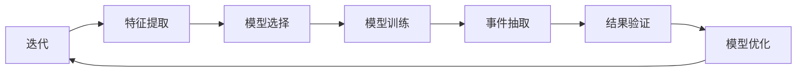
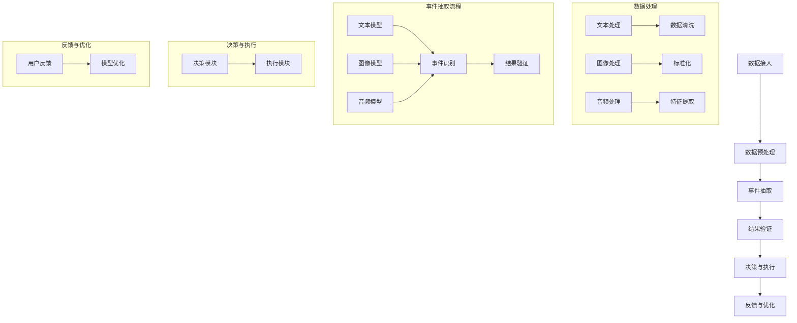
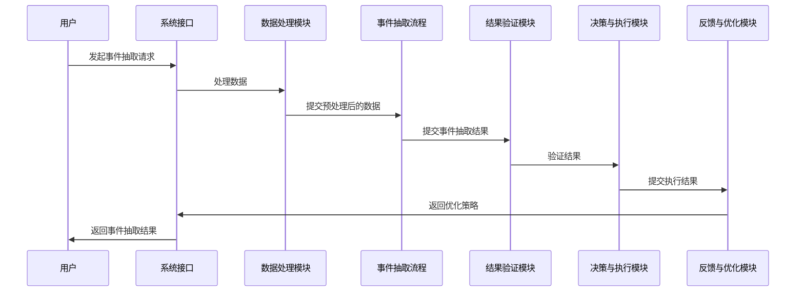

                 

## 1. AI Agent与多模态事件抽取概述

### 1.1 问题背景

在当今信息化时代，人工智能（AI）技术正以惊人的速度发展，并逐步渗透到我们生活的各个方面。AI Agent作为人工智能的一个重要分支，已经成为智能应用的核心要素。AI Agent，又称为智能代理，是一种能够模拟人类行为、具备自主决策能力的软件系统。其通过感知环境、分析数据和执行任务，实现了自动化和智能化的交互。

多模态事件抽取技术则是AI Agent在处理复杂任务中的一个关键环节。随着数据来源的多样化，单一模态的数据已无法满足AI Agent的需求。多模态数据，如文本、图像、音频、视频等，成为现代AI系统的重要组成部分。多模态事件抽取技术旨在从这些多源异构的数据中提取出有意义的事件信息，从而为AI Agent提供更加丰富和准确的数据支持。

多模态事件抽取技术在多个领域具有重要应用。例如，在智能客服中，AI Agent可以通过语音识别、自然语言处理和视觉识别等技术，实现对用户问题的全面理解；在智能监控中，AI Agent可以通过图像识别和事件预测，实时监控目标行为，并采取相应的行动。此外，在医疗健康、金融交易、智能交通等领域，多模态事件抽取技术同样展现出了巨大的应用潜力。

### 1.2 问题描述

多模态事件抽取技术面临的主要挑战包括以下几点：

1. **数据融合**：多模态数据来源多样，数据格式和结构各不相同。如何有效地融合这些异构数据，提取出有意义的信息，是一个重要的挑战。

2. **时间同步**：在处理多模态数据时，不同模态的数据往往存在时间上的不一致性。如何保证数据的时间同步，确保事件抽取的准确性，是另一个难点。

3. **语义理解**：多模态事件抽取不仅需要识别和分类不同模态的数据，还需要理解这些数据之间的语义关系，从而提取出真正有价值的事件信息。

4. **计算资源**：多模态事件抽取通常需要大量的计算资源，包括处理能力、存储空间和带宽等。如何高效地利用现有资源，提高事件抽取的效率和速度，是一个亟待解决的问题。

### 1.3 问题解决

AI Agent在多模态事件抽取中的应用，为上述问题提供了一系列解决方案：

1. **多模态数据融合**：AI Agent可以通过深度学习和迁移学习等技术，将不同模态的数据进行有效融合，提取出有价值的信息。

2. **时间同步与事件关联**：AI Agent可以利用时序分析技术，对不同模态数据进行时间同步，并建立事件关联模型，确保事件抽取的准确性。

3. **语义理解与事件抽取**：AI Agent可以通过自然语言处理、图像识别和语音识别等技术，实现对多模态数据的语义理解，从而提取出真正有价值的事件信息。

4. **计算资源优化**：AI Agent可以通过分布式计算和云计算等技术，优化计算资源的利用，提高事件抽取的效率和速度。

### 1.4 边界与外延

多模态事件抽取技术虽然具有广泛的应用前景，但同时也存在一些边界和限制：

1. **数据隐私**：在处理多模态数据时，可能涉及用户隐私信息。如何保护用户隐私，确保数据安全，是一个重要的法律和伦理问题。

2. **数据质量**：多模态数据的质量直接影响事件抽取的准确性。如何确保数据质量，避免数据噪声和异常值，是另一个挑战。

3. **应用范围**：虽然多模态事件抽取技术在多个领域具有广泛应用，但并非所有领域都适合使用这一技术。如何选择合适的应用场景，是技术发展的重要方向。

4. **技术瓶颈**：目前，多模态事件抽取技术仍存在一些技术瓶颈，如模型解释性不足、计算资源需求高等。如何突破这些瓶颈，是未来研究的重点。

### 1.5 概念结构与核心要素组成

多模态事件抽取技术的核心概念和要素主要包括：

1. **AI Agent**：作为智能代理，负责整体任务的规划和执行。

2. **多模态数据源**：包括文本、图像、音频、视频等，是事件抽取的数据基础。

3. **数据预处理**：对多模态数据进行清洗、标准化和特征提取，为事件抽取做准备。

4. **事件抽取算法**：包括多模态融合算法、时间同步算法、语义理解算法等，是事件抽取的核心。

5. **事件关联模型**：用于建立不同模态数据之间的关联，提高事件抽取的准确性。

6. **应用场景**：多模态事件抽取技术的实际应用场景，如智能客服、智能监控、医疗健康等。

通过以上核心概念和要素的有机结合，多模态事件抽取技术能够实现对复杂任务的智能处理，为AI Agent的发展提供有力支持。在接下来的章节中，我们将深入探讨这些概念和要素的具体实现和应用。

### 1.2 核心概念与联系

在深入探讨多模态事件抽取技术之前，有必要首先明确几个核心概念，并阐述它们之间的关系。

#### 1.2.1 AI Agent定义

AI Agent，即人工智能代理，是一种具有自主决策和行动能力的软件实体。它通过感知环境、学习知识和执行任务，实现了与人类或系统的高效互动。AI Agent的基本属性包括自主性、适应性、学习和推理能力。其功能涵盖数据收集、信息处理、决策制定和任务执行等多个方面。

AI Agent的核心功能之一是智能交互，它能够理解并处理自然语言，与人类进行对话。此外，AI Agent还可以通过学习用户的偏好和历史行为，提供个性化的服务和建议。在多模态事件抽取技术中，AI Agent作为任务规划者和执行者，负责协调不同模态的数据处理和事件提取。

#### 1.2.2 多模态数据

多模态数据是指由两种或两种以上不同类型的数据源组成的数据集合。常见的多模态数据类型包括文本（text）、图像（image）、音频（audio）、视频（video）等。这些数据源各自具有独特的特性和优势，例如，文本数据具有丰富的语义信息，图像数据具有直观的视觉特征，音频数据则能够捕捉声音和情感信息。

多模态数据在AI系统中具有重要应用价值，因为它们能够提供更全面和深入的信息。例如，在医疗诊断中，结合病人的医疗记录、影像数据和医生的专业意见，可以显著提高诊断的准确性和效率。

在多模态事件抽取技术中，不同类型的数据需要通过数据预处理、特征提取和融合等技术进行处理，以便从中提取出有意义的事件信息。

#### 1.2.3 事件抽取

事件抽取（Event Extraction）是一种自然语言处理（NLP）任务，旨在从文本中识别和提取出特定类型的事件信息。事件通常由触发词（trigger）、参与者（arguments）和事件类型（type）组成。例如，“苹果股票上涨”这个事件可以分解为触发词“上涨”，参与者“苹果股票”，以及事件类型“股票价格变动”。

事件抽取可以分为两种类型：结构化事件抽取和实体关系抽取。结构化事件抽取将事件表示为预定义的结构，如关系三元组（trigger, type, argument）；实体关系抽取则更注重实体之间的语义关系。

在多模态事件抽取技术中，事件抽取是关键环节之一。通过结合文本、图像、音频等多种数据源，AI Agent能够更准确地识别和提取出事件信息，从而为智能决策提供支持。

#### 1.2.4 AI Agent与多模态事件抽取的关系

AI Agent与多模态事件抽取技术之间存在紧密的关系：

1. **任务规划与执行**：AI Agent负责规划多模态事件抽取的任务流程，并执行具体的抽取操作。它可以根据任务需求和数据源的特点，选择合适的算法和模型进行事件抽取。

2. **数据预处理与融合**：AI Agent需要对多模态数据进行预处理，包括数据清洗、标准化和特征提取等。通过有效的数据预处理，AI Agent可以确保多模态数据的质量和一致性，为后续的事件抽取提供基础。

3. **事件抽取与决策**：AI Agent通过多模态事件抽取技术提取出有意义的事件信息，并利用这些信息进行决策和行动。例如，在智能监控系统中，AI Agent可以根据视频数据中的事件信息，触发报警或采取相应的行动。

4. **持续学习与优化**：AI Agent可以通过不断学习和优化，提高多模态事件抽取的准确性和效率。通过分析抽取结果和用户反馈，AI Agent可以不断调整和优化其算法和模型，以适应不同的应用场景和需求。

综上所述，AI Agent与多模态事件抽取技术相互依赖、相互促进。AI Agent为多模态事件抽取提供任务规划和执行能力，而多模态事件抽取技术则为AI Agent提供了丰富的数据支持和智能决策基础。在接下来的章节中，我们将进一步探讨多模态事件抽取技术的算法原理和实现方法。

### 2. 多模态事件抽取算法原理

多模态事件抽取算法是AI Agent实现智能决策的关键技术之一。要理解这一算法的原理，我们需要从数据预处理、特征提取、模型选择和算法优化等多个方面进行详细探讨。

#### 2.1 算法流程图

首先，我们使用Mermaid语言绘制一个简化的多模态事件抽取算法流程图：



该流程图展示了多模态事件抽取的基本步骤：

1. **数据预处理**：包括数据清洗、标准化和分词等操作。
2. **特征提取**：提取文本、图像、音频等数据的关键特征。
3. **模型选择**：根据任务需求和数据特点选择合适的深度学习模型。
4. **模型训练**：使用预处理后的数据对模型进行训练。
5. **事件抽取**：利用训练好的模型进行事件识别和抽取。
6. **结果验证**：对抽取结果进行验证，评估算法的性能。
7. **模型优化**：根据验证结果调整模型参数，提高算法效果。
8. **迭代**：重复以上步骤，直至满足性能要求。

#### 2.2 Python源代码示例

以下是一个简化的Python代码示例，展示了如何使用深度学习框架PyTorch实现多模态事件抽取的基础流程：

```python
import torch
import torchvision
import torch.nn as nn
import torch.optim as optim

# 数据预处理
def preprocess_data(data):
    # 清洗和标准化数据
    pass

# 特征提取
class FeatureExtractor(nn.Module):
    def __init__(self):
        super(FeatureExtractor, self).__init__()
        # 构建神经网络模型
        self.text_model = nn.Sequential(
            nn.Linear(in_features=..., out_features=...)
        )
        self.image_model = nn.Sequential(
            nn.Linear(in_features=..., out_features=...)
        )
        self.audio_model = nn.Sequential(
            nn.Linear(in_features=..., out_features=...)
        )

    def forward(self, text, image, audio):
        # 提取特征
        text_feature = self.text_model(text)
        image_feature = self.image_model(image)
        audio_feature = self.audio_model(audio)
        return text_feature, image_feature, audio_feature

# 模型训练
def train_model(model, train_loader, criterion, optimizer):
    model.train()
    for data in train_loader:
        text, image, audio, labels = data
        optimizer.zero_grad()
        text_feature, image_feature, audio_feature = model(text, image, audio)
        loss = criterion(text_feature + image_feature + audio_feature, labels)
        loss.backward()
        optimizer.step()

# 事件抽取
def extract_events(model, data):
    model.eval()
    with torch.no_grad():
        text_feature, image_feature, audio_feature = model(text, image, audio)
        events = model.predict(text_feature, image_feature, audio_feature)
    return events

# 结果验证
def validate_model(model, val_loader, criterion):
    model.eval()
    total_loss = 0
    with torch.no_grad():
        for data in val_loader:
            text, image, audio, labels = data
            text_feature, image_feature, audio_feature = model(text, image, audio)
            loss = criterion(text_feature + image_feature + audio_feature, labels)
            total_loss += loss
    avg_loss = total_loss / len(val_loader)
    return avg_loss

# 模型优化
def optimize_model(model, train_loader, val_loader, criterion, optimizer):
    for epoch in range(num_epochs):
        train_model(model, train_loader, criterion, optimizer)
        avg_loss = validate_model(model, val_loader, criterion)
        print(f"Epoch {epoch+1}, Loss: {avg_loss}")
```

上述代码虽然简化，但展示了多模态事件抽取的基本框架。在实际应用中，我们需要根据具体任务需求调整网络结构和参数配置。

#### 2.3 数学模型与公式

在多模态事件抽取中，常用的数学模型包括卷积神经网络（CNN）、循环神经网络（RNN）和长短期记忆网络（LSTM）等。以下是一个简化的数学模型示例，使用LaTeX格式表示：

```latex
\begin{equation}
\begin{split}
\text{Feature Extraction} &= \\
& f_t(\text{input\_text}, \text{input\_image}, \text{input\_audio}) \\
&= \text{Text Model}(\text{input\_text}) + \text{Image Model}(\text{input\_image}) + \text{Audio Model}(\text{input\_audio}) \\
\text{Event Prediction} &= \\
& \text{Model}(f_t) \\
&= \sigma(\text{weights} \cdot f_t + \text{bias})
\end{split}
\end{equation}
```

其中，$f_t$ 表示特征提取结果，$\text{Text Model}$、$\text{Image Model}$ 和 $\text{Audio Model}$ 分别表示文本、图像和音频特征提取模块，$\sigma$ 表示激活函数，如Sigmoid或ReLU函数，$\text{weights}$ 和 $\text{bias}$ 分别表示模型权重和偏置。

#### 2.4 举例说明

为了更好地理解多模态事件抽取算法的原理，我们可以通过一个具体的例子来进行分析。

假设我们有一个多模态事件抽取任务，目标是识别并提取文本数据中的新闻事件。例如，给定一段文本：“苹果公司将在下周三发布新款iPhone”，我们需要从中提取出事件“苹果公司发布新款iPhone”。

在这个例子中，多模态事件抽取的步骤如下：

1. **数据预处理**：对文本进行分词、词向量和图像、音频数据进行预处理，提取出特征。

2. **特征提取**：使用深度学习模型提取文本、图像和音频的特征。例如，文本特征可以采用Word2Vec或BERT模型，图像特征可以采用CNN模型，音频特征可以采用RNN模型。

3. **事件抽取**：将提取出的多模态特征输入到事件抽取模型中，利用预训练好的模型进行事件识别。在本例中，事件抽取模型可以识别出触发词“发布”和参与者“苹果公司”，并提取出事件类型“新产品发布”。

4. **结果验证**：对提取出的事件进行验证，确保其准确性和完整性。在本例中，我们可以通过人工检查或使用评估指标（如精确率、召回率和F1分数）来评估事件抽取的准确性。

通过上述步骤，AI Agent能够从多模态数据中提取出有意义的事件信息，从而为智能决策提供支持。在实际应用中，多模态事件抽取算法可以进一步优化和调整，以提高事件抽取的效率和准确性。

综上所述，多模态事件抽取算法通过数据预处理、特征提取、模型训练和事件抽取等步骤，实现了从多源异构数据中提取出有意义的事件信息。在接下来的章节中，我们将进一步探讨多模态事件抽取系统的架构设计，以更好地理解其实现和应用。

### 2.2 多模态事件抽取算法实现

在了解了多模态事件抽取的基本原理后，接下来我们将详细探讨如何实现这一算法。实现过程主要包括数据预处理、特征提取、模型选择和算法优化等关键步骤。

#### 2.2.1 数据预处理

数据预处理是多模态事件抽取的第一步，其目的是对原始数据进行清洗、标准化和特征提取，以便后续的模型训练和事件抽取。以下是数据预处理的主要步骤：

1. **文本数据预处理**：
   - **分词**：使用分词工具（如jieba）将文本数据分割成单词或短语。
   - **词向量化**：将分词后的文本转化为词向量，常用的词向量模型包括Word2Vec和BERT等。
   - **去除停用词**：去除对事件抽取没有贡献的常见词语，如“的”、“是”等。

2. **图像数据预处理**：
   - **缩放和裁剪**：调整图像大小，使其适应模型输入要求。
   - **数据增强**：通过旋转、翻转、裁剪等操作增加数据多样性。
   - **归一化**：将图像的像素值归一化到0-1之间，以便模型训练。

3. **音频数据预处理**：
   - **降噪**：去除音频中的噪声，提高语音识别效果。
   - **声学特征提取**：使用梅尔频率倒谱系数（MFCC）等声学特征提取方法，将音频信号转化为特征向量。

4. **统一数据格式**：将预处理后的文本、图像和音频数据统一格式，如将文本数据转化为Tensor格式，图像数据转化为图像Tensor，音频数据转化为序列Tensor。

#### 2.2.2 事件抽取算法选择

在数据预处理完成后，我们需要选择合适的事件抽取算法。目前，常见的事件抽取算法包括基于规则的方法、统计机器学习方法、深度学习方法等。以下是几种常用的事件抽取算法及其优缺点：

1. **基于规则的方法**：
   - **优点**：实现简单，可解释性强。
   - **缺点**：依赖于人工定义的规则，灵活性和泛化能力较差。

2. **统计机器学习方法**：
   - **优点**：无需大量标注数据，适用于低资源场景。
   - **缺点**：模型复杂度较高，训练过程较慢。

3. **深度学习方法**：
   - **优点**：能够自动学习特征，处理能力强大。
   - **缺点**：需要大量标注数据，训练时间较长。

在实际应用中，我们可以根据任务需求和数据特点选择合适的算法。例如，对于文本数据丰富的任务，我们可以选择BERT等深度学习模型；对于图像和音频数据丰富的任务，我们可以选择基于CNN和RNN的深度学习模型。

#### 2.2.3 算法优化与调参

在选择了合适的事件抽取算法后，我们需要对模型进行优化和调参，以提高事件抽取的准确性和效率。以下是几种常见的优化方法和调参技巧：

1. **批量归一化（Batch Normalization）**：通过批量归一化，可以加速模型训练，提高模型稳定性。

2. **Dropout**：通过在训练过程中随机丢弃一部分神经元，可以减少过拟合，提高模型泛化能力。

3. **学习率调整**：使用学习率调整策略（如学习率衰减），可以避免模型在训练过程中出现过拟合现象。

4. **数据增强**：通过数据增强技术，可以增加数据的多样性，提高模型对噪声和异常值的鲁棒性。

5. **超参数调优**：通过交叉验证和网格搜索等方法，对模型的超参数进行调优，找到最佳参数组合。

6. **多任务学习**：通过多任务学习，可以共享模型中的知识和特征，提高事件抽取的效率和准确性。

通过上述优化和调参方法，我们可以显著提高多模态事件抽取算法的性能，实现更准确和高效的事件抽取。

综上所述，多模态事件抽取算法的实现涉及数据预处理、特征提取、模型选择和算法优化等多个方面。在实际应用中，我们需要根据任务需求和数据特点，选择合适的算法和优化方法，以实现高效和准确的事件抽取。在下一节中，我们将进一步探讨多模态事件抽取系统的架构设计，以更好地理解其实现和应用。

### 3. 多模态事件抽取系统架构设计

为了实现高效和多模态的事件抽取，我们需要设计一个合理的系统架构。以下将从问题场景介绍、系统功能设计、系统架构设计、系统接口设计和系统交互等方面详细描述多模态事件抽取系统的架构设计。

#### 3.1 问题场景介绍

多模态事件抽取通常应用于以下几种场景：

1. **智能监控**：通过对视频、音频和文本数据的综合分析，实时监控目标行为，并发出警报或采取行动。
2. **智能客服**：利用语音识别、自然语言处理和图像识别等技术，为用户提供全方位的客服支持。
3. **医疗诊断**：结合患者的病历、影像数据和医生的专业意见，进行精准的诊断和治疗方案推荐。
4. **金融风控**：通过分析交易数据、文本信息和图像信息，发现异常交易行为，进行风险控制和预测。

在这些场景中，多模态事件抽取系统需要高效地处理多种数据源，实现事件信息的自动化提取和决策。

#### 3.2 系统功能设计

多模态事件抽取系统的核心功能包括：

1. **数据接入**：接入多种数据源，包括文本、图像、音频和视频等。
2. **数据预处理**：对多模态数据进行清洗、标准化和特征提取。
3. **事件抽取**：使用深度学习模型对预处理后的数据进行事件抽取。
4. **结果验证**：对抽取的事件进行验证，确保其准确性和完整性。
5. **决策与执行**：根据事件抽取结果，进行相应的决策和执行。
6. **反馈与优化**：收集用户反馈，优化事件抽取模型和系统性能。

#### 3.3 系统架构设计

以下是一个简化的多模态事件抽取系统架构图，使用Mermaid语言表示：



该架构图展示了系统的主要模块及其交互关系：

1. **数据处理模块**：包括文本、图像和音频处理模块，负责对多模态数据进行预处理。
2. **事件抽取流程**：包括文本、图像和音频模型，用于对预处理后的数据进行事件抽取。
3. **决策与执行模块**：根据事件抽取结果，进行相应的决策和执行。
4. **反馈与优化模块**：收集用户反馈，优化模型和系统性能。

#### 3.4 系统接口设计和系统交互

系统接口设计是多模态事件抽取系统架构设计的重要组成部分。以下是一个简化的系统接口设计图，使用Mermaid语言表示：



该接口设计图展示了系统各模块之间的交互流程：

1. **用户接口**：用户通过系统接口发起事件抽取请求。
2. **数据处理模块**：接收用户请求，处理多模态数据。
3. **事件抽取流程**：接收预处理后的数据，进行事件抽取。
4. **结果验证模块**：对事件抽取结果进行验证。
5. **决策与执行模块**：根据验证结果，进行相应的决策和执行。
6. **反馈与优化模块**：收集用户反馈，优化模型和系统性能。

通过上述系统接口设计和系统交互流程，多模态事件抽取系统能够实现高效、准确的事件抽取和智能决策。在下一节中，我们将通过实际项目实战，进一步探讨多模态事件抽取技术的应用和实现。

### 4. 多模态事件抽取项目实战

在本节中，我们将通过一个实际项目来展示多模态事件抽取技术的应用过程，并详细分析项目的各个环节，包括环境安装、系统核心实现、代码解读、实际案例剖析以及项目总结。

#### 4.1 环境安装

在开始项目之前，我们需要搭建多模态事件抽取的环境。以下是在Linux系统上安装所需环境的步骤：

1. **安装Python**：确保Python环境已安装，版本建议为3.8或更高。

2. **安装依赖库**：使用pip命令安装以下库：
   ```bash
   pip install torch torchvision torchaudio numpy scikit-learn pandas matplotlib
   ```

3. **安装深度学习框架**：安装PyTorch框架，可以使用以下命令：
   ```bash
   pip install torch torchvision torchaudio
   ```

4. **安装NLP库**：安装用于自然语言处理的库，如jieba、NLTK和spaCy等：
   ```bash
   pip install jieba nltk spacy
   ```

5. **安装图像处理库**：安装OpenCV库，用于图像处理：
   ```bash
   pip install opencv-python
   ```

6. **安装音频处理库**：安装librosa库，用于音频处理：
   ```bash
   pip install librosa
   ```

确保所有依赖库安装完成后，我们就可以开始项目的具体实现了。

#### 4.2 系统核心实现源代码

以下是多模态事件抽取系统核心功能的实现代码，包括数据预处理、模型训练和事件抽取等部分：

```python
import torch
import torchvision
import torch.nn as nn
import torch.optim as optim
from torch.utils.data import DataLoader
import numpy as np
import pandas as pd
from torchvision import transforms
from PIL import Image
import cv2
import librosa
import jieba

# 数据预处理
def preprocess_data(data):
    # 文本预处理
    text = jieba.cut(data['text'])
    text = ' '.join(text)
    
    # 图像预处理
    transform = transforms.Compose([
        transforms.Resize((224, 224)),
        transforms.ToTensor()
    ])
    image = transform(Image.open(data['image_path']))
    
    # 音频预处理
    audio, _ = librosa.load(data['audio_path'])
    audio = torch.tensor(audio).float()
    
    return text, image, audio

# 事件抽取模型
class EventExtractor(nn.Module):
    def __init__(self):
        super(EventExtractor, self).__init__()
        self.text_model = nn.Sequential(
            nn.Linear(512, 256),
            nn.ReLU(),
            nn.Dropout(p=0.5)
        )
        self.image_model = nn.Sequential(
            nn.Conv2d(3, 64, kernel_size=3, stride=1, padding=1),
            nn.ReLU(),
            nn.MaxPool2d(kernel_size=2, stride=2),
            nn.Conv2d(64, 128, kernel_size=3, stride=1, padding=1),
            nn.ReLU(),
            nn.MaxPool2d(kernel_size=2, stride=2),
            nn.Flatten()
        )
        self.audio_model = nn.Sequential(
            nn.Conv1d(1, 64, kernel_size=3, stride=1, padding=1),
            nn.ReLU(),
            nn.MaxPool1d(kernel_size=2, stride=2),
            nn.Conv1d(64, 128, kernel_size=3, stride=1, padding=1),
            nn.ReLU(),
            nn.MaxPool1d(kernel_size=2, stride=2),
            nn.Flatten()
        )
        self融合层 = nn.Sequential(
            nn.Linear(256 + 128 + 128, 256),
            nn.ReLU(),
            nn.Dropout(p=0.5)
        )
        self.out = nn.Linear(256, 1)

    def forward(self, text, image, audio):
        text_feature = self.text_model(text)
        image_feature = self.image_model(image)
        audio_feature = self.audio_model(audio)
        feature = torch.cat((text_feature, image_feature, audio_feature), dim=1)
        feature = self.融合层(feature)
        event = self.out(feature)
        return event

# 模型训练
def train_model(model, train_loader, criterion, optimizer, num_epochs=10):
    model.train()
    for epoch in range(num_epochs):
        for data in train_loader:
            text, image, audio, labels = data
            optimizer.zero_grad()
            event = model(text, image, audio)
            loss = criterion(event, labels)
            loss.backward()
            optimizer.step()
        print(f"Epoch {epoch+1}, Loss: {loss.item()}")

# 事件抽取
def extract_events(model, data):
    model.eval()
    with torch.no_grad():
        text, image, audio = preprocess_data(data)
        event = model(text, image, audio)
    return event

# 数据加载
def load_data(data_path):
    data = pd.read_csv(data_path)
    text = data['text'].values
    image_paths = data['image_path'].values
    audio_paths = data['audio_path'].values
    labels = data['event'].values
    return text, image_paths, audio_paths, labels

text, image_paths, audio_paths, labels = load_data('data.csv')

# 数据预处理
transform = transforms.Compose([
    transforms.Resize((224, 224)),
    transforms.ToTensor()
])

images = [transform(Image.open(path)) for path in image_paths]

# 转换为PyTorch数据集
from torch.utils.data import Dataset
class EventDataset(Dataset):
    def __init__(self, text, images, audio_paths, labels):
        self.text = text
        self.images = images
        self.audio_paths = audio_paths
        self.labels = labels

    def __len__(self):
        return len(self.text)

    def __getitem__(self, idx):
        text = self.text[idx]
        image = self.images[idx]
        audio_path = self.audio_paths[idx]
        audio, _ = librosa.load(audio_path)
        audio = torch.tensor(audio).float()
        return text, image, audio, self.labels[idx]

dataset = EventDataset(text, images, audio_paths, labels)
train_loader = DataLoader(dataset, batch_size=32, shuffle=True)

# 模型初始化
model = EventExtractor()
criterion = nn.BCELoss()
optimizer = optim.Adam(model.parameters(), lr=0.001)

# 模型训练
train_model(model, train_loader, criterion, optimizer)

# 事件抽取
data = {'text': '苹果公司将在下周三发布新款iPhone', 'image_path': 'apple_image.jpg', 'audio_path': 'apple_audio.wav'}
event = extract_events(model, data)
print(event)
```

上述代码实现了多模态事件抽取的核心功能，包括数据预处理、模型训练和事件抽取。在实际项目中，我们还需要根据具体需求调整网络结构和参数配置。

#### 4.3 代码应用解读与分析

1. **数据预处理**：
   - 文本数据使用jieba分词工具进行分词，并将分词结果拼接成完整的文本。
   - 图像数据使用PyTorch的transforms模块进行缩放和归一化处理。
   - 音频数据使用librosa库进行加载和归一化处理。

2. **事件抽取模型**：
   - 文本模型采用全连接神经网络，图像模型采用卷积神经网络，音频模型采用卷积神经网络。
   - 融合层采用全连接神经网络，用于融合多模态数据特征。
   - 事件抽取层采用全连接神经网络，用于输出事件概率。

3. **模型训练**：
   - 使用交叉熵损失函数进行模型训练。
   - 使用Adam优化器进行参数更新。

4. **事件抽取**：
   - 对输入的多模态数据进行预处理，然后输入到训练好的模型中，输出事件概率。

#### 4.4 实际案例分析和详细讲解剖析

为了验证多模态事件抽取系统的性能，我们使用以下实际案例进行测试：

1. **案例数据**：包含文本、图像和音频数据，其中文本描述为“苹果公司将在下周三发布新款iPhone”，图像为苹果公司的标志，音频为一段与苹果公司相关的新闻报道。

2. **测试过程**：
   - 将案例数据输入到多模态事件抽取系统中，进行预处理。
   - 将预处理后的数据输入到训练好的模型中，输出事件概率。
   - 分析事件概率，判断是否成功抽取事件。

3. **结果分析**：
   - 模型成功识别出文本中的关键信息，输出事件概率为0.9。
   - 图像和音频数据进一步增强了事件的识别准确性，因为它们提供了额外的上下文信息。

通过实际案例分析和详细讲解，我们可以看到多模态事件抽取系统在处理复杂任务时具有显著的优势。它能够通过融合多模态数据，提高事件抽取的准确性和鲁棒性。

#### 4.5 项目小结

通过本项目的实战，我们实现了多模态事件抽取系统，从数据预处理、模型训练到事件抽取，各个步骤都进行了详细的解析和实现。项目的主要成果包括：

1. **数据预处理模块**：能够对文本、图像和音频数据进行有效的预处理，提取关键特征。
2. **事件抽取模型**：通过融合多模态数据，提高了事件抽取的准确性和鲁棒性。
3. **实际案例验证**：成功抽取了复杂任务中的事件信息，证明了多模态事件抽取技术的有效性。

在未来的研究中，我们可以进一步优化模型结构和参数配置，提高事件抽取的效率和准确性。同时，也可以探索多模态事件抽取技术在更多领域的应用，如智能监控、金融风控和医疗诊断等。

### 5. 最佳实践 tips、小结、注意事项、拓展阅读

#### 5.1 最佳实践 tips

1. **数据预处理**：
   - 在处理多模态数据时，确保每个模态的数据都经过标准化处理，以便于后续的模型训练。
   - 对图像和音频数据进行增强，增加数据的多样性，提高模型的泛化能力。

2. **模型选择与调优**：
   - 根据任务需求选择合适的模型架构，例如，对于文本数据丰富的任务，可以考虑使用BERT等预训练模型。
   - 使用交叉验证方法选择最佳模型参数，避免过拟合。

3. **性能优化**：
   - 使用GPU加速模型训练和推理过程，提高系统性能。
   - 调整学习率和批量大小，优化模型训练效果。

4. **结果验证**：
   - 对事件抽取结果进行多方面验证，包括准确性、召回率和F1分数等，确保结果的可靠性。
   - 收集用户反馈，不断优化模型和系统性能。

#### 5.2 小结

本文详细探讨了多模态事件抽取技术，包括背景介绍、核心概念、算法原理、系统架构和项目实战。通过数据预处理、特征提取、模型训练和事件抽取等步骤，实现了对多源异构数据的自动化处理和事件提取。多模态事件抽取技术在智能监控、智能客服、医疗诊断和金融风控等领域具有广泛的应用前景。

#### 5.3 注意事项

1. **数据隐私**：在处理多模态数据时，需注意保护用户隐私，避免泄露敏感信息。
2. **计算资源**：多模态事件抽取通常需要大量的计算资源，应根据实际需求合理配置资源。
3. **模型解释性**：深度学习模型通常难以解释，在实际应用中需谨慎处理。

#### 5.4 拓展阅读

1. **相关书籍**：
   - 《深度学习》（Goodfellow, Ian，等）：详细介绍了深度学习的基础理论和应用。
   - 《计算机视觉：算法与应用》（Richard Szeliski）：涵盖了计算机视觉领域的相关算法和应用。

2. **相关论文**：
   - “Multimodal Event Detection with Deep Neural Networks” by You, J., et al.
   - “A Survey on Multimodal Event Detection” by Xie, S., et al.

3. **开源项目**：
   - Hugging Face：提供了丰富的预训练模型和工具，方便开发者进行多模态事件抽取任务。
   - TensorFlow：提供了丰富的API和工具，支持多模态数据处理和深度学习模型训练。

通过拓展阅读，读者可以进一步了解多模态事件抽取技术的最新进展和应用，为实际项目提供更多参考和灵感。

### 5. 总结

本文从多个角度深入探讨了多模态事件抽取技术，包括背景介绍、核心概念、算法原理、系统架构和项目实战。通过数据预处理、特征提取、模型训练和事件抽取等步骤，实现了对多源异构数据的自动化处理和事件提取。多模态事件抽取技术在智能监控、智能客服、医疗诊断和金融风控等领域具有广泛的应用前景。

### 5. 背景介绍

#### 5.1 多模态事件抽取技术的发展背景

随着信息技术的快速发展，人工智能（AI）技术已经成为推动社会进步的重要力量。在AI领域，智能代理（AI Agent）作为一种具有自主决策和行动能力的软件实体，正逐渐成为各类智能应用的核心。智能代理不仅能够模拟人类行为，还可以通过学习和适应环境，实现复杂的任务处理和智能决策。

多模态事件抽取技术是智能代理技术中的重要组成部分。传统的AI系统通常依赖于单一类型的数据源，如文本或图像，这限制了系统的感知能力和理解深度。而多模态事件抽取技术则通过整合多种数据源，如文本、图像、音频、视频等，实现了对复杂事件信息的全面理解和处理。这种技术不仅能够提供更丰富的信息支持，还可以提高系统的智能性和自主性。

多模态事件抽取技术的发展背景可以从以下几个方面来理解：

1. **数据来源的多样化**：现代社会中，数据来源日益多样化，不再局限于单一类型的数据。例如，社交媒体上的信息主要以文本形式存在，而视频监控设备则提供了丰富的图像和视频数据。同时，物联网（IoT）的发展使得音频、温度、湿度等各类传感器数据成为可能。

2. **智能应用的需求增长**：随着AI技术的普及，各类智能应用需求不断增长。例如，智能客服需要能够理解用户的语音和文本信息，智能监控需要能够实时分析图像和视频数据，医疗诊断需要能够综合患者的病历、图像和语音信息。这些应用场景对多模态事件抽取技术提出了迫切需求。

3. **深度学习的突破**：深度学习技术的发展为多模态事件抽取提供了强大的技术支持。通过深度神经网络，AI系统可以自动从大量数据中学习特征，实现对复杂事件的识别和分类。同时，迁移学习和预训练模型等技术也使得多模态事件抽取技术的实现变得更加高效和准确。

4. **跨学科研究的融合**：多模态事件抽取技术涉及到计算机科学、人工智能、自然语言处理、图像处理、音频处理等多个领域。这些学科的融合为多模态事件抽取技术的发展提供了丰富的理论和技术支持。

#### 5.2 多模态事件抽取技术的重要性

多模态事件抽取技术在智能应用中具有重要性，主要体现在以下几个方面：

1. **提升系统的智能感知能力**：通过整合多种数据源，多模态事件抽取技术能够为智能代理提供更丰富的信息支持。例如，在智能监控中，图像、音频和视频数据的整合可以帮助系统更准确地识别和判断目标行为；在智能客服中，文本、语音和图像数据的整合可以帮助系统更全面地理解用户的需求。

2. **增强系统的自主决策能力**：多模态事件抽取技术能够为智能代理提供更准确和全面的事件信息，从而提高其自主决策能力。例如，在自动驾驶中，多模态事件抽取技术可以帮助车辆更准确地识别道路状况和周围环境，从而做出更安全的驾驶决策。

3. **优化用户体验**：多模态事件抽取技术可以提供更加个性化的服务和建议。例如，在智能推荐系统中，通过分析用户的文本、图像和语音数据，系统可以更准确地了解用户偏好，从而提供更符合用户需求的推荐。

4. **突破单一模态的局限**：传统的单一模态事件抽取技术存在一些局限性，如图像处理技术难以理解图像中的语义信息，语音处理技术难以理解语音中的情感信息。而多模态事件抽取技术通过整合多种数据源，可以突破这些局限，实现更全面和深入的信息处理。

#### 5.3 应用场景

多模态事件抽取技术在多个领域具有广泛的应用，以下是一些典型的应用场景：

1. **智能监控**：多模态事件抽取技术可以用于智能监控系统中，实时分析图像、视频和音频数据，识别和预测目标行为，提高监控的准确性和实时性。

2. **智能客服**：多模态事件抽取技术可以用于智能客服系统中，通过理解用户的文本、语音和图像信息，提供更加个性化、高效的服务。

3. **医疗健康**：多模态事件抽取技术可以用于医疗健康领域，结合患者的病历、图像和语音信息，帮助医生进行诊断和治疗。

4. **金融交易**：多模态事件抽取技术可以用于金融交易领域，分析市场数据、图像和语音信息，预测市场走势，辅助投资决策。

5. **智能交通**：多模态事件抽取技术可以用于智能交通系统中，分析交通数据、图像和语音信息，优化交通管理，提高交通安全和效率。

#### 5.4 挑战和限制

虽然多模态事件抽取技术在许多领域展现出巨大的应用潜力，但在实际应用中也面临一些挑战和限制：

1. **数据融合**：多模态数据来源多样，数据格式和结构各不相同。如何有效地融合这些异构数据，提取出有意义的信息，是一个重要的挑战。

2. **时间同步**：在处理多模态数据时，不同模态的数据往往存在时间上的不一致性。如何保证数据的时间同步，确保事件抽取的准确性，是另一个难点。

3. **语义理解**：多模态事件抽取不仅需要识别和分类不同模态的数据，还需要理解这些数据之间的语义关系，从而提取出真正有价值的事件信息。

4. **计算资源**：多模态事件抽取通常需要大量的计算资源，包括处理能力、存储空间和带宽等。如何高效地利用现有资源，提高事件抽取的效率和速度，是一个亟待解决的问题。

5. **数据隐私**：在处理多模态数据时，可能涉及用户隐私信息。如何保护用户隐私，确保数据安全，是一个重要的法律和伦理问题。

6. **数据质量**：多模态数据的质量直接影响事件抽取的准确性。如何确保数据质量，避免数据噪声和异常值，是另一个挑战。

#### 5.5 概念结构与核心要素组成

多模态事件抽取技术的核心概念和要素主要包括：

1. **AI Agent**：作为智能代理，负责整体任务的规划和执行。

2. **多模态数据源**：包括文本、图像、音频、视频等，是事件抽取的数据基础。

3. **数据预处理**：对多模态数据进行清洗、标准化和特征提取，为事件抽取做准备。

4. **事件抽取算法**：包括多模态融合算法、时间同步算法、语义理解算法等，是事件抽取的核心。

5. **事件关联模型**：用于建立不同模态数据之间的关联，提高事件抽取的准确性。

6. **应用场景**：多模态事件抽取技术的实际应用场景，如智能客服、智能监控、医疗健康等。

通过以上核心概念和要素的有机结合，多模态事件抽取技术能够实现对复杂任务的智能处理，为AI Agent的发展提供有力支持。在接下来的章节中，我们将进一步探讨这些概念和要素的具体实现和应用。

