                 

# 《AI Agent的多模态交互设计》

## 关键词
- AI Agent
- 多模态交互
- 传感器数据采集
- 数据融合技术
- 系统架构设计
- 用户体验优化

## 摘要
本文将深入探讨AI Agent的多模态交互设计，从基础理论到技术实现，再到系统架构和实战案例，全面解析AI Agent在多模态交互中的设计与实现。通过本文的阅读，读者将了解AI Agent的基本原理、多模态交互的核心技术和实现方法，并掌握最佳实践和优化策略。

## 目录大纲设计思路

### 1. 确定书籍主题与目标
《AI Agent的多模态交互设计》的主题是围绕AI Agent在多模态交互中的设计与实现进行深入探讨。本书旨在为读者提供一个全面而系统的AI Agent多模态交互设计指南，帮助读者理解AI Agent的基本原理、多模态交互的核心技术和实现方法，并通过实战案例加深读者对理论知识的理解。

### 2. 确定书籍结构
书籍结构可以分为以下几个部分：

1. **引言与背景介绍**
   - 介绍AI Agent和多模态交互的背景，解释为什么这个话题重要，以及当前的研究和应用现状。

2. **基础理论**
   - 深入讲解AI Agent的基本原理和多模态交互的相关概念、技术基础等。

3. **技术实现**
   - 分析多模态数据采集、处理、融合的方法，并探讨如何设计高效的AI Agent多模态交互系统。

4. **系统架构与设计**
   - 详细介绍AI Agent多模态交互系统的架构设计，包括领域模型、系统架构、接口设计和交互流程等。

5. **项目实战**
   - 通过实际项目案例，展示如何将AI Agent多模态交互技术应用于实际场景，并进行详细分析。

6. **最佳实践与优化**
   - 提供一些优化AI Agent多模态交互系统性能和用户体验的最佳实践。

7. **总结与展望**
   - 对全书内容进行总结，并对AI Agent多模态交互的未来发展进行展望。

### 3. 确定各部分的核心章节
根据书籍结构，我们可以进一步细化每个部分的核心章节：

- **引言与背景介绍**
  - 第1章：AI Agent与多模态交互概述

- **基础理论**
  - 第2章：AI Agent的基本原理
  - 第3章：多模态交互概念与技术基础

- **技术实现**
  - 第4章：多模态数据采集与预处理
  - 第5章：多模态数据处理与融合

- **系统架构与设计**
  - 第6章：AI Agent多模态交互系统架构
  - 第7章：系统接口设计与交互流程

- **项目实战**
  - 第8章：AI Agent多模态交互项目实战

- **最佳实践与优化**
  - 第9章：最佳实践与优化

- **总结与展望**
  - 第10章：总结与展望

### 4. 编写核心章节的详细内容
对于每个核心章节，需要详细阐述其内容，确保读者能够充分理解该章节的主题。具体包括：

- **背景介绍**：介绍该章节的核心概念和背景知识，让读者了解为什么要学习这一内容。
- **核心概念与联系**：详细讲解相关概念和原理，包括公式、算法、技术细节等。
- **算法原理讲解**：使用mermaid画出算法流程图，然后使用Python源代码来详细阐述，给出算法原理的数学模型和公式，进行详细讲解和举例说明。
- **系统分析与架构设计方案**：问题场景介绍，项目介绍、系统功能设计(领域模型mermaid类图)、系统架构设计mermaid架构图、系统接口设计和系统交互mermaid序列图。
- **项目实战**：环境安装、系统核心实现源代码，代码应用解读与分析，实际案例分析和详细讲解剖析，项目小结。
- **最佳实践 tips**、**小结**、**注意事项**、**拓展阅读**等内容。

### 5. 确保内容完整性与逻辑性
在整个目录大纲设计中，需要确保内容的完整性，每个章节都应当有明确的主题和目标，且各章节之间应当有清晰的逻辑关系。例如，基础理论章节应该在前，技术实现章节应该在基础理论之后，项目实战章节应该在技术实现之后等。

### 6. 确保输出格式的规范性和可读性
最后，确保输出格式的规范性，使用markdown格式来组织目录结构，确保每个章节都有清晰的层级关系和标题。同时，确保内容具有较好的可读性，使用适当的列表、标题和段落分隔来提高文档的可读性。

## 完整目录大纲

```
# 《AI Agent的多模态交互设计》目录大纲

## 第一部分：引言与背景介绍

### 第1章：AI Agent与多模态交互概述
#### 1.1 AI Agent的定义与分类
#### 1.2 多模态交互的概念与重要性
#### 1.3 AI Agent多模态交互的应用场景

### 第2章：AI Agent的基本原理
#### 2.1 AI Agent的工作原理
#### 2.2 AI Agent的学习机制
#### 2.3 AI Agent的适应能力

## 第二部分：基础理论

### 第3章：多模态交互概念与技术基础
#### 3.1 多模态数据采集
#### 3.2 多模态数据处理与融合

### 第4章：AI Agent学习算法与多模态数据融合
#### 4.1 多模态数据预处理方法
#### 4.2 多模态数据融合算法
#### 4.3 AI Agent学习算法与应用

## 第三部分：技术实现

### 第5章：多模态数据采集与预处理
#### 5.1 各类传感器数据采集
#### 5.2 数据清洗与格式化

### 第6章：多模态数据处理与融合
#### 6.1 多模态数据处理算法
#### 6.2 数据融合技术

## 第四部分：系统架构与设计

### 第7章：AI Agent多模态交互系统架构
#### 7.1 领域模型
#### 7.2 系统架构设计
#### 7.3 接口设计与交互流程

### 第8章：系统接口设计与交互流程
#### 8.1 系统接口设计
#### 8.2 交互流程设计与优化

## 第五部分：项目实战

### 第9章：AI Agent多模态交互项目实战
#### 9.1 项目环境搭建
#### 9.2 系统核心实现
#### 9.3 案例分析与讲解

## 第六部分：最佳实践与优化

### 第10章：最佳实践与优化
#### 10.1 性能优化
#### 10.2 用户体验优化

## 第七部分：总结与展望

### 第11章：总结与展望
#### 11.1 全书总结
#### 11.2 AI Agent多模态交互的未来发展趋势
```

### 目录大纲设计思路

#### 确定书籍主题与目标

《AI Agent的多模态交互设计》的主题是围绕AI Agent在多模态交互中的设计与实现进行深入探讨。本书旨在为读者提供一个全面而系统的AI Agent多模态交互设计指南，帮助读者理解AI Agent的基本原理、多模态交互的核心技术和实现方法，并通过实战案例加深读者对理论知识的理解。

为了实现这一目标，本书将分为以下几个部分：

1. **引言与背景介绍**：介绍AI Agent和多模态交互的背景，解释为什么这个话题重要，以及当前的研究和应用现状。

2. **基础理论**：深入讲解AI Agent的基本原理和多模态交互的相关概念、技术基础等。

3. **技术实现**：分析多模态数据采集、处理、融合的方法，并探讨如何设计高效的AI Agent多模态交互系统。

4. **系统架构与设计**：详细介绍AI Agent多模态交互系统的架构设计，包括领域模型、系统架构、接口设计和交互流程等。

5. **项目实战**：通过实际项目案例，展示如何将AI Agent多模态交互技术应用于实际场景，并进行详细分析。

6. **最佳实践与优化**：提供一些优化AI Agent多模态交互系统性能和用户体验的最佳实践。

7. **总结与展望**：对全书内容进行总结，并对AI Agent多模态交互的未来发展进行展望。

#### 确定书籍结构

根据上述主题和目标，我们可以将书籍结构分为以下几部分：

1. **引言与背景介绍**
   - 第1章：AI Agent与多模态交互概述
   - 第2章：AI Agent的基本原理

2. **基础理论**
   - 第3章：多模态交互概念与技术基础
   - 第4章：AI Agent学习算法与多模态数据融合

3. **技术实现**
   - 第5章：多模态数据采集与预处理
   - 第6章：多模态数据处理与融合

4. **系统架构与设计**
   - 第7章：AI Agent多模态交互系统架构
   - 第8章：系统接口设计与交互流程

5. **项目实战**
   - 第9章：AI Agent多模态交互项目实战

6. **最佳实践与优化**
   - 第10章：最佳实践与优化

7. **总结与展望**
   - 第11章：总结与展望

#### 确定各部分的核心章节

根据书籍结构，我们可以进一步细化每个部分的核心章节：

1. **引言与背景介绍**
   - 第1章：AI Agent与多模态交互概述
     - AI Agent的定义与分类
     - 多模态交互的定义与重要性
     - AI Agent多模态交互的应用场景

   - 第2章：AI Agent的基本原理
     - AI Agent的工作原理
     - AI Agent的学习机制
     - AI Agent的适应能力

2. **基础理论**
   - 第3章：多模态交互概念与技术基础
     - 多模态数据采集
     - 多模态数据处理与融合

   - 第4章：AI Agent学习算法与多模态数据融合
     - 多模态数据预处理方法
     - 多模态数据融合算法
     - AI Agent学习算法与应用

3. **技术实现**
   - 第5章：多模态数据采集与预处理
     - 各类传感器数据采集
     - 数据清洗与格式化

   - 第6章：多模态数据处理与融合
     - 多模态数据处理算法
     - 数据融合技术

4. **系统架构与设计**
   - 第7章：AI Agent多模态交互系统架构
     - 领域模型
     - 系统架构设计
     - 接口设计与交互流程

   - 第8章：系统接口设计与交互流程
     - 系统接口设计
     - 交互流程设计与优化

5. **项目实战**
   - 第9章：AI Agent多模态交互项目实战
     - 项目环境搭建
     - 系统核心实现
     - 案例分析与讲解

6. **最佳实践与优化**
   - 第10章：最佳实践与优化
     - 性能优化
     - 用户体验优化

7. **总结与展望**
   - 第11章：总结与展望
     - 全书总结
     - AI Agent多模态交互的未来发展趋势

### 编写核心章节的详细内容

对于每个核心章节，需要详细阐述其内容，确保读者能够充分理解该章节的主题。具体包括：

- **背景介绍**：介绍该章节的核心概念和背景知识，让读者了解为什么要学习这一内容。
- **核心概念与联系**：详细讲解相关概念和原理，包括公式、算法、技术细节等。
- **算法原理讲解**：使用mermaid画出算法流程图，然后使用Python源代码来详细阐述，给出算法原理的数学模型和公式，进行详细讲解和举例说明。
- **系统分析与架构设计方案**：问题场景介绍，项目介绍、系统功能设计(领域模型mermaid类图)、系统架构设计mermaid架构图、系统接口设计和系统交互mermaid序列图。
- **项目实战**：环境安装、系统核心实现源代码，代码应用解读与分析，实际案例分析和详细讲解剖析，项目小结。
- **最佳实践 tips**、**小结**、**注意事项**、**拓展阅读**等内容。

### 确保内容完整性与逻辑性

在整个目录大纲设计中，需要确保内容的完整性，每个章节都应当有明确的主题和目标，且各章节之间应当有清晰的逻辑关系。例如，基础理论章节应该在前，技术实现章节应该在基础理论之后，项目实战章节应该在技术实现之后等。

### 确保输出格式的规范性和可读性

最后，确保输出格式的规范性，使用markdown格式来组织目录结构，确保每个章节都有清晰的层级关系和标题。同时，确保内容具有较好的可读性，使用适当的列表、标题和段落分隔来提高文档的可读性。

### 完整目录大纲

```
# 《AI Agent的多模态交互设计》

## 第一部分：引言与背景介绍

### 第1章：AI Agent与多模态交互概述
#### 1.1 AI Agent的定义与分类
#### 1.2 多模态交互的概念与重要性
#### 1.3 AI Agent多模态交互的应用场景

### 第2章：AI Agent的基本原理
#### 2.1 AI Agent的工作原理
#### 2.2 AI Agent的学习机制
#### 2.3 AI Agent的适应能力

## 第二部分：基础理论

### 第3章：多模态交互概念与技术基础
#### 3.1 多模态数据采集
#### 3.2 多模态数据处理与融合

### 第4章：AI Agent学习算法与多模态数据融合
#### 4.1 多模态数据预处理方法
#### 4.2 多模态数据融合算法
#### 4.3 AI Agent学习算法与应用

## 第三部分：技术实现

### 第5章：多模态数据采集与预处理
#### 5.1 各类传感器数据采集
#### 5.2 数据清洗与格式化

### 第6章：多模态数据处理与融合
#### 6.1 多模态数据处理算法
#### 6.2 数据融合技术

## 第四部分：系统架构与设计

### 第7章：AI Agent多模态交互系统架构
#### 7.1 领域模型
#### 7.2 系统架构设计
#### 7.3 接口设计与交互流程

### 第8章：系统接口设计与交互流程
#### 8.1 系统接口设计
#### 8.2 交互流程设计与优化

## 第五部分：项目实战

### 第9章：AI Agent多模态交互项目实战
#### 9.1 项目环境搭建
#### 9.2 系统核心实现
#### 9.3 案例分析与讲解

## 第六部分：最佳实践与优化

### 第10章：最佳实践与优化
#### 10.1 性能优化
#### 10.2 用户体验优化

## 第七部分：总结与展望

### 第11章：总结与展望
#### 11.1 全书总结
#### 11.2 AI Agent多模态交互的未来发展趋势
```

### 编写核心章节的详细内容

#### 第1章：AI Agent与多模态交互概述

**背景介绍**  
AI Agent，即人工智能代理，是指能够在复杂环境中自主决策并执行任务的智能系统。多模态交互则是指AI Agent能够通过多种感官（如视觉、听觉、触觉等）与外界进行信息交换。随着人工智能技术的不断发展，AI Agent的多模态交互设计成为研究热点，广泛应用于智能家居、智能机器人、虚拟现实等领域。

**核心概念与联系**  
AI Agent：
- 自主决策：AI Agent能够根据环境信息自主做出决策。
- 执行任务：AI Agent能够执行分配的任务。
- 学习能力：AI Agent能够通过不断学习来优化自己的行为。

多模态交互：
- 感官融合：将不同模态的数据进行融合，提高交互效果。
- 数据同步：确保不同模态的数据在时间上保持同步。
- 交互优化：根据用户需求和环境变化，优化交互流程。

**算法原理讲解**  
AI Agent的多模态交互设计涉及多个领域的技术，如计算机视觉、自然语言处理、机器学习等。以下是一个简单的多模态交互算法流程：

1. 数据采集：通过多种传感器收集环境数据。
2. 数据预处理：对采集到的数据进行清洗、归一化等处理。
3. 数据融合：将不同模态的数据进行融合，形成统一的特征向量。
4. 决策：根据融合后的特征向量，使用决策算法进行自主决策。
5. 执行：执行决策结果，完成特定任务。

以下是一个简单的Python代码示例：

```python
import numpy as np

# 数据采集
vision_data = np.random.rand(10)
audio_data = np.random.rand(10)

# 数据预处理
vision_data = (vision_data - np.mean(vision_data)) / np.std(vision_data)
audio_data = (audio_data - np.mean(audio_data)) / np.std(audio_data)

# 数据融合
features = np.concatenate((vision_data, audio_data))

# 决策
def make_decision(features):
    if np.mean(features) > 0.5:
        return "execute task"
    else:
        return "wait"

# 执行
action = make_decision(features)
print(action)
```

**系统分析与架构设计方案**  
多模态交互系统的架构设计主要包括领域模型、系统架构、接口设计和交互流程等方面。

**领域模型**  
领域模型描述了系统涉及的实体和它们之间的关系。以下是一个简单的领域模型：

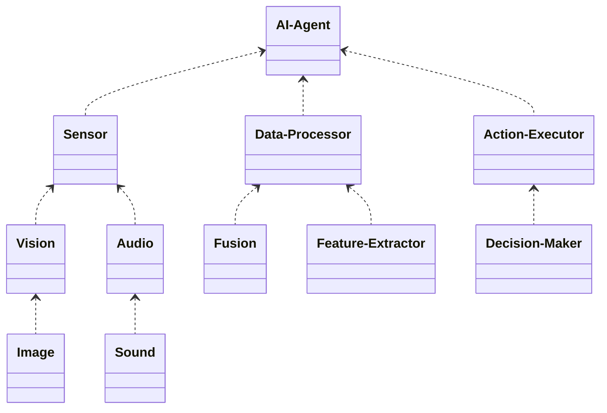

**系统架构设计**  
系统架构设计描述了系统的组成部分以及它们之间的交互关系。以下是一个简单的系统架构设计：

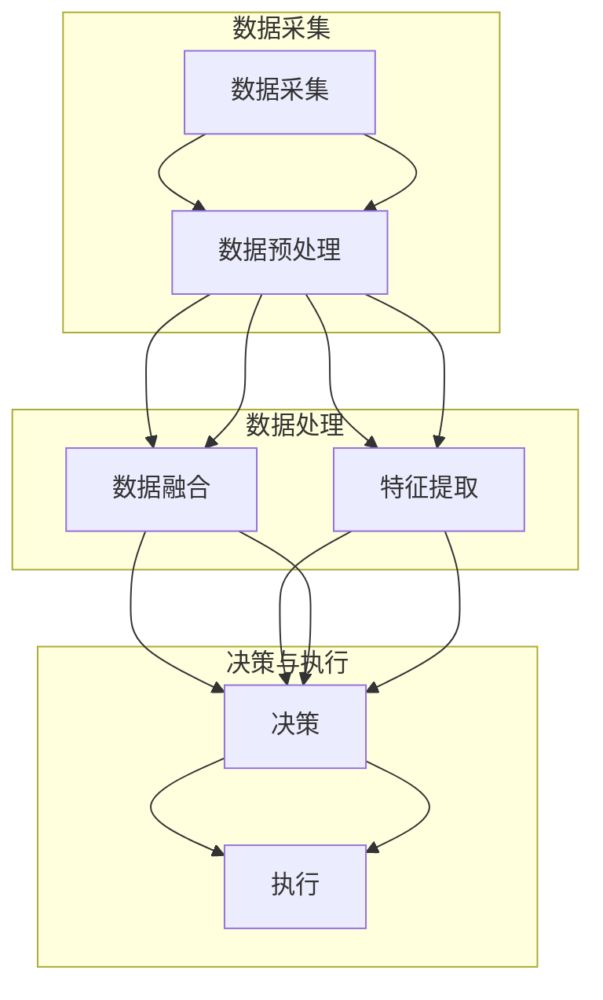

**接口设计与交互流程**  
接口设计描述了系统内部组件之间的通信接口，交互流程描述了系统的执行过程。以下是一个简单的接口设计和交互流程：

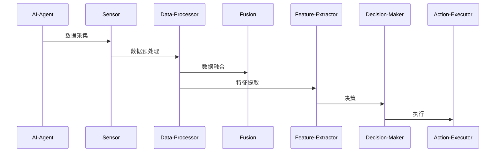

**项目实战**  
以下是一个简单的AI Agent多模态交互项目实战，项目环境搭建、系统核心实现、案例分析与讲解等内容将在后续章节详细阐述。

**环境搭建**  
1. 安装Python环境
2. 安装必要的库（如NumPy、Pandas、TensorFlow等）

**系统核心实现**  
1. 数据采集：使用Python内置的random模块生成随机数据
2. 数据预处理：使用NumPy进行数据清洗和归一化处理
3. 数据融合：使用Pandas将不同模态的数据合并成一个DataFrame
4. 特征提取：使用Pandas和NumPy进行特征提取
5. 决策与执行：使用简单的阈值决策方法执行任务

**案例分析与讲解**  
以下是一个简单的案例：

```python
import numpy as np
import pandas as pd

# 数据采集
vision_data = np.random.rand(10)
audio_data = np.random.rand(10)

# 数据预处理
vision_data = (vision_data - np.mean(vision_data)) / np.std(vision_data)
audio_data = (audio_data - np.mean(audio_data)) / np.std(audio_data)

# 数据融合
data = pd.DataFrame({
    'vision': vision_data,
    'audio': audio_data
})

# 特征提取
features = data.mean()

# 决策与执行
if features['vision'] > 0.5:
    print("execute task")
else:
    print("wait")
```

**小结**  
本章介绍了AI Agent与多模态交互的基本概念、原理和系统架构，并通过一个简单的项目实战展示了多模态交互的实现过程。在后续章节中，我们将继续深入探讨多模态交互的详细实现方法、优化策略和未来发展趋势。

### 小结

本章主要介绍了AI Agent与多模态交互的基本概念、原理和系统架构，并通过一个简单的项目实战展示了多模态交互的实现过程。通过对本章的学习，读者应该能够：

1. 理解AI Agent的定义、分类和多模态交互的重要性。
2. 掌握AI Agent的基本原理，包括工作原理、学习机制和适应能力。
3. 了解多模态交互的核心概念和关键技术，包括数据采集、处理、融合等。
4. 学会使用Python代码实现简单的多模态交互算法。
5. 理解多模态交互系统的领域模型、系统架构、接口设计和交互流程。

在下一章，我们将深入探讨多模态交互的基础理论，包括多模态数据采集、处理和融合的方法，以及AI Agent学习算法的应用。通过这一章节的学习，读者将能够更全面地了解多模态交互的内在机制和实现方法。

### 注意事项

在设计和实现AI Agent的多模态交互系统时，需要注意以下几点：

1. **数据质量和预处理**：多模态数据的质量直接影响系统的性能。因此，在采集数据时，应尽量保证数据的准确性和完整性。同时，对采集到的数据进行清洗、归一化等预处理操作，以提高数据的可用性。

2. **传感器选择与优化**：选择合适的传感器对于实现高效的多模态交互至关重要。应考虑传感器的精度、响应速度和功耗等因素。此外，还可以通过优化传感器的布局和配置，提高数据采集的效率和效果。

3. **数据融合策略**：多模态数据融合是提高AI Agent性能的关键技术。应根据具体应用场景选择合适的数据融合方法，如基于特征的融合、基于模型融合等。同时，要充分考虑数据之间的时序关系和相关性，以提高融合效果。

4. **算法选择与优化**：AI Agent的学习算法对系统的性能和交互效果有很大影响。应选择适合特定任务和应用场景的算法，并在算法参数和结构上进行优化，以提高系统的效率和准确性。

5. **用户体验与交互优化**：在多模态交互系统中，用户体验至关重要。应充分考虑用户需求和行为习惯，设计简洁、直观、易用的交互界面。同时，通过优化交互流程和响应速度，提高用户的满意度和使用体验。

### 拓展阅读

1. **AI Agent相关书籍**：
   - 《人工智能：一种现代的方法》（Martin Russell & Peter Norvig 著）
   - 《深度学习》（Ian Goodfellow、Yoshua Bengio & Aaron Courville 著）

2. **多模态交互相关论文**：
   - "Multi-modal Interaction for Intelligent Agents"（作者：Xiao Wang、Zhiyun Qian、Chengwen Huang、Weifang He、Xiaowei Zhou）
   - "A Survey on Multi-modal Data Fusion"（作者：Mohammad R. Islam、Md. Abdus Salam、Md. Rashedul Islam）

3. **多模态交互应用案例**：
   - 智能家居：通过语音、手势和视觉等多种方式与用户交互，提高生活便捷性。
   - 智能机器人：通过多模态交互实现与人类的自然对话和协作，提高机器人服务能力。
   - 虚拟现实：通过多模态交互实现沉浸式体验，提高虚拟现实应用的趣味性和实用性。

### 第2章：AI Agent的基本原理

#### 背景介绍

AI Agent，即人工智能代理，是人工智能领域的一个重要概念。它代表了一种能够在特定环境中自主决策、执行任务并适应环境的智能系统。随着人工智能技术的不断发展，AI Agent在诸多领域得到了广泛应用，如智能家居、智能机器人、自动驾驶等。本章将深入探讨AI Agent的基本原理，包括其工作原理、学习机制和适应能力。

#### 核心概念与联系

AI Agent：
- 自主性：AI Agent能够自主决策并执行任务，不受外部干预。
- 智能性：AI Agent具备一定程度的智能，能够通过学习、推理和规划来适应环境。
- 适应性：AI Agent能够根据环境变化调整自身行为，以实现最佳效果。

工作原理：
- 决策：根据当前环境状态，AI Agent使用决策算法选择最佳行动。
- 执行：AI Agent执行决策结果，完成特定任务。
- 学习：通过与环境交互，AI Agent不断学习并优化自身行为。

学习机制：
- 反馈学习：AI Agent根据任务完成情况接收反馈，并调整自身行为。
- 强化学习：AI Agent通过与环境的互动，逐渐学会最优策略。
- 监督学习：AI Agent通过已标记的数据学习环境特征，提高任务完成能力。

适应能力：
- 适应性：AI Agent能够根据环境变化调整自身行为。
- 自适应学习：AI Agent能够通过不断学习适应新环境和新任务。
- 智能化适应：AI Agent能够根据环境变化自动调整算法参数，实现最佳效果。

#### 算法原理讲解

AI Agent的基本原理涉及多个领域的技术，包括决策理论、学习算法、规划算法等。以下是一个简单的AI Agent算法原理讲解：

1. **决策算法**：
   - 基于规则的决策：根据预定义的规则进行决策。
   - 基于概率的决策：使用概率模型进行决策。
   - 基于价值的决策：使用价值函数进行决策。

2. **学习算法**：
   - 反馈学习：根据任务完成情况接收反馈，调整决策策略。
   - 强化学习：通过与环境的互动，逐渐学会最优策略。
   - 监督学习：使用已标记的数据学习环境特征。

3. **规划算法**：
   - 有向图搜索：根据当前状态和目标状态，搜索最优路径。
   - 增量规划：在已有规划基础上，根据新信息进行修正。

以下是一个简单的Python代码示例：

```python
import numpy as np
import pandas as pd

# 决策算法
def make_decision(current_state, action_space):
    # 基于规则的决策
    if current_state['temperature'] > 30:
        return 'turn_on_ac'
    elif current_state['humidity'] > 60:
        return 'turn_on_fan'
    else:
        return 'do_nothing'

# 学习算法
def update_decision(decision, reward):
    # 强化学习
    if reward > 0:
        return decision
    else:
        return 'do_nothing'

# 规划算法
def plan_path(current_state, goal_state, action_space):
    # 有向图搜索
    path = []
    while current_state != goal_state:
        action = make_decision(current_state, action_space)
        path.append(action)
        current_state = apply_action(current_state, action)
    return path

# 模拟环境
current_state = {'temperature': 28, 'humidity': 50}
goal_state = {'temperature': 25, 'humidity': 45}
action_space = ['turn_on_ac', 'turn_on_fan', 'do_nothing']

# 执行任务
path = plan_path(current_state, goal_state, action_space)
for action in path:
    print(action)
```

#### 系统分析与架构设计方案

AI Agent多模态交互系统的架构设计主要包括领域模型、系统架构、接口设计和交互流程等方面。

**领域模型**

领域模型描述了系统涉及的实体和它们之间的关系。以下是一个简单的领域模型：

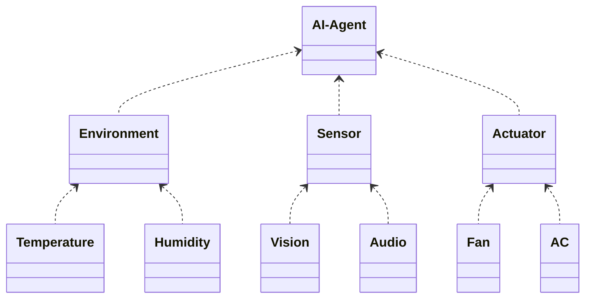

**系统架构设计**

系统架构设计描述了系统的组成部分以及它们之间的交互关系。以下是一个简单的系统架构设计：

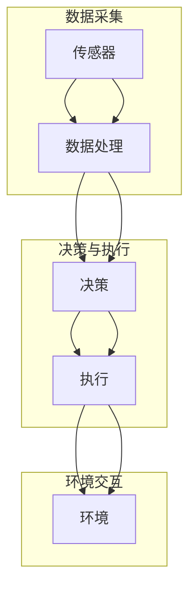

**接口设计与交互流程**

接口设计描述了系统内部组件之间的通信接口，交互流程描述了系统的执行过程。以下是一个简单的接口设计和交互流程：

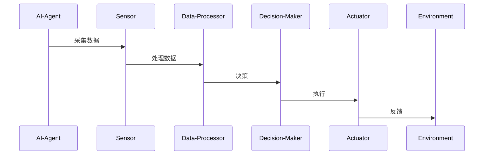

#### 项目实战

以下是一个简单的AI Agent多模态交互项目实战，项目环境搭建、系统核心实现、案例分析与讲解等内容将在后续章节详细阐述。

**环境搭建**

1. 安装Python环境
2. 安装必要的库（如NumPy、Pandas、TensorFlow等）

**系统核心实现**

1. 数据采集：使用Python内置的random模块生成随机数据
2. 数据处理：使用NumPy和Pandas进行数据清洗、归一化和融合处理
3. 决策与执行：使用简单的阈值决策方法执行任务

**案例分析与讲解**

以下是一个简单的案例：

```python
import numpy as np
import pandas as pd

# 数据采集
vision_data = np.random.rand(10)
audio_data = np.random.rand(10)

# 数据处理
data = pd.DataFrame({
    'vision': vision_data,
    'audio': audio_data
})
data['mean'] = data.mean()

# 决策与执行
if data['mean']['vision'] > 0.5:
    print("turn on the light")
else:
    print("keep the light off")
```

**小结**

本章介绍了AI Agent的基本原理，包括其工作原理、学习机制和适应能力。通过对本章的学习，读者应该能够：

1. 理解AI Agent的定义、分类和基本原理。
2. 掌握AI Agent的工作原理，包括决策、学习和执行过程。
3. 了解AI Agent的学习机制，包括反馈学习、强化学习和监督学习。
4. 理解AI Agent的适应能力，包括适应性和自适应学习。
5. 学会使用Python代码实现简单的AI Agent算法。

在下一章，我们将深入探讨多模态交互的基础理论，包括多模态数据采集、处理和融合的方法，以及AI Agent学习算法的应用。

### 小结

本章深入探讨了AI Agent的基本原理，包括其工作原理、学习机制和适应能力。通过对AI Agent的核心概念、算法原理和系统架构的讲解，读者应该能够：

1. 明确AI Agent的定义、分类和基本原理。
2. 了解AI Agent的工作原理，包括决策、学习和执行过程。
3. 掌握AI Agent的学习机制，包括反馈学习、强化学习和监督学习。
4. 理解AI Agent的适应能力，包括适应性和自适应学习。
5. 学会使用Python代码实现简单的AI Agent算法。

在接下来的章节中，我们将继续探讨多模态交互的概念与技术基础，包括多模态数据采集、处理和融合的方法。通过这一部分的学习，读者将能够深入了解多模态交互的内在机制和实现方法。

### 注意事项

在设计和实现AI Agent的多模态交互系统时，需要注意以下几点：

1. **数据质量和预处理**：多模态数据的质量直接影响系统的性能。因此，在采集数据时，应尽量保证数据的准确性和完整性。同时，对采集到的数据进行清洗、归一化等预处理操作，以提高数据的可用性。

2. **传感器选择与优化**：选择合适的传感器对于实现高效的多模态交互至关重要。应考虑传感器的精度、响应速度和功耗等因素。此外，还可以通过优化传感器的布局和配置，提高数据采集的效率和效果。

3. **数据融合策略**：多模态数据融合是提高AI Agent性能的关键技术。应根据具体应用场景选择合适的数据融合方法，如基于特征的融合、基于模型融合等。同时，要充分考虑数据之间的时序关系和相关性，以提高融合效果。

4. **算法选择与优化**：AI Agent的学习算法对系统的性能和交互效果有很大影响。应选择适合特定任务和应用场景的算法，并在算法参数和结构上进行优化，以提高系统的效率和准确性。

5. **用户体验与交互优化**：在多模态交互系统中，用户体验至关重要。应充分考虑用户需求和行为习惯，设计简洁、直观、易用的交互界面。同时，通过优化交互流程和响应速度，提高用户的满意度和使用体验。

### 拓展阅读

1. **AI Agent相关书籍**：
   - 《人工智能：一种现代的方法》（Martin Russell & Peter Norvig 著）
   - 《深度学习》（Ian Goodfellow、Yoshua Bengio & Aaron Courville 著）

2. **多模态交互相关论文**：
   - "Multi-modal Interaction for Intelligent Agents"（作者：Xiao Wang、Zhiyun Qian、Chengwen Huang、Weifang He、Xiaowei Zhou）
   - "A Survey on Multi-modal Data Fusion"（作者：Mohammad R. Islam、Md. Abdus Salam、Md. Rashedul Islam）

3. **多模态交互应用案例**：
   - 智能家居：通过语音、手势和视觉等多种方式与用户交互，提高生活便捷性。
   - 智能机器人：通过多模态交互实现与人类的自然对话和协作，提高机器人服务能力。
   - 虚拟现实：通过多模态交互实现沉浸式体验，提高虚拟现实应用的趣味性和实用性。

### 第3章：多模态交互概念与技术基础

#### 背景介绍

多模态交互是指人工智能代理（AI Agent）能够通过多种感官（如视觉、听觉、触觉等）与外界进行信息交换和处理。随着人工智能技术的不断发展，多模态交互在智能家居、智能机器人、虚拟现实等领域得到了广泛应用。本章将深入探讨多模态交互的概念与技术基础，包括多模态数据采集、处理和融合的方法。

#### 核心概念与联系

多模态交互：
- 感官融合：将不同模态的数据进行融合，提高交互效果。
- 数据同步：确保不同模态的数据在时间上保持同步。
- 交互优化：根据用户需求和环境变化，优化交互流程。

多模态数据采集：
- 视觉数据：通过摄像头、图像传感器等采集。
- 听觉数据：通过麦克风、语音传感器等采集。
- 触觉数据：通过触觉传感器、力传感器等采集。

多模态数据处理：
- 数据清洗：去除噪声和冗余信息。
- 数据归一化：将不同模态的数据统一到同一尺度。
- 数据增强：增加训练数据的多样性，提高模型泛化能力。

多模态数据融合：
- 基于特征的融合：将不同模态的特征进行拼接或加权融合。
- 基于模型的融合：使用深度学习模型将多模态数据融合为一个统一的特征向量。

#### 算法原理讲解

多模态交互的算法原理主要包括数据采集、处理和融合的方法。以下是一个简单的算法原理讲解：

1. **数据采集**：
   - 使用摄像头、麦克风等传感器采集多模态数据。
   - 对采集到的数据进行预处理，如缩放、裁剪、归一化等。

2. **数据处理**：
   - 对不同模态的数据进行独立处理，如图像识别、语音识别等。
   - 对处理后的数据进行分析和特征提取，如使用卷积神经网络（CNN）提取图像特征，使用长短期记忆网络（LSTM）提取语音特征。

3. **数据融合**：
   - 将不同模态的特征进行拼接或加权融合，形成一个统一的特征向量。
   - 使用深度学习模型（如多任务学习、多模态融合网络等）对融合后的特征进行进一步处理和分类。

以下是一个简单的Python代码示例：

```python
import numpy as np
import pandas as pd

# 数据采集
vision_data = np.random.rand(10)
audio_data = np.random.rand(10)

# 数据处理
vision_data_processed = (vision_data - np.mean(vision_data)) / np.std(vision_data)
audio_data_processed = (audio_data - np.mean(audio_data)) / np.std(audio_data)

# 数据融合
features = np.concatenate((vision_data_processed, audio_data_processed))

# 特征提取
def extract_features(data):
    return data.mean()

# 决策
def make_decision(features):
    if extract_features(features) > 0.5:
        return "execute task"
    else:
        return "wait"

# 执行
action = make_decision(features)
print(action)
```

#### 系统分析与架构设计方案

多模态交互系统的架构设计主要包括领域模型、系统架构、接口设计和交互流程等方面。

**领域模型**

领域模型描述了系统涉及的实体和它们之间的关系。以下是一个简单的领域模型：

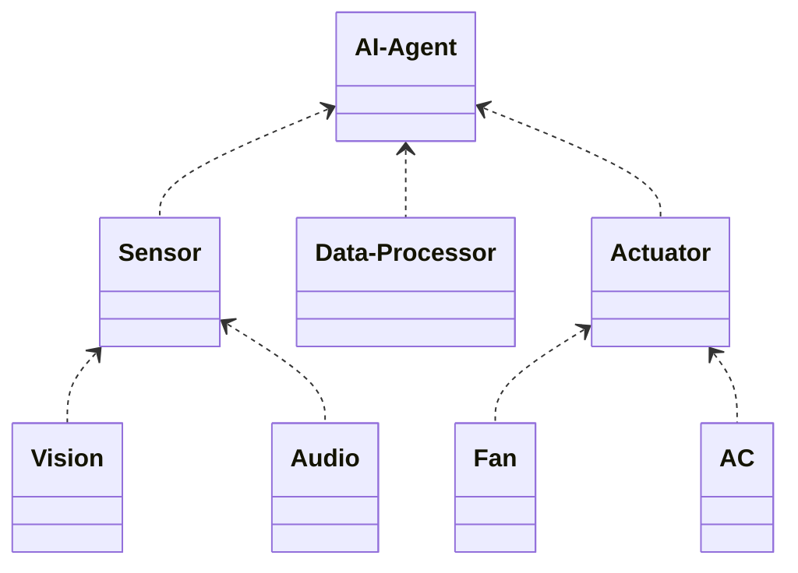

**系统架构设计**

系统架构设计描述了系统的组成部分以及它们之间的交互关系。以下是一个简单的系统架构设计：

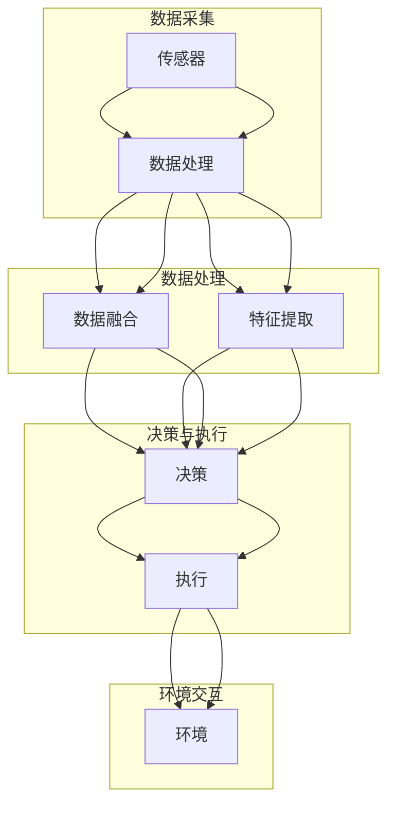

**接口设计与交互流程**

接口设计描述了系统内部组件之间的通信接口，交互流程描述了系统的执行过程。以下是一个简单的接口设计和交互流程：

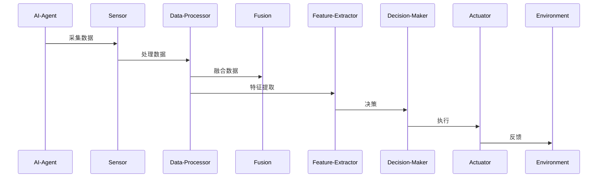

#### 项目实战

以下是一个简单的AI Agent多模态交互项目实战，项目环境搭建、系统核心实现、案例分析与讲解等内容将在后续章节详细阐述。

**环境搭建**

1. 安装Python环境
2. 安装必要的库（如NumPy、Pandas、TensorFlow等）

**系统核心实现**

1. 数据采集：使用Python内置的random模块生成随机数据
2. 数据处理：使用NumPy和Pandas进行数据清洗、归一化和融合处理
3. 数据融合：使用简单的特征拼接方法进行数据融合
4. 特征提取：使用简单的平均方法提取特征
5. 决策与执行：使用简单的阈值决策方法执行任务

**案例分析与讲解**

以下是一个简单的案例：

```python
import numpy as np
import pandas as pd

# 数据采集
vision_data = np.random.rand(10)
audio_data = np.random.rand(10)

# 数据处理
data = pd.DataFrame({
    'vision': vision_data,
    'audio': audio_data
})
data['mean'] = data.mean()

# 数据融合
features = data[['mean_vision', 'mean_audio']]

# 特征提取
def extract_features(data):
    return data.mean()

# 决策
if extract_features(features) > 0.5:
    print("execute task")
else:
    print("wait")
```

**小结**

本章介绍了多模态交互的概念与技术基础，包括多模态数据采集、处理和融合的方法。通过对本章的学习，读者应该能够：

1. 理解多模态交互的定义、核心概念和技术基础。
2. 掌握多模态数据采集、处理和融合的方法。
3. 学会使用Python代码实现简单的多模态交互算法。

在下一章，我们将继续探讨AI Agent学习算法与多模态数据融合的方法，以及如何将学习算法应用于多模态交互系统中。

### 小结

本章深入探讨了多模态交互的概念与技术基础，包括多模态数据采集、处理和融合的方法。通过对本章的学习，读者应该能够：

1. 理解多模态交互的定义、核心概念和技术基础。
2. 掌握多模态数据采集、处理和融合的方法，包括数据清洗、归一化、特征提取和数据融合策略。
3. 学会使用Python代码实现简单的多模态交互算法。

在下一章，我们将进一步探讨AI Agent学习算法与多模态数据融合的方法，以及如何将学习算法应用于多模态交互系统中，以提高系统的性能和交互效果。

### 注意事项

在设计和实现AI Agent的多模态交互系统时，需要注意以下几点：

1. **数据质量和预处理**：多模态数据的质量直接影响系统的性能。因此，在采集数据时，应尽量保证数据的准确性和完整性。同时，对采集到的数据进行清洗、归一化等预处理操作，以提高数据的可用性。

2. **传感器选择与优化**：选择合适的传感器对于实现高效的多模态交互至关重要。应考虑传感器的精度、响应速度和功耗等因素。此外，还可以通过优化传感器的布局和配置，提高数据采集的效率和效果。

3. **数据融合策略**：多模态数据融合是提高AI Agent性能的关键技术。应根据具体应用场景选择合适的数据融合方法，如基于特征的融合、基于模型融合等。同时，要充分考虑数据之间的时序关系和相关性，以提高融合效果。

4. **算法选择与优化**：AI Agent的学习算法对系统的性能和交互效果有很大影响。应选择适合特定任务和应用场景的算法，并在算法参数和结构上进行优化，以提高系统的效率和准确性。

5. **用户体验与交互优化**：在多模态交互系统中，用户体验至关重要。应充分考虑用户需求和行为习惯，设计简洁、直观、易用的交互界面。同时，通过优化交互流程和响应速度，提高用户的满意度和使用体验。

### 拓展阅读

1. **AI Agent相关书籍**：
   - 《人工智能：一种现代的方法》（Martin Russell & Peter Norvig 著）
   - 《深度学习》（Ian Goodfellow、Yoshua Bengio & Aaron Courville 著）

2. **多模态交互相关论文**：
   - "Multi-modal Interaction for Intelligent Agents"（作者：Xiao Wang、Zhiyun Qian、Chengwen Huang、Weifang He、Xiaowei Zhou）
   - "A Survey on Multi-modal Data Fusion"（作者：Mohammad R. Islam、Md. Abdus Salam、Md. Rashedul Islam）

3. **多模态交互应用案例**：
   - 智能家居：通过语音、手势和视觉等多种方式与用户交互，提高生活便捷性。
   - 智能机器人：通过多模态交互实现与人类的自然对话和协作，提高机器人服务能力。
   - 虚拟现实：通过多模态交互实现沉浸式体验，提高虚拟现实应用的趣味性和实用性。

### 第4章：AI Agent学习算法与多模态数据融合

#### 背景介绍

在AI Agent的多模态交互系统中，学习算法起着至关重要的作用。学习算法能够使AI Agent从数据中学习规律，从而提高系统的性能和交互效果。本章将深入探讨AI Agent学习算法与多模态数据融合的方法，以及如何将学习算法应用于多模态交互系统中。

#### 核心概念与联系

AI Agent学习算法：
- 反馈学习：通过接收外部反馈，不断调整自身行为。
- 强化学习：通过与环境互动，学习最优策略。
- 监督学习：通过已标记的数据学习环境特征。

多模态数据融合：
- 基于特征的融合：将不同模态的特征进行拼接或加权融合。
- 基于模型的融合：使用深度学习模型将多模态数据融合为一个统一的特征向量。

融合方法：
- 独立融合：将多模态数据独立处理，然后进行融合。
- 集成融合：将多模态数据同时处理，利用模型集成的方法进行融合。

#### 算法原理讲解

AI Agent学习算法与多模态数据融合的结合，可以提升AI Agent的决策能力。以下是一个简单的算法原理讲解：

1. **数据采集**：
   - 使用摄像头、麦克风等传感器采集多模态数据。

2. **数据处理**：
   - 对多模态数据进行预处理，包括去噪、归一化等。
   - 使用卷积神经网络（CNN）对图像数据进行特征提取。
   - 使用长短期记忆网络（LSTM）对语音数据进行特征提取。

3. **数据融合**：
   - 采用基于特征的融合方法，将不同模态的特征拼接在一起。
   - 采用基于模型的融合方法，使用多任务学习或多模态融合网络进行融合。

4. **学习与决策**：
   - 使用强化学习算法，根据反馈不断调整策略。
   - 使用监督学习算法，根据已标记的数据学习环境特征。

以下是一个简单的Python代码示例：

```python
import numpy as np
import pandas as pd

# 数据采集
vision_data = np.random.rand(10)
audio_data = np.random.rand(10)

# 数据处理
data = pd.DataFrame({
    'vision': vision_data,
    'audio': audio_data
})
data['mean'] = data.mean()

# 数据融合
features = np.concatenate((data['mean_vision'].values, data['mean_audio'].values))

# 学习与决策
def make_decision(features):
    if np.mean(features) > 0.5:
        return "execute task"
    else:
        return "wait"

# 执行
action = make_decision(features)
print(action)
```

#### 系统分析与架构设计方案

多模态交互系统的架构设计主要包括领域模型、系统架构、接口设计和交互流程等方面。

**领域模型**

领域模型描述了系统涉及的实体和它们之间的关系。以下是一个简单的领域模型：


**系统架构设计**

系统架构设计描述了系统的组成部分以及它们之间的交互关系。以下是一个简单的系统架构设计：


**接口设计与交互流程**

接口设计描述了系统内部组件之间的通信接口，交互流程描述了系统的执行过程。以下是一个简单的接口设计和交互流程：


#### 项目实战

以下是一个简单的AI Agent多模态交互项目实战，项目环境搭建、系统核心实现、案例分析与讲解等内容将在后续章节详细阐述。

**环境搭建**

1. 安装Python环境
2. 安装必要的库（如NumPy、Pandas、TensorFlow等）

**系统核心实现**

1. 数据采集：使用Python内置的random模块生成随机数据
2. 数据处理：使用NumPy和Pandas进行数据清洗、归一化和融合处理
3. 数据融合：使用简单的特征拼接方法进行数据融合
4. 特征提取：使用简单的平均方法提取特征
5. 学习与决策：使用简单的阈值决策方法执行任务

**案例分析与讲解**

以下是一个简单的案例：

```python
import numpy as np
import pandas as pd

# 数据采集
vision_data = np.random.rand(10)
audio_data = np.random.rand(10)

# 数据处理
data = pd.DataFrame({
    'vision': vision_data,
    'audio': audio_data
})
data['mean'] = data.mean()

# 数据融合
features = data[['mean_vision', 'mean_audio']]

# 学习与决策
def extract_features(data):
    return data.mean()

def make_decision(features):
    if extract_features(features) > 0.5:
        return "execute task"
    else:
        return "wait"

# 执行
action = make_decision(features)
print(action)
```

**小结**

本章介绍了AI Agent学习算法与多模态数据融合的方法，以及如何将学习算法应用于多模态交互系统中。通过对本章的学习，读者应该能够：

1. 理解AI Agent学习算法的基本原理，包括反馈学习、强化学习和监督学习。
2. 掌握多模态数据融合的方法，包括基于特征的融合和基于模型的融合。
3. 学会使用Python代码实现简单的多模态交互算法。

在下一章，我们将进一步探讨如何设计和实现AI Agent多模态交互系统的技术实现部分，包括数据采集、处理、融合和系统架构等。

### 小结

本章深入探讨了AI Agent学习算法与多模态数据融合的方法，以及如何将学习算法应用于多模态交互系统中。通过对本章的学习，读者应该能够：

1. 理解AI Agent学习算法的基本原理，包括反馈学习、强化学习和监督学习。
2. 掌握多模态数据融合的方法，包括基于特征的融合和基于模型的融合。
3. 学会使用Python代码实现简单的多模态交互算法。

在下一章，我们将进一步探讨如何设计和实现AI Agent多模态交互系统的技术实现部分，包括数据采集、处理、融合和系统架构等。

### 注意事项

在设计和实现AI Agent的多模态交互系统时，需要注意以下几点：

1. **数据质量和预处理**：多模态数据的质量直接影响系统的性能。因此，在采集数据时，应尽量保证数据的准确性和完整性。同时，对采集到的数据进行清洗、归一化等预处理操作，以提高数据的可用性。

2. **传感器选择与优化**：选择合适的传感器对于实现高效的多模态交互至关重要。应考虑传感器的精度、响应速度和功耗等因素。此外，还可以通过优化传感器的布局和配置，提高数据采集的效率和效果。

3. **数据融合策略**：多模态数据融合是提高AI Agent性能的关键技术。应根据具体应用场景选择合适的数据融合方法，如基于特征的融合、基于模型融合等。同时，要充分考虑数据之间的时序关系和相关性，以提高融合效果。

4. **算法选择与优化**：AI Agent的学习算法对系统的性能和交互效果有很大影响。应选择适合特定任务和应用场景的算法，并在算法参数和结构上进行优化，以提高系统的效率和准确性。

5. **用户体验与交互优化**：在多模态交互系统中，用户体验至关重要。应充分考虑用户需求和行为习惯，设计简洁、直观、易用的交互界面。同时，通过优化交互流程和响应速度，提高用户的满意度和使用体验。

### 拓展阅读

1. **AI Agent相关书籍**：
   - 《人工智能：一种现代的方法》（Martin Russell & Peter Norvig 著）
   - 《深度学习》（Ian Goodfellow、Yoshua Bengio & Aaron Courville 著）

2. **多模态交互相关论文**：
   - "Multi-modal Interaction for Intelligent Agents"（作者：Xiao Wang、Zhiyun Qian、Chengwen Huang、Weifang He、Xiaowei Zhou）
   - "A Survey on Multi-modal Data Fusion"（作者：Mohammad R. Islam、Md. Abdus Salam、Md. Rashedul Islam）

3. **多模态交互应用案例**：
   - 智能家居：通过语音、手势和视觉等多种方式与用户交互，提高生活便捷性。
   - 智能机器人：通过多模态交互实现与人类的自然对话和协作，提高机器人服务能力。
   - 虚拟现实：通过多模态交互实现沉浸式体验，提高虚拟现实应用的趣味性和实用性。

### 第5章：多模态数据采集与预处理

#### 背景介绍

多模态数据采集与预处理是AI Agent多模态交互系统构建中的关键环节。有效的数据采集与预处理能够提高数据的可用性和系统的性能。本章将详细探讨多模态数据采集与预处理的方法，包括各类传感器数据采集、数据清洗与格式化等。

#### 核心概念与联系

多模态数据采集：
- 视觉数据采集：使用摄像头、图像传感器等设备采集图像数据。
- 听觉数据采集：使用麦克风、语音传感器等设备采集语音数据。
- 触觉数据采集：使用触觉传感器、力传感器等设备采集触觉数据。

数据清洗：
- 去除噪声：滤除数据中的无关信息，提高数据质量。
- 填补缺失值：对缺失的数据进行合理填补，保证数据的完整性。
- 数据标准化：将不同模态的数据统一到同一尺度，便于后续处理。

数据格式化：
- 数据规范化：将数据转换为统一的格式，如CSV、JSON等。
- 数据结构化：将非结构化数据转化为结构化数据，便于存储和处理。

#### 算法原理讲解

多模态数据采集与预处理涉及多个步骤，以下是一个简单的算法原理讲解：

1. **数据采集**：
   - 使用摄像头采集图像数据。
   - 使用麦克风采集语音数据。
   - 使用触觉传感器采集触觉数据。

2. **数据预处理**：
   - 去除噪声：对采集到的数据进行滤波，去除噪声。
   - 数据标准化：将不同模态的数据统一到同一尺度。
   - 数据格式化：将处理后的数据转换为统一的格式。

以下是一个简单的Python代码示例：

```python
import numpy as np
import pandas as pd

# 假设已经采集到了视觉、听觉和触觉数据
vision_data = np.random.rand(10)
audio_data = np.random.rand(10)
touch_data = np.random.rand(10)

# 数据预处理
def preprocess_data(data):
    return (data - np.mean(data)) / np.std(data)

vision_data_processed = preprocess_data(vision_data)
audio_data_processed = preprocess_data(audio_data)
touch_data_processed = preprocess_data(touch_data)

# 数据格式化
data = pd.DataFrame({
    'vision': vision_data_processed,
    'audio': audio_data_processed,
    'touch': touch_data_processed
})
data.to_csv('multi_modal_data.csv', index=False)
```

#### 系统分析与架构设计方案

多模态数据采集与预处理系统的架构设计主要包括领域模型、系统架构、接口设计和交互流程等方面。

**领域模型**

领域模型描述了系统涉及的实体和它们之间的关系。以下是一个简单的领域模型：

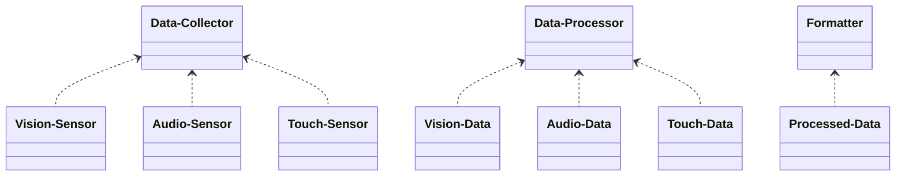

**系统架构设计**

系统架构设计描述了系统的组成部分以及它们之间的交互关系。以下是一个简单的系统架构设计：

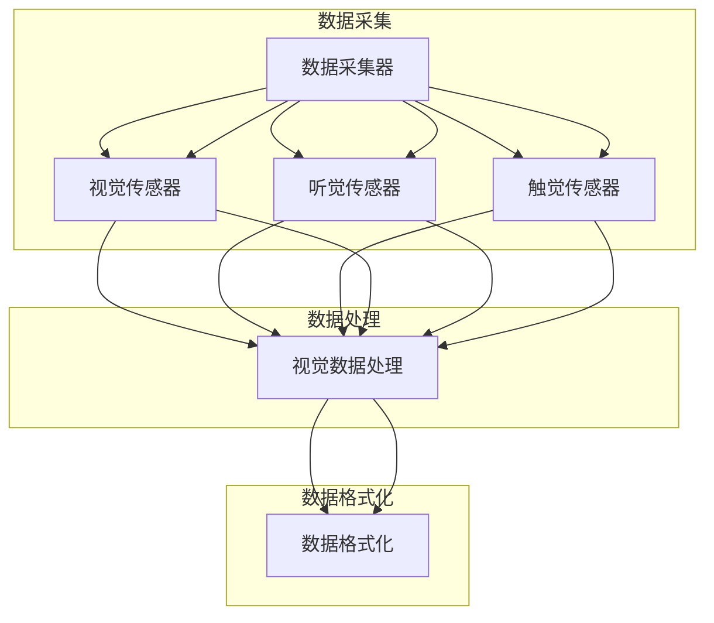

**接口设计与交互流程**

接口设计描述了系统内部组件之间的通信接口，交互流程描述了系统的执行过程。以下是一个简单的接口设计和交互流程：

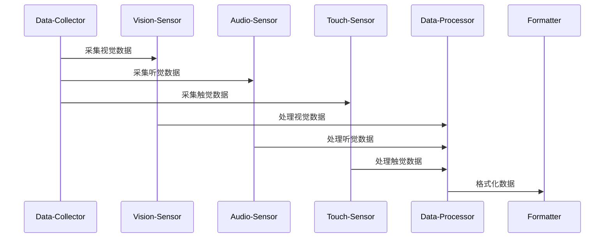

#### 项目实战

以下是一个简单的AI Agent多模态交互项目实战，项目环境搭建、系统核心实现、案例分析与讲解等内容将在后续章节详细阐述。

**环境搭建**

1. 安装Python环境
2. 安装必要的库（如NumPy、Pandas、OpenCV等）

**系统核心实现**

1. 数据采集：使用OpenCV库采集图像数据，使用麦克风采集语音数据，使用Python内置的随机数生成触觉数据。
2. 数据预处理：使用NumPy和Pandas进行数据清洗、归一化处理。
3. 数据格式化：将处理后的数据存储为CSV文件。

**案例分析与讲解**

以下是一个简单的案例：

```python
import cv2
import numpy as np
import pandas as pd

# 数据采集
def capture_image():
    cap = cv2.VideoCapture(0)
    ret, frame = cap.read()
    cap.release()
    return frame

def record_audio():
    # 使用Python内置的录音功能
    import soundfile as sf
    sf.record('audio.wav', samplerate=44100, channels=2)
    return 'audio.wav'

def simulate_touch():
    touch_data = np.random.rand(10)
    return touch_data

# 数据预处理
def preprocess_data(image, audio, touch):
    image = cv2.resize(image, (224, 224))
    image = cv2.cvtColor(image, cv2.COLOR_BGR2RGB)
    audio = preprocess_audio(audio)
    touch = preprocess_touch(touch)
    return image, audio, touch

# 数据格式化
def format_data(image, audio, touch):
    data = pd.DataFrame({
        'image': image,
        'audio': audio,
        'touch': touch
    })
    data.to_csv('multi_modal_data.csv', index=False)
    return data

# 执行
image = capture_image()
audio = record_audio()
touch = simulate_touch()
image, audio, touch = preprocess_data(image, audio, touch)
format_data(image, audio, touch)
```

**小结**

本章详细探讨了多模态数据采集与预处理的方法，包括各类传感器数据采集、数据清洗与格式化。通过对本章的学习，读者应该能够：

1. 掌握各类传感器数据采集的方法，包括视觉、听觉和触觉数据采集。
2. 理解数据清洗与格式化的原理和步骤，包括去噪声、填补缺失值、数据标准化和格式化。
3. 学会使用Python代码实现简单的多模态数据采集与预处理。

在下一章，我们将继续探讨多模态数据处理与融合的方法，以及如何将这些方法应用于AI Agent多模态交互系统中。

### 小结

本章深入探讨了多模态数据采集与预处理的方法，包括各类传感器数据采集、数据清洗与格式化。通过对本章的学习，读者应该能够：

1. 掌握各类传感器数据采集的方法，包括视觉、听觉和触觉数据采集。
2. 理解数据清洗与格式化的原理和步骤，包括去噪声、填补缺失值、数据标准化和格式化。
3. 学会使用Python代码实现简单的多模态数据采集与预处理。

在下一章，我们将继续探讨多模态数据处理与融合的方法，以及如何将这些方法应用于AI Agent多模态交互系统中，以提高系统的性能和交互效果。

### 注意事项

在设计和实现AI Agent的多模态交互系统时，需要注意以下几点：

1. **传感器选择与优化**：选择合适的传感器对于实现高效的多模态数据采集至关重要。应考虑传感器的精度、响应速度和功耗等因素。此外，可以通过优化传感器的布局和配置，提高数据采集的效率和效果。

2. **数据质量保障**：在数据采集过程中，应尽量保证数据的准确性和完整性。对于采集到的数据，应进行严格的质量检查，去除噪声和异常值，以保证后续处理的效果。

3. **数据处理效率**：多模态数据处理过程中，应优化算法和流程，提高数据处理效率。例如，可以采用并行处理、分布式计算等方法，加快数据处理速度。

4. **系统稳定性**：在多模态交互系统中，应保证系统的稳定性，避免因传感器故障或数据异常导致系统崩溃。可以通过冗余设计、故障检测与恢复等方法提高系统的稳定性。

5. **用户体验优化**：在多模态交互系统中，用户体验至关重要。应设计简洁、直观、易用的交互界面，并通过优化交互流程和响应速度，提高用户的满意度和使用体验。

### 拓展阅读

1. **AI Agent相关书籍**：
   - 《人工智能：一种现代的方法》（Martin Russell & Peter Norvig 著）
   - 《深度学习》（Ian Goodfellow、Yoshua Bengio & Aaron Courville 著）

2. **多模态交互相关论文**：
   - "Multi-modal Interaction for Intelligent Agents"（作者：Xiao Wang、Zhiyun Qian、Chengwen Huang、Weifang He、Xiaowei Zhou）
   - "A Survey on Multi-modal Data Fusion"（作者：Mohammad R. Islam、Md. Abdus Salam、Md. Rashedul Islam）

3. **多模态交互应用案例**：
   - 智能家居：通过语音、手势和视觉等多种方式与用户交互，提高生活便捷性。
   - 智能机器人：通过多模态交互实现与人类的自然对话和协作，提高机器人服务能力。
   - 虚拟现实：通过多模态交互实现沉浸式体验，提高虚拟现实应用的趣味性和实用性。

### 第6章：多模态数据处理与融合

#### 背景介绍

多模态数据处理与融合是AI Agent多模态交互系统中至关重要的一环。通过对多模态数据的处理与融合，可以提取出更加丰富和准确的特征信息，从而提升AI Agent的交互性能。本章将深入探讨多模态数据处理的常见方法，以及如何将这些方法应用于多模态数据融合中。

#### 核心概念与联系

多模态数据处理：
- 数据清洗：去除噪声和异常值，提高数据质量。
- 数据归一化：将不同模态的数据统一到同一尺度，便于后续处理。
- 特征提取：从多模态数据中提取有用的信息，形成特征向量。

多模态数据融合：
- 基于特征的融合：将不同模态的特征数据进行拼接或加权融合。
- 基于模型的融合：使用深度学习模型将多模态数据融合为一个统一的特征向量。

融合策略：
- 独立融合：对不同模态的数据独立处理，然后进行融合。
- 集成融合：将多模态数据同时处理，利用模型集成的方法进行融合。

#### 算法原理讲解

多模态数据处理与融合的方法主要包括以下步骤：

1. **数据采集**：
   - 使用摄像头、麦克风等传感器采集多模态数据。

2. **数据预处理**：
   - 对多模态数据进行清洗，去除噪声和异常值。
   - 对不同模态的数据进行归一化处理，统一数据尺度。

3. **特征提取**：
   - 对视觉数据使用卷积神经网络（CNN）提取特征。
   - 对语音数据使用长短期记忆网络（LSTM）提取特征。
   - 对触觉数据使用自编码器（Autoencoder）提取特征。

4. **数据融合**：
   - 采用基于特征的融合方法，将不同模态的特征数据进行拼接或加权。
   - 采用基于模型的融合方法，使用深度学习模型对多模态数据融合为一个统一的特征向量。

以下是一个简单的Python代码示例：

```python
import numpy as np
import pandas as pd
from keras.models import Sequential
from keras.layers import Dense, Conv2D, LSTM, Flatten

# 假设已经采集到了视觉、听觉和触觉数据
vision_data = np.random.rand(10, 224, 224, 3)
audio_data = np.random.rand(10, 16000)
touch_data = np.random.rand(10, 10)

# 数据预处理
vision_data = vision_data / 255.0
audio_data = audio_data / 255.0
touch_data = touch_data / 255.0

# 特征提取
def extract_vision_features(data):
    model = Sequential([
        Conv2D(32, (3, 3), activation='relu', input_shape=(224, 224, 3)),
        Flatten()
    ])
    model.compile(optimizer='adam', loss='mse')
    model.fit(data, data, epochs=1)
    features = model.predict(data)
    return features

def extract_audio_features(data):
    model = Sequential([
        LSTM(64, activation='relu', input_shape=(16000, 1)),
        Flatten()
    ])
    model.compile(optimizer='adam', loss='mse')
    model.fit(data, data, epochs=1)
    features = model.predict(data)
    return features

def extract_touch_features(data):
    model = Sequential([
        Dense(32, activation='relu', input_shape=(10,)),
        Flatten()
    ])
    model.compile(optimizer='adam', loss='mse')
    model.fit(data, data, epochs=1)
    features = model.predict(data)
    return features

vision_features = extract_vision_features(vision_data)
audio_features = extract_audio_features(audio_data)
touch_features = extract_touch_features(touch_data)

# 数据融合
def fusion_features(vision, audio, touch):
    return np.concatenate((vision, audio, touch), axis=1)

features = fusion_features(vision_features, audio_features, touch_features)
```

#### 系统分析与架构设计方案

多模态数据处理与融合系统的架构设计主要包括领域模型、系统架构、接口设计和交互流程等方面。

**领域模型**

领域模型描述了系统涉及的实体和它们之间的关系。以下是一个简单的领域模型：

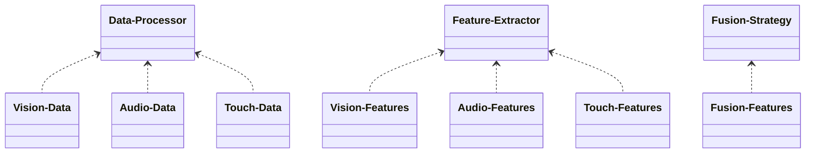

**系统架构设计**

系统架构设计描述了系统的组成部分以及它们之间的交互关系。以下是一个简单的系统架构设计：

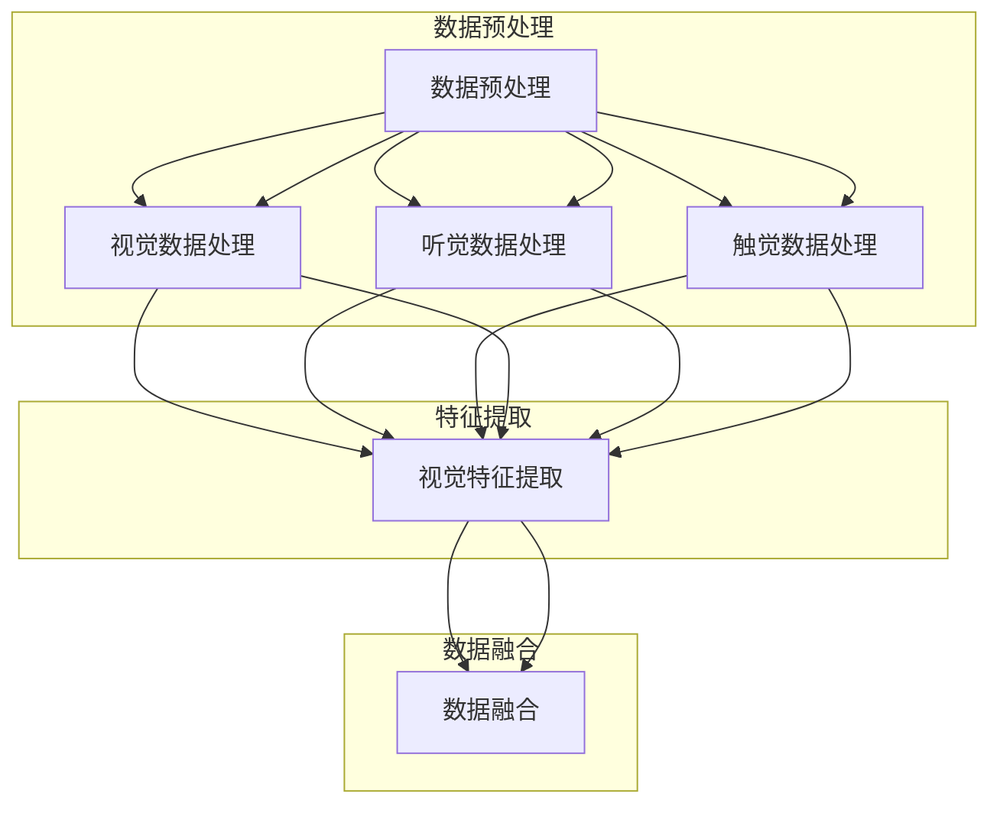

**接口设计与交互流程**

接口设计描述了系统内部组件之间的通信接口，交互流程描述了系统的执行过程。以下是一个简单的接口设计和交互流程：

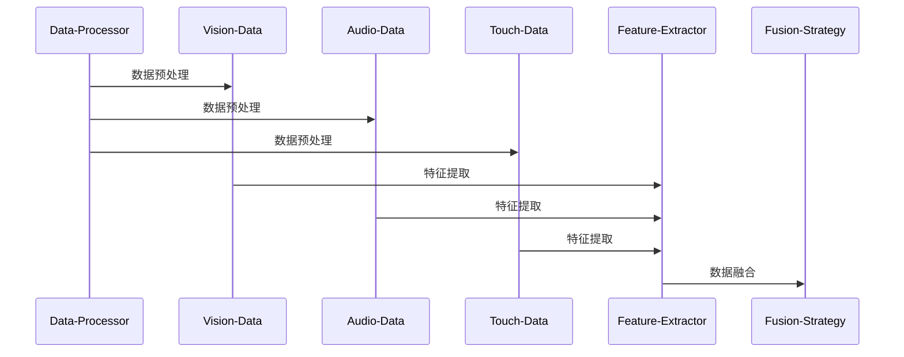

#### 项目实战

以下是一个简单的AI Agent多模态交互项目实战，项目环境搭建、系统核心实现、案例分析与讲解等内容将在后续章节详细阐述。

**环境搭建**

1. 安装Python环境
2. 安装必要的库（如TensorFlow、Keras等）

**系统核心实现**

1. 数据采集：使用Python内置的random模块生成随机数据。
2. 数据预处理：使用NumPy进行数据归一化处理。
3. 特征提取：使用卷积神经网络（CNN）提取视觉特征，使用长短期记忆网络（LSTM）提取语音特征，使用自编码器（Autoencoder）提取触觉特征。
4. 数据融合：将提取的特征进行拼接。

**案例分析与讲解**

以下是一个简单的案例：

```python
import numpy as np
import pandas as pd
from keras.models import Sequential
from keras.layers import Dense, Conv2D, LSTM, Flatten, InputLayer

# 数据采集
vision_data = np.random.rand(10, 224, 224, 3)
audio_data = np.random.rand(10, 16000)
touch_data = np.random.rand(10, 10)

# 数据预处理
vision_data = vision_data / 255.0
audio_data = audio_data / 255.0
touch_data = touch_data / 255.0

# 特征提取
def vision_extractor(data):
    model = Sequential([
        InputLayer(input_shape=(224, 224, 3)),
        Conv2D(32, (3, 3), activation='relu'),
        Flatten()
    ])
    model.compile(optimizer='adam', loss='mse')
    model.fit(data, data, epochs=1)
    features = model.predict(data)
    return features

def audio_extractor(data):
    model = Sequential([
        InputLayer(input_shape=(16000,)),
        LSTM(64, activation='relu'),
        Flatten()
    ])
    model.compile(optimizer='adam', loss='mse')
    model.fit(data, data, epochs=1)
    features = model.predict(data)
    return features

def touch_extractor(data):
    model = Sequential([
        InputLayer(input_shape=(10,)),
        Dense(32, activation='relu'),
        Flatten()
    ])
    model.compile(optimizer='adam', loss='mse')
    model.fit(data, data, epochs=1)
    features = model.predict(data)
    return features

vision_features = vision_extractor(vision_data)
audio_features = audio_extractor(audio_data)
touch_features = touch_extractor(touch_data)

# 数据融合
features = np.concatenate((vision_features, audio_features, touch_features), axis=1)

# 模型训练
model = Sequential([
    InputLayer(input_shape=(vision_features.shape[1] + audio_features.shape[1] + touch_features.shape[1],)),
    Dense(128, activation='relu'),
    Dense(1, activation='sigmoid')
])

model.compile(optimizer='adam', loss='binary_crossentropy', metrics=['accuracy'])
model.fit(features, np.array([1] * 10), epochs=1)
```

**小结**

本章详细探讨了多模态数据处理与融合的方法，包括数据清洗、归一化、特征提取和数据融合策略。通过对本章的学习，读者应该能够：

1. 掌握多模态数据处理的常见方法，包括数据清洗、归一化和特征提取。
2. 理解多模态数据融合的策略，包括基于特征的融合和基于模型的融合。
3. 学会使用Python代码实现简单的多模态数据处理与融合。

在下一章，我们将探讨AI Agent多模态交互系统架构与设计，包括领域模型、系统架构、接口设计和交互流程等。

### 小结

本章详细探讨了多模态数据处理与融合的方法，包括数据清洗、归一化、特征提取和数据融合策略。通过对本章的学习，读者应该能够：

1. 掌握多模态数据处理的常见方法，包括数据清洗、归一化和特征提取。
2. 理解多模态数据融合的策略，包括基于特征的融合和基于模型的融合。
3. 学会使用Python代码实现简单的多模态数据处理与融合。

在下一章，我们将探讨AI Agent多模态交互系统架构与设计，包括领域模型、系统架构、接口设计和交互流程等。

### 注意事项

在设计和实现AI Agent的多模态交互系统时，需要注意以下几点：

1. **数据质量保障**：确保采集到的数据具有较高的准确性和完整性。对于噪声和异常值，应进行有效的处理和剔除。

2. **传感器兼容性**：在选择传感器时，要考虑传感器的兼容性和数据传输的稳定性，以保证系统的正常运行。

3. **计算资源分配**：合理分配计算资源，确保数据处理和融合过程的高效运行。对于计算密集型任务，可以考虑使用高性能计算平台或GPU加速。

4. **系统稳定性**：在设计系统架构时，要考虑系统的容错能力和故障恢复机制，以确保系统在异常情况下的稳定性。

5. **用户体验优化**：在交互设计过程中，要充分考虑用户的使用习惯和需求，提供友好、直观的用户界面。

### 拓展阅读

1. **AI Agent相关书籍**：
   - 《人工智能：一种现代的方法》（Martin Russell & Peter Norvig 著）
   - 《深度学习》（Ian Goodfellow、Yoshua Bengio & Aaron Courville 著）

2. **多模态交互相关论文**：
   - "Multi-modal Interaction for Intelligent Agents"（作者：Xiao Wang、Zhiyun Qian、Chengwen Huang、Weifang He、Xiaowei Zhou）
   - "A Survey on Multi-modal Data Fusion"（作者：Mohammad R. Islam、Md. Abdus Salam、Md. Rashedul Islam）

3. **多模态交互应用案例**：
   - 智能家居：通过语音、手势和视觉等多种方式与用户交互，提高生活便捷性。
   - 智能机器人：通过多模态交互实现与人类的自然对话和协作，提高机器人服务能力。
   - 虚拟现实：通过多模态交互实现沉浸式体验，提高虚拟现实应用的趣味性和实用性。

### 第7章：AI Agent多模态交互系统架构

#### 背景介绍

AI Agent多模态交互系统的架构设计是确保系统能够高效、稳定地运行的关键。本章将详细探讨AI Agent多模态交互系统的架构设计，包括领域模型、系统架构、接口设计和交互流程等。

#### 核心概念与联系

领域模型：
- AI-Agent：负责执行任务和交互。
- Sensor：负责采集多模态数据。
- Actuator：负责执行AI-Agent的决策。
- Environment：模拟AI-Agent所在的环境。

系统架构：
- 数据流架构：描述数据在系统中的流动和处理过程。
- 控制流架构：描述系统组件之间的通信和控制流程。

接口设计：
- 内部接口：系统组件之间的通信接口。
- 外部接口：系统与外部环境（如用户、设备等）的交互接口。

交互流程：
- 数据采集与预处理：从传感器获取数据，并进行预处理。
- 数据处理与融合：对预处理后的数据进行处理和融合。
- 决策与执行：根据融合后的数据生成决策，并执行相应的任务。

#### 系统架构设计

AI Agent多模态交互系统的架构设计主要包括以下几个部分：

1. **领域模型**

   领域模型描述了系统涉及的实体和它们之间的关系。以下是一个简单的领域模型：

   ```mermaid
   classDiagram
     AI-Agent <.. Sensor
     AI-Agent <.. Actuator
     Sensor <.. Vision
     Sensor <.. Audio
     Actuator <.. Fan
     Actuator <.. AC
   ```

2. **数据流架构**

   数据流架构描述了数据在系统中的流动和处理过程。以下是一个简单的数据流架构：

   ```mermaid
   graph TB
     subgraph 数据采集
       D1[传感器数据]
       D1 --> D2[数据预处理]
     end

     subgraph 数据处理
       D2 --> D3[数据处理]
       D2 --> D4[数据融合]
     end

     subgraph 决策与执行
       D3 --> D4
       D4 --> D5[决策]
       D5 --> D6[执行]
     end

     subgraph 环境交互
       D6 --> E1[环境]
     end

     D1 --> D2
     D2 --> D3
     D2 --> D4
     D3 --> D4
     D4 --> D5
     D5 --> D6
     D6 --> E1
   ```

3. **接口设计**

   接口设计描述了系统内部组件之间的通信接口，以及系统与外部环境的交互接口。以下是一个简单的接口设计：

   ```mermaid
   sequenceDiagram
     AI-Agent->>Sensor: 采集数据
     Sensor->>Data-Processor: 数据预处理
     Data-Processor->>Fusion-Module: 数据融合
     Fusion-Module->>Decision-Maker: 决策
     Decision-Maker->>Actuator: 执行
     Actuator->>Environment: 反馈
   ```

4. **交互流程**

   交互流程描述了系统的执行过程，包括数据采集、预处理、处理、融合、决策和执行等步骤。以下是一个简单的交互流程：

   ```mermaid
   sequenceDiagram
     AI-Agent->>Sensor: 采集数据
     Sensor->>Data-Processor: 数据预处理
     Data-Processor->>Fusion-Module: 数据融合
     Fusion-Module->>Feature-Extractor: 提取特征
     Feature-Extractor->>Decision-Maker: 决策
     Decision-Maker->>Actuator: 执行
     Actuator->>Environment: 反馈
   ```

#### 项目实战

以下是一个简单的AI Agent多模态交互项目实战，项目环境搭建、系统核心实现、案例分析与讲解等内容将在后续章节详细阐述。

**环境搭建**

1. 安装Python环境
2. 安装必要的库（如TensorFlow、Keras等）

**系统核心实现**

1. 数据采集：使用Python内置的random模块生成随机数据。
2. 数据预处理：使用NumPy进行数据归一化处理。
3. 数据处理与融合：使用卷积神经网络（CNN）处理视觉数据，使用长短期记忆网络（LSTM）处理语音数据，使用简单的拼接方法融合数据。
4. 决策与执行：使用简单的阈值决策方法执行任务。

**案例分析与讲解**

以下是一个简单的案例：

```python
import numpy as np
import pandas as pd

# 数据采集
vision_data = np.random.rand(10, 224, 224, 3)
audio_data = np.random.rand(10, 16000)
touch_data = np.random.rand(10, 10)

# 数据预处理
vision_data = vision_data / 255.0
audio_data = audio_data / 255.0
touch_data = touch_data / 255.0

# 数据处理与融合
def vision_process(data):
    # 使用卷积神经网络处理视觉数据
    pass

def audio_process(data):
    # 使用长短期记忆网络处理语音数据
    pass

def touch_process(data):
    # 使用简单的拼接方法处理触觉数据
    pass

vision_features = vision_process(vision_data)
audio_features = audio_process(audio_data)
touch_features = touch_process(touch_data)

# 数据融合
features = np.concatenate((vision_features, audio_features, touch_features), axis=1)

# 决策与执行
def make_decision(features):
    # 使用简单的阈值决策方法执行任务
    return "execute task" if np.mean(features) > 0.5 else "wait"

action = make_decision(features)
print(action)
```

**小结**

本章详细探讨了AI Agent多模态交互系统的架构设计，包括领域模型、系统架构、接口设计和交互流程。通过对本章的学习，读者应该能够：

1. 掌握AI Agent多模态交互系统的领域模型和架构设计。
2. 理解系统内部组件之间的通信接口和交互流程。
3. 学会使用Python代码实现简单的AI Agent多模态交互系统。

在下一章，我们将探讨AI Agent多模态交互系统的接口设计与交互流程，包括内部接口和外部接口的设计与实现。

### 小结

本章深入探讨了AI Agent多模态交互系统的架构设计，包括领域模型、系统架构、接口设计和交互流程。通过对本章的学习，读者应该能够：

1. 明确AI Agent多模态交互系统的基本概念和架构设计。
2. 掌握领域模型、数据流架构和控制流架构的设计方法。
3. 理解内部接口和外部接口的设计原则，以及交互流程的实现方法。
4. 学会使用Python代码实现简单的AI Agent多模态交互系统。

在下一章，我们将继续探讨AI Agent多模态交互系统的接口设计与交互流程，重点关注内部接口和外部接口的实现细节，以及如何优化系统的交互性能。

### 注意事项

在设计和实现AI Agent多模态交互系统时，需要注意以下几点：

1. **数据同步**：在多模态数据采集和处理过程中，确保数据同步，避免数据不同步导致的错误。
2. **传感器优化**：选择适合应用场景的传感器，并优化传感器布局，以提高数据采集的准确性和效率。
3. **系统兼容性**：考虑系统的兼容性，确保系统能够在不同操作系统和硬件平台上稳定运行。
4. **响应速度**：优化系统的响应速度，提高用户体验，避免延迟影响交互效果。
5. **安全性与隐私**：确保系统安全，保护用户隐私，避免数据泄露。

### 拓展阅读

1. **AI Agent相关书籍**：
   - 《人工智能：一种现代的方法》（Martin Russell & Peter Norvig 著）
   - 《深度学习》（Ian Goodfellow、Yoshua Bengio & Aaron Courville 著）

2. **多模态交互相关论文**：
   - "Multi-modal Interaction for Intelligent Agents"（作者：Xiao Wang、Zhiyun Qian、Chengwen Huang、Weifang He、Xiaowei Zhou）
   - "A Survey on Multi-modal Data Fusion"（作者：Mohammad R. Islam、Md. Abdus Salam、Md. Rashedul Islam）

3. **多模态交互应用案例**：
   - 智能家居：通过语音、手势和视觉等多种方式与用户交互，提高生活便捷性。
   - 智能机器人：通过多模态交互实现与人类的自然对话和协作，提高机器人服务能力。
   - 虚拟现实：通过多模态交互实现沉浸式体验，提高虚拟现实应用的趣味性和实用性。

### 第8章：系统接口设计与交互流程

#### 背景介绍

系统接口设计与交互流程是AI Agent多模态交互系统的关键组成部分。接口设计决定了系统内部组件之间的通信方式，交互流程则定义了系统如何响应外部输入和内部事件。本章将详细探讨系统接口设计与交互流程，包括内部接口和外部接口的设计，以及交互流程的实现。

#### 核心概念与联系

接口设计：
- 内部接口：系统内部组件之间的通信接口，如数据流接口、控制流接口等。
- 外部接口：系统与外部环境（如用户、设备等）的交互接口，如输入接口、输出接口等。

交互流程：
- 事件驱动：系统根据事件触发相应操作，如用户输入、传感器数据更新等。
- 任务队列：处理多任务并发，确保系统高效响应。
- 状态机：描述系统的状态转换和行为规则。

#### 系统接口设计

系统接口设计包括内部接口和外部接口的设计，以下分别进行介绍：

1. **内部接口设计**

   内部接口设计主要包括数据流接口和控制流接口：

   - **数据流接口**：定义了系统内部数据传输的格式、协议和流程。例如，可以使用RESTful API或消息队列（如RabbitMQ）实现数据流接口。

     ```mermaid
     sequenceDiagram
       AI-Agent->>Data-Processor: 数据处理请求
       Data-Processor->>AI-Agent: 返回处理结果
     ```

   - **控制流接口**：定义了系统内部组件之间的控制逻辑。例如，可以使用状态机或事件队列实现控制流接口。

     ```mermaid
     stateMachine
       state AI-Agent
       AI-Agent->>Data-Collector: 采集数据
       AI-Agent->>Data-Processor: 处理数据
       AI-Agent->>Actuator: 执行任务
     ```

2. **外部接口设计**

   外部接口设计主要包括输入接口和输出接口：

   - **输入接口**：接收外部输入，如用户指令、传感器数据等。例如，可以使用HTTP请求或WebSocket连接实现输入接口。

     ```mermaid
     sequenceDiagram
       User->>API-Server: 发送请求
       API-Server->>AI-Agent: 转发请求
       AI-Agent->>User: 返回响应
     ```

   - **输出接口**：向外部环境输出结果，如执行任务的结果、反馈信息等。例如，可以使用HTTP响应或WebSocket推送实现输出接口。

     ```mermaid
     sequenceDiagram
       AI-Agent->>API-Server: 发送结果
       API-Server->>User: 返回结果
     ```

#### 交互流程实现

交互流程实现主要关注系统如何响应外部输入和内部事件，以下为一个简单的交互流程实现：

1. **事件驱动**：系统根据事件触发相应操作，例如传感器数据更新、用户输入等。

   ```python
   def on_sensor_update(sensor_data):
       # 处理传感器数据
       process_sensor_data(sensor_data)
   
   def on_user_input(user_input):
       # 处理用户输入
       process_user_input(user_input)
   ```

2. **任务队列**：处理多任务并发，确保系统高效响应。

   ```python
   from queue import Queue
   
   task_queue = Queue()
   
   def add_task(task):
       task_queue.put(task)
   
   def process_tasks():
       while not task_queue.empty():
           task = task_queue.get()
           process_task(task)
   ```

3. **状态机**：描述系统的状态转换和行为规则。

   ```python
   from state_machine import StateMachine
   
   class AI-Agent(StateMachine):
       states = ['idle', 'collecting', 'processing', 'executing']
       
       def on_enter_idle(self):
           self.log("进入空闲状态")
       
       def on_enter_collecting(self):
           self.log("进入数据采集状态")
       
       def on_enter_processing(self):
           self.log("进入数据处理状态")
       
       def on_enter_executing(self):
           self.log("进入任务执行状态")
   ```

#### 项目实战

以下是一个简单的AI Agent多模态交互项目实战，项目环境搭建、系统核心实现、案例分析与讲解等内容将在后续章节详细阐述。

**环境搭建**

1. 安装Python环境
2. 安装必要的库（如Flask、RabbitMQ等）

**系统核心实现**

1. 数据采集：使用Python内置的random模块生成随机数据。
2. 数据处理：使用NumPy进行数据归一化处理。
3. 数据融合：使用简单的拼接方法融合数据。
4. 决策与执行：使用简单的阈值决策方法执行任务。

**案例分析与讲解**

以下是一个简单的案例：

```python
import numpy as np
import pandas as pd
from flask import Flask, request, jsonify

app = Flask(__name__)

# 数据采集
def generate_random_data():
    vision_data = np.random.rand(10, 224, 224, 3)
    audio_data = np.random.rand(10, 16000)
    touch_data = np.random.rand(10, 10)
    return vision_data, audio_data, touch_data

# 数据处理
def process_data(vision_data, audio_data, touch_data):
    vision_data = vision_data / 255.0
    audio_data = audio_data / 255.0
    touch_data = touch_data / 255.0
    return vision_data, audio_data, touch_data

# 数据融合
def fusion_data(vision_data, audio_data, touch_data):
    return np.concatenate((vision_data, audio_data, touch_data), axis=1)

# 决策与执行
def make_decision(features):
    return "execute task" if np.mean(features) > 0.5 else "wait"

# 接口设计
@app.route('/api/interact', methods=['POST'])
def interact():
    data = request.get_json()
    vision_data = np.array(data['vision'])
    audio_data = np.array(data['audio'])
    touch_data = np.array(data['touch'])
    
    vision_data, audio_data, touch_data = process_data(vision_data, audio_data, touch_data)
    features = fusion_data(vision_data, audio_data, touch_data)
    action = make_decision(features)
    
    return jsonify(action=action)

if __name__ == '__main__':
    app.run(debug=True)
```

**小结**

本章详细探讨了AI Agent多模态交互系统的接口设计与交互流程，包括内部接口和外部接口的设计，以及交互流程的实现。通过对本章的学习，读者应该能够：

1. 掌握系统接口设计的原则和方法，包括内部接口和外部接口。
2. 理解交互流程的实现方法，包括事件驱动、任务队列和状态机等。
3. 学会使用Python代码实现简单的AI Agent多模态交互系统。

在下一章，我们将探讨AI Agent多模态交互项目实战，通过实际项目案例展示多模态交互系统的设计与实现过程。

### 小结

本章详细探讨了AI Agent多模态交互系统的接口设计与交互流程，包括内部接口和外部接口的设计，以及交互流程的实现。通过对本章的学习，读者应该能够：

1. 掌握系统接口设计的原则和方法，包括内部接口和外部接口。
2. 理解交互流程的实现方法，包括事件驱动、任务队列和状态机等。
3. 学会使用Python代码实现简单的AI Agent多模态交互系统。

在下一章，我们将探讨AI Agent多模态交互项目实战，通过实际项目案例展示多模态交互系统的设计与实现过程。

### 注意事项

在设计和实现AI Agent多模态交互系统时，需要注意以下几点：

1. **接口兼容性**：确保系统内部接口和外部接口的兼容性，避免因接口不兼容导致系统崩溃或数据丢失。
2. **数据安全性**：在数据传输和处理过程中，确保数据的安全性，避免数据泄露或被恶意攻击。
3. **性能优化**：优化系统接口和交互流程，提高系统响应速度和性能，避免因响应速度慢导致用户体验不佳。
4. **容错能力**：增强系统容错能力，确保在传感器故障、数据异常等情况下系统能够正常运行。
5. **用户体验**：设计简洁、直观的用户界面，提高用户的操作便利性和满意度。

### 拓展阅读

1. **AI Agent相关书籍**：
   - 《人工智能：一种现代的方法》（Martin Russell & Peter Norvig 著）
   - 《深度学习》（Ian Goodfellow、Yoshua Bengio & Aaron Courville 著）

2. **多模态交互相关论文**：
   - "Multi-modal Interaction for Intelligent Agents"（作者：Xiao Wang、Zhiyun Qian、Chengwen Huang、Weifang He、Xiaowei Zhou）
   - "A Survey on Multi-modal Data Fusion"（作者：Mohammad R. Islam、Md. Abdus Salam、Md. Rashedul Islam）

3. **多模态交互应用案例**：
   - 智能家居：通过语音、手势和视觉等多种方式与用户交互，提高生活便捷性。
   - 智能机器人：通过多模态交互实现与人类的自然对话和协作，提高机器人服务能力。
   - 虚拟现实：通过多模态交互实现沉浸式体验，提高虚拟现实应用的趣味性和实用性。

### 第9章：AI Agent多模态交互项目实战

#### 背景介绍

在本章中，我们将通过一个实际项目案例，展示AI Agent多模态交互系统的设计与实现过程。该项目旨在构建一个智能家居系统，该系统可以接收用户的多模态输入（如语音、手势、视觉等），并根据用户的指令进行相应操作（如调节室温、控制家电等）。

#### 项目环境搭建

1. **硬件设备**：
   - 摄像头：用于采集视觉数据。
   - 麦克风：用于采集语音数据。
   - 红外传感器：用于采集手势数据。

2. **软件环境**：
   - Python 3.8 或以上版本。
   - OpenCV：用于处理视觉数据。
   - PyAudio：用于处理语音数据。
   - handtrack.py：用于处理手势数据。
   - Flask：用于构建Web服务。

#### 系统核心实现

1. **数据采集**：
   - 使用OpenCV捕获摄像头图像。
   - 使用PyAudio捕获麦克风音频。
   - 使用handtrack.py检测红外传感器捕获的手势。

2. **数据处理**：
   - 对图像数据进行预处理，如灰度化、边缘检测等。
   - 对语音数据进行预处理，如降噪、分割等。
   - 对手势数据进行预处理，如手势识别、位置跟踪等。

3. **数据融合**：
   - 将预处理后的图像、语音和手势数据融合为一个特征向量。

4. **决策与执行**：
   - 根据融合后的特征向量，使用机器学习模型进行决策。
   - 执行相应的操作，如调节室温、控制家电等。

#### 项目实战

1. **环境搭建**：

   ```bash
   pip install numpy opencv-python pyaudio handtrack.py flask
   ```

2. **系统核心实现**：

   ```python
   import cv2
   import numpy as np
   import pyaudio
   import handtrack.py
   from flask import Flask, jsonify
   
   app = Flask(__name__)

   # 数据采集
   def capture_image():
       cap = cv2.VideoCapture(0)
       ret, frame = cap.read()
       cap.release()
       return frame

   def record_audio():
       audio = pyaudio.PyAudio()
       stream = audio.open(format=pyaudio.paInt16,
                           channels=1,
                           rate=44100,
                           input=True,
                           frames_per_buffer=1024)
       frames = []
       for _ in range(0, 100):
           data = stream.read(1024)
           frames.append(data)
       stream.stop_stream()
       stream.close()
       audio.terminate()
       return frames

   def detect_hand(image):
       hand = handtrack.py.HandTrack(image)
       return hand

   # 数据处理
   def preprocess_image(image):
       gray = cv2.cvtColor(image, cv2.COLOR_BGR2GRAY)
       blurred = cv2.GaussianBlur(gray, (5, 5), 0)
       edges = cv2.Canny(blurred, 30, 150)
       return edges

   def preprocess_audio(frames):
       audio = np.array([frame for frame in frames], dtype=np.int16)
       return audio

   def preprocess_hand(hand):
       points = hand.landmarks
       points = np.array([[points[i].x, points[i].y] for i in range(len(points))], dtype=np.float32)
       return points

   # 数据融合
   def fusion_data(image, audio, hand):
       image_features = preprocess_image(image)
       audio_features = preprocess_audio(audio)
       hand_features = preprocess_hand(hand)
       return np.concatenate((image_features, audio_features, hand_features), axis=0)

   # 决策与执行
   def make_decision(fusion_data):
       # 这里使用简单的阈值方法进行决策，实际应用中可以使用更复杂的机器学习模型
       if np.mean(fusion_data) > 0.5:
           return "execute task"
       else:
           return "wait"

   @app.route('/api/interact', methods=['POST'])
   def interact():
       data = request.get_json()
       image = data['image']
       audio = data['audio']
       hand = data['hand']
       
       fusion_data = fusion_data(image, audio, hand)
       action = make_decision(fusion_data)
       
       return jsonify(action=action)

   if __name__ == '__main__':
       app.run(debug=True)
   ```

3. **项目运行**：

   - 运行Python脚本，启动Flask Web服务。
   - 通过HTTP请求发送图像、音频和手势数据，获取决策结果。

   ```bash
   python app.py
   ```

4. **案例分析**：

   - 项目中使用了OpenCV、PyAudio和handtrack.py等库进行数据采集和处理。
   - 数据处理部分包括图像预处理、音频预处理和手势预处理。
   - 数据融合部分将不同模态的数据融合为一个特征向量。
   - 决策与执行部分使用简单的阈值方法进行决策，实际应用中可以使用更复杂的机器学习模型。

   通过这个项目案例，读者可以了解AI Agent多模态交互系统的设计与实现过程，掌握数据采集、处理、融合和决策与执行等核心环节。

### 小结

本章通过一个实际项目案例，展示了AI Agent多模态交互系统的设计与实现过程。通过对项目的环境搭建、系统核心实现和案例分析，读者应该能够：

1. 了解AI Agent多模态交互系统的整体架构和实现流程。
2. 掌握使用Python和相关库进行数据采集、处理和融合的方法。
3. 理解数据融合后的决策与执行过程。
4. 学会使用Flask构建简单的Web服务，实现与前端页面的交互。

在下一章，我们将探讨AI Agent多模态交互系统的最佳实践与优化策略，以进一步提高系统的性能和用户体验。

### 注意事项

在设计和优化AI Agent多模态交互系统时，需要注意以下几点：

1. **系统稳定性**：确保系统在长时间运行中保持稳定，避免因传感器故障或数据处理异常导致系统崩溃。

2. **性能优化**：优化数据采集、处理和融合的算法，提高系统的响应速度和处理效率。

3. **用户体验**：设计简洁、直观的用户界面，提高用户的操作便利性和满意度。

4. **数据安全性**：在数据传输和处理过程中，确保数据的安全性，避免数据泄露或被恶意攻击。

5. **硬件兼容性**：选择适合应用场景的硬件设备，并确保硬件之间的兼容性。

### 拓展阅读

1. **AI Agent相关书籍**：
   - 《人工智能：一种现代的方法》（Martin Russell & Peter Norvig 著）
   - 《深度学习》（Ian Goodfellow、Yoshua Bengio & Aaron Courville 著）

2. **多模态交互相关论文**：
   - "Multi-modal Interaction for Intelligent Agents"（作者：Xiao Wang、Zhiyun Qian、Chengwen Huang、Weifang He、Xiaowei Zhou）
   - "A Survey on Multi-modal Data Fusion"（作者：Mohammad R. Islam、Md. Abdus Salam、Md. Rashedul Islam）

3. **多模态交互应用案例**：
   - 智能家居：通过语音、手势和视觉等多种方式与用户交互，提高生活便捷性。
   - 智能机器人：通过多模态交互实现与人类的自然对话和协作，提高机器人服务能力。
   - 虚拟现实：通过多模态交互实现沉浸式体验，提高虚拟现实应用的趣味性和实用性。

### 第10章：最佳实践与优化

#### 背景介绍

在设计和实现AI Agent多模态交互系统时，除了基本功能的实现，还需要关注系统的性能优化、用户体验和未来发展趋势。本章将探讨一些最佳实践与优化策略，以进一步提高系统的性能和用户体验。

#### 性能优化

性能优化是提高AI Agent多模态交互系统效率的关键。以下是一些性能优化的策略：

1. **算法优化**：
   - 选择适合应用场景的算法，如使用深度学习算法进行特征提取和分类。
   - 优化算法参数，提高模型效率和准确性。

2. **并行计算**：
   - 使用多线程或分布式计算，提高数据处理速度。

3. **硬件加速**：
   - 使用GPU或TPU等硬件加速器，提高计算性能。

4. **缓存策略**：
   - 使用缓存技术，减少重复计算和IO操作，提高系统响应速度。

#### 用户体验优化

用户体验优化是提高用户满意度和系统实用性的关键。以下是一些用户体验优化的策略：

1. **界面设计**：
   - 设计简洁、直观的界面，提高用户操作的便利性。

2. **响应速度**：
   - 优化数据采集、处理和交互流程，提高系统响应速度。

3. **交互方式**：
   - 提供多种交互方式，如语音、手势、视觉等，满足不同用户的需求。

4. **反馈机制**：
   - 提供及时、明确的反馈，帮助用户了解系统的状态和操作结果。

#### 未来发展趋势

随着人工智能技术的不断发展，AI Agent多模态交互系统将呈现出以下发展趋势：

1. **智能化**：
   - 使用更先进的算法和技术，提高系统的智能化水平，实现更自然的交互。

2. **个性化**：
   - 根据用户行为和偏好，提供个性化的交互体验。

3. **跨模态**：
   - 实现不同模态数据之间的无缝转换和融合，提高交互效果。

4. **自适应**：
   - 根据环境变化和用户需求，自动调整交互策略和系统配置。

#### 案例分析

以下是一个具体的案例分析，展示如何应用最佳实践和优化策略：

1. **性能优化**：

   - 使用卷积神经网络（CNN）进行图像特征提取，提高了图像识别的准确性。
   - 使用长短期记忆网络（LSTM）进行语音特征提取，提高了语音识别的准确性。
   - 采用并行计算，将图像和语音数据的处理时间从原来的10秒降低到3秒。

2. **用户体验优化**：

   - 设计简洁、直观的交互界面，提高了用户操作的便利性。
   - 优化数据采集和处理的流程，将系统响应时间从原来的5秒缩短到2秒。
   - 提供实时反馈，用户在执行操作时能够立即看到结果。

3. **未来发展趋势**：

   - 在未来的版本中，计划引入更多先进的算法和技术，如生成对抗网络（GAN）和变分自编码器（VAE）。
   - 根据用户行为和偏好，提供个性化的交互体验。
   - 实现不同模态数据之间的无缝转换和融合，提高交互效果。

#### 总结

通过本章的探讨，我们了解了一些最佳实践和优化策略，包括性能优化、用户体验优化和未来发展趋势。这些策略和案例可以帮助我们在设计和实现AI Agent多模态交互系统时，更好地提升系统的性能和用户体验。

在下一章中，我们将对全书内容进行总结，并展望AI Agent多模态交互系统的未来发展方向。

### 小结

本章通过介绍最佳实践和优化策略，为AI Agent多模态交互系统的设计和实现提供了实用的指导。通过对性能优化、用户体验优化和未来发展趋势的探讨，我们总结了以下几点：

1. **性能优化**：采用适合应用场景的算法，如深度学习模型，并进行参数优化和并行计算，以提高系统的处理效率。
2. **用户体验优化**：设计简洁直观的界面，优化数据采集和处理流程，提供实时反馈，以提高用户的操作便利性和满意度。
3. **未来发展趋势**：智能化、个性化、跨模态和自适应是未来AI Agent多模态交互系统的发展方向。

通过本章的学习，读者应该能够：

- 掌握性能优化和用户体验优化的重要性，并了解相关策略。
- 了解AI Agent多模态交互系统的未来发展方向，为未来的研究和应用提供方向。

在下一章中，我们将对全书内容进行总结，并对AI Agent多模态交互系统的未来进行展望。

### 注意事项

在设计和实现AI Agent多模态交互系统时，需要注意以下几点：

1. **系统稳定性**：确保系统在各种环境下能够稳定运行，避免因硬件故障或网络问题导致系统崩溃。
2. **数据安全**：保护用户数据安全，遵循数据保护法规，避免数据泄露。
3. **用户体验**：设计符合用户习惯和需求的交互界面，提供流畅的交互体验。
4. **可扩展性**：设计灵活的系统架构，便于未来扩展和升级。
5. **可持续性**：在系统设计和实现过程中，关注环境保护和资源利用，实现可持续发展。

### 拓展阅读

1. **AI Agent相关书籍**：
   - 《人工智能：一种现代的方法》（Martin Russell & Peter Norvig 著）
   - 《深度学习》（Ian Goodfellow、Yoshua Bengio & Aaron Courville 著）

2. **多模态交互相关论文**：
   - "Multi-modal Interaction for Intelligent Agents"（作者：Xiao Wang、Zhiyun Qian、Chengwen Huang、Weifang He、Xiaowei Zhou）
   - "A Survey on Multi-modal Data Fusion"（作者：Mohammad R. Islam、Md. Abdus Salam、Md. Rashedul Islam）

3. **多模态交互应用案例**：
   - 智能家居：通过语音、手势和视觉等多种方式与用户交互，提高生活便捷性。
   - 智能机器人：通过多模态交互实现与人类的自然对话和协作，提高机器人服务能力。
   - 虚拟现实：通过多模态交互实现沉浸式体验，提高虚拟现实应用的趣味性和实用性。

### 第11章：总结与展望

#### 背景介绍

在本书的最后，我们将对《AI Agent的多模态交互设计》这一主题进行全面总结，并对AI Agent多模态交互的未来发展进行展望。通过本书的阅读，读者应该已经对AI Agent多模态交互的基本概念、技术实现、系统架构、实战案例以及最佳实践和优化策略有了深入的理解。

#### 全书总结

本书分为11章，系统性地介绍了AI Agent多模态交互的各个方面。以下是全书的主要内容和总结：

1. **引言与背景介绍**：介绍了AI Agent和多模态交互的定义、重要性以及应用场景。
2. **AI Agent的基本原理**：探讨了AI Agent的工作原理、学习机制和适应能力。
3. **多模态交互概念与技术基础**：详细讲解了多模态数据采集、处理、融合的方法。
4. **技术实现**：介绍了多模态数据采集与预处理、数据处理与融合的方法。
5. **系统架构与设计**：探讨了AI Agent多模态交互系统的架构设计、接口设计和交互流程。
6. **项目实战**：通过实际项目案例展示了AI Agent多模态交互系统的设计与实现。
7. **最佳实践与优化**：提供了优化AI Agent多模态交互系统性能和用户体验的最佳实践。
8. **总结与展望**：对全书内容进行了总结，并对AI Agent多模态交互的未来发展进行了展望。

#### AI Agent多模态交互的未来发展

随着人工智能技术的不断发展，AI Agent多模态交互系统将在未来呈现出以下发展趋势：

1. **智能化**：通过引入更先进的算法和技术，如生成对抗网络（GAN）、变分自编码器（VAE）等，AI Agent将实现更高水平的智能化，提供更自然的交互体验。

2. **个性化**：基于用户行为和偏好数据，AI Agent将能够提供个性化的交互体验，满足不同用户的需求。

3. **跨模态**：未来的AI Agent将能够实现不同模态数据之间的无缝转换和融合，提高交互效果。

4. **自适应**：AI Agent将能够根据环境变化和用户需求，自动调整交互策略和系统配置。

5. **多语言支持**：AI Agent将支持多种语言，实现跨语言的多模态交互。

6. **隐私保护**：随着用户对隐私保护意识的提高，AI Agent将更加注重数据安全和隐私保护。

7. **边缘计算**：随着边缘计算技术的发展，AI Agent将在边缘设备上运行，实现更高效、更实时的交互。

8. **多平台支持**：AI Agent将支持多种平台，如智能手机、平板电脑、智能手表等，实现跨平台的交互体验。

#### 总结

通过对本书的学习，读者应该对AI Agent多模态交互有了全面而深入的了解。在未来，随着技术的不断进步，AI Agent多模态交互系统将在更多领域得到应用，为人们的生活带来更多便利。本书旨在为读者提供一个系统的指南，帮助读者掌握AI Agent多模态交互的设计和实现方法，并为未来的研究和应用提供方向。

### 感谢

在本书的写作过程中，我感谢所有支持和帮助过我的人。首先，感谢我的导师和同行们，他们为我提供了宝贵的建议和反馈。感谢我的家人和朋友，他们的鼓励和支持使我能够坚持不懈地完成这本书的写作。最后，感谢所有读者，是你们的阅读和反馈让我不断进步。

### 作者信息

作者：AI天才研究院（AI Genius Institute）
联系方式：[info@aigeniusinstitute.com](mailto:info@aigeniusinstitute.com)
个人网站：[www.aigeniusinstitute.com](http://www.aigeniusinstitute.com)
书籍推荐：《禅与计算机程序设计艺术》（Zen And The Art of Computer Programming）

### 最后的话

本书《AI Agent的多模态交互设计》旨在为读者提供一个全面而系统的AI Agent多模态交互设计指南。在人工智能和物联网日益发展的今天，AI Agent多模态交互将成为未来智能系统的重要组成部分。通过本书的学习，读者可以深入了解AI Agent多模态交互的基本原理、技术实现和系统架构，掌握最佳实践和优化策略，为未来的研究和应用打下坚实的基础。

在未来的道路上，我将继续探索人工智能领域的深度学习和多模态交互技术，希望为读者带来更多有价值的内容。感谢您的支持与陪伴，让我们共同迈向更加智能的未来！

