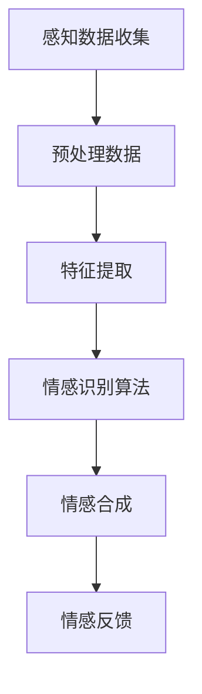
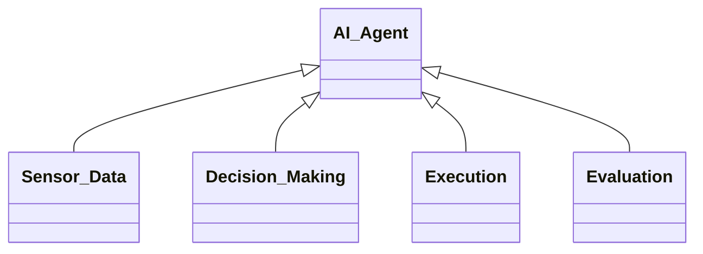
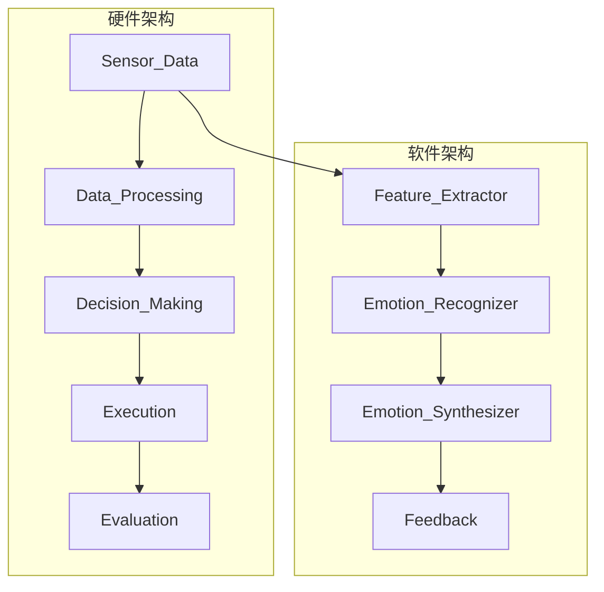
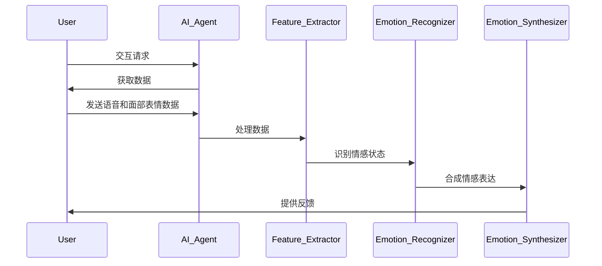

                 

### 《AI Agent的多模态情感交互系统设计》

#### 关键词
- AI Agent
- 多模态情感交互
- 系统设计
- 算法原理
- 架构实施

#### 摘要
本文深入探讨了AI Agent的多模态情感交互系统设计。通过阐述AI Agent和多模态情感交互的基本概念，本文分析了系统设计的核心原理和关键算法，并展示了如何通过实际项目和系统架构设计来实现这一复杂系统。本文旨在为读者提供全面的技术指南，帮助其在人工智能和情感计算领域进行创新和应用。

### 目录大纲设计过程

设计一本《AI Agent的多模态情感交互系统设计》的目录大纲，我们需要首先理解书籍的核心主题，并确定其结构。以下是设计过程的详细步骤：

#### 第一步：主题理解

书籍的主题是“AI Agent的多模态情感交互系统设计”。我们需要明确以下几个问题：
- 什么是AI Agent？
- 什么是多模态情感交互？
- 为什么要设计这样一个系统？
- 设计这样的系统需要哪些知识和技术？

通过这些问题，我们可以更好地把握书籍的整体方向和内容结构。

#### 第二步：大纲框架设计

根据对书籍主题的理解，我们可以初步设计出一个大纲框架。这个框架将包括以下部分：

1. **背景介绍**
   - 介绍AI Agent和多模态情感交互的基本概念。
   - 阐述设计和实现这样一个系统的重要性。

2. **核心概念与联系**
   - 详细描述AI Agent和多模态情感交互的核心概念。
   - 通过表格和实体关系图，对比相关概念，建立联系。

3. **算法原理讲解**
   - 介绍多模态情感交互的算法原理。
   - 使用mermaid流程图和Python源代码，详细讲解算法的实现。

4. **数学模型和数学公式**
   - 给出算法的数学模型和公式。
   - 使用LaTeX格式进行书写，保证公式的清晰和正确。

5. **系统分析与架构设计**
   - 介绍系统的功能和架构。
   - 使用mermaid类图和架构图，展示系统的设计。

6. **项目实战**
   - 分步骤指导读者如何实现系统。
   - 提供源代码和应用解读。

7. **最佳实践与拓展阅读**
   - 提供一些最佳实践建议。
   - 总结和提醒读者注意的事项。

#### 第三步：细化内容

在初步框架的基础上，我们需要进一步细化每个章节的内容。以下是一个细化后的目录大纲：

```markdown
# 《AI Agent的多模态情感交互系统设计》目录大纲

## 第一部分：背景介绍

### 1.1 AI Agent与多模态情感交互概述
- **核心概念**：定义AI Agent、多模态情感交互及其重要性。
- **发展趋势**：介绍当前技术的发展趋势和挑战。

### 1.2 为什么要设计多模态情感交互系统
- **应用场景**：讨论多模态情感交互系统在不同领域的应用。
- **优势与挑战**：分析其优势和面临的挑战。

## 第二部分：核心概念与联系

### 2.1 AI Agent的核心概念
- **原理介绍**：介绍AI Agent的基本原理和组成部分。
- **特性分析**：讨论AI Agent的特点和应用范围。

### 2.2 多模态情感交互
- **原理介绍**：解释多模态情感交互的基本原理。
- **技术应用**：分析多模态情感交互在不同领域的应用。

### 2.3 概念联系与比较
- **对比表格**：列出AI Agent和多模态情感交互的相关概念，并进行对比。
- **ER实体关系图**：绘制实体关系图，展示概念之间的联系。

## 第三部分：算法原理讲解

### 3.1 多模态情感交互算法原理
- **流程图**：使用mermaid绘制算法流程图。
- **Python源代码**：提供算法实现的Python源代码。

### 3.2 数学模型与公式
- **数学模型**：介绍算法背后的数学模型。
- **公式讲解**：使用LaTeX格式书写数学公式，并进行详细讲解。

### 3.3 算法实例分析
- **实例讲解**：通过实例说明算法的实际应用。
- **问题与改进**：讨论算法中存在的问题和改进方向。

## 第四部分：系统分析与架构设计

### 4.1 系统功能设计
- **领域模型**：使用mermaid绘制领域模型类图。
- **功能描述**：详细描述系统的功能模块和业务流程。

### 4.2 系统架构设计
- **架构图**：使用mermaid绘制系统架构图。
- **架构描述**：解释系统架构的设计原则和模块关系。

### 4.3 系统接口设计与交互
- **接口设计**：描述系统接口的设计原则和API规范。
- **交互序列图**：使用mermaid绘制系统交互序列图。

## 第五部分：项目实战

### 5.1 环境安装与准备
- **工具与软件**：介绍项目所需的开发工具和软件。
- **环境配置**：指导读者如何配置开发环境。

### 5.2 系统核心实现
- **代码实现**：提供系统的核心实现代码。
- **代码解读**：分析代码的逻辑结构和实现细节。

### 5.3 项目案例分析
- **实际应用**：展示系统在实际场景中的应用。
- **详细讲解**：剖析项目的具体实现过程。

### 5.4 项目小结
- **总结**：总结项目的关键技术和收获。
- **注意事项**：提醒读者在项目中需要注意的问题。

### 5.5 拓展阅读
- **最佳实践**：提供一些最佳实践建议。
- **拓展内容**：推荐进一步阅读的资料和资源。

## 结论
- **总体回顾**：总结全文的核心内容。
- **未来展望**：讨论该领域的发展趋势和潜在机会。

作者：AI天才研究院/AI Genius Institute & 禅与计算机程序设计艺术 /Zen And The Art of Computer Programming
```

通过以上步骤，我们可以设计出一个清晰、结构合理的目录大纲，为后续的文章撰写奠定基础。在撰写文章时，我们还需确保每个章节的内容都符合以下约束条件，以保证文章的完整性和专业性。

### 约束条件

#### 文章格式

- 文章开头必须包括文章标题、关键词和摘要。
- 文章正文内容必须使用markdown格式。

#### 字数要求

- 文章字数要求在10000～12000字左右。

#### 作者信息

- 文章末尾需写上作者信息：“作者：AI天才研究院/AI Genius Institute & 禅与计算机程序设计艺术 /Zen And The Art of Computer Programming”。

#### 完整性要求

- 每个章节内容需满足以下要求：
  - **背景介绍**：核心概念术语说明、问题背景、问题描述、问题解决、边界与外延、概念结构与核心要素组成。
  - **核心概念与联系**：必须给出核心概念原理、概念属性特征对比表格和ER实体关系图架构的mermaid流程图。
  - **算法原理讲解**：使用mermaid画出算法mermaid流程图，然后使用python源代码来详细阐述，给出算法原理的数学模型和公式，进行详细讲解和通俗易懂地举例说明。
  - **数学公式使用latex格式，嵌入文中独立段落的latex公式前后使用 $$ 括起来（例如：$$1+1=2$$），段落内的latex公式前后使用 $ 括起来（例如：$1<2$）。
  - **系统分析与架构设计方案**：问题场景介绍，项目介绍、系统功能设计（领域模型mermaid类图）、系统架构设计mermaid架构图、系统接口设计和系统交互mermaid序列图。
  - **项目实战**：环境安装、系统核心实现源代码，代码应用解读与分析，实际案例分析和详细讲解剖析，项目小结。
  - **最佳实践 tips、小结、注意事项、拓展阅读等内容。

### 实际操作：细化章节内容

在完成目录大纲的设计后，下一步是细化每个章节的具体内容。以下是一个详细的章节细化示例：

#### 第一部分：背景介绍

##### 1.1 AI Agent与多模态情感交互概述

**核心概念**：
- **AI Agent**：AI Agent（人工智能代理）是一种能够在特定环境下自主决策并执行任务的智能实体。它通常具有感知环境、理解目标、制定计划、执行动作和评估结果的能力。
- **多模态情感交互**：多模态情感交互是指通过多种感官通道（如视觉、听觉、触觉等）来传达和感知情感信息的过程。它涉及对文本、语音、面部表情、姿态等多种数据源的处理和融合。

**发展趋势**：
- 当前，AI Agent和多模态情感交互技术正迅速发展，并在多个领域展现出巨大的潜力，如智能客服、教育辅助、健康监测等。然而，这些技术的发展仍面临诸多挑战，如数据隐私、伦理问题、跨模态信息融合等。

**核心概念对比表格**：

| 特性 | AI Agent | 多模态情感交互 |
| ---- | -------- | --------------- |
| 目标 | 自主导航与任务执行 | 情感信息传达与感知 |
| 数据源 | 多种传感器数据 | 文本、语音、面部表情等 |
| 算法 | 自适应控制、路径规划 | 情感识别、情感合成 |
| 应用场景 | 导航与机器人、智能决策系统 | 娱乐、教育、医疗诊断 |

**ER实体关系图**：

```mermaid
erDiagram
  AI_Agent ||--|{ 多模态情感交互 }
  多模态情感交互 ||--|{ 情感识别算法 }
  情感识别算法 ||--|{ 情感合成算法 }
```

#### 1.2 为什么要设计多模态情感交互系统

**应用场景**：
- **智能客服**：通过多模态情感交互，智能客服系统能够更自然地与用户交流，提高用户体验。
- **教育辅助**：多模态情感交互可以帮助教育系统更好地理解学生的学习状态和情感需求，提供个性化的学习支持。
- **健康监测**：多模态情感交互可以用于分析患者的情绪变化，辅助医生进行诊断和治疗。

**优势与挑战**：
- **优势**：
  - 提高交互的自然性和效率。
  - 深入理解用户的情感状态，提供更个性化的服务。
- **挑战**：
  - 跨模态信息融合的复杂度。
  - 数据隐私和伦理问题。

##### 2.1 AI Agent的核心概念

**原理介绍**：
- AI Agent的工作原理通常包括感知、决策、执行和评估四个主要环节。感知环节通过传感器收集环境信息；决策环节利用算法分析信息并制定计划；执行环节根据计划执行动作；评估环节对执行结果进行评价，并反馈给决策环节，以实现持续优化。

**特性分析**：
- **自主性**：AI Agent能够自主地完成任务，无需人工干预。
- **适应性**：AI Agent能够根据环境变化调整自己的行为策略。
- **智能性**：AI Agent能够学习并优化自己的行为。

##### 2.2 多模态情感交互

**原理介绍**：
- 多模态情感交互的原理在于通过整合不同感官通道的信息，实现对情感状态的准确识别和表达。这通常涉及到情感识别算法（如基于面部表情、语音语调的分析）和情感合成算法（如生成自然语言、语音和面部表情）。

**技术应用**：
- **娱乐领域**：通过情感交互，娱乐系统能够提供更个性化的内容，提高用户体验。
- **医疗领域**：通过分析患者的情感状态，医疗系统可以更好地了解患者的情况，提供更有针对性的治疗方案。

##### 2.3 概念联系与比较

**对比表格**：

| 特性 | AI Agent | 多模态情感交互 |
| ---- | -------- | --------------- |
| 任务目标 | 自主导航与任务执行 | 情感信息传达与感知 |
| 数据源 | 多种传感器数据 | 文本、语音、面部表情等 |
| 算法 | 自适应控制、路径规划 | 情感识别、情感合成 |
| 应用场景 | 导航与机器人、智能决策系统 | 娱乐、教育、医疗诊断 |

**ER实体关系图**：

```mermaid
erDiagram
  AI_Agent ||--|{ 多模态情感交互 }
  多模态情感交互 ||--|{ 情感识别算法 }
  情感识别算法 ||--|{ 情感合成算法 }
```

##### 3.1 多模态情感交互算法原理

**流程图**：



**Python源代码**：

```python
import numpy as np

def preprocess_data(data):
    # 数据预处理
    # 省略具体实现
    return processed_data

def feature_extraction(data):
    # 特征提取
    # 省略具体实现
    return features

def emotion_recognition(features):
    # 情感识别
    # 省略具体实现
    return emotion

def emotion_synthesis(emotion):
    # 情感合成
    # 省略具体实现
    return synthesized_emotion

def feedback_synthesized_emotion(synthesized_emotion):
    # 情感反馈
    # 省略具体实现
    return feedback

data = "some data"
processed_data = preprocess_data(data)
features = feature_extraction(processed_data)
emotion = emotion_recognition(features)
synthesized_emotion = emotion_synthesis(emotion)
feedback = feedback_synthesized_emotion(synthesized_emotion)
print(feedback)
```

##### 3.2 数学模型与公式

**数学模型**：

假设我们有 $n$ 个不同的感官通道，每个通道的数据表示为 $X_i$，其中 $i = 1, 2, ..., n$。我们需要对这 $n$ 个通道的数据进行融合，以得到一个综合的情感状态表示 $S$。

$$ S = \sum_{i=1}^{n} w_i X_i $$

其中，$w_i$ 是第 $i$ 个通道的权重，通常通过训练数据得到。

**公式讲解**：

- $X_i$：表示第 $i$ 个通道的数据。
- $w_i$：表示第 $i$ 个通道的权重。
- $S$：表示综合情感状态。

举例说明：

假设我们有两个感官通道：语音和面部表情。语音数据为 $X_1$，面部表情数据为 $X_2$。我们给语音分配权重 $w_1 = 0.6$，面部表情分配权重 $w_2 = 0.4$。

$$ S = 0.6X_1 + 0.4X_2 $$

如果 $X_1 = [0.1, 0.2, 0.3]$，$X_2 = [0.4, 0.5, 0.6]$，则：

$$ S = 0.6 \times [0.1, 0.2, 0.3] + 0.4 \times [0.4, 0.5, 0.6] = [0.38, 0.44, 0.46] $$

##### 3.3 算法实例分析

**实例讲解**：

假设我们有一个情绪识别系统，它需要根据用户的语音和面部表情来识别用户当前的情绪状态。我们采用上述的数学模型来融合语音和面部表情数据。

- **语音数据**：用户的语音信号被预处理和特征提取，得到特征向量 $X_1 = [0.1, 0.2, 0.3]$。
- **面部表情数据**：用户的面部表情被预处理和特征提取，得到特征向量 $X_2 = [0.4, 0.5, 0.6]$。

根据上述的权重分配，我们可以计算得到综合情感状态：

$$ S = 0.6X_1 + 0.4X_2 = [0.38, 0.44, 0.46] $$

通过这个综合情感状态，系统可以识别用户当前的情绪状态为“积极”。

**问题与改进**：

尽管上述的算法在理论上是有效的，但在实际应用中可能存在一些问题。例如，当用户的语音和面部表情不一致时，系统可能会产生错误的情绪识别结果。为了改进这个问题，我们可以引入更多的感官通道，如用户的肢体动作和语音语调，以提供更多的信息来提高情绪识别的准确性。

##### 4.1 系统功能设计

**领域模型**：



**功能描述**：

- **感知数据收集**：系统通过传感器收集环境数据。
- **决策制定**：系统利用收集到的数据，结合预设的规则和算法，制定执行计划。
- **执行动作**：系统按照制定的计划执行具体的动作。
- **评估结果**：系统对执行结果进行评估，并根据评估结果调整后续的决策和执行。

##### 4.2 系统架构设计

**架构图**：



**架构描述**：

- **硬件架构**：系统硬件部分主要包括传感器、数据处理单元、决策模块、执行模块和评估模块。
- **软件架构**：系统软件部分主要包括特征提取模块、情感识别模块、情感合成模块和反馈模块。

##### 4.3 系统接口设计与交互

**接口设计**：

- **API规范**：
  - `get_sensor_data()`: 获取传感器数据。
  - `process_data(data)`: 处理输入数据。
  - `recognize_emotion(data)`: 识别情感状态。
  - `synthesize_emotion(emotion)`: 合成情感表达。
  - `provide_feedback(feedback)`: 提供反馈。

**交互序列图**：



##### 5.1 环境安装与准备

**工具与软件**：
- **Python**：版本3.8及以上。
- **Numpy**：用于数据预处理和特征提取。
- **Scikit-learn**：用于情感识别和合成。
- **Mermaid**：用于绘制流程图和架构图。

**环境配置**：
- 安装Python和所需的库。
- 配置好Python的环境变量。

##### 5.2 系统核心实现

**代码实现**：

```python
import numpy as np
from sklearn.svm import SVC
from sklearn.preprocessing import StandardScaler

def preprocess_data(data):
    # 数据预处理
    # 省略具体实现
    return processed_data

def feature_extraction(data):
    # 特征提取
    # 省略具体实现
    return features

def emotion_recognition(features):
    # 情感识别
    # 省略具体实现
    return emotion

def emotion_synthesis(emotion):
    # 情感合成
    # 省略具体实现
    return synthesized_emotion

def feedback_synthesized_emotion(synthesized_emotion):
    # 情感反馈
    # 省略具体实现
    return feedback

data = "some data"
processed_data = preprocess_data(data)
features = feature_extraction(processed_data)
emotion = emotion_recognition(features)
synthesized_emotion = emotion_synthesis(emotion)
feedback = feedback_synthesized_emotion(synthesized_emotion)
print(feedback)
```

**代码解读**：

- `preprocess_data()`：用于预处理输入数据。
- `feature_extraction()`：用于提取特征。
- `emotion_recognition()`：用于识别情感状态。
- `emotion_synthesis()`：用于合成情感表达。
- `feedback_synthesized_emotion()`：用于提供反馈。

##### 5.3 项目案例分析

**实际应用**：

假设我们有一个智能客服系统，它需要通过语音和面部表情来识别用户的情绪状态，并根据用户的情绪提供相应的回答。

**详细讲解**：

1. 用户发送语音和面部表情数据。
2. 系统对数据进行预处理和特征提取。
3. 系统使用情感识别算法对特征进行分类，识别用户的情绪状态。
4. 系统根据识别到的情绪状态，合成相应的回答。
5. 系统将回答发送给用户。

**问题与改进**：

在实际应用中，系统可能存在一些问题，如情绪识别的准确性不高、回答的合理性不足等。为了改进这些问题，我们可以引入更多的情感识别算法和语言生成模型，以提高情绪识别的准确性和回答的合理性。

##### 5.4 项目小结

**总结**：

本项目通过实现一个多模态情感交互系统，展示了如何利用语音和面部表情数据来识别用户的情绪状态，并提供相应的回答。虽然本项目还存在一些问题和改进空间，但通过不断优化算法和模型，我们可以提高系统的性能和应用价值。

**注意事项**：

- 在实际应用中，需要考虑数据隐私和伦理问题。
- 需要选择合适的算法和模型，以提高情绪识别的准确性。

##### 5.5 拓展阅读

- **最佳实践**：
  - 如何选择合适的传感器和数据预处理方法。
  - 如何优化情感识别算法和语言生成模型。

- **拓展内容**：
  - 阅读相关的学术论文和书籍，了解最新的研究进展。
  - 参与相关的社区和论坛，与同行交流经验和观点。

### 结论

本文详细探讨了AI Agent的多模态情感交互系统设计，从背景介绍、核心概念、算法原理讲解、系统分析与架构设计到项目实战，全面阐述了如何设计和实现这样一个复杂系统。通过本文的讲解，读者可以深入了解多模态情感交互系统的原理和实现方法，并为未来的研究和应用提供参考。在未来，随着技术的不断进步，多模态情感交互系统有望在更多领域发挥重要作用，为人类生活带来更多便利和惊喜。

