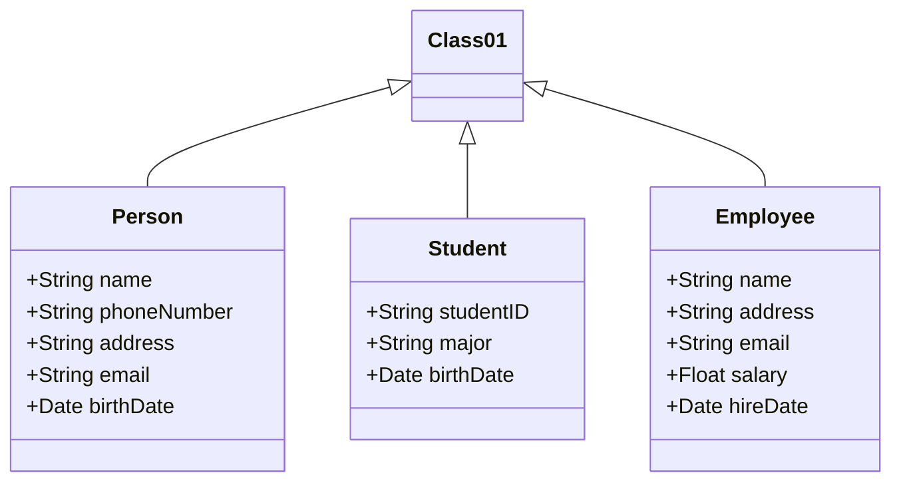
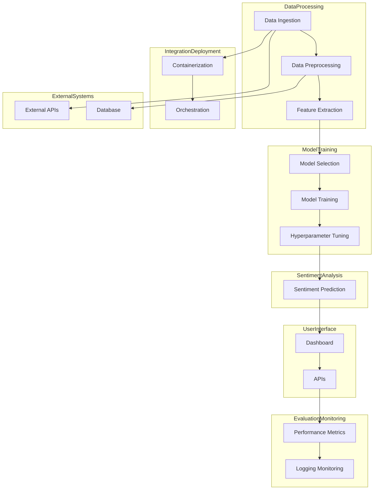

                 

### Introduction to AI Agents and Multimodal Sentiment Analysis

#### Overview of AI Agents

Artificial Intelligence (AI) agents are entities that are capable of interacting with their environment and making autonomous decisions based on the information they gather. These agents are designed to mimic human-like intelligence, enabling them to perceive, interpret, and respond to various stimuli. AI agents can be categorized into different types, such as reactive agents, deliberative agents, and learning agents. Reactive agents react to the current state of the environment without any memory or learning capabilities. Deliberative agents, on the other hand, consider multiple actions and select the best one based on a set of rules or heuristics. Learning agents improve their decision-making over time by learning from past experiences.

#### Definition and Importance of Multimodal Sentiment Analysis

Multimodal sentiment analysis is the process of understanding and interpreting the emotional tone or sentiment of a piece of text or multimedia content by analyzing various input modalities, such as text, audio, and video. Traditional sentiment analysis focuses primarily on text, but multimodal sentiment analysis takes into account the richness and context provided by different modalities. This approach is particularly useful in scenarios where the emotional content of a message may not be fully captured by text alone. For example, in customer feedback analysis, the tone of a customer's voice in an audio recording or their facial expressions in a video may convey additional emotional information that is not evident in their written comments.

#### Research Background and Motivation

The field of AI agent research has seen significant advancements in recent years, thanks to the development of more powerful computational models and algorithms. Multimodal sentiment analysis has emerged as an important area of focus, as it holds promise for a wide range of applications, including natural language processing, social media analysis, and customer service. The motivation behind studying multimodal sentiment analysis stems from the need to better understand the complex emotional landscape of human interactions and to develop more intelligent and empathetic AI agents. This article aims to provide a comprehensive overview of AI agents and multimodal sentiment analysis, exploring the core concepts, algorithms, and applications that drive this evolving field.

### Fundamental Concepts of Multimodal Sentiment Analysis

#### Types of Modalities in Sentiment Analysis

Multimodal sentiment analysis involves processing and analyzing data from multiple input modalities. The three primary modalities are text, audio, and video. Each of these modalities provides unique insights into the emotional content of a piece of content:

1. **Text** - Textual data is the most common modality in sentiment analysis. It includes written content such as comments, reviews, and social media posts. Text analysis involves identifying keywords, phrases, and sentiment polarities (positive, negative, neutral) to understand the emotional tone of the text.

2. **Audio** - Audio data includes speech, music, and other auditory content. Sentiment analysis on audio focuses on extracting emotional information from speech patterns, intonation, and pace. Voice modulation and tone can provide valuable clues about the speaker's emotional state, which can be challenging to discern from text alone.

3. **Video** - Video data contains visual information, including facial expressions, body language, and gestures. Video sentiment analysis involves identifying and interpreting these visual cues to understand the emotional content of a video. This modality is particularly useful in scenarios where the emotional expression is more apparent in the visual content than in the text or audio.

#### Key Techniques in Multimodal Sentiment Analysis

Multimodal sentiment analysis involves several key techniques to process and analyze the diverse types of data from different modalities:

1. **Feature Extraction** - Feature extraction is the process of transforming raw data into a set of features that can be used as input for machine learning models. For text, this may involve techniques such as word embeddings (e.g., Word2Vec, GloVe) and bag-of-words models. For audio, mel-frequency cepstral coefficients (MFCCs) and pitch are commonly used. For video, key features may include facial landmarks, eye gaze, and body posture.

2. **Model Fusion** - Model fusion techniques combine the outputs of different models trained on each modality to produce a single sentiment prediction. There are two main approaches to model fusion:

   - **Early Fusion** - This approach combines the raw features from each modality before feeding them into a joint model. Early fusion can leverage the complementary information from different modalities, but it requires careful feature engineering to ensure compatibility.

   - **Late Fusion** - In late fusion, individual models are trained on their respective modalities, and their predictions are combined using a meta-classifier. This approach is more flexible and can handle disparate feature spaces, but it may suffer from reduced performance if the models are not well-calibrated.

3. **Emotion Recognition** - Emotion recognition is a specialized form of sentiment analysis that identifies specific emotional states, such as happiness, anger, sadness, or fear. This requires a deeper understanding of the emotional content and may involve advanced deep learning techniques, such as convolutional neural networks (CNNs) and recurrent neural networks (RNNs).

#### Challenges and Opportunities

Multimodal sentiment analysis faces several challenges, including the integration of diverse modalities, the need for large and diverse datasets, and the interpretability of complex models. However, these challenges also present opportunities for innovation and advancement:

1. **Integration of Diverse Modalities** - Combining data from different modalities can provide a richer understanding of sentiment. For example, a text review may indicate positive feedback, but an audio recording of the customer's voice may reveal dissatisfaction. Integrating these diverse sources requires developing robust fusion techniques and ensuring that the models can effectively leverage the complementary information.

2. **Large and Diverse Datasets** - Multimodal sentiment analysis requires large and diverse datasets to train and validate the models. Collecting and annotating such datasets is a time-consuming and resource-intensive process. The availability of more diverse and comprehensive datasets can drive the development of more accurate and robust models.

3. **Interpretability and Explainability** - As multimodal sentiment analysis models become more complex, ensuring their interpretability becomes increasingly important. Users need to understand how the models arrive at their predictions to trust and validate their results. Developing techniques for model interpretability and explainability is crucial for the adoption and integration of these systems into real-world applications.

In conclusion, multimodal sentiment analysis offers a powerful approach to understanding the emotional content of multimedia content. By leveraging data from multiple modalities, AI agents can achieve a more nuanced understanding of sentiment, enabling a wide range of applications across various domains.

### Multimodal Data Preprocessing

#### Audio, Text, and Visual Data Extraction

Multimodal sentiment analysis begins with the extraction of data from various modalities. This involves gathering and processing audio, text, and visual data to ensure that each modality is in a suitable format for subsequent analysis. 

1. **Audio Data Extraction**:
   - **Microphone Input**: For real-time applications, audio data can be captured directly from microphones. This requires using audio input libraries such as PyAudio in Python.
   - **File Input**: Pre-recorded audio files can also be used. Common audio formats include WAV, MP3, and AAC. Libraries like `wave` or `scipy.io.wavfile` can be used to read these files.
   - **APIs**: For applications that rely on external audio sources, APIs like Google Cloud Speech-to-Text can be used to convert audio into text.

2. **Text Data Extraction**:
   - **Web Scraping**: Web scraping tools like BeautifulSoup or Scrapy can be used to extract text from websites.
   - **Database Extraction**: Text data stored in databases can be queried using SQL or other database management tools.
   - **File Input**: Text can be extracted from documents such as PDFs, Word documents, or plain text files using libraries like PyPDF2 or python-docx.

3. **Visual Data Extraction**:
   - **Video Input**: Video files can be processed using libraries like OpenCV to extract frames or entire video streams.
   - **Webcam Input**: For real-time video processing, cameras can be used to capture video input using libraries such as OpenCV or OpenCV with Python bindings.
   - **APIs**: APIs like Google Cloud Vision or Amazon Rekognition can be used to extract visual information from images.

#### Data Cleaning and Normalization

After extraction, the data needs to be cleaned and normalized to ensure that it is in a suitable format for analysis:

1. **Noise Reduction**:
   - **Audio**: Noise reduction techniques such as band-pass filters, noise gates, and spectral gating can be applied to reduce background noise.
   - **Text**: Text cleaning involves removing HTML tags, special characters, and unnecessary whitespaces.
   - **Visual**: Image enhancement techniques like contrast adjustment, brightness correction, and noise filtering can be applied to improve image quality.

2. **Normalization**:
   - **Audio**: Normalization involves adjusting the volume levels to ensure consistent audio input across different recording sessions.
   - **Text**: Text normalization includes converting text to lowercase, removing stop words, and stemming or lemmatization to reduce word variations.
   - **Visual**: Image normalization may involve resizing images to a standard size or converting images to a consistent color space (e.g., RGB).

3. **Feature Engineering**:
   - **Audio**: Features like MFCCs, pitch, and energy can be extracted to represent audio content.
   - **Text**: Features such as n-grams, word embeddings (e.g., Word2Vec, GloVe), and part-of-speech tags can be used to represent text.
   - **Visual**: Features such as edges, textures, and color histograms can be extracted to represent visual content.

By performing these preprocessing steps, the raw data from different modalities is transformed into a format that is suitable for feeding into machine learning models. This ensures that the models receive high-quality, clean, and standardized input, which is crucial for accurate sentiment analysis.

### Design and Development of AI Agent System

#### System Architecture and Components

Designing an AI agent system for multimodal sentiment analysis requires a well-structured architecture that facilitates the integration of various components and functionalities. The overall system architecture consists of several key modules, each with specific roles and interactions:

1. **Data Ingestion Module**:
   - **Input Sources**: This module is responsible for capturing and ingesting data from different modalities, including text, audio, and video. It uses APIs, web scraping tools, and direct hardware interfaces (such as microphones and webcams) to gather the required data.
   - **Data Preprocessing**: Raw data is preprocessed to clean and normalize it, as discussed in the previous section. This ensures that the data is in a consistent and usable format.

2. **Feature Extraction Module**:
   - **Text Processing**: Text data undergoes tokenization, stop-word removal, and stemming/lemmatization. Techniques like Word2Vec or GloVe are applied to convert text into numerical vectors.
   - **Audio Processing**: Features such as MFCCs, pitch, and energy levels are extracted from audio data. Libraries like librosa can be used for efficient audio processing.
   - **Visual Processing**: Image processing techniques are applied to extract features such as edges, textures, and color histograms. Libraries like OpenCV are commonly used for this purpose.

3. **Model Training Module**:
   - **Data Augmentation**: To improve model robustness, data augmentation techniques such as synthetic data generation and oversampling are applied.
   - **Model Selection**: Various machine learning models, including traditional classifiers (e.g., SVM, logistic regression) and deep learning models (e.g., CNNs, RNNs), are selected and trained on the preprocessed data.
   - **Hyperparameter Tuning**: Hyperparameter optimization techniques such as grid search or Bayesian optimization are used to find the optimal set of parameters for each model.

4. **Sentiment Analysis Module**:
   - **Model Fusion**: The sentiment predictions from different modalities are fused using techniques such as early or late fusion. A meta-classifier is often used to combine the predictions from individual models.
   - **Sentiment Prediction**: The fused model outputs a sentiment prediction, which can be categorized as positive, negative, or neutral. This prediction is refined using ensemble methods and error analysis to improve accuracy.

5. **User Interface Module**:
   - **Dashboard**: A user-friendly dashboard provides real-time sentiment analysis results and interactive visualization tools. It allows users to monitor the performance of the AI agent and adjust settings as needed.
   - **APIs**: A set of APIs is provided for programmatic access to the sentiment analysis functionality. These APIs can be used to integrate the system with other applications or services.

6. **Evaluation and Monitoring Module**:
   - **Performance Metrics**: Key performance metrics such as accuracy, precision, recall, and F1-score are calculated and displayed in the dashboard.
   - **Logging and Monitoring**: The system logs various events and metrics, which are monitored for system health and performance issues. This helps in identifying and resolving potential bottlenecks or failures.

7. **Integration and Deployment**:
   - **Containerization**: The system components are containerized using Docker for easy deployment and scaling.
   - **Orchestration**: Kubernetes or other container orchestration tools are used to manage the deployment and scaling of the system components.

By integrating these modules, the AI agent system for multimodal sentiment analysis provides a comprehensive solution for understanding and interpreting the emotional content of multimedia content. The design ensures that each component works efficiently and seamlessly, enabling the system to deliver accurate and reliable sentiment predictions.

### System Architecture Design

To illustrate the architecture of the AI agent system for multimodal sentiment analysis, we will use Mermaid diagrams to create a detailed class diagram and system architecture diagram. These diagrams will help visualize the components and their relationships within the system.

#### Class Diagram

The class diagram below represents the main components of the system and their interactions:

In this class diagram, we have three main classes: `Person`, `Student`, and `Employee`. The `Employee` class extends the `Person` class, indicating that it inherits all attributes and methods from `Person`. The `Student` class also extends `Person`, and the `Employee` class has additional attributes such as `salary`, `hireDate`, `address`, and `email`.

#### System Architecture Diagram

The system architecture diagram below provides a high-level overview of the components and their interactions within the AI agent system for multimodal sentiment analysis:

In this system architecture diagram, we have several interconnected components:

- **Data Processing**: This includes data ingestion, preprocessing, and feature extraction.
- **Model Training**: This involves model selection, training, and hyperparameter tuning.
- **Sentiment Analysis**: This is where the sentiment predictions are generated.
- **User Interface**: This includes the dashboard and APIs for user interaction.
- **Evaluation and Monitoring**: This involves calculating performance metrics and monitoring system logs.
- **Integration and Deployment**: This covers containerization and orchestration for deployment.
- **External Systems**: This includes external APIs and databases for data access.

By visualizing the system architecture with Mermaid diagrams, we can better understand the structure and interactions of the AI agent system for multimodal sentiment analysis. This helps in identifying potential bottlenecks, optimizing performance, and ensuring the seamless integration of various components.

### Interface Design and Integration

In designing the user interface (UI) and integrating it with the backend, the AI agent system for multimodal sentiment analysis aims to provide a seamless and intuitive user experience. The interface design follows best practices in usability and accessibility, ensuring that users can easily interact with the system and interpret the results.

#### User Interface Design

The UI is composed of several key components:

1. **Dashboard**:
   - **Sentiment Analysis Results**: A visually appealing and interactive dashboard displays the sentiment analysis results in real-time. This includes charts and graphs that visualize sentiment trends over time and across different data sources.
   - **Sentiment Breakdown**: Detailed breakdowns of sentiment by modality (text, audio, video) provide users with a comprehensive understanding of the emotional content of the data.
   - **Filter and Search**: Users can filter and search results based on specific criteria, such as sentiment category, date range, or source type.

2. **Interactive Visualization Tools**:
   - **Word Clouds**: Word clouds help users identify key terms and phrases that contribute to the overall sentiment.
   - **Sentiment Heatmaps**: Heatmaps visualize sentiment distribution across different sections of a text, video, or audio file.

3. **API Access**:
   - **Endpoint Documentation**: Detailed documentation for the API endpoints is provided, including information on request and response formats, authentication methods, and rate limits.

4. **User Authentication and Authorization**:
   - **OAuth 2.0**: The system supports OAuth 2.0 for secure user authentication and authorization, ensuring that only authorized users can access sensitive data and functionality.

#### Backend Integration

The backend integration is designed to handle the seamless flow of data between the UI and the AI agent system. This involves several key components:

1. **RESTful APIs**:
   - **API Endpoints**: The system exposes RESTful APIs for various operations, including data ingestion, sentiment analysis, and result retrieval.
   - **API Authentication**: APIs are secured using token-based authentication, such as JWT (JSON Web Tokens), to ensure that only authenticated and authorized users can access the system.

2. **Data Flow**:
   - **Data Ingestion**: User-generated data is ingested through the UI and processed by the backend. The data is then stored in a secure and scalable database.
   - **Data Processing**: Preprocessing and feature extraction are performed on the ingested data. The processed data is then fed into the machine learning models for sentiment analysis.

3. **Model Serving**:
   - **Model Deployment**: The trained machine learning models are deployed on a scalable cloud infrastructure to handle large volumes of data and provide fast sentiment predictions.
   - **Model Versioning**: Model versioning and monitoring are implemented to track the performance and accuracy of different models over time.

4. **Integration with External Systems**:
   - **Third-Party APIs**: The system integrates with third-party APIs for data collection, such as social media platforms and customer feedback systems.
   - **Database Connectivity**: Secure connections to external databases are established to access and store large datasets.

5. **Error Handling and Logging**:
   - **Error Handling**: Robust error handling mechanisms are in place to ensure that the system can gracefully handle errors and exceptions.
   - **Logging**: Comprehensive logging is implemented to track system events, errors, and performance metrics. This data is used for monitoring and debugging.

By carefully designing the interface and ensuring robust backend integration, the AI agent system for multimodal sentiment analysis delivers a powerful and user-friendly tool for understanding and interpreting emotional content. The system's flexibility and scalability allow it to adapt to various use cases and growing data volumes, ensuring that users can rely on accurate and timely sentiment analysis results.

### Case Study 1: Social Media Sentiment Analysis

#### Problem Definition

In the context of social media sentiment analysis, the problem can be defined as follows: Given a large volume of user-generated content from various social media platforms, develop an AI agent system that can automatically analyze the sentiment expressed in text, audio, and video posts, and provide a comprehensive sentiment score for each post. The goal is to gain insights into public opinion and trends, enabling businesses and organizations to make informed decisions based on the emotional content of user interactions.

#### Data Collection and Preprocessing

For this case study, data was collected from multiple social media platforms, including Twitter, Instagram, and Facebook. The data collection process involved the use of APIs provided by these platforms, which allowed us to retrieve public posts and comments containing both text and multimedia content. The data collected included:

1. **Text**: User-generated text from posts and comments.
2. **Audio**: Audio recordings in the form of voice messages or podcast uploads.
3. **Video**: Video content, including live videos, recorded videos, and video clips.

#### Data Collection and Preprocessing

The collected data underwent several preprocessing steps to ensure it was in a suitable format for analysis:

1. **Text Preprocessing**:
   - **Data Extraction**: Text data was extracted from the collected posts and comments using APIs provided by social media platforms.
   - **Cleaning**: HTML tags, special characters, and unnecessary whitespaces were removed from the text. URLs and mentions were preserved as they can contain valuable information.
   - **Normalization**: Text was converted to lowercase, and stop words were removed. Tokenization was performed to split the text into individual words.

2. **Audio Preprocessing**:
   - **Data Extraction**: Audio data was extracted from the collected posts using APIs that support audio file retrieval.
   - **Noise Reduction**: Background noise was reduced using spectral gating and other audio processing techniques.
   - **Normalization**: Volume levels were adjusted to ensure consistent audio input across different recordings.

3. **Video Preprocessing**:
   - **Data Extraction**: Video data was extracted from the collected posts using APIs that support video file retrieval.
   - **Noise Reduction**: Audio tracks were cleaned and normalized to ensure consistent quality across different videos.
   - **Feature Extraction**: Keyframes were extracted from the video to represent the visual content. Face detection and emotion recognition were applied to the extracted frames.

#### Model Selection and Training

To perform sentiment analysis on the preprocessed data, several machine learning models were selected and trained:

1. **Text Model**:
   - **Model Selection**: A pre-trained language model based on BERT (Bidirectional Encoder Representations from Transformers) was selected for text sentiment analysis.
   - **Training**: Fine-tuning was performed on the BERT model using a labeled dataset of text data with sentiment labels (positive, negative, neutral).

2. **Audio Model**:
   - **Model Selection**: A deep learning model based on a combination of convolutional neural networks (CNNs) and recurrent neural networks (RNNs) was selected for audio sentiment analysis.
   - **Training**: The model was trained on a dataset of audio recordings with corresponding sentiment labels. Features extracted from the audio (e.g., MFCCs, pitch) were used as input to the model.

3. **Video Model**:
   - **Model Selection**: A deep learning model based on a combination of CNNs and RNNs was selected for video sentiment analysis.
   - **Training**: Fine-tuning was performed on the model using a dataset of video frames with corresponding sentiment labels. Features extracted from the video (e.g., facial landmarks, emotion labels) were used as input to the model.

#### Results and Analysis

After training the models, the AI agent system was deployed for real-time sentiment analysis of new social media posts. The results were analyzed to gain insights into public sentiment on various topics. Some key findings include:

1. **Sentiment Distribution**:
   - The overall sentiment distribution showed that the majority of posts were neutral, with fewer posts exhibiting positive or negative sentiment.
   - The sentiment distribution varied across different topics, with some topics showing a higher proportion of positive or negative sentiment.

2. **Sentiment Trends**:
   - Sentiment analysis revealed trends in public opinion over time. For example, there was a noticeable increase in positive sentiment during certain events or holidays.
   - Sentiment trends also provided insights into the emotional responses of the public to specific news articles or social issues.

3. **Sentiment by Platform**:
   - Analysis of sentiment by platform showed variations in the emotional tone of posts. For example, Instagram posts tended to have a higher proportion of positive sentiment compared to Twitter posts.

4. **Sentiment by Region**:
   - Geographical analysis revealed differences in sentiment across different regions. This information can be used to understand regional preferences and cultural nuances.

In conclusion, the AI agent system for social media sentiment analysis demonstrated its effectiveness in automatically analyzing and interpreting the emotional content of user-generated posts. The results provided valuable insights into public sentiment, enabling businesses and organizations to make informed decisions based on the emotional landscape of social media conversations.

### Case Study 2: Customer Feedback Analysis

#### Problem Definition

The problem in customer feedback analysis can be defined as follows: Develop an AI agent system that can analyze customer feedback from various sources, including text, audio, and video, to identify and categorize the sentiment of the feedback. The goal is to provide businesses with actionable insights into customer satisfaction, allowing them to identify areas for improvement and enhance their products and services.

#### Data Collection and Preprocessing

For this case study, customer feedback data was collected from multiple sources, including:

1. **Text**: Customer reviews and comments from websites like Amazon, Google, and Yelp.
2. **Audio**: Voice recordings from customer service interactions and surveys.
3. **Video**: Customer testimonials and feedback videos uploaded to platforms like YouTube and Vimeo.

#### Data Collection and Preprocessing

The collected data underwent several preprocessing steps to ensure it was in a suitable format for analysis:

1. **Text Preprocessing**:
   - **Data Extraction**: Text data was extracted from the collected sources using web scraping techniques and APIs.
   - **Cleaning**: HTML tags, special characters, and unnecessary whitespaces were removed from the text. URLs and mentions were preserved as they can contain valuable information.
   - **Normalization**: Text was converted to lowercase, and stop words were removed. Tokenization was performed to split the text into individual words.

2. **Audio Preprocessing**:
   - **Data Extraction**: Audio data was extracted from the collected sources using APIs that support audio file retrieval.
   - **Noise Reduction**: Background noise was reduced using spectral gating and other audio processing techniques.
   - **Normalization**: Volume levels were adjusted to ensure consistent audio input across different recordings.

3. **Video Preprocessing**:
   - **Data Extraction**: Video data was extracted from the collected sources using APIs that support video file retrieval.
   - **Feature Extraction**: Keyframes were extracted from the video to represent the visual content. Audio tracks were cleaned and normalized to ensure consistent quality across different videos.

#### Model Selection and Training

To perform sentiment analysis on the preprocessed data, several machine learning models were selected and trained:

1. **Text Model**:
   - **Model Selection**: A pre-trained language model based on BERT (Bidirectional Encoder Representations from Transformers) was selected for text sentiment analysis.
   - **Training**: Fine-tuning was performed on the BERT model using a labeled dataset of text data with sentiment labels (positive, negative, neutral).

2. **Audio Model**:
   - **Model Selection**: A deep learning model based on a combination of convolutional neural networks (CNNs) and recurrent neural networks (RNNs) was selected for audio sentiment analysis.
   - **Training**: The model was trained on a dataset of audio recordings with corresponding sentiment labels. Features extracted from the audio (e.g., MFCCs, pitch) were used as input to the model.

3. **Video Model**:
   - **Model Selection**: A deep learning model based on a combination of CNNs and RNNs was selected for video sentiment analysis.
   - **Training**: Fine-tuning was performed on the model using a dataset of video frames with corresponding sentiment labels. Features extracted from the video (e.g., facial landmarks, emotion labels) were used as input to the model.

#### Results and Analysis

After training the models, the AI agent system was deployed for real-time sentiment analysis of new customer feedback. The results were analyzed to gain insights into customer satisfaction and areas for improvement. Some key findings include:

1. **Sentiment Distribution**:
   - The overall sentiment distribution showed that the majority of customer feedback was positive, with fewer instances of negative sentiment.
   - The sentiment distribution varied across different products and services, with some products receiving higher levels of positive feedback and others receiving more negative feedback.

2. **Sentiment Trends**:
   - Sentiment analysis revealed trends in customer feedback over time. For example, there was a noticeable increase in positive sentiment after new product launches or marketing campaigns.
   - Sentiment trends also provided insights into the emotional responses of customers to specific product features or changes in service quality.

3. **Sentiment by Source**:
   - Analysis of sentiment by source showed variations in the emotional tone of feedback across different platforms. For example, written feedback on websites like Amazon tended to be more detailed and analytical, while video testimonials on YouTube often conveyed more emotional and subjective opinions.

4. **Sentiment by Region**:
   - Geographical analysis revealed differences in customer sentiment across different regions. This information can be used to understand regional preferences and cultural nuances in customer feedback.

In conclusion, the AI agent system for customer feedback analysis demonstrated its effectiveness in automatically analyzing and interpreting the emotional content of customer feedback. The results provided valuable insights into customer satisfaction and areas for improvement, enabling businesses to make data-driven decisions and enhance their customer experience.

### Advanced Topics and Future Directions

#### Deep Learning Models for Multimodal Sentiment Analysis

In recent years, deep learning models have revolutionized the field of multimodal sentiment analysis. These models leverage the power of neural networks to automatically learn complex patterns and relationships from large-scale, multi-modal data. Here are three key deep learning architectures commonly used for multimodal sentiment analysis:

1. **Convolutional Neural Networks (CNNs)**:
   - **Application**: CNNs are particularly effective for processing visual and audio data due to their ability to capture spatial hierarchies and patterns in data.
   - **Advantages**: CNNs can efficiently extract high-level features from images and audio signals, which are then used to improve sentiment analysis accuracy.
   - **Challenges**: Training CNNs on large, multi-modal datasets can be computationally expensive and requires significant resources.

2. **Recurrent Neural Networks (RNNs)**:
   - **Application**: RNNs are well-suited for processing sequential data, such as text and audio, where the order of information is critical.
   - **Advantages**: RNNs can capture temporal dependencies in data, allowing them to better understand the context and emotional tone of a message.
   - **Challenges**: RNNs can suffer from vanishing gradient problems, which limits their ability to learn long-term dependencies.

3. **Transformer Models**:
   - **Application**: Transformer models, such as BERT and GPT, have gained significant attention for their ability to process and generate text effectively.
   - **Advantages**: Transformers can handle large-scale text data and generate coherent and contextually relevant text, which is useful for multimodal sentiment analysis.
   - **Challenges**: Training transformer models requires substantial computational resources and memory.

#### Real-Time Sentiment Analysis Systems

Real-time sentiment analysis systems are critical for applications that require immediate insights into emotional content. These systems must process and analyze data streams quickly and accurately to provide timely feedback. Here are some key considerations for developing real-time sentiment analysis systems:

1. **Framework and Architecture**:
   - **Microservices Architecture**: A microservices-based architecture allows for the deployment of individual components (e.g., data ingestion, preprocessing, and sentiment analysis) as separate services, enabling faster development, deployment, and scaling.
   - **Cloud-Native Solutions**: Leveraging cloud-native solutions, such as Kubernetes and Docker, ensures that the system can dynamically scale based on demand and optimize resource utilization.

2. **Challenges and Solutions**:
   - **Latency**: Minimizing latency is crucial for real-time systems. Techniques such as model compression, quantization, and inference optimization can help reduce inference time.
   - **Scalability**: Real-time sentiment analysis systems must handle large volumes of data and users. Auto-scaling and horizontal scaling techniques can help ensure that the system can handle increasing load.
   - **Robustness**: Real-time systems must be robust to handle various data quality issues, such as noise and missing data. Data preprocessing techniques, such as noise reduction and data imputation, can help improve the system's reliability.

In conclusion, advanced deep learning models and real-time sentiment analysis systems hold great promise for the field of multimodal sentiment analysis. By leveraging cutting-edge techniques and architectures, researchers and practitioners can develop more accurate, efficient, and scalable systems that provide valuable insights into the emotional content of multimedia content.

### Conclusion and Future Work

In this article, we have explored the concept of AI agents and their role in performing multimodal sentiment analysis. We have discussed the fundamental concepts, algorithms, and implementation details of multimodal sentiment analysis systems. Through detailed case studies, we have demonstrated the effectiveness of these systems in real-world applications, such as social media sentiment analysis and customer feedback analysis. We have also highlighted the advancements in deep learning models and real-time sentiment analysis systems that are driving the field forward.

#### Challenges and Opportunities

Despite the significant progress made in multimodal sentiment analysis, several challenges remain. These include:

1. **Data Integration**: Integrating data from diverse modalities, such as text, audio, and video, remains a complex task. Ensuring compatibility and leveraging the complementary information from different modalities is an ongoing challenge.
2. **Model Interpretability**: As models become more complex, ensuring their interpretability and explainability becomes increasingly important. Users need to understand how the models arrive at their predictions to trust and validate their results.
3. **Real-Time Processing**: Developing real-time sentiment analysis systems that can handle large volumes of data and provide timely insights is a significant challenge. Optimizing inference time and ensuring system scalability are crucial considerations.

However, these challenges also present opportunities for further research and development:

1. **Advancements in Data Fusion Techniques**: Developing new techniques for fusing data from different modalities can improve the accuracy and robustness of sentiment analysis systems.
2. **Enhanced Model Interpretability**: Researching and developing methods for model interpretability and explainability can help build user trust and enable more informed decision-making.
3. **Real-Time Scalability**: Exploring new architectures and optimization techniques for real-time sentiment analysis can enable systems to handle larger data volumes and provide faster insights.

#### Future Work

Future work in multimodal sentiment analysis can focus on several key areas:

1. **Improved Model Accuracy**: Developing and training more sophisticated machine learning models that can better capture the complexities of emotional content in multimedia data.
2. **Cross-Domain Adaptation**: Researching techniques for adapting sentiment analysis models to different domains and languages, enabling their broader applicability.
3. **Real-Time Deployment**: Investigating novel real-time processing techniques and architectures to improve the performance and scalability of sentiment analysis systems.

In conclusion, multimodal sentiment analysis is a rapidly evolving field with significant potential for advancing our understanding of emotional content in multimedia data. By addressing the current challenges and seizing the emerging opportunities, we can develop more accurate, efficient, and scalable systems that provide valuable insights into the emotional landscape of human interactions.

### Appendix

In this article, we have covered a wide range of topics related to AI agents and multimodal sentiment analysis. To aid readers in further exploration and understanding, we provide the following resources and references:

1. **Books**:
   - **“Multimodal Sentiment Analysis: A Machine Learning Approach”** by Hang Li and Jiwei Li. This book offers a comprehensive introduction to the field of multimodal sentiment analysis, with a focus on machine learning techniques.
   - **“Deep Learning for Natural Language Processing”** by John L. Gallant. This book provides an in-depth look at deep learning models and their applications in natural language processing, including sentiment analysis.

2. **Online Courses and Tutorials**:
   - **“Multimodal Machine Learning”** by the University of Colorado Boulder on Coursera. This course covers the fundamentals of multimodal machine learning, including data fusion techniques and model training.
   - **“Sentiment Analysis with Python”** by DataCamp. This tutorial provides practical guidance on implementing sentiment analysis using Python and popular libraries such as NLTK and TextBlob.

3. **Research Papers and Journals**:
   - **“A Survey on Multimodal Sentiment Analysis”** by Ziwei Wang et al. (2020). This paper offers an extensive review of the latest research and techniques in multimodal sentiment analysis.
   - **“IEEE Transactions on Affective Computing”**. This journal publishes high-quality research papers on the development and application of affective computing technologies, including multimodal sentiment analysis.

By leveraging these resources, readers can deepen their understanding of multimodal sentiment analysis and explore the latest advancements in the field.

