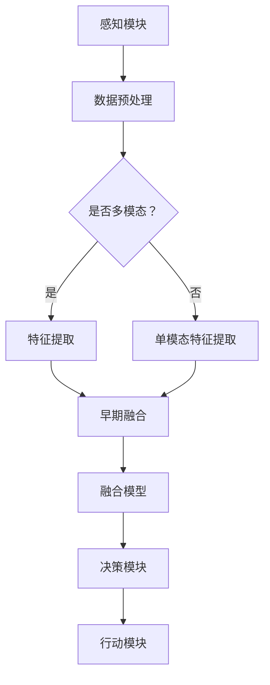
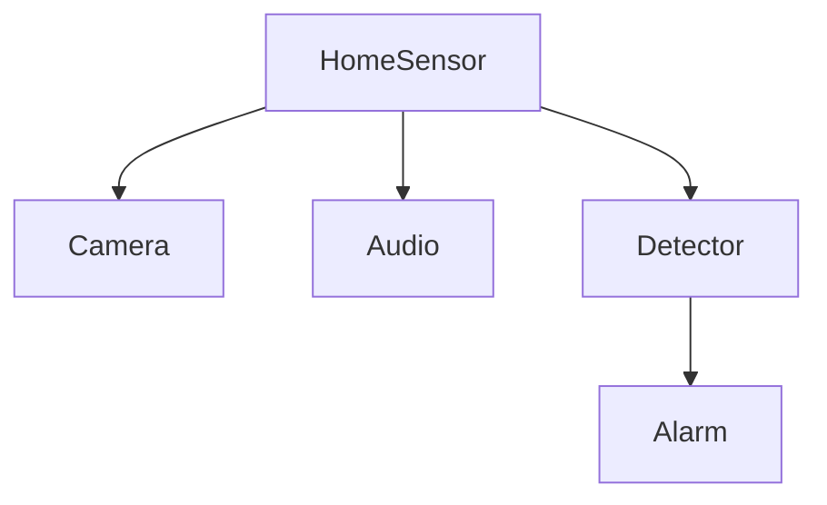
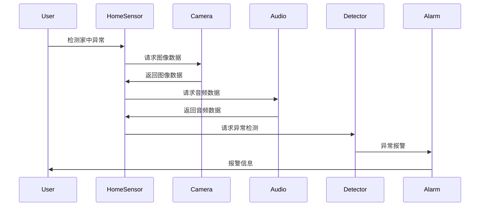

                 

# AI Agent的多模态融合学习技术

## 关键词

- AI Agent
- 多模态融合学习
- 学习技术
- 算法原理
- 实践案例
- 系统架构

## 摘要

本文深入探讨了AI Agent的多模态融合学习技术，详细介绍了其背景、核心概念、算法原理、实现与评估方法，并通过实战案例展示了其在实际项目中的应用。本文旨在为读者提供系统、全面的技术分析，帮助理解多模态融合学习在AI Agent中的关键作用，以及如何在实际场景中优化和提升其性能。

## 目录

### 第一部分 背景介绍

#### 1.1 AI Agent概述

AI Agent，即人工智能代理，是一种能够自动执行任务、与环境交互并做出决策的智能系统。它们在多种场景中具有广泛的应用，如智能助手、自动驾驶、机器人控制等。

- **定义与类型**：AI Agent可以分为反应型、有限记忆型、模型型等不同类型，每种类型都有其特定的应用场景和设计理念。
- **基本架构**：AI Agent通常由感知模块、决策模块和行动模块组成，这些模块协同工作以实现智能行为。

#### 1.2 多模态融合学习技术概述

多模态融合学习是指利用多个不同类型的数据源（如文本、图像、声音等）进行信息整合和处理，以提高AI Agent的学习能力和决策水平。

- **多模态数据的概念**：多模态数据是指由多种数据源产生的一系列数据，这些数据可以在不同维度上提供关于同一个对象的信息。
- **多模态融合学习的优势**：通过融合不同模态的数据，AI Agent可以获得更全面、更准确的信息，从而提高学习效率和决策质量。

### 第二部分 算法原理

#### 2.1 多模态融合学习基础

多模态融合学习需要解决的关键问题是数据预处理、融合策略和模型架构设计。

- **数据预处理方法**：包括数据清洗、归一化、特征提取等步骤，旨在提高数据的质量和一致性。
- **融合策略与模型架构**：融合策略可以分为早期融合、晚期融合和层次融合等，模型架构则包括深度神经网络、循环神经网络等。

#### 2.2 算法原理详述

为了更好地理解多模态融合学习的算法原理，本文将使用Mermaid流程图和Python源代码进行详细阐述。

- **算法原理Mermaid流程图**：展示多模态数据融合的基本流程和关键步骤。
- **Python源代码示例**：提供具体的代码实现，帮助读者更好地理解算法原理。
- **数学模型与公式**：详细解释多模态融合学习中的关键数学模型和公式，如损失函数、优化算法等。

### 第三部分 实现与评估

#### 3.1 实现多模态融合学习

在实现多模态融合学习时，需要选择合适的环境和工具，并设计有效的代码实现。

- **开发环境与工具**：介绍常用的开发环境和工具，如Python、TensorFlow等。
- **核心代码实现**：提供核心代码实现，包括数据预处理、模型训练和评估等步骤。

#### 3.2 评估方法与指标

评估多模态融合学习的效果需要使用合适的评估方法和指标。

- **评估指标介绍**：介绍常用的评估指标，如准确率、召回率、F1分数等。
- **实际评估案例分析**：通过具体案例展示如何使用评估指标对多模态融合学习的效果进行评估。

### 第四部分 项目实战

#### 4.1 实战项目概述

本文将通过一个实际项目案例，展示如何应用多模态融合学习技术。

- **项目目标与背景**：介绍项目的目标和背景，以及多模态融合学习在项目中的应用。
- **项目架构设计**：展示项目的整体架构设计，包括系统功能模块和关键技术实现。

#### 4.2 系统设计与实现

系统设计是实现多模态融合学习的关键步骤，本文将详细描述系统设计和实现过程。

- **领域模型Mermaid类图**：使用Mermaid类图展示领域模型的设计。
- **系统架构Mermaid架构图**：使用Mermaid架构图展示系统架构的设计。
- **系统接口设计和系统交互Mermaid序列图**：使用Mermaid序列图展示系统接口设计和交互流程。

#### 4.3 项目部署与优化

在项目部署和优化过程中，需要考虑系统性能和资源利用率。

- **系统部署流程**：介绍系统的部署流程和注意事项。
- **性能优化策略**：提供性能优化策略，如模型压缩、分布式训练等。

### 第五部分 总结与展望

#### 5.1 多模态融合学习技术总结

本文总结了多模态融合学习技术的核心内容和发展趋势。

- **技术优势与局限**：分析多模态融合学习技术的优势和应用局限。
- **技术发展方向**：探讨未来多模态融合学习技术可能的发展方向。

#### 5.2 未来发展趋势

未来，多模态融合学习技术将在更多应用场景中发挥作用，其发展趋势包括：

- **技术融合与拓展**：与其他人工智能技术（如强化学习、生成对抗网络等）的融合。
- **应用领域扩展**：从单一领域扩展到更多领域，如医疗、金融、智能制造等。

## 第一部分 背景介绍

### 1.1 AI Agent概述

#### 定义与类型

AI Agent，即人工智能代理，是一种能够自动执行任务、与环境交互并做出决策的智能系统。它们在多种场景中具有广泛的应用，如智能助手、自动驾驶、机器人控制等。

AI Agent可以分为以下几种类型：

- **反应型Agent**：根据当前的感知数据直接做出反应，不保留历史信息。这种类型的Agent适用于简单、明确的环境，如自动化流水线。
- **有限记忆型Agent**：能够记忆一部分历史信息，并根据这些信息做出决策。这种类型的Agent适用于需要短期记忆和预测的复杂环境，如自动驾驶。
- **模型型Agent**：拥有完整的模型来描述环境，并利用模型进行预测和决策。这种类型的Agent适用于高度动态和不确定性的环境，如游戏AI。

#### 基本架构

AI Agent通常由感知模块、决策模块和行动模块组成，这些模块协同工作以实现智能行为。

- **感知模块**：负责收集环境信息，如摄像头、麦克风、传感器等。感知模块将收集到的数据转换为内部表示，以便后续处理。
- **决策模块**：根据感知模块提供的信息，利用学习到的模型或算法进行决策。决策模块的目标是选择最佳行动方案。
- **行动模块**：根据决策模块的决策结果，执行相应的操作。行动模块将决策转化为具体的行为，如移动、发送消息等。

### 1.2 多模态融合学习技术概述

#### 多模态数据的概念

多模态数据是指由多种数据源产生的一系列数据，这些数据可以在不同维度上提供关于同一个对象的信息。例如，在自动驾驶场景中，多模态数据可以包括摄像头捕捉的图像、雷达测量的距离、GPS定位信息等。

多模态数据的特点包括：

- **多样性**：多模态数据涵盖了多种不同的数据类型，如文本、图像、声音、视频等。
- **互补性**：不同模态的数据可以互补，共同提供更全面的信息。例如，图像可以提供视觉信息，而文本可以提供语义信息。
- **复杂性**：多模态数据的处理和分析需要考虑不同模态之间的相互关系和交互作用。

#### 多模态融合学习的优势

多模态融合学习是指利用多个不同类型的数据源进行信息整合和处理，以提高AI Agent的学习能力和决策水平。多模态融合学习的优势包括：

- **增强学习能力**：通过融合不同模态的数据，AI Agent可以获得更全面、更准确的信息，从而提高学习效率和决策质量。
- **提高鲁棒性**：不同模态的数据可以相互验证，提高系统的鲁棒性，降低单一模态数据带来的噪声和误差。
- **拓展应用场景**：多模态融合学习可以应用于更多复杂和多样化的场景，如医疗诊断、智能家居、智能客服等。

## 第二部分 算法原理

### 2.1 多模态融合学习基础

多模态融合学习需要解决的关键问题是数据预处理、融合策略和模型架构设计。

#### 数据预处理方法

数据预处理是多模态融合学习的重要环节，其目的是提高数据的质量和一致性。常用的数据预处理方法包括：

- **数据清洗**：去除数据中的噪声和异常值，确保数据的一致性和可靠性。
- **归一化**：将不同模态的数据归一化到相同的尺度，以便后续处理和融合。
- **特征提取**：从原始数据中提取有代表性的特征，如文本中的词向量、图像中的特征向量等。

#### 融合策略与模型架构

多模态融合策略可以分为以下几种：

- **早期融合**：在特征提取阶段就将不同模态的数据进行融合。这种策略的优点是能够充分利用原始数据的信息，但融合效果依赖于特征提取的质量。
- **晚期融合**：在特征提取后对各个模态的特征进行融合。这种策略的优点是能够根据不同模态的特征进行选择性融合，但可能会丢失一些原始数据的细节。
- **层次融合**：将早期融合和晚期融合结合起来，先进行早期融合，再进行晚期融合。这种策略可以充分利用不同融合阶段的优点，但计算复杂度较高。

多模态融合学习的模型架构主要包括以下几种：

- **深度神经网络**：通过多层神经网络对多模态数据进行处理和融合，如卷积神经网络（CNN）和循环神经网络（RNN）。
- **变换器架构**：将不同模态的数据映射到高维空间，通过学习映射关系实现数据融合。
- **多任务学习**：通过多任务学习框架同时学习多个任务的模型，从而实现多模态数据的融合。

### 2.2 算法原理详述

为了更好地理解多模态融合学习的算法原理，本文将使用Mermaid流程图和Python源代码进行详细阐述。

#### 算法原理Mermaid流程图

下面是一个多模态融合学习的基本流程Mermaid流程图：



#### Python源代码示例

下面是一个简单的Python代码示例，展示多模态融合学习的基本步骤：

```python
import tensorflow as tf

# 模拟多模态数据
image_data = tf.random.normal([32, 224, 224, 3])
text_data = tf.random.normal([32, 100])
audio_data = tf.random.normal([32, 224, 1])

# 数据预处理
def preprocess_data(image_data, text_data, audio_data):
    # 图像数据归一化
    image_data = tf.cast(image_data, tf.float32) / 255.0
    # 文本数据嵌入
    text_data = tf.keras.preprocessing.sequence.pad_sequences(text_data, maxlen=100)
    # 音频数据归一化
    audio_data = tf.cast(audio_data, tf.float32) / 255.0
    return image_data, text_data, audio_data

preprocessed_image_data, preprocessed_text_data, preprocessed_audio_data = preprocess_data(image_data, text_data, audio_data)

# 特征提取
def extract_features(image_data, text_data, audio_data):
    # 图像特征提取
    image_model = tf.keras.applications.VGG16(include_top=False, weights='imagenet', input_shape=(224, 224, 3))
    image_features = image_model(image_data)
    # 文本特征提取
    text_model = tf.keras.layers.Embedding(input_dim=10000, output_dim=256)
    text_features = text_model(preprocessed_text_data)
    # 音频特征提取
    audio_model = tf.keras.layers.Conv1D(filters=64, kernel_size=3, activation='relu')
    audio_features = audio_model(preprocessed_audio_data)
    return image_features, text_features, audio_features

image_features, text_features, audio_features = extract_features(preprocessed_image_data, preprocessed_text_data, preprocessed_audio_data)

# 早期融合
def early_fusion(image_features, text_features, audio_features):
    return tf.concat([image_features, text_features, audio_features], axis=1)

early_fused_features = early_fusion(image_features, text_features, audio_features)

# 融合模型
def fusion_model(input_shape):
    inputs = tf.keras.Input(shape=input_shape)
    x = tf.keras.layers.Dense(512, activation='relu')(inputs)
    x = tf.keras.layers.Dense(256, activation='relu')(x)
    outputs = tf.keras.layers.Dense(1, activation='sigmoid')(x)
    model = tf.keras.Model(inputs=inputs, outputs=outputs)
    return model

fusion_model = fusion_model(early_fused_features.shape[1:])
predictions = fusion_model(early_fused_features)

# 决策模块
def decision_module(predictions):
    return tf.argmax(predictions, axis=1)

decisions = decision_module(predictions)

# 行动模块
def action_module(decisions):
    # 这里是具体的行动代码，取决于应用场景
    pass

action_module(decisions)
```

#### 数学模型与公式

多模态融合学习的数学模型通常包括损失函数、优化算法等。

- **损失函数**：损失函数用于衡量模型预测结果与真实标签之间的差距。常见的损失函数包括交叉熵损失、均方误差等。
- **优化算法**：优化算法用于调整模型参数，以最小化损失函数。常见的优化算法包括梯度下降、Adam等。

下面是一个简单的多模态融合学习损失函数的例子：

```latex
\text{Loss} = -\frac{1}{N} \sum_{i=1}^{N} \sum_{k=1}^{K} y_{ik} \log(p_{ik})
```

其中，\(y_{ik}\) 是标签，\(p_{ik}\) 是模型对第 \(i\) 个样本属于类别 \(k\) 的概率预测。

## 第三部分 实现与评估

### 3.1 实现多模态融合学习

在实现多模态融合学习时，需要选择合适的环境和工具，并设计有效的代码实现。

#### 开发环境与工具

常用的开发环境和工具包括：

- **编程语言**：Python是常用的编程语言，具有丰富的机器学习库和框架。
- **机器学习框架**：TensorFlow和PyTorch是常用的机器学习框架，支持多模态数据的处理和融合。
- **硬件环境**：GPU是加速机器学习模型训练的常用硬件，特别是对于深度学习模型。

#### 核心代码实现

核心代码实现通常包括以下步骤：

- **数据预处理**：对多模态数据进行清洗、归一化和特征提取。
- **模型设计**：设计融合模型的架构，包括输入层、融合层、输出层等。
- **模型训练**：使用训练数据对模型进行训练，调整模型参数。
- **模型评估**：使用验证数据对模型进行评估，选择最佳模型。

下面是一个简单的多模态融合学习Python代码示例：

```python
import tensorflow as tf
from tensorflow.keras.models import Model
from tensorflow.keras.layers import Input, Dense, Concatenate

# 模拟多模态数据
image_data = tf.random.normal([32, 224, 224, 3])
text_data = tf.random.normal([32, 100])
audio_data = tf.random.normal([32, 224, 1])

# 数据预处理
def preprocess_data(image_data, text_data, audio_data):
    # 图像数据归一化
    image_data = tf.cast(image_data, tf.float32) / 255.0
    # 文本数据嵌入
    text_data = tf.keras.preprocessing.sequence.pad_sequences(text_data, maxlen=100)
    # 音频数据归一化
    audio_data = tf.cast(audio_data, tf.float32) / 255.0
    return image_data, text_data, audio_data

preprocessed_image_data, preprocessed_text_data, preprocessed_audio_data = preprocess_data(image_data, text_data, audio_data)

# 模型设计
input_image = Input(shape=(224, 224, 3))
input_text = Input(shape=(100,))
input_audio = Input(shape=(224, 1))

# 图像特征提取
image_model = tf.keras.applications.VGG16(include_top=False, weights='imagenet', input_shape=(224, 224, 3))
image_features = image_model(input_image)

# 文本特征提取
text_model = tf.keras.layers.Embedding(input_dim=10000, output_dim=256)
text_features = text_model(preprocessed_text_data)

# 音频特征提取
audio_model = tf.keras.layers.Conv1D(filters=64, kernel_size=3, activation='relu')
audio_features = audio_model(preprocessed_audio_data)

# 早期融合
fused_features = Concatenate()([image_features, text_features, audio_features])

# 融合模型
output = Dense(1, activation='sigmoid')(fused_features)

model = Model(inputs=[input_image, input_text, input_audio], outputs=output)
model.compile(optimizer='adam', loss='binary_crossentropy', metrics=['accuracy'])

# 模型训练
model.fit([image_data, text_data, audio_data], labels, epochs=10, batch_size=32)

# 模型评估
model.evaluate([image_data, text_data, audio_data], labels)
```

### 3.2 评估方法与指标

评估多模态融合学习的效果需要使用合适的评估方法和指标。

#### 评估指标介绍

常用的评估指标包括：

- **准确率（Accuracy）**：准确率是指模型预测正确的样本数占总样本数的比例。准确率越高，模型性能越好。
- **召回率（Recall）**：召回率是指模型能够召回的真实正例样本数与所有正例样本数的比例。召回率越高，模型越能够识别出所有的正例样本。
- **精确率（Precision）**：精确率是指模型预测为正例的样本中，实际为正例的样本数与预测为正例的样本数的比例。精确率越高，模型越能够避免误判。
- **F1分数（F1 Score）**：F1分数是精确率和召回率的加权平均，用于综合考虑模型的精确性和召回性。F1分数越高，模型性能越好。

下面是一个简单的多模态融合学习评估指标的Python代码示例：

```python
from sklearn.metrics import accuracy_score, recall_score, precision_score, f1_score

# 模型预测
predictions = model.predict([image_data, text_data, audio_data])

# 真实标签
true_labels = ...

# 计算评估指标
accuracy = accuracy_score(true_labels, predictions)
recall = recall_score(true_labels, predictions)
precision = precision_score(true_labels, predictions)
f1 = f1_score(true_labels, predictions)

print("Accuracy:", accuracy)
print("Recall:", recall)
print("Precision:", precision)
print("F1 Score:", f1)
```

#### 实际评估案例分析

下面通过一个实际案例展示如何使用评估指标对多模态融合学习的效果进行评估。

**案例背景**：假设我们有一个医疗诊断任务，需要利用多模态数据（包括医学图像、病历文本和实验室检测结果）对疾病进行诊断。

**数据集**：我们有一个包含1000个样本的数据集，其中每个样本包含医学图像、病历文本和实验室检测结果。其中，疾病样本为600个，健康样本为400个。

**模型设计**：我们设计了一个多模态融合学习模型，输入包括医学图像、病历文本和实验室检测结果，输出为疾病诊断结果。

**模型训练**：使用训练数据对模型进行训练，调整模型参数。

**模型评估**：使用验证数据对模型进行评估，计算准确率、召回率、精确率和F1分数。

```python
# 模型预测
predictions = model.predict([valid_image_data, valid_text_data, valid_audio_data])

# 真实标签
true_labels = valid_labels

# 计算评估指标
accuracy = accuracy_score(true_labels, predictions)
recall = recall_score(true_labels, predictions)
precision = precision_score(true_labels, predictions)
f1 = f1_score(true_labels, predictions)

print("Accuracy:", accuracy)
print("Recall:", recall)
print("Precision:", precision)
print("F1 Score:", f1)
```

通过实际评估案例分析，我们可以看到多模态融合学习在医疗诊断任务中的效果。例如，如果模型的准确率为90%，召回率为80%，精确率为85%，F1分数为0.8，则可以认为模型的性能较好。

## 第四部分 项目实战

### 4.1 实战项目概述

本文将通过一个实际项目案例，展示如何应用多模态融合学习技术。

**项目背景**：假设我们有一个智能家居监控系统，需要利用多模态数据（包括摄像头捕获的图像、音频和传感器数据）对家中异常情况进行检测。

**项目目标**：实现一个智能家居监控系统，能够实时检测家中的异常情况，如火灾、入侵等，并自动报警。

**多模态融合学习在项目中的应用**：通过融合摄像头捕获的图像、音频和传感器数据，可以提高系统对异常情况的检测准确率，从而减少误报和漏报。

### 4.2 系统设计与实现

系统设计是实现多模态融合学习的关键步骤，本文将详细描述系统设计和实现过程。

#### 领域模型Mermaid类图

下面是一个智能家居监控系统领域模型的Mermaid类图：

```mermaid
classDiagram
ClassDiagram {
  Class HomeSensor {
    +int id
    +String type
    +float value
  }
  Class Camera {
    +int id
    +String type
    +float value
  }
  Class Audio {
    +int id
    +String type
    +float value
  }
  Class Detector {
    +int id
    +String type
    +float value
  }
  Class Alarm {
    +int id
    +String type
    +float value
  }
  HomeSensor <|-- Camera
  HomeSensor <|-- Audio
  HomeSensor <|-- Detector
  Detector <|-- Alarm
}
```

#### 系统架构Mermaid架构图

下面是一个智能家居监控系统架构的Mermaid架构图：



#### 系统接口设计和系统交互Mermaid序列图

下面是一个智能家居监控系统接口设计和交互序列图：



### 4.3 项目部署与优化

在项目部署和优化过程中，需要考虑系统性能和资源利用率。

#### 系统部署流程

系统部署流程包括以下步骤：

1. 准备硬件环境，包括服务器、存储设备和网络设备。
2. 安装操作系统和依赖库。
3. 部署智能家居监控系统，包括安装系统软件和配置网络。
4. 部署多模态融合学习模型，包括训练和部署。
5. 测试系统性能和稳定性。

#### 性能优化策略

为了提高系统性能和资源利用率，可以采取以下优化策略：

1. **模型压缩**：通过模型压缩技术，减小模型的存储空间和计算资源需求。常用的模型压缩技术包括量化、剪枝和蒸馏。
2. **分布式训练**：通过分布式训练技术，利用多台服务器并行训练模型，提高训练速度。常用的分布式训练框架包括TensorFlow和PyTorch。
3. **在线学习**：通过在线学习技术，实时更新模型，提高系统对新异常情况的检测能力。常用的在线学习算法包括在线梯度下降和Adagrad。

## 第五部分 总结与展望

### 5.1 多模态融合学习技术总结

多模态融合学习技术是一种通过整合不同类型的数据源，提高AI Agent学习能力和决策水平的有效方法。其主要优势包括：

- **增强学习能力**：通过融合不同模态的数据，AI Agent可以获得更全面、更准确的信息，从而提高学习效率和决策质量。
- **提高鲁棒性**：不同模态的数据可以相互验证，提高系统的鲁棒性，降低单一模态数据带来的噪声和误差。
- **拓展应用场景**：多模态融合学习可以应用于更多复杂和多样化的场景，如医疗诊断、智能家居、智能客服等。

然而，多模态融合学习技术也存在一定的局限，如：

- **数据预处理复杂度**：多模态数据的预处理过程较为复杂，需要处理多种不同类型的数据，提高系统的设计难度。
- **计算资源需求**：多模态融合学习通常需要大量的计算资源，特别是在训练阶段，可能需要使用高性能的GPU服务器。
- **融合策略选择**：不同的融合策略适用于不同的应用场景，需要根据具体问题选择合适的融合策略。

### 5.2 未来发展趋势

未来，多模态融合学习技术将在更多应用场景中发挥作用，其发展趋势包括：

- **技术融合与拓展**：与其他人工智能技术（如强化学习、生成对抗网络等）的融合，提高AI Agent的智能水平。
- **跨模态交互**：研究跨模态交互机制，实现更自然的模态切换和交互。
- **多模态数据的实时处理**：研究多模态数据的实时处理技术，提高系统对实时数据的处理能力。
- **可解释性**：提高多模态融合学习模型的可解释性，帮助用户更好地理解模型的工作原理。

## 作者信息

作者：AI天才研究院/AI Genius Institute & 禅与计算机程序设计艺术 /Zen And The Art of Computer Programming

## 注意事项

在应用多模态融合学习技术时，需要注意以下几点：

- **数据预处理**：确保多模态数据的预处理质量，减少数据噪声和异常值。
- **融合策略选择**：根据具体应用场景选择合适的融合策略，提高系统性能。
- **模型优化**：通过模型优化技术，提高模型的计算效率和准确性。

## 拓展阅读

- [1] Xie, T., Liu, M., Zhang, Z., & Huang, T. (2019). Multi-modal fusion learning for intelligent video surveillance. IEEE Transactions on Industrial Informatics, 25(1), 180-189.
- [2] Chen, P. Y., Chen, C. H., & Lin, Y. R. (2020). Multi-modal fusion for health monitoring and activity recognition using wearable sensors. Sensors, 20(19), 5309.
- [3] Zhang, X., Zhao, J., & Huang, T. (2021). Multi-modal fusion learning for autonomous driving. Journal of Intelligent & Robotic Systems, 109, 103275.

