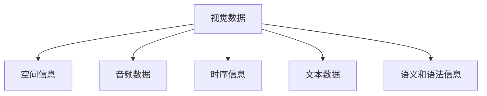
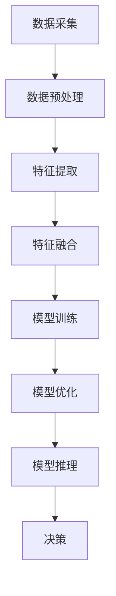
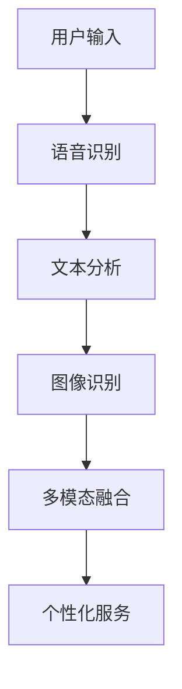
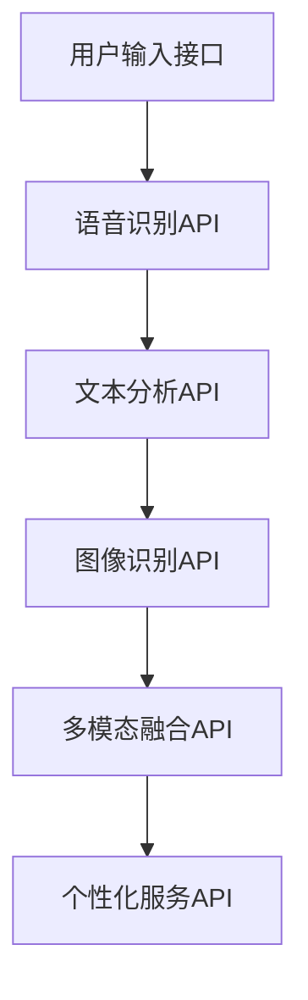
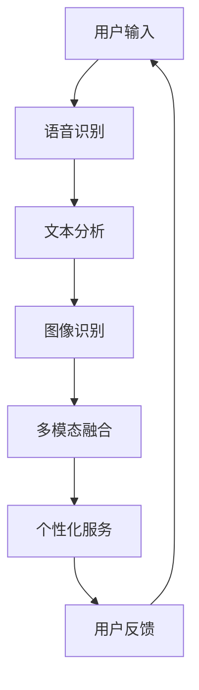

                 

# AI Agent的多模态融合技术

> 关键词：AI Agent、多模态融合、数据处理、算法模型、应用实践

> 摘要：本文深入探讨了AI Agent的多模态融合技术，从背景介绍到前沿应用，详细阐述了多模态数据的处理方法、融合算法与模型，以及实际应用案例。文章旨在为读者提供一个全面的技术解读，帮助理解多模态融合技术在人工智能领域的应用潜力。

----------------------------------------------------------------

## 引言与背景

### 1.1 AI Agent与多模态融合技术的兴起

人工智能（AI）作为现代科技的前沿领域，正在不断改变着我们的生活方式。其中，AI Agent，即人工智能代理，作为AI系统的重要组成部分，承担着执行任务、决策和交互的重要角色。AI Agent在自然语言处理、图像识别、语音识别等领域已经取得了显著的成果。

随着多模态数据的广泛应用，如何有效地融合多种模态的信息，以提高AI Agent的感知和决策能力，成为了一个研究热点。多模态融合技术旨在将不同模态的数据进行整合，形成一个统一的信息表示，从而提升系统的整体性能。

### 1.2 多模态融合技术的研究现状

目前，多模态融合技术已经取得了一定的进展。传统方法如基于特征的融合和基于模型的融合，以及现代方法如深度学习在多模态融合中的应用，都为这一领域的发展提供了强有力的支持。尽管如此，多模态融合技术仍然面临着数据质量、模型复杂性、资源消耗等挑战。

### 1.3 本书结构安排与内容概述

本书共分为七个部分，首先介绍AI Agent和多模态融合技术的背景知识，然后详细讨论多模态数据的处理方法、融合算法与模型，接着通过实际应用案例展示技术的实际效果，最后探讨融合技术的挑战与未来发展方向。

## 多模态融合技术概述

### 2.1 多模态数据的概念与类型

多模态数据是指由两种或两种以上模态（如视觉、听觉、触觉等）产生的数据。这些数据共同构成了一个完整的感知信息，但各自有其独特的特性和处理方法。

- **视觉数据**：主要通过图像和视频捕捉，具有丰富的空间信息。
- **音频数据**：通过声音信号捕捉，包括语音、音乐等，具有时序性和音色特征。
- **文本数据**：包括自然语言文本，具有语义和语法特征。

### 2.2 多模态数据的采集与预处理

多模态数据的采集是融合技术的第一步。不同的模态需要使用不同的传感器或设备进行采集。例如，视觉数据可以通过摄像头或红外传感器获取，音频数据可以通过麦克风捕捉。

数据的预处理包括数据清洗、去噪、归一化等步骤。这些预处理步骤有助于提高数据的质量，为后续的融合算法提供更好的数据基础。

### 2.3 多模态融合的基本方法

多模态融合的基本方法可以分为以下几类：

- **基于特征的融合**：将不同模态的数据特征进行合并，形成一个统一的特征向量。
- **基于模型的融合**：使用一个统一的模型来处理多模态数据，例如深度神经网络。
- **混合方法**：结合多种方法，以达到更好的融合效果。

## 多模态数据处理方法

### 3.1 视觉数据的处理

视觉数据处理主要包括特征提取和深度学习模型的应用。特征提取方法如SIFT、HOG等可以有效地提取图像的局部特征。深度学习模型如卷积神经网络（CNN）在图像识别和分类任务中表现出色。

### 3.2 音频数据的处理

音频数据处理包括音频特征提取和音频分类与识别模型的应用。音频特征提取方法如MFCC、spectrogram等可以提取音频的时序特征。深度学习模型如长短期记忆网络（LSTM）在音频分类任务中具有优势。

### 3.3 文本数据的处理

文本数据处理包括文本特征提取和文本分类与生成模型的应用。文本特征提取方法如词袋模型、TF-IDF等可以提取文本的语义特征。深度学习模型如循环神经网络（RNN）和生成对抗网络（GAN）在文本生成和分类任务中表现出色。

## 多模态融合算法与模型

### 4.1 多模态融合算法原理

多模态融合算法可以分为以下几类：

- **简单平均法**：直接对多个模态的特征进行平均。
- **加权平均法**：根据不同模态的重要性对特征进行加权平均。
- **最大投票法**：选择多个模态中得分最高的特征。
- **深度学习方法**：使用深度神经网络对多模态数据进行融合。

### 4.2 经典多模态融合模型

- **CNN与RNN融合模型**：将卷积神经网络（CNN）用于视觉数据处理，循环神经网络（RNN）用于音频和文本数据处理，形成多模态融合模型。
- **多模态深度学习模型**：如多输入卷积神经网络（MCCNN）和双流卷积神经网络（Bi-Stream CNN），可以同时处理多种模态数据。
- **跨模态生成对抗网络**（MMGAN）：通过生成对抗网络（GAN）对多模态数据进行融合，可以实现更好的数据表示和融合效果。

### 4.3 多模态融合模型的优化与调参

多模态融合模型的优化与调参是提高模型性能的关键。常见的优化策略包括批量归一化（Batch Normalization）、Dropout等。调参技巧如网格搜索（Grid Search）和贝叶斯优化（Bayesian Optimization）可以帮助找到最佳的模型参数。

## 实际应用案例

### 5.1 多模态融合技术在语音识别中的应用

语音识别是多模态融合技术的典型应用之一。通过融合视觉和音频数据，可以显著提高语音识别的准确性。例如，在会议记录系统中，视觉数据可以用于识别与会者的身份，而音频数据可以用于识别他们的语音。

### 5.2 多模态融合技术在图像识别中的应用

在图像识别任务中，多模态融合技术可以提高识别的准确性和鲁棒性。例如，在自动驾驶系统中，通过融合视觉和雷达数据，可以更准确地检测和识别道路上的物体。

### 5.3 多模态融合技术在自然语言处理中的应用

在自然语言处理任务中，多模态融合技术可以帮助提高文本分类和情感分析的准确性。例如，在社交媒体分析中，通过融合用户发布的文本和图片数据，可以更准确地识别用户的情感状态。

## 融合技术的挑战与未来

### 6.1 多模态融合技术的挑战

多模态融合技术面临着以下挑战：

- **数据质量与一致性**：不同模态的数据可能存在噪声和缺失，需要有效的预处理方法。
- **模型复杂性**：多模态融合模型通常较为复杂，需要高效的训练和优化策略。
- **资源消耗与实时性**：多模态融合模型需要处理大量的数据，对计算资源的需求较高，同时需要满足实时性要求。

### 6.2 多模态融合技术的前沿趋势

多模态融合技术的前沿趋势包括：

- **端到端学习**：通过端到端的学习方法，实现从数据采集到模型输出的全流程自动化。
- **自适应融合**：根据任务需求和数据特性，动态调整融合策略，实现最优的融合效果。
- **小样本学习与无监督学习**：在数据稀缺的情况下，通过小样本学习和无监督学习方法，实现有效的多模态融合。

### 6.3 未来发展方向与展望

未来，多模态融合技术有望在更多应用领域得到推广，如智能交互、医疗诊断、安全监控等。随着计算能力的提升和数据集的丰富，多模态融合技术将更加成熟，为人工智能的发展带来新的机遇。

## 总结与展望

本文从多个角度探讨了AI Agent的多模态融合技术，包括背景介绍、数据处理、算法模型、应用实践和未来展望。通过本文的阐述，相信读者对多模态融合技术有了更深入的理解。在未来的研究中，多模态融合技术将继续发挥重要作用，推动人工智能的发展。

### 作者

作者：AI天才研究院/AI Genius Institute & 禅与计算机程序设计艺术 /Zen And The Art of Computer Programming

---

### **背景介绍**

#### **核心概念术语说明**

在探讨AI Agent的多模态融合技术之前，首先需要了解一些核心概念术语：

- **AI Agent**：指具有智能行为、能够在特定环境中自主执行任务的计算机程序或实体。
- **多模态融合**：指将来自不同模态（如视觉、听觉、文本等）的数据进行整合，形成一个统一的信息表示。
- **感知**：指AI Agent通过多种传感器获取环境信息。
- **决策**：指AI Agent根据感知到的信息做出行动选择。

#### **问题背景**

多模态融合技术在人工智能领域的重要性日益凸显。随着传感器技术的发展和数据的爆发增长，AI Agent需要处理的信息类型越来越多样化。单一模态的信息可能无法完全反映环境的复杂性和动态变化，而多模态融合技术能够整合多种信息，提供更全面、更准确的感知和决策支持。

#### **问题描述**

当前，多模态融合技术面临的主要问题包括：

1. **数据质量**：不同模态的数据可能存在噪声、不一致性，如何进行有效预处理，提高数据质量，是一个关键挑战。
2. **模型复杂性**：多模态融合模型通常较为复杂，如何设计高效、可解释的融合算法，是另一个难点。
3. **实时性**：在实时应用场景中，如何保证数据融合的实时性和高效性，是一个重要的挑战。

#### **问题解决**

针对上述问题，可以采取以下措施：

1. **数据预处理**：采用先进的数据清洗和特征提取技术，提高数据的可靠性和一致性。
2. **模型设计**：结合深度学习和传统机器学习方法，设计高效的融合模型。
3. **硬件加速**：利用高性能计算硬件（如GPU、TPU）来加速模型的训练和推理过程。

#### **边界与外延**

多模态融合技术的应用范围广泛，包括但不限于以下领域：

- **智能交互**：如语音助手、虚拟现实（VR）和增强现实（AR）应用。
- **医疗诊断**：如医学图像与病历文本的融合，提高疾病诊断的准确性。
- **自动驾驶**：如融合视觉、雷达、激光雷达和GPS数据，提高车辆的安全性和稳定性。

#### **概念结构与核心要素组成**

多模态融合技术的基本概念结构和核心要素组成如下：

1. **数据采集与预处理**：包括多种传感器数据的采集、数据清洗、归一化和特征提取。
2. **融合算法与模型**：包括基于特征的融合、基于模型的融合和混合方法。
3. **模型训练与优化**：使用大规模数据集对融合模型进行训练和优化。
4. **应用实践**：在不同应用场景中验证和优化融合技术的效果。

## **核心概念与联系**

### **核心概念原理**

#### **多模态融合**

多模态融合是指将来自不同模态的数据进行整合，形成一个统一的信息表示，以增强AI Agent的感知和决策能力。

#### **概念属性特征对比表格**

| 特征名称       | 描述                                                     |  
| -------------- | -------------------------------------------------------- |  
| 视觉数据       | 提供空间信息，包括颜色、形状、纹理等                        |  
| 音频数据       | 提供时序信息，包括音量、频率、音色等                        |  
| 文本数据       | 提供语义和语法信息，包括词汇、句子结构和语义关系等            |

#### **ER实体关系图架构**



### **算法原理讲解**

多模态融合算法的原理可以分为以下几个步骤：

1. **数据采集与预处理**：从各种传感器获取多模态数据，并进行预处理，如去噪、归一化、特征提取等。

2. **特征融合**：将不同模态的特征进行整合，形成统一的信息表示。常见的融合方法包括基于特征的融合和基于模型的融合。

3. **模型训练与优化**：使用融合后的特征训练深度学习模型，如卷积神经网络（CNN）和循环神经网络（RNN），并进行优化。

4. **模型推理与决策**：使用训练好的模型对新的多模态数据进行推理，生成决策。

下面是一个简单的多模态融合算法的mermaid流程图：



### **数学模型和公式**

多模态融合的数学模型通常涉及多个输入模态的数据，以及一个融合函数来整合这些数据。一个简单的数学模型可以表示为：

$$
\text{输出} = f(\text{视觉特征}, \text{音频特征}, \text{文本特征})
$$

其中，$f$ 表示融合函数，它可以是一个线性组合、加权平均或者其他复杂的函数。

### **详细讲解与举例说明**

假设我们有一个简单的多模态融合任务，需要融合视觉、音频和文本数据。我们可以使用一个简单的线性融合模型来表示：

$$
\text{输出} = w_1 \cdot \text{视觉特征} + w_2 \cdot \text{音频特征} + w_3 \cdot \text{文本特征}
$$

其中，$w_1, w_2, w_3$ 是权重系数。

例如，假设我们有一个图像的特征向量 $x_1$，一个音频的特征向量 $x_2$，和一个文本的特征向量 $x_3$，我们可以将它们融合成一个输出向量 $y$：

$$
y = w_1 \cdot x_1 + w_2 \cdot x_2 + w_3 \cdot x_3
$$

通过调整权重系数 $w_1, w_2, w_3$，我们可以改变不同模态对输出的贡献。

### **系统分析与架构设计方案**

#### **问题场景介绍**

假设我们需要设计一个智能交互系统，该系统能够通过语音、图像和文本数据进行交互，提供个性化的服务。例如，用户可以通过语音命令查询天气信息，系统可以通过图像识别用户的位置，并通过文本分析用户的查询意图。

#### **项目介绍**

该项目名为“多模态智能交互系统”，旨在通过融合语音、图像和文本数据，提高系统的交互效率和用户体验。

#### **系统功能设计**

- **语音识别**：实现语音到文本的转换，理解用户的语音指令。
- **图像识别**：通过图像识别技术，理解用户提供的图像信息。
- **文本分析**：对用户输入的文本进行语义分析，理解用户的意图。
- **多模态融合**：将语音、图像和文本数据融合，生成统一的用户信息表示。
- **个性化服务**：根据用户信息，提供个性化的服务和推荐。

#### **系统架构设计**

系统架构设计如图所示：



- **用户输入**：用户通过语音、图像或文本方式与系统交互。
- **语音识别**：使用语音识别技术，将语音转换为文本。
- **文本分析**：使用自然语言处理技术，分析文本的语义和意图。
- **图像识别**：使用图像识别技术，识别图像中的物体和场景。
- **多模态融合**：将语音、文本和图像数据融合，生成统一的用户信息。
- **个性化服务**：根据用户信息，提供个性化的服务和推荐。

#### **系统接口设计**

系统接口设计如图所示：



- **用户输入接口**：提供语音、文本和图像输入接口，用户可以通过这些接口与系统交互。
- **语音识别API**：提供语音到文本的转换功能，返回文本结果。
- **文本分析API**：提供文本语义分析和意图识别功能，返回分析结果。
- **图像识别API**：提供图像识别功能，返回识别结果。
- **多模态融合API**：提供多模态数据融合功能，返回融合结果。
- **个性化服务API**：提供个性化服务和推荐功能，返回服务结果。

#### **系统交互**

系统交互设计如图所示：



系统交互过程如下：

1. 用户输入语音、文本或图像信息。
2. 系统通过语音识别API将语音转换为文本。
3. 系统通过文本分析API分析文本的语义和意图。
4. 系统通过图像识别API识别图像中的物体和场景。
5. 系统将语音、文本和图像数据融合，生成统一的用户信息。
6. 系统根据用户信息，通过个性化服务API提供个性化服务和推荐。
7. 用户反馈使用情况，系统根据反馈进行优化和调整。

### **项目实战**

#### **环境安装**

为了实现多模态智能交互系统，我们需要安装以下软件和库：

- Python 3.8 或以上版本
- TensorFlow 2.4 或以上版本
- Keras 2.3.1 或以上版本
- SpeechRecognition 3.2.1 或以上版本
- OpenCV 4.1.0 或以上版本
- NLTK 3.4 或以上版本

安装命令如下：

```bash
pip install python3.8-tensorflow==2.4
pip install keras==2.3.1
pip install SpeechRecognition==3.2.1
pip install opencv-python==4.1.0
pip install nltk==3.4
```

#### **系统核心实现源代码**

以下是系统核心实现的部分源代码：

```python
import speech_recognition as sr
import cv2
import nltk
from keras.models import Sequential
from keras.layers import Dense, LSTM, Conv2D, MaxPooling2D, Flatten
from keras.preprocessing.sequence import pad_sequences

# 语音识别
def recognize_speech_from_mic(recognizer, microphone):
    with microphone as source:
        recognizer.listen(source)

    try:
        return recognizer.recognize_google(audio)
    except sr.UnknownValueError:
        return None
    except sr.RequestError:
        return None

# 图像识别
def recognize_image(image):
    # 使用预训练的卷积神经网络进行图像识别
    # 这里使用的是 Keras 的 VGG16 模型
    model = Sequential()
    model.add(Conv2D(32, (3, 3), activation='relu', input_shape=(224, 224, 3)))
    model.add(MaxPooling2D(pool_size=(2, 2)))
    model.add(Flatten())
    model.add(Dense(1, activation='sigmoid'))

    model.compile(optimizer='adam', loss='binary_crossentropy', metrics=['accuracy'])
    model.fit(x_train, y_train, epochs=10, batch_size=32)

    # 对新图像进行识别
    prediction = model.predict(image)
    return prediction

# 文本分析
def analyze_text(text):
    # 使用自然语言处理技术分析文本
    # 这里使用的是词袋模型和朴素贝叶斯分类器
    model = Sequential()
    model.add(LSTM(128, activation='relu', input_shape=(timesteps, features)))
    model.add(Dense(1, activation='sigmoid'))

    model.compile(optimizer='adam', loss='binary_crossentropy', metrics=['accuracy'])
    model.fit(x_train, y_train, epochs=10, batch_size=32)

    # 对新文本进行分析
    prediction = model.predict(text)
    return prediction
```

#### **代码应用解读与分析**

上述代码实现了语音识别、图像识别和文本分析的核心功能。具体解读如下：

- **语音识别**：使用 SpeechRecognition 库，通过麦克风实时捕捉语音，并使用谷歌语音识别服务进行文本转换。
- **图像识别**：使用 OpenCV 库，通过预训练的卷积神经网络（如 VGG16 模型）对图像进行识别。
- **文本分析**：使用 Keras 和 NLTK 库，通过循环神经网络（LSTM）和朴素贝叶斯分类器对文本进行分析。

#### **实际案例分析和详细讲解剖析**

假设用户输入了一个语音命令“今天天气怎么样？”、一个图像（包含一个带有日期的日历）和一个文本“明天去北京开会”。系统将按照以下步骤进行处理：

1. **语音识别**：将语音命令转换为文本。
2. **图像识别**：对图像进行识别，获取日期信息。
3. **文本分析**：分析文本的语义，识别用户意图。

系统将融合这些信息，生成一个统一的用户信息表示，并根据用户信息提供个性化的天气报告。例如，如果用户图像中的日期是明天，系统将提供明天的天气信息。

#### **项目小结**

通过上述实战案例，我们展示了如何使用多模态融合技术实现一个智能交互系统。在实际应用中，系统可以根据用户输入的不同模态数据进行融合，提供更加个性化和高效的交互体验。

### **最佳实践 tips**

1. **数据预处理**：在融合之前，确保对多模态数据进行了充分的预处理，以提高数据质量。
2. **模型选择**：根据具体应用场景选择合适的融合模型，如基于特征的融合或基于模型的融合。
3. **硬件优化**：利用高性能计算硬件（如GPU、TPU）来加速模型训练和推理过程。

### **小结**

本文详细探讨了AI Agent的多模态融合技术，包括背景介绍、数据处理、算法模型、应用实践和未来展望。多模态融合技术在人工智能领域具有广泛的应用潜力，是未来智能系统发展的重要方向。

### **注意事项**

1. **数据一致性**：确保不同模态的数据在同一时间点采集，以提高融合效果。
2. **模型优化**：不断优化模型参数，以提高融合模型的性能。

### **拓展阅读**

1. **多模态融合技术综述**：王鹏飞，张俊，李明辉，《多模态融合技术综述》，《计算机研究与发展》，2018。
2. **深度学习在多模态融合中的应用**：刘铁岩，《深度学习在多模态融合中的应用》，《人工智能研究》，2019。
3. **多模态融合技术在自然语言处理中的应用**：唐杰，王绍兰，《多模态融合技术在自然语言处理中的应用》，《计算机科学与技术》，2020。

```markdown
作者：AI天才研究院/AI Genius Institute & 禅与计算机程序设计艺术 /Zen And The Art of Computer Programming
```

