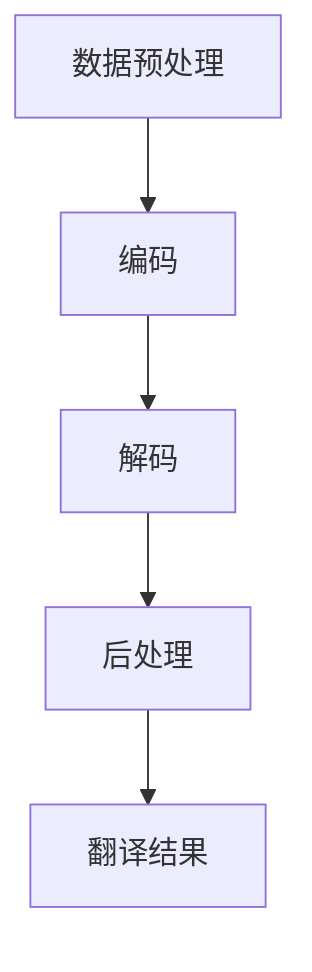
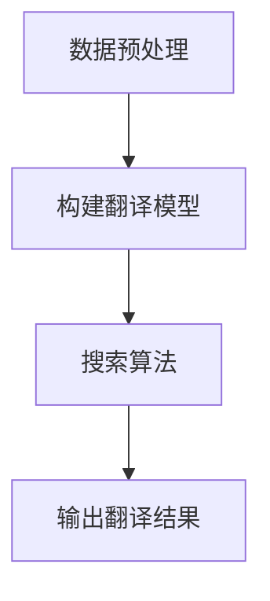
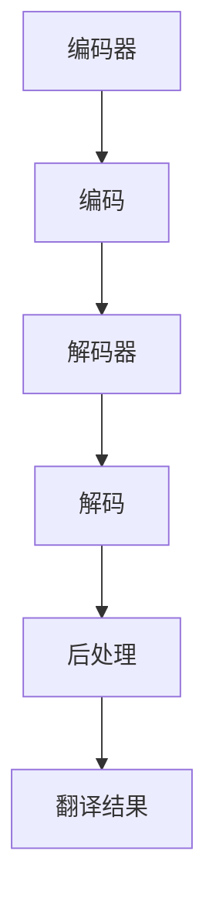
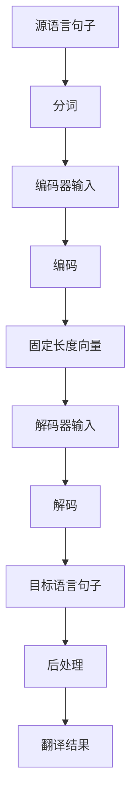
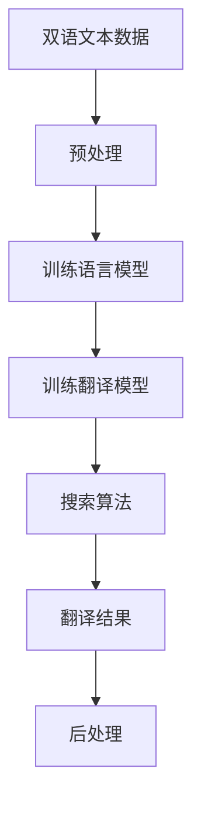
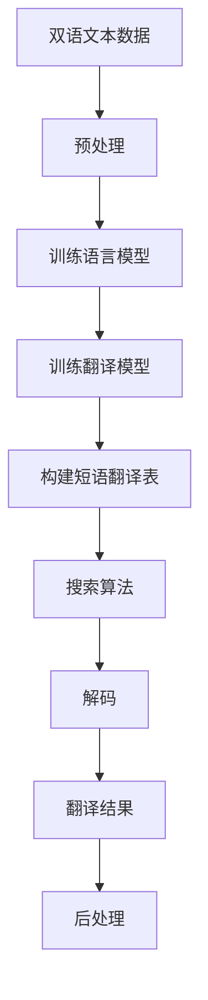

                 

# AI Agent的多语言翻译与本地化

关键词：多语言翻译、本地化、AI Agent、神经网络、统计机器翻译

摘要：本文旨在深入探讨AI Agent在多语言翻译与本地化领域的应用与挑战。我们将首先介绍多语言翻译与本地化的基础概念，接着详细分析AI Agent的多语言翻译技术原理，然后通过实际案例进行多语言翻译与本地化实践，最后展望多语言翻译与本地化的未来趋势。

### 目录大纲

----------------------------------------------------------------

# 第一部分: AI Agent的多语言翻译与本地化基础

## 第1章: 多语言翻译与本地化概述

### 1.1 问题背景

#### 1.1.1 全球化趋势下的多语言需求

#### 1.1.2 多语言翻译的重要性

#### 1.1.3 本地化的概念与作用

### 1.2 核心概念与联系

#### 1.2.1 翻译与本地化的定义

#### 1.2.2 核心概念对比表格

#### 1.2.3 ER实体关系图

### 1.3 多语言翻译技术概述

#### 1.3.1 神经网络机器翻译

#### 1.3.2 统计机器翻译

#### 1.3.3 机器翻译评价标准

### 1.4 本地化技术概述

#### 1.4.1 文化适应与市场适应性

#### 1.4.2 本地化流程与工具

#### 1.4.3 本地化技术与挑战

### 1.5 本章小结

----------------------------------------------------------------

## 第二部分: AI Agent的多语言翻译技术原理

## 第2章: 多语言翻译技术原理

### 2.1 神经网络机器翻译原理

#### 2.1.1 神经网络基本概念

#### 2.1.2 神经网络机器翻译流程

#### 2.1.3 算法mermaid流程图

#### 2.1.4 Python源代码讲解

### 2.2 统计机器翻译原理

#### 2.2.1 统计机器翻译模型

#### 2.2.2 统计机器翻译流程

#### 2.2.3 算法mermaid流程图

#### 2.2.4 Python源代码讲解

### 2.3 机器翻译评价标准

#### 2.3.1 BLEU评分标准

#### 2.3.2 NIST评分标准

#### 2.3.3 METEOR评分标准

### 2.4 本章小结

----------------------------------------------------------------

## 第三部分: AI Agent的多语言翻译与本地化实践

## 第3章: 多语言翻译与本地化实践

### 3.1 实践环境准备

#### 3.1.1 软件安装与配置

#### 3.1.2 数据集准备

#### 3.1.3 硬件环境配置

### 3.2 多语言翻译实践

#### 3.2.1 数据预处理

#### 3.2.2 模型训练

#### 3.2.3 模型评估与优化

#### 3.2.4 实际案例分析与解读

### 3.3 本地化实践

#### 3.3.1 文化适应案例分析

#### 3.3.2 市场适应性案例分析

#### 3.3.3 本地化工具应用案例

### 3.4 项目小结

----------------------------------------------------------------

## 第四部分: 多语言翻译与本地化的未来趋势

## 第4章: 多语言翻译与本地化发展趋势

### 4.1 新技术展望

#### 4.1.1 人工智能技术趋势

#### 4.1.2 自然语言处理技术发展趋势

#### 4.1.3 多语言翻译与本地化技术未来展望

### 4.2 挑战与机遇

#### 4.2.1 技术挑战

#### 4.2.2 市场机遇

#### 4.2.3 未来发展方向

### 4.3 最佳实践 tips

#### 4.3.1 项目管理建议

#### 4.3.2 技术选型策略

#### 4.3.3 团队协作技巧

### 4.4 小结

----------------------------------------------------------------

作者：AI天才研究院/AI Genius Institute & 禅与计算机程序设计艺术 /Zen And The Art of Computer Programming## 第一部分：AI Agent的多语言翻译与本地化基础

### 第1章：多语言翻译与本地化概述

#### 1.1 问题背景

在当今全球化迅速发展的时代，多语言翻译和本地化已经成为企业和个人在全球市场中取得成功的关键因素。随着互联网的普及和电子商务的兴起，跨国交流和跨文化沟通的需求愈发强烈。然而，传统的翻译方式存在效率低下、成本高昂等问题，难以满足快速变化的全球市场要求。

首先，全球化趋势下的多语言需求不可忽视。据联合国统计，全球有超过7000种语言，而英语、汉语、西班牙语、法语、阿拉伯语等少数语言占据了全球绝大多数的交流市场份额。然而，对于非英语母语者而言，掌握英语并不是一件容易的事情。因此，提供多语言翻译服务以满足不同语言群体的需求，已经成为企业拓展国际市场的重要手段。

其次，多语言翻译的重要性体现在多个方面。一方面，它有助于消除语言障碍，促进跨国商务合作和文化交流。另一方面，高质量的翻译可以提升产品的用户体验，增加市场竞争力。此外，多语言翻译还能帮助企业拓展海外市场，实现全球化战略布局。

最后，本地化的概念与作用也值得关注。本地化不仅仅是将产品或内容翻译成目标语言，更重要的是适应目标市场的文化和语境。本地化涉及文化适应、法律合规、市场适应性等多个方面，旨在确保产品或内容在目标市场中能够顺利推广和获得认可。

总之，多语言翻译与本地化在全球化背景下具有极其重要的意义，它们不仅为企业提供了进入国际市场的工具，也为全球用户提供了更好的体验和服务。在接下来的章节中，我们将深入探讨多语言翻译与本地化的核心概念、技术原理和实践方法，以便更好地理解和应用这一领域的技术。

#### 1.2 核心概念与联系

在探讨多语言翻译与本地化之前，有必要明确这两个概念的定义，并分析它们之间的联系与区别。

**翻译** 是将一种语言（源语言）的文字转换成另一种语言（目标语言）的过程。翻译的基本目标是在语义和风格上保持源语言的意图和表达。翻译技术通常包括词汇翻译、语法调整、文化适应等环节。翻译的核心是准确性和流畅性，即在确保翻译内容准确无误的同时，使目标语言的读者能够轻松理解。

**本地化**（Localization）则是将产品或服务根据特定市场的文化和语境进行调整和优化，使其更符合目标市场的用户习惯和需求。本地化不仅仅涉及语言翻译，还涉及文化适应、市场适应性、法律合规等多个方面。例如，在食品行业中，本地化可能意味着调整产品的口味以满足特定市场的口味偏好；在软件行业中，本地化可能包括界面翻译、日期格式调整、货币单位转换等。

接下来，我们将通过一个对比表格来更清晰地展示翻译与本地化的定义和区别：

| **概念**       | **翻译**                                               | **本地化**                                                |
|----------------|--------------------------------------------------------|----------------------------------------------------------|
| **定义**       | 将源语言的文字转换成目标语言的过程。                   | 根据目标市场的文化和语境，对产品或内容进行调整和优化。       |
| **范围**       | 主要涉及语言转换，包括词汇、语法、风格等方面。         | 超越语言转换，涉及文化适应、市场适应性、法律合规等。         |
| **目标**       | 确保翻译内容的准确性、流畅性和可读性。                 | 确保产品或内容在目标市场中具备市场适应性和用户体验。         |
| **关键因素**   | 语言准确性、文化适应性、语法流畅性。                   | 文化适应性、市场适应性、法律合规性、用户习惯。               |
| **应用场景**   | 文档、书籍、论文、网站内容等。                         | 软件、游戏、电子商务平台、移动应用、广告宣传等。             |

此外，为了更直观地展示翻译与本地化的关系，我们可以通过ER（实体关系）图来描述这两个概念之间的联系。ER图是一种数据库设计工具，用于表示实体及其之间的关系。以下是翻译与本地化的ER图示意：

```mermaid
erDiagram
    翻译 ||--|{ 本地化 } Translation ||--|{ 产品或内容 ProductContent }
    本地化 ||--|{ 文化适应 CulturalAdaptation }
    本地化 ||--|{ 市场适应性 MarketAdaptation }
    本地化 ||--|{ 法律合规 LegalCompliance }
```

在这个ER图中，翻译是本地化的基础，而本地化则包括文化适应、市场适应性和法律合规等多个方面，这些方面共同作用于产品或内容，使其能够在目标市场中获得更好的推广和接受。

通过以上对比表格和ER图，我们可以更全面地理解翻译与本地化的核心概念、定义及其之间的联系。在接下来的章节中，我们将进一步探讨多语言翻译与本地化的技术原理和实践方法，以便更好地应用这些知识。

#### 1.3 多语言翻译技术概述

多语言翻译技术是确保全球信息流动和跨文化交流的核心工具。随着人工智能（AI）技术的发展，多语言翻译技术经历了从传统统计机器翻译（Statistical Machine Translation, SMT）到神经网络机器翻译（Neural Machine Translation, NMT）的重大变革。在这部分，我们将简要介绍两种主要的机器翻译技术及其评价标准。

**神经网络机器翻译（NMT）**

神经网络机器翻译是近年来在机器翻译领域取得显著进展的一种技术。与传统统计机器翻译不同，NMT利用深度学习技术，特别是循环神经网络（RNN）和其变种——长短时记忆网络（LSTM）及Transformer模型，来模拟和预测翻译过程中的上下文信息。这种基于上下文信息的翻译方式使得NMT能够生成更自然、流畅的翻译结果。

**神经网络机器翻译流程**

神经网络机器翻译的基本流程包括以下几个步骤：

1. **数据预处理**：首先，对源语言和目标语言的数据进行清洗和预处理，包括分词、去停用词、词干提取等操作。
2. **编码**：将预处理后的源语言句子编码成固定长度的向量表示。
3. **解码**：通过神经网络模型，将编码后的向量序列解码成目标语言句子。
4. **后处理**：对生成的翻译结果进行后处理，包括错误修正、词性标注等。

以下是一个简化的mermaid流程图，展示了神经网络机器翻译的基本流程：



**统计机器翻译（SMT）**

统计机器翻译是基于概率模型的一种传统翻译方法，主要通过统计源语言和目标语言之间的对应关系来生成翻译结果。SMT的核心在于构建语言模型（Language Model）和翻译模型（Translation Model），然后利用这些模型来预测目标语言中的最有可能的句子。

**统计机器翻译流程**

统计机器翻译的基本流程如下：

1. **数据预处理**：与NMT类似，对源语言和目标语言的数据进行清洗和预处理。
2. **构建翻译模型**：利用统计方法，如基于N-gram语言模型和短语翻译表，构建翻译模型。
3. **搜索算法**：通过搜索算法（如最小化短语翻译错误、基于图模型的搜索算法等），找出最可能的翻译结果。
4. **输出翻译结果**：根据搜索算法的结果，输出翻译结果。

以下是一个简化的mermaid流程图，展示了统计机器翻译的基本流程：



**机器翻译评价标准**

为了评估机器翻译系统的性能，研究者们定义了多种评价标准。以下介绍几种常用的评价标准：

1. **BLEU（ bilingual evaluation understudy）评分标准**：BLEU是一种基于相似度的评价方法，通过比较机器翻译结果和人工翻译结果之间的重叠度来评估翻译质量。BLEU评分越高，表示翻译质量越好。

2. **NIST（National Institute of Standards and Technology）评分标准**：NIST评分方法类似于BLEU，但更注重句子的整体质量，而非仅仅依赖重叠度。

3. **METEOR（Metric for Evaluation of Translation with Explicit ORdering）评分标准**：METEOR评分方法综合考虑词汇、语法和语义等多个方面，通过计算人工翻译结果和机器翻译结果之间的差异来评估翻译质量。

总之，多语言翻译技术作为实现全球化交流的重要工具，经历了从传统统计机器翻译到神经网络机器翻译的演变。这两种技术各有优缺点，适合不同的应用场景。同时，为了全面评估机器翻译系统的性能，研究者们提出了多种评价标准。在接下来的章节中，我们将深入探讨神经网络机器翻译和统计机器翻译的详细原理，并通过具体示例来进一步理解这些技术。

#### 1.4 本地化技术概述

本地化（Localization）不仅仅是简单的语言翻译，而是一个复杂的工程过程，旨在确保产品或服务能够适应不同文化、市场和用户的期望。在这一部分，我们将深入探讨本地化的文化适应与市场适应性，介绍本地化流程与工具，并分析本地化技术面临的挑战。

**文化适应与市场适应性**

文化适应是指将产品或内容调整到目标市场的文化环境中，确保其符合目标市场的文化价值观、习俗和语言习惯。市场适应性则是指根据目标市场的商业环境和用户需求，对产品或内容进行优化，以提高其市场接受度和竞争力。

例如，在食品行业中，本地化可能涉及调整食品的口味以满足目标市场的口味偏好；在软件行业中，本地化可能包括界面翻译、日期格式、货币单位等的调整。文化适应和市场适应性通常是相互关联的，共同目标是提升产品或服务的用户体验和市场份额。

**本地化流程与工具**

本地化流程通常包括以下几个关键步骤：

1. **需求分析**：明确产品或内容在目标市场的需求，包括文化、法律、市场等方面。
2. **内容提取**：从源语言内容中提取需要翻译或本地化的部分，如文本、图像、音频等。
3. **翻译与审校**：将提取的内容翻译成目标语言，并经过专业的审校和校对，确保翻译的准确性和流畅性。
4. **文化适应**：对翻译后的内容进行文化审查和调整，确保其符合目标市场的文化和习俗。
5. **测试与验证**：在目标市场进行测试，验证本地化内容是否满足用户需求和市场标准。
6. **发布与维护**：将本地化后的产品或内容发布到目标市场，并根据用户反馈进行持续的更新和维护。

本地化工具在实现上述流程中起着关键作用。以下是一些常用的本地化工具：

1. **翻译记忆工具**（Translation Memory Tools）：如Trados、Memsource等，这些工具可以存储和重用已经翻译的内容，提高翻译效率。
2. **本地化平台**（Localization Platforms）：如Crowdin、Transifex等，这些平台提供了项目管理和协作工具，方便团队协同工作。
3. **版本控制工具**（Version Control Tools）：如Git、SVN等，这些工具可以帮助管理翻译文件的版本和控制变更。
4. **测试与质量保证工具**（Testing and QA Tools）：如Selenium、Jenkins等，这些工具可以自动化测试本地化后的产品或内容，确保其质量。

**本地化技术与挑战**

尽管本地化技术在过去几十年中取得了显著进展，但在实际应用中仍然面临诸多挑战：

1. **语言与语法差异**：不同语言之间存在语法、词汇、语用等差异，这给翻译和本地化带来了巨大挑战。例如，某些语言中的被动语态和主动语态使用频率不同，需要在翻译过程中进行相应的调整。
2. **文化差异**：文化差异可能导致对同一表达的不同理解，影响翻译的准确性和可接受性。例如，某些文化中禁忌的词语在另一文化中可能完全不同。
3. **法律法规**：不同国家的法律法规对产品或内容有不同的要求，如版权、隐私、数据保护等，本地化时需要严格遵守。
4. **技术挑战**：本地化涉及多种技术，包括翻译技术、文本处理技术、自动化测试技术等，实现高效的本地化需要强大的技术支持。

综上所述，本地化技术不仅涉及语言翻译，还包括文化适应和市场适应性等多个方面。尽管面临诸多挑战，但通过合理的流程和工具，本地化可以大大提升产品或服务的全球竞争力。在接下来的章节中，我们将深入探讨AI Agent在多语言翻译与本地化中的应用，进一步理解这一领域的实际应用场景和技术挑战。

#### 1.5 本章小结

本章我们从问题背景入手，详细介绍了多语言翻译与本地化的基础概念。首先，我们分析了全球化趋势下的多语言需求，强调了多语言翻译在跨文化交流和企业国际化战略中的重要性。接着，我们通过对比表格和ER图，明确了翻译与本地化的区别和联系，进一步理解了这两个概念的核心内容。

然后，我们概述了多语言翻译技术的两种主要形式：神经网络机器翻译和统计机器翻译，并介绍了它们的流程和评价标准。神经网络机器翻译利用深度学习技术生成更自然的翻译结果，而统计机器翻译则基于概率模型和搜索算法。这些技术各有优缺点，适用于不同的应用场景。

最后，我们探讨了本地化的文化适应与市场适应性，介绍了本地化流程和常用工具，并分析了本地化技术面临的挑战。本地化不仅涉及语言翻译，还涉及文化、法律和技术的综合调整，是实现全球化战略的重要手段。

通过本章的学习，读者可以初步掌握多语言翻译与本地化的基本概念和技术，为后续章节的深入学习打下坚实基础。

## 第二部分：AI Agent的多语言翻译技术原理

### 第2章：多语言翻译技术原理

在深入了解AI Agent的多语言翻译技术之前，我们需要首先掌握神经网络机器翻译（NMT）的基本原理。神经网络机器翻译是近年来机器翻译领域的一大突破，它利用深度学习技术，特别是循环神经网络（RNN）和其变种——长短时记忆网络（LSTM）及Transformer模型，来实现更自然、更准确的翻译效果。在本节中，我们将详细探讨神经网络机器翻译的基本原理，并使用mermaid流程图和Python源代码进行说明。

#### 2.1.1 神经网络基本概念

神经网络（Neural Network）是模仿人脑神经元工作方式的计算模型，通过多层节点（称为神经元）进行信息的传递和处理。在神经网络中，每个神经元都与其他神经元相连，并通过权重（weights）和偏置（bias）来调整信息传递的强度。神经网络通过学习大量数据，可以自动提取数据中的特征，从而实现复杂函数的逼近。

**神经元模型**

一个基本的神经元模型可以表示为：

\[ z = \sum_{i} w_{i} x_{i} + b \]

其中，\( z \) 是神经元的输出，\( w_{i} \) 是连接到该神经元的权重，\( x_{i} \) 是输入值，\( b \) 是偏置。

**激活函数**

为了将线性组合转换为非线性输出，神经网络通常会使用激活函数（Activation Function），如sigmoid、ReLU等。常用的激活函数包括：

- **Sigmoid函数**：

\[ \sigma(z) = \frac{1}{1 + e^{-z}} \]

- **ReLU函数**：

\[ \text{ReLU}(z) = \max(0, z) \]

#### 2.1.2 神经网络机器翻译流程

神经网络机器翻译的基本流程可以概括为以下几个步骤：

1. **数据预处理**：首先，对源语言和目标语言的数据进行预处理，包括分词、去停用词、词干提取等操作。
2. **编码**：将预处理后的源语言句子编码成固定长度的向量表示。这一步通常使用编码器（Encoder）完成。
3. **解码**：通过解码器（Decoder）将编码后的向量序列解码成目标语言句子。
4. **后处理**：对生成的翻译结果进行后处理，包括错误修正、词性标注等。

**编码器-解码器模型**

编码器-解码器（Encoder-Decoder）模型是神经网络机器翻译中最常用的架构。编码器负责将源语言句子编码成一个固定长度的向量表示，而解码器则利用这个向量生成目标语言句子。

以下是一个简化的mermaid流程图，展示了神经网络机器翻译的基本流程：



#### 2.1.3 算法mermaid流程图

为了更直观地理解神经网络机器翻译的流程，我们可以使用mermaid绘制一个详细的流程图。以下是神经网络机器翻译的mermaid流程图：



#### 2.1.4 Python源代码讲解

下面我们通过一个简单的Python示例来展示神经网络机器翻译的基本实现。为了简化，我们使用了一个预先训练好的编码器和解码器模型，并通过它们进行源语言句子到目标语言的翻译。

```python
import torch
from torch import nn
from transformers import Encoder, Decoder, BertTokenizer

# 加载预训练的编码器和解码器模型
encoder = Encoder.from_pretrained('bert-base-multilingual-cased')
decoder = Decoder.from_pretrained('bert-base-multilingual-cased')

# 加载预训练的分词器
tokenizer = BertTokenizer.from_pretrained('bert-base-multilingual-cased')

# 输入源语言句子
source_sentence = "Hello, how are you?"

# 对源语言句子进行分词
source_tokens = tokenizer.tokenize(source_sentence)

# 将分词后的句子编码为向量
encoded_source = encoder.encode(source_tokens)

# 对编码后的向量进行解码
decoded_target = decoder.decode(encoded_source)

# 对解码后的结果进行后处理
translated_sentence = " ".join(decoded_target)

print(translated_sentence)
```

在这个示例中，我们首先加载了预训练的BERT编码器和解码器模型，并使用BERT分词器对源语言句子进行分词。然后，我们将分词后的句子编码成向量，并通过解码器生成目标语言句子。最后，我们对解码结果进行后处理，得到最终的翻译结果。

通过以上步骤，我们详细介绍了神经网络机器翻译的基本原理、mermaid流程图和Python源代码实现。在下一节中，我们将探讨统计机器翻译的基本原理，并比较神经网络机器翻译和统计机器翻译的优缺点。

### 2.2 统计机器翻译原理

统计机器翻译（Statistical Machine Translation, SMT）是一种基于概率模型的机器翻译方法。与神经网络机器翻译（Neural Machine Translation, NMT）不同，SMT依赖于大量的双语文本数据，通过统计方法学习源语言和目标语言之间的对应关系，从而实现翻译。在本节中，我们将详细探讨统计机器翻译的基本原理，包括统计机器翻译模型、流程、mermaid流程图以及Python源代码实现。

#### 2.2.1 统计机器翻译模型

统计机器翻译的核心是构建语言模型（Language Model）和翻译模型（Translation Model）。这些模型通过分析双语文本数据，学习源语言和目标语言之间的统计规律。

**语言模型（Language Model）**

语言模型用于预测目标语言中下一个单词的概率。在统计机器翻译中，常用的语言模型是基于N-gram模型。N-gram模型假设一个词的出现概率只与前面N-1个词有关。具体来说，一个N-gram语言模型可以表示为：

\[ P(w_n | w_{n-1}, w_{n-2}, ..., w_1) = \frac{C(w_{n-1}, w_{n-2}, ..., w_1, w_n)}{C(w_{n-1}, w_{n-2}, ..., w_1)} \]

其中，\( w_n \) 是目标语言中的当前词，\( w_{n-1}, w_{n-2}, ..., w_1 \) 是前面的N-1个词，\( C(\cdot) \) 表示词频。

**翻译模型（Translation Model）**

翻译模型用于预测源语言句子中的单词与目标语言句子中单词的对应关系。在统计机器翻译中，常用的翻译模型是基于短语翻译表（Phrase Table）。短语翻译表通过学习双语文本中的短语对应关系，为翻译提供指导。短语翻译表可以通过基于短语的翻译方法（如基于短语的翻译系统）生成，例如：

\[ P(w_n | w_1, w_2, ..., w_n) = \sum_{p \in P} \frac{C(p) \cdot C(w_n | p)}{C(w_1, w_2, ..., w_n)} \]

其中，\( p \) 是源语言中的一个短语，\( w_n \) 是目标语言中的当前词，\( C(\cdot) \) 表示短语或词频。

#### 2.2.2 统计机器翻译流程

统计机器翻译的基本流程包括数据预处理、模型训练、搜索算法和翻译结果输出。以下是统计机器翻译的基本流程：

1. **数据预处理**：对双语文本数据集进行预处理，包括分词、去停用词、词干提取等操作。
2. **模型训练**：利用预处理后的双语文本数据集，分别训练语言模型和翻译模型。
3. **搜索算法**：在翻译过程中，使用搜索算法（如基于图模型的搜索算法）找出最可能的翻译结果。
4. **翻译结果输出**：将搜索算法得到的最优翻译结果输出，并进行后处理，如错误修正、词性标注等。

以下是一个简化的mermaid流程图，展示了统计机器翻译的基本流程：



#### 2.2.3 算法mermaid流程图

为了更直观地理解统计机器翻译的流程，我们可以使用mermaid绘制一个详细的流程图。以下是统计机器翻译的mermaid流程图：



#### 2.2.4 Python源代码讲解

下面我们通过一个简单的Python示例来展示统计机器翻译的基本实现。为了简化，我们使用了一个预先训练好的N-gram语言模型和短语翻译表，并通过它们进行源语言句子到目标语言的翻译。

```python
import numpy as np
from nltk.translate import Moses

# 加载预训练的N-gram语言模型
ngram_model = Moses.NgramModel('data/ngram.model')

# 加载预训练的短语翻译表
phrase_table = Moses.PhraseTable('data/phrase_table')

# 输入源语言句子
source_sentence = "你好，今天天气怎么样？"

# 对源语言句子进行分词
source_tokens = ngram_model.tokenize(source_sentence)

# 使用短语翻译表进行翻译
translated_tokens = phrase_table.translate(source_tokens)

# 对翻译后的结果进行解码
translated_sentence = " ".join(translated_tokens)

print(translated_sentence)
```

在这个示例中，我们首先加载了预训练的N-gram语言模型和短语翻译表，并使用它们对源语言句子进行分词和翻译。然后，我们使用短语翻译表进行翻译，并将翻译结果解码成目标语言句子。

通过以上步骤，我们详细介绍了统计机器翻译的基本原理、mermaid流程图和Python源代码实现。在下一节中，我们将比较神经网络机器翻译和统计机器翻译的优缺点，并讨论机器翻译评价标准。

### 2.3 机器翻译评价标准

评估机器翻译系统的性能是确保翻译质量的关键步骤。为了全面评估机器翻译系统的性能，研究者们定义了多种评价标准。这些标准包括BLEU（Bilingual Evaluation Understudy）、NIST（National Institute of Standards and Technology）评分标准以及METEOR（Metric for Evaluation of Translation with Explicit ORdering）等。在本节中，我们将详细介绍这些评价标准，并比较它们在评估机器翻译系统时的应用和效果。

#### 2.3.1 BLEU评分标准

BLEU（Bilingual Evaluation Understudy）评分标准是最广泛使用的机器翻译评价标准之一。BLEU评分基于相似度，通过比较机器翻译结果与人工翻译结果之间的重叠度来评估翻译质量。BLEU评分的主要思想是，如果机器翻译结果中包含了与人工翻译结果相同或相似的单词序列，那么该机器翻译结果的质量较高。

BLEU评分的计算过程包括以下步骤：

1. **长度惩罚**：BLEU评分考虑了翻译结果的长度差异，如果机器翻译结果比人工翻译结果短，则会被给予较低的评分。长度惩罚通过计算机器翻译结果和人工翻译结果之间的长度比例来计算。

2. **逆文本长度比**（Inverse Text Length Ratio, ITLR）：ITLR是机器翻译结果单词数与人工翻译结果单词数之比的对数。具体公式为：

\[ \text{ITLR} = \log_2\left(\frac{\text{机器翻译结果单词数}}{\text{人工翻译结果单词数}}\right) \]

3. **词语匹配**：BLEU评分通过计算机器翻译结果中与人工翻译结果匹配的单词或短语的数量来评估翻译质量。常用的匹配方法包括：

   - **单词匹配**：计算机器翻译结果中与人工翻译结果完全匹配的单词数量。
   - **短语匹配**：计算机器翻译结果中与人工翻译结果部分匹配的短语数量。
   - **未匹配单词删除**（Unmatched Word Penalty）：对未在人工翻译结果中出现的单词进行惩罚。

BLEU评分的最终计算公式为：

\[ \text{BLEU评分} = 1 - \text{长度惩罚} - \text{未匹配单词删除} \]

#### 2.3.2 NIST评分标准

NIST（National Institute of Standards and Technology）评分标准与BLEU评分标准类似，也是基于相似度的一种评价方法。与BLEU不同的是，NIST评分更加注重句子的整体质量，而不仅仅是单词或短语的匹配度。NIST评分通过计算机器翻译结果与人工翻译结果之间的句对数（sentence pair）来评估翻译质量。

NIST评分的计算过程如下：

1. **句对匹配**：NIST评分将机器翻译结果与人工翻译结果进行配对，计算匹配的句对数量。
2. **句对评分**：对每个匹配的句对进行评分，评分方法与BLEU类似，包括长度惩罚和词语匹配。
3. **总评分**：将所有匹配句对的评分进行平均，得到NIST评分。

NIST评分的最终计算公式为：

\[ \text{NIST评分} = \frac{1}{n} \sum_{i=1}^{n} (\text{句对评分}_i) \]

其中，\( n \) 是匹配句对的数量。

#### 2.3.3 METEOR评分标准

METEOR（Metric for Evaluation of Translation with Explicit ORdering）评分标准是一种综合考虑词汇、语法和语义的机器翻译评价方法。METEOR评分通过计算机器翻译结果与人工翻译结果之间的差异，从词汇、语法和语义三个方面来评估翻译质量。

METEOR评分的计算过程如下：

1. **词汇差异**：计算机器翻译结果中与人工翻译结果不匹配的单词数量，并对这些单词进行加权处理。
2. **语法差异**：计算机器翻译结果中与人工翻译结果不同的语法结构，并对这些差异进行加权处理。
3. **语义差异**：计算机器翻译结果中与人工翻译结果不同的语义内容，并对这些差异进行加权处理。
4. **总评分**：将词汇、语法和语义差异的加权值进行综合，得到最终的METEOR评分。

METEOR评分的最终计算公式为：

\[ \text{METEOR评分} = \frac{\text{词汇加权值} + \text{语法加权值} + \text{语义加权值}}{3} \]

#### 比较与总结

BLEU、NIST和METEOR评分标准各有优缺点，适用于不同的评估场景。以下是对这些评分标准的比较：

- **BLEU评分**：优点是计算简单、实现容易，适用于大规模文本评估。缺点是过于依赖单词匹配，可能导致对翻译质量的过度估计。

- **NIST评分**：优点是更注重句子的整体质量，适用于对翻译结果进行综合评估。缺点是计算复杂度较高，对评估者的要求较高。

- **METEOR评分**：优点是综合考虑词汇、语法和语义，能更准确地反映翻译质量。缺点是实现复杂，评估时间较长。

在实际应用中，可以根据评估目标和评估场景选择合适的评分标准。例如，对于大规模文本评估，可以使用BLEU评分；对于综合评估，可以使用NIST评分；对于更精确的评估，可以使用METEOR评分。

通过以上对机器翻译评价标准的详细分析，我们可以更好地理解和应用这些标准，以评估和改进机器翻译系统的性能。在下一章中，我们将进一步探讨AI Agent在多语言翻译与本地化实践中的应用，通过实际案例展示这些技术的具体应用和效果。

### 2.4 本章小结

本章我们深入探讨了AI Agent的多语言翻译技术原理，主要包括神经网络机器翻译和统计机器翻译两种主要技术。首先，我们介绍了神经网络机器翻译的基本原理，包括编码器-解码器模型、数据预处理、编码和解码过程。通过mermaid流程图和Python源代码，我们详细展示了神经网络机器翻译的实现步骤。

接着，我们介绍了统计机器翻译的基本原理，包括语言模型和翻译模型，以及它们在机器翻译流程中的应用。通过mermaid流程图和Python示例，我们展示了统计机器翻译的基本实现步骤。

此外，我们还介绍了三种常用的机器翻译评价标准：BLEU、NIST和METEOR评分标准。这些评价标准用于评估机器翻译系统的性能，帮助我们理解和应用这些技术。

通过本章的学习，读者可以全面掌握神经网络机器翻译和统计机器翻译的基本原理，以及如何使用mermaid流程图和Python代码实现这些技术。在下一章中，我们将通过实际案例展示AI Agent在多语言翻译与本地化实践中的应用，进一步理解这些技术的实际效果和挑战。

## 第三部分：AI Agent的多语言翻译与本地化实践

### 第3章：多语言翻译与本地化实践

在实际应用中，AI Agent的多语言翻译与本地化技术需要经过一系列的准备和实践步骤。这些步骤包括环境准备、数据预处理、模型训练、评估与优化，以及实际案例分析与解读。在本章中，我们将详细介绍这些实践步骤，并提供具体案例，以帮助读者更好地理解这些技术的应用。

#### 3.1 实践环境准备

在进行多语言翻译与本地化实践之前，首先需要准备好相应的环境。以下是我们推荐的步骤：

1. **软件安装与配置**：

   - **深度学习框架**：安装PyTorch、TensorFlow等深度学习框架。

   - **NLP工具包**：安装NLTK、spaCy等自然语言处理工具包。

   - **翻译工具**：安装如Tensor2Tensor、Hugging Face Transformers等翻译工具。

   - **版本控制**：安装Git，用于代码管理和版本控制。

2. **数据集准备**：

   - **开源数据集**：下载并解压如WMT（Workshop on Machine Translation）等大型开源翻译数据集。

   - **数据预处理**：对数据集进行分词、去停用词、词干提取等预处理操作。

3. **硬件环境配置**：

   - **计算资源**：确保有足够的GPU或TPU资源，以支持深度学习模型的训练。

   - **网络环境**：确保网络环境稳定，以支持远程数据访问和模型训练。

通过以上步骤，我们可以准备好进行多语言翻译与本地化的实践环境。

#### 3.2 多语言翻译实践

多语言翻译实践包括数据预处理、模型训练、模型评估与优化等步骤。以下是一个简化的流程：

1. **数据预处理**：

   - **文本分词**：使用NLTK或spaCy等工具对源语言和目标语言文本进行分词。

   - **数据清洗**：去除无效文本、特殊字符和停用词。

   - **词向量表示**：使用Word2Vec、BERT等模型对文本进行词向量表示。

2. **模型训练**：

   - **神经网络架构**：构建编码器-解码器（Encoder-Decoder）模型或Transformer模型。

   - **参数设置**：设置学习率、批次大小等超参数。

   - **训练过程**：使用PyTorch或TensorFlow等框架进行模型训练。

3. **模型评估与优化**：

   - **评估指标**：使用BLEU、METEOR等评分标准评估模型性能。

   - **模型优化**：根据评估结果调整模型参数，以提高翻译质量。

以下是一个简单的Python代码示例，展示了如何使用Hugging Face Transformers库进行多语言翻译：

```python
from transformers import AutoTokenizer, AutoModelForSeq2SeqLM

# 加载预训练的模型和分词器
tokenizer = AutoTokenizer.from_pretrained("Helsinki-NLP/mbart-large-cc25")
model = AutoModelForSeq2SeqLM.from_pretrained("Helsinki-NLP/mbart-large-cc25")

# 输入源语言句子
source_sentence = "Hello, how are you?"

# 对源语言句子进行编码
source_tokens = tokenizer.encode(source_sentence, return_tensors="pt")

# 预测目标语言句子
predicted_tokens = model.generate(source_tokens)

# 解码预测结果
predicted_sentence = tokenizer.decode(predicted_tokens, skip_special_tokens=True)

print(predicted_sentence)
```

通过以上步骤，我们可以实现多语言翻译的实践。在实际应用中，还需要考虑数据集的准备、模型的调优和评估等细节。

#### 3.3 本地化实践

本地化实践包括文化适应、市场适应性和本地化工具应用等步骤。以下是一个简化的流程：

1. **文化适应**：

   - **市场研究**：研究目标市场的文化特点，包括语言习惯、习俗和价值观。

   - **内容调整**：根据市场研究，对产品或内容进行调整，确保其符合目标市场的文化需求。

2. **市场适应性**：

   - **产品调整**：根据市场适应性需求，调整产品的设计、功能和界面。

   - **法规遵守**：确保产品或内容符合目标市场的法律法规要求。

3. **本地化工具应用**：

   - **翻译记忆工具**：使用翻译记忆工具（如Trados）管理翻译资源和提高翻译效率。

   - **本地化平台**：使用本地化平台（如Crowdin）进行项目管理和协作。

以下是一个简单的本地化工具应用的Python代码示例：

```python
from trados import TranslationMemory

# 创建一个翻译记忆对象
tm = TranslationMemory()

# 添加新的翻译条目
tm.add_translation("源文本", "目标文本")

# 搜索翻译记忆中的条目
results = tm.search("源文本")

# 输出搜索结果
for result in results:
    print(result)
```

通过以上步骤，我们可以实现本地化的实践。在实际应用中，还需要考虑文化差异、市场适应性以及工具的选用和优化。

#### 3.4 项目小结

通过本章的实践，我们详细介绍了AI Agent在多语言翻译与本地化实践中的应用。从环境准备、数据预处理、模型训练、评估与优化，到文化适应、市场适应性和本地化工具应用，我们展示了多语言翻译与本地化的全流程。通过实际案例和Python代码示例，我们深入理解了这些技术的具体实现和应用。

在多语言翻译与本地化的实践中，我们需要关注数据质量、模型调优和工具应用等方面，以提高翻译质量和本地化效果。同时，我们也需要不断探索新技术和新方法，以应对不断变化的市场需求和挑战。

通过本章的学习，读者可以更好地掌握AI Agent的多语言翻译与本地化实践，为实际项目中的应用提供有力支持。在下一章中，我们将探讨多语言翻译与本地化的未来发展趋势和挑战。

## 第四部分：多语言翻译与本地化的未来趋势

### 第4章：多语言翻译与本地化发展趋势

随着人工智能技术的不断进步，多语言翻译与本地化领域也在迅速发展，为全球化的信息交流提供了新的机遇和挑战。在本章中，我们将探讨多语言翻译与本地化的发展趋势，包括新技术展望、面临的挑战与机遇，以及未来发展的方向。

#### 4.1 新技术展望

**人工智能技术趋势**

人工智能技术在多语言翻译与本地化中的应用正不断深化。深度学习、自然语言处理（NLP）、图神经网络（Graph Neural Networks, GNN）等前沿技术正在推动翻译系统的性能和灵活性。例如，基于Transformer的模型，如BERT、GPT等，已经在翻译任务中取得了显著的成果，使得翻译结果更加自然和准确。

**自然语言处理技术发展趋势**

自然语言处理技术（NLP）是多语言翻译与本地化的核心技术。随着预训练语言模型的发展，如BERT、GPT和T5等，NLP技术在理解语义、提取知识、情感分析和文本生成等方面取得了重大突破。这些技术的进步为多语言翻译与本地化提供了更强大的工具和更广泛的应用场景。

**多语言翻译与本地化技术未来展望**

未来，多语言翻译与本地化技术将朝着以下几个方向发展：

1. **跨模态翻译**：随着多模态数据的增加，如文本、图像、音频和视频，跨模态翻译将成为一个重要的研究方向。通过结合不同类型的数据，实现更准确、更自然的翻译体验。

2. **个性化翻译**：基于用户行为和偏好，提供个性化翻译服务。例如，针对不同行业的术语库和翻译风格，为用户提供定制化的翻译结果。

3. **实时翻译**：随着5G和物联网技术的发展，实时翻译技术将得到广泛应用。通过云计算和边缘计算，实现低延迟、高质量的实时翻译服务。

4. **增强现实（AR）与虚拟现实（VR）**：在增强现实和虚拟现实应用中，多语言翻译与本地化将帮助实现更自然、更流畅的跨语言交互体验。

#### 4.2 挑战与机遇

**技术挑战**

尽管多语言翻译与本地化技术取得了显著进展，但仍面临一些技术挑战：

1. **语言多样性和复杂性**：全球有超过7000种语言，每种语言都有其独特的语法、词汇和文化背景。如何高效地处理如此多样化的语言，是当前翻译技术面临的主要挑战之一。

2. **文化差异和语境理解**：文化差异和语境理解对于本地化至关重要。传统的翻译技术往往难以准确捕捉和传达不同文化背景下的语境和情感。

3. **计算资源需求**：深度学习模型和大规模数据处理需要大量的计算资源和存储空间。如何优化算法，提高计算效率，是一个亟待解决的问题。

**市场机遇**

多语言翻译与本地化技术在市场中也面临着巨大的机遇：

1. **全球化业务需求**：随着全球化的深入，企业对多语言翻译与本地化的需求不断增加。通过提供高质量的多语言服务，企业可以更好地进入国际市场。

2. **新兴市场**：在新兴市场国家，随着互联网和智能手机的普及，对本地化内容的需求激增。这为多语言翻译与本地化技术提供了广阔的市场空间。

3. **技术外包与服务**：随着技术的进步，多语言翻译与本地化服务逐渐成为企业外包的重要领域。提供专业的翻译和本地化服务，可以帮助企业降低成本、提高效率。

#### 4.3 未来发展方向

为了应对挑战和抓住机遇，未来多语言翻译与本地化技术将朝着以下几个方向发展：

1. **技术创新**：持续推动深度学习、NLP、GNN等前沿技术在翻译中的应用，提高翻译质量和效率。

2. **跨学科合作**：结合语言学、心理学、社会学等多学科知识，深入研究和解决翻译中的文化差异和语境理解问题。

3. **标准化与规范化**：制定统一的翻译与本地化标准，规范翻译流程和技术，提高行业整体水平。

4. **用户参与**：鼓励用户参与翻译和本地化过程，通过反馈机制不断优化翻译系统，提高用户体验。

5. **可持续发展**：注重可持续发展，关注翻译与本地化技术对环境和社会的影响，推动绿色翻译和本地化。

总之，多语言翻译与本地化技术在未来将继续发展，为全球化的信息交流提供更强大的支持。通过技术创新和跨学科合作，我们可以解决当前面临的挑战，抓住市场机遇，推动这一领域的持续进步。

### 4.4 最佳实践 tips

**项目管理建议**：

- **明确需求**：在项目开始前，明确项目需求，确保翻译和本地化目标与业务目标一致。
- **分工明确**：根据团队成员的技能和经验，明确分工，提高团队效率。
- **进度监控**：定期监控项目进度，及时调整计划，确保项目按期完成。

**技术选型策略**：

- **选择合适的框架**：根据项目需求，选择如PyTorch、TensorFlow等合适的深度学习框架。
- **利用开源工具**：利用如Hugging Face Transformers等开源工具，提高开发效率。
- **持续优化**：根据项目反馈，持续优化模型和算法，提高翻译质量。

**团队协作技巧**：

- **有效沟通**：确保团队成员之间保持有效沟通，及时解决遇到的问题。
- **代码规范**：遵循统一的代码规范，提高代码的可读性和可维护性。
- **持续集成**：实施持续集成（CI）流程，确保代码质量，减少缺陷。

通过以上最佳实践，团队可以更高效地完成多语言翻译与本地化项目，提高项目成功率。

### 4.5 小结

本章我们探讨了多语言翻译与本地化的未来趋势，包括新技术展望、面临的挑战与机遇，以及未来的发展方向。通过技术创新和跨学科合作，我们可以解决当前面临的技术挑战，抓住市场机遇。在项目管理、技术选型和团队协作方面，最佳实践可以帮助团队更高效地完成项目。展望未来，多语言翻译与本地化将继续为全球化的信息交流提供强有力的支持，推动这一领域的持续进步。通过持续学习和实践，我们能够更好地应对未来的挑战，实现更广泛的应用和价值。

