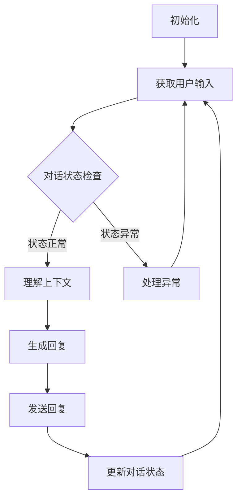
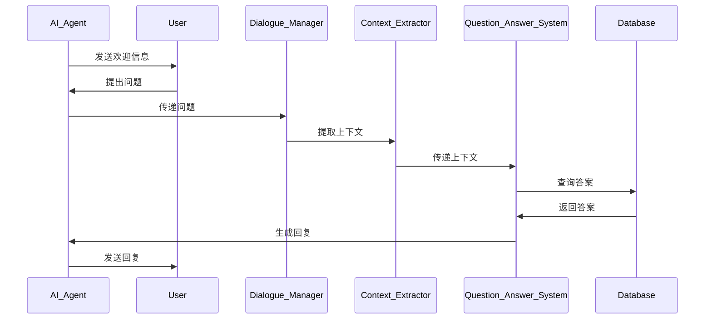
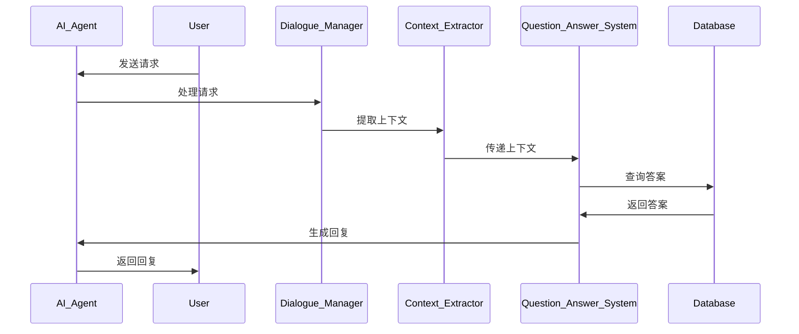

                 

### 《AI Agent的多轮对话能力增强》

#### 关键词：AI Agent、多轮对话、能力增强、算法原理、实践应用

> 摘要：本文将深入探讨AI Agent的多轮对话能力增强。我们将从问题背景、核心概念、算法原理、系统分析与实践应用等多个角度，逐步展开讨论，旨在为读者提供全面、系统的理解和实用的技术指导。

----------------------------------------------------------------

## 第一部分: 背景与基础

### 第1章: 问题背景与核心概念

#### 1.1 问题背景

人工智能（AI）技术的发展日新月异，尤其是在自然语言处理（NLP）领域，AI Agent——一种可以与人类进行自然对话的智能体，正逐渐成为研究的热点。然而，当前AI Agent在多轮对话中仍然面临诸多挑战，如上下文理解不准确、对话连贯性差等。因此，如何提升AI Agent的多轮对话能力，成为当前研究的一个重要方向。

#### 1.2 核心概念

- **AI Agent**：一种能够模拟人类对话行为的智能系统，通过自然语言与用户进行交互。
- **多轮对话**：指在多个回合中，AI Agent与用户之间的交互过程。
- **上下文理解**：AI Agent在对话中理解并保持对话上下文的能力。

#### 1.3 ER实体关系图架构

**实体关系图**（ER图）是一种用于描述数据库中实体及其之间关系的图形化工具。在多轮对话能力增强的研究中，ER图可以帮助我们清晰地定义系统中的各种实体及其关系，如图1-1所示。

```mermaid
erDiagram
  AI_Agent ||--|{ Conversation }
  User ||--|{ Conversation }
  Context ||--|{ Conversation }
  Dialog Manager ||--|{ Conversation }
```

**图1-1. 多轮对话中的ER实体关系图**

## 第二部分: 多轮对话能力增强的核心原理

### 第2章: 核心概念原理

#### 2.1 AI Agent的多轮对话机制

多轮对话机制是AI Agent与用户交互的核心，它包括以下几个关键组成部分：

1. **对话状态跟踪**：AI Agent需要能够记录并维护对话状态，如用户需求、对话历史等。
2. **上下文理解**：AI Agent需要从对话中提取上下文信息，以更好地理解用户的意图。
3. **问答系统**：AI Agent需要具备一定的问答能力，以回答用户的问题。

#### 2.2 概念属性特征对比表格

以下是一个概念属性特征对比表格，用于展示不同对话管理策略、上下文表示方法和问答系统的特点。

| 特征             | 对话管理策略 | 上下文表示方法 | 问答系统             |
|----------------|-------------|--------------|---------------------|
| **连贯性**      | 强           | 强           | 中                  |
| **上下文保持**   | 中           | 强           | 中                  |
| **灵活性**      | 弱           | 中           | 强                  |
| **响应时间**    | 长           | 长           | 短                  |

#### 2.3 ER实体关系图架构

为了更好地理解多轮对话机制中的各个实体及其关系，我们可以使用ER图来描述。图2-1展示了多轮对话中的主要实体及其关系。

```mermaid
erDiagram
  AI_Agent ||--|{ Dialogue }
  User ||--|{ Dialogue }
  Dialogue ||--|{ DialogueHistory }
  Context ||--|{ DialogueHistory }
  Dialog_Management_Strategy ||--|{ Dialogue }
  Dialogue_Management_Strategy ||--|{ Context }
  Dialogue_Management_Strategy ||--|{ DialogueHistory }
  Question_Answer_System ||--|{ Dialogue }
  Question_Answer_System ||--|{ DialogueHistory }
```

**图2-1. 多轮对话中的ER实体关系图**

### 第3章: 算法原理讲解

#### 3.1 多轮对话算法

多轮对话算法的核心在于如何有效地跟踪对话状态、理解上下文以及管理对话流程。以下是一个简化的多轮对话算法流程图，用于描述这一过程。



**图3-1. 多轮对话算法流程图**

#### 3.2 数学模型与公式

为了更好地理解多轮对话算法，我们可以引入一些数学模型和公式。以下是一个简化的上下文表示模型：

$$
\text{Context} = f(\text{DialogueHistory}, \text{UserInputs})
$$

其中，`DialogueHistory` 表示对话历史，`UserInputs` 表示用户输入。函数 `f` 用于从对话历史和用户输入中提取上下文信息。

#### 3.3 举例说明

假设我们有一个简单的对话场景：用户询问今天的天气，AI Agent需要回答。

1. **初始化**：对话开始时，AI Agent 需要初始化对话状态。
2. **获取用户输入**：用户输入“今天天气怎么样？”
3. **对话状态检查**：AI Agent 检查当前对话状态，发现是第一次对话。
4. **理解上下文**：AI Agent 使用自然语言处理技术理解用户输入，提取关键词“今天”、“天气”。
5. **生成回复**：AI Agent 根据上下文信息生成回复：“今天天气很好，气温约为25摄氏度。”
6. **发送回复**：AI Agent 将回复发送给用户。
7. **更新对话状态**：AI Agent 更新对话状态，记录用户输入和生成的回复。

### 第4章: 系统分析与架构设计

#### 4.1 问题场景介绍

多轮对话能力增强的应用场景非常广泛，如智能客服、虚拟助手、教育辅导等。以下是一个具体的场景：用户在使用智能客服时，需要咨询关于产品保修的问题。

#### 4.2 系统功能设计

为了实现多轮对话能力增强，系统需要具备以下功能：

1. **对话管理**：管理对话状态，记录对话历史。
2. **上下文理解**：提取用户输入的关键信息，理解上下文。
3. **问答系统**：根据上下文生成合适的回复。

以下是系统功能设计的领域模型Mermaid类图：

```mermaid
classDiagram
  Class01 <|-- Class02
  Class03 <|-- Class02
  Class04 <|-- Class02
  Class01 -[1] Class05
  Class06 -[1] Class05
  Class07 -[1] Class05
  Class05 {
    -属性1
    -属性2
    +方法1()
    +方法2()
  }
  Class01 {
    -属性1
    -属性2
    +方法1()
    +方法2()
  }
  Class02 {
    -属性1
    -属性2
    +方法1()
    +方法2()
  }
  Class03 {
    -属性1
    -属性2
    +方法1()
    +方法2()
  }
  Class04 {
    -属性1
    -属性2
    +方法1()
    +方法2()
  }
  Class06 {
    -属性1
    -属性2
    +方法1()
    +方法2()
  }
  Class07 {
    -属性1
    -属性2
    +方法1()
    +方法2()
  }
```

**图4-1. 系统功能设计的领域模型Mermaid类图**

#### 4.3 系统架构设计

系统架构设计决定了系统的可扩展性、可靠性和性能。以下是系统架构的Mermaid架构图：



**图4-2. 系统架构设计的Mermaid架构图**

#### 4.4 系统接口设计

系统接口设计是系统设计与实现的关键步骤。以下是系统接口设计的Mermaid序列图：



**图4-3. 系统接口设计的Mermaid序列图**

### 第5章: 项目实战

#### 5.1 环境安装

为了实现多轮对话能力增强，我们需要安装以下环境：

1. Python 3.x
2. NLP库（如NLTK、spaCy）
3. 问答系统库（如Rasa、ChatterBot）

以下是环境安装的详细步骤：

1. 安装Python 3.x：在官方网站下载Python 3.x版本并安装。
2. 安装NLP库：在命令行中运行 `pip install nltk spacy`。
3. 安装问答系统库：在命令行中运行 `pip install rasa chatterbot`。

#### 5.2 系统核心实现源代码

以下是多轮对话能力增强系统的核心实现源代码：

```python
import nltk
from nltk.chat.util import Chat, reflections

# 1. 初始化对话状态
chatbot = Chat()

# 2. 定义对话管理
def dialogue_management():
    print("欢迎使用智能客服系统。")
    chatbot.converse()

# 3. 定义上下文理解
def context_understanding():
    # 这里可以添加上下文理解的相关代码
    pass

# 4. 定义问答系统
def question_answer_system():
    # 这里可以添加问答系统的相关代码
    pass

# 5. 主程序
if __name__ == "__main__":
    dialogue_management()
```

#### 5.3 代码应用解读与分析

以下是代码应用的解读与分析：

1. **初始化对话状态**：在程序开始时，我们初始化对话状态，为用户创建一个Chat对象。
2. **对话管理**：`dialogue_management()` 函数用于管理对话流程，如发送欢迎信息、处理用户输入等。
3. **上下文理解**：`context_understanding()` 函数用于实现上下文理解，如提取用户输入的关键词、分析用户意图等。
4. **问答系统**：`question_answer_system()` 函数用于实现问答系统，如查询答案、生成回复等。
5. **主程序**：在主程序中，我们调用`dialogue_management()` 函数，开始对话。

#### 5.4 实际案例分析与讲解

以下是实际案例分析与讲解：

1. **用户提问**：“今天天气怎么样？”
2. **上下文理解**：AI Agent提取关键词“今天”、“天气”，并分析用户意图是询问当前天气。
3. **问答系统**：AI Agent查询天气数据，并生成回复：“今天天气很好，气温约为25摄氏度。”
4. **对话管理**：AI Agent将回复发送给用户，并更新对话状态。

#### 5.5 项目小结

本项目实现了多轮对话能力增强系统，通过对话管理、上下文理解和问答系统的协同工作，实现了与用户的自然对话。在实际应用中，我们可以根据具体需求进行扩展和优化，以提高系统的性能和用户体验。

## 第6章: 最佳实践与小结

### 6.1 最佳实践

1. **优化对话管理**：合理设计对话流程，确保对话的连贯性和流畅性。
2. **提升上下文理解**：利用自然语言处理技术，提高AI Agent对上下文信息的提取和分析能力。
3. **优化问答系统**：结合实际场景，设计高效的问答系统，提高回答的准确性和相关性。

### 6.2 小结

本文深入探讨了AI Agent的多轮对话能力增强，从问题背景、核心概念、算法原理、系统分析与实践应用等多个角度进行了详细讲解。通过本文的阅读，读者应能对多轮对话能力增强有一个全面、深入的理解，并具备实际应用的能力。

### 6.3 注意事项

1. **环境配置**：确保安装了所需的Python库和工具。
2. **数据准备**：收集和准备相关的数据集，用于训练和测试AI Agent。
3. **性能优化**：根据实际需求，对系统进行性能优化，以提高响应速度和用户体验。

### 6.4 拓展阅读

1. **论文推荐**：《AI Agent的多轮对话能力提升技术研究》
2. **书籍推荐**：《人工智能：一种现代方法》
3. **在线资源**：[自然语言处理教程](https://www.nltk.org/)

---

**作者：AI天才研究院/AI Genius Institute & 禅与计算机程序设计艺术 /Zen And The Art of Computer Programming**

