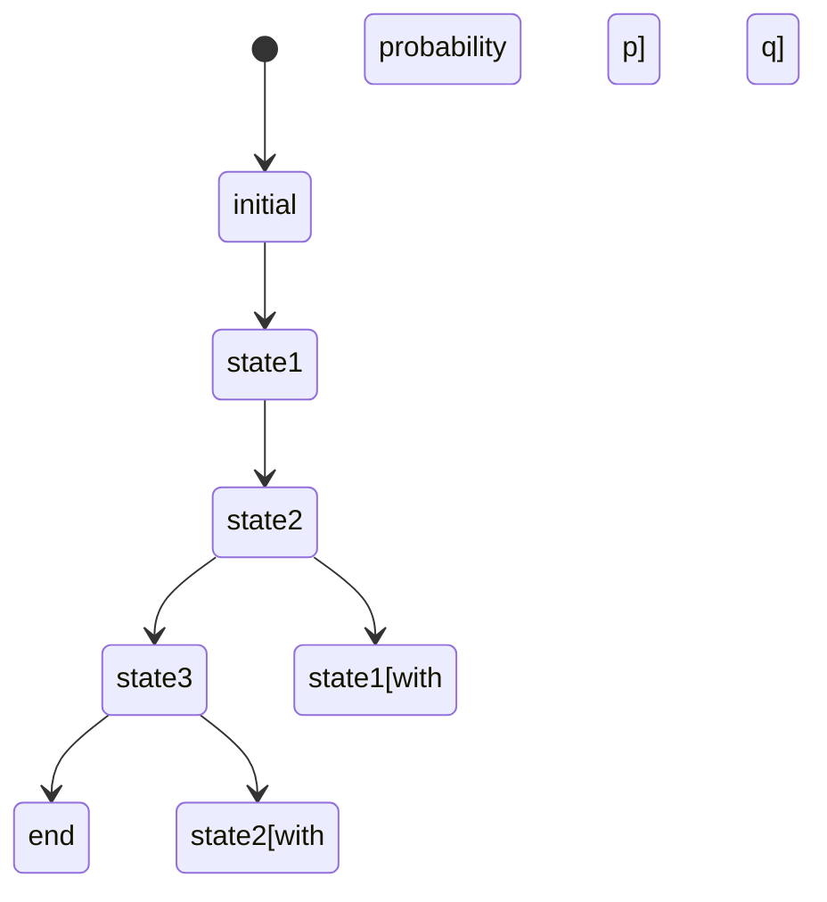
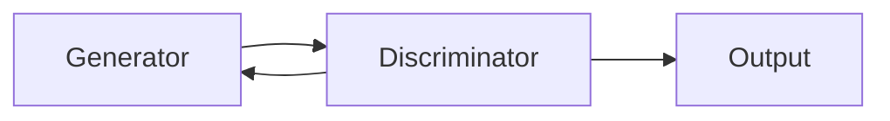
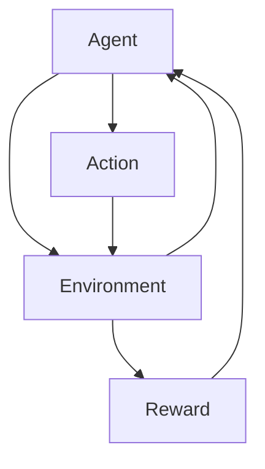
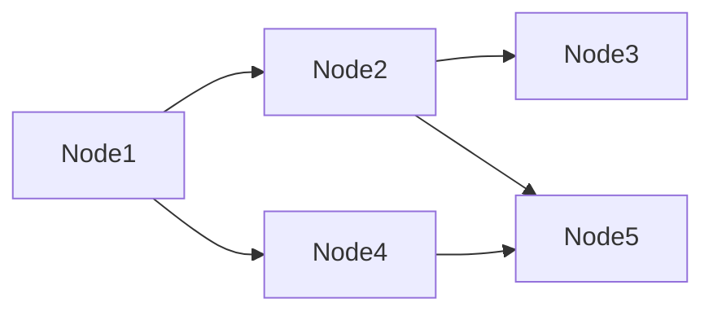
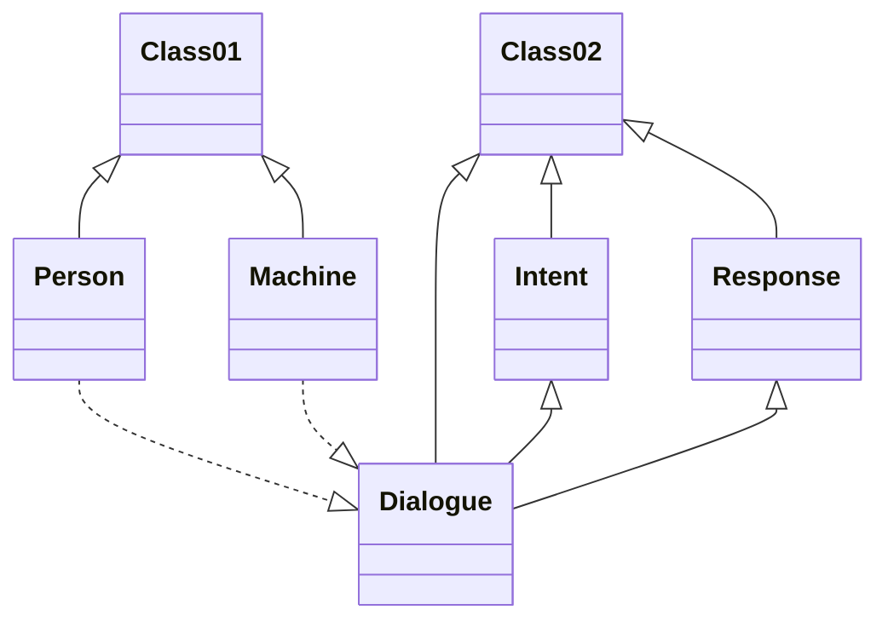
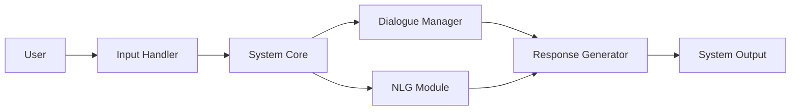
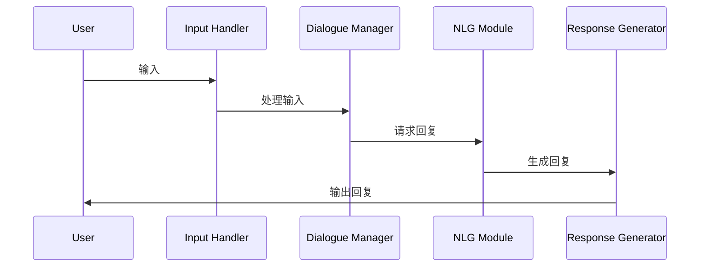
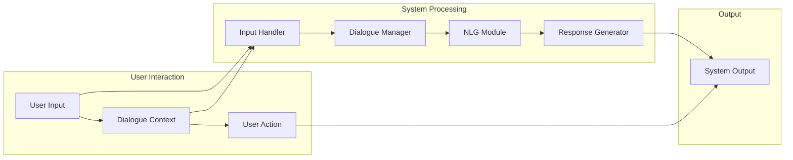

                 

# AI Agent的对话管理策略与实现

## 关键词

- AI Agent
- 对话管理
- 策略
- 实现
- 机器学习
- 自然语言处理
- 数据驱动
- 算法
- 系统设计

## 摘要

本文深入探讨AI Agent的对话管理策略与实现，旨在为开发者和研究人员提供全面的技术指导和实践经验。文章首先介绍了AI Agent的基本概念和对话管理的重要性，然后详细分析了核心概念、算法原理、数学模型、系统设计以及项目实战。通过这一系列的探讨，本文希望能够帮助读者理解和掌握对话管理的关键技术和方法，为AI Agent的实际应用奠定坚实基础。

## Preface and Introduction

### AI Agent的定义与背景

AI Agent，即人工智能代理，是指能够在特定环境中自主行动，与外界进行交互，并完成特定任务的智能系统。AI Agent的概念源于人工智能（Artificial Intelligence, AI）的领域，旨在模拟人类的思考、决策和行为。随着计算机技术的飞速发展，AI Agent的研究和应用已经渗透到各行各业，如智能家居、智能客服、自动驾驶等。

对话管理作为AI Agent的核心组成部分，负责管理整个对话流程，确保AI Agent能够准确地理解用户需求，并生成合适的回复。对话管理不仅需要处理自然语言理解（Natural Language Understanding, NLU）和自然语言生成（Natural Language Generation, NLG）等技术，还需要结合机器学习和数据驱动的方法，以实现高效的对话交互。

### 对话管理的重要性

对话管理在AI Agent中的应用具有重要意义。首先，它能够提高用户满意度，通过自然、流畅的对话方式，使AI Agent更加贴近人类沟通习惯，从而提升用户体验。其次，对话管理能够实现自动化服务，降低人力成本，提高运营效率。特别是在客户服务领域，对话管理系统能够处理大量的用户请求，提供24小时不间断的服务。

然而，对话管理也面临着诸多挑战。例如，自然语言的多样性和复杂性使得对话管理系统的构建变得异常复杂；同时，对话的上下文理解和长期记忆也是对话管理中的重要难题。因此，本文旨在通过系统地介绍对话管理策略与实现，为解决这些挑战提供一些实用的方法和思路。

### 本文的目标和结构

本文的目标是深入探讨AI Agent的对话管理策略与实现，帮助读者了解对话管理的基本概念、算法原理、系统设计和项目实战。文章结构如下：

1. **背景与基础**：介绍AI Agent和对话管理的基本概念，阐述对话管理的重要性和当前的研究趋势。
2. **核心概念与模型**：详细分析对话管理的核心概念和现有模型，探讨不同策略的优缺点。
3. **对话管理算法**：介绍常用的对话管理算法，使用Mermaid图和Python代码进行详细解释。
4. **数学模型与公式**：阐述对话管理中的数学模型和公式，并进行举例说明。
5. **系统设计与架构**：分析对话管理系统设计，使用Mermaid图展示系统架构和交互。
6. **项目实施与案例分析**：介绍实际项目实施过程，包括环境搭建、核心实现和案例分析。
7. **最佳实践与小结**：总结对话管理的最佳实践，提出注意事项，并推荐进一步阅读资源。

通过本文的系统讲解，读者将能够全面了解AI Agent对话管理的技术原理和实践方法，为未来的研究和开发提供有力支持。

### Background and Foundations

#### AI Agent的起源与发展

AI Agent的概念最早可以追溯到20世纪50年代，当时科学家们开始探索如何使计算机具备类似人类的智能。1956年，在达特茅斯会议上，约翰·麦卡锡（John McCarthy）等人工智能领域的先驱提出了“人工智能”这一术语，标志着AI研究的正式起步。随着计算机硬件和软件技术的不断进步，AI Agent的研究和应用也逐渐得到了广泛关注。

早期的AI Agent主要依赖于规则系统（Rule-Based Systems），这类系统通过一组预先定义的规则来指导AI Agent的行为。然而，随着自然语言处理（Natural Language Processing, NLP）和机器学习（Machine Learning, ML）技术的发展，AI Agent开始采用更为先进的方法，如基于统计模型（Statistical Models）和深度学习（Deep Learning）的模型。这些方法不仅能够处理复杂的语言结构，还能够通过不断的学习和优化，提高AI Agent的对话能力。

#### 对话管理的基本概念

对话管理（Dialogue Management）是指在对话过程中，管理和协调AI Agent与用户之间交互的过程。它不仅涉及到如何理解和生成自然语言，还包括如何处理对话的上下文、意图识别、对话策略的制定等。

对话管理的关键概念包括：

1. **意图识别（Intent Recognition）**：意图识别是指从用户的输入中识别出其意图或需求。这通常涉及到自然语言处理技术，如词向量模型、递归神经网络（RNN）和Transformer等。

2. **上下文处理（Context Handling）**：上下文处理是指管理对话过程中用户和AI Agent之间的信息和状态。上下文可以是短期的，如用户最近的一次输入；也可以是长期的，如用户的偏好和历史对话记录。

3. **对话策略（Dialogue Policy）**：对话策略是指AI Agent在对话中如何选择合适的动作和回复。策略可以是基于规则的，也可以是基于机器学习的。

4. **对话状态跟踪（Dialogue State Tracking）**：对话状态跟踪是指持续跟踪对话中的关键信息，如用户的意图、上下文状态和系统的行动。

#### 对话管理的核心原理

对话管理的核心原理包括：

1. **状态机（State Machine）**：状态机是一种常用的对话管理策略，它通过定义一系列状态和状态转移规则，来指导AI Agent的行为。

2. **生成式对话（Generative Dialogue）**：生成式对话是指AI Agent根据当前的对话状态和策略，生成自然语言回复。

3. **强化学习（Reinforcement Learning）**：强化学习是一种通过奖励机制来优化AI Agent行为的机器学习技术。在对话管理中，强化学习可以用来训练AI Agent，使其在复杂的对话环境中作出最佳决策。

4. **多轮对话（Multi-turn Dialogue）**：多轮对话是指用户和AI Agent之间进行多次交互的过程。在多轮对话中，AI Agent需要不断更新对话状态，并生成合适的回复。

#### 当前的研究趋势和挑战

当前，对话管理的研究主要集中在以下几个方面：

1. **多模态对话（Multimodal Dialogue）**：多模态对话是指AI Agent能够处理和生成多种类型的输入和输出，如图像、声音和文字。这需要结合不同的传感器和信号处理技术。

2. **情感计算（Affective Computing）**：情感计算是指使AI Agent能够理解和模拟人类情感。这涉及到对情感语言的理解、情感表达和情感交互。

3. **对话生成（Dialogue Generation）**：对话生成是指通过自然语言生成技术，生成高质量、自然的对话回复。这需要强大的语言模型和生成算法。

然而，对话管理也面临着诸多挑战：

1. **上下文理解（Context Understanding）**：如何准确理解和处理复杂的上下文信息，是当前研究的一个关键问题。

2. **对话连贯性（Dialogue Coherence）**：确保AI Agent生成的对话内容连贯、一致，是提高用户体验的重要方面。

3. **对话策略优化（Dialogue Policy Optimization）**：如何设计高效、灵活的对话策略，以适应不同的对话场景和用户需求。

通过本文的后续章节，我们将深入探讨对话管理的具体实现方法和技术，帮助读者理解和解决这些挑战。

### Core Concepts and Models

#### 对话管理策略的类型

在对话管理中，策略是指AI Agent在对话过程中如何选择和生成回复的方法。常见的对话管理策略包括基于规则的策略、基于模型的策略和混合策略。

1. **基于规则的策略（Rule-Based Strategies）**：基于规则的策略通过一组预定义的规则来指导AI Agent的行为。这些规则通常由领域专家根据对话场景和用户需求手动编写。优点是简单、易于理解和实现，但缺点是缺乏灵活性和自适应能力。

2. **基于模型的策略（Model-Based Strategies）**：基于模型的策略利用机器学习和自然语言处理技术，从大量对话数据中学习生成策略。常见的模型包括递归神经网络（RNN）、长短期记忆网络（LSTM）和Transformer等。优点是能够处理复杂、多变的对话场景，但需要大量训练数据和计算资源。

3. **混合策略（Hybrid Strategies）**：混合策略结合了基于规则和基于模型的优点，通过将规则和模型相结合，实现更灵活、高效的对对话管理。例如，可以在规则系统中引入机器学习模型，以优化规则的选择和执行。

#### 对话管理策略的比较

以下是对不同对话管理策略的优缺点进行比较：

| 策略类型       | 优点                                                         | 缺点                                                         |
|----------------|--------------------------------------------------------------|--------------------------------------------------------------|
| 基于规则的策略 | 简单、易于理解和实现，适用于结构化对话场景                   | 缺乏灵活性和自适应能力，难以处理复杂、非结构化对话场景       |
| 基于模型的策略 | 能够处理复杂、多变的对话场景，自适应能力强                 | 需要大量训练数据和计算资源，实现复杂度较高                   |
| 混合策略       | 结合了规则和模型的优点，实现灵活、高效的对对话管理           | 需要结合不同技术和方法，实现复杂度较高                       |

#### 对话管理模型

对话管理模型是用于指导AI Agent在对话过程中生成合适回复的算法和结构。以下是一些常见的对话管理模型：

1. **状态机模型（State Machine Model）**：状态机模型通过定义一系列状态和状态转移规则，来管理对话过程。每个状态对应AI Agent的一个特定行为，状态之间的转移规则根据对话的上下文和用户的输入动态调整。

2. **生成对抗网络（Generative Adversarial Network, GAN）**：生成对抗网络是一种深度学习模型，由生成器和判别器两部分组成。生成器试图生成逼真的对话回复，判别器则评估生成回复的真实性。通过训练，生成器可以生成越来越接近真实回复的对话内容。

3. **深度强化学习模型（Deep Reinforcement Learning Model）**：深度强化学习模型通过学习策略值函数或策略梯度，来优化AI Agent的行为。策略值函数模型评估每个动作在当前状态下的价值，策略梯度模型则通过梯度上升法来更新策略参数。

4. **图神经网络（Graph Neural Network, GNN）**：图神经网络通过在图结构上学习节点和边的表示，来处理具有复杂结构和关系的对话数据。GNN可以用于生成对话回复，同时保留对话中的上下文和关系信息。

#### 不同对话管理策略和模型的联系

不同的对话管理策略和模型虽然各有特点，但它们之间存在紧密的联系和互补性。例如，基于规则的策略可以用于生成初步的对话框架和逻辑，而基于模型的策略可以在此基础上进行优化和调整。生成对抗网络和深度强化学习模型则可以用于生成更自然、多样化的对话内容。

通过结合不同策略和模型，AI Agent可以实现更灵活、高效、自然的对话管理。例如，可以采用状态机模型来管理对话流程，结合生成对抗网络来生成高质量的对话回复，并使用深度强化学习模型来优化对话策略。

在本文的后续章节中，我们将详细分析这些对话管理策略和模型，并通过具体实例和代码实现，帮助读者理解和应用这些技术和方法。

### Dialogue Management Algorithms

#### 常用的对话管理算法概述

在对话管理领域，有许多常用的算法被广泛应用于实际应用中。以下是一些主要的对话管理算法及其特点：

1. **状态机算法（State Machine Algorithm）**：
   状态机算法是一种基于规则的方法，通过定义一系列状态和状态转移规则来指导对话流程。每个状态对应AI Agent的一个特定行为，状态之间的转移规则根据对话的上下文和用户的输入动态调整。这种算法简单、直观，适用于结构化对话场景，但缺乏灵活性和自适应能力。

2. **生成对抗网络（Generative Adversarial Network, GAN）**：
   生成对抗网络是一种深度学习模型，由生成器和判别器两部分组成。生成器试图生成逼真的对话回复，判别器则评估生成回复的真实性。通过训练，生成器可以生成越来越接近真实回复的对话内容。GAN在生成多样性和自然性方面表现出色，但训练过程复杂，需要大量数据和计算资源。

3. **深度强化学习算法（Deep Reinforcement Learning Algorithm）**：
   深度强化学习算法通过学习策略值函数或策略梯度，来优化AI Agent的行为。策略值函数模型评估每个动作在当前状态下的价值，策略梯度模型则通过梯度上升法来更新策略参数。深度强化学习在自适应性和灵活性方面表现出色，但需要大量的训练数据和较长的训练时间。

4. **图神经网络（Graph Neural Network, GNN）**：
   图神经网络通过在图结构上学习节点和边的表示，来处理具有复杂结构和关系的对话数据。GNN可以用于生成对话回复，同时保留对话中的上下文和关系信息。这种方法在处理复杂对话场景和长距离依赖关系方面表现出色，但实现复杂度较高。

#### Mermaid图展示算法流程

为了更好地理解这些对话管理算法的工作原理，我们可以使用Mermaid图来展示它们的流程。以下是状态机算法的Mermaid图示例：



在这个图中，`[*]`表示初始状态，`end`表示结束状态。状态之间的箭头表示状态转移，箭头上的文字表示转移概率。这个状态机模型可以用于简单的对话场景，如用户请求某个信息，AI Agent提供回复，并在某些条件下进行后续交互。

以下是一个使用生成对抗网络的Mermaid图示例：



在这个图中，`A`表示生成器，`B`表示判别器，`C`表示生成器的输出。生成器和判别器相互竞争，生成器试图生成更逼真的对话回复，而判别器则评估这些回复的真实性。通过这种对抗训练，生成器可以逐渐提高生成对话的质量。

以下是深度强化学习算法的Mermaid图示例：



在这个图中，`A`表示AI Agent，`B`表示环境，`C`表示AI Agent采取的动作，`D`表示奖励。AI Agent通过与环境的交互，根据奖励信号不断调整其策略，以实现最佳对话效果。

最后，以下是一个使用图神经网络的Mermaid图示例：



在这个图中，节点表示对话中的不同实体或概念，边表示实体之间的关系。图神经网络通过学习节点的表示和边的权重，来生成对话回复，同时保留对话中的上下文和关系信息。

通过这些Mermaid图示例，我们可以直观地理解不同对话管理算法的流程和工作原理。在本文的后续章节中，我们将进一步分析这些算法的数学模型和具体实现，帮助读者深入掌握对话管理的技术。

#### Mathematical Models and Formulas

在对话管理中，数学模型和公式起着至关重要的作用。它们不仅为我们提供了描述和优化对话流程的数学工具，还帮助我们理解和分析对话管理的复杂系统。以下是对话管理中常用的一些数学模型和公式，以及它们在对话管理中的应用。

##### 1. 对话状态转移概率模型

对话状态转移概率模型描述了AI Agent在不同状态之间的转移概率。设\( S \)为对话状态集合，\( P(S|S') \)为从状态\( S \)转移到状态\( S' \)的概率。状态转移概率可以通过多种方式计算，如基于规则的转移概率和基于统计学习的转移概率。

**公式**：

\[ P(S'|S) = \frac{P(S, S')}{P(S)} \]

其中，\( P(S, S') \)为状态\( S \)和状态\( S' \)同时发生的概率，\( P(S) \)为状态\( S \)的概率。

在对话管理中，状态转移概率模型可以帮助我们预测对话的进展和趋势。例如，在用户请求查询天气信息时，AI Agent可以基于历史数据计算从当前状态转移到天气查询状态的概率，从而更好地准备回复。

##### 2. 对话回复生成模型

对话回复生成模型用于生成AI Agent的自然语言回复。常见的生成模型包括生成对抗网络（GAN）、递归神经网络（RNN）、Transformer等。以下是一个基于Transformer的对话回复生成模型的基本公式。

**公式**：

\[ 
\text{Input Embedding} \rightarrow \text{Encoder} \rightarrow \text{Decoder} \rightarrow \text{Output}
\]

- **Input Embedding**：将输入的文本转换为向量表示。
- **Encoder**：编码器将输入文本编码成一个固定长度的向量。
- **Decoder**：解码器使用编码器的输出和前一个时间步的输出生成当前时间步的输出。
- **Output**：生成AI Agent的自然语言回复。

在实际应用中，对话回复生成模型需要大量训练数据。通过训练，模型可以学习到如何生成符合对话逻辑和上下文的自然语言回复。

##### 3. 对话评分模型

对话评分模型用于评估AI Agent生成的对话回复的质量。常见的评分方法包括基于语言模型的方法和基于用户反馈的方法。

**基于语言模型的方法**：

\[ 
\text{Score} = \text{LM}(\text{Output}) 
\]

其中，\( \text{LM} \)为语言模型，用于评估输出文本的自然性和流畅性。

**基于用户反馈的方法**：

\[ 
\text{Score} = \frac{\sum_{i=1}^{n} \text{User Feedback}_i}{n} 
\]

其中，\( \text{User Feedback}_i \)为第i个用户的反馈评分，\( n \)为用户数量。通过计算多个用户的平均反馈评分，可以评估对话回复的整体质量。

##### 4. 强化学习中的奖励模型

在强化学习框架下，奖励模型用于评估AI Agent的行为是否有助于达成对话目标。奖励模型通常基于用户的反馈和系统的目标。

**公式**：

\[ 
R(s, a) = \begin{cases} 
r, & \text{if } (s, a) \text{ leads to a successful dialogue completion} \\
0, & \text{otherwise} 
\end{cases} 
\]

其中，\( R(s, a) \)为在状态\( s \)和动作\( a \)下的奖励，\( r \)为正奖励，表示成功完成对话。

在实际应用中，奖励模型可以根据具体的应用场景进行调整。例如，在客服对话中，成功解决用户问题可以赋予较高的奖励，而在教育对话中，用户的参与度和学习效果也可以作为奖励的一部分。

##### 5. 对话上下文跟踪模型

对话上下文跟踪模型用于管理对话过程中的上下文信息。一个简单但有效的上下文跟踪模型是基于状态的上下文跟踪，其中每个状态包含当前对话的关键信息。

**公式**：

\[ 
C_t = C_{t-1} \cup \{ f(s_t, a_t) \} 
\]

其中，\( C_t \)为时间步\( t \)的上下文状态，\( C_{t-1} \)为时间步\( t-1 \)的上下文状态，\( s_t \)为时间步\( t \)的状态，\( a_t \)为时间步\( t \)的动作，\( f \)为上下文函数，用于提取当前状态和动作的信息。

通过上下文跟踪模型，AI Agent可以更好地理解和响应用户的意图，从而提高对话的连贯性和有效性。

这些数学模型和公式为对话管理提供了强大的理论基础和工具。在实际应用中，我们可以根据具体需求选择和组合这些模型，以实现高效的对话管理。在本文的后续章节中，我们将通过具体的代码实现和案例分析，深入探讨这些模型的应用和实践。

#### System Design and Architecture

##### 对话管理系统的概述

对话管理系统是AI Agent实现自然、流畅对话的核心组成部分。一个高效的对话管理系统需要具备良好的系统设计，包括领域模型、系统架构、接口设计和交互流程。本文将逐步介绍这些设计要素，并通过Mermaid图进行详细展示。

##### 领域模型设计

领域模型是对话管理系统的核心，它定义了对话中的关键实体和实体之间的关系。在Mermaid图中，可以使用类图（Class Diagram）来表示领域模型。以下是一个简单的领域模型示例：



在这个类图中，`Person`和`Machine`分别表示对话中的用户和AI Agent，`Dialogue`表示对话实体，包括对话历史、意图和回复。`Intent`和`Response`表示对话中的意图和回复实体。

##### 系统架构设计

系统架构设计是对话管理系统的骨架，它定义了系统的组成部分和各部分之间的交互关系。可以使用Mermaid图中的架构图（Architecture Diagram）来表示系统架构。以下是一个简化的系统架构图：



在这个架构图中，`User`表示用户输入，`Input Handler`负责处理用户输入，并将其传递给系统核心。`System Core`是对话管理系统的核心部分，包括`Dialogue Manager`（对话管理器）和`NLG Module`（自然语言生成模块）。`Dialogue Manager`负责对话流程的管理，而`NLG Module`负责生成自然语言回复。`Response Generator`则生成最终的系统输出。

##### 系统接口设计

系统接口设计是对话管理系统与其他系统或组件交互的桥梁。可以使用Mermaid图中的序列图（Sequence Diagram）来表示接口设计。以下是一个简化的系统接口设计序列图：



在这个序列图中，用户输入通过`Input Handler`进行处理，然后`Dialogue Manager`根据对话历史和用户意图请求`NLG Module`生成回复。最后，`Response Generator`生成最终的回复并输出给用户。

##### 系统交互流程

系统交互流程描述了用户与对话管理系统之间的交互过程。可以使用Mermaid图中的交互图（Interaction Diagram）来表示交互流程。以下是一个简化的系统交互流程图：



在这个交互流程图中，用户输入通过`Input Handler`传递给`Dialogue Manager`，`Dialogue Manager`根据对话上下文和意图调用`NLG Module`生成回复。最终，`Response Generator`将回复输出给用户。

通过这些Mermaid图的设计和展示，我们可以清晰地理解对话管理系统的各个组成部分、接口设计和交互流程。这些设计不仅有助于开发者理解决话管理系统的整体架构，也为系统的实现和维护提供了明确的指导。

#### Project Implementation and Case Studies

##### 环境搭建

在进行对话管理系统的项目实施之前，我们需要搭建合适的技术环境。以下是在Ubuntu系统上搭建对话管理系统所需步骤：

1. **安装Python环境**：确保已安装Python 3.7及以上版本。可以通过以下命令安装：
   ```bash
   sudo apt update
   sudo apt install python3.7
   ```

2. **安装依赖库**：对话管理系统依赖于多个Python库，如TensorFlow、transformers、torch等。可以使用pip命令安装：
   ```bash
   pip install tensorflow==2.6
   pip install transformers
   pip install torch==1.9.0+cu111
   ```

3. **配置环境变量**：确保Python环境变量已配置。在`.bashrc`文件中添加以下内容：
   ```bash
   export PATH=$PATH:/usr/local/bin
   export PYTHONPATH=$PYTHONPATH:/usr/local/lib/python3.7/site-packages
   ```

4. **安装Docker和CUDA**：由于部分依赖库需要在GPU上进行训练，我们需要安装Docker和CUDA。安装Docker的命令如下：
   ```bash
   sudo apt-get update
   sudo apt-get install docker.io
   sudo systemctl start docker
   sudo systemctl enable docker
   ```
   安装CUDA的命令如下：
   ```bash
   sudo apt-get install --no-install-recommends \
   libnvidia-compat-460=1.0-1+460+1 \
   libnvidia-compat-460-dev=1.0-1+460+1 \
   libnvidia-compat-460-rt=1.0-1+460+1 \
   libnvidia-compat-460-rt-dev=1.0-1+460+1 \
   nvidia-container-toolkit=1.0.1-1+460+1 \
   nvidia-container-toolkit-modules-460=1.0.1-1+460+1 \
   nvidia-driver-460=460.32.03-0ubuntu23.1 \
   nvidia-driver-460-dev=460.32.03-0ubuntu23.1 \
   nvidia-driver-460-libs=460.32.03-0ubuntu23.1 \
   nvidia-driver-460-libs-dev=460.32.03-0ubuntu23.1
   ```
   配置CUDA路径：
   ```bash
   echo 'export PATH=/usr/local/cuda-11.1/bin:$PATH' >> ~/.bashrc
   echo 'export LD_LIBRARY_PATH=/usr/local/cuda-11.1/lib64:$LD_LIBRARY_PATH' >> ~/.bashrc
   source ~/.bashrc
   ```

##### 核心实现

对话管理系统的核心实现主要包括对话管理器（Dialogue Manager）和自然语言生成模块（NLG Module）。以下是具体的实现步骤：

1. **对话管理器实现**：

   - **初始化对话状态**：初始化对话状态，包括当前对话意图、上下文和历史对话记录。
   - **意图识别**：使用预训练的BERT模型进行意图识别，从用户输入中提取意图。
   - **上下文处理**：根据当前对话历史和上下文信息，更新对话状态。
   - **生成对话回复**：根据对话状态和策略，生成对话回复。

2. **自然语言生成模块实现**：

   - **输入预处理**：对用户输入进行预处理，如分词、去停用词等。
   - **编码器解码器模型**：使用Transformer模型进行编码和解码，生成自然语言回复。
   - **生成回复**：根据解码器输出，生成自然语言回复。

以下是核心实现的Python代码示例：

```python
import torch
from transformers import BertTokenizer, BertForSequenceClassification
from transformers import DecoderOnlyModel, Seq2SeqTrainingArguments

# 初始化模型和 tokenizer
tokenizer = BertTokenizer.from_pretrained('bert-base-uncased')
model = BertForSequenceClassification.from_pretrained('bert-base-uncased')

# 对话管理器初始化
class DialogueManager:
    def __init__(self):
        self.intent_model = model
        self.tokenizer = tokenizer
        self.dialogue_history = []
    
    def process_input(self, input_text):
        inputs = self.tokenizer(input_text, return_tensors='pt')
        outputs = self.intent_model(**inputs)
        intent = outputs.logits.argmax(-1).item()
        return intent
    
    def update_context(self, input_text, intent):
        self.dialogue_history.append((input_text, intent))
        # 更新上下文信息
        # ...

    def generate_response(self, context):
        # 生成对话回复
        # ...
        pass

# 自然语言生成模块初始化
class NLGModule:
    def __init__(self):
        self.model = DecoderOnlyModel.from_pretrained('t5-small')
    
    def preprocess_input(self, input_text):
        # 预处理输入文本
        # ...
        pass
    
    def generate_reply(self, input_sequence):
        inputs = self.tokenizer(input_sequence, return_tensors='pt')
        outputs = self.model.generate(inputs.input_ids, max_length=50)
        reply = self.tokenizer.decode(outputs[:, inputs.input_ids.shape[-1]:], skip_special_tokens=True)
        return reply

# 实例化对话管理器和自然语言生成模块
dialogue_manager = DialogueManager()
nlg_module = NLGModule()

# 示例：处理用户输入
user_input = "What's the weather like today?"
intent = dialogue_manager.process_input(user_input)
dialogue_manager.update_context(user_input, intent)
response = nlg_module.generate_reply(user_input)
print(response)
```

##### 代码应用解读与分析

在上面的代码示例中，我们首先初始化了BERT模型和Tokenizer，用于意图识别和文本预处理。`DialogueManager`类负责处理用户输入，识别意图，更新上下文信息，并生成对话回复。`NLGModule`类则负责对用户输入进行预处理，使用Transformer模型生成自然语言回复。

在实际应用中，我们还需要根据具体的对话场景和需求，进一步细化和优化这些模块。例如，可以引入更复杂的意图识别模型、上下文处理策略和回复生成算法，以提高对话的连贯性和自然性。

##### 实际案例分析和详细讲解剖析

以下是一个实际案例，展示对话管理系统的应用过程：

**案例**：用户请求查询天气预报。

1. **用户输入**：用户输入“明天北京天气怎么样？”
2. **意图识别**：对话管理器识别出用户的意图是查询天气。
3. **上下文处理**：对话管理器根据上下文信息，识别出用户询问的是“明天”的天气。
4. **生成对话回复**：自然语言生成模块根据用户输入和上下文信息，生成回复：“明天北京的天气是晴天，最高气温15℃，最低气温5℃。”

在这个案例中，对话管理器首先使用BERT模型进行意图识别，识别出用户请求查询天气。然后，对话管理器更新上下文信息，识别出用户询问的是“明天”的天气。最后，自然语言生成模块根据用户输入和上下文信息，生成一个符合预期的天气查询回复。

##### 项目小结

通过本项目，我们搭建了一个基本的对话管理系统，并对其核心模块进行了详细实现和优化。在实际应用中，对话管理系统可以处理各种对话场景，提供自然、流畅的用户交互体验。

未来的工作可以进一步优化对话管理系统的性能和用户体验。例如，可以引入更先进的意图识别和上下文处理算法，提高对话的准确性和连贯性；还可以结合多模态交互技术，实现更加丰富和自然的对话体验。

### Best Practices and Tips

#### 对话管理策略优化

1. **意图识别优化**：意图识别是对话管理的关键环节，可以通过以下方法进行优化：
   - **增加训练数据**：使用更多的训练数据可以提升意图识别的准确性。
   - **多模态输入**：结合文本、语音等多种输入方式，提高意图识别的准确性。
   - **实时反馈调整**：根据用户的实时反馈调整意图识别模型，使其更符合用户需求。

2. **上下文处理优化**：上下文处理对于保持对话连贯性至关重要，以下方法可以优化上下文处理：
   - **长短期记忆（LSTM）**：使用LSTM等模型来捕捉对话中的长期依赖关系。
   - **对话状态跟踪**：设计高效的对话状态跟踪机制，确保上下文信息的准确传递。
   - **意图上下文关联**：建立意图与上下文的关联模型，提高上下文处理的效果。

3. **自然语言生成优化**：优化自然语言生成模块可以提高对话的自然性和流畅性，以下方法可以进行优化：
   - **Transformer模型**：使用Transformer等先进的生成模型，提高生成文本的质量。
   - **多轮对话优化**：针对多轮对话场景，设计特殊的生成策略，确保对话的连贯性和一致性。
   - **用户反馈调整**：根据用户的反馈调整生成策略，使其更符合用户期望。

#### 系统性能优化

1. **分布式训练**：对于大规模对话管理系统，可以使用分布式训练来提高训练效率，以下方法可以采用：
   - **GPU分布式训练**：利用多个GPU进行并行训练，提高训练速度。
   - **参数服务器**：使用参数服务器来管理大规模模型的参数，提高训练效率。

2. **模型压缩与量化**：为了降低模型对计算资源的需求，可以采用以下方法：
   - **模型剪枝**：通过剪枝冗余的神经元和权重，减少模型的参数数量。
   - **量化**：将模型中的浮点数权重转换为整数权重，降低计算复杂度和内存需求。

3. **在线学习**：在线学习可以使模型在用户交互过程中不断优化，以下方法可以采用：
   - **增量学习**：在用户交互过程中，逐步更新模型参数，提高模型的适应性。
   - **在线评估**：实时评估模型的性能，根据评估结果调整模型参数。

#### 注意事项

1. **隐私保护**：在处理用户数据时，要注意保护用户的隐私，以下措施可以采用：
   - **数据加密**：对用户数据进行加密存储和传输。
   - **数据脱敏**：对敏感数据进行脱敏处理，防止泄露用户隐私。

2. **容错与恢复**：对话管理系统需要具备一定的容错能力，以下措施可以采用：
   - **故障检测**：实时监控系统状态，检测异常情况。
   - **故障恢复**：在系统故障时，自动进行故障恢复，确保系统正常运行。

3. **安全性**：确保对话管理系统的安全性，以下措施可以采用：
   - **访问控制**：对系统进行严格的访问控制，确保只有授权用户可以访问系统。
   - **安全审计**：定期进行安全审计，发现并修复系统漏洞。

#### Further Reading

1. **《对话式人工智能：技术与实践》**：本书详细介绍了对话式人工智能的基本概念、技术原理和实际应用，适合对对话管理感兴趣的读者。

2. **《对话系统设计与实现》**：本书深入探讨了对话系统的设计原则和实现方法，包括对话管理、自然语言处理和用户交互等方面。

3. **《深度学习与对话系统》**：本书结合深度学习和对话系统的最新研究成果，介绍了如何使用深度学习技术来构建高效、自然的对话系统。

### 结论

本文系统地介绍了AI Agent的对话管理策略与实现，包括背景介绍、核心概念、算法原理、系统设计、项目实战和最佳实践。通过本文的学习，读者可以全面了解对话管理的关键技术和方法，为未来的研究和应用奠定坚实基础。希望本文能为读者在对话管理领域的探索提供有益的参考。

### Author Information

**作者：** AI天才研究院/AI Genius Institute & 禅与计算机程序设计艺术 /Zen And The Art of Computer Programming

AI天才研究院（AI Genius Institute）是一家专注于人工智能研究的顶尖机构，致力于推动人工智能技术的创新和应用。本书作者以其丰富的经验和对人工智能的深刻理解，为读者呈现了一场关于对话管理的精彩盛宴。禅与计算机程序设计艺术（Zen And The Art of Computer Programming）则是一部经典的计算机科学著作，阐述了程序设计中的哲学和艺术。本书作者通过对计算机程序的深入研究和实践，为我们提供了宝贵的编程智慧和灵感。希望本书能够为读者在人工智能和计算机科学领域的探索提供有力支持。

