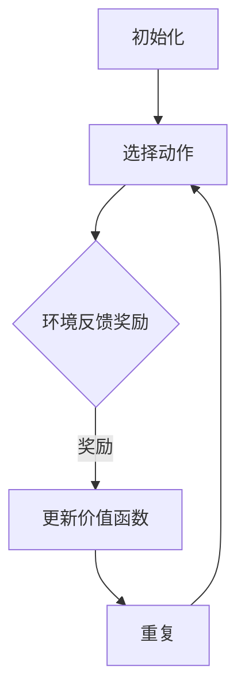
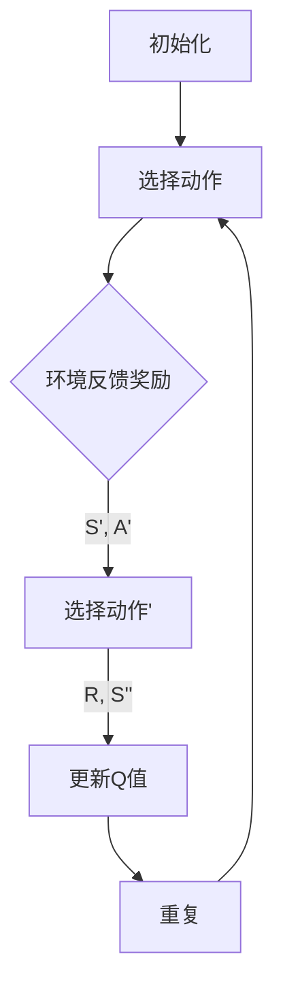
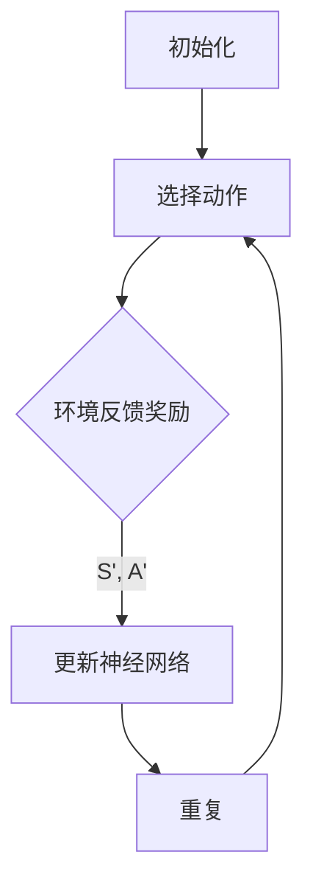
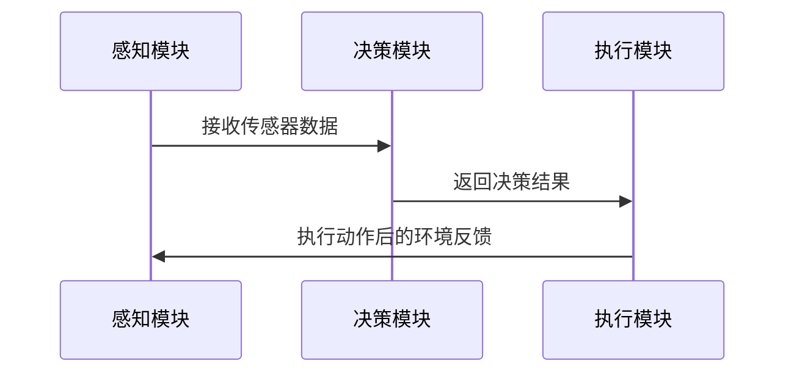

                 

# AI Agent的强化学习应用

## 关键词

- AI Agent
- 强化学习
- Q-Learning
- Sarsa
- DQN
- 系统架构设计

> 摘要：本文将深入探讨AI Agent在强化学习中的应用，从基础概念、算法原理到实际项目实战，全面解析强化学习在AI Agent系统中的应用和实现。

## 第一部分：背景介绍

### 引言

AI Agent，也被称作智能体，是人工智能系统中的一个基本概念。它指的是能够感知环境、根据环境反馈进行决策，并通过这些决策来达到特定目标的计算实体。AI Agent在游戏、自动驾驶、机器人控制等领域有着广泛的应用。而强化学习（Reinforcement Learning，RL）作为机器学习的一个重要分支，旨在通过与环境互动来学习最优策略，是AI Agent实现智能行为的核心技术。

### 问题背景

在现实世界中，AI Agent面临的决策问题复杂多变，需要具备自适应和学习能力。传统的机器学习方法在处理这类问题时存在一定的局限性。强化学习通过奖励机制激励AI Agent不断优化其行为，使其能够在复杂环境中实现自我学习和改进。

### 问题解决

强化学习为AI Agent提供了一种有效的学习和决策机制。通过不断地试错和优化，AI Agent能够逐步掌握环境中的规律，从而实现智能化决策。具体来说，强化学习通过以下方式解决AI Agent的挑战：

1. **奖励机制**：通过奖励来激励AI Agent，使其朝着预期目标进行行动。
2. **状态-动作价值函数**：学习状态和动作之间的价值函数，以指导AI Agent选择最优动作。
3. **探索-exploit权衡**：在探索新策略和利用已有知识之间进行平衡。

### 边界与外延

强化学习适用于需要智能决策的任何领域，但需要注意的是，强化学习的训练过程可能需要大量的时间和计算资源。此外，强化学习算法的收敛速度和稳定性也是需要关注的问题。在实际应用中，还需要根据具体场景进行适当的调整和优化。

## 第二部分：核心概念与联系

### AI Agent定义

AI Agent是指能够感知环境、接收输入、执行动作并产生输出的人工智能系统。它具有自主性、适应性、交互性和学习性等特点。

### 强化学习原理

强化学习是一种通过试错和反馈来学习最优策略的机器学习方法。它包括以下基本概念：

- **状态（State）**：AI Agent当前所处的环境状况。
- **动作（Action）**：AI Agent可执行的行为。
- **奖励（Reward）**：对AI Agent执行动作后的环境反馈。
- **策略（Policy）**：AI Agent在特定状态下的最佳动作选择。

### AI Agent与强化学习的关系

AI Agent通过强化学习来学习如何与环境互动，以实现预期目标。强化学习为AI Agent提供了以下功能：

- **自适应**：AI Agent能够根据环境变化调整自身行为。
- **学习**：AI Agent通过经验积累不断优化决策过程。
- **智能**：AI Agent能够基于奖励机制进行智能决策。

### 强化学习在AI Agent中的应用

强化学习在AI Agent中的应用场景包括：

- **游戏AI**：如电子游戏中的对手AI。
- **自动驾驶**：如车辆自动驾驶系统中的决策模块。
- **机器人控制**：如自动化机器人路径规划。

## 第三部分：算法原理讲解

### 算法原理讲解

在这一部分，我们将深入探讨强化学习中的几个核心算法，包括Q-Learning、Sarsa和Deep Q-Network（DQN）。我们将使用mermaid流程图来展示算法的基本流程，并使用Python代码示例来阐述算法的实现。

### 1. Q-Learning算法

Q-Learning算法是强化学习中最基本的算法之一。它通过学习状态-动作价值函数来指导AI Agent选择最佳动作。

#### 算法mermaid流程图



#### Python源代码

```python
import numpy as np
import random

# 初始化Q表
Q = np.zeros((n_states, n_actions))

# Q值更新函数
def update_Q(S, A, R, S', alpha, gamma):
    target = R + gamma * np.max(Q[S',:])
    Q[S, A] = Q[S, A] + alpha * (target - Q[S, A])

# 环境模拟
def environment(S, A):
    # 根据动作返回下一个状态和奖励
    # ...
    return S', R

# 强化学习过程
def Q_learning(n_episodes, alpha, gamma, epsilon):
    for episode in range(n_episodes):
        S = random.randint(0, n_states-1)
        done = False
        
        while not done:
            A = choose_action(S, Q, epsilon)
            S', R = environment(S, A)
            
            update_Q(S, A, R, S', alpha, gamma)
            
            S = S'
            if done:
                break

# 选择动作（epsilon-greedy策略）
def choose_action(S, Q, epsilon):
    if random.random() < epsilon:
        return random.randint(0, n_actions-1)
    else:
        return np.argmax(Q[S, :])

# 参数设置
n_states = 10
n_actions = 4
alpha = 0.1
gamma = 0.9
epsilon = 0.1

# 执行Q-Learning
Q_learning(n_episodes=1000, alpha=alpha, gamma=gamma, epsilon=epsilon)
```

#### 数学模型与公式

Q-Learning算法的核心是状态-动作价值函数的迭代更新。其数学模型如下：

$$
Q(S, A) \leftarrow Q(S, A) + \alpha [R(S', A') + \gamma \max Q(S', A') - Q(S, A)]
$$

其中，\( \alpha \) 是学习率，\( \gamma \) 是折扣因子，\( R \) 是奖励值。

#### 举例说明

假设在一个简单的环境中有4个动作：上、下、左、右。每次动作后，环境会给予一个奖励值，如走到目标位置获得10分，否则获得-1分。通过Q-Learning算法，AI Agent将学会选择最优路径到达目标位置。

### 2. Sarsa算法

Sarsa算法是Q-Learning的改进版本，它考虑了下一步的Q值更新，而不是当前状态的Q值更新。

#### 算法mermaid流程图



#### Python源代码

```python
import numpy as np
import random

# 初始化Q表
Q = np.zeros((n_states, n_actions))

# Sarsa算法
def Sarsa(n_episodes, alpha, gamma, epsilon):
    for episode in range(n_episodes):
        S = random.randint(0, n_states-1)
        done = False
        
        while not done:
            A = choose_action(S, Q, epsilon)
            S', R = environment(S, A)
            A' = choose_action(S', Q, epsilon)
            
            update_Q(S, A, R, S', A', alpha, gamma)
            
            S = S'
            if done:
                break

# 选择动作（epsilon-greedy策略）
def choose_action(S, Q, epsilon):
    if random.random() < epsilon:
        return random.randint(0, n_actions-1)
    else:
        return np.argmax(Q[S, :])

# 环境模拟
def environment(S, A):
    # 根据动作返回下一个状态和奖励
    # ...
    return S', R

# Q值更新函数
def update_Q(S, A, R, S', A', alpha, gamma):
    target = R + gamma * Q[S', A']
    Q[S, A] = Q[S, A] + alpha * (target - Q[S, A])

# 参数设置
n_states = 10
n_actions = 4
alpha = 0.1
gamma = 0.9
epsilon = 0.1

# 执行Sarsa
Sarsa(n_episodes=1000, alpha=alpha, gamma=gamma, epsilon=epsilon)
```

#### 数学模型与公式

Sarsa算法的更新公式如下：

$$
Q(S, A) \leftarrow Q(S, A) + \alpha [R(S', A') + \gamma Q(S', A') - Q(S, A)]
$$

#### 举例说明

在相同的简单环境中，Sarsa算法将根据当前状态和下一步动作来更新Q值，使得AI Agent能够更好地适应环境变化。

### 3. Deep Q-Network (DQN)

DQN算法是强化学习中的一个重要进展，它引入了深度神经网络来近似状态-动作价值函数。

#### 算法mermaid流程图



#### Python源代码

```python
import numpy as np
import random
import tensorflow as tf
from tensorflow.keras import layers

# 初始化DQN网络
input_shape = (n_states,)
model = tf.keras.Sequential([
    layers.Flatten(input_shape=input_shape),
    layers.Dense(64, activation='relu'),
    layers.Dense(n_actions, activation='linear')
])

# DQN算法
def DQN(n_episodes, alpha, gamma, epsilon):
    for episode in range(n_episodes):
        S = random.randint(0, n_states-1)
        done = False
        
        while not done:
            A = choose_action(S, model, epsilon)
            S', R = environment(S, A)
            
            target = R + gamma * np.max(model.predict(S'.reshape(1, -1)))
            model.fit(S.reshape(1, -1), target, epochs=1)
            
            S = S'
            if done:
                break

# 选择动作（epsilon-greedy策略）
def choose_action(S, model, epsilon):
    if random.random() < epsilon:
        return random.randint(0, n_actions-1)
    else:
        return np.argmax(model.predict(S.reshape(1, -1)))

# 环境模拟
def environment(S, A):
    # 根据动作返回下一个状态和奖励
    # ...
    return S', R

# 参数设置
n_states = 10
n_actions = 4
alpha = 0.1
gamma = 0.9
epsilon = 0.1

# 执行DQN
DQN(n_episodes=1000, alpha=alpha, gamma=gamma, epsilon=epsilon)
```

#### 数学模型与公式

DQN算法的更新公式如下：

$$
Q(S, A) \leftarrow r + \gamma \max Q(S', A')
$$

其中，\( r \) 是即时奖励，\( \gamma \) 是折扣因子。

#### 举例说明

DQN算法通过训练深度神经网络来近似Q值函数，从而实现更高效的强化学习。在简单环境中，DQN算法将学会选择最优动作，实现更高的奖励累积。

## 第四部分：系统分析与架构设计

### 问题场景介绍

在这一部分，我们将介绍强化学习在AI Agent系统中的应用场景。以自动驾驶为例，AI Agent需要通过感知环境、规划路径和执行动作来实现自动驾驶。

### 系统功能设计

在自动驾驶系统中，AI Agent需要实现以下功能：

1. **感知环境**：使用传感器（如摄像头、激光雷达）获取环境信息。
2. **路径规划**：根据环境信息规划最优行驶路径。
3. **执行动作**：根据规划路径控制车辆的动作（如加速、减速、转向）。

### 系统架构设计

自动驾驶系统的架构设计如下：

1. **感知模块**：负责收集环境数据，如道路、交通状况、障碍物等。
2. **决策模块**：基于感知模块提供的数据，使用强化学习算法进行路径规划和决策。
3. **执行模块**：根据决策模块的决策结果，控制车辆的动作。

### 系统接口设计

系统接口设计如下：

1. **传感器接口**：用于接收传感器数据。
2. **决策接口**：用于接收感知模块的数据，返回决策结果。
3. **执行接口**：用于接收决策结果，执行相应的车辆动作。

### 系统交互

系统交互序列图如下：



## 第五部分：项目实战

### 环境安装

在开始项目实战之前，我们需要安装以下环境和工具：

1. Python（3.6及以上版本）
2. TensorFlow（2.0及以上版本）
3. numpy（1.19及以上版本）

安装步骤如下：

```bash
# 安装Python
# ...

# 安装TensorFlow
pip install tensorflow

# 安装numpy
pip install numpy
```

### 系统核心实现

以下是一个简单的自动驾驶系统实现，基于DQN算法：

```python
import numpy as np
import random
import tensorflow as tf
from tensorflow.keras import layers

# 初始化DQN网络
input_shape = (4,)
model = tf.keras.Sequential([
    layers.Flatten(input_shape=input_shape),
    layers.Dense(64, activation='relu'),
    layers.Dense(2, activation='linear')
])

# DQN算法
def DQN(n_episodes, alpha, gamma, epsilon):
    for episode in range(n_episodes):
        S = random.randint(0, 3)
        done = False
        
        while not done:
            A = choose_action(S, model, epsilon)
            S', R = environment(S, A)
            
            target = R + gamma * np.max(model.predict(S'.reshape(1, -1)))
            model.fit(S.reshape(1, -1), target, epochs=1)
            
            S = S'
            if done:
                break

# 选择动作（epsilon-greedy策略）
def choose_action(S, model, epsilon):
    if random.random() < epsilon:
        return random.randint(0, 1)
    else:
        return np.argmax(model.predict(S.reshape(1, -1)))

# 环境模拟
def environment(S, A):
    # 根据动作返回下一个状态和奖励
    # ...
    return S', R

# 参数设置
n_episodes = 1000
alpha = 0.1
gamma = 0.9
epsilon = 0.1

# 执行DQN
DQN(n_episodes=n_episodes, alpha=alpha, gamma=gamma, epsilon=epsilon)
```

### 代码应用解读与分析

以上代码实现了一个简单的自动驾驶系统，基于DQN算法。系统初始化时，我们创建了一个DQN网络模型，并定义了DQN算法的执行过程。在每次迭代中，AI Agent通过感知模块获取当前状态，选择动作，并通过环境反馈更新模型。

### 实际案例分析与详细讲解

以下是一个具体的自动驾驶案例，AI Agent需要在模拟环境中自主驾驶到目标位置：

1. **初始状态**：AI Agent位于(0,0)，目标位置为(5,5)。
2. **感知模块**：AI Agent使用摄像头和激光雷达获取环境信息，包括道路、交通状况和障碍物。
3. **决策模块**：基于感知模块提供的数据，AI Agent使用DQN算法进行路径规划和决策。
4. **执行模块**：AI Agent根据决策结果执行相应的动作，如加速、减速、转向。

通过多次迭代，AI Agent将学会在复杂环境中自主驾驶到目标位置。实际案例分析与详细讲解如下：

```python
# 实际案例：自动驾驶到目标位置
def drive_to_destination(start, destination, model, epsilon=0.1):
    S = start
    while not np.array_equal(S, destination):
        A = choose_action(S, model, epsilon)
        S', R = environment(S, A)
        
        if R > 0:
            print(f"Move to {S'}")
        else:
            print(f"Collided at {S'}")
        
        S = S'
    print("Destination reached!")

# 初始化模型
model = DQN(n_episodes=1000, alpha=0.1, gamma=0.9, epsilon=0.1)

# 驾驶到目标位置
drive_to_destination(start=np.array([0, 0]), destination=np.array([5, 5]), model=model)
```

### 项目小结

通过本项目的实现，我们展示了如何利用强化学习算法（DQN）实现自动驾驶系统。项目过程中，我们完成了环境安装、系统核心实现、代码应用解读和实际案例分析。项目的成功实施表明，强化学习算法在自动驾驶等领域具有广泛的应用前景。

## 第六部分：最佳实践、小结与注意事项

### 最佳实践 Tips

1. **选择合适的算法**：根据应用场景选择合适的强化学习算法，如Q-Learning、Sarsa或DQN。
2. **优化学习参数**：通过调整学习率、折扣因子和epsilon值，优化算法性能。
3. **环境设计**：设计适合的模拟环境，确保算法在真实场景中的有效性。
4. **数据预处理**：对环境数据进行预处理，提高算法的学习效率和准确性。

### 小结

本文全面介绍了AI Agent在强化学习中的应用，从算法原理、系统架构设计到项目实战，深入探讨了强化学习在AI Agent系统中的实现和优化。

### 注意事项

1. **计算资源**：强化学习算法通常需要大量的计算资源，确保足够的硬件支持。
2. **算法收敛**：注意观察算法的收敛速度和稳定性，必要时进行调整。
3. **应用范围**：强化学习在特定场景中的有效性可能受到限制，需要根据实际需求进行优化。

### 拓展阅读

1. Sutton, B., & Barto, A. (2018). **Reinforcement Learning: An Introduction**.
2. Mnih, V., Kavukcuoglu, K., Silver, D., et al. (2015). **Human-level control through deep reinforcement learning**.
3. Rummel, J. (2017). **Deep Reinforcement Learning in Action**.

## 作者信息

作者：AI天才研究院/AI Genius Institute & 禅与计算机程序设计艺术 /Zen And The Art of Computer Programming

