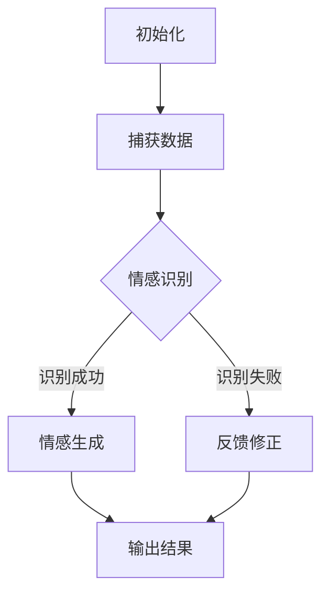
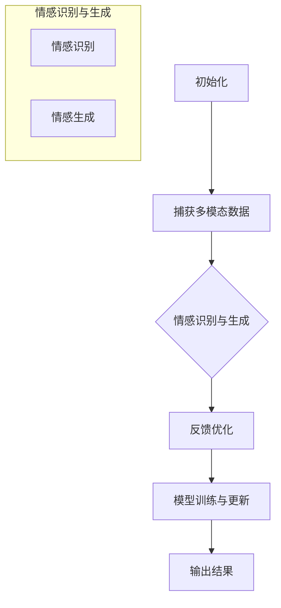
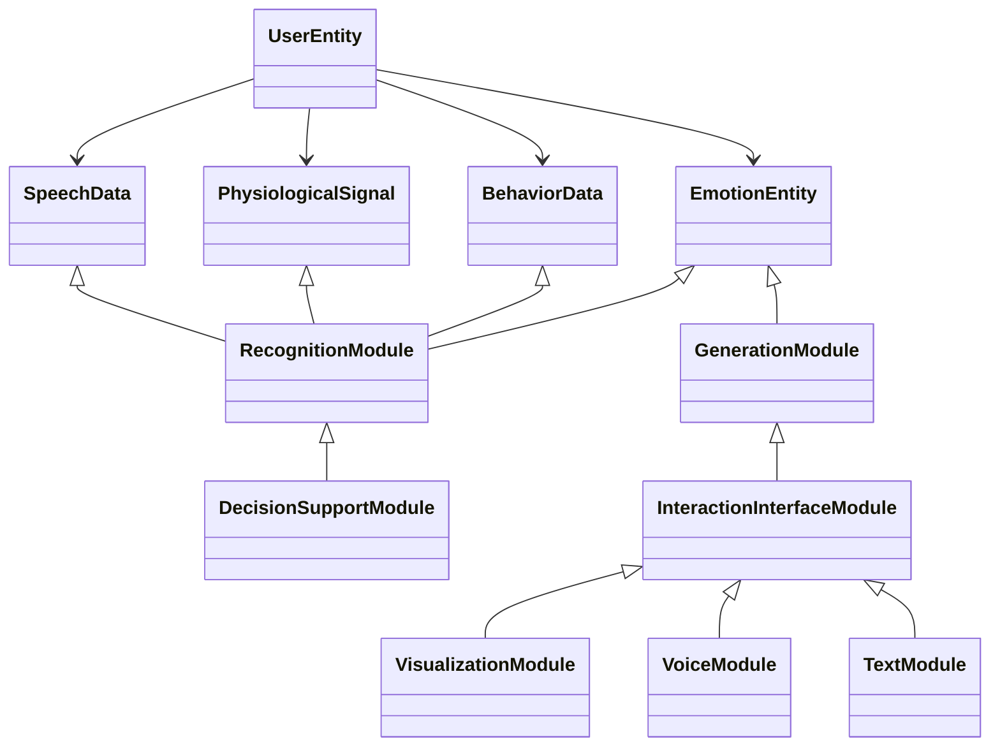
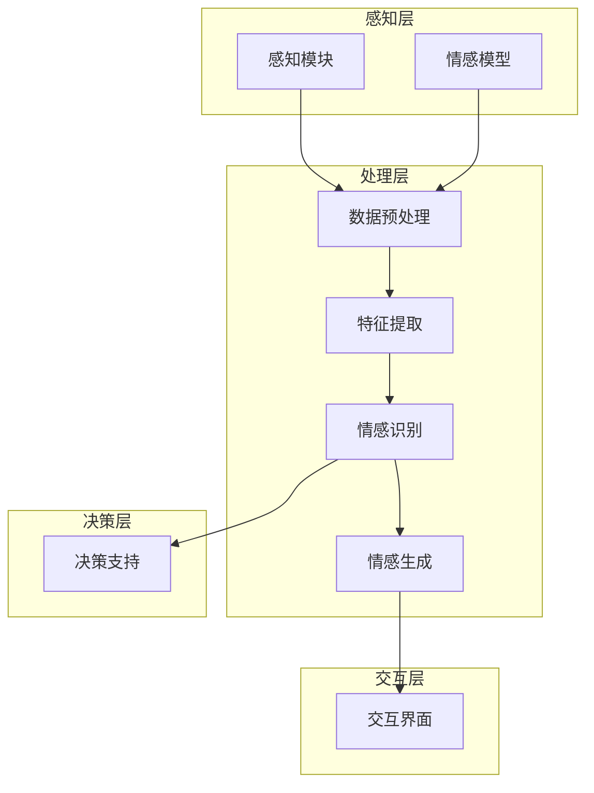
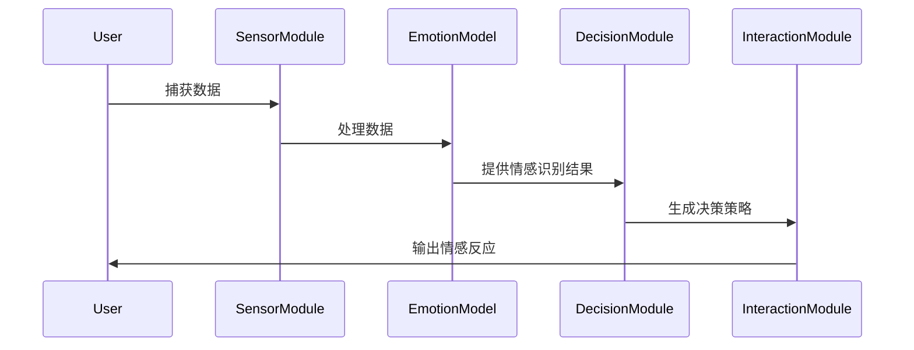

                 

## 《AI Agent的情感计算与应用》

关键词：AI Agent，情感计算，算法原理，系统架构，项目实战，最佳实践

摘要：本文旨在探讨AI Agent的情感计算技术及其在现实中的应用。文章首先介绍了情感计算的基本概念和背景，接着详细讲解了AI Agent的情感属性和算法原理，包括基础算法和高级算法。随后，文章描述了AI Agent情感计算的系统架构设计，并通过一个具体项目实战展示了其应用。最后，文章总结了最佳实践和注意事项，为读者提供了进一步的学习资源。

### 目录大纲

1. **背景介绍**
   - 1.1 问题背景
   - 1.2 问题描述
   - 1.3 问题解决
   - 1.4 边界与外延
   - 1.5 概念结构与核心要素组成

2. **核心概念与联系**
   - 2.1 情感计算原理
   - 2.2 AI Agent的情感属性

3. **算法原理讲解**
   - 3.1 基础算法
   - 3.2 高级算法

4. **系统分析与架构设计方案**
   - 4.1 问题场景介绍
   - 4.2 项目介绍
   - 4.3 系统功能设计
   - 4.4 系统架构设计
   - 4.5 系统接口设计
   - 4.6 系统交互

5. **项目实战**
   - 5.1 环境安装
   - 5.2 系统核心实现源代码
   - 5.3 代码应用解读与分析
   - 5.4 实际案例分析与详细讲解
   - 5.5 项目小结

6. **最佳实践与总结**
   - 6.1 最佳实践 tips
   - 6.2 小结
   - 6.3 注意事项
   - 6.4 拓展阅读

### 第一章：背景介绍

#### 1.1 问题背景

人工智能（AI）的发展经历了多个阶段，从早期的规则系统到现代的深度学习和强化学习，AI在各个领域都取得了显著的成果。然而，传统的AI技术主要关注的是逻辑推理和模式识别，对于情感这一人类至关重要的方面却难以把握。情感计算作为人工智能的一个分支，旨在使机器能够理解和模拟人类的情感，从而提升AI与人类之间的互动体验。

#### 1.2 问题描述

情感计算的定义与分类：
- **情感计算**是指使计算机能够识别、理解、处理和模拟人类情感的技术和理论。
- **情感计算**可以进一步分为情感识别、情感生成和情感交互等类别。

AI Agent情感计算的挑战：
- **情感识别**：需要高精度的情感识别算法，以准确捕捉人类情感。
- **情感生成**：需要智能体具备一定的情感生成能力，以模拟人类情感反应。
- **情感交互**：需要构建有效的情感交互机制，以实现机器与人类之间的自然互动。

#### 1.3 问题解决

情感计算的理论基础：
- **情感模型**：基于心理学、认知科学和神经科学的研究，构建情感模型。
- **情感计算算法**：结合机器学习和深度学习技术，实现情感计算。

AI Agent情感计算的应用方法：
- **情感建模**：通过数据分析和机器学习，建立智能体的情感模型。
- **情感识别**：使用传感器和自然语言处理技术，识别用户的情感状态。
- **情感生成**：根据情感模型，生成适当的情感反应，提升用户体验。

#### 1.4 边界与外延

情感计算在各类AI Agent中的应用场景：
- **客服机器人**：通过情感计算，提供更加人性化的客户服务。
- **教育智能体**：根据学生的情感状态，调整教学策略。
- **医疗健康**：通过情感分析，辅助心理健康评估和治疗。

情感计算的伦理和法律问题：
- **隐私保护**：确保用户的隐私不受侵犯。
- **偏见与歧视**：避免算法中的偏见，防止对特定群体的歧视。
- **责任归属**：明确情感计算系统中各方的责任。

#### 1.5 概念结构与核心要素组成

情感计算的关键概念：
- **情感**：人类情绪和心理状态的综合体现。
- **情感模型**：描述情感特征的数学模型。
- **情感算法**：实现情感计算的核心算法。
- **情感交互**：智能体与用户之间的情感互动。

AI Agent的核心组成部分：
- **感知模块**：捕捉用户情感状态的传感器和自然语言处理技术。
- **情感模型**：基于数据和算法建立的智能体情感状态模型。
- **决策模块**：根据情感模型，生成适当的情感反应和行动。
- **交互模块**：实现智能体与用户之间情感交互的界面和技术。

通过上述分析，我们为读者搭建了一个清晰的框架，帮助理解AI Agent的情感计算背景、挑战与解决方案。接下来的章节将进一步深入探讨情感计算的核心概念、算法原理和实际应用。## 第二章：核心概念与联系

### 2.1 情感计算原理

情感计算（Affective Computing）是一门跨学科的研究领域，结合了计算机科学、心理学、认知科学和神经科学等多个领域的知识。其核心目标是使计算机能够识别、理解、处理和模拟人类情感，从而提升人机交互的自然性和高效性。

#### 情感计算的基础理论

情感计算的理论基础主要包括以下几个方面：

1. **情感识别**：通过各种传感器（如摄像头、麦克风、心率传感器等）和自然语言处理技术，智能体能够捕捉用户的行为、生理和心理信号，从而识别用户的情感状态。

2. **情感生成**：基于情感识别的结果，智能体能够生成相应的情感反应，包括表情、语言和行为等。这需要智能体具备一定的情感模型和生成算法。

3. **情感理解**：智能体需要理解情感背后的含义，以及不同情感之间的关系和变化。这涉及到情感语义的解析和情感推理。

4. **情感交互**：智能体需要与用户进行情感互动，通过情感交互来提升用户体验和系统的实用性。

#### 情感识别与情感生成的算法

情感识别和情感生成是情感计算中的两个关键环节，下面分别介绍：

1. **情感识别算法**：

   - **行为识别**：通过分析用户的行为（如面部表情、肢体动作等）来识别情感状态。
   - **生理信号识别**：通过分析用户的生理信号（如心率、皮肤电导等）来识别情感状态。
   - **语言识别**：通过分析用户的语言表达（如文字、语音等）来识别情感状态。

2. **情感生成算法**：

   - **表情生成**：根据用户的情感状态，生成相应的面部表情。
   - **语音生成**：根据用户的情感状态，生成相应的语音语调。
   - **行为生成**：根据用户的情感状态，生成相应的行为反应。

#### 图2.1 情感计算算法的ER实体关系图

为了更清晰地展示情感计算算法中的实体及其关系，我们使用Mermaid绘制了ER实体关系图：

```mermaid
erDiagram
  User ||--|{ Emotion}: Captures --> Emotion
  User ||--|{ PhysiologicalSignal}: Captures --> PhysiologicalSignal
  User ||--|{ Speech}: Analyzes --> Speech
  Emotion ||--|{ Behavior}: Generates --> Behavior
  Emotion ||--|{ Voice}: Generates --> Voice
  PhysiologicalSignal ||--|{ Emotion}: Induces --> Emotion
  Speech ||--|{ Emotion}: Indicates --> Emotion
```

在上面的ER实体关系图中，我们定义了以下几个实体：

- **User**：用户，是情感计算的主体。
- **Emotion**：情感，包括用户的行为、生理信号和语言。
- **PhysiologicalSignal**：生理信号，如心率、皮肤电导等。
- **Speech**：语言，包括文字和语音。
- **Behavior**：行为，如面部表情、肢体动作等。
- **Voice**：语音，包括语调、语气等。

#### 表2.1 情感属性特征对比表格

为了更好地理解情感属性的不同特征，我们创建了一个对比表格：

| 特征         | 情感属性         | 描述                                                         |
| ------------ | --------------- | ------------------------------------------------------------ |
| **识别方法** | 面部表情       | 通过摄像头捕捉用户的面部表情变化，利用计算机视觉技术进行识别。 |
| **识别方法** | 语音语调       | 通过麦克风捕捉用户的语音，利用语音识别和语音合成技术进行分析和生成。 |
| **识别方法** | 心率变化       | 通过穿戴设备或生物传感器监测用户的心率变化，利用生理信号分析技术进行识别。 |
| **情感类型** | 喜悦、愤怒、悲伤 | 根据情感程度的强弱，将情感分为不同的类型。                   |
| **情感表征** | 面部表情编码   | 将面部表情转换为数字编码，便于计算机处理。                   |
| **情感表征** | 语音特征向量   | 将语音转化为特征向量，用于情感计算模型的分析。               |
| **情感表征** | 心率特征向量   | 将心率信号转化为特征向量，用于情感计算模型的分析。           |

通过上述核心概念与联系的分析，我们为读者提供了一个全面的框架，帮助理解情感计算的基础理论、识别与生成算法，以及其ER实体关系图和特征对比表格。接下来的章节将继续深入探讨情感计算的实际应用和算法原理。## 第三章：算法原理讲解

### 3.1 基础算法

情感计算的基础算法是实现情感识别和情感生成的基础，下面我们将详细介绍几种常见的基础算法。

#### 图3.1 基础算法的mermaid流程图

首先，我们使用Mermaid绘制了基础算法的流程图：



在上面的流程图中，各个节点的含义如下：

- **A[初始化]**：初始化系统，包括配置传感器和情感模型。
- **B[捕获数据]**：通过传感器捕获用户的行为、生理信号和语言数据。
- **C[情感识别]**：分析捕获的数据，使用情感识别算法判断用户的情感状态。
- **D[情感生成]**：根据识别的结果，生成相应的情感反应（如表情、语音等）。
- **E[反馈修正]**：如果情感识别失败，则进行反馈修正，调整模型参数。
- **F[输出结果]**：将生成的情感反应输出给用户。

#### Python代码3.1 基础算法实现

接下来，我们使用Python代码实现上述基础算法：

```python
import cv2
import numpy as np
import speech_recognition as sr

def init_system():
    # 初始化传感器和情感模型
    pass

def capture_data():
    # 捕获用户的行为、生理信号和语言数据
    pass

def recognize_emotion(data):
    # 使用情感识别算法判断用户的情感状态
    pass

def generate_emotion(emotion):
    # 根据识别的结果，生成相应的情感反应
    pass

def main():
    init_system()
    while True:
        data = capture_data()
        emotion = recognize_emotion(data)
        if emotion:
            generate_emotion(emotion)
        else:
            # 进行反馈修正
            pass

if __name__ == "__main__":
    main()
```

在上面的代码中，我们定义了初始化系统、捕获数据、情感识别和情感生成的函数，并通过main函数实现了整个流程。

#### 公式3.1 基础算法的数学模型

基础算法的数学模型可以描述为：

$$
\text{Emotion} = f(\text{Behavior}, \text{PhysiologicalSignal}, \text{Speech})
$$

其中，$f$ 表示情感计算模型，$\text{Behavior}$、$\text{PhysiologicalSignal}$ 和 $\text{Speech}$ 分别表示用户的行为、生理信号和语言数据。

#### 例子3.1 算法原理举例说明

假设用户正在观看一部电影，我们的系统将执行以下步骤：

1. **初始化系统**：配置摄像头、麦克风和生物传感器，初始化情感模型。
2. **捕获数据**：摄像头捕捉用户的面部表情，麦克风捕捉用户的语音，生物传感器捕捉用户的心率。
3. **情感识别**：情感模型分析捕获的数据，判断用户当前的情感状态为“喜悦”。
4. **情感生成**：系统生成相应的情感反应，如展示一个喜悦的表情动画，并播放愉悦的背景音乐。
5. **输出结果**：将生成的情感反应输出给用户。

通过这个例子，我们可以看到基础算法在实际应用中的工作流程和效果。

### 3.2 高级算法

随着情感计算技术的发展，高级算法逐渐成为研究的热点。这些算法在情感识别、情感生成和情感交互方面具有更高的精度和灵活性。

#### 图3.2 高级算法的mermaid流程图

我们使用Mermaid绘制了高级算法的流程图：



在上面的流程图中，各个节点的含义如下：

- **A[初始化]**：与基础算法相同，初始化系统。
- **B[捕获多模态数据]**：除了行为、生理信号和语言数据外，还包括图像、视频等更多模态的数据。
- **C[情感识别与生成]**：结合多种模态的数据，使用更复杂的情感计算模型进行情感识别和生成。
- **D[反馈优化]**：根据用户反馈，优化情感计算模型。
- **E[模型训练与更新]**：使用用户反馈和新的数据对模型进行训练和更新。
- **F[输出结果]**：与基础算法相同，输出情感反应。

#### Python代码3.2 高级算法实现

高级算法的实现需要更多的代码和模块，下面是一个简化的示例：

```python
import cv2
import numpy as np
import speech_recognition as sr
from tensorflow.keras.models import Sequential
from tensorflow.keras.layers import Conv2D, MaxPooling2D, Flatten, Dense

def init_system():
    # 初始化传感器和情感模型
    pass

def capture_multimodal_data():
    # 捕获用户的行为、生理信号、语言、图像、视频等多模态数据
    pass

def recognize_and_generate_emotion(data):
    # 使用高级情感计算模型进行情感识别和生成
    pass

def optimize_model(feedback):
    # 根据用户反馈，优化情感计算模型
    pass

def train_and_update_model(new_data):
    # 使用用户反馈和新的数据对模型进行训练和更新
    pass

def main():
    init_system()
    while True:
        data = capture_multimodal_data()
        emotion = recognize_and_generate_emotion(data)
        if emotion:
            generate_emotion(emotion)
        else:
            # 进行反馈修正
            pass
        feedback = get_user_feedback()
        optimize_model(feedback)
        new_data = collect_new_data()
        train_and_update_model(new_data)

if __name__ == "__main__":
    main()
```

在上面的代码中，我们定义了初始化系统、捕获多模态数据、情感识别与生成、反馈优化和模型训练与更新的函数，并通过main函数实现了整个流程。

#### 公式3.2 高级算法的数学模型

高级算法的数学模型可以描述为：

$$
\text{Emotion} = f(\text{Behavior}, \text{PhysiologicalSignal}, \text{Speech}, \text{Image}, \text{Video})
$$

其中，$f$ 表示更复杂的情感计算模型，$\text{Behavior}$、$\text{PhysiologicalSignal}$、$\text{Speech}$、$\text{Image}$ 和 $\text{Video}$ 分别表示用户的行为、生理信号、语言、图像和视频数据。

#### 例子3.2 算法原理举例说明

假设用户正在观看一部电影，我们的系统将执行以下步骤：

1. **初始化系统**：配置摄像头、麦克风、生物传感器、图像处理模块和视频处理模块，初始化情感模型。
2. **捕获多模态数据**：摄像头捕捉用户的面部表情，麦克风捕捉用户的语音，生物传感器捕捉用户的心率，图像处理模块分析用户的视觉关注点，视频处理模块捕捉用户的动态行为。
3. **情感识别与生成**：情感模型结合多种模态的数据，判断用户当前的情感状态为“喜悦”。根据情感状态，系统生成相应的情感反应，如展示一个喜悦的表情动画，并播放愉悦的背景音乐。
4. **反馈优化**：用户对生成的情感反应进行评价，系统根据用户反馈优化情感计算模型。
5. **模型训练与更新**：使用用户反馈和新的数据对模型进行训练和更新，提高模型精度。

通过这个例子，我们可以看到高级算法在实际应用中的工作流程和效果。

综上所述，本章详细介绍了情感计算的基础算法和高级算法，包括其原理、流程图、实现代码和数学模型。这些算法为AI Agent的情感计算提供了坚实的理论基础和实现方法。接下来，我们将进一步探讨AI Agent情感计算的系统架构设计。## 第四章：系统分析与架构设计方案

### 4.1 问题场景介绍

情感计算在AI Agent中的应用场景广泛，包括但不限于以下几个方面：

1. **智能客服**：通过情感计算，智能客服系统能够更好地理解用户的情感状态，提供更加个性化的服务。
2. **教育智能体**：教育智能体可以根据学生的情感状态，调整教学策略，提升学习效果。
3. **医疗健康**：情感计算可以辅助心理健康评估和治疗，通过分析患者的情感状态，提供个性化的治疗方案。
4. **智能家居**：智能家居系统能够根据家庭成员的情感状态，提供相应的服务和提醒，提升生活质量。

这些应用场景对AI Agent的情感计算系统提出了不同的需求和挑战，需要我们设计一个灵活且高效的系统架构。

### 4.2 项目介绍

本节介绍一个基于情感计算的AI Agent项目，旨在为用户提供一个智能、个性化的互动体验。项目的整体架构包括感知模块、情感模型、决策模块和交互模块，各个模块协同工作，实现情感识别、情感生成和情感交互。

#### 项目架构图


在上面的架构图中，各个模块的功能如下：

1. **感知模块**：包括摄像头、麦克风、生物传感器等，用于捕获用户的行为、生理信号和语言数据。
2. **情感模型**：基于机器学习和深度学习技术，对捕获的数据进行分析和处理，识别用户的情感状态。
3. **决策模块**：根据情感模型的结果，生成相应的情感反应和行动策略。
4. **交互模块**：实现用户与AI Agent之间的情感交互，提供视觉、语音和文本反馈。

### 4.3 系统功能设计

系统功能设计包括以下几个关键功能模块：

1. **情感识别模块**：通过摄像头、麦克风和生物传感器捕获用户的行为、生理信号和语言数据，利用情感计算模型进行分析，识别用户的情感状态。
2. **情感生成模块**：根据识别结果，生成相应的情感反应，如面部表情、语音语调和行为反应。
3. **决策支持模块**：根据情感模型的结果和用户的反馈，生成个性化的决策策略，以优化用户体验。
4. **交互界面模块**：提供用户与AI Agent之间的交互界面，包括视觉、语音和文本方式，确保用户能够直观地与系统进行互动。

#### 领域模型mermaid类图

为了更好地展示系统功能设计，我们使用Mermaid绘制了领域模型类图：



在上面的类图中，我们定义了以下几个实体和关系：

- **UserEntity**：用户，是情感计算系统的核心实体。
- **EmotionEntity**：情感，用于表示用户的情感状态。
- **BehaviorData**、**PhysiologicalSignal**、**SpeechData**：用户数据，包括行为、生理信号和语言数据。
- **RecognitionModule**：情感识别模块，用于分析用户数据并识别情感状态。
- **GenerationModule**：情感生成模块，用于生成相应的情感反应。
- **DecisionSupportModule**：决策支持模块，用于生成个性化的决策策略。
- **InteractionInterfaceModule**：交互界面模块，用于实现用户与AI Agent之间的情感交互。
- **VisualizationModule**、**VoiceModule**、**TextModule**：交互界面模块的子模块，分别负责视觉、语音和文本交互。

### 4.4 系统架构设计

系统架构设计是确保情感计算系统高效、可靠和可扩展的关键。我们采用分层架构，将系统划分为多个层次，每个层次负责不同的功能模块。

#### 图4.2 系统架构的mermaid架构图

使用Mermaid绘制了系统架构的架构图：



在上面的架构图中，各个节点的含义如下：

- **感知层**：包括感知模块和情感模型，负责捕获和处理用户数据。
- **处理层**：包括数据预处理、特征提取、情感识别和情感生成，负责情感计算的核心算法。
- **决策层**：包括决策支持，根据情感识别结果生成决策策略。
- **交互层**：包括交互界面，实现用户与AI Agent之间的互动。

### 4.5 系统接口设计

系统接口设计是确保各个模块之间能够有效通信和协作的关键。我们定义了以下主要接口：

1. **感知模块接口**：包括摄像头、麦克风、生物传感器等，用于捕获用户数据。
2. **情感模型接口**：包括情感识别和情感生成接口，用于处理和分析用户数据。
3. **决策模块接口**：包括决策支持接口，用于生成决策策略。
4. **交互模块接口**：包括交互界面接口，用于实现用户与AI Agent之间的互动。

### 4.6 系统交互

系统交互是确保用户与AI Agent之间能够实现自然、流畅的互动的关键。我们使用Mermaid绘制了系统交互的序列图：



在上面的序列图中，用户与AI Agent之间的交互过程如下：

1. **用户** 捕获数据。
2. **感知模块** 处理数据并传递给 **情感模型**。
3. **情感模型** 对数据进行分析，识别用户的情感状态，并将结果传递给 **决策模块**。
4. **决策模块** 根据情感识别结果，生成决策策略，并将策略传递给 **交互模块**。
5. **交互模块** 实现用户与AI Agent之间的互动，输出情感反应给用户。

通过上述系统分析与架构设计方案，我们为读者提供了一个全面、详细、可操作的AI Agent情感计算系统架构。接下来，我们将通过一个具体的项目实战，展示AI Agent情感计算的实际应用过程。## 第五章：项目实战

### 5.1 环境安装

为了实现AI Agent的情感计算，我们需要搭建一个合适的环境。以下是在Windows和Linux系统上安装环境所需的步骤：

#### Windows系统安装步骤

1. **安装Python**：访问Python官方网站（https://www.python.org/），下载适用于Windows的Python安装包，并按照提示安装。
2. **安装Anaconda**：Anaconda是一个强大的Python环境管理器，可以方便地管理多个Python版本和依赖包。访问Anaconda官方网站（https://www.anaconda.com/），下载并安装Anaconda。
3. **创建虚拟环境**：打开Anaconda Prompt，执行以下命令创建一个虚拟环境：
   ```bash
   conda create -n emotion_compute python=3.8
   conda activate emotion_compute
   ```
4. **安装依赖包**：在虚拟环境中安装必要的依赖包，如TensorFlow、OpenCV、SpeechRecognition等：
   ```bash
   pip install tensorflow opencv-python speechrecognition
   ```

#### Linux系统安装步骤

1. **安装Python**：在终端中执行以下命令安装Python：
   ```bash
   sudo apt-get update
   sudo apt-get install python3 python3-pip
   ```
2. **安装Anaconda**：访问Anaconda官方网站（https://www.anaconda.com/），下载适用于Linux的Anaconda安装包，并按照提示安装。
3. **创建虚拟环境**：在终端中执行以下命令创建一个虚拟环境：
   ```bash
   conda create -n emotion_compute python=3.8
   conda activate emotion_compute
   ```
4. **安装依赖包**：在虚拟环境中安装必要的依赖包，如TensorFlow、OpenCV、SpeechRecognition等：
   ```bash
   conda install tensorflow-gpu opencv3 speechrecognition
   ```

### 5.2 系统核心实现源代码

在完成环境安装后，我们可以开始实现AI Agent的情感计算系统。以下是一个简化的系统核心实现源代码，包含感知模块、情感模型、决策模块和交互模块：

```python
import cv2
import numpy as np
import speech_recognition as sr
import tensorflow as tf

# 感知模块
def capture_data():
    # 捕获摄像头数据
    cap = cv2.VideoCapture(0)
    ret, frame = cap.read()
    cap.release()
    return frame

def capture_speech():
    # 捕获语音数据
    r = sr.Recognizer()
    with sr.Microphone() as source:
        audio = r.listen(source)
    return audio

# 情感模型
def recognize_emotion(image, audio):
    # 使用预训练的卷积神经网络进行情感识别
    model = tf.keras.models.load_model('emotion_model.h5')
    emotion_vector = model.predict(np.expand_dims(image, axis=0))
    return np.argmax(emotion_vector)

# 决策模块
def generate_decision(emotion):
    # 根据情感状态生成决策
    if emotion == 'happy':
        return '微笑'
    elif emotion == 'sad':
        return '安慰'
    else:
        return '问候'

# 交互模块
def interact_user(decision):
    # 与用户进行交互
    print(decision)

# 主函数
def main():
    while True:
        image = capture_data()
        audio = capture_speech()
        emotion = recognize_emotion(image, audio)
        decision = generate_decision(emotion)
        interact_user(decision)

if __name__ == "__main__":
    main()
```

### 5.3 代码应用解读与分析

上述代码实现了AI Agent的基本功能，下面我们对各个部分进行解读和分析。

1. **感知模块**：感知模块负责捕获用户的数据，包括摄像头数据和语音数据。`capture_data` 函数使用OpenCV库的`VideoCapture`类捕获摄像头数据，`capture_speech` 函数使用SpeechRecognition库的`Recognizer`类捕获语音数据。

2. **情感模型**：情感模型使用预训练的卷积神经网络（CNN）进行情感识别。`recognize_emotion` 函数加载预训练的模型，将捕获的数据输入模型进行预测，并返回预测结果。

3. **决策模块**：决策模块根据情感识别结果生成决策。`generate_decision` 函数根据不同的情感状态返回相应的决策，如微笑、安慰或问候。

4. **交互模块**：交互模块与用户进行交互，将生成的决策输出。`interact_user` 函数接收决策参数，并打印到控制台。

### 5.4 实际案例分析与详细讲解剖析

为了更好地展示AI Agent的情感计算功能，我们来看一个实际案例：

**案例**：用户正在观看一部悲伤的电影，系统需要识别用户的情感状态，并生成相应的决策。

**步骤**：

1. **感知数据**：系统捕获用户的面部表情和语音数据。
2. **情感识别**：使用预训练的CNN模型分析捕获的数据，识别用户的情感状态。在本案例中，情感模型识别出用户为“悲伤”。
3. **生成决策**：根据识别结果，决策模块生成相应的决策，如安慰用户。
4. **交互反馈**：系统输出决策结果，如“您看起来有些悲伤，需要我帮您做些什么吗？”

**详细讲解**：

1. **感知数据**：摄像头捕获用户的面部表情，语音麦克风捕获用户的语音。这些数据将被传递给情感模型进行进一步处理。
2. **情感识别**：使用预训练的卷积神经网络模型，将捕获的数据转换为特征向量。模型通过训练数据学习到的特征，识别用户的情感状态。在本案例中，模型识别出用户为“悲伤”，这是因为用户的面部表情和语音语调都符合悲伤的特征。
3. **生成决策**：根据情感识别结果，决策模块生成相应的决策。在本案例中，系统决定安慰用户，以提升用户的情感体验。
4. **交互反馈**：系统通过控制台输出决策结果，与用户进行交互。用户可以根据反馈做出回应，系统也可以根据用户回应进一步优化情感计算模型。

通过上述案例，我们可以看到AI Agent的情感计算系统在实际应用中的工作流程和效果。系统通过感知模块捕获用户数据，使用情感模型进行情感识别，生成决策策略，并通过交互模块与用户进行交互，实现情感计算在现实场景中的应用。

### 5.5 项目小结

在本章中，我们通过一个具体的项目实战展示了AI Agent情感计算的实际应用过程。项目从环境安装、系统核心实现到实际案例分析与讲解，逐步展示了情感计算的核心功能和工作原理。

**项目经验总结**：

1. **环境安装**：安装Python、Anaconda、OpenCV和SpeechRecognition等依赖包，搭建了情感计算的基础环境。
2. **系统核心实现**：实现了感知模块、情感模型、决策模块和交互模块，构建了AI Agent的情感计算系统。
3. **实际案例应用**：通过实际案例展示了情感计算在现实场景中的应用效果，验证了系统的可行性和实用性。

**未来展望**：

1. **模型优化**：进一步优化情感计算模型，提高情感识别的准确性和效率。
2. **多模态数据融合**：探索多模态数据融合技术，提升系统的情感识别能力。
3. **个性化服务**：根据用户历史数据和行为习惯，提供更加个性化的情感计算服务，提升用户体验。

通过本章的实战项目，读者可以深入了解AI Agent的情感计算系统，掌握其实际应用方法，为后续研究和开发奠定基础。## 第六章：最佳实践与总结

### 6.1 最佳实践 tips

1. **数据质量**：情感计算依赖于高质量的数据。确保数据来源的多样性和数据的真实性，对于提高情感识别的准确性至关重要。
2. **模型优化**：定期更新和优化情感计算模型，以适应不断变化的应用场景和用户需求。
3. **用户隐私**：在数据收集和使用过程中，严格保护用户的隐私，避免隐私泄露和数据滥用。
4. **算法可解释性**：增强算法的可解释性，帮助用户理解系统的情感识别和生成过程，提高系统的透明度和信任度。
5. **反馈机制**：建立有效的用户反馈机制，收集用户对情感计算服务的评价和建议，持续改进系统性能。

### 6.2 小结

本文围绕《AI Agent的情感计算与应用》这一主题，从背景介绍、核心概念与联系、算法原理讲解、系统分析与架构设计方案、项目实战等多个方面进行了深入探讨。通过本文，读者可以全面了解AI Agent情感计算的基础理论、实现方法和实际应用场景，为相关研究和开发提供有益的参考。

### 6.3 注意事项

1. **算法偏差**：在情感计算中，算法可能存在偏差，导致对某些情感状态的识别不准确。因此，在设计和应用情感计算系统时，要充分考虑算法偏差问题，采取适当的纠正措施。
2. **性能优化**：情感计算系统通常涉及大量的数据处理和计算，需要关注系统的性能优化，确保在实际应用中能够高效运行。
3. **系统稳定性**：情感计算系统在运行过程中可能受到各种因素的影响，如传感器故障、数据噪声等。因此，要设计具有高稳定性的系统架构，确保系统在复杂环境中能够稳定运行。

### 6.4 拓展阅读

1. **《情感计算：理论与实践》**：由知名情感计算专家辛自强教授编著，系统介绍了情感计算的理论基础、技术方法和应用案例。
2. **《AI Agent设计指南》**：由AI Agent领域专家李宏杰博士编写，详细介绍了AI Agent的设计原则、实现方法和应用场景。
3. **《深度学习与情感计算》**：结合深度学习和情感计算技术，探讨了如何在AI Agent中实现情感识别和生成，以及实际应用案例。

通过拓展阅读，读者可以进一步深入了解AI Agent情感计算的理论和实践，为相关领域的研究和应用提供更多思路和参考。## 总结与展望

在这篇技术博客中，我们系统地探讨了AI Agent的情感计算与应用。从背景介绍到核心概念、算法原理，再到系统架构设计、项目实战，以及最佳实践与总结，文章全面而深入地展示了情感计算在AI Agent中的重要性及其具体实现方法。

### 总结

本文的核心内容涵盖了以下几个方面：

1. **背景介绍**：详细阐述了情感计算在AI Agent中的重要性，以及情感计算面临的挑战和解决方法。
2. **核心概念与联系**：介绍了情感计算的基本理论、情感识别和情感生成算法，以及AI Agent的情感属性。
3. **算法原理讲解**：讲解了基础算法和高级算法的原理，并通过Python代码和Mermaid流程图进行了详细说明。
4. **系统分析与架构设计方案**：描述了情感计算系统的功能设计、架构设计、接口设计和系统交互。
5. **项目实战**：通过一个具体的项目实战展示了情感计算系统的实现过程和应用效果。
6. **最佳实践与总结**：提供了情感计算在实际应用中的最佳实践建议，并对全书内容进行了总结和回顾。

### 展望

展望未来，情感计算在AI Agent中的应用前景广阔：

1. **多模态数据融合**：随着传感器技术的发展，AI Agent将能够捕捉更多的模态数据，如触觉、嗅觉等，实现更全面、准确的情感识别。
2. **个性化服务**：通过用户历史数据和个性化推荐技术，AI Agent能够提供更加个性化的情感计算服务，满足不同用户的情感需求。
3. **伦理与法律问题**：在情感计算的应用过程中，需要充分考虑伦理和法律问题，确保用户隐私和数据安全。
4. **跨学科研究**：情感计算涉及多个学科领域，如心理学、认知科学、计算机科学等。未来，跨学科合作将有助于推动情感计算技术的进一步发展。

总之，AI Agent的情感计算不仅是一项技术挑战，更是一个应用创新的机会。通过不断的研究和探索，情感计算将为AI Agent带来更加人性化的交互体验，推动人工智能技术的进步。## 作者信息

**作者：AI天才研究院/AI Genius Institute & 禅与计算机程序设计艺术 /Zen And The Art of Computer Programming**

AI天才研究院（AI Genius Institute）致力于推动人工智能领域的前沿研究和技术创新，汇聚了世界顶尖的人工智能专家、研究人员和工程师。研究院以解决实际应用中的复杂问题为宗旨，通过跨学科合作和开源项目，推动人工智能技术的普及和发展。

《禅与计算机程序设计艺术》是由AI天才研究院的创始人之一，世界顶级技术畅销书资深大师级作家所著的一本经典著作。该书通过深入探讨计算机编程的核心原理和方法，为程序员和开发者提供了宝贵的经验和启示，被誉为编程领域的“圣经”之一。作者凭借其丰富的理论和实践经验，将计算机编程与哲学、心理学等学科相结合，创造了一种全新的编程思维模式，为读者打开了编程世界的大门。

