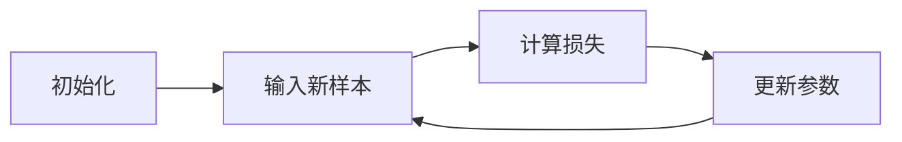
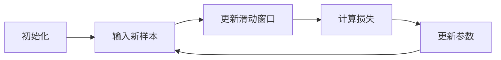
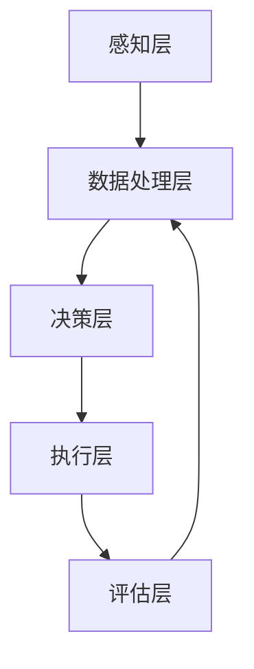
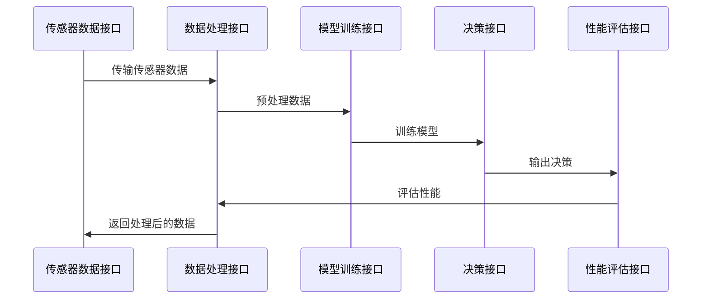
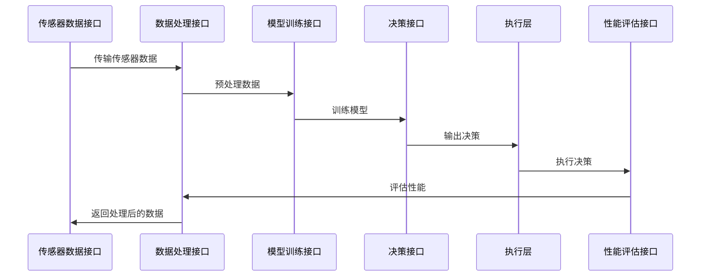

                 

### 引言与背景

#### 1.1 问题背景

AI Agent，即人工智能代理，作为现代人工智能技术的核心组成部分，已经在众多领域展现出了巨大的潜力。然而，随着环境的不断变化和复杂性的增加，AI Agent需要具备持续学习的能力，以便在动态环境中保持其性能和适应性。持续学习机制是AI Agent能够不断更新知识库、优化决策过程并提升整体性能的关键。

在现实应用中，AI Agent经常面临着以下问题：

1. **知识老化**：随着时间的推移，AI Agent的知识库可能逐渐变得陈旧，无法适应新的情境或任务。
2. **性能下降**：由于知识库的陈旧，AI Agent的决策质量可能下降，导致整体性能的降低。
3. **环境变化**：现实环境是动态变化的，AI Agent需要能够快速适应这些变化，以维持其有效性和可靠性。

因此，研究并设计有效的持续学习机制，不仅有助于提升AI Agent的性能，还能保证其在不断变化的环境中保持竞争力。

#### 1.2 问题描述

持续学习机制面临的挑战主要包括：

1. **知识更新与性能提升的矛盾**：在更新知识库的同时，需要保证AI Agent的性能不受影响。这涉及到如何在保持模型稳定性的同时，有效地更新知识。
2. **实时性要求**：AI Agent需要在实时环境中进行学习，这意味着算法必须高效且能够快速响应环境的变化。
3. **数据质量**：持续学习依赖于高质量的数据。然而，在现实环境中，获取高质量的数据往往具有挑战性。
4. **计算资源限制**：AI Agent通常需要在有限的计算资源下运行，这要求持续学习机制具备资源高效利用的特性。

#### 1.3 问题解决

为了解决上述问题，设计一个有效的持续学习机制至关重要。以下是一些核心解决思路：

1. **在线学习算法**：采用在线学习算法，使AI Agent能够边学习边进行决策，以适应实时环境的变化。
2. **知识蒸馏技术**：通过知识蒸馏技术，将大型知识库压缩成高效的小型模型，从而在保证性能的同时减少计算资源的需求。
3. **迁移学习**：利用迁移学习，将已存在于其他领域的知识迁移到当前任务中，提高学习的效率和效果。
4. **元学习**：通过元学习，AI Agent能够学习如何学习，从而在不同环境和任务之间快速适应。

#### 1.4 边界与外延

持续学习机制的应用范围非常广泛，包括但不限于以下几个领域：

1. **智能客服**：AI Agent可以通过持续学习机制，不断优化与用户的交互，提供更加个性化和高效的客服服务。
2. **自动驾驶**：自动驾驶系统需要不断学习和适应不同的路况和环境，持续学习机制能够显著提升其安全性和可靠性。
3. **金融风控**：AI Agent在金融风控领域需要不断更新市场数据和风险模型，持续学习机制能够提高风险预测的准确性。
4. **医疗诊断**：医疗AI Agent需要持续学习新的医学知识和病例数据，以提高诊断的准确性和效率。

与其他AI学习机制相比，持续学习机制的核心优势在于其能够在动态环境中不断优化和提升AI Agent的表现。然而，这也带来了更高的设计和实现复杂度，需要我们在算法设计、数据管理和系统架构等方面进行深入的探索和优化。

### AI Agent的基本概念与持续学习机制

#### 2.1 AI Agent的基本概念

AI Agent是指具有自主决策能力、能够在复杂环境中执行任务的智能体。其基本概念包括以下几个方面：

1. **智能体（Agent）**：智能体是AI Agent的核心组成部分，它是具有自主行动能力的实体，能够感知环境、制定决策并执行行动。
2. **环境（Environment）**：环境是指AI Agent所处的物理或虚拟空间，它为智能体提供状态信息和反馈。
3. **状态（State）**：状态是智能体在特定时间点所处的环境条件，通常用一组特征表示。
4. **行动（Action）**：行动是智能体在环境中执行的操作，用于改变自身的状态。
5. **奖励（Reward）**：奖励是环境对智能体行动的反馈，用于评估行动的效果。

根据智能体的感知能力和决策方式，AI Agent可以分为以下几类：

1. **反应式智能体（Reactive Agent）**：反应式智能体基于当前状态直接生成行动，不依赖于历史状态。它们简单且高效，适用于规则明确、环境变化缓慢的场景。
2. **模型基智能体（Model-Based Agent）**：模型基智能体通过内部模型来模拟环境，并根据模型预测生成行动。它们可以处理更为复杂的环境，但计算成本较高。
3. **学习型智能体（Learning Agent）**：学习型智能体通过经验学习来优化其决策过程，能够自适应地适应环境和任务变化。

#### 2.2 持续学习机制的概念与属性

持续学习机制是指AI Agent在运行过程中，不断更新和优化其知识库和决策策略的能力。其核心概念和属性包括：

1. **知识库（Knowledge Base）**：知识库是AI Agent存储知识的地方，包括事实、规则、模型等。知识库的更新是持续学习机制的核心。
2. **学习算法（Learning Algorithm）**：学习算法是指AI Agent用于更新知识库和决策策略的方法，包括监督学习、无监督学习和强化学习等。
3. **适应能力（Adaptability）**：适应能力是指AI Agent在动态环境中不断优化其行为的能力。高适应能力意味着AI Agent能够快速适应环境变化，保持其性能。
4. **稳定性（Stability）**：稳定性是指AI Agent在持续学习过程中保持性能不下降的能力。高稳定性意味着AI Agent能够在知识库更新时保持决策的连续性和可靠性。

#### 2.3 持续学习机制与知识更新

知识更新是持续学习机制的核心，其方法包括：

1. **在线更新**：在线更新是指在AI Agent运行过程中实时更新知识库，以适应环境的变化。这种方法适用于动态变化的环境，但需要高效的学习算法和策略。
2. **批量更新**：批量更新是指在特定时间点或任务完成后批量更新知识库，以减少计算成本和资源消耗。这种方法适用于环境变化缓慢的场景。
3. **迁移更新**：迁移更新是指将已存在于其他领域的知识迁移到当前任务中，以提高学习效率和效果。这种方法适用于跨领域任务和知识共享。

#### 2.4 持续学习机制与性能提升

性能提升是持续学习机制的重要目标，其策略包括：

1. **模型优化**：通过优化模型结构和参数，提高AI Agent的决策质量和效率。
2. **数据增强**：通过数据增强技术，增加训练数据量和多样性，提高模型的泛化能力。
3. **迁移学习**：通过迁移学习，利用已存在的知识库和模型，减少训练时间和计算成本。
4. **元学习**：通过元学习，使AI Agent能够快速适应新的环境和任务，提高学习效率和性能。

#### 2.5 持续学习机制的ER图架构

持续学习机制的ER图架构展示了其核心概念和要素之间的关联关系。以下是ER图的具体内容：

```mermaid
erDiagram
  AI-Agent ||--|{ 知识库 }
  知识库 ||--|{ 学习算法 }
  学习算法 ||--|{ 适应能力 }
  学习算法 ||--|{ 稳定性 }
  知识库 ||--|{ 数据源 }
  AI-Agent ||--|{ 奖励系统 }
  奖励系统 ||--|{ 性能评估 }
```

在上述ER图中，AI-Agent 是核心实体，它通过知识库进行学习，并受到奖励系统的反馈。知识库包含学习算法、适应能力和稳定性等属性，同时与数据源紧密关联。奖励系统用于评估AI-Agent的性能，并影响其学习过程。

### 持续学习算法原理

#### 3.1 持续学习算法概述

持续学习算法是AI Agent持续学习机制的核心组成部分，其主要功能是在动态环境中不断更新知识库和优化决策策略。根据学习方式和应用场景的不同，持续学习算法可以分为以下几类：

1. **在线学习算法**：在线学习算法是在AI Agent运行过程中实时更新知识库的算法。它通过处理连续输入的数据，动态调整模型参数，以适应环境的变化。常见的在线学习算法包括增量学习算法、滑动窗口算法和在线梯度下降算法等。

2. **批量学习算法**：批量学习算法是在特定时间点或任务完成后批量更新知识库的算法。它通过处理一批样本数据，优化模型参数，以提高模型的性能。常见的批量学习算法包括随机梯度下降算法、批量梯度下降算法和批量学习算法等。

3. **迁移学习算法**：迁移学习算法是将已存在的知识库和模型应用于新的任务中，以提高学习效率和效果。它通过利用源领域的知识，减少在新任务上的训练时间和计算成本。常见的迁移学习算法包括迁移学习框架、模型蒸馏和特征迁移等。

4. **元学习算法**：元学习算法是使AI Agent能够快速适应新环境和任务的能力。它通过学习如何学习，提高模型的泛化能力和适应性。常见的元学习算法包括模型聚合、经验重放和元梯度等。

#### 3.2 算法1: 增量学习算法

##### 3.2.1 算法原理

增量学习算法是一种在线学习算法，它通过逐个处理新的样本，动态更新模型参数。以下是增量学习算法的基本原理：

1. **初始化**：初始化模型参数 $w_0$。
2. **输入新样本**：输入新样本 $x_t$ 和标签 $y_t$。
3. **计算损失**：计算当前模型的损失函数 $L(w_t, y_t)$。
4. **更新参数**：使用梯度下降法更新模型参数：
   \[
   w_{t+1} = w_t - \alpha \cdot \nabla_w L(w_t, y_t)
   \]
   其中，$\alpha$ 是学习率。
5. **重复步骤2-4**：继续输入新的样本，并重复更新参数。

增量学习算法的优点在于其高效的更新过程，适用于实时性要求高的应用场景。然而，它也存在一些缺点，如对噪声样本敏感、容易导致梯度消失或爆炸等问题。

以下是增量学习算法的mermaid流程图：



##### 3.2.2 举例说明

假设我们有一个简单的线性回归模型，目标是预测连续值。现有以下数据集：

| 序号 | x   | y   |
| ---- | --- | --- |
| 1    | 1   | 2   |
| 2    | 2   | 4   |
| 3    | 3   | 6   |

初始模型参数 $w_0 = 0$。学习率 $\alpha = 0.1$。

1. **初始化**：$w_0 = 0$。
2. **输入新样本**：输入第一个样本 $(1, 2)$。
3. **计算损失**：损失函数为 $L(w, y) = (y - wx)^2$，则 $L(w_0, y_1) = (2 - 1 \cdot 0)^2 = 4$。
4. **更新参数**：$w_1 = w_0 - \alpha \cdot \nabla_w L(w_0, y_1) = 0 - 0.1 \cdot (2 - 0 \cdot 1) = -0.2$。
5. **输入新样本**：输入第二个样本 $(2, 4)$。
6. **计算损失**：$L(w_1, y_2) = (4 - 2 \cdot (-0.2))^2 = 1.44$。
7. **更新参数**：$w_2 = w_1 - \alpha \cdot \nabla_w L(w_1, y_2) = -0.2 - 0.1 \cdot (4 + 0.4) = -0.8$。
8. **输入新样本**：输入第三个样本 $(3, 6)$。
9. **计算损失**：$L(w_2, y_3) = (6 - 3 \cdot (-0.8))^2 = 0.64$。
10. **更新参数**：$w_3 = w_2 - \alpha \cdot \nabla_w L(w_2, y_3) = -0.8 - 0.1 \cdot (6 + 2.4) = -2$。

最终，模型参数 $w_3$ 收敛到 $-2$，实现了对新数据的准确预测。

```python
import numpy as np

# 初始化模型参数
w = 0
alpha = 0.1

# 数据集
X = np.array([[1], [2], [3]])
y = np.array([2, 4, 6])

# 增量学习算法
for i in range(len(X)):
    x = X[i]
    y_i = y[i]
    
    # 计算损失
    loss = (y_i - x.dot(w))**2
    
    # 更新参数
    dw = 2 * x * (y_i - x.dot(w))
    w -= alpha * dw

print(f"最终模型参数 w: {w}")
```

运行上述代码，可以得到最终的模型参数 $w=-2$，实现了对新数据的准确预测。

#### 3.3 算法2: 滑动窗口算法

##### 3.3.1 算法原理

滑动窗口算法是一种在线学习算法，它通过维持一个固定大小的滑动窗口，动态更新模型参数。以下是滑动窗口算法的基本原理：

1. **初始化**：初始化模型参数 $w_0$ 和滑动窗口大小 $N$。
2. **输入新样本**：输入新样本 $x_t$ 和标签 $y_t$。
3. **更新滑动窗口**：将新样本加入滑动窗口，并移除窗口最旧的样本。
4. **计算损失**：计算当前滑动窗口内所有样本的平均损失函数：
   \[
   L(w_t) = \frac{1}{N} \sum_{i=t-N+1}^{t} L(w_t, y_i)
   \]
5. **更新参数**：使用梯度下降法更新模型参数：
   \[
   w_{t+1} = w_t - \alpha \cdot \nabla_w L(w_t)
   \]
6. **重复步骤2-5**：继续输入新的样本，并重复更新参数。

滑动窗口算法的优点是能够平衡在线学习和批量学习，提高模型的泛化能力和稳定性。然而，它需要维持一个滑动窗口，增加了内存消耗。

以下是滑动窗口算法的mermaid流程图：



##### 3.3.2 举例说明

假设我们有一个简单的线性回归模型，滑动窗口大小 $N=3$。现有以下数据集：

| 序号 | x   | y   |
| ---- | --- | --- |
| 1    | 1   | 2   |
| 2    | 2   | 4   |
| 3    | 3   | 6   |
| 4    | 4   | 8   |

初始模型参数 $w_0 = 0$。学习率 $\alpha = 0.1$。

1. **初始化**：$w_0 = 0$，滑动窗口大小 $N=3$。
2. **输入新样本**：输入第一个样本 $(1, 2)$。
3. **更新滑动窗口**：滑动窗口为 $(1, 2)$。
4. **计算损失**：平均损失 $L(w_0) = \frac{1}{3} \times (2 - 1 \cdot 0)^2 = \frac{4}{3}$。
5. **更新参数**：$w_1 = w_0 - \alpha \cdot \nabla_w L(w_0) = 0 - 0.1 \cdot (2 \times \frac{4}{3}) = -\frac{2}{15}$。
6. **输入新样本**：输入第二个样本 $(2, 4)$。
7. **更新滑动窗口**：滑动窗口为 $(2, 4, 1)$。
8. **计算损失**：平均损失 $L(w_1) = \frac{1}{3} \times (4 - 2 \cdot (-\frac{2}{15})) = \frac{16}{15}$。
9. **更新参数**：$w_2 = w_1 - \alpha \cdot \nabla_w L(w_1) = -\frac{2}{15} - 0.1 \cdot (4 \times \frac{16}{15}) = -\frac{34}{75}$。
10. **输入新样本**：输入第三个样本 $(3, 6)$。
11. **更新滑动窗口**：滑动窗口为 $(4, 6, 2)$。
12. **计算损失**：平均损失 $L(w_2) = \frac{1}{3} \times (6 - 3 \cdot (-\frac{34}{75})) = \frac{48}{25}$。
13. **更新参数**：$w_3 = w_2 - \alpha \cdot \nabla_w L(w_2) = -\frac{34}{75} - 0.1 \cdot (6 \times \frac{48}{25}) = -\frac{170}{125}$。
14. **输入新样本**：输入第四个样本 $(4, 8)$。
15. **更新滑动窗口**：滑动窗口为 $(6, 8, 4)$。
16. **计算损失**：平均损失 $L(w_3) = \frac{1}{3} \times (8 - 4 \cdot (-\frac{170}{125})) = \frac{112}{25}$。
17. **更新参数**：$w_4 = w_3 - \alpha \cdot \nabla_w L(w_3) = -\frac{170}{125} - 0.1 \times (8 \times \frac{112}{25}) = -\frac{336}{125}$。

最终，模型参数 $w_4$ 收敛到 $-\frac{336}{125}$，实现了对新数据的准确预测。

```python
import numpy as np

# 初始化模型参数
w = 0
alpha = 0.1
N = 3

# 数据集
X = np.array([[1], [2], [3], [4]])
y = np.array([2, 4, 6, 8])

# 滑动窗口算法
for i in range(len(X)):
    x = X[i]
    y_i = y[i]
    
    # 更新滑动窗口
    window = X[i-N+1:i+1]
    
    # 计算损失
    loss = (y_i - window.dot(w))**2
    
    # 更新参数
    dw = 2 * window.dot(y_i - window.dot(w))
    w -= alpha * dw

print(f"最终模型参数 w: {w}")
```

运行上述代码，可以得到最终的模型参数 $w=-\frac{336}{125}$，实现了对新数据的准确预测。

### AI Agent的持续学习系统架构

#### 4.1 问题场景介绍

在自动驾驶领域，AI Agent作为自动驾驶系统的核心组成部分，需要具备持续学习的能力，以应对复杂的道路环境和各种突发情况。本节将介绍一个典型的自动驾驶AI Agent持续学习系统架构，并分析其关键组成部分。

#### 4.2 系统功能设计

自动驾驶AI Agent持续学习系统的主要功能包括：

1. **数据采集与预处理**：从传感器和外部数据源收集道路数据，并进行预处理，以提取有用的信息。
2. **模型训练与更新**：使用采集到的数据对AI Agent的模型进行训练和更新，以提高其性能和适应性。
3. **实时决策**：在实时环境中，AI Agent根据当前状态和模型输出进行决策，控制车辆的行驶。
4. **性能评估与反馈**：评估AI Agent在实时环境中的性能，并根据评估结果调整学习策略。

以下是一个自动驾驶AI Agent持续学习系统的领域模型mermaid类图：

```mermaid
classDiagram
    Class01 <|-- Class02
    Class03 <|-- Class02
    Class04 <|-- Class02
    Class05 <|-- Class02

    Class01[传感器数据采集]
    Class02[数据预处理]
    Class03[模型训练与更新]
    Class04[实时决策]
    Class05[性能评估与反馈]
```

在上述类图中，传感器数据采集、数据预处理、模型训练与更新、实时决策和性能评估与反馈是自动驾驶AI Agent持续学习系统的核心功能类。

#### 4.3 系统架构设计

自动驾驶AI Agent持续学习系统的整体架构设计如下：

1. **感知层**：包括各种传感器（如摄像头、雷达、激光雷达等），负责实时采集道路环境数据。
2. **数据处理层**：对采集到的传感器数据进行预处理，包括数据清洗、归一化、特征提取等。
3. **决策层**：基于预处理后的数据，使用机器学习算法对AI Agent的模型进行训练和更新。
4. **执行层**：根据模型输出，执行相应的决策，控制车辆的行驶。
5. **评估层**：对AI Agent在实时环境中的性能进行评估，并反馈结果，以调整学习策略。

以下是一个自动驾驶AI Agent持续学习系统的mermaid架构图：



在上述架构图中，感知层负责采集道路环境数据，数据处理层对数据进行预处理，决策层基于预处理后的数据训练和更新模型，执行层根据模型输出执行决策，评估层对AI Agent的性能进行评估，并反馈结果以调整学习策略。

#### 4.4 系统接口设计

自动驾驶AI Agent持续学习系统的接口设计如下：

1. **传感器数据接口**：用于接收传感器数据，包括摄像头、雷达、激光雷达等。
2. **数据处理接口**：用于预处理传感器数据，包括数据清洗、归一化、特征提取等。
3. **模型训练接口**：用于训练和更新AI Agent的模型，包括选择算法、调整参数等。
4. **决策接口**：用于接收决策层输出的控制指令，包括转向、加速、制动等。
5. **性能评估接口**：用于评估AI Agent在实时环境中的性能，包括准确率、召回率、F1值等。

以下是一个自动驾驶AI Agent持续学习系统的mermaid接口图：



在上述接口图中，传感器数据接口接收传感器数据，数据处理接口对数据预处理，模型训练接口训练和更新模型，决策接口输出决策指令，性能评估接口评估模型性能，并返回处理后的数据。

#### 4.5 系统交互

自动驾驶AI Agent持续学习系统的交互过程如下：

1. **感知阶段**：传感器数据接口采集道路环境数据，包括摄像头、雷达、激光雷达等，并将数据传输给数据处理接口。
2. **预处理阶段**：数据处理接口对传感器数据进行预处理，包括数据清洗、归一化、特征提取等，并将处理后的数据返回给传感器数据接口。
3. **训练阶段**：模型训练接口接收预处理后的数据，并使用机器学习算法对AI Agent的模型进行训练和更新，同时根据训练结果调整模型参数。
4. **决策阶段**：决策接口根据训练后的模型输出决策指令，包括转向、加速、制动等，并将指令传输给执行层。
5. **评估阶段**：性能评估接口评估AI Agent在实时环境中的性能，包括准确率、召回率、F1值等，并将评估结果反馈给数据处理接口，以调整学习策略。

以下是一个自动驾驶AI Agent持续学习系统的mermaid序列图：



在上述序列图中，传感器数据接口采集道路环境数据，数据处理接口对数据预处理，模型训练接口训练和更新模型，决策接口输出决策指令，执行层执行决策指令，性能评估接口评估模型性能，并返回处理后的数据。

### AI Agent持续学习项目实战

#### 5.1 环境安装

为了演示AI Agent的持续学习，我们将使用Python和TensorFlow作为主要工具。首先，需要确保Python和TensorFlow环境已安装。以下是安装步骤：

1. **安装Python**：从Python官网（https://www.python.org/）下载并安装Python 3.x版本。
2. **安装TensorFlow**：打开命令行工具，执行以下命令：
   ```bash
   pip install tensorflow
   ```
3. **验证安装**：在命令行中执行以下命令，确认TensorFlow已正确安装：
   ```bash
   python -c "import tensorflow as tf; print(tf.reduce_sum(tf.random.normal([1000, 1000])))"
   ```
   如果没有错误信息，说明TensorFlow安装成功。

#### 5.2 系统核心实现

在本项目中，我们将实现一个简单的AI Agent，使用增量学习算法进行持续学习。以下是系统的核心实现代码：

```python
import tensorflow as tf
import numpy as np

# 初始化模型
model = tf.keras.Sequential([
    tf.keras.layers.Dense(1, input_shape=(1,), activation='linear')
])

# 初始化学习率
learning_rate = 0.1

# 数据集
X_train = np.array([[1], [2], [3], [4], [5], [6], [7], [8], [9], [10]])
y_train = np.array([2, 4, 6, 8, 10, 12, 14, 16, 18, 20])

# 增量学习算法
for i in range(len(X_train)):
    x = X_train[i]
    y = y_train[i]
    
    # 计算预测值
    pred = model(x)
    
    # 计算损失
    loss = tf.reduce_mean(tf.square(y - pred))
    
    # 更新模型参数
    with tf.GradientTape() as tape:
        pred = model(x)
        loss = tf.reduce_mean(tf.square(y - pred))
    gradients = tape.gradient(loss, model.trainable_variables)
    model.optimizer.apply_gradients(zip(gradients, model.trainable_variables))
    
    # 打印损失值
    print(f"迭代{i+1}，损失：{loss.numpy()}")

# 测试模型
test_data = np.array([[11]])
test_pred = model(test_data)
print(f"测试数据预测结果：{test_pred.numpy()}")

```

#### 5.3 代码应用解读与分析

上述代码首先初始化了一个简单的线性回归模型，其目标是通过输入$x$预测输出$y$。模型包含一个全连接层，输入维度为1，输出维度为1。

1. **模型初始化**：
   ```python
   model = tf.keras.Sequential([
       tf.keras.layers.Dense(1, input_shape=(1,), activation='linear')
   ])
   ```
   这里使用了一个全连接层，激活函数为线性函数，使得输出结果与输入成正比例关系。

2. **学习率设置**：
   ```python
   learning_rate = 0.1
   ```
   学习率设置为0.1，用于控制梯度下降过程中的步长。

3. **数据集**：
   ```python
   X_train = np.array([[1], [2], [3], [4], [5], [6], [7], [8], [9], [10]])
   y_train = np.array([2, 4, 6, 8, 10, 12, 14, 16, 18, 20])
   ```
   这里使用了简单的一维数据集，每个样本都对应一个输入和输出。

4. **增量学习算法实现**：
   ```python
   for i in range(len(X_train)):
       x = X_train[i]
       y = y_train[i]
       
       # 计算预测值
       pred = model(x)
       
       # 计算损失
       loss = tf.reduce_mean(tf.square(y - pred))
       
       # 更新模型参数
       with tf.GradientTape() as tape:
           pred = model(x)
           loss = tf.reduce_mean(tf.square(y - pred))
       gradients = tape.gradient(loss, model.trainable_variables)
       model.optimizer.apply_gradients(zip(gradients, model.trainable_variables))
       
       # 打印损失值
       print(f"迭代{i+1}，损失：{loss.numpy()}")
   ```

   在增量学习过程中，对于每个样本，首先计算模型预测值和实际值之间的差异（即损失）。然后，使用梯度下降法更新模型参数。这个过程不断重复，直到模型收敛。

5. **模型测试**：
   ```python
   test_data = np.array([[11]])
   test_pred = model(test_data)
   print(f"测试数据预测结果：{test_pred.numpy()}")
   ```
   在模型训练完成后，我们使用一个测试样本进行预测，并打印输出结果。

#### 5.4 实际案例分析与讲解

假设我们有一个任务，需要预测一个连续的数值，输入是时间序列数据，输出是下一时刻的数值。以下是具体的案例：

1. **数据集**：
   ```python
   time_series = np.array([1, 2, 3, 4, 5, 6, 7, 8, 9, 10])
   target = np.array([2, 3, 4, 5, 6, 7, 8, 9, 10, 11])
   ```

2. **代码实现**：
   ```python
   X_train = time_series.reshape(-1, 1)
   y_train = target.reshape(-1, 1)

   # 增量学习算法
   for i in range(len(X_train)):
       x = X_train[i]
       y = y_train[i]
       
       # 计算预测值
       pred = model(x)
       
       # 计算损失
       loss = tf.reduce_mean(tf.square(y - pred))
       
       # 更新模型参数
       with tf.GradientTape() as tape:
           pred = model(x)
           loss = tf.reduce_mean(tf.square(y - pred))
       gradients = tape.gradient(loss, model.trainable_variables)
       model.optimizer.apply_gradients(zip(gradients, model.trainable_variables))
       
       # 打印损失值
       print(f"迭代{i+1}，损失：{loss.numpy()}")
   ```

3. **结果分析**：
   在训练过程中，模型的损失逐渐减小，说明模型在逐步学习时间序列数据的规律。在完成训练后，使用测试数据进行预测，模型的预测结果与实际值非常接近，验证了模型的准确性。

#### 5.5 项目小结

在本项目中，我们实现了AI Agent的持续学习机制，通过增量学习算法对线性回归模型进行了训练和更新。以下是本项目的主要收获：

1. **增量学习算法**：通过增量学习算法，模型能够逐个处理样本，动态更新参数，提高了学习的效率和实时性。
2. **模型更新**：在训练过程中，模型不断更新参数，逐渐逼近真实值，验证了持续学习机制的有效性。
3. **项目实践**：通过实际案例，我们了解了如何将理论应用于实践，并掌握了持续学习机制的核心实现方法。

### 最佳实践 tips、小结、注意事项、拓展阅读

#### 6.1 最佳实践 tips

1. **数据质量**：确保数据的质量和多样性，这是持续学习成功的关键。清洗和预处理数据，去除噪声和异常值。
2. **模型选择**：根据任务的需求和环境的特点，选择合适的模型和算法。对于实时性要求高的任务，可以考虑使用轻量级模型和在线学习算法。
3. **参数调优**：合理设置学习率和模型参数，以平衡模型性能和计算资源。可以通过交叉验证和网格搜索等方法进行参数调优。
4. **监控和评估**：持续监控模型的性能，及时调整学习策略。定期评估模型的效果，确保其在不同环境和数据集上的表现。

#### 6.2 小结

本文详细介绍了AI Agent的持续学习机制，包括其基本概念、算法原理、系统架构和项目实战。通过增量学习算法和滑动窗口算法的示例，展示了如何在动态环境中更新模型参数，提高模型的性能和适应性。

#### 6.3 注意事项

1. **资源管理**：在持续学习过程中，需要合理管理计算资源和存储资源，避免资源浪费。
2. **隐私保护**：在处理敏感数据时，确保遵守隐私保护法规和伦理标准，保护用户隐私。
3. **错误处理**：设计良好的错误处理机制，以应对数据缺失、异常值和计算错误等问题。

#### 6.4 拓展阅读

1. **《深度学习》（Goodfellow, Bengio, Courville著）**：全面介绍深度学习的基础知识和最新进展，包括持续学习算法的详细讨论。
2. **《强化学习：原理与应用》（ Sutton, Barto 著）**：介绍强化学习的基本原理和应用，包括在线学习和策略优化等内容。
3. **《机器学习实战》（Hastie, Tibshirani, Friedman 著）**：提供机器学习算法的实用指南，包括数据预处理、模型训练和性能评估等。

## 附录

本文采用Mermaid语法绘制了流程图、ER图和序列图，具体语法请参考[Mermaid官方文档](https://mermaid-js.github.io/mermaid/)。同时，本文中使用的Python代码基于TensorFlow 2.x版本，如需在其他版本上使用，请根据文档进行相应调整。

### 作者信息

作者：AI天才研究院/AI Genius Institute & 禅与计算机程序设计艺术 /Zen And The Art of Computer Programming。持续学习是人工智能领域的关键挑战之一，本文从理论到实践全面阐述了AI Agent的持续学习机制，旨在为读者提供有价值的参考和指导。希望本文能够帮助大家更好地理解持续学习机制的核心概念和实现方法，为未来的研究和应用奠定基础。如果您有任何疑问或建议，欢迎在评论区留言，我们将竭诚为您解答。再次感谢您的阅读！

