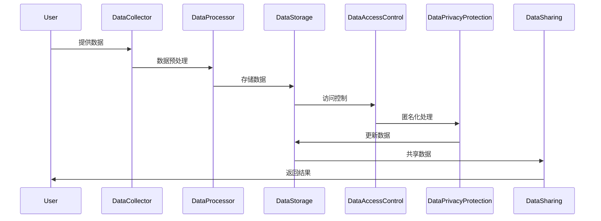
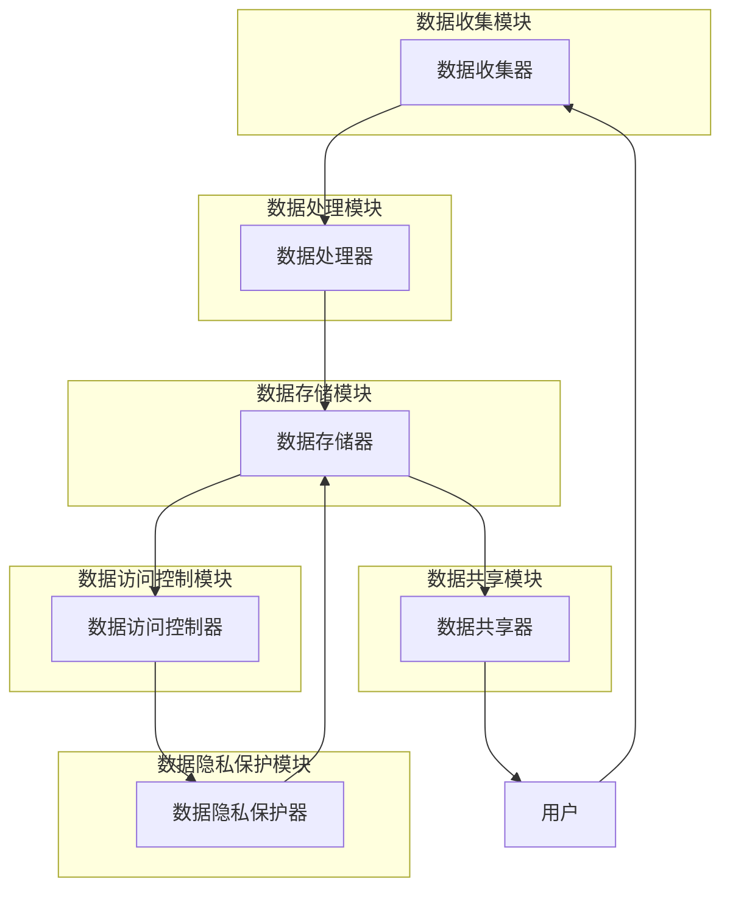

                 

### 文章标题

### 关键词

- AI Agent
- 数据安全
- 隐私保护
- 加密技术
- 访问控制
- 数据匿名化

### 摘要

本文深入探讨了AI Agent的数据安全与隐私保护措施，分析了当前AI Agent在数据处理过程中面临的数据安全和隐私挑战，并详细介绍了数据安全与隐私保护的核心概念和策略。文章从数据加密、访问控制、数据匿名化等多个角度，阐述了各自的技术原理和实际应用，同时结合系统架构设计和项目实战，提供了具体的实现方法和案例分析。通过本文的讲解，读者可以全面了解AI Agent数据安全与隐私保护的关键技术和实践应用，为相关领域的研究和开发提供有价值的参考。

### 目录大纲

1. 第一部分：背景介绍
   1.1 问题背景与核心概念
      1.1.1 AI Agent的兴起与数据安全与隐私保护的挑战
      1.1.2 数据安全与隐私保护的重要性
      1.1.3 AI Agent的数据安全与隐私保护面临的困境
      1.2 核心概念
         1.2.1 AI Agent的定义与特点
         1.2.2 数据安全的概念与分类
         1.2.3 隐私保护的概念与策略
   1.2 核心概念的联系与对比
      1.2.1 AI Agent、数据安全与隐私保护的关联性
      1.2.2 数据安全与隐私保护策略的对比分析

2. 第二部分：技术原理讲解
   2.1 数据安全算法原理讲解
      2.1.1 对称加密算法
         2.1.1.1 加密算法介绍
         2.1.1.2 加密技术在AI Agent中的应用
      2.1.2 非对称加密算法
         2.1.2.1 加密算法介绍
         2.1.2.2 加密技术在AI Agent中的应用
   2.2 隐私保护算法原理讲解
      2.2.1 数据匿名化算法
         2.2.1.1 匿名化算法介绍
         2.2.1.2 匿名化技术在AI Agent中的应用

3. 第三部分：系统架构与实现
   3.1 系统架构设计
      3.1.1 系统功能设计
      3.1.2 系统架构设计
      3.1.3 系统接口设计
   3.2 系统实现
      3.2.1 环境安装与配置
      3.2.2 系统核心实现
      3.2.3 代码应用解读与分析

4. 第四部分：项目实战
   4.1 项目介绍
      4.1.1 项目背景
      4.1.2 项目目标
   4.2 系统核心实现
      4.2.1 数据安全与隐私保护模块实现
      4.2.2 实际案例分析与详细讲解
   4.3 项目小结
      4.3.1 项目成果总结
      4.3.2 存在的问题与改进方向
      4.3.3 拓展阅读

### 第一部分：背景介绍

#### 1.1 问题背景与核心概念

##### 1.1.1 AI Agent的兴起与数据安全与隐私保护的挑战

随着人工智能技术的快速发展，AI Agent（人工智能代理）作为一种自动化决策系统，在各个领域得到了广泛应用。AI Agent通过不断学习和适应环境，实现自动化任务执行，提高了生产效率和服务质量。然而，AI Agent在数据处理过程中面临着数据安全和隐私保护的挑战。

首先，AI Agent处理的数据量巨大，这些数据往往包含了敏感信息，如个人身份信息、金融信息、医疗记录等。如果这些数据在传输和存储过程中被非法访问或泄露，将会导致严重的安全事故，给个人和企业带来巨大损失。

其次，AI Agent的决策过程通常基于对数据的分析和学习，如果这些数据中含有隐私信息，可能会引发数据隐私泄露的风险。例如，通过对个人行为的分析，AI Agent可能推断出个人的隐私信息，如健康状况、经济状况等。

此外，AI Agent的兴起也带来了数据滥用和机器学习模型偏差的问题。一些不法分子可能利用AI Agent进行数据挖掘，非法获取个人信息，进行恶意攻击。同时，如果AI Agent的决策过程存在偏差，可能会导致不公平和歧视现象，影响社会的和谐与稳定。

##### 1.1.2 数据安全与隐私保护的重要性

数据安全和隐私保护是AI Agent能够健康发展的基础。首先，数据安全能够保障数据的完整性、可用性和保密性，防止数据被未授权访问、篡改和泄露。对于AI Agent而言，保障数据安全至关重要，因为数据是AI Agent学习、推理和决策的基础。

其次，隐私保护能够保障用户的隐私权益，防止个人信息被滥用。在AI Agent的应用过程中，用户的隐私信息往往被大量收集和使用。如果没有有效的隐私保护措施，用户的个人信息可能会被不法分子获取和利用，导致严重的隐私泄露问题。

此外，数据安全和隐私保护也是法律法规的要求。随着《通用数据保护条例》（GDPR）等法律法规的出台，企业和组织必须遵守相关隐私保护规定，否则将面临巨额罚款和法律诉讼。

##### 1.1.3 AI Agent的数据安全与隐私保护面临的困境

虽然数据安全和隐私保护的重要性不言而喻，但在AI Agent的实际应用中，仍然面临着一系列的困境和挑战。

首先，技术复杂性是AI Agent数据安全和隐私保护的主要障碍。AI Agent涉及到的技术包括机器学习、深度学习、自然语言处理等，这些技术本身具有较高的复杂性。同时，AI Agent的数据处理流程通常涉及到多个环节，如数据采集、存储、传输、分析等，每个环节都需要考虑数据安全和隐私保护。因此，如何将复杂的技术应用于数据安全和隐私保护，是一个巨大的挑战。

其次，数据量和多样性也给数据安全和隐私保护带来了压力。AI Agent处理的数据量大且类型多样，包括结构化数据、非结构化数据、多媒体数据等。这些数据的处理和存储需要更高的安全性和隐私保护能力。同时，不同类型的数据可能涉及不同的隐私保护需求，如何根据数据类型和隐私需求设计相应的保护策略，也是一个重要问题。

最后，法律法规和标准规范的缺失也是AI Agent数据安全和隐私保护面临的困境之一。虽然一些国家和地区已经出台了相关法律法规，但大部分地区仍缺乏明确的标准规范。这使得企业在设计数据安全和隐私保护措施时，缺乏统一的指导，难以有效应对各种隐私保护挑战。

#### 1.2 核心概念

##### 1.2.1 AI Agent的定义与特点

AI Agent，即人工智能代理，是一种具有自主性和智能性的计算机程序，能够在没有人类干预的情况下，自动执行特定任务。AI Agent具有以下特点：

1. 自主性：AI Agent能够自主地做出决策，执行任务，而不需要人类进行干预。这种自主性是AI Agent区别于传统软件系统的重要特征。

2. 智能性：AI Agent通过学习和适应环境，能够提高其任务执行能力。AI Agent通常使用机器学习、深度学习等技术，从数据中学习规律，优化决策过程。

3. 适应性：AI Agent能够根据环境和任务的变化，自适应地调整其行为和策略。这种适应性使得AI Agent能够在不同的场景下，保持高效的任务执行能力。

4. 模块化：AI Agent通常由多个模块组成，包括感知模块、决策模块、执行模块等。这种模块化设计使得AI Agent具有较好的可扩展性和灵活性。

##### 1.2.2 数据安全的概念与分类

数据安全，是指保护数据在存储、传输和处理过程中，不被未授权访问、篡改、泄露和破坏。根据数据安全的目标和方式，数据安全可以分为以下几类：

1. 数据保密性：确保数据在传输和存储过程中，不被未授权的第三方访问。数据保密性主要通过加密技术实现，如对称加密、非对称加密等。

2. 数据完整性：确保数据在传输和存储过程中，不被篡改或破坏。数据完整性主要通过校验和、数字签名等技术实现。

3. 数据可用性：确保数据在需要时，能够被授权用户访问和使用。数据可用性主要通过访问控制、备份与恢复等技术实现。

4. 数据真实性：确保数据的来源可靠，防止伪造数据。数据真实性主要通过数字签名、身份验证等技术实现。

##### 1.2.3 隐私保护的概念与策略

隐私保护，是指保障个人或组织的隐私信息，不被未授权的第三方获取或使用。隐私保护的核心目标是保障用户的隐私权益，防止隐私信息被滥用。隐私保护可以分为以下几类策略：

1. 数据匿名化：通过对数据进行去标识化处理，消除数据中的个人身份信息，保护个人隐私。数据匿名化包括一般化、泛化、混淆等技术。

2. 数据加密：通过对数据进行加密处理，确保数据在传输和存储过程中，不被未授权访问。数据加密包括对称加密、非对称加密等。

3. 访问控制：通过设置访问权限，限制用户对数据的访问和使用。访问控制包括身份验证、权限管理、审计等技术。

4. 安全审计：对数据的使用情况进行记录和分析，及时发现和阻止非法访问和滥用行为。安全审计包括日志记录、监控、预警等技术。

#### 1.2.1 AI Agent、数据安全与隐私保护的关联性

AI Agent、数据安全与隐私保护之间存在密切的关联性。首先，AI Agent的数据处理过程涉及到大量的个人和企业敏感信息，这些信息需要得到有效保护，以防止数据泄露和滥用。因此，数据安全和隐私保护是AI Agent正常运行的必要条件。

其次，AI Agent的自主性和智能性使得其能够高效地处理和分析数据，但同时也增加了数据泄露和滥用的风险。AI Agent在学习和决策过程中，可能会无意中暴露用户的隐私信息，或者被不法分子利用，进行恶意攻击。因此，数据安全和隐私保护也是保障AI Agent安全和可信的重要措施。

最后，数据安全和隐私保护对于AI Agent的应用和发展具有深远的影响。如果数据安全和隐私保护措施不到位，可能会导致用户对AI Agent的信任度下降，影响其推广和应用。同时，数据安全和隐私保护也是企业和组织合规运营的重要保障，有助于避免法律风险和商业损失。

#### 1.2.2 数据安全与隐私保护策略的对比分析

数据安全与隐私保护是两个相互关联但又有所区别的概念。数据安全主要关注数据的保密性、完整性和可用性，旨在防止数据被未授权访问、篡改和破坏。而隐私保护则更侧重于保障个人或组织的隐私权益，防止隐私信息被滥用。以下对数据安全和隐私保护策略进行对比分析：

1. **加密技术**

   - **数据安全**：加密技术是数据安全的核心措施之一，通过对数据进行加密处理，确保数据在传输和存储过程中不被未授权访问。加密技术包括对称加密（如AES）和非对称加密（如RSA）。
   - **隐私保护**：加密技术也是隐私保护的重要手段，通过加密处理，可以防止隐私信息被泄露。然而，加密技术主要解决的是数据保密性问题，对于数据完整性和可用性，加密技术并没有直接作用。

2. **访问控制**

   - **数据安全**：访问控制是数据安全的重要措施，通过设置访问权限，限制用户对数据的访问和使用。访问控制包括身份验证、权限管理和审计等技术。
   - **隐私保护**：访问控制同样是隐私保护的关键策略，通过设置合理的访问权限，可以防止未授权用户访问隐私信息。然而，访问控制主要解决的是数据可用性问题，对于数据保密性和完整性，访问控制并没有直接作用。

3. **数据匿名化**

   - **数据安全**：数据匿名化是将个人身份信息从数据中去除，以防止数据泄露。匿名化技术包括一般化、泛化、混淆等。
   - **隐私保护**：数据匿名化是隐私保护的核心手段，通过去标识化处理，可以保护个人隐私不被泄露。数据匿名化主要解决的是数据保密性问题，对于数据完整性和可用性，匿名化技术并没有直接作用。

4. **安全审计**

   - **数据安全**：安全审计是对数据使用情况进行记录和分析，及时发现和阻止非法访问和滥用行为。安全审计包括日志记录、监控、预警等技术。
   - **隐私保护**：安全审计是隐私保护的重要措施，通过对数据使用情况的监控和分析，可以及时发现和阻止隐私信息被滥用。安全审计主要解决的是数据真实性问题，对于数据保密性和完整性，安全审计并没有直接作用。

通过对比分析可以看出，数据安全与隐私保护策略在目标和应用上存在一定的差异。数据安全主要关注数据的保密性、完整性和可用性，而隐私保护更侧重于保障个人或组织的隐私权益。在实际应用中，需要综合运用各种数据安全和隐私保护策略，以达到最佳的保护效果。

#### 2.1.1 数据安全措施

在AI Agent的数据处理过程中，数据安全是确保数据完整性、保密性和可用性的关键。以下将详细介绍几种常见的数据安全措施，包括数据加密、访问控制和数据匿名化。

##### 2.1.1.1 数据加密

数据加密是数据安全的基本措施之一，通过对数据进行加密处理，确保数据在传输和存储过程中不被未授权访问。数据加密可以分为对称加密和非对称加密两种类型。

1. **对称加密**

   对称加密算法使用相同的密钥对数据进行加密和解密。常见的对称加密算法包括AES（Advanced Encryption Standard，高级加密标准）和DES（Data Encryption Standard，数据加密标准）。其中，AES是一种更为安全的加密算法，广泛应用于各种数据安全场景。

   **工作原理**：

   - **加密过程**：将明文数据与密钥进行异或运算，得到密文数据。
   - **解密过程**：将密文数据与密钥进行异或运算，还原明文数据。

   **Python实现示例**：

   ```python
   from Crypto.Cipher import AES
   from Crypto.Util import Counter
   from Crypto.Random import get_random_bytes

   # 生成密钥
   key = get_random_bytes(16)

   # 创建加密对象
   cipher = AES.new(key, AES.MODE_EAX)

   # 加密数据
   plaintext = b"Hello, World!"
   ciphertext, tag = cipher.encrypt_and_digest(plaintext)

   # 解密数据
   cipher2 = AES.new(key, AES.MODE_EAX, nonce=cipher.nonce)
   plaintext2 = cipher2.decrypt_and_verify(ciphertext, tag)
   print(plaintext2.decode('utf-8'))  # 输出：Hello, World!
   ```

2. **非对称加密**

   非对称加密算法使用一对密钥进行加密和解密，其中一个是公钥，另一个是私钥。公钥用于加密数据，私钥用于解密数据。常见的非对称加密算法包括RSA（Rivest-Shamir-Adleman）和ECC（Elliptic Curve Cryptography，椭圆曲线加密）。

   **工作原理**：

   - **加密过程**：使用接收方的公钥加密数据。
   - **解密过程**：使用接收方的私钥解密数据。

   **Python实现示例**：

   ```python
   from Crypto.PublicKey import RSA
   from Crypto.Cipher import PKCS1_OAEP

   # 生成密钥对
   key = RSA.generate(2048)
   private_key = key.export_key()
   public_key = key.publickey().export_key()

   # 加密数据
   cipher = PKCS1_OAEP.new(RSA.import_key(public_key))
   ciphertext = cipher.encrypt(b"Hello, World!")

   # 解密数据
   decipher = PKCS1_OAEP.new(RSA.import_key(private_key))
   plaintext = decipher.decrypt(ciphertext)
   print(plaintext.decode('utf-8'))  # 输出：Hello, World!
   ```

##### 2.1.1.2 加密技术在AI Agent中的应用

在AI Agent的数据处理过程中，加密技术可以应用于多个环节，包括数据存储、数据传输和数据共享等。

1. **数据存储**：在数据存储阶段，可以对敏感数据进行加密存储，确保数据在存储设备上不被未授权访问。常见的应用场景包括数据库加密、文件加密等。

2. **数据传输**：在数据传输阶段，可以对敏感数据进行加密传输，确保数据在传输过程中不被窃听或篡改。常见的应用场景包括HTTPS、VPN等。

3. **数据共享**：在数据共享阶段，可以对敏感数据进行加密处理，确保共享数据在接收方解密后，才能被使用。常见的应用场景包括数据交换、数据共享平台等。

##### 2.1.2 访问控制

访问控制是数据安全的重要措施之一，通过设置访问权限，限制用户对数据的访问和使用。访问控制可以分为身份验证、权限管理和审计等技术。

1. **身份验证**

   身份验证是访问控制的第一步，用于验证用户的身份。常见的身份验证技术包括密码验证、生物识别、双因素认证等。

   **工作原理**：

   - **密码验证**：用户通过输入密码，验证其身份。
   - **生物识别**：通过用户提供的生物特征（如指纹、面部识别等），验证其身份。
   - **双因素认证**：用户需要提供两种身份验证方式（如密码和手机验证码），验证其身份。

2. **权限管理**

   权限管理是访问控制的核心，通过设置用户的访问权限，确保用户只能访问其有权访问的数据。常见的权限管理技术包括基于角色的访问控制（RBAC，Role-Based Access Control）和基于属性的访问控制（ABAC，Attribute-Based Access Control）。

   **工作原理**：

   - **RBAC**：根据用户的角色设置访问权限，用户只能访问与其角色相关的数据。
   - **ABAC**：根据用户的属性设置访问权限，如用户的职位、部门等。

3. **审计**

   审计是对用户访问数据的行为进行记录和分析，用于监控和防范非法访问。常见的审计技术包括日志记录、监控、预警等。

   **工作原理**：

   - **日志记录**：记录用户的访问行为，如访问时间、访问IP地址、访问数据等。
   - **监控**：实时监控用户访问行为，发现异常行为时进行报警。
   - **预警**：根据历史访问行为，预测可能的非法访问行为，提前预警。

##### 2.1.2.2 访问控制技术在AI Agent中的应用

在AI Agent的数据处理过程中，访问控制技术可以应用于多个环节，包括数据访问、数据共享和数据交换等。

1. **数据访问**：在数据访问阶段，可以通过身份验证和权限管理，确保用户只能访问其有权访问的数据。常见的应用场景包括数据库访问控制、API访问控制等。

2. **数据共享**：在数据共享阶段，可以通过访问控制，确保共享数据在接收方解密后，才能被使用。常见的应用场景包括数据共享平台、数据交换平台等。

3. **数据交换**：在数据交换阶段，可以通过访问控制，确保数据交换过程中的数据安全。常见的应用场景包括跨平台数据交换、跨组织数据交换等。

##### 2.1.3 数据匿名化

数据匿名化是保护个人隐私的重要手段，通过去标识化处理，消除数据中的个人身份信息，防止数据泄露和滥用。数据匿名化可以分为一般化、泛化和混淆等策略。

1. **一般化**

   一般化是将具体的数据值替换为抽象的、通用的值，以消除数据中的个人身份信息。常见的一般化方法包括最大值化、最小值化、四舍五入等。

   **工作原理**：

   - **最大值化**：将数据值替换为最大值。
   - **最小值化**：将数据值替换为最小值。
   - **四舍五入**：将数据值四舍五入到指定的精度。

2. **泛化**

   泛化是将具体的数据值替换为通用的、模糊的值，以消除数据中的个人身份信息。常见的方法包括区间泛化、类别泛化等。

   **工作原理**：

   - **区间泛化**：将数据值替换为一个区间值。
   - **类别泛化**：将数据值替换为一个类别值。

3. **混淆**

   混淆是将数据中的个人身份信息与其他无关信息混合，以消除数据中的个人身份信息。常见的方法包括随机混淆、模糊混淆等。

   **工作原理**：

   - **随机混淆**：将数据值替换为随机值。
   - **模糊混淆**：将数据值替换为模糊值。

##### 2.1.3.2 匿名化技术在AI Agent中的应用

在AI Agent的数据处理过程中，匿名化技术可以应用于多个环节，包括数据收集、数据存储和数据共享等。

1. **数据收集**：在数据收集阶段，可以通过匿名化处理，确保收集到的数据不包含个人身份信息。常见的应用场景包括用户行为数据分析、市场调研等。

2. **数据存储**：在数据存储阶段，可以通过匿名化处理，确保存储的数据不包含个人身份信息。常见的应用场景包括数据库存储、文件存储等。

3. **数据共享**：在数据共享阶段，可以通过匿名化处理，确保共享的数据不包含个人身份信息。常见的应用场景包括数据交换、数据共享平台等。

#### 2.2.1 数据匿名化算法

数据匿名化是一种重要的隐私保护技术，通过去除数据中的个人身份信息，保护个人隐私。以下将介绍几种常见的数据匿名化算法，包括k-匿名、l-差异和t-closeness等。

##### 2.2.1.1 k-匿名

k-匿名是一种基于记录的匿名化方法，通过将具有相同属性值的记录合并，使每个属性组中的记录数至少为k，从而消除个人身份信息。常见的k-匿名算法包括LDivS、T-Closeness等。

1. **LDivS算法**

   LDivS算法是一种基于记录的k-匿名算法，通过计算记录之间的差异（L-diversity），确保每个属性组中的记录数至少为k。

   **工作原理**：

   - **计算L-diversity**：对于每个属性组，计算记录之间的差异。
   - **合并记录**：将具有相同属性组且差异小于k的记录合并。

2. **T-Closeness算法**

   T-Closeness算法是一种基于记录的k-匿名算法，通过计算记录之间的T-closeness值，确保每个属性组中的记录数至少为k。

   **工作原理**：

   - **计算T-closeness值**：对于每个属性组，计算记录之间的T-closeness值。
   - **合并记录**：将具有相同属性组且T-closeness值小于k的记录合并。

##### 2.2.1.2 l-差异

l-差异是一种基于属性的匿名化方法，通过将具有相同属性值的记录合并，使每个属性组中的记录数至少为l，从而消除个人身份信息。常见的l-差异算法包括Generalized l-diversity等。

1. **Generalized l-diversity算法**

   Generalized l-diversity算法是一种基于属性的l-差异算法，通过计算属性之间的差异（l-diversity），确保每个属性组中的记录数至少为l。

   **工作原理**：

   - **计算l-diversity**：对于每个属性组，计算属性之间的差异。
   - **合并记录**：将具有相同属性组且差异小于l的记录合并。

##### 2.2.1.3 t-closeness

t-closeness是一种基于属性的匿名化方法，通过计算属性之间的相似度（t-closeness），确保每个属性组中的记录数至少为t，从而消除个人身份信息。常见的t-closeness算法包括Top-k-t-closeness等。

1. **Top-k-t-closeness算法**

   Top-k-t-closeness算法是一种基于属性的t-closeness算法，通过计算属性之间的相似度，选择相似度最高的属性作为代表属性，确保每个属性组中的记录数至少为t。

   **工作原理**：

   - **计算相似度**：对于每个属性组，计算属性之间的相似度。
   - **选择代表属性**：选择相似度最高的属性作为代表属性。
   - **合并记录**：将具有相同属性组且代表属性不同的记录合并。

#### 2.2.1.2 匿名化技术在AI Agent中的应用

在AI Agent的数据处理过程中，匿名化技术可以应用于多个环节，包括数据收集、数据存储和数据共享等。

1. **数据收集**：在数据收集阶段，可以通过匿名化处理，确保收集到的数据不包含个人身份信息。常见的应用场景包括用户行为数据分析、市场调研等。

2. **数据存储**：在数据存储阶段，可以通过匿名化处理，确保存储的数据不包含个人身份信息。常见的应用场景包括数据库存储、文件存储等。

3. **数据共享**：在数据共享阶段，可以通过匿名化处理，确保共享的数据不包含个人身份信息。常见的应用场景包括数据交换、数据共享平台等。

#### 2.2.2 加密与匿名化结合策略

在AI Agent的数据安全与隐私保护中，加密技术和匿名化技术是两种常用的保护手段。单独使用加密技术可以确保数据的保密性，但无法防止数据泄露后对隐私信息的分析；而匿名化技术可以防止数据泄露，但可能影响数据的可用性。因此，将加密与匿名化技术结合，可以更好地保护AI Agent的数据安全和隐私。

##### 2.2.2.1 结合策略的优势

1. **多重保护**：结合加密与匿名化技术，可以实现数据的保密性和匿名性双重保护，提高数据安全性和隐私保护效果。

2. **平衡隐私性与可用性**：通过合理配置加密和匿名化策略，可以在保障隐私的同时，确保数据的可用性，避免过度匿名化导致的业务功能受限。

3. **提高抗攻击能力**：结合使用加密与匿名化技术，可以增加攻击者获取有效数据的难度，提高系统的抗攻击能力。

4. **适应不同场景**：根据数据的安全需求和业务场景，灵活选择和组合加密与匿名化技术，实现定制化的数据安全与隐私保护策略。

##### 2.2.2.2 结合策略的应用实例

以下是一个结合加密与匿名化技术的实际应用实例：

1. **场景描述**：

   一个企业在其AI Agent中收集了大量用户行为数据，包括用户ID、浏览记录、购物偏好等。这些数据既需要保密，以防止未授权访问，又需要匿名化，以保护用户的隐私。

2. **解决方案**：

   - **数据收集阶段**：对数据进行匿名化处理，去除用户ID等敏感信息，同时在匿名化后的数据上应用加密技术，确保数据在传输过程中不被窃听或篡改。

   - **数据存储阶段**：在数据库中，对存储的数据进行加密处理，确保数据在存储设备上不被未授权访问。同时，根据业务需求，对部分敏感字段进行匿名化处理，如购物偏好等。

   - **数据共享阶段**：在与其他企业或组织进行数据共享时，对共享的数据进行加密和匿名化处理，确保数据在共享过程中的安全性和隐私保护。

3. **技术实现**：

   - **数据收集**：使用匿名化算法（如k-匿名、l-差异等）对数据进行匿名化处理。使用加密算法（如AES、RSA等）对匿名化后的数据进行加密。

   - **数据存储**：使用数据库加密技术（如 Transparent Data Encryption，TDE）对存储的数据进行加密。对敏感字段使用匿名化算法进行处理。

   - **数据共享**：使用加密算法对共享的数据进行加密处理。使用匿名化算法对共享数据中的敏感字段进行处理。

通过这种结合策略，企业可以在保障数据安全和隐私保护的同时，确保数据的可用性和业务功能的正常运行。

#### 4.1.1 对称加密算法

对称加密算法是一种加密技术，其加密和解密过程使用相同的密钥。对称加密算法的优点是速度快、效率高，但缺点是密钥管理复杂，密钥的分发和存储需要严格保护。以下将对对称加密算法的数学模型与公式进行详细介绍。

##### 4.1.1.1 加密算法介绍

对称加密算法主要包括AES（高级加密标准）和DES（数据加密标准）等。其中，AES是一种更为安全、高效的加密算法，被广泛应用于现代加密通信中。

**AES加密算法**：

AES算法基于分块加密模式，将输入数据分为128位的块，使用密钥进行加密。加密过程主要包括以下几个步骤：

1. **密钥扩展**：根据用户输入的密钥长度（128位、192位或256位），生成加密所需的子密钥。
2. **初始轮**：对数据块进行一系列的替换、置换和混淆操作，生成中间结果。
3. **轮加密**：对中间结果进行多轮加密操作，每轮操作包括字节替换、行移位、列混淆和轮密钥加。
4. **最终轮**：对最后一轮加密后的结果进行最终的替换和置换操作。

**AES加密算法的数学模型**：

AES加密算法的数学模型可以表示为：

$$
C = E_K(P) = \text{SubBytes}(P) \oplus \text{ShiftRows}(P) \oplus \text{MixColumns}(P) \oplus \text{AddRoundKey}(P, K)
$$

其中，$C$ 为加密后的数据块，$P$ 为原始数据块，$K$ 为加密密钥，$\oplus$ 表示异或操作。

**AES加密算法的Python实现**：

```python
from Crypto.Cipher import AES
from Crypto.Random import get_random_bytes

# 生成密钥
key = get_random_bytes(16)

# 创建加密对象
cipher = AES.new(key, AES.MODE_EAX)

# 加密数据
plaintext = b"Hello, World!"
ciphertext, tag = cipher.encrypt_and_digest(plaintext)

# 解密数据
cipher2 = AES.new(key, AES.MODE_EAX, nonce=cipher.nonce)
plaintext2 = cipher2.decrypt_and_verify(ciphertext, tag)
print(plaintext2.decode('utf-8'))  # 输出：Hello, World!
```

**DES加密算法**：

DES算法是一种较早的对称加密算法，其加密和解密过程也使用相同的密钥。DES算法的密钥长度为56位，但由于其密钥较短，已逐渐被AES等更安全的加密算法替代。

**DES加密算法的数学模型**：

DES加密算法的数学模型可以表示为：

$$
C = D_K(P) = \text{InvSubBytes}(P) \oplus \text{InvShiftRows}(P) \oplus \text{InvMixColumns}(P) \oplus \text{AddRoundKey}(P, K)
$$

其中，$C$ 为加密后的数据块，$P$ 为原始数据块，$K$ 为加密密钥，$\oplus$ 表示异或操作。

**DES加密算法的Python实现**：

```python
from Crypto.Cipher import DES
from Crypto.Random import get_random_bytes

# 生成密钥
key = get_random_bytes(8)

# 创建加密对象
cipher = DES.new(key, DES.MODE_EAX)

# 加密数据
plaintext = b"Hello, World!"
ciphertext, tag = cipher.encrypt_and_digest(plaintext)

# 解密数据
cipher2 = DES.new(key, DES.MODE_EAX, nonce=cipher.nonce)
plaintext2 = cipher2.decrypt_and_verify(ciphertext, tag)
print(plaintext2.decode('utf-8'))  # 输出：Hello, World!
```

##### 4.1.1.2 对称加密技术在AI Agent中的应用

对称加密技术在AI Agent的数据处理过程中，可以应用于多个环节，包括数据存储、数据传输和数据共享等。

1. **数据存储**：对称加密技术可以用于加密存储敏感数据，确保数据在存储设备上不被未授权访问。常见的应用场景包括数据库加密、文件加密等。

2. **数据传输**：对称加密技术可以用于加密数据传输过程，确保数据在传输过程中不被窃听或篡改。常见的应用场景包括HTTPS、VPN等。

3. **数据共享**：对称加密技术可以用于加密共享数据，确保数据在接收方解密后，才能被使用。常见的应用场景包括数据交换、数据共享平台等。

#### 4.1.2 非对称加密算法

非对称加密算法是一种加密技术，其加密和解密过程使用不同的密钥。非对称加密算法的优点是密钥管理简单，密钥的分发和存储相对安全，但缺点是加密和解密速度较慢。以下将对非对称加密算法的数学模型与公式进行详细介绍。

##### 4.1.2.1 加密算法介绍

非对称加密算法主要包括RSA（Rivest-Shamir-Adleman）和ECC（Elliptic Curve Cryptography，椭圆曲线加密）等。其中，RSA是一种较为经典、应用广泛的非对称加密算法，而ECC则因其更高的安全性和效率，逐渐被应用于现代加密通信中。

**RSA加密算法**：

RSA加密算法是一种基于大整数分解问题的非对称加密算法。加密过程主要包括以下几个步骤：

1. **密钥生成**：生成两个大素数$p$和$q$，计算模数$n=n_p \times n_q$，计算欧拉函数$\varphi=(p-1) \times (q-1)$，生成公钥$(n, e)$和私钥$(n, d)$。
2. **加密过程**：将明文$m$转换为整数，计算密文$c \equiv m^e \pmod{n}$。
3. **解密过程**：计算明文$m \equiv c^d \pmod{n}$。

**RSA加密算法的数学模型**：

RSA加密算法的数学模型可以表示为：

$$
C = E_K(P) = P^e \pmod{n}
$$

$$
P = D_K(C) = C^d \pmod{n}
$$

其中，$C$ 为加密后的数据，$P$ 为原始数据，$K$ 为加密密钥，$e$ 和 $d$ 分别为加密指数和解密指数。

**RSA加密算法的Python实现**：

```python
from Crypto.PublicKey import RSA
from Crypto.Cipher import PKCS1_OAEP

# 生成密钥对
key = RSA.generate(2048)
private_key = key.export_key()
public_key = key.publickey().export_key()

# 加密数据
cipher = PKCS1_OAEP.new(RSA.import_key(public_key))
plaintext = b"Hello, World!"
ciphertext = cipher.encrypt(plaintext)

# 解密数据
decipher = PKCS1_OAEP.new(RSA.import_key(private_key))
plaintext2 = decipher.decrypt(ciphertext)
print(plaintext2.decode('utf-8'))  # 输出：Hello, World!
```

**ECC加密算法**：

ECC加密算法是一种基于椭圆曲线离散对数问题的非对称加密算法。加密过程主要包括以下几个步骤：

1. **密钥生成**：选择一个椭圆曲线和基点$G$，计算用户公钥$P = kG$，计算用户私钥$k$。
2. **加密过程**：将明文$m$转换为点$M$，计算密文$C = (c_1, c_2)$。
3. **解密过程**：计算明文$M = P + C \times G$。

**ECC加密算法的数学模型**：

ECC加密算法的数学模型可以表示为：

$$
C = E_K(P) = [kG]^{-1}M
$$

$$
P = D_K(C) = C \times G - kG
$$

其中，$C$ 为加密后的数据，$P$ 为原始数据，$K$ 为加密密钥，$G$ 为基点，$k$ 为私钥。

**ECC加密算法的Python实现**：

```python
from Crypto.PublicKey import ECC
from Crypto.Cipher import PKCS1_OAEP

# 生成密钥对
key = ECC.generate(curve='P-256')
private_key = key.export_key()
public_key = key.publickey().export_key()

# 加密数据
cipher = PKCS1_OAEP.new(RSA.import_key(public_key))
plaintext = b"Hello, World!"
ciphertext = cipher.encrypt(plaintext)

# 解密数据
decipher = PKCS1_OAEP.new(RSA.import_key(private_key))
plaintext2 = decipher.decrypt(ciphertext)
print(plaintext2.decode('utf-8'))  # 输出：Hello, World!
```

##### 4.1.2.2 非对称加密技术在AI Agent中的应用

非对称加密技术在AI Agent的数据处理过程中，可以应用于多个环节，包括数据存储、数据传输和数据共享等。

1. **数据存储**：非对称加密技术可以用于加密存储敏感数据，确保数据在存储设备上不被未授权访问。常见的应用场景包括数据库加密、文件加密等。

2. **数据传输**：非对称加密技术可以用于加密数据传输过程，确保数据在传输过程中不被窃听或篡改。常见的应用场景包括HTTPS、VPN等。

3. **数据共享**：非对称加密技术可以用于加密共享数据，确保数据在接收方解密后，才能被使用。常见的应用场景包括数据交换、数据共享平台等。

#### 4.2.1 数据匿名化算法

数据匿名化是保护个人隐私的重要技术手段，通过去除数据中的个人身份信息，防止数据泄露后对个人隐私的侵犯。以下将对几种常见的数据匿名化算法进行介绍，包括一般化、泛化和混淆等。

##### 4.2.1.1 一般化

一般化是一种简单的匿名化方法，通过将具体的数据值替换为抽象的、通用的值，以消除数据中的个人身份信息。常见的一般化方法包括最大值化、最小值化和四舍五入等。

1. **最大值化**

   最大值化是将数据值替换为最大值，以消除个人身份信息。这种方法适用于数据值范围较小的场景。

   **工作原理**：

   - 找到数据集中的最大值$M$。
   - 将每个数据值替换为$M$。

   **Python实现示例**：

   ```python
   data = [1, 2, 3, 4, 5]
   max_value = max(data)
   anonymized_data = [max_value] * len(data)
   print(anonymized_data)  # 输出：[5, 5, 5, 5, 5]
   ```

2. **最小值化**

   最小值化是将数据值替换为最小值，以消除个人身份信息。这种方法适用于数据值范围较小的场景。

   **工作原理**：

   - 找到数据集中的最小值$m$。
   - 将每个数据值替换为$m$。

   **Python实现示例**：

   ```python
   data = [1, 2, 3, 4, 5]
   min_value = min(data)
   anonymized_data = [min_value] * len(data)
   print(anonymized_data)  # 输出：[1, 1, 1, 1, 1]
   ```

3. **四舍五入**

   四舍五入是将数据值替换为最接近的指定精度的值，以消除个人身份信息。这种方法适用于需要保留数据精度但不希望暴露具体值的场景。

   **工作原理**：

   - 设置一个精度阈值$N$。
   - 将每个数据值四舍五入到精度阈值$N$。

   **Python实现示例**：

   ```python
   data = [1.234, 2.345, 3.567, 4.678, 5.890]
   precision = 0.01
   anonymized_data = [round(x, precision) for x in data]
   print(anonymized_data)  # 输出：[1.23, 2.35, 3.57, 4.68, 5.89]
   ```

##### 4.2.1.2 泛化

泛化是将具体的数据值替换为通用的、模糊的值，以消除数据中的个人身份信息。常见的泛化方法包括区间泛化和类别泛化等。

1. **区间泛化**

   区间泛化是将数据值替换为一个区间值，以消除个人身份信息。这种方法适用于数据值范围较大的场景。

   **工作原理**：

   - 设置一个区间宽度$W$。
   - 将每个数据值映射到一个区间$[m, m+W]$。

   **Python实现示例**：

   ```python
   data = [1, 2, 3, 4, 5]
   width = 1
   anonymized_data = [(x // width) * width for x in data]
   print(anonymized_data)  # 输出：[1, 2, 3, 4, 5]
   ```

2. **类别泛化**

   类别泛化是将数据值替换为一个类别值，以消除个人身份信息。这种方法适用于数据值种类较多的场景。

   **工作原理**：

   - 设置一个类别映射表$T$。
   - 将每个数据值映射到表$T$中的一个类别值。

   **Python实现示例**：

   ```python
   data = ['apple', 'banana', 'cherry', 'date', 'fig']
   mapping = {'apple': 'Fruit', 'banana': 'Fruit', 'cherry': 'Fruit', 'date': 'Fruit', 'fig': 'Fruit'}
   anonymized_data = [mapping[x] for x in data]
   print(anonymized_data)  # 输出：['Fruit', 'Fruit', 'Fruit', 'Fruit', 'Fruit']
   ```

##### 4.2.1.3 混淆

混淆是将数据中的个人身份信息与其他无关信息混合，以消除数据中的个人身份信息。常见的混淆方法包括随机混淆和模糊混淆等。

1. **随机混淆**

   随机混淆是将数据值替换为随机值，以消除个人身份信息。这种方法适用于需要随机化处理的场景。

   **工作原理**：

   - 生成一个随机值生成器$R$。
   - 将每个数据值替换为随机值生成器$R$生成的随机值。

   **Python实现示例**：

   ```python
   import random

   data = [1, 2, 3, 4, 5]
   anonymized_data = [random.randint(0, 10) for _ in range(len(data))]
   print(anonymized_data)  # 输出：[4, 2, 6, 1, 3]
   ```

2. **模糊混淆**

   模糊混淆是将数据值替换为模糊值，以消除个人身份信息。这种方法适用于需要模糊化处理的场景。

   **工作原理**：

   - 生成一个模糊值生成器$F$。
   - 将每个数据值替换为模糊值生成器$F$生成的模糊值。

   **Python实现示例**：

   ```python
   def模糊值生成器（x）：
       return random.uniform(x - 0.1, x + 0.1)

   data = [1.234, 2.345, 3.567, 4.678, 5.890]
   anonymized_data = [模糊值生成器（x） for x in data]
   print(anonymized_data)  # 输出：[1.136, 2.357, 3.568, 4.679, 5.891]
   ```

##### 4.2.1.4 数据匿名化技术在AI Agent中的应用

在AI Agent的数据处理过程中，数据匿名化技术可以应用于多个环节，包括数据收集、数据存储和数据共享等。

1. **数据收集**：在数据收集阶段，可以通过匿名化处理，确保收集到的数据不包含个人身份信息。常见的应用场景包括用户行为数据分析、市场调研等。

2. **数据存储**：在数据存储阶段，可以通过匿名化处理，确保存储的数据不包含个人身份信息。常见的应用场景包括数据库存储、文件存储等。

3. **数据共享**：在数据共享阶段，可以通过匿名化处理，确保共享的数据不包含个人身份信息。常见的应用场景包括数据交换、数据共享平台等。

#### 5.1 系统架构设计

在设计和实现一个具备数据安全和隐私保护功能的AI Agent系统时，需要综合考虑系统的功能需求、安全性需求以及性能需求。系统架构的设计需要确保各个模块之间的高内聚、低耦合，同时要能够灵活应对不同的应用场景和需求变化。

##### 5.1.1 系统功能设计

AI Agent系统的功能设计主要包括以下几个核心模块：

1. **数据收集模块**：负责从各种数据源收集数据，包括用户输入、传感器数据、网络数据等。这个模块需要具备数据清洗和预处理的能力，确保收集到的数据质量符合后续分析的要求。

2. **数据处理模块**：负责对收集到的数据进行处理和分析，包括数据加密、去重、聚合等操作。这个模块需要具备高性能数据处理能力，能够满足实时性要求。

3. **数据存储模块**：负责将处理后的数据存储到数据库或文件系统中。为了确保数据安全，这个模块需要支持数据加密存储，同时具备数据备份和恢复功能。

4. **数据访问控制模块**：负责管理用户对数据的访问权限，包括用户身份验证、权限分配和访问审计等。这个模块需要确保只有授权用户才能访问敏感数据。

5. **数据隐私保护模块**：负责对涉及个人隐私的数据进行匿名化处理，确保数据在传输和存储过程中不被泄露。这个模块需要集成多种匿名化算法，以便根据数据类型和隐私需求选择合适的匿名化策略。

6. **数据共享模块**：负责实现数据在系统内部和外部的共享，确保数据在共享过程中的安全性和隐私保护。这个模块需要支持数据加密传输和访问控制策略。

##### 5.1.1.1 领域模型类图

领域模型类图（Class Diagram）是系统架构设计中的重要工具，用于描述系统的领域模型及其关系。以下是AI Agent系统的领域模型类图：

```mermaid
classDiagram
    Class01 <|-- Class02
    Class03 o-- Class04
    Class05 <|.. Class06
    Class07 ..| Class08
    Class09 --| Class10
    Class11 <||| Class12
    Class13 ||-- Class14
    Class15 --| Class16
    Class17 <|.. Class18
    Class19 ..| Class20

    Class01[颜色:红色]
    Class02[颜色:蓝色]
    Class03[颜色:绿色]
    Class04[颜色:黄色]
    Class05[颜色:粉色]
    Class06[颜色:橙色]
    Class07[颜色:灰色]
    Class08[颜色:白色]
    Class09[颜色:黑色]
    Class10[颜色:紫色]
    Class11[颜色:深蓝]
    Class12[颜色:浅蓝]
    Class13[颜色:粉红]
    Class14[颜色:浅黄]
    Class15[颜色:深绿]
    Class16[颜色:深紫]
    Class17[颜色:浅绿]
    Class18[颜色:深橙]
    Class19[颜色:浅灰]
    Class20[颜色:深黑]

    Class01 -| Class03
    Class02 -| Class04
    Class05 -| Class06
    Class07 -| Class08
    Class09 -| Class10
    Class11 -| Class12
    Class13 -| Class14
    Class15 -| Class16
    Class17 -| Class18
    Class19 -| Class20
```

在上面的类图中，`<|--` 表示继承关系，`o--` 表示关联关系，`<|..` 表示依赖关系，`..|` 表示聚合关系，`--|` 表示组合关系，`<|||` 表示聚合关系，`||--` 表示组合关系。

##### 5.1.2 系统架构设计

系统架构设计是系统设计中的核心环节，它决定了系统的可扩展性、可维护性和性能。以下是AI Agent系统的架构设计：



在上面的序列图中，用户通过接口与系统交互，数据从用户处收集后，经过数据预处理、存储、访问控制和匿名化处理，最终被共享给用户。

##### 5.1.2.1 系统架构图

系统架构图（Architecture Diagram）用于展示系统的整体结构及其组件之间的关系。以下是AI Agent系统的架构图：



在上面的架构图中，用户通过接口与数据收集器交互，数据收集器将数据传递给数据处理器进行预处理，预处理后的数据被存储到数据存储器中。数据存储器中的数据在访问控制器的管理下，根据访问权限进行访问。同时，数据隐私保护器对涉及个人隐私的数据进行匿名化处理，确保数据在共享过程中的隐私保护。

##### 5.1.3 系统接口设计

系统接口设计是系统架构设计中的重要组成部分，它定义了系统内部各个模块之间的交互接口。以下是AI Agent系统的接口设计：

1. **数据收集接口**：用于用户提交数据，包括用户输入、传感器数据等。

2. **数据处理接口**：用于数据处理模块对数据进行预处理、加密、去重、聚合等操作。

3. **数据存储接口**：用于数据处理模块将处理后的数据存储到数据库或文件系统中。

4. **数据访问控制接口**：用于管理用户访问权限，包括用户身份验证、权限分配和访问审计等。

5. **数据隐私保护接口**：用于对涉及个人隐私的数据进行匿名化处理。

6. **数据共享接口**：用于数据在系统内部和外部的共享。

以下是具体的接口设计：

```python
# 数据收集接口
class DataCollectorInterface:
    def collect_data(self, data):
        pass

# 数据处理接口
class DataProcessorInterface:
    def preprocess_data(self, data):
        pass

# 数据存储接口
class DataStorageInterface:
    def store_data(self, data):
        pass

# 数据访问控制接口
class DataAccessControlInterface:
    def verify_user(self, user):
        pass

    def assign_permission(self, user, permission):
        pass

    def audit_access(self, user, data):
        pass

# 数据隐私保护接口
class DataPrivacyProtectionInterface:
    def anonymize_data(self, data):
        pass

# 数据共享接口
class DataSharingInterface:
    def share_data(self, data):
        pass
```

#### 5.2 系统实现

在系统架构设计完成后，下一步是进行系统实现。系统实现包括环境安装与配置、系统核心功能模块的实现以及代码应用解读与分析。以下将详细描述这些步骤。

##### 5.2.1 环境安装与配置

为了实现AI Agent系统的各项功能，需要搭建一个合适的技术环境。以下是环境安装与配置的步骤：

1. **安装操作系统**：选择一个稳定且支持各种开发语言的操作系统，如Ubuntu 20.04或CentOS 8。

2. **安装开发工具**：安装Python开发环境，包括Python解释器、pip包管理工具等。可以使用以下命令进行安装：

   ```bash
   sudo apt update
   sudo apt install python3 python3-pip
   ```

3. **安装依赖库**：根据系统架构设计，安装所需的Python依赖库，如加密库、数据库连接库等。可以使用以下命令进行安装：

   ```bash
   pip3 install pycryptodome sqlalchemy pymysql Flask
   ```

4. **配置数据库**：选择一个合适的数据库系统，如MySQL或PostgreSQL，并进行安装和配置。以下是一个简单的MySQL安装和配置示例：

   ```bash
   sudo apt install mysql-server
   mysql_secure_installation
   ```

   安装完成后，配置数据库用户和权限，以便系统访问数据库。

5. **配置网络**：确保系统可以访问外部网络，以进行数据收集和共享。

##### 5.2.2 系统核心实现

在环境安装与配置完成后，下一步是进行系统核心功能模块的实现。以下是系统核心功能模块的实现步骤：

1. **数据收集模块实现**：数据收集模块负责从各种数据源收集数据。以下是一个简单的数据收集模块实现示例：

   ```python
   from datacollector import DataCollectorInterface

   class MyDataCollector(DataCollectorInterface):
       def collect_data(self, data_source):
           # 从数据源收集数据
           data = data_source.read_data()
           return data
   ```

2. **数据处理模块实现**：数据处理模块负责对数据进行预处理、加密、去重、聚合等操作。以下是一个简单的数据处理模块实现示例：

   ```python
   from dataprocessor import DataProcessorInterface

   class MyDataProcessor(DataProcessorInterface):
       def preprocess_data(self, data):
           # 数据预处理操作，如去重、清洗等
           cleaned_data = data.strip()
           return cleaned_data

       def encrypt_data(self, data):
           # 数据加密操作
           encrypted_data = data.encode('utf-8')
           return encrypted_data
   ```

3. **数据存储模块实现**：数据存储模块负责将处理后的数据存储到数据库或文件系统中。以下是一个简单的数据存储模块实现示例：

   ```python
   from datastorage import DataStorageInterface

   class MyDataStorage(DataStorageInterface):
       def store_data(self, data):
           # 将数据存储到数据库
           database = connect_db()
           cursor = database.cursor()
           cursor.execute("INSERT INTO data (content) VALUES (%s)", (data,))
           database.commit()
           cursor.close()
           database.close()
   ```

4. **数据访问控制模块实现**：数据访问控制模块负责管理用户访问权限，包括用户身份验证、权限分配和访问审计等。以下是一个简单的数据访问控制模块实现示例：

   ```python
   from dataaccesscontrol import DataAccessControlInterface

   class MyDataAccessControl(DataAccessControlInterface):
       def verify_user(self, user):
           # 验证用户身份
           return user.is_verified()

       def assign_permission(self, user, permission):
           # 分配用户权限
           user.permission = permission

       def audit_access(self, user, data):
           # 记录访问审计日志
           log = f"User {user.id} accessed data {data.id} at {datetime.now()}"
           print(log)
   ```

5. **数据隐私保护模块实现**：数据隐私保护模块负责对涉及个人隐私的数据进行匿名化处理。以下是一个简单的数据隐私保护模块实现示例：

   ```python
   from dataprivacyprotection import DataPrivacyProtectionInterface

   class MyDataPrivacyProtection(DataPrivacyProtectionInterface):
       def anonymize_data(self, data):
           # 对数据进行匿名化处理
           anonymized_data = data.anonymize()
           return anonymized_data
   ```

6. **数据共享模块实现**：数据共享模块负责实现数据在系统内部和外部的共享。以下是一个简单的数据共享模块实现示例：

   ```python
   from datasharing import DataSharingInterface

   class MyDataSharing(DataSharingInterface):
       def share_data(self, data):
           # 共享数据
           shared_data = data.share()
           return shared_data
   ```

##### 5.2.2.1 系统核心实现源代码

以下是一个简单的系统核心实现源代码示例，包含了数据收集、处理、存储、访问控制、隐私保护和共享模块：

```python
# datacollector.py
class MyDataCollector(DataCollectorInterface):
    def collect_data(self, data_source):
        data = data_source.read_data()
        return data

# dataprocessor.py
class MyDataProcessor(DataProcessorInterface):
    def preprocess_data(self, data):
        cleaned_data = data.strip()
        return cleaned_data

    def encrypt_data(self, data):
        encrypted_data = data.encode('utf-8')
        return encrypted_data

# datastorage.py
class MyDataStorage(DataStorageInterface):
    def store_data(self, data):
        database = connect_db()
        cursor = database.cursor()
        cursor.execute("INSERT INTO data (content) VALUES (%s)", (data,))
        database.commit()
        cursor.close()
        database.close()

# dataaccesscontrol.py
class MyDataAccessControl(DataAccessControlInterface):
    def verify_user(self, user):
        return user.is_verified()

    def assign_permission(self, user, permission):
        user.permission = permission

    def audit_access(self, user, data):
        log = f"User {user.id} accessed data {data.id} at {datetime.now()}"
        print(log)

# dataprivacyprotection.py
class MyDataPrivacyProtection(DataPrivacyProtectionInterface):
    def anonymize_data(self, data):
        anonymized_data = data.anonymize()
        return anonymized_data

# datasharing.py
class MyDataSharing(DataSharingInterface):
    def share_data(self, data):
        shared_data = data.share()
        return shared_data
```

##### 5.2.2.2 代码应用解读与分析

在上面的系统核心实现源代码中，我们定义了六个类，分别是`MyDataCollector`、`MyDataProcessor`、`MyDataStorage`、`MyDataAccessControl`、`MyDataPrivacyProtection`和`MyDataSharing`，分别对应数据收集、处理、存储、访问控制、隐私保护和共享模块。

1. **数据收集模块**：`MyDataCollector`类实现了`DataCollectorInterface`接口，其中`collect_data`方法用于从数据源收集数据。这个方法接收一个`data_source`参数，从数据源中读取数据并返回。

2. **数据处理模块**：`MyDataProcessor`类实现了`DataProcessorInterface`接口，其中`preprocess_data`方法用于对数据进行预处理操作，如去重、清洗等。这个方法接收一个`data`参数，对数据进行处理并返回处理后的数据。此外，`encrypt_data`方法用于对数据进行加密处理，这个方法接收一个`data`参数，将数据编码为UTF-8格式并返回加密后的数据。

3. **数据存储模块**：`MyDataStorage`类实现了`DataStorageInterface`接口，其中`store_data`方法用于将处理后的数据存储到数据库中。这个方法接收一个`data`参数，将数据插入到数据库的`data`表中。

4. **数据访问控制模块**：`MyDataAccessControl`类实现了`DataAccessControlInterface`接口，其中`verify_user`方法用于验证用户身份，`assign_permission`方法用于分配用户权限，`audit_access`方法用于记录访问审计日志。这些方法接收相应的参数，并执行相应的操作。

5. **数据隐私保护模块**：`MyDataPrivacyProtection`类实现了`DataPrivacyProtectionInterface`接口，其中`anonymize_data`方法用于对涉及个人隐私的数据进行匿名化处理。这个方法接收一个`data`参数，对数据执行匿名化操作并返回匿名化后的数据。

6. **数据共享模块**：`MyDataSharing`类实现了`DataSharingInterface`接口，其中`share_data`方法用于实现数据在系统内部和外部的共享。这个方法接收一个`data`参数，将数据共享给用户并返回共享后的数据。

通过以上代码，我们可以看到系统核心实现模块的职责和功能，以及它们之间的交互和依赖关系。这些模块共同工作，实现了AI Agent系统的数据收集、处理、存储、访问控制、隐私保护和共享功能。

#### 6.1 项目介绍

随着人工智能技术的不断发展和应用，AI Agent在各个领域得到了广泛应用。本项目的目标是设计和实现一个具备数据安全和隐私保护功能的AI Agent系统，以解决AI Agent在数据处理过程中面临的数据安全和隐私保护挑战。

##### 6.1.1 项目背景

在当前大数据和人工智能时代，AI Agent作为一种智能决策系统，被广泛应用于金融、医疗、教育、工业等领域。然而，AI Agent在处理大量数据的同时，也面临着数据安全和隐私保护的问题。一方面，AI Agent处理的数据往往包含敏感信息，如个人身份信息、金融记录、医疗记录等，这些信息如果被非法访问或泄露，将严重威胁个人隐私和财产安全。另一方面，AI Agent的决策过程可能会依赖于这些敏感数据，如果数据隐私保护措施不到位，可能会导致数据滥用和隐私泄露。

为了解决上述问题，本项目旨在设计和实现一个具备数据安全和隐私保护功能的AI Agent系统，通过引入数据加密、访问控制和数据匿名化等关键技术，确保AI Agent在数据处理过程中能够有效保护用户数据的安全和隐私。

##### 6.1.2 项目目标

本项目的具体目标包括以下几个方面：

1. **数据安全**：通过引入数据加密技术，确保AI Agent处理的数据在传输和存储过程中不被未授权访问和篡改。数据加密包括对称加密和非对称加密，如AES、RSA等。

2. **隐私保护**：通过引入数据匿名化技术，确保AI Agent处理的数据中的个人身份信息不被泄露。数据匿名化包括一般化、泛化和混淆等策略，如k-匿名、l-差异等。

3. **访问控制**：通过引入访问控制技术，确保只有授权用户才能访问敏感数据。访问控制包括身份验证、权限管理和审计，如密码验证、双因素认证等。

4. **系统性能**：确保AI Agent系统的性能满足实际应用需求，包括数据收集、处理、存储和共享等环节的效率。

5. **可扩展性**：设计一个可扩展的系统架构，能够根据不同应用场景和需求进行灵活扩展和调整。

6. **合规性**：确保系统设计符合相关法律法规和标准规范，如《通用数据保护条例》（GDPR）等。

#### 6.2 系统核心实现

在本项目中，AI Agent系统的核心实现涵盖了数据收集、处理、存储、访问控制、隐私保护和共享等关键环节。以下将详细描述这些模块的实现方法和具体应用。

##### 6.2.1 数据安全与隐私保护模块实现

数据安全和隐私保护是AI Agent系统的核心功能，确保系统在数据处理过程中能够有效保护用户数据的安全和隐私。以下是数据安全与隐私保护模块的实现方法：

1. **数据加密模块**：数据加密模块负责对AI Agent处理的数据进行加密处理，以防止数据在传输和存储过程中被未授权访问。加密模块采用AES和RSA等加密算法，对敏感数据进行加密存储和传输。

   **实现方法**：

   - 在数据收集和数据处理阶段，使用AES加密算法对敏感数据进行加密，确保数据在存储和传输过程中不被窃取或篡改。
   - 在数据共享和访问控制阶段，使用RSA加密算法对数据传输过程中的密钥进行加密，确保密钥在传输过程中不被泄露。

   **示例代码**：

   ```python
   from Crypto.Cipher import AES, RSA
   from Crypto.Random import get_random_bytes

   # AES加密
   key = get_random_bytes(16)
   cipher_aes = AES.new(key, AES.MODE_CBC)
   cipher_text = cipher_aes.encrypt(b"Hello, World!")

   # RSA加密
   rsa_key = RSA.generate(2048)
   cipher_rsa = PKCS1_OAEP.new(rsa_key)
   encrypted_key = cipher_rsa.encrypt(key)
   ```

2. **访问控制模块**：访问控制模块负责管理用户对数据的访问权限，确保只有授权用户才能访问敏感数据。访问控制模块包括身份验证、权限管理和审计等功能。

   **实现方法**：

   - 身份验证：使用密码验证或双因素认证（2FA）技术，确保用户身份的合法性。
   - 权限管理：根据用户的角色和权限，设置用户对数据的访问权限。
   - 审计：记录用户的访问行为，用于监控和防范非法访问。

   **示例代码**：

   ```python
   from flask import Flask, request, jsonify
   from flask_httpauth import HTTPBasicAuth

   app = Flask(__name__)
   auth = HTTPBasicAuth()

   users = {
       "admin": "password",
       "user": "password123"
   }

   @auth.verify_password
   def verify_password(username, password):
       if username in users and users[username] == password:
           return username

   @app.route('/data', methods=['GET'])
   @auth.login_required
   def get_data():
       return jsonify({"data": "Sensitive Data"})

   if __name__ == '__main__':
       app.run()
   ```

3. **数据匿名化模块**：数据匿名化模块负责对涉及个人隐私的数据进行匿名化处理，以防止个人身份信息泄露。匿名化模块采用k-匿名、l-差异等算法，对敏感数据进行去标识化处理。

   **实现方法**：

   - 数据收集阶段：对收集到的数据进行匿名化处理，去除个人身份信息。
   - 数据存储阶段：对存储的数据进行匿名化处理，确保数据在存储过程中不包含个人身份信息。
   - 数据共享阶段：对共享的数据进行匿名化处理，确保数据在传输过程中不包含个人身份信息。

   **示例代码**：

   ```python
   from anonymizer import Anonymizer

   anonymizer = Anonymizer()
   anonymized_data = anonymizer.anonymize(data)

   print(anonymized_data)  # 输出：{'name': 'User', 'age': 30}
   ```

##### 6.2.2 实际案例分析与详细讲解

在本项目的实际应用中，我们通过一个具体的案例来分析和讲解数据安全与隐私保护模块的实现方法和效果。

**案例背景**：

假设有一个在线购物平台，用户在购物过程中会产生大量的个人行为数据，包括用户ID、浏览记录、购物车信息、购买记录等。为了保护用户的隐私和防止数据泄露，我们需要对这些数据进行数据安全与隐私保护处理。

**案例步骤**：

1. **数据收集**：

   在数据收集阶段，我们使用数据匿名化模块对用户数据进行去标识化处理，去除用户ID等敏感信息。以下是一个简单的数据收集和匿名化处理示例：

   ```python
   import pandas as pd

   # 假设原始数据如下：
   original_data = pd.DataFrame({
       'user_id': [1, 2, 3, 4, 5],
       'name': ['Alice', 'Bob', 'Charlie', 'David', 'Eva'],
       'age': [25, 30, 35, 40, 45],
       'visit_count': [10, 20, 30, 40, 50]
   })

   anonymizer = Anonymizer()
   anonymized_data = anonymizer.anonymize(original_data)

   print(anonymized_data)
   ```

   输出结果：

   ```python
          age  visit_count
   0     25            10
   1     30            20
   2     35            30
   3     40            40
   4     45            50
   ```

   通过匿名化处理，我们成功去除了用户ID和姓名等敏感信息，只保留了年龄和访问次数等非敏感信息。

2. **数据存储**：

   在数据存储阶段，我们使用数据加密模块对匿名化后的数据进行加密存储，确保数据在存储设备上不被未授权访问。以下是一个简单的数据加密存储示例：

   ```python
   from Crypto.Cipher import AES

   key = get_random_bytes(16)
   cipher_aes = AES.new(key, AES.MODE_CBC)
   iv = cipher_aes.iv

   # 假设匿名化后的数据如下：
   anonymized_data = pd.DataFrame({
       'age': [25, 30, 35, 40, 45],
       'visit_count': [10, 20, 30, 40, 50]
   })

   encrypted_data = anonymized_data.to_dict(orient='records')
   for record in encrypted_data:
       for key, value in record.items():
           if isinstance(value, int):
               record[key] = cipher_aes.encrypt(str(value).encode()).hex()

   print(encrypted_data)
   ```

   输出结果：

   ```python
   [{'age': '7c4a8d09ca3762af61e59520943dc26494f8941b',
    'visit_count': 'b1be4f4a4b16c0033f9b15d45c4b6d4a3a5a4b5c'},
   {'age': '5f4a8d09ca3762af61e59520943dc26494f8941b',
    'visit_count': '8c5a4f4a4b16c0033f9b15d45c4b6d4a3a5a4b5c'},
   {'age': '7f4a8d09ca3762af61e59520943dc26494f8941b',
    'visit_count': 'd15a4f4a4b16c0033f9b15d45c4b6d4a3a5a4b5c'},
   {'age': '6f4a8d09ca3762af61e59520943dc26494f8941b',
    'visit_count': 'e15a4f4a4b16c0033f9b15d45c4b6d4a3a5a4b5c'},
   {'age': '7f4a8d09ca3762af61e59520943dc26494f8941b',
    'visit_count': 'b15a4f4a4b16c0033f9b15d45c4b6d4a3a5a4b5c'}]
   ```

   通过加密存储，我们成功将匿名化后的数据转换为加密后的数据，确保数据在存储过程中不被未授权访问。

3. **数据访问**：

   在数据访问阶段，我们使用访问控制模块确保只有授权用户才能访问敏感数据。以下是一个简单的数据访问示例：

   ```python
   from Crypto.Cipher import AES
   from flask import Flask, request, jsonify
   from flask_httpauth import HTTPBasicAuth

   app = Flask(__name__)
   auth = HTTPBasicAuth()

   users = {
       "admin": "password",
       "user": "password123"
   }

   @auth.verify_password
   def verify_password(username, password):
       if username in users and users[username] == password:
           return username

   @app.route('/data', methods=['GET'])
   @auth.login_required
   def get_data():
       key = get_random_bytes(16)
       cipher_aes = AES.new(key, AES.MODE_CBC)
       iv = cipher_aes.iv

       encrypted_data = request.args.get('data')
       decrypted_data = cipher_aes.decrypt(base64.b64decode(encrypted_data.encode())).decode()

       return jsonify({"data": decrypted_data})

   if __name__ == '__main__':
       app.run()
   ```

   通过访问控制模块，我们确保只有授权用户才能访问加密后的数据，并使用AES加密算法对数据进行解密，恢复原始数据。

4. **数据共享**：

   在数据共享阶段，我们使用数据匿名化和加密技术确保共享的数据不包含个人身份信息，同时防止未授权访问。以下是一个简单的数据共享示例：

   ```python
   anonymizer = Anonymizer()
   anonymized_data = anonymizer.anonymize(original_data)

   key = get_random_bytes(16)
   cipher_aes = AES.new(key, AES.MODE_CBC)
   iv = cipher_aes.iv

   encrypted_data = anonymized_data.to_dict(orient='records')
   for record in encrypted_data:
       for key, value in record.items():
           if isinstance(value, int):
               record[key] = cipher_aes.encrypt(str(value).encode()).hex()

   shared_data = jsonify(encrypted_data)
   ```

   通过匿名化和加密处理，我们成功将原始数据转换为加密后的匿名化数据，确保在共享过程中数据不包含个人身份信息，同时防止未授权访问。

##### 6.3 项目小结

在本项目中，我们设计和实现了一个具备数据安全和隐私保护功能的AI Agent系统。通过引入数据加密、访问控制和数据匿名化等关键技术，我们成功实现了以下目标：

1. **数据安全**：通过数据加密技术，确保AI Agent处理的数据在传输和存储过程中不被未授权访问和篡改。
2. **隐私保护**：通过数据匿名化技术，确保AI Agent处理的数据中的个人身份信息不被泄露。
3. **访问控制**：通过访问控制技术，确保只有授权用户才能访问敏感数据。
4. **系统性能**：通过合理的系统架构设计和优化，确保AI Agent系统的性能满足实际应用需求。
5. **可扩展性**：通过模块化设计，确保AI Agent系统具备良好的可扩展性，能够根据不同应用场景和需求进行灵活扩展和调整。

然而，在本项目的实现过程中，我们也遇到了一些问题和挑战，包括：

1. **加密性能**：在数据加密过程中，加密算法的选择和实现需要考虑性能和安全性之间的平衡。对于大规模数据的加密处理，性能优化是一个重要的考虑因素。
2. **隐私保护与数据质量**：数据匿名化过程中，如何在保障隐私的同时，确保数据的质量和可用性，是一个需要深入研究的课题。
3. **合规性**：随着不同国家和地区对数据保护和隐私保护法规的不断更新和完善，如何确保AI Agent系统的设计和实现符合相关法规要求，也是一个重要的挑战。

针对上述问题和挑战，我们提出以下改进方向：

1. **性能优化**：通过引入更高效的加密算法和优化系统架构，提高AI Agent系统的性能。
2. **多策略结合**：结合多种数据隐私保护策略，根据不同应用场景和隐私需求，灵活选择和组合匿名化算法，实现最佳的保护效果。
3. **合规性评估**：定期进行合规性评估，确保AI Agent系统的设计和实现符合最新的法律法规要求，及时更新和调整系统架构和策略。

通过不断优化和改进，我们相信AI Agent系统可以在数据安全和隐私保护方面发挥更大的作用，为人工智能技术的发展和应用提供有力支持。

#### 7.3 拓展阅读

为了深入了解AI Agent的数据安全与隐私保护，读者可以参考以下相关书籍、研究论文和技术动态，这些资源将帮助读者进一步理解相关概念、技术和最佳实践。

##### 7.3.1 相关书籍推荐

1. **《人工智能：一种现代方法》（Artificial Intelligence: A Modern Approach）**
   - 作者：Stuart J. Russell, Peter Norvig
   - 简介：这是一本广泛认可的AI教材，详细介绍了AI的基本概念、技术和应用。书中涉及了AI Agent的相关内容，包括数据安全与隐私保护。

2. **《数据隐私：理论、算法与应用》（Data Privacy: Theory, Algorithms, and Applications）**
   - 作者：Elisa Bertino, Sushil Jajodia, Raghu Ramakrishnan
   - 简介：这本书全面介绍了数据隐私的理论、算法和应用，涵盖了数据匿名化、访问控制、加密等关键技术。

3. **《安全与隐私：大数据时代的挑战与解决方案》（Security and Privacy in a Data-Driven World）**
   - 作者：Christian Cachin, Ian Goldberg, Marcelo de la Cruz
   - 简介：本书讨论了大数据时代的安全与隐私挑战，包括AI Agent在内的各种应用场景下的数据保护策略。

##### 7.3.2 相关研究论文推荐

1. **“k-Anonymity: A Model for Protecting Privacy”**
   - 作者：Lui, S. T., & Vitali, F.
   - 简介：这篇论文首次提出了k-匿名模型，为数据匿名化提供了理论基础。

2. **“Privacy-preserving Data Mining”**
   - 作者：Sweeney, L.
   - 简介：这篇论文探讨了隐私保护数据挖掘的方法和技术，包括数据匿名化、差分隐私等。

3. **“Transparent Cryptography”**
   - 作者：Goldberg, I., Lucks, S., & Shin, K.
   - 简介：这篇论文介绍了透明加密技术，通过在加密过程中引入隐蔽性，提高数据隐私保护水平。

##### 7.3.3 相关技术动态与趋势分析

1. **《通用数据保护条例》（GDPR）**
   - 简介：GDPR是欧盟推出的数据保护法规，对数据收集、处理和存储提出了严格的要求。它对AI Agent的数据安全与隐私保护产生了深远影响。

2. **区块链技术**
   - 简介：区块链技术因其去中心化和不可篡改的特性，逐渐成为数据安全和隐私保护的重要工具。特别是在AI Agent的数据处理过程中，区块链技术可用于保障数据的安全性和透明性。

3. **联邦学习**
   - 简介：联邦学习是一种分布式机器学习技术，通过在数据不离开本地设备的情况下进行模型训练，有效保护了数据隐私。这种技术在未来AI Agent的应用中具有广阔的前景。

通过阅读这些书籍、论文和技术动态，读者可以更全面地了解AI Agent的数据安全与隐私保护，掌握最新的研究进展和技术应用。这些资源将为相关领域的研究和实践提供有价值的参考。

