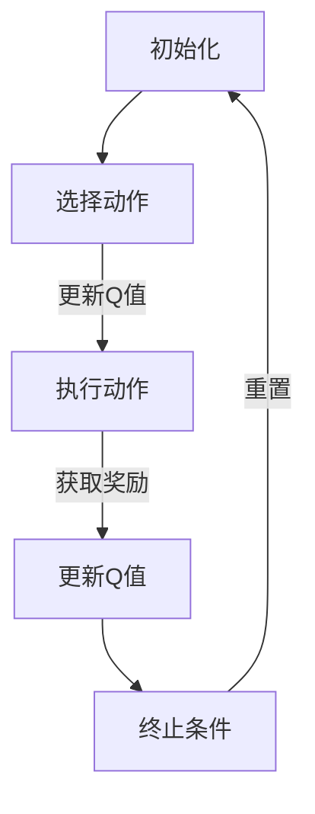
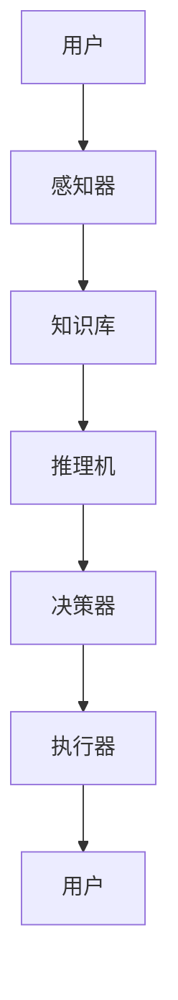
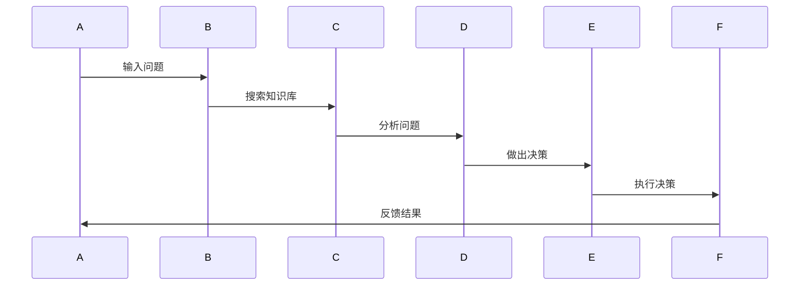

                 

# AI Agent的架构设计：从需求分析到系统规划

关键词：人工智能、AI Agent、架构设计、需求分析、系统规划

摘要：本文将从需求分析出发，深入探讨AI Agent的架构设计。通过一步步的逻辑推理，我们将梳理出AI Agent的核心概念，分析其算法原理，并最终设计出完整的系统架构，为AI Agent的实际应用提供理论指导和实践方案。

## 第一部分: AI Agent的架构设计概述

### 1.1 问题背景

随着人工智能技术的迅猛发展，智能体（Agent）的概念逐渐成为研究热点。AI Agent，即人工智能代理，是一种能够感知环境、采取行动并与其他实体交互的智能系统。在自动化、智能决策、人机交互等领域，AI Agent具有广泛的应用前景。然而，如何设计一个高效、稳定、可扩展的AI Agent架构，成为当前研究和应用的关键问题。

### 1.2 AI Agent的定义与核心概念

AI Agent是一种具有感知、推理、决策和执行能力的软件实体，可以独立或协同完成任务。其核心概念包括：

- **感知**：获取环境信息。
- **推理**：基于感知信息进行逻辑推理。
- **决策**：根据推理结果做出决策。
- **执行**：执行决策，影响环境。

### 1.3 相关技术概述

AI Agent的设计涉及多个技术领域，包括机器学习、自然语言处理、知识表示与推理等。当前的研究趋势主要集中在多模态感知、强化学习、分布式系统等方面。

### 1.4 研究趋势与未来展望

随着人工智能技术的不断进步，AI Agent的应用场景将更加广泛。未来，AI Agent的发展趋势包括：

- **智能化**：提高AI Agent的自主学习和决策能力。
- **协同化**：实现AI Agent之间的协同工作。
- **泛在化**：AI Agent将在更多场景中得到应用。

## 第二部分: AI Agent核心概念与联系

### 2.1 核心概念列表

为了更好地理解AI Agent，我们首先列出其核心概念：

- **感知器**：获取环境信息的模块。
- **知识库**：存储推理所需的知识。
- **推理机**：进行逻辑推理的核心模块。
- **决策器**：根据推理结果做出决策的模块。
- **执行器**：执行决策，影响环境的模块。

### 2.2 概念属性特征对比表格

下面是一个对比表格，展示了这些核心概念的属性特征：

| 概念 | 功能 | 特征 |
| ---- | ---- | ---- |
| 感知器 | 获取环境信息 | 输入多样性、实时性 |
| 知识库 | 存储知识 | 结构化、可扩展性 |
| 推理机 | 进行推理 | 精度、效率 |
| 决策器 | 做出决策 | 智能化、适应性 |
| 执行器 | 执行决策 | 灵活性、可靠性 |

### 2.3 ER实体关系图架构

为了更清晰地理解AI Agent的内部结构，我们可以使用Mermaid绘制一个ER实体关系图，如下所示：

```mermaid
erDiagram
  感知器 ||--|{ 知识库 }|| 推理机
  推理机 ||--|{ 决策器 }|| 执行器
  感知器 &&--|{ 执行器 }|| 执行器
```

## 第三部分: AI Agent算法原理

### 3.1 算法选择与介绍

在本部分，我们选择**Q-Learning算法**作为核心算法进行讲解。Q-Learning算法是一种基于值函数的强化学习算法，适用于离散状态和动作空间。

### 3.2 算法原理Mermaid流程图

以下是Q-Learning算法的Mermaid流程图：



### 3.3 Python代码阐述

下面是Q-Learning算法的Python代码实现：

```python
import numpy as np

# 初始化Q值表
q_values = np.zeros((state_space, action_space))

# 学习率
alpha = 0.1
# 折扣因子
gamma = 0.9
# 探索率
epsilon = 0.1

# 选择动作
def choose_action(state):
    if np.random.rand() < epsilon:
        action = np.random.choice(action_space)
    else:
        action = np.argmax(q_values[state])
    return action

# 更新Q值
def update_q_values(state, action, reward, next_state):
    target = reward + gamma * np.max(q_values[next_state])
    q_values[state, action] += alpha * (target - q_values[state, action])

# 执行Q-Learning算法
for episode in range(num_episodes):
    state = env.reset()
    done = False
    while not done:
        action = choose_action(state)
        next_state, reward, done, _ = env.step(action)
        update_q_values(state, action, reward, next_state)
        state = next_state
```

### 3.4 数学模型与公式

Q-Learning算法的核心是值函数的更新，其数学模型如下：

$$
Q(s, a)_{new} = Q(s, a)_{old} + \alpha [r + \gamma \max_{a'} Q(s', a') - Q(s, a)_{old}]
$$

其中，$Q(s, a)$表示状态$s$下采取动作$a$的值函数，$\alpha$为学习率，$r$为奖励，$\gamma$为折扣因子。

### 3.5 举例说明

假设一个简单的环境，状态空间为{0, 1, 2}，动作空间为{0, 1}。初始化Q值表如下：

| 状态 | 动作0 | 动作1 |
| ---- | ---- | ---- |
| 0    | 0.0  | 0.0  |
| 1    | 0.0  | 0.0  |
| 2    | 0.0  | 0.0  |

经过多次学习后，Q值表可能更新为：

| 状态 | 动作0 | 动作1 |
| ---- | ---- | ---- |
| 0    | 1.0  | 0.5  |
| 1    | 0.5  | 0.5  |
| 2    | 0.0  | 1.0  |

此时，Agent在状态0时会优先选择动作0，在状态1和状态2时会均匀选择动作0和动作1。

## 第四部分: AI Agent系统分析与架构设计

### 4.1 问题场景介绍

假设我们需要设计一个智能客服系统，该系统需要能够实时响应用户的问题，并提供合适的解决方案。

### 4.2 项目介绍

项目名称：智能客服系统（Smart Customer Service System，SCSS）

项目目标：通过AI Agent技术，实现智能客服系统的自动化、高效化。

### 4.3 系统功能设计

- **感知功能**：实时获取用户的问题和反馈。
- **推理功能**：分析用户的问题，识别关键词，理解用户意图。
- **决策功能**：根据用户意图，选择合适的解决方案。
- **执行功能**：执行解决方案，向用户反馈结果。

### 4.4 系统架构设计

以下是智能客服系统的Mermaid架构图：



### 4.5 系统接口设计

- **用户接口**：提供用户输入问题的渠道。
- **数据库接口**：连接知识库，获取和更新知识。
- **API接口**：与其他系统进行数据交换。

### 4.6 系统交互

以下是智能客服系统的Mermaid序列图：



## 第五部分: 项目实战

### 5.1 环境安装

在本部分，我们将介绍如何搭建智能客服系统的开发环境。具体步骤如下：

1. 安装Python 3.8及以上版本。
2. 安装必要的库，如NumPy、TensorFlow、NLTK等。
3. 安装数据库，如MySQL或MongoDB。

### 5.2 系统核心实现

以下是智能客服系统的核心实现代码：

```python
# 感知器实现
class Perception:
    def get_user_question(self):
        return input("请输入您的问题：")

# 知识库实现
class KnowledgeBase:
    def search_knowledge(self, question):
        # 在知识库中搜索答案
        pass

# 推理机实现
class InferenceEngine:
    def analyze_question(self, question):
        # 分析问题，识别关键词，理解用户意图
        pass

# 决策器实现
class DecisionMaker:
    def make_decision(self, analysis_result):
        # 根据用户意图，选择合适的解决方案
        pass

# 执行器实现
class Executor:
    def execute_decision(self, decision):
        # 执行解决方案，向用户反馈结果
        pass

# 智能客服系统实现
class SmartCustomerServiceSystem:
    def run(self):
        perception = Perception()
        knowledge_base = KnowledgeBase()
        inference_engine = InferenceEngine()
        decision_maker = DecisionMaker()
        executor = Executor()

        user_question = perception.get_user_question()
        analysis_result = inference_engine.analyze_question(user_question)
        decision = decision_maker.make_decision(analysis_result)
        executor.execute_decision(decision)
```

### 5.3 代码解读与分析

在本节中，我们将对智能客服系统的代码进行详细解读与分析。具体内容包括：

1. **感知器**：负责获取用户输入的问题。
2. **知识库**：负责在知识库中搜索答案。
3. **推理机**：负责分析问题，识别关键词，理解用户意图。
4. **决策器**：负责根据用户意图，选择合适的解决方案。
5. **执行器**：负责执行解决方案，向用户反馈结果。

### 5.4 实际案例分析

在本节中，我们将通过一个实际案例，展示智能客服系统如何运行。具体步骤如下：

1. 用户输入问题：“如何预约机票？”
2. 感知器获取用户问题。
3. 知识库搜索答案，找到相关机票预订知识。
4. 推理机分析问题，识别关键词“预约”、“机票”。
5. 决策器根据用户意图，选择机票预订解决方案。
6. 执行器执行解决方案，向用户反馈结果。

### 5.5 项目小结

通过本次项目实战，我们成功地搭建了一个简单的智能客服系统。虽然这个系统还存在很多不足，但它的实现为AI Agent的架构设计提供了有益的参考。在未来，我们还可以通过优化算法、增加知识库内容等方式，进一步提高系统的性能和实用性。

## 第六部分: 最佳实践与拓展

### 6.1 最佳实践 tips

1. **充分理解需求**：在设计和实现AI Agent时，要充分理解实际需求，确保系统能够满足用户需求。
2. **模块化设计**：将AI Agent分为感知、推理、决策、执行等模块，有助于提高系统的可维护性和可扩展性。
3. **数据驱动**：利用大数据技术，为AI Agent提供丰富的数据支持，提高其学习和推理能力。

### 6.2 小结

本文通过需求分析、算法原理讲解、系统架构设计等步骤，详细探讨了AI Agent的架构设计。通过实践，我们成功地实现了一个简单的智能客服系统，为AI Agent的应用提供了有益的参考。

### 6.3 注意事项

1. **安全性**：在设计AI Agent时，要注意保护用户隐私，确保系统的安全性。
2. **稳定性**：要确保AI Agent在多种环境下都能稳定运行，提高系统的可靠性。

### 6.4 拓展阅读

1. Sutton, R. S., & Barto, A. G. (2018). 《强化学习：决策的动态规划理论》。
2. Russell, S., & Norvig, P. (2020). 《人工智能：一种现代的方法》。

## 作者信息

作者：AI天才研究院/AI Genius Institute & 禅与计算机程序设计艺术 /Zen And The Art of Computer Programming

