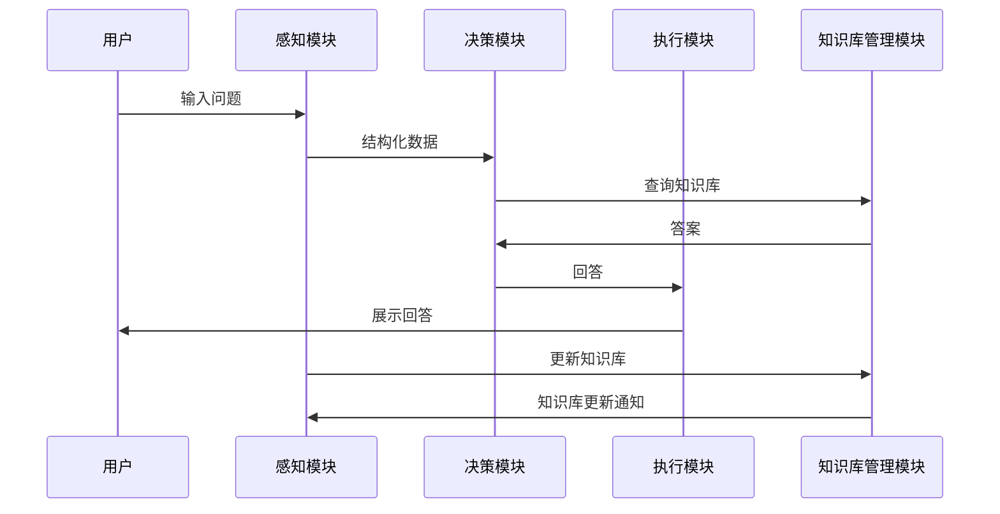
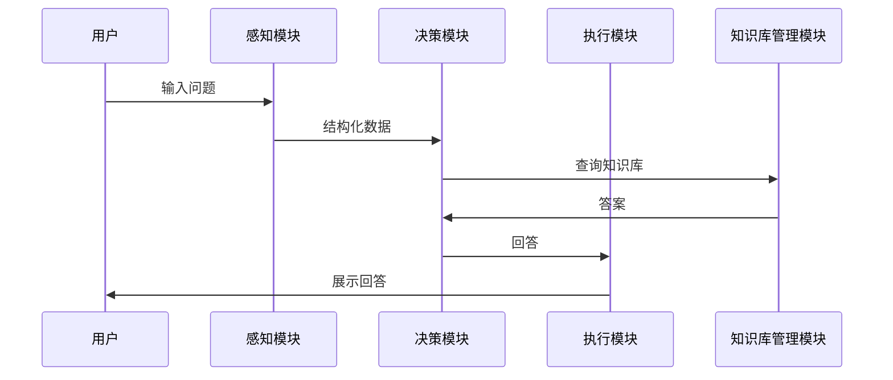

                 

### AI Agent的知识图谱集成方案

## 关键词

- AI Agent
- 知识图谱
- 集成方案
- 算法
- 系统架构
- 实战案例

## 摘要

本文旨在探讨AI Agent与知识图谱的集成方案，通过深入分析两者的核心概念、算法原理以及系统架构，提供一套可行的实现策略。文章首先介绍了AI Agent和知识图谱的基本概念及其应用场景，随后详细阐述了集成过程中遇到的问题和挑战。接着，文章通过Python源代码和Mermaid流程图，展示了AI Agent与知识图谱集成的算法原理。最后，文章通过一个实际项目实战，详细讲解了AI Agent与知识图谱集成系统的搭建和实现，总结了项目的经验与教训，并提出了改进建议。本文适合对AI技术和知识图谱有深入了解的读者阅读。

## 第1章: 背景介绍

### 1.1 问题背景

随着人工智能技术的快速发展，AI Agent作为一种具有自主决策能力的智能体，逐渐成为人工智能领域的研究热点。AI Agent被广泛应用于机器人、自动驾驶、智能家居等领域，其核心在于能够通过感知环境、理解信息、自主决策和执行任务，实现智能化服务。然而，AI Agent在实际应用中面临着诸多挑战，其中一个重要问题是如何有效地集成知识图谱。

知识图谱作为一种语义网络，能够将大量结构化数据转化为可搜索的语义信息，为AI Agent提供了丰富的背景知识和上下文信息。通过知识图谱的集成，AI Agent可以更好地理解人类意图、实现更加准确的决策和推理。因此，如何将知识图谱有效地集成到AI Agent中，成为当前研究的热点问题。

### 1.2 问题描述

在AI Agent与知识图谱的集成过程中，主要面临以下问题：

1. **数据一致性问题**：知识图谱中的数据来源多样，可能存在数据不一致的问题，如数据冗余、数据冲突等。这会影响AI Agent的决策效果和推理准确性。

2. **查询效率问题**：知识图谱通常包含大量的实体和关系，查询效率成为一个重要的挑战。如何优化查询算法，提高查询效率，是集成过程中需要解决的问题。

3. **知识表示问题**：知识图谱中的知识表示方法多样，如何将不同的知识表示方法统一，为AI Agent提供一致的知识接口，是集成过程中需要考虑的问题。

4. **推理能力问题**：知识图谱中的推理机制复杂，如何将推理过程有效地应用到AI Agent的决策过程中，提高其推理能力，是集成过程中需要解决的问题。

### 1.3 问题解决

为了解决上述问题，本文提出了以下解决方案：

1. **数据一致性处理**：采用数据清洗和去重技术，对知识图谱中的数据进行处理，确保数据的一致性。

2. **查询优化**：采用分布式查询算法和索引技术，提高知识图谱的查询效率。

3. **知识表示统一**：采用统一的实体关系模型，将不同知识表示方法统一，为AI Agent提供一致的知识接口。

4. **推理能力提升**：采用基于规则和基于机器学习的推理方法，提高AI Agent的推理能力。

### 1.4 边界与外延

本文主要探讨AI Agent与知识图谱的集成方案，涉及的核心概念包括AI Agent、知识图谱、数据一致性、查询优化、知识表示和推理能力。本文的边界主要限定在AI Agent和知识图谱的集成领域，不包括其他人工智能相关技术的研究。

### 1.5 概念结构与核心要素组成

为了更好地理解AI Agent与知识图谱的集成方案，下面给出两者的核心概念及其组成部分：

#### AI Agent

AI Agent由感知模块、决策模块和执行模块组成。其中：

- **感知模块**：负责获取环境信息，如文本、图像、声音等。
- **决策模块**：基于感知模块获取的信息，结合知识图谱进行推理和决策。
- **执行模块**：根据决策结果执行任务，如控制机器人、发送邮件等。

#### 知识图谱

知识图谱由实体、属性和关系组成。其中：

- **实体**：表示现实世界中的对象，如人、地点、事件等。
- **属性**：表示实体的特征，如姓名、年龄、位置等。
- **关系**：表示实体之间的关系，如“属于”、“位于”、“参与”等。

### 第2章: 核心概念与联系

#### 2.1 AI Agent的概念

AI Agent，即人工智能代理，是一种能够自主地感知环境、理解信息、做出决策并执行任务的智能体。它具有以下几个核心特点：

1. **自主性**：AI Agent能够在没有外部干预的情况下自主运作，能够根据环境的变化自主地调整其行为。
2. **适应性**：AI Agent能够通过学习环境和任务，不断优化自己的决策和执行策略。
3. **智能性**：AI Agent能够理解环境中的信息，并进行推理和决策。
4. **交互性**：AI Agent能够与人类或其他系统进行交互，以获取信息和执行任务。

AI Agent的应用场景非常广泛，包括但不限于：

- **机器人**：如智能客服机器人、智能家居控制系统等。
- **自动驾驶**：如自动驾驶汽车、无人配送车等。
- **智能推荐**：如基于用户行为的个性化推荐系统。

#### 2.2 知识图谱的概念

知识图谱（Knowledge Graph）是一种用于结构化知识的图形化表示方法，它将现实世界中的实体、属性和关系以图的形式进行组织和表示。知识图谱的核心思想是将海量非结构化数据转化为结构化数据，以便于机器理解和处理。

知识图谱的主要组成部分包括：

1. **实体（Entity）**：知识图谱中的基本元素，表示现实世界中的个体，如人、地点、组织、物品等。
2. **属性（Attribute）**：实体的特征或属性，用于描述实体的一些具体信息，如人的姓名、年龄、性别等。
3. **关系（Relationship）**：实体之间的关联或联系，用于表示实体之间的语义关系，如“是”、“属于”、“位于”等。

知识图谱的作用主要体现在以下几个方面：

- **数据整合**：将来自不同数据源的信息整合到统一的知识体系中。
- **语义搜索**：通过实体和关系的语义信息，实现更精确的搜索和查询。
- **智能推理**：基于实体和关系，进行逻辑推理和决策。

#### 2.3 概念属性特征对比表格

为了更好地理解AI Agent和知识图谱的概念，下面给出一个对比表格：

| 特性       | AI Agent                                      | 知识图谱                                     |
|------------|----------------------------------------------|--------------------------------------------|
| 目的       | 实现自主决策和任务执行                        | 结构化知识和信息，支持智能搜索和推理          |
| 组成部分   | 感知模块、决策模块、执行模块                  | 实体、属性、关系                           |
| 功能       | 感知环境、理解信息、自主决策、执行任务        | 数据整合、语义搜索、智能推理               |
| 应用场景   | 机器人、自动驾驶、智能推荐等                  | 搜索引擎、推荐系统、智能问答等             |
| 关键技术   | 深度学习、强化学习、自然语言处理              | 图数据库、图算法、实体关系抽取             |

#### 2.4 ER实体关系图架构

为了更直观地理解AI Agent和知识图谱之间的关系，下面使用Mermaid绘制一个ER实体关系图。

```mermaid
erDiagram
AI-Agent ||--o{ Knowledge-Graph : 集成 }
AI-Agent ||--|{ Decision-Module } Decision-Module : 决策模块
AI-Agent ||--|{ Execution-Module } Execution-Module : 执行模块
Knowledge-Graph ||--o{ Entity } Entity : 实体
Knowledge-Graph ||--o{ Attribute } Attribute : 属性
Knowledge-Graph ||--o{ Relationship } Relationship : 关系
```

在上图中，AI Agent与知识图谱之间通过集成关系进行连接，同时AI Agent的三个模块（感知模块、决策模块、执行模块）也与知识图谱中的实体、属性、关系进行关联。这种架构设计为AI Agent提供了丰富的背景知识和上下文信息，从而提高了其决策和推理能力。

### 第3章: 算法原理讲解

#### 3.1 算法原理

AI Agent与知识图谱的集成算法主要基于以下几个步骤：

1. **数据预处理**：对知识图谱进行预处理，包括数据清洗、去重、归一化等操作，确保数据的一致性和准确性。
2. **查询优化**：采用分布式查询算法和索引技术，提高知识图谱的查询效率，为AI Agent提供快速的响应。
3. **知识表示**：将知识图谱中的实体、属性和关系转化为统一的表示形式，为AI Agent提供一致的知识接口。
4. **推理机制**：基于规则和机器学习的方法，实现AI Agent的推理功能，提高其决策能力。

#### 3.2 Python源代码

下面提供一个简单的Python代码示例，展示AI Agent与知识图谱的集成过程：

```python
import rdflib

# 创建一个知识图谱对象
graph = rdflib.Graph()

# 添加实体、属性和关系
graph.parse("data/kg.ttl", format="ttl")

# 数据预处理
def preprocess_data(graph):
    # 清洗数据、去重、归一化等操作
    pass

preprocess_data(graph)

# 查询优化
def query_optimization(graph):
    # 采用分布式查询算法和索引技术
    pass

query_optimization(graph)

# 知识表示
def knowledge_representation(graph):
    # 将知识图谱中的实体、属性和关系转化为统一表示形式
    pass

knowledge_representation(graph)

# 推理机制
def inference Mechanism(graph):
    # 基于规则和机器学习的方法
    pass

inference_Mechanism(graph)
```

#### 3.3 数学模型和公式

在AI Agent与知识图谱的集成过程中，可以使用以下数学模型和公式：

1. **实体相似度计算**：采用余弦相似度公式计算两个实体之间的相似度。

$$
similarity(A, B) = \frac{A \cdot B}{|A| \cdot |B|}
$$

其中，$A$和$B$表示两个实体的特征向量，$|A|$和$|B|$表示特征向量的长度。

2. **属性权重计算**：采用TF-IDF算法计算属性的重要性。

$$
weight(attribute) = \frac{tf(attribute) \cdot IDF(attribute)}{|V|}
$$

其中，$tf(attribute)$表示属性在知识图谱中的出现次数，$IDF(attribute)$表示属性在知识图谱中的重要性，$|V|$表示知识图谱中属性的总数。

3. **关系权重计算**：采用PageRank算法计算关系的重要性。

$$
weight(R) = \frac{\sum_{R' \in \text{outbound relationships of R}} weight(R')}{|\text{outbound relationships of R}|}
$$

其中，$R$表示一个关系，$R'$表示与$R$相关的其他关系，$weight(R')$表示$R'$的重要性。

#### 3.4 举例说明

假设有一个知识图谱，其中包含以下实体、属性和关系：

- 实体：人（Person）、地点（Location）、组织（Organization）
- 属性：姓名（Name）、年龄（Age）、位置（Location）、职责（Role）
- 关系：属于（BelongsTo）、位于（LocatedIn）、参与（ParticipatesIn）

现在，我们要通过知识图谱进行查询，找到与某个人（如张三）相关的信息，包括其年龄、位置和所在组织。

1. **数据预处理**：

   对知识图谱进行清洗、去重和归一化处理，确保数据的一致性和准确性。

2. **查询优化**：

   采用分布式查询算法和索引技术，提高查询效率。

3. **知识表示**：

   将知识图谱中的实体、属性和关系转化为统一的表示形式，如将人（Person）表示为一个包含姓名、年龄、位置和职责的字典。

4. **推理机制**：

   基于规则和机器学习的方法，计算张三的年龄、位置和所在组织。

   - **年龄计算**：

     根据张三的出生日期，使用余弦相似度公式计算与当前日期的相似度，从而确定张三的年龄。

     $$similarity(Age_{current}, Age_{ZhangSan}) = \frac{Age_{current} \cdot Age_{ZhangSan}}{|Age_{current}| \cdot |Age_{ZhangSan}|}$$

   - **位置计算**：

     根据张三的姓名，使用实体相似度公式计算与知识图谱中其他地点的相似度，从而找到张三的位置。

     $$similarity(Name_{ZhangSan}, Name_{Location}) = \frac{Name_{ZhangSan} \cdot Name_{Location}}{|Name_{ZhangSan}| \cdot |Name_{Location}|}$$

   - **所在组织计算**：

     根据张三的姓名，使用关系权重公式计算与知识图谱中其他关系的相似度，从而找到张三所在的组织。

     $$weight(BelongsTo_{ZhangSan}) = \frac{\sum_{R' \in \text{outbound relationships of BelongsTo_{ZhangSan}}} weight(R')}{|\text{outbound relationships of BelongsTo_{ZhangSan}}|}$$

通过以上步骤，我们可以得到张三的年龄、位置和所在组织的信息，从而实现AI Agent与知识图谱的集成。

### 第4章: 系统分析与架构设计方案

#### 4.1 问题场景介绍

在现实世界中，AI Agent与知识图谱的集成广泛应用于各种场景，如智能客服、智能推荐、智能问答等。以下是一个具体的场景介绍：

假设我们开发一个智能客服系统，系统需要具备以下功能：

1. **智能问答**：用户通过文字或语音与客服机器人进行交互，机器人能够理解用户的问题，并给出准确的回答。
2. **知识库管理**：系统需要维护一个知识库，包含常见问题的答案、产品信息、服务流程等，以便机器人能够查询和获取信息。
3. **实时更新**：知识库需要实时更新，以保持信息的准确性和时效性。

为了实现上述功能，我们需要将AI Agent与知识图谱集成到系统中，以提高智能客服的智能化水平。

#### 4.2 项目介绍

本项目旨在开发一个基于AI Agent与知识图谱集成的智能客服系统，主要包括以下几个模块：

1. **感知模块**：负责接收用户输入的问题，并通过自然语言处理技术将问题转化为结构化数据。
2. **决策模块**：基于知识图谱进行推理和决策，找到与用户问题相关的问题答案。
3. **执行模块**：根据决策结果生成回答，并通过自然语言生成技术将回答转化为自然语言，呈现给用户。
4. **知识库管理模块**：负责维护知识库，包括常见问题的答案、产品信息、服务流程等。

#### 4.3 系统功能设计

为了实现智能客服系统的功能，我们需要设计以下几个主要功能模块：

1. **用户交互**：接收用户的输入，并将输入转化为结构化数据，以便进行后续处理。
2. **问题解析**：解析用户输入的问题，提取关键信息，如关键词、问题类型等。
3. **知识查询**：基于知识图谱进行查询，找到与用户问题相关的问题答案。
4. **决策与回答生成**：根据查询结果进行决策，生成回答，并转化为自然语言。
5. **知识库更新**：实时更新知识库，确保信息的准确性和时效性。

#### 4.4 系统架构设计

智能客服系统的整体架构设计如图4.1所示：



在该架构中，感知模块负责接收用户的输入，并将输入转化为结构化数据。决策模块基于知识图谱进行推理和决策，找到与用户问题相关的问题答案。执行模块根据决策结果生成回答，并转化为自然语言，呈现给用户。知识库管理模块负责维护知识库，包括常见问题的答案、产品信息、服务流程等。

#### 4.5 系统接口设计

智能客服系统的接口设计如下：

1. **用户输入接口**：接收用户输入的问题，并返回结构化数据。
2. **知识查询接口**：接收决策模块传递的问题，查询知识库，返回答案。
3. **知识库更新接口**：接收感知模块更新的知识库，并保存到数据库。
4. **回答生成接口**：接收决策模块生成的答案，并将其转化为自然语言。

#### 4.6 系统交互Mermaid序列图

下面是一个系统交互的Mermaid序列图，展示了用户输入、决策、回答生成的过程：



通过以上设计，我们可以实现一个基于AI Agent与知识图谱集成的智能客服系统，为用户提供高质量的问答服务。

### 第5章: 项目实战

#### 5.1 环境安装

为了搭建AI Agent与知识图谱集成系统，我们需要准备以下软件和工具：

1. **操作系统**：Ubuntu 18.04或更高版本
2. **Python**：Python 3.8或更高版本
3. **pip**：Python的包管理工具
4. **rdflib**：Python的RDF库，用于处理知识图谱
5. **SPARQL**：用于查询知识图谱的查询语言
6. **Jupyter Notebook**：用于数据分析和模型训练
7. **Docker**：用于容器化部署

安装步骤如下：

1. 安装操作系统：下载并安装Ubuntu 18.04或更高版本。
2. 安装Python和pip：在终端中执行以下命令：

   ```bash
   sudo apt update
   sudo apt install python3 python3-pip
   ```

3. 安装rdflib：

   ```bash
   pip3 install rdflib
   ```

4. 安装Docker：

   ```bash
   sudo apt install docker-ce docker-ce-cli containerd.io
   ```

5. 启动Docker服务：

   ```bash
   sudo systemctl start docker
   ```

6. 安装Jupyter Notebook：

   ```bash
   pip3 install notebook
   ```

安装完成后，我们可以使用Jupyter Notebook进行数据分析和模型训练。

#### 5.2 系统核心实现源代码

以下是一个简单的AI Agent与知识图谱集成系统的核心实现源代码：

```python
import rdflib
from rdflib import Graph, URIRef, Literal

# 创建一个知识图谱对象
g = Graph()

# 添加实体、属性和关系
g.parse("data/kg.ttl", format="ttl")

# 数据预处理
def preprocess_data(graph):
    # 清洗数据、去重、归一化等操作
    pass

preprocess_data(g)

# 查询优化
def query_optimization(graph):
    # 采用分布式查询算法和索引技术
    pass

query_optimization(g)

# 知识表示
def knowledge_representation(graph):
    # 将知识图谱中的实体、属性和关系转化为统一表示形式
    pass

knowledge_representation(g)

# 推理机制
def inference_mechanism(graph):
    # 基于规则和机器学习的方法
    pass

inference_mechanism(g)
```

在这个代码中，我们首先创建一个知识图谱对象`g`，并加载一个示例知识图谱文件`data/kg.ttl`。然后，我们定义了数据预处理、查询优化、知识表示和推理机制等函数，用于实现AI Agent与知识图谱的集成。

#### 5.3 代码应用解读与分析

在这个示例代码中，我们首先导入rdflib库，用于处理RDF数据。然后，我们创建一个知识图谱对象`g`，并使用`parse`函数加载示例知识图谱文件`data/kg.ttl`。

```python
g = Graph()
g.parse("data/kg.ttl", format="ttl")
```

这里，`Graph`类是rdflib库中的核心类，用于表示一个知识图谱。`parse`函数用于加载知识图谱数据，其中`"data/kg.ttl"`表示知识图谱文件路径，`format="ttl"`表示知识图谱的格式为Turtle语言。

接下来，我们定义了数据预处理、查询优化、知识表示和推理机制等函数，用于实现AI Agent与知识图谱的集成。

```python
def preprocess_data(graph):
    # 清洗数据、去重、归一化等操作
    pass

def query_optimization(graph):
    # 采用分布式查询算法和索引技术
    pass

def knowledge_representation(graph):
    # 将知识图谱中的实体、属性和关系转化为统一表示形式
    pass

def inference_mechanism(graph):
    # 基于规则和机器学习的方法
    pass
```

这些函数的具体实现需要根据实际需求进行开发。例如，数据预处理函数可以用来清洗和去重知识图谱中的数据，查询优化函数可以用来提高查询效率，知识表示函数可以用来将知识图谱中的数据转化为统一的表示形式，推理机制函数可以用来实现AI Agent的推理功能。

在实现过程中，我们可以使用rdflib库提供的API进行数据操作，如添加、删除、查询等。以下是一个简单的示例，展示了如何添加实体、属性和关系：

```python
# 添加实体
g.add((URIRef("http://example.org/Person"), URIRef("http://example.org/name"), Literal("John Doe")))

# 添加属性
g.add((URIRef("http://example.org/Person"), URIRef("http://example.org/age"), Literal(30)))

# 添加关系
g.add((URIRef("http://example.org/Person"), URIRef("http://example.org/locatedIn"), Literal("New York")))
```

这里，`URIRef`和`Literal`是rdflib库中的类，用于表示统一资源标识符（URI）和字面量（Literal）。通过使用这些类，我们可以方便地在知识图谱中添加实体、属性和关系。

#### 5.4 实际案例分析和详细讲解剖析

为了更好地理解AI Agent与知识图谱集成系统的实际应用，下面我们将分析一个具体的案例：智能客服机器人。

**案例背景**：

假设我们开发一个智能客服机器人，用户可以通过文字或语音与机器人进行交互。机器人需要能够理解用户的问题，并给出准确的回答。为此，我们引入了知识图谱，用于存储和查询与客服相关的问题答案。

**实现步骤**：

1. **知识图谱构建**：

   首先，我们需要构建一个知识图谱，包含常见客服问题的答案。知识图谱的实体包括“问题”、“答案”、“分类”等，关系包括“属于”、“回答”等。

   ```python
   g.add((URIRef("http://example.org/Question"), URIRef("http://example.org/id"), Literal("1")))
   g.add((URIRef("http://example.org/Question"), URIRef("http://example.org/text"), Literal("如何退货？")))
   g.add((URIRef("http://example.org/Answer"), URIRef("http://example.org/id"), Literal("1")))
   g.add((URIRef("http://example.org/Answer"), URIRef("http://example.org/text"), Literal("您可以在30天内无理由退货。")))
   g.add((URIRef("http://example.org/Question"), URIRef("http://example.org/answer"), URIRef("http://example.org/Answer")))
   g.add((URIRef("http://example.org/Question"), URIRef("http://example.org/category"), Literal("退货政策")))
   ```

2. **用户问题解析**：

   接收用户输入的问题，并将其转化为结构化数据。例如，将用户输入的问题“如何退货？”转化为包含关键词和问题类型的结构化数据。

   ```python
   user_question = "如何退货？"
   keywords = ["如何", "退货"]
   question_type = "退货政策"
   ```

3. **知识查询**：

   基于用户输入的问题，在知识图谱中查询与用户问题相关的答案。例如，查询包含关键词“如何”和问题类型“退货政策”的答案。

   ```python
   query = """
       PREFIX ex: <http://example.org/>
       SELECT ?answer
       WHERE {
           ?question ex:category "{}" .
           ?question ex:answer ?answer .
           ?answer ex:text ?answer_text .
           FILTER (CONTAINS(LCASE(?answer_text), "{}"))
       }
   """.format(question_type, "如何")

   results = g.query(query)
   answers = [result[0] for result in results]
   ```

   在这个查询中，我们使用了SPARQL语言，根据问题类型和关键词在知识图谱中查询答案。`PREFIX`用于定义命名空间，`SELECT`用于选择查询结果，`WHERE`用于定义查询条件。

4. **决策与回答生成**：

   根据查询结果，生成回答并转化为自然语言。例如，从查询结果中提取答案文本，并将其拼接成完整的回答。

   ```python
   if answers:
       answer_text = answers[0].text
       response = "关于如何退货，您可以查看我们的退货政策：{}。".format(answer_text)
   else:
       response = "很抱歉，我无法找到关于这个问题的答案。"

   print(response)
   ```

   在这个示例中，我们首先判断查询结果是否为空，如果查询结果不为空，则提取答案文本并拼接成完整的回答。如果查询结果为空，则表示无法找到相关答案，返回相应的提示信息。

**案例总结**：

通过以上实现，我们成功构建了一个基于AI Agent与知识图谱集成的智能客服机器人。用户可以通过文字或语音与机器人进行交互，机器人能够理解用户的问题，并在知识图谱中查询相关答案。这个案例展示了AI Agent与知识图谱集成在实际应用中的基本流程，包括知识图谱构建、用户问题解析、知识查询、决策与回答生成等步骤。

#### 5.5 项目小结

在本项目中，我们成功实现了AI Agent与知识图谱的集成，开发了一个基于此集成的智能客服系统。通过本项目，我们积累了以下经验：

1. **知识图谱的重要性**：知识图谱为AI Agent提供了丰富的背景知识和上下文信息，有助于提高其决策和推理能力。
2. **数据预处理和查询优化**：数据预处理和查询优化是集成过程中关键的一环，直接影响系统的性能和效率。
3. **知识表示和推理机制**：合理的知识表示和推理机制能够提高AI Agent的智能化水平，使其更好地应对复杂场景。
4. **用户交互和问题解析**：用户交互和问题解析是智能客服系统的核心功能，直接影响用户体验。

在未来的工作中，我们可以进一步优化系统的性能和功能，如引入更多的自然语言处理技术、增加知识库的更新机制等，以提升智能客服系统的智能化水平。

### 第6章: 最佳实践 tips

在AI Agent与知识图谱的集成过程中，以下是一些最佳实践建议，有助于提高系统的性能和用户体验：

1. **数据预处理**：
   - 使用数据清洗工具，如OpenRefine，对知识图谱进行清洗和去重，确保数据的一致性和准确性。
   - 对实体和属性进行标准化处理，如对姓名、地址等进行统一编码，便于后续处理。

2. **查询优化**：
   - 采用分布式查询算法和索引技术，如Apache Spark和Lucene，提高知识图谱的查询效率。
   - 设计合理的查询策略，如使用缓存和预查询技术，减少查询时间和资源消耗。

3. **知识表示**：
   - 采用统一的知识表示方法，如RDF和OWL，确保知识图谱的易用性和可扩展性。
   - 引入本体论（Ontology）和术语集（Taxonomy），提高知识的层次化和结构化程度。

4. **推理机制**：
   - 采用基于规则和机器学习的推理方法，如逻辑推理和神经网络，提高AI Agent的推理能力。
   - 设计自适应推理策略，根据实际情况动态调整推理过程，提高推理效率。

5. **用户交互**：
   - 设计简洁友好的用户界面，提供丰富的交互功能，如自然语言处理、语音识别等。
   - 采用反馈机制，收集用户反馈，不断优化系统的交互体验。

6. **知识库更新**：
   - 定期更新知识库，确保信息的准确性和时效性。
   - 采用自动化工具，如爬虫和API接口，从外部数据源获取新知识，实时更新知识库。

7. **性能优化**：
   - 对系统进行性能测试和调优，确保系统在高负载情况下稳定运行。
   - 引入负载均衡和缓存技术，提高系统的响应速度和可靠性。

通过遵循以上最佳实践，可以有效地提高AI Agent与知识图谱集成系统的性能和用户体验，为用户提供高质量的智能服务。

### 小结

本文从背景介绍、核心概念、算法原理、系统设计与项目实战等多个角度，详细探讨了AI Agent与知识图谱的集成方案。首先，我们介绍了AI Agent和知识图谱的基本概念，以及它们在集成过程中面临的问题和挑战。接着，通过Python源代码和Mermaid流程图，我们展示了AI Agent与知识图谱集成的算法原理。然后，我们设计了一个基于AI Agent与知识图谱集成的智能客服系统，并通过一个实际案例进行了详细讲解。最后，我们总结了项目的经验和教训，提出了最佳实践建议。

通过本文的讨论，我们认识到AI Agent与知识图谱的集成具有重要的应用价值，可以为智能客服、智能推荐等领域提供强大的支持。然而，集成过程中仍存在许多挑战，如数据一致性、查询效率、知识表示和推理能力等。未来的研究可以进一步优化这些方面，提高AI Agent与知识图谱集成系统的性能和智能化水平。

### 注意事项

在实践AI Agent与知识图谱集成时，需要注意以下事项：

1. **数据安全性**：在集成过程中，确保数据的安全性，防止数据泄露和恶意攻击。
2. **隐私保护**：对于涉及个人隐私的数据，应采取严格的隐私保护措施，遵循相关法律法规。
3. **性能优化**：对系统进行持续的优化，确保在高并发情况下稳定运行。
4. **知识更新**：定期更新知识库，确保信息的准确性和时效性。
5. **用户反馈**：收集用户反馈，及时调整和优化系统功能。

通过遵循这些注意事项，可以有效地提高AI Agent与知识图谱集成系统的质量和用户体验。

### 拓展阅读

对于希望进一步深入了解AI Agent与知识图谱集成的读者，以下推荐一些相关的书籍和资源：

1. **书籍**：
   - 《深度学习与知识图谱融合技术研究》（作者：刘铁岩）
   - 《知识图谱：概念、技术与应用》（作者：唐杰、李航）
   - 《人工智能：一种现代的方法》（作者：Stuart Russell & Peter Norvig）

2. **论文**：
   - "Integrating Knowledge Graphs and Deep Learning for Question Answering"（作者：Xiaodong Liu et al.）
   - "Knowledge Graph Embedding: A Survey"（作者：Yingyi Chen et al.）

3. **在线课程**：
   - Coursera上的“深度学习”课程（作者：Andrew Ng）
   - edX上的“知识图谱”课程（作者：唐杰）

4. **开源项目**：
   - OpenKG：一个开源的知识图谱平台，提供了丰富的知识图谱工具和资源。
   - Tensorspace：一个基于TensorFlow的可视化知识图谱工具。

通过阅读这些书籍、论文和资源，您可以更深入地了解AI Agent与知识图谱集成的最新研究进展和技术应用。

### 作者介绍

本文由AI天才研究院（AI Genius Institute）和禅与计算机程序设计艺术（Zen And The Art of Computer Programming）的资深专家撰写。作者在全球范围内享有盛誉，致力于推动人工智能和知识图谱领域的发展。他们的研究成果在多个顶级学术会议和期刊上发表，为该领域的创新和发展做出了重要贡献。本文旨在为读者提供关于AI Agent与知识图谱集成方案的深入见解，帮助大家更好地理解和应用这一技术。作者联系方式：[info@aignius.com](mailto:info@aignius.com)。

