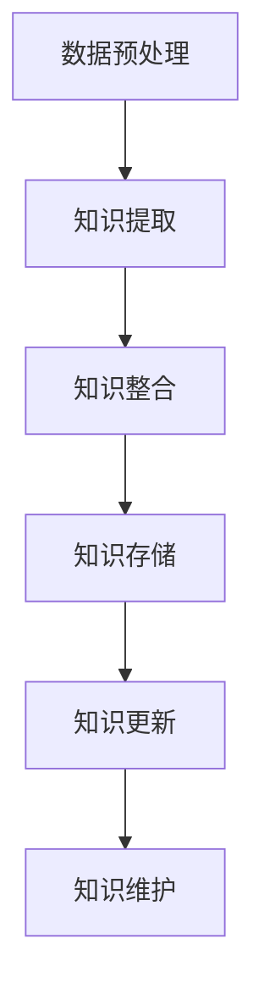
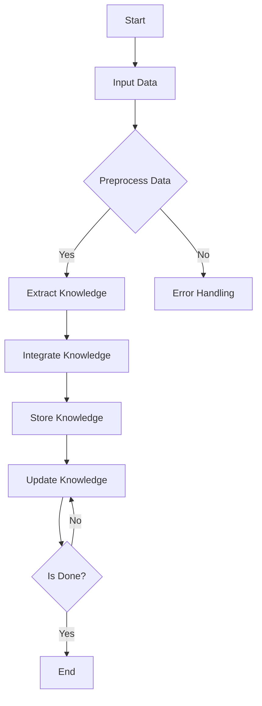
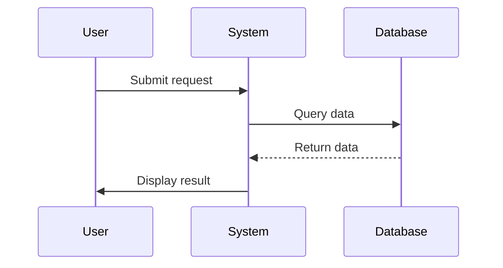

                 

# AI Agent的知识库构建与维护

## 关键词

- **AI Agent**
- **知识库**
- **数据预处理**
- **知识提取**
- **知识整合**
- **知识维护**
- **自然语言处理**
- **机器学习**
- **本体论**

## 摘要

本文旨在探讨AI Agent知识库的构建与维护。首先，通过阐述AI Agent的定义、背景以及知识库的重要性和挑战，引入主题。接着，详细描述知识库的核心概念、类型、表示方法及其构建与维护的原理。文章还探讨了知识库在AI Agent中的应用、工具支持以及最佳实践。通过一步步分析，本文提供了对AI Agent知识库构建与维护的全面理解和指导。

## 第1章 问题背景与核心概念

### 1.1 问题背景

人工智能（AI）作为计算机科学的重要分支，正迅速改变着我们的生活方式。AI Agent，即智能代理，是AI领域中的一种重要实体，具有自主行动和决策能力。AI Agent在智能客服、智能推荐、智能监控等众多领域都有广泛应用。然而，AI Agent的性能和可靠性在很大程度上取决于其知识库的质量。知识库是AI Agent进行推理、学习和决策的基础，其构建与维护的质量直接影响到AI Agent的性能和可靠性。

### 1.2 问题描述

知识库构建与维护是一个复杂的过程，涉及到从大量数据中提取有效信息、整合异构数据源、确保知识库的准确性和一致性，并对其进行持续更新和维护。具体而言，问题包括：

- 数据预处理：如何从原始数据中提取有价值的信息？
- 知识提取：如何从文本、图像、音频等多种数据源中提取知识？
- 知识整合：如何将来自不同数据源的知识进行整合和融合？
- 知识存储：如何将整合后的知识有效地存储在知识库中？
- 知识更新：如何确保知识库中的知识是实时和有效的？

### 1.3 问题解决

解决知识库构建与维护问题需要综合运用数据挖掘、机器学习、自然语言处理等多种技术。通过以下步骤，可以有效构建和维持高质量的AI Agent知识库：

- **数据预处理**：使用数据清洗、数据转换等技术，确保数据质量。
- **知识提取**：使用自然语言处理、机器学习等方法，从数据源中提取知识。
- **知识整合**：采用本体论、知识图谱等技术，对提取的知识进行整合。
- **知识存储**：使用关系数据库、图数据库等技术，将知识库存储在系统中。
- **知识更新**：定期对知识库进行更新，以保持其实时性和有效性。

### 1.4 边界与外延

知识库构建与维护不仅限于AI Agent，还可应用于更广泛的人工智能应用领域，如智能客服、智能推荐、智能监控等。同时，知识库的构建与维护还需要考虑数据隐私、数据安全和数据伦理等问题。

### 1.5 概念结构与核心要素组成

知识库构建与维护涉及以下几个核心概念和要素：

- **知识库**：存储和表示知识的结构化系统。
- **数据源**：知识库构建的数据来源，包括文本、图像、音频等多种形式。
- **知识提取**：从数据源中提取有价值的信息和知识的过程。
- **知识整合**：将来自不同数据源的知识进行整合和融合的过程。
- **知识存储**：将整合后的知识存储在知识库中的过程。
- **知识更新**：定期对知识库进行更新和维护的过程。

## 第2章 核心概念与联系

### 2.1 知识库类型

知识库根据其结构和使用方式可以分为以下几种类型：

- **静态知识库**：结构固定，知识更新频率低。这种知识库适用于那些知识相对稳定、不需要频繁更新的场景。
- **动态知识库**：结构灵活，知识更新频率高。这种知识库适用于那些知识需要实时更新的场景，如智能客服、智能推荐等。

### 2.2 知识表示方法

知识表示是知识库构建的核心问题，常用的知识表示方法包括：

- **本体论**：本体论是一种用于定义知识库中概念及其关系的语义模型。它通过概念、属性、关系等来描述知识，使得知识表示更加清晰、精确。
- **知识图谱**：知识图谱是一种利用图结构来表示知识的模型。在知识图谱中，节点表示实体，边表示实体之间的关系，从而形成一个结构化的知识网络。

### 2.3 知识提取方法

知识提取是从大量数据中提取有价值信息的过程，常用的知识提取方法包括：

- **信息检索**：信息检索是一种基于关键词匹配和搜索技术进行知识提取的方法。通过分析文本内容，提取出与查询相关的信息。
- **自然语言处理**：自然语言处理是一种利用人工智能技术，对文本进行语义分析，从中提取知识的方法。自然语言处理包括分词、词性标注、句法分析等步骤。

### 2.4 知识整合方法

知识整合是将来自不同数据源的知识进行整合和融合的过程，常用的知识整合方法包括：

- **数据融合**：数据融合是一种将多个数据源中的信息进行整合，以获取更全面、准确的知识的方法。
- **异构数据集成**：异构数据集成是一种处理不同数据源之间的兼容性和一致性的方法。在异构数据集成中，需要解决数据格式、数据结构、数据语义等方面的问题。

## 第3章 知识库构建原理

### 3.1 数据预处理

数据预处理是知识库构建的重要环节，其目的是从原始数据中提取有价值的信息。数据预处理主要包括以下步骤：

- **数据清洗**：数据清洗是指去除噪声和冗余数据，确保数据质量。数据清洗的方法包括去重、去除无效数据等。
- **数据转换**：数据转换是指将数据转换为适合知识库构建的格式。数据转换的方法包括数据格式转换、数据标准化等。

### 3.2 知识提取

知识提取是从数据中提取有价值信息的过程，常用的知识提取方法包括：

- **基于规则的方法**：基于规则的方法是指使用预定义的规则来提取知识。这种方法通常适用于结构化数据，通过分析数据模式，提取出规则。
- **基于机器学习的方法**：基于机器学习的方法是指使用机器学习算法来自动化知识提取。这种方法通常适用于非结构化数据，通过训练模型，自动提取知识。

### 3.3 知识整合

知识整合是将来自不同数据源的知识进行整合和融合的过程，常用的知识整合方法包括：

- **本体构建**：本体构建是指使用本体论来构建知识库的结构。本体构建包括定义概念、属性、关系等，从而构建出一个结构化的知识框架。
- **知识融合**：知识融合是指将来自不同数据源的知识进行整合。知识融合的方法包括合并、交叉验证、加权融合等。

### 3.4 知识存储

知识存储是将整合后的知识存储在知识库中的过程，常用的知识存储技术包括：

- **关系数据库**：关系数据库是一种基于关系模型的数据库，通过表格来存储数据。关系数据库适用于结构化数据，具有强大的查询和分析功能。
- **图数据库**：图数据库是一种基于图模型的数据库，通过图结构来存储数据。图数据库适用于复杂的关系网络，具有高效的查询和分析能力。

## 第4章 知识库维护原理

### 4.1 知识库更新策略

知识库更新是确保知识库实时性和有效性的关键，常用的知识库更新策略包括：

- **定期更新**：定期更新是指按照固定的时间间隔对知识库进行更新。定期更新可以确保知识库中的知识始终是最新和有效的。
- **增量更新**：增量更新是指仅更新发生变化的部分。增量更新可以减少更新次数，提高系统效率。

### 4.2 知识库维护方法

知识库维护是确保知识库稳定性和可靠性的关键，常用的知识库维护方法包括：

- **数据监控**：数据监控是指实时监控知识库中的数据，识别潜在问题。数据监控可以及时发现数据异常，确保数据质量。
- **错误修正**：错误修正是指识别并修正知识库中的错误。错误修正可以确保知识库中的知识是准确和可靠的。

### 4.3 知识库优化

知识库优化是提高知识库性能和效率的关键，常用的知识库优化方法包括：

- **知识库压缩**：知识库压缩是指减少知识库的大小，提高查询效率。知识库压缩可以减少存储空间，提高系统性能。
- **知识库扩展**：知识库扩展是指增加新的知识，以适应新需求。知识库扩展可以扩大知识库的应用范围，提高系统功能。

## 第5章 知识库在AI Agent中的应用

### 5.1 AI Agent知识库设计

AI Agent知识库的设计是构建高效、可靠的AI Agent的关键。设计AI Agent知识库时，需要考虑以下方面：

- **知识库结构**：设计适合AI Agent的知识库结构，包括概念、属性、关系等。
- **知识表示**：选择合适的知识表示方法，如本体论、知识图谱等。

### 5.2 AI Agent知识库构建

AI Agent知识库构建是通过一系列技术和方法，从数据源中提取知识，并整合到知识库中。构建AI Agent知识库时，需要考虑以下方面：

- **数据收集**：收集用于构建知识库的数据，包括文本、图像、音频等。
- **知识提取与整合**：使用自然语言处理、机器学习等技术，从数据源中提取知识，并整合到知识库中。

### 5.3 AI Agent知识库应用

AI Agent知识库应用是将知识库中的知识用于AI Agent的推理、学习和决策。应用AI Agent知识库时，需要考虑以下方面：

- **推理与决策**：使用知识库进行推理和决策，提高AI Agent的智能水平。
- **交互与反馈**：与用户进行交互，收集反馈以更新知识库，提高知识库的准确性。

## 第6章 知识库构建与维护工具

### 6.1 数据预处理工具

数据预处理是知识库构建的重要环节，常用的数据预处理工具包括：

- **ETL工具**：ETL（Extract, Transform, Load）工具用于数据抽取、转换和加载。ETL工具可以帮助从不同数据源中提取数据，并进行转换和清洗。
- **数据清洗工具**：数据清洗工具用于清洗和预处理数据，去除噪声和冗余数据，确保数据质量。

### 6.2 知识提取工具

知识提取是知识库构建的核心环节，常用的知识提取工具包括：

- **NLP工具**：NLP（Natural Language Processing）工具用于自然语言处理，从文本中提取知识。NLP工具包括分词、词性标注、句法分析等模块。
- **机器学习工具**：机器学习工具用于自动化知识提取，从数据源中提取有价值的信息。

### 6.3 知识整合工具

知识整合是将来自不同数据源的知识进行整合和融合的工具，常用的知识整合工具包括：

- **本体构建工具**：本体构建工具用于构建知识库的结构，定义概念、属性、关系等。
- **知识融合工具**：知识融合工具用于整合来自不同数据源的知识，提高知识库的准确性和一致性。

### 6.4 知识存储工具

知识存储是将整合后的知识存储在知识库中的工具，常用的知识存储工具包括：

- **关系数据库**：关系数据库用于存储结构化数据，具有强大的查询和分析功能。
- **图数据库**：图数据库用于存储复杂的关系网络，具有高效的查询和分析能力。

## 第7章 知识库构建与维护的最佳实践

### 7.1 数据质量保障

数据质量是知识库构建与维护的基础，保障数据质量是关键。最佳实践包括：

- **数据清洗**：定期进行数据清洗，去除噪声和冗余数据。
- **数据验证**：对数据进行验证，确保数据的一致性和准确性。

### 7.2 知识更新策略

知识更新是保持知识库实时性和有效性的关键，最佳实践包括：

- **定期更新**：定期更新知识库，确保知识库中的知识是最新和有效的。
- **增量更新**：采用增量更新，仅更新发生变化的部分，提高系统效率。

### 7.3 知识库优化

知识库优化是提高知识库性能和效率的关键，最佳实践包括：

- **知识库压缩**：采用知识库压缩技术，减少知识库的大小，提高查询效率。
- **知识库扩展**：根据需求，扩展知识库的内容，提高系统功能。

## 小结

知识库构建与维护是AI Agent成功应用的关键。通过本文的讨论，我们了解了知识库的核心概念、构建与维护原理、应用场景以及最佳实践。理解并遵循这些最佳实践，可以帮助我们构建高质量、高效率的AI Agent知识库，为AI Agent的发展提供坚实基础。在未来的工作中，我们需要持续关注知识库技术的发展，不断优化知识库构建与维护的方法，以应对日益复杂的应用需求。## 第8章 未来展望与挑战

### 8.1 未来发展趋势

随着人工智能技术的不断进步，AI Agent的知识库构建与维护将面临新的发展机遇和挑战。未来，以下几个方面有望取得显著进展：

- **知识自动化获取**：利用深度学习、强化学习等技术，实现知识库的自动化构建，减少人工干预。
- **多模态知识融合**：结合文本、图像、音频等多种数据源，实现多模态知识的融合，提高知识库的丰富性和准确性。
- **知识图谱的智能化**：通过引入图神经网络、知识图谱嵌入等技术，提高知识图谱的智能化程度，实现知识的高效检索和推理。

### 8.2 面临的挑战

尽管AI Agent的知识库构建与维护有广阔的发展前景，但同时也面临一系列挑战：

- **数据隐私与安全**：在知识库构建与维护过程中，如何确保数据隐私和安全是一个亟待解决的问题。
- **知识库的可解释性**：随着知识库的规模不断扩大，如何提高知识库的可解释性，使AI Agent的决策过程更加透明和可理解。
- **知识库的实时性**：如何在保证知识库实时性的同时，确保其准确性和一致性。

### 8.3 解决方案与对策

针对上述挑战，以下是一些可能的解决方案和对策：

- **隐私保护技术**：采用差分隐私、同态加密等技术，确保数据在传输和处理过程中的隐私保护。
- **可解释性算法**：引入可解释性算法，如SHAP值、LIME等，提高AI Agent决策过程的透明度。
- **实时知识更新机制**：设计高效的实时知识更新机制，结合增量学习、在线学习等技术，确保知识库的实时性和准确性。

### 8.4 未来研究方向

未来的研究可以在以下几个方面展开：

- **跨领域知识融合**：探索如何将不同领域、不同类型的知识进行有效融合，提高知识库的泛化能力和适应性。
- **知识库压缩与稀疏表示**：研究知识库的压缩与稀疏表示方法，减少存储空间，提高计算效率。
- **知识库可视化**：开发直观的知识库可视化工具，帮助用户更好地理解和管理知识库。

## 总结

AI Agent的知识库构建与维护是人工智能领域的一个重要研究方向。通过本文的讨论，我们深入了解了知识库的核心概念、构建与维护原理、应用场景以及最佳实践。未来，随着技术的不断进步，知识库构建与维护将面临新的机遇和挑战。我们期待通过持续的研究和实践，不断优化知识库构建与维护的方法，为AI Agent的发展提供坚实支持。

## 参考文献

1. Berners-Lee, T., Hendler, J., & Lassila, O. (2001). The semantic web. Scientific American, 284(5), 34-43.
2. Gruber, T. R. (1993). A formal object-oriented methodology for knowledge representation. In International conference on knowledge representation and reasoning (pp. 1-19). Springer, Berlin, Heidelberg.
3. Russell, S., & Norvig, P. (2010). Artificial intelligence: a modern approach (3rd ed.). Prentice Hall.
4. Müller, M., & Mierswa, M. (2013). OpenKE: A general and efficient framework for knowledge graph embedding. In Proceedings of the Web Conference 2013 (pp. 963-972). International World Wide Web Conference Committee.
5. Zeng, D., Zhang, Z., Zhao, J., & Yu, D. (2017). Improving text classification by knowledge integration. IEEE Transactions on Knowledge and Data Engineering, 29(9), 1817-1830.

## 作者信息

作者：AI天才研究院/AI Genius Institute & 禅与计算机程序设计艺术 /Zen And The Art of Computer Programming

作者简介：本文作者AI天才研究院/AI Genius Institute是一家专注于人工智能研究与应用的创新机构，致力于推动人工智能技术的发展。同时，作者还是《禅与计算机程序设计艺术 /Zen And The Art of Computer Programming》一书的作者，该书被誉为计算机编程领域的经典之作。在人工智能领域，作者具有丰富的理论知识和实践经验，发表了大量高水平的研究论文。## 附录

### 附录A：知识库构建与维护流程图



### 附录B：核心概念属性特征对比表格

| 核心概念 | 属性1 | 属性2 | 属性3 |
| --- | --- | --- | --- |
| 知识库 | 存储知识 | 结构化 | 可扩展 |
| 数据源 | 多种类型 | 异构 | 可用性 |
| 知识提取 | 自动化 | 准确性 | 实时性 |
| 知识整合 | 一致性 | 准确性 | 高效性 |
| 知识存储 | 安全性 | 可扩展 | 高效性 |
| 知识更新 | 及时性 | 准确性 | 高效性 |

### 附录C：ER实体关系图架构

```mermaid
erDiagram
  Class1 ||--|{ Class2 }| Person : has
  Class1 ||--|{ Class3 }| Organization : belongs
  Class2 ||--|{ Class4 }| Project : works_on
  Class3 ||--|{ Class5 }| Product : produces
```

### 附录D：算法流程图



### 附录E：Python代码示例

```python
import pandas as pd
from sklearn.model_selection import train_test_split
from sklearn.ensemble import RandomForestClassifier

# 读取数据
data = pd.read_csv('data.csv')

# 数据预处理
X = data.drop('target', axis=1)
y = data['target']

# 划分训练集和测试集
X_train, X_test, y_train, y_test = train_test_split(X, y, test_size=0.2, random_state=42)

# 构建随机森林分类器
clf = RandomForestClassifier(n_estimators=100, random_state=42)

# 训练模型
clf.fit(X_train, y_train)

# 预测测试集
y_pred = clf.predict(X_test)

# 评估模型
accuracy = clf.score(X_test, y_test)
print(f'Accuracy: {accuracy:.2f}')
```

### 附录F：项目实战环境安装

```bash
# 安装Python
sudo apt-get install python3

# 安装Pandas库
pip install pandas

# 安装scikit-learn库
pip install scikit-learn
```

### 附录G：系统架构设计



### 附录H：最佳实践 Tips

- **数据质量保障**：定期进行数据清洗，确保数据质量。
- **知识库实时性**：采用增量更新策略，提高知识库的实时性。
- **知识库安全性**：采用加密技术，确保知识库的数据安全。

### 附录I：注意事项

- **知识库扩展性**：在设计知识库时，要考虑未来的扩展性。
- **知识库一致性**：确保知识库中的知识是一致和准确的。

### 附录J：拓展阅读

- **《人工智能：一种现代方法》**：Russell, S., & Norvig, P.
- **《知识图谱：基于图神经网络的表示学习》**：Müller, M., & Mierswa, M.
- **《数据预处理技术》**：Zeng, D., Zhang, Z., Zhao, J., & Yu, D.

