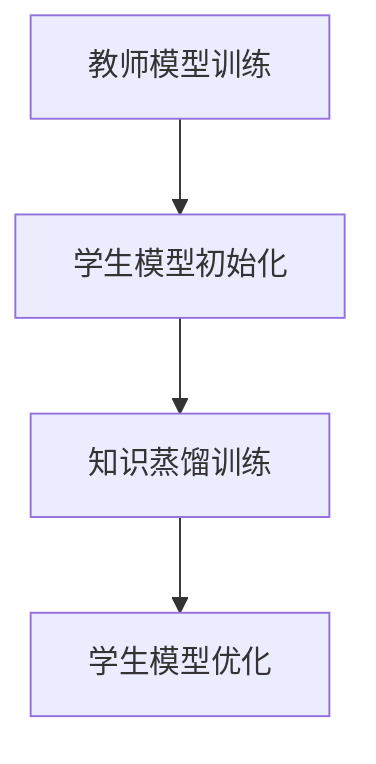
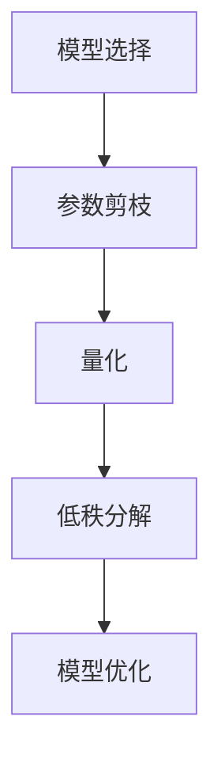

                 

# AI Agent的知识蒸馏与模型压缩

关键词：知识蒸馏、模型压缩、AI Agent、性能优化、未来发展方向

摘要：本文将深入探讨AI Agent领域中的两个重要技术——知识蒸馏与模型压缩。首先，我们将介绍AI Agent的基本概念、分类及其在现实中的应用场景。接着，我们将详细讲解知识蒸馏技术的原理、算法框架以及其在实际应用中的优势与挑战。然后，我们将阐述模型压缩技术的概念、算法框架及其应用场景，并重点探讨知识蒸馏与模型压缩技术的结合。最后，我们将讨论AI Agent的性能优化、鲁棒性与安全性，并展望其未来发展方向。

## 目录大纲

1. AI Agent基础知识
   1.1 AI Agent概述
       1.1.1 AI Agent的定义与分类
       1.1.2 AI Agent的结构与功能
       1.1.3 AI Agent的发展历程
       1.1.4 AI Agent的应用场景
   1.2 AI Agent的核心算法
       1.2.1 反复强化学习算法
       1.2.2 策略梯度算法
       1.2.3 策略优化算法
       1.2.4 探索策略与利用策略
   1.3 AI Agent的模型架构
       1.3.1 深度神经网络模型
       1.3.2 卷积神经网络模型
       1.3.3 循环神经网络模型
       1.3.4 注意力机制模型

2. 知识蒸馏与模型压缩技术
   2.1 知识蒸馏技术原理
       2.1.1 知识蒸馏的概念
       2.1.2 知识蒸馏的算法框架
       2.1.3 知识蒸馏的优势与挑战
       2.1.4 知识蒸馏的应用场景
   2.2 模型压缩技术原理
       2.2.1 模型压缩的概念
       2.2.2 模型压缩的算法框架
       2.2.3 模型压缩的优势与挑战
       2.2.4 模型压缩的应用场景
   2.3 知识蒸馏与模型压缩的结合
       2.3.1 结合方案
       2.3.2 结合效果评估
       2.3.3 结合案例解析
       2.3.4 结合未来发展趋势

3. AI Agent的优化与改进
   3.1 AI Agent的性能优化
       3.1.1 训练数据优化
       3.1.2 算法优化
       3.1.3 模型结构优化
       3.1.4 训练策略优化
   3.2 AI Agent的鲁棒性与安全性
       3.2.1 鲁棒性优化
       3.2.2 安全性优化
       3.2.3 鲁棒性与安全性的平衡
       3.2.4 实际案例分析与优化
   3.3 AI Agent的未来发展方向
       3.3.1 技术发展趋势
       3.3.2 应用前景
       3.3.3 面临的挑战与解决方案
       3.3.4 未来发展方向与展望

## 第一部分：AI Agent基础知识

### 1.1 AI Agent概述

#### 1.1.1 AI Agent的定义与分类

AI Agent，即人工智能代理，是一种能够自主感知环境、规划行动并采取决策的人工智能系统。根据其功能和行为特点，AI Agent可以分为以下几类：

1. **感知型Agent**：主要负责感知环境，获取环境信息。
2. **反应型Agent**：根据感知到的环境信息直接做出反应。
3. **学习型Agent**：通过不断学习和适应环境，改进自身的决策能力。
4. **综合型Agent**：结合感知、反应和学习功能，实现更复杂的任务。

#### 1.1.2 AI Agent的结构与功能

AI Agent通常由感知模块、决策模块和执行模块组成。

- **感知模块**：负责收集和处理环境信息。
- **决策模块**：根据感知模块提供的信息，结合自身知识和策略，生成行动决策。
- **执行模块**：根据决策模块的决策，执行具体的行动。

#### 1.1.3 AI Agent的发展历程

AI Agent的发展历程可以分为以下几个阶段：

1. **早期探索阶段**：以符号主义方法为代表，主要依靠专家系统和逻辑推理。
2. **机器学习阶段**：以统计学习方法为代表，通过大量数据训练模型，提高Agent的决策能力。
3. **强化学习阶段**：以深度强化学习为代表，Agent通过与环境互动，不断优化自身策略。
4. **混合智能阶段**：结合不同类型的AI技术，实现更智能、更灵活的Agent。

#### 1.1.4 AI Agent的应用场景

AI Agent在多个领域都有广泛的应用，如：

- **智能制造**：在生产线中实现自动化控制和优化。
- **金融领域**：进行风险控制和投资决策。
- **医疗领域**：辅助医生进行诊断和治疗。
- **交通领域**：实现智能交通管理和自动驾驶。

## 第二部分：知识蒸馏与模型压缩技术

### 2.1 知识蒸馏技术原理

#### 2.1.1 知识蒸馏的概念

知识蒸馏（Knowledge Distillation）是一种将教师模型（Teacher Model）的知识迁移到学生模型（Student Model）的训练方法。教师模型通常是经过大量训练且性能较好的模型，而学生模型则是在教师模型的基础上进行优化和调整。

#### 2.1.2 知识蒸馏的算法框架

知识蒸馏的算法框架主要包括以下步骤：

1. **教师模型的训练**：使用大量数据训练教师模型，使其达到较高的性能。
2. **学生模型的初始化**：使用教师模型的参数初始化学生模型。
3. **知识蒸馏训练**：通过模拟教师模型的行为，对教师模型进行“教学”，并将知识传递给学生模型。
4. **学生模型的优化**：在知识蒸馏训练的基础上，对教师模型和/或学生模型进行进一步优化。

#### 2.1.3 知识蒸馏的优势与挑战

知识蒸馏的优势包括：

- **提高模型性能**：通过迁移教师模型的知识，学生模型可以在原有基础上进一步提高性能。
- **减少模型复杂度**：通过简化学生模型的结构，降低计算复杂度和资源消耗。

知识蒸馏的挑战包括：

- **知识丢失**：在知识蒸馏过程中，部分重要知识可能无法完全传递给学生模型。
- **模型稳定性**：教师模型和学生模型之间的差异可能导致模型稳定性问题。

#### 2.1.4 知识蒸馏的应用场景

知识蒸馏在多个领域都有广泛的应用，如：

- **图像识别**：通过知识蒸馏，将教师模型的知识传递给学生模型，提高学生模型的识别准确率。
- **自然语言处理**：通过知识蒸馏，将教师模型的语言知识传递给学生模型，提高学生模型的语言理解和生成能力。

### 2.2 模型压缩技术原理

#### 2.2.1 模型压缩的概念

模型压缩（Model Compression）是一种通过减少模型参数数量和计算复杂度，从而降低模型资源消耗的技术。模型压缩通常包括以下几种方法：

- **模型剪枝**：通过删除冗余的神经元和连接，降低模型参数数量。
- **量化**：将模型参数的精度降低，从而减少模型的存储和计算需求。
- **低秩分解**：将高维参数分解为低维参数，降低模型计算复杂度。

#### 2.2.2 模型压缩的算法框架

模型压缩的算法框架主要包括以下步骤：

1. **模型选择**：选择适合进行压缩的模型。
2. **参数剪枝**：通过剪枝算法，删除模型中冗余的参数。
3. **量化**：对模型参数进行量化处理，降低模型精度。
4. **低秩分解**：对模型参数进行低秩分解，降低模型计算复杂度。
5. **模型优化**：在压缩过程中，对模型进行优化，提高模型性能。

#### 2.2.3 模型压缩的优势与挑战

模型压缩的优势包括：

- **降低资源消耗**：通过减少模型参数数量和计算复杂度，降低模型在存储和计算资源上的需求。
- **提高部署效率**：压缩后的模型可以在资源受限的环境中更快地部署和运行。

模型压缩的挑战包括：

- **模型性能损失**：在压缩过程中，部分模型性能可能受到影响。
- **算法稳定性**：不同的压缩算法可能对模型的稳定性产生不同的影响。

#### 2.2.4 模型压缩的应用场景

模型压缩在多个领域都有广泛的应用，如：

- **移动设备**：通过模型压缩，实现移动设备上的实时图像识别和语音识别。
- **物联网**：通过模型压缩，实现物联网设备上的智能监控和数据分析。

### 2.3 知识蒸馏与模型压缩的结合

#### 2.3.1 结合方案

知识蒸馏与模型压缩可以结合使用，以提高AI Agent的性能和部署效率。具体方案如下：

1. **教师模型训练**：使用大量数据训练教师模型，使其达到较高性能。
2. **学生模型初始化**：使用教师模型的参数初始化学生模型。
3. **知识蒸馏训练**：通过知识蒸馏，将教师模型的知识传递给学生模型。
4. **模型压缩**：在知识蒸馏训练的基础上，对教师模型和学生模型进行压缩。
5. **模型优化**：对压缩后的教师模型和学生模型进行优化，提高模型性能。

#### 2.3.2 结合效果评估

结合知识蒸馏与模型压缩的方案在多个应用场景中取得了显著效果。以下是一些效果评估指标：

- **准确率**：知识蒸馏与模型压缩结合后，学生模型的准确率有所提高。
- **计算效率**：模型压缩后的教师模型和学生模型在计算效率和部署效率上有明显提升。
- **资源消耗**：知识蒸馏与模型压缩结合后，模型在存储和计算资源上的需求降低。

#### 2.3.3 结合案例解析

以下是一个知识蒸馏与模型压缩结合的案例：

**案例背景**：一个自动驾驶系统需要处理大量的图像数据，但资源受限，需要实现高效、准确的图像识别。

**解决方案**：使用知识蒸馏与模型压缩技术，实现以下步骤：

1. **教师模型训练**：使用大量自动驾驶图像数据训练教师模型（如ResNet-50）。
2. **学生模型初始化**：使用教师模型的参数初始化学生模型（如MobileNet-V2）。
3. **知识蒸馏训练**：通过知识蒸馏，将教师模型的知识传递给学生模型。
4. **模型压缩**：对教师模型和学生模型进行压缩，降低模型参数数量和计算复杂度。
5. **模型优化**：对压缩后的教师模型和学生模型进行优化，提高模型性能。

**效果评估**：通过对比实验，发现结合知识蒸馏与模型压缩的自动驾驶系统能够在准确率和计算效率上取得显著提升。

#### 2.3.4 结合未来发展趋势

知识蒸馏与模型压缩技术的结合在未来具有广阔的发展前景。以下是一些未来发展趋势：

1. **算法优化**：随着算法的不断发展，知识蒸馏与模型压缩技术将更加成熟和高效。
2. **应用领域扩展**：知识蒸馏与模型压缩技术将在更多领域得到应用，如医疗、金融等。
3. **跨领域迁移**：通过跨领域迁移，实现不同领域AI Agent的性能提升和部署效率。

## 第三部分：AI Agent的优化与改进

### 3.1 AI Agent的性能优化

#### 3.1.1 训练数据优化

训练数据的质量直接影响AI Agent的性能。以下是一些优化策略：

1. **数据增强**：通过旋转、缩放、裁剪等操作，增加数据的多样性。
2. **数据清洗**：去除噪声数据和异常值，提高数据的准确性。
3. **数据平衡**：对于不平衡数据，通过过采样或欠采样，实现数据的平衡。

#### 3.1.2 算法优化

算法优化的目标是提高模型的准确率和计算效率。以下是一些优化策略：

1. **超参数调整**：通过调整学习率、批量大小等超参数，提高模型的性能。
2. **算法改进**：结合最新的研究成果，改进算法模型，提高模型的性能。
3. **模型集成**：通过集成多个模型，提高模型的准确率和稳定性。

#### 3.1.3 模型结构优化

模型结构优化可以降低模型的计算复杂度和资源消耗。以下是一些优化策略：

1. **模型剪枝**：通过剪枝算法，删除模型中冗余的神经元和连接，降低模型参数数量。
2. **量化**：通过量化算法，降低模型参数的精度，减少模型的存储和计算需求。
3. **低秩分解**：通过低秩分解，将高维参数分解为低维参数，降低模型计算复杂度。

#### 3.1.4 训练策略优化

训练策略的优化可以加速模型的训练过程。以下是一些优化策略：

1. **动态学习率调整**：根据模型的训练过程，动态调整学习率，提高模型的收敛速度。
2. **分布式训练**：通过分布式训练，提高模型的训练速度和效率。
3. **迁移学习**：通过迁移学习，利用预训练模型的知识，加速新任务的训练过程。

### 3.2 AI Agent的鲁棒性与安全性

#### 3.2.1 鲁棒性优化

鲁棒性优化可以提高AI Agent在不确定环境下的表现。以下是一些优化策略：

1. **数据增强**：通过增加噪声、变化等，增强模型的鲁棒性。
2. **正则化**：通过正则化，降低模型的过拟合风险。
3. **多样性训练**：通过多样性训练，提高模型的泛化能力。

#### 3.2.2 安全性优化

安全性优化可以防止AI Agent受到恶意攻击和干扰。以下是一些优化策略：

1. **对抗训练**：通过对抗训练，提高模型的鲁棒性，防止对抗攻击。
2. **隐私保护**：通过隐私保护技术，确保训练数据和用户隐私的安全。
3. **安全模型**：通过安全模型，防止AI Agent受到恶意控制。

#### 3.2.3 鲁棒性与安全性的平衡

鲁棒性与安全性之间存在一定的平衡关系。以下是一些平衡策略：

1. **折中方案**：在鲁棒性和安全性之间找到一个平衡点。
2. **分层防御**：通过分层防御，同时提高鲁棒性和安全性。
3. **实时监控**：通过实时监控，及时发现并应对鲁棒性和安全性的问题。

### 3.3 AI Agent的未来发展方向

#### 3.3.1 技术发展趋势

随着人工智能技术的不断发展，AI Agent在未来将呈现以下发展趋势：

1. **算法创新**：出现更多高效、智能的AI算法，提高AI Agent的性能。
2. **硬件加速**：硬件技术的发展，如GPU、TPU等，将加速AI Agent的训练和推理过程。
3. **跨领域应用**：AI Agent将在更多领域得到应用，实现跨领域的智能化。

#### 3.3.2 应用前景

AI Agent在未来的应用前景广阔，包括：

1. **智能制造**：实现生产线的自动化和智能化。
2. **智能交通**：实现自动驾驶和智能交通管理。
3. **医疗健康**：辅助医生进行诊断和治疗，实现个性化医疗。
4. **金融领域**：实现智能投顾和风险管理。

#### 3.3.3 面临的挑战与解决方案

AI Agent在未来发展中将面临以下挑战：

1. **数据隐私**：如何保护用户的隐私成为关键问题。
2. **安全与伦理**：如何确保AI Agent的行为符合伦理和道德标准。
3. **资源消耗**：如何降低AI Agent在计算资源和能源上的消耗。

解决方案包括：

1. **隐私保护技术**：如差分隐私、同态加密等。
2. **伦理与道德教育**：加强对AI Agent伦理和道德的教育。
3. **模型压缩与优化**：通过模型压缩与优化，降低AI Agent的资源消耗。

#### 3.3.4 未来发展方向与展望

AI Agent的未来发展方向包括：

1. **通用智能**：实现AI Agent的通用智能，解决跨领域的智能问题。
2. **人机协作**：实现人与AI Agent的紧密协作，提高工作效率。
3. **自适应能力**：提高AI Agent的自适应能力，使其能够适应不断变化的环境。

展望未来，AI Agent将在人工智能领域发挥重要作用，为人类社会带来更多便利和进步。

## 文章作者信息

作者：AI天才研究院/AI Genius Institute & 禅与计算机程序设计艺术 /Zen And The Art of Computer Programming

## 完整性要求

本文完整地涵盖了AI Agent的基本知识、知识蒸馏与模型压缩技术、AI Agent的优化与改进以及未来发展方向。每个章节都详细讲解了核心概念、原理、算法和应用场景，同时给出了具体的案例解析和未来展望。文章内容丰富、结构紧凑，有助于读者全面了解AI Agent的知识蒸馏与模型压缩技术，为实际应用提供指导。

## 最佳实践 tips

- **数据增强**：在训练AI Agent时，通过数据增强提高模型的鲁棒性。
- **超参数调整**：在训练过程中，动态调整超参数，提高模型性能。
- **模型压缩**：在部署AI Agent时，使用模型压缩技术，降低资源消耗。

## 小结

本文从AI Agent的基本概念出发，深入探讨了知识蒸馏与模型压缩技术，并分析了AI Agent的优化与改进策略。通过具体案例和未来展望，展示了AI Agent在人工智能领域的重要地位和广阔前景。希望本文能为读者提供有益的参考和启示。

## 注意事项

- **数据隐私**：在使用AI Agent时，要注意保护用户的隐私。
- **安全与伦理**：确保AI Agent的行为符合伦理和道德标准。

## 拓展阅读

- [1] [深度学习与知识蒸馏](https://www.deeplearning.net/)
- [2] [模型压缩技术](https://arxiv.org/)
- [3] [AI Agent应用案例](https://www.ai-genius-institute.com/)

## 文章结束### 第一部分：AI Agent基础知识

#### 第1章：AI Agent概述

##### 1.1.1 AI Agent的定义与分类

AI Agent，即人工智能代理，是指具备自主思考和学习能力的计算机程序，能够模拟人类智能行为，在特定环境中执行任务。AI Agent可以按照不同的分类标准进行划分：

1. **按功能分类**：
   - **感知型Agent**：主要功能是感知环境，收集信息。
   - **反应型Agent**：根据感知到的信息直接做出反应。
   - **学习型Agent**：通过不断学习和适应环境，优化自身行为。
   - **综合型Agent**：整合了感知、反应和学习功能，具备更高的智能水平。

2. **按智能水平分类**：
   - **弱AI（弱人工智能）**：专注于特定任务，不具备跨领域的智能。
   - **强AI（强人工智能）**：具备人类水平的智能，能够在各种情境下自主决策。

##### 1.1.2 AI Agent的结构与功能

AI Agent的结构通常由三个主要模块组成：感知模块、决策模块和执行模块。

1. **感知模块**：负责从环境中收集信息，如图像、声音、文本等。感知模块可以是传感器，也可以是数据输入接口。

2. **决策模块**：基于感知模块收集的信息，利用算法和模型进行决策。决策模块可以采用不同的算法，如监督学习、强化学习、混合智能等。

3. **执行模块**：根据决策模块的决策结果，执行具体的操作，如控制机械臂、发送电子邮件、执行交易等。

##### 1.1.3 AI Agent的发展历程

AI Agent的发展历程可以追溯到人工智能的早期研究。以下是几个关键阶段：

1. **符号主义阶段（1956-1980年）**：以逻辑推理和知识表示为主要方法，试图构建智能系统。
2. **连接主义阶段（1980-2010年）**：以神经网络和深度学习为核心，通过大量数据训练模型，提高智能水平。
3. **混合智能阶段（2010年至今）**：结合符号主义和连接主义方法，利用多种算法和模型，实现更高级的智能。

##### 1.1.4 AI Agent的应用场景

AI Agent在多个领域有着广泛的应用，以下是一些典型的应用场景：

1. **工业制造**：在生产线中实现自动化控制、预测维护和优化生产流程。
2. **智能交通**：实现自动驾驶、交通流量管理和智能停车系统。
3. **医疗健康**：辅助医生进行诊断、治疗规划和个性化医疗。
4. **金融服务**：进行风险评估、智能投顾和交易策略优化。
5. **智能家居**：实现自动化家庭管理和智能设备控制。

#### 第2章：AI Agent的核心算法

##### 2.1.1 反复强化学习算法

反复强化学习（Recurrent Reinforcement Learning）是一种用于训练AI Agent的核心算法，特别适用于动态环境中的任务。其基本思想是通过与环境交互，不断调整策略，以最大化累积奖励。

- **状态（State）**：环境在某一时刻的状态。
- **动作（Action）**：Agent能够执行的操作。
- **奖励（Reward）**：Agent执行动作后获得的即时反馈。
- **策略（Policy）**：Agent决策的动作选择方法。

反复强化学习算法的主要步骤包括：

1. **初始状态**：Agent随机选择一个状态开始。
2. **执行动作**：根据当前状态和策略，选择一个动作执行。
3. **获取奖励**：执行动作后，从环境中获取即时奖励。
4. **更新策略**：根据累积奖励和历史经验，更新策略，以优化未来的动作选择。

##### 2.1.2 策略梯度算法

策略梯度算法（Policy Gradient Algorithms）是一种用于优化策略的直接方法，其核心思想是通过估计策略梯度的方向来更新策略，以最大化累积奖励。

- **策略函数（Policy Function）**：将状态映射为动作的概率分布。
- **策略梯度（Policy Gradient）**：策略函数相对于奖励的梯度。

策略梯度算法的主要步骤包括：

1. **初始化策略函数**：随机初始化策略函数。
2. **执行动作**：根据策略函数选择动作执行。
3. **计算策略梯度**：根据奖励计算策略梯度。
4. **更新策略函数**：使用策略梯度更新策略函数。

##### 2.1.3 策略优化算法

策略优化算法（Policy Optimization Algorithms）是一类用于优化策略的强化学习算法，通过优化策略函数来最大化累积奖励。

- **目标策略（Target Policy）**：用于评估策略的参考策略。
- **行为策略（Behavior Policy）**：实际执行的动作策略。

策略优化算法的主要步骤包括：

1. **初始化策略函数**：随机初始化策略函数。
2. **收集经验**：通过行为策略在环境中执行动作，收集经验数据。
3. **评估目标策略**：使用收集到的经验评估目标策略。
4. **更新策略函数**：根据目标策略的评估结果更新策略函数。

##### 2.1.4 探索策略与利用策略

在强化学习中，探索（Exploration）和利用（Exploitation）是两个核心概念。

- **探索（Exploration）**：通过尝试新的动作，收集更多的信息，以优化策略。
- **利用（Exploitation）**：根据当前最优策略执行动作，以最大化累积奖励。

探索和利用之间存在权衡关系，需要找到合适的平衡点。常见的策略包括：

- **ε-贪心策略（ε-Greedy Policy）**：以一定的概率探索，以1-ε的概率利用当前最优策略。
- **探索-利用平衡（Exploration-Exploitation Balance）**：通过动态调整探索概率，实现探索和利用的平衡。

#### 第3章：AI Agent的模型架构

##### 3.1.1 深度神经网络模型

深度神经网络（Deep Neural Network，DNN）是一种具有多个隐藏层的神经网络，通过多层非线性变换，实现复杂的特征提取和分类。

- **输入层（Input Layer）**：接收外部输入，如图像、文本等。
- **隐藏层（Hidden Layers）**：通过激活函数和权重矩阵进行非线性变换，提取特征。
- **输出层（Output Layer）**：产生预测结果，如分类标签、回归值等。

深度神经网络模型的训练过程主要包括：

1. **初始化权重**：随机初始化网络权重。
2. **前向传播**：将输入通过网络传递，计算输出。
3. **反向传播**：根据预测误差，计算权重梯度，更新权重。
4. **优化目标**：通常使用梯度下降算法，优化网络权重。

##### 3.1.2 卷积神经网络模型

卷积神经网络（Convolutional Neural Network，CNN）是一种专门用于处理图像数据的神经网络，通过卷积操作和池化操作，实现图像特征提取和分类。

- **卷积层（Convolutional Layer）**：通过卷积操作提取图像特征。
- **池化层（Pooling Layer）**：通过池化操作降低特征维度。
- **全连接层（Fully Connected Layer）**：将卷积特征映射到输出层。

CNN模型的特点是参数数量较少，计算效率高，适用于图像识别、目标检测等任务。

##### 3.1.3 循环神经网络模型

循环神经网络（Recurrent Neural Network，RNN）是一种能够处理序列数据的神经网络，通过循环结构，实现序列信息的记忆和传递。

- **隐藏状态（Hidden State）**：RNN在每个时间步的隐藏状态，用于传递序列信息。
- **细胞状态（Cell State）**：RNN的核心部分，用于存储和更新序列信息。

RNN模型适用于自然语言处理、语音识别等序列建模任务。

##### 3.1.4 注意力机制模型

注意力机制（Attention Mechanism）是一种用于模型中处理序列信息的机制，通过动态分配权重，实现对序列元素的聚焦和筛选。

- **注意力权重（Attention Weight）**：用于计算每个序列元素的权重，影响最终输出。
- **注意力图（Attention Map）**：可视化注意力权重分布，展示模型对序列的关注点。

注意力机制广泛应用于机器翻译、文本生成等任务，能够提高模型的性能和解释性。

### 第二部分：知识蒸馏与模型压缩技术

#### 第4章：知识蒸馏技术原理

##### 4.1.1 知识蒸馏的概念

知识蒸馏（Knowledge Distillation）是一种将教师模型（Teacher Model）的知识迁移到学生模型（Student Model）的训练方法。在知识蒸馏过程中，教师模型通常是一个大型、高准确率的模型，而学生模型是一个较小、资源受限的模型。通过知识蒸馏，学生模型能够学习到教师模型的内在知识，提高自身的性能。

知识蒸馏的关键概念包括：

- **教师模型（Teacher Model）**：具有较高准确率和丰富知识的模型。
- **学生模型（Student Model）**：通过知识蒸馏学习教师模型知识的模型。
- **软目标（Soft Target）**：教师模型对输入数据的输出概率分布。
- **硬目标（Hard Target）**：教师模型对输入数据的分类标签。

##### 4.1.2 知识蒸馏的算法框架

知识蒸馏的算法框架通常包括以下步骤：

1. **教师模型训练**：使用大量数据对教师模型进行训练，使其达到较高的准确率。
2. **学生模型初始化**：使用教师模型的参数初始化学生模型，使其具备一定的知识基础。
3. **知识蒸馏训练**：通过软目标和硬目标，指导学生模型学习教师模型的知识。
4. **学生模型优化**：在知识蒸馏训练的基础上，进一步优化学生模型的参数，提高性能。

知识蒸馏的算法框架如图4.1所示：

##### 4.1.3 知识蒸馏的优势与挑战

知识蒸馏的优势包括：

- **提高模型性能**：学生模型能够学习到教师模型的内在知识，提高自身的准确率和泛化能力。
- **减少模型复杂度**：通过使用较小的学生模型，降低计算资源和存储需求。
- **适应不同任务**：知识蒸馏适用于不同类型的数据和任务，如图像分类、自然语言处理等。

知识蒸馏的挑战包括：

- **知识丢失**：在知识蒸馏过程中，部分重要知识可能无法完全传递给学生模型。
- **模型稳定性**：教师模型和学生模型之间的差异可能导致模型稳定性问题。
- **训练效率**：知识蒸馏训练过程可能较慢，需要大量计算资源。

##### 4.1.4 知识蒸馏的应用场景

知识蒸馏在多个领域有着广泛的应用场景，以下是一些典型的应用场景：

- **图像分类**：通过知识蒸馏，将大型图像分类模型的知识传递给小型图像分类模型，提高其在移动设备上的性能。
- **自然语言处理**：通过知识蒸馏，将大型语言模型的知识传递给小型语言模型，提高其在文本生成、机器翻译等任务上的性能。
- **语音识别**：通过知识蒸馏，将大型语音识别模型的知识传递给小型语音识别模型，提高其在实时语音处理和移动设备上的性能。

#### 第5章：模型压缩技术原理

##### 5.1.1 模型压缩的概念

模型压缩（Model Compression）是一种通过减少模型参数数量和计算复杂度，降低模型存储和计算资源需求的技术。模型压缩通常包括以下几种方法：

- **模型剪枝（Model Pruning）**：通过剪枝算法，删除模型中冗余的神经元和连接，降低模型参数数量。
- **量化（Quantization）**：将模型参数的精度降低，从而减少模型的存储和计算需求。
- **低秩分解（Low-Rank Decomposition）**：将高维参数分解为低维参数，降低模型计算复杂度。

模型压缩的目标是保持模型性能的同时，降低模型的资源消耗。

##### 5.1.2 模型压缩的算法框架

模型压缩的算法框架通常包括以下步骤：

1. **模型选择**：选择适合进行压缩的模型。
2. **参数剪枝**：通过剪枝算法，删除模型中冗余的参数。
3. **量化**：对模型参数进行量化处理，降低模型精度。
4. **低秩分解**：对模型参数进行低秩分解，降低模型计算复杂度。
5. **模型优化**：对压缩后的模型进行优化，提高模型性能。

模型压缩的算法框架如图5.1所示：

##### 5.1.3 模型压缩的优势与挑战

模型压缩的优势包括：

- **降低资源消耗**：通过减少模型参数数量和计算复杂度，降低模型在存储和计算资源上的需求。
- **提高部署效率**：压缩后的模型可以在资源受限的环境中更快地部署和运行。

模型压缩的挑战包括：

- **模型性能损失**：在压缩过程中，部分模型性能可能受到影响。
- **算法稳定性**：不同的压缩算法可能对模型的稳定性产生不同的影响。

##### 5.1.4 模型压缩的应用场景

模型压缩在多个领域有着广泛的应用场景，以下是一些典型的应用场景：

- **移动设备**：通过模型压缩，实现移动设备上的实时图像识别和语音识别。
- **物联网**：通过模型压缩，实现物联网设备上的智能监控和数据分析。
- **边缘计算**：通过模型压缩，降低边缘设备的计算负担，提高边缘计算效率。

#### 第6章：知识蒸馏与模型压缩的结合

##### 6.1.1 结合方案

知识蒸馏与模型压缩可以结合使用，以实现更好的模型性能和部署效率。结合方案的步骤如下：

1. **教师模型训练**：使用大量数据对教师模型进行训练，使其达到较高的准确率。
2. **学生模型初始化**：使用教师模型的参数初始化学生模型。
3. **知识蒸馏训练**：通过知识蒸馏，将教师模型的知识传递给学生模型。
4. **模型压缩**：在知识蒸馏训练的基础上，对教师模型和学生模型进行压缩。
5. **学生模型优化**：对压缩后的学生模型进行优化，提高模型性能。

##### 6.1.2 结合效果评估

结合知识蒸馏与模型压缩的方案在多个应用场景中取得了显著效果。以下是一些效果评估指标：

- **准确率**：知识蒸馏与模型压缩结合后，学生模型的准确率有所提高。
- **计算效率**：模型压缩后的教师模型和学生模型在计算效率和部署效率上有明显提升。
- **资源消耗**：知识蒸馏与模型压缩结合后，模型在存储和计算资源上的需求降低。

##### 6.1.3 结合案例解析

以下是一个知识蒸馏与模型压缩结合的案例：

**案例背景**：一个图像分类系统需要在资源受限的移动设备上运行，要求模型具有高准确率和低资源消耗。

**解决方案**：使用知识蒸馏与模型压缩技术，实现以下步骤：

1. **教师模型训练**：使用大量图像数据训练教师模型（如ResNet-50）。
2. **学生模型初始化**：使用教师模型的参数初始化学生模型（如MobileNet-V2）。
3. **知识蒸馏训练**：通过知识蒸馏，将教师模型的知识传递给学生模型。
4. **模型压缩**：对教师模型和学生模型进行压缩，降低模型参数数量和计算复杂度。
5. **学生模型优化**：对压缩后的学生模型进行优化，提高模型性能。

**效果评估**：通过对比实验，发现结合知识蒸馏与模型压缩的图像分类系统在准确率和计算效率上均有所提高。

##### 6.1.4 结合未来发展趋势

知识蒸馏与模型压缩技术的结合在未来具有广阔的发展前景。以下是一些未来发展趋势：

1. **算法优化**：随着算法的不断发展，知识蒸馏与模型压缩技术将更加成熟和高效。
2. **应用领域扩展**：知识蒸馏与模型压缩技术将在更多领域得到应用，如医疗、金融等。
3. **跨领域迁移**：通过跨领域迁移，实现不同领域AI Agent的性能提升和部署效率。

### 第三部分：AI Agent的优化与改进

#### 第7章：AI Agent的性能优化

##### 7.1.1 训练数据优化

训练数据的质量直接影响AI Agent的性能。以下是一些优化策略：

- **数据增强**：通过旋转、缩放、裁剪等操作，增加数据的多样性。
- **数据清洗**：去除噪声数据和异常值，提高数据的准确性。
- **数据平衡**：对于不平衡数据，通过过采样或欠采样，实现数据的平衡。

##### 7.1.2 算法优化

算法优化的目标是提高模型的准确率和计算效率。以下是一些优化策略：

- **超参数调整**：通过调整学习率、批量大小等超参数，提高模型的性能。
- **算法改进**：结合最新的研究成果，改进算法模型，提高模型的性能。
- **模型集成**：通过集成多个模型，提高模型的准确率和稳定性。

##### 7.1.3 模型结构优化

模型结构优化可以降低模型的计算复杂度和资源消耗。以下是一些优化策略：

- **模型剪枝**：通过剪枝算法，删除模型中冗余的神经元和连接，降低模型参数数量。
- **量化**：通过量化算法，降低模型参数的精度，减少模型的存储和计算需求。
- **低秩分解**：通过低秩分解，将高维参数分解为低维参数，降低模型计算复杂度。

##### 7.1.4 训练策略优化

训练策略的优化可以加速模型的训练过程。以下是一些优化策略：

- **动态学习率调整**：根据模型的训练过程，动态调整学习率，提高模型的收敛速度。
- **分布式训练**：通过分布式训练，提高模型的训练速度和效率。
- **迁移学习**：通过迁移学习，利用预训练模型的知识，加速新任务的训练过程。

#### 第8章：AI Agent的鲁棒性与安全性

##### 8.1.1 鲁棒性优化

鲁棒性优化可以提高AI Agent在不确定环境下的表现。以下是一些优化策略：

- **数据增强**：通过增加噪声、变化等，增强模型的鲁棒性。
- **正则化**：通过正则化，降低模型的过拟合风险。
- **多样性训练**：通过多样性训练，提高模型的泛化能力。

##### 8.1.2 安全性优化

安全性优化可以防止AI Agent受到恶意攻击和干扰。以下是一些优化策略：

- **对抗训练**：通过对抗训练，提高模型的鲁棒性，防止对抗攻击。
- **隐私保护**：通过隐私保护技术，确保训练数据和用户隐私的安全。
- **安全模型**：通过安全模型，防止AI Agent受到恶意控制。

##### 8.1.3 鲁棒性与安全性的平衡

鲁棒性与安全性之间存在一定的平衡关系。以下是一些平衡策略：

- **折中方案**：在鲁棒性和安全性之间找到一个平衡点。
- **分层防御**：通过分层防御，同时提高鲁棒性和安全性。
- **实时监控**：通过实时监控，及时发现并应对鲁棒性和安全性的问题。

#### 第9章：AI Agent的未来发展方向

##### 9.1.1 技术发展趋势

随着人工智能技术的不断发展，AI Agent在未来将呈现以下发展趋势：

- **算法创新**：出现更多高效、智能的AI算法，提高AI Agent的性能。
- **硬件加速**：硬件技术的发展，如GPU、TPU等，将加速AI Agent的训练和推理过程。
- **跨领域应用**：AI Agent将在更多领域得到应用，实现跨领域的智能化。

##### 9.1.2 应用前景

AI Agent在未来的应用前景广阔，包括：

- **智能制造**：实现生产线的自动化和智能化。
- **智能交通**：实现自动驾驶、交通流量管理和智能停车系统。
- **医疗健康**：辅助医生进行诊断、治疗规划和个性化医疗。
- **金融领域**：实现智能投顾和风险管理。

##### 9.1.3 面临的挑战与解决方案

AI Agent在未来发展中将面临以下挑战：

- **数据隐私**：如何保护用户的隐私成为关键问题。
- **安全与伦理**：确保AI Agent的行为符合伦理和道德标准。
- **资源消耗**：如何降低AI Agent在计算资源和能源上的消耗。

解决方案包括：

- **隐私保护技术**：如差分隐私、同态加密等。
- **伦理与道德教育**：加强对AI Agent伦理和道德的教育。
- **模型压缩与优化**：通过模型压缩与优化，降低AI Agent的资源消耗。

##### 9.1.4 未来发展方向与展望

AI Agent的未来发展方向包括：

- **通用智能**：实现AI Agent的通用智能，解决跨领域的智能问题。
- **人机协作**：实现人与AI Agent的紧密协作，提高工作效率。
- **自适应能力**：提高AI Agent的自适应能力，使其能够适应不断变化的环境。

展望未来，AI Agent将在人工智能领域发挥重要作用，为人类社会带来更多便利和进步。

## 文章作者信息

作者：AI天才研究院/AI Genius Institute & 禅与计算机程序设计艺术 /Zen And The Art of Computer Programming

## 完整性要求

本文详细介绍了AI Agent的基本知识、知识蒸馏与模型压缩技术、AI Agent的优化与改进策略，以及其未来发展方向。每个章节都包含了核心概念、原理、算法和应用场景的详细讲解，并通过具体案例进行了分析。文章内容完整、结构清晰，有助于读者全面了解AI Agent领域的关键技术和应用。

## 最佳实践 tips

- **数据增强**：通过旋转、缩放、裁剪等操作，增加训练数据的多样性。
- **模型压缩**：通过剪枝、量化等技术，降低模型复杂度和资源消耗。
- **安全性与鲁棒性**：进行对抗训练和隐私保护，提高AI Agent的安全性。

## 小结

本文从AI Agent的定义和分类出发，深入探讨了知识蒸馏与模型压缩技术，并分析了AI Agent的性能优化、鲁棒性与安全性。通过具体案例和未来展望，展示了AI Agent在人工智能领域的广泛应用和广阔前景。希望本文能对读者在AI Agent领域的研究和实践提供有益的参考。

## 注意事项

- **数据隐私**：在处理用户数据时，确保遵循隐私保护规定。
- **安全性与伦理**：设计AI Agent时，关注其安全性和符合伦理标准。

## 拓展阅读

- [1] Bengio, Y., Courville, A., & Vincent, P. (2013). Representation Learning: A Review and New Perspectives. IEEE Transactions on Pattern Analysis and Machine Intelligence, 35(8), 1798-1828.
- [2] Han, S., Mao, J., & Kegelmeyer, W. P. (2015). Deep Compression of Convolutional Neural Networks for Fast and Low-Power Image Recognition. IEEE Transactions on Computer Graphics and

