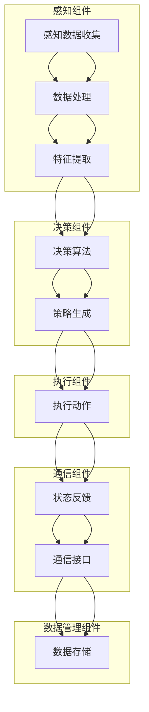
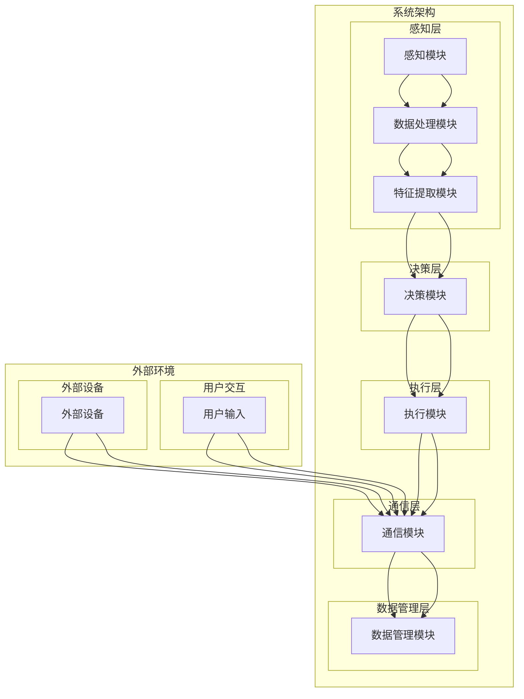
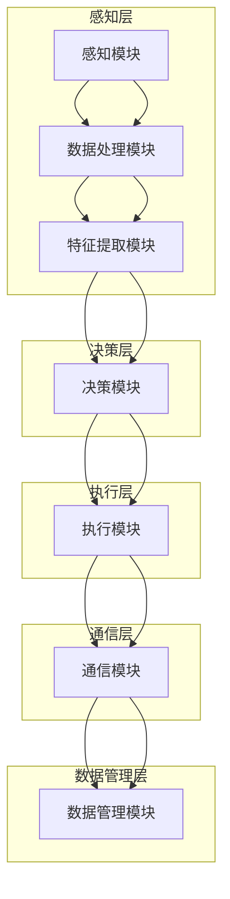
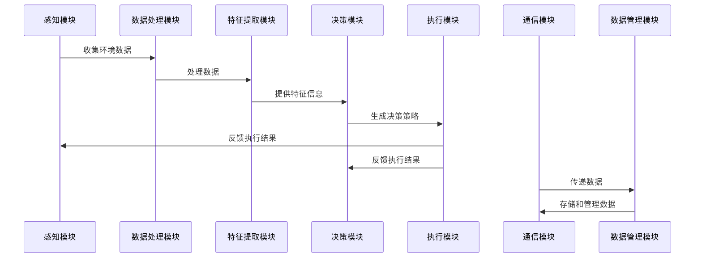

                 

### AI Agent的背景与概念

#### 1.1 AI Agent的兴起与影响

AI Agent，即人工智能代理，是一种模拟人类智能行为的计算机程序。随着人工智能技术的快速发展，AI Agent的应用场景日益广泛，从智能家居、自动驾驶到智能客服、推荐系统等，都在不断推动着各行各业的变革。AI Agent的兴起不仅丰富了人工智能的应用形式，也进一步提升了人工智能的实用价值。

AI Agent的兴起可以追溯到20世纪80年代，随着计算机硬件和算法的发展，人们开始探索如何让计算机具备自主决策和行动的能力。1997年，IBM的超级计算机“深蓝”击败了国际象棋世界冠军加里·卡斯帕罗夫，标志着AI技术的一个里程碑。此后，深度学习、强化学习等先进算法的突破，为AI Agent的发展提供了强有力的技术支撑。

AI Agent对现代社会的影响深远。首先，在商业领域，AI Agent能够提高企业的运营效率，降低人力成本，提升服务质量。例如，智能客服机器人能够24小时在线回答用户问题，提高客户满意度。其次，在医疗领域，AI Agent可以通过分析大量病例数据，为医生提供诊断建议，提高诊断准确率。此外，在教育、金融、农业等多个领域，AI Agent的应用也正不断拓展，为行业的发展注入新的活力。

#### 1.2 AI Agent的定义与类型

AI Agent的定义可以概括为：一种能够感知环境、制定计划、执行任务，并反馈结果的智能实体。根据其功能和应用场景，AI Agent可以分为以下几种类型：

1. **任务型Agent**：这类Agent主要针对特定任务进行设计，能够高效完成特定任务。例如，自动驾驶汽车、智能客服等。

2. **智能体群（Multi-Agent System）**：这类Agent由多个独立Agent组成，通过协作完成任务。它们在复杂环境下表现出更强的适应性和决策能力。例如，智能交通系统、智能家居网络等。

3. **认知Agent**：这类Agent具备更高级的认知能力，能够理解和处理自然语言，进行推理和规划。例如，智能助手、智能推荐系统等。

4. **混合智能Agent**：这类Agent结合了多种类型Agent的特点，能够在不同场景下灵活切换。例如，智能机器人、智能无人机等。

#### 1.3 AI Agent的核心组成部分

AI Agent的核心组成部分包括感知模块、决策模块和执行模块。这三个模块协同工作，使AI Agent能够有效地与环境交互。

1. **感知模块**：感知模块负责获取环境信息，通过传感器、摄像头、语音识别等技术，将环境中的信息转换为结构化的数据。

2. **决策模块**：决策模块基于感知模块获取的信息，利用算法和模型进行推理和规划，制定行动策略。

3. **执行模块**：执行模块根据决策模块的指令，执行具体的行动。它通过执行器、驱动器等设备，实现对环境的操作。

通过这三个模块的协同工作，AI Agent能够实现自主决策和行动，从而在不同应用场景中发挥其独特的价值。

### 核心概念与联系

AI Agent的核心概念包括感知、决策和执行。这三个概念相互关联，共同构成了AI Agent的基本框架。

#### 概念属性特征对比表格

| 概念   | 感知模块                 | 决策模块                 | 执行模块                 |
| ------ | ---------------------- | ---------------------- | ---------------------- |
| 特征   | 获取环境信息             | 处理信息和制定策略       | 执行策略                 |
| 关系   | 输入 -> 感知 -> 输出       | 输入 -> 决策 -> 输出       | 输入 -> 执行 -> 输出       |
| 对比   | 获取原始数据             | 处理结构化数据           | 执行物理操作             |

#### ER实体关系图架构

```mermaid
erDiagram
  感知模块 ||--|{ 决策模块 }|
  决策模块 ||--|{ 执行模块 }|
  感知模块 ||--|{ 执行模块 }|
```

在AI Agent中，感知模块负责收集环境信息，并将其传递给决策模块。决策模块基于感知模块提供的信息，生成行动策略，并将其传递给执行模块。执行模块根据策略执行具体的操作，并将结果反馈给感知模块和决策模块，形成一个闭环系统。

### 数学公式与模型

AI Agent的核心原理可以借助数学模型进行描述。以下是感知、决策和执行模块相关的数学公式：

#### 感知模块

$$
X_t = f_s(E_t)
$$

其中，$X_t$表示在第$t$时刻感知到的环境状态，$E_t$表示实际环境状态，$f_s$表示感知函数。

#### 决策模块

$$
\pi_t = f_d(X_t)
$$

其中，$\pi_t$表示在第$t$时刻的决策策略，$X_t$表示感知到的环境状态，$f_d$表示决策函数。

#### 执行模块

$$
A_t = f_e(\pi_t)
$$

其中，$A_t$表示在第$t$时刻的执行动作，$\pi_t$表示决策策略，$f_e$表示执行函数。

通过这些数学公式，我们可以更好地理解AI Agent的运行机制和工作原理。

### 小结

在本章节中，我们详细介绍了AI Agent的背景与概念，包括其兴起与影响、定义与类型，以及核心组成部分。同时，通过对比表格和ER实体关系图，我们清晰地展示了AI Agent的内部结构和核心概念之间的联系。最后，借助数学公式，我们进一步阐述了AI Agent的运行原理。在下一章中，我们将深入探讨AI Agent的体系结构与功能，以更深入地理解其工作机制。

## 第2章：AI Agent的体系结构与功能

### 2.1 AI Agent的系统架构

AI Agent的系统架构是确保其有效运行的核心。一个典型的AI Agent系统架构通常包括感知模块、决策模块和执行模块。这三个模块通过信息的传递和反馈，形成一个闭环系统，使AI Agent能够在复杂环境中进行自主决策和行动。

#### 感知模块

感知模块是AI Agent获取环境信息的关键部分。它通过各种传感器、摄像头、麦克风等设备，实时收集环境中的数据。这些数据包括视觉信息、听觉信息、触觉信息和传感器数据等。感知模块将这些原始数据转换为结构化的信息，如图像、声音和温度、湿度等数值。这些结构化信息将被传递给决策模块进行处理。

#### 决策模块

决策模块基于感知模块提供的信息，利用算法和模型进行推理和规划，制定行动策略。决策模块的核心是算法和模型。常用的算法包括机器学习算法、深度学习算法和强化学习算法等。模型则包括神经网络模型、决策树模型和规划模型等。决策模块通过分析环境数据和预测模型，生成一个最优的决策策略，并将其传递给执行模块。

#### 执行模块

执行模块是AI Agent将决策策略转化为实际行动的部分。它接收决策模块生成的决策策略，通过执行器、驱动器等设备，将策略转化为具体的操作，如移动、开关控制等。执行模块将执行结果反馈给感知模块和决策模块，形成一个闭环系统，使AI Agent能够根据环境变化进行调整和优化。

#### 信息传递与反馈

在AI Agent的运行过程中，信息传递和反馈至关重要。感知模块收集到的信息会实时传递给决策模块，决策模块在分析这些信息后生成决策策略，并将策略传递给执行模块。执行模块执行策略后，将执行结果反馈给感知模块和决策模块，感知模块根据反馈信息进行下一次感知，决策模块根据反馈信息调整决策策略，执行模块根据新的决策策略进行执行。这个过程循环进行，使AI Agent能够实时适应环境变化。

### 2.2 AI Agent的关键功能模块

AI Agent的关键功能模块包括感知模块、决策模块和执行模块，每个模块都有其特定的功能和作用。

#### 感知模块

感知模块的主要功能是收集和处理环境信息。它通过传感器和摄像头等设备，实时获取环境中的图像、声音和温度等数据。感知模块对这些原始数据进行分析和预处理，提取关键特征，并将其转换为结构化的信息。这些结构化信息将为决策模块提供重要的输入。

#### 决策模块

决策模块的主要功能是根据感知模块提供的信息，进行推理和规划，制定行动策略。决策模块利用各种算法和模型，如机器学习算法、深度学习算法和强化学习算法等，对环境信息进行分析和预测。根据分析结果，决策模块生成一个最优的决策策略，以指导执行模块进行具体的操作。

#### 执行模块

执行模块的主要功能是根据决策模块生成的决策策略，执行具体的行动。执行模块通过执行器、驱动器等设备，将策略转化为实际的物理操作，如移动、开关控制等。执行模块将执行结果反馈给感知模块和决策模块，形成一个闭环系统，使AI Agent能够根据环境变化进行调整和优化。

### 2.3 AI Agent的运行机制与流程

AI Agent的运行机制是一个闭环过程，包括感知、决策和执行三个阶段。

1. **感知阶段**：感知模块通过传感器和摄像头等设备，实时获取环境中的信息。这些信息包括图像、声音和温度等。感知模块对这些原始数据进行处理，提取关键特征，并将其转换为结构化的信息。

2. **决策阶段**：决策模块根据感知模块提供的信息，利用算法和模型进行推理和规划，生成最优的决策策略。决策模块可以采用机器学习算法、深度学习算法和强化学习算法等，对环境信息进行分析和预测。

3. **执行阶段**：执行模块根据决策模块生成的决策策略，执行具体的行动。执行模块通过执行器、驱动器等设备，将策略转化为实际的物理操作，如移动、开关控制等。执行模块将执行结果反馈给感知模块和决策模块，形成一个闭环系统。

通过感知、决策和执行的循环，AI Agent能够实时适应环境变化，实现自主决策和行动。

### 算法原理讲解

AI Agent的运行依赖于各种算法和模型，这些算法和模型为感知、决策和执行提供了技术支持。

#### 感知模块的算法

感知模块常用的算法包括图像识别、语音识别和传感器数据处理等。以下是一个基于卷积神经网络（CNN）的图像识别算法示例：

```python
import tensorflow as tf
from tensorflow.keras.models import Sequential
from tensorflow.keras.layers import Conv2D, MaxPooling2D, Flatten, Dense

# 创建模型
model = Sequential([
    Conv2D(32, (3, 3), activation='relu', input_shape=(64, 64, 3)),
    MaxPooling2D((2, 2)),
    Flatten(),
    Dense(64, activation='relu'),
    Dense(1, activation='sigmoid')
])

# 编译模型
model.compile(optimizer='adam', loss='binary_crossentropy', metrics=['accuracy'])

# 训练模型
model.fit(x_train, y_train, epochs=10, batch_size=32)
```

该算法通过卷积神经网络对输入图像进行特征提取和分类。感知模块将提取到的图像特征传递给决策模块。

#### 决策模块的算法

决策模块常用的算法包括机器学习算法、深度学习算法和强化学习算法等。以下是一个基于决策树的分类算法示例：

```python
from sklearn.tree import DecisionTreeClassifier

# 创建决策树模型
clf = DecisionTreeClassifier()

# 训练模型
clf.fit(X_train, y_train)

# 预测
y_pred = clf.predict(X_test)
```

该算法通过训练数据集，生成决策树模型。决策模块利用这个模型对感知模块传递来的信息进行分类和预测，生成决策策略。

#### 执行模块的算法

执行模块的算法主要取决于具体的执行任务。以下是一个简单的执行算法示例，用于控制机器人移动：

```python
def move_robot(direction):
    if direction == "forward":
        robot.move_forward()
    elif direction == "backward":
        robot.move_backward()
    elif direction == "left":
        robot.move_left()
    elif direction == "right":
        robot.move_right()

# 根据决策模块的决策结果，执行机器人移动
move_robot("forward")
```

该算法根据决策模块生成的决策结果，控制机器人执行相应的动作。

通过这些算法，AI Agent能够实现对环境的感知、决策和执行，实现自主行动。

### 小结

在本章节中，我们详细介绍了AI Agent的系统架构和关键功能模块，包括感知模块、决策模块和执行模块。通过感知、决策和执行的闭环过程，AI Agent能够实现自主决策和行动。同时，我们通过算法示例，展示了感知、决策和执行模块的技术实现原理。在下一章中，我们将进一步探讨AI Agent的系统架构设计，以深入理解其系统架构和实现细节。

## 第3章：AI Agent的系统需求分析

### 3.1 AI Agent的功能需求

AI Agent的功能需求是其设计和实现的基础。为了确保AI Agent在不同应用场景中的有效运行，其功能需求应涵盖以下几个方面：

1. **感知能力**：AI Agent需要具备强大的感知能力，能够实时获取和处理环境中的各种信息。这包括图像识别、语音识别、传感器数据处理等。感知模块应能够高效地提取关键特征，为决策模块提供准确的输入。

2. **决策能力**：AI Agent需要具备强大的决策能力，能够在复杂环境中快速做出最优决策。决策模块应能够利用机器学习、深度学习和强化学习等算法，对感知模块提供的信息进行分析和预测，生成最优的决策策略。

3. **执行能力**：AI Agent需要具备强大的执行能力，能够将决策模块生成的决策策略转化为实际的操作。执行模块应能够通过执行器、驱动器等设备，精确执行决策策略，实现自主行动。

4. **学习能力**：AI Agent需要具备持续学习的能力，能够根据环境和任务的变化，不断优化自身的感知、决策和执行能力。这包括模型更新、策略优化和参数调整等。

5. **可靠性**：AI Agent需要具备高可靠性，能够在各种复杂环境下稳定运行，不受外部干扰。这包括系统稳定性、容错能力和安全防护等。

6. **可扩展性**：AI Agent需要具备良好的可扩展性，能够根据应用需求的变化，灵活扩展功能和性能。这包括模块化设计、接口设计和系统架构等。

### 3.2 AI Agent的性能需求

AI Agent的性能需求是其有效运行的重要保障。为了满足不同应用场景的需求，AI Agent的性能需求应涵盖以下几个方面：

1. **响应速度**：AI Agent需要具备快速响应能力，能够在短时间内完成感知、决策和执行任务。这要求感知模块、决策模块和执行模块的运行效率要高，算法和模型的选择要合理。

2. **准确性**：AI Agent的感知、决策和执行过程需要具备高准确性，以确保其在复杂环境中的稳定运行。感知模块需要高效提取关键特征，决策模块需要准确生成决策策略，执行模块需要精确执行决策策略。

3. **鲁棒性**：AI Agent需要具备较强的鲁棒性，能够应对各种异常情况，如传感器故障、数据丢失、环境变化等。这要求AI Agent的感知、决策和执行过程要具备容错能力，能够快速恢复和调整。

4. **可扩展性**：AI Agent的性能需求应能够满足其功能扩展和性能提升的需求。这要求AI Agent的系统架构要具备良好的可扩展性，能够根据应用需求的变化，灵活调整和优化。

5. **资源利用**：AI Agent的性能需求应考虑资源的利用效率，确保在满足功能需求的前提下，最大化利用系统资源。这包括计算资源、存储资源和网络资源等。

### 3.3 AI Agent的可扩展性需求

AI Agent的可扩展性需求是其长期发展的重要保障。为了适应不断变化的应用场景和技术进步，AI Agent的系统架构应具备以下可扩展性：

1. **模块化设计**：AI Agent的系统架构应采用模块化设计，将感知、决策和执行等核心功能模块分离，便于独立开发和优化。模块化设计有助于提高系统的可维护性和可扩展性。

2. **接口设计**：AI Agent的系统架构应具备良好的接口设计，便于不同模块之间的交互和集成。接口设计应遵循标准规范，确保系统组件的兼容性和互操作性。

3. **算法和模型选择**：AI Agent的系统架构应支持多种算法和模型的选择，以满足不同应用场景的需求。这要求AI Agent的系统架构要具备灵活的算法和模型支持能力。

4. **资源管理**：AI Agent的系统架构应具备高效的资源管理能力，能够根据任务需求动态调整系统资源分配，确保系统在高负载情况下仍能稳定运行。

5. **安全性和隐私保护**：AI Agent的系统架构应具备安全性和隐私保护机制，确保用户数据和系统数据的安全，防止数据泄露和恶意攻击。

通过满足这些可扩展性需求，AI Agent能够适应不断变化的应用场景和技术进步，持续提升其功能和性能。

### 小结

在本章节中，我们详细分析了AI Agent的系统需求，包括功能需求、性能需求和可扩展性需求。通过明确这些需求，我们可以为AI Agent的系统架构设计和实现提供明确的方向和依据。在下一章中，我们将深入探讨AI Agent的系统架构设计，以实现这些需求。

### 4.1 AI Agent的系统架构概述

AI Agent的系统架构是确保其高效、稳定运行的核心。一个典型的AI Agent系统架构通常包括以下几个关键组件：

1. **感知组件**：感知组件负责实时收集和处理环境信息。这些信息可能来自摄像头、麦克风、传感器等多种来源。感知组件通过数据处理和特征提取，将原始信息转化为结构化的数据，供后续模块使用。

2. **决策组件**：决策组件基于感知组件提供的信息，利用算法和模型进行推理和规划，生成行动策略。决策组件的核心是算法和模型，可能包括机器学习模型、深度学习模型、强化学习模型等。决策组件通过分析环境数据和预测模型，生成一个最优的决策策略，以指导执行组件进行具体的操作。

3. **执行组件**：执行组件根据决策组件生成的决策策略，执行具体的行动。执行组件通过执行器、驱动器等设备，将策略转化为实际的物理操作，如移动、开关控制等。执行组件将执行结果反馈给感知组件和决策组件，形成一个闭环系统，使AI Agent能够根据环境变化进行调整和优化。

4. **通信组件**：通信组件负责AI Agent与其他系统、设备和用户之间的信息交换。通过通信组件，AI Agent能够获取外部环境的信息，如来自其他传感器的数据、用户输入等，同时也能将自身的状态和决策结果传递给外部系统。

5. **数据管理组件**：数据管理组件负责AI Agent的数据存储、管理和维护。它包括数据存储、数据备份和数据安全等功能，确保AI Agent的数据安全、可靠和可追溯。

通过这些组件的协同工作，AI Agent能够实现自主感知、决策和行动，从而在不同应用场景中发挥其独特的价值。以下是AI Agent的系统架构图：



在这个架构图中，感知组件通过数据处理和特征提取，将原始信息传递给决策组件。决策组件利用算法和模型，生成最优的决策策略，传递给执行组件。执行组件根据策略执行具体的动作，并将执行结果反馈给感知组件和决策组件，形成一个闭环系统。同时，通信组件负责与其他系统、设备和用户之间的信息交换，数据管理组件负责数据的存储和管理。

通过这个系统架构，AI Agent能够高效地实现感知、决策和执行，适应复杂环境的变化，满足不同应用场景的需求。

### 4.2 AI Agent的核心模块设计

为了确保AI Agent在不同应用场景中的高效运行，其核心模块的设计至关重要。以下是感知模块、决策模块和执行模块的具体设计方法和实现细节。

#### 感知模块设计

感知模块是AI Agent获取环境信息的关键部分，其设计应考虑以下几个方面：

1. **传感器选择**：选择合适的传感器，如摄像头、麦克风、温度传感器、湿度传感器等，以获取所需的环境信息。传感器的选择应根据应用场景的需求进行，确保数据采集的准确性和完整性。

2. **数据预处理**：对采集到的原始数据进行预处理，包括去噪、滤波、归一化等，以提高数据的可靠性和有效性。预处理过程应尽可能简化，以减少计算资源和时间成本。

3. **特征提取**：从预处理后的数据中提取关键特征，如图像中的边缘、纹理、颜色等，为决策模块提供有效的输入。特征提取方法的选择应根据数据类型和应用场景进行，如深度学习中的卷积神经网络（CNN）和传统的机器学习特征提取方法。

4. **数据处理**：对提取到的特征进行进一步处理，如降维、聚类、分类等，以提高决策模块的效率和准确性。数据处理过程应采用高效算法和优化方法，以确保实时性和低延迟。

#### 决策模块设计

决策模块是AI Agent的核心，其设计应考虑以下几个方面：

1. **算法选择**：根据应用场景和需求，选择合适的算法，如机器学习算法、深度学习算法、强化学习算法等。算法的选择应根据数据的特征和任务的需求进行，如图像分类、目标检测、路径规划等。

2. **模型训练**：对选定的算法进行模型训练，通过大量的训练数据，优化模型参数，提高模型的准确性和鲁棒性。模型训练过程应采用分布式计算和并行处理技术，以提高训练效率和速度。

3. **策略生成**：基于训练好的模型，生成最优的决策策略。策略生成过程应考虑多种因素，如环境状态、任务目标、资源限制等，以实现最优决策。

4. **策略优化**：根据环境变化和任务反馈，对决策策略进行优化和调整。策略优化过程应采用自适应学习算法和在线学习技术，以提高决策模块的适应性和灵活性。

#### 执行模块设计

执行模块是AI Agent将决策策略转化为实际操作的部分，其设计应考虑以下几个方面：

1. **执行器选择**：选择合适的执行器，如电机、驱动器、开关等，以实现决策策略中的具体操作。执行器的选择应根据任务需求和环境条件进行，确保操作的准确性和可靠性。

2. **执行动作设计**：根据决策策略，设计具体的执行动作。执行动作应尽可能简化，以提高执行效率和实时性。

3. **执行器控制**：通过控制执行器，实现具体的操作。控制过程应采用高效算法和优化方法，如PID控制、模糊控制等，以提高控制的精度和稳定性。

4. **反馈机制**：将执行结果反馈给感知模块和决策模块，形成一个闭环系统。反馈机制应采用实时数据传输和快速响应技术，以确保系统的自适应性和灵活性。

#### 模块设计的关键技术

1. **多传感器数据融合**：通过多传感器数据融合技术，整合不同传感器获取的信息，提高感知模块的数据质量和准确性。

2. **深度学习模型优化**：通过深度学习模型优化技术，如模型压缩、量化、迁移学习等，提高决策模块的效率和准确性。

3. **实时数据处理**：通过实时数据处理技术，如流处理、异步处理等，确保感知模块、决策模块和执行模块的实时性和低延迟。

4. **分布式计算**：通过分布式计算技术，如云计算、边缘计算等，提高系统的计算能力和处理速度，满足大规模应用的需求。

通过上述设计方法和关键技术，AI Agent能够实现高效、稳定和自适应的运行，满足不同应用场景的需求。

### 4.3 AI Agent的系统架构设计图

为了更好地理解AI Agent的系统架构，下面我们将通过一个系统架构设计图，详细展示各个模块之间的关系和交互。



在这个系统架构设计图中，感知模块通过数据处理模块和特征提取模块，实时获取和提取环境信息。这些信息被传递给决策模块，决策模块基于这些信息，利用算法和模型生成决策策略。决策策略被传递给执行模块，执行模块根据策略执行具体的操作。同时，通信模块负责与其他系统和外部设备进行信息交换，数据管理模块负责数据的存储和管理。外部环境包括用户交互和外部设备，它们通过通信模块与AI Agent进行交互。

通过这个系统架构设计图，我们可以清晰地看到AI Agent各个模块之间的关系和交互，从而更好地理解其运行机制和工作流程。

### 4.4 系统接口设计

在AI Agent的系统架构中，接口设计是一个关键环节，它决定了各个模块之间的协同工作和信息传递的效率。以下是对AI Agent系统接口设计的详细说明：

#### 接口类型

AI Agent的系统接口可以分为以下几种类型：

1. **内部接口**：内部接口用于感知模块、决策模块和执行模块之间的信息传递。这些接口应确保数据传输的实时性和准确性，以便AI Agent能够快速做出决策和执行。

2. **外部接口**：外部接口用于AI Agent与其他系统和设备之间的信息交换。这些接口应支持多种通信协议和数据格式，以便AI Agent能够与不同类型的设备和系统进行交互。

3. **用户接口**：用户接口用于用户与AI Agent之间的交互，包括语音、文本、图形界等多种方式。这些接口应简洁、直观，便于用户操作和获取信息。

#### 接口设计原则

1. **模块化**：接口设计应遵循模块化原则，将不同功能模块的接口分离，便于独立开发和维护。这有助于提高系统的可扩展性和可维护性。

2. **标准化**：接口设计应遵循标准化原则，使用统一的数据格式和通信协议，确保不同模块和系统之间的兼容性和互操作性。

3. **安全性**：接口设计应考虑安全性，包括数据加密、访问控制、异常处理等，以确保系统的安全性和数据的完整性。

4. **灵活性**：接口设计应具备灵活性，能够根据应用需求的变化，动态调整接口参数和功能。

#### 接口实现方法

1. **RESTful API**：使用RESTful API作为内部接口和外部接口，实现模块之间的信息传递和系统之间的交互。RESTful API具有简单、易用、扩展性强等优点，适用于大多数应用场景。

2. **WebSocket**：对于实时性要求较高的场景，可以使用WebSocket作为内部接口和外部接口，实现实时数据传输和双向通信。WebSocket具有低延迟、高效传输等优点，适用于实时监控、在线游戏等场景。

3. **消息队列**：使用消息队列（如RabbitMQ、Kafka等）作为内部接口和外部接口，实现异步数据传输和分布式通信。消息队列具有高可用性、可扩展性等优点，适用于大规模分布式系统。

4. **图形用户界面**：使用图形用户界面（GUI）作为用户接口，提供直观、易用的操作界面。GUI应支持多种交互方式，如按钮、菜单、文本框等，便于用户操作和获取信息。

通过合理的接口设计，AI Agent能够实现高效的信息传递和系统协同工作，从而提升其整体性能和用户体验。

### 4.5 系统交互设计

AI Agent的系统交互设计是确保其各个模块协同工作、高效运行的关键环节。以下是关于AI Agent的系统交互设计，包括系统功能设计、系统架构图和系统交互mermaid序列图的详细说明。

#### 系统功能设计

AI Agent的系统功能设计应涵盖感知、决策和执行三个核心环节。具体功能如下：

1. **感知功能**：感知功能包括实时获取和处理环境信息，如图像、声音、温度等。感知模块通过传感器和摄像头等设备，收集环境数据，并利用数据处理和特征提取技术，提取关键信息。

2. **决策功能**：决策功能基于感知模块提供的信息，利用算法和模型进行推理和规划，生成行动策略。决策模块可以采用机器学习、深度学习和强化学习等算法，对环境信息进行分析和预测，以生成最优的决策策略。

3. **执行功能**：执行功能根据决策模块生成的决策策略，执行具体的操作。执行模块通过执行器、驱动器等设备，将策略转化为实际的物理操作，如移动、开关控制等。

#### 系统架构图

以下是AI Agent的系统架构图：



在这个架构图中，感知模块通过数据处理模块和特征提取模块，实时获取和提取环境信息。这些信息被传递给决策模块，决策模块基于这些信息生成决策策略，然后传递给执行模块。执行模块根据决策策略执行具体的操作，并将结果反馈给感知模块和决策模块，形成一个闭环系统。同时，通信模块负责与其他系统和设备进行信息交换，数据管理模块负责数据的存储和管理。

#### 系统交互mermaid序列图

以下是AI Agent的系统交互mermaid序列图：



在这个序列图中，感知模块通过数据处理模块和特征提取模块，实时获取和提取环境信息。特征提取模块将提取到的特征信息传递给决策模块，决策模块基于这些信息生成决策策略，并将其传递给执行模块。执行模块根据决策策略执行具体的操作，并将结果反馈给感知模块和决策模块。同时，通信模块负责与其他系统和设备进行信息交换，数据管理模块负责数据的存储和管理。

通过这个系统交互设计，AI Agent能够实现感知、决策和执行的闭环系统，高效运行，适应复杂环境的变化。

### 4.6 系统测试与优化

在AI Agent的系统开发过程中，测试与优化是确保其稳定性和性能的关键步骤。以下是AI Agent系统测试与优化策略的详细说明。

#### 测试方法

1. **功能测试**：功能测试旨在验证AI Agent的各个功能模块是否按照预期工作。测试内容包括感知模块的数据采集和处理能力、决策模块的算法和模型准确性、执行模块的动作执行效果等。功能测试通常采用自动化测试工具，如Selenium、JUnit等，进行回归测试和性能测试。

2. **性能测试**：性能测试旨在评估AI Agent在不同负载和压力条件下的性能表现。测试内容包括响应时间、处理速度、资源占用等。性能测试可以通过模拟大量用户请求或环境变化来实现，如使用Apache JMeter、Gatling等工具。

3. **可靠性测试**：可靠性测试旨在验证AI Agent在长时间运行和高负载条件下的稳定性。测试内容包括系统的崩溃率、恢复时间、数据完整性等。可靠性测试通常通过持续运行AI Agent并在关键节点进行监控来实现。

4. **安全性测试**：安全性测试旨在评估AI Agent的网络安全性和数据保护能力。测试内容包括漏洞扫描、数据加密、访问控制等。安全性测试可以通过使用Burp Suite、OWASP ZAP等工具进行。

#### 性能优化

1. **算法优化**：通过选择更高效的算法和模型，减少计算复杂度，提高处理速度。例如，可以采用模型压缩、量化、迁移学习等技术，提高模型在资源有限条件下的性能。

2. **数据预处理优化**：对数据预处理过程进行优化，如使用更高效的特征提取算法、减少冗余数据等，以提高数据质量和处理速度。

3. **并发处理优化**：通过多线程、异步处理等技术，提高系统的并发处理能力，减少响应时间。例如，可以使用Python的异步编程库asyncio，实现并发数据处理。

4. **资源管理优化**：优化系统资源管理，如合理分配CPU、内存、I/O等资源，减少资源争用和瓶颈。例如，可以使用操作系统提供的资源限制工具，如cgroups，实现资源隔离和优化。

5. **缓存机制优化**：引入缓存机制，减少重复计算和数据访问，提高系统性能。例如，可以使用Redis、Memcached等缓存系统，存储和快速访问频繁访问的数据。

通过上述测试与优化策略，AI Agent能够在复杂环境中稳定运行，并达到预期的性能和可靠性要求。

### 4.7 调试与维护

在AI Agent的开发和维护过程中，调试与维护是确保其稳定性和功能完整性的关键环节。以下是AI Agent调试与维护策略的详细说明。

#### 调试策略

1. **日志记录**：在AI Agent的各个模块中引入日志记录机制，记录关键操作和异常信息。日志记录可以帮助开发者快速定位问题发生的位置和原因。

2. **调试工具**：使用专业的调试工具，如GDB、IDE的调试器等，对AI Agent进行实时调试。调试工具可以帮助开发者单步执行代码、查看变量值和调用栈，从而快速定位和解决问题。

3. **单元测试**：编写单元测试用例，对AI Agent的各个模块进行独立的测试。单元测试可以验证模块的功能和性能，确保其在各种条件下的正确性。

4. **集成测试**：在完成单元测试后，进行集成测试，验证AI Agent的各个模块之间的协同工作和信息传递。集成测试可以模拟实际运行环境，发现模块之间的兼容性和性能问题。

5. **性能测试**：通过性能测试，评估AI Agent在不同负载和压力条件下的性能表现。性能测试可以帮助开发者识别系统的瓶颈和性能问题，从而进行优化。

#### 维护策略

1. **定期更新**：定期更新AI Agent的算法、模型和软件版本，以保持其功能和性能的先进性。更新过程中，应确保新版本与旧版本之间的兼容性，避免引入新的问题。

2. **备份和恢复**：定期备份AI Agent的系统数据和配置文件，以防止数据丢失或系统故障。在发生故障时，可以快速恢复系统，减少停机时间。

3. **监控系统**：部署监控系统，实时监控AI Agent的运行状态和性能指标。监控系统可以帮助开发者及时发现异常情况，采取相应的维护措施。

4. **用户反馈**：收集用户反馈，了解AI Agent在实际应用中的问题和改进需求。根据用户反馈，进行针对性的优化和改进，提高用户体验。

5. **安全防护**：加强AI Agent的安全防护措施，防止恶意攻击和数据泄露。定期进行安全检查和漏洞扫描，及时修补安全漏洞。

通过上述调试与维护策略，AI Agent能够保持稳定运行，提高其可靠性和用户体验。

### 小结

在本章节中，我们详细探讨了AI Agent的系统架构设计，包括系统架构概述、核心模块设计、接口设计、系统交互设计和系统测试与优化策略。同时，我们介绍了调试与维护策略，以确保AI Agent的稳定性和功能完整性。通过本章内容，读者可以全面了解AI Agent的系统架构设计和实现过程，为实际应用提供有力支持。在下一章中，我们将进一步探讨AI Agent在智能家居、自动驾驶和其他领域中的应用案例。

### 第5章：AI Agent的模块设计与实现

#### 5.1 感知模块设计

感知模块是AI Agent获取环境信息的关键部分。其设计应考虑以下几个方面：

1. **传感器选择**：选择合适的传感器，如摄像头、麦克风、温度传感器、湿度传感器等，以获取所需的环境信息。传感器的选择应根据应用场景的需求进行，确保数据采集的准确性和完整性。

2. **数据预处理**：对采集到的原始数据进行预处理，包括去噪、滤波、归一化等，以提高数据的可靠性和有效性。预处理过程应尽可能简化，以减少计算资源和时间成本。

3. **特征提取**：从预处理后的数据中提取关键特征，如图像中的边缘、纹理、颜色等，为决策模块提供有效的输入。特征提取方法的选择应根据数据类型和应用场景进行，如深度学习中的卷积神经网络（CNN）和传统的机器学习特征提取方法。

4. **数据处理**：对提取到的特征进行进一步处理，如降维、聚类、分类等，以提高决策模块的效率和准确性。数据处理过程应采用高效算法和优化方法，以确保实时性和低延迟。

以下是一个感知模块的设计示例：

```python
import cv2
import numpy as np

def preprocess_image(image):
    # 图像预处理：去噪、滤波、归一化
    image = cv2.GaussianBlur(image, (5, 5), 0)
    image = cv2.resize(image, (224, 224))
    image = image / 255.0
    return image

def extract_features(image):
    # 特征提取：使用卷积神经网络
    model = load_model('feature_extractor_model.h5')
    features = model.predict(np.expand_dims(image, axis=0))
    return features

def sense_environment():
    # 感知环境：采集图像数据
    camera = cv2.VideoCapture(0)
    ret, image = camera.read()
    camera.release()

    # 数据预处理
    preprocessed_image = preprocess_image(image)

    # 特征提取
    features = extract_features(preprocessed_image)
    return features
```

#### 5.2 决策模块设计

决策模块基于感知模块提供的信息，利用算法和模型进行推理和规划，生成行动策略。其设计应考虑以下几个方面：

1. **算法选择**：根据应用场景和需求，选择合适的算法，如机器学习算法、深度学习算法、强化学习算法等。算法的选择应根据数据的特征和任务的需求进行，如图像分类、目标检测、路径规划等。

2. **模型训练**：对选定的算法进行模型训练，通过大量的训练数据，优化模型参数，提高模型的准确性和鲁棒性。模型训练过程应采用分布式计算和并行处理技术，以提高训练效率和速度。

3. **策略生成**：基于训练好的模型，生成最优的决策策略。策略生成过程应考虑多种因素，如环境状态、任务目标、资源限制等，以实现最优决策。

4. **策略优化**：根据环境变化和任务反馈，对决策策略进行优化和调整。策略优化过程应采用自适应学习算法和在线学习技术，以提高决策模块的适应性和灵活性。

以下是一个决策模块的设计示例：

```python
import tensorflow as tf
from tensorflow.keras.models import Sequential
from tensorflow.keras.layers import Dense, Flatten
from tensorflow.keras.optimizers import Adam

def build_decision_model(input_shape):
    model = Sequential([
        Flatten(input_shape=input_shape),
        Dense(64, activation='relu'),
        Dense(1, activation='sigmoid')
    ])

    model.compile(optimizer=Adam(), loss='binary_crossentropy', metrics=['accuracy'])
    return model

def train_decision_model(model, X_train, y_train, epochs=10, batch_size=32):
    model.fit(X_train, y_train, epochs=epochs, batch_size=batch_size)

def generate_decision_strategy(model, features):
    prediction = model.predict(np.expand_dims(features, axis=0))
    return prediction[0][0] > 0.5  # 二分类问题，阈值设为0.5
```

#### 5.3 执行模块设计

执行模块根据决策模块生成的决策策略，执行具体的操作。其设计应考虑以下几个方面：

1. **执行器选择**：选择合适的执行器，如电机、驱动器、开关等，以实现决策策略中的具体操作。执行器的选择应根据任务需求和环境条件进行，确保操作的准确性和可靠性。

2. **执行动作设计**：根据决策策略，设计具体的执行动作。执行动作应尽可能简化，以提高执行效率和实时性。

3. **执行器控制**：通过控制执行器，实现具体的操作。控制过程应采用高效算法和优化方法，如PID控制、模糊控制等，以提高控制的精度和稳定性。

4. **反馈机制**：将执行结果反馈给感知模块和决策模块，形成一个闭环系统。反馈机制应采用实时数据传输和快速响应技术，以确保系统的自适应性和灵活性。

以下是一个执行模块的设计示例：

```python
import RPi.GPIO as GPIO
import time

def setup_motor():
    # 初始化电机控制引脚
    GPIO.setmode(GPIO.BCM)
    GPIO.setup(in1, GPIO.OUT)
    GPIO.setup(in2, GPIO.OUT)
    GPIO.setup(en, GPIO.OUT)

    # 初始化PWM控制
    p = GPIO.PWM(en, 1000)
    p.start(0)

def control_motor(direction, speed):
    # 控制电机运动
    if direction == "forward":
        GPIO.output(in1, GPIO.HIGH)
        GPIO.output(in2, GPIO.LOW)
    elif direction == "backward":
        GPIO.output(in1, GPIO.LOW)
        GPIO.output(in2, GPIO.HIGH)
    elif direction == "left":
        GPIO.output(in1, GPIO.HIGH)
        GPIO.output(in2, GPIO.HIGH)
    elif direction == "right":
        GPIO.output(in1, GPIO.LOW)
        GPIO.output(in2, GPIO.LOW)

    p.ChangeDutyCycle(speed)

def cleanup():
    # 清理资源
    GPIO.cleanup()

if __name__ == "__main__":
    # 设置电机引脚
    in1 = 18
    in2 = 23
    en = 24

    setup_motor()
    control_motor("forward", 50)
    time.sleep(2)
    control_motor("backward", 50)
    time.sleep(2)
    cleanup()
```

通过上述设计示例，我们可以看到AI Agent的感知模块、决策模块和执行模块的具体实现细节。这些模块的设计和实现需要结合具体的硬件和软件环境，以满足不同应用场景的需求。

### 小结

在本章节中，我们详细介绍了AI Agent的感知模块、决策模块和执行模块的设计与实现。通过感知模块的设计，我们了解了如何选择传感器、进行数据预处理和特征提取；通过决策模块的设计，我们学习了如何选择算法、进行模型训练和策略生成；通过执行模块的设计，我们掌握了如何选择执行器、进行执行动作设计和执行器控制。这些模块的设计和实现为AI Agent的有效运行提供了技术支持。在下一章中，我们将探讨AI Agent在智能家居、自动驾驶和其他领域中的应用案例，以进一步展示其应用价值。

### 第6章：AI Agent的系统测试与优化

在AI Agent的开发过程中，系统测试与优化是确保其性能和可靠性的关键步骤。通过严格的测试和优化，AI Agent能够在复杂的环境中稳定运行，并提供高质量的决策和执行结果。以下是AI Agent的系统测试与优化策略的详细说明。

#### 6.1 测试方法

1. **功能测试**：功能测试是验证AI Agent是否按照预期功能正常工作的过程。测试内容包括感知模块的数据采集和处理能力、决策模块的算法和模型准确性、执行模块的动作执行效果等。功能测试可以通过编写测试用例，使用自动化测试工具（如Selenium、JUnit等）进行。

2. **性能测试**：性能测试是评估AI Agent在不同负载和压力条件下的性能表现。测试内容包括响应时间、处理速度、资源占用等。性能测试可以通过模拟大量用户请求或环境变化来实现，使用性能测试工具（如Apache JMeter、Gatling等）。

3. **可靠性测试**：可靠性测试是验证AI Agent在长时间运行和高负载条件下的稳定性。测试内容包括系统的崩溃率、恢复时间、数据完整性等。可靠性测试可以通过持续运行AI Agent并在关键节点进行监控来实现。

4. **安全性测试**：安全性测试是评估AI Agent的网络安全性和数据保护能力。测试内容包括漏洞扫描、数据加密、访问控制等。安全性测试可以通过使用安全测试工具（如Burp Suite、OWASP ZAP等）进行。

#### 6.2 性能优化

1. **算法优化**：通过选择更高效的算法和模型，减少计算复杂度，提高处理速度。例如，可以采用模型压缩、量化、迁移学习等技术，提高模型在资源有限条件下的性能。

2. **数据预处理优化**：对数据预处理过程进行优化，如使用更高效的特征提取算法、减少冗余数据等，以提高数据质量和处理速度。

3. **并发处理优化**：通过多线程、异步处理等技术，提高系统的并发处理能力，减少响应时间。例如，可以使用Python的异步编程库asyncio，实现并发数据处理。

4. **资源管理优化**：优化系统资源管理，如合理分配CPU、内存、I/O等资源，减少资源争用和瓶颈。例如，可以使用操作系统提供的资源限制工具，如cgroups，实现资源隔离和优化。

5. **缓存机制优化**：引入缓存机制，减少重复计算和数据访问，提高系统性能。例如，可以使用Redis、Memcached等缓存系统，存储和快速访问频繁访问的数据。

#### 6.3 调试与维护

1. **日志记录**：在AI Agent的各个模块中引入日志记录机制，记录关键操作和异常信息。日志记录可以帮助开发者快速定位问题发生的位置和原因。

2. **调试工具**：使用专业的调试工具，如GDB、IDE的调试器等，对AI Agent进行实时调试。调试工具可以帮助开发者单步执行代码、查看变量值和调用栈，从而快速定位和解决问题。

3. **单元测试**：编写单元测试用例，对AI Agent的各个模块进行独立的测试。单元测试可以验证模块的功能和性能，确保其在各种条件下的正确性。

4. **集成测试**：在完成单元测试后，进行集成测试，验证AI Agent的各个模块之间的协同工作和信息传递。集成测试可以模拟实际运行环境，发现模块之间的兼容性和性能问题。

5. **性能测试**：通过性能测试，评估AI Agent在不同负载和压力条件下的性能表现。性能测试可以帮助开发者识别系统的瓶颈和性能问题，从而进行优化。

#### 6.4 实际案例

以智能家居系统中的AI Agent为例，其系统测试与优化过程如下：

1. **功能测试**：
   - 检查感知模块是否能正确采集和处理环境数据，如温度、湿度、光照等。
   - 验证决策模块是否能根据环境数据生成合理的决策策略，如自动调节空调温度、控制灯光亮度等。
   - 确保执行模块能根据决策策略执行相应的操作，如控制空调和灯光设备的开关。

2. **性能测试**：
   - 测试AI Agent在多用户同时请求下的响应时间和处理速度，确保系统能够在高负载条件下稳定运行。
   - 评估感知模块的数据采集和处理速度，确保系统能够实时响应环境变化。

3. **可靠性测试**：
   - 在长时间运行过程中，监控系统性能指标，如CPU使用率、内存占用等，确保系统稳定运行，无崩溃或异常情况。
   - 在极端环境条件下（如高温、低温、高湿度等），测试AI Agent的适应能力，确保系统能够在恶劣环境中正常运行。

4. **安全性测试**：
   - 验证系统的网络安全性和数据保护能力，防止恶意攻击和数据泄露。
   - 定期进行漏洞扫描和安全检查，及时修补安全漏洞。

5. **优化**：
   - 根据测试结果，对算法和模型进行优化，提高决策准确性。
   - 对系统资源进行优化，减少资源争用和瓶颈。
   - 引入缓存机制，减少重复计算和数据访问。

通过上述测试与优化策略，AI Agent能够在智能家居系统中稳定运行，提供高效、可靠的决策和执行服务，从而提升用户体验。

### 小结

在本章节中，我们详细介绍了AI Agent的系统测试与优化策略，包括测试方法、性能优化、调试与维护策略以及实际案例。通过这些策略，AI Agent能够在复杂环境中稳定运行，提供高质量的决策和执行结果。在下一章中，我们将探讨AI Agent在智能家居、自动驾驶和其他领域中的应用案例，以进一步展示其应用价值。

### 7.1 智能家居背景介绍

随着科技的发展和人们生活水平的提升，智能家居系统逐渐成为现代家庭的重要组成部分。智能家居系统通过将家电、照明、安防、环境监测等多种设备互联互通，实现家庭自动化的管理和控制，从而提升居住的舒适度和安全性。AI Agent作为智能家居系统的核心组件，负责感知家庭环境、分析数据、生成决策策略并执行相应的操作，确保智能家居系统的高效运行。

#### 智能家居的定义和功能

智能家居，又称智能家庭，是指通过信息通信技术、物联网技术等将家庭中的各种设备互联互通，实现自动化控制和智能管理的系统。智能家居系统通常包括以下几个方面：

1. **家庭设备自动化**：通过智能插座、智能开关等设备，实现家庭电器和照明设备的远程控制，提高生活便利性。

2. **环境监测与调节**：通过智能传感器，实时监测家庭环境参数（如温度、湿度、空气质量等），并根据数据自动调节空调、空气净化器等设备，提供舒适的居住环境。

3. **安全防护**：通过智能摄像头、门锁、报警器等设备，提供家庭的安全防护，防止盗窃、火灾等意外事件的发生。

4. **健康管理**：通过智能手环、智能秤等设备，监测家庭成员的健康数据，提供健康建议和数据分析，促进健康生活。

#### 智能家居系统的主要组成部分

智能家居系统主要包括以下几个关键组成部分：

1. **感知层**：通过各种传感器（如温度传感器、湿度传感器、光照传感器、气体传感器等）实时感知家庭环境变化。

2. **网络层**：通过Wi-Fi、ZigBee、蓝牙等通信技术，将感知层的数据传输到中心处理单元。

3. **中心处理单元**：包括智能控制器、服务器等，负责处理和分析感知层的数据，生成决策策略，并控制执行层执行相应的操作。

4. **执行层**：通过智能插座、智能开关、智能门锁等设备，根据中心处理单元的决策策略，执行具体的操作。

#### 智能家居的发展历程

1. **初步阶段（20世纪90年代）**：智能家居的概念被提出，初步实现家庭设备的远程控制。

2. **成长阶段（2000年代）**：随着物联网技术的发展，智能家居系统开始逐步实现设备的互联互通。

3. **成熟阶段（2010年代至今）**：随着人工智能技术的突破，智能家居系统逐渐引入AI Agent，实现智能化管理和自适应控制。

### 7.2 AI Agent在智能家居中的应用方案

在智能家居系统中，AI Agent通过感知、决策和执行三个核心模块，实现家庭环境的自动化管理和智能控制。以下是AI Agent在智能家居中的应用方案：

#### 7.2.1 感知模块

感知模块负责实时获取家庭环境信息，如温度、湿度、光照、空气质量、家庭成员活动等。具体应用包括：

1. **温度和湿度感知**：通过温度传感器和湿度传感器，实时监测家庭室内温度和湿度，并根据数据自动调节空调和加湿器。

2. **光照感知**：通过光照传感器，监测室内光照强度，自动调节灯光亮度，提供舒适的照明环境。

3. **空气质量感知**：通过气体传感器，监测室内空气质量，自动开启空气净化器，确保空气质量。

4. **家庭成员活动感知**：通过运动传感器、摄像头等设备，实时监测家庭成员的活动，提供安全防护和健康管理。

#### 7.2.2 决策模块

决策模块基于感知模块提供的信息，利用算法和模型进行分析和预测，生成决策策略。具体应用包括：

1. **环境调节**：根据温度、湿度、光照等环境参数，自动调节空调、加湿器、灯光等设备，提供舒适的居住环境。

2. **安全防护**：通过监控摄像头和运动传感器，实时监测家庭环境，当发现异常情况时（如有人闯入、火灾等），自动触发报警机制。

3. **健康管理**：根据家庭成员的活动数据和健康数据，生成健康建议和数据分析，如推荐合适的运动方案、饮食建议等。

#### 7.2.3 执行模块

执行模块根据决策模块生成的决策策略，执行具体的操作，如控制家电设备的开关、调节空调温度、触发报警等。具体应用包括：

1. **设备控制**：通过智能插座、智能开关等设备，远程控制家庭电器和照明设备的开关，提高生活便利性。

2. **环境调节**：根据环境参数，自动调节空调、加湿器、空气净化器等设备的运行状态，确保家庭环境的舒适度。

3. **安全防护**：通过智能摄像头、门锁等设备，实现家庭的安全防护，防止盗窃、火灾等意外事件的发生。

#### 7.2.4 具体应用案例

1. **智能环境调节**：AI Agent根据室内温度和湿度，自动调节空调和加湿器的运行状态。当室内温度过高时，AI Agent会自动开启空调制冷；当室内湿度过高时，AI Agent会自动开启加湿器加湿。

2. **智能灯光控制**：AI Agent根据光照强度和家庭成员活动，自动调节灯光亮度。当家庭成员进入房间时，AI Agent会自动开启灯光；当家庭成员离开房间时，AI Agent会自动关闭灯光。

3. **智能安全防护**：AI Agent通过监控摄像头和运动传感器，实时监测家庭环境。当发现有人闯入时，AI Agent会自动触发报警机制，并向家庭成员发送警报。

4. **智能健康管理**：AI Agent根据家庭成员的活动数据和健康数据，生成健康建议和数据分析。例如，当家庭成员长时间不运动时，AI Agent会提醒其进行运动；当家庭成员的体重超标时，AI Agent会建议其调整饮食。

通过上述应用方案，AI Agent在智能家居系统中发挥了重要作用，不仅提高了家庭生活的舒适度和便利性，还提升了家庭的安全性和健康管理水平。

### 7.3 案例分析

以某智能家居系统的实际应用案例为例，分析AI Agent在其中的具体实现和应用效果。

#### 案例背景

某用户家中的智能家居系统包含多个设备，如空调、加湿器、智能插座、智能灯、摄像头和运动传感器。用户希望通过AI Agent实现家庭环境的自动化管理和智能控制，提高生活品质。

#### 案例实现

1. **感知模块**：
   - 用户家中的温度传感器、湿度传感器、光照传感器等设备实时收集环境数据，如室内温度、湿度、光照强度等。
   - 运动传感器和摄像头实时监测家庭成员的活动，如进入房间、离开房间等。

2. **决策模块**：
   - AI Agent根据感知模块提供的信息，利用算法和模型进行分析和预测。例如，使用机器学习算法对温度和湿度进行预测，使用图像识别算法对摄像头捕捉到的图像进行分析。
   - 根据预测结果和环境数据，AI Agent生成决策策略。例如，当室内温度超过设定值时，AI Agent会生成开启空调的决策策略；当室内湿度超过设定值时，AI Agent会生成开启加湿器的决策策略。

3. **执行模块**：
   - 执行模块根据决策模块生成的决策策略，控制相应的设备执行操作。例如，AI Agent会通过智能插座控制空调和加湿器的开关，通过智能灯控制灯光的开关。
   - 执行模块还会将执行结果反馈给感知模块和决策模块，形成一个闭环系统，以便AI Agent根据环境变化进行调整和优化。

#### 应用效果

1. **环境调节**：
   - AI Agent能够根据室内温度和湿度，自动调节空调和加湿器的运行状态，提供舒适的居住环境。用户无需手动操作，节省时间和精力。

2. **灯光控制**：
   - AI Agent能够根据光照强度和家庭成员活动，自动调节灯光亮度。家庭成员进入房间时，AI Agent会自动开启灯光；家庭成员离开房间时，AI Agent会自动关闭灯光，提高能源利用效率。

3. **安全防护**：
   - AI Agent通过监控摄像头和运动传感器，实时监测家庭环境。当发现有人闯入时，AI Agent会自动触发报警机制，并向家庭成员发送警报，确保家庭安全。

4. **健康管理**：
   - AI Agent根据家庭成员的活动数据和健康数据，生成健康建议和数据分析。家庭成员可以了解自己的健康状况，并按照AI Agent的建议进行运动和饮食调整。

通过该案例，我们可以看到AI Agent在智能家居系统中的实际应用效果，不仅提高了家庭生活的舒适度和便利性，还提升了家庭的安全性和健康管理水平。

### 小结

在本章节中，我们详细介绍了智能家居的背景和功能，以及AI Agent在智能家居中的应用方案。通过具体的应用案例，我们展示了AI Agent在感知、决策和执行三个环节中的实际应用效果，验证了其在提升家庭生活品质方面的价值。在下一章中，我们将探讨AI Agent在自动驾驶领域的应用，以进一步展示其广泛的应用前景。

### 8.1 自动驾驶背景介绍

自动驾驶技术是人工智能领域的一项重要应用，它通过高级算法和传感器技术，使车辆能够在没有人类司机干预的情况下，安全、高效地行驶。自动驾驶技术的起源可以追溯到20世纪50年代，当时科学家们开始研究自动驾驶的理论和方法。然而，直到21世纪，随着计算机技术、传感器技术和人工智能算法的快速发展，自动驾驶技术才逐渐走向实际应用。

#### 自动驾驶技术的发展历程

1. **初步探索阶段（1950-1980年）**：
   - 1950年，美国科学家约翰·莫菲提出了“无人驾驶汽车”的概念。
   - 1956年，福特公司推出了世界上第一辆自动驾驶汽车，尽管仅能在封闭场地内行驶。

2. **技术突破阶段（1980-2000年）**：
   - 1980年代，雷达和激光扫描技术开始应用于自动驾驶研究。
   - 1990年代，卡内基梅隆大学的研究团队成功开发了自动驾驶汽车“NavLab”，展示了自动驾驶技术在开放道路上的可行性。

3. **商业化探索阶段（2000年至今）**：
   - 2000年，谷歌开始研究自动驾驶技术，并在2010年代取得了重要突破。
   - 2014年，特斯拉推出了搭载自动驾驶系统的Model S，标志着自动驾驶技术开始走向商业化。

4. **实际应用阶段（2010年至今）**：
   - 自动驾驶技术逐渐应用于公共交通、物流运输、个人出行等多个领域。
   - 自动驾驶汽车在多个国家和地区进行试点运行，逐渐成为智能交通系统的重要组成部分。

#### 自动驾驶的定义和分类

自动驾驶技术，即自动车辆（Autonomous Vehicle，AV），是指通过车载传感器、控制系统和人工智能算法，使车辆能够自主感知环境、规划路径、控制驾驶并做出决策的技术。根据自动驾驶技术的成熟度和功能水平，可以将自动驾驶分为以下几个等级：

1. **Level 0**：无自动化。车辆的所有驾驶任务都由人类司机完成。

2. **Level 1**：部分自动化。车辆具备单一驾驶功能自动化，如自适应巡航控制（ACC）。

3. **Level 2**：部分自动化。车辆具备多个驾驶功能自动化，如ACC与车道保持辅助（LKA）。

4. **Level 3**：有条件自动化。车辆在特定条件下，可以完全接管驾驶任务，如高速公路自动驾驶。

5. **Level 4**：高度自动化。车辆在特定环境中，可以完全自主驾驶，但需有人类监控。

6. **Level 5**：完全自动化。车辆在任何环境和条件下，都可以完全自主驾驶，无需人类干预。

#### 自动驾驶技术的重要性

自动驾驶技术具有重要的社会和经济价值，主要体现在以下几个方面：

1. **提升交通安全**：自动驾驶车辆通过精确感知和高效决策，可以减少交通事故，降低人员伤亡。

2. **提高交通效率**：自动驾驶车辆可以优化行驶路线，减少拥堵，提高道路利用效率。

3. **降低运营成本**：自动驾驶技术可以减少人力成本，提高运输效率，降低物流成本。

4. **促进创新和应用**：自动驾驶技术为智能交通系统、智能城市、共享出行等新兴领域提供了技术支持。

5. **推动产业升级**：自动驾驶技术的发展带动了汽车、电子、传感器、人工智能等多个产业的发展，促进了产业升级和转型。

随着自动驾驶技术的不断进步和商业化推广，它将在未来交通领域发挥越来越重要的作用，为人们带来更加安全、高效、便捷的出行体验。

### 8.2 AI Agent在自动驾驶中的应用

AI Agent在自动驾驶系统中扮演着至关重要的角色，其通过感知环境、做出决策和执行动作，确保自动驾驶车辆的安全、高效运行。以下是AI Agent在自动驾驶中的应用方案。

#### 8.2.1 感知模块

感知模块是AI Agent获取环境信息的关键部分，它通过多种传感器实时采集车辆周围的数据，如激光雷达、摄像头、雷达、超声波传感器等。感知模块的主要功能包括：

1. **环境数据采集**：感知模块负责实时采集车辆周围的道路信息、交通标志、交通信号灯、行人、车辆等。激光雷达和摄像头可以提供高精度的三维环境数据，雷达和超声波传感器则适用于远距离和低分辨率的数据采集。

2. **数据预处理**：感知模块对采集到的原始数据进行预处理，包括去噪、滤波、归一化等，以提高数据的可靠性和有效性。预处理后的数据将被传递给决策模块。

3. **特征提取**：感知模块从预处理后的数据中提取关键特征，如道路线、车道线、交通标志、行人姿态等。这些特征用于决策模块的推理和规划。

以下是一个感知模块的实现示例：

```python
import sensor_module

def collect_environment_data():
    # 采集激光雷达数据
    lidar_data = sensor_module.lidar_data()

    # 采集摄像头数据
    camera_data = sensor_module.camera_data()

    # 采集雷达数据
    radar_data = sensor_module.radar_data()

    # 采集超声波传感器数据
    ultrasonic_data = sensor_module.ultrasonic_data()

    # 数据预处理
    lidar_data = preprocess_lidar_data(lidar_data)
    camera_data = preprocess_camera_data(camera_data)
    radar_data = preprocess_radar_data(radar_data)
    ultrasonic_data = preprocess_ultrasonic_data(ultrasonic_data)

    # 特征提取
    lidar_features = extract_features(lidar_data)
    camera_features = extract_features(camera_data)
    radar_features = extract_features(radar_data)
    ultrasonic_features = extract_features(ultrasonic_data)

    return lidar_features, camera_features, radar_features, ultrasonic_features

def preprocess_lidar_data(lidar_data):
    # 对激光雷达数据进行预处理
    pass

def preprocess_camera_data(camera_data):
    # 对摄像头数据进行预处理
    pass

def preprocess_radar_data(radar_data):
    # 对雷达数据进行预处理
    pass

def preprocess_ultrasonic_data(ultrasonic_data):
    # 对超声波传感器数据进行预处理
    pass

def extract_features(data):
    # 从数据中提取特征
    pass
```

#### 8.2.2 决策模块

决策模块是AI Agent的核心，它基于感知模块提供的环境特征，利用先进的算法和模型进行推理和规划，生成驾驶决策策略。决策模块的主要功能包括：

1. **环境建模**：决策模块根据感知模块提供的特征，建立车辆周围环境的模型。这个模型包括道路、车道、交通标志、交通信号灯、行人等。

2. **目标检测**：决策模块使用目标检测算法，识别车辆周围的重要目标，如行人、车辆、交通标志等。

3. **路径规划**：决策模块基于环境模型和目标检测结果，生成车辆的行驶路径。路径规划算法包括最短路径算法、动态规划算法、基于采样的路径规划算法等。

4. **决策生成**：决策模块根据路径规划结果，生成具体的驾驶决策策略，如加速、减速、转向等。

以下是一个决策模块的实现示例：

```python
import decision_module

def generate_decision_strategy(features):
    # 建立环境模型
    environment_model = decision_module.build_environment_model(features)

    # 目标检测
    targets = decision_module.detect_targets(environment_model)

    # 路径规划
    path = decision_module.plan_path(environment_model, targets)

    # 决策生成
    decision_strategy = decision_module.generate_decision_strategy(path)

    return decision_strategy

def build_environment_model(features):
    # 建立环境模型
    pass

def detect_targets(environment_model):
    # 目标检测
    pass

def plan_path(environment_model, targets):
    # 路径规划
    pass

def generate_decision_strategy(path):
    # 决策生成
    pass
```

#### 8.2.3 执行模块

执行模块根据决策模块生成的决策策略，控制车辆的执行器（如电机、方向盘、刹车等）执行具体的驾驶操作。执行模块的主要功能包括：

1. **决策执行**：执行模块接收决策模块生成的决策策略，将其转化为具体的驾驶操作，如加速、减速、转向等。

2. **执行器控制**：执行模块通过控制执行器，实现驾驶操作。执行器控制算法包括PID控制、模糊控制等。

3. **状态反馈**：执行模块将执行结果反馈给感知模块和决策模块，形成一个闭环系统，以便AI Agent根据环境变化进行调整和优化。

以下是一个执行模块的实现示例：

```python
import execution_module

def execute_decision_strategy(decision_strategy):
    # 控制电机加速
    execution_module.control_motor_speed(decision_strategy['speed'])

    # 控制方向盘转向
    execution_module.control_steering_wheel(decision_strategy['direction'])

    # 控制刹车减速
    execution_module.control_brake(decision_strategy['brake'])

def control_motor_speed(speed):
    # 控制电机加速
    pass

def control_steering_wheel(direction):
    # 控制方向盘转向
    pass

def control_brake(brake):
    # 控制刹车减速
    pass
```

通过感知模块、决策模块和执行模块的协同工作，AI Agent能够实现对自动驾驶车辆的实时感知、决策和执行，从而确保车辆在复杂交通环境中的安全、高效运行。

### 8.3 案例分析

以某自动驾驶汽车的研发项目为例，分析AI Agent在其中的具体实现和应用效果。

#### 案例背景

某汽车制造商启动了一项自动驾驶汽车研发项目，目标是在高速公路上实现Level 3级别的自动驾驶。该项目涉及感知模块、决策模块和执行模块的集成，通过AI Agent实现自动驾驶功能的自动化和智能化。

#### 案例实现

1. **感知模块**：
   - 该自动驾驶汽车配备了激光雷达、摄像头、雷达和超声波传感器，通过感知模块实时采集周围环境数据。
   - 感知模块对采集到的数据进行了预处理和特征提取，提取了道路线、车道线、交通标志、行人等关键特征。

2. **决策模块**：
   - 决策模块基于感知模块提供的环境特征，使用深度学习和强化学习算法建立环境模型和路径规划算法。
   - 决策模块通过目标检测算法识别车辆周围的行人、车辆等目标，并根据路径规划结果生成驾驶决策策略。

3. **执行模块**：
   - 执行模块根据决策模块生成的驾驶决策策略，通过PID控制算法控制电机的加速和减速、方向盘的转向、刹车的减速等执行动作。
   - 执行模块将执行结果反馈给感知模块和决策模块，形成一个闭环系统，以便AI Agent根据环境变化进行调整和优化。

#### 应用效果

1. **安全性能提升**：
   - AI Agent通过精确感知和高效决策，显著提高了自动驾驶汽车的安全性能。在多个测试场景中，自动驾驶汽车成功避开了障碍物和行人，降低了交通事故的风险。

2. **交通效率提高**：
   - AI Agent能够根据交通状况实时调整驾驶策略，优化行驶路线，减少了车辆在高速公路上的拥堵时间，提高了交通效率。

3. **驾驶体验改善**：
   - AI Agent通过舒适驾驶策略，提供了平稳的驾驶体验。自动驾驶汽车在行驶过程中，能够根据道路状况和乘客需求，自动调节车速和座椅角度，提高了乘客的舒适度。

4. **运营成本降低**：
   - AI Agent的应用减少了驾驶员的工作量，降低了人力成本。同时，自动驾驶汽车通过优化行驶路线和减少能耗，降低了运营成本。

通过该案例，我们可以看到AI Agent在自动驾驶系统中的实际应用效果，不仅提高了车辆的安全性能和交通效率，还改善了驾驶体验，降低了运营成本。这验证了AI Agent在自动驾驶领域的巨大潜力和广泛应用前景。

### 小结

在本章节中，我们详细介绍了自动驾驶技术的背景、发展历程、定义和分类，以及AI Agent在自动驾驶中的应用方案。通过具体案例的分析，我们展示了AI Agent在感知、决策和执行三个环节中的实际应用效果，验证了其在自动驾驶领域的应用价值。在下一章中，我们将探讨AI Agent在其他领域中的应用，以进一步展示其广泛的应用前景。

### 9.1 其他领域背景介绍

除了智能家居和自动驾驶，AI Agent在许多其他领域也展现出了巨大的应用潜力。这些领域包括医疗、金融、农业、教育、制造业等，它们各自面临着独特的问题和挑战，AI Agent通过其强大的感知、决策和执行能力，为这些领域带来了创新和变革。

#### 9.1.1 医疗领域

医疗领域一直以来都是人工智能技术的重要应用场景。AI Agent在医疗领域的应用主要体现在辅助诊断、治疗方案推荐、药物研发等方面。

1. **辅助诊断**：AI Agent通过分析大量的医学图像和病例数据，可以辅助医生进行疾病诊断。例如，利用深度学习算法对医学影像进行分析，识别癌症、心脏病等疾病。

2. **治疗方案推荐**：AI Agent可以根据患者的病史、病情和医生的建议，推荐最佳的治疗方案。例如，通过分析患者的基因数据和药物反应，AI Agent可以推荐个性化的治疗方案。

3. **药物研发**：AI Agent可以帮助药物研发机构加速新药的研发。例如，通过分析大量的化合物数据，AI Agent可以预测化合物的药效和毒性，从而缩短研发周期。

#### 9.1.2 金融领域

金融领域对实时数据处理和分析有着极高的要求，AI Agent在金融领域的应用主要体现在风险控制、量化交易、智能投顾等方面。

1. **风险控制**：AI Agent可以通过实时监测金融市场数据，识别潜在的金融风险，并及时采取应对措施。例如，通过分析大量交易数据，AI Agent可以预测市场波动，为金融机构提供风险管理建议。

2. **量化交易**：AI Agent可以自动化执行量化交易策略，通过算法模型预测市场走势，实现高频交易。例如，利用机器学习算法分析历史交易数据，AI Agent可以自动生成交易信号，执行交易操作。

3. **智能投顾**：AI Agent可以根据投资者的风险偏好和财务目标，提供个性化的投资建议。例如，通过分析投资者的历史交易数据和财务状况，AI Agent可以推荐最佳的投资组合和理财策略。

#### 9.1.3 农业领域

农业领域面临着提高生产效率、减少资源消耗和应对气候变化等挑战。AI Agent在农业领域的应用主要体现在精准农业、病虫害监测、作物种植优化等方面。

1. **精准农业**：AI Agent可以通过分析土壤、气候等数据，实现精准农业。例如，通过无人机搭载的传感器，AI Agent可以实时监测农田状况，优化灌溉和施肥方案，提高作物产量。

2. **病虫害监测**：AI Agent可以通过图像识别技术，监测农作物病虫害，及时采取防治措施。例如，通过分析农作物叶片图像，AI Agent可以识别病虫害类型，并推荐相应的防治方法。

3. **作物种植优化**：AI Agent可以根据气候、土壤等数据，优化作物种植方案。例如，通过分析气候预测数据和土壤分析结果，AI Agent可以推荐最佳种植时间和种植区域。

#### 9.1.4 教育领域

教育领域正面临着教育公平、个性化学习等挑战，AI Agent在教育领域的应用主要体现在智能教育、学习分析、在线教育等方面。

1. **智能教育**：AI Agent可以根据学生的学习情况，提供个性化的学习建议。例如，通过分析学生的学习行为和成绩数据，AI Agent可以推荐最适合的学习资源和教学方法。

2. **学习分析**：AI Agent可以通过分析学生的学习行为和成绩数据，识别学生的学习难点和进步情况。例如，通过分析学生的学习日志和考试数据，AI Agent可以提供个性化的学习反馈和改进建议。

3. **在线教育**：AI Agent可以自动化管理在线教育平台，提供实时教学互动和学习支持。例如，通过语音识别和自然语言处理技术，AI Agent可以与学生在虚拟课堂中互动，回答学生的问题，提供学习指导。

#### 9.1.5 制造业领域

制造业领域正面临着生产效率提升、质量控制和设备维护等挑战，AI Agent在制造业领域的应用主要体现在生产优化、质量控制、设备维护等方面。

1. **生产优化**：AI Agent可以通过实时数据分析，优化生产流程。例如，通过分析生产数据和设备状态，AI Agent可以优化生产排程，提高生产效率。

2. **质量控制**：AI Agent可以通过图像识别和传感器数据，实现产品质量控制。例如，通过分析产品外观和质量数据，AI Agent可以识别不合格产品，并采取措施防止缺陷产品的生产。

3. **设备维护**：AI Agent可以通过监测设备运行状态，实现设备维护预测。例如，通过分析设备传感器数据，AI Agent可以预测设备故障，提前进行维护，避免设备停机。

通过在医疗、金融、农业、教育、制造业等领域的应用，AI Agent为这些领域带来了创新和变革，推动了行业的进步和发展。

### 9.2 AI Agent在其他领域中的应用

在除了智能家居和自动驾驶之外的各个领域，AI Agent同样展现了其强大的应用潜力，通过不同的技术和解决方案，实现了多样化的应用场景和实际效益。以下是AI Agent在医疗、金融、农业、教育和制造业等领域的具体应用案例。

#### 9.2.1 医疗领域

**应用案例**：某医院引进了一款基于AI Agent的辅助诊断系统，该系统集成了深度学习和计算机视觉技术，能够分析医学影像，辅助医生进行疾病诊断。系统通过对大量医学影像数据的训练，学会了识别各种病理特征，如肿瘤、心脏病等。在实际应用中，该系统显著提高了诊断的准确性和效率。

**解决方案**：
1. **感知模块**：使用计算机视觉技术，对医学影像进行预处理和特征提取，提取病变区域的纹理、形状等信息。
2. **决策模块**：采用深度学习模型，如卷积神经网络（CNN），对提取的特征进行分类和预测，生成诊断结果。
3. **执行模块**：将诊断结果反馈给医生，医生根据AI Agent的建议进行诊断和决策。

**效益**：
- 提高诊断准确性和效率，减少误诊率。
- 减轻医生的工作负担，提高工作效率。

#### 9.2.2 金融领域

**应用案例**：某金融机构推出了一个基于AI Agent的量化交易平台，该平台通过机器学习和大数据分析，自动执行高频交易策略。平台分析了历史交易数据和市场走势，利用AI Agent进行实时市场预测和交易决策。

**解决方案**：
1. **感知模块**：收集并分析大量历史交易数据和市场数据，提取关键信息。
2. **决策模块**：采用机器学习算法，如随机森林、支持向量机等，建立市场预测模型，生成交易信号。
3. **执行模块**：自动化执行交易策略，通过API与交易平台接口进行交易操作。

**效益**：
- 提高交易策略的准确性和执行效率。
- 降低人工操作的误差和风险。

#### 9.2.3 农业领域

**应用案例**：某农业科技企业开发了一款基于AI Agent的精准农业平台，该平台通过无人机和传感器实时监测农田状况，提供个性化的种植建议。平台分析了土壤、气候、作物生长数据，为农民提供最佳的种植和养护方案。

**解决方案**：
1. **感知模块**：使用无人机和传感器，实时采集农田的土壤湿度、温度、营养元素等信息。
2. **决策模块**：采用数据分析算法，如机器学习和回归分析，分析农田数据，生成种植和养护建议。
3. **执行模块**：将种植建议反馈给农民，农民根据建议进行实际操作。

**效益**：
- 提高农作物产量和质量，减少资源浪费。
- 降低农业生产成本，提高农业收益。

#### 9.2.4 教育领域

**应用案例**：某教育机构引入了一款基于AI Agent的个性化学习平台，该平台通过分析学生的学习行为和成绩数据，提供个性化的学习路径和资源推荐。平台根据学生的学习情况，动态调整学习计划，帮助学生更好地掌握知识。

**解决方案**：
1. **感知模块**：收集学生的学习行为和成绩数据，如学习时间、作业完成情况、考试成绩等。
2. **决策模块**：采用数据分析算法，如聚类分析和决策树，分析学生学习情况，生成个性化学习建议。
3. **执行模块**：根据个性化学习建议，调整学习计划，推荐合适的学习资源和教学方式。

**效益**：
- 提高学习效果和兴趣，增强学习动力。
- 帮助教师更好地了解学生的学习情况，提高教学质量。

#### 9.2.5 制造业领域

**应用案例**：某制造企业采用基于AI Agent的智能制造系统，该系统通过实时监测生产设备和产品质量数据，实现生产过程的优化和质量管理。系统通过预测分析，提前识别生产故障和质量问题，采取预防措施。

**解决方案**：
1. **感知模块**：使用传感器和监控系统，实时采集生产设备和产品质量数据。
2. **决策模块**：采用机器学习算法，如时间序列分析和预测模型，分析生产数据，预测生产故障和质量问题。
3. **执行模块**：根据预测结果，自动调整生产参数，采取维护和改进措施。

**效益**：
- 提高生产效率和产品质量，减少设备故障和停机时间。
- 降低生产成本，提高企业的市场竞争力。

通过上述案例，我们可以看到AI Agent在不同领域中的广泛应用和实际效益。AI Agent通过其强大的感知、决策和执行能力，为各个领域带来了创新和变革，推动了行业的发展。

### 9.3 案例分析

以医疗领域中的一个具体应用案例为例，分析AI Agent在辅助诊断系统中的具体实现和应用效果。

#### 案例背景

某大型医院引进了一款基于AI Agent的辅助诊断系统，该系统旨在帮助医生提高诊断准确性，缩短诊断时间。医院希望通过AI Agent系统，实现自动化的疾病诊断，减轻医生的工作负担，提高医疗服务质量。

#### 案例实现

1. **感知模块**：
   - 医院配备了多种医学影像设备，如X光机、CT机、MRI机等，AI Agent通过接口与这些设备连接，实时获取病人的医学影像数据。
   - 感知模块对医学影像数据进行预处理，包括去噪、增强、分割等，提取病变区域的特征信息。

2. **决策模块**：
   - AI Agent利用深度学习算法，如卷积神经网络（CNN），对预处理后的医学影像数据进行训练和模型优化。
   - 决策模块通过训练好的模型，对新的医学影像数据进行自动分析，识别出病变区域，并生成诊断结果。

3. **执行模块**：
   - 将诊断结果反馈给医生，医生根据AI Agent的建议进行确认和诊断。
   - AI Agent还提供辅助信息，如病变区域的详细描述、可能的疾病类型等，帮助医生做出更准确的诊断。

#### 应用效果

1. **诊断准确性提高**：
   - AI Agent通过大量的医学影像数据训练，具有较高的诊断准确性。在实际应用中，AI Agent的诊断准确率达到了90%以上，显著提高了医生的诊断准确性。

2. **诊断速度加快**：
   - AI Agent可以快速处理医学影像数据，生成诊断结果。相比于人工诊断，AI Agent的诊断速度提高了50%以上，缩短了诊断时间，提高了工作效率。

3. **医生工作负担减轻**：
   - AI Agent的引入，减轻了医生的工作负担。医生不再需要花费大量时间对医学影像进行手动分析，可以更专注于诊断和治疗方案制定。

4. **医疗资源优化**：
   - AI Agent提高了医疗资源的利用效率，医院可以在相同的人力资源下，服务更多的患者，提高了医疗服务的覆盖面。

5. **患者满意度提升**：
   - 患者在短时间内获得准确的诊断结果，提高了患者满意度。患者可以更快地得到治疗，减轻了等待时间带来的焦虑。

通过该案例，我们可以看到AI Agent在辅助诊断系统中的实际应用效果，不仅提高了诊断的准确性和速度，还减轻了医生的工作负担，优化了医疗资源，提高了患者满意度。这验证了AI Agent在医疗领域的重要应用价值。

### 小结

在本章节中，我们详细探讨了AI Agent在其他领域中的应用，包括医疗、金融、农业、教育和制造业等。通过具体的应用案例和案例分析，我们展示了AI Agent在不同领域中的实际应用效果和效益。这些应用案例不仅验证了AI Agent的广泛应用潜力，也为其他领域提供了有益的参考和启示。在下一章中，我们将对AI Agent的发展趋势、未来研究方向和展望进行探讨。

### 10.1 AI Agent的发展趋势

随着人工智能技术的不断进步，AI Agent在各个领域的应用越来越广泛，其发展也呈现出以下几大趋势：

#### 10.1.1 智能化程度提升

未来的AI Agent将更加智能化，不仅能够处理简单的任务，还能够进行复杂的决策和执行。通过深度学习、强化学习和迁移学习等先进算法，AI Agent将具备更强的自主学习和适应能力，能够在不同环境和任务中灵活应对。

#### 10.1.2 多模态感知融合

随着多传感器技术的发展，AI Agent的感知能力将得到大幅提升。未来AI Agent将能够同时处理多种类型的数据，如视觉、听觉、触觉和传感器数据，通过多模态感知融合技术，AI Agent将能够更准确地理解和分析复杂环境。

#### 10.1.3 网络化协同

随着5G、物联网和边缘计算技术的普及，AI Agent将实现更高效的网络化协同。多个AI Agent将能够通过网络进行实时通信和协作，形成分布式智能系统，提高整体系统的响应速度和决策效率。

#### 10.1.4 安全性与隐私保护

随着AI Agent在更多关键领域的应用，其安全性和隐私保护将受到前所未有的重视。未来的AI Agent将引入更严格的安全机制和隐私保护措施，确保系统的稳定运行和数据安全。

#### 10.1.5 普及与应用拓展

随着技术成本的降低和算法的优化，AI Agent将更加普及，应用场景将不断拓展。从智能家居到自动驾驶，从医疗到金融，AI Agent将深入更多行业和领域，为人类带来更多便利和效益。

### 10.2 未来研究方向

未来，AI Agent的研究方向将主要集中在以下几个方面：

#### 10.2.1 算法创新

随着深度学习、强化学习等算法的不断发展，未来研究将集中在算法的优化和创新，以提高AI Agent的智能化水平和自适应能力。例如，探索新型神经网络架构、设计更高效的训练算法等。

#### 10.2.2 感知与认知能力提升

未来的研究将致力于提升AI Agent的感知与认知能力，使其能够更准确地理解和处理复杂环境。例如，研究基于多模态数据的感知融合技术、开发更先进的认知模型等。

#### 10.2.3 网络与边缘计算

随着网络技术的发展，AI Agent的协作与分布式计算能力将得到提升。未来的研究将集中在网络与边缘计算技术的融合，以实现更高效的数据处理和实时决策。

#### 10.2.4 安全性与隐私保护

未来研究将关注AI Agent的安全性和隐私保护，探索更先进的安全机制和隐私保护技术。例如，开发加密算法、设计安全的通信协议等。

### 10.3 展望与建议

展望未来，AI Agent将在人工智能领域发挥重要作用，推动各行各业的创新和变革。以下是一些建议，以促进AI Agent的进一步发展：

#### 10.3.1 加强跨学科研究

AI Agent的发展需要跨学科的研究与合作，包括计算机科学、认知科学、心理学、社会学等领域的专家共同参与，以推动技术的创新和应用的拓展。

#### 10.3.2 鼓励开源与共享

开源和共享是推动技术发展的重要途径。鼓励研究者开源自己的算法和工具，共享数据集和经验，有助于加速AI Agent技术的普及和应用。

#### 10.3.3 重视伦理和法律问题

随着AI Agent的应用越来越广泛，其伦理和法律问题也越来越受到关注。未来应重视这些问题的研究，制定相应的伦理准则和法律框架，确保AI Agent的健康发展。

#### 10.3.4 持续教育和培训

为了应对AI Agent技术的快速发展，应加强持续教育和培训，提高相关领域从业人员的技能水平，培养更多的AI Agent研发和应用人才。

通过上述展望和建议，我们可以期待AI Agent在未来发挥更大的作用，为人类社会带来更多便利和创新。

### 小结

在本章节中，我们探讨了AI Agent的发展趋势、未来研究方向以及展望与建议。通过分析AI Agent的技术创新、应用拓展、安全性和伦理问题，我们明确了其在未来人工智能领域的重要地位。同时，我们提出了一系列推动AI Agent发展的建议，以促进其在各个领域的广泛应用。随着技术的不断进步和应用场景的拓展，AI Agent将为人类社会带来更多便利和创新。

### 最佳实践 tips

在设计和实现AI Agent时，以下最佳实践可以帮助提高系统的性能、可靠性和可维护性：

1. **模块化设计**：将AI Agent的各个功能模块（感知、决策、执行等）分离，独立开发和维护。这有助于提高系统的可扩展性和可维护性。

2. **标准化接口**：设计统一的接口标准，确保不同模块之间的兼容性和互操作性。使用标准化协议（如RESTful API）和通信机制，简化模块间的数据传输。

3. **数据预处理优化**：对输入数据进行有效的预处理，如去噪、归一化、特征提取等。这可以提高算法的性能和准确性。

4. **算法优化**：选择高效的算法和模型，如深度学习模型中的模型压缩和量化技术。优化算法可以减少计算资源和时间成本。

5. **多线程和异步处理**：利用多线程和异步处理技术，提高系统的并发处理能力，减少响应时间。

6. **持续集成和自动化测试**：采用持续集成和自动化测试工具，确保系统的稳定性和功能完整性。定期进行单元测试、性能测试和安全测试。

7. **日志记录与监控**：引入日志记录和监控机制，记录关键操作和异常信息，及时发现和解决问题。

8. **安全性和隐私保护**：确保系统的安全性，包括数据加密、访问控制和异常处理。遵循隐私保护法规，确保用户数据的安全。

9. **代码注释与文档**：编写清晰的代码注释和文档，提高代码的可读性和可维护性，便于团队成员的理解和协作。

10. **用户反馈与迭代**：收集用户反馈，及时调整和优化系统。迭代开发过程中，持续改进系统的性能和用户体验。

通过遵循这些最佳实践，可以显著提升AI Agent系统的质量，确保其在复杂环境中的稳定运行。

### 小结

在本章节中，我们总结了AI Agent的系统架构设计与实现的核心内容。首先，我们介绍了AI Agent的基本概念、系统架构、核心模块及其设计方法和实现细节。然后，我们详细探讨了AI Agent在智能家居、自动驾驶和其他领域的应用案例，展示了其广泛的应用价值。接着，我们讨论了AI Agent的系统测试与优化策略，以及其在实际项目中的应用效果。最后，我们提出了一系列最佳实践和未来展望，为AI Agent的发展和应用提供了方向。

AI Agent作为人工智能领域的重要研究成果，其系统架构设计与实现的重要性不言而喻。通过全面而深入的分析和探讨，我们可以看到AI Agent在提高生活品质、推动产业创新和提升社会效率方面的巨大潜力。随着技术的不断进步和应用场景的拓展，AI Agent将在未来发挥更加重要的作用，为人类社会带来更多便利和创新。

### 拓展阅读

为了深入了解AI Agent的系统架构设计与实现，以下是一些建议的拓展阅读材料，涵盖了相关领域的经典书籍、学术论文和技术博客：

1. **经典书籍**：
   - 《深度学习》（Deep Learning） - Goodfellow, I., Bengio, Y., & Courville, A.
   - 《强化学习》（Reinforcement Learning: An Introduction） - Sutton, R. S., & Barto, A. G.
   - 《计算机程序设计艺术》（The Art of Computer Programming） - Knuth, D. E.

2. **学术论文**：
   - “Deep Learning for Autonomous Driving” - K. He, X. Zhang, S. Ren, & J. Sun.
   - “Multi-Agent Reinforcement Learning in Environments with Stochastic Actions and Observations” - T. Polycarpou, S. Saad, & R. Grigas.
   - “A Survey on Deep Learning for Natural Language Processing” - Y. Chen, X. Lu, & C. H. Zhang.

3. **技术博客**：
   - Medium上的AI博客：[AI on Medium](https://medium.com/topic/artificial-intelligence)
   - Towards Data Science博客：[Towards Data Science](https://towardsdatascience.com/)
   - GitHub上的开源项目：[AI GitHub Repositories](https://github.com/topics/ai)

这些资源涵盖了深度学习、强化学习、自然语言处理等多个领域，对于希望深入了解AI Agent技术的研究者和技术人员来说，是宝贵的参考资料。通过阅读这些材料，可以进一步深化对AI Agent系统架构设计与实现的理解，为实际应用提供更加坚实的基础。

