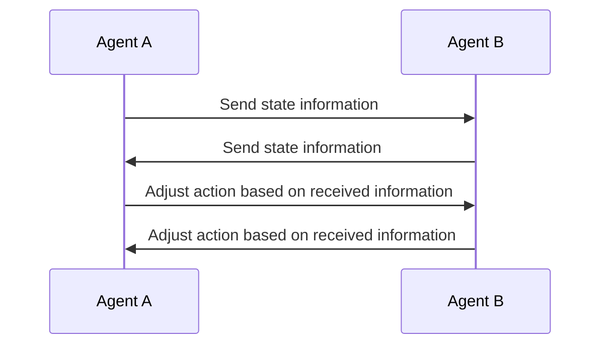
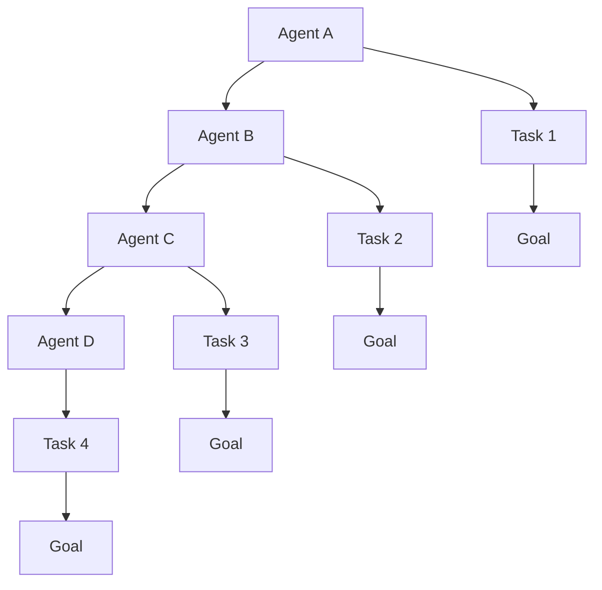

                 

### 引言

随着人工智能（AI）技术的迅猛发展，AI Agent作为AI系统中的一个重要组成部分，正逐渐成为研究和应用的热点。AI Agent，即人工智能代理，是指能够执行特定任务、与外界交互并自主学习的智能体。其基本思想是通过模拟人类智能的行为，使机器能够在复杂环境中自主决策和执行任务。

在近年来的研究中，群体智能（Collective Intelligence）和涌现机制（Emergence）成为了AI Agent研究的核心主题。群体智能是指由多个智能体组成的群体，通过协同工作产生出比个体智能体更高的智能表现。涌现机制则是指系统在局部相互作用的基础上，自发地产生出整体行为和结构的特性。

本文旨在深入研究AI Agent的群体智能涌现机制。我们将从以下几个角度进行探讨：

1. **问题背景与核心概念**：介绍AI Agent和群体智能的基本概念，以及涌现机制的基本原理。
2. **AI Agent的基本结构与功能**：分析AI Agent的基本结构和功能，并对其进行分类。
3. **群体智能涌现机制的理论基础**：探讨群体智能涌现机制的理论框架和研究方法。
4. **AI Agent的群体智能涌现机制**：深入分析AI Agent的协同工作原理和涌现过程。
5. **AI Agent群体智能的评估与优化**：介绍评估方法和优化策略。
6. **AI Agent的群体智能在现实世界中的应用**：分析AI Agent群体智能在智能交通系统、智能制造和其他领域的应用。
7. **展望与未来趋势**：总结研究的挑战与机遇，探讨未来发展趋势。

通过以上各章节的详细分析，我们希望能够为读者提供一个全面、系统的AI Agent群体智能涌现机制的研究框架，并启发更多的创新和应用。

### 问题背景与核心概念

在探讨AI Agent的群体智能涌现机制之前，我们需要先理解几个核心概念，包括AI Agent、群体智能和涌现机制。

#### AI Agent的定义

AI Agent是一种能够感知环境、基于规则或学习模型自主决策并采取行动的智能体。它起源于人工智能领域的多智能体系统（MAS，Multi-Agent System），其基本思想是通过多个智能体之间的协作和交互来实现复杂任务的高效解决。AI Agent具有自主性、社交性、反应性和目标导向性等特点。例如，在自动驾驶系统中，每个车辆都可以被视为一个AI Agent，它们通过感知道路信息和与其他车辆的交互，自主做出行驶决策。

#### 群体智能的概念

群体智能是指由多个个体智能体组成的群体，通过协同工作产生出比个体智能更高的智能表现。群体智能的关键在于个体智能体之间的合作与互动。在自然界中，许多生物群体，如蜜蜂的蜂群、鸟类的鸟群等，都展现了强大的群体智能。在人工智能领域，群体智能的研究旨在模拟这些自然现象，实现机器系统中的高效协作和问题求解。

#### 涌现机制的基本原理

涌现机制（Emergence）是指系统在局部相互作用的基础上，自发地产生出整体行为和结构的特性。这种现象在系统层面上是无法预测的，但可以从个体层面的简单规则推导出来。例如，在人工生命（Artificial Life）研究中，通过简单的个体行为规则，可以模拟出复杂的社会行为和群体行为。涌现机制在人工智能领域具有重要的应用价值，它能够解释AI Agent群体中的协同行为，并为设计高效智能系统提供了理论支持。

#### AI Agent与群体智能的关系

AI Agent是群体智能的基础组成部分，而群体智能是AI Agent协同工作产生的结果。AI Agent通过感知环境、自主决策和行动，实现了个体智能；而多个AI Agent通过相互协作和互动，实现了群体智能。这种协同工作使得AI系统能够在复杂环境中表现出更高的智能水平，具有更强的适应性和创新能力。

#### 涌现机制在AI Agent中的作用

涌现机制在AI Agent的群体智能中起到了关键作用。它不仅解释了AI Agent群体中的协同行为，也为设计高效的AI系统提供了理论依据。通过涌现机制，我们可以理解AI Agent群体如何在简单规则的指导下，产生复杂的行为和结构。例如，在智能交通系统中，单个车辆的AI Agent通过局部感知和决策，实现了交通流量的优化；而整个交通系统的AI Agent群体则通过协同工作，实现了全局交通控制和管理。

总之，理解AI Agent、群体智能和涌现机制的基本概念，有助于我们更好地把握AI Agent的群体智能涌现机制。在接下来的章节中，我们将进一步探讨AI Agent的基本结构与功能，以及群体智能涌现机制的理论基础。

#### AI Agent的基本结构与功能

AI Agent作为一种智能体，其结构设计直接影响其功能实现和系统性能。下面我们将详细分析AI Agent的基本结构和功能，并对其进行分类。

##### 1. 基本结构

AI Agent的基本结构通常包括以下几个关键组成部分：

1. **感知器**：用于感知外部环境的信息。感知器可以是传感器、摄像头、麦克风等硬件设备，也可以是算法层面的传感器，如自然语言处理中的文本分析模块。
   
2. **决策模块**：根据感知到的环境信息，决策模块负责生成行动策略。决策模块通常基于规则、机器学习模型或强化学习算法。常见的决策方法包括基于规则的推理、决策树、神经网络和深度强化学习。

3. **行动器**：执行决策模块生成的行动策略。行动器可以是机器人、无人机、车辆等硬件设备，也可以是软件系统中的API调用或网络请求。

4. **内存模块**：存储历史信息，包括感知数据、决策结果和行动记录。内存模块有助于AI Agent从经验中学习，优化决策过程。

5. **通信模块**：实现与其他AI Agent或外部系统的通信。通信模块可以通过无线网络、局域网或广域网进行数据交换，支持多智能体系统中的协同工作。

##### 2. 功能与特点

AI Agent具有以下几个显著的功能和特点：

1. **自主性**：AI Agent能够自主感知环境、制定决策和执行行动，无需外部干预。这种自主性使AI Agent能够适应动态变化的环境，并独立完成任务。

2. **社交性**：AI Agent可以通过通信模块与其他AI Agent或外部系统进行交互，实现信息共享和协同工作。社交性是AI Agent实现群体智能的关键。

3. **反应性**：AI Agent能够实时响应环境变化，调整自己的行为。反应性使AI Agent能够迅速应对突发事件，保持系统的稳定性。

4. **目标导向性**：AI Agent具有明确的目标，其行为和决策都是为了实现特定任务或目标。目标导向性使AI Agent能够专注于任务的完成，提高系统的效率和效果。

##### 3. 类型与分类

根据不同的应用场景和功能需求，AI Agent可以有多种类型。以下是一些常见的AI Agent分类：

1. **任务型AI Agent**：专注于特定任务的执行，如自动驾驶、智能客服等。这些AI Agent通常具有高度专业化的功能，能够高效地完成特定任务。

2. **角色型AI Agent**：在多智能体系统中扮演特定角色的智能体，如指挥官、士兵、顾问等。这些AI Agent通过角色分工，实现系统的整体协同工作。

3. **通用型AI Agent**：具有广泛的应用能力和适应能力，能够在多种任务和环境中进行自主学习和决策。例如，通用人工智能（AGI，Artificial General Intelligence）就是一种理想的通用型AI Agent。

4. **社交型AI Agent**：专门设计用于社交场合，能够理解并回应人类社交行为的智能体，如聊天机器人、虚拟助手等。

通过以上分析，我们可以看出AI Agent的基本结构与功能是高度集成和多样化的。在不同的应用场景下，AI Agent通过灵活的结构设计和功能实现，实现了智能化和自主化。在接下来的章节中，我们将深入探讨群体智能涌现机制的理论基础，进一步理解AI Agent在复杂环境中的协同工作原理。

#### 群体智能涌现机制的理论基础

要深入理解AI Agent的群体智能涌现机制，我们需要探讨其理论基础，包括相关理论框架、核心概念及其相互关系，以及研究方法。以下是关于群体智能涌现机制的理论基础的分析。

##### 1. 理论框架

群体智能涌现机制的理论基础主要包括以下几大框架：

1. **多智能体系统（MAS）**：多智能体系统是指由多个相互独立的智能体组成的系统，每个智能体在系统中都有特定的任务和角色。MAS理论关注智能体之间的交互、协作和协同，旨在实现整体系统的智能性。

2. **复杂系统理论**：复杂系统理论研究系统的整体行为和特性，强调系统中的个体元素相互作用所产生出的全局行为。在复杂系统中，个体元素的简单行为可以通过相互作用产生出复杂的现象，这种现象在群体智能中有着重要的体现。

3. **自组织理论**：自组织理论关注系统在没有外部控制的情况下，如何通过局部相互作用自发地产生出有序结构。自组织理论对于理解AI Agent的群体智能涌现机制具有重要的指导意义。

4. **演化算法**：演化算法是一种模拟自然选择和遗传机制的计算方法，通过迭代过程不断优化个体性能，最终实现群体的智能性提升。演化算法在AI Agent的群体智能研究中被广泛应用于优化策略和演化学习。

##### 2. 核心概念与联系

群体智能涌现机制的核心概念包括个体智能体、协同工作、涌现现象和系统智能性。以下是这些概念及其相互关系的详细解释：

1. **个体智能体**：个体智能体是群体智能的基础单元，具有感知、决策和行动的能力。个体智能体的智能性决定了群体智能的潜力。个体智能体的智能性通常通过学习、适应和自主决策能力来衡量。

2. **协同工作**：协同工作是群体智能的关键，它是指多个个体智能体通过信息共享和合作，共同完成任务的过程。协同工作不仅依赖于个体智能体的智能性，还需要考虑智能体之间的交互机制和协作模式。

3. **涌现现象**：涌现现象是指系统在个体智能体局部相互作用的基础上，自发地产生出整体行为和结构的特性。涌现现象是群体智能涌现机制的核心，它使得群体能够表现出比单个智能体更高的智能性。

4. **系统智能性**：系统智能性是指整个群体智能体系统在协同工作过程中表现出来的整体智能水平。系统智能性不仅取决于个体智能体的智能性，还受到协同工作方式和系统结构的影响。

这些核心概念之间存在紧密的联系：

- **个体智能体**是群体智能的基础，决定了群体的智能潜力。
- **协同工作**是实现群体智能的重要途径，通过信息共享和合作，个体智能体的潜力得以发挥。
- **涌现现象**是协同工作结果的一种表现，通过涌现现象，群体智能体系统能够实现比单个智能体更高的智能性。
- **系统智能性**是群体智能涌现机制的目标，它综合反映了个体智能体、协同工作和涌现现象的综合效果。

##### 3. 研究方法

研究群体智能涌现机制的方法多种多样，以下是几种常用的研究方法：

1. **仿真实验**：通过构建仿真环境，模拟个体智能体之间的交互和群体智能的涌现过程，研究群体智能涌现机制。仿真实验的优点在于能够快速测试和验证理论假设，但需要考虑仿真环境与现实环境的差异。

2. **案例研究**：通过对具体应用案例的深入分析，研究群体智能涌现机制在实际系统中的应用和效果。案例研究有助于理解群体智能涌现机制的实践意义和挑战，但需要确保案例的代表性和可靠性。

3. **实验研究**：通过设计实验，控制变量，研究个体智能体和群体智能体之间的相互作用，以及涌现现象的发生机制。实验研究能够提供定量的数据支持，但需要设计合理的实验方案和数据分析方法。

4. **数学模型**：通过建立数学模型，定量描述个体智能体的行为、协同工作和涌现现象，分析群体智能性的演化规律。数学模型能够提供理论上的解析和预测，但需要考虑模型的简化和准确性。

综上所述，群体智能涌现机制的理论基础包括多智能体系统、复杂系统理论、自组织理论和演化算法等理论框架，以及个体智能体、协同工作、涌现现象和系统智能性等核心概念。通过仿真实验、案例研究、实验研究和数学模型等方法，我们可以深入研究群体智能涌现机制的原理和应用，为AI Agent的群体智能设计和优化提供理论支持。

#### AI Agent的协同工作原理

在深入探讨AI Agent的群体智能涌现机制时，理解AI Agent的协同工作原理是至关重要的。协同工作是指多个AI Agent通过信息共享和合作，共同完成复杂任务的过程。协同工作的成功与否，直接影响群体智能的涌现和系统的整体性能。下面，我们将从协作模式、通信机制和交互策略三个方面，详细分析AI Agent的协同工作原理。

##### 1. 协作模式

AI Agent的协作模式可以根据任务需求和环境特点进行灵活设计。常见的协作模式包括以下几种：

1. **中心化协作模式**：在这种模式中，系统中的AI Agent通过一个中心控制节点进行协调。中心控制节点负责收集所有AI Agent的感知信息，进行全局决策，并分配任务给各个AI Agent。这种模式的优势在于决策效率高，能够快速响应环境变化；但缺点是系统的稳定性和容错性较差，一旦中心控制节点失效，整个系统将瘫痪。

2. **分布式协作模式**：在这种模式中，系统中的AI Agent通过相互之间的直接通信进行协作。每个AI Agent不仅负责自身任务的执行，还负责与其他AI Agent的通信和协调。这种模式的优势在于系统具有较好的稳定性和容错性，能够适应动态变化的环境；但缺点是决策复杂度较高，需要考虑更多的通信和协调问题。

3. **混合协作模式**：结合中心化和分布式协作模式，AI Agent在系统中既有中心控制节点的协调，也有直接的交互。这种模式能够在保证决策效率的同时，提高系统的稳定性和容错性。

##### 2. 通信机制

AI Agent之间的通信机制是实现协同工作的基础。有效的通信机制应具备低延迟、高可靠性和灵活性。以下是几种常见的通信机制：

1. **点对点通信**：每个AI Agent与其他AI Agent直接通信，信息传输路径短，延迟低。这种机制适合任务相对简单、环境相对静态的系统。

2. **广播通信**：AI Agent通过广播方式将信息发送给系统中的所有其他AI Agent。这种机制适用于需要全局信息共享的任务，如大规模的灾难响应或交通控制。

3. **多播通信**：AI Agent将信息发送给特定的子集AI Agent，这种机制适用于任务需要特定群体协作的情况，如军事行动中的战术协同。

4. **拉模式通信**：AI Agent主动请求所需信息，而不是被动接收。这种机制适用于信息量较大且需要按需获取的场景。

##### 3. 交互策略

AI Agent的交互策略决定了它们如何共享信息、协调行动和应对环境变化。以下是几种常见的交互策略：

1. **基于规则的交互策略**：AI Agent根据预定义的规则进行交互，如避免碰撞、保持安全距离等。这种策略简单直观，适用于任务和环境相对简单稳定的情况。

2. **基于学习策略的交互**：AI Agent通过机器学习算法，从历史数据中学习最佳的交互策略。这种策略能够适应动态变化的环境，提高系统的智能性。

3. **基于强化学习的交互策略**：AI Agent通过强化学习，不断调整自己的交互策略，以最大化系统的奖励。这种策略适用于复杂且动态变化的场景，如自动驾驶和机器人协作。

4. **基于博弈论的交互策略**：AI Agent通过博弈论模型，与其他AI Agent进行策略选择，以实现全局最优。这种策略适用于竞争性任务，如多机器人资源分配和任务调度。

##### 4. 协同工作的过程

AI Agent的协同工作过程通常包括以下步骤：

1. **感知**：AI Agent感知自身和环境的状态，收集相关信息。

2. **决策**：基于感知信息，AI Agent生成行动策略，准备执行。

3. **行动**：AI Agent根据决策执行行动，如移动、操作设备等。

4. **通信**：AI Agent与其他AI Agent进行信息交换，共享感知信息和决策结果。

5. **反馈**：AI Agent根据执行结果和环境变化，调整感知、决策和行动策略。

通过以上交互和调整，AI Agent能够在复杂环境中实现协同工作，共同完成任务。协同工作不仅提高了单个AI Agent的效能，还实现了系统的整体优化，为AI Agent的群体智能涌现奠定了基础。

综上所述，AI Agent的协同工作原理涉及协作模式、通信机制和交互策略等多个方面。理解并优化这些原理，有助于设计高效的AI系统，实现群体智能的涌现。

#### 群体智能的涌现过程

在深入探讨AI Agent的群体智能涌现机制时，了解群体智能的涌现过程至关重要。涌现过程是指系统在个体智能体局部相互作用的基础上，自发地产生出整体行为和结构特性的现象。这一过程通常包括三个关键阶段：局部规则、协同效应和整体行为。

##### 1. 局部规则

群体智能的涌现过程始于个体智能体的局部规则。这些规则定义了每个智能体的行为模式，通常包括感知、决策和行动。局部规则可以是简单的条件语句，如“当距离障碍物小于一米的距离时，停止前进”，也可以是基于复杂算法的计算结果。例如，在无人机编队飞行中，每个无人机根据其相对位置和速度，调整自己的飞行路径，避免碰撞。

为了更好地理解局部规则，我们可以通过一个具体的例子来说明。假设有一群蜜蜂在寻找食物源，每个蜜蜂遵循简单的规则：当感知到食物源时，飞向食物源；当远离食物源时，返回巢穴。这些规则虽然简单，但通过个体蜜蜂之间的相互作用，最终能够产生出高效的寻找食物源的行为。这种局部规则的实现可以通过算法模型，如人工神经网络或遗传算法来实现。

##### 2. 协同效应

在局部规则的基础上，个体智能体之间的相互作用产生了协同效应。协同效应是指多个智能体通过协作和合作，使得整体行为和结构超出单个智能体的性能。协同效应的实现依赖于智能体之间的通信和信息共享。

一个经典的例子是狼群捕猎。狼群中的每一只狼都遵循基本的狩猎规则，如保持队形和分散猎物。但在狼群的合作下，狼群能够高效地包围和捕杀猎物，比单个狼更具有攻击性和隐蔽性。在AI系统中，协同效应可以通过多智能体系统中的协作算法来实现。例如，在分布式计算任务中，多个计算节点通过通信和协调，共同完成任务，比单个节点的计算速度更快、更可靠。

为了解释协同效应，我们可以使用Mermaid流程图来描述一个简单的AI Agent协作过程：

在这个流程图中，Agent A和Agent B通过交换状态信息，调整自己的行动策略，从而实现协同工作。

##### 3. 整体行为

在局部规则和协同效应的共同作用下，群体智能体系统表现出整体行为。整体行为是指智能体系统在协同工作过程中，自发产生的复杂行为和结构特性。整体行为通常是不可预测的，并且具有高度智能性。

一个著名的例子是自组织临界性（Self-Organized Criticality，SOC），它是指系统在临界状态下的复杂行为。在SOC系统中，每个智能体遵循简单的规则，但通过相互作用，系统能够在临界状态下产生出复杂的行为和结构。自组织临界性在自然界中广泛存在，如地震、森林火灾等。

在AI系统中，整体行为的实现可以通过仿真实验或实际应用来验证。例如，在多机器人协作中，机器人群体能够自发地形成特定的队形，执行复杂的任务，如搜救、物流运输等。

为了更好地理解整体行为，我们可以使用Mermaid架构图来描述一个多机器人协作的系统：

在这个架构图中，多个机器人（Agent A、B、C、D）通过协同工作，共同完成多个任务（Task 1、Task 2、Task 3、Task 4），最终实现系统目标（Goal）。

##### 4. 涌现机制的作用

涌现机制在群体智能中起到了关键作用，它使得系统能够在局部简单规则的指导下，产生出复杂的行为和结构特性。涌现机制的作用主要体现在以下几个方面：

1. **增强系统适应性**：通过涌现机制，系统能够自适应环境变化，提高系统的适应性和生存能力。
   
2. **提高系统智能性**：涌现机制使得系统整体智能性超过单个智能体的性能，实现更高效的任务完成。

3. **优化系统性能**：涌现机制能够自发地优化系统的性能，通过个体智能体的协作和互动，实现整体系统的最优性能。

4. **增强系统鲁棒性**：涌现机制使得系统能够在个体智能体出现故障或异常时，保持整体的稳定性和可靠性。

综上所述，群体智能的涌现过程包括局部规则、协同效应和整体行为三个关键阶段。通过理解并利用涌现机制，我们能够设计出高效的AI系统，实现群体智能的涌现。在接下来的章节中，我们将进一步探讨如何评估和优化AI Agent群体智能，并分析其在现实世界中的应用。

#### AI Agent群体智能的评估与优化

评估和优化AI Agent群体智能是确保其高效运行和持续发展的关键环节。以下我们将详细讨论评估方法和优化策略，并通过具体案例分析这些方法在实际应用中的效果。

##### 1. 评估方法

评估AI Agent群体智能的方法主要包括以下几种：

1. **性能指标**：通过定义和计算一系列性能指标，如任务完成时间、资源利用率、错误率等，来评估群体智能的效能。这些指标可以定量地衡量系统在不同场景下的性能表现。

2. **行为分析**：通过观察和记录AI Agent群体在任务执行过程中的行为模式，分析其协同工作的效率和效果。例如，可以通过分析机器人编队飞行的队形变化、无人机集群的航迹规划等，评估群体的协同工作能力。

3. **用户满意度**：通过用户调查和反馈，收集用户对AI Agent群体智能系统满意度的评价。这种方法适用于需要考虑用户体验的场景，如智能客服、虚拟助手等。

4. **仿真实验**：通过构建仿真环境，模拟AI Agent群体在不同条件下的任务执行过程，评估其群体智能的表现。仿真实验的优点在于可以快速验证和调整系统设计，但需要确保仿真环境的真实性和代表性。

##### 2. 优化策略

为了提高AI Agent群体智能的表现，可以采用以下几种优化策略：

1. **参数调整**：通过调整AI Agent的决策参数，如学习率、权重等，优化其行为模式。这种方法适用于基于机器学习算法的AI Agent，可以通过迭代优化找到最优参数组合。

2. **算法改进**：通过改进AI Agent的算法，如使用更先进的机器学习模型、演化算法等，提高其智能性。算法改进需要结合具体应用场景和任务需求，选择最适合的算法。

3. **协同策略优化**：通过优化AI Agent之间的协同策略，如通信机制、协作模式等，提高群体的协同工作效能。协同策略优化可以通过仿真实验和实际应用中的反馈进行迭代改进。

4. **环境适应性**：提高AI Agent对环境的适应性，使其能够快速适应环境变化和不确定因素。环境适应性可以通过增强AI Agent的学习能力和鲁棒性来实现。

##### 3. 案例分析

以下通过具体案例，分析评估和优化AI Agent群体智能的方法和效果：

1. **智能交通系统**：

   - **评估方法**：使用性能指标（如平均行程时间、车辆延迟率等）和行为分析（如交通流量分布、车辆运行轨迹等）来评估智能交通系统的效能。
   - **优化策略**：通过调整交通信号灯的时长和优先级，改进交通流规划算法，提高系统运行效率。此外，通过实时监控和反馈，动态调整交通控制策略，以适应突发交通事件。

2. **无人机集群协同**：

   - **评估方法**：通过计算无人机集群的协同效率（如任务完成时间、资源利用率等）和行为分析（如无人机编队队形、飞行轨迹等）进行评估。
   - **优化策略**：使用强化学习算法优化无人机编队飞行策略，提高协同工作的效率和稳定性。通过仿真实验和实地测试，不断优化算法参数，实现最佳协同效果。

3. **多机器人协作搜救**：

   - **评估方法**：通过任务完成率、搜救效率、机器人能耗等指标进行评估。
   - **优化策略**：改进多机器人路径规划算法，优化通信机制和协作模式，提高搜救任务的效率和成功率。通过仿真实验和实际应用，验证和优化系统设计，确保系统在实际任务中的可靠性。

通过以上案例，我们可以看到，评估和优化AI Agent群体智能的方法和策略在实际应用中取得了显著的效果。通过合理的评估方法和有效的优化策略，AI Agent群体智能系统能够在复杂和动态的环境中实现高效运行，提高整体效能。

#### AI Agent群体智能在现实世界中的应用

AI Agent群体智能在现实世界中具有广泛的应用前景，其高效协同和自适应能力使得许多复杂任务得以高效完成。以下我们将详细分析AI Agent群体智能在智能交通系统、智能制造和其他领域中的应用，并探讨其在这些应用中的具体案例和优势。

##### 1. 智能交通系统

智能交通系统（ITS，Intelligent Transportation System）是AI Agent群体智能的重要应用领域之一。通过AI Agent的协同工作，智能交通系统可以实现对交通流量的实时监控和智能调控，提高道路通行效率和安全性。

**案例：** 在深圳，智能交通系统利用AI Agent对交通信号灯进行智能调控，根据实时交通流量数据自动调整红绿灯时长，优化交通流量。这种智能化的交通信号控制系统能够有效减少车辆排队时间和交通事故率。

**优势：** 
- **提高交通效率**：AI Agent通过协同工作，实时调整交通信号灯时长，优化道路通行条件。
- **减少拥堵**：通过预测交通流量变化，智能交通系统能够提前采取措施，减少交通拥堵。
- **提升安全性**：AI Agent对道路状况的实时监控和智能调控，能够降低交通事故发生的风险。

##### 2. 智能制造

智能制造是AI Agent群体智能的另一个重要应用领域。通过AI Agent的协同工作，智能制造系统能够实现生产流程的自动化和智能化，提高生产效率和产品质量。

**案例：** 在德国的斯图加特工厂，使用了一款基于AI Agent的自动化生产系统。该系统中的每个AI Agent负责不同的生产任务，如原料运输、装配、检测等。AI Agent之间通过协同工作，实现了生产过程的全面自动化。

**优势：**
- **生产效率提升**：AI Agent通过自动化任务执行，显著提高了生产效率和吞吐量。
- **降低人力成本**：通过减少对人工操作的依赖，智能制造系统降低了人力成本和劳动强度。
- **提高产品质量**：AI Agent的精确控制和协同工作，确保了生产过程的稳定性和一致性，提高了产品质量。

##### 3. 其他应用领域

除了智能交通系统和智能制造，AI Agent群体智能还在许多其他领域得到了广泛应用。

**案例：** 在环境监测领域，AI Agent群体智能系统被用于实时监测空气质量、水质等环境指标。多个AI Agent协同工作，收集环境数据，并通过分析数据结果，提供环境治理建议。

**优势：**
- **实时监控**：AI Agent能够实时监测环境变化，快速响应环境问题。
- **数据分析**：AI Agent通过对大量环境数据的分析，提供有针对性的治理建议。
- **资源优化**：通过智能分配监测资源，AI Agent群体智能系统能够最大限度地提高环境监测的效率和效果。

**案例：** 在金融领域，AI Agent群体智能被用于风险管理和市场预测。多个AI Agent通过协同工作，分析市场数据，预测市场走势，并提供投资建议。

**优势：**
- **风险控制**：AI Agent能够实时分析市场风险，提供有效的风险控制措施。
- **市场预测**：AI Agent通过协同工作，提高了市场预测的准确性和可靠性。
- **投资优化**：AI Agent为投资者提供个性化的投资建议，优化投资组合。

综上所述，AI Agent群体智能在智能交通系统、智能制造和其他领域具有广泛的应用前景。通过高效协同和自适应能力，AI Agent群体智能系统不仅提高了系统的效率和效果，还为各个领域带来了创新和变革。未来，随着AI技术的发展，AI Agent群体智能的应用将会更加广泛和深入，为社会带来更多的价值和效益。

### 展望与未来趋势

在深入研究AI Agent的群体智能涌现机制的基础上，我们展望未来这一领域的发展趋势，探讨面临的挑战与机遇，并提出研究方向与建议。

#### 挑战与机遇

**挑战：**

1. **计算资源限制**：随着AI Agent群体智能的复杂度增加，对计算资源的需求也显著提高。如何优化算法，降低计算成本，是当前面临的重要挑战。

2. **数据隐私和安全**：AI Agent在群体智能过程中会产生大量数据，数据隐私和安全问题日益突出。如何在确保数据安全的同时，充分发挥数据的价值，是亟待解决的问题。

3. **复杂环境适应性**：现实世界环境复杂多变，AI Agent群体智能需要具备更强的环境适应性，以应对不确定性和突发情况。

**机遇：**

1. **跨学科研究**：AI Agent的群体智能研究需要融合计算机科学、人工智能、生物学、物理学等多个学科的知识，跨学科研究将带来新的突破。

2. **新兴应用场景**：随着5G、物联网等技术的发展，AI Agent群体智能在智能城市、智能医疗、智能家居等领域具有巨大的应用潜力。

3. **商业价值**：AI Agent群体智能技术的成熟将推动产业升级和商业模式创新，带来巨大的商业价值。

#### 未来发展趋势

1. **算法优化与创新**：针对计算资源限制，未来研究将重点放在算法优化和创新上，开发高效、低耗的算法模型。

2. **隐私保护与安全**：数据隐私和安全问题将成为研究重点，探索新型隐私保护技术和安全机制。

3. **智能环境感知**：提高AI Agent对复杂环境的感知和理解能力，使其在动态环境中表现出更强的适应性和鲁棒性。

4. **跨领域应用**：推动AI Agent群体智能技术在各个领域的应用，实现跨学科、跨领域的深度融合。

#### 研究方向与建议

1. **基于强化学习的群体智能**：强化学习具有强大的自适应能力，未来可以将其应用于AI Agent群体智能的研究，提高系统的智能化水平。

2. **分布式计算与边缘计算**：通过分布式计算和边缘计算技术，优化AI Agent群体智能的计算效率和资源利用率。

3. **隐私保护与联邦学习**：研究隐私保护和联邦学习技术，实现AI Agent群体智能在数据隐私和安全方面的创新。

4. **实验平台与工具开发**：开发高效、易用的实验平台和工具，为AI Agent群体智能的研究提供便捷的支持。

5. **应用案例与示范项目**：通过具体的示范项目和应用案例，验证AI Agent群体智能技术的实际效果，推动其在现实世界的应用。

综上所述，AI Agent的群体智能涌现机制研究具有重要的理论和实际意义。在未来，随着技术的不断进步和跨学科研究的深入，AI Agent群体智能将迎来更加广阔的发展前景，为人类带来更多的创新和变革。

### 总结与展望

通过对AI Agent的群体智能涌现机制的全面探讨，本文揭示了AI Agent的基本结构与功能、群体智能的协同工作原理和涌现过程，以及评估与优化的策略和应用。我们详细分析了群体智能在现实世界中的广泛应用，并展望了未来的发展趋势。

**核心观点：**

1. AI Agent作为智能系统的重要组成部分，其群体智能的涌现机制是研究的关键。
2. 通过协同工作和局部规则的相互作用，AI Agent群体能够产生出整体智能行为。
3. 评估和优化AI Agent群体智能，有助于提升系统的效率和稳定性。
4. 实际应用案例表明，AI Agent群体智能在交通、制造、环境监测等领域具有显著优势。

**未来展望：**

- 算法优化和创新将进一步提升AI Agent群体智能的效能。
- 跨学科研究和新兴应用场景将拓展AI Agent群体智能的研究领域。
- 隐私保护和安全将成为重要研究方向，确保AI Agent的可靠性和安全性。

**结语：**

AI Agent的群体智能涌现机制研究不仅具有重要的理论价值，也具有广泛的应用前景。我们期待未来在技术创新和跨领域合作中，能够不断推动AI Agent群体智能的发展，为人类社会带来更多福祉。作者：AI天才研究院/AI Genius Institute & 禅与计算机程序设计艺术 /Zen And The Art of Computer Programming。

