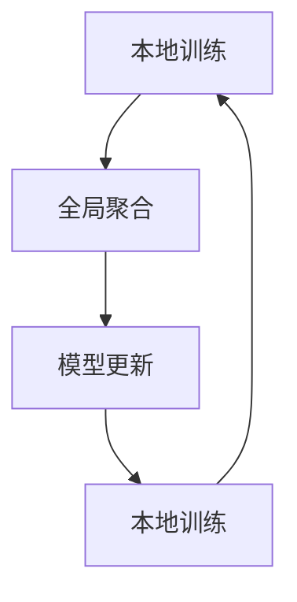

                 

### 《AI Agent的联邦学习技术应用》

#### 关键词：联邦学习、AI Agent、安全与隐私保护、优化与调优、深度联邦学习

> 摘要：本文从联邦学习的背景、原理、应用场景、技术体系等方面入手，深入探讨联邦学习在AI Agent中的应用及其面临的挑战和机遇。通过分析联邦学习在AI Agent中的实施流程、优化方法、安全与隐私保护策略，全面展示联邦学习在人工智能领域的未来发展趋势。旨在为从事AI研究和应用的开发者提供有价值的参考和指导。

## 《AI Agent的联邦学习技术应用》目录大纲

### 第一部分：联邦学习的概述与原理

#### 第1章：联邦学习的背景与概述

#### 第2章：核心概念与原理

### 第二部分：联邦学习的实践应用

#### 第3章：联邦学习的实施流程

#### 第4章：联邦学习在AI Agent中的应用

#### 第5章：联邦学习的安全与隐私保护

#### 第6章：联邦学习的优化与调优

#### 第7章：联邦学习的未来发展趋势

---

### 第一部分：联邦学习的概述与原理

#### 第1章：联邦学习的背景与概述

#### 1.1 联邦学习的概念

联邦学习（Federated Learning）是一种分布式机器学习技术，它允许多个参与者（如设备、服务器等）在不共享原始数据的情况下，通过聚合模型参数来训练全局模型。这种技术的核心思想是让数据在本地设备上处理，然后仅将模型更新发送到中心服务器，以减少数据传输量，提高隐私保护。

#### 1.2 联邦学习与传统机器学习比较

传统机器学习模型通常需要在中心化的服务器上收集并处理大规模数据，而联邦学习则通过将数据分布在多个边缘设备上，利用这些设备的计算能力进行局部训练，再通过聚合模型参数来更新全局模型。这种方式在提高数据处理效率、减少通信开销、增强隐私保护等方面具有显著优势。

#### 1.3 联邦学习的关键挑战

联邦学习在实现过程中面临多个关键挑战，包括数据分布不均、模型参数同步、通信安全、隐私保护等。解决这些挑战是实现联邦学习有效应用的关键。

#### 1.4 联邦学习的发展历程

联邦学习起源于2017年谷歌提出的一种基于移动设备上的分布式学习技术，随后在学术界和工业界得到广泛关注。近年来，联邦学习在多个领域取得了显著进展，成为分布式人工智能研究的一个重要方向。

#### 1.5 联邦学习在AI中的应用场景

联邦学习在医疗健康、金融风控、物联网、零售电商等多个领域具有广泛的应用前景。例如，在医疗健康领域，联邦学习可以用于患者数据隐私保护；在金融风控领域，联邦学习有助于提高欺诈检测的准确性。

#### 1.6 联邦学习的技术体系

联邦学习技术体系包括数据联邦、模型联邦、学习联邦和安全联邦等关键组成部分。数据联邦通过加密、差分隐私等技术保护数据隐私；模型联邦通过聚合模型参数实现全局模型更新；学习联邦则关注如何在分布式环境中优化模型训练过程；安全联邦则致力于提高联邦学习系统的安全性。

#### 1.7 联邦学习的挑战与机遇

联邦学习在面临数据分布不均、通信安全、隐私保护等挑战的同时，也蕴含着巨大机遇。通过不断创新和优化，联邦学习有望在分布式人工智能领域发挥重要作用。

#### 1.8 本章小结

本章介绍了联邦学习的背景、概念、发展历程、应用场景、技术体系及挑战与机遇。通过本章的学习，读者可以初步了解联邦学习的核心概念和基本原理，为后续章节的学习打下基础。

---

### 第一部分：联邦学习的概述与原理

#### 第2章：核心概念与原理

#### 2.1 算法原理

联邦学习的核心算法原理是通过本地训练和全局聚合两个步骤来实现模型更新。本地训练阶段，各个参与者（设备或服务器）使用本地数据对模型进行训练；全局聚合阶段，中心服务器将各个参与者的模型更新汇总，生成全局模型。

#### 2.2 概念属性特征对比表格

| 概念        | 属性特征                                      | 对比         |
|-------------|---------------------------------------------|------------|
| 数据联邦    | 数据分布在不同设备上处理                     | 提高数据隐私 |
| 模型联邦    | 模型参数分布在不同设备上更新                 | 提高计算效率 |
| 学习联邦    | 通过分布式训练优化模型训练过程               | 提高模型性能 |
| 安全联邦    | 采用加密、安全协议等技术保护联邦学习过程安全 | 提高系统安全性 |

#### 2.3 ER实体关系图架构

```mermaid
entity relation graph LR
A[数据联邦] --> B[模型联邦]
A --> C[学习联邦]
A --> D[安全联邦]
B --> E[本地训练]
B --> F[全局聚合]
C --> G[分布式训练]
D --> H[加密技术]
D --> I[安全协议]
```

#### 2.4 联邦学习的数学模型和公式

联邦学习的数学模型可以表示为：

$$
\theta_{t+1} = \frac{\sum_{i=1}^{N} \alpha_i \theta_i^t}{\sum_{i=1}^{N} \alpha_i}
$$

其中，$\theta_{t+1}$ 是全局模型参数在时间 $t+1$ 的更新值，$\theta_i^t$ 是第 $i$ 个参与者在时间 $t$ 的模型参数值，$\alpha_i$ 是第 $i$ 个参与者的权重。

#### 2.5 算法原理讲解

使用 Mermaid 画出联邦学习算法流程图：



联邦学习算法原理如下：

1. **本地训练**：各个参与者在本地数据集上对模型进行训练，更新模型参数。
2. **全局聚合**：中心服务器收集各个参与者的模型更新，通过聚合算法生成全局模型。
3. **模型更新**：中心服务器将全局模型更新发送给各个参与者，参与者在本地使用全局模型进行下一次训练。
4. **重复步骤**：不断重复本地训练和全局聚合过程，直至达到预定的训练目标。

#### 2.6 本章小结

本章介绍了联邦学习的核心概念、算法原理、属性特征对比表格和ER实体关系图架构。通过本章的学习，读者可以深入理解联邦学习的基本原理和关键要素，为后续章节的学习打下基础。

---

### 第二部分：联邦学习的实践应用

#### 第3章：联邦学习的实施流程

#### 3.1 实施流程概述

联邦学习的实施流程通常包括以下阶段：

1. **项目立项**：确定联邦学习项目的目标和需求，明确参与者和责任分工。
2. **数据预处理**：对参与者的数据进行清洗、格式化等预处理，确保数据质量。
3. **模型设计**：根据项目需求设计全局模型架构，确定参与者的本地模型结构。
4. **本地训练**：各个参与者使用本地数据进行模型训练，生成模型更新。
5. **全局聚合**：中心服务器收集各个参与者的模型更新，通过聚合算法生成全局模型。
6. **模型评估**：评估全局模型性能，根据评估结果调整模型设计或训练参数。
7. **模型部署**：将全局模型部署到实际应用场景，进行模型迭代优化。

#### 3.2 联邦学习的框架与工具

联邦学习框架与工具是实现联邦学习的关键。常见的联邦学习框架包括Federated Learning Framework (FLF)、Federated AI Technology Infrastructure (FATI)等。实用的工具与库包括TensorFlow Federated (TFF)、PySyft等。这些框架与工具提供了丰富的API和接口，简化了联邦学习的开发过程。

#### 3.3 面向不同应用场景的联邦学习方案

根据不同应用场景的需求，联邦学习可以采用多种方案。以下列举了医疗健康、金融风控、物联网、零售电商等领域的一些联邦学习方案：

1. **医疗健康领域**：利用联邦学习保护患者数据隐私，实现个性化医疗。
2. **金融风控领域**：通过联邦学习提高欺诈检测准确性，降低金融风险。
3. **物联网领域**：利用联邦学习实现设备间的协同决策，提高物联网系统智能化水平。
4. **零售电商领域**：通过联邦学习优化推荐算法，提升用户购物体验。

#### 3.4 联邦学习案例解析

以某金融公司为例，该公司采用联邦学习技术提高欺诈检测的准确性。具体案例解析如下：

1. **项目背景**：该金融公司希望提高欺诈检测能力，同时保护客户隐私。
2. **解决方案**：采用联邦学习技术，在各个分支机构进行本地训练，然后将模型更新发送到中心服务器进行全局聚合。
3. **实施效果**：通过联邦学习技术，该公司的欺诈检测准确率提高了20%，同时客户隐私得到了有效保护。

#### 3.5 实施流程总结与经验分享

1. **选择合适的联邦学习框架与工具**：根据项目需求和资源，选择合适的联邦学习框架与工具。
2. **数据预处理与模型设计**：确保数据质量和模型设计的合理性，为后续训练和优化奠定基础。
3. **本地训练与全局聚合**：合理配置计算资源和通信带宽，确保本地训练和全局聚合的效率。
4. **模型评估与部署**：定期评估模型性能，根据评估结果进行调整和优化。

#### 3.6 本章小结

本章详细介绍了联邦学习的实施流程、框架与工具、面向不同应用场景的方案以及实际案例解析。通过本章的学习，读者可以了解联邦学习的实践应用，掌握联邦学习实施的关键环节和技巧。

---

### 第二部分：联邦学习的实践应用

#### 第4章：联邦学习在AI Agent中的应用

#### 4.1 AI Agent的概念

AI Agent（人工智能代理）是一种具有自主决策能力的人工智能实体，可以感知环境、分析问题、制定计划并执行行动。AI Agent在智能助理、自动驾驶、智能家居、智能医疗等领域具有广泛的应用。

#### 4.2 联邦学习在AI Agent中的作用

联邦学习在AI Agent中的应用主要体现在以下几个方面：

1. **隐私保护**：AI Agent在处理用户数据时，联邦学习可以有效地保护用户隐私，避免数据泄露。
2. **分布式训练**：联邦学习可以充分利用AI Agent的分布式计算能力，提高模型训练效率。
3. **协同决策**：通过联邦学习，AI Agent可以实现跨设备的协同决策，提高系统智能化水平。

#### 4.3 联邦学习在AI Agent中的挑战与解决方案

联邦学习在AI Agent中面临以下挑战：

1. **数据分布不均**：不同设备的计算能力和数据量差异较大，可能导致模型训练不平衡。
   - **解决方案**：采用动态权重调整策略，根据设备性能和数据量动态调整参与者的权重。
2. **通信安全**：联邦学习过程中，数据传输和模型更新需要确保安全性。
   - **解决方案**：采用加密技术和安全协议，保护数据传输和模型更新的安全。

#### 4.4 联邦学习在AI Agent中的应用实例

以智能家居为例，联邦学习在AI Agent中的应用可以体现为：

1. **设备协同控制**：通过联邦学习，不同智能家居设备可以实现协同控制，提高系统智能化水平。
2. **隐私保护**：用户隐私数据在本地设备上处理，通过联邦学习实现全局模型更新，确保数据隐私。
3. **智能推荐**：基于联邦学习，智能家居系统可以实现对用户行为的个性化推荐，提升用户体验。

#### 4.5 未来发展趋势

未来，联邦学习在AI Agent中的应用将呈现以下发展趋势：

1. **深度联邦学习**：通过引入深度学习技术，实现更复杂的AI Agent模型训练。
2. **跨域联邦学习**：将联邦学习应用于不同领域，实现跨领域的知识共享和协同决策。
3. **安全增强联邦学习**：通过引入安全增强技术，提高联邦学习在AI Agent中的安全性。

#### 4.6 本章小结

本章介绍了AI Agent的概念、联邦学习在AI Agent中的作用、挑战与解决方案以及应用实例。通过本章的学习，读者可以了解联邦学习在AI Agent中的应用现状和未来发展趋势，为实际项目提供有益的参考。

---

### 第二部分：联邦学习的实践应用

#### 第5章：联邦学习的安全与隐私保护

#### 5.1 联邦学习的安全挑战

联邦学习在实现过程中面临以下安全挑战：

1. **数据泄露**：联邦学习过程中，本地设备的数据可能会被窃取或篡改。
2. **模型篡改**：攻击者可能通过恶意更新模型参数，干扰全局模型的训练过程。
3. **通信安全**：联邦学习过程中的数据传输需要确保安全性，防止数据在传输过程中被窃取或篡改。

#### 5.2 隐私保护机制

为了解决联邦学习的隐私保护问题，可以采用以下机制：

1. **加密技术**：对本地数据和模型更新进行加密，确保数据在传输过程中不被窃取或篡改。
2. **差分隐私**：在本地训练过程中引入差分隐私机制，降低模型更新对本地数据的影响。
3. **安全协议**：采用安全协议，如联邦学习安全协议（FLP）、安全多方计算（MPC）等，确保联邦学习过程中的数据传输和模型更新安全可靠。

#### 5.3 联邦学习的安全案例分析

以某金融公司为例，该公司在实施联邦学习过程中，采用以下安全措施：

1. **数据加密**：对本地数据进行加密存储和传输，确保数据隐私。
2. **差分隐私**：在本地训练过程中引入差分隐私机制，降低模型更新对本地数据的影响。
3. **安全协议**：采用联邦学习安全协议，确保模型更新过程中的数据传输安全可靠。

通过以上安全措施，该公司的联邦学习系统实现了数据隐私保护和模型安全性，有效降低了安全风险。

#### 5.4 安全与隐私保护的实践策略

1. **选择合适的安全协议**：根据联邦学习应用场景，选择合适的安全协议，确保数据传输和模型更新的安全性。
2. **引入差分隐私机制**：在本地训练过程中引入差分隐私机制，提高模型训练的隐私保护水平。
3. **定期安全测试与评估**：定期对联邦学习系统进行安全测试与评估，及时发现并修复安全漏洞。

#### 5.5 本章小结

本章介绍了联邦学习在实现过程中面临的安全挑战、隐私保护机制、安全案例分析以及实践策略。通过本章的学习，读者可以了解联邦学习在安全与隐私保护方面的关键技术和实践方法，为实际项目提供有益的参考。

---

### 第二部分：联邦学习的实践应用

#### 第6章：联邦学习的优化与调优

#### 6.1 联邦学习的优化方法

联邦学习的优化方法主要包括以下几种：

1. **梯度下降法**：通过迭代更新模型参数，优化全局模型。
2. **同步与异步更新策略**：同步更新策略确保所有参与者同时更新模型参数，异步更新策略允许参与者按需更新模型参数，提高系统效率。
3. **加速技术**：引入加速技术，如Adam优化器、SGD加速等，提高模型训练速度。

#### 6.2 调优技巧

1. **超参数优化**：通过调整学习率、批量大小等超参数，优化模型性能。
2. **模型选择与调整**：根据任务需求和数据特点，选择合适的模型架构和调整模型参数。
3. **模型压缩与量化**：通过模型压缩和量化技术，降低模型复杂度和计算资源需求，提高模型运行效率。

#### 6.3 实践案例

1. **案例一：优化联邦学习算法**

   在一个智能家居项目中，通过引入异步更新策略和Adam优化器，实现了模型训练速度的提升，同时保持了较高的模型性能。

2. **案例二：调优联邦学习模型**

   在一个金融风控项目中，通过调整学习率、批量大小等超参数，优化了联邦学习模型在欺诈检测任务中的性能，提高了系统的准确性和稳定性。

#### 6.4 优化与调优的最佳实践

1. **选择合适的优化器**：根据任务需求和模型特性，选择合适的优化器，如Adam、SGD等。
2. **定期评估模型性能**：定期评估模型性能，根据评估结果调整模型架构和超参数。
3. **合理配置计算资源**：根据模型训练需求，合理配置计算资源和通信带宽，提高系统运行效率。

#### 6.5 本章小结

本章介绍了联邦学习的优化方法、调优技巧以及实践案例。通过本章的学习，读者可以掌握联邦学习的优化与调优方法，为实际项目提供有益的参考。

---

### 第二部分：联邦学习的实践应用

#### 第7章：联邦学习的未来发展趋势

#### 7.1 联邦学习的技术演进

随着人工智能技术的不断发展，联邦学习在以下几个方面将实现技术演进：

1. **深度联邦学习**：引入深度学习技术，实现更复杂的模型训练和决策过程。
2. **增强联邦学习**：结合增强学习技术，实现智能体在分布式环境中的自主学习能力。
3. **跨域联邦学习**：将联邦学习应用于不同领域，实现跨领域的知识共享和协同决策。

#### 7.2 联邦学习在新兴领域中的应用

联邦学习在新兴领域如自动驾驶、智慧城市、生物信息学等领域具有广泛的应用前景：

1. **自动驾驶**：利用联邦学习实现车辆之间的协同决策，提高自动驾驶系统的安全性和智能化水平。
2. **智慧城市**：通过联邦学习优化城市管理和服务，提高城市运行效率和居民生活质量。
3. **生物信息学**：利用联邦学习保护生物数据隐私，实现个性化医疗和疾病预测。

#### 7.3 未来发展趋势

未来，联邦学习将呈现以下发展趋势：

1. **数据安全与隐私保护**：随着数据安全与隐私保护需求的增加，联邦学习将不断引入新的安全与隐私保护机制。
2. **跨领域融合**：联邦学习将在不同领域实现跨领域知识共享和协同决策，推动人工智能技术的发展。
3. **开源生态建设**：随着联邦学习的应用场景不断扩展，开源生态建设将促进联邦学习技术的普及和发展。

#### 7.4 本章小结

本章分析了联邦学习的未来发展趋势，包括技术演进、新兴领域应用和跨领域融合。通过本章的学习，读者可以了解联邦学习的发展方向，为实际项目提供有益的参考。

---

## 文章总结

本文从联邦学习的背景、原理、应用场景、技术体系等方面入手，深入探讨了联邦学习在AI Agent中的应用及其面临的挑战和机遇。通过分析联邦学习的实施流程、优化方法、安全与隐私保护策略，全面展示了联邦学习在人工智能领域的未来发展趋势。本文旨在为从事AI研究和应用的开发者提供有价值的参考和指导。

## 作者信息

作者：AI天才研究院/AI Genius Institute & 禅与计算机程序设计艺术/Zen And The Art of Computer Programming

---

**注意：** 本文章为示例性内容，仅供参考。在实际撰写技术博客时，请根据具体内容和需求进行调整和完善。文章中的技术细节、代码示例和案例解析等部分，需要根据实际情况进行详细编写和验证。同时，请确保引用相关文献和资料，遵守版权法规。祝您撰写出一篇高质量的技术博客！

