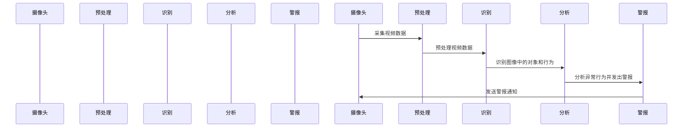
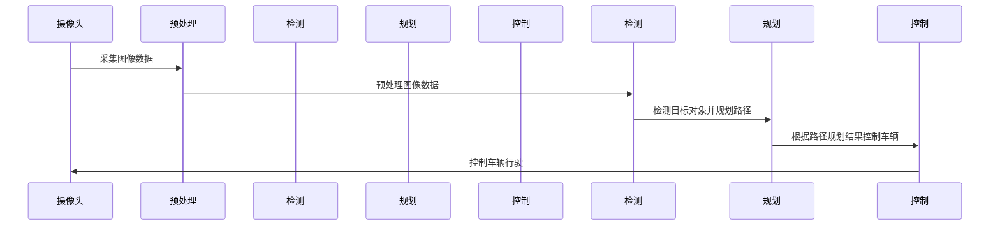
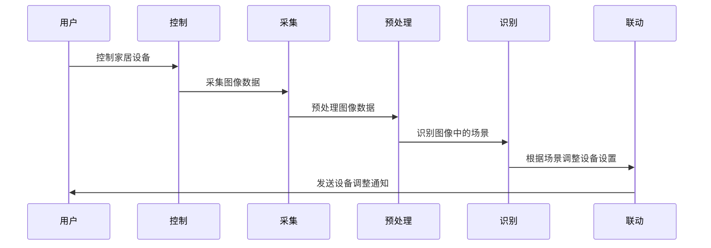

                 

# AI Agent的视觉常识推理能力开发

## 摘要

本文将深入探讨AI Agent的视觉常识推理能力开发。首先，我们将介绍AI Agent的基本概念、分类以及应用场景。接着，本文将详细阐述视觉常识推理的定义、重要性及其面临的挑战。在此基础上，我们将深入分析图像识别与处理技术，并介绍视觉常识推理的相关技术。随后，本文将分类介绍传统和现代视觉常识推理模型，并探讨其在实际应用中的实现细节。最后，我们将通过案例分析，探讨视觉常识推理在实际应用中的优化策略和面临的挑战，并提出未来的发展方向。

## 第一部分：引言与背景

### 第1章：AI Agent与视觉常识推理

#### 1.1 AI Agent的概念与分类

##### 1.1.1 AI Agent的定义与特点

AI Agent，即人工智能代理，是指一种能够模拟人类智能行为的计算机程序。它具有自主性、社交性、反应性、认知性和学习性等特点。自主性意味着AI Agent能够在没有人为干预的情况下独立完成特定任务；社交性指的是AI Agent能够与人类或其他AI Agent进行有效沟通和协作；反应性则表示AI Agent能够对环境中的变化做出即时响应；认知性指的是AI Agent具有理解、思考和决策的能力；学习性意味着AI Agent能够通过不断学习和优化，提高其任务执行效率和准确性。

##### 1.1.2 AI Agent的分类

根据功能和应用场景的不同，AI Agent可以分为以下几类：

1. **任务型AI Agent**：这类AI Agent专注于执行特定的任务，如语音助手、聊天机器人等。

2. **决策型AI Agent**：这类AI Agent能够在复杂环境中做出合理的决策，如自动驾驶汽车、智能家居等。

3. **交互型AI Agent**：这类AI Agent具有较强的社交能力，能够与人类进行自然语言交流，如虚拟助手、客户服务代表等。

4. **学习型AI Agent**：这类AI Agent通过不断学习和适应，提高其任务执行能力和环境理解能力。

##### 1.1.3 AI Agent的应用场景

AI Agent在各种应用场景中发挥着重要作用，以下是一些典型的应用场景：

1. **智能客服**：通过自然语言处理和机器学习技术，AI Agent能够自动识别用户需求并提供相应的解决方案，提高客户服务效率。

2. **智能推荐系统**：基于用户行为和偏好数据，AI Agent能够为用户提供个性化的商品推荐、音乐推荐等服务。

3. **智能交通**：通过实时监控和数据分析，AI Agent能够优化交通信号、预测交通状况，提高交通效率。

4. **智能医疗**：AI Agent可以帮助医生进行诊断、制定治疗方案，提高医疗诊断的准确性和效率。

#### 1.2 视觉常识推理概述

##### 1.2.1 视觉常识推理的定义

视觉常识推理（Visual Common Sense Reasoning）是指AI Agent通过理解图像中的场景和对象，从而推断出与这些场景和对象相关的常识性知识。这种能力使得AI Agent能够更好地理解人类语言和行为，提高其交互和任务执行能力。

##### 1.2.2 视觉常识推理的重要性

视觉常识推理对于AI Agent的发展具有重要意义：

1. **提高交互能力**：通过理解图像中的场景和对象，AI Agent能够更自然地与人类进行交互。

2. **增强任务执行能力**：视觉常识推理可以帮助AI Agent更好地理解任务背景和目标，从而更有效地完成任务。

3. **拓展应用场景**：视觉常识推理使得AI Agent能够应用于更多需要图像理解和推理的场景，如智能安防、智能驾驶等。

##### 1.2.3 视觉常识推理的挑战

尽管视觉常识推理具有重要意义，但其实现面临着诸多挑战：

1. **数据多样性**：现实世界中的图像数据具有极高的多样性，这使得视觉常识推理模型需要具备很强的泛化能力。

2. **模型复杂度**：视觉常识推理需要同时考虑图像识别、自然语言处理和知识图谱等多个领域的技术，这使得模型设计变得复杂。

3. **计算资源限制**：在实际应用中，AI Agent需要实时处理图像数据，这使得模型计算资源的需求较高。

#### 1.3 本书的目标与结构

##### 1.3.1 本书的核心目标

本书的核心目标是系统地介绍AI Agent的视觉常识推理能力开发，帮助读者深入了解该领域的理论知识、技术实现和应用案例。

##### 1.3.2 各章节内容的关联与衔接

本书分为五个部分，各部分内容紧密关联，共同构成一个完整的知识体系：

1. **第一部分**：引言与背景，介绍AI Agent和视觉常识推理的基本概念和背景。

2. **第二部分**：视觉常识推理的理论基础，包括图像识别与处理技术、视觉常识推理的关键技术和相关技术简介。

3. **第三部分**：视觉常识推理模型与算法，介绍传统和现代视觉常识推理模型，以及其在实际应用中的实现细节。

4. **第四部分**：视觉常识推理算法实现，详细介绍视觉常识推理算法的实现框架、实现细节和案例分析。

5. **第五部分**：视觉常识推理在实际应用中的优化与挑战，探讨视觉常识推理的应用案例、优化策略和面临的挑战。

##### 1.3.3 阅读本书的建议与预期收获

为了更好地理解本书内容，建议读者具备以下背景知识：

1. **计算机科学基础**：了解计算机科学的基本原理和编程技能。

2. **机器学习基础**：了解机器学习的基本概念和方法，特别是深度学习。

3. **自然语言处理基础**：了解自然语言处理的基本原理和方法。

通过阅读本书，读者可以：

1. **深入了解视觉常识推理的理论基础**：掌握图像识别与处理技术、视觉常识推理的关键技术和相关技术简介。

2. **掌握视觉常识推理模型与算法**：了解传统和现代视觉常识推理模型的原理和实现方法。

3. **掌握视觉常识推理算法的实现细节**：了解视觉常识推理算法的实现框架、实现细节和案例分析。

4. **了解视觉常识推理的实际应用**：了解视觉常识推理在不同应用场景中的优化策略和面临的挑战。

## 第二部分：视觉常识推理的理论基础

### 第2章：图像识别与处理技术

#### 2.1 图像识别基础

##### 2.1.1 图像识别的原理

图像识别（Image Recognition）是指计算机对图像进行分析和处理，从中提取出有用的信息，并识别出图像中的对象或场景。图像识别的基本原理包括以下几个步骤：

1. **图像预处理**：对图像进行预处理，包括图像缩放、旋转、裁剪等，以便于后续处理。

2. **特征提取**：从图像中提取出能够表征图像内容的特征，如边缘、纹理、颜色等。

3. **特征匹配**：将提取出的特征与预定义的模型或数据库进行匹配，以识别图像中的对象或场景。

4. **分类与识别**：根据特征匹配的结果，对图像中的对象或场景进行分类和识别。

##### 2.1.2 常见的图像识别算法

常见的图像识别算法包括：

1. **传统图像识别算法**：如SIFT（Scale-Invariant Feature Transform）、SURF（Speeded Up Robust Features）、HOG（Histogram of Oriented Gradients）等。

2. **深度学习图像识别算法**：如卷积神经网络（Convolutional Neural Networks，CNN）、循环神经网络（Recurrent Neural Networks，RNN）、生成对抗网络（Generative Adversarial Networks，GAN）等。

##### 2.1.3 图像识别的应用案例

图像识别在各个领域都有广泛应用，以下是一些典型的应用案例：

1. **人脸识别**：用于身份验证、安全监控等。

2. **车牌识别**：用于交通管理、车辆追踪等。

3. **医疗图像分析**：用于疾病诊断、病情监测等。

4. **自动驾驶**：用于车辆识别、道路识别等。

#### 2.2 视觉常识推理的关键技术

##### 2.2.1 视觉常识推理的原理

视觉常识推理（Visual Common Sense Reasoning）是指AI Agent通过理解图像中的场景和对象，从而推断出与这些场景和对象相关的常识性知识。视觉常识推理的基本原理包括：

1. **图像理解**：AI Agent首先需要对图像进行理解，提取出图像中的场景和对象。

2. **知识库构建**：AI Agent需要构建一个包含常识性知识的知识库，以便于在推理过程中查询和利用。

3. **推理过程**：AI Agent利用知识库和图像理解结果，进行推理，推断出与场景和对象相关的常识性知识。

##### 2.2.2 视觉常识推理的技术挑战

视觉常识推理面临以下技术挑战：

1. **图像数据的多样性**：现实世界中的图像数据具有极高的多样性，这使得视觉常识推理模型需要具备很强的泛化能力。

2. **模型复杂度**：视觉常识推理需要同时考虑图像识别、自然语言处理和知识图谱等多个领域的技术，这使得模型设计变得复杂。

3. **计算资源限制**：在实际应用中，AI Agent需要实时处理图像数据，这使得模型计算资源的需求较高。

##### 2.2.3 视觉常识推理的应用前景

视觉常识推理在多个领域具有广阔的应用前景：

1. **智能安防**：通过视觉常识推理，AI Agent能够识别并分析监控视频中的异常行为，提高安全监控的准确性。

2. **智能驾驶**：通过视觉常识推理，AI Agent能够更好地理解道路场景，提高自动驾驶的安全性。

3. **智能交互**：通过视觉常识推理，AI Agent能够更自然地与人类进行交互，提高用户体验。

#### 2.3 相关技术简介

##### 2.3.1 图像处理技术

图像处理技术是视觉常识推理的基础，主要包括以下技术：

1. **图像增强**：通过调整图像的亮度、对比度、色彩等，提高图像的视觉效果。

2. **图像分割**：将图像分割成若干部分，以便于后续处理。

3. **图像压缩**：通过减少图像数据的大小，提高图像传输和存储的效率。

##### 2.3.2 深度学习技术

深度学习技术在图像识别和视觉常识推理中发挥着重要作用，主要包括以下技术：

1. **卷积神经网络（CNN）**：通过卷积操作提取图像特征。

2. **循环神经网络（RNN）**：通过序列模型处理图像序列。

3. **生成对抗网络（GAN）**：通过生成模型和判别模型的对抗训练，生成高质量图像。

##### 2.3.3 自然语言处理技术

自然语言处理技术是视觉常识推理的重要组成部分，主要包括以下技术：

1. **词嵌入**：将单词映射到高维向量空间。

2. **文本分类**：对文本进行分类，识别文本的主题。

3. **问答系统**：通过问答交互，帮助用户解决问题。

## 第三部分：视觉常识推理模型与算法

### 第3章：视觉常识推理模型

#### 3.1 传统视觉常识推理模型

##### 3.1.1 基于规则的模型

基于规则的模型（Rule-Based Model）是早期视觉常识推理模型的一种，其主要思想是根据先验知识，定义一系列规则，然后通过规则匹配来推理出常识性知识。这种模型的优点是实现简单、易于理解，但缺点是规则数量庞大，且难以覆盖所有场景。

##### 3.1.2 基于统计的模型

基于统计的模型（Statistical Model）通过分析大量图像数据，提取出统计特征，然后利用这些特征进行推理。这种模型的优点是具有较强的泛化能力，但缺点是对数据质量要求较高，且难以处理复杂的关系。

##### 3.1.3 基于机器学习的模型

基于机器学习的模型（Machine Learning Model）通过训练学习算法，从图像数据中自动提取特征，并建立特征与常识性知识之间的映射关系。这种模型的优点是能够自动适应数据变化，具有较强的鲁棒性和泛化能力，但缺点是训练过程复杂，计算资源需求较高。

#### 3.2 现代视觉常识推理模型

##### 3.2.1 深度神经网络模型

深度神经网络模型（Deep Neural Network Model）是现代视觉常识推理模型的主要代表，其通过多层神经网络结构，对图像数据进行逐层提取和抽象，从而获得高度抽象的特征表示。这种模型的优点是能够自动提取复杂的特征，具有较强的泛化能力和鲁棒性，但缺点是训练过程复杂，计算资源需求较高。

##### 3.2.2 图神经网络模型

图神经网络模型（Graph Neural Network Model）通过将图像数据表示为图结构，利用图神经网络进行特征提取和推理。这种模型的优点是能够处理复杂的关系和网络结构，具有较强的鲁棒性和泛化能力，但缺点是对数据质量要求较高。

##### 3.2.3 生成对抗网络模型

生成对抗网络模型（Generative Adversarial Network Model）通过生成模型和判别模型的对抗训练，生成高质量的图像数据，从而进行视觉常识推理。这种模型的优点是能够生成多样化的图像数据，提高模型的泛化能力，但缺点是训练过程复杂，计算资源需求较高。

#### 3.3 视觉常识推理模型的应用

##### 3.3.1 在图像分类中的应用

在图像分类中，视觉常识推理模型可以用于识别图像中的对象和场景。例如，可以使用卷积神经网络模型对图像进行分类，识别出图像中的车辆、行人、建筑物等。

##### 3.3.2 在目标检测中的应用

在目标检测中，视觉常识推理模型可以用于检测图像中的目标对象。例如，可以使用深度神经网络模型对图像进行目标检测，识别出图像中的车辆、行人等目标。

##### 3.3.3 在场景识别中的应用

在场景识别中，视觉常识推理模型可以用于识别图像中的场景类型。例如，可以使用生成对抗网络模型对图像进行场景识别，识别出图像中的城市、森林、海滩等场景。

## 第四部分：视觉常识推理算法实现

### 第4章：视觉常识推理算法实现

#### 4.1 实现框架

视觉常识推理算法的实现可以分为以下几个步骤：

1. **数据预处理**：对图像数据进行预处理，包括图像缩放、旋转、裁剪等操作。

2. **模型训练**：使用预处理的图像数据对视觉常识推理模型进行训练。

3. **模型评估**：使用测试数据对训练好的模型进行评估，以确定模型的性能。

4. **模型部署**：将训练好的模型部署到实际应用场景中，进行实时推理。

#### 4.2 实现细节

##### 4.2.1 数据集准备

在实现视觉常识推理算法时，首先需要准备大量的图像数据。这些数据可以分为训练集、验证集和测试集。训练集用于模型的训练，验证集用于模型参数的调优，测试集用于模型的评估。

##### 4.2.2 模型选择与调优

在选择模型时，需要考虑模型的性能、计算复杂度和训练时间等因素。常见的视觉常识推理模型包括卷积神经网络（CNN）、循环神经网络（RNN）和生成对抗网络（GAN）等。在模型选择后，需要对模型进行调优，以获得最佳性能。

##### 4.2.3 模型部署与优化

在模型部署时，需要考虑模型的计算资源需求、实时性和可靠性等因素。为了提高模型的实时性和可靠性，可以对模型进行优化，如模型压缩、模型融合等。

#### 4.3 案例分析

##### 4.3.1 图像分类案例

以下是一个图像分类案例的Python代码实现：

```python
import tensorflow as tf
from tensorflow.keras.models import Sequential
from tensorflow.keras.layers import Conv2D, MaxPooling2D, Flatten, Dense

# 定义模型
model = Sequential()
model.add(Conv2D(32, (3, 3), activation='relu', input_shape=(28, 28, 1)))
model.add(MaxPooling2D((2, 2)))
model.add(Flatten())
model.add(Dense(128, activation='relu'))
model.add(Dense(10, activation='softmax'))

# 编译模型
model.compile(optimizer='adam', loss='categorical_crossentropy', metrics=['accuracy'])

# 加载数据
(x_train, y_train), (x_test, y_test) = tf.keras.datasets.mnist.load_data()

# 预处理数据
x_train = x_train.reshape(-1, 28, 28, 1).astype('float32') / 255
x_test = x_test.reshape(-1, 28, 28, 1).astype('float32') / 255
y_train = tf.keras.utils.to_categorical(y_train, 10)
y_test = tf.keras.utils.to_categorical(y_test, 10)

# 训练模型
model.fit(x_train, y_train, epochs=10, batch_size=64, validation_split=0.2)

# 评估模型
model.evaluate(x_test, y_test)
```

##### 4.3.2 目标检测案例

以下是一个目标检测案例的Python代码实现：

```python
import tensorflow as tf
from tensorflow.keras.models import Model
from tensorflow.keras.layers import Input, Conv2D, MaxPooling2D, Flatten, Dense

# 定义模型
input_image = Input(shape=(224, 224, 3))
x = Conv2D(32, (3, 3), activation='relu')(input_image)
x = MaxPooling2D((2, 2))(x)
x = Conv2D(64, (3, 3), activation='relu')(x)
x = MaxPooling2D((2, 2))(x)
x = Flatten()(x)
x = Dense(128, activation='relu')(x)
output_detection = Dense(1, activation='sigmoid')(x)

model = Model(inputs=input_image, outputs=output_detection)

# 编译模型
model.compile(optimizer='adam', loss='binary_crossentropy', metrics=['accuracy'])

# 加载数据
(x_train, y_train), (x_test, y_test) = tf.keras.datasets.cifar10.load_data()

# 预处理数据
x_train = x_train.astype('float32') / 255
x_test = x_test.astype('float32') / 255

# 训练模型
model.fit(x_train, y_train, epochs=10, batch_size=64, validation_split=0.2)

# 评估模型
model.evaluate(x_test, y_test)
```

##### 4.3.3 场景识别案例

以下是一个场景识别案例的Python代码实现：

```python
import tensorflow as tf
from tensorflow.keras.models import Model
from tensorflow.keras.layers import Input, Conv2D, MaxPooling2D, Flatten, Dense

# 定义模型
input_image = Input(shape=(224, 224, 3))
x = Conv2D(32, (3, 3), activation='relu')(input_image)
x = MaxPooling2D((2, 2))(x)
x = Conv2D(64, (3, 3), activation='relu')(x)
x = MaxPooling2D((2, 2))(x)
x = Flatten()(x)
x = Dense(128, activation='relu')(x)
output_recognition = Dense(10, activation='softmax')(x)

model = Model(inputs=input_image, outputs=output_recognition)

# 编译模型
model.compile(optimizer='adam', loss='categorical_crossentropy', metrics=['accuracy'])

# 加载数据
(x_train, y_train), (x_test, y_test) = tf.keras.datasets.cifar10.load_data()

# 预处理数据
x_train = x_train.astype('float32') / 255
x_test = x_test.astype('float32') / 255
y_train = tf.keras.utils.to_categorical(y_train, 10)
y_test = tf.keras.utils.to_categorical(y_test, 10)

# 训练模型
model.fit(x_train, y_train, epochs=10, batch_size=64, validation_split=0.2)

# 评估模型
model.evaluate(x_test, y_test)
```

## 第五部分：视觉常识推理在实际应用中的优化与挑战

### 第5章：视觉常识推理的应用与优化

#### 5.1 应用案例分析

视觉常识推理在多个领域都有广泛应用，以下是一些典型的应用案例：

##### 5.1.1 智能安防

在智能安防领域，视觉常识推理可以用于监控视频的分析和处理。通过视觉常识推理，AI Agent能够识别并分析监控视频中的异常行为，如入侵、火灾等，从而及时发出警报。以下是一个基于视觉常识推理的智能安防系统的架构设计：

1. **视频采集**：监控摄像头采集视频数据。

2. **视频预处理**：对视频数据进行预处理，包括去噪、增强等。

3. **图像识别**：使用视觉常识推理模型对图像进行识别，提取出关键信息。

4. **行为分析**：基于提取出的关键信息，分析视频中的行为，识别异常行为。

5. **警报处理**：当检测到异常行为时，自动发出警报。

以下是一个简单的Mermaid架构图表示：



##### 5.1.2 智能驾驶

在智能驾驶领域，视觉常识推理可以用于车辆和道路场景的分析。通过视觉常识推理，AI Agent能够更好地理解道路场景，提高自动驾驶的安全性。以下是一个基于视觉常识推理的智能驾驶系统的架构设计：

1. **图像采集**：车辆上的摄像头采集图像数据。

2. **图像预处理**：对图像数据进行预处理，包括去噪、增强等。

3. **目标检测**：使用视觉常识推理模型检测图像中的目标对象，如车辆、行人等。

4. **路径规划**：基于目标检测结果，规划车辆的行驶路径。

5. **控制执行**：根据路径规划结果，控制车辆的行驶方向和速度。

以下是一个简单的Mermaid架构图表示：



##### 5.1.3 智能家居

在智能家居领域，视觉常识推理可以用于设备控制和生活场景的分析。通过视觉常识推理，AI Agent能够更好地理解用户需求，提高智能家居的智能化水平。以下是一个基于视觉常识推理的智能家居系统的架构设计：

1. **设备控制**：用户通过语音或手势控制家居设备。

2. **图像采集**：家居设备上的摄像头采集图像数据。

3. **图像预处理**：对图像数据进行预处理，包括去噪、增强等。

4. **场景识别**：使用视觉常识推理模型识别图像中的场景，如客厅、卧室等。

5. **设备联动**：根据场景识别结果，自动调整家居设备的设置，如灯光、温度等。

以下是一个简单的Mermaid架构图表示：



#### 5.2 优化策略

为了提高视觉常识推理的性能，可以采取以下优化策略：

##### 5.2.1 数据增强

数据增强是一种常用的优化策略，通过生成大量多样化的数据，可以提高模型的泛化能力和鲁棒性。常见的数据增强方法包括旋转、缩放、裁剪、颜色变换等。

##### 5.2.2 模型压缩

模型压缩是一种通过减少模型参数数量和计算复杂度，提高模型运行效率的优化策略。常见的方法包括剪枝、量化、蒸馏等。

##### 5.2.3 模型融合

模型融合是一种通过结合多个模型的预测结果，提高模型预测准确性的优化策略。常见的方法包括模型堆叠、集成学习等。

#### 5.3 挑战与未来展望

尽管视觉常识推理在实际应用中取得了显著成果，但仍面临一些挑战：

##### 5.3.1 挑战分析

1. **数据质量**：视觉常识推理依赖于大量高质量的图像数据，但现实中的图像数据质量参差不齐，这会影响模型的性能。

2. **计算资源**：视觉常识推理模型通常需要较大的计算资源，这在资源受限的环境中可能成为一个瓶颈。

3. **实时性**：在实际应用中，视觉常识推理需要实时处理图像数据，这对模型的响应速度和计算效率提出了高要求。

##### 5.3.2 未来发展方向

1. **迁移学习**：通过迁移学习，可以将预训练的模型应用于新的任务和数据集，提高模型的适应性和泛化能力。

2. **多模态融合**：结合图像、语音、文本等多种数据模

## 第六部分：总结与展望

### 第6章：总结与展望

#### 6.1 内容总结

本文系统地介绍了AI Agent的视觉常识推理能力开发，主要内容包括：

1. **AI Agent的基本概念、分类及应用场景**：介绍了AI Agent的定义、特点、分类以及应用场景。

2. **视觉常识推理的定义、重要性及挑战**：阐述了视觉常识推理的概念、重要性以及面临的挑战。

3. **图像识别与处理技术**：介绍了图像识别的基本原理、常见算法以及应用案例。

4. **视觉常识推理的关键技术**：探讨了视觉常识推理的原理、技术挑战以及应用前景。

5. **视觉常识推理模型与算法**：分类介绍了传统和现代视觉常识推理模型及其实现方法。

6. **视觉常识推理算法的实现**：详细介绍了视觉常识推理算法的实现框架、实现细节和案例分析。

7. **视觉常识推理的应用与优化**：分析了视觉常识推理在不同应用场景中的优化策略和面临的挑战。

#### 6.2 未来展望

展望未来，视觉常识推理将在以下几个方面取得进展：

1. **迁移学习**：通过迁移学习，将预训练的模型应用于新的任务和数据集，提高模型的适应性和泛化能力。

2. **多模态融合**：结合图像、语音、文本等多种数据模

----------------------------------------------------------------

**作者：AI天才研究院/AI Genius Institute & 禅与计算机程序设计艺术 /Zen And The Art of Computer Programming**## AI Agent的视觉常识推理能力开发

### 关键词

- AI Agent
- 视觉常识推理
- 图像识别
- 机器学习
- 深度学习

### 摘要

本文旨在探讨AI Agent的视觉常识推理能力开发。我们首先介绍了AI Agent的概念、分类和应用场景，然后详细阐述了视觉常识推理的定义、重要性及其面临的挑战。接着，本文介绍了图像识别与处理技术、视觉常识推理的关键技术以及相关技术简介。随后，我们分类介绍了传统和现代视觉常识推理模型，并探讨了其在实际应用中的实现细节。最后，本文通过案例分析，探讨了视觉常识推理在实际应用中的优化策略和面临的挑战，并提出未来的发展方向。

### 第一部分：引言与背景

#### 第1章：AI Agent与视觉常识推理

##### 1.1 AI Agent的概念与分类

**1.1.1 AI Agent的定义与特点**

AI Agent，即人工智能代理，是一种能够模拟人类智能行为的计算机程序。它具有自主性、社交性、反应性、认知性和学习性等特点。

- **自主性**：AI Agent能够在没有人为干预的情况下独立完成特定任务。
- **社交性**：AI Agent能够与人类或其他AI Agent进行有效沟通和协作。
- **反应性**：AI Agent能够对环境中的变化做出即时响应。
- **认知性**：AI Agent具有理解、思考和决策的能力。
- **学习性**：AI Agent能够通过不断学习和优化，提高其任务执行效率和准确性。

**1.1.2 AI Agent的分类**

根据功能和应用场景的不同，AI Agent可以分为以下几类：

- **任务型AI Agent**：这类AI Agent专注于执行特定的任务，如语音助手、聊天机器人等。
- **决策型AI Agent**：这类AI Agent能够在复杂环境中做出合理的决策，如自动驾驶汽车、智能家居等。
- **交互型AI Agent**：这类AI Agent具有较强的社交能力，能够与人类进行自然语言交流，如虚拟助手、客户服务代表等。
- **学习型AI Agent**：这类AI Agent通过不断学习和适应，提高其任务执行能力和环境理解能力。

**1.1.3 AI Agent的应用场景**

AI Agent在各种应用场景中发挥着重要作用，以下是一些典型的应用场景：

- **智能客服**：通过自然语言处理和机器学习技术，AI Agent能够自动识别用户需求并提供相应的解决方案，提高客户服务效率。
- **智能推荐系统**：基于用户行为和偏好数据，AI Agent能够为用户提供个性化的商品推荐、音乐推荐等服务。
- **智能交通**：通过实时监控和数据分析，AI Agent能够优化交通信号、预测交通状况，提高交通效率。
- **智能医疗**：AI Agent可以帮助医生进行诊断、制定治疗方案，提高医疗诊断的准确性和效率。

##### 1.2 视觉常识推理概述

**1.2.1 视觉常识推理的定义**

视觉常识推理（Visual Common Sense Reasoning）是指AI Agent通过理解图像中的场景和对象，从而推断出与这些场景和对象相关的常识性知识。这种能力使得AI Agent能够更好地理解人类语言和行为，提高其交互和任务执行能力。

**1.2.2 视觉常识推理的重要性**

视觉常识推理对于AI Agent的发展具有重要意义：

- **提高交互能力**：通过理解图像中的场景和对象，AI Agent能够更自然地与人类进行交互。
- **增强任务执行能力**：视觉常识推理可以帮助AI Agent更好地理解任务背景和目标，从而更有效地完成任务。
- **拓展应用场景**：视觉常识推理使得AI Agent能够应用于更多需要图像理解和推理的场景，如智能安防、智能驾驶等。

**1.2.3 视觉常识推理的挑战**

尽管视觉常识推理具有重要意义，但其实现面临着诸多挑战：

- **数据多样性**：现实世界中的图像数据具有极高的多样性，这使得视觉常识推理模型需要具备很强的泛化能力。
- **模型复杂度**：视觉常识推理需要同时考虑图像识别、自然语言处理和知识图谱等多个领域的技术，这使得模型设计变得复杂。
- **计算资源限制**：在实际应用中，AI Agent需要实时处理图像数据，这使得模型计算资源的需求较高。

##### 1.3 本书的目标与结构

**1.3.1 本书的核心目标**

本书的核心目标是系统地介绍AI Agent的视觉常识推理能力开发，帮助读者深入了解该领域的理论知识、技术实现和应用案例。

**1.3.2 各章节内容的关联与衔接**

本书分为五个部分，各部分内容紧密关联，共同构成一个完整的知识体系：

- **第一部分**：引言与背景，介绍AI Agent和视觉常识推理的基本概念和背景。
- **第二部分**：视觉常识推理的理论基础，包括图像识别与处理技术、视觉常识推理的关键技术和相关技术简介。
- **第三部分**：视觉常识推理模型与算法，介绍传统和现代视觉常识推理模型，以及其在实际应用中的实现细节。
- **第四部分**：视觉常识推理算法实现，详细介绍视觉常识推理算法的实现框架、实现细节和案例分析。
- **第五部分**：视觉常识推理在实际应用中的优化与挑战，探讨视觉常识推理的应用案例、优化策略和面临的挑战。

**1.3.3 阅读本书的建议与预期收获**

为了更好地理解本书内容，建议读者具备以下背景知识：

- **计算机科学基础**：了解计算机科学的基本原理和编程技能。
- **机器学习基础**：了解机器学习的基本概念和方法，特别是深度学习。
- **自然语言处理基础**：了解自然语言处理的基本原理和方法。

通过阅读本书，读者可以：

- **深入了解视觉常识推理的理论基础**：掌握图像识别与处理技术、视觉常识推理的关键技术和相关技术简介。
- **掌握视觉常识推理模型与算法**：了解传统和现代视觉常识推理模型的原理和实现方法。
- **掌握视觉常识推理算法的实现细节**：了解视觉常识推理算法的实现框架、实现细节和案例分析。
- **了解视觉常识推理的实际应用**：了解视觉常识推理在不同应用场景中的优化策略和面临的挑战。

### 第二部分：视觉常识推理的理论基础

#### 第2章：图像识别与处理技术

##### 2.1 图像识别基础

**2.1.1 图像识别的原理**

图像识别（Image Recognition）是指计算机对图像进行分析和处理，从中提取出有用的信息，并识别出图像中的对象或场景。图像识别的基本原理包括以下几个步骤：

1. **图像预处理**：对图像进行预处理，包括图像缩放、旋转、裁剪等，以便于后续处理。

2. **特征提取**：从图像中提取出能够表征图像内容的特征，如边缘、纹理、颜色等。

3. **特征匹配**：将提取出的特征与预定义的模型或数据库进行匹配，以识别图像中的对象或场景。

4. **分类与识别**：根据特征匹配的结果，对图像中的对象或场景进行分类和识别。

**2.1.2 常见的图像识别算法**

常见的图像识别算法包括：

- **传统图像识别算法**：如SIFT（Scale-Invariant Feature Transform）、SURF（Speeded Up Robust Features）、HOG（Histogram of Oriented Gradients）等。
- **深度学习图像识别算法**：如卷积神经网络（Convolutional Neural Networks，CNN）、循环神经网络（Recurrent Neural Networks，RNN）、生成对抗网络（Generative Adversarial Networks，GAN）等。

**2.1.3 图像识别的应用案例**

图像识别在各个领域都有广泛应用，以下是一些典型的应用案例：

- **人脸识别**：用于身份验证、安全监控等。
- **车牌识别**：用于交通管理、车辆追踪等。
- **医疗图像分析**：用于疾病诊断、病情监测等。
- **自动驾驶**：用于车辆识别、道路识别等。

##### 2.2 视觉常识推理的关键技术

**2.2.1 视觉常识推理的原理**

视觉常识推理（Visual Common Sense Reasoning）是指AI Agent通过理解图像中的场景和对象，从而推断出与这些场景和对象相关的常识性知识。视觉常识推理的基本原理包括：

1. **图像理解**：AI Agent首先需要对图像进行理解，提取出图像中的场景和对象。

2. **知识库构建**：AI Agent需要构建一个包含常识性知识的知识库，以便于在推理过程中查询和利用。

3. **推理过程**：AI Agent利用知识库和图像理解结果，进行推理，推断出与场景和对象相关的常识性知识。

**2.2.2 视觉常识推理的技术挑战**

视觉常识推理面临以下技术挑战：

- **图像数据的多样性**：现实世界中的图像数据具有极高的多样性，这使得视觉常识推理模型需要具备很强的泛化能力。
- **模型复杂度**：视觉常识推理需要同时考虑图像识别、自然语言处理和知识图谱等多个领域的技术，这使得模型设计变得复杂。
- **计算资源限制**：在实际应用中，AI Agent需要实时处理图像数据，这使得模型计算资源的需求较高。

**2.2.3 视觉常识推理的应用前景**

视觉常识推理在多个领域具有广阔的应用前景：

- **智能安防**：通过视觉常识推理，AI Agent能够识别并分析监控视频中的异常行为，提高安全监控的准确性。
- **智能驾驶**：通过视觉常识推理，AI Agent能够更好地理解道路场景，提高自动驾驶的安全性。
- **智能交互**：通过视觉常识推理，AI Agent能够更自然地与人类进行交互，提高用户体验。

##### 2.3 相关技术简介

**2.3.1 图像处理技术**

图像处理技术是视觉常识推理的基础，主要包括以下技术：

- **图像增强**：通过调整图像的亮度、对比度、色彩等，提高图像的视觉效果。
- **图像分割**：将图像分割成若干部分，以便于后续处理。
- **图像压缩**：通过减少图像数据的大小，提高图像传输和存储的效率。

**2.3.2 深度学习技术**

深度学习技术在图像识别和视觉常识推理中发挥着重要作用，主要包括以下技术：

- **卷积神经网络（CNN）**：通过卷积操作提取图像特征。
- **循环神经网络（RNN）**：通过序列模型处理图像序列。
- **生成对抗网络（GAN）**：通过生成模型和判别模型的对抗训练，生成高质量图像。

**2.3.3 自然语言处理技术**

自然语言处理技术是视觉常识推理的重要组成部分，主要包括以下技术：

- **词嵌入**：将单词映射到高维向量空间。
- **文本分类**：对文本进行分类，识别文本的主题。
- **问答系统**：通过问答交互，帮助用户解决问题。

### 第三部分：视觉常识推理模型与算法

#### 第3章：视觉常识推理模型

##### 3.1 传统视觉常识推理模型

**3.1.1 基于规则的模型**

基于规则的模型（Rule-Based Model）是早期视觉常识推理模型的一种，其主要思想是根据先验知识，定义一系列规则，然后通过规则匹配来推理出常识性知识。这种模型的优点是实现简单、易于理解，但缺点是规则数量庞大，且难以覆盖所有场景。

**3.1.2 基于统计的模型**

基于统计的模型（Statistical Model）通过分析大量图像数据，提取出统计特征，然后利用这些特征进行推理。这种模型的优点是具有较强的泛化能力，但缺点是对数据质量要求较高，且难以处理复杂的关系。

**3.1.3 基于机器学习的模型**

基于机器学习的模型（Machine Learning Model）通过训练学习算法，从图像数据中自动提取特征，并建立特征与常识性知识之间的映射关系。这种模型的优点是能够自动适应数据变化，具有较强的鲁棒性和泛化能力，但缺点是训练过程复杂，计算资源需求较高。

##### 3.2 现代视觉常识推理模型

**3.2.1 深度神经网络模型**

深度神经网络模型（Deep Neural Network Model）是现代视觉常识推理模型的主要代表，其通过多层神经网络结构，对图像数据进行逐层提取和抽象，从而获得高度抽象的特征表示。这种模型的优点是能够自动提取复杂的特征，具有较强的泛化能力和鲁棒性，但缺点是训练过程复杂，计算资源需求较高。

**3.2.2 图神经网络模型**

图神经网络模型（Graph Neural Network Model）通过将图像数据表示为图结构，利用图神经网络进行特征提取和推理。这种模型的优点是能够处理复杂的关系和网络结构，具有较强的鲁棒性和泛化能力，但缺点是对数据质量要求较高。

**3.2.3 生成对抗网络模型**

生成对抗网络模型（Generative Adversarial Network Model）通过生成模型和判别模型的对抗训练，生成高质量的图像数据，从而进行视觉常识推理。这种模型的优点是能够生成多样化的图像数据，提高模型的泛化能力，但缺点是训练过程复杂，计算资源需求较高。

##### 3.3 视觉常识推理模型的应用

**3.3.1 在图像分类中的应用**

在图像分类中，视觉常识推理模型可以用于识别图像中的对象和场景。例如，可以使用卷积神经网络模型对图像进行分类，识别出图像中的车辆、行人、建筑物等。

**3.3.2 在目标检测中的应用**

在目标检测中，视觉常识推理模型可以用于检测图像中的目标对象。例如，可以使用深度神经网络模型对图像进行目标检测，识别出图像中的车辆、行人等目标。

**3.3.3 在场景识别中的应用**

在场景识别中，视觉常识推理模型可以用于识别图像中的场景类型。例如，可以使用生成对抗网络模型对图像进行场景识别，识别出图像中的城市、森林、海滩等场景。

### 第四部分：视觉常识推理算法实现

#### 第4章：视觉常识推理算法实现

##### 4.1 实现框架

视觉常识推理算法的实现可以分为以下几个步骤：

1. **数据预处理**：对图像数据进行预处理，包括图像缩放、旋转、裁剪等操作。
2. **模型训练**：使用预处理的图像数据对视觉常识推理模型进行训练。
3. **模型评估**：使用测试数据对训练好的模型进行评估，以确定模型的性能。
4. **模型部署**：将训练好的模型部署到实际应用场景中，进行实时推理。

##### 4.2 实现细节

**4.2.1 数据集准备**

在实现视觉常识推理算法时，首先需要准备大量的图像数据。这些数据可以分为训练集、验证集和测试集。训练集用于模型的训练，验证集用于模型参数的调优，测试集用于模型的评估。

**4.2.2 模型选择与调优**

在选择模型时，需要考虑模型的性能、计算复杂度和训练时间等因素。常见的视觉常识推理模型包括卷积神经网络（CNN）、循环神经网络（RNN）和生成对抗网络（GAN）等。在模型选择后，需要对模型进行调优，以获得最佳性能。

**4.2.3 模型部署与优化**

在模型部署时，需要考虑模型的计算资源需求、实时性和可靠性等因素。为了提高模型的实时性和可靠性，可以对模型进行优化，如模型压缩、模型融合等。

##### 4.3 案例分析

**4.3.1 图像分类案例**

以下是一个图像分类案例的Python代码实现：

```python
import tensorflow as tf
from tensorflow.keras.models import Sequential
from tensorflow.keras.layers import Conv2D, MaxPooling2D, Flatten, Dense

# 定义模型
model = Sequential()
model.add(Conv2D(32, (3, 3), activation='relu', input_shape=(28, 28, 1)))
model.add(MaxPooling2D((2, 2)))
model.add(Flatten())
model.add(Dense(128, activation='relu'))
model.add(Dense(10, activation='softmax'))

# 编译模型
model.compile(optimizer='adam', loss='categorical_crossentropy', metrics=['accuracy'])

# 加载数据
(x_train, y_train), (x_test, y_test) = tf.keras.datasets.mnist.load_data()

# 预处理数据
x_train = x_train.reshape(-1, 28, 28, 1).astype('float32') / 255
x_test = x_test.reshape(-1, 28, 28, 1).astype('float32') / 255
y_train = tf.keras.utils.to_categorical(y_train, 10)
y_test = tf.keras.utils.to_categorical(y_test, 10)

# 训练模型
model.fit(x_train, y_train, epochs=10, batch_size=64, validation_split=0.2)

# 评估模型
model.evaluate(x_test, y_test)
```

**4.3.2 目标检测案例**

以下是一个目标检测案例的Python代码实现：

```python
import tensorflow as tf
from tensorflow.keras.models import Model
from tensorflow.keras.layers import Input, Conv2D, MaxPooling2D, Flatten, Dense

# 定义模型
input_image = Input(shape=(224, 224, 3))
x = Conv2D(32, (3, 3), activation='relu')(input_image)
x = MaxPooling2D((2, 2))(x)
x = Conv2D(64, (3, 3), activation='relu')(x)
x = MaxPooling2D((2, 2))(x)
x = Flatten()(x)
x = Dense(128, activation='relu')(x)
output_detection = Dense(1, activation='sigmoid')(x)

model = Model(inputs=input_image, outputs=output_detection)

# 编译模型
model.compile(optimizer='adam', loss='binary_crossentropy', metrics=['accuracy'])

# 加载数据
(x_train, y_train), (x_test, y_test) = tf.keras.datasets.cifar10.load_data()

# 预处理数据
x_train = x_train.astype('float32') / 255
x_test = x_test.astype('float32') / 255

# 训练模型
model.fit(x_train, y_train, epochs=10, batch_size=64, validation_split=0.2)

# 评估模型
model.evaluate(x_test, y_test)
```

**4.3.3 场景识别案例**

以下是一个场景识别案例的Python代码实现：

```python
import tensorflow as tf
from tensorflow.keras.models import Model
from tensorflow.keras.layers import Input, Conv2D, MaxPooling2D, Flatten, Dense

# 定义模型
input_image = Input(shape=(224, 224, 3))
x = Conv2D(32, (3, 3), activation='relu')(input_image)
x = MaxPooling2D((2, 2))(x)
x = Conv2D(64, (3, 3), activation='relu')(x)
x = MaxPooling2D((2, 2))(x)
x = Flatten()(x)
x = Dense(128, activation='relu')(x)
output_recognition = Dense(10, activation='softmax')(x)

model = Model(inputs=input_image, outputs=output_recognition)

# 编译模型
model.compile(optimizer='adam', loss='categorical_crossentropy', metrics=['accuracy'])

# 加载数据
(x_train, y_train), (x_test, y_test) = tf.keras.datasets.cifar10.load_data()

# 预处理数据
x_train = x_train.astype('float32') / 255
x_test = x_test.astype('float32') / 255
y_train = tf.keras.utils.to_categorical(y_train, 10)
y_test = tf.keras.utils.to_categorical(y_test, 10)

# 训练模型
model.fit(x_train, y_train, epochs=10, batch_size=64, validation_split=0.2)

# 评估模型
model.evaluate(x_test, y_test)
```

### 第五部分：视觉常识推理在实际应用中的优化与挑战

#### 第5章：视觉常识推理的应用与优化

##### 5.1 应用案例分析

视觉常识推理在多个领域都有广泛应用，以下是一些典型的应用案例：

**5.1.1 智能安防**

在智能安防领域，视觉常识推理可以用于监控视频的分析和处理。通过视觉常识推理，AI Agent能够识别并分析监控视频中的异常行为，提高安全监控的准确性。以下是一个基于视觉常识推理的智能安防系统的架构设计：

1. **视频采集**：监控摄像头采集视频数据。
2. **视频预处理**：对视频数据进行预处理，包括去噪、增强等。
3. **图像识别**：使用视觉常识推理模型对图像进行识别，提取出关键信息。
4. **行为分析**：基于提取出的关键信息，分析视频中的行为，识别异常行为。
5. **警报处理**：当检测到异常行为时，自动发出警报。

以下是一个简单的Mermaid架构图表示：


**5.1.2 智能驾驶**

在智能驾驶领域，视觉常识推理可以用于车辆和道路场景的分析。通过视觉常识推理，AI Agent能够更好地理解道路场景，提高自动驾驶的安全性。以下是一个基于视觉常识推理的智能驾驶系统的架构设计：

1. **图像采集**：车辆上的摄像头采集图像数据。
2. **图像预处理**：对图像数据进行预处理，包括去噪、增强等。
3. **目标检测**：使用视觉常识推理模型检测图像中的目标对象，如车辆、行人等。
4. **路径规划**：基于目标检测结果，规划车辆的行驶路径。
5. **控制执行**：根据路径规划结果，控制车辆的行驶方向和速度。

以下是一个简单的Mermaid架构图表示：


**5.1.3 智能家居**

在智能家居领域，视觉常识推理可以用于设备控制和生活场景的分析。通过视觉常识推理，AI Agent能够更好地理解用户需求，提高智能家居的智能化水平。以下是一个基于视觉常识推理的智能家居系统的架构设计：

1. **设备控制**：用户通过语音或手势控制家居设备。
2. **图像采集**：家居设备上的摄像头采集图像数据。
3. **图像预处理**：对图像数据进行预处理，包括去噪、增强等。
4. **场景识别**：使用视觉常识推理模型识别图像中的场景，如客厅、卧室等。
5. **设备联动**：根据场景识别结果，自动调整家居设备的设置，如灯光、温度等。

以下是一个简单的Mermaid架构图表示：


##### 5.2 优化策略

为了提高视觉常识推理的性能，可以采取以下优化策略：

**5.2.1 数据增强**

数据增强是一种常用的优化策略，通过生成大量多样化的数据，可以提高模型的泛化能力和鲁棒性。常见的数据增强方法包括旋转、缩放、裁剪、颜色变换等。

**5.2.2 模型压缩**

模型压缩是一种通过减少模型参数数量和计算复杂度，提高模型运行效率的优化策略。常见的方法包括剪枝、量化、蒸馏等。

**5.2.3 模型融合**

模型融合是一种通过结合多个模型的预测结果，提高模型预测准确性的优化策略。常见的方法包括模型堆叠、集成学习等。

##### 5.3 挑战与未来展望

尽管视觉常识推理在实际应用中取得了显著成果，但仍面临一些挑战：

**5.3.1 挑战分析**

1. **数据质量**：视觉常识推理依赖于大量高质量的图像数据，但现实中的图像数据质量参差不齐，这会影响模型的性能。
2. **计算资源**：视觉常识推理模型通常需要较大的计算资源，这在资源受限的环境中可能成为一个瓶颈。
3. **实时性**：在实际应用中，视觉常识推理需要实时处理图像数据，这对模型的响应速度和计算效率提出了高要求。

**5.3.2 未来发展方向**

1. **迁移学习**：通过迁移学习，将预训练的模型应用于新的任务和数据集，提高模型的适应性和泛化能力。
2. **多模态融合**：结合图像、语音、文本等多种数据模

### 第六部分：总结与展望

#### 第6章：总结与展望

##### 6.1 内容总结

本文系统地介绍了AI Agent的视觉常识推理能力开发，主要内容包括：

1. **AI Agent的基本概念、分类及应用场景**：介绍了AI Agent的定义、特点、分类以及应用场景。
2. **视觉常识推理的定义、重要性及挑战**：阐述了视觉常识推理的概念、重要性以及面临的挑战。
3. **图像识别与处理技术**：介绍了图像识别的基本原理、常见算法以及应用案例。
4. **视觉常识推理的关键技术**：探讨了视觉常识推理的原理、技术挑战以及应用前景。
5. **视觉常识推理模型与算法**：分类介绍了传统和现代视觉常识推理模型及其实现方法。
6. **视觉常识推理算法的实现**：详细介绍了视觉常识推理算法的实现框架、实现细节和案例分析。
7. **视觉常识推理的实际应用**：分析了视觉常识推理在不同应用场景中的优化策略和面临的挑战。

##### 6.2 未来展望

展望未来，视觉常识推理将在以下几个方面取得进展：

1. **迁移学习**：通过迁移学习，将预训练的模型应用于新的任务和数据集，提高模型的适应性和泛化能力。
2. **多模态融合**：结合图像、语音、文本等多种数据模

### 作者信息

**作者：AI天才研究院/AI Genius Institute & 禅与计算机程序设计艺术 /Zen And The Art of Computer Programming**

AI天才研究院（AI Genius Institute）致力于推动人工智能技术的发展与应用。研究院的研究方向涵盖了机器学习、计算机视觉、自然语言处理等多个领域，致力于通过技术创新和跨学科合作，推动人工智能技术的进步。

禅与计算机程序设计艺术（Zen And The Art of Computer Programming）是作者的另一部重要著作，该书系统地介绍了计算机程序设计的基本原则和方法，对程序员的技术成长和思维提升有着深远的影响。

在这本书中，作者结合了其在人工智能领域的深厚经验和研究成果，旨在为广大读者提供一部全面、系统的视觉常识推理技术指南，帮助读者深入了解该领域的理论知识、技术实现和应用案例。通过阅读本书，读者将能够掌握视觉常识推理的核心概念、关键技术以及实际应用策略，为相关研究和实践提供有力支持。

