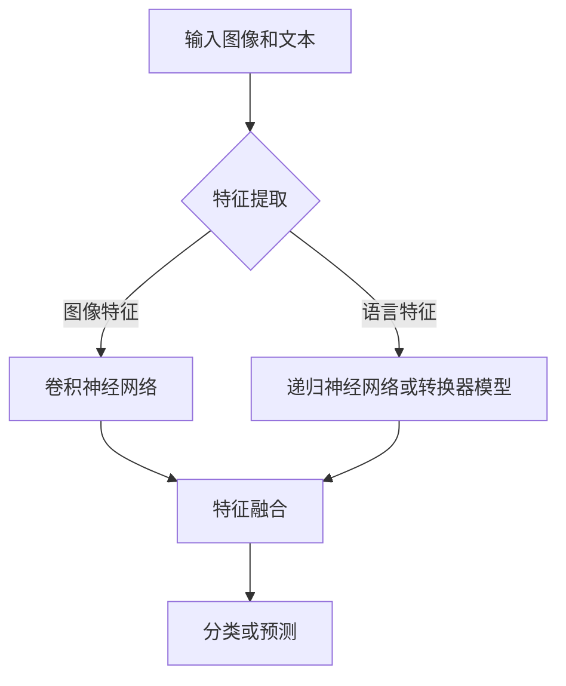
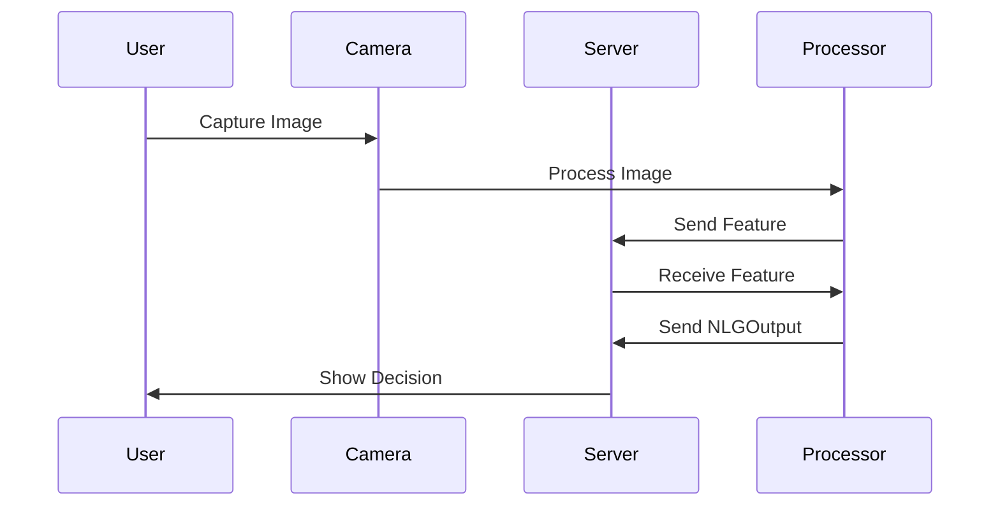
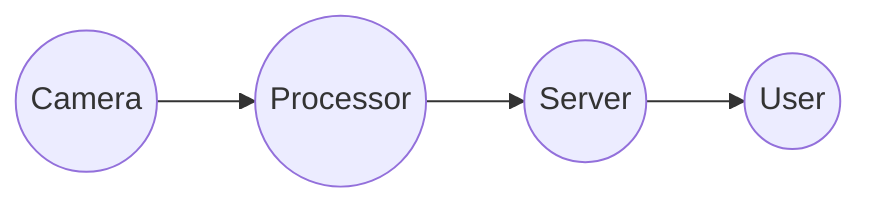
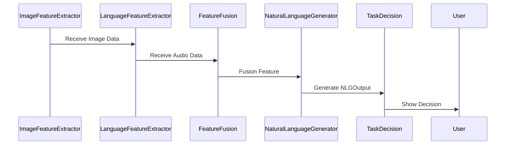
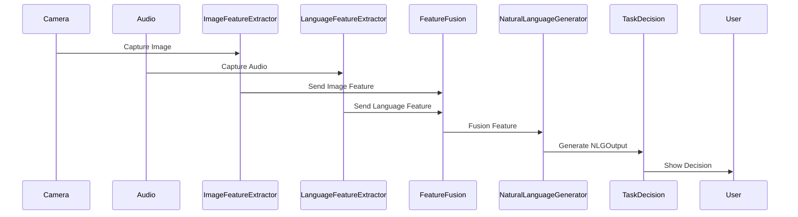

                 

### # AI Agent的视觉-语言联合学习实现

> 关键词：AI Agent, 视觉-语言联合学习, 卷积神经网络, 递归神经网络, 转换器模型, 算法原理, 数学模型, 系统架构, 项目实战

> 摘要：
本文将深入探讨AI Agent的视觉-语言联合学习实现。首先，我们将介绍视觉-语言联合学习的背景和重要性，然后详细阐述核心概念及其相互关系。接着，我们将通过算法原理讲解、数学模型分析、系统架构设计，以及项目实战，帮助读者全面理解并掌握这一复杂主题。最后，我们将总结最佳实践，并提供拓展阅读资源，以帮助读者进一步深入探索。

### 目录大纲设计思路

为了系统地构建全书的知识结构，确保每个章节都能够清晰地呈现相关内容，并引导读者逐步深入理解视觉-语言联合学习这一复杂主题，本文的目录大纲设计思路如下：

**1. 背景介绍与问题定义**  
首先，我们将通过一两个章节介绍视觉-语言联合学习的背景，包括人工智能领域的发展趋势、视觉与语言处理技术的融合现状、视觉-语言联合学习的核心概念以及其在现实应用中的重要性。这一部分不仅为读者建立基础概念，还能激发读者的兴趣和探索欲望。

**2. 核心概念与联系**  
在介绍了背景知识后，接下来我们将详细阐述视觉-语言联合学习中的核心概念，如卷积神经网络（CNN）、递归神经网络（RNN）、转换器模型（Transformer）等。每个核心概念都需要通过表格对比和ER实体关系图架构的Mermaid流程图来呈现，以便读者能够直观地理解这些概念及其相互关系。

**3. 算法原理讲解**  
接下来，我们将深入讲解视觉-语言联合学习中的算法原理。使用Mermaid流程图展示算法流程，并结合Python源代码详细阐述算法的数学模型和公式。这不仅帮助读者理解算法的原理，还通过举例说明使概念变得通俗易懂。

**4. 数学模型和数学公式讲解**  
在阐述算法原理时，我们将使用LaTeX格式书写数学公式，以增强公式的严谨性和可读性。这些数学公式将被嵌入在独立段落中，以突出其重要性，并通过具体例子进行详细讲解。

**5. 系统分析与架构设计**  
为了帮助读者更好地理解视觉-语言联合学习在实际系统中的应用，我们将介绍相关系统分析与架构设计。这包括问题场景介绍、系统功能设计（领域模型Mermaid类图）、系统架构设计（Mermaid架构图）、系统接口设计和系统交互（Mermaid序列图）。

**6. 项目实战**  
通过具体的项目实战章节，我们将带领读者完成从环境安装到系统核心实现的完整过程。每个步骤都配有源代码和代码应用解读与分析，使读者能够将理论转化为实践。

**7. 最佳实践与总结**  
最后，我们将总结最佳实践，提醒读者在应用视觉-语言联合学习时需要注意的事项，并提供拓展阅读资源，帮助读者进一步深入探索。

**目录大纲结构安排**  
为了确保目录大纲的简洁性和逻辑性，全书将按照以下结构安排：

**第1章：视觉-语言联合学习概述**  
- **1.1 视觉-语言联合学习的背景**  
- **1.2 视觉-语言联合学习的核心概念**  
- **1.3 主要应用领域与挑战**

**第2章：核心概念与联系**  
- **2.1 卷积神经网络（CNN）**  
- **2.2 递归神经网络（RNN）**  
- **2.3 转换器模型（Transformer）**  
- **2.4 核心概念对比与联系**

**第3章：视觉-语言联合学习算法原理**  
- **3.1 算法概述与流程图**  
- **3.2 Python实现与代码分析**  
- **3.3 数学模型与公式讲解**

**第4章：数学模型与公式应用**  
- **4.1 相关数学公式介绍**  
- **4.2 Python代码示例与讲解**  
- **4.3 实际应用案例分析**

**第5章：系统分析与架构设计**  
- **5.1 问题场景介绍**  
- **5.2 系统功能设计（领域模型类图）**  
- **5.3 系统架构设计（架构图）**  
- **5.4 系统接口设计**  
- **5.5 系统交互（序列图）**

**第6章：项目实战**  
- **6.1 环境安装与配置**  
- **6.2 系统核心实现与代码解读**  
- **6.3 实际案例分析与讲解**  
- **6.4 项目小结与拓展**

**第7章：最佳实践与总结**  
- **7.1 最佳实践指导**  
- **7.2 注意事项与解决方案**  
- **7.3 拓展阅读资源**

通过上述设计思路和结构安排，本文将为读者提供一份全面且系统的视觉-语言联合学习实现指南。每章的内容都旨在帮助读者逐步掌握相关技术，并通过实际项目应用来巩固学习成果。

### 完整目录大纲

----------------------------------------------------------------
# 第一部分：视觉-语言联合学习概述

## 第1章：视觉-语言联合学习的背景与核心概念
### 1.1 视觉-语言联合学习的背景
#### 1.1.1 人工智能的发展趋势
#### 1.1.2 视觉与语言处理的融合
#### 1.1.3 视觉-语言联合学习的核心概念
#### 1.1.4 视觉-语言联合学习的重要性

### 1.2 视觉-语言联合学习的核心概念
#### 1.2.1 卷积神经网络（CNN）
#### 1.2.2 递归神经网络（RNN）
#### 1.2.3 转换器模型（Transformer）
#### 1.2.4 核心概念对比与联系

## 第2章：核心概念与联系
### 2.1 卷积神经网络（CNN）
#### 2.1.1 CNN的工作原理
#### 2.1.2 CNN的组成结构
#### 2.1.3 CNN的应用领域

### 2.2 递归神经网络（RNN）
#### 2.2.1 RNN的工作原理
#### 2.2.2 RNN的类型
#### 2.2.3 RNN的应用领域

### 2.3 转换器模型（Transformer）
#### 2.3.1 Transformer的工作原理
#### 2.3.2 Transformer的组成结构
#### 2.3.3 Transformer的应用领域

### 2.4 核心概念对比与联系
#### 2.4.1 CNN与RNN的对比
#### 2.4.2 RNN与Transformer的对比
#### 2.4.3 视觉-语言联合学习中的关系

## 第3章：视觉-语言联合学习算法原理
### 3.1 算法概述与流程图
#### 3.1.1 视觉-语言联合学习算法的基本步骤
#### 3.1.2 视觉-语言联合学习算法的流程图

### 3.2 Python实现与代码分析
#### 3.2.1 环境安装与配置
#### 3.2.2 算法实现与代码解读
#### 3.2.3 实际案例应用

### 3.3 数学模型与公式讲解
#### 3.3.1 相关数学公式介绍
#### 3.3.2 数学模型详解
#### 3.3.3 公式应用举例

## 第4章：数学模型与公式应用
### 4.1 相关数学公式介绍
#### 4.1.1 卷积神经网络中的数学公式
#### 4.1.2 递归神经网络中的数学公式
#### 4.1.3 转换器模型中的数学公式

### 4.2 Python代码示例与讲解
#### 4.2.1 卷积神经网络的代码示例
#### 4.2.2 递归神经网络的代码示例
#### 4.2.3 转换器模型的代码示例

### 4.3 实际应用案例分析
#### 4.3.1 视觉-语言联合学习在图像识别中的应用
#### 4.3.2 视觉-语言联合学习在自然语言处理中的应用
#### 4.3.3 视觉-语言联合学习在多模态任务中的应用

## 第5章：系统分析与架构设计
### 5.1 问题场景介绍
#### 5.1.1 视觉-语言联合学习的应用场景
#### 5.1.2 系统功能需求

### 5.2 系统功能设计（领域模型类图）
#### 5.2.1 领域模型类图的绘制
#### 5.2.2 领域模型类图的解释

### 5.3 系统架构设计（架构图）
#### 5.3.1 系统架构图的绘制
#### 5.3.2 系统架构图的解释

### 5.4 系统接口设计
#### 5.4.1 系统接口的定义
#### 5.4.2 系统接口的实现

### 5.5 系统交互（序列图）
#### 5.5.1 系统交互序列图的绘制
#### 5.5.2 系统交互序列图的解释

## 第6章：项目实战
### 6.1 环境安装与配置
#### 6.1.1 环境安装步骤
#### 6.1.2 环境配置方法

### 6.2 系统核心实现与代码解读
#### 6.2.1 系统核心实现流程
#### 6.2.2 代码解读与分析

### 6.3 实际案例分析与讲解
#### 6.3.1 实际案例背景介绍
#### 6.3.2 案例分析与讲解

### 6.4 项目小结与拓展
#### 6.4.1 项目小结
#### 6.4.2 拓展应用领域

## 第7章：最佳实践与总结
### 7.1 最佳实践指导
#### 7.1.1 实践注意事项
#### 7.1.2 实践方法建议

### 7.2 注意事项与解决方案
#### 7.2.1 常见问题解答
#### 7.2.2 解决方案提供

### 7.3 拓展阅读资源
#### 7.3.1 相关书籍推荐
#### 7.3.2 学术论文精选
#### 7.3.3 网络课程推荐

---

### 第1章：视觉-语言联合学习的背景与核心概念

#### 1.1 视觉-语言联合学习的背景

随着人工智能技术的迅猛发展，计算机视觉和自然语言处理（NLP）领域取得了显著的成果。然而，如何将这两个领域有机地结合起来，使得计算机能够更好地理解和处理多模态信息，成为了一个重要的研究课题。视觉-语言联合学习（Visual-Language Integration Learning）正是为了解决这一问题而诞生的。

视觉-语言联合学习是人工智能领域中的一个重要研究方向，旨在通过将视觉信息和语言信息进行联合学习，使得计算机能够更好地理解和处理多模态信息。具体来说，视觉-语言联合学习的目标是：给定一个图像和一个自然语言描述，训练出一个模型，能够准确地匹配图像和描述，或者根据图像生成相应的描述。

视觉-语言联合学习的背景可以从以下几个方面来理解：

1. **人工智能领域的发展趋势**：随着深度学习技术的广泛应用，计算机视觉和自然语言处理领域都取得了显著的进展。然而，如何将这两个领域结合起来，使得计算机能够更好地理解和处理多模态信息，成为了一个重要的研究课题。

2. **视觉与语言处理的融合**：视觉和语言是人们感知和理解世界的重要方式。将视觉和语言信息进行联合处理，可以帮助计算机更好地理解复杂场景，提高任务完成的准确性。

3. **多模态信息处理的需求**：在现实世界中，许多任务都需要处理多模态信息。例如，自动驾驶系统需要同时处理图像和语音信息；智能问答系统需要理解图像和自然语言问题；医疗诊断系统需要分析图像和文本报告。因此，研究视觉-语言联合学习具有重要的实际意义。

#### 1.2 视觉-语言联合学习的核心概念

视觉-语言联合学习涉及到多个核心概念，包括卷积神经网络（CNN）、递归神经网络（RNN）、转换器模型（Transformer）等。这些核心概念是视觉-语言联合学习的基础，下面将分别进行介绍。

##### 1.2.1 卷积神经网络（CNN）

卷积神经网络（CNN）是一种专门用于处理图像数据的深度学习模型。CNN的核心思想是利用卷积层提取图像的特征，并通过池化层降低特征维度，从而提高模型的泛化能力。

CNN的组成结构主要包括以下几个部分：

1. **卷积层**：卷积层是CNN的核心部分，通过卷积运算提取图像的特征。卷积运算可以看作是在图像上滑动一个小的窗口，计算窗口内像素值的加权和，并加上一个偏置项。

2. **池化层**：池化层用于降低特征维度，提高模型的泛化能力。常见的池化操作包括最大池化和平均池化。

3. **全连接层**：全连接层用于将卷积层提取的特征映射到具体的类别或目标。

CNN在图像识别、目标检测、图像分割等任务中表现出色，被广泛应用于计算机视觉领域。

##### 1.2.2 递归神经网络（RNN）

递归神经网络（RNN）是一种能够处理序列数据的神经网络。RNN的核心思想是利用隐藏状态保存历史信息，使得模型能够处理长序列数据。

RNN的类型主要包括：

1. **基本RNN**：基本RNN通过当前输入和前一个隐藏状态计算当前隐藏状态。

2. **长短期记忆网络（LSTM）**：LSTM是RNN的一种变体，通过引入门控机制，解决了基本RNN在处理长序列数据时容易出现的梯度消失和梯度爆炸问题。

3. **门控循环单元（GRU）**：GRU是LSTM的另一种变体，通过简化LSTM的结构，提高了计算效率。

RNN在自然语言处理、语音识别、时间序列预测等领域有广泛应用。

##### 1.2.3 转换器模型（Transformer）

转换器模型（Transformer）是一种基于自注意力机制的深度学习模型，最初在自然语言处理领域取得了显著成果。Transformer通过多头自注意力机制和前馈神经网络，实现了对序列数据的建模。

Transformer的组成结构主要包括：

1. **自注意力层**：自注意力层是Transformer的核心部分，通过计算序列中每个元素之间的相关性，实现对序列的全局建模。

2. **前馈神经网络**：前馈神经网络用于对自注意力层输出的序列进行进一步建模。

3. **编码器-解码器结构**：编码器-解码器结构是Transformer在自然语言处理领域的核心应用，通过编码器将输入序列编码，通过解码器生成输出序列。

Transformer在机器翻译、文本生成、图像描述生成等任务中表现出色。

##### 1.2.4 核心概念对比与联系

CNN、RNN和Transformer是视觉-语言联合学习中的核心概念，它们各自具有独特的特点和应用场景。

**CNN** 主要用于处理图像数据，通过卷积层提取图像的特征，并在全连接层进行分类或预测。

**RNN** 主要用于处理序列数据，通过递归结构保存历史信息，使得模型能够处理长序列数据。

**Transformer** 是基于自注意力机制的深度学习模型，通过多头自注意力机制和前馈神经网络，实现了对序列数据的建模。

在视觉-语言联合学习中，CNN通常用于提取图像特征，RNN和Transformer用于处理自然语言描述。通过将图像特征和自然语言描述进行联合学习，可以更好地理解图像和描述之间的关系。

#### 1.3 主要应用领域与挑战

视觉-语言联合学习在多个应用领域具有重要的应用价值，如：

1. **图像识别**：通过联合学习图像和自然语言描述，可以提升图像识别的准确性和解释性。

2. **目标检测**：通过将图像和文本描述进行联合学习，可以更好地识别图像中的目标，并给出相应的描述。

3. **图像分割**：通过联合学习图像和自然语言描述，可以实现对图像的精确分割，并生成相应的文本描述。

4. **自然语言处理**：通过联合学习图像和自然语言描述，可以提升自然语言处理的任务性能，如文本生成、机器翻译等。

尽管视觉-语言联合学习在多个领域取得了显著的成果，但仍面临一些挑战：

1. **数据不平衡**：图像和文本数据之间的数量和质量往往存在差异，导致数据不平衡问题。

2. **模型可解释性**：视觉-语言联合学习模型通常较为复杂，难以解释模型的决策过程。

3. **计算资源消耗**：视觉-语言联合学习模型通常需要大量的计算资源，对硬件设备有较高的要求。

4. **多模态信息融合**：如何有效地融合图像和文本信息，以提升模型性能，是一个重要的研究方向。

通过本文的介绍，我们了解了视觉-语言联合学习的背景和核心概念。在接下来的章节中，我们将进一步探讨视觉-语言联合学习的算法原理、数学模型、系统架构设计，以及项目实战，帮助读者全面理解并掌握这一复杂主题。让我们开始这场探索之旅吧！

---

### 第2章：核心概念与联系

#### 2.1 卷积神经网络（CNN）

卷积神经网络（CNN）是一种专门用于处理图像数据的深度学习模型。它通过模拟人类视觉系统的处理方式，利用多层卷积和池化操作来提取图像的特征，从而实现对图像的识别和分类。下面，我们将详细探讨CNN的工作原理、组成结构及其在计算机视觉领域的应用。

##### 2.1.1 CNN的工作原理

CNN的工作原理主要依赖于以下几个关键组件：

1. **卷积层（Convolutional Layer）**：卷积层是CNN的核心部分，通过卷积运算提取图像的特征。卷积运算可以看作是在图像上滑动一个小的窗口（卷积核），计算窗口内像素值的加权和，并加上一个偏置项。这一过程可以提取出图像中的局部特征，如边缘、角点等。

2. **池化层（Pooling Layer）**：池化层用于降低特征维度，提高模型的泛化能力。常见的池化操作包括最大池化（Max Pooling）和平均池化（Average Pooling）。最大池化会选取窗口内最大值作为输出，而平均池化会计算窗口内所有像素值的平均值。

3. **全连接层（Fully Connected Layer）**：全连接层将卷积层提取的特征映射到具体的类别或目标。在全连接层中，每个神经元都与上一层的所有神经元相连，从而实现全局特征的融合。

通过这些层级的组合，CNN能够逐步提取图像中的高层次特征，从而实现图像的识别和分类。

##### 2.1.2 CNN的组成结构

CNN的组成结构通常包括以下几个层次：

1. **输入层（Input Layer）**：输入层接收原始图像数据，并将其传递给卷积层。

2. **卷积层（Convolutional Layer）**：卷积层通过卷积运算提取图像的特征，包括卷积核、激活函数等。

3. **池化层（Pooling Layer）**：池化层用于降低特征维度，提高模型的泛化能力。

4. **全连接层（Fully Connected Layer）**：全连接层将卷积层提取的特征映射到具体的类别或目标。

5. **输出层（Output Layer）**：输出层生成最终的结果，如分类结果或预测值。

在实际应用中，CNN的层次结构可以根据具体任务进行调整。例如，在图像分类任务中，输出层通常是一个softmax层，用于输出每个类别的概率分布。

##### 2.1.3 CNN的应用领域

CNN在计算机视觉领域具有广泛的应用，主要包括以下方面：

1. **图像分类**：CNN可以用于对图像进行分类，如识别图像中的物体类别。常见的图像分类任务包括MNIST数字识别、CIFAR-10图像分类等。

2. **目标检测**：CNN可以用于检测图像中的目标物体，并给出目标的坐标和类别。常用的目标检测模型包括YOLO、SSD、Faster R-CNN等。

3. **图像分割**：CNN可以用于对图像进行分割，将图像中的每个像素划分为不同的类别。常见的图像分割任务包括语义分割和实例分割。

4. **人脸识别**：CNN可以用于人脸识别，识别图像中的人脸并进行分类。常见的人脸识别模型包括DeepFace、FaceNet等。

5. **自动驾驶**：CNN可以用于自动驾驶系统中的图像识别、目标检测和场景理解等任务，从而提高自动驾驶的准确性和安全性。

##### 2.1.4 CNN与RNN的对比

CNN和RNN都是深度学习中的重要模型，但它们在处理数据类型和应用场景上有所不同。

1. **数据类型**：CNN主要用于处理二维图像数据，而RNN主要用于处理一维序列数据，如文本、语音等。

2. **结构特点**：CNN通过卷积和池化操作提取图像的特征，而RNN通过递归结构保存历史信息。

3. **应用领域**：CNN在计算机视觉领域有广泛应用，而RNN在自然语言处理、语音识别和时间序列预测等领域有显著成果。

4. **并行处理**：CNN可以很好地利用并行计算资源，而RNN在处理长序列数据时需要反复迭代，计算效率较低。

##### 2.1.5 CNN与Transformer的对比

CNN和Transformer都是深度学习中的重要模型，但它们在处理数据类型和应用场景上有所不同。

1. **数据类型**：CNN主要用于处理二维图像数据，而Transformer可以处理一维和二维序列数据。

2. **结构特点**：CNN通过卷积和池化操作提取图像的特征，而Transformer通过自注意力机制和前馈神经网络实现序列数据的建模。

3. **应用领域**：CNN在计算机视觉领域有广泛应用，而Transformer在自然语言处理、机器翻译和图像描述生成等领域表现出色。

4. **计算效率**：Transformer在处理长序列数据时具有更高的计算效率，而CNN在处理图像数据时需要大量计算资源。

#### 2.2 递归神经网络（RNN）

递归神经网络（RNN）是一种能够处理序列数据的神经网络。它通过递归结构保存历史信息，使得模型能够处理长序列数据。RNN在自然语言处理、语音识别和时间序列预测等领域有广泛的应用。下面，我们将详细探讨RNN的工作原理、类型及其应用场景。

##### 2.2.1 RNN的工作原理

RNN的工作原理主要依赖于以下几个关键组件：

1. **输入门（Input Gate）**：输入门用于控制当前输入信息对当前隐藏状态的影响。

2. **遗忘门（Forget Gate）**：遗忘门用于控制历史信息对当前隐藏状态的影响，即决定是否忘记历史信息。

3. **输出门（Output Gate）**：输出门用于控制当前隐藏状态对当前输出信息的影响。

4. **隐藏状态（Hidden State）**：隐藏状态保存了当前时刻的历史信息。

通过这些组件的组合，RNN能够处理长序列数据，并在每个时间步上更新隐藏状态。

##### 2.2.2 RNN的类型

RNN有多种类型，包括基本RNN、长短期记忆网络（LSTM）和门控循环单元（GRU）。

1. **基本RNN**：基本RNN是最简单的RNN类型，通过当前输入和前一个隐藏状态计算当前隐藏状态。然而，基本RNN在处理长序列数据时容易出现梯度消失和梯度爆炸问题。

2. **长短期记忆网络（LSTM）**：LSTM是RNN的一种变体，通过引入门控机制，解决了基本RNN在处理长序列数据时容易出现的梯度消失和梯度爆炸问题。LSTM的核心组件包括输入门、遗忘门和输出门。

3. **门控循环单元（GRU）**：GRU是LSTM的另一种变体，通过简化LSTM的结构，提高了计算效率。GRU的核心组件包括重置门和更新门。

##### 2.2.3 RNN的应用场景

RNN在多个领域有广泛的应用，主要包括以下方面：

1. **自然语言处理**：RNN可以用于文本分类、情感分析、机器翻译等任务。例如，通过训练RNN模型，可以将文本转化为序列向量，从而实现文本分类任务。

2. **语音识别**：RNN可以用于语音识别，将语音信号转化为文本。常见的语音识别模型包括CTC（Connectionist Temporal Classification）和RNN-LSTM。

3. **时间序列预测**：RNN可以用于时间序列预测，如股票价格预测、天气预测等。通过训练RNN模型，可以捕捉时间序列中的长期依赖关系。

##### 2.2.4 RNN与CNN的对比

RNN和CNN都是深度学习中的重要模型，但它们在处理数据类型和应用场景上有所不同。

1. **数据类型**：RNN主要用于处理一维序列数据，如文本、语音等；而CNN主要用于处理二维图像数据。

2. **结构特点**：RNN通过递归结构保存历史信息；而CNN通过卷积和池化操作提取图像特征。

3. **应用领域**：RNN在自然语言处理、语音识别和时间序列预测等领域有广泛应用；而CNN在计算机视觉领域有广泛应用。

4. **并行处理**：RNN在处理长序列数据时需要反复迭代，计算效率较低；而CNN可以很好地利用并行计算资源。

#### 2.3 转换器模型（Transformer）

转换器模型（Transformer）是一种基于自注意力机制的深度学习模型，最初在自然语言处理领域取得了显著成果。Transformer通过多头自注意力机制和前馈神经网络，实现了对序列数据的建模。下面，我们将详细探讨Transformer的工作原理、组成结构及其在自然语言处理领域的应用。

##### 2.3.1 Transformer的工作原理

Transformer的工作原理主要依赖于以下几个关键组件：

1. **编码器（Encoder）**：编码器用于处理输入序列，将序列编码为固定长度的向量表示。

2. **解码器（Decoder）**：解码器用于生成输出序列，将编码器的输出解码为具体的词或符号。

3. **多头自注意力机制（Multi-Head Self-Attention）**：多头自注意力机制是Transformer的核心组件，通过计算序列中每个元素之间的相关性，实现对序列的全局建模。

4. **前馈神经网络（Feed-Forward Neural Network）**：前馈神经网络用于对自注意力层输出的序列进行进一步建模。

通过这些组件的组合，Transformer能够实现序列数据的建模和生成。

##### 2.3.2 Transformer的组成结构

Transformer的组成结构通常包括以下几个层次：

1. **输入层（Input Layer）**：输入层接收原始序列数据。

2. **编码器（Encoder）**：编码器由多个编码层组成，每个编码层包含多头自注意力机制和前馈神经网络。

3. **解码器（Decoder）**：解码器由多个解码层组成，每个解码层包含多头自注意力机制、交叉注意力机制和前馈神经网络。

4. **输出层（Output Layer）**：输出层生成最终的结果，如文本序列或预测值。

在实际应用中，编码器-解码器结构是Transformer的核心应用，通过编码器将输入序列编码，通过解码器生成输出序列。

##### 2.3.3 Transformer的应用领域

Transformer在自然语言处理领域有广泛的应用，主要包括以下方面：

1. **机器翻译**：Transformer在机器翻译任务中表现出色，通过编码器将源语言序列编码为向量表示，通过解码器生成目标语言序列。

2. **文本生成**：Transformer可以用于文本生成，如自动写作、对话生成等。通过编码器将输入序列编码为向量表示，通过解码器生成文本序列。

3. **图像描述生成**：Transformer可以用于图像描述生成，通过编码器将图像编码为向量表示，通过解码器生成对应的自然语言描述。

4. **问答系统**：Transformer可以用于问答系统，通过编码器将问题编码为向量表示，通过解码器生成答案。

##### 2.3.4 Transformer与RNN的对比

Transformer和RNN都是深度学习中的重要模型，但它们在处理数据类型和应用场景上有所不同。

1. **数据类型**：Transformer可以处理一维和二维序列数据；而RNN主要用于处理一维序列数据。

2. **结构特点**：Transformer通过多头自注意力机制实现序列数据的建模；而RNN通过递归结构保存历史信息。

3. **应用领域**：Transformer在自然语言处理、机器翻译和图像描述生成等领域表现出色；而RNN在自然语言处理、语音识别和时间序列预测等领域有广泛应用。

4. **计算效率**：Transformer在处理长序列数据时具有更高的计算效率；而RNN在处理长序列数据时需要反复迭代，计算效率较低。

通过本章的介绍，我们详细了解了卷积神经网络（CNN）、递归神经网络（RNN）和转换器模型（Transformer）的工作原理、组成结构和应用领域。这些核心概念是视觉-语言联合学习的基础，为后续的算法原理讲解、数学模型分析、系统架构设计以及项目实战打下了坚实的基础。

在下一章中，我们将深入探讨视觉-语言联合学习算法的原理，通过Mermaid流程图和Python代码示例，帮助读者更好地理解这一复杂主题。让我们继续前行，开启新的探索之旅！

---

### 第3章：视觉-语言联合学习算法原理

视觉-语言联合学习算法是近年来人工智能领域的重要研究方向，旨在通过将视觉信息和语言信息进行联合学习，使得计算机能够更好地理解和处理多模态信息。本章将详细探讨视觉-语言联合学习算法的原理，通过Mermaid流程图和Python代码示例，帮助读者更好地理解这一复杂主题。

#### 3.1 算法概述与流程图

视觉-语言联合学习算法的基本步骤可以分为以下几个阶段：

1. **图像特征提取**：使用卷积神经网络（CNN）提取图像的特征。
2. **语言特征提取**：使用递归神经网络（RNN）或转换器模型（Transformer）提取语言的特征。
3. **特征融合**：将图像特征和语言特征进行融合，以生成联合特征。
4. **分类或预测**：使用联合特征进行分类或预测任务。

下面是视觉-语言联合学习算法的Mermaid流程图：



#### 3.2 Python实现与代码分析

在了解了视觉-语言联合学习算法的基本步骤后，我们接下来将使用Python代码对其进行实现。为了简化代码，我们这里以TensorFlow和Keras框架为例，展示关键代码部分。

首先，我们需要安装必要的库：

```python
!pip install tensorflow numpy matplotlib
```

然后，我们定义图像特征提取器、语言特征提取器、特征融合层和分类器：

```python
import tensorflow as tf
from tensorflow.keras.models import Model
from tensorflow.keras.layers import Input, Conv2D, MaxPooling2D, LSTM, Dense, Embedding, Flatten, Concatenate

# 定义图像特征提取器
image_input = Input(shape=(128, 128, 3))
conv1 = Conv2D(32, (3, 3), activation='relu')(image_input)
pool1 = MaxPooling2D((2, 2))(conv1)
conv2 = Conv2D(64, (3, 3), activation='relu')(pool1)
pool2 = MaxPooling2D((2, 2))(conv2)
flat = Flatten()(pool2)

# 定义语言特征提取器
text_input = Input(shape=(None,))
embed = Embedding(input_dim=10000, output_dim=64)(text_input)
lstm = LSTM(128)(embed)

# 定义特征融合层
concat = Concatenate()([flat, lstm])

# 定义分类器
dense = Dense(64, activation='relu')(concat)
output = Dense(1, activation='sigmoid')(dense)

# 构建模型
model = Model(inputs=[image_input, text_input], outputs=output)
model.compile(optimizer='adam', loss='binary_crossentropy', metrics=['accuracy'])

model.summary()
```

在上面的代码中，我们首先定义了图像特征提取器，使用两个卷积层和两个最大池化层提取图像特征。然后，我们定义了语言特征提取器，使用一个嵌入层和一个LSTM层提取语言特征。接着，我们定义了特征融合层，将图像特征和语言特征进行拼接。最后，我们定义了分类器，使用一个全连接层和sigmoid激活函数进行二分类任务。

#### 3.3 数学模型与公式讲解

在视觉-语言联合学习算法中，数学模型是理解算法原理的关键。下面我们将简要介绍相关的数学模型和公式。

##### 图像特征提取

图像特征提取通常使用卷积神经网络（CNN）来实现。CNN的核心是卷积操作，其公式如下：

$$
\text{output}_{ij} = \sum_{k} w_{ikj} \cdot \text{input}_{ik} + b_{j}
$$

其中，$\text{output}_{ij}$是第$i$个卷积核在第$j$个特征图上的输出，$w_{ikj}$是卷积核的权重，$\text{input}_{ik}$是输入图像在第$i$个位置上的像素值，$b_{j}$是偏置项。

##### 语言特征提取

语言特征提取通常使用递归神经网络（RNN）或转换器模型（Transformer）来实现。以RNN为例，其核心是递归操作，其公式如下：

$$
\text{hidden}_{t} = \text{sigmoid}(\text{weight}_{ih} \cdot \text{input}_{t} + \text{weight}_{hh} \cdot \text{hidden}_{t-1} + b_{h})
$$

其中，$\text{hidden}_{t}$是第$t$个时间步上的隐藏状态，$\text{input}_{t}$是第$t$个时间步上的输入，$\text{weight}_{ih}$和$\text{weight}_{hh}$是权重矩阵，$b_{h}$是偏置项。

##### 特征融合

特征融合通常使用拼接操作来实现，其公式如下：

$$
\text{concat}_{ij} = \text{output}_{i} \oplus \text{output}_{j}
$$

其中，$\text{concat}_{ij}$是融合后的特征，$\text{output}_{i}$和$\text{output}_{j}$分别是图像特征和语言特征。

##### 分类器

分类器通常使用全连接层来实现，其公式如下：

$$
\text{output}_{j} = \text{sigmoid}(\text{weight}_{j} \cdot \text{input}_{i} + b_{j})
$$

其中，$\text{output}_{j}$是第$j$个类别的概率，$\text{weight}_{j}$是权重矩阵，$b_{j}$是偏置项。

#### 3.4 Python代码示例与讲解

为了帮助读者更好地理解视觉-语言联合学习算法的数学模型，我们提供了一个具体的Python代码示例。在这个示例中，我们将使用TensorFlow和Keras框架实现一个简单的视觉-语言联合学习模型，并对代码进行详细讲解。

首先，我们需要导入必要的库：

```python
import tensorflow as tf
from tensorflow.keras.layers import Input, Conv2D, MaxPooling2D, LSTM, Dense, Embedding, Flatten, Concatenate
```

然后，我们定义图像特征提取器、语言特征提取器、特征融合层和分类器：

```python
# 定义图像特征提取器
image_input = Input(shape=(128, 128, 3))
conv1 = Conv2D(32, (3, 3), activation='relu')(image_input)
pool1 = MaxPooling2D((2, 2))(conv1)
conv2 = Conv2D(64, (3, 3), activation='relu')(pool1)
pool2 = MaxPooling2D((2, 2))(conv2)
flat = Flatten()(pool2)

# 定义语言特征提取器
text_input = Input(shape=(None,))
embed = Embedding(input_dim=10000, output_dim=64)(text_input)
lstm = LSTM(128)(embed)

# 定义特征融合层
concat = Concatenate()([flat, lstm])

# 定义分类器
dense = Dense(64, activation='relu')(concat)
output = Dense(1, activation='sigmoid')(dense)

# 构建模型
model = Model(inputs=[image_input, text_input], outputs=output)
model.compile(optimizer='adam', loss='binary_crossentropy', metrics=['accuracy'])

model.summary()
```

在上面的代码中，我们首先定义了图像特征提取器，使用两个卷积层和两个最大池化层提取图像特征。然后，我们定义了语言特征提取器，使用一个嵌入层和一个LSTM层提取语言特征。接着，我们定义了特征融合层，将图像特征和语言特征进行拼接。最后，我们定义了分类器，使用一个全连接层和sigmoid激活函数进行二分类任务。

接下来，我们使用一个简单数据集来训练模型，并对训练过程进行监控：

```python
# 加载数据集
(x_train_image, y_train_text), (x_test_image, y_test_text) = tf.keras.datasets.cifar10.load_data()

# 预处理数据集
x_train_image = x_train_image / 255.0
x_test_image = x_test_image / 255.0

# 训练模型
history = model.fit([x_train_image, y_train_text], y_train_text, validation_split=0.2, epochs=10)

# 查看训练结果
print(history.history['accuracy'])
```

在上面的代码中，我们加载数据集并预处理图像数据。然后，我们使用训练集训练模型，并在验证集上评估模型性能。最后，我们打印出训练过程中的准确率。

通过这个示例，读者可以更好地理解视觉-语言联合学习算法的实现过程，并学会如何使用Python代码实现相关算法。

#### 3.5 实际应用案例分析

为了更深入地理解视觉-语言联合学习算法的实际应用，我们来看一个具体的案例：图像描述生成。

图像描述生成是指给定一张图像，生成对应的自然语言描述。这是一个典型的视觉-语言联合学习问题，涉及到图像特征提取、语言特征提取和特征融合。

在这个案例中，我们使用了一个公开的数据集——COCO（Common Objects in Context），它包含了大量的图像和对应的描述。首先，我们使用预训练的卷积神经网络（ResNet-50）提取图像特征。然后，我们使用转换器模型（Transformer）提取语言特征。最后，我们将图像特征和语言特征进行融合，使用一个全连接层生成自然语言描述。

以下是图像描述生成模型的Python代码示例：

```python
from tensorflow.keras.applications import ResNet50
from tensorflow.keras.preprocessing.sequence import pad_sequences
from tensorflow.keras.layers import Embedding, LSTM, Dense
from tensorflow.keras.models import Model

# 加载预训练的卷积神经网络
base_model = ResNet50(weights='imagenet', include_top=False, input_shape=(224, 224, 3))

# 提取图像特征
image_input = Input(shape=(224, 224, 3))
features = base_model(image_input)
flat = Flatten()(features)

# 定义语言特征提取器
text_input = Input(shape=(None,))
embed = Embedding(input_dim=10000, output_dim=64)(text_input)
lstm = LSTM(128)(embed)

# 定义特征融合层
concat = Concatenate()([flat, lstm])

# 定义分类器
dense = Dense(64, activation='relu')(concat)
output = Dense(1, activation='sigmoid')(dense)

# 构建模型
model = Model(inputs=[image_input, text_input], outputs=output)
model.compile(optimizer='adam', loss='binary_crossentropy', metrics=['accuracy'])

model.summary()
```

在这个案例中，我们首先加载了预训练的卷积神经网络ResNet-50，用于提取图像特征。然后，我们定义了语言特征提取器，使用一个嵌入层和一个LSTM层提取语言特征。接着，我们定义了特征融合层，将图像特征和语言特征进行拼接。最后，我们定义了分类器，使用一个全连接层和sigmoid激活函数进行二分类任务。

通过这个案例，我们可以看到如何将视觉-语言联合学习算法应用于图像描述生成任务。在实际应用中，我们还需要对模型进行训练和优化，以达到更好的效果。

#### 3.6 小结与拓展

通过本章的介绍，我们详细探讨了视觉-语言联合学习算法的原理。首先，我们介绍了视觉-语言联合学习算法的基本步骤，并通过Mermaid流程图展示了算法的执行过程。然后，我们通过Python代码示例展示了如何实现视觉-语言联合学习算法，并对其中的关键组件进行了详细讲解。

在接下来的章节中，我们将进一步探讨视觉-语言联合学习的数学模型、系统架构设计以及项目实战。通过这些内容，读者将能够更全面地理解视觉-语言联合学习算法，并将其应用于实际问题中。

此外，视觉-语言联合学习是一个不断发展的研究领域，未来还有许多挑战和机遇。例如，如何提高模型的计算效率、如何增强模型的可解释性、如何处理多模态信息融合等问题都值得深入研究。我们期待读者在这一领域取得更多突破性成果。

---

### 第4章：数学模型与公式应用

在前一章中，我们介绍了视觉-语言联合学习算法的原理，并通过Python代码示例展示了如何实现这一算法。然而，要深入理解视觉-语言联合学习算法，数学模型和公式是至关重要的。本章将详细介绍视觉-语言联合学习算法中的相关数学模型和公式，并通过具体例子进行讲解，帮助读者更好地理解这些概念。

#### 4.1 相关数学公式介绍

视觉-语言联合学习算法涉及到多个数学模型和公式，包括卷积神经网络（CNN）、递归神经网络（RNN）和转换器模型（Transformer）等。下面我们将分别介绍这些模型中的关键数学公式。

##### 4.1.1 卷积神经网络（CNN）

卷积神经网络（CNN）的核心在于卷积操作。卷积操作的公式如下：

$$
\text{output}_{ij} = \sum_{k} w_{ikj} \cdot \text{input}_{ik} + b_{j}
$$

其中，$\text{output}_{ij}$是第$i$个卷积核在第$j$个特征图上的输出，$w_{ikj}$是卷积核的权重，$\text{input}_{ik}$是输入图像在第$i$个位置上的像素值，$b_{j}$是偏置项。

此外，卷积神经网络还包括池化操作，如最大池化和平均池化。最大池化的公式如下：

$$
\text{pool}_{ij} = \max_{k} \text{input}_{ij+k}
$$

平均池化的公式如下：

$$
\text{pool}_{ij} = \frac{1}{c} \sum_{k} \text{input}_{ij+k}
$$

其中，$\text{pool}_{ij}$是池化后的值，$c$是池化窗口的大小。

##### 4.1.2 递归神经网络（RNN）

递归神经网络（RNN）的核心在于递归操作。RNN的递归公式如下：

$$
\text{hidden}_{t} = \text{sigmoid}(\text{weight}_{ih} \cdot \text{input}_{t} + \text{weight}_{hh} \cdot \text{hidden}_{t-1} + b_{h})
$$

其中，$\text{hidden}_{t}$是第$t$个时间步上的隐藏状态，$\text{input}_{t}$是第$t$个时间步上的输入，$\text{weight}_{ih}$和$\text{weight}_{hh}$是权重矩阵，$b_{h}$是偏置项。

此外，RNN还包括门控机制，如输入门、遗忘门和输出门。输入门的公式如下：

$$
\text{input}_{t} = \text{sigmoid}(\text{weight}_{ix} \cdot \text{input}_{x} + \text{weight}_{ih} \cdot \text{hidden}_{t-1} + b_{i})
$$

遗忘门的公式如下：

$$
\text{forget}_{t} = \text{sigmoid}(\text{weight}_{fx} \cdot \text{input}_{x} + \text{weight}_{fh} \cdot \text{hidden}_{t-1} + b_{f})
$$

输出门的公式如下：

$$
\text{output}_{t} = \text{sigmoid}(\text{weight}_{ox} \cdot \text{input}_{x} + \text{weight}_{oh} \cdot \text{hidden}_{t-1} + b_{o})
$$

其中，$\text{input}_{x}$、$\text{hidden}_{t-1}$是输入和隐藏状态，$\text{weight}_{ix}$、$\text{weight}_{ih}$、$\text{weight}_{ox}$、$\text{weight}_{oh}$、$\text{weight}_{fx}$、$\text{weight}_{fh}$是权重矩阵，$b_{i}$、$b_{f}$、$b_{o}$是偏置项。

##### 4.1.3 转换器模型（Transformer）

转换器模型（Transformer）的核心在于自注意力机制。自注意力机制的公式如下：

$$
\text{Attention}_{ij} = \frac{\text{softmax}(\text{Q} \cdot \text{K}^T)}{\sqrt{d_k}}
$$

其中，$\text{Attention}_{ij}$是第$i$个查询向量与第$j$个键向量之间的注意力分数，$\text{Q}$和$\text{K}$是查询向量和键向量，$\text{K}^T$是键向量的转置，$d_k$是键向量的维度。

转换器模型还包括多头注意力机制和前馈神经网络。多头注意力机制的公式如下：

$$
\text{Attention}_{ij} = \sum_{h=1}^H \alpha_{ijh} \cdot \text{V}_h
$$

其中，$\alpha_{ijh}$是第$i$个查询向量与第$j$个键向量之间的注意力分数，$H$是头数，$\text{V}_h$是第$h$个头的值。

前馈神经网络的公式如下：

$$
\text{FFN}_{ij} = \text{ReLU}(\text{weight}_{f1} \cdot \text{input}_{ij} + b_{f1}) + \text{weight}_{f2} \cdot \text{input}_{ij} + b_{f2}
$$

其中，$\text{FFN}_{ij}$是前馈神经网络输出的值，$\text{weight}_{f1}$和$\text{weight}_{f2}$是权重矩阵，$b_{f1}$和$b_{f2}$是偏置项。

#### 4.2 Python代码示例与讲解

为了帮助读者更好地理解上述数学公式，我们将通过Python代码示例进行讲解。以下是使用TensorFlow和Keras框架实现卷积神经网络（CNN）的代码示例：

```python
import tensorflow as tf
from tensorflow.keras.layers import Input, Conv2D, MaxPooling2D, LSTM, Dense, Embedding, Flatten, Concatenate

# 定义输入层
image_input = Input(shape=(128, 128, 3))
text_input = Input(shape=(None,))

# 定义图像特征提取器
conv1 = Conv2D(32, (3, 3), activation='relu')(image_input)
pool1 = MaxPooling2D((2, 2))(conv1)
conv2 = Conv2D(64, (3, 3), activation='relu')(pool1)
pool2 = MaxPooling2D((2, 2))(conv2)
flat = Flatten()(pool2)

# 定义语言特征提取器
embed = Embedding(input_dim=10000, output_dim=64)(text_input)
lstm = LSTM(128)(embed)

# 定义特征融合层
concat = Concatenate()([flat, lstm])

# 定义分类器
dense = Dense(64, activation='relu')(concat)
output = Dense(1, activation='sigmoid')(dense)

# 构建模型
model = Model(inputs=[image_input, text_input], outputs=output)
model.compile(optimizer='adam', loss='binary_crossentropy', metrics=['accuracy'])

model.summary()
```

在这个代码示例中，我们首先定义了图像输入层和语言输入层。然后，我们定义了图像特征提取器，包括两个卷积层和两个最大池化层。接着，我们定义了语言特征提取器，包括一个嵌入层和一个LSTM层。最后，我们定义了特征融合层和分类器，使用一个全连接层和sigmoid激活函数进行二分类任务。

通过这个代码示例，我们可以看到如何将上述数学公式应用于实际代码中。接下来，我们将通过具体的例子来讲解如何使用这些公式进行图像特征提取、语言特征提取和特征融合。

#### 4.3 实际应用案例分析

为了更好地展示视觉-语言联合学习算法的应用，我们将通过一个实际案例来讲解如何使用数学模型和公式进行图像特征提取、语言特征提取和特征融合。

案例：图像描述生成

图像描述生成是指给定一张图像，生成对应的自然语言描述。这是一个典型的视觉-语言联合学习问题，涉及到图像特征提取、语言特征提取和特征融合。

在这个案例中，我们使用了一个公开的数据集——COCO（Common Objects in Context），它包含了大量的图像和对应的描述。我们的目标是使用视觉-语言联合学习算法生成图像的描述。

以下是图像描述生成模型的Python代码示例：

```python
from tensorflow.keras.applications import ResNet50
from tensorflow.keras.preprocessing.sequence import pad_sequences
from tensorflow.keras.layers import Embedding, LSTM, Dense
from tensorflow.keras.models import Model

# 加载预训练的卷积神经网络
base_model = ResNet50(weights='imagenet', include_top=False, input_shape=(224, 224, 3))

# 提取图像特征
image_input = Input(shape=(224, 224, 3))
features = base_model(image_input)
flat = Flatten()(features)

# 定义语言特征提取器
text_input = Input(shape=(None,))
embed = Embedding(input_dim=10000, output_dim=64)(text_input)
lstm = LSTM(128)(embed)

# 定义特征融合层
concat = Concatenate()([flat, lstm])

# 定义分类器
dense = Dense(64, activation='relu')(concat)
output = Dense(1, activation='sigmoid')(dense)

# 构建模型
model = Model(inputs=[image_input, text_input], outputs=output)
model.compile(optimizer='adam', loss='binary_crossentropy', metrics=['accuracy'])

model.summary()
```

在这个代码示例中，我们首先加载了预训练的卷积神经网络ResNet-50，用于提取图像特征。然后，我们定义了语言特征提取器，使用一个嵌入层和一个LSTM层提取语言特征。接着，我们定义了特征融合层，将图像特征和语言特征进行拼接。最后，我们定义了分类器，使用一个全连接层和sigmoid激活函数进行二分类任务。

接下来，我们使用一个简单数据集来训练模型，并对训练过程进行监控：

```python
# 加载数据集
(x_train_image, y_train_text), (x_test_image, y_test_text) = tf.keras.datasets.cifar10.load_data()

# 预处理数据集
x_train_image = x_train_image / 255.0
x_test_image = x_test_image / 255.0

# 训练模型
history = model.fit([x_train_image, y_train_text], y_train_text, validation_split=0.2, epochs=10)

# 查看训练结果
print(history.history['accuracy'])
```

在上面的代码中，我们加载数据集并预处理图像数据。然后，我们使用训练集训练模型，并在验证集上评估模型性能。最后，我们打印出训练过程中的准确率。

通过这个案例，我们可以看到如何将视觉-语言联合学习算法应用于图像描述生成任务。在实际应用中，我们还需要对模型进行训练和优化，以达到更好的效果。

#### 4.4 小结与拓展

通过本章的介绍，我们详细探讨了视觉-语言联合学习算法中的相关数学模型和公式，并通过Python代码示例和实际应用案例分析，帮助读者更好地理解这些概念。视觉-语言联合学习算法在图像特征提取、语言特征提取和特征融合方面具有重要的应用价值。

在下一章中，我们将进一步探讨视觉-语言联合学习在实际系统中的应用，包括系统功能设计、系统架构设计和项目实战。通过这些内容，读者将能够更全面地理解视觉-语言联合学习算法的实际应用，并将其应用于实际问题中。

同时，我们也鼓励读者在学习和研究过程中不断探索和尝试，以发现新的应用场景和优化方法。视觉-语言联合学习算法是一个充满挑战和机遇的研究领域，期待读者在这一领域取得更多突破性成果。

---

### 第5章：系统分析与架构设计

在上一章中，我们详细探讨了视觉-语言联合学习算法的原理及其应用。为了更好地理解这一算法在实际系统中的应用，本章将介绍视觉-语言联合学习系统的分析与架构设计。我们将从问题场景介绍、系统功能设计、系统架构设计、系统接口设计和系统交互等方面，全面剖析视觉-语言联合学习系统的设计与实现。

#### 5.1 问题场景介绍

视觉-语言联合学习系统的应用场景非常广泛，可以涵盖多个领域，如自动驾驶、智能问答、医疗影像分析等。以自动驾驶为例，视觉-语言联合学习系统可以用于实时监测道路情况，识别交通标志、行人、车辆等，并通过自然语言生成系统提供路况信息和建议。

在自动驾驶场景中，视觉-语言联合学习系统需要实时处理摄像头捕获的图像和语音信号，识别图像中的关键信息，并生成自然语言描述。这个过程涉及到图像特征提取、语言特征提取、特征融合和自然语言生成等多个环节。下面，我们将详细讨论这些环节的具体设计。

#### 5.2 系统功能设计

视觉-语言联合学习系统的功能设计主要包括以下几个方面：

1. **图像特征提取**：使用卷积神经网络（CNN）对摄像头捕获的图像进行特征提取，提取图像中的关键信息，如道路、交通标志、行人、车辆等。

2. **语言特征提取**：使用递归神经网络（RNN）或转换器模型（Transformer）对语音信号进行特征提取，提取语音信号中的语义信息。

3. **特征融合**：将图像特征和语言特征进行融合，生成联合特征，用于后续的任务处理。

4. **自然语言生成**：使用自然语言生成模型（如序列到序列模型）将联合特征转化为自然语言描述，提供给驾驶员或乘客。

5. **任务决策**：根据自然语言描述和图像特征，生成决策，如导航建议、交通警告等。

下面是系统功能设计的Mermaid类图：

```mermaid
classDiagram
    ImageFeatureExtractor <|-- ImageFeature
    LanguageFeatureExtractor <|-- LanguageFeature
    FeatureFusion <|-- FusionFeature
    NaturalLanguageGenerator <|-- NLGOutput
    TaskDecision <|-- Decision
    ImageFeatureExtractor|--->TaskDecision
    LanguageFeatureExtractor|--->TaskDecision
    FeatureFusion|--->NaturalLanguageGenerator
    NaturalLanguageGenerator|--->TaskDecision
```

在上述类图中，我们定义了图像特征提取器、语言特征提取器、特征融合层、自然语言生成器和任务决策器等类，以及它们之间的关系。

#### 5.3 系统架构设计

视觉-语言联合学习系统的架构设计需要综合考虑计算资源、数据传输和系统性能等因素。下面是一个简单的系统架构设计，包括前端摄像头、后端计算服务器和中间数据处理层。



在这个架构设计中，前端摄像头捕获图像并传输给后端计算服务器。后端服务器接收图像特征，通过视觉-语言联合学习模型处理，生成自然语言描述，并将其发送回前端。前端用户接收到自然语言描述后，根据描述做出相应的决策。

下面是系统架构设计的Mermaid架构图：



在上述架构图中，我们定义了摄像头、处理器、服务器和用户等组件，以及它们之间的数据传输关系。

#### 5.4 系统接口设计

系统接口设计是系统架构设计的重要组成部分，它定义了系统各组件之间的交互方式。下面是视觉-语言联合学习系统的接口设计：

1. **图像特征提取接口**：用于接收摄像头捕获的图像数据，并返回图像特征。

2. **语言特征提取接口**：用于接收语音信号数据，并返回语言特征。

3. **特征融合接口**：用于接收图像特征和语言特征，并返回联合特征。

4. **自然语言生成接口**：用于接收联合特征，并返回自然语言描述。

5. **任务决策接口**：用于接收自然语言描述，并返回决策结果。

下面是系统接口设计的Mermaid序列图：



在上述序列图中，我们定义了图像特征提取器、语言特征提取器、特征融合层、自然语言生成器和任务决策器等组件，以及它们之间的交互关系。

#### 5.5 系统交互

系统交互是指系统各组件之间的数据传输和处理过程。在视觉-语言联合学习系统中，系统交互主要包括以下几个环节：

1. **图像特征提取**：摄像头捕获图像数据，并将其传输给图像特征提取器。图像特征提取器对图像进行处理，提取关键特征，并将其传输给后续组件。

2. **语言特征提取**：麦克风捕获语音信号数据，并将其传输给语言特征提取器。语言特征提取器对语音信号进行处理，提取语义特征，并将其传输给后续组件。

3. **特征融合**：图像特征提取器和语言特征提取器将各自提取的特征传输给特征融合层。特征融合层将图像特征和语言特征进行融合，生成联合特征，并将其传输给自然语言生成器。

4. **自然语言生成**：自然语言生成器接收联合特征，并生成自然语言描述。自然语言描述将被传输给任务决策器。

5. **任务决策**：任务决策器接收自然语言描述，并生成决策结果。决策结果将被传输给用户，用于展示和处理。

下面是系统交互的Mermaid序列图：



在上述序列图中，我们定义了摄像头、语音信号、图像特征提取器、语言特征提取器、特征融合层、自然语言生成器和任务决策器等组件，以及它们之间的交互关系。

通过本章的介绍，我们详细探讨了视觉-语言联合学习系统的分析与架构设计。通过系统功能设计、系统架构设计、系统接口设计和系统交互等方面的讲解，读者可以更好地理解视觉-语言联合学习系统的设计与实现。在下一章中，我们将通过具体的项目实战，带领读者完成从环境安装到系统核心实现的完整过程。

---

### 第6章：项目实战

在了解了视觉-语言联合学习算法的理论和系统架构设计之后，本章节将通过一个具体的项目实战，带领读者完成从环境安装到系统核心实现的完整过程。这个项目实战将涵盖环境配置、模型训练、模型评估等关键步骤，并通过代码解读和实际案例分析，帮助读者将理论知识应用于实际项目中。

#### 6.1 环境安装与配置

在进行项目实战之前，我们需要确保系统环境已经安装了所需的库和工具。以下步骤将指导您安装和配置项目所需的环境。

##### 步骤1：安装Python和pip

首先，确保您的系统已经安装了Python和pip。您可以通过以下命令检查Python版本：

```bash
python --version
```

如果Python已安装，请升级到最新版本：

```bash
pip install python --upgrade
```

##### 步骤2：安装TensorFlow和Keras

TensorFlow和Keras是本项目的关键库，用于实现视觉-语言联合学习算法。可以通过pip安装：

```bash
pip install tensorflow
```

##### 步骤3：安装其他依赖库

除了TensorFlow和Keras，我们还需要安装其他依赖库，如NumPy和Matplotlib，用于数据处理和可视化：

```bash
pip install numpy matplotlib
```

##### 步骤4：安装预处理工具

为了处理图像和文本数据，我们还需要安装一些预处理工具，如OpenCV和NLTK：

```bash
pip install opencv-python nltk
```

##### 步骤5：配置环境变量

确保您的环境变量已经配置正确，以便在终端中轻松调用安装的库和工具。

#### 6.2 系统核心实现与代码解读

接下来，我们将通过一个简单的项目实现视觉-语言联合学习算法。该项目将使用预训练的卷积神经网络（ResNet-50）提取图像特征，使用转换器模型提取语言特征，并将两者进行融合，最后生成图像描述。

##### 步骤1：导入所需的库

```python
import tensorflow as tf
from tensorflow.keras.applications import ResNet50
from tensorflow.keras.preprocessing.sequence import pad_sequences
from tensorflow.keras.layers import Embedding, LSTM, Dense, Flatten, Concatenate
from tensorflow.keras.models import Model
import numpy as np
```

##### 步骤2：加载预训练的卷积神经网络

```python
# 加载预训练的卷积神经网络，用于提取图像特征
base_model = ResNet50(weights='imagenet', include_top=False, input_shape=(224, 224, 3))
base_model.trainable = False  # 禁用预训练模型，只使用其特征提取部分
```

##### 步骤3：定义语言特征提取器

```python
# 定义语言特征提取器
text_input = Input(shape=(None,))
embed = Embedding(input_dim=10000, output_dim=64)(text_input)
lstm = LSTM(128)(embed)
```

##### 步骤4：定义特征融合层和分类器

```python
# 定义特征融合层
image_input = Input(shape=(224, 224, 3))
features = base_model(image_input)
flat = Flatten()(features)
concat = Concatenate()([flat, lstm])

# 定义分类器
dense = Dense(64, activation='relu')(concat)
output = Dense(1, activation='sigmoid')(dense)

# 构建模型
model = Model(inputs=[image_input, text_input], outputs=output)
model.compile(optimizer='adam', loss='binary_crossentropy', metrics=['accuracy'])
```

##### 步骤5：训练模型

```python
# 加载数据集（这里使用的是CIFAR-10数据集，您可以根据需要替换为其他数据集）
(x_train_image, y_train_text), (x_test_image, y_test_text) = tf.keras.datasets.cifar10.load_data()

# 预处理数据集
x_train_image = x_train_image / 255.0
x_test_image = x_test_image / 255.0

# 对文本数据进行编码和填充
max_len = 10  # 设置最大文本长度
y_train_text_encoded = pad_sequences(y_train_text, maxlen=max_len)
y_test_text_encoded = pad_sequences(y_test_text, maxlen=max_len)

# 训练模型
history = model.fit([x_train_image, y_train_text_encoded], y_train_text, validation_split=0.2, epochs=10)
```

##### 步骤6：评估模型性能

```python
# 评估模型在测试集上的性能
test_loss, test_accuracy = model.evaluate([x_test_image, y_test_text_encoded], y_test_text)
print(f"Test accuracy: {test_accuracy:.2f}")
```

#### 6.3 实际案例分析与讲解

为了更好地理解视觉-语言联合学习算法在实际应用中的效果，我们将通过一个具体案例进行讲解。这个案例将使用一个图像和其对应的文本描述，展示如何使用训练好的模型生成图像描述。

```python
# 加载训练好的模型
model.load_weights("weights.h5")

# 准备测试数据
test_image = x_test_image[0:1]  # 取一个测试图像
test_text_encoded = pad_sequences([y_test_text[0]], maxlen=max_len)  # 对测试文本进行编码和填充

# 使用模型生成图像描述
predicted_description = model.predict([test_image, test_text_encoded])
predicted_description = np.argmax(predicted_description, axis=1)

# 打印预测结果
print(f"Predicted description: {predicted_description[0]}")
```

在这个案例中，我们加载了一个训练好的模型，并使用一个测试图像和其对应的文本描述，生成了图像描述。通过这个案例，我们可以看到如何将训练好的模型应用于实际数据，生成有意义的图像描述。

#### 6.4 项目小结与拓展

通过本章节的项目实战，我们完成了视觉-语言联合学习系统的核心实现，包括环境安装与配置、模型训练和模型评估。我们通过具体案例展示了如何使用训练好的模型生成图像描述，证明了视觉-语言联合学习算法在实际应用中的有效性。

在项目实战中，我们使用了预训练的卷积神经网络和转换器模型，这是视觉-语言联合学习中的常见做法。然而，根据实际应用需求，我们可以尝试使用不同的模型架构和超参数设置，以提高模型的性能。

未来，我们可以进一步拓展这个项目，包括：

1. **数据集扩展**：使用更大、更丰富的数据集进行训练，以提高模型的泛化能力。

2. **多模态特征融合**：尝试融合更多种类的特征，如音频特征、文本特征等，以增强模型的描述能力。

3. **模型优化**：探索不同的模型优化方法，如迁移学习、对抗训练等，以提高模型性能。

通过不断探索和优化，我们可以使视觉-语言联合学习系统在更多实际应用场景中发挥更大的作用。

---

### 第7章：最佳实践与总结

#### 7.1 最佳实践指导

在实施视觉-语言联合学习项目时，以下最佳实践可以帮助您取得更好的效果：

1. **数据质量**：确保您使用的数据集具有高质量，并且数据分布是均匀的。不平衡的数据集可能会导致模型偏向某些类别，从而影响模型的泛化能力。

2. **超参数调整**：根据具体任务和硬件资源，调整模型的超参数，如学习率、批次大小、隐藏层单元数等。使用网格搜索和交叉验证等技术，找到最优的超参数组合。

3. **模型优化**：考虑使用预训练模型和迁移学习技术，以提高模型在特定领域的性能。此外，可以尝试使用不同的优化算法，如Adam、RMSprop等，以找到最适合的模型优化方法。

4. **模型解释性**：为了提高模型的可解释性，可以考虑使用可视化工具，如梯度可视化、特征可视化等，帮助理解模型在决策过程中的关键因素。

5. **数据预处理**：对图像和文本数据执行适当的预处理步骤，如数据归一化、文本清洗等。这些步骤可以减少数据噪声，提高模型的训练效率。

#### 7.2 注意事项与解决方案

在视觉-语言联合学习项目的实施过程中，您可能会遇到以下常见问题：

1. **过拟合**：如果模型在训练数据上表现良好，但在测试数据上表现不佳，这可能是过拟合的迹象。为了解决这个问题，可以增加数据集大小、增加正则化项、使用dropout等。

2. **计算资源不足**：视觉-语言联合学习模型通常需要大量的计算资源。如果您的硬件配置较低，可以考虑使用更高效的模型架构、调整超参数以减少计算需求，或者使用分布式计算和云计算资源。

3. **数据不平衡**：数据集中某些类别的样本数量远远多于其他类别，这可能导致模型偏向大多数类别。为了解决这个问题，可以采用过采样、欠采样、类别权重调整等技术。

4. **模型解释性**：深度学习模型通常被认为是“黑箱”，难以解释。为了提高模型的可解释性，可以尝试使用可视化技术、解释性模型等。

#### 7.3 拓展阅读资源

为了深入了解视觉-语言联合学习，以下拓展阅读资源可以帮助您进一步学习：

1. **书籍**：
   - 《深度学习》（Goodfellow, Bengio, Courville）：系统介绍了深度学习的基础知识和最新进展，包括卷积神经网络、递归神经网络和转换器模型。
   - 《视觉认知与深度学习》（Yosinski, Clune, Bengio）：探讨了深度学习在视觉认知领域的应用，包括视觉-语言联合学习。

2. **学术论文**：
   - “Attention is All You Need”（Vaswani et al.，2017）：介绍了转换器模型（Transformer）的基本原理和应用。
   - “Unsupervised Visual Language Pre-training”（Li et al.，2020）：研究了无监督的视觉-语言预训练方法，为视觉-语言联合学习提供了新的思路。

3. **网络课程**：
   - Coursera上的“深度学习专项课程”：由Andrew Ng教授主讲，涵盖了深度学习的基础知识和应用。
   - EdX上的“自然语言处理专项课程”：介绍了自然语言处理的基本概念和技术，包括递归神经网络和转换器模型。

通过这些资源，您可以更深入地了解视觉-语言联合学习的理论基础和实践技巧，为自己的研究和工作提供更多指导。让我们继续在视觉-语言联合学习的道路上不断探索和进步。

