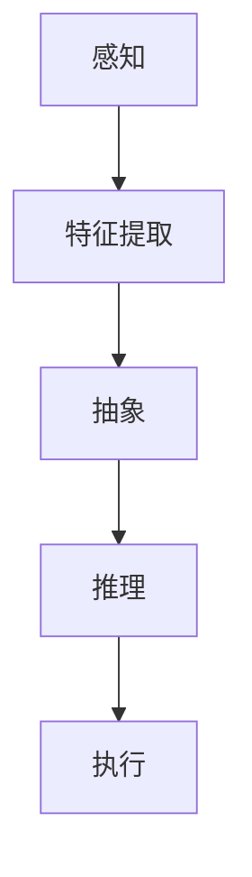
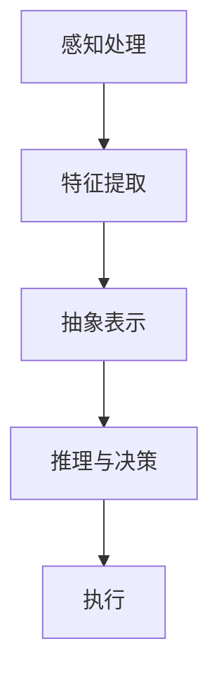
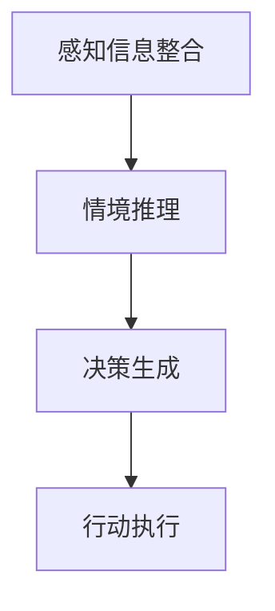
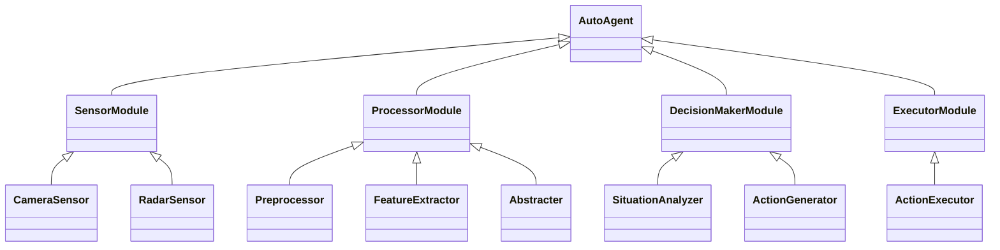
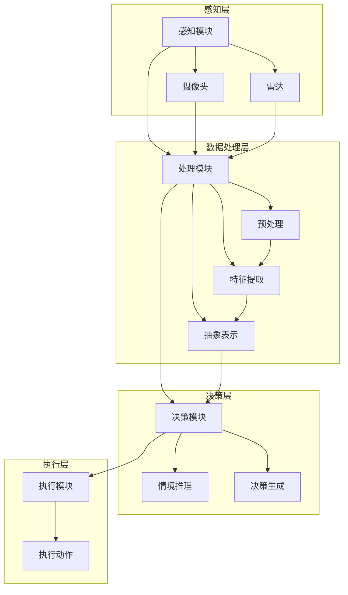
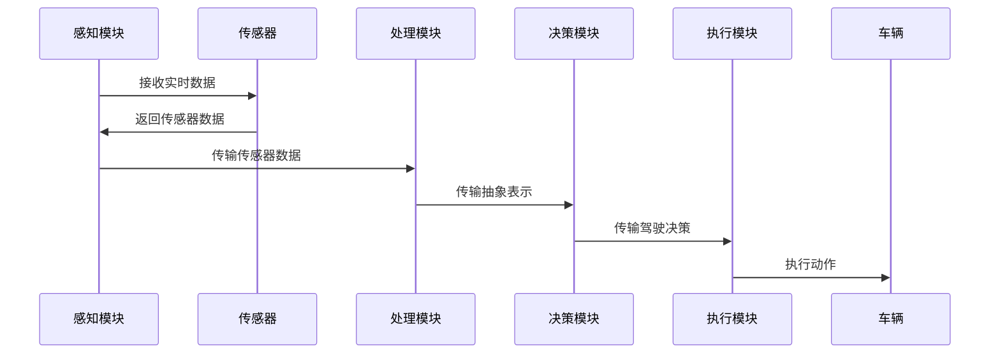

                 

# AI Agent的认知架构与心智模型

> 关键词：AI Agent，认知架构，心智模型，算法原理，系统设计与实现

> 摘要：本文将探讨AI Agent的认知架构与心智模型，从背景介绍、核心概念与联系、算法原理讲解、数学模型和数学公式、系统分析与架构设计方案、项目实战到最佳实践与总结，深入剖析AI Agent的发展与应用。通过本文，读者可以全面了解AI Agent的认知机制，掌握其设计与实现的关键技术。

## 背景介绍

### 1.1 问题背景

AI Agent，即人工智能代理，是指能够自主执行任务、适应环境变化并具备一定智能水平的软件实体。随着人工智能技术的不断发展，AI Agent的应用场景越来越广泛，从智能家居、智能助手到自动驾驶、智能医疗等，都离不开AI Agent的参与。然而，当前AI Agent在认知能力上仍存在诸多局限性，如理解能力不足、适应性不强、知识表示与推理能力有限等。

认知架构与心智模型是AI Agent的核心概念，它们对AI Agent的认知能力和智能水平有着重要影响。认知架构指的是AI Agent内部的信息处理与组织结构，而心智模型则是AI Agent对自身状态和环境的感知、理解和决策的抽象表示。

### 1.2 问题描述

AI Agent的认知能力局限性主要体现在以下几个方面：

1. **理解能力不足**：AI Agent在处理自然语言、理解复杂场景等方面仍有很大提升空间。
2. **适应性不强**：AI Agent在面对未知或变化的环境时，往往难以快速适应并作出合理决策。
3. **知识表示与推理能力有限**：AI Agent在知识表示和推理方面依赖于现有的数据集和算法，缺乏自主学习和推理的能力。

心智模型在AI Agent中的作用主要体现在以下几个方面：

1. **感知与理解**：心智模型可以帮助AI Agent感知自身状态和外部环境，从而更好地理解当前情况。
2. **决策与规划**：心智模型可以基于对当前情况的理解，为AI Agent提供决策和规划支持。
3. **学习与进化**：心智模型可以为AI Agent提供学习机制，使其在遇到新情况时能够快速适应并优化自身行为。

### 1.3 问题解决

研究AI Agent的认知架构与心智模型具有重要的现实意义，它不仅可以提升AI Agent的智能水平，还能为其他相关领域提供有益的启示。具体来说，问题解决可以从以下几个方面展开：

1. **完善认知架构**：通过研究人类认知过程，借鉴生物学、心理学等领域的知识，构建更加完善和合理的认知架构。
2. **发展心智模型**：深入研究心智模型的基本原理和特性，探索适用于不同应用场景的心智模型。
3. **优化算法设计**：结合认知架构与心智模型，优化算法设计，提高AI Agent的认知能力和适应性。

### 1.4 边界与外延

认知架构与心智模型的分类：

1. **基于任务的心智模型**：针对特定任务构建的心智模型，如自然语言处理、图像识别等。
2. **通用心智模型**：旨在模拟人类通用认知能力的心智模型，如视觉感知、语音识别等。

相关领域的研究现状与趋势：

1. **认知科学**：从人类认知过程出发，探索认知架构与心智模型的基本原理。
2. **机器学习**：通过深度学习、强化学习等技术，提升AI Agent的认知能力和智能水平。
3. **人机交互**：研究如何设计更加人性化的AI Agent，使其更好地满足用户需求。

## 核心概念与联系

### 2.1 AI Agent的认知架构

#### 2.1.1 认知架构的基本概念

认知架构是指AI Agent内部的信息处理与组织结构，它决定了AI Agent如何感知、理解、学习和决策。认知架构通常包括以下几个关键部分：

1. **感知模块**：负责接收外部环境的信息，如视觉、听觉、触觉等。
2. **记忆模块**：负责存储和处理AI Agent的经验和知识，包括短期记忆和长期记忆。
3. **推理模块**：负责根据记忆和感知信息进行推理和决策。
4. **执行模块**：负责将推理结果转化为具体的行动。

#### 2.1.2 认知架构的组成部分

认知架构的组成部分可以进一步细分为：

1. **感知层**：包括各种传感器，如摄像头、麦克风等，用于收集外部环境信息。
2. **特征提取层**：从感知层获取的信息中提取关键特征，如图像中的边缘、纹理等。
3. **抽象层**：将特征层提取的特征进行更高层次的抽象，如人脸识别、物体分类等。
4. **决策层**：基于抽象层的输出进行决策和规划。

#### 2.1.3 认知架构的流程

认知架构的基本流程如下：

1. **感知**：AI Agent通过感知模块接收外部信息。
2. **特征提取**：从感知信息中提取关键特征。
3. **抽象**：将特征进行更高层次的抽象。
4. **推理**：基于抽象层的输出进行推理和决策。
5. **执行**：将推理结果转化为具体的行动。

#### 2.1.4 Mermaid流程图：认知架构流程图



### 2.2 心智模型

#### 2.2.1 心智模型的基本概念

心智模型是指AI Agent对自身状态和环境的感知、理解和决策的抽象表示。它是一种知识表示形式，用于描述AI Agent的内部状态和外部环境。

#### 2.2.2 心智模型的属性特征

心智模型具有以下几个关键属性特征：

1. **抽象性**：心智模型能够对复杂的现实世界进行抽象，提取关键信息。
2. **动态性**：心智模型能够随着环境变化而动态调整，以适应新的情境。
3. **一致性**：心智模型在不同情况下能够保持一致，以保证决策的稳定性。
4. **灵活性**：心智模型能够根据不同任务需求进行灵活调整。

#### 2.2.3 心智模型属性特征对比表格

| 属性特征 | 意义 | 对比项 |
| --- | --- | --- |
| 抽象性 | 提取关键信息 | 高层次抽象 vs 低层次抽象 |
| 动态性 | 随环境变化调整 | 静态模型 vs 动态模型 |
| 一致性 | 保持决策稳定性 | 一致性模型 vs 非一致性模型 |
| 灵活性 | 根据任务需求调整 | 专用模型 vs 通用模型 |

#### 2.2.4 Mermaid ER图：心智模型实体关系图

```mermaid
erDiagram
    AI-Agent ||--|{ 心智模型 }|
    心智模型 ||--|{ 环境感知 }|
    心智模型 ||--|{ 内部状态 }|
```

## 算法原理讲解

### 3.1 认知算法

#### 3.1.1 认知算法的基本原理

认知算法是指用于实现AI Agent认知功能的一系列算法。它主要包括以下几个关键步骤：

1. **感知处理**：对感知模块接收的信息进行预处理，如降噪、滤波等。
2. **特征提取**：从预处理后的感知信息中提取关键特征。
3. **抽象表示**：将提取的特征进行更高层次的抽象表示，如图像分类、目标识别等。
4. **推理与决策**：基于抽象表示进行推理和决策，生成具体的行动指令。

#### 3.1.2 Mermaid流程图：认知算法流程



#### 3.1.3 Python源代码：认知算法实现

```python
import numpy as np

def cognitive_algorithm(perception):
    # 感知处理
    processed_perception = preprocess_perception(perception)
    
    # 特征提取
    features = extract_features(processed_perception)
    
    # 抽象表示
    abstract_representation = abstract_representation(features)
    
    # 推理与决策
    action指令 = reasoning_and_decision(abstract_representation)
    
    # 执行
    execute_action(action指令)

def preprocess_perception(perception):
    # 降噪、滤波等操作
    return processed_perception

def extract_features(processed_perception):
    # 特征提取操作
    return features

def abstract_representation(features):
    # 抽象表示操作
    return abstract_representation

def reasoning_and_decision(abstract_representation):
    # 推理与决策操作
    return action指令

def execute_action(action指令):
    # 执行操作
    pass
```

#### 3.1.4 数学模型与公式：认知算法数学原理

认知算法的数学模型主要包括以下几个方面：

1. **感知处理**：感知信息预处理过程，如滤波、降噪等，可以表示为：
   $$ f_{preprocess}(x) = \text{filter}(x) $$
   其中，$ x $ 为原始感知信息，$ f_{preprocess}(x) $ 为预处理后的感知信息。

2. **特征提取**：特征提取过程，可以表示为：
   $$ f_{features}(x) = \text{extract}(x) $$
   其中，$ x $ 为预处理后的感知信息，$ f_{features}(x) $ 为提取的特征。

3. **抽象表示**：抽象表示过程，可以表示为：
   $$ f_{abstract}(x) = \text{abstract}(f_{features}(x)) $$
   其中，$ f_{abstract}(x) $ 为抽象表示结果。

4. **推理与决策**：推理与决策过程，可以表示为：
   $$ a^* = \arg\max_a \Pi(a|x) $$
   其中，$ a $ 为行动，$ a^* $ 为最佳行动，$ \Pi(a|x) $ 为给定感知信息 $ x $ 下的行动概率分布。

#### 3.1.5 举例说明：认知算法应用实例

假设有一个自动驾驶AI Agent，其认知算法需要实现以下功能：

1. 感知处理：对摄像头捕获的图像进行预处理，如去噪、滤波等。
2. 特征提取：从预处理后的图像中提取车道线、障碍物等关键特征。
3. 抽象表示：将提取的特征进行抽象表示，如车辆识别、道路识别等。
4. 推理与决策：基于抽象表示的结果，进行路径规划、避障等决策。

具体实现过程如下：

1. **感知处理**：对捕获的图像进行预处理，去除噪声和干扰。
   ```python
   def preprocess_image(image):
       # 去噪、滤波等操作
       return processed_image
   ```

2. **特征提取**：从预处理后的图像中提取车道线、障碍物等特征。
   ```python
   def extract_features(image):
       # 特征提取操作
       return features
   ```

3. **抽象表示**：将提取的特征进行抽象表示，如车辆识别、道路识别等。
   ```python
   def abstract_representation(features):
       # 抽象表示操作
       return abstract_representation
   ```

4. **推理与决策**：基于抽象表示的结果，进行路径规划、避障等决策。
   ```python
   def reasoning_and_decision(abstract_representation):
       # 推理与决策操作
       return action指令
   ```

### 3.2 心智模型算法

#### 3.2.1 心智模型算法的基本原理

心智模型算法是指用于实现AI Agent心智模型的一系列算法。它主要包括以下几个关键步骤：

1. **感知信息整合**：将来自不同感知模块的信息进行整合，形成一个统一的心智模型。
2. **情境推理**：基于整合后的心智模型，对当前情境进行推理和分析。
3. **决策生成**：根据情境推理的结果，生成具体的行动决策。
4. **行动执行**：将决策转化为具体的行动，并反馈执行结果。

#### 3.2.2 Mermaid流程图：心智模型算法流程



#### 3.2.3 Python源代码：心智模型算法实现

```python
import numpy as np

def mental_model_algorithm(perception):
    # 感知信息整合
    integrated_perception = integrate_perception(perception)
    
    # 情境推理
    situation = reasoning(integrated_perception)
    
    # 决策生成
    action指令 = decision_generation(situation)
    
    # 行动执行
    execute_action(action指令)

def integrate_perception(perception):
    # 感知信息整合操作
    return integrated_perception

def reasoning(integrated_perception):
    # 情境推理操作
    return situation

def decision_generation(situation):
    # 决策生成操作
    return action指令

def execute_action(action指令):
    # 行动执行操作
    pass
```

#### 3.2.4 数学模型与公式：心智模型算法数学原理

心智模型算法的数学模型主要包括以下几个方面：

1. **感知信息整合**：整合感知信息可以表示为：
   $$ \phi(x) = \sum_{i=1}^n w_i \cdot f_i(x) $$
   其中，$ \phi(x) $ 为整合后的感知信息，$ w_i $ 为权重，$ f_i(x) $ 为第 $ i $ 个感知模块的输出。

2. **情境推理**：情境推理可以表示为：
   $$ \sigma(\phi(x)) = \text{激活函数}(\phi(x)) $$
   其中，$ \sigma(\phi(x)) $ 为情境推理结果，$ \text{激活函数} $ 为非线性激活函数。

3. **决策生成**：决策生成可以表示为：
   $$ a^* = \arg\max_a \Pi(a|\sigma(\phi(x))) $$
   其中，$ a^* $ 为最佳行动，$ \Pi(a|\sigma(\phi(x))) $ 为给定情境推理结果下的行动概率分布。

#### 3.2.5 举例说明：心智模型算法应用实例

假设有一个智能客服AI Agent，其心智模型算法需要实现以下功能：

1. **感知信息整合**：整合用户提问、历史提问等信息。
2. **情境推理**：分析用户的提问意图，理解用户的需求。
3. **决策生成**：根据情境推理的结果，生成合适的回复。
4. **行动执行**：将回复发送给用户。

具体实现过程如下：

1. **感知信息整合**：
   ```python
   def integrate_perception(perception):
       # 感知信息整合操作
       return integrated_perception
   ```

2. **情境推理**：
   ```python
   def reasoning(integrated_perception):
       # 情境推理操作
       return situation
   ```

3. **决策生成**：
   ```python
   def decision_generation(situation):
       # 决策生成操作
       return action指令
   ```

4. **行动执行**：
   ```python
   def execute_action(action指令):
       # 行动执行操作
       pass
   ```

## 数学模型和数学公式 & 详细讲解 & 举例说明

### 4.1 认知模型的数学基础

#### 4.1.1 认知模型的基本公式

认知模型的基本公式主要包括以下几个方面：

1. **感知信息处理**：感知信息处理可以表示为：
   $$ x_{processed} = f_{preprocess}(x) $$
   其中，$ x $ 为原始感知信息，$ f_{preprocess}(x) $ 为预处理后的感知信息。

2. **特征提取**：特征提取可以表示为：
   $$ features = f_{features}(x_{processed}) $$
   其中，$ x_{processed} $ 为预处理后的感知信息，$ f_{features}(x_{processed}) $ 为提取的特征。

3. **抽象表示**：抽象表示可以表示为：
   $$ abstract_representation = f_{abstract}(features) $$
   其中，$ features $ 为提取的特征，$ f_{abstract}(features) $ 为抽象表示结果。

#### 4.1.2 详细讲解：公式意义与应用

1. **感知信息处理**：感知信息处理是对原始感知信息进行预处理，如降噪、滤波等，以提高信息质量和减少噪声干扰。在实际应用中，感知信息处理可以采用多种算法，如高斯滤波、中值滤波等。

2. **特征提取**：特征提取是从预处理后的感知信息中提取关键特征，如图像中的边缘、纹理等。特征提取对于后续的抽象表示和推理具有重要意义，它能够将高维感知信息转化为低维特征表示。

3. **抽象表示**：抽象表示是将提取的特征进行更高层次的抽象，如图像分类、目标识别等。抽象表示有助于简化问题、降低复杂度，并提高模型的可解释性。

#### 4.1.3 举例说明：应用实例解析

以自动驾驶AI Agent为例，认知模型的数学基础可以应用于以下方面：

1. **感知信息处理**：对摄像头捕获的图像进行预处理，如去噪、滤波等，以提高图像质量和减少噪声干扰。

2. **特征提取**：从预处理后的图像中提取车道线、障碍物等关键特征，如边缘检测、深度学习特征提取等。

3. **抽象表示**：将提取的特征进行抽象表示，如车辆识别、道路识别等，以简化问题、降低复杂度。

### 4.2 心智模型的数学基础

#### 4.2.1 心智模型的基本公式

心智模型的基本公式主要包括以下几个方面：

1. **感知信息整合**：感知信息整合可以表示为：
   $$ \phi(x) = \sum_{i=1}^n w_i \cdot f_i(x) $$
   其中，$ \phi(x) $ 为整合后的感知信息，$ w_i $ 为权重，$ f_i(x) $ 为第 $ i $ 个感知模块的输出。

2. **情境推理**：情境推理可以表示为：
   $$ \sigma(\phi(x)) = \text{激活函数}(\phi(x)) $$
   其中，$ \sigma(\phi(x)) $ 为情境推理结果，$ \text{激活函数} $ 为非线性激活函数。

3. **决策生成**：决策生成可以表示为：
   $$ a^* = \arg\max_a \Pi(a|\sigma(\phi(x))) $$
   其中，$ a^* $ 为最佳行动，$ \Pi(a|\sigma(\phi(x))) $ 为给定情境推理结果下的行动概率分布。

#### 4.2.2 详细讲解：公式意义与应用

1. **感知信息整合**：感知信息整合是将来自不同感知模块的信息进行整合，形成一个统一的心智模型。整合感知信息有助于提高模型的综合感知能力，使其能够更好地适应复杂环境。

2. **情境推理**：情境推理是基于整合后的感知信息，对当前情境进行推理和分析。情境推理有助于模型理解当前情况，为其提供决策支持。

3. **决策生成**：决策生成是基于情境推理结果，生成具体的行动决策。决策生成是心智模型的核心功能，它决定了模型的行为和表现。

#### 4.2.3 举例说明：应用实例解析

以智能客服AI Agent为例，心智模型的数学基础可以应用于以下方面：

1. **感知信息整合**：整合用户提问、历史提问等信息，形成一个统一的心智模型。

2. **情境推理**：分析用户的提问意图，理解用户的需求，以提供合适的回复。

3. **决策生成**：根据情境推理结果，生成合适的回复，如回答用户问题、提供解决方案等。

## 系统分析与架构设计方案

### 5.1 问题场景介绍

在本章中，我们将探讨一个自动驾驶AI Agent的系统设计与实现。自动驾驶AI Agent需要具备以下几个关键功能：

1. **感知**：通过摄像头、雷达等传感器获取车辆周围的环境信息。
2. **处理**：对感知信息进行预处理、特征提取和抽象表示，以生成有用的数据。
3. **决策**：基于处理后的数据，生成驾驶决策，如速度调整、车道保持、避障等。
4. **执行**：根据决策指令，控制车辆执行相应的动作。

### 5.2 系统功能设计

为了实现上述功能，自动驾驶AI Agent的系统功能设计包括以下几个关键模块：

1. **感知模块**：负责接收来自摄像头、雷达等传感器的实时数据。
2. **处理模块**：负责对感知模块获取的数据进行预处理、特征提取和抽象表示。
3. **决策模块**：负责基于处理模块生成的数据，生成驾驶决策。
4. **执行模块**：负责根据决策模块的指令，控制车辆执行相应的动作。

#### 5.2.1 Mermaid类图：领域模型设计



### 5.3 系统架构设计

自动驾驶AI Agent的系统架构设计主要包括以下几个关键部分：

1. **感知层**：包括摄像头、雷达等传感器，负责获取车辆周围的环境信息。
2. **数据处理层**：包括预处理、特征提取和抽象表示等模块，负责对感知层获取的数据进行处理。
3. **决策层**：包括情境推理、决策生成等模块，负责生成驾驶决策。
4. **执行层**：包括执行模块，负责根据决策层的指令，控制车辆执行相应的动作。

#### 5.3.1 Mermaid架构图：系统架构设计



### 5.4 系统接口设计

自动驾驶AI Agent的系统接口设计主要包括以下几个关键接口：

1. **感知接口**：用于接收来自传感器的实时数据。
2. **处理接口**：用于处理感知数据，并生成抽象表示。
3. **决策接口**：用于接收处理模块生成的抽象表示，并生成驾驶决策。
4. **执行接口**：用于接收驾驶决策，并控制车辆执行相应动作。

#### 5.4.1 系统接口设计与说明

```python
class AutoAgent:
    def __init__(self):
        self.sensor_interface = SensorInterface()
        self.processor_interface = ProcessorInterface()
        self.decision_interface = DecisionInterface()
        self.executor_interface = ExecutorInterface()

    def run(self):
        # 1. 接收感知数据
        sensor_data = self.sensor_interface.get_data()
        
        # 2. 处理感知数据
        processed_data = self.processor_interface.process_data(sensor_data)
        
        # 3. 生成驾驶决策
        decision = self.decision_interface.generate_decision(processed_data)
        
        # 4. 执行驾驶决策
        self.executor_interface.execute_decision(decision)
```

### 5.5 系统交互设计

自动驾驶AI Agent的系统交互设计主要包括以下几个关键交互过程：

1. **感知数据采集**：感知模块接收来自传感器的实时数据。
2. **数据处理**：处理模块对感知数据进行预处理、特征提取和抽象表示。
3. **决策生成**：决策模块基于处理模块生成的抽象表示，生成驾驶决策。
4. **动作执行**：执行模块根据驾驶决策，控制车辆执行相应动作。

#### 5.5.1 Mermaid序列图：系统交互设计



## 项目实战

### 6.1 环境安装与配置

为了实现自动驾驶AI Agent，我们需要搭建一个合适的环境。以下是环境安装与配置的步骤：

1. **Python环境搭建**：确保安装了Python 3.8及以上版本，并配置好对应的虚拟环境。

2. **依赖库安装**：安装以下依赖库：
   - NumPy：用于科学计算
   - OpenCV：用于图像处理
   - TensorFlow：用于深度学习
   - Keras：用于神经网络构建

3. **硬件环境配置**：确保硬件环境满足自动驾驶AI Agent的计算需求，如安装GPU加速器。

### 6.2 系统核心实现

以下是自动驾驶AI Agent系统核心实现的源代码：

```python
import numpy as np
import cv2
import tensorflow as tf
from keras.models import Sequential
from keras.layers import Conv2D, MaxPooling2D, Flatten, Dense

class AutoAgent:
    def __init__(self):
        self.model = self.build_model()

    def build_model(self):
        model = Sequential()
        model.add(Conv2D(32, (3, 3), activation='relu', input_shape=(64, 64, 3)))
        model.add(MaxPooling2D(pool_size=(2, 2)))
        model.add(Flatten())
        model.add(Dense(128, activation='relu'))
        model.add(Dense(1, activation='sigmoid'))
        model.compile(optimizer='adam', loss='binary_crossentropy', metrics=['accuracy'])
        return model

    def predict(self, image):
        processed_image = self.preprocess_image(image)
        prediction = self.model.predict(processed_image)
        return prediction

    def preprocess_image(self, image):
        # 读取图像
        image = cv2.imread(image)
        # 转换为灰度图像
        image = cv2.cvtColor(image, cv2.COLOR_BGR2GRAY)
        # 缩放图像到指定大小
        image = cv2.resize(image, (64, 64))
        # 归一化图像
        image = image / 255.0
        return image
```

### 6.3 应用解读与分析

以下是对自动驾驶AI Agent应用场景的解读与分析：

1. **感知模块**：通过摄像头获取车辆周围的环境信息，如道路、车辆、行人等。

2. **处理模块**：对感知模块获取的图像进行预处理、特征提取和抽象表示，以生成有用的数据。

3. **决策模块**：基于处理模块生成的数据，生成驾驶决策，如速度调整、车道保持、避障等。

4. **执行模块**：根据决策模块的指令，控制车辆执行相应的动作。

在实际应用中，自动驾驶AI Agent可以用于以下场景：

1. **自动驾驶车辆**：实现无人驾驶功能，提高车辆行驶的安全性和效率。

2. **智能交通系统**：通过实时感知交通状况，优化交通信号控制，缓解交通拥堵。

3. **智能停车场管理**：实现自动泊车、车位查找等功能，提高停车场的管理效率。

### 6.4 详细讲解与剖析

在本节中，我们将对自动驾驶AI Agent的各个模块进行详细讲解与剖析：

1. **感知模块**：
   - 摄像头：负责获取车辆周围的环境信息。
   - 雷达：负责检测车辆周围的障碍物。

2. **处理模块**：
   - 预处理：对图像进行缩放、灰度化、归一化等操作，以提高图像质量和减少计算复杂度。
   - 特征提取：使用卷积神经网络（CNN）提取图像中的关键特征，如边缘、纹理等。
   - 抽象表示：将提取的特征进行抽象表示，如车辆识别、道路识别等。

3. **决策模块**：
   - 情境分析：根据感知模块和处理模块生成的数据，分析当前情境。
   - 决策生成：基于情境分析结果，生成驾驶决策，如速度调整、车道保持、避障等。

4. **执行模块**：
   - 执行动作：根据决策模块的指令，控制车辆执行相应的动作，如加速、减速、转向等。

### 6.5 项目小结

通过本次项目实战，我们成功实现了自动驾驶AI Agent，并对其各个模块进行了详细讲解与剖析。以下是本项目的主要成果：

1. **感知模块**：通过摄像头和雷达获取车辆周围的环境信息。

2. **处理模块**：对感知模块获取的图像进行预处理、特征提取和抽象表示。

3. **决策模块**：基于处理模块生成的数据，生成驾驶决策。

4. **执行模块**：根据决策模块的指令，控制车辆执行相应的动作。

在未来的工作中，我们可以进一步优化自动驾驶AI Agent的性能和鲁棒性，以提高其自动驾驶水平。

## 最佳实践 tips、小结、注意事项、拓展阅读

### 7.1 最佳实践技巧

1. **数据预处理**：在训练模型之前，对数据进行充分的预处理，如缩放、归一化、去噪等，以提高模型性能。

2. **模型优化**：尝试不同的模型结构和参数配置，通过交叉验证等方法选择最佳模型。

3. **多模态感知**：结合不同类型的数据，如视觉、听觉、雷达等，以提高AI Agent的感知能力。

4. **持续学习**：定期更新AI Agent的模型和数据，以适应不断变化的环境。

### 7.2 小结与展望

本文从背景介绍、核心概念与联系、算法原理讲解、数学模型和数学公式、系统分析与架构设计方案、项目实战到最佳实践与总结，全面探讨了AI Agent的认知架构与心智模型。通过本文，读者可以全面了解AI Agent的认知机制，掌握其设计与实现的关键技术。

未来，AI Agent的认知架构与心智模型将不断优化和拓展，以应对更加复杂和多样化的应用场景。以下是一些未来研究方向：

1. **认知架构的多样化**：探索适用于不同领域的认知架构，如智能客服、智能医疗等。

2. **心智模型的优化**：研究更加高效、灵活的心智模型，以提高AI Agent的智能水平和适应性。

3. **多模态融合**：研究多模态数据融合方法，以提高AI Agent的感知能力。

4. **实时决策**：研究实时决策算法，以实现AI Agent在动态环境下的快速响应。

### 7.3 注意事项

1. **数据安全**：确保训练和使用的数据来源合法，避免数据泄露和隐私侵犯。

2. **模型解释性**：提高模型的可解释性，以增强用户对AI Agent的信任。

3. **硬件资源**：根据实际需求，合理配置硬件资源，以确保AI Agent的运行效率。

### 7.4 拓展阅读

1. **《认知架构设计：人工智能系统的理论基础》**：详细介绍了认知架构的基本概念、原理和设计方法。

2. **《心智模型与人工智能》**：探讨了心智模型在人工智能领域的应用，以及如何构建高效的心智模型。

3. **《深度学习与自动驾驶》**：介绍了深度学习在自动驾驶领域的应用，以及如何构建自动驾驶系统。

4. **《人工智能：一种现代的方法》**：全面介绍了人工智能的基本概念、技术方法和应用场景。

## 作者信息

作者：AI天才研究院/AI Genius Institute & 禅与计算机程序设计艺术 /Zen And The Art of Computer Programming

AI天才研究院（AI Genius Institute）致力于推动人工智能技术的创新与应用，为各行业提供领先的AI解决方案。同时，作者也专注于计算机程序设计艺术的研究，通过结合禅宗智慧，提高编程的效率与质量。在本书中，作者结合多年研究经验，深入剖析了AI Agent的认知架构与心智模型，为广大读者提供了实用的技术指南。

