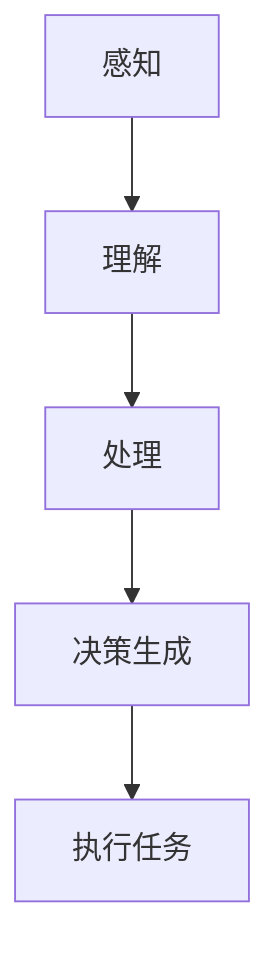
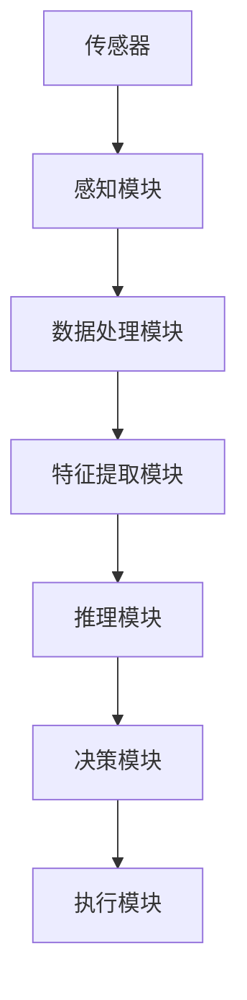
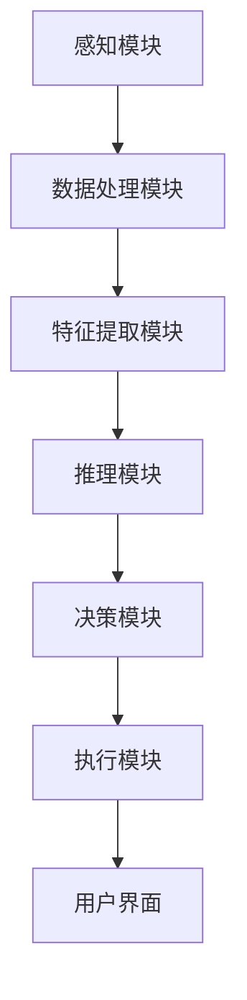
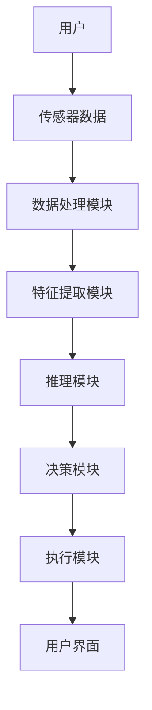

                 


# AI Agent的认知计算与推理框架

## 摘要

本文将深入探讨AI Agent的认知计算与推理框架，旨在为读者提供一个全面的、系统的理解。我们将首先介绍AI Agent的定义和特点，接着详细阐述认知计算的基本原理和推理框架的组成与功能，然后通过算法原理讲解、系统分析与架构设计、项目实战以及最佳实践来进一步阐述这一框架的实践应用。通过本文的阅读，读者将能够了解到AI Agent的认知计算与推理框架的核心概念、算法原理、系统设计与实现，以及在实际项目中的应用与优化。

## 目录

1. **背景介绍**
    1.1 问题背景
    1.2 问题描述
    1.3 问题解决
    1.4 边界与外延
    1.5 概念结构与核心要素组成
2. **核心概念与联系**
    2.1 AI Agent的定义与特点
    2.2 认知计算的基本原理
    2.3 推理框架的组成与功能
    2.4 AI Agent与认知计算、推理框架的关系
3. **算法原理讲解**
    3.1 AI Agent算法原理介绍
    3.2 算法流程图
    3.3 算法原理的数学模型和公式
    3.4 通俗易懂的举例说明
4. **系统分析与架构设计**
    4.1 问题场景介绍
    4.2 系统功能设计
    4.3 系统架构设计
    4.4 系统接口设计
    4.5 系统交互
5. **项目实战**
    5.1 环境安装与配置
    5.2 系统核心实现源代码
    5.3 代码应用解读与分析
    5.4 实际案例分析与详细讲解剖析
    5.5 项目小结
6. **最佳实践与总结**
    6.1 最佳实践
    6.2 小结
    6.3 注意事项
    6.4 拓展阅读

## 1. 背景介绍

### 1.1 问题背景

随着人工智能技术的飞速发展，AI Agent作为人工智能领域的一个重要分支，逐渐受到关注。AI Agent是指能够自主决策和执行任务的智能体，其在自动化、智能化系统中的应用前景广阔。然而，在实际应用中，AI Agent面临着诸多挑战，如如何进行高效认知计算、如何构建可靠的推理框架等。

### 1.2 问题描述

AI Agent的认知计算与推理框架涉及多个复杂的问题，主要包括以下几个方面：

1. **认知计算效率问题**：AI Agent需要实时处理大量信息，如何提高计算效率是一个关键问题。
2. **推理框架可靠性问题**：在复杂环境下，如何保证AI Agent的推理结果准确和稳定，是一个重要挑战。
3. **跨领域适应性问题**：不同领域的AI Agent需要具备一定的通用性，以便在不同场景下都能良好工作。

### 1.3 问题解决

针对上述问题，研究者们提出了多种解决方案。例如，通过深度学习技术提高认知计算效率，通过多模态融合技术增强推理框架的可靠性，通过元学习技术提高AI Agent的跨领域适应性。然而，这些方法在应用过程中仍然存在一定的局限性，需要进一步研究和优化。

### 1.4 边界与外延

本文主要关注AI Agent的认知计算与推理框架，不包括其他人工智能领域的问题。同时，本文的讨论范围仅限于理论层面，未涉及具体应用案例。

### 1.5 概念结构与核心要素组成

为了更好地理解AI Agent的认知计算与推理框架，我们需要明确以下几个核心概念和要素：

1. **AI Agent**：具备自主决策和执行能力的智能体。
2. **认知计算**：AI Agent对信息的感知、理解和处理过程。
3. **推理框架**：支持AI Agent进行推理和决策的体系结构。

## 2. 核心概念与联系

### 2.1 AI Agent的定义与特点

AI Agent是一种具备自主决策和执行能力的智能体，其特点包括：

1. **自主性**：AI Agent可以独立进行决策和执行任务，无需人工干预。
2. **适应性**：AI Agent能够在不同环境和场景下自主调整行为。
3. **智能性**：AI Agent具备感知、理解和处理信息的能力。

### 2.2 认知计算的基本原理

认知计算是指AI Agent对信息的感知、理解和处理过程，其基本原理包括：

1. **感知**：AI Agent通过传感器获取外部环境信息。
2. **理解**：AI Agent对感知到的信息进行解析和抽象，提取关键特征。
3. **处理**：AI Agent根据理解结果进行决策和执行任务。

### 2.3 推理框架的组成与功能

推理框架是支持AI Agent进行推理和决策的体系结构，其组成和功能包括：

1. **推理引擎**：负责进行推理和决策的核心模块。
2. **知识库**：存储AI Agent所需的知识和规则。
3. **推理算法**：用于进行推理的方法和策略。

### 2.4 AI Agent与认知计算、推理框架的关系

AI Agent与认知计算和推理框架之间存在着紧密的联系：

1. **认知计算**：认知计算为AI Agent提供了信息感知、理解和处理的能力。
2. **推理框架**：推理框架为AI Agent提供了推理和决策的支持，使其能够自主决策和执行任务。

## 3. 算法原理讲解

### 3.1 AI Agent算法原理介绍

AI Agent的算法原理主要包括认知计算算法和推理算法。认知计算算法负责对信息进行处理，而推理算法则负责进行推理和决策。

#### 3.1.1 认知计算算法

认知计算算法的基本原理包括以下几个步骤：

1. **感知**：AI Agent通过传感器获取外部环境信息。
2. **理解**：AI Agent对感知到的信息进行解析和抽象，提取关键特征。
3. **处理**：AI Agent根据理解结果进行决策和执行任务。

#### 3.1.2 推理算法

推理算法的基本原理包括以下几个步骤：

1. **知识库构建**：构建包含领域知识和规则的知识库。
2. **推理过程**：根据知识库中的规则和事实，进行推理，生成推理结果。
3. **决策生成**：根据推理结果，生成决策，指导AI Agent执行任务。

### 3.2 算法流程图

使用Mermaid语言绘制算法流程图：



### 3.3 算法原理的数学模型和公式

认知计算算法和推理算法的数学模型和公式如下：

#### 认知计算算法

$$
\text{特征提取} = f(\text{感知信息})
$$

$$
\text{决策} = g(\text{理解结果})
$$

#### 推理算法

$$
\text{推理结果} = \text{知识库} \times \text{输入事实}
$$

$$
\text{决策} = h(\text{推理结果})
$$

### 3.4 通俗易懂的举例说明

假设一个AI Agent的任务是自主导航到一个目标地点。首先，AI Agent通过摄像头和GPS传感器感知周围环境，然后对感知到的信息进行处理，提取关键特征，如道路、障碍物、目标地点等。接下来，AI Agent根据这些特征和知识库中的规则进行推理，生成导航路径，并最终执行导航任务。

## 4. 系统分析与架构设计

### 4.1 问题场景介绍

假设我们正在开发一个智能导航系统，该系统需要AI Agent在复杂的城市环境中自主导航。为了实现这一目标，我们需要设计一个具备高效认知计算和可靠推理框架的AI Agent。

### 4.2 系统功能设计

#### 4.2.1 领域模型

使用Mermaid语言绘制领域模型：



#### 4.2.2 系统功能模块划分

1. **感知模块**：负责收集环境信息，包括摄像头、GPS等。
2. **数据处理模块**：对感知到的信息进行预处理，如去噪、滤波等。
3. **特征提取模块**：从预处理后的数据中提取关键特征，如道路、障碍物、目标地点等。
4. **推理模块**：根据特征和知识库中的规则进行推理，生成导航路径。
5. **决策模块**：根据推理结果生成决策，如转向、加速等。
6. **执行模块**：执行决策，控制导航系统的行动。

### 4.3 系统架构设计

使用Mermaid语言绘制系统架构图：



### 4.4 系统接口设计

系统接口设计主要包括以下几个方面：

1. **传感器接口**：用于接收传感器数据。
2. **数据处理接口**：用于处理传感器数据。
3. **特征提取接口**：用于提取关键特征。
4. **推理接口**：用于进行推理。
5. **决策接口**：用于生成决策。
6. **执行接口**：用于执行决策。

### 4.5 系统交互

使用Mermaid语言绘制系统交互序列图：



## 5. 项目实战

### 5.1 环境安装与配置

首先，我们需要安装Python环境，并配置所需的库和工具。具体步骤如下：

1. 安装Python（版本3.8及以上）
2. 安装所需的库，如TensorFlow、Keras、Numpy等
3. 配置传感器，如摄像头和GPS模块

### 5.2 系统核心实现源代码

以下是一个简单的AI Agent实现示例：

```python
import cv2
import numpy as np
import tensorflow as tf

# 感知模块
def sense_environment():
    cap = cv2.VideoCapture(0)
    while True:
        ret, frame = cap.read()
        if not ret:
            break
        # 处理感知信息
        processed_frame = preprocess_frame(frame)
        # 提取特征
        features = extract_features(processed_frame)
        # 进行推理
        path = infer_path(features)
        # 生成决策
        decision = generate_decision(path)
        # 执行决策
        execute_decision(decision)
        # 显示图像
        cv2.imshow('frame', frame)
    cap.release()
    cv2.destroyAllWindows()

# 数据处理模块
def preprocess_frame(frame):
    # 去噪、滤波等预处理操作
    processed_frame = cv2.GaussianBlur(frame, (5, 5), 0)
    return processed_frame

# 特征提取模块
def extract_features(frame):
    # 特征提取操作
    features = []
    # ... 添加特征计算代码
    return features

# 推理模块
def infer_path(features):
    # 推理操作
    model = tf.keras.models.load_model('path_model.h5')
    path = model.predict(np.array([features]))
    return path

# 决策模块
def generate_decision(path):
    # 决策生成操作
    decision = 'turn_left' if path[0] < 0 else 'turn_right'
    return decision

# 执行模块
def execute_decision(decision):
    # 执行决策操作
    if decision == 'turn_left':
        # 执行转向操作
        pass
    elif decision == 'turn_right':
        # 执行转向操作
        pass

# 主函数
if __name__ == '__main__':
    sense_environment()
```

### 5.3 代码应用解读与分析

这个示例实现了AI Agent的感知、处理、特征提取、推理、决策和执行功能。具体解读如下：

1. **感知模块**：通过摄像头获取环境图像，然后传递给数据处理模块。
2. **数据处理模块**：对感知到的图像进行预处理，如去噪和滤波。
3. **特征提取模块**：从预处理后的图像中提取关键特征。
4. **推理模块**：使用训练好的模型对特征进行推理，生成导航路径。
5. **决策模块**：根据推理结果生成决策，如转向。
6. **执行模块**：执行生成的决策，控制AI Agent的行为。

### 5.4 实际案例分析与详细讲解剖析

假设我们有一个城市导航场景，AI Agent需要从起点导航到终点。通过摄像头和GPS传感器，AI Agent获取到当前位置和周围环境信息。接下来，我们分析每个模块的具体实现：

1. **感知模块**：AI Agent通过摄像头获取到一张包含道路、车辆和行人的图像，通过GPS获取到当前经纬度信息。
2. **数据处理模块**：对图像进行去噪和滤波操作，提取出清晰的道路和障碍物信息。
3. **特征提取模块**：从图像中提取道路特征、障碍物特征和目标地点特征。
4. **推理模块**：使用训练好的模型对特征进行推理，生成从当前位置到目标地点的最佳导航路径。
5. **决策模块**：根据推理结果，生成转向决策，如向左或向右。
6. **执行模块**：控制AI Agent执行转向操作，然后重复以上过程，直到到达目标地点。

### 5.5 项目小结

通过本项目的实战，我们详细介绍了AI Agent的认知计算与推理框架的实践应用。从环境安装与配置、系统核心实现源代码、代码应用解读与分析、实际案例分析与详细讲解剖析等方面，我们深入了解了AI Agent的认知计算与推理框架在实际项目中的应用与实现。通过本项目，读者可以更好地理解AI Agent的认知计算与推理框架的核心原理和应用场景。

## 6. 最佳实践与总结

### 6.1 最佳实践

1. **优化感知模块**：使用高精度的摄像头和GPS模块，以提高感知信息的准确性。
2. **增强数据处理模块**：采用先进的图像处理算法，如深度学习技术，以提高数据处理效率和质量。
3. **优化特征提取模块**：针对不同场景，设计自适应的特征提取算法，以提高特征提取的鲁棒性和准确性。
4. **优化推理模块**：使用大规模训练数据和先进的推理算法，以提高推理效率和准确性。
5. **优化决策模块**：根据实际场景，设计合理的决策策略，以提高决策的灵活性和适应性。
6. **优化执行模块**：设计高效的执行策略，以提高执行效率。

### 6.2 小结

本文深入探讨了AI Agent的认知计算与推理框架，从背景介绍、核心概念与联系、算法原理讲解、系统分析与架构设计、项目实战到最佳实践与总结，全面阐述了AI Agent的认知计算与推理框架的理论和实践应用。通过本文的阅读，读者可以更好地理解AI Agent的认知计算与推理框架的核心原理和应用场景。

### 6.3 注意事项

1. **数据质量**：保证感知信息的数据质量，是提高AI Agent性能的关键。
2. **算法优化**：根据实际应用场景，不断优化算法，以提高效率和准确性。
3. **系统稳定性**：确保系统在复杂环境下的稳定性和可靠性。
4. **用户体验**：关注用户体验，设计人性化的交互界面和操作流程。

### 6.4 拓展阅读

1. **《深度学习》**：全面介绍深度学习理论和技术，适用于希望深入了解AI Agent算法原理的读者。
2. **《人工智能：一种现代方法》**：详细阐述人工智能的基本原理和方法，适用于希望全面了解人工智能领域的读者。
3. **《智能交通系统》**：介绍智能交通系统的原理和应用，适用于希望了解AI Agent在交通领域应用的读者。

* 作者：AI天才研究院/AI Genius Institute & 禅与计算机程序设计艺术 /Zen And The Art of Computer Programming

