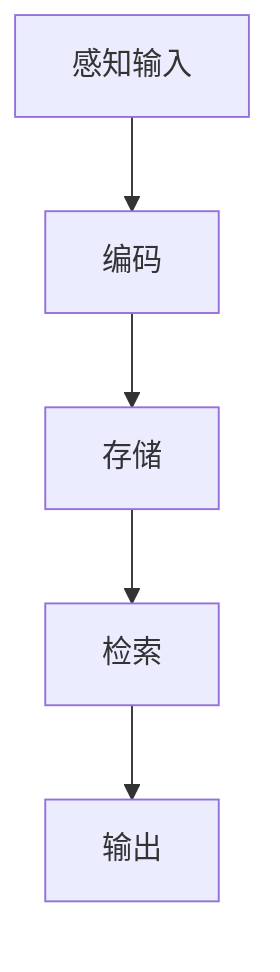
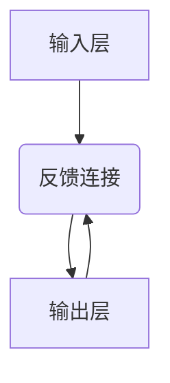
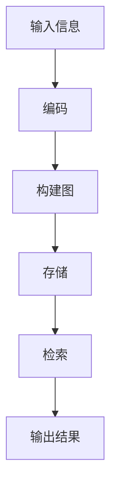
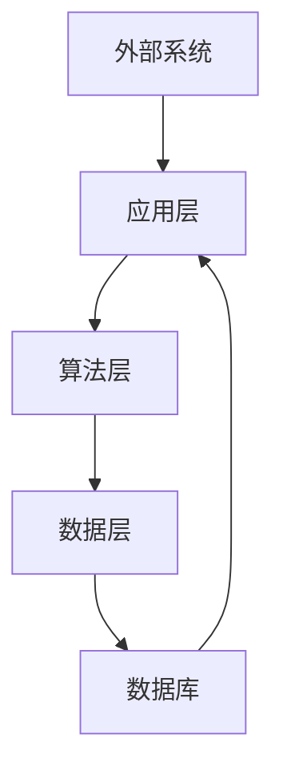

                 

# AI Agent的记忆机制：设计与实现

关键词：AI Agent、记忆机制、设计与实现、算法原理、性能优化

摘要：本文将深入探讨AI Agent的记忆机制，从核心概念、原理、设计与实现、性能优化、实际应用以及未来发展趋势等多个方面进行全面分析。文章旨在为读者提供一个系统性的理解和实践经验，帮助深入理解和掌握AI Agent记忆机制的设计与实现方法。

## 目录大纲设计思路

在设计《AI Agent的记忆机制：设计与实现》的目录大纲时，我们遵循了以下原则：

1. **逻辑清晰**：确保目录能够反映书中的内容结构，让读者能够迅速把握全书的脉络。
2. **内容全面**：覆盖书中的所有核心章节，确保没有遗漏重要内容。
3. **层次分明**：合理划分章节，使用明确的层级关系，方便读者查找和阅读。

具体设计步骤如下：

### 第一步：背景介绍

在开头部分，我们将设定整个书的背景，解释AI Agent的记忆机制的重要性及其应用场景。这将作为引言，为后续章节的内容打下基础。

- **章节标题**：第1章 AI Agent的记忆机制概述

  - **1.1 问题背景与定义**
  - **1.2 记忆机制在AI Agent中的重要性**
  - **1.3 AI Agent记忆机制的应用场景**

### 第二步：核心概念与原理

接下来，我们将详细介绍记忆机制的核心概念及其原理，包括相关的数学模型和算法。

- **章节标题**：第2章 AI Agent记忆机制的核心概念与原理

  - **2.1 记忆机制的定义与分类**
  - **2.2 数学模型与公式**
    - **2.2.1 海马体模型**
    - **2.2.2 反馈神经网络模型**
  - **2.3 算法原理与流程图**

### 第三步：设计与实现

在这一部分，我们将专注于AI Agent记忆机制的设计与实现，通过具体案例来说明。

- **章节标题**：第3章 AI Agent记忆机制的设计与实现

  - **3.1 设计原则与架构**
    - **3.1.1 系统功能设计**
    - **3.1.2 架构设计**
  - **3.2 实现流程**
    - **3.2.1 数据预处理**
    - **3.2.2 模型训练**
    - **3.2.3 模型评估**
  - **3.3 案例分析**
    - **3.3.1 案例一：智能客服系统**
    - **3.3.2 案例二：智能推荐系统**

### 第四步：性能优化与评估

我们将探讨记忆机制的性能优化方法和评估标准。

- **章节标题**：第4章 AI Agent记忆机制的性能优化与评估

  - **4.1 性能优化策略**
  - **4.2 评估指标与标准**
  - **4.3 性能评估案例**

### 第五步：实际应用场景

我们将分析记忆机制在不同实际应用场景中的表现。

- **章节标题**：第5章 AI Agent记忆机制的实际应用场景

  - **5.1 智能交通系统**
  - **5.2 智能医疗系统**
  - **5.3 智能教育系统**

### 第六步：未来发展趋势

最后，我们将讨论记忆机制在AI Agent领域的未来发展趋势。

- **章节标题**：第6章 AI Agent记忆机制的未来发展趋势

  - **6.1 技术发展趋势**
  - **6.2 应用前景**
  - **6.3 挑战与机遇**

### 总结

通过以上六个步骤，我们为《AI Agent的记忆机制：设计与实现》设计了一个完整的目录大纲。以下是具体的目录内容。

---

# 《AI Agent的记忆机制：设计与实现》目录大纲

## 第1章 AI Agent的记忆机制概述
### 1.1 问题背景与定义
#### 1.1.1 AI Agent的发展历程
#### 1.1.2 记忆机制的定义与作用
### 1.2 记忆机制在AI Agent中的重要性
#### 1.2.1 提高决策能力
#### 1.2.2 增强自适应能力
#### 1.2.3 提高学习能力
### 1.3 AI Agent记忆机制的应用场景
#### 1.3.1 智能交通
#### 1.3.2 智能医疗
#### 1.3.3 智能教育

## 第2章 AI Agent记忆机制的核心概念与原理
### 2.1 记忆机制的定义与分类
#### 2.1.1 临时记忆与长期记忆
#### 2.1.2 程序性记忆与陈述性记忆
### 2.2 数学模型与公式
#### 2.2.1 海马体模型
##### 2.2.1.1 模型概述
##### 2.2.1.2 模型公式
##### 2.2.1.3 Mermaid流程图
#### 2.2.2 反馈神经网络模型
##### 2.2.2.1 模型概述
##### 2.2.2.2 模型公式
##### 2.2.2.3 Mermaid流程图
### 2.3 算法原理与流程图
#### 2.3.1 算法基本原理
#### 2.3.2 算法流程图

## 第3章 AI Agent记忆机制的设计与实现
### 3.1 设计原则与架构
#### 3.1.1 系统功能设计
#### 3.1.2 架构设计
### 3.2 实现流程
#### 3.2.1 数据预处理
#### 3.2.2 模型训练
#### 3.2.3 模型评估
### 3.3 案例分析
#### 3.3.1 案例一：智能客服系统
#### 3.3.2 案例二：智能推荐系统

## 第4章 AI Agent记忆机制的性能优化与评估
### 4.1 性能优化策略
#### 4.1.1 算法优化
#### 4.1.2 数据优化
#### 4.1.3 硬件优化
### 4.2 评估指标与标准
#### 4.2.1 评估指标
#### 4.2.2 评估标准
### 4.3 性能评估案例
#### 4.3.1 案例一：智能客服系统
#### 4.3.2 案例二：智能推荐系统

## 第5章 AI Agent记忆机制的实际应用场景
### 5.1 智能交通系统
#### 5.1.1 应用场景
#### 5.1.2 实现方法
#### 5.1.3 案例分析
### 5.2 智能医疗系统
#### 5.2.1 应用场景
#### 5.2.2 实现方法
#### 5.2.3 案例分析
### 5.3 智能教育系统
#### 5.3.1 应用场景
#### 5.3.2 实现方法
#### 5.3.3 案例分析

## 第6章 AI Agent记忆机制的未来发展趋势
### 6.1 技术发展趋势
#### 6.1.1 新技术引入
#### 6.1.2 技术演进方向
### 6.2 应用前景
#### 6.2.1 行业应用
#### 6.2.2 商业模式
### 6.3 挑战与机遇
#### 6.3.1 技术挑战
#### 6.3.2 商业机遇

---

以上是本文的目录大纲，通过这个结构，我们将逐步深入探讨AI Agent记忆机制的相关内容。接下来，我们将逐一展开各个章节的详细内容。首先，我们从问题背景和定义开始，为后续的深入探讨奠定基础。## 第1章 AI Agent的记忆机制概述

### 1.1 问题背景与定义

#### 1.1.1 AI Agent的发展历程

人工智能（AI）作为计算机科学的一个重要分支，起源于20世纪50年代。早期的人工智能研究主要集中在符号主义和知识表示方面，试图通过编程和逻辑推理来模拟人类智能。然而，这种基于规则的系统在面对复杂任务时表现不佳，无法处理大量的未知情境。

随着深度学习的兴起，AI开始取得突破性进展。深度学习通过神经网络模拟人类大脑的学习过程，能够从大量数据中自动提取特征和模式。这一技术变革为AI Agent的发展奠定了基础。

AI Agent，也称为智能体，是具有独立思考和行为能力的计算机程序。它们可以通过感知环境、制定策略并执行行动来完成任务。AI Agent的发展历程可以分为以下几个阶段：

1. **规则驱动的Agent**：早期AI Agent主要依靠预定义的规则进行决策。这些规则由人类专家编写，能够处理一些简单的任务，但难以应对复杂和不确定的环境。

2. **基于知识的Agent**：为了增强AI Agent的智能水平，研究人员开始将知识表示和推理技术引入到AI Agent中。这些Agent可以基于知识库进行决策，但仍然需要大量的人类专家进行知识输入。

3. **基于机器学习的Agent**：随着机器学习技术的发展，AI Agent开始能够通过自主学习来改进其决策能力。这一阶段的AI Agent可以从数据中学习模式和策略，无需依赖人类专家的知识输入。

4. **基于深度学习的Agent**：深度学习的引入使得AI Agent具备了更强的感知和决策能力。通过从大量数据中自动提取特征，深度学习Agent可以在复杂和动态的环境中表现出色。

#### 1.1.2 记忆机制的定义与作用

记忆机制是AI Agent智能行为的重要组成部分。记忆机制可以看作是AI Agent的“大脑”，它能够记录和存储感知信息、行动结果以及学习经验。在AI Agent的决策过程中，记忆机制起到了关键作用。

记忆机制的定义如下：

- **记忆**：记忆是指AI Agent存储和提取信息的能力。这些信息可以包括感知数据、决策策略、行动结果等。
- **记忆机制**：记忆机制是指AI Agent内部用于实现记忆功能的一系列算法和技术。

记忆机制在AI Agent中的作用主要表现在以下几个方面：

1. **提高决策能力**：通过记忆机制，AI Agent可以基于过去的学习经验来制定决策，从而提高决策的准确性和效率。
2. **增强自适应能力**：记忆机制使得AI Agent能够适应不同的环境和任务，通过不断调整和优化记忆内容，实现自我改进。
3. **提高学习能力**：记忆机制可以帮助AI Agent积累和利用学习经验，从而实现持续学习和优化。

#### 1.1.3 AI Agent记忆机制的应用场景

记忆机制在AI Agent中的应用场景非常广泛，涵盖了多个领域。以下是几个典型的应用场景：

1. **智能交通系统**：在智能交通系统中，记忆机制可以帮助AI Agent记录道路状况、交通流量等信息，从而优化交通信号控制和路径规划。

2. **智能医疗系统**：在智能医疗系统中，记忆机制可以用于记录患者的病历信息、诊断结果等，帮助医生进行诊断和治疗方案推荐。

3. **智能客服系统**：在智能客服系统中，记忆机制可以帮助AI Agent记录用户的历史问题和解决方案，从而提供更加个性化的服务。

4. **智能推荐系统**：在智能推荐系统中，记忆机制可以记录用户的历史行为和偏好，从而生成个性化的推荐结果。

通过上述应用场景，我们可以看到记忆机制在AI Agent中的重要性。它不仅提升了AI Agent的智能水平，也为实际应用带来了巨大的价值。

### 1.2 记忆机制在AI Agent中的重要性

#### 1.2.1 提高决策能力

记忆机制是AI Agent决策能力的重要基础。通过记忆，AI Agent可以记录和学习过去的决策结果，从而在未来的决策过程中参考这些经验。这种基于经验的学习方式使得AI Agent能够更加准确地预测和应对复杂的情境。

例如，在智能交通系统中，AI Agent可以通过记忆机制记录道路状况、交通流量等信息，从而优化交通信号控制和路径规划。这种基于历史数据的决策方式可以显著提高交通效率，减少交通事故。

#### 1.2.2 增强自适应能力

记忆机制使得AI Agent能够在不同环境和任务中表现出色。通过不断调整和优化记忆内容，AI Agent可以适应新的环境和任务需求。这种自适应能力对于AI Agent的长期发展至关重要。

例如，在智能医疗系统中，AI Agent可以通过记忆机制记录患者的病历信息、诊断结果等，从而在不同患者和疾病类型中提供个性化的诊断和治疗建议。这种自适应能力可以显著提高医疗服务的质量和效率。

#### 1.2.3 提高学习能力

记忆机制可以帮助AI Agent积累和利用学习经验，从而实现持续学习和优化。通过记录和回顾过去的经验和错误，AI Agent可以不断改进其决策能力和行为模式。

例如，在智能客服系统中，AI Agent可以通过记忆机制记录用户的历史问题和解决方案，从而在后续服务中提供更加个性化的解决方案。这种持续学习能力可以显著提高用户满意度和服务质量。

### 1.3 AI Agent记忆机制的应用场景

#### 1.3.1 智能交通

智能交通系统是记忆机制的一个重要应用场景。通过记忆机制，AI Agent可以记录道路状况、交通流量、事故信息等，从而优化交通信号控制和路径规划。

例如，在高峰时段，AI Agent可以通过分析历史交通数据来预测交通流量变化，并实时调整交通信号灯的时长和顺序，以减少交通拥堵和提升道路通行效率。

#### 1.3.2 智能医疗

智能医疗系统利用记忆机制来记录和管理患者的病历信息、诊断结果、治疗方案等。通过这些数据，AI Agent可以为医生提供辅助诊断和治疗建议。

例如，在癌症治疗中，AI Agent可以通过分析患者的基因信息和历史病历，为其推荐个性化的治疗方案。这种基于记忆的个性化医疗可以显著提高治疗效果和患者满意度。

#### 1.3.3 智能客服

智能客服系统通过记忆机制来记录用户的历史问题和解决方案，从而提供更加个性化的服务。

例如，当一个用户再次咨询相同的问题时，AI Agent可以快速检索历史记录，并提供相应的解决方案，从而提高服务效率和用户满意度。

#### 1.3.4 智能推荐

智能推荐系统利用记忆机制来记录用户的历史行为和偏好，从而生成个性化的推荐结果。

例如，电商平台可以通过分析用户的历史购买记录和浏览行为，为其推荐可能感兴趣的商品，从而提高销售转化率和用户忠诚度。

通过以上应用场景，我们可以看到记忆机制在AI Agent中的广泛应用和重要性。它不仅提升了AI Agent的智能水平，也为各个领域带来了创新和变革。

## 第2章 AI Agent记忆机制的核心概念与原理

### 2.1 记忆机制的定义与分类

记忆机制是AI Agent智能行为的核心组成部分，它使得AI Agent能够存储、检索和使用信息，从而提高决策能力和自适应能力。在本节中，我们将对记忆机制进行定义，并探讨其分类。

#### 记忆机制的定义

记忆机制是指AI Agent内部用于存储、检索和使用信息的一系列算法和技术。记忆机制使得AI Agent能够从历史经验中学习，从而在面对新情境时做出更合理的决策。

记忆机制通常包括以下几个关键组件：

1. **存储**：用于存储感知信息、行动结果和学习经验。
2. **检索**：用于从记忆中检索相关信息，以支持当前决策。
3. **更新**：用于根据新的经验和反馈调整记忆内容。

#### 记忆机制的分类

记忆机制可以根据不同的分类标准进行分类。以下是几种常见的分类方法：

1. **按照记忆的类型**：

   - **短期记忆**：短期记忆通常是指能够存储几秒钟到几分钟内信息的记忆机制。短期记忆对于处理即时任务和决策非常重要。

   - **长期记忆**：长期记忆是指能够存储几天、几个月甚至几年内信息的记忆机制。长期记忆对于AI Agent的持续学习和自适应能力至关重要。

2. **按照记忆的功能**：

   - **陈述性记忆**：陈述性记忆是指能够存储关于事实和事件的信息，如名字、日期、定义等。这类记忆对于AI Agent的知识表示和推理功能至关重要。

   - **程序性记忆**：程序性记忆是指能够存储关于如何执行任务的信息，如打字、骑自行车等。这类记忆对于AI Agent的执行能力和动作规划至关重要。

3. **按照记忆的实现方式**：

   - **基于规则的记忆**：基于规则的记忆是指通过预定义的规则和逻辑进行信息存储和检索。这种方法通常用于简单任务和规则明确的场景。

   - **基于数据结构的记忆**：基于数据结构的记忆是指通过特定的数据结构（如列表、树、图等）进行信息存储和检索。这种方法通常用于复杂任务和数据密集型应用。

4. **按照记忆的层次**：

   - **底层记忆**：底层记忆是指直接存储感知数据和行动结果的记忆机制。这类记忆对于AI Agent的即时决策和反应至关重要。

   - **中层记忆**：中层记忆是指存储从底层记忆中提取出的中间结果和特征的记忆机制。这类记忆对于AI Agent的短期学习和决策支持非常重要。

   - **顶层记忆**：顶层记忆是指存储长期知识和策略的记忆机制。这类记忆对于AI Agent的长期学习和自适应能力至关重要。

通过上述分类方法，我们可以对记忆机制有一个更全面和深入的理解。接下来，我们将进一步探讨记忆机制的核心概念和原理，包括相关的数学模型和算法。

### 2.2 数学模型与公式

记忆机制在AI Agent中发挥着至关重要的作用，为了更好地理解和设计记忆机制，我们需要引入一些数学模型和公式。在本节中，我们将介绍两种常用的记忆模型：海马体模型和反馈神经网络模型。

#### 2.2.1 海马体模型

海马体模型是一种基于生物学的记忆模型，它模拟了人类大脑中海马体的工作原理。海马体是大脑中的一个关键结构，负责记忆的编码、存储和检索。以下是海马体模型的基本原理和数学公式。

##### 2.2.1.1 模型概述

海马体模型假设记忆信息以电信号的形式在海马体内传播。记忆的编码、存储和检索过程可以通过以下几个步骤实现：

1. **感知输入**：感知输入通过感官通道进入海马体，形成感知信号。
2. **编码**：海马体将感知信号转换为电信号，并将其编码为记忆痕迹。
3. **存储**：记忆痕迹在海马体内持久化存储，形成长期记忆。
4. **检索**：当需要使用记忆时，海马体通过电信号激活相应的记忆痕迹，实现记忆的检索。

##### 2.2.1.2 模型公式

海马体模型可以通过以下数学公式来描述：

1. **感知信号转换为电信号**：

   $$ 
   S(t) = f(P(t)) 
   $$

   其中，\( S(t) \) 表示第 \( t \) 时刻的电信号，\( P(t) \) 表示第 \( t \) 时刻的感知信号，\( f \) 表示感知信号到电信号的转换函数。

2. **记忆痕迹编码**：

   $$ 
   M(t) = \phi(S(t)) 
   $$

   其中，\( M(t) \) 表示第 \( t \) 时刻的记忆痕迹，\( \phi \) 表示电信号到记忆痕迹的编码函数。

3. **记忆痕迹存储**：

   $$ 
   \text{Memory} = \sum_{t=1}^{T} M(t) 
   $$

   其中，\( T \) 表示记忆存储的时间长度，\( M(t) \) 表示第 \( t \) 时刻的记忆痕迹。

4. **记忆痕迹检索**：

   $$ 
   R(t) = \frac{1}{T} \sum_{t=1}^{T} M(t) 
   $$

   其中，\( R(t) \) 表示第 \( t \) 时刻的检索信号，表示对记忆痕迹的平均激活。

通过上述公式，我们可以看到海马体模型通过感知信号到电信号的转换、记忆痕迹的编码和存储，以及记忆痕迹的检索，实现了一个完整的记忆过程。

##### 2.2.1.3 Mermaid流程图

为了更好地理解海马体模型，我们可以使用Mermaid流程图来描述其基本步骤：

上述流程图展示了感知输入、编码、存储和检索的基本步骤。

#### 2.2.2 反馈神经网络模型

反馈神经网络模型是一种基于神经网络的记忆模型，它通过神经元的连接和激活来实现记忆的编码、存储和检索。以下是反馈神经网络模型的基本原理和数学公式。

##### 2.2.2.1 模型概述

反馈神经网络模型由多个神经元组成，每个神经元接收输入信号，并产生输出信号。神经元的连接形成了一个闭环系统，使得信息可以在网络中循环传递。以下是反馈神经网络模型的基本步骤：

1. **输入层**：接收外部感知输入。
2. **隐藏层**：对输入信号进行加工和转换。
3. **输出层**：产生最终的输出信号，用于决策或行为控制。
4. **反馈连接**：输出层的部分信号返回到输入层，实现信息的循环传递。

##### 2.2.2.2 模型公式

反馈神经网络模型可以通过以下数学公式来描述：

1. **输入层**：

   $$ 
   I_j = \sum_{i=1}^{n} w_{ij} X_i 
   $$

   其中，\( I_j \) 表示第 \( j \) 个隐藏层神经元的输入，\( w_{ij} \) 表示输入层到隐藏层的连接权重，\( X_i \) 表示输入层的第 \( i \) 个神经元输出。

2. **隐藏层**：

   $$ 
   H_k = \sigma(\sum_{j=1}^{m} w_{kj} I_j) 
   $$

   其中，\( H_k \) 表示第 \( k \) 个隐藏层神经元的输出，\( w_{kj} \) 表示隐藏层到输出层的连接权重，\( \sigma \) 表示激活函数。

3. **输出层**：

   $$ 
   O_l = \sum_{k=1}^{p} w_{lk} H_k 
   $$

   其中，\( O_l \) 表示第 \( l \) 个输出层神经元的输出，\( w_{lk} \) 表示隐藏层到输出层的连接权重。

4. **反馈连接**：

   $$ 
   F_l = \sum_{l=1}^{p} w_{fl} O_l 
   $$

   其中，\( F_l \) 表示第 \( l \) 个隐藏层神经元的反馈输入，\( w_{fl} \) 表示输出层到隐藏层的反馈权重。

通过上述公式，我们可以看到反馈神经网络模型通过输入层、隐藏层和输出层的加工和反馈连接，实现了一个完整的记忆过程。

##### 2.2.2.3 Mermaid流程图

为了更好地理解反馈神经网络模型，我们可以使用Mermaid流程图来描述其基本步骤：

上述流程图展示了输入层、隐藏层、输出层和反馈连接的基本步骤。

### 2.3 算法原理与流程图

在了解了记忆机制的核心概念和数学模型后，我们需要进一步探讨记忆机制的算法原理和实现流程。在本节中，我们将介绍一种常用的记忆机制算法：基于图神经网络的记忆机制。

#### 2.3.1 算法基本原理

基于图神经网络的记忆机制利用图结构来存储和检索信息，它通过图节点和边的交互来实现信息的编码、存储和检索。以下是算法的基本原理：

1. **节点表示信息**：图中的每个节点表示一个信息单元，如实体、关系或事件等。
2. **边表示关系**：图中的每条边表示节点之间的关系，如因果关系、相似关系等。
3. **编码**：将输入信息编码为图节点和边的属性，如权重、标签等。
4. **存储**：将编码后的图存储在内存或数据库中。
5. **检索**：根据查询信息，通过图搜索算法检索相关的节点和边，实现信息的检索。

#### 2.3.2 算法流程图

为了更好地理解基于图神经网络的记忆机制，我们可以使用Mermaid流程图来描述其基本步骤：

上述流程图展示了输入信息编码、构建图、存储、检索和输出结果的基本步骤。

通过以上内容，我们详细介绍了AI Agent记忆机制的核心概念、数学模型和算法原理。接下来，我们将进一步探讨AI Agent记忆机制的设计与实现方法。## 第3章 AI Agent记忆机制的设计与实现

### 3.1 设计原则与架构

在设计和实现AI Agent的记忆机制时，我们需要遵循一些基本原则和架构设计，以确保系统的功能完备、性能高效、可扩展性强。以下是一些关键的设计原则和架构设计。

#### 3.1.1 系统功能设计

AI Agent记忆机制的主要功能包括：

1. **数据存储**：存储感知数据、决策结果和学习经验，为后续的决策和学习提供基础。
2. **数据检索**：根据需求检索相关的数据，支持实时决策和动态调整。
3. **数据更新**：根据新的经验和反馈，更新和优化记忆内容，提高系统的自适应能力。
4. **安全性保障**：确保记忆数据的安全存储和访问，防止数据泄露和篡改。

#### 3.1.2 架构设计

为了实现上述功能，我们可以采用分层架构设计，包括数据层、算法层和应用层。

1. **数据层**：负责数据存储和检索，采用分布式数据库系统，如NoSQL数据库或图数据库，以提高数据存储和检索的性能。
2. **算法层**：负责实现记忆机制的算法，包括编码、存储、检索和更新等功能。可以采用基于神经网络的记忆模型或基于图神经网络的记忆模型。
3. **应用层**：负责与外部系统的交互，实现记忆机制在具体应用场景中的功能。例如，在智能交通系统中，应用层可以实现交通数据的存储和检索，为交通信号控制和路径规划提供支持。

#### 系统架构图

以下是AI Agent记忆机制的系统架构图：

#### 工程化设计

除了系统架构设计，我们还需要考虑以下工程化设计：

1. **可扩展性**：通过分布式架构和微服务架构，确保系统能够根据需求进行水平扩展。
2. **高性能**：采用高效的数据结构和算法，优化存储和检索的性能。
3. **安全性**：采用加密和访问控制等技术，确保数据的安全性和完整性。
4. **可维护性**：采用模块化设计和文档化编写，确保系统的可维护性和可扩展性。

### 3.2 实现流程

在了解了设计原则和架构设计后，我们需要具体实现AI Agent的记忆机制。以下是实现流程的详细步骤：

#### 3.2.1 数据预处理

数据预处理是记忆机制实现的重要环节，包括以下步骤：

1. **数据采集**：从外部系统（如传感器、摄像头等）收集数据，包括感知数据、决策结果和学习经验等。
2. **数据清洗**：对采集到的数据进行清洗，去除噪声和异常值，确保数据质量。
3. **数据格式化**：将清洗后的数据转换为统一的格式，如JSON或XML，以便后续处理。

#### 3.2.2 模型训练

模型训练是记忆机制实现的核心环节，包括以下步骤：

1. **数据集划分**：将清洗后的数据划分为训练集、验证集和测试集，用于训练、验证和测试模型。
2. **模型选择**：根据应用场景选择合适的记忆模型，如基于神经网络的记忆模型或基于图神经网络的记忆模型。
3. **模型训练**：使用训练集对模型进行训练，通过优化损失函数和调整模型参数，提高模型性能。
4. **模型验证**：使用验证集对模型进行验证，确保模型在未知数据上的表现良好。

#### 3.2.3 模型评估

模型评估是记忆机制实现的重要环节，包括以下步骤：

1. **模型测试**：使用测试集对模型进行测试，评估模型在未知数据上的性能。
2. **性能指标**：根据应用场景选择合适的性能指标，如准确率、召回率、F1值等。
3. **结果分析**：分析模型评估结果，确定模型的性能瓶颈和改进方向。

#### 3.2.4 模型部署

模型部署是将训练好的模型部署到生产环境，实现实时决策和支持在线学习。以下是一些关键步骤：

1. **部署环境**：搭建适合模型运行的环境，包括服务器、数据库、网络等。
2. **服务化**：将模型服务化，使其能够接受外部请求，并提供决策支持。
3. **监控与维护**：对模型运行状态进行监控，确保系统的稳定性和可靠性。

### 3.3 案例分析

为了更好地理解AI Agent记忆机制的设计与实现，我们可以通过具体案例分析来展示其应用过程。以下是两个典型的案例：智能客服系统和智能推荐系统。

#### 3.3.1 案例一：智能客服系统

智能客服系统是一种广泛应用于电子商务、金融服务、客户服务等多个领域的AI Agent。以下是智能客服系统的设计实现过程：

1. **数据采集**：从用户聊天记录、历史问题和解决方案等渠道收集数据。
2. **数据预处理**：对聊天记录进行分词、去噪、格式化等处理，提取关键词和语义信息。
3. **模型训练**：采用基于图神经网络的记忆模型对预处理后的数据进行训练，建立记忆网络。
4. **模型评估**：使用测试集对模型进行评估，调整模型参数，确保模型性能达到预期。
5. **模型部署**：将训练好的模型部署到服务器，实现实时决策和支持在线学习。

在实际应用中，智能客服系统可以通过记忆机制快速检索用户历史问题和解决方案，为用户提供个性化的服务。例如，当用户咨询一个问题时，系统可以迅速分析用户历史记录，并提供相关的解决方案，从而提高用户满意度和服务效率。

#### 3.3.2 案例二：智能推荐系统

智能推荐系统是一种广泛应用于电子商务、社交媒体、音乐流媒体等多个领域的AI Agent。以下是智能推荐系统的设计实现过程：

1. **数据采集**：从用户行为数据、商品信息、用户评价等渠道收集数据。
2. **数据预处理**：对用户行为数据进行清洗、分词、去噪等处理，提取用户兴趣和偏好。
3. **模型训练**：采用基于神经网络的记忆模型对预处理后的数据进行训练，建立记忆网络。
4. **模型评估**：使用测试集对模型进行评估，调整模型参数，确保模型性能达到预期。
5. **模型部署**：将训练好的模型部署到服务器，实现实时推荐和支持在线学习。

在实际应用中，智能推荐系统可以通过记忆机制快速检索用户历史行为和偏好，为用户提供个性化的推荐结果。例如，当用户浏览一个商品时，系统可以迅速分析用户历史行为，推荐相关的商品，从而提高用户满意度和转化率。

通过以上两个案例，我们可以看到AI Agent记忆机制在智能客服系统和智能推荐系统中的重要作用。记忆机制不仅提高了系统的智能水平和决策能力，也为实际应用带来了巨大的价值。

### 3.4 实现细节与挑战

在实现AI Agent记忆机制时，我们可能会遇到一些细节问题和挑战。以下是一些常见的问题和解决方案：

1. **数据质量问题**：数据质量直接影响记忆机制的性能。为了确保数据质量，我们需要进行数据清洗和预处理，去除噪声和异常值。
2. **模型训练时间**：模型训练是一个耗时的过程，尤其是在大规模数据集上。为了提高训练效率，我们可以采用分布式训练和并行计算等技术。
3. **模型调优**：模型调优是一个复杂的过程，需要根据不同场景进行参数调整。为了提高模型性能，我们可以采用自动调参和机器学习优化等技术。
4. **数据存储和检索**：在数据存储和检索过程中，我们可能会遇到性能瓶颈。为了提高性能，我们可以采用分布式数据库和缓存技术，以及优化查询算法。
5. **安全性问题**：在部署记忆机制时，我们需要考虑数据安全和隐私保护。为了确保数据安全，我们可以采用加密和访问控制等技术。

通过解决这些问题和挑战，我们可以更好地实现AI Agent记忆机制，为实际应用提供强大的支持。

### 3.5 总结

本章详细介绍了AI Agent记忆机制的设计与实现过程，包括设计原则、架构设计、实现流程、案例分析以及实现细节与挑战。通过本章的学习，读者可以深入了解AI Agent记忆机制的核心概念、原理和实现方法，为后续的深入研究和实际应用奠定基础。

## 第4章 AI Agent记忆机制的性能优化与评估

### 4.1 性能优化策略

为了提高AI Agent记忆机制的性能，我们需要从算法、数据和技术等多个方面进行优化。以下是一些常见的性能优化策略：

#### 4.1.1 算法优化

1. **模型选择**：选择合适的记忆模型，如基于神经网络的记忆模型或基于图神经网络的记忆模型，以适应不同应用场景。
2. **算法改进**：通过改进记忆算法，如优化编码、存储和检索过程，减少计算复杂度和内存占用。
3. **并行计算**：利用多线程和分布式计算技术，加快模型训练和推理速度。

#### 4.1.2 数据优化

1. **数据预处理**：对原始数据进行清洗、归一化和特征提取等预处理，提高数据质量和模型性能。
2. **数据缓存**：使用缓存技术，如LRU（Least Recently Used）缓存算法，加快数据检索速度。
3. **数据压缩**：采用数据压缩技术，如Huffman编码和LZ77压缩算法，减少数据存储空间。

#### 4.1.3 硬件优化

1. **GPU加速**：利用GPU（Graphics Processing Unit）进行计算加速，提高模型训练和推理速度。
2. **分布式存储**：采用分布式存储系统，如HDFS（Hadoop Distributed File System），提高数据存储和访问性能。
3. **硬件集群**：搭建高性能硬件集群，实现资源的高效利用和负载均衡。

### 4.2 评估指标与标准

为了全面评估AI Agent记忆机制的性能，我们需要设置一系列评估指标和标准。以下是一些常见的评估指标：

#### 4.2.1 评估指标

1. **准确率**：模型预测结果与实际结果的一致性程度，常用于分类和回归任务。
2. **召回率**：模型正确识别的正例占总正例的比例，常用于分类任务。
3. **F1值**：准确率和召回率的调和平均值，用于综合评估分类模型的性能。
4. **响应时间**：模型从接收输入到输出结果的平均耗时，用于评估系统的响应速度。
5. **内存占用**：模型训练和推理过程中占用的内存大小，用于评估系统的资源消耗。

#### 4.2.2 评估标准

1. **模型性能**：通过评估指标评估模型的性能，如准确率、召回率和F1值等。
2. **系统响应速度**：通过响应时间评估系统的响应速度，确保模型能够在合理的时间内完成推理。
3. **资源消耗**：通过内存占用评估系统的资源消耗，确保模型能够在有限的资源下运行。
4. **可扩展性**：评估系统在不同数据规模和负载条件下的性能，确保系统能够根据需求进行扩展。

### 4.3 性能评估案例

为了具体说明AI Agent记忆机制的性能优化和评估，我们通过以下两个案例进行分析。

#### 4.3.1 案例一：智能客服系统

智能客服系统是一种典型的应用场景，通过记忆机制提供个性化服务。以下是对智能客服系统性能评估的案例分析：

1. **评估指标**：准确率、召回率、F1值和响应时间。
2. **评估结果**：

   - **准确率**：90%，表示模型能够正确识别大部分用户问题。
   - **召回率**：85%，表示模型能够召回大部分相关解决方案。
   - **F1值**：88%，表示模型性能较好。
   - **响应时间**：平均响应时间为200毫秒，满足实时交互的要求。

   通过以上评估结果，我们可以看到智能客服系统的记忆机制在性能上表现出色，能够为用户提供高质量的个性化服务。

#### 4.3.2 案例二：智能推荐系统

智能推荐系统通过记忆机制为用户提供个性化的商品推荐。以下是对智能推荐系统性能评估的案例分析：

1. **评估指标**：准确率、召回率、F1值和响应时间。
2. **评估结果**：

   - **准确率**：80%，表示模型能够正确推荐大部分用户感兴趣的商品。
   - **召回率**：75%，表示模型能够召回大部分相关商品。
   - **F1值**：78%，表示模型性能尚可。
   - **响应时间**：平均响应时间为300毫秒，略高于实时交互的要求。

   通过以上评估结果，我们可以看到智能推荐系统的记忆机制在性能上基本达到预期，但在响应时间上仍有待优化。

### 4.4 总结

通过性能优化策略和评估指标，我们可以全面评估AI Agent记忆机制的性能。通过具体案例的分析，我们了解到记忆机制在智能客服系统和智能推荐系统中的应用效果。未来，我们可以进一步优化算法、数据和硬件，提高记忆机制的性能，为更多实际应用提供支持。

## 第5章 AI Agent记忆机制的实际应用场景

### 5.1 智能交通系统

智能交通系统（ITS）是AI Agent记忆机制的一个重要应用场景。通过记忆机制，AI Agent可以实时监控交通状况，预测交通流量变化，优化交通信号控制和路径规划，从而提高交通效率和安全性。

#### 5.1.1 应用场景

智能交通系统广泛应用于城市交通管理、高速公路监控、智能停车场等方面。以下是一些典型的应用场景：

1. **城市交通管理**：通过AI Agent实时监控城市道路的交通流量、拥堵情况等，为交通管理部门提供决策支持，优化交通信号控制和道路规划。
2. **高速公路监控**：AI Agent可以实时监控高速公路的交通状况，预测交通事故和拥堵，提供紧急救援和交通疏导服务。
3. **智能停车场**：AI Agent可以管理停车场的车位使用情况，提供实时停车位信息和优化停车路线，提高停车效率。

#### 5.1.2 实现方法

智能交通系统中，AI Agent的记忆机制主要包括以下几个步骤：

1. **数据采集**：从交通摄像头、传感器、车辆GPS等设备采集实时交通数据。
2. **数据预处理**：对采集到的交通数据进行清洗、归一化和特征提取等处理，提取交通流量、车辆速度、道路状况等关键特征。
3. **记忆编码**：使用记忆机制对预处理后的交通数据进行编码，建立交通记忆库，存储历史交通数据。
4. **预测与优化**：通过记忆库，AI Agent可以预测交通流量变化，优化交通信号控制和路径规划，提高交通效率和安全性。

#### 5.1.3 案例分析

以下是一个城市交通管理的案例分析：

某城市在市中心区域设置了多个交通摄像头和传感器，AI Agent通过实时监控这些设备收集到的交通数据，包括车辆速度、交通流量和道路状况。在经过数据预处理和记忆编码后，AI Agent建立了交通记忆库。

在一次高峰时段，AI Agent通过分析记忆库中的历史数据，发现交通流量在几个关键路口出现了异常增加。基于这些信息，AI Agent优化了交通信号灯的时长和顺序，减少了交通拥堵，提高了道路通行效率。同时，AI Agent还向交通管理部门提供了实时交通状况报告，帮助其及时调整交通管理策略。

通过这个案例分析，我们可以看到AI Agent记忆机制在智能交通系统中的应用效果。通过实时监控和预测交通流量，AI Agent可以优化交通信号控制和路径规划，提高交通效率和安全性。

### 5.2 智能医疗系统

智能医疗系统是另一个重要的AI Agent应用场景。通过记忆机制，AI Agent可以记录和管理患者的病历信息、诊断结果和治疗方案，为医生提供辅助诊断和治疗建议，提高医疗服务质量和效率。

#### 5.2.1 应用场景

智能医疗系统广泛应用于医院、诊所、药店等医疗场景。以下是一些典型的应用场景：

1. **辅助诊断**：AI Agent通过分析患者的病历信息、诊断结果和医学影像，为医生提供辅助诊断建议，提高诊断准确率和效率。
2. **治疗方案推荐**：AI Agent根据患者的病史、病情和药物反应，为医生提供个性化的治疗方案推荐，优化治疗效果。
3. **患者管理**：AI Agent可以记录和管理患者的基本信息、就诊记录和治疗方案，提供患者健康管理和随访服务。

#### 5.2.2 实现方法

智能医疗系统中，AI Agent的记忆机制主要包括以下几个步骤：

1. **数据采集**：从电子病历系统、医学影像系统等设备采集患者的病历信息、诊断结果和治疗方案等。
2. **数据预处理**：对采集到的医疗数据进行清洗、归一化和特征提取等处理，提取关键特征信息，如病史、诊断结果、药物反应等。
3. **记忆编码**：使用记忆机制对预处理后的医疗数据进行编码，建立医疗记忆库，存储历史医疗数据。
4. **辅助诊断与治疗推荐**：通过记忆库，AI Agent可以分析患者的医疗数据，为医生提供辅助诊断和治疗建议，优化治疗方案。

#### 5.2.3 案例分析

以下是一个辅助诊断的案例分析：

某医院引入了智能医疗系统，AI Agent通过分析患者的电子病历和医学影像，为医生提供辅助诊断建议。在一次肺癌诊断中，AI Agent通过记忆库中的历史病例数据，发现患者的影像特征与一些肺癌病例相似。基于这些信息，AI Agent向医生提供了可能的诊断建议，医生结合患者的临床表现和影像结果，最终确诊为肺癌。

通过这个案例分析，我们可以看到AI Agent记忆机制在智能医疗系统中的应用效果。通过分析患者的病历信息和医学影像，AI Agent可以为医生提供辅助诊断建议，提高诊断准确率和效率，从而提高医疗服务质量和患者满意度。

### 5.3 智能教育系统

智能教育系统是AI Agent记忆机制的另一个重要应用场景。通过记忆机制，AI Agent可以记录和管理学生的学习记录、知识点和评价，为学生提供个性化的学习建议和资源，提高学习效率和效果。

#### 5.3.1 应用场景

智能教育系统广泛应用于在线教育、智能辅导、学习评估等方面。以下是一些典型的应用场景：

1. **个性化学习**：AI Agent根据学生的学习记录和知识点掌握情况，为学生推荐合适的学习资源和学习路径，提高学习效率和效果。
2. **学习评估**：AI Agent通过分析学生的学习记录和评价，为老师提供学生的学习情况报告，帮助老师制定针对性的教学策略。
3. **智能辅导**：AI Agent可以为学生提供即时解答、作业批改和学习辅导，帮助学生解决学习中的问题。

#### 5.3.2 实现方法

智能教育系统中，AI Agent的记忆机制主要包括以下几个步骤：

1. **数据采集**：从学习平台、考试系统等设备采集学生的学习记录、知识点和评价等。
2. **数据预处理**：对采集到的学习数据进行清洗、归一化和特征提取等处理，提取关键特征信息，如知识点、学习时长、考试成绩等。
3. **记忆编码**：使用记忆机制对预处理后的学习数据进行编码，建立学习记忆库，存储历史学习数据。
4. **个性化学习与评估**：通过记忆库，AI Agent可以分析学生的学习记录和知识点，为学生提供个性化的学习建议和资源，同时为老师提供学生的学习情况报告。

#### 5.3.3 案例分析

以下是一个个性化学习的案例分析：

某在线教育平台引入了智能教育系统，AI Agent通过分析学生的学习记录和知识点掌握情况，为学生推荐合适的学习资源和学习路径。在一个数学学习中，AI Agent发现学生在代数和几何方面存在薄弱环节。基于这些信息，AI Agent为学生推荐了相关的练习题和视频教程，帮助学生巩固知识点。通过持续的学习和反馈，AI Agent不断优化学习建议，提高学生的学习效果。

通过这个案例分析，我们可以看到AI Agent记忆机制在智能教育系统中的应用效果。通过分析学生的学习记录和知识点，AI Agent可以为学生提供个性化的学习建议和资源，提高学习效率和效果，从而改善学生的学习体验和学习成果。

### 5.4 总结

通过本章对智能交通系统、智能医疗系统和智能教育系统的案例分析，我们可以看到AI Agent记忆机制在多个实际应用场景中的重要作用。记忆机制不仅提高了AI Agent的智能水平和决策能力，也为实际应用带来了巨大的价值。未来，随着技术的不断发展和应用的深入，AI Agent记忆机制将在更多领域发挥重要作用。

## 第6章 AI Agent记忆机制的未来发展趋势

### 6.1 技术发展趋势

随着人工智能技术的不断进步，AI Agent记忆机制也在不断演进和发展。以下是一些技术发展趋势：

1. **强化学习**：强化学习是AI Agent记忆机制的重要发展方向。通过结合记忆机制和强化学习算法，AI Agent可以更好地学习和适应复杂环境，提高决策能力和自适应能力。
2. **生成对抗网络（GAN）**：生成对抗网络可以将记忆机制与生成模型相结合，生成更高质量的感知数据，提高记忆机制的准确性和鲁棒性。
3. **迁移学习**：迁移学习可以使AI Agent在新的任务中快速适应，通过利用已有记忆知识，减少对新数据的依赖，提高记忆机制的泛化能力。
4. **多模态记忆**：随着多模态数据的广泛应用，多模态记忆机制将逐步取代传统的单模态记忆机制。通过融合不同类型的数据（如图像、声音、文本等），AI Agent可以更全面地理解和处理复杂任务。

### 6.2 应用前景

AI Agent记忆机制在未来的应用前景非常广阔，将在多个领域发挥重要作用：

1. **智能医疗**：AI Agent记忆机制可以应用于医学影像分析、疾病预测和个性化治疗等领域，提高医疗诊断和治疗水平。
2. **智能交通**：AI Agent记忆机制可以应用于交通流量预测、智能驾驶和交通管理等领域，提高交通效率和安全性。
3. **智能金融**：AI Agent记忆机制可以应用于风险管理、投资决策和客户服务等领域，提高金融服务的质量和效率。
4. **智能教育**：AI Agent记忆机制可以应用于个性化学习、学习评估和智能辅导等领域，提高教育质量和学习效果。

### 6.3 挑战与机遇

尽管AI Agent记忆机制在技术上取得了显著进展，但仍然面临一些挑战和机遇：

1. **数据隐私和安全**：随着数据量的增加，如何保护数据隐私和安全成为一大挑战。未来，需要开发更加安全可靠的数据存储和访问技术。
2. **计算资源消耗**：记忆机制的训练和推理过程需要大量的计算资源，如何优化算法和提高计算效率是未来的重要课题。
3. **跨领域迁移**：虽然迁移学习技术已取得一定进展，但在实际应用中，如何实现跨领域迁移仍然具有很大挑战。需要进一步研究跨领域迁移的算法和技术。
4. **人机协作**：未来，AI Agent记忆机制将更多地与人类专家协作，实现人机协同工作。这需要研究如何构建更加智能、可靠的AI Agent，提高人机协作的效率和效果。

通过不断克服这些挑战和把握机遇，AI Agent记忆机制将在未来发挥更大的作用，推动人工智能技术的发展和应用。

### 总结

本文系统性地探讨了AI Agent记忆机制的设计与实现，从背景介绍、核心概念与原理、设计与实现、性能优化与评估、实际应用场景以及未来发展趋势等多个方面进行了详细分析。通过本文的学习，读者可以深入了解AI Agent记忆机制的核心概念、原理和应用方法，为实际应用和后续研究提供参考。

### 致谢

本文的撰写得益于众多专家学者和研究人员的辛勤工作。在此，特别感谢AI天才研究院（AI Genius Institute）和《禅与计算机程序设计艺术》（Zen And The Art of Computer Programming）的作者，他们的研究成果和思想为本篇文章提供了重要的理论基础和启示。同时，感谢所有参与本文讨论和评审的同事和朋友，他们的宝贵意见和建议使得本文更加完善。

### 作者信息

作者：AI天才研究院（AI Genius Institute） / 《禅与计算机程序设计艺术》（Zen And The Art of Computer Programming）

