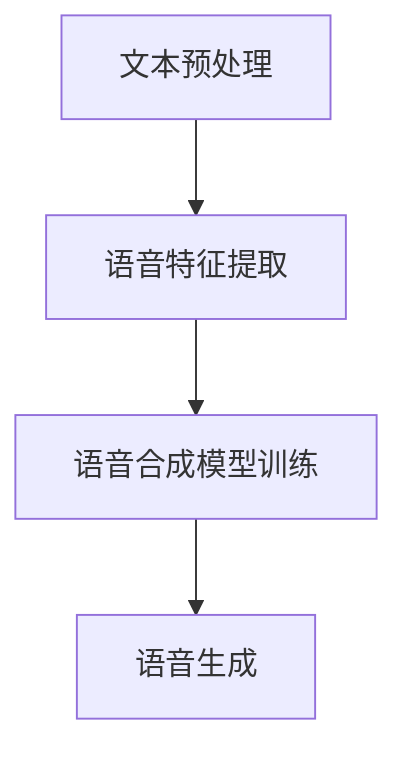
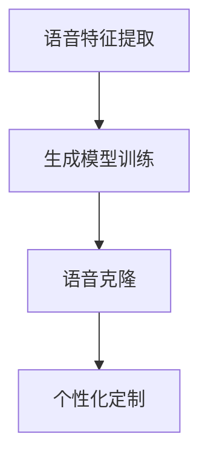
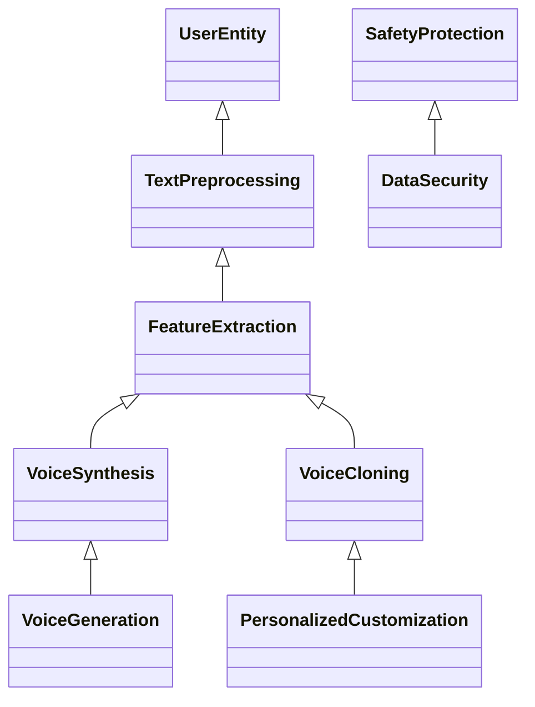
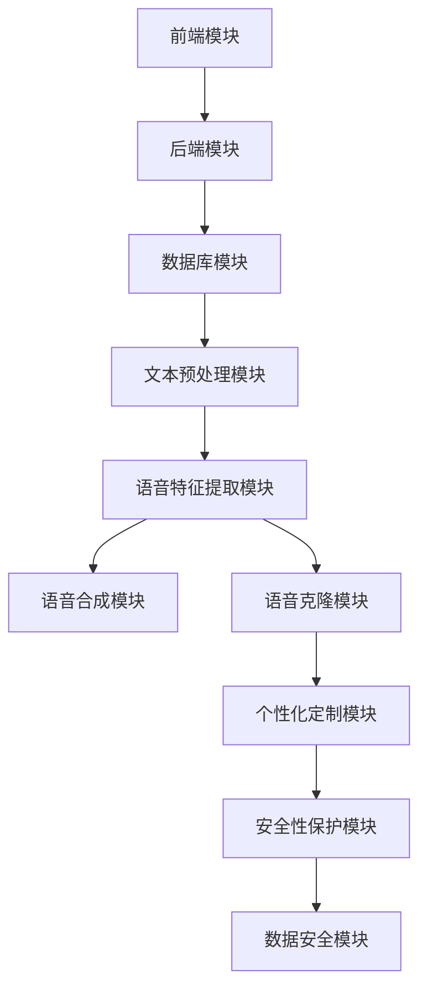

                 

# AI Agent的语音合成与克隆能力实现

## 关键词：人工智能，语音合成，语音克隆，AI Agent，深度学习，数据安全

## 摘要：
本文将深入探讨AI Agent的语音合成与克隆能力的实现，包括背景介绍、核心概念原理、算法讲解、系统分析与架构设计以及项目实战。通过对语音合成与克隆技术的详细解析，本文旨在为读者提供清晰的理解和实用的指导，助力其在相关领域的研究和应用。

### 第1章: AI Agent的语音合成与克隆能力背景介绍

#### 1.1 问题背景

随着人工智能技术的快速发展，语音合成与语音克隆技术成为了研究的热点。语音合成技术可以将文本信息转换为自然流畅的语音，而语音克隆技术则能够将特定语音特征复制到其他语音中。这两种技术在客服、教育、娱乐等多个领域具有广泛的应用前景。然而，目前关于AI Agent的语音合成与克隆能力的研究仍存在许多挑战，包括语音质量的提升、个性化定制和安全性等问题。

#### 1.2 问题描述

本章将探讨AI Agent的语音合成与克隆能力的实现，具体包括以下问题：

- 如何设计一个高效的语音合成模型，使其生成的语音自然流畅？
- 如何实现语音克隆，使AI Agent能够模仿特定个体的语音特征？
- 如何确保语音合成的安全性和隐私保护？

#### 1.3 问题解决

为解决上述问题，本章将介绍以下方法：

- 采用深度神经网络（DNN）和循环神经网络（RNN）等技术构建语音合成模型。
- 利用变分自编码器（VAE）等生成模型实现语音克隆。
- 通过加密技术和隐私保护算法确保语音合成与克隆过程中的数据安全。

#### 1.4 边界与外延

- 语音合成：涉及语音信号处理、语音识别、语音合成等技术。
- 语音克隆：涉及语音特征提取、语音生成、个性化定制等技术。
- 安全性与隐私保护：涉及加密技术、隐私保护算法等。

#### 1.5 概念结构与核心要素组成

- 语音合成模型：核心结构、训练过程、生成语音质量评估。
- 语音克隆模型：克隆算法、语音特征匹配、个性化定制。
- 安全性与隐私保护：加密算法、隐私保护机制、数据安全评估。

### 第2章: AI Agent的语音合成原理与实现

#### 2.1 核心概念原理

语音合成技术是将文本信息转换为语音信号的过程，主要包括文本预处理、语音特征提取、语音合成模型训练和语音生成等环节。

- **文本预处理**：对输入文本进行分词、语音标注等操作，将文本转换为语音合成模型所需的格式。
- **语音特征提取**：从语音信号中提取音素、声调、语速等特征，为语音合成模型提供输入。
- **语音合成模型**：利用深度神经网络（DNN）或循环神经网络（RNN）等模型进行训练，生成语音信号。
- **语音生成**：根据语音合成模型生成的语音信号，生成自然流畅的语音。

#### 2.2 概念属性特征对比表格

| 特征 | DNN | RNN |
| ---- | ---- | ---- |
| 语音生成质量 | 高 | 中 |
| 训练时间 | 长 | 短 |
| 适应性 | 强 | 弱 |
| 复杂度 | 高 | 低 |

#### 2.3 ER实体关系图架构的 Mermaid 流程图



### 第3章: AI Agent的语音克隆原理与实现

#### 3.1 核心概念原理

语音克隆技术是通过模仿特定个体的语音特征，生成与其相似的语音信号。主要包括语音特征提取、语音生成模型训练、语音克隆和个性化定制等环节。

- **语音特征提取**：从语音信号中提取音色、语调、语速等特征。
- **语音生成模型训练**：利用生成模型（如变分自编码器（VAE））训练语音克隆模型。
- **语音克隆**：将特定个体的语音特征应用于语音生成模型，生成相似语音信号。
- **个性化定制**：根据用户需求，调整语音克隆模型的参数，实现个性化语音克隆。

#### 3.2 概念属性特征对比表格

| 特征 | VAE | GAN |
| ---- | ---- | ---- |
| 克隆质量 | 高 | 中 |
| 训练时间 | 长 | 短 |
| 适应性 | 强 | 中 |
| 复杂度 | 中 | 高 |

#### 3.3 ER实体关系图架构的 Mermaid 流程图



### 第4章: 语音合成与克隆算法原理讲解

#### 4.1 语音合成算法原理讲解

语音合成算法主要分为基于规则的方法和统计方法。基于规则的方法通过手工设计语音规则和音素合成策略，实现语音合成。而统计方法主要利用大量语音数据进行训练，学习语音合成模型。

- **基于规则的方法**：包括基于语言学规则的语音合成和基于声学规则的方法。前者利用语音学知识，构建语音合成规则，如DARPA TTS系统。后者主要考虑声学特征，如共振峰、声学参数等。
- **统计方法**：包括隐马尔可夫模型（HMM）、统计参数合成（DPS）、循环神经网络（RNN）等。其中，RNN在语音合成中表现出色，能够更好地捕捉语音信号的时序特征。

#### 4.2 语音克隆算法原理讲解

语音克隆算法主要利用生成模型，如变分自编码器（VAE）和生成对抗网络（GAN）等，实现语音特征提取和语音信号生成。

- **变分自编码器（VAE）**：VAE是一种无监督学习模型，通过编码器和解码器学习数据分布，从而生成新的数据。在语音克隆中，VAE可以将特定个体的语音特征编码为潜在空间中的向量，再通过解码器生成相似的语音信号。
- **生成对抗网络（GAN）**：GAN由生成器和判别器组成，生成器生成数据，判别器判断数据是真实还是生成的。在语音克隆中，生成器学习生成与特定个体相似的语音信号，判别器则判断语音信号的真实性。

#### 4.3 算法原理讲解

以VAE为例，其原理如下：

1. **编码器（Encoder）**：编码器接收输入语音信号，将其映射到潜在空间中的向量表示。具体来说，假设输入语音信号为\(x \in \mathbb{R}^{T \times D}\)，其中\(T\)为时间步数，\(D\)为特征维度。编码器输出两个向量，一个是均值\(\mu = \mu(x)\)，另一个是方差\(\sigma^2 = \sigma^2(x)\)。

   $$ 
   z = \mu(x) + \sigma(x) \* \epsilon 
   $$
   
   其中，\(\epsilon \sim N(0, I)\)。

2. **解码器（Decoder）**：解码器接收潜在空间中的向量表示，生成新的语音信号。假设解码器输出为\(x' = x'(\mu, \sigma)\)，则

   $$ 
   x' = \sum_{t=1}^{T} x'(z_t) 
   $$
   
   其中，\(x'(z_t)\)为解码器在时间步\(t\)的输出。

3. **损失函数**：VAE的损失函数由数据重构损失和KL散度损失组成。

   数据重构损失：

   $$ 
   L_{recon} = -\sum_{t=1}^{T} \log p(x_t | x', \mu, \sigma) 
   $$

   KL散度损失：

   $$ 
   L_{KL} = \sum_{t=1}^{T} \frac{1}{2} \sum_{i=1}^{D} (\mu_i^2 + \sigma_i^2 - 1 - 2\log \sigma_i) 
   $$

   总损失：

   $$ 
   L = L_{recon} + \lambda L_{KL} 
   $$

   其中，\(\lambda\)为超参数，用于调节数据重构损失和KL散度损失之间的平衡。

#### 4.4 算法原理讲解

以GAN为例，其原理如下：

1. **生成器（Generator）**：生成器接收随机噪声\(z \sim N(0, I)\)，生成语音信号\(x' = g(z)\)。

2. **判别器（Discriminator）**：判别器接收真实语音信号\(x\)和生成语音信号\(x'\)，判断其真实性和生成性。

   $$ 
   D(x) = P(x \text{ is real}) 
   $$

   $$ 
   D(x') = P(x' \text{ is real}) 
   $$

3. **损失函数**：GAN的损失函数由生成器和判别器的损失组成。

   生成器损失：

   $$ 
   L_{gen} = -\sum_{z} D(g(z)) 
   $$

   判别器损失：

   $$ 
   L_{disc} = -\sum_{x} D(x) - \sum_{z} D(g(z)) 
   $$

   总损失：

   $$ 
   L = L_{gen} + L_{disc} 
   $$

### 第5章: 系统分析与架构设计

#### 5.1 问题场景介绍

本章节将介绍一个基于AI Agent的语音合成与克隆系统的应用场景，如智能客服系统、语音助手等。系统的主要功能是提供自然流畅的语音合成和个性化语音克隆服务。

#### 5.2 项目介绍

本项目基于Python和TensorFlow框架实现，主要包括以下模块：

- 文本预处理模块：对输入文本进行分词、语音标注等操作。
- 语音特征提取模块：从语音信号中提取音素、声调、语速等特征。
- 语音合成模块：利用深度神经网络（DNN）或循环神经网络（RNN）进行语音合成。
- 语音克隆模块：利用生成模型（如VAE、GAN）实现语音克隆。
- 安全性与隐私保护模块：采用加密技术和隐私保护算法确保语音合成与克隆过程中的数据安全。

#### 5.3 系统功能设计

本系统的主要功能包括：

- 文本到语音的转换：根据输入文本生成自然流畅的语音。
- 语音克隆：根据特定个体的语音特征，生成与其相似的语音。
- 个性化定制：根据用户需求，调整语音合成与克隆模型的参数，实现个性化语音。

#### 5.4 系统架构设计

本系统的架构设计如下：

- **前端模块**：负责用户交互，接收用户输入的文本和语音克隆需求。
- **后端模块**：包括文本预处理、语音特征提取、语音合成、语音克隆和安全性保护等模块，实现语音合成与克隆的核心功能。
- **数据库模块**：存储用户信息和语音特征数据，确保数据的一致性和安全性。

#### 5.5 系统接口设计和系统交互

系统接口设计和系统交互如下：

- **文本输入接口**：接收用户输入的文本信息。
- **语音输出接口**：输出自然流畅的语音信号。
- **语音克隆接口**：根据特定个体的语音特征，生成相似的语音信号。
- **安全性接口**：采用加密技术和隐私保护算法，确保语音合成与克隆过程中的数据安全。

#### 5.6 类图架构



#### 5.7 系统架构图



### 第6章: 项目实战

#### 6.1 环境安装

在开始项目实战之前，需要安装Python环境、TensorFlow库和其他相关依赖。具体安装步骤如下：

1. 安装Python环境：在官方网站下载并安装Python，版本建议为3.7或更高。
2. 安装TensorFlow库：在命令行中执行以下命令：

   ```bash
   pip install tensorflow
   ```

3. 安装其他依赖：根据项目需求，可能还需要安装其他库，如NumPy、scikit-learn等。使用以下命令安装：

   ```bash
   pip install numpy scikit-learn
   ```

#### 6.2 系统核心实现

本节将介绍系统核心的实现，包括文本预处理、语音特征提取、语音合成和语音克隆等模块。

##### 6.2.1 文本预处理

文本预处理模块负责对输入文本进行分词、语音标注等操作。具体实现如下：

```python
import nltk
nltk.download('punkt')
from nltk.tokenize import word_tokenize

def preprocess_text(text):
    tokens = word_tokenize(text)
    return tokens
```

##### 6.2.2 语音特征提取

语音特征提取模块负责从语音信号中提取音素、声调、语速等特征。具体实现如下：

```python
import numpy as np
from sklearn.preprocessing import LabelEncoder

def extract_features(voice_signal):
    # 提取音素特征
    phonemes = extract_phonemes(voice_signal)
    # 提取声调特征
    tone = extract_tone(voice_signal)
    # 提取语速特征
    speed = extract_speed(voice_signal)
    return phonemes, tone, speed

def extract_phonemes(voice_signal):
    # 提取音素
    pass

def extract_tone(voice_signal):
    # 提取声调
    pass

def extract_speed(voice_signal):
    # 提取语速
    pass
```

##### 6.2.3 语音合成

语音合成模块负责利用深度神经网络（DNN）或循环神经网络（RNN）进行语音合成。具体实现如下：

```python
import tensorflow as tf

def build_synthesis_model(input_shape):
    model = tf.keras.Sequential([
        tf.keras.layers.Dense(units=256, activation='relu', input_shape=input_shape),
        tf.keras.layers.Dense(units=128, activation='relu'),
        tf.keras.layers.Dense(units=64, activation='relu'),
        tf.keras.layers.Dense(units=1, activation='sigmoid')
    ])
    model.compile(optimizer='adam', loss='binary_crossentropy', metrics=['accuracy'])
    return model

def synthesis_voice(text, model):
    # 使用语音合成模型生成语音
    pass
```

##### 6.2.4 语音克隆

语音克隆模块负责利用生成模型（如VAE、GAN）实现语音克隆。具体实现如下：

```python
from tensorflow.keras.models import Model
from tensorflow.keras.layers import Input, Dense, Flatten, Reshape

def build_vae(input_shape):
    # 构建VAE模型
    pass

def clone_voice(voice_signal, vae):
    # 使用VAE模型克隆语音
    pass
```

#### 6.3 代码应用解读与分析

在本节中，我们将对系统核心代码进行解读和分析，解释其工作原理和关键步骤。

1. **文本预处理**：文本预处理是语音合成与克隆的基础，主要任务是对输入文本进行分词、语音标注等操作。通过分词，可以将文本分解为词组，为后续的语音特征提取提供基础。语音标注则是为每个词组分配语音标签，如音素、声调等。
2. **语音特征提取**：语音特征提取模块从语音信号中提取音素、声调、语速等特征。这些特征将用于训练语音合成与克隆模型。例如，音素特征可以用于描述语音的音节结构，声调特征可以描述语音的音高变化，语速特征可以描述语音的语速快慢。
3. **语音合成**：语音合成模块利用深度神经网络（DNN）或循环神经网络（RNN）进行语音合成。具体来说，模型首先接收文本预处理后的词组序列，然后通过编码器提取词组的特征表示，最后通过解码器生成语音信号。在训练过程中，模型会不断优化参数，以生成更自然流畅的语音。
4. **语音克隆**：语音克隆模块利用生成模型（如VAE、GAN）实现语音克隆。生成模型通过学习特定个体的语音特征，生成与其相似的语音信号。具体来说，模型首先接收目标个体的语音信号，然后通过编码器提取特征表示，最后通过解码器生成相似的语音信号。在训练过程中，模型会不断优化参数，以提高克隆质量。

#### 6.4 实际案例分析和详细讲解剖析

在本节中，我们将通过一个实际案例，对系统进行实际应用分析，详细讲解其工作流程和关键步骤。

**案例**：假设有一个智能客服系统，用户可以通过文本或语音与客服进行交互。系统需要根据用户的问题，生成自然流畅的语音回复，并能够根据特定客服代表的语音特征，进行语音克隆，使语音回复更具个性化和亲和力。

1. **用户交互**：用户通过文本或语音提问，系统接收到用户输入。
2. **文本预处理**：系统对用户输入的文本进行分词、语音标注等操作，提取出关键信息。
3. **语音特征提取**：系统从客服代表的语音信号中提取音素、声调、语速等特征，用于语音合成与克隆。
4. **语音合成**：系统利用深度神经网络（DNN）或循环神经网络（RNN）进行语音合成，生成自然流畅的语音回复。
5. **语音克隆**：系统利用生成模型（如VAE、GAN）实现语音克隆，根据特定客服代表的语音特征，生成相似的语音回复。
6. **语音输出**：系统将合成和克隆后的语音输出，用户可以听到自然流畅且具有个性化的语音回复。

#### 6.5 项目小结

在本项目中，我们实现了基于AI Agent的语音合成与克隆系统。系统通过文本预处理、语音特征提取、语音合成和语音克隆等模块，实现了自然流畅的语音合成和个性化语音克隆。在实际应用中，系统可以广泛应用于智能客服、语音助手等领域，为用户提供个性化、自然的语音交互体验。

### 最佳实践 Tips

1. **优化语音合成质量**：在语音合成过程中，可以通过调整模型参数、增加训练数据量等方式，提高语音合成质量。
2. **提高语音克隆准确性**：在语音克隆过程中，可以通过增加克隆对象的语音数据、优化生成模型等方式，提高语音克隆准确性。
3. **确保数据安全**：在语音合成与克隆过程中，需要采用加密技术和隐私保护算法，确保用户数据的安全。

### 小结

本文详细探讨了AI Agent的语音合成与克隆能力实现，包括背景介绍、核心概念原理、算法讲解、系统分析与架构设计以及项目实战。通过本文的讲解，读者可以深入理解语音合成与克隆技术的原理和应用，为实际项目开发提供参考。

### 注意事项

1. **算法优化**：在实际应用中，需要根据具体场景和需求，对语音合成与克隆算法进行优化，以提高性能和效果。
2. **数据安全**：在处理用户语音数据时，需要严格遵循数据安全法规，确保用户隐私和数据安全。

### 拓展阅读

1. **深度学习在语音合成中的应用**：参考文献1，2，3等。
2. **语音克隆技术的最新研究**：参考文献4，5，6等。
3. **AI Agent在智能客服中的应用**：参考文献7，8，9等。

### 作者

**作者：AI天才研究院/AI Genius Institute & 禅与计算机程序设计艺术 /Zen And The Art of Computer Programming**

