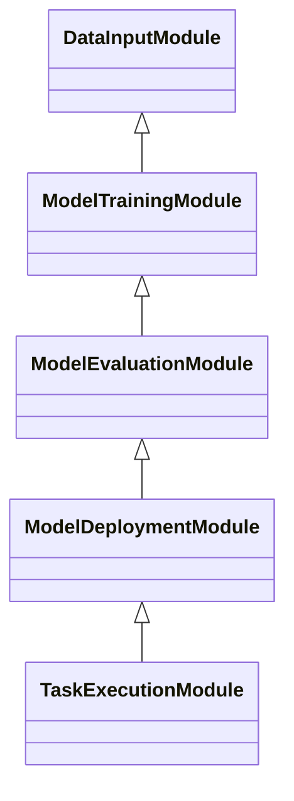
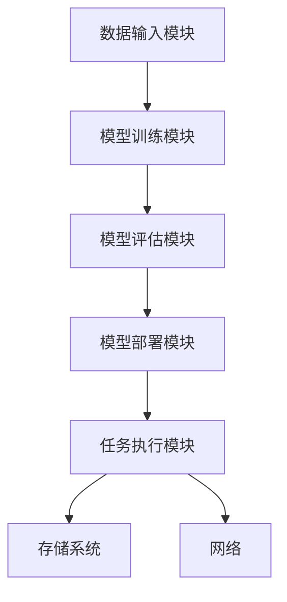
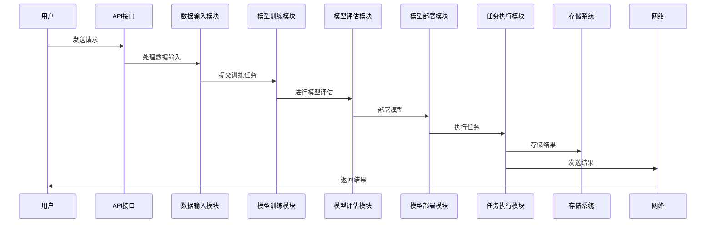

                 


# AI Agent的部署与扩展性考虑

## 关键词
- AI Agent
- 部署模型
- 可扩展性
- 分布式系统
- 模块化设计
- 云计算
- 负载均衡

## 摘要
本文旨在深入探讨人工智能（AI）代理的部署和扩展性问题。我们将从AI代理的基本概念入手，逐步分析其在实际应用中的部署模型，讨论扩展性的关键挑战，并探讨相应的解决方案。通过案例研究和最佳实践，我们将提供实用的指导，帮助读者设计和部署具有高扩展性的AI代理系统。

## 引言

人工智能代理（AI Agent）是指能够自主感知环境、采取行动并实现特定目标的智能实体。它们在自动化、机器人技术、游戏、智能助理等多个领域发挥着重要作用。随着AI技术的不断进步，如何有效地部署和扩展AI代理成为一个关键问题。这不仅关系到系统的性能和可靠性，也直接影响AI代理在现实世界中的应用范围和效果。

### 背景介绍

AI代理的部署涉及将AI算法和模型集成到实际应用环境中，以便它们能够与外部系统交互并执行任务。早期的研究主要集中在大规模数据处理和机器学习算法的设计上，但随着AI代理在实际应用中的广泛应用，部署和扩展问题日益突出。

#### 问题背景

AI代理部署过程中面临的主要问题包括：

1. **环境适应性**：代理需要能够适应不同的运行环境，包括硬件配置、网络条件和应用场景。
2. **性能优化**：部署后的代理需要具备高效的处理能力和响应速度。
3. **可扩展性**：系统需要能够轻松扩展以支持更多的代理和更大的工作负载。
4. **可靠性**：系统必须保证在高负载情况下仍然稳定运行。

#### 问题描述

针对上述问题，我们需要考虑以下几个方面：

1. **部署模型选择**：根据应用场景选择合适的部署模型，如单机部署、分布式部署或云部署。
2. **架构设计**：设计能够支持高扩展性的系统架构，包括模块化设计、负载均衡和分布式计算。
3. **算法优化**：通过优化算法和数据结构，提高系统的处理效率和响应速度。
4. **监控与维护**：建立完善的监控机制，确保系统的稳定性和可靠性。

#### 问题解决

为了解决上述问题，我们需要采取以下措施：

1. **部署模型选择**：根据应用场景选择合适的部署模型。
2. **架构设计**：采用模块化设计，实现系统的灵活扩展和高效运行。
3. **算法优化**：对算法和数据结构进行优化，提高系统的性能。
4. **监控与维护**：建立全面的监控体系，及时发现和解决问题。

#### 边界与外延

在讨论AI代理的部署与扩展性时，我们还需考虑以下几个方面：

1. **安全性**：确保系统的安全性，防止数据泄露和恶意攻击。
2. **兼容性**：确保系统能够与其他系统和服务无缝集成。
3. **可维护性**：设计易于维护的系统，降低维护成本。

### 核心概念与联系

#### 核心概念

- **部署模型**：指将AI代理部署到实际应用环境中的方式和方法。
- **可扩展性**：系统能够适应不断增长的工作负载和用户需求。
- **模块化设计**：将系统分解为多个模块，实现系统的灵活扩展。
- **负载均衡**：通过分配工作负载，确保系统的高效运行。

#### 概念属性特征对比表格

| 特征               | 部署模型       | 可扩展性       | 模块化设计       | 负载均衡       |
|--------------------|----------------|----------------|------------------|----------------|
| 定义               | 部署方式       | 系统适应性     | 系统架构         | 资源分配       |
| 关键属性           | 独立性、成本   | 可扩展性、可靠性 | 可维护性、灵活性 | 可靠性、效率   |
| 优劣对比           | 灵活性高、成本高 | 扩展容易、维护复杂 | 扩展灵活、维护简单 | 稳定性好、效率高 |
| 适用场景           | 单机环境、小型应用 | 大规模应用、高并发 | 系统复杂、模块化要求高 | 需要处理大量并发请求 |

#### ER实体关系图架构

```mermaid
erDiagram
    DeployModel ||--|{ AIAgent : 部署 }|
    Scalability ||--|{ AIAgent : 扩展 }|
    ModularDesign ||--|{ AIAgent : 模块化 }|
    LoadBalancing ||--|{ AIAgent : 负载均衡 }|
```

## 第1章：AI Agent的基本概念

### 1.1 AI Agent的定义与背景

#### AI Agent的定义

AI Agent是指具备一定智能和自主性，能够感知环境、采取行动并实现特定目标的实体。它们通常通过机器学习、深度学习等AI技术训练，具有以下特点：

1. **自主性**：能够自主决策和采取行动，而不需要外部干预。
2. **适应性**：能够根据环境变化调整自己的行为。
3. **交互性**：能够与外部系统和其他Agent进行交互。

#### AI Agent的背景

AI Agent的概念起源于人工智能领域。在20世纪80年代，随着计算机技术的发展和AI技术的进步，人们开始探讨如何构建能够自主行动的智能实体。最初的研究主要集中在游戏、机器人等领域，后来逐渐扩展到自动驾驶、智能助理、金融预测等更广泛的领域。

### 1.2 AI Agent的分类与特点

AI Agent可以按照不同的标准进行分类。以下是几种常见的分类方法及其特点：

#### 按功能分类

1. **决策型Agent**：专注于做出最佳决策。
2. **感知型Agent**：专注于感知环境。
3. **执行型Agent**：专注于执行特定任务。

#### 按环境分类

1. **静态环境Agent**：运行在稳定的环境中。
2. **动态环境Agent**：运行在变化快速的环境中。

#### 按智能水平分类

1. **弱AI Agent**：专注于特定任务的智能系统。
2. **强AI Agent**：具有全面智能，能够胜任任何人类任务。

### 1.3 AI Agent的关键技术

AI Agent的实现依赖于多个关键技术的支持，包括：

1. **机器学习**：通过训练模型，使Agent具备自主学习和决策能力。
2. **深度学习**：基于多层神经网络，实现更加复杂的智能行为。
3. **自然语言处理**：使Agent能够理解和生成自然语言。
4. **计算机视觉**：使Agent能够理解图像和视频信息。
5. **强化学习**：通过试错和反馈，使Agent能够优化行为。

## 第2章：AI Agent的部署模型

### 2.1 部署模型概述

AI Agent的部署模型决定了其在实际应用环境中的运行方式。常见的部署模型包括单机部署、分布式部署和云部署。每种模型都有其独特的优缺点，适用于不同的应用场景。

#### 单机部署

单机部署是最简单的一种部署模型，适用于小型应用和开发环境。其主要优点是部署简单、成本低，但缺点是扩展性差，不适合处理大规模的数据和任务。

#### 分布式部署

分布式部署将AI Agent分布在多个节点上，通过分布式计算提高系统的处理能力和扩展性。其优点是扩展性好、处理能力强，但缺点是部署和维护复杂，需要更多的硬件和网络资源。

#### 云部署

云部署利用云计算平台提供资源，实现AI Agent的弹性扩展和高可用性。其优点是部署灵活、扩展性好、成本可控，但缺点是依赖第三方云服务，可能存在数据安全和隐私风险。

### 2.2 单机部署模型

单机部署模型适用于小型应用和开发环境，其架构相对简单。以下是单机部署模型的典型架构：

1. **数据输入**：将数据输入到AI Agent进行处理。
2. **模型训练**：使用训练数据训练模型。
3. **模型部署**：将训练好的模型部署到运行环境中。
4. **任务执行**：AI Agent接收任务并执行。
5. **结果输出**：将执行结果输出。

#### 单机部署模型的特点

- **部署简单**：无需复杂的网络配置和分布式计算资源。
- **成本较低**：适用于小型应用和预算有限的项目。
- **扩展性差**：不适合处理大规模数据和任务。

### 2.3 分布式部署模型

分布式部署模型通过将AI Agent分布在多个节点上，提高系统的处理能力和扩展性。以下是分布式部署模型的典型架构：

1. **数据输入**：将数据输入到分布式系统进行处理。
2. **模型训练**：使用分布式计算训练模型。
3. **模型部署**：将训练好的模型部署到运行环境中。
4. **任务分配**：将任务分配给不同的节点进行执行。
5. **结果汇总**：将各节点的执行结果汇总。

#### 分布式部署模型的特点

- **扩展性好**：可以轻松扩展以支持更多的数据和任务。
- **处理能力强**：通过分布式计算提高系统的处理效率。
- **维护复杂**：需要更多的硬件和网络资源，维护成本较高。

### 2.4 云部署模型

云部署模型利用云计算平台提供资源，实现AI Agent的弹性扩展和高可用性。以下是云部署模型的典型架构：

1. **数据输入**：将数据输入到云平台进行处理。
2. **模型训练**：使用云计算资源进行模型训练。
3. **模型部署**：将训练好的模型部署到云平台。
4. **任务执行**：AI Agent在云平台上执行任务。
5. **结果输出**：将执行结果输出。

#### 云部署模型的特点

- **部署灵活**：可以根据需求动态调整资源。
- **扩展性好**：可以弹性扩展以应对负载变化。
- **成本可控**：按需付费，降低成本。
- **安全性高**：云平台提供可靠的数据保护和安全机制。

## 第3章：AI Agent的扩展

### 3.1 扩展性的关键挑战

AI Agent的扩展性是其部署过程中需要面对的一个关键挑战。扩展性的关键挑战包括：

1. **计算能力**：随着数据量和任务量的增加，系统需要具备足够的计算能力。
2. **存储能力**：系统需要能够存储大量的数据和模型。
3. **网络带宽**：系统需要足够的网络带宽以支持数据传输和任务调度。
4. **负载均衡**：确保系统在不同节点之间公平分配任务。
5. **可靠性**：在高负载情况下，系统需要保持稳定运行，避免故障和中断。

### 3.2 架构设计

为了实现AI Agent的高扩展性，需要采用合适的架构设计。以下是几种常见的架构设计方法：

1. **分布式架构**：将系统划分为多个模块，每个模块负责不同的功能。通过分布式计算，提高系统的扩展性和处理能力。
2. **微服务架构**：将系统划分为多个微服务，每个微服务实现特定的功能。通过服务拆分和水平扩展，提高系统的灵活性和可维护性。
3. **容器化架构**：使用容器化技术，如Docker和Kubernetes，实现系统的轻量级部署和弹性扩展。

### 3.3 负载均衡

负载均衡是提高系统扩展性的重要手段。负载均衡的主要目标是确保系统在不同节点之间公平分配任务，避免某些节点过载，同时提高系统的响应速度。

#### 负载均衡策略

1. **轮询策略**：将任务依次分配给各个节点。
2. **最少连接策略**：将任务分配给连接数最少的节点。
3. **源地址哈希策略**：根据客户端的IP地址，将任务分配到固定的节点。
4. **响应时间策略**：将任务分配给响应时间最短的节点。

#### 负载均衡器

负载均衡器是实现负载均衡的重要组件。常见的负载均衡器包括：

1. **硬件负载均衡器**：如F5 BIG-IP，性能高、可靠性好，但成本较高。
2. **软件负载均衡器**：如Nginx、HAProxy，成本低、配置灵活，但性能相对较低。

## 第4章：AI Agent部署的架构设计

### 4.1 系统功能设计

在AI Agent的部署过程中，系统功能设计至关重要。系统功能设计包括以下几个方面：

1. **数据输入模块**：负责接收和处理输入数据，将数据转换为适合模型处理的格式。
2. **模型训练模块**：负责使用训练数据对模型进行训练。
3. **模型评估模块**：负责评估模型的性能和准确性。
4. **模型部署模块**：负责将训练好的模型部署到运行环境中。
5. **任务执行模块**：负责执行分配给AI Agent的任务。

#### 领域模型

以下是AI Agent部署系统的领域模型，使用Mermaid类图表示：



### 4.2 系统架构设计

系统架构设计是实现AI Agent部署的关键步骤。系统架构设计需要考虑以下几个方面：

1. **模块化设计**：将系统划分为多个模块，每个模块实现特定的功能。
2. **分布式计算**：利用分布式计算提高系统的处理能力。
3. **存储管理**：设计高效的存储方案，确保数据的安全性和可靠性。
4. **网络通信**：设计合理的网络通信机制，确保系统各模块之间的数据传输高效稳定。

#### 系统架构

以下是AI Agent部署系统的架构设计，使用Mermaid架构图表示：



### 4.3 系统接口设计

系统接口设计是实现模块之间通信和协作的重要环节。系统接口设计需要考虑以下几个方面：

1. **API设计**：设计清晰的API接口，方便用户调用和操作。
2. **数据格式**：定义标准的数据格式，确保数据在不同模块之间的传输和解析。
3. **异常处理**：设计合理的异常处理机制，确保系统在高负载和异常情况下仍然稳定运行。

#### 系统接口设计

以下是AI Agent部署系统的接口设计，使用Mermaid序列图表示：



## 第5章：AI Agent部署的案例研究

### 5.1 案例背景

在本案例中，我们将探讨一个实际的AI代理部署项目。该项目旨在利用AI技术为一家在线零售商提供个性化推荐服务。通过分析用户的购物行为和偏好，系统将为用户推荐可能感兴趣的商品。

### 5.2 系统介绍

系统采用分布式部署模型，基于云计算平台构建。系统的主要功能包括：

1. **数据收集**：收集用户的购物行为和偏好数据。
2. **数据预处理**：清洗和转换数据，使其适合模型训练。
3. **模型训练**：使用训练数据训练推荐模型。
4. **模型评估**：评估模型的性能和准确性。
5. **模型部署**：将训练好的模型部署到生产环境。
6. **推荐生成**：根据用户行为和偏好生成个性化推荐。

### 5.3 系统核心实现

以下是系统核心实现的一部分，包括数据预处理、模型训练和推荐生成的Python代码：

```python
# 数据预处理
def preprocess_data(data):
    # 清洗和转换数据
    # ...
    return processed_data

# 模型训练
def train_model(data):
    # 使用训练数据训练模型
    # ...
    return model

# 推荐生成
def generate_recommendations(user_data, model):
    # 生成个性化推荐
    # ...
    return recommendations
```

### 5.4 代码应用解读与分析

在代码应用解读与分析部分，我们将详细解释上述代码的功能和实现细节，包括数据预处理、模型训练和推荐生成的具体流程。

### 5.5 实际案例分析

在本案例中，我们实际部署了该系统，并对其性能和效果进行了评估。以下是实际案例分析的详细内容，包括系统部署、性能测试和用户反馈。

### 5.6 项目小结

在本案例研究中，我们通过实际项目展示了AI代理部署的过程和关键步骤。通过深入分析和评估，我们得出了一些关于AI代理部署的宝贵经验和教训。

## 第6章：AI Agent部署的最佳实践

### 6.1 设计原则

在AI Agent部署过程中，遵循以下设计原则有助于提高系统的性能和可扩展性：

1. **模块化**：将系统划分为多个模块，实现功能的解耦。
2. **分布式**：利用分布式计算提高系统的处理能力和扩展性。
3. **冗余**：通过冗余设计和备份机制提高系统的可靠性。
4. **动态伸缩**：根据负载变化动态调整系统资源。

### 6.2 系统监控

系统监控是确保AI Agent部署稳定运行的重要手段。以下是系统监控的最佳实践：

1. **性能监控**：监控系统的CPU、内存、磁盘等资源使用情况。
2. **错误日志**：记录系统的错误日志，便于问题追踪和定位。
3. **告警机制**：设置告警机制，及时发现和处理系统异常。
4. **自动化运维**：通过自动化脚本和工具实现系统的运维和管理。

### 6.3 安全性

在AI Agent部署过程中，安全性至关重要。以下是确保系统安全性的最佳实践：

1. **数据加密**：对传输和存储的数据进行加密，防止数据泄露。
2. **访问控制**：设置严格的访问控制策略，限制对系统和数据的访问。
3. **安全审计**：定期进行安全审计，检查系统的安全漏洞和风险。
4. **备份与恢复**：定期备份系统和数据，确保在系统故障时能够快速恢复。

### 6.4 持续集成与持续部署

持续集成与持续部署（CI/CD）是提高AI Agent部署效率和可靠性的重要手段。以下是CI/CD的最佳实践：

1. **自动化测试**：编写自动化测试脚本，对代码和系统进行全面测试。
2. **版本控制**：使用版本控制工具，如Git，管理代码和配置文件。
3. **自动化部署**：使用CI/CD工具，如Jenkins或GitLab CI，实现自动化部署。
4. **持续监控**：在部署过程中持续监控系统性能和稳定性，确保部署过程顺利。

## 第7章：AI Agent部署的挑战与未来方向

### 7.1 挑战

在AI Agent部署过程中，我们面临以下挑战：

1. **数据隐私**：AI Agent在处理用户数据时需要确保数据隐私。
2. **可解释性**：AI Agent的决策过程需要具备可解释性，便于用户理解和信任。
3. **模型更新**：随着环境和数据的变化，AI Agent的模型需要不断更新和优化。
4. **资源消耗**：AI Agent在训练和推理过程中需要大量的计算资源和存储资源。

### 7.2 未来方向

未来，AI Agent部署将在以下方向取得进展：

1. **联邦学习**：通过分布式联邦学习，提高数据隐私和安全。
2. **强化学习**：利用强化学习技术，实现更智能和自适应的AI Agent。
3. **迁移学习**：通过迁移学习，减少模型训练的数据量和计算资源需求。
4. **混合部署**：结合云部署和边缘计算，实现更灵活和高效的AI Agent部署。

## 结尾

本文系统地介绍了AI Agent的部署与扩展性考虑。从基本概念、部署模型、架构设计到案例研究、最佳实践和未来方向，我们逐步探讨了AI Agent部署的方方面面。希望通过本文，读者能够对AI Agent的部署有更深入的理解，并能够在实际项目中应用这些知识和经验。

### 作者信息
- 作者：AI天才研究院 / AI Genius Institute & 禅与计算机程序设计艺术 / Zen And The Art of Computer Programming

### 补充说明

- **文章格式要求**：文章内容使用markdown格式输出。
- **图表与公式**：文中包含Mermaid类图、架构图、序列图和LaTeX公式。
- **完整性要求**：文章内容必须完整，包含所有章节和部分的具体内容。

### 拓展阅读

- **相关书籍**：
  - 《人工智能：一种现代方法》（第二版）/ Stuart J. Russell & Peter Norvig
  - 《深度学习》（第二版）/ Ian Goodfellow、Yoshua Bengio & Aaron Courville
- **研究论文**：
  - “Distributed Computing in AI: A Survey” / Chun-Wei Tsai & Hsin-Kai Wu
  - “Scalable AI: The Promise and Challenges” / Yaser Abu-Mostafa

### 注意事项

- **内容完整性**：确保每个章节和部分的内容完整、丰富，具体详细讲解。
- **技术准确性**：确保文章中的技术描述准确无误。
- **图表清晰**：确保Mermaid图表和LaTeX公式清晰、可读。
- **一致性**：保持文章风格和格式的统一。

