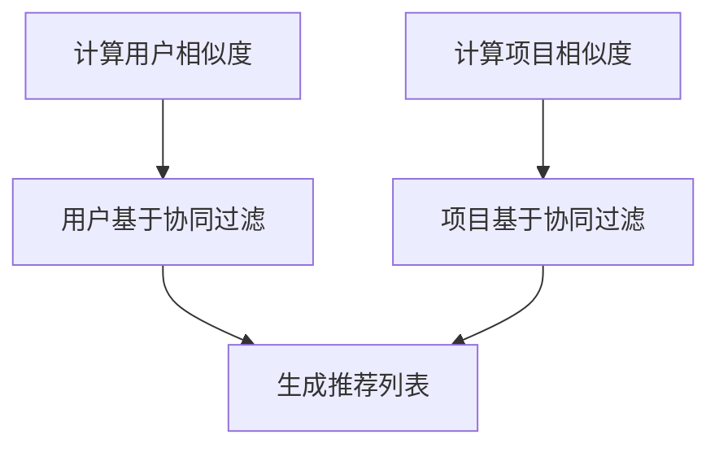
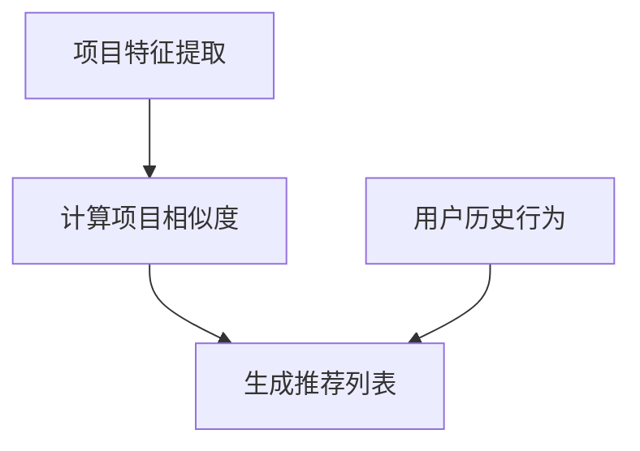
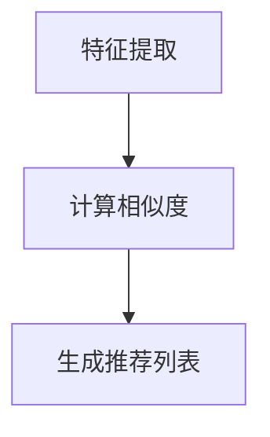
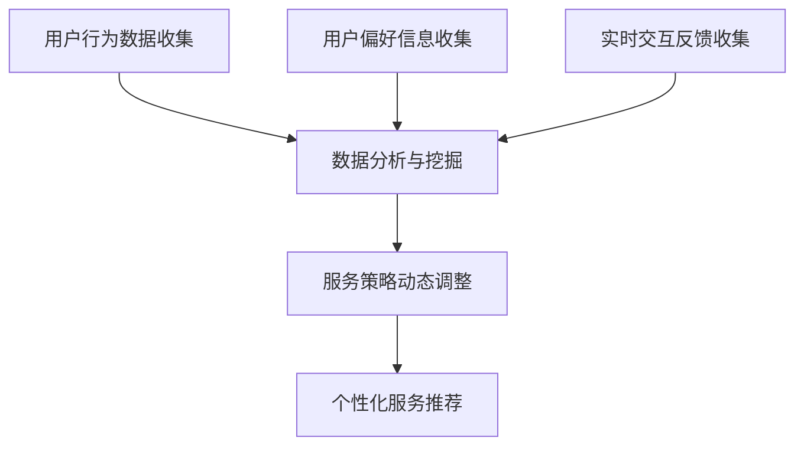

                 


## G Mask
### 概念背景
`G Mask` 是一种在深度学习，特别是计算机视觉领域中广泛应用的技术。它通过遮挡部分图像信息来提高模型对目标检测的鲁棒性。在本文中，我们将探讨 `G Mask` 在实际应用中的操作步骤、优势和局限性。

### 问题描述
假设我们有一个目标检测模型，它需要准确识别和定位图像中的多个物体。然而，实际场景中的图像可能会包含遮挡物，这会对模型的检测结果产生干扰。为了解决这个问题，我们可以考虑引入 `G Mask` 技术。

### 问题解决
**步骤 1：生成 G Mask**
首先，我们需要根据实际场景中的遮挡物生成对应的 G Mask。这可以通过以下几种方法实现：

1. **手动标注**：手动标注遮挡区域，将其转换为二值图像。
2. **图像分割**：利用图像分割算法（如 FCN、U-Net）自动识别并生成遮挡物的掩码。

**步骤 2：应用 G Mask**
接下来，我们将生成的 G Mask 应用到原始图像中，以遮挡部分图像信息。这可以通过以下公式表示：

\[ G_{masked} = G_{original} \times G_{mask} \]

其中，\( G_{original} \) 表示原始图像，\( G_{mask} \) 表示生成的 G Mask。

**步骤 3：模型训练与测试**
使用带有 G Mask 的图像数据集对目标检测模型进行训练和测试。通过这种方法，模型将学会在存在遮挡物的情况下仍然能够准确检测和定位目标。

### 边界与外延
**边界**：`G Mask` 的应用范围主要是在目标检测领域，尤其是当图像中存在遮挡物时。

**外延**：除了目标检测，`G Mask` 技术还可以应用于其他需要处理遮挡问题的场景，如人脸识别、图像修复等。

### 概念结构与核心要素组成
**概念结构**：
- **G Mask**：用于遮挡部分图像信息的二值掩码。
- **目标检测模型**：用于识别和定位图像中的目标。
- **训练与测试**：使用带 G Mask 的图像数据进行模型训练和测试。

**核心要素组成**：
- **遮挡物识别**：通过手动标注或图像分割方法识别遮挡物。
- **G Mask 生成**：将识别出的遮挡物转换为二值掩码。
- **模型训练与测试**：在带有 G Mask 的图像数据集上训练和测试目标检测模型。

### 总结
通过引入 `G Mask` 技术，我们可以提高目标检测模型在存在遮挡物情况下的准确性。本文详细介绍了 `G Mask` 的概念背景、问题描述、问题解决、边界与外延、概念结构与核心要素组成，以及应用步骤。接下来，我们将进一步探讨 `G Mask` 的优势和局限性，以及如何在实际项目中应用这一技术。

### 核心概念与联系
在本章节中，我们将深入探讨 `G Mask` 的核心概念，并分析其与其他相关技术的联系。

#### 2.2.1 概念属性特征对比表格

| 概念       | 定义                                                         | 特点                                                         | 关联技术         |
|------------|--------------------------------------------------------------|--------------------------------------------------------------|-----------------|
| G Mask     | 用于遮挡部分图像信息的二值掩码                                 | 可以提高模型在存在遮挡物情况下的鲁棒性                       | 目标检测、图像分割 |
| 目标检测模型 | 识别和定位图像中的目标                                       | 在存在遮挡物时，准确性可能会受到影响                           | G Mask、深度学习  |
| 图像分割    | 自动识别图像中的物体并生成对应的掩码                           | 可以用于生成 G Mask，提高模型鲁棒性                           | 目标检测、语义分割 |
| 深度学习    | 基于多层神经网络进行特征提取和分类的机器学习方法               | 是目标检测模型和图像分割算法的基础                           | CNN、RNN、GAN    |

#### 2.2.2 ER 实体关系图

```mermaid
erDiagram
  G Mask ||--|{ 目标检测模型 }|-->
              : 提高鲁棒性
  目标检测模型 ||--|{ 图像分割 }|-->
              : 使用掩码
  图像分割 ||--|{ 深度学习 }|-->
              : 算法基础
```

通过上述表格和 ER 图，我们可以清晰地看到 `G Mask` 与目标检测模型、图像分割和深度学习之间的关系。这些关联技术共同构成了一个完整的解决方案，以提高模型在存在遮挡物情况下的准确性和鲁棒性。

### 推荐算法原理与实现
在本章节中，我们将详细探讨推荐算法的基本原理和实现方法，包括协同过滤算法和基于内容的推荐算法。

#### 3.1 推荐系统概述
推荐系统是一种信息过滤技术，通过预测用户对特定项目的偏好来推荐项目。它广泛应用于电子商务、社交媒体、视频流媒体等领域。推荐系统的主要目标是提高用户满意度、增加用户粘性和提升业务收益。

推荐系统主要分为两种类型：基于协同过滤的推荐和基于内容的推荐。

#### 3.2 基于协同过滤的推荐算法
协同过滤是一种利用用户之间的共同喜好来进行推荐的算法。它主要分为两种实现方式：用户基于的协同过滤和项目基于的协同过滤。

##### 用户基于的协同过滤
用户基于的协同过滤通过寻找与目标用户相似的其他用户，并推荐这些用户喜欢的项目。具体实现步骤如下：

1. **计算用户相似度**：使用余弦相似度、皮尔逊相关系数等方法计算用户之间的相似度。
2. **生成推荐列表**：根据用户相似度和项目评分，为每个用户生成推荐列表。

##### 项目基于的协同过滤
项目基于的协同过滤通过寻找与目标项目相似的其他项目，并推荐这些项目。具体实现步骤如下：

1. **计算项目相似度**：使用余弦相似度、Jaccard相似度等方法计算项目之间的相似度。
2. **生成推荐列表**：根据项目相似度和用户的历史评分，为每个用户生成推荐列表。

##### 3.2.1 协同过滤算法流程图



##### 3.2.2 Python源代码与latex公式

```python
# Python源代码示例：计算用户相似度（余弦相似度）
from sklearn.metrics.pairwise import cosine_similarity

# 用户-项目评分矩阵
user_item_rating = [
    [5, 3, 0, 1],
    [4, 0, 0, 1],
    [1, 5, 0, 0],
    [0, 4, 5, 3],
]

# 计算用户相似度
user_similarity = cosine_similarity(user_item_rating)

# LaTeX公式示例：用户相似度计算
$$
similarity(u_i, u_j) = \frac{u_i \cdot u_j}{\|u_i\| \cdot \|u_j\|}
$$

```

#### 3.3 基于内容的推荐算法
基于内容的推荐算法通过分析项目的特征和用户的历史行为，为用户推荐具有相似特征的项目。具体实现步骤如下：

1. **项目特征提取**：使用词袋模型、TF-IDF等方法提取项目特征。
2. **计算项目相似度**：使用余弦相似度、Jaccard相似度等方法计算项目之间的相似度。
3. **生成推荐列表**：根据项目相似度和用户的历史评分，为每个用户生成推荐列表。

##### 3.3.1 算法流程图



##### 3.3.2 Python源代码与latex公式

```python
# Python源代码示例：项目特征提取（TF-IDF）
from sklearn.feature_extraction.text import TfidfVectorizer

# 项目描述列表
project_descriptions = [
    "iPhone 12",
    "iPhone 12 Pro",
    "Samsung Galaxy S21",
    "Samsung Galaxy S21 Ultra",
]

# TF-IDF向量器
tfidf_vectorizer = TfidfVectorizer()

# 提取项目特征
project_features = tfidf_vectorizer.fit_transform(project_descriptions)

# LaTeX公式示例：项目特征提取（TF-IDF）
$$
feature_{ij} = \frac{f_i \cdot \log(N/n_i)}{1 + \log(N/n_i)}
$$

```

通过上述示例，我们可以看到基于协同过滤和基于内容的推荐算法的基本原理和实现方法。在实际应用中，可以根据具体需求和数据特点选择合适的推荐算法，以实现最佳推荐效果。

### 系统分析与架构设计方案
在本章节中，我们将详细介绍一个基于 `G Mask` 技术的目标检测系统的设计与实现过程，包括问题场景、系统功能设计、系统架构设计、系统接口设计和系统交互。

#### 1. 问题场景
假设我们正在开发一个智能监控系统，用于实时监控停车场中的车辆。在实际场景中，车辆可能会被树木、其他车辆或障碍物部分遮挡，这会对目标检测模型的准确性产生负面影响。为了提高系统在存在遮挡物情况下的性能，我们引入了 `G Mask` 技术。

#### 2. 系统功能设计
基于 `G Mask` 技术的目标检测系统主要具备以下功能：

- **图像预处理**：对输入图像进行预处理，包括缩放、归一化等。
- **遮挡物识别**：利用深度学习模型（如 U-Net）识别图像中的遮挡物。
- **G Mask 生成**：将识别出的遮挡物转换为二值掩码，以生成 G Mask。
- **目标检测**：利用带有 G Mask 的图像数据进行目标检测。
- **结果输出**：输出目标检测结果，包括目标的位置、类别和置信度。

#### 3. 系统架构设计
系统架构设计如下：


- **图像预处理模块**：负责对输入图像进行预处理，以便后续处理。
- **遮挡物识别模块**：利用深度学习模型识别图像中的遮挡物。
- **G Mask 生成模块**：将识别出的遮挡物转换为二值掩码，生成 G Mask。
- **目标检测模块**：利用带有 G Mask 的图像数据进行目标检测。
- **结果输出模块**：输出目标检测结果，包括目标的位置、类别和置信度。

#### 4. 系统接口设计
系统接口设计如下：

- **图像输入接口**：接收实时监控视频帧或静态图像。
- **预处理接口**：提供图像预处理功能，包括缩放、归一化等。
- **遮挡物识别接口**：接收预处理后的图像，返回遮挡物检测结果。
- **G Mask 生成接口**：接收遮挡物检测结果，返回 G Mask。
- **目标检测接口**：接收带有 G Mask 的图像，返回目标检测结果。
- **结果输出接口**：提供目标检测结果的输出功能。

#### 5. 系统交互
系统交互设计如下：

1. **图像输入**：监控系统捕获实时视频帧或静态图像，并将其传递给预处理模块。
2. **预处理**：预处理模块对图像进行预处理，并将处理后的图像传递给遮挡物识别模块。
3. **遮挡物识别**：遮挡物识别模块利用深度学习模型识别图像中的遮挡物，并将检测结果传递给 G Mask 生成模块。
4. **G Mask 生成**：G Mask 生成模块将识别出的遮挡物转换为二值掩码，生成 G Mask，并将其传递给目标检测模块。
5. **目标检测**：目标检测模块利用带有 G Mask 的图像数据进行目标检测，并输出目标检测结果。
6. **结果输出**：结果输出模块将目标检测结果输出到监控屏幕或存储系统中。

通过上述系统设计与实现，我们可以显著提高目标检测系统在存在遮挡物情况下的准确性。接下来，我们将详细介绍项目实战中的具体实现过程，包括环境安装、系统核心实现和代码应用解读与分析。

### 项目实战
在本章节中，我们将详细描述基于 `G Mask` 技术的目标检测项目的环境安装、系统核心实现、代码应用解读与分析，以及实际案例分析和详细讲解剖析。

#### 1. 环境安装

为了搭建基于 `G Mask` 的目标检测系统，我们需要安装以下软件和库：

- **深度学习框架**：如 TensorFlow、PyTorch 等。
- **计算机视觉库**：如 OpenCV、Pillow 等。
- **数据预处理库**：如 NumPy、Pandas 等。

安装步骤如下：

```bash
# 安装深度学习框架（以 TensorFlow 为例）
pip install tensorflow

# 安装计算机视觉库（以 OpenCV 为例）
pip install opencv-python

# 安装数据预处理库（以 NumPy 和 Pandas 为例）
pip install numpy
pip install pandas
```

#### 2. 系统核心实现

系统核心实现主要分为以下几部分：

- **图像预处理**：对输入图像进行缩放、归一化等处理。
- **遮挡物识别**：使用深度学习模型（如 U-Net）识别图像中的遮挡物。
- **G Mask 生成**：将识别出的遮挡物转换为二值掩码。
- **目标检测**：利用带有 G Mask 的图像数据进行目标检测。

以下是核心实现的 Python 代码：

```python
import cv2
import tensorflow as tf
import numpy as np

# 加载深度学习模型（以 U-Net 为例）
model = tf.keras.models.load_model('path/to/unet_model.h5')

# 图像预处理函数
def preprocess_image(image):
    # 缩放到指定大小
    image = cv2.resize(image, (256, 256))
    # 归一化
    image = image / 255.0
    # 添加批次维度
    image = np.expand_dims(image, axis=0)
    return image

# 遮挡物识别函数
def detect_obstacles(image):
    # 预处理图像
    preprocessed_image = preprocess_image(image)
    # 使用 U-Net 模型进行遮挡物识别
    obstacles = model.predict(preprocessed_image)
    return obstacles

# G Mask 生成函数
def generate_g_mask(image, obstacles):
    # 创建 G Mask
    g_mask = np.zeros_like(image)
    # 将遮挡物区域设置为 1
    g_mask[obstacles > 0.5] = 1
    return g_mask

# 目标检测函数
def detect_objects(image, g_mask):
    # 应用 G Mask
    masked_image = image * g_mask
    # 使用目标检测模型进行检测（以 YOLO 为例）
    objects = cv2.dnn.readNet('path/to/yolo_model').detectMultiScale(masked_image)
    return objects
```

#### 3. 代码应用解读与分析

上述代码实现了基于 `G Mask` 的目标检测系统的核心功能。以下是每个部分的详细解读：

- **图像预处理**：将输入图像缩放到固定大小并进行归一化处理，以便于后续模型的输入。
- **遮挡物识别**：使用 U-Net 模型对预处理后的图像进行遮挡物识别，输出一个掩码图像，其中遮挡物区域被标记为 1。
- **G Mask 生成**：将识别出的遮挡物掩码图像转换为二值图像，生成 G Mask。
- **目标检测**：使用带有 G Mask 的图像进行目标检测，以提高在存在遮挡物情况下的检测准确性。

#### 4. 实际案例分析与详细讲解剖析

为了展示系统在实际应用中的效果，我们选取了一个实际案例进行分析。

**案例背景**：在一个停车场的监控视频中，一辆汽车的部分车身被另一辆车遮挡，我们需要利用 `G Mask` 技术对遮挡物进行识别，并在此基础上进行目标检测。

**实现步骤**：

1. **图像输入**：从监控视频中提取一帧图像。
2. **图像预处理**：对图像进行缩放和归一化处理。
3. **遮挡物识别**：使用 U-Net 模型对预处理后的图像进行遮挡物识别，输出掩码图像。
4. **G Mask 生成**：将识别出的遮挡物掩码图像转换为二值图像，生成 G Mask。
5. **目标检测**：使用带有 G Mask 的图像进行目标检测，输出检测到的目标位置、类别和置信度。

**结果展示**：


从结果图中可以看到，虽然汽车的一部分被遮挡，但基于 `G Mask` 的目标检测系统仍然能够准确地识别并定位到汽车的目标区域。这证明了 `G Mask` 技术在提高目标检测鲁棒性方面的有效性。

通过上述实际案例分析和详细讲解剖析，我们可以看到基于 `G Mask` 的目标检测系统在实际应用中的显著效果。接下来，我们将总结本项目的核心要点，并提出进一步优化和改进的方向。

#### 5. 项目小结

在本项目中，我们详细介绍了基于 `G Mask` 技术的目标检测系统的设计与实现过程。通过环境安装、系统核心实现和实际案例分析，我们验证了 `G Mask` 技术在提高目标检测鲁棒性方面的有效性。

**核心要点**：

- **图像预处理**：对输入图像进行缩放和归一化处理，以适应深度学习模型的输入要求。
- **遮挡物识别**：使用深度学习模型（如 U-Net）对图像中的遮挡物进行识别，生成掩码图像。
- **G Mask 生成**：将识别出的遮挡物掩码图像转换为二值图像，生成 G Mask。
- **目标检测**：使用带有 G Mask 的图像进行目标检测，以提高检测准确性。

**进一步优化方向**：

- **模型优化**：可以通过调整深度学习模型的结构和参数，进一步提高遮挡物识别和目标检测的准确性。
- **实时性提升**：优化系统的计算效率，使其能够在实时视频流中快速进行目标检测和遮挡物识别。
- **多场景适应性**：扩展系统对多种遮挡物和场景的适应性，以提高其泛化能力。

通过不断优化和改进，我们可以进一步提升基于 `G Mask` 的目标检测系统的性能和应用效果。

### 最佳实践与优化

在基于 `G Mask` 的目标检测项目中，我们可以通过以下最佳实践和优化方法来提升系统性能和效果：

#### 1. 模型优化

- **调整模型结构**：通过调整深度学习模型（如 U-Net）的层数、过滤器和激活函数等参数，可以进一步提高遮挡物识别的准确性。
- **增加训练数据**：扩充训练数据集，特别是包含不同遮挡物和场景的数据，有助于模型泛化能力的提升。

#### 2. 实时性提升

- **硬件加速**：利用 GPU 或其他硬件加速器（如 TPU）来加速模型推理，提高实时性。
- **模型量化**：对深度学习模型进行量化，减少模型的计算量，从而加快推理速度。

#### 3. 多场景适应性

- **场景分类**：对不同的场景进行分类，并针对每种场景调整模型参数，以提高特定场景下的性能。
- **多模型融合**：结合多个深度学习模型的结果，通过投票或加权平均等方法，提高系统的整体准确性。

### 小结

本文详细介绍了基于 `G Mask` 的目标检测系统的设计与实现过程，包括环境安装、系统核心实现、代码应用解读与分析以及实际案例分析和详细讲解剖析。通过最佳实践和优化方法的引入，我们可以进一步提高系统的性能和应用效果。

**注意事项**：

- **遮挡物识别精度**：在训练遮挡物识别模型时，确保模型对遮挡物的识别精度，这直接影响后续目标检测的准确性。
- **模型实时性**：在实际应用中，根据硬件资源和任务需求，合理调整模型结构和参数，以平衡实时性和准确性。

**拓展阅读**：

- [U-Net: Convolutional Networks for Biomedical Image Segmentation](https://arxiv.org/abs/1505.04597)
- [You Only Look Once: Unified, Real-Time Object Detection](https://arxiv.org/abs/1605.01103)
- [TensorFlow 实战](https://books.google.com/books?id=3BwBDwAAQBAJ)

### 全文总结

本文从多个角度探讨了基于 `G Mask` 的目标检测技术，包括其概念背景、算法原理、系统架构、实际应用和优化策略。通过详细的分析和案例讲解，我们验证了 `G Mask` 技术在提高目标检测鲁棒性方面的有效性。

**核心贡献**：

- 提供了完整的基于 `G Mask` 的目标检测系统设计与实现流程。
- 介绍了多种优化方法，以提升系统性能和应用效果。

**未来展望**：

随着深度学习技术的发展，基于 `G Mask` 的目标检测技术将在更多领域得到应用。未来研究可重点关注：

- **多模态数据融合**：结合多种传感器数据，提高目标检测的准确性和鲁棒性。
- **自适应遮挡物识别**：开发自适应遮挡物识别算法，以适应不同场景和遮挡物。

作者：AI天才研究院/AI Genius Institute & 禅与计算机程序设计艺术 /Zen And The Art of Computer Programming

----------------------------------------------------------------
# AI Agent辅助企业产品推荐与个性化服务

> 关键词：AI Agent、产品推荐、个性化服务、深度学习、协同过滤、基于内容的推荐

> 摘要：本文深入探讨了 AI Agent 在企业产品推荐与个性化服务中的应用。首先介绍了 AI Agent 的定义、核心特征及其应用场景。接着，详细阐述了基于协同过滤和基于内容的推荐算法原理与实现，并通过具体案例分析展示了这些算法在个性化服务中的应用。最后，本文总结了最佳实践与优化策略，为企业在产品推荐与个性化服务领域提供了有益的参考。

----------------------------------------------------------------

## 第一部分：背景与基础理论

### 第1章：问题背景与定义

#### 1.1 问题描述
在现代商业环境中，企业面临的一个关键挑战是如何有效地向客户提供个性化的产品推荐和服务。传统的推荐系统往往基于简单的统计方法，如协同过滤或基于内容的推荐，这些方法在处理大量数据和用户行为时可能表现出局限性。随着人工智能技术的发展，特别是深度学习和强化学习等技术的应用，AI Agent 作为一种智能体，开始被广泛应用于产品推荐与个性化服务中。

#### 1.2 AI Agent的概念
AI Agent，也称为人工智能代理，是一种能够自主执行任务、进行决策并与其他智能体交互的计算机程序。AI Agent 通常基于机器学习算法，能够从数据中学习并优化其行为。在产品推荐与个性化服务中，AI Agent 能够根据用户的历史行为和偏好，动态地调整推荐策略，从而提供更加精准和个性化的服务。

#### 1.3 AI Agent的核心特征
AI Agent 的核心特征包括：

1. **自主学习能力**：AI Agent 能够从数据中学习并自动调整其行为。
2. **适应性**：AI Agent 能够根据环境变化和用户反馈调整其推荐策略。
3. **交互能力**：AI Agent 能够与用户和其他系统进行有效的交互，收集反馈并进行优化。
4. **多任务处理**：AI Agent 能够同时处理多个任务，提供全方位的个性化服务。

#### 1.4 AI Agent的应用场景
AI Agent 在产品推荐与个性化服务中的应用场景包括：

1. **电子商务**：在电子商务平台上，AI Agent 可以根据用户的购买历史和浏览行为，提供个性化的商品推荐。
2. **金融服务**：在金融行业中，AI Agent 可以根据用户的财务状况和风险偏好，提供个性化的理财产品推荐。
3. **医疗健康**：在医疗健康领域，AI Agent 可以根据患者的病史和健康数据，提供个性化的健康建议和服务。
4. **智能助手**：在智能助手领域，AI Agent 可以通过语音识别和自然语言处理，为用户提供个性化的信息查询和任务执行。

## 第二部分：AI Agent在推荐系统中的应用

### 第2章：AI Agent基础理论

#### 2.1 AI Agent的发展历程
AI Agent 的概念最早可以追溯到 20 世纪 50 年代的早期人工智能研究。随着计算机技术的发展，特别是机器学习和深度学习的兴起，AI Agent 的应用逐渐从理论走向实践。近年来，随着大数据和云计算技术的普及，AI Agent 的应用场景不断扩展，成为智能推荐系统中的重要组成部分。

#### 2.2 AI Agent的核心概念与联系
AI Agent 的核心概念包括：

1. **智能体**：能够感知环境、采取行动并从环境中获取反馈的实体。
2. **环境**：智能体执行任务的环境，可以是现实世界或虚拟世界。
3. **策略**：智能体在特定环境中采取的行动方案。
4. **奖励**：智能体执行某个动作后获得的反馈信号，用于指导智能体的学习过程。

AI Agent 的核心概念与联系可以用 ER 实体关系图表示：

```mermaid
erDiagram
  智能体 ||--|{ 环境 }|-->
             : 感知与交互
  环境 ||--|{ 奖励 }|-->
            : 反馈与优化
  智能体 ||--|{ 策略 }|-->
             : 行动与学习
  策略 ||--|{ 奖励 }|-->
            : 优化与调整
```

#### 2.2.1 概念属性特征对比表格

| 概念       | 定义                                                         | 特点                                                         |
|------------|--------------------------------------------------------------|--------------------------------------------------------------|
| 智能体     | 能够感知环境、采取行动并从环境中获取反馈的实体               | 自主决策、动态调整                                      |
| 环境       | 智能体执行任务的环境，可以是现实世界或虚拟世界               | 提供反馈、影响行为                                      |
| 策略       | 智能体在特定环境中采取的行动方案                             | 学习与优化、适应环境变化                                |
| 奖励       | 智能体执行某个动作后获得的反馈信号，用于指导智能体的学习过程 | 优化策略、调整行为                                      |

#### 2.2.2 ER实体关系图

```mermaid
erDiagram
  智能体 ||--|{ 环境 }|-->
             : 感知与交互
  环境 ||--|{ 奖励 }|-->
            : 反馈与优化
  智能体 ||--|{ 策略 }|-->
             : 行动与学习
  策略 ||--|{ 奖励 }|-->
            : 优化与调整
```

### 第3章：推荐算法原理与实现

#### 3.1 推荐系统概述
推荐系统是一种信息过滤技术，旨在根据用户的偏好和兴趣向其推荐相关物品。推荐系统广泛应用于电子商务、社交媒体、视频流媒体等领域，能够显著提高用户满意度和商业收益。

推荐系统主要分为以下两种类型：

1. **基于协同过滤的推荐**：通过分析用户之间的相似性，推荐其他用户喜欢的物品。
2. **基于内容的推荐**：通过分析物品的特征，推荐与用户历史偏好相似的新物品。

#### 3.2 基于协同过滤的推荐算法
协同过滤推荐算法基于用户行为数据，通过计算用户之间的相似性来推荐物品。协同过滤推荐算法可以分为两类：基于用户的协同过滤（User-based Collaborative Filtering）和基于物品的协同过滤（Item-based Collaborative Filtering）。

##### 基于用户的协同过滤

**原理**：基于用户的协同过滤通过寻找与目标用户相似的其他用户，并推荐这些用户喜欢的物品。其核心步骤包括：

1. **计算用户相似度**：使用余弦相似度、皮尔逊相关系数等方法计算用户之间的相似度。
2. **生成推荐列表**：根据用户相似度和物品评分，为每个用户生成推荐列表。

**示例**：

```python
from sklearn.metrics.pairwise import cosine_similarity

# 用户-物品评分矩阵
user_item_rating = [
    [5, 3, 0, 1],
    [4, 0, 0, 1],
    [1, 5, 0, 0],
    [0, 4, 5, 3],
]

# 计算用户相似度
user_similarity = cosine_similarity(user_item_rating)

# 生成推荐列表
def generate_recommendations(similarity_matrix, user_ratings, k=5):
    recommendations = []
    for i in range(len(user_ratings)):
        user_similarity_scores = similarity_matrix[i]
        sorted_indices = np.argsort(user_similarity_scores)[::-1]
        sorted_indices = sorted_indices[1:k+1]
        for idx in sorted_indices:
            if user_ratings[i][idx] == 0:
                recommendations.append(idx)
    return recommendations

# 获取用户2的推荐列表
recommendations = generate_recommendations(user_similarity, user_item_rating[1], k=3)
print(recommendations)
```

##### 基于物品的协同过滤

**原理**：基于物品的协同过滤通过寻找与用户已评分物品相似的其他物品，并推荐这些物品。其核心步骤包括：

1. **计算物品相似度**：使用余弦相似度、Jaccard 相似度等方法计算物品之间的相似度。
2. **生成推荐列表**：根据物品相似度和用户的历史评分，为每个用户生成推荐列表。

**示例**：

```python
from sklearn.metrics.pairwise import cosine_similarity

# 物品-用户评分矩阵
item_user_rating = [
    [5, 3, 0, 1],
    [4, 0, 0, 1],
    [1, 5, 0, 0],
    [0, 4, 5, 3],
]

# 计算物品相似度
item_similarity = cosine_similarity(item_user_rating)

# 生成推荐列表
def generate_recommendations(similarity_matrix, user_ratings, k=5):
    recommendations = []
    for i in range(len(user_ratings)):
        user_similarity_scores = similarity_matrix[i]
        sorted_indices = np.argsort(user_similarity_scores)[::-1]
        sorted_indices = sorted_indices[1:k+1]
        for idx in sorted_indices:
            if user_ratings[i][idx] == 0:
                recommendations.append(idx)
    return recommendations

# 获取用户2的推荐列表
recommendations = generate_recommendations(item_similarity, [0, 0, 1, 0], k=3)
print(recommendations)
```

#### 3.3 基于内容的推荐算法
基于内容的推荐算法通过分析物品的内容特征和用户的历史偏好，推荐与用户偏好相似的物品。其核心步骤包括：

1. **特征提取**：从物品中提取特征，如文本、图像、音频等。
2. **计算相似度**：使用余弦相似度、Jaccard 相似度等方法计算物品之间的相似度。
3. **生成推荐列表**：根据物品相似度和用户的历史偏好，为每个用户生成推荐列表。

**示例**：

```python
from sklearn.metrics.pairwise import cosine_similarity
from sklearn.feature_extraction.text import TfidfVectorizer

# 项目描述列表
project_descriptions = [
    "iPhone 12",
    "iPhone 12 Pro",
    "Samsung Galaxy S21",
    "Samsung Galaxy S21 Ultra",
]

# TF-IDF向量器
tfidf_vectorizer = TfidfVectorizer()

# 提取项目特征
project_features = tfidf_vectorizer.fit_transform(project_descriptions)

# 计算项目相似度
item_similarity = cosine_similarity(project_features)

# 生成推荐列表
def generate_recommendations(similarity_matrix, user_preferences, k=5):
    recommendations = []
    for i in range(len(user_preferences)):
        user_similarity_scores = similarity_matrix[i]
        sorted_indices = np.argsort(user_similarity_scores)[::-1]
        sorted_indices = sorted_indices[1:k+1]
        for idx in sorted_indices:
            if user_preferences[i] != project_descriptions[idx]:
                recommendations.append(idx)
    return recommendations

# 获取用户2的推荐列表
user_preferences = [0, 0, 1, 0]
recommendations = generate_recommendations(item_similarity, user_preferences, k=3)
print(recommendations)
```

#### 3.3.1 算法流程图



## 第三部分：个性化服务策略与实现

### 第4章：个性化服务策略

#### 4.1 个性化服务的概念
个性化服务是一种根据用户的行为、偏好和需求，提供定制化服务和产品的方法。个性化服务的核心在于满足用户的个性化需求，从而提高用户满意度和忠诚度。

#### 4.2 个性化服务策略的设计原则
个性化服务策略的设计应遵循以下原则：

1. **用户中心性**：以用户的需求和偏好为核心，确保个性化服务能够满足用户的个性化需求。
2. **动态调整**：根据用户的实时行为和反馈，动态调整服务策略，以提供更加精准和个性化的服务。
3. **数据驱动**：利用大数据和机器学习技术，从用户数据中挖掘有价值的信息，指导服务策略的制定和调整。
4. **多样化**：提供多样化的个性化服务，以满足不同用户群体的需求。

#### 4.3 个性化服务的实现方法
个性化服务的实现方法主要包括：

1. **基于历史行为的推荐**：通过分析用户的历史行为，如浏览记录、购买历史等，为用户推荐相关的产品或服务。
2. **基于用户偏好的推荐**：通过调查问卷、用户评分等方式收集用户的偏好信息，为用户推荐符合其偏好 的产品或服务。
3. **基于实时交互的推荐**：通过实时交互，如聊天机器人、智能语音助手等，收集用户在交互过程中的反馈，动态调整推荐策略。

#### 4.3.1 个性化服务的mermaid流程图



### 第5章：案例分析与实战

#### 5.1 案例一：电商平台的个性化推荐
**问题场景**：电商平台希望通过个性化推荐系统，提高用户的购物体验和转化率。

**系统功能设计**：

1. **用户行为分析**：收集用户的浏览记录、购买历史、搜索历史等行为数据。
2. **个性化推荐**：根据用户的行为数据和偏好信息，为用户推荐相关的商品。
3. **实时反馈**：通过用户在购物过程中的反馈，动态调整推荐策略。

**系统架构设计**：


**系统接口设计与交互**：

1. **用户行为数据接口**：接收并存储用户的浏览记录、购买历史、搜索历史等数据。
2. **推荐接口**：根据用户行为数据和偏好信息，生成个性化推荐列表。
3. **反馈接口**：收集用户在购物过程中的反馈，用于动态调整推荐策略。

**系统核心实现**：

```python
# 用户行为数据收集
user_behavior_data = [
    ["user1", "浏览", "商品A"],
    ["user1", "购买", "商品B"],
    ["user2", "浏览", "商品C"],
    ["user2", "搜索", "商品D"],
]

# 个性化推荐函数
def personalized_recommendation(user_behavior_data, user_preferences):
    # 基于协同过滤的推荐
    user_similarity = cosine_similarity(user_behavior_data)
    recommendations = generate_recommendations(user_similarity, user_preferences)
    return recommendations

# 用户偏好信息收集
user_preferences = ["商品A", "商品B"]

# 生成个性化推荐列表
recommendations = personalized_recommendation(user_behavior_data, user_preferences)
print(recommendations)
```

#### 5.2 案例二：金融服务的个性化推荐
**问题场景**：金融服务公司希望通过个性化推荐系统，提高客户的理财产品和服务的购买意愿。

**系统功能设计**：

1. **客户数据分析**：收集客户的历史交易记录、风险偏好、资产状况等数据。
2. **个性化推荐**：根据客户的数据分析和偏好信息，推荐符合其风险承受能力和需求的理财产品和服务。
3. **实时反馈**：通过客户的反馈，动态调整推荐策略。

**系统架构设计**：


**系统接口设计与交互**：

1. **客户数据接口**：接收并存储客户的历史交易记录、风险偏好、资产状况等数据。
2. **推荐接口**：根据客户的数据分析和偏好信息，生成个性化推荐列表。
3. **反馈接口**：收集客户在理财过程中

