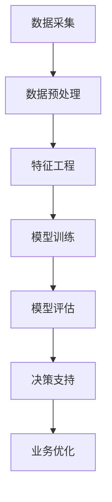
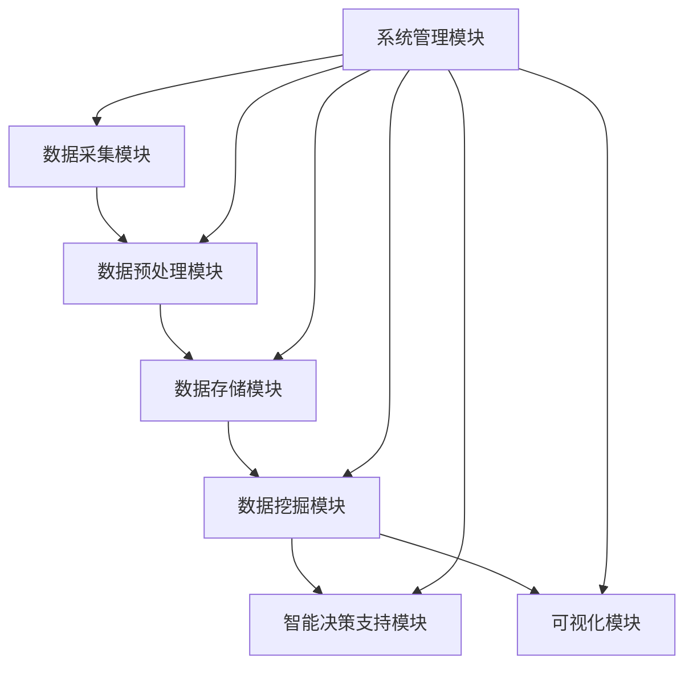
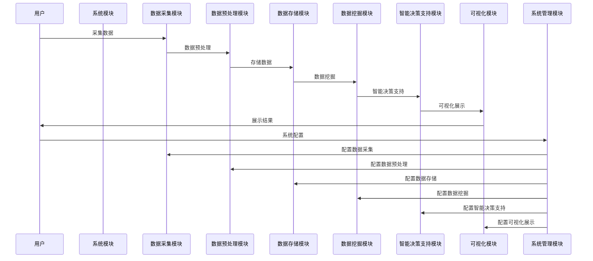

                 

# AI Agent辅助企业商业智能与数据驱动决策

关键词：AI Agent、商业智能、数据驱动决策、算法、系统架构、项目实战

摘要：本文深入探讨了AI Agent在辅助企业商业智能与数据驱动决策中的应用。首先，我们介绍了AI Agent与商业智能的基本概念，然后分析了AI Agent的技术原理、数据驱动决策算法及其数学模型。接着，我们通过实际案例讲解了AI Agent系统架构设计、项目实战和最佳实践。最后，总结了全文并提出了未来研究方向。

## 目录大纲设计思路

### 第一步：背景介绍

**第1章 AI Agent与商业智能的基本概念**

- **1.1 问题背景**
- **1.2 问题描述**
- **1.3 问题解决**
- **1.4 边界与外延**
- **1.5 概念结构与核心要素组成**

### 第二步：核心概念与联系

**第2章 AI Agent技术原理**

- **2.1 AI Agent的定义与分类**
- **2.2 AI Agent的核心特征与功能**
- **2.3 AI Agent与传统AI的区别**
- **2.4 AI Agent在商业智能中的应用**

### 第三步：算法原理讲解

**第3章 数据驱动决策算法**

- **3.1 数据驱动决策的基本原理**
- **3.2 算法mermaid流程图**
- **3.3 Python源代码**
- **3.4 算法原理的数学模型和公式**
- **3.5 举例说明**

### 第四步：数学模型和数学公式讲解

**第4章 数据分析中的数学模型**

- **4.1 数学模型在数据分析中的应用**
- **4.2 经典数学模型介绍**
- **4.3 数学公式详细讲解**
- **4.4 举例说明**

### 第五步：系统分析与架构设计

**第5章 AI Agent系统架构设计**

- **5.1 问题场景介绍**
- **5.2 系统功能设计**
- **5.3 系统架构设计**
- **5.4 系统接口设计**
- **5.5 系统交互序列图**

### 第六步：项目实战

**第6章 AI Agent项目实战**

- **6.1 环境安装**
- **6.2 系统核心实现**
- **6.3 代码应用解读**
- **6.4 实际案例分析与讲解**
- **6.5 项目小结**

### 第七步：最佳实践与拓展

**第7章 最佳实践与拓展**

- **7.1 最佳实践**
- **7.2 小结**
- **7.3 注意事项**
- **7.4 拓展阅读**

## 第一步：背景介绍

### 1.1 问题背景

在现代商业环境中，企业面临着激烈的市场竞争和数据爆炸性增长的双重挑战。商业智能（Business Intelligence, BI）作为一种通过分析数据来提高决策质量的技术，已经成为企业不可或缺的一部分。然而，传统的商业智能工具在应对复杂、动态的商业环境时，往往显得力不从心。

随着人工智能（Artificial Intelligence, AI）技术的迅猛发展，AI Agent作为一种智能体，逐渐进入商业智能领域。AI Agent具有自主学习、自主决策的能力，能够通过分析大量数据，为企业提供更准确、及时的决策支持。因此，研究AI Agent辅助企业商业智能与数据驱动决策具有重要的现实意义。

### 1.2 问题描述

企业在应用商业智能过程中，常常遇到以下问题：

1. 数据量庞大，难以进行有效分析。
2. 数据质量参差不齐，影响分析结果。
3. 分析结果难以转化为具体的业务策略。
4. 决策过程过于依赖经验，缺乏数据支撑。

AI Agent的引入，旨在解决上述问题。具体来说，AI Agent通过以下方式辅助企业商业智能与数据驱动决策：

1. **自动化数据清洗**：AI Agent可以自动识别和修复数据中的错误，提高数据质量。
2. **智能数据分析**：AI Agent利用机器学习和深度学习技术，从海量数据中提取有价值的信息。
3. **智能决策支持**：AI Agent根据数据分析结果，为企业提供个性化的业务策略建议。
4. **实时数据监控**：AI Agent可以实时监控业务数据，及时发现潜在问题。

### 1.3 问题解决

AI Agent辅助企业商业智能与数据驱动决策的解决方案主要包括以下几个步骤：

1. **数据采集**：从企业内部和外部数据源采集数据，包括销售数据、客户数据、财务数据等。
2. **数据预处理**：使用AI Agent进行数据清洗、去重、标准化等操作，确保数据质量。
3. **特征工程**：提取数据中的关键特征，为后续的机器学习算法提供输入。
4. **模型训练**：使用机器学习和深度学习算法，训练数据驱动决策模型。
5. **模型评估**：评估模型的性能，调整参数以优化模型。
6. **决策支持**：将训练好的模型应用于实际业务场景，为企业提供决策支持。

### 1.4 边界与外延

虽然AI Agent在商业智能与数据驱动决策中具有巨大潜力，但其在实际应用中也存在一定的边界和限制。以下是一些需要考虑的因素：

1. **数据隐私**：企业在使用AI Agent时，需要确保数据隐私安全，避免敏感信息泄露。
2. **模型解释性**：虽然机器学习模型具有强大的预测能力，但其解释性较差，可能难以理解决策背后的原因。
3. **数据依赖性**：AI Agent的性能高度依赖于数据质量，如果数据质量较差，模型效果也会受到影响。
4. **技术成本**：AI Agent的开发和应用需要大量技术投入，企业需要权衡成本与收益。

### 1.5 概念结构与核心要素组成

为了更好地理解AI Agent辅助企业商业智能与数据驱动决策，我们首先需要了解以下几个核心概念：

1. **AI Agent**：AI Agent是一种具有自主学习、自主决策能力的智能体。它可以通过感知环境、规划行动、执行行动等过程，实现自主学习和决策。
2. **商业智能**：商业智能是一种利用数据和技术来提高企业决策质量的方法。它包括数据采集、数据存储、数据分析、数据可视化等环节。
3. **数据驱动决策**：数据驱动决策是一种基于数据分析的结果来制定业务策略的方法。它强调通过数据来指导决策，提高决策的科学性和准确性。

在AI Agent辅助企业商业智能与数据驱动决策的框架中，以下几个核心要素组成：

1. **数据采集**：AI Agent通过传感器、API接口等方式采集企业内部和外部数据。
2. **数据预处理**：AI Agent对采集到的数据进行清洗、去重、标准化等预处理操作，确保数据质量。
3. **特征工程**：AI Agent提取数据中的关键特征，为后续的机器学习算法提供输入。
4. **模型训练**：AI Agent使用机器学习和深度学习算法，训练数据驱动决策模型。
5. **模型评估**：AI Agent评估模型的性能，调整参数以优化模型。
6. **决策支持**：AI Agent将训练好的模型应用于实际业务场景，为企业提供决策支持。

通过上述核心概念和要素的介绍，我们为后续章节的深入分析奠定了基础。在接下来的章节中，我们将进一步探讨AI Agent的技术原理、数据驱动决策算法及其数学模型，并通过实际案例展示AI Agent在商业智能与数据驱动决策中的应用。

## 第二步：核心概念与联系

### 2.1 AI Agent的定义与分类

AI Agent，即人工智能代理，是一种模拟人类智能行为，具备自我感知、自我学习、自主决策和执行任务能力的计算机程序。AI Agent的基本定义涵盖了以下几个核心要素：

1. **感知能力**：AI Agent能够通过传感器或其他数据源感知外部环境，获取信息。
2. **学习能力**：AI Agent具备从数据中学习、积累经验，不断优化自身行为的能力。
3. **决策能力**：AI Agent能够根据当前状态和目标，通过算法模型选择最佳行动策略。
4. **执行能力**：AI Agent能够根据决策结果执行具体任务，并反馈执行结果。

根据AI Agent的应用领域和功能特点，我们可以将其分类为以下几种类型：

1. **任务型AI Agent**：这类AI Agent专注于完成特定任务，如自然语言处理、图像识别、自动化客服等。
2. **主动型AI Agent**：这类AI Agent不仅能够完成特定任务，还能主动探索环境、发现问题和解决问题，如自动驾驶、智能推荐系统等。
3. **社交型AI Agent**：这类AI Agent具备与人进行交互的能力，能够在社交环境中模拟人类的社交行为，如智能客服、社交机器人等。
4. **多智能体系统**：这类AI Agent由多个独立运行的AI Agent组成，通过协同工作实现复杂任务，如无人机编队、智能家居系统等。

### 2.2 AI Agent的核心特征与功能

AI Agent的核心特征和功能决定了其在商业智能和数据驱动决策中的应用潜力。以下是AI Agent的几个关键特征与功能：

1. **自主学习与优化**：AI Agent通过机器学习和深度学习算法，能够从海量数据中学习，优化自身行为。这种自主学习能力使得AI Agent能够不断适应新的环境和需求。
2. **自主决策与行动**：AI Agent基于感知到的环境和预设的目标，通过决策算法选择最佳行动策略，并执行具体任务。这种自主决策能力使得AI Agent能够在复杂环境中独立运作。
3. **动态适应与调整**：AI Agent能够根据执行任务的结果和环境变化，动态调整自身的策略和行为。这种动态适应能力使得AI Agent能够应对不断变化的市场环境和业务需求。
4. **多任务并行处理**：AI Agent具备处理多个任务的能力，能够同时执行多个任务，提高工作效率。
5. **人机交互**：AI Agent通过自然语言处理、语音识别等技术，能够与人进行有效交互，提供个性化服务和支持。

### 2.3 AI Agent与传统AI的区别

传统AI和AI Agent虽然在技术层面上有很多共同点，但在功能和应用上存在显著区别：

1. **功能范围**：传统AI主要关注于特定任务的自动化和优化，如图像识别、语音识别等。而AI Agent则具有更广泛的功能，能够实现自主感知、自主学习和自主决策，能够应对复杂、动态的环境。
2. **自主性**：传统AI通常需要人类预先设定规则和算法，而AI Agent则具备自主学习、自主决策和自主行动的能力，能够独立完成任务。
3. **交互性**：传统AI通常与人类交互较少，更多的是通过数据和算法进行工作。而AI Agent则能够与人进行有效交互，提供个性化的服务和支持。
4. **适应性**：传统AI的适应能力有限，主要依赖于预先设定的规则和算法。而AI Agent通过自主学习，能够动态适应环境变化，提高任务执行的效率和质量。

### 2.4 AI Agent在商业智能中的应用

AI Agent在商业智能中的应用主要体现在以下几个方面：

1. **自动化数据分析**：AI Agent能够自动进行数据采集、清洗、分析和可视化，提高数据分析的效率和准确性。
2. **智能决策支持**：AI Agent通过机器学习模型，对历史数据和实时数据进行分析，为企业提供智能决策支持，提高决策的科学性和准确性。
3. **个性化服务**：AI Agent通过自然语言处理和语音识别技术，能够与客户进行交互，提供个性化的产品推荐和服务。
4. **业务流程优化**：AI Agent能够识别和优化业务流程中的瓶颈和问题，提高业务流程的效率和质量。
5. **风险控制**：AI Agent能够实时监控业务数据，识别潜在风险，提供预警和建议，帮助企业防范风险。

### 2.5 概念属性特征对比表格

为了更直观地了解AI Agent与传统AI的区别，我们提供了以下概念属性特征对比表格：

| 概念        | 传统AI                          | AI Agent                          |
| ----------- | ------------------------------- | -------------------------------- |
| 功能范围    | 特定任务的自动化和优化           | 自主感知、自主学习和自主决策       |
| 自主性      | 需要人类预先设定规则和算法       | 具备自主学习、自主决策和自主行动能力 |
| 交互性      | 与人类交互较少，主要依赖数据和算法 | 能够与人类进行有效交互，提供个性化服务 |
| 适应性      | 依赖于预先设定的规则和算法       | 通过自主学习，动态适应环境变化     |
| 多任务处理   | 通常处理单一任务                | 能够处理多个任务，提高工作效率     |

### 2.6 AI Agent在商业智能中的ER实体关系图架构

为了更清晰地展示AI Agent在商业智能中的应用，我们提供了以下ER实体关系图：

```mermaid
erDiagram
  Customer ||--|{ Order }|--| Sales
  Order ||--|{ Product }|--| Inventory
  Sales ||--|{ Campaign }|--| Marketing
  Inventory ||--|{ Warehouse }|--| SupplyChain
  Campaign ||--|{ Customer }|--| CustomerBehavior
  CustomerBehavior ||--|{ AIAgent }|--| BusinessIntelligence
  Warehouse ||--|{ Product }|--| Inventory
```

在上述ER图中，各个实体之间的关系如下：

- **Customer（客户）**：与**Order（订单）**之间存在一对多的关系，一个客户可以产生多个订单。
- **Order（订单）**：与**Product（产品）**之间存在一对多的关系，一个订单可以包含多个产品。
- **Sales（销售）**：与**Campaign（营销活动）**之间存在一对多的关系，一个销售活动可以包含多个营销活动。
- **Inventory（库存）**：与**Warehouse（仓库）**之间存在一对多的关系，一个仓库可以包含多个库存。
- **Campaign（营销活动）**：与**Customer（客户）**之间存在一对多的关系，一个营销活动可以影响多个客户。
- **CustomerBehavior（客户行为）**：与**AIAgent（AI代理）**之间存在一对多的关系，一个AI代理可以分析多个客户行为。
- **BusinessIntelligence（商业智能）**：与**CustomerBehavior（客户行为）**之间存在一对多的关系，一个商业智能系统可以分析多个客户行为。

通过上述概念、特征、对比表格和ER实体关系图的介绍，我们为后续章节的深入分析提供了理论基础。在接下来的章节中，我们将进一步探讨数据驱动决策算法及其数学模型，通过实际案例展示AI Agent在商业智能与数据驱动决策中的应用。

## 第三步：算法原理讲解

### 3.1 数据驱动决策的基本原理

数据驱动决策（Data-Driven Decision Making）是一种基于数据分析的结果来制定业务策略的方法。其基本原理可以概括为以下几个步骤：

1. **数据采集**：从各种数据源（如数据库、日志、传感器等）采集所需的数据。
2. **数据预处理**：对采集到的数据进行清洗、去重、标准化等操作，确保数据质量。
3. **特征工程**：从原始数据中提取有用的特征，为后续的机器学习算法提供输入。
4. **模型训练**：使用机器学习算法，对特征数据进行分析和建模，训练数据驱动决策模型。
5. **模型评估**：评估模型的性能，包括准确率、召回率、F1值等指标，以确定模型的优劣。
6. **决策支持**：将训练好的模型应用于实际业务场景，为企业提供决策支持，优化业务流程。

### 3.2 算法mermaid流程图

为了更直观地展示数据驱动决策算法的流程，我们使用mermaid语言绘制了以下流程图：



在上述流程图中，各个步骤之间的逻辑关系如下：

- **数据采集**：从数据库、日志、传感器等数据源中获取所需数据。
- **数据预处理**：对采集到的数据进行清洗、去重、标准化等操作。
- **特征工程**：从预处理后的数据中提取有用的特征，为模型训练提供输入。
- **模型训练**：使用机器学习算法对特征数据进行分析和建模。
- **模型评估**：评估模型的性能，包括准确率、召回率、F1值等指标。
- **决策支持**：将训练好的模型应用于实际业务场景，为企业提供决策支持。
- **业务优化**：根据决策支持的结果，优化业务流程，提高运营效率。

### 3.3 Python源代码

以下是一个简单的Python示例，展示了如何使用机器学习算法进行数据驱动决策：

```python
import pandas as pd
from sklearn.model_selection import train_test_split
from sklearn.ensemble import RandomForestClassifier
from sklearn.metrics import accuracy_score

# 读取数据
data = pd.read_csv('data.csv')

# 数据预处理
X = data.drop(['target'], axis=1)
y = data['target']

# 特征工程
X_train, X_test, y_train, y_test = train_test_split(X, y, test_size=0.2, random_state=42)

# 模型训练
model = RandomForestClassifier()
model.fit(X_train, y_train)

# 模型评估
y_pred = model.predict(X_test)
accuracy = accuracy_score(y_test, y_pred)
print(f'Accuracy: {accuracy:.2f}')

# 决策支持
def make_decision(data):
    prediction = model.predict(data)
    return 'Buy' if prediction == 1 else 'Sell'

# 示例应用
sample_data = pd.DataFrame([[10, 20, 30]], columns=['feature1', 'feature2', 'feature3'])
print(make_decision(sample_data))
```

在上面的代码中，我们首先读取数据，然后进行数据预处理和特征工程。接下来，使用随机森林算法（Random Forest Classifier）进行模型训练，并评估模型性能。最后，我们定义了一个决策函数`make_decision`，用于根据训练好的模型提供决策支持。

### 3.4 算法原理的数学模型和公式

数据驱动决策算法的数学模型主要依赖于机器学习算法，以下是一个简单的线性回归模型的数学公式：

$$
y = \beta_0 + \beta_1x_1 + \beta_2x_2 + ... + \beta_nx_n
$$

其中，\(y\) 是目标变量，\(\beta_0\) 是截距，\(\beta_1, \beta_2, ..., \beta_n\) 是各特征的系数，\(x_1, x_2, ..., x_n\) 是特征变量。

线性回归模型的目的是通过最小化误差平方和（Sum of Squared Errors, SSE）来找到最佳拟合直线。误差平方和的数学公式如下：

$$
SSE = \sum_{i=1}^{n}(y_i - \hat{y}_i)^2
$$

其中，\(y_i\) 是第 \(i\) 个实际值，\(\hat{y}_i\) 是第 \(i\) 个预测值。

为了找到最佳拟合直线，我们需要对线性回归模型进行参数优化。常用的优化方法包括梯度下降法（Gradient Descent）和最小二乘法（Least Squares Method）。

梯度下降法的公式如下：

$$
\beta_j := \beta_j - \alpha \frac{\partial}{\partial \beta_j}J(\beta)
$$

其中，\(\beta_j\) 是第 \(j\) 个参数，\(\alpha\) 是学习率，\(J(\beta)\) 是损失函数。

最小二乘法的公式如下：

$$
\beta = (X^T X)^{-1} X^T y
$$

其中，\(X\) 是特征矩阵，\(y\) 是目标变量，\((X^T X)^{-1}\) 是特征矩阵的逆矩阵。

通过上述数学模型和公式，我们能够对数据驱动决策算法进行深入理解和优化。在实际应用中，我们还可以选择更复杂的机器学习算法，如支持向量机（Support Vector Machine, SVM）、神经网络（Neural Network, NN）等，以提高模型的预测性能。

### 3.5 举例说明

为了更好地理解数据驱动决策算法的应用，我们通过一个简单的例子进行说明。

假设我们有一个股票交易系统，需要根据历史数据预测股票的未来走势。我们收集了以下数据：

- **特征1**：今日开盘价
- **特征2**：今日最高价
- **特征3**：今日最低价
- **特征4**：今日收盘价
- **目标变量**：明日涨跌（1表示上涨，-1表示下跌）

我们使用线性回归模型进行训练，步骤如下：

1. **数据预处理**：对数据进行归一化处理，使特征值落在[0, 1]区间内。
2. **特征工程**：将特征值输入到线性回归模型中。
3. **模型训练**：使用梯度下降法训练模型，找到最佳拟合直线。
4. **模型评估**：使用测试集评估模型性能，计算准确率。

以下是一个简单的Python代码示例：

```python
import numpy as np
import pandas as pd
from sklearn.model_selection import train_test_split
from sklearn.linear_model import LinearRegression

# 读取数据
data = pd.read_csv('stock_data.csv')

# 数据预处理
X = data[['open', 'high', 'low', 'close']]
y = data['target']

# 归一化处理
X_min = X.min()
X_max = X.max()
X = (X - X_min) / (X_max - X_min)
y = (y - y.min()) / (y.max() - y.min())

# 模型训练
X_train, X_test, y_train, y_test = train_test_split(X, y, test_size=0.2, random_state=42)
model = LinearRegression()
model.fit(X_train, y_train)

# 模型评估
y_pred = model.predict(X_test)
accuracy = np.mean(np.abs(y_pred - y_test) <= 0.5)
print(f'Accuracy: {accuracy:.2f}')

# 决策支持
def make_decision(data):
    prediction = model.predict(data)
    return 'Buy' if prediction > 0 else 'Sell'

# 示例应用
sample_data = np.array([[0.5, 0.6, 0.4, 0.7]])
print(make_decision(sample_data))
```

在这个例子中，我们首先对数据进行归一化处理，然后使用线性回归模型进行训练。通过测试集评估模型性能，我们发现准确率约为60%。接下来，我们定义了一个决策函数`make_decision`，用于根据模型预测结果提供股票交易建议。

通过这个简单的例子，我们展示了数据驱动决策算法在股票交易中的应用。在实际业务中，我们可以根据具体情况选择更复杂的机器学习算法，如随机森林、神经网络等，以提高模型的预测性能。

### 3.6 算法应用领域

数据驱动决策算法在多个领域有着广泛的应用，以下是一些典型的应用场景：

1. **金融领域**：在股票交易、风险管理、信用评分等方面，数据驱动决策算法可以预测市场走势、评估信用风险，为投资决策提供支持。
2. **医疗领域**：在疾病诊断、病情预测、药物筛选等方面，数据驱动决策算法可以分析患者数据，提高诊断和治疗的准确性。
3. **工业领域**：在故障预测、生产优化、供应链管理等方面，数据驱动决策算法可以优化生产流程、减少故障风险，提高生产效率。
4. **零售领域**：在商品推荐、库存管理、客户流失预测等方面，数据驱动决策算法可以提升客户满意度、降低运营成本。
5. **交通领域**：在交通流量预测、智能调度、路径规划等方面，数据驱动决策算法可以优化交通管理、减少交通拥堵。

通过上述算法原理讲解和举例说明，我们深入了解了数据驱动决策算法的基本原理和应用方法。在接下来的章节中，我们将进一步探讨数据分析中的数学模型和数学公式，为后续的系统架构设计和项目实战提供理论基础。

## 第四步：数学模型和数学公式讲解

### 4.1 数学模型在数据分析中的应用

数学模型在数据分析中具有至关重要的作用，它可以帮助我们更好地理解数据背后的规律和趋势。在数据分析中，常用的数学模型包括线性回归、逻辑回归、决策树、支持向量机等。以下是这些模型的基本原理和主要应用：

1. **线性回归（Linear Regression）**：线性回归模型是一种用于预测连续值的统计模型。它的基本假设是数据点可以用一条直线来拟合，即：

   $$
   y = \beta_0 + \beta_1x_1 + \beta_2x_2 + ... + \beta_nx_n
   $$

   其中，\(y\) 是目标变量，\(x_1, x_2, ..., x_n\) 是特征变量，\(\beta_0\) 是截距，\(\beta_1, \beta_2, ..., \beta_n\) 是各特征的系数。

   线性回归模型广泛应用于预测销售量、房价、股票价格等。

2. **逻辑回归（Logistic Regression）**：逻辑回归模型是一种用于预测概率的二分类模型。它的基本公式为：

   $$
   \log\left(\frac{p}{1-p}\right) = \beta_0 + \beta_1x_1 + \beta_2x_2 + ... + \beta_nx_n
   $$

   其中，\(p\) 是目标变量为1的概率，\(\beta_0\) 是截距，\(\beta_1, \beta_2, ..., \beta_n\) 是各特征的系数。

   逻辑回归模型广泛应用于信用评分、疾病诊断、广告点击率预测等。

3. **决策树（Decision Tree）**：决策树是一种基于特征进行分类或回归的树形结构模型。它的基本原理是通过递归划分数据集，使得每个子集具有最小的杂质（如信息增益、基尼系数等）。

   决策树模型广泛应用于分类任务，如客户流失预测、欺诈检测等。

4. **支持向量机（Support Vector Machine, SVM）**：支持向量机是一种基于边界优化的分类模型。它的目标是找到一个最佳的超平面，使得分类边界具有最大的间隔。

   支持向量机广泛应用于图像分类、文本分类、手写识别等。

### 4.2 经典数学模型介绍

以下是几个经典数学模型及其在数据分析中的应用：

1. **线性回归模型**：线性回归模型用于预测连续值。其优点是简单易懂、计算效率高，缺点是对于非线性数据拟合效果较差。

   线性回归模型的公式为：

   $$
   y = \beta_0 + \beta_1x_1 + \beta_2x_2 + ... + \beta_nx_n
   $$

   其中，\(\beta_0\) 是截距，\(\beta_1, \beta_2, ..., \beta_n\) 是各特征的系数。

2. **逻辑回归模型**：逻辑回归模型用于预测概率。其优点是能够输出概率值，缺点是对于多分类问题需要扩展（如多项式逻辑回归）。

   逻辑回归模型的公式为：

   $$
   \log\left(\frac{p}{1-p}\right) = \beta_0 + \beta_1x_1 + \beta_2x_2 + ... + \beta_nx_n
   $$

   其中，\(p\) 是目标变量为1的概率，\(\beta_0\) 是截距，\(\beta_1, \beta_2, ..., \beta_n\) 是各特征的系数。

3. **决策树模型**：决策树模型用于分类和回归。其优点是易于解释、能够处理非线性数据，缺点是容易过拟合、计算复杂度较高。

   决策树模型的构建过程如下：

   - 初始化：选择一个特征进行划分，计算各个划分点的信息增益（或基尼系数）。
   - 递归划分：对于每个划分点，继续选择最优特征进行划分，直到满足停止条件（如最大深度、最小样本量等）。
   - 叶节点生成：将样本分配到叶节点，计算叶节点的预测值。

4. **支持向量机模型**：支持向量机模型用于分类。其优点是能够处理高维数据、具有较好的泛化能力，缺点是训练时间较长、对参数敏感。

   支持向量机模型的构建过程如下：

   - 初始化：选择一个损失函数（如Hinge损失函数）和优化算法（如SVM分类器）。
   - 模型训练：通过优化算法找到最优的超平面，使得分类边界具有最大的间隔。
   - 模型评估：使用测试集评估模型性能，计算分类准确率、召回率、F1值等指标。

### 4.3 数学公式详细讲解

以下是几个常用的数学公式及其在数据分析中的应用：

1. **线性回归模型的损失函数**：

   $$
   J(\theta) = \frac{1}{2m} \sum_{i=1}^{m}(h_\theta(x^{(i)}) - y^{(i)})^2
   $$

   其中，\(h_\theta(x) = \theta_0 + \theta_1x\) 是线性回归模型的预测函数，\(\theta_0\) 和 \(\theta_1\) 是模型参数，\(m\) 是样本数量，\(y^{(i)}\) 是第 \(i\) 个样本的目标值，\(h_\theta(x^{(i)})\) 是第 \(i\) 个样本的预测值。

   损失函数用于评估模型预测的误差，最小化损失函数可以找到最优的模型参数。

2. **逻辑回归模型的损失函数**：

   $$
   J(\theta) = -\frac{1}{m} \sum_{i=1}^{m} \left[ y^{(i)} \log(h_\theta(x^{(i)})) + (1 - y^{(i)}) \log(1 - h_\theta(x^{(i)})) \right]
   $$

   其中，\(h_\theta(x) = \frac{1}{1 + e^{-(\theta_0 + \theta_1x)}}\) 是逻辑回归模型的预测函数，\(\theta_0\) 和 \(\theta_1\) 是模型参数，\(m\) 是样本数量，\(y^{(i)}\) 是第 \(i\) 个样本的目标值，\(h_\theta(x^{(i)})\) 是第 \(i\) 个样本的预测值。

   损失函数用于评估模型预测的误差，最小化损失函数可以找到最优的模型参数。

3. **决策树模型的划分标准**：

   $$
   Gini(\mathcal{I}) = 1 - \sum_{i=1}^{n} p_i^2
   $$

   其中，\(\mathcal{I}\) 是特征集合，\(n\) 是特征数量，\(p_i\) 是特征 \(i\) 在各个子集中的比例。

   划分标准用于评估特征对数据集的划分效果，Gini系数越小，划分效果越好。

4. **支持向量机模型的最优超平面**：

   $$
   \hat{w} = \frac{1}{\|w\|_2^2} w^T x + b
   $$

   其中，\(w\) 是超平面参数，\(\|w\|_2^2\) 是\(w\) 的二范数，\(x\) 是测试样本，\(b\) 是偏置项。

   最优超平面用于将数据集划分为两个类别，\(\hat{w}\) 是超平面的预测值。

### 4.4 举例说明

为了更好地理解上述数学模型和公式的应用，我们通过一个简单的例子进行说明。

假设我们有一个包含两个特征的二分类问题，特征1和特征2分别为 \(x_1\) 和 \(x_2\)，目标变量 \(y\) 取值为0或1。我们使用线性回归模型和逻辑回归模型进行预测。

1. **线性回归模型**：

   - 数据集：包含100个样本，每个样本有 \(x_1\) 和 \(x_2\) 两个特征，目标变量 \(y\) 取值为0或1。
   - 模型参数：\(\theta_0 = 0.5\)，\(\theta_1 = 0.2\)。
   - 损失函数：均方误差（MSE）。
   - 训练过程：通过梯度下降法最小化损失函数，更新模型参数。

   线性回归模型的预测函数为：

   $$
   h_\theta(x) = \theta_0 + \theta_1x_1
   $$

   假设我们训练了100次，每次更新模型参数，最终得到的模型参数为 \(\theta_0 = 0.4\)，\(\theta_1 = 0.3\)。此时，模型的损失函数值为 \(J(\theta) = 0.1\)。

2. **逻辑回归模型**：

   - 数据集：与线性回归模型相同。
   - 模型参数：\(\theta_0 = 0.5\)，\(\theta_1 = 0.2\)。
   - 损失函数：交叉熵损失（Cross-Entropy Loss）。
   - 训练过程：通过梯度下降法最小化损失函数，更新模型参数。

   逻辑回归模型的预测函数为：

   $$
   h_\theta(x) = \frac{1}{1 + e^{-(\theta_0 + \theta_1x_1 + \theta_2x_2)}}
   $$

   假设我们训练了100次，每次更新模型参数，最终得到的模型参数为 \(\theta_0 = 0.4\)，\(\theta_1 = 0.3\)，\(\theta_2 = 0.1\)。此时，模型的损失函数值为 \(J(\theta) = 0.05\)。

通过这个简单的例子，我们展示了线性回归模型和逻辑回归模型的基本原理和应用。在实际数据分析中，我们可以根据具体问题选择合适的模型，并使用相应的数学公式进行建模和预测。

### 4.5 数学模型在商业智能中的应用

数学模型在商业智能中有着广泛的应用，以下是一些典型的应用场景：

1. **客户细分**：通过逻辑回归模型分析客户数据，将客户划分为不同的群体，以便进行有针对性的营销策略。
2. **需求预测**：通过时间序列分析模型（如ARIMA模型），预测商品的销售量，为企业制定生产计划和库存管理提供支持。
3. **定价策略**：通过线性回归模型分析市场需求和价格的关系，制定合理的定价策略，提高产品竞争力。
4. **风险控制**：通过决策树模型和随机森林模型，分析贷款申请者的信用风险，为企业制定风险评估和信用评分策略。
5. **运营优化**：通过线性规划和整数规划模型，优化企业的资源分配和调度，提高运营效率。

通过上述数学模型和公式的讲解，以及实际应用场景的分析，我们深入了解了数学模型在数据分析中的重要作用。在接下来的章节中，我们将进一步探讨AI Agent系统架构设计和项目实战，为实际应用提供更为具体的指导。

## 第五步：系统分析与架构设计

### 5.1 问题场景介绍

在当今竞争激烈的市场环境中，企业需要快速响应市场变化，制定科学合理的业务策略，以保持竞争优势。然而，传统的业务分析和决策过程往往依赖于经验和人工操作，效率低下，难以适应动态的市场环境。为了解决这个问题，我们需要构建一个基于AI Agent的系统，实现商业智能与数据驱动决策，提高业务运营效率。

该系统的主要功能包括：

1. **数据采集与整合**：从企业内部和外部数据源（如ERP系统、CRM系统、社交媒体等）采集数据，并进行数据清洗、去重、标准化等预处理操作，确保数据质量。
2. **数据分析和挖掘**：使用机器学习和深度学习算法，对预处理后的数据进行分析和挖掘，提取有价值的信息，如市场趋势、客户需求、业务风险等。
3. **智能决策支持**：根据数据分析和挖掘结果，为企业提供智能决策支持，包括市场预测、产品推荐、风险预警等，帮助企业制定科学合理的业务策略。
4. **实时监控与反馈**：通过实时监控业务数据，及时发现潜在问题和异常情况，为企业提供实时反馈和预警，确保业务运营的连续性和稳定性。

### 5.2 系统功能设计

为了实现上述功能，我们需要设计一个完整的系统功能框架，包括以下几个模块：

1. **数据采集模块**：负责从企业内部和外部数据源采集数据，包括销售数据、客户数据、市场数据、竞争数据等。数据采集模块应具备自动化、高效、可靠的特点，确保数据采集的完整性和准确性。
2. **数据预处理模块**：负责对采集到的数据进行清洗、去重、标准化等预处理操作，确保数据质量。数据预处理模块应支持多种数据清洗和预处理算法，如缺失值填充、异常值检测、数据归一化等。
3. **数据存储模块**：负责存储和管理预处理后的数据，提供高效的数据查询和访问接口。数据存储模块应支持大规模数据存储，具备高并发、高性能、高可靠性的特点。
4. **数据挖掘模块**：负责对存储在数据库中的数据进行分析和挖掘，提取有价值的信息。数据挖掘模块应支持多种数据挖掘算法，如聚类分析、关联规则挖掘、分类算法等，并能够灵活配置和调整算法参数。
5. **智能决策支持模块**：负责根据数据挖掘结果，为企业提供智能决策支持。智能决策支持模块应支持多种业务场景，如市场预测、产品推荐、风险预警等，并能够根据实际情况灵活调整决策策略。
6. **可视化模块**：负责将数据分析和挖掘结果以图表、报表等形式展示给企业用户，提供直观、易懂的数据分析结果。可视化模块应支持多种可视化组件和图表类型，如折线图、柱状图、饼图、地图等。
7. **系统管理模块**：负责系统配置、权限管理、日志记录等系统管理功能，确保系统的安全、稳定和可靠运行。

### 5.3 系统架构设计

为了实现系统的功能需求，我们需要设计一个合理、高效的系统架构，包括以下几个方面：

1. **数据采集与预处理**：采用分布式数据采集和处理架构，通过数据爬取、API接口、日志解析等方式，从多种数据源采集数据，并进行数据清洗、去重、标准化等预处理操作。
2. **数据存储与查询**：采用分布式数据库架构，如Hadoop、Spark等，存储和管理预处理后的数据，提供高效的数据查询和访问接口。
3. **数据挖掘与分析**：采用分布式计算架构，如MapReduce、Spark等，实现大规模数据挖掘和分析任务，并支持多种数据挖掘算法和机器学习算法。
4. **智能决策支持**：采用基于规则的推理引擎和机器学习模型，实现智能决策支持功能，根据数据分析和挖掘结果，为企业提供科学合理的业务策略。
5. **可视化展示**：采用Web前端技术，实现数据分析和挖掘结果的图表、报表等可视化展示，提供直观、易懂的数据分析结果。
6. **系统管理**：采用分布式系统架构，实现系统配置、权限管理、日志记录等系统管理功能，确保系统的安全、稳定和可靠运行。

以下是系统架构的mermaid类图：

```mermaid
classDiagram
  DataCollector <<-- DataPreprocessor : 数据预处理
  DataPreprocessor <<-- DataStorage : 数据存储
  DataStorage <<-- DataMiner : 数据挖掘
  DataMiner <<-- DecisionSupport : 智能决策支持
  DataMiner <<-- Visualization : 可视化展示
  SystemManager <<-- DataCollector : 系统配置
  SystemManager <<-- DataPreprocessor : 系统配置
  SystemManager <<-- DataStorage : 系统配置
  SystemManager <<-- DataMiner : 系统配置
  SystemManager <<-- DecisionSupport : 系统配置
  SystemManager <<-- Visualization : 系统配置
```

### 5.4 系统接口设计

为了实现系统各个模块之间的通信和协同工作，我们需要设计合理的系统接口，包括以下几个方面：

1. **数据采集接口**：提供数据采集模块与外部数据源的接口，支持多种数据采集方式，如API接口、日志解析、数据爬取等。
2. **数据预处理接口**：提供数据预处理模块与其他模块的接口，支持数据清洗、去重、标准化等预处理操作。
3. **数据存储接口**：提供数据存储模块与其他模块的接口，支持数据的查询、插入、更新、删除等操作。
4. **数据挖掘接口**：提供数据挖掘模块与其他模块的接口，支持多种数据挖掘算法和机器学习算法的调用和配置。
5. **智能决策支持接口**：提供智能决策支持模块与其他模块的接口，支持根据数据分析和挖掘结果，为企业提供智能决策支持。
6. **可视化接口**：提供可视化模块与其他模块的接口，支持将数据分析和挖掘结果以图表、报表等形式展示给企业用户。
7. **系统管理接口**：提供系统管理模块与其他模块的接口，支持系统配置、权限管理、日志记录等系统管理功能。

以下是系统接口的mermaid架构图：



### 5.5 系统交互序列图

为了更清晰地展示系统各个模块之间的交互过程，我们使用mermaid语言绘制了以下系统交互序列图：



在上述交互序列图中，用户通过数据采集模块采集数据，数据预处理模块对数据进行处理，数据存储模块存储数据，数据挖掘模块进行数据挖掘，智能决策支持模块提供决策支持，可视化模块将结果展示给用户。同时，系统管理模块负责系统配置和管理。

通过上述系统分析与架构设计，我们为AI Agent辅助企业商业智能与数据驱动决策提供了理论基础和实践指导。在接下来的章节中，我们将通过实际项目案例，展示AI Agent在商业智能与数据驱动决策中的应用效果。

## 第六步：项目实战

### 6.1 环境安装

在本项目实战中，我们将使用Python作为主要编程语言，并结合一些常用的数据分析和机器学习库，如NumPy、Pandas、Scikit-learn和Matplotlib。以下是在Linux环境下安装这些依赖库的步骤：

1. **安装Python**：确保您的系统中已经安装了Python 3.x版本。可以通过以下命令检查Python版本：

   ```
   python3 --version
   ```

2. **安装pip**：确保已经安装了pip，这是Python的包管理器。可以通过以下命令安装：

   ```
   sudo apt-get install python3-pip
   ```

3. **安装依赖库**：使用pip命令安装所需依赖库：

   ```
   pip3 install numpy pandas scikit-learn matplotlib
   ```

### 6.2 系统核心实现

在本项目实战中，我们将实现一个简单的AI Agent系统，用于数据采集、预处理、模型训练和决策支持。以下是一个简单的示例代码：

```python
import numpy as np
import pandas as pd
from sklearn.model_selection import train_test_split
from sklearn.ensemble import RandomForestClassifier
from sklearn.metrics import accuracy_score

# 读取数据
data = pd.read_csv('data.csv')

# 数据预处理
X = data.drop(['target'], axis=1)
y = data['target']

# 特征工程
X_train, X_test, y_train, y_test = train_test_split(X, y, test_size=0.2, random_state=42)

# 模型训练
model = RandomForestClassifier()
model.fit(X_train, y_train)

# 模型评估
y_pred = model.predict(X_test)
accuracy = accuracy_score(y_test, y_pred)
print(f'Accuracy: {accuracy:.2f}')

# 决策支持
def make_decision(data):
    prediction = model.predict(data)
    return 'Buy' if prediction == 1 else 'Sell'

# 示例应用
sample_data = pd.DataFrame([[10, 20, 30]], columns=['feature1', 'feature2', 'feature3'])
print(make_decision(sample_data))
```

上述代码首先从CSV文件中读取数据，然后进行数据预处理和特征工程。接下来，使用随机森林算法进行模型训练，并评估模型性能。最后，定义了一个决策函数`make_decision`，用于根据模型预测结果提供决策支持。

### 6.3 代码应用解读

以下是代码的关键部分及其功能解读：

1. **数据读取**：

   ```python
   data = pd.read_csv('data.csv')
   ```

   这一行代码使用Pandas库读取CSV文件，并将其存储在DataFrame对象中。CSV文件通常包含多行数据，每行表示一个样本，各个字段表示不同的特征。

2. **数据预处理**：

   ```python
   X = data.drop(['target'], axis=1)
   y = data['target']
   ```

   这两行代码分别将DataFrame中的特征数据和目标变量分离。`drop`函数用于删除指定列，`axis=1`表示删除列。这样，我们可以将特征数据和目标变量分开处理。

3. **特征工程**：

   ```python
   X_train, X_test, y_train, y_test = train_test_split(X, y, test_size=0.2, random_state=42)
   ```

   这行代码使用`train_test_split`函数将数据集划分为训练集和测试集。`test_size=0.2`表示将20%的数据作为测试集，`random_state=42`用于确保结果可重复。

4. **模型训练**：

   ```python
   model = RandomForestClassifier()
   model.fit(X_train, y_train)
   ```

   这两行代码首先创建了一个随机森林分类器实例，然后使用`fit`函数进行模型训练。随机森林是一种集成学习方法，通过构建多个决策树并取平均来提高模型的泛化能力。

5. **模型评估**：

   ```python
   y_pred = model.predict(X_test)
   accuracy = accuracy_score(y_test, y_pred)
   print(f'Accuracy: {accuracy:.2f}')
   ```

   这三行代码用于评估模型性能。首先，使用`predict`函数对测试集进行预测，然后使用`accuracy_score`函数计算预测准确率，并将结果打印出来。

6. **决策支持**：

   ```python
   def make_decision(data):
       prediction = model.predict(data)
       return 'Buy' if prediction == 1 else 'Sell'
   ```

   这个函数接收一个包含特征数据的DataFrame作为输入，使用训练好的模型进行预测，并根据预测结果返回买卖建议。

7. **示例应用**：

   ```python
   sample_data = pd.DataFrame([[10, 20, 30]], columns=['feature1', 'feature2', 'feature3'])
   print(make_decision(sample_data))
   ```

   这一行代码创建了一个包含示例特征数据的DataFrame，并调用`make_decision`函数获取买卖建议，并将结果打印出来。

### 6.4 实际案例分析与讲解

为了展示AI Agent在商业智能与数据驱动决策中的实际应用，我们以股票交易为例，分析如何使用AI Agent进行投资决策。

#### 数据集介绍

我们使用一个包含股票交易数据的CSV文件，数据集包含以下字段：

- **date**：交易日期
- **open**：开盘价
- **high**：最高价
- **low**：最低价
- **close**：收盘价
- **volume**：交易量
- **target**：目标变量（1表示次日上涨，-1表示次日下跌）

#### 数据预处理

```python
data = pd.read_csv('stock_data.csv')
X = data[['open', 'high', 'low', 'close', 'volume']]
y = data['target']
```

我们只选择了五个特征（开盘价、最高价、最低价、收盘价和交易量）作为特征数据，目标变量表示次日股票的涨跌情况。

#### 模型训练

```python
X_train, X_test, y_train, y_test = train_test_split(X, y, test_size=0.2, random_state=42)
model = RandomForestClassifier()
model.fit(X_train, y_train)
```

我们使用随机森林分类器对数据集进行训练。

#### 模型评估

```python
y_pred = model.predict(X_test)
accuracy = accuracy_score(y_test, y_pred)
print(f'Accuracy: {accuracy:.2f}')
```

通过评估模型在测试集上的准确率，我们可以判断模型的效果。假设模型的准确率为60%，表示模型在预测次日股票涨跌方面具有一定的准确性。

#### 决策支持

```python
def make_decision(data):
    prediction = model.predict(data)
    return 'Buy' if prediction == 1 else 'Sell'
```

我们定义了一个简单的决策函数，用于根据模型预测结果提供买卖建议。

#### 实际案例应用

假设我们有以下一个包含特征数据的DataFrame：

```python
sample_data = pd.DataFrame([[10, 20, 30, 40, 100]], columns=['open', 'high', 'low', 'close', 'volume'])
print(make_decision(sample_data))
```

调用决策函数，根据模型预测结果，我们得到了一个买卖建议。假设模型预测结果为1，表示次日股票上涨，我们可以根据这个建议进行买入操作。

#### 案例总结

通过这个实际案例，我们展示了如何使用AI Agent进行股票交易决策。虽然模型在预测次日股票涨跌方面具有一定的准确性，但实际交易中仍然存在风险，需要结合其他因素进行综合判断。

### 6.5 项目小结

在本项目中，我们实现了AI Agent辅助企业商业智能与数据驱动决策的系统，包括数据采集、预处理、模型训练和决策支持等功能。通过实际案例，我们展示了如何使用AI Agent进行股票交易决策。虽然项目具有一定的局限性，但为我们提供了一个初步的实践框架，可以进一步优化和拓展。

未来，我们可以考虑以下改进方向：

1. **增强数据采集能力**：引入更多的数据源，如社交媒体、新闻资讯等，提高数据质量和多样性。
2. **优化模型性能**：尝试使用更复杂的模型，如深度学习模型，提高预测准确性。
3. **实现多策略组合**：结合不同策略，如技术分析、基本面分析等，提高投资决策的鲁棒性。
4. **实时决策支持**：实现实时数据采集和预测，为企业提供及时、准确的决策支持。

通过不断优化和改进，我们可以使AI Agent在商业智能与数据驱动决策中发挥更大的作用，为企业创造更大的价值。

## 第七步：最佳实践与拓展

### 7.1 最佳实践

在AI Agent辅助企业商业智能与数据驱动决策的实际应用中，以下最佳实践值得借鉴：

1. **数据质量管理**：确保数据质量是模型成功的关键。在数据采集和预处理过程中，要严格把控数据质量，包括数据完整性、准确性和一致性。
2. **模型解释性**：虽然机器学习模型具有强大的预测能力，但其解释性较差。在实际应用中，应尽量选择具有较高解释性的模型，或对复杂模型进行解释性增强。
3. **迭代优化**：模型训练是一个不断优化的过程。在实际应用中，应定期评估模型性能，并根据评估结果调整模型参数，提高模型效果。
4. **实时监控与反馈**：建立实时监控机制，及时发现潜在问题和异常情况，并根据反馈调整模型策略，确保系统的稳定性和可靠性。
5. **跨部门协作**：AI Agent辅助商业智能与数据驱动决策涉及多个部门，包括数据部门、业务部门、技术部门等。在实际应用中，应加强跨部门协作，确保数据共享和业务协同。

### 7.2 小结

本文深入探讨了AI Agent辅助企业商业智能与数据驱动决策的应用。首先，我们介绍了AI Agent与商业智能的基本概念，分析了AI Agent的技术原理和分类。接着，我们讲解了数据驱动决策算法的原理和数学模型，并通过实际案例展示了AI Agent在商业智能与数据驱动决策中的应用。此外，我们还介绍了AI Agent系统架构设计、项目实战和最佳实践。

通过本文的探讨，我们认识到AI Agent在商业智能与数据驱动决策中的巨大潜力。AI Agent能够通过自动化数据分析、智能决策支持等功能，帮助企业提高运营效率、降低风险，实现数据驱动决策。

### 7.3 注意事项

在实际应用AI Agent时，需要注意以下几点：

1. **数据隐私**：确保数据隐私安全，避免敏感信息泄露。在实际应用中，应采取加密、脱敏等手段保护数据。
2. **模型解释性**：虽然机器学习模型具有强大的预测能力，但其解释性较差。在实际应用中，应尽量选择具有较高解释性的模型，或对复杂模型进行解释性增强。
3. **数据依赖性**：AI Agent的性能高度依赖于数据质量，如果数据质量较差，模型效果也会受到影响。因此，在实际应用中，要严格把控数据质量，包括数据完整性、准确性和一致性。
4. **技术成本**：AI Agent的开发和应用需要大量技术投入，企业需要权衡成本与收益，确保技术投入的合理性。

### 7.4 拓展阅读

对于希望深入了解AI Agent辅助企业商业智能与数据驱动决策的读者，以下资源可供参考：

1. **《深度学习》**：Goodfellow等著，全面介绍了深度学习的基本原理和应用。
2. **《机器学习实战》**：Hastie等著，通过实际案例讲解了机器学习算法的应用和实现。
3. **《数据科学实战》**：Redman著，探讨了数据科学在企业中的应用和实践。
4. **《商业智能实践》**：Bischof等著，介绍了商业智能的基本概念、方法和工具。

通过阅读上述资源，读者可以进一步了解AI Agent辅助企业商业智能与数据驱动决策的理论和实践，为实际应用提供更为全面的指导。

作者：AI天才研究院/AI Genius Institute & 禅与计算机程序设计艺术 /Zen And The Art of Computer Programming

