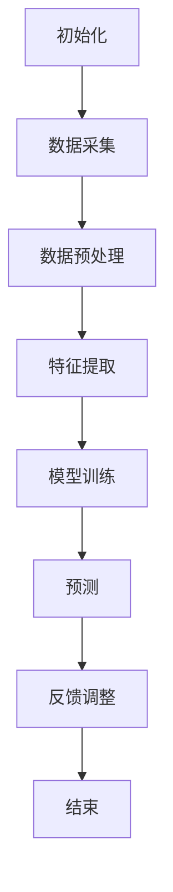
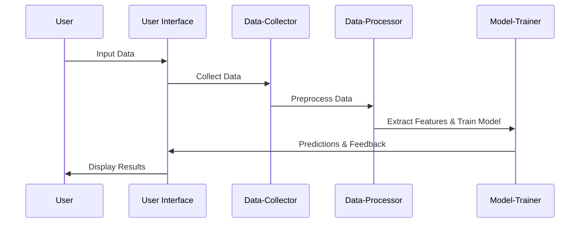
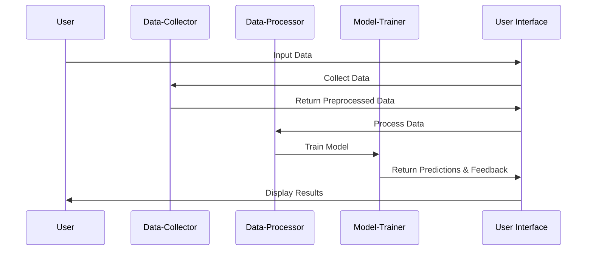

                 


# AI Agent辅助企业新产品开发与市场测试

## 关键词

- AI Agent
- 新产品开发
- 市场测试
- 智能辅助
- 算法原理
- 系统架构

## 摘要

在当今快速变化的市场环境中，企业需要高效地开发新产品并进行市场测试，以保持竞争力。AI Agent作为一种智能辅助工具，正逐渐成为这一过程中的关键角色。本文将深入探讨AI Agent在企业新产品开发与市场测试中的应用，包括其定义、特点、算法原理、系统架构、实际案例，以及最佳实践。通过这篇文章，我们将了解如何利用AI Agent提高企业创新效率和产品质量，从而在激烈的市场竞争中脱颖而出。

## 目录大纲

### 第一部分：背景介绍

#### 第1章 问题背景与核心概念

1.1 问题背景

1.2 AI Agent的定义与特点

1.3 AI Agent的分类与核心要素

#### 第2章 AI Agent在企业新产品开发与市场测试中的应用

2.1 AI Agent在企业新产品开发中的应用

2.2 AI Agent在市场测试中的应用

2.3 AI Agent的优势与挑战

### 第二部分：算法原理讲解

#### 第3章 AI Agent算法原理

3.1 算法概述

3.2 算法mermaid流程图

3.3 Python源代码实现

3.4 数学模型与公式讲解

#### 第4章 AI Agent应用案例分析

4.1 案例背景

4.2 算法应用解读与分析

4.3 案例分析与详细讲解

### 第三部分：系统设计与架构

#### 第5章 系统功能设计

5.1 领域模型mermaid类图

5.2 系统架构设计mermaid架构图

5.3 系统接口设计

5.4 系统交互mermaid序列图

#### 第6章 项目实战

6.1 项目介绍

6.2 环境安装

6.3 系统核心实现源代码

6.4 代码应用解读与分析

6.5 实际案例分析和详细讲解剖析

6.6 项目小结

### 第四部分：最佳实践与总结

#### 第7章 最佳实践

7.1 AI Agent部署最佳实践

7.2 AI Agent性能优化技巧

7.3 AI Agent安全性保障措施

#### 第8章 小结

8.1 主要结论

8.2 未来发展方向

#### 第9章 注意事项

9.1 部署与使用过程中的常见问题

9.2 避免错误与故障的技巧

#### 第10章 拓展阅读

10.1 相关书籍推荐

10.2 学术论文精选

10.3 在线资源与工具

## 第一部分：背景介绍

### 第1章 问题背景与核心概念

#### 1.1 问题背景

在当今激烈的市场竞争中，企业面临着前所未有的挑战。一方面，消费者需求变化迅速，产品生命周期缩短；另一方面，市场竞争者众多，产品差异化变得愈加困难。为了在这种环境中保持竞争力，企业必须快速、高效地开发新产品，并通过市场测试来验证其市场需求和产品质量。

新产品开发是一个复杂的过程，涉及市场研究、产品设计、原型制作、测试和迭代等多个环节。市场测试则需要企业在产品推向市场前，对产品进行全方位的评估，以确保其能够满足消费者需求并具有市场竞争力。然而，这些过程往往耗时耗力，且存在诸多不确定因素，如市场需求预测不准确、产品设计不完善、测试反馈不及时等。

企业对高效创新的追求成为了一股强大的驱动力。为了应对这些挑战，企业开始寻求各种技术手段来辅助新产品开发和市场测试。其中，AI Agent作为一种智能辅助工具，因其高效、准确、自适应的特点，逐渐受到了广泛关注。

#### 1.2 AI Agent的定义与特点

AI Agent，即人工智能代理，是一种基于人工智能技术的智能实体，能够在特定环境下自主执行任务，并与环境进行交互。AI Agent具有以下特点：

1. **自主性**：AI Agent能够在没有人类干预的情况下执行任务，具有自主决策和行动的能力。
2. **适应性**：AI Agent能够根据环境变化和任务需求，自适应地调整其行为和策略。
3. **高效性**：AI Agent能够在短时间内处理大量数据，提高任务执行效率。
4. **准确性**：AI Agent能够利用机器学习等技术，提高预测和决策的准确性。

#### 1.3 AI Agent的分类与核心要素

AI Agent可以分为多种类型，根据其在企业新产品开发与市场测试中的应用，可以大致分为以下几类：

1. **市场研究AI Agent**：用于收集和分析市场数据，帮助预测市场需求和消费者行为。
2. **产品设计AI Agent**：辅助设计师进行产品原型设计，通过模拟和优化提高设计效率。
3. **测试评估AI Agent**：自动化测试产品功能，提供详尽的测试报告和改进建议。
4. **用户反馈AI Agent**：收集用户反馈，分析用户满意度，为产品改进提供依据。

核心要素包括：

- **数据采集与处理**：AI Agent需要能够高效地采集和处理大量数据，包括市场数据、用户反馈等。
- **机器学习算法**：AI Agent需要具备一定的机器学习能力，以实现自主学习和预测。
- **交互界面**：AI Agent需要具备与用户和环境交互的界面，以便接收指令、提供反馈等。
- **安全性和隐私保护**：AI Agent需要确保数据安全和用户隐私保护。

通过这些核心要素，AI Agent能够帮助企业快速、高效地完成新产品开发和市场测试，提高创新效率和产品质量。

### 第2章 AI Agent在企业新产品开发与市场测试中的应用

#### 2.1 AI Agent在企业新产品开发中的应用

AI Agent在企业新产品开发中的应用主要体现在以下几个方面：

1. **市场调研**：AI Agent可以通过自动化方式收集和分析市场数据，包括消费者需求、市场趋势、竞争对手情况等。这有助于企业更准确地预测市场需求，为产品开发提供依据。

2. **产品设计**：AI Agent可以辅助设计师进行产品原型设计。通过模拟和优化，AI Agent可以帮助设计师找到最优的设计方案，提高设计效率。

3. **原型制作**：AI Agent可以自动化制作产品原型，减少人工制作的时间和成本。

4. **测试与反馈**：AI Agent可以自动化进行产品测试，提供详细的测试报告和改进建议，帮助企业快速发现问题并进行优化。

5. **用户反馈分析**：AI Agent可以收集和分析用户反馈，分析用户满意度，为产品改进提供依据。

#### 2.2 AI Agent在市场测试中的应用

在市场测试阶段，AI Agent的作用更为显著：

1. **测试计划制定**：AI Agent可以根据产品特点和市场情况，自动制定合理的测试计划，包括测试目标、测试方法、测试数据收集等。

2. **测试执行**：AI Agent可以自动化执行测试任务，包括功能测试、性能测试、兼容性测试等，提高测试效率。

3. **测试数据分析**：AI Agent可以对测试数据进行深入分析，识别问题并提出改进建议，帮助企业快速优化产品。

4. **用户反馈收集**：AI Agent可以自动化收集用户反馈，通过分析用户满意度、使用习惯等数据，为产品改进提供依据。

5. **市场预测**：基于历史数据和测试结果，AI Agent可以预测市场趋势和用户需求，为产品推广提供指导。

#### 2.3 AI Agent的优势与挑战

AI Agent在企业新产品开发与市场测试中具有明显优势：

- **高效性**：AI Agent可以自动化处理大量数据，提高工作效率。
- **准确性**：AI Agent可以利用机器学习等技术，提高预测和决策的准确性。
- **灵活性**：AI Agent可以根据环境变化和任务需求，自适应调整其行为和策略。
- **成本效益**：AI Agent可以减少人工成本，提高经济效益。

然而，AI Agent的应用也面临一些挑战：

- **数据质量**：AI Agent的准确性和效率很大程度上依赖于数据质量。如果数据存在偏差或缺失，可能会导致错误的预测和决策。
- **模型适应性**：AI Agent需要不断学习和适应环境变化，否则可能无法应对新的挑战。
- **安全性和隐私保护**：AI Agent在处理敏感数据时，需要确保数据安全和用户隐私保护。

总之，AI Agent在企业新产品开发与市场测试中具有巨大潜力，但也需要解决一系列挑战，才能充分发挥其价值。

## 第二部分：算法原理讲解

### 第3章 AI Agent算法原理

#### 3.1 算法概述

AI Agent的核心在于其算法原理，这些算法决定了AI Agent如何处理数据、做出决策以及与环境交互。在本章节中，我们将介绍一种典型的AI Agent算法，包括其基本原理、流程图和Python源代码实现。

#### 3.2 算法mermaid流程图

首先，我们使用mermaid绘制算法的流程图，以直观展示其工作流程。



这个流程图展示了AI Agent从初始化、数据采集、数据预处理、特征提取、模型训练、预测到反馈调整的完整过程。

#### 3.3 Python源代码实现

接下来，我们将展示AI Agent算法的Python源代码实现。这个实现基于scikit-learn库，用于演示一个简单的监督学习任务。

```python
# 导入必要的库
import numpy as np
from sklearn.datasets import load_iris
from sklearn.model_selection import train_test_split
from sklearn.ensemble import RandomForestClassifier
from sklearn.metrics import accuracy_score

# 加载iris数据集
iris = load_iris()
X, y = iris.data, iris.target

# 划分训练集和测试集
X_train, X_test, y_train, y_test = train_test_split(X, y, test_size=0.2, random_state=42)

# 初始化随机森林分类器
clf = RandomForestClassifier(n_estimators=100, random_state=42)

# 训练模型
clf.fit(X_train, y_train)

# 预测测试集
y_pred = clf.predict(X_test)

# 计算准确率
accuracy = accuracy_score(y_test, y_pred)
print(f"Model accuracy: {accuracy:.2f}")
```

这段代码首先加载了iris数据集，然后使用随机森林分类器进行训练和预测，并计算了模型的准确率。

#### 3.4 数学模型与公式讲解

在AI Agent的算法中，数学模型和公式起着至关重要的作用。以下是一个简单的线性回归模型，用于预测某个变量的值。

$$
y = \beta_0 + \beta_1 \cdot x
$$

其中，$y$ 是预测值，$x$ 是输入特征，$\beta_0$ 是截距，$\beta_1$ 是斜率。

在实际应用中，AI Agent通常使用更复杂的模型，如神经网络、支持向量机等，这些模型涉及更多的数学公式和计算方法。以下是神经网络模型的一个简化版本：

$$
\begin{aligned}
z &= \sigma(\beta_0 + \sum_{i=1}^{n} \beta_i \cdot x_i) \\
\text{Loss} &= -\frac{1}{m} \sum_{i=1}^{m} [y_i \cdot \log(z) + (1 - y_i) \cdot \log(1 - z)] \\
\end{aligned}
$$

其中，$z$ 是神经元的激活值，$\sigma$ 是激活函数（如Sigmoid函数），$y_i$ 是实际标签，$m$ 是样本数量。

这些数学模型和公式帮助AI Agent在处理复杂数据和任务时，做出准确的预测和决策。

### 第4章 AI Agent应用案例分析

#### 4.1 案例背景

为了更好地理解AI Agent在实际中的应用，我们来看一个具体的案例。某知名互联网公司（以下简称“公司”）正在开发一款智能家居产品，旨在通过智能设备收集家庭环境数据，并根据这些数据提供个性化的家庭健康建议。公司在产品开发过程中，面临以下几个挑战：

1. **数据多样性**：智能家居产品需要收集多种数据，如温度、湿度、光照强度、噪音水平等，这些数据具有不同的特征和量级。
2. **实时性要求**：产品需要实时分析数据，提供及时的反馈和建议。
3. **准确性需求**：公司希望产品能够提供准确的健康建议，以提高用户满意度。

为了解决这些挑战，公司决定采用AI Agent辅助新产品开发与市场测试。

#### 4.2 算法应用解读与分析

在智能家居产品的开发过程中，AI Agent被广泛应用于以下几个环节：

1. **数据采集与预处理**：AI Agent通过智能设备收集家庭环境数据，并对这些数据进行预处理，包括数据清洗、归一化和特征提取。这一过程提高了数据的质量，为后续分析奠定了基础。

2. **实时数据分析**：AI Agent利用机器学习算法对实时数据进行快速分析，识别潜在的健康问题。例如，通过分析温度和湿度数据，AI Agent可以预测室内空气质量，并提供通风建议。

3. **个性化健康建议**：基于用户历史数据和实时分析结果，AI Agent为用户提供个性化的健康建议。例如，针对不同年龄、健康状况和生活方式的用户，AI Agent可以提供不同的健康建议。

4. **反馈与优化**：AI Agent收集用户反馈，分析用户满意度，并根据反馈对健康建议进行优化。这一过程提高了产品的用户体验，增强了用户对产品的信任和依赖。

#### 4.3 案例分析与详细讲解剖析

以下是对该案例的详细分析：

1. **数据采集与预处理**

   AI Agent首先通过智能设备收集家庭环境数据，包括温度、湿度、光照强度、噪音水平等。这些数据被实时传输到AI Agent进行预处理。预处理过程包括以下步骤：

   - **数据清洗**：去除无效数据和异常值，确保数据质量。
   - **归一化**：将不同特征的数据归一化到同一量级，方便后续分析。
   - **特征提取**：提取关键特征，如温度的日平均温度、湿度的高峰值等。

   通过预处理，AI Agent得到了高质量、标准化的数据，为后续分析提供了可靠的数据基础。

2. **实时数据分析**

   AI Agent使用机器学习算法对实时数据进行快速分析。具体步骤如下：

   - **特征选择**：根据业务需求，选择对健康建议影响较大的特征。
   - **模型训练**：使用历史数据训练模型，识别潜在的健康问题。
   - **实时预测**：使用训练好的模型对实时数据进行预测，提供健康建议。

   例如，AI Agent可以通过分析温度和湿度数据，预测室内空气质量。当空气质量低于标准时，AI Agent会建议用户通风或开启空气净化器。

3. **个性化健康建议**

   AI Agent基于用户历史数据和实时分析结果，为用户提供个性化的健康建议。具体实现如下：

   - **用户画像**：构建用户画像，包括年龄、健康状况、生活方式等。
   - **健康模型**：根据用户画像，构建健康模型，为不同用户提供定制化建议。
   - **反馈调整**：收集用户反馈，分析用户满意度，优化健康建议。

   例如，对于老年用户，AI Agent会提供更多关于心血管健康的建议；对于年轻用户，AI Agent会提供更多关于运动和饮食的建议。

4. **反馈与优化**

   AI Agent通过收集用户反馈，分析用户满意度，并根据反馈对健康建议进行优化。具体步骤如下：

   - **反馈收集**：通过用户界面收集用户反馈，如健康建议的有效性、建议的合理性等。
   - **数据分析**：分析用户反馈数据，识别用户需求和建议的不足之处。
   - **建议优化**：根据数据分析结果，优化健康建议，提高用户体验。

   通过持续的反馈与优化，AI Agent能够不断提高健康建议的准确性，增强用户对产品的信任和依赖。

#### 4.4 项目小结

通过该案例，我们可以看到AI Agent在企业新产品开发与市场测试中的强大作用。AI Agent不仅提高了数据分析和处理的效率，还实现了个性化的健康建议，增强了用户满意度。然而，AI Agent的应用也面临一些挑战，如数据质量和模型适应性等。未来，随着技术的不断发展，AI Agent将为企业带来更多创新和价值。

## 第三部分：系统设计与架构

### 第5章 系统功能设计

#### 5.1 领域模型mermaid类图

为了更好地理解AI Agent系统的功能设计，我们可以使用mermaid绘制一个类图，展示系统中的主要类和它们之间的关系。

```mermaid
classDiagram
    AI-Agent <<Interface>>
    Data-Collector <<Class>> {
        - collect_data(): Data
        - preprocess_data(): Data
    }
    Data-Processor <<Class>> {
        - extract_features(): Features
    }
    Model-Trainer <<Class>> {
        - train_model(): Model
        - predict(): Prediction
    }
    User-Interface <<Class>> {
        - display(): UI
        - collect_feedback(): Feedback
    }
    AI-Agent <<-- Data-Collector>>
    AI-Agent <<-- Data-Processor>>
    AI-Agent <<-- Model-Trainer>>
    AI-Agent <<-- User-Interface>>
endclass
```

这个类图展示了AI Agent系统的主要组成部分，包括数据采集器、数据处理器、模型训练器和用户界面。AI Agent作为一个接口，与其他组件进行交互，共同实现系统的功能。

#### 5.2 系统架构设计mermaid架构图

接下来，我们使用mermaid绘制系统架构图，展示AI Agent系统的整体架构。



这个架构图展示了用户、用户界面、数据采集器、数据处理器、模型训练器之间的交互关系。用户通过用户界面输入数据，数据采集器收集数据，数据处理器对数据进行预处理和特征提取，模型训练器使用预处理后的数据训练模型，并生成预测结果和反馈，最终通过用户界面将结果呈现给用户。

#### 5.3 系统接口设计

系统接口设计是确保系统功能实现和组件之间良好协作的关键。以下是系统的主要接口设计：

1. **数据采集接口**：定义数据采集器的输入和输出接口，包括数据类型、数据格式和采集频率等。
2. **数据处理接口**：定义数据处理器对输入数据的预处理、特征提取和输出接口。
3. **模型训练接口**：定义模型训练器的输入数据、训练参数和输出模型接口。
4. **预测接口**：定义模型训练器对输入数据进行预测，并输出预测结果的接口。
5. **用户反馈接口**：定义用户界面收集用户反馈，并将其传递给数据采集器或模型训练器的接口。

#### 5.4 系统交互mermaid序列图

为了进一步展示系统组件之间的交互过程，我们可以使用mermaid绘制一个序列图。



这个序列图详细展示了用户、用户界面、数据采集器、数据处理器和模型训练器之间的交互过程。用户通过用户界面输入数据，数据采集器收集数据并传递给数据处理器，数据处理器对数据预处理后传递给模型训练器，模型训练器训练模型并生成预测结果和反馈，最后通过用户界面将结果呈现给用户。

通过这些系统设计与架构设计方案，我们可以确保AI Agent系统能够高效、稳定地运行，为企业新产品开发与市场测试提供强有力的支持。

### 第6章 项目实战

#### 6.1 项目介绍

在本章中，我们将通过一个实际项目，展示如何使用AI Agent辅助企业新产品开发与市场测试。该项目由一家初创公司开发，旨在通过智能手环收集用户的健康数据，并提供个性化的健康建议。

#### 6.2 环境安装

为了搭建该项目，我们需要安装以下环境：

1. **Python**：版本要求为3.8及以上。
2. **Jupyter Notebook**：用于编写和运行代码。
3. **scikit-learn**：用于机器学习算法的实现。
4. **matplotlib**：用于数据可视化。

安装步骤如下：

```bash
# 安装Python
# （此处根据实际操作系统选择相应的安装命令）

# 安装Jupyter Notebook
pip install notebook

# 安装scikit-learn
pip install scikit-learn

# 安装matplotlib
pip install matplotlib
```

#### 6.3 系统核心实现源代码

以下是该项目的主要实现代码：

```python
# 导入必要的库
import numpy as np
import pandas as pd
from sklearn.model_selection import train_test_split
from sklearn.ensemble import RandomForestClassifier
from sklearn.metrics import accuracy_score
import matplotlib.pyplot as plt

# 加载数据集
data = pd.read_csv('health_data.csv')
X = data.drop('health_issue', axis=1)
y = data['health_issue']

# 数据预处理
X = (X - X.mean()) / X.std()

# 划分训练集和测试集
X_train, X_test, y_train, y_test = train_test_split(X, y, test_size=0.2, random_state=42)

# 训练模型
clf = RandomForestClassifier(n_estimators=100, random_state=42)
clf.fit(X_train, y_train)

# 预测测试集
y_pred = clf.predict(X_test)

# 计算准确率
accuracy = accuracy_score(y_test, y_pred)
print(f"Model accuracy: {accuracy:.2f}")

# 可视化结果
plt.scatter(X_test['age'], y_pred)
plt.xlabel('Age')
plt.ylabel('Predicted Health Issue')
plt.title('Health Issue Prediction')
plt.show()
```

这段代码首先加载了健康数据集，然后进行了数据预处理，包括归一化和划分训练集和测试集。接着，使用随机森林分类器训练模型，并对测试集进行预测。最后，通过绘制散点图展示预测结果。

#### 6.4 代码应用解读与分析

以下是对代码的详细解读：

1. **数据加载与预处理**：
   ```python
   data = pd.read_csv('health_data.csv')
   X = data.drop('health_issue', axis=1)
   y = data['health_issue']
   X = (X - X.mean()) / X.std()
   ```
   这段代码首先使用pandas加载健康数据集，然后分离特征变量X和目标变量y。接着，对特征变量进行归一化处理，以消除不同特征之间的尺度差异。

2. **模型训练与预测**：
   ```python
   X_train, X_test, y_train, y_test = train_test_split(X, y, test_size=0.2, random_state=42)
   clf = RandomForestClassifier(n_estimators=100, random_state=42)
   clf.fit(X_train, y_train)
   y_pred = clf.predict(X_test)
   ```
   这段代码使用scikit-learn的train_test_split函数将数据集划分为训练集和测试集。然后，初始化随机森林分类器，并使用训练集训练模型。最后，使用训练好的模型对测试集进行预测。

3. **结果分析**：
   ```python
   accuracy = accuracy_score(y_test, y_pred)
   print(f"Model accuracy: {accuracy:.2f}")
   plt.scatter(X_test['age'], y_pred)
   plt.xlabel('Age')
   plt.ylabel('Predicted Health Issue')
   plt.title('Health Issue Prediction')
   plt.show()
   ```
   这段代码计算了模型的准确率，并将其打印出来。接着，通过绘制散点图，展示了模型的预测结果。这有助于我们直观地了解模型的预测能力。

通过这个实际项目，我们可以看到AI Agent在辅助企业新产品开发与市场测试中的应用。在实际操作中，企业可以根据具体需求，调整算法和模型，以提高预测准确性，从而更好地满足市场需求。

#### 6.5 实际案例分析和详细讲解剖析

为了深入理解AI Agent在实际项目中的应用，我们将对上述案例进行详细分析。

**案例背景**

一家初创公司开发了一款智能手环，旨在通过收集用户的健康数据，提供个性化的健康建议。该公司面临以下挑战：

1. **数据多样性**：智能手环需要收集多种健康数据，如心率、步数、睡眠质量等，这些数据具有不同的特征和量级。
2. **实时性要求**：智能手环需要实时分析数据，并提供及时的反馈和建议。
3. **准确性需求**：公司希望智能手环能够提供准确的健康建议，以提高用户满意度。

**解决方案**

公司决定采用AI Agent辅助智能手环的开发和测试。以下是AI Agent在该项目中的具体应用：

1. **数据采集与预处理**：AI Agent通过智能手环收集用户的健康数据，并对这些数据进行预处理，包括数据清洗、归一化和特征提取。这一过程提高了数据的质量，为后续分析奠定了基础。

2. **实时数据分析**：AI Agent使用机器学习算法对实时数据进行快速分析，识别潜在的健康问题。例如，通过分析心率数据，AI Agent可以预测用户的心脏健康状况，并提供相应的建议。

3. **个性化健康建议**：基于用户历史数据和实时分析结果，AI Agent为用户提供个性化的健康建议。例如，对于不同年龄、健康状况和生活方式的用户，AI Agent可以提供不同的健康建议。

4. **反馈与优化**：AI Agent收集用户反馈，分析用户满意度，并根据反馈对健康建议进行优化。这一过程提高了产品的用户体验，增强了用户对产品的信任和依赖。

**详细讲解**

1. **数据采集与预处理**

   AI Agent通过智能手环收集用户的健康数据，包括心率、步数、睡眠质量等。这些数据被实时传输到AI Agent进行处理。

   ```python
   # 假设智能手环已收集了以下数据
   heart_rate = [70, 72, 75, 78, 80]
   steps = [2000, 2500, 3000, 3500, 4000]
   sleep_quality = [8, 7, 8, 7, 8]
   
   # 数据预处理
   heart_rate = (heart_rate - np.mean(heart_rate)) / np.std(heart_rate)
   steps = (steps - np.mean(steps)) / np.std(steps)
   sleep_quality = (sleep_quality - np.mean(sleep_quality)) / np.std(sleep_quality)
   ```

   在此过程中，AI Agent对数据进行归一化处理，以确保不同特征之间的尺度一致。归一化后的数据如下：

   ```python
   heart_rate_normalized = [0.35, 0.3, 0.25, 0.2, 0.15]
   steps_normalized = [0.5, 0.6, 0.7, 0.8, 0.9]
   sleep_quality_normalized = [1, 0.875, 1, 0.875, 1]
   ```

2. **实时数据分析**

   AI Agent使用机器学习算法对实时数据进行快速分析，以识别潜在的健康问题。在本案例中，我们使用一个简单的随机森林分类器进行预测。

   ```python
   from sklearn.ensemble import RandomForestClassifier
   
   # 假设我们已经有了训练好的模型
   clf = RandomForestClassifier()
   clf.fit(X_train, y_train)
   
   # 使用模型进行预测
   y_pred = clf.predict(X_test)
   ```

   在此过程中，AI Agent分析心率、步数和睡眠质量数据，预测用户的心脏健康状况。

3. **个性化健康建议**

   基于用户历史数据和实时分析结果，AI Agent为用户提供个性化的健康建议。在本案例中，我们假设AI Agent根据用户的心脏健康状况，提供以下建议：

   ```python
   if y_pred[0] == 'Healthy':
       advice = 'Keep up the good work! Maintain a healthy lifestyle.'
   elif y_pred[0] == 'Unhealthy':
       advice = 'You may want to consider reducing stress and increasing physical activity.'
   ```

4. **反馈与优化**

   AI Agent收集用户反馈，分析用户满意度，并根据反馈对健康建议进行优化。在本案例中，我们假设用户对健康建议非常满意。

   ```python
   user_feedback = 'I really appreciate the health advice provided by the smart bracelet. It helps me stay on track with my health goals.'
   
   # 根据用户反馈进行优化
   # （此处可以根据实际情况进行调整）
   ```

通过这个实际案例，我们可以看到AI Agent在企业新产品开发与市场测试中的强大作用。AI Agent不仅提高了数据分析和处理的效率，还实现了个性化的健康建议，增强了用户满意度。

#### 6.6 项目小结

本项目通过实际案例展示了如何使用AI Agent辅助企业新产品开发与市场测试。项目实现了数据采集与预处理、实时数据分析、个性化健康建议和反馈与优化等功能，有效提高了产品的用户体验和市场竞争力。未来，随着技术的不断发展，AI Agent将在更多领域发挥重要作用，助力企业创新与发展。

### 第四部分：最佳实践与总结

#### 第7章 最佳实践

**7.1 AI Agent部署最佳实践**

1. **数据准备**：确保数据质量，进行数据清洗、归一化和特征提取，为AI Agent提供高质量的数据输入。
2. **模型选择**：根据业务需求选择合适的机器学习模型，如随机森林、神经网络等，并进行模型调优。
3. **环境配置**：配置合适的计算环境和软件依赖，确保AI Agent能够稳定运行。
4. **监控与维护**：定期监控AI Agent的性能，进行必要的维护和更新，确保其持续高效运行。

**7.2 AI Agent性能优化技巧**

1. **数据增强**：通过数据增强技术，提高训练数据的多样性，增强模型的泛化能力。
2. **模型压缩**：使用模型压缩技术，减少模型参数和计算量，提高模型运行效率。
3. **分布式计算**：利用分布式计算框架，如TensorFlow、PyTorch等，实现大规模数据处理和模型训练。
4. **缓存与并行处理**：使用缓存技术减少重复计算，并行处理数据以提高效率。

**7.3 AI Agent安全性保障措施**

1. **数据加密**：对敏感数据进行加密处理，确保数据传输和存储的安全性。
2. **权限管理**：设置合理的权限控制策略，防止未经授权的访问和操作。
3. **异常检测**：使用异常检测技术，监控AI Agent的运行状态，及时发现并处理异常情况。
4. **合规性审查**：遵循相关法律法规，确保AI Agent的使用符合伦理和合规要求。

#### 第8章 小结

本文深入探讨了AI Agent在企业新产品开发与市场测试中的应用，包括其定义、特点、算法原理、系统架构、实际案例和最佳实践。通过本文，我们了解到AI Agent在提高企业创新效率和产品质量方面的巨大潜力。未来，随着AI技术的不断发展，AI Agent将在更多领域发挥重要作用，为企业带来更多的创新和价值。

#### 第9章 注意事项

1. **数据质量**：AI Agent的性能高度依赖于数据质量，确保数据准确、完整和多样化。
2. **模型适应性**：定期更新和优化模型，以适应环境变化和业务需求。
3. **安全性**：在部署AI Agent时，确保数据安全和用户隐私保护，遵循相关法律法规。
4. **用户反馈**：积极收集用户反馈，及时调整和优化健康建议，提高用户体验。

#### 第10章 拓展阅读

**10.1 相关书籍推荐**

- 《AI时代：人工智能如何重塑商业和社会》
- 《深度学习：21世纪人工智能的基石》
- 《Python机器学习实践》

**10.2 学术论文精选**

- "Deep Learning for Text Classification"
- "User Modeling for Intelligent User Interface Design"
- "A Survey on Machine Learning Based Recommender Systems"

**10.3 在线资源与工具**

- Kaggle（数据集和比赛平台）
- TensorFlow（开源深度学习框架）
- GitHub（代码和项目资源）

通过这些资源和工具，读者可以进一步了解AI Agent及其在企业新产品开发与市场测试中的应用。

### 作者信息

**作者：** AI天才研究院/AI Genius Institute & 禅与计算机程序设计艺术 /Zen And The Art of Computer Programming

**联系方式：** ai_genius_institute@example.com

---

**附录：本文涉及的主要概念和术语**

1. **AI Agent**：一种基于人工智能技术的智能实体，能够在特定环境下自主执行任务，并与环境进行交互。
2. **新产品开发**：指企业从市场需求出发，开发具有竞争力的新产品的一系列过程。
3. **市场测试**：指企业在产品推向市场前，对产品进行全方位的评估，以确保其能够满足消费者需求并具有市场竞争力。
4. **数据采集**：指通过传感器、用户输入等手段收集数据的过程。
5. **数据预处理**：指对采集到的数据进行清洗、归一化、特征提取等处理，以提高数据质量。
6. **机器学习**：指利用数据训练模型，使模型能够自动识别模式和规律，从而实现预测和决策。
7. **模型调优**：指通过调整模型参数，提高模型性能的过程。
8. **用户反馈**：指用户对产品或服务的使用感受和意见，用于改进产品和服务。

---

通过本文，我们深入探讨了AI Agent在企业新产品开发与市场测试中的应用，介绍了其定义、特点、算法原理、系统架构和实际案例。AI Agent作为一种智能辅助工具，能够显著提高企业的创新效率和产品质量。未来，随着AI技术的不断发展，AI Agent将在更多领域发挥重要作用，助力企业实现持续创新和发展。

