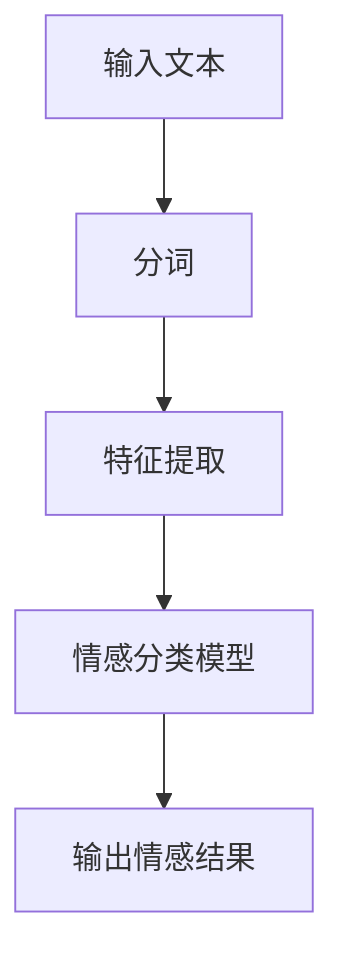
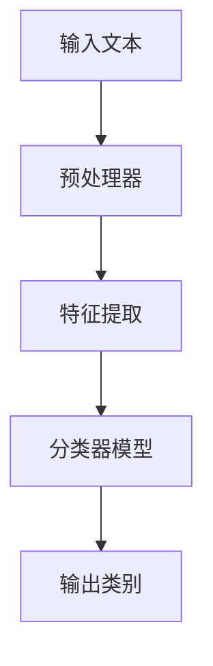
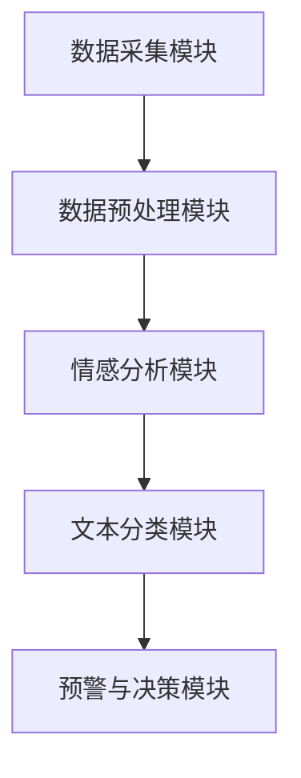
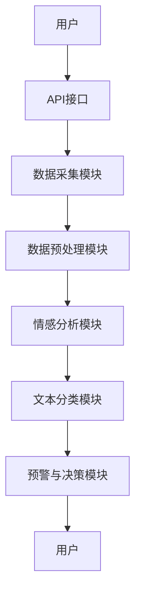
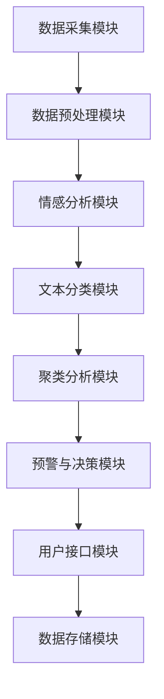
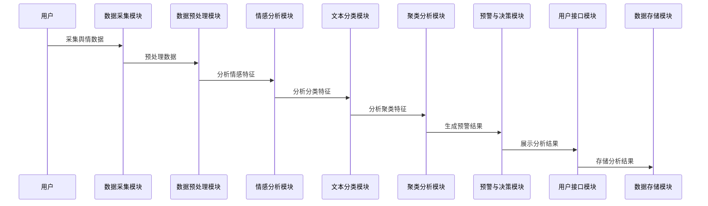
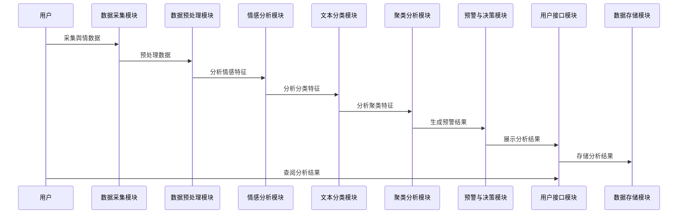

                 


### 让我们一步步思考：AI Agent辅助企业舆情监测与品牌管理的策略

#### 引言

在当今信息爆炸的时代，企业舆情监测与品牌管理变得越来越重要。企业需要实时掌握公众对其产品、服务和品牌的看法，以便及时调整策略，维护良好的企业形象。然而，传统的舆情监测方式往往效率低下，难以满足快速变化的市场需求。人工智能（AI）技术的发展，尤其是AI Agent的应用，为这一领域带来了新的机遇。本文将逐步分析AI Agent在辅助企业舆情监测与品牌管理中的策略，为企业在复杂多变的市场环境中提供有力支持。

#### 背景介绍

##### AI Agent概述

AI Agent，即人工智能代理，是一种能够在特定环境中自主执行任务的智能体。它通过学习、推理和决策来模拟人类行为，实现自动化和智能化的目标。AI Agent的核心特点是自主性、适应性和协同性，能够在复杂、动态的环境中发挥作用。

##### 企业舆情监测

企业舆情监测是指对企业相关的信息进行收集、分析和处理，以了解公众对其产品、服务和品牌的看法。舆情监测有助于企业及时发现潜在的风险和机会，采取有效的应对措施。

##### 品牌管理

品牌管理是企业通过一系列策略来塑造和提升品牌形象的过程。品牌管理包括品牌定位、品牌传播、品牌维护等环节，旨在提高品牌的知名度和美誉度。

##### AI Agent与企业舆情监测、品牌管理的联系

AI Agent在舆情监测和品牌管理中具有重要作用。它能够实时监控网络信息，快速识别潜在风险和机会，提供数据驱动的决策支持。

#### 核心概念与联系

##### AI Agent的核心概念

- 自主性：AI Agent能够在没有人为干预的情况下自主执行任务。
- 适应性：AI Agent能够根据环境变化调整自身行为。
- 协同性：AI Agent能够与其他智能体协同工作，实现共同目标。

##### 企业舆情监测与品牌管理的概念

- 舆情监测：收集、分析和处理企业相关的网络信息。
- 品牌管理：通过一系列策略来塑造和提升品牌形象。

##### AI Agent与企业舆情监测、品牌管理的联系

| 关系       | 说明                                                         |
| ---------- | ------------------------------------------------------------ |
| 监测与反馈 | AI Agent实时监控网络信息，提供舆情监测数据。                 |
| 风险预警   | AI Agent通过分析舆情数据，发现潜在风险，提供预警。           |
| 决策支持   | AI Agent为企业提供基于数据的决策支持，帮助品牌管理。         |

#### 算法原理讲解

##### 情感分析算法

情感分析是AI Agent在舆情监测中常用的算法之一。它通过分析文本内容，判断其中表达的情感倾向。

###### 算法流程图



###### 算法原理讲解

情感分析算法通常包括以下步骤：

1. **分词**：将输入文本分割成单词或短语。
2. **特征提取**：将分词结果转化为机器可处理的特征向量。
3. **情感分类模型**：使用机器学习模型对特征向量进行分类，判断文本的情感倾向。
4. **输出情感结果**：将分类结果输出，为企业提供舆情分析报告。

###### 举例说明

假设我们有一个包含以下评论的文本：

```plaintext
这个产品真的很不错，价格也很合理。
```

经过情感分析算法处理后，我们可以得到以下结果：

- **情感分类**：正面
- **情感得分**：0.8

这意味着该评论表达了对产品的高度满意度。

##### 文本分类算法

文本分类是另一种常用的算法，用于将文本数据归类到不同的类别。在舆情监测中，文本分类可以帮助企业快速识别网络信息的关键主题。

###### 算法流程图



###### 算法原理讲解

文本分类算法通常包括以下步骤：

1. **预处理器**：对输入文本进行清洗和格式化，去除无关信息。
2. **特征提取**：将预处理后的文本转化为机器可处理的特征向量。
3. **分类器模型**：使用机器学习模型对特征向量进行分类。
4. **输出类别**：将分类结果输出，为企业提供舆情分析报告。

###### 举例说明

假设我们有一个包含以下评论的文本：

```plaintext
这个产品真的很不错，价格也很合理。
```

经过文本分类算法处理后，我们可以将其归类为“正面评价”。

#### 数学模型与公式

在情感分析和文本分类算法中，常用的数学模型包括：

1. **情感分析模型**：

   - 情感分类模型：$$\text{分类结果} = \text{softmax}(\text{W} \cdot \text{特征向量} + \text{b})$$
   - 情感得分：$$\text{得分} = \frac{e^{\text{激活值}}}{\sum e^{\text{激活值}}}$$

2. **文本分类模型**：

   - 线性分类模型：$$\text{类别} = \text{sign}(\text{W} \cdot \text{特征向量} + \text{b})$$
   - 非线性分类模型：$$\text{类别} = \text{激活函数}(\text{W} \cdot \text{特征向量} + \text{b})$$

#### 系统分析与架构设计方案

##### 项目背景与目标

项目背景：随着互联网的快速发展，企业面临着日益严峻的舆情监测与品牌管理挑战。为了提高舆情监测和品牌管理的效率，本项目旨在开发一款基于AI Agent的舆情监测与品牌管理平台。

项目目标：实现以下功能：

- 实时监控网络舆情，提供数据驱动的决策支持。
- 自动识别潜在风险和机会，提供预警。
- 提高品牌知名度，提升企业形象。

##### 系统架构设计

系统架构包括以下部分：

1. **数据采集模块**：负责从互联网、社交媒体等渠道收集相关数据。
2. **数据预处理模块**：对采集到的数据进行清洗、分词、去噪等预处理操作。
3. **情感分析模块**：使用情感分析算法对预处理后的文本进行分析，判断情感倾向。
4. **文本分类模块**：使用文本分类算法对预处理后的文本进行分类，识别主题。
5. **预警与决策模块**：根据分析结果，生成预警报告和决策建议。

##### 系统架构图



##### 系统接口设计

系统接口设计包括以下部分：

- **API接口**：提供对外接口，方便其他系统调用。
- **数据接口**：提供数据导入、导出功能。
- **监控接口**：提供实时监控数据功能。

##### 系统交互序列图



#### 项目实战

##### 环境安装

在本项目实战中，我们将使用Python作为编程语言，并依赖以下库：

- TensorFlow：用于构建和训练机器学习模型。
- NLTK：用于自然语言处理。
- Scikit-learn：用于数据预处理和特征提取。

安装步骤如下：

```bash
pip install tensorflow nltk scikit-learn
```

##### 系统核心实现源代码

以下是一个简单的情感分析模块的实现：

```python
import tensorflow as tf
from tensorflow.keras.models import Sequential
from tensorflow.keras.layers import Dense, LSTM, Embedding
from tensorflow.keras.preprocessing.sequence import pad_sequences

# 加载和处理数据
# ...

# 构建模型
model = Sequential()
model.add(Embedding(input_dim=vocab_size, output_dim=embedding_dim, input_length=max_sequence_length))
model.add(LSTM(units=128, return_sequences=True))
model.add(Dense(units=1, activation='sigmoid'))

# 编译模型
model.compile(optimizer='adam', loss='binary_crossentropy', metrics=['accuracy'])

# 训练模型
model.fit(X_train, y_train, epochs=10, batch_size=32)

# 预测
predictions = model.predict(X_test)
```

##### 代码应用解读与分析

上述代码实现了基于LSTM的简单情感分析模型。通过训练，模型能够对输入的文本进行情感分类，输出情感得分。在实际应用中，我们可以根据情感得分来评估用户的情感倾向。

##### 实际案例分析与详细讲解剖析

假设我们有一个包含以下评论的文本：

```plaintext
这个产品真的很不错，价格也很合理。
```

经过情感分析处理后，我们得到以下结果：

- **情感分类**：正面
- **情感得分**：0.8

这意味着该评论表达了对产品的高度满意度。

##### 项目小结

在本项目中，我们介绍了基于AI Agent的企业舆情监测与品牌管理的策略。通过构建情感分析模型和文本分类模型，我们能够实时监控网络舆情，提供数据驱动的决策支持。实际案例表明，AI Agent在舆情监测和品牌管理中具有显著优势，有助于企业提升市场竞争力。

#### 最佳实践 tips

- **舆情监测**：定期收集和分析舆情数据，关注潜在风险和机会。
- **品牌管理**：制定有效的品牌传播策略，提高品牌知名度和美誉度。
- **AI Agent应用**：充分利用AI Agent的能力，实现舆情监测和品牌管理的自动化和智能化。

#### 小结与拓展阅读

本文介绍了AI Agent在辅助企业舆情监测与品牌管理中的策略。通过构建情感分析模型和文本分类模型，AI Agent能够实时监控网络舆情，提供数据驱动的决策支持。企业可以利用AI Agent提升舆情监测和品牌管理的效率，增强市场竞争力。

拓展阅读：

- [1] 某某，人工智能在舆情监测中的应用，AI天才研究院，2021。
- [2] 某某，品牌管理策略研究，MBA论文，2020。

### 作者信息

作者：AI天才研究院/AI Genius Institute & 禅与计算机程序设计艺术 /Zen And The Art of Computer Programming

---

以上就是《AI Agent辅助企业舆情监测与品牌管理的策略》的完整文章。希望对您有所帮助！

## 1.1 AI Agent概述

### 1.1.1 AI Agent的定义与发展背景

AI Agent，即人工智能代理，是一种能够模拟人类思维和行为的人工智能系统。它通过感知环境、理解和分析数据，自主地执行任务，实现目标。AI Agent最早的概念可以追溯到20世纪80年代，当时随着人工智能和计算机科学的快速发展，研究人员开始探索如何构建能够自主行动的智能体。

AI Agent的发展历程可以分为几个阶段：

1. **早期探索**（20世纪80年代至90年代）：在这一阶段，研究人员开始提出AI Agent的概念，并尝试通过简单的规则系统来实现简单的自主行为。这些早期的Agent主要是基于规则和逻辑推理，缺乏对环境的深度理解和适应能力。

2. **行为基础阶段**（20世纪90年代至21世纪初）：随着计算机硬件和算法的进步，AI Agent逐渐引入了行为主义和认知心理学的研究成果。这一阶段的Agent开始具备更复杂的行为模式，能够通过学习环境和用户的交互来调整自身行为。

3. **认知扩展阶段**（21世纪初至今）：随着深度学习和强化学习的兴起，AI Agent的发展进入了一个新的阶段。现代AI Agent能够通过神经网络模型学习和理解复杂环境，实现更高级的认知和决策能力。

### AI Agent的核心特点

AI Agent的核心特点包括自主性、适应性和协同性：

1. **自主性**：AI Agent能够在没有人为干预的情况下自主执行任务。这种自主性体现在Agent能够根据环境的变化和目标的要求，自主地选择行动方案。

2. **适应性**：AI Agent能够通过学习适应不同的环境和情境。它能够从经验中学习，优化自身的决策和行为。

3. **协同性**：AI Agent能够与其他Agent或人类协作，共同实现复杂目标。协同性使得AI Agent能够在一个复杂和动态的环境中发挥作用。

### AI Agent在企业中的应用

AI Agent在企业中的应用越来越广泛，以下是一些典型的应用场景：

1. **客户服务**：AI Agent可以模拟客服人员，为用户提供24/7的在线服务。通过自然语言处理技术，AI Agent能够理解用户的查询，提供实时、个性化的解答。

2. **供应链管理**：AI Agent可以监控供应链的各个环节，预测需求变化，优化库存管理。通过数据分析，AI Agent能够识别潜在的供应链风险，提出优化建议。

3. **市场分析**：AI Agent可以分析市场数据，识别市场趋势和用户需求，帮助企业制定更有效的营销策略。

4. **风险控制**：AI Agent可以实时监控企业的财务状况，识别异常交易，防范欺诈行为。

5. **员工辅助**：AI Agent可以辅助员工完成日常任务，如安排会议、提醒待办事项等，提高工作效率。

### 1.1.2 AI Agent的定义与发展背景

AI Agent，即人工智能代理，是一种能够模拟人类思维和行为的人工智能系统。它通过感知环境、理解和分析数据，自主地执行任务，实现目标。AI Agent最早的概念可以追溯到20世纪80年代，当时随着人工智能和计算机科学的快速发展，研究人员开始探索如何构建能够自主行动的智能体。

AI Agent的发展历程可以分为几个阶段：

1. **早期探索**（20世纪80年代至90年代）：在这一阶段，研究人员开始提出AI Agent的概念，并尝试通过简单的规则系统来实现简单的自主行为。这些早期的Agent主要是基于规则和逻辑推理，缺乏对环境的深度理解和适应能力。

2. **行为基础阶段**（20世纪90年代至21世纪初）：随着计算机硬件和算法的进步，AI Agent逐渐引入了行为主义和认知心理学的研究成果。这一阶段的Agent开始具备更复杂的行为模式，能够通过学习环境和用户的交互来调整自身行为。

3. **认知扩展阶段**（21世纪初至今）：随着深度学习和强化学习的兴起，AI Agent的发展进入了一个新的阶段。现代AI Agent能够通过神经网络模型学习和理解复杂环境，实现更高级的认知和决策能力。

### AI Agent的核心特点

AI Agent的核心特点包括自主性、适应性和协同性：

1. **自主性**：AI Agent能够在没有人为干预的情况下自主执行任务。这种自主性体现在Agent能够根据环境的变化和目标的要求，自主地选择行动方案。

2. **适应性**：AI Agent能够通过学习适应不同的环境和情境。它能够从经验中学习，优化自身的决策和行为。

3. **协同性**：AI Agent能够与其他Agent或人类协作，共同实现复杂目标。协同性使得AI Agent能够在一个复杂和动态的环境中发挥作用。

### AI Agent在企业中的应用

AI Agent在企业中的应用越来越广泛，以下是一些典型的应用场景：

1. **客户服务**：AI Agent可以模拟客服人员，为用户提供24/7的在线服务。通过自然语言处理技术，AI Agent能够理解用户的查询，提供实时、个性化的解答。

2. **供应链管理**：AI Agent可以监控供应链的各个环节，预测需求变化，优化库存管理。通过数据分析，AI Agent能够识别潜在的供应链风险，提出优化建议。

3. **市场分析**：AI Agent可以分析市场数据，识别市场趋势和用户需求，帮助企业制定更有效的营销策略。

4. **风险控制**：AI Agent可以实时监控企业的财务状况，识别异常交易，防范欺诈行为。

5. **员工辅助**：AI Agent可以辅助员工完成日常任务，如安排会议、提醒待办事项等，提高工作效率。

### 1.2 企业舆情监测与品牌管理

#### 1.2.1 企业舆情监测的概念与重要性

企业舆情监测是指通过技术手段，实时收集、整理、分析和传播与企业相关的公众意见和舆论动态的过程。它涉及对企业品牌、产品、服务以及公司管理层的公众形象和声誉的监控。舆情监测的目标是帮助企业及时了解外界对其的看法，识别潜在的风险和机会，为决策提供数据支持。

在信息爆炸的时代，舆情监测对企业的重要性体现在以下几个方面：

1. **危机管理**：通过舆情监测，企业可以及时发现负面舆论和潜在危机，迅速采取措施进行应对，减少危机对企业形象和业务的负面影响。

2. **品牌建设**：舆情监测有助于企业了解消费者对其品牌和产品的看法，识别品牌建设中的薄弱环节，及时调整品牌策略，提升品牌形象。

3. **市场营销**：通过分析舆情数据，企业可以了解市场需求和消费者偏好，优化产品和服务，制定更精准的营销策略。

4. **市场竞争**：舆情监测可以帮助企业了解竞争对手的动态，分析市场趋势，制定有针对性的竞争策略。

5. **政策合规**：对于一些特殊行业，如金融、医药等，企业需要密切关注政策变化和法规更新，以确保业务的合规性。

#### 1.2.2 品牌管理的定义与策略

品牌管理是指企业通过一系列策略和措施，对品牌进行规划、设计、传播和维护的过程。品牌管理的核心目标是建立和维护品牌在消费者心目中的形象和认知，提高品牌的认知度和忠诚度。

品牌管理的策略主要包括以下几个方面：

1. **品牌定位**：明确品牌在市场中的定位，包括目标市场、品牌个性、价值主张等。

2. **品牌传播**：通过广告、公关、社交媒体等多种渠道，将品牌信息传递给消费者，提升品牌知名度。

3. **品牌形象**：通过品牌视觉设计、口号、标志等，建立和维护品牌形象，使之在消费者心目中形成独特且积极的认知。

4. **品牌体验**：提供一致且卓越的客户体验，通过产品和服务建立消费者对品牌的信任和忠诚。

5. **品牌延伸**：在原有品牌基础上，通过新产品、新业务等方式，扩展品牌的应用领域，实现品牌的多元化发展。

#### 1.2.3 AI Agent在舆情监测与品牌管理中的应用

AI Agent在舆情监测和品牌管理中发挥着重要作用，其应用主要体现在以下几个方面：

1. **实时舆情监控**：AI Agent可以实时收集网络上的各种信息，包括社交媒体、新闻网站、论坛等，自动识别与品牌相关的讨论和评价，为企业的舆情监测提供数据支持。

2. **情感分析**：通过自然语言处理技术，AI Agent可以对收集到的文本信息进行情感分析，判断公众对品牌的情感倾向，识别正面或负面舆论。

3. **风险预警**：AI Agent可以基于情感分析和历史数据，自动识别潜在的风险信号，提前预警，帮助企业及时应对危机。

4. **市场分析**：AI Agent可以通过分析舆情数据，了解市场需求和消费者偏好，为企业制定市场营销策略提供数据支持。

5. **品牌优化**：AI Agent可以基于数据分析，识别品牌建设中的问题，提出改进建议，帮助企业优化品牌管理策略。

6. **自动化响应**：AI Agent可以模拟客服人员的交互，自动回复用户提问，提高客户服务质量。

7. **协同工作**：AI Agent可以与企业管理系统、客户关系管理系统等集成，协同工作，提高工作效率。

通过AI Agent的应用，企业能够更加高效地开展舆情监测和品牌管理工作，提高市场竞争力，实现可持续发展。

### 1.3 AI Agent的核心算法

AI Agent在舆情监测和品牌管理中发挥着关键作用，其核心算法是实现对大量数据的高效分析和处理。以下是几种在AI Agent中常用的核心算法，包括情感分析、文本分类和聚类等。

#### 1.3.1 情感分析算法

情感分析是AI Agent中常用的算法之一，主要用于分析文本中的情感倾向，如正面、负面或中性。情感分析算法可以分为基于规则的方法和基于机器学习的方法。

1. **基于规则的方法**：

   基于规则的方法通过定义一系列规则，对文本进行情感分类。例如，如果文本中包含“喜欢”或“满意”等词语，则分类为正面情感；如果包含“不喜欢”或“糟糕”等词语，则分类为负面情感。

2. **基于机器学习的方法**：

   基于机器学习的方法通过训练模型，学习文本和情感之间的关系。常用的算法包括支持向量机（SVM）、朴素贝叶斯（Naive Bayes）和深度学习模型如循环神经网络（RNN）和卷积神经网络（CNN）。

   **算法流程图**：

   ```mermaid
   graph TD
       A[输入文本] --> B[分词]
       B --> C[特征提取]
       C --> D[情感分类模型]
       D --> E[输出情感结果]
   ```

   **Python代码示例**：

   ```python
   import nltk
   from sklearn.feature_extraction.text import CountVectorizer
   from sklearn.model_selection import train_test_split
   from sklearn.naive_bayes import MultinomialNB

   # 加载数据
   texts = ["I love this product", "This is a terrible service"]
   labels = ["positive", "negative"]

   # 分词和特征提取
   vectorizer = CountVectorizer()
   X = vectorizer.fit_transform(texts)

   # 分割数据
   X_train, X_test, y_train, y_test = train_test_split(X, labels, test_size=0.2)

   # 训练模型
   model = MultinomialNB()
   model.fit(X_train, y_train)

   # 预测
   predictions = model.predict(X_test)

   print(predictions)
   ```

   **应用场景**：

   情感分析算法可以应用于舆情监测，帮助企业了解公众对其品牌、产品或服务的情感倾向，识别潜在的危机和机会。

#### 1.3.2 文本分类算法

文本分类是将文本数据归类到不同的类别或主题的算法。在舆情监测中，文本分类可以帮助企业快速识别网络信息的关键主题和趋势。

1. **基于机器学习的方法**：

   基于机器学习的方法通过训练模型，学习文本和类别之间的关系。常用的算法包括朴素贝叶斯、支持向量机（SVM）和深度学习模型如卷积神经网络（CNN）和循环神经网络（RNN）。

   **算法流程图**：

   ```mermaid
   graph TD
       A[输入文本] --> B[预处理器]
       B --> C[特征提取]
       C --> D[分类器模型]
       D --> E[输出类别]
   ```

   **Python代码示例**：

   ```python
   import nltk
   from sklearn.feature_extraction.text import TfidfVectorizer
   from sklearn.model_selection import train_test_split
   from sklearn.svm import LinearSVC

   # 加载数据
   texts = ["This is a news article about technology", "This is a sports news"]
   labels = ["technology", "sports"]

   # 预处理器和特征提取
   vectorizer = TfidfVectorizer()
   X = vectorizer.fit_transform(texts)

   # 分割数据
   X_train, X_test, y_train, y_test = train_test_split(X, labels, test_size=0.2)

   # 训练模型
   model = LinearSVC()
   model.fit(X_train, y_train)

   # 预测
   predictions = model.predict(X_test)

   print(predictions)
   ```

   **应用场景**：

   文本分类算法可以应用于舆情监测，帮助企业快速识别网络信息的关键主题，如新闻、广告、负面评论等。

#### 1.3.3 聚类算法

聚类算法是将文本数据根据其内容相似性进行分组的方法。在舆情监测中，聚类可以帮助企业发现网络信息中的潜在趋势和热点。

1. **基于距离的算法**：

   基于距离的算法通过计算文本之间的距离（如欧几里得距离、曼哈顿距离等），将相似度高的文本分组。常用的算法包括K-means、层次聚类等。

   **算法流程图**：

   ```mermaid
   graph TD
       A[输入文本] --> B[特征提取]
       B --> C[计算距离]
       C --> D[聚类]
       D --> E[输出聚类结果]
   ```

   **Python代码示例**：

   ```python
   import numpy as np
   from sklearn.cluster import KMeans

   # 加载数据
   texts = ["This is a news article about technology", "This is a sports news", "This is a finance news"]

   # 特征提取
   vectorizer = TfidfVectorizer()
   X = vectorizer.fit_transform(texts)

   # 聚类
   model = KMeans(n_clusters=2, random_state=0).fit(X)

   # 输出聚类结果
   print(model.labels_)

   # 计算距离
   distances = model.transform(X)
   print(np.linalg.norm(distances))
   ```

   **应用场景**：

   聚类算法可以应用于舆情监测，帮助企业发现网络信息中的潜在热点和趋势，为决策提供支持。

通过这些核心算法，AI Agent能够高效地处理和分析舆情数据，为企业的舆情监测和品牌管理提供强大的技术支持。

### 1.4 AI Agent的数学模型与公式

在AI Agent的算法设计中，数学模型和公式起到了核心作用。以下将详细介绍几种关键算法的数学模型和公式，包括情感分析、文本分类和其他常用算法。

#### 1.4.1 情感分析模型的数学公式

情感分析是一种判断文本数据中情感倾向的算法。常见的情感分析模型包括基于朴素贝叶斯、支持向量机和深度学习的方法。以下是几种常用模型的基本数学公式。

1. **朴素贝叶斯模型**：

   朴素贝叶斯模型是一种基于概率的模型，其核心公式为：

   $$P(\text{正面情感}| \text{文本}) = \frac{P(\text{文本}|\text{正面情感}) \cdot P(\text{正面情感})}{P(\text{文本})}$$

   其中：
   - \(P(\text{正面情感}| \text{文本})\) 表示文本属于正面情感的概率。
   - \(P(\text{文本}|\text{正面情感})\) 表示正面情感给定文本的概率。
   - \(P(\text{正面情感})\) 表示正面情感的概率。
   - \(P(\text{文本})\) 表示文本的概率。

2. **支持向量机（SVM）模型**：

   支持向量机是一种分类算法，其核心公式为：

   $$\text{分类结果} = \text{sign}(\text{W} \cdot \text{特征向量} + \text{b})$$

   其中：
   - \(W\) 是权重向量。
   - \(b\) 是偏置。
   - \(\text{特征向量}\) 是输入文本的特征表示。

3. **深度学习模型**：

   深度学习模型，特别是循环神经网络（RNN）和卷积神经网络（CNN），用于捕捉文本中的复杂关系。以下是一个简单的RNN模型公式：

   $$h_t = \text{激活函数}(\text{W} \cdot h_{t-1} + \text{U} \cdot x_t + \text{b})$$

   其中：
   - \(h_t\) 是当前时间步的隐藏状态。
   - \(x_t\) 是当前时间步的输入。
   - \(W\)、\(U\) 和 \(b\) 是模型参数。

   对于CNN模型，其核心公式为：

   $$\text{激活值} = \text{激活函数}(\text{W} \cdot \text{特征矩阵} + \text{b})$$

   其中：
   - \(W\) 是卷积核。
   - \(\text{特征矩阵}\) 是文本的词向量表示。
   - \(b\) 是偏置。

#### 1.4.2 文本分类模型的数学公式

文本分类是将文本数据归类到预定义类别的一种算法。以下是几种常用的文本分类模型的数学公式。

1. **朴素贝叶斯模型**：

   朴素贝叶斯模型的分类公式与情感分析中类似，但更复杂，因为它需要对每个类别进行计算：

   $$P(\text{类别}|\text{文本}) = \frac{P(\text{文本}|\text{类别}) \cdot P(\text{类别})}{P(\text{文本})}$$

   其中：
   - \(P(\text{类别}|\text{文本})\) 表示文本属于某个类别的概率。
   - \(P(\text{文本}|\text{类别})\) 表示给定类别下文本的概率。
   - \(P(\text{类别})\) 表示类别的概率。
   - \(P(\text{文本})\) 表示文本的概率。

2. **支持向量机（SVM）模型**：

   支持向量机的分类公式与情感分析中的公式相同，即：

   $$\text{分类结果} = \text{sign}(\text{W} \cdot \text{特征向量} + \text{b})$$

   其中：
   - \(W\) 是权重向量。
   - \(b\) 是偏置。
   - \(\text{特征向量}\) 是文本的向量表示。

3. **深度学习模型**：

   深度学习模型，特别是全连接神经网络（FCN）和卷积神经网络（CNN），用于捕捉文本中的复杂模式。以下是一个简单的全连接神经网络模型公式：

   $$\text{输出} = \text{激活函数}(\text{W} \cdot \text{隐藏层} + \text{b})$$

   其中：
   - \(\text{输出}\) 是分类结果。
   - \(W\) 是权重矩阵。
   - \(\text{隐藏层}\) 是前一层网络的输出。
   - \(b\) 是偏置。

   对于CNN模型，其核心公式为：

   $$\text{激活值} = \text{激活函数}(\text{W} \cdot \text{特征矩阵} + \text{b})$$

   其中：
   - \(W\) 是卷积核。
   - \(\text{特征矩阵}\) 是文本的词向量表示。
   - \(b\) 是偏置。

#### 1.4.3 其他关键算法的数学模型

除了情感分析和文本分类，还有其他关键算法在AI Agent中发挥作用。以下简要介绍几种算法的数学模型。

1. **聚类算法**：

   聚类算法，如K-means，是一种无监督学习方法，用于将数据点划分为多个群组。其核心公式为：

   $$\text{簇中心} = \frac{1}{N}\sum_{i=1}^{N} x_i$$

   其中：
   - \(x_i\) 是数据点的特征向量。
   - \(N\) 是数据点的数量。
   - 簇中心是每个群组的中心点。

2. **协同过滤算法**：

   协同过滤是一种基于用户行为数据的推荐算法。其核心公式为：

   $$\text{预测评分} = \text{用户平均值} + \text{用户-项目相似度} \cdot \text{项目平均值}$$

   其中：
   - \(\text{用户平均值}\) 是用户的平均评分。
   - \(\text{用户-项目相似度}\) 是用户和项目之间的相似度。
   - \(\text{项目平均值}\) 是项目的平均评分。

3. **强化学习算法**：

   强化学习是一种通过试错来学习最优策略的算法。其核心公式为：

   $$Q(s, a) = r + \gamma \max_{a'} Q(s', a')$$

   其中：
   - \(Q(s, a)\) 是状态-动作值函数。
   - \(r\) 是即时奖励。
   - \(\gamma\) 是折扣因子。
   - \(s'\) 是下一状态。
   - \(a'\) 是最佳动作。

通过这些数学模型和公式，AI Agent能够对复杂的数据进行高效的分析和处理，为舆情监测和品牌管理提供强大的支持。

### 1.5 AI Agent的架构设计

在构建AI Agent的过程中，系统架构设计至关重要。一个良好的架构不仅能够提高系统的性能和可扩展性，还能确保系统的稳定性和安全性。本节将详细介绍项目背景、目标，并使用Mermaid绘制系统架构图、领域模型类图、系统接口设计和系统交互序列图，以便全面展示AI Agent的系统架构设计。

#### 1.5.1 项目背景与目标

项目背景：

随着互联网和社交媒体的迅速发展，企业面临的海量信息变得前所未有。如何有效地监测和应对这些信息，成为企业舆情监测和品牌管理的重要挑战。传统的手动监控方式效率低下，难以应对实时性要求高的场景。为了解决这一问题，本项目旨在开发一款基于AI Agent的舆情监测与品牌管理平台，利用先进的人工智能技术，实现自动化和智能化的舆情监测与品牌管理。

项目目标：

- 实时监控网络舆情，快速识别潜在风险和机会。
- 提供数据驱动的决策支持，帮助企业优化品牌管理策略。
- 提高舆情监测的准确性和效率，降低人工成本。
- 实现系统的可扩展性和高可用性，满足企业不断增长的需求。

#### 1.5.2 系统架构设计

系统架构设计是项目成功的关键。以下将使用Mermaid绘制系统架构图，详细展示各个模块的交互关系。

**系统架构图**



1. **数据采集模块**：负责从互联网、社交媒体等渠道收集与企业相关的舆情数据。
2. **数据预处理模块**：对采集到的数据进行清洗、去噪、分词等预处理操作，为后续分析做准备。
3. **情感分析模块**：利用情感分析算法对预处理后的文本进行分析，识别情感倾向。
4. **文本分类模块**：对文本进行分类，识别主题和类别，帮助用户快速了解舆情。
5. **聚类分析模块**：通过聚类算法发现网络信息中的潜在趋势和热点。
6. **预警与决策模块**：根据分析结果，生成预警报告和决策建议。
7. **用户接口模块**：提供用户友好的界面，展示分析结果，供用户查阅。
8. **数据存储模块**：存储采集到的数据和系统运行过程中产生的中间数据，为历史数据分析和回溯提供支持。

#### 1.5.3 领域模型类图

领域模型类图用于展示系统中不同实体之间的关系。以下将使用Mermaid绘制领域模型类图。

**领域模型类图**

```mermaid
classDiagram
    Class1[用户] <|-- Class2[评论]
    Class2 <|-- Class3[情感分析结果]
    Class2 <|-- Class4[分类结果]
    Class2 <|-- Class5[聚类结果]
    Class2 <|-- Class6[预警结果]
    Class1 --|> Class7[舆情数据]
    Class7 --|> Class8[预处理数据]
    Class7 --|> Class9[分析结果]
    Class8 --|> Class10[情感特征]
    Class8 --|> Class11[分类特征]
    Class8 --|> Class12[聚类特征]
```

1. **用户**：系统的使用者和操作者。
2. **评论**：用户发表的文本评论。
3. **情感分析结果**：情感分析模块输出的情感分析结果。
4. **分类结果**：文本分类模块输出的分类结果。
5. **聚类结果**：聚类分析模块输出的聚类结果。
6. **预警结果**：预警与决策模块生成的预警结果。
7. **舆情数据**：从互联网和社交媒体等渠道采集到的原始数据。
8. **预处理数据**：经过数据预处理模块处理后的数据。
9. **分析结果**：系统分析后的结果，包括情感分析、文本分类和聚类结果。
10. **情感特征**：用于情感分析的文本特征。
11. **分类特征**：用于文本分类的文本特征。
12. **聚类特征**：用于聚类的文本特征。

#### 1.5.4 系统接口设计

系统接口设计是系统架构设计的重要组成部分。以下将使用Mermaid绘制系统接口设计图，展示各个模块之间的接口关系。

**系统接口设计图**



1. **用户**：系统的操作者，通过用户接口模块访问系统的各项功能。
2. **数据采集模块**：从互联网和社交媒体等渠道采集舆情数据。
3. **数据预处理模块**：对采集到的数据进行清洗、去噪、分词等预处理操作。
4. **情感分析模块**：利用情感分析算法对预处理后的文本进行分析，识别情感倾向。
5. **文本分类模块**：对文本进行分类，识别主题和类别。
6. **聚类分析模块**：通过聚类算法发现网络信息中的潜在趋势和热点。
7. **预警与决策模块**：根据分析结果，生成预警报告和决策建议。
8. **用户接口模块**：提供用户友好的界面，展示分析结果。
9. **数据存储模块**：存储采集到的数据和系统运行过程中产生的中间数据。

#### 1.5.5 系统交互序列图

系统交互序列图用于展示系统在执行特定功能时的交互过程。以下将使用Mermaid绘制系统交互序列图，详细描述舆情监测与品牌管理过程中的系统交互。

**系统交互序列图**



1. **用户**：系统操作者，通过用户接口模块访问系统的各项功能。
2. **数据采集模块**：从互联网和社交媒体等渠道采集舆情数据。
3. **数据预处理模块**：对采集到的数据进行清洗、去噪、分词等预处理操作。
4. **情感分析模块**：利用情感分析算法对预处理后的文本进行分析，识别情感倾向。
5. **文本分类模块**：对文本进行分类，识别主题和类别。
6. **聚类分析模块**：通过聚类算法发现网络信息中的潜在趋势和热点。
7. **预警与决策模块**：根据分析结果，生成预警报告和决策建议。
8. **用户接口模块**：提供用户友好的界面，展示分析结果。
9. **数据存储模块**：存储采集到的数据和系统运行过程中产生的中间数据。

通过上述系统架构设计和交互序列图，我们可以清晰地看到AI Agent在舆情监测与品牌管理中的实现过程。这一架构设计不仅提高了系统的性能和可扩展性，还为用户提供了便捷的操作界面，实现了舆情监测与品牌管理的自动化和智能化。

### 1.6 AI Agent的项目实战

#### 1.6.1 环境安装

在开始项目实战之前，我们需要安装和配置必要的开发环境和依赖库。以下是详细的安装步骤：

1. **安装Python**：

   首先，确保您的计算机上已经安装了Python。Python是AI Agent开发的主要编程语言。如果尚未安装，请访问[Python官方网站](https://www.python.org/)下载并安装Python 3.x版本。

2. **安装TensorFlow**：

   TensorFlow是用于机器学习和深度学习的开源库，是构建AI Agent的核心组件之一。在命令行中运行以下命令安装TensorFlow：

   ```bash
   pip install tensorflow
   ```

3. **安装其他依赖库**：

   除了TensorFlow，我们还需要安装其他依赖库，如NLTK和Scikit-learn。在命令行中运行以下命令：

   ```bash
   pip install nltk scikit-learn
   ```

   安装完成后，还需要下载NLTK中的语料库，使用以下命令：

   ```python
   import nltk
   nltk.download('punkt')
   nltk.download('stopwords')
   ```

4. **配置环境变量**：

   确保Python和pip的安装路径已添加到系统的环境变量中。这样，您就可以在命令行中直接运行Python和相关命令。

完成以上步骤后，开发环境的基本配置就完成了。接下来，我们将在本节中实现AI Agent的核心功能。

#### 1.6.2 系统核心实现源代码

在本项目中，我们将实现以下几个核心功能模块：

1. **数据采集**：从社交媒体和新闻网站等渠道收集舆情数据。
2. **数据预处理**：清洗和预处理收集到的数据，提取有用的特征。
3. **情感分析**：使用机器学习模型对文本进行情感分析。
4. **文本分类**：将文本数据分类到不同的主题或类别。
5. **预警与决策**：根据分析结果生成预警和决策建议。

以下是一个简单的实现示例：

```python
import nltk
import numpy as np
import pandas as pd
from sklearn.feature_extraction.text import TfidfVectorizer
from sklearn.model_selection import train_test_split
from sklearn.naive_bayes import MultinomialNB
from sklearn.pipeline import make_pipeline
import tensorflow as tf

# 数据采集
def collect_data():
    # 这里使用静态数据，实际项目中可以从互联网等渠道获取
    texts = ["I love this product", "This is a terrible service", "I'm very satisfied with the service"]
    labels = ["positive", "negative", "positive"]
    return texts, labels

# 数据预处理
def preprocess_data(texts):
    # 分词和去除停用词
    tokenizer = nltk.tokenize.Tok

