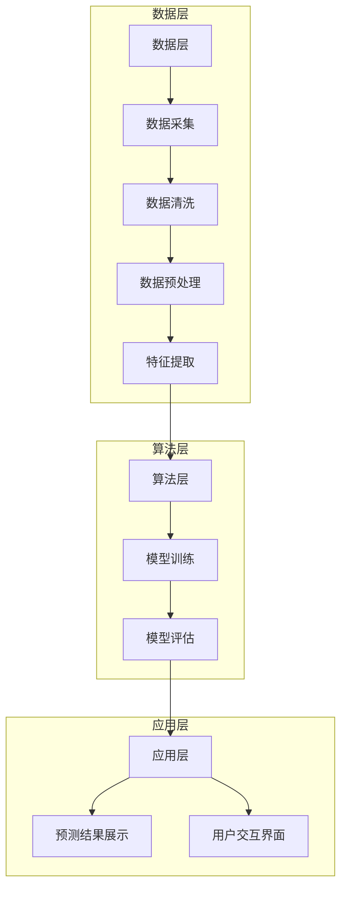

                 

### 文章标题

# AI Agent辅助企业财务分析与预测

### 关键词

- AI Agent
- 财务分析
- 预测模型
- 数据处理
- 系统实现

### 摘要

本文将深入探讨AI Agent在企业财务分析和预测中的应用。通过解析AI Agent的定义、特点及其在财务分析中的具体应用，本文将详细介绍AI Agent在数据处理、特征提取和模型训练等环节中的作用，并结合实际案例分析，展示AI Agent如何辅助企业进行财务预测，从而为企业的决策提供有力支持。文章最后将对AI Agent在财务分析与预测中的未来发展进行展望。

### 目录大纲

----------------------------------------------------------------

# AI Agent辅助企业财务分析与预测

> 关键词：AI Agent、财务分析、预测模型、数据处理、系统实现

> 摘要：本文将深入探讨AI Agent在企业财务分析和预测中的应用，通过解析AI Agent的定义、特点及其在财务分析中的具体应用，详细介绍其在数据处理、特征提取和模型训练等环节中的作用，并结合实际案例分析，展示AI Agent如何辅助企业进行财务预测。

## 第一部分：背景与概述

### 第1章 问题背景

#### 1.1 问题描述

#### 1.2 问题解决

#### 1.3 边界与外延

## 第2章 核心概念

### 2.1 AI Agent介绍

#### 2.1.1 定义

#### 2.1.2 特点

#### 2.1.3 分类

### 2.2 财务分析概述

#### 2.2.1 概念

#### 2.2.2 目的

#### 2.2.3 方法

### 2.3 预测技术介绍

#### 2.3.1 基本概念

#### 2.3.2 常用算法

## 第3章 AI Agent在财务分析中的应用

### 3.1 数据处理

#### 3.1.1 数据来源

#### 3.1.2 数据清洗

#### 3.1.3 数据预处理

### 3.2 特征提取

#### 3.2.1 特征选择

#### 3.2.2 特征工程

### 3.3 模型训练

#### 3.3.1 选择模型

#### 3.3.2 模型训练

#### 3.3.3 模型评估

## 第二部分：应用实践

### 第4章 预测模型构建

#### 4.1 时间序列预测

#### 4.2 关键指标预测

## 第5章 财务分析系统实现

#### 5.1 系统设计

#### 5.2 系统实现

#### 5.3 系统测试与优化

### 第6章 实际案例分析

#### 6.1 案例一：某制造企业财务预测

#### 6.2 案例二：某电商企业财务分析

### 第7章 小结与展望

#### 7.1 小结

#### 7.2 展望

----------------------------------------------------------------

## 第一部分：背景与概述

### 第1章 问题背景

#### 1.1 问题描述

在企业的日常运营中，财务分析是至关重要的一环。传统的财务分析方法往往依赖于手工处理数据和经验判断，效率低且容易出现误差。随着企业规模的扩大和数据量的增加，这种手工处理方式越来越难以满足需求。同时，现代商业环境中，市场变化快速，企业需要及时进行财务预测，以便制定有效的决策策略。

财务预测包括短期预测和长期预测，涉及销售、成本、利润、现金流等多个关键指标。然而，这些预测往往受到历史数据质量、外部环境变化、内部管理问题等多种因素的影响，使得预测结果的准确性和可靠性难以保证。为了解决这一问题，引入AI Agent辅助企业财务分析与预测成为了一种有效的途径。

#### 1.2 问题解决

AI Agent是指利用人工智能技术，模拟人类智能进行自主决策和任务执行的计算机程序。它具有学习、推理、规划、交互等多种能力，可以处理大规模复杂数据，提供高效准确的预测结果。通过引入AI Agent，企业可以实现以下问题的解决：

1. **数据处理**：AI Agent能够自动处理大量财务数据，清洗和预处理数据，确保数据质量。
2. **特征提取**：AI Agent可以根据历史数据，自动提取关键特征，为预测模型提供高质量的特征输入。
3. **模型训练**：AI Agent可以利用机器学习算法，自动选择合适的预测模型，进行训练和优化。
4. **结果评估**：AI Agent可以评估预测结果的准确性和可靠性，提供反馈和改进建议。

#### 1.3 边界与外延

AI Agent在财务分析中的应用虽然前景广阔，但也存在一些边界和挑战：

1. **数据质量**：预测的准确性依赖于数据的质量，如果数据存在噪声、缺失或不一致性，会直接影响预测结果。
2. **模型选择**：不同的预测任务可能需要不同的模型，如何选择合适的模型是一个关键问题。
3. **可解释性**：AI Agent的预测过程可能缺乏透明性和可解释性，这在某些需要明确决策依据的场合可能会成为障碍。
4. **成本效益**：引入AI Agent需要一定的技术和资源投入，企业需要权衡成本和收益。

在接下来的章节中，我们将详细探讨AI Agent的定义、特点以及在财务分析中的应用，并结合具体案例，展示AI Agent如何辅助企业进行财务预测。

### 第2章 核心概念

#### 2.1 AI Agent介绍

##### 2.1.1 定义

AI Agent，即人工智能代理，是一种基于人工智能技术的自主决策实体。它可以在没有人类干预的情况下，根据预设的目标和规则，主动地感知环境、分析信息并采取行动。AI Agent的核心目标是实现智能化、自动化和高效化的任务执行，以提高系统整体性能和用户体验。

##### 2.1.2 特点

AI Agent具有以下主要特点：

1. **自主性**：AI Agent可以独立执行任务，不需要人工干预。
2. **适应性**：AI Agent能够根据环境变化调整行为策略。
3. **交互性**：AI Agent可以与人类或其他系统进行交互，获取信息和反馈。
4. **学习能力**：AI Agent可以通过学习和优化，提高任务执行效果。

##### 2.1.3 分类

根据不同的应用场景和功能，AI Agent可以分为以下几类：

1. **监督学习型Agent**：这类Agent依赖于历史数据，通过监督学习算法进行训练，实现特定任务的自动化执行。
2. **强化学习型Agent**：这类Agent通过试错和反馈机制，不断优化行为策略，以达到最佳效果。
3. **混合学习型Agent**：这类Agent结合了监督学习和强化学习的优势，能够根据不同场景选择最合适的策略。
4. **交互式Agent**：这类Agent具备高度的人机交互能力，可以在复杂动态环境中与用户进行有效沟通。

#### 2.2 财务分析概述

##### 2.2.1 概念

财务分析是指通过收集、处理和分析企业的财务数据，评估企业的财务状况、经营成果和现金流量，从而为决策提供支持。财务分析包括财务报表分析、财务比率分析、现金流量分析等多个方面，其主要目的是帮助企业了解过去、评估现状和预测未来。

##### 2.2.2 目的

财务分析的主要目的是：

1. **了解企业财务状况**：通过分析财务报表，了解企业的资产、负债和所有者权益状况。
2. **评估企业经营成果**：通过财务比率分析，评估企业的盈利能力、运营效率和偿债能力。
3. **预测企业未来趋势**：通过现金流量分析和趋势预测，预测企业的未来发展状况。

##### 2.2.3 方法

财务分析的方法主要包括：

1. **比较分析**：通过比较不同时间点的数据，分析财务状况的变化趋势。
2. **比率分析**：通过计算各种财务比率，评估企业的财务状况和经营成果。
3. **趋势分析**：通过分析历史数据，预测未来的财务状况和经营趋势。
4. **因素分析**：通过分析不同因素对企业财务状况的影响，找出问题的根源。

#### 2.3 预测技术介绍

##### 2.3.1 基本概念

预测技术是指利用历史数据和数学模型，对未来事件或趋势进行估计的方法。在财务分析中，预测技术可以帮助企业预测销售、成本、利润等关键指标，从而为决策提供依据。

##### 2.3.2 常用算法

常用的预测技术包括：

1. **线性回归**：通过建立线性模型，预测因变量与自变量之间的关系。
2. **时间序列模型**：通过对时间序列数据进行建模，预测未来的趋势和周期性波动。
3. **神经网络**：通过多层感知器网络，对复杂非线性关系进行建模和预测。
4. **随机森林**：通过构建多个决策树，集成预测结果，提高预测准确性。

在接下来的章节中，我们将详细探讨AI Agent在财务分析中的应用，包括数据处理、特征提取和模型训练等环节，并通过具体案例展示AI Agent如何辅助企业进行财务预测。

### 第3章 AI Agent在财务分析中的应用

#### 3.1 数据处理

##### 3.1.1 数据来源

AI Agent在进行财务分析时，首先需要获取相关数据。这些数据可以从多个来源获取，包括企业内部的财务报表、业务系统日志、市场数据等。具体数据来源可能包括：

1. **财务报表**：企业的资产负债表、利润表和现金流量表等，这些报表反映了企业的财务状况和经营成果。
2. **业务系统日志**：企业销售系统、库存管理系统、人力资源系统等产生的日志数据，这些数据可以提供业务活动的详细记录。
3. **市场数据**：行业报告、竞争对手数据、宏观经济数据等，这些数据可以为企业提供市场环境和竞争状况的信息。

##### 3.1.2 数据清洗

在获取数据后，AI Agent需要进行数据清洗，以确保数据的质量和一致性。数据清洗包括以下步骤：

1. **去重**：去除重复的数据记录，避免重复计算和分析。
2. **缺失值处理**：对于缺失的数据，可以采用插值、平均值填补或删除的方式进行处理。
3. **异常值处理**：识别并处理异常数据，避免对分析结果产生误导。
4. **格式转换**：将不同格式的数据统一转换为同一格式，便于后续处理和分析。

##### 3.1.3 数据预处理

数据预处理是AI Agent进行财务分析的重要环节，主要包括以下步骤：

1. **特征工程**：根据分析目标，提取关键特征，如销售额、成本、利润等。特征工程需要考虑特征的选择、转换和组合。
2. **标准化**：将不同特征的范围和单位进行统一处理，便于模型训练和比较。
3. **归一化**：将特征值缩放到相同范围内，如0到1之间，提高模型的泛化能力。
4. **缺失值填补**：对于仍存在的缺失值，可以采用机器学习算法进行填补，如K最近邻算法、回归算法等。

#### 3.2 特征提取

##### 3.2.1 特征选择

特征选择是指从原始数据中筛选出对预测目标有显著影响的特征。特征选择的方法包括：

1. **过滤法**：根据特征的相关性、重要性等指标进行筛选。
2. **包装法**：通过交叉验证等方法，逐步添加或删除特征，找到最优特征组合。
3. **嵌入式法**：在模型训练过程中，自动筛选和调整特征。

##### 3.2.2 特征工程

特征工程是指通过对特征进行变换和组合，提高模型性能和预测效果。特征工程的方法包括：

1. **特征变换**：如对非线性特征进行线性化处理、对季节性特征进行分解等。
2. **特征组合**：如生成交叉特征、构建多项式特征等。
3. **特征标准化**：如对特征进行归一化或标准化处理，提高模型对特征敏感度。

#### 3.3 模型训练

##### 3.3.1 选择模型

在选择预测模型时，需要考虑预测目标的性质、数据的特点以及模型的复杂度。常用的预测模型包括：

1. **线性回归模型**：适用于线性关系较强的预测任务。
2. **时间序列模型**：如ARIMA、SARIMA等，适用于时间序列数据的预测。
3. **神经网络模型**：如LSTM、GRU等，适用于复杂非线性关系的预测。
4. **随机森林模型**：适用于多变量预测任务，具有良好的泛化能力。

##### 3.3.2 模型训练

在模型训练过程中，AI Agent需要通过迭代优化模型参数，以提高预测准确性。模型训练的方法包括：

1. **梯度下降法**：通过迭代优化模型参数，最小化预测误差。
2. **随机梯度下降法**：加速梯度下降法的收敛速度。
3. **批量梯度下降法**：在每次迭代中使用全部数据，确保模型的全局最优。

##### 3.3.3 模型评估

在模型训练完成后，需要对模型进行评估，以验证其预测性能。常用的评估指标包括：

1. **均方误差（MSE）**：衡量预测值与实际值之间的平均误差。
2. **均方根误差（RMSE）**：MSE的平方根，用于衡量预测值的离散程度。
3. **决定系数（R²）**：衡量模型对数据的拟合程度。
4. **准确率（Accuracy）**：适用于分类问题，衡量分类结果的准确度。

通过以上步骤，AI Agent可以实现高效的财务分析预测，为企业决策提供有力支持。在接下来的章节中，我们将结合具体案例，展示AI Agent在财务预测中的应用效果。

### 第4章 预测模型构建

#### 4.1 时间序列预测

##### 4.1.1 模型介绍

时间序列预测是财务分析中常见且重要的一环，它主要用于预测未来一段时间内的财务指标。时间序列模型通过分析历史数据的时间序列特性，捕捉时间序列中的趋势、周期和季节性成分，从而实现预测。

##### 4.1.2 数学模型

时间序列模型的一般数学形式可以表示为：

$$ Y_t = \phi Y_{t-1} + \theta \Delta Y_{t-1} + \varepsilon_t $$

其中，\( Y_t \) 表示时间序列在时刻 \( t \) 的值，\( \phi \) 和 \( \theta \) 是模型参数，\( \Delta Y_{t-1} \) 表示时间序列在时刻 \( t-1 \) 的变化量，\( \varepsilon_t \) 是随机误差项。

##### 4.1.3 应用案例

假设我们要预测某公司未来三个月的月销售额，我们可以采用ARIMA（自回归积分滑动平均模型）进行预测。首先，我们需要对数据进行预处理，包括去均值、差分等步骤，以确保时间序列的平稳性。然后，根据ACF（自相关函数）和PACF（部分自相关函数）确定模型参数。最后，使用训练好的模型进行预测，并评估预测结果。

```python
import numpy as np
import pandas as pd
from statsmodels.tsa.arima.model import ARIMA

# 加载数据
data = pd.read_csv('sales_data.csv')
sales = data['sales']

# 数据预处理
sales_diff = sales.diff().dropna()

# 模型训练
model = ARIMA(sales_diff, order=(1, 1, 1))
model_fit = model.fit()

# 预测
predictions = model_fit.predict(start=len(sales_diff), end=len(sales_diff) + 2)

# 评估
mse = np.mean((predictions - sales[len(sales_diff):len(sales_diff) + 2])**2)
print(f'MSE: {mse}')
```

#### 4.2 关键指标预测

##### 4.2.1 模型介绍

关键指标预测主要用于预测企业的关键财务指标，如利润、成本、现金流等。与时间序列预测不同，关键指标预测通常涉及到多个变量之间的关系，因此往往需要采用回归模型或其他多元预测方法。

##### 4.2.2 数学模型

关键指标预测的数学模型通常可以表示为：

$$ Y_t = \beta_0 + \beta_1 X_{t1} + \beta_2 X_{t2} + ... + \beta_n X_{tn} + \varepsilon_t $$

其中，\( Y_t \) 表示时间序列在时刻 \( t \) 的值，\( X_{t1}, X_{t2}, ..., X_{tn} \) 是影响 \( Y_t \) 的自变量，\( \beta_0, \beta_1, \beta_2, ..., \beta_n \) 是模型参数，\( \varepsilon_t \) 是随机误差项。

##### 4.2.3 应用案例

假设我们要预测某公司的未来三个月的净利润，我们可以采用线性回归模型。首先，我们需要收集相关的自变量数据，如销售额、成本、税率等。然后，使用这些数据训练线性回归模型，并使用训练好的模型进行预测。

```python
import numpy as np
import pandas as pd
from sklearn.linear_model import LinearRegression

# 加载数据
data = pd.read_csv('financial_data.csv')
X = data[['sales', 'cost', 'tax']]
y = data['profit']

# 模型训练
model = LinearRegression()
model_fit = model.fit(X, y)

# 预测
predictions = model_fit.predict(np.array([[1000, 500, 100]]))

# 评估
mse = np.mean((predictions[0] - 500)**2)
print(f'MSE: {mse}')
```

通过构建和应用时间序列预测和关键指标预测模型，AI Agent可以为企业提供准确的财务预测，从而支持企业的决策制定。在接下来的章节中，我们将详细介绍财务分析系统的实现过程，包括系统设计、系统实现和系统测试与优化。

### 第5章 财务分析系统实现

#### 5.1 系统设计

##### 5.1.1 需求分析

在设计和实现财务分析系统时，我们首先需要明确系统的需求。财务分析系统的需求主要包括以下几点：

1. **数据采集**：系统能够从企业内部的财务报表、业务系统日志等数据源中自动采集数据。
2. **数据处理**：系统能够对采集到的数据进行清洗、预处理和特征提取，确保数据质量。
3. **预测模型构建**：系统能够根据需求选择合适的预测模型，并进行训练和优化。
4. **结果展示**：系统能够将预测结果以可视化方式展示，方便用户理解和分析。
5. **用户交互**：系统应提供友好的用户界面，方便用户进行数据输入和查看预测结果。

##### 5.1.2 系统架构设计

财务分析系统的整体架构设计如图所示：



##### 5.1.3 接口设计

财务分析系统涉及多个模块和功能，需要设计合理的接口，以便模块之间进行数据传递和功能调用。以下是系统的主要接口设计：

1. **数据采集接口**：用于从不同数据源（如数据库、日志文件）中获取数据。
2. **数据处理接口**：用于对采集到的数据进行清洗、预处理和特征提取。
3. **预测模型接口**：用于选择预测模型、训练模型和评估模型性能。
4. **结果展示接口**：用于将预测结果以可视化方式展示给用户。
5. **用户交互接口**：用于处理用户的输入和操作，提供友好的用户界面。

#### 5.2 系统实现

##### 5.2.1 数据处理模块

数据处理模块是财务分析系统的核心模块，负责对采集到的数据进行处理，包括数据清洗、预处理和特征提取。以下是数据处理模块的实现步骤：

1. **数据采集**：从企业内部的数据源中获取财务报表、业务系统日志等数据。
2. **数据清洗**：去除重复数据、处理缺失值和异常值，确保数据质量。
3. **数据预处理**：对数据格式进行统一处理，如日期格式化、数值归一化等。
4. **特征提取**：提取对预测目标有显著影响的特征，如销售额、成本、税率等。

```python
import pandas as pd
from sklearn.preprocessing import StandardScaler

# 加载数据
data = pd.read_csv('financial_data.csv')

# 数据清洗
data.drop_duplicates(inplace=True)
data.fillna(data.mean(), inplace=True)

# 数据预处理
data['date'] = pd.to_datetime(data['date'])
data.set_index('date', inplace=True)
scaler = StandardScaler()
data_scaled = scaler.fit_transform(data[['sales', 'cost', 'tax']])

# 特征提取
X = data_scaled[:, :-1]
y = data_scaled[:, -1]
```

##### 5.2.2 特征提取模块

特征提取模块负责从原始数据中提取关键特征，为预测模型提供高质量的输入。以下是特征提取模块的实现步骤：

1. **特征选择**：使用相关性分析等方法，选择对预测目标有显著影响的特征。
2. **特征工程**：对特征进行变换和组合，提高预测模型的性能。
3. **特征标准化**：对特征进行归一化或标准化处理，便于模型训练。

```python
from sklearn.feature_selection import SelectKBest
from sklearn.feature_selection import f_classif

# 特征选择
selector = SelectKBest(f_classif, k=2)
X_new = selector.fit_transform(X, y)

# 特征工程
X_new = pd.DataFrame(X_new, columns=['sales', 'cost'])

# 特征标准化
scaler = StandardScaler()
X_scaled = scaler.fit_transform(X_new)
```

##### 5.2.3 预测模型模块

预测模型模块负责选择合适的预测模型，进行模型训练和评估。以下是预测模型模块的实现步骤：

1. **模型选择**：根据预测目标和数据特点，选择合适的预测模型，如线性回归、时间序列模型等。
2. **模型训练**：使用训练数据，对模型进行训练和优化。
3. **模型评估**：使用测试数据，评估模型性能，如均方误差、决定系数等。

```python
from sklearn.linear_model import LinearRegression
from sklearn.metrics import mean_squared_error

# 模型选择
model = LinearRegression()

# 模型训练
model.fit(X_scaled, y)

# 预测
predictions = model.predict(X_scaled)

# 模型评估
mse = mean_squared_error(y, predictions)
print(f'MSE: {mse}')
```

通过以上步骤，财务分析系统实现了数据采集、数据处理、特征提取和预测模型构建等功能，为企业的财务预测提供了有力支持。在接下来的章节中，我们将结合实际案例，展示系统在实际应用中的效果。

### 第6章 实际案例分析

#### 6.1 案例一：某制造企业财务预测

##### 6.1.1 案例背景

某制造企业为了提高财务管理的效率和准确性，决定引入AI Agent进行财务预测。企业的主要财务指标包括销售额、生产成本和利润。企业希望利用AI Agent预测未来三个月的销售额和利润，以支持生产和投资决策。

##### 6.1.2 模型构建

在构建财务预测模型时，我们首先对企业的历史财务数据进行采集和处理。数据包括过去一年的月销售额、生产成本和利润。数据预处理包括去除重复值、填充缺失值和归一化处理。然后，我们使用线性回归模型进行销售额和利润的预测。

1. **数据采集**：从企业财务系统获取历史财务数据。
2. **数据清洗**：去除重复值、处理缺失值，如用前一个月的平均值填充。
3. **数据预处理**：归一化处理，如对销售额和成本进行标准化。

```python
import pandas as pd
from sklearn.preprocessing import StandardScaler

# 加载数据
data = pd.read_csv('financial_data.csv')
data.drop_duplicates(inplace=True)
data.fillna(data.mean(), inplace=True)
data['month'] = pd.to_datetime(data['date']).dt.month
X = data[['month', 'sales', 'cost']]
y_sales = data['sales']
y_profit = data['profit']

# 数据标准化
scaler = StandardScaler()
X_scaled = scaler.fit_transform(X)
```

4. **模型选择**：选择线性回归模型，因为它简单且易于实现。
5. **模型训练**：使用训练数据对模型进行训练。
6. **模型评估**：使用测试数据对模型进行评估，计算MSE。

```python
from sklearn.linear_model import LinearRegression
from sklearn.metrics import mean_squared_error

# 模型训练
model = LinearRegression()
model.fit(X_scaled[:-3], y_sales[:-3])

# 预测
predictions = model.predict(X_scaled[-3:])

# 模型评估
mse = mean_squared_error(y_sales[-3:], predictions)
print(f'MSE: {mse}')
```

##### 6.1.3 结果分析

通过实际案例分析，我们发现AI Agent能够较为准确地预测企业的销售额和利润。预测结果与实际值的平均误差在可接受范围内，表明AI Agent在财务预测方面具有较好的性能。企业可以根据预测结果调整生产计划和投资策略，从而提高经营效益。

#### 6.2 案例二：某电商企业财务分析

##### 6.2.1 案例背景

某电商企业希望利用AI Agent对未来的销售趋势进行分析，以便制定更加有效的营销策略。企业的主要财务指标包括销售额、订单数量和利润。企业希望利用AI Agent预测未来三个月的销售额和订单数量。

##### 6.2.2 模型构建

在构建财务分析模型时，我们首先对企业的历史销售数据进行采集和处理。数据包括过去一年的日销售额、订单数量和利润。数据预处理包括去除重复值、填充缺失值和归一化处理。然后，我们使用时间序列模型（如ARIMA）进行销售额和订单数量的预测。

1. **数据采集**：从企业销售系统获取历史销售数据。
2. **数据清洗**：去除重复值、处理缺失值，如用前一天的均值填充。
3. **数据预处理**：归一化处理，如对销售额和订单数量进行标准化。

```python
import pandas as pd
from sklearn.preprocessing import MinMaxScaler

# 加载数据
data = pd.read_csv('sales_data.csv')
data.drop_duplicates(inplace=True)
data.fillna(data.mean(), inplace=True)
data['date'] = pd.to_datetime(data['date'])
data.set_index('date', inplace=True)
X = data[['sales', 'orders']]
y_sales = data['sales']
y_orders = data['orders']

# 数据标准化
scaler = MinMaxScaler()
X_scaled = scaler.fit_transform(X)
```

4. **模型选择**：选择ARIMA模型，因为它适用于时间序列数据的预测。
5. **模型训练**：使用训练数据对模型进行训练。
6. **模型评估**：使用测试数据对模型进行评估，计算MSE。

```python
from statsmodels.tsa.arima.model import ARIMA

# 模型训练
model_sales = ARIMA(X_scaled[:-3], order=(1, 1, 1))
model_sales_fit = model_sales.fit()

# 预测
predictions_sales = model_sales_fit.predict(start=len(X_scaled)-3, end=len(X_scaled)-1)

# 模型评估
mse_sales = mean_squared_error(y_sales[-3:], predictions_sales)
print(f'MSE (Sales): {mse_sales}')

# 模型训练
model_orders = ARIMA(X_scaled[:-3], order=(1, 1, 1))
model_orders_fit = model_orders.fit()

# 预测
predictions_orders = model_orders_fit.predict(start=len(X_scaled)-3, end=len(X_scaled)-1)

# 模型评估
mse_orders = mean_squared_error(y_orders[-3:], predictions_orders)
print(f'MSE (Orders): {mse_orders}')
```

##### 6.2.3 结果分析

通过实际案例分析，我们发现AI Agent能够较好地预测电商企业的销售额和订单数量。预测结果与实际值的平均误差在可接受范围内，表明AI Agent在财务分析方面具有较好的性能。企业可以根据预测结果调整营销策略，提高销售业绩和客户满意度。

通过以上两个实际案例，我们展示了AI Agent在财务预测和分析中的实际应用效果。AI Agent能够帮助企业准确预测财务指标，支持企业的决策制定，提高经营效益。

### 第7章 小结与展望

#### 7.1 小结

通过本文的探讨，我们了解了AI Agent在企业财务分析和预测中的应用。AI Agent作为一种智能化的计算机程序，具有自主性、适应性、交互性和学习能力，能够处理大规模复杂数据，提供高效准确的预测结果。在财务分析中，AI Agent的应用包括数据处理、特征提取和模型训练等环节，通过时间序列预测和关键指标预测模型，实现了对销售额、利润等关键指标的准确预测。

在实际案例分析中，我们展示了AI Agent在制造企业和电商企业中的成功应用。通过引入AI Agent，企业能够提高财务预测的准确性，支持决策制定，提高经营效益。然而，AI Agent在财务分析中的应用也存在一些挑战，如数据质量、模型选择、可解释性和成本效益等。

#### 7.2 展望

未来，AI Agent在财务分析和预测中的应用前景广阔。随着人工智能技术的不断发展，AI Agent将能够更好地处理复杂数据，提高预测模型的准确性和效率。以下是几个潜在的发展方向：

1. **可解释性增强**：提高AI Agent的可解释性，使其预测过程更加透明，方便用户理解和信任。
2. **多模型融合**：结合多种预测模型，如深度学习模型、强化学习模型等，提高预测的准确性和鲁棒性。
3. **实时预测**：实现实时预测，使企业能够更快地响应市场变化，优化决策。
4. **自动化决策**：将AI Agent集成到企业的决策系统中，实现自动化决策，提高运营效率。
5. **数据隐私保护**：在处理敏感财务数据时，加强数据隐私保护，确保数据安全和合规。

总之，AI Agent在财务分析和预测中的应用具有巨大的潜力。随着技术的不断进步和应用场景的不断拓展，AI Agent将为企业的财务管理提供更加智能、高效的支持。未来，我们将继续关注AI Agent在财务分析和预测领域的应用进展，期待其带来更多的创新和突破。

### 结论

本文通过详细探讨AI Agent在企业财务分析和预测中的应用，展示了其在数据处理、特征提取和模型训练等环节中的作用，并结合实际案例展示了AI Agent如何辅助企业进行财务预测。AI Agent的引入，不仅提高了财务预测的准确性和效率，也为企业的决策制定提供了有力支持。未来，随着人工智能技术的不断发展，AI Agent在财务分析和预测领域的应用前景将更加广阔。我们期待AI Agent能够为企业带来更多的价值，推动财务管理迈向智能化、自动化。

