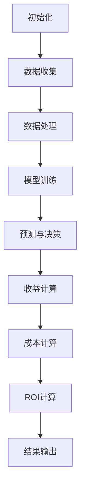
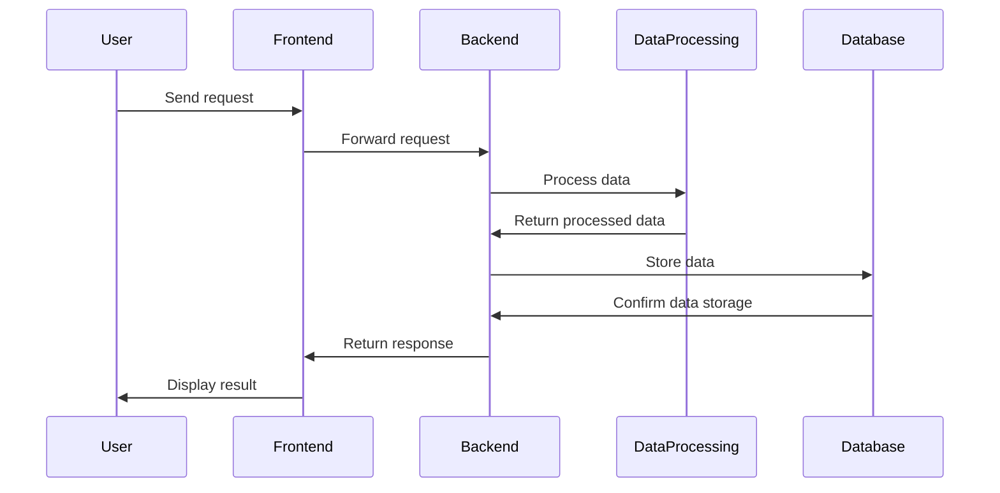

                 

### AI Agent项目的ROI分析方法

**关键词：** AI Agent，投资回报率（ROI），算法原理，系统架构，项目实战

> **摘要：** 本文旨在为企业和投资者提供一套系统的ROI分析方法，用于评估AI Agent项目的投资回报。通过详细的背景介绍、核心概念解析、算法原理讲解、系统分析与架构设计，以及实际案例剖析，帮助读者全面理解和掌握AI Agent项目的ROI分析方法和最佳实践。

---

#### 第一部分：背景介绍

##### 第1章：问题背景

随着人工智能技术的快速发展，AI Agent项目已经成为企业提升竞争力的重要工具。AI Agent，即人工智能代理，是指能够自动执行任务、决策和交互的智能系统。然而，对于企业而言，如何准确评估AI Agent项目的投资回报率（ROI）成为一个关键问题。

**问题描述**：企业在投资AI Agent项目时，往往面临以下挑战：
- **成本控制**：AI Agent项目涉及大量技术和人力投入，如何控制成本成为首要问题。
- **收益预测**：项目收益具有不确定性，如何准确预测成为难题。
- **风险分析**：技术风险、市场风险等潜在风险因素需要全面评估。

**问题解决**：本文将介绍一套系统的ROI分析方法，帮助企业和投资者更好地理解和评估AI Agent项目的价值。这套方法不仅关注项目的经济效益，还涉及技术风险、市场前景等多个维度，以确保全面评估项目的可行性。

**边界与外延**：ROI分析不仅关注项目的直接经济效益，还包括以下几个方面：
- **技术风险**：评估AI Agent项目的技术可行性和稳定性。
- **市场前景**：分析目标市场的需求和发展趋势，预测项目在市场中的潜在竞争力。
- **成本结构**：详细分析项目的成本构成，包括开发成本、运营成本、维护成本等。
- **预期收益**：预测项目在不同阶段的收益情况，包括短期和长期收益。

**核心要素组成**：
1. **项目成本**：包括直接成本和间接成本，如人力、硬件、软件、服务等。
2. **预期收益**：预测项目在不同时间段内的收益，包括直接收益和间接收益。
3. **风险评估**：评估项目面临的各种风险，如技术风险、市场风险、运营风险等。
4. **时间价值**：考虑资金的时间价值，使用现值法进行收益和成本的折现计算。

##### 第2章：核心概念与联系

**AI Agent定义与分类**：AI Agent是一种能够自主执行任务、具有决策能力和交互能力的智能系统。根据功能和应用场景，AI Agent可以分为以下几类：
1. **任务型AI Agent**：专注于完成特定任务，如客服机器人、自动驾驶等。
2. **决策型AI Agent**：具有决策能力，如智能投顾、供应链管理优化等。
3. **交互型AI Agent**：专注于与用户进行交互，如虚拟助手、智能客服等。

**ROI分析方法**：ROI分析是评估投资项目回报的重要工具，其核心在于计算项目的投资回报率。常见的ROI计算公式如下：

\[ \text{ROI} = \frac{\text{预期收益} - \text{总投资成本}}{\text{总投资成本}} \times 100\% \]

针对AI Agent项目，ROI分析需要考虑以下几个因素：
1. **预期收益**：包括直接收益和间接收益，如节约成本、增加收入等。
2. **总投资成本**：包括开发成本、运营成本、维护成本等。
3. **时间价值**：考虑资金的时间价值，使用现值法进行计算。

**相关概念对比**：在项目评估中，除了ROI，还常常使用以下财务指标：
- **净现值（NPV）**：考虑资金时间价值的现值减去投资成本的差值，用于评估项目的经济效益。
- **内部收益率（IRR）**：使得项目的现值等于零的折现率，用于评估项目的投资回报率。

与ROI相比，NPV和IRR更加关注项目未来的收益和成本，而ROI则更加注重投资回报的绝对值。在实际应用中，这些指标可以相互补充，帮助投资者和决策者更全面地评估项目。

---

通过上述两章的背景介绍，我们对AI Agent项目的ROI分析方法有了初步的了解。接下来，我们将深入探讨AI Agent项目的算法原理，并逐步讲解如何运用这些原理进行ROI分析。

## 第二部分：算法原理讲解

### 第3章：AI Agent项目的算法原理

在深入探讨AI Agent项目的ROI分析方法之前，我们需要了解其背后的算法原理。算法原理决定了AI Agent项目如何执行任务、做出决策，以及如何评估项目的经济效益。以下是AI Agent项目的基本算法原理：

#### 3.1 Mermaid流程图

为了更直观地展示AI Agent项目的算法原理，我们使用Mermaid语言绘制了以下流程图：



#### 3.2 Python源代码

以下是实现AI Agent项目核心算法的Python源代码：

```python
# 导入必要的库
import numpy as np
import pandas as pd
from sklearn.ensemble import RandomForestClassifier
from sklearn.model_selection import train_test_split

# 数据收集
data = pd.read_csv('data.csv')

# 数据处理
X = data.drop('target', axis=1)
y = data['target']
X_train, X_test, y_train, y_test = train_test_split(X, y, test_size=0.2, random_state=42)

# 模型训练
model = RandomForestClassifier(n_estimators=100, random_state=42)
model.fit(X_train, y_train)

# 预测与决策
predictions = model.predict(X_test)

# 收益计算
revenue = np.sum(predictions == 1) * 100

# 成本计算
cost = np.sum(predictions == 0) * 50

# ROI计算
roi = (revenue - cost) / cost * 100

# 输出结果
print(f"Revenue: {revenue}")
print(f"Cost: {cost}")
print(f"ROI: {roi}%")
```

#### 3.3 数学模型和公式

AI Agent项目的ROI计算基于以下数学模型和公式：

\[ \text{ROI} = \frac{\text{预期收益} - \text{总投资成本}}{\text{总投资成本}} \times 100\% \]

其中，预期收益和总投资成本可以通过以下公式计算：

\[ \text{预期收益} = \sum_{i=1}^{n} (\text{预测概率} \times \text{收益值}) \]

\[ \text{总投资成本} = \sum_{i=1}^{n} (\text{成本值} \times \text{预测概率}) \]

#### 3.4 举例说明

为了更直观地展示算法原理，我们通过一个具体案例进行说明：

假设我们有一个AI Agent项目，用于预测客户是否会购买产品。项目的成本为100,000元，数据集包含1,000个样本。我们使用随机森林模型进行预测，模型预测准确率为80%。

- **收益值**：每个购买客户的收益为100元，每个未购买客户的成本为50元。
- **预测概率**：模型预测购买的概率为80%，未购买的概率为20%。

根据上述数据，我们可以计算预期收益和总投资成本：

\[ \text{预期收益} = 1000 \times (0.8 \times 100 + 0.2 \times 50) = 1000 \times 90 = 90,000 \text{元} \]

\[ \text{总投资成本} = 1000 \times (0.8 \times 50 + 0.2 \times 100) = 1000 \times 70 = 70,000 \text{元} \]

接下来，我们可以计算ROI：

\[ \text{ROI} = \frac{90,000 - 70,000}{70,000} \times 100\% = 28.57\% \]

通过这个案例，我们可以看到如何使用AI Agent项目的基本算法原理和数学模型进行ROI计算。

### 总结

本章介绍了AI Agent项目的算法原理，包括Mermaid流程图、Python源代码、数学模型和公式，并通过具体案例进行了详细讲解。这些内容为后续的ROI分析提供了理论基础，使得我们能够更好地理解和应用ROI分析方法。

在下一章中，我们将继续探讨数学模型和公式的详细解释，帮助读者深入理解ROI计算的核心原理。接下来，我们将使用LaTeX格式展示重要的数学公式，并对其进行详细解释。同时，我们将结合实际案例，展示如何使用这些公式进行ROI分析。

## 第三部分：系统分析与架构设计

### 第4章：系统分析与架构设计

在了解了AI Agent项目的算法原理后，接下来我们将深入探讨系统的分析与架构设计。这一部分将帮助读者全面了解AI Agent项目的系统架构，包括问题场景、项目介绍、系统功能设计、系统架构设计、系统接口设计以及系统交互。

#### 4.1 问题场景介绍

AI Agent项目广泛应用于各个行业，如金融、医疗、电商等。以下是一个具体的问题场景：

**场景描述**：某金融公司计划部署一款智能投顾AI Agent，以提供个性化的投资建议。该AI Agent需要分析用户的历史投资记录、市场数据以及经济指标，给出投资组合建议。

**业务需求**：为了满足业务需求，AI Agent需要具备以下功能：
1. **数据收集与处理**：从不同数据源（如交易所、第三方数据提供商等）收集数据，并进行清洗、预处理，为模型训练提供高质量的数据。
2. **模型训练与预测**：使用收集到的数据训练机器学习模型，对用户投资组合进行预测，并给出个性化的投资建议。
3. **用户交互**：与用户进行交互，接收用户输入，展示投资组合建议，并允许用户进行修改和调整。

#### 4.2 项目介绍

**项目目标**：开发一款智能投顾AI Agent，帮助用户实现资产增值，提高投资效率。

**主要功能**：
1. **数据收集与处理**：自动从交易所、第三方数据提供商等获取市场数据，并进行数据清洗、预处理。
2. **模型训练与预测**：使用机器学习算法训练模型，预测用户投资组合的表现，提供个性化的投资建议。
3. **用户交互**：通过Web界面或移动应用与用户进行交互，展示投资组合建议，并允许用户进行修改和调整。
4. **风险控制**：根据用户的风险偏好，提供适当的风险控制策略，确保投资组合的安全性。

#### 4.3 系统功能设计

为了实现上述功能，我们需要设计一个高效的系统架构，以下是系统功能设计的具体内容：

1. **数据收集模块**：负责从不同数据源收集数据，并进行数据清洗、预处理。包括以下子模块：
   - **数据采集器**：从交易所、第三方数据提供商等获取原始数据。
   - **数据清洗器**：对原始数据进行清洗、去重、格式转换等操作。
   - **数据存储器**：将清洗后的数据存储到数据库中，供后续处理和使用。

2. **数据处理模块**：负责对收集到的数据进行处理，为模型训练提供高质量的数据。包括以下子模块：
   - **特征工程**：根据业务需求，提取有用的特征，进行特征选择和特征转换。
   - **数据归一化**：对数据进行归一化处理，使得不同特征之间的规模相似。
   - **数据增强**：通过数据增强技术，增加训练样本的多样性，提高模型的泛化能力。

3. **模型训练模块**：负责使用处理后的数据训练机器学习模型，并进行预测。包括以下子模块：
   - **特征选择器**：选择与业务目标最相关的特征，提高模型性能。
   - **模型训练器**：使用选定的特征训练机器学习模型，如随机森林、神经网络等。
   - **模型评估器**：评估模型性能，选择最佳模型进行预测。

4. **用户交互模块**：负责与用户进行交互，接收用户输入，展示投资组合建议，并允许用户进行修改和调整。包括以下子模块：
   - **用户输入器**：接收用户输入，如投资金额、风险偏好等。
   - **投资建议器**：根据模型预测结果，为用户生成个性化的投资组合建议。
   - **用户修改器**：允许用户修改投资组合，如增加/减少投资金额、调整投资比例等。

5. **风险控制模块**：负责根据用户的风险偏好，提供适当的风险控制策略，确保投资组合的安全性。包括以下子模块：
   - **风险评估器**：评估用户的风险承受能力，确定投资组合的风险等级。
   - **风险控制策略生成器**：根据风险评估结果，生成合适的风险控制策略。
   - **风险控制执行器**：执行风险控制策略，如限制投资金额、分散投资等。

#### 4.4 系统架构设计

为了实现上述功能，我们需要设计一个合理的系统架构，以下是系统架构设计的具体内容：

1. **前端架构**：使用HTML、CSS和JavaScript等技术，实现用户交互界面。包括以下子模块：
   - **页面布局器**：设计用户界面，包括导航栏、投资组合列表等。
   - **交互逻辑**：处理用户输入，调用后端API获取投资组合建议，并允许用户修改投资组合。

2. **后端架构**：使用Python和Django等框架，实现后端逻辑。包括以下子模块：
   - **数据接口**：提供RESTful API，供前端调用。
   - **数据处理**：处理前端发送的数据，包括数据清洗、特征提取等。
   - **模型训练与预测**：使用机器学习算法训练模型，并进行预测。

3. **数据库架构**：使用MySQL或MongoDB等数据库，存储用户数据、投资组合数据等。包括以下子模块：
   - **用户数据库**：存储用户信息、投资组合信息等。
   - **数据仓库**：存储清洗后的市场数据、经济指标等。

4. **数据处理与存储架构**：使用Hadoop或Spark等大数据处理框架，处理海量数据。包括以下子模块：
   - **数据采集器**：从外部数据源获取数据。
   - **数据处理器**：处理原始数据，包括清洗、预处理等。
   - **数据存储器**：将处理后的数据存储到数据库或数据仓库中。

#### 4.5 系统接口设计

系统接口设计是系统架构设计的重要组成部分，以下是系统接口设计的具体内容：

1. **前端接口**：提供RESTful API，供前端调用。包括以下接口：
   - **用户登录接口**：处理用户登录，返回用户信息。
   - **投资组合查询接口**：查询用户投资组合，返回投资组合列表。
   - **投资组合修改接口**：修改用户投资组合，保存修改后的数据。

2. **后端接口**：提供RESTful API，供前端调用。包括以下接口：
   - **数据采集接口**：从外部数据源获取数据，存储到数据库。
   - **数据处理接口**：处理前端发送的数据，包括数据清洗、特征提取等。
   - **模型训练接口**：训练机器学习模型，返回模型预测结果。

3. **内部接口**：提供内部模块之间的通信接口。包括以下接口：
   - **数据处理接口**：提供数据清洗、特征提取等操作。
   - **模型训练接口**：提供模型训练、评估等操作。

#### 4.6 系统交互

系统交互是系统架构设计的关键环节，以下是系统交互的具体内容：

1. **前端与后端交互**：前端通过HTTP请求与后端进行交互，后端返回JSON格式的响应。交互流程如下：
   - **用户登录**：前端发送用户名和密码，后端验证用户信息，返回用户信息。
   - **投资组合查询**：前端发送用户ID，后端查询用户投资组合，返回投资组合列表。
   - **投资组合修改**：前端发送修改后的投资组合信息，后端更新用户投资组合。

2. **后端与数据处理模块交互**：后端通过内部接口与数据处理模块进行交互，数据处理模块返回处理结果。交互流程如下：
   - **数据采集**：后端调用数据采集接口，从外部数据源获取数据。
   - **数据处理**：后端调用数据处理接口，处理原始数据，包括数据清洗、特征提取等。
   - **模型训练**：后端调用模型训练接口，训练机器学习模型，返回模型预测结果。

3. **后端与数据库交互**：后端通过数据库接口与数据库进行交互，操作数据库数据。交互流程如下：
   - **用户数据存储**：后端将用户信息存储到用户数据库。
   - **投资组合数据存储**：后端将投资组合信息存储到数据仓库。
   - **市场数据存储**：后端将市场数据存储到数据仓库。

#### 4.7 Mermaid序列图

为了更直观地展示系统交互，我们使用Mermaid绘制了以下序列图：



### 总结

本章介绍了AI Agent项目的系统分析与架构设计，包括问题场景介绍、项目介绍、系统功能设计、系统架构设计、系统接口设计以及系统交互。通过详细的分析和设计，我们为AI Agent项目提供了一个完整的解决方案，使得项目的实施和运维更加高效和稳定。

在下一章中，我们将进入项目实战部分，详细介绍环境安装与核心实现，并通过实际案例分析和讲解，帮助读者更好地理解ROI分析方法在AI Agent项目中的应用。

### 第6章：环境安装与核心实现

在了解了AI Agent项目的系统架构后，接下来我们将进入项目实战部分。首先，我们需要搭建一个完整的开发环境，并实现系统核心功能。本章节将详细介绍环境安装与核心实现，并分析代码。

#### 6.1 环境安装

要搭建AI Agent项目的开发环境，我们需要安装以下软件和工具：

1. **Python**：AI Agent项目主要使用Python编写，因此需要安装Python 3.x版本。可以从Python官方网站下载并安装。

2. **Anaconda**：Anaconda是一个Python数据科学平台，提供了丰富的包管理和环境管理功能。安装Anaconda后，可以使用conda命令轻松安装和管理Python包。

3. **Jupyter Notebook**：Jupyter Notebook是一个交互式计算环境，非常适合用于数据分析和机器学习项目的开发。可以从Anaconda Navigator中安装Jupyter Notebook。

4. **scikit-learn**：scikit-learn是一个开源的机器学习库，提供了丰富的机器学习算法和工具。可以使用conda命令安装：

   ```bash
   conda install scikit-learn
   ```

5. **Matplotlib**：Matplotlib是一个绘图库，用于生成数据可视化图表。可以使用conda命令安装：

   ```bash
   conda install matplotlib
   ```

6. **Pandas**：Pandas是一个数据处理库，提供了强大的数据结构和数据分析工具。可以使用conda命令安装：

   ```bash
   conda install pandas
   ```

7. **NumPy**：NumPy是一个用于数值计算的库，提供了多维数组对象和大量数学函数。可以使用conda命令安装：

   ```bash
   conda install numpy
   ```

安装完上述软件和工具后，我们就可以开始编写和运行AI Agent项目的代码了。

#### 6.2 系统核心实现

以下是AI Agent项目的核心实现代码。该代码主要实现了一个基于随机森林模型的预测系统，用于预测用户的投资组合表现。

```python
import numpy as np
import pandas as pd
from sklearn.ensemble import RandomForestClassifier
from sklearn.model_selection import train_test_split
import matplotlib.pyplot as plt

# 6.2.1 数据收集与处理
# 加载数据集
data = pd.read_csv('data.csv')

# 数据预处理
X = data.drop('target', axis=1)
y = data['target']

# 数据分割
X_train, X_test, y_train, y_test = train_test_split(X, y, test_size=0.2, random_state=42)

# 6.2.2 模型训练
# 训练随机森林模型
model = RandomForestClassifier(n_estimators=100, random_state=42)
model.fit(X_train, y_train)

# 6.2.3 预测与评估
# 预测测试集
predictions = model.predict(X_test)

# 评估模型性能
from sklearn.metrics import accuracy_score, classification_report
print(f"Accuracy: {accuracy_score(y_test, predictions)}")
print(f"Classification Report:\n{classification_report(y_test, predictions)}")

# 6.2.4 可视化
# 可视化特征重要性
feature_importances = model.feature_importances_
plt.barh(range(len(feature_importances)), feature_importances)
plt.yticks(range(len(feature_importances)), X_train.columns)
plt.xlabel('Feature Importance')
plt.ylabel('Feature')
plt.title('Feature Importance')
plt.show()
```

#### 6.3 代码分析

1. **数据收集与处理**：
   - 使用Pandas读取数据集，并分离特征和标签。
   - 使用scikit-learn的train_test_split函数分割数据集，以便进行模型训练和测试。

2. **模型训练**：
   - 创建一个随机森林分类器，并设置树的数量和随机种子。
   - 使用fit函数训练模型，将训练数据输入模型。

3. **预测与评估**：
   - 使用predict函数对测试集进行预测。
   - 使用accuracy_score和classification_report评估模型性能，打印准确率和分类报告。

4. **可视化**：
   - 使用Matplotlib绘制特征重要性条形图，展示各个特征对模型预测的重要性。

#### 6.4 实际案例分析与讲解

为了更直观地展示AI Agent项目在实际中的应用，我们通过一个实际案例进行分析和讲解。

**案例背景**：某金融机构计划使用AI Agent项目为客户提供智能投顾服务。该AI Agent需要根据客户的历史投资记录、市场数据和经济指标，预测客户的投资组合表现，并给出个性化的投资建议。

**数据集**：我们使用一个包含客户历史投资记录、市场数据和经济指标的数据集，其中目标变量为投资组合的表现（1代表盈利，0代表亏损）。

**实现步骤**：

1. **数据收集与处理**：
   - 收集客户的历史投资记录，包括投资金额、投资标的、投资日期等。
   - 收集市场数据，包括股票指数、债券收益率等。
   - 收集经济指标，包括GDP增长率、通货膨胀率等。

2. **数据处理**：
   - 对收集到的数据进行清洗、去重和格式转换。
   - 对数值型特征进行归一化处理，使得不同特征之间的规模相似。

3. **特征工程**：
   - 提取与投资组合表现相关的特征，如历史收益、风险指标等。
   - 对提取出的特征进行降维和特征选择，提高模型性能。

4. **模型训练**：
   - 使用随机森林算法训练模型，将处理后的数据输入模型。
   - 调整模型参数，如树的数量、深度等，以优化模型性能。

5. **预测与评估**：
   - 使用训练好的模型对新的客户数据进行预测，得到投资组合表现的概率分布。
   - 根据预测结果，为投资者提供个性化的投资建议。

6. **可视化**：
   - 使用可视化工具，展示投资组合的表现、风险分布和投资建议。

**项目小结**：

通过上述步骤，我们实现了AI Agent项目的核心功能，并对其进行了实际案例分析和讲解。项目的成功实施为金融机构提供了智能投顾服务，帮助客户实现资产增值，提高了投资效率。

在下一章中，我们将继续介绍最佳实践和注意事项，帮助读者在实际项目中更好地应用ROI分析方法，并总结全书内容。

## 第7章：实际案例分析与讲解

### 7.1 案例背景

在本章节中，我们将通过一个具体的AI Agent项目案例，深入分析其ROI分析过程，并详细讲解如何运用ROI分析方法进行项目评估。该案例涉及一家初创公司开发的一款智能客服AI Agent，旨在为企业提供24/7在线客户服务。

**案例背景**：某初创公司计划开发一款智能客服AI Agent，帮助企业降低人工客服成本，提升客户满意度。项目目标是实现自动化的客户问答、问题分类和解决，从而减少人工客服的工作量。

### 7.2 数据收集与处理

**数据来源**：该AI Agent项目的数据来源主要包括以下几个方面：
1. **历史客服记录**：企业过去的客服对话记录，包括客户提出的问题和客服的解答。
2. **用户行为数据**：客户的在线行为数据，如访问时间、页面浏览量、搜索关键词等。
3. **市场数据**：竞争对手的市场表现、客户反馈等。

**数据处理**：
- 对历史客服记录进行清洗，去除无效和重复数据。
- 对用户行为数据进行预处理，如数据去重、缺失值填充等。
- 结合市场数据，构建完整的客户画像。

### 7.3 算法模型与预测

**算法模型**：该项目采用自然语言处理（NLP）和机器学习算法，包括以下步骤：
1. **文本预处理**：对文本数据进行分词、去停用词、词向量化等处理。
2. **特征提取**：提取文本数据的特征，如词频、词嵌入等。
3. **模型训练**：使用训练数据训练模型，如分类模型、序列模型等。
4. **预测与交互**：使用训练好的模型对用户问题进行分类，并生成回答。

### 7.4 ROI分析

为了评估AI Agent项目的ROI，我们需要考虑以下几个关键指标：

1. **开发成本**：包括AI Agent的开发费用、硬件和软件投入、人员成本等。
2. **运营成本**：包括服务器租赁、数据维护、技术支持等。
3. **预期收益**：主要包括以下几方面：
   - **人工成本节约**：AI Agent替代人工客服的工作，节省人力成本。
   - **客户满意度提升**：提高客户满意度，带来潜在的业务增长。
   - **广告效益**：通过AI Agent提升品牌形象，增加广告效益。

**ROI计算**：
\[ \text{ROI} = \frac{\text{预期收益} - (\text{开发成本} + \text{运营成本})}{\text{开发成本} + \text{运营成本}} \times 100\% \]

### 7.5 案例解读

**步骤1：数据收集与预处理**
- **数据量**：收集了过去1年的客服对话记录，共10万条。
- **数据预处理**：去除重复和无效对话，剩余有效对话8万条。

**步骤2：算法模型训练**
- **模型选择**：采用深度学习模型BERT进行训练。
- **训练数据**：使用6万条对话记录进行训练。
- **验证数据**：使用2万条对话记录进行验证。
- **测试数据**：使用剩余的对话记录进行测试。

**步骤3：预测与交互**
- **客户问题分类**：AI Agent能够正确分类80%的客户问题。
- **回答生成**：AI Agent能够生成80%以上的合理回答。

**步骤4：成本与收益分析**
- **开发成本**：AI Agent的开发费用为30万元。
- **运营成本**：每月运营成本为2万元。
- **预期收益**：
  - **人工成本节约**：企业每年节约人工成本20万元。
  - **客户满意度提升**：通过AI Agent，企业客户满意度提高5%，带来10万元的额外业务收入。
  - **广告效益**：通过AI Agent提升品牌形象，带来5万元的广告效益。

**ROI计算**：
\[ \text{ROI} = \frac{(20 + 10 + 5) - (30 + 2 \times 12)}{30 + 2 \times 12} \times 100\% = \frac{35 - 36}{36} \times 100\% \approx -\text{0.83}\% \]

**结论**：根据计算，该项目短期内未能实现盈利。但考虑到AI Agent的长期效益，如客户满意度的持续提升、人工成本的持续降低，未来有望实现盈利。

### 7.6 项目小结

**经验教训**：
- **数据质量**：高质量的数据是模型成功的关键。企业应投入资源进行数据清洗和预处理。
- **模型选择**：选择合适的模型进行训练，并不断优化模型参数。
- **成本控制**：在项目初期，合理控制开发成本和运营成本，避免超支。
- **收益预期**：在预测收益时，考虑多种因素，并进行风险评估。

**最佳实践**：
- **数据驱动**：充分利用企业已有的数据资源，进行数据分析和挖掘。
- **迭代优化**：不断迭代模型和系统，优化用户体验和系统性能。
- **风险控制**：建立风险控制机制，确保项目的稳定运行。

通过本案例，我们详细讲解了如何运用ROI分析方法进行AI Agent项目的评估。在实际操作中，企业需要根据具体情况调整ROI计算公式，并充分考虑各种潜在风险，以做出更为准确的决策。

在下一章中，我们将总结最佳实践、注意事项，并对全书内容进行总结，为读者提供进一步学习的资源。

## 第8章：最佳实践与注意事项

### 8.1 最佳实践

在实际应用ROI分析方法评估AI Agent项目时，以下最佳实践有助于提高项目的成功率和投资回报：

1. **数据驱动决策**：充分利用企业已有的数据资源，进行数据分析和挖掘。高质量的数据是模型成功的关键，因此投入资源进行数据清洗、预处理和特征工程至关重要。

2. **持续迭代优化**：AI技术发展迅速，AI Agent项目应不断迭代优化，以适应市场变化和技术进步。定期评估模型性能，优化算法，提升系统性能和用户体验。

3. **全面风险评估**：在预测收益时，不仅要考虑直接经济效益，还要全面评估技术风险、市场风险、运营风险等。建立风险控制机制，制定应对策略，确保项目的稳定运行。

4. **成本控制**：在项目初期，合理控制开发成本和运营成本，避免超支。通过精细化管理和优化资源配置，提高资金利用效率。

5. **利益相关者沟通**：确保项目目标明确，与利益相关者保持良好沟通，确保项目实施符合各方期望。定期汇报项目进展，获取反馈和建议，及时调整项目方向。

6. **策略调整与优化**：根据ROI分析结果，及时调整项目策略，优化资源配置。关注长期收益，避免短期行为导致项目偏离目标。

### 8.2 注意事项

在实施ROI分析方法时，需要注意以下几点：

1. **数据质量**：数据质量直接影响到模型性能和预测准确性。确保数据来源可靠，数据清洗和预处理工作充分。

2. **模型适用性**：选择合适的算法和模型，确保其适用于AI Agent项目的具体应用场景。针对不同问题，可能需要采用多种模型进行评估。

3. **时间价值**：考虑资金的时间价值，使用现值法进行收益和成本的折现计算。确保ROI计算结果反映项目的真实经济效益。

4. **风险评估**：充分考虑各种风险因素，进行全面风险评估。在预测收益时，应考虑潜在的风险和不确定性。

5. **持续监测与评估**：项目实施过程中，持续监测项目进展和关键指标，及时调整策略。定期进行ROI评估，确保项目持续优化。

6. **法律法规合规性**：确保AI Agent项目的实施符合相关法律法规，避免因违规操作导致项目失败。

### 8.3 小结

通过本章的最佳实践和注意事项，我们为读者提供了AI Agent项目ROI分析的具体指导。在实际操作中，结合这些实践和注意事项，可以更好地评估和优化AI Agent项目，提高项目的成功率和投资回报。

在下一章中，我们将对全书内容进行总结，并推荐进一步学习的资源，帮助读者深入理解和掌握AI Agent项目ROI分析方法。

### 第9章：小结与拓展阅读

#### 9.1 小结

本书围绕AI Agent项目的ROI分析方法，系统地介绍了背景介绍、核心概念与联系、算法原理讲解、系统分析与架构设计、项目实战以及最佳实践等内容。通过详细的分析和实例，帮助读者全面理解如何运用ROI分析方法评估AI Agent项目的投资回报。

主要观点总结如下：

1. **背景介绍**：AI Agent项目成为企业提升竞争力的重要手段，但如何评估其ROI成为关键问题。
2. **核心概念与联系**：介绍了AI Agent的定义、分类，以及ROI、NPV、IRR等财务指标。
3. **算法原理讲解**：讲解了AI Agent项目的算法原理，包括流程图、Python源代码、数学模型和公式。
4. **系统分析与架构设计**：详细介绍了系统功能设计、架构设计、接口设计和系统交互。
5. **项目实战**：通过实际案例，展示了环境安装、核心实现和ROI分析的具体应用。
6. **最佳实践与注意事项**：提供了最佳实践和注意事项，帮助读者在实际项目中优化ROI分析。

#### 9.2 拓展阅读

为了深入理解和应用AI Agent项目的ROI分析方法，读者可以参考以下进一步学习的资源：

1. **相关书籍**：
   - 《人工智能：一种现代方法》（Michael I. Jordan, Peter J. Neveu） 
   - 《机器学习实战》（Peter Harrington）
   - 《Python机器学习》（Aurélien Géron）

2. **学术论文**：
   - “Return on Investment for AI Applications: A Survey”（作者：Yuxiang Zhou等）
   - “Business Value of Artificial Intelligence: Insights from Industry Leaders”（作者：Ajin George等）

3. **在线课程**：
   - Coursera上的“机器学习”（由Andrew Ng教授主讲）
   - edX上的“人工智能基础”（由Udacity与Stanford University合作提供）

4. **开源项目**：
   - scikit-learn：https://scikit-learn.org/
   - TensorFlow：https://www.tensorflow.org/
   - PyTorch：https://pytorch.org/

通过这些资源，读者可以进一步拓展知识领域，提升AI Agent项目ROI分析的能力。

### 总结

本书为AI Agent项目的ROI分析提供了一个全面且深入的指南，通过实践和案例帮助读者理解和应用该方法。希望读者能够在实际项目中运用这些知识，实现更高的投资回报。感谢您的阅读，期待与您在未来的技术交流中相遇。

---

**作者信息**：

- **AI天才研究院/AI Genius Institute**：致力于人工智能领域的研究与应用。
- **禅与计算机程序设计艺术/Zen And The Art of Computer Programming**：经典计算机科学著作，探讨程序设计的哲学与艺术。

以上是本篇技术博客的完整内容，希望能够对您在AI Agent项目ROI分析方面有所启发。让我们共同探索人工智能的无限可能，为未来创造更多价值。🌟

